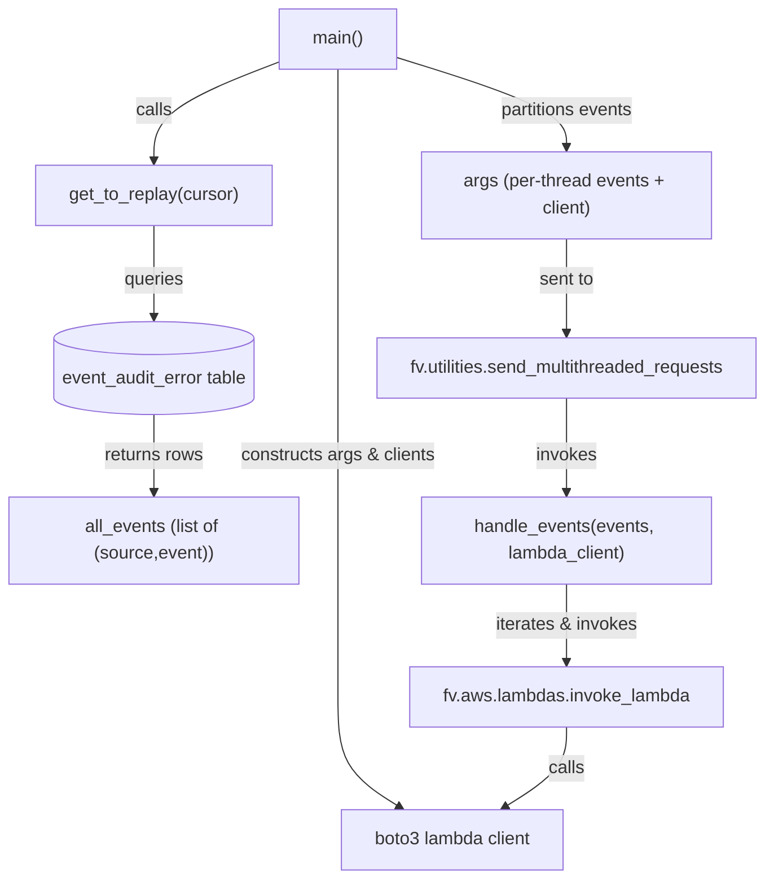
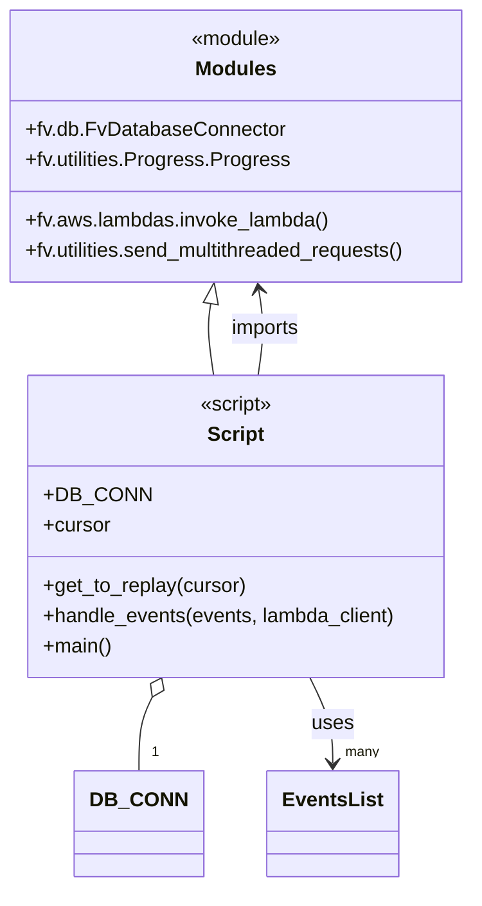

# Diagram: common/monitoring/scripts/replay.py

> Auto-generated by Obscura crawlers

## Diagram 1

### SVG

<svg id="container" width="699.9375" xmlns="http://www.w3.org/2000/svg" class="flowchart" height="787.9293212890625" viewBox="0 0 699.9375 787.9293212890625" role="graphics-document document" aria-roledescription="flowchart-v2"><g><marker id="container_flowchart-v2-pointEnd" class="marker flowchart-v2" viewBox="0 0 10 10" refX="5" refY="5" markerUnits="userSpaceOnUse" markerWidth="8" markerHeight="8" orient="auto"><path d="M 0 0 L 10 5 L 0 10 z" class="arrowMarkerPath" style="stroke-width: 1; stroke-dasharray: 1, 0;"></path></marker><marker id="container_flowchart-v2-pointStart" class="marker flowchart-v2" viewBox="0 0 10 10" refX="4.5" refY="5" markerUnits="userSpaceOnUse" markerWidth="8" markerHeight="8" orient="auto"><path d="M 0 5 L 10 10 L 10 0 z" class="arrowMarkerPath" style="stroke-width: 1; stroke-dasharray: 1, 0;"></path></marker><marker id="container_flowchart-v2-circleEnd" class="marker flowchart-v2" viewBox="0 0 10 10" refX="11" refY="5" markerUnits="userSpaceOnUse" markerWidth="11" markerHeight="11" orient="auto"><circle cx="5" cy="5" r="5" class="arrowMarkerPath" style="stroke-width: 1; stroke-dasharray: 1, 0;"></circle></marker><marker id="container_flowchart-v2-circleStart" class="marker flowchart-v2" viewBox="0 0 10 10" refX="-1" refY="5" markerUnits="userSpaceOnUse" markerWidth="11" markerHeight="11" orient="auto"><circle cx="5" cy="5" r="5" class="arrowMarkerPath" style="stroke-width: 1; stroke-dasharray: 1, 0;"></circle></marker><marker id="container_flowchart-v2-crossEnd" class="marker cross flowchart-v2" viewBox="0 0 11 11" refX="12" refY="5.2" markerUnits="userSpaceOnUse" markerWidth="11" markerHeight="11" orient="auto"><path d="M 1,1 l 9,9 M 10,1 l -9,9" class="arrowMarkerPath" style="stroke-width: 2; stroke-dasharray: 1, 0;"></path></marker><marker id="container_flowchart-v2-crossStart" class="marker cross flowchart-v2" viewBox="0 0 11 11" refX="-1" refY="5.2" markerUnits="userSpaceOnUse" markerWidth="11" markerHeight="11" orient="auto"><path d="M 1,1 l 9,9 M 10,1 l -9,9" class="arrowMarkerPath" style="stroke-width: 2; stroke-dasharray: 1, 0;"></path></marker><g class="root"><g class="clusters"></g><g class="edgePaths"><path d="M249.656,55.691L231.047,62.909C212.438,70.127,175.219,84.564,156.609,99.282C138,114,138,129,138,136.5L138,144" id="L_Main_GetToReplay_0" class="edge-thickness-normal edge-pattern-solid edge-thickness-normal edge-pattern-solid flowchart-link" style=";" data-edge="true" data-et="edge" data-id="L_Main_GetToReplay_0" data-points="W3sieCI6MjQ5LjY1NjI1LCJ5Ijo1NS42OTA5MDkwOTA5MDkwOX0seyJ4IjoxMzgsInkiOjk5fSx7IngiOjEzOCwieSI6MTQ4fV0=" marker-end="url(#container_flowchart-v2-pointEnd)"></path><path d="M303,62L303,68.167C303,74.333,303,86.667,303,105.5C303,124.333,303,149.667,303,175C303,200.333,303,225.667,303,251.494C303,277.322,303,303.643,303,329.965C303,356.286,303,382.608,303,408.435C303,434.263,303,459.596,303,484.929C303,510.263,303,535.596,303,558.929C303,582.263,303,603.596,303,624.929C303,646.263,303,667.596,312.641,684.085C322.283,700.573,341.565,712.218,351.207,718.04L360.848,723.862" id="L_Main_LambdaClient_0" class="edge-thickness-normal edge-pattern-solid edge-thickness-normal edge-pattern-solid flowchart-link" style=";" data-edge="true" data-et="edge" data-id="L_Main_LambdaClient_0" data-points="W3sieCI6MzAzLCJ5Ijo2Mn0seyJ4IjozMDMsInkiOjk5fSx7IngiOjMwMywieSI6MTc1fSx7IngiOjMwMywieSI6MjUxfSx7IngiOjMwMywieSI6MzI5Ljk2NDY2NDQ1OTIyODV9LHsieCI6MzAzLCJ5Ijo0MDguOTI5MzI4OTE4NDU3MDN9LHsieCI6MzAzLCJ5Ijo0ODQuOTI5MzI4OTE4NDU3MDN9LHsieCI6MzAzLCJ5Ijo1NjAuOTI5MzI4OTE4NDU3fSx7IngiOjMwMywieSI6NjI0LjkyOTMyODkxODQ1N30seyJ4IjozMDMsInkiOjY4OC45MjkzMjg5MTg0NTd9LHsieCI6MzY0LjI3MjIxNjc5Njg3NSwieSI6NzI1LjkyOTMyODkxODQ1N31d" marker-end="url(#container_flowchart-v2-pointEnd)"></path><path d="M138,202L138,210.167C138,218.333,138,234.667,138,248.333C138,262,138,273,138,278.5L138,284" id="L_GetToReplay_DB_0" class="edge-thickness-normal edge-pattern-solid edge-thickness-normal edge-pattern-solid flowchart-link" style=";" data-edge="true" data-et="edge" data-id="L_GetToReplay_DB_0" data-points="W3sieCI6MTM4LCJ5IjoyMDJ9LHsieCI6MTM4LCJ5IjoyNTF9LHsieCI6MTM4LCJ5IjoyODh9XQ==" marker-end="url(#container_flowchart-v2-pointEnd)"></path><path d="M138,371.929L138,378.096C138,384.263,138,396.596,138,408.263C138,419.929,138,430.929,138,436.429L138,441.929" id="L_DB_EventsList_0" class="edge-thickness-normal edge-pattern-solid edge-thickness-normal edge-pattern-solid flowchart-link" style=";" data-edge="true" data-et="edge" data-id="L_DB_EventsList_0" data-points="W3sieCI6MTM4LCJ5IjozNzEuOTI5MzI4OTE4NDU3MDN9LHsieCI6MTM4LCJ5Ijo0MDguOTI5MzI4OTE4NDU3MDN9LHsieCI6MTM4LCJ5Ijo0NDUuOTI5MzI4OTE4NDU3MDN9XQ==" marker-end="url(#container_flowchart-v2-pointEnd)"></path><path d="M356.344,51.106L382.781,59.088C409.219,67.071,462.094,83.035,488.531,96.518C514.969,110,514.969,121,514.969,126.5L514.969,132" id="L_Main_Threads_0" class="edge-thickness-normal edge-pattern-solid edge-thickness-normal edge-pattern-solid flowchart-link" style=";" data-edge="true" data-et="edge" data-id="L_Main_Threads_0" data-points="W3sieCI6MzU2LjM0Mzc1LCJ5Ijo1MS4xMDYxNDc3MjIyNDY3OX0seyJ4Ijo1MTQuOTY4NzUsInkiOjk5fSx7IngiOjUxNC45Njg3NSwieSI6MTM2fV0=" marker-end="url(#container_flowchart-v2-pointEnd)"></path><path d="M514.969,214L514.969,220.167C514.969,226.333,514.969,238.667,514.969,252.827C514.969,266.988,514.969,282.976,514.969,290.971L514.969,298.965" id="L_Threads_Multithread_0" class="edge-thickness-normal edge-pattern-solid edge-thickness-normal edge-pattern-solid flowchart-link" style=";" data-edge="true" data-et="edge" data-id="L_Threads_Multithread_0" data-points="W3sieCI6NTE0Ljk2ODc1LCJ5IjoyMTR9LHsieCI6NTE0Ljk2ODc1LCJ5IjoyNTF9LHsieCI6NTE0Ljk2ODc1LCJ5IjozMDIuOTY0NjY0NDU5MjI4NX1d" marker-end="url(#container_flowchart-v2-pointEnd)"></path><path d="M514.969,356.965L514.969,365.625C514.969,374.286,514.969,391.608,514.969,405.769C514.969,419.929,514.969,430.929,514.969,436.429L514.969,441.929" id="L_Multithread_Handler_0" class="edge-thickness-normal edge-pattern-solid edge-thickness-normal edge-pattern-solid flowchart-link" style=";" data-edge="true" data-et="edge" data-id="L_Multithread_Handler_0" data-points="W3sieCI6NTE0Ljk2ODc1LCJ5IjozNTYuOTY0NjY0NDU5MjI4NX0seyJ4Ijo1MTQuOTY4NzUsInkiOjQwOC45MjkzMjg5MTg0NTcwM30seyJ4Ijo1MTQuOTY4NzUsInkiOjQ0NS45MjkzMjg5MTg0NTcwM31d" marker-end="url(#container_flowchart-v2-pointEnd)"></path><path d="M514.969,523.929L514.969,530.096C514.969,536.263,514.969,548.596,514.969,560.263C514.969,571.929,514.969,582.929,514.969,588.429L514.969,593.929" id="L_Handler_InvokeLambda_0" class="edge-thickness-normal edge-pattern-solid edge-thickness-normal edge-pattern-solid flowchart-link" style=";" data-edge="true" data-et="edge" data-id="L_Handler_InvokeLambda_0" data-points="W3sieCI6NTE0Ljk2ODc1LCJ5Ijo1MjMuOTI5MzI4OTE4NDU3fSx7IngiOjUxNC45Njg3NSwieSI6NTYwLjkyOTMyODkxODQ1N30seyJ4Ijo1MTQuOTY4NzUsInkiOjU5Ny45MjkzMjg5MTg0NTd9XQ==" marker-end="url(#container_flowchart-v2-pointEnd)"></path><path d="M514.969,651.929L514.969,658.096C514.969,664.263,514.969,676.596,505.327,688.585C495.686,700.573,476.403,712.218,466.762,718.04L457.121,723.862" id="L_InvokeLambda_LambdaClient_0" class="edge-thickness-normal edge-pattern-solid edge-thickness-normal edge-pattern-solid flowchart-link" style=";" data-edge="true" data-et="edge" data-id="L_InvokeLambda_LambdaClient_0" data-points="W3sieCI6NTE0Ljk2ODc1LCJ5Ijo2NTEuOTI5MzI4OTE4NDU3fSx7IngiOjUxNC45Njg3NSwieSI6Njg4LjkyOTMyODkxODQ1N30seyJ4Ijo0NTMuNjk2NTMzMjAzMTI1LCJ5Ijo3MjUuOTI5MzI4OTE4NDU3fV0=" marker-end="url(#container_flowchart-v2-pointEnd)"></path></g><g class="edgeLabels"><g class="edgeLabel" transform="translate(138, 99)"><g class="label" data-id="L_Main_GetToReplay_0" transform="translate(-16.4453125, -12)"><foreignObject width="32.890625" height="24">

calls

</foreignObject></g></g><g class="edgeLabel" transform="translate(303, 408.92932891845703)"><g class="label" data-id="L_Main_LambdaClient_0" transform="translate(-89.2890625, -12)"><foreignObject width="178.578125" height="24">

constructs args &amp; clients

</foreignObject></g></g><g class="edgeLabel" transform="translate(138, 251)"><g class="label" data-id="L_GetToReplay_DB_0" transform="translate(-27.2421875, -12)"><foreignObject width="54.484375" height="24">

queries

</foreignObject></g></g><g class="edgeLabel" transform="translate(138, 408.92932891845703)"><g class="label" data-id="L_DB_EventsList_0" transform="translate(-45.3828125, -12)"><foreignObject width="90.765625" height="24">

returns rows

</foreignObject></g></g><g class="edgeLabel" transform="translate(514.96875, 99)"><g class="label" data-id="L_Main_Threads_0" transform="translate(-61.5234375, -12)"><foreignObject width="123.046875" height="24">

partitions events

</foreignObject></g></g><g class="edgeLabel" transform="translate(514.96875, 251)"><g class="label" data-id="L_Threads_Multithread_0" transform="translate(-25.234375, -12)"><foreignObject width="50.46875" height="24">

sent to

</foreignObject></g></g><g class="edgeLabel" transform="translate(514.96875, 408.92932891845703)"><g class="label" data-id="L_Multithread_Handler_0" transform="translate(-27.5859375, -12)"><foreignObject width="55.171875" height="24">

invokes

</foreignObject></g></g><g class="edgeLabel" transform="translate(514.96875, 560.929328918457)"><g class="label" data-id="L_Handler_InvokeLambda_0" transform="translate(-65.0703125, -12)"><foreignObject width="130.140625" height="24">

iterates &amp; invokes

</foreignObject></g></g><g class="edgeLabel" transform="translate(514.96875, 688.929328918457)"><g class="label" data-id="L_InvokeLambda_LambdaClient_0" transform="translate(-16.4453125, -12)"><foreignObject width="32.890625" height="24">

calls

</foreignObject></g></g></g><g class="nodes"><g class="node default" id="flowchart-Main-0" transform="translate(303, 35)"><rect class="basic label-container" style="" x="-53.34375" y="-27" width="106.6875" height="54"></rect><g class="label" style="" transform="translate(-23.34375, -12)"><rect></rect><foreignObject width="46.6875" height="24">

main()

</foreignObject></g></g><g class="node default" id="flowchart-GetToReplay-1" transform="translate(138, 175)"><rect class="basic label-container" style="" x="-107.203125" y="-27" width="214.40625" height="54"></rect><g class="label" style="" transform="translate(-77.203125, -12)"><rect></rect><foreignObject width="154.40625" height="24">

get_to_replay(cursor)

</foreignObject></g></g><g class="node default" id="flowchart-LambdaClient-3" transform="translate(408.984375, 752.929328918457)"><rect class="basic label-container" style="" x="-102.703125" y="-27" width="205.40625" height="54"></rect><g class="label" style="" transform="translate(-72.703125, -12)"><rect></rect><foreignObject width="145.40625" height="24">

boto3 lambda client

</foreignObject></g></g><g class="node default" id="flowchart-DB-5" transform="translate(138, 329.9646644592285)"><path d="M0,14.976444644915551 a93.3828125,14.976444644915551 0,0,0 186.765625,0 a93.3828125,14.976444644915551 0,0,0 -186.765625,0 l0,53.97644464491555 a93.3828125,14.976444644915551 0,0,0 186.765625,0 l0,-53.97644464491555" class="basic label-container" style="" transform="translate(-93.3828125, -41.964666967373326)"></path><g class="label" style="" transform="translate(-85.8828125, -2)"><rect></rect><foreignObject width="171.765625" height="24">

event_audit_error table

</foreignObject></g></g><g class="node default" id="flowchart-EventsList-7" transform="translate(138, 484.92932891845703)"><rect class="basic label-container" style="" x="-130" y="-39" width="260" height="78"></rect><g class="label" style="" transform="translate(-100, -24)"><rect></rect><foreignObject width="200" height="48">

all_events (list of (source,event))

</foreignObject></g></g><g class="node default" id="flowchart-Threads-9" transform="translate(514.96875, 175)"><rect class="basic label-container" style="" x="-130" y="-39" width="260" height="78"></rect><g class="label" style="" transform="translate(-100, -24)"><rect></rect><foreignObject width="200" height="48">

args (per-thread events + client)

</foreignObject></g></g><g class="node default" id="flowchart-Multithread-11" transform="translate(514.96875, 329.9646644592285)"><rect class="basic label-container" style="" x="-176.96875" y="-27" width="353.9375" height="54"></rect><g class="label" style="" transform="translate(-146.96875, -12)"><rect></rect><foreignObject width="293.9375" height="24">

fv.utilities.send_multithreaded_requests

</foreignObject></g></g><g class="node default" id="flowchart-Handler-13" transform="translate(514.96875, 484.92932891845703)"><rect class="basic label-container" style="" x="-130" y="-39" width="260" height="78"></rect><g class="label" style="" transform="translate(-100, -24)"><rect></rect><foreignObject width="200" height="48">

handle_events(events, lambda_client)

</foreignObject></g></g><g class="node default" id="flowchart-InvokeLambda-15" transform="translate(514.96875, 624.929328918457)"><rect class="basic label-container" style="" x="-142.0703125" y="-27" width="284.140625" height="54"></rect><g class="label" style="" transform="translate(-112.0703125, -12)"><rect></rect><foreignObject width="224.140625" height="24">

fv.aws.lambdas.invoke_lambda

</foreignObject></g></g></g></g></g></svg>

## Diagram 2

### SVG

<svg id="container" width="388.6640625" xmlns="http://www.w3.org/2000/svg" class="classDiagram" height="704" viewBox="0 0 388.6640625 704" role="graphics-document document" aria-roledescription="class"><g><defs><marker id="container_class-aggregationStart" class="marker aggregation class" refX="18" refY="7" markerWidth="190" markerHeight="240" orient="auto"><path d="M 18,7 L9,13 L1,7 L9,1 Z"></path></marker></defs><defs><marker id="container_class-aggregationEnd" class="marker aggregation class" refX="1" refY="7" markerWidth="20" markerHeight="28" orient="auto"><path d="M 18,7 L9,13 L1,7 L9,1 Z"></path></marker></defs><defs><marker id="container_class-extensionStart" class="marker extension class" refX="18" refY="7" markerWidth="190" markerHeight="240" orient="auto"><path d="M 1,7 L18,13 V 1 Z"></path></marker></defs><defs><marker id="container_class-extensionEnd" class="marker extension class" refX="1" refY="7" markerWidth="20" markerHeight="28" orient="auto"><path d="M 1,1 V 13 L18,7 Z"></path></marker></defs><defs><marker id="container_class-compositionStart" class="marker composition class" refX="18" refY="7" markerWidth="190" markerHeight="240" orient="auto"><path d="M 18,7 L9,13 L1,7 L9,1 Z"></path></marker></defs><defs><marker id="container_class-compositionEnd" class="marker composition class" refX="1" refY="7" markerWidth="20" markerHeight="28" orient="auto"><path d="M 18,7 L9,13 L1,7 L9,1 Z"></path></marker></defs><defs><marker id="container_class-dependencyStart" class="marker dependency class" refX="6" refY="7" markerWidth="190" markerHeight="240" orient="auto"><path d="M 5,7 L9,13 L1,7 L9,1 Z"></path></marker></defs><defs><marker id="container_class-dependencyEnd" class="marker dependency class" refX="13" refY="7" markerWidth="20" markerHeight="28" orient="auto"><path d="M 18,7 L9,13 L14,7 L9,1 Z"></path></marker></defs><defs><marker id="container_class-lollipopStart" class="marker lollipop class" refX="13" refY="7" markerWidth="190" markerHeight="240" orient="auto"><circle stroke="black" fill="transparent" cx="7" cy="7" r="6"></circle></marker></defs><defs><marker id="container_class-lollipopEnd" class="marker lollipop class" refX="1" refY="7" markerWidth="190" markerHeight="240" orient="auto"><circle stroke="black" fill="transparent" cx="7" cy="7" r="6"></circle></marker></defs><g class="root"><g class="clusters"></g><g class="edgePaths"><path d="M173.532,241.016L172.978,244.347C172.424,247.677,171.315,254.339,171.709,263.836C172.102,273.333,173.997,285.667,174.945,291.833L175.893,298" id="id_Modules_Script_1" class="edge-thickness-normal edge-pattern-solid relation" style=";;;" data-edge="true" data-et="edge" data-id="id_Modules_Script_1" data-points="W3sieCI6MTc2LjM2MzA2NTczMjc1ODYzLCJ5IjoyMjR9LHsieCI6MTcwLjIwNzAzMTI1LCJ5IjoyNjF9LHsieCI6MTc1Ljg5MjU0MDgwNDE0MDE0LCJ5IjoyOTh9XQ==" marker-start="url(#container_class-extensionStart)"></path><path d="M131.349,553.646L129.696,557.205C128.044,560.764,124.739,567.882,123.086,577.608C121.434,587.333,121.434,599.667,121.434,605.833L121.434,612" id="id_Script_DB_CONN_2" class="edge-thickness-normal edge-pattern-solid relation" style=";;;" data-edge="true" data-et="edge" data-id="id_Script_DB_CONN_2" data-points="W3sieCI6MTM4LjYxMzQ4MDI5NDU4NiwieSI6NTM4fSx7IngiOjEyMS40MzM1OTM3NSwieSI6NTc1fSx7IngiOjEyMS40MzM1OTM3NSwieSI6NjEyfV0=" marker-start="url(#container_class-aggregationStart)"></path><path d="M250.051,538L252.914,544.167C255.777,550.333,261.504,562.667,264.367,574C267.23,585.333,267.23,595.667,267.23,600.833L267.23,606" id="id_Script_EventsList_3" class="edge-thickness-normal edge-pattern-solid relation" style=";;;" data-edge="true" data-et="edge" data-id="id_Script_EventsList_3" data-points="W3sieCI6MjUwLjA1MDU4MjIwNTQxNCwieSI6NTM4fSx7IngiOjI2Ny4yMzA0Njg3NSwieSI6NTc1fSx7IngiOjI2Ny4yMzA0Njg3NSwieSI6NjEyfV0=" marker-end="url(#container_class-dependencyEnd)"></path><path d="M212.772,298L213.719,291.833C214.667,285.667,216.562,273.333,216.648,261.986C216.733,250.64,215.01,240.279,214.148,235.099L213.286,229.919" id="id_Script_Modules_4" class="edge-thickness-normal edge-pattern-solid relation" style=";;;" data-edge="true" data-et="edge" data-id="id_Script_Modules_4" data-points="W3sieCI6MjEyLjc3MTUyMTY5NTg1OTg2LCJ5IjoyOTh9LHsieCI6MjE4LjQ1NzAzMTI1LCJ5IjoyNjF9LHsieCI6MjEyLjMwMDk5Njc2NzI0MTM3LCJ5IjoyMjR9XQ==" marker-end="url(#container_class-dependencyEnd)"></path></g><g class="edgeLabels"><g class="edgeLabel"><g class="label" data-id="id_Modules_Script_1" transform="translate(0, 0)"><foreignObject width="0" height="0">

</foreignObject></g></g><g class="edgeLabel"><g class="label" data-id="id_Script_DB_CONN_2" transform="translate(0, 0)"><foreignObject width="0" height="0">

</foreignObject></g></g><g class="edgeLabel" transform="translate(267.23046875, 575)"><g class="label" data-id="id_Script_EventsList_3" transform="translate(-16.4921875, -12)"><foreignObject width="32.984375" height="24">

uses

</foreignObject></g></g><g class="edgeLabel" transform="translate(218.45093, 260.96333)"><g class="label" data-id="id_Script_Modules_4" transform="translate(-28.25, -12)"><foreignObject width="56.5" height="24">

imports

</foreignObject></g></g><g class="edgeTerminals" transform="translate(131.4335918749999, 589.4999983928572)"><g class="inner" transform="translate(0, 0)"></g><foreignObject style="width: 9px; height: 12px;">
1
</foreignObject></g><g class="edgeTerminals" transform="translate(277.230469375, 589.5000005357143)"><g class="inner" transform="translate(0, 0)"></g><foreignObject style="width: 36px; height: 12px;">
many
</foreignObject></g></g><g class="nodes"><g class="node default" id="classId-Modules-0" transform="translate(194.33203125, 116)"><g class="basic label-container"><path d="M-186.33203125 -108 L186.33203125 -108 L186.33203125 108 L-186.33203125 108" stroke="none" stroke-width="0" fill="#ECECFF" style=""></path><path d="M-186.33203125 -108 C-86.73946935777059 -108, 12.853092534458824 -108, 186.33203125 -108 M-186.33203125 -108 C-62.82427671287324 -108, 60.683477824253515 -108, 186.33203125 -108 M186.33203125 -108 C186.33203125 -55.25183596449441, 186.33203125 -2.5036719289888225, 186.33203125 108 M186.33203125 -108 C186.33203125 -58.72347070776501, 186.33203125 -9.44694141553002, 186.33203125 108 M186.33203125 108 C78.45461520856976 108, -29.422800832860474 108, -186.33203125 108 M186.33203125 108 C43.04336013448025 108, -100.2453109810395 108, -186.33203125 108 M-186.33203125 108 C-186.33203125 61.96587239637424, -186.33203125 15.931744792748475, -186.33203125 -108 M-186.33203125 108 C-186.33203125 49.06323389842303, -186.33203125 -9.873532203153943, -186.33203125 -108" stroke="#9370DB" stroke-width="1.3" fill="none" stroke-dasharray="0 0" style=""></path></g><g class="annotation-group text" transform="translate(-36.6015625, -84)"><g class="label" style="" transform="translate(0,-12)"><foreignObject width="73.203125" height="24">

«module»

</foreignObject></g></g><g class="label-group text" transform="translate(-30.953125, -60)"><g class="label" style="font-weight: bolder" transform="translate(0,-12)"><foreignObject width="61.90625" height="24">

Modules

</foreignObject></g></g><g class="members-group text" transform="translate(-174.33203125, -12)"><g class="label" style="" transform="translate(0,-12)"><foreignObject width="203.40625" height="24">

+fv.db.FvDatabaseConnector

</foreignObject></g><g class="label" style="" transform="translate(0,12)"><foreignObject width="210.0625" height="24">

+fv.utilities.Progress.Progress

</foreignObject></g></g><g class="methods-group text" transform="translate(-174.33203125, 60)"><g class="label" style="" transform="translate(0,-12)"><foreignObject width="242.25" height="24">

+fv.aws.lambdas.invoke_lambda()

</foreignObject></g><g class="label" style="" transform="translate(0,12)"><foreignObject width="312.0625" height="24">

+fv.utilities.send_multithreaded_requests()

</foreignObject></g></g><g class="divider" style=""><path d="M-186.33203125 -36 C-98.08993035383426 -36, -9.847829457668524 -36, 186.33203125 -36 M-186.33203125 -36 C-79.46390792892505 -36, 27.404215392149894 -36, 186.33203125 -36" stroke="#9370DB" stroke-width="1.3" fill="none" stroke-dasharray="0 0" style=""></path></g><g class="divider" style=""><path d="M-186.33203125 36 C-80.54791475697827 36, 25.236201736043455 36, 186.33203125 36 M-186.33203125 36 C-69.88358313836805 36, 46.564864973263894 36, 186.33203125 36" stroke="#9370DB" stroke-width="1.3" fill="none" stroke-dasharray="0 0" style=""></path></g></g><g class="node default" id="classId-Script-1" transform="translate(194.33203125, 418)"><g class="basic label-container"><path d="M-168.64453125 -120 L168.64453125 -120 L168.64453125 120 L-168.64453125 120" stroke="none" stroke-width="0" fill="#ECECFF" style=""></path><path d="M-168.64453125 -120 C-51.87248998113502 -120, 64.89955128772996 -120, 168.64453125 -120 M-168.64453125 -120 C-79.39731599403052 -120, 9.849899261938958 -120, 168.64453125 -120 M168.64453125 -120 C168.64453125 -54.445480426072066, 168.64453125 11.109039147855867, 168.64453125 120 M168.64453125 -120 C168.64453125 -44.47962460124366, 168.64453125 31.040750797512686, 168.64453125 120 M168.64453125 120 C76.2438766377433 120, -16.156777974513403 120, -168.64453125 120 M168.64453125 120 C94.16854329535443 120, 19.69255534070885 120, -168.64453125 120 M-168.64453125 120 C-168.64453125 59.334181511862255, -168.64453125 -1.3316369762754903, -168.64453125 -120 M-168.64453125 120 C-168.64453125 70.57735626188344, -168.64453125 21.15471252376689, -168.64453125 -120" stroke="#9370DB" stroke-width="1.3" fill="none" stroke-dasharray="0 0" style=""></path></g><g class="annotation-group text" transform="translate(-29.6796875, -96)"><g class="label" style="" transform="translate(0,-12)"><foreignObject width="59.359375" height="24">

«script»

</foreignObject></g></g><g class="label-group text" transform="translate(-21.7421875, -72)"><g class="label" style="font-weight: bolder" transform="translate(0,-12)"><foreignObject width="43.484375" height="24">

Script

</foreignObject></g></g><g class="members-group text" transform="translate(-156.64453125, -24)"><g class="label" style="" transform="translate(0,-12)"><foreignObject width="76.953125" height="24">

+DB_CONN

</foreignObject></g><g class="label" style="" transform="translate(0,12)"><foreignObject width="53.71875" height="24">

+cursor

</foreignObject></g></g><g class="methods-group text" transform="translate(-156.64453125, 48)"><g class="label" style="" transform="translate(0,-12)"><foreignObject width="162.390625" height="24">

+get_to_replay(cursor)

</foreignObject></g><g class="label" style="" transform="translate(0,12)"><foreignObject width="283.609375" height="24">

+handle_events(events, lambda_client)

</foreignObject></g><g class="label" style="" transform="translate(0,36)"><foreignObject width="54.65625" height="24">

+main()

</foreignObject></g></g><g class="divider" style=""><path d="M-168.64453125 -48 C-95.10624137457872 -48, -21.56795149915743 -48, 168.64453125 -48 M-168.64453125 -48 C-36.77244325683611 -48, 95.09964473632778 -48, 168.64453125 -48" stroke="#9370DB" stroke-width="1.3" fill="none" stroke-dasharray="0 0" style=""></path></g><g class="divider" style=""><path d="M-168.64453125 24 C-98.51826850962433 24, -28.39200576924867 24, 168.64453125 24 M-168.64453125 24 C-55.859911245586574 24, 56.92470875882685 24, 168.64453125 24" stroke="#9370DB" stroke-width="1.3" fill="none" stroke-dasharray="0 0" style=""></path></g></g><g class="node default" id="classId-DB_CONN-2" transform="translate(121.43359375, 654)"><g class="basic label-container"><path d="M-46.40625 -42 L46.40625 -42 L46.40625 42 L-46.40625 42" stroke="none" stroke-width="0" fill="#ECECFF" style=""></path><path d="M-46.40625 -42 C-12.97969446010518 -42, 20.44686107978964 -42, 46.40625 -42 M-46.40625 -42 C-15.524105244867158 -42, 15.358039510265684 -42, 46.40625 -42 M46.40625 -42 C46.40625 -11.8037646374897, 46.40625 18.3924707250206, 46.40625 42 M46.40625 -42 C46.40625 -18.6239342456103, 46.40625 4.752131508779399, 46.40625 42 M46.40625 42 C11.035734544994796 42, -24.33478091001041 42, -46.40625 42 M46.40625 42 C16.979337623376658 42, -12.447574753246684 42, -46.40625 42 M-46.40625 42 C-46.40625 14.63927932251411, -46.40625 -12.72144135497178, -46.40625 -42 M-46.40625 42 C-46.40625 15.177770023709154, -46.40625 -11.644459952581691, -46.40625 -42" stroke="#9370DB" stroke-width="1.3" fill="none" stroke-dasharray="0 0" style=""></path></g><g class="annotation-group text" transform="translate(0, -18)"></g><g class="label-group text" transform="translate(-34.40625, -18)"><g class="label" style="font-weight: bolder" transform="translate(0,-12)"><foreignObject width="68.8125" height="24">

DB_CONN

</foreignObject></g></g><g class="members-group text" transform="translate(-34.40625, 30)"></g><g class="methods-group text" transform="translate(-34.40625, 60)"></g><g class="divider" style=""><path d="M-46.40625 6 C-9.862463415914462 6, 26.681323168171076 6, 46.40625 6 M-46.40625 6 C-27.481481659035794 6, -8.556713318071587 6, 46.40625 6" stroke="#9370DB" stroke-width="1.3" fill="none" stroke-dasharray="0 0" style=""></path></g><g class="divider" style=""><path d="M-46.40625 24 C-27.484842281569353 24, -8.563434563138706 24, 46.40625 24 M-46.40625 24 C-15.193847704302161 24, 16.018554591395677 24, 46.40625 24" stroke="#9370DB" stroke-width="1.3" fill="none" stroke-dasharray="0 0" style=""></path></g></g><g class="node default" id="classId-EventsList-3" transform="translate(267.23046875, 654)"><g class="basic label-container"><path d="M-49.390625 -42 L49.390625 -42 L49.390625 42 L-49.390625 42" stroke="none" stroke-width="0" fill="#ECECFF" style=""></path><path d="M-49.390625 -42 C-11.427871103901332 -42, 26.534882792197337 -42, 49.390625 -42 M-49.390625 -42 C-20.374342612321698 -42, 8.641939775356605 -42, 49.390625 -42 M49.390625 -42 C49.390625 -19.564029287847408, 49.390625 2.8719414243051844, 49.390625 42 M49.390625 -42 C49.390625 -23.946270300376533, 49.390625 -5.892540600753065, 49.390625 42 M49.390625 42 C13.523302273382527 42, -22.344020453234947 42, -49.390625 42 M49.390625 42 C24.783069113431615 42, 0.1755132268632309 42, -49.390625 42 M-49.390625 42 C-49.390625 22.695252065005498, -49.390625 3.3905041300109957, -49.390625 -42 M-49.390625 42 C-49.390625 18.437367742887627, -49.390625 -5.125264514224746, -49.390625 -42" stroke="#9370DB" stroke-width="1.3" fill="none" stroke-dasharray="0 0" style=""></path></g><g class="annotation-group text" transform="translate(0, -18)"></g><g class="label-group text" transform="translate(-37.390625, -18)"><g class="label" style="font-weight: bolder" transform="translate(0,-12)"><foreignObject width="74.78125" height="24">

EventsList

</foreignObject></g></g><g class="members-group text" transform="translate(-37.390625, 30)"></g><g class="methods-group text" transform="translate(-37.390625, 60)"></g><g class="divider" style=""><path d="M-49.390625 6 C-20.8215318295191 6, 7.747561340961802 6, 49.390625 6 M-49.390625 6 C-28.16753801427626 6, -6.944451028552521 6, 49.390625 6" stroke="#9370DB" stroke-width="1.3" fill="none" stroke-dasharray="0 0" style=""></path></g><g class="divider" style=""><path d="M-49.390625 24 C-25.9451818625451 24, -2.4997387250901966 24, 49.390625 24 M-49.390625 24 C-28.64794272766424 24, -7.905260455328481 24, 49.390625 24" stroke="#9370DB" stroke-width="1.3" fill="none" stroke-dasharray="0 0" style=""></path></g></g></g></g></g></svg>
