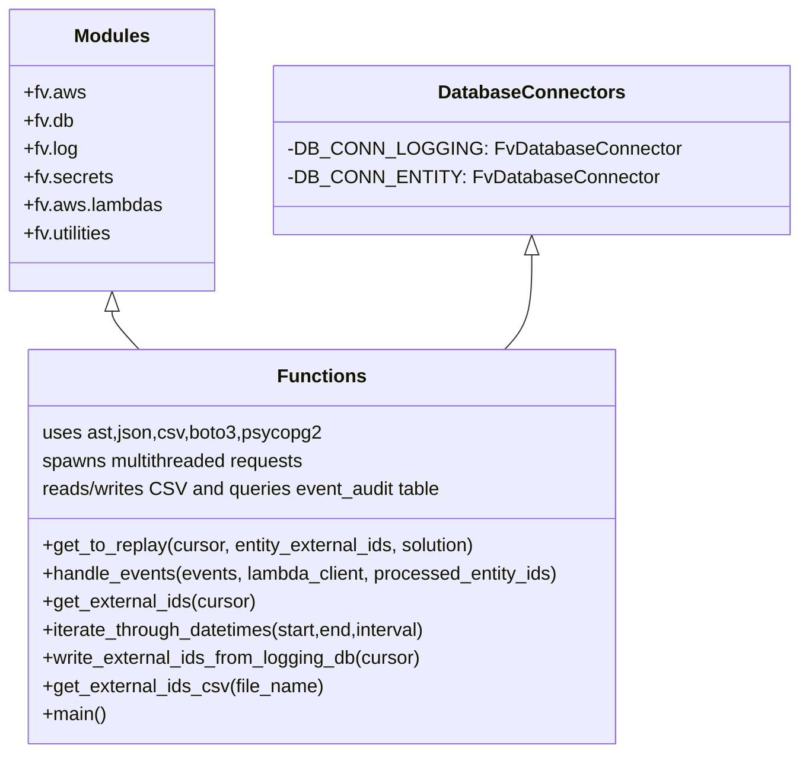

# Diagram: common/monitoring/scripts/replay_eta_shipments.py


> Auto-generated by Obscura crawlers

## Diagram 1

```mermaid
flowchart LR
    A[main()] --> B[get_external_ids_csv(file)]
    A --> C[get_to_replay(cursor, entity_external_ids, solution)]
    A --> D[write_external_ids_from_logging_db(cursor)]
    A --> E[iterate_through_datetimes(start,end)]
    A --> F[handle_events(events, lambda_client, processed_entity_ids)]
    B -->|returns| G[all_external_ids dict]
    G --> H[for solution,vins in all_external_ids]
    H --> I[fv.aws.lambdas.split_list(vins, threads)]
    I --> J[for each external_list]
    J --> C
    C --> K[DB_CONN_LOGGING.cursor.execute(query)]
    K --> L[fetchall() -> all_events]
    L --> M[split events per thread]
    M --> N[boto3_client(lambda) per thread]
    N --> O[fv.utilities.send_multithreaded_requests(handle_events,...)]
    O --> P[handle_events invokes fv.aws.lambdas.invoke_lambda]
    P --> Q[if statusCode != 200 -> append key1 to processed_entity_ids]
    D --> R[iterate through time windows]
    R --> S[query event_audit for failures]
    S --> T[write failedVinsToReplay.csv]
    E -->|used by| D
```

> SVG rendering failed for this diagram.

## Diagram 2



### SVG

<svg id="container" width="650.71875" xmlns="http://www.w3.org/2000/svg" class="classDiagram" height="642" viewBox="0 0 650.71875 642" role="graphics-document document" aria-roledescription="class"><style>#container{font-family:"trebuchet ms",verdana,arial,sans-serif;font-size:16px;fill:#333;}@keyframes edge-animation-frame{from{stroke-dashoffset:0;}}@keyframes dash{to{stroke-dashoffset:0;}}#container .edge-animation-slow{stroke-dasharray:9,5!important;stroke-dashoffset:900;animation:dash 50s linear infinite;stroke-linecap:round;}#container .edge-animation-fast{stroke-dasharray:9,5!important;stroke-dashoffset:900;animation:dash 20s linear infinite;stroke-linecap:round;}#container .error-icon{fill:#552222;}#container .error-text{fill:#552222;stroke:#552222;}#container .edge-thickness-normal{stroke-width:1px;}#container .edge-thickness-thick{stroke-width:3.5px;}#container .edge-pattern-solid{stroke-dasharray:0;}#container .edge-thickness-invisible{stroke-width:0;fill:none;}#container .edge-pattern-dashed{stroke-dasharray:3;}#container .edge-pattern-dotted{stroke-dasharray:2;}#container .marker{fill:#333333;stroke:#333333;}#container .marker.cross{stroke:#333333;}#container svg{font-family:"trebuchet ms",verdana,arial,sans-serif;font-size:16px;}#container p{margin:0;}#container g.classGroup text{fill:#9370DB;stroke:none;font-family:"trebuchet ms",verdana,arial,sans-serif;font-size:10px;}#container g.classGroup text .title{font-weight:bolder;}#container .nodeLabel,#container .edgeLabel{color:#131300;}#container .edgeLabel .label rect{fill:#ECECFF;}#container .label text{fill:#131300;}#container .labelBkg{background:#ECECFF;}#container .edgeLabel .label span{background:#ECECFF;}#container .classTitle{font-weight:bolder;}#container .node rect,#container .node circle,#container .node ellipse,#container .node polygon,#container .node path{fill:#ECECFF;stroke:#9370DB;stroke-width:1px;}#container .divider{stroke:#9370DB;stroke-width:1;}#container g.clickable{cursor:pointer;}#container g.classGroup rect{fill:#ECECFF;stroke:#9370DB;}#container g.classGroup line{stroke:#9370DB;stroke-width:1;}#container .classLabel .box{stroke:none;stroke-width:0;fill:#ECECFF;opacity:0.5;}#container .classLabel .label{fill:#9370DB;font-size:10px;}#container .relation{stroke:#333333;stroke-width:1;fill:none;}#container .dashed-line{stroke-dasharray:3;}#container .dotted-line{stroke-dasharray:1 2;}#container #compositionStart,#container .composition{fill:#333333!important;stroke:#333333!important;stroke-width:1;}#container #compositionEnd,#container .composition{fill:#333333!important;stroke:#333333!important;stroke-width:1;}#container #dependencyStart,#container .dependency{fill:#333333!important;stroke:#333333!important;stroke-width:1;}#container #dependencyStart,#container .dependency{fill:#333333!important;stroke:#333333!important;stroke-width:1;}#container #extensionStart,#container .extension{fill:transparent!important;stroke:#333333!important;stroke-width:1;}#container #extensionEnd,#container .extension{fill:transparent!important;stroke:#333333!important;stroke-width:1;}#container #aggregationStart,#container .aggregation{fill:transparent!important;stroke:#333333!important;stroke-width:1;}#container #aggregationEnd,#container .aggregation{fill:transparent!important;stroke:#333333!important;stroke-width:1;}#container #lollipopStart,#container .lollipop{fill:#ECECFF!important;stroke:#333333!important;stroke-width:1;}#container #lollipopEnd,#container .lollipop{fill:#ECECFF!important;stroke:#333333!important;stroke-width:1;}#container .edgeTerminals{font-size:11px;line-height:initial;}#container .classTitleText{text-anchor:middle;font-size:18px;fill:#333;}#container .label-icon{display:inline-block;height:1em;overflow:visible;vertical-align:-0.125em;}#container .node .label-icon path{fill:currentColor;stroke:revert;stroke-width:revert;}#container :root{--mermaid-font-family:"trebuchet ms",verdana,arial,sans-serif;}</style><g><defs><marker id="container_class-aggregationStart" class="marker aggregation class" refX="18" refY="7" markerWidth="190" markerHeight="240" orient="auto"><path d="M 18,7 L9,13 L1,7 L9,1 Z"></path></marker></defs><defs><marker id="container_class-aggregationEnd" class="marker aggregation class" refX="1" refY="7" markerWidth="20" markerHeight="28" orient="auto"><path d="M 18,7 L9,13 L1,7 L9,1 Z"></path></marker></defs><defs><marker id="container_class-extensionStart" class="marker extension class" refX="18" refY="7" markerWidth="190" markerHeight="240" orient="auto"><path d="M 1,7 L18,13 V 1 Z"></path></marker></defs><defs><marker id="container_class-extensionEnd" class="marker extension class" refX="1" refY="7" markerWidth="20" markerHeight="28" orient="auto"><path d="M 1,1 V 13 L18,7 Z"></path></marker></defs><defs><marker id="container_class-compositionStart" class="marker composition class" refX="18" refY="7" markerWidth="190" markerHeight="240" orient="auto"><path d="M 18,7 L9,13 L1,7 L9,1 Z"></path></marker></defs><defs><marker id="container_class-compositionEnd" class="marker composition class" refX="1" refY="7" markerWidth="20" markerHeight="28" orient="auto"><path d="M 18,7 L9,13 L1,7 L9,1 Z"></path></marker></defs><defs><marker id="container_class-dependencyStart" class="marker dependency class" refX="6" refY="7" markerWidth="190" markerHeight="240" orient="auto"><path d="M 5,7 L9,13 L1,7 L9,1 Z"></path></marker></defs><defs><marker id="container_class-dependencyEnd" class="marker dependency class" refX="13" refY="7" markerWidth="20" markerHeight="28" orient="auto"><path d="M 18,7 L9,13 L14,7 L9,1 Z"></path></marker></defs><defs><marker id="container_class-lollipopStart" class="marker lollipop class" refX="13" refY="7" markerWidth="190" markerHeight="240" orient="auto"><circle stroke="black" fill="transparent" cx="7" cy="7" r="6"></circle></marker></defs><defs><marker id="container_class-lollipopEnd" class="marker lollipop class" refX="1" refY="7" markerWidth="190" markerHeight="240" orient="auto"><circle stroke="black" fill="transparent" cx="7" cy="7" r="6"></circle></marker></defs><g class="root"><g class="clusters"></g><g class="edgePaths"><path d="M94.328,265.25L94.328,266.542C94.328,267.833,94.328,270.417,98.024,275.875C101.719,281.333,109.11,289.667,112.806,293.833L116.502,298" id="id_Modules_Functions_1" class="edge-thickness-normal edge-pattern-solid relation" style=";;;" data-edge="true" data-et="edge" data-id="id_Modules_Functions_1" data-points="W3sieCI6OTQuMzI4MTI1LCJ5IjoyNDh9LHsieCI6OTQuMzI4MTI1LCJ5IjoyNzN9LHsieCI6MTE2LjUwMTY1OTY1MDI1OTA2LCJ5IjoyOTh9XQ==" marker-start="url(#container_class-extensionStart)"></path><path d="M436.688,217.25L436.688,226.542C436.688,235.833,436.688,254.417,432.992,267.875C429.296,281.333,421.905,289.667,418.21,293.833L414.514,298" id="id_DatabaseConnectors_Functions_2" class="edge-thickness-normal edge-pattern-solid relation" style=";;;" data-edge="true" data-et="edge" data-id="id_DatabaseConnectors_Functions_2" data-points="W3sieCI6NDM2LjY4NzUsInkiOjIwMH0seyJ4Ijo0MzYuNjg3NSwieSI6MjczfSx7IngiOjQxNC41MTM5NjUzNDk3NDA5NCwieSI6Mjk4fV0=" marker-start="url(#container_class-extensionStart)"></path></g><g class="edgeLabels"><g class="edgeLabel"><g class="label" data-id="id_Modules_Functions_1" transform="translate(0, 0)"><foreignObject width="0" height="0"><div xmlns="http://www.w3.org/1999/xhtml" class="labelBkg" style="display: table-cell; white-space: nowrap; line-height: 1.5; max-width: 200px; text-align: center;"><span class="edgeLabel"></span></div></foreignObject></g></g><g class="edgeLabel"><g class="label" data-id="id_DatabaseConnectors_Functions_2" transform="translate(0, 0)"><foreignObject width="0" height="0"><div xmlns="http://www.w3.org/1999/xhtml" class="labelBkg" style="display: table-cell; white-space: nowrap; line-height: 1.5; max-width: 200px; text-align: center;"><span class="edgeLabel"></span></div></foreignObject></g></g></g><g class="nodes"><g class="node default" id="classId-Modules-0" transform="translate(94.328125, 128)"><g class="basic label-container"><path d="M-86.328125 -120 L86.328125 -120 L86.328125 120 L-86.328125 120" stroke="none" stroke-width="0" fill="#ECECFF" style=""></path><path d="M-86.328125 -120 C-27.358400861486473 -120, 31.611323277027054 -120, 86.328125 -120 M-86.328125 -120 C-43.586709738470006 -120, -0.8452944769400119 -120, 86.328125 -120 M86.328125 -120 C86.328125 -24.336107577380048, 86.328125 71.3277848452399, 86.328125 120 M86.328125 -120 C86.328125 -45.44627231753397, 86.328125 29.107455364932065, 86.328125 120 M86.328125 120 C17.285310628094123 120, -51.75750374381175 120, -86.328125 120 M86.328125 120 C41.447575973572434 120, -3.4329730528551323 120, -86.328125 120 M-86.328125 120 C-86.328125 39.68266578671677, -86.328125 -40.63466842656646, -86.328125 -120 M-86.328125 120 C-86.328125 51.08812999417857, -86.328125 -17.823740011642855, -86.328125 -120" stroke="#9370DB" stroke-width="1.3" fill="none" stroke-dasharray="0 0" style=""></path></g><g class="annotation-group text" transform="translate(0, -96)"></g><g class="label-group text" transform="translate(-30.953125, -96)"><g class="label" style="font-weight: bolder" transform="translate(0,-12)"><foreignObject width="61.90625" height="24"><div xmlns="http://www.w3.org/1999/xhtml" style="display: table-cell; white-space: nowrap; line-height: 1.5; max-width: 111px; text-align: center;"><span class="nodeLabel markdown-node-label" style=""><p>Modules</p></span></div></foreignObject></g></g><g class="members-group text" transform="translate(-74.328125, -48)"><g class="label" style="" transform="translate(0,-12)"><foreignObject width="51.75" height="24"><div xmlns="http://www.w3.org/1999/xhtml" style="display: table-cell; white-space: nowrap; line-height: 1.5; max-width: 109px; text-align: center;"><span class="nodeLabel markdown-node-label" style=""><p>+fv.aws</p></span></div></foreignObject></g><g class="label" style="" transform="translate(0,12)"><foreignObject width="43.09375" height="24"><div xmlns="http://www.w3.org/1999/xhtml" style="display: table-cell; white-space: nowrap; line-height: 1.5; max-width: 100px; text-align: center;"><span class="nodeLabel markdown-node-label" style=""><p>+fv.db</p></span></div></foreignObject></g><g class="label" style="" transform="translate(0,36)"><foreignObject width="46.453125" height="24"><div xmlns="http://www.w3.org/1999/xhtml" style="display: table-cell; white-space: nowrap; line-height: 1.5; max-width: 104px; text-align: center;"><span class="nodeLabel markdown-node-label" style=""><p>+fv.log</p></span></div></foreignObject></g><g class="label" style="" transform="translate(0,60)"><foreignObject width="75.75" height="24"><div xmlns="http://www.w3.org/1999/xhtml" style="display: table-cell; white-space: nowrap; line-height: 1.5; max-width: 133px; text-align: center;"><span class="nodeLabel markdown-node-label" style=""><p>+fv.secrets</p></span></div></foreignObject></g><g class="label" style="" transform="translate(0,84)"><foreignObject width="117.703125" height="24"><div xmlns="http://www.w3.org/1999/xhtml" style="display: table-cell; white-space: nowrap; line-height: 1.5; max-width: 175px; text-align: center;"><span class="nodeLabel markdown-node-label" style=""><p>+fv.aws.lambdas</p></span></div></foreignObject></g><g class="label" style="" transform="translate(0,108)"><foreignObject width="79.296875" height="24"><div xmlns="http://www.w3.org/1999/xhtml" style="display: table-cell; white-space: nowrap; line-height: 1.5; max-width: 137px; text-align: center;"><span class="nodeLabel markdown-node-label" style=""><p>+fv.utilities</p></span></div></foreignObject></g></g><g class="methods-group text" transform="translate(-74.328125, 120)"></g><g class="divider" style=""><path d="M-86.328125 -72 C-18.720900782435905 -72, 48.88632343512819 -72, 86.328125 -72 M-86.328125 -72 C-40.056751545747126 -72, 6.214621908505748 -72, 86.328125 -72" stroke="#9370DB" stroke-width="1.3" fill="none" stroke-dasharray="0 0" style=""></path></g><g class="divider" style=""><path d="M-86.328125 96 C-40.25869554053022 96, 5.810733918939562 96, 86.328125 96 M-86.328125 96 C-17.589869241131154 96, 51.14838651773769 96, 86.328125 96" stroke="#9370DB" stroke-width="1.3" fill="none" stroke-dasharray="0 0" style=""></path></g></g><g class="node default" id="classId-DatabaseConnectors-1" transform="translate(436.6875, 128)"><g class="basic label-container"><path d="M-206.03125 -72 L206.03125 -72 L206.03125 72 L-206.03125 72" stroke="none" stroke-width="0" fill="#ECECFF" style=""></path><path d="M-206.03125 -72 C-62.27217269633101 -72, 81.48690460733798 -72, 206.03125 -72 M-206.03125 -72 C-46.26175892876236 -72, 113.50773214247528 -72, 206.03125 -72 M206.03125 -72 C206.03125 -18.756446228456312, 206.03125 34.487107543087376, 206.03125 72 M206.03125 -72 C206.03125 -31.693325537812207, 206.03125 8.613348924375586, 206.03125 72 M206.03125 72 C103.10036740470369 72, 0.1694848094073791 72, -206.03125 72 M206.03125 72 C115.74211631520522 72, 25.452982630410446 72, -206.03125 72 M-206.03125 72 C-206.03125 38.500227686770316, -206.03125 5.000455373540632, -206.03125 -72 M-206.03125 72 C-206.03125 27.096638946926348, -206.03125 -17.806722106147305, -206.03125 -72" stroke="#9370DB" stroke-width="1.3" fill="none" stroke-dasharray="0 0" style=""></path></g><g class="annotation-group text" transform="translate(0, -48)"></g><g class="label-group text" transform="translate(-75.359375, -48)"><g class="label" style="font-weight: bolder" transform="translate(0,-12)"><foreignObject width="150.71875" height="24"><div xmlns="http://www.w3.org/1999/xhtml" style="display: table-cell; white-space: nowrap; line-height: 1.5; max-width: 199px; text-align: center;"><span class="nodeLabel markdown-node-label" style=""><p>DatabaseConnectors</p></span></div></foreignObject></g></g><g class="members-group text" transform="translate(-194.03125, 0)"><g class="label" style="" transform="translate(0,-12)"><foreignObject width="312.703125" height="24"><div xmlns="http://www.w3.org/1999/xhtml" style="display: table-cell; white-space: nowrap; line-height: 1.5; max-width: 371px; text-align: center;"><span class="nodeLabel markdown-node-label" style=""><p>-DB_CONN_LOGGING: FvDatabaseConnector</p></span></div></foreignObject></g><g class="label" style="" transform="translate(0,12)"><foreignObject width="297.125" height="24"><div xmlns="http://www.w3.org/1999/xhtml" style="display: table-cell; white-space: nowrap; line-height: 1.5; max-width: 355px; text-align: center;"><span class="nodeLabel markdown-node-label" style=""><p>-DB_CONN_ENTITY: FvDatabaseConnector</p></span></div></foreignObject></g></g><g class="methods-group text" transform="translate(-194.03125, 72)"></g><g class="divider" style=""><path d="M-206.03125 -24 C-108.68254696370983 -24, -11.33384392741965 -24, 206.03125 -24 M-206.03125 -24 C-106.08006280325398 -24, -6.128875606507961 -24, 206.03125 -24" stroke="#9370DB" stroke-width="1.3" fill="none" stroke-dasharray="0 0" style=""></path></g><g class="divider" style=""><path d="M-206.03125 48 C-102.7578642387977 48, 0.5155215224046117 48, 206.03125 48 M-206.03125 48 C-59.37923419393988 48, 87.27278161212024 48, 206.03125 48" stroke="#9370DB" stroke-width="1.3" fill="none" stroke-dasharray="0 0" style=""></path></g></g><g class="node default" id="classId-Functions-2" transform="translate(265.5078125, 466)"><g class="basic label-container"><path d="M-251.94921875 -168 L251.94921875 -168 L251.94921875 168 L-251.94921875 168" stroke="none" stroke-width="0" fill="#ECECFF" style=""></path><path d="M-251.94921875 -168 C-76.0846953634958 -168, 99.7798280230084 -168, 251.94921875 -168 M-251.94921875 -168 C-130.9791269851687 -168, -10.009035220337381 -168, 251.94921875 -168 M251.94921875 -168 C251.94921875 -62.4269380658354, 251.94921875 43.1461238683292, 251.94921875 168 M251.94921875 -168 C251.94921875 -92.78154336446592, 251.94921875 -17.563086728931836, 251.94921875 168 M251.94921875 168 C64.4505651438441 168, -123.0480884623118 168, -251.94921875 168 M251.94921875 168 C60.81996447349303 168, -130.30928980301394 168, -251.94921875 168 M-251.94921875 168 C-251.94921875 100.4989848199812, -251.94921875 32.997969639962406, -251.94921875 -168 M-251.94921875 168 C-251.94921875 62.2642286204578, -251.94921875 -43.4715427590844, -251.94921875 -168" stroke="#9370DB" stroke-width="1.3" fill="none" stroke-dasharray="0 0" style=""></path></g><g class="annotation-group text" transform="translate(0, -144)"></g><g class="label-group text" transform="translate(-35.1328125, -144)"><g class="label" style="font-weight: bolder" transform="translate(0,-12)"><foreignObject width="70.265625" height="24"><div xmlns="http://www.w3.org/1999/xhtml" style="display: table-cell; white-space: nowrap; line-height: 1.5; max-width: 120px; text-align: center;"><span class="nodeLabel markdown-node-label" style=""><p>Functions</p></span></div></foreignObject></g></g><g class="members-group text" transform="translate(-239.94921875, -96)"><g class="label" style="" transform="translate(0,-12)"><foreignObject width="235.359375" height="24"><div xmlns="http://www.w3.org/1999/xhtml" style="display: table-cell; white-space: nowrap; line-height: 1.5; max-width: 285px; text-align: center;"><span class="nodeLabel markdown-node-label" style=""><p>uses ast,json,csv,boto3,psycopg2</p></span></div></foreignObject></g><g class="label" style="" transform="translate(0,12)"><foreignObject width="228.953125" height="24"><div xmlns="http://www.w3.org/1999/xhtml" style="display: table-cell; white-space: nowrap; line-height: 1.5; max-width: 279px; text-align: center;"><span class="nodeLabel markdown-node-label" style=""><p>spawns multithreaded requests</p></span></div></foreignObject></g><g class="label" style="" transform="translate(0,36)"><foreignObject width="344.734375" height="24"><div xmlns="http://www.w3.org/1999/xhtml" style="display: table-cell; white-space: nowrap; line-height: 1.5; max-width: 395px; text-align: center;"><span class="nodeLabel markdown-node-label" style=""><p>reads/writes CSV and queries event_audit table</p></span></div></foreignObject></g></g><g class="methods-group text" transform="translate(-239.94921875, 0)"><g class="label" style="" transform="translate(0,-12)"><foreignObject width="375.8125" height="24"><div xmlns="http://www.w3.org/1999/xhtml" style="display: table-cell; white-space: nowrap; line-height: 1.5; max-width: 433px; text-align: center;"><span class="nodeLabel markdown-node-label" style=""><p>+get_to_replay(cursor, entity_external_ids, solution)</p></span></div></foreignObject></g><g class="label" style="" transform="translate(0,12)"><foreignObject width="444.765625" height="24"><div xmlns="http://www.w3.org/1999/xhtml" style="display: table-cell; white-space: nowrap; line-height: 1.5; max-width: 502px; text-align: center;"><span class="nodeLabel markdown-node-label" style=""><p>+handle_events(events, lambda_client, processed_entity_ids)</p></span></div></foreignObject></g><g class="label" style="" transform="translate(0,36)"><foreignObject width="183.890625" height="24"><div xmlns="http://www.w3.org/1999/xhtml" style="display: table-cell; white-space: nowrap; line-height: 1.5; max-width: 241px; text-align: center;"><span class="nodeLabel markdown-node-label" style=""><p>+get_external_ids(cursor)</p></span></div></foreignObject></g><g class="label" style="" transform="translate(0,60)"><foreignObject width="335.515625" height="24"><div xmlns="http://www.w3.org/1999/xhtml" style="display: table-cell; white-space: nowrap; line-height: 1.5; max-width: 393px; text-align: center;"><span class="nodeLabel markdown-node-label" style=""><p>+iterate_through_datetimes(start,end,interval)</p></span></div></foreignObject></g><g class="label" style="" transform="translate(0,84)"><foreignObject width="327.328125" height="24"><div xmlns="http://www.w3.org/1999/xhtml" style="display: table-cell; white-space: nowrap; line-height: 1.5; max-width: 385px; text-align: center;"><span class="nodeLabel markdown-node-label" style=""><p>+write_external_ids_from_logging_db(cursor)</p></span></div></foreignObject></g><g class="label" style="" transform="translate(0,108)"><foreignObject width="239.609375" height="24"><div xmlns="http://www.w3.org/1999/xhtml" style="display: table-cell; white-space: nowrap; line-height: 1.5; max-width: 297px; text-align: center;"><span class="nodeLabel markdown-node-label" style=""><p>+get_external_ids_csv(file_name)</p></span></div></foreignObject></g><g class="label" style="" transform="translate(0,132)"><foreignObject width="54.65625" height="24"><div xmlns="http://www.w3.org/1999/xhtml" style="display: table-cell; white-space: nowrap; line-height: 1.5; max-width: 112px; text-align: center;"><span class="nodeLabel markdown-node-label" style=""><p>+main()</p></span></div></foreignObject></g></g><g class="divider" style=""><path d="M-251.94921875 -120 C-128.77320650690274 -120, -5.597194263805505 -120, 251.94921875 -120 M-251.94921875 -120 C-121.06444450479074 -120, 9.820329740418515 -120, 251.94921875 -120" stroke="#9370DB" stroke-width="1.3" fill="none" stroke-dasharray="0 0" style=""></path></g><g class="divider" style=""><path d="M-251.94921875 -24 C-134.71380323870707 -24, -17.478387727414145 -24, 251.94921875 -24 M-251.94921875 -24 C-127.29048952372133 -24, -2.6317602974426677 -24, 251.94921875 -24" stroke="#9370DB" stroke-width="1.3" fill="none" stroke-dasharray="0 0" style=""></path></g></g></g></g></g></svg>
