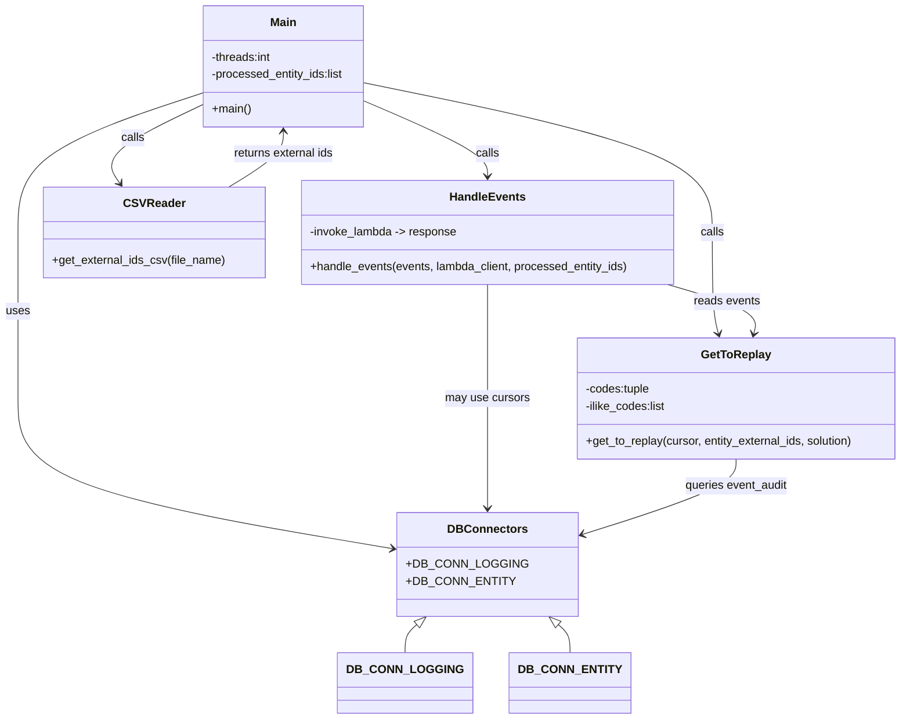

# Diagram: common/monitoring/scripts/replay_eta_vins.py


> Auto-generated by Obscura crawlers

## Diagram 1

```mermaid
flowchart LR
    Main[main()] --> ReadCSV[read CSV\nget_external_ids_csv()]
    ReadCSV --> ForEachSolution[for each solution]
    ForEachSolution --> SplitList[fv.aws.lambdas.split_list(vins, threads)]
    SplitList --> ForEachChunk[for each chunk]
    ForEachChunk --> GetEvents[get_to_replay(DB_CONN_LOGGING.cursor, external_list, solution)]
    GetEvents --> Distribute[split events for threads]
    Distribute --> CreateClients[create boto3 lambda clients]
    CreateClients --> HandleEvents[handle_events(events, lambda_client, processed_entity_ids)]
    HandleEvents --> Invoke[ fv.aws.lambdas.invoke_lambda(source, full_payload=event, lambda_client=lambda_client) ]
    Invoke --> CheckStatus{statusCode == 200?}
    CheckStatus -->|no| AppendProcessed[processed_entity_ids.append(key1)]
    CheckStatus -->|yes| Continue[continue]
    AppendProcessed --> Continue
    Continue --> End[loop / next chunk]
```

> SVG rendering failed for this diagram.

## Diagram 2



### SVG

<svg id="container" width="1249.42578125" xmlns="http://www.w3.org/2000/svg" class="classDiagram" height="996" viewBox="0 0 1249.42578125 996" role="graphics-document document" aria-roledescription="class"><style>#container{font-family:"trebuchet ms",verdana,arial,sans-serif;font-size:16px;fill:#333;}@keyframes edge-animation-frame{from{stroke-dashoffset:0;}}@keyframes dash{to{stroke-dashoffset:0;}}#container .edge-animation-slow{stroke-dasharray:9,5!important;stroke-dashoffset:900;animation:dash 50s linear infinite;stroke-linecap:round;}#container .edge-animation-fast{stroke-dasharray:9,5!important;stroke-dashoffset:900;animation:dash 20s linear infinite;stroke-linecap:round;}#container .error-icon{fill:#552222;}#container .error-text{fill:#552222;stroke:#552222;}#container .edge-thickness-normal{stroke-width:1px;}#container .edge-thickness-thick{stroke-width:3.5px;}#container .edge-pattern-solid{stroke-dasharray:0;}#container .edge-thickness-invisible{stroke-width:0;fill:none;}#container .edge-pattern-dashed{stroke-dasharray:3;}#container .edge-pattern-dotted{stroke-dasharray:2;}#container .marker{fill:#333333;stroke:#333333;}#container .marker.cross{stroke:#333333;}#container svg{font-family:"trebuchet ms",verdana,arial,sans-serif;font-size:16px;}#container p{margin:0;}#container g.classGroup text{fill:#9370DB;stroke:none;font-family:"trebuchet ms",verdana,arial,sans-serif;font-size:10px;}#container g.classGroup text .title{font-weight:bolder;}#container .nodeLabel,#container .edgeLabel{color:#131300;}#container .edgeLabel .label rect{fill:#ECECFF;}#container .label text{fill:#131300;}#container .labelBkg{background:#ECECFF;}#container .edgeLabel .label span{background:#ECECFF;}#container .classTitle{font-weight:bolder;}#container .node rect,#container .node circle,#container .node ellipse,#container .node polygon,#container .node path{fill:#ECECFF;stroke:#9370DB;stroke-width:1px;}#container .divider{stroke:#9370DB;stroke-width:1;}#container g.clickable{cursor:pointer;}#container g.classGroup rect{fill:#ECECFF;stroke:#9370DB;}#container g.classGroup line{stroke:#9370DB;stroke-width:1;}#container .classLabel .box{stroke:none;stroke-width:0;fill:#ECECFF;opacity:0.5;}#container .classLabel .label{fill:#9370DB;font-size:10px;}#container .relation{stroke:#333333;stroke-width:1;fill:none;}#container .dashed-line{stroke-dasharray:3;}#container .dotted-line{stroke-dasharray:1 2;}#container #compositionStart,#container .composition{fill:#333333!important;stroke:#333333!important;stroke-width:1;}#container #compositionEnd,#container .composition{fill:#333333!important;stroke:#333333!important;stroke-width:1;}#container #dependencyStart,#container .dependency{fill:#333333!important;stroke:#333333!important;stroke-width:1;}#container #dependencyStart,#container .dependency{fill:#333333!important;stroke:#333333!important;stroke-width:1;}#container #extensionStart,#container .extension{fill:transparent!important;stroke:#333333!important;stroke-width:1;}#container #extensionEnd,#container .extension{fill:transparent!important;stroke:#333333!important;stroke-width:1;}#container #aggregationStart,#container .aggregation{fill:transparent!important;stroke:#333333!important;stroke-width:1;}#container #aggregationEnd,#container .aggregation{fill:transparent!important;stroke:#333333!important;stroke-width:1;}#container #lollipopStart,#container .lollipop{fill:#ECECFF!important;stroke:#333333!important;stroke-width:1;}#container #lollipopEnd,#container .lollipop{fill:#ECECFF!important;stroke:#333333!important;stroke-width:1;}#container .edgeTerminals{font-size:11px;line-height:initial;}#container .classTitleText{text-anchor:middle;font-size:18px;fill:#333;}#container .label-icon{display:inline-block;height:1em;overflow:visible;vertical-align:-0.125em;}#container .node .label-icon path{fill:currentColor;stroke:revert;stroke-width:revert;}#container :root{--mermaid-font-family:"trebuchet ms",verdana,arial,sans-serif;}</style><g><defs><marker id="container_class-aggregationStart" class="marker aggregation class" refX="18" refY="7" markerWidth="190" markerHeight="240" orient="auto"><path d="M 18,7 L9,13 L1,7 L9,1 Z"></path></marker></defs><defs><marker id="container_class-aggregationEnd" class="marker aggregation class" refX="1" refY="7" markerWidth="20" markerHeight="28" orient="auto"><path d="M 18,7 L9,13 L1,7 L9,1 Z"></path></marker></defs><defs><marker id="container_class-extensionStart" class="marker extension class" refX="18" refY="7" markerWidth="190" markerHeight="240" orient="auto"><path d="M 1,7 L18,13 V 1 Z"></path></marker></defs><defs><marker id="container_class-extensionEnd" class="marker extension class" refX="1" refY="7" markerWidth="20" markerHeight="28" orient="auto"><path d="M 1,1 V 13 L18,7 Z"></path></marker></defs><defs><marker id="container_class-compositionStart" class="marker composition class" refX="18" refY="7" markerWidth="190" markerHeight="240" orient="auto"><path d="M 18,7 L9,13 L1,7 L9,1 Z"></path></marker></defs><defs><marker id="container_class-compositionEnd" class="marker composition class" refX="1" refY="7" markerWidth="20" markerHeight="28" orient="auto"><path d="M 18,7 L9,13 L1,7 L9,1 Z"></path></marker></defs><defs><marker id="container_class-dependencyStart" class="marker dependency class" refX="6" refY="7" markerWidth="190" markerHeight="240" orient="auto"><path d="M 5,7 L9,13 L1,7 L9,1 Z"></path></marker></defs><defs><marker id="container_class-dependencyEnd" class="marker dependency class" refX="13" refY="7" markerWidth="20" markerHeight="28" orient="auto"><path d="M 18,7 L9,13 L14,7 L9,1 Z"></path></marker></defs><defs><marker id="container_class-lollipopStart" class="marker lollipop class" refX="13" refY="7" markerWidth="190" markerHeight="240" orient="auto"><circle stroke="black" fill="transparent" cx="7" cy="7" r="6"></circle></marker></defs><defs><marker id="container_class-lollipopEnd" class="marker lollipop class" refX="1" refY="7" markerWidth="190" markerHeight="240" orient="auto"><circle stroke="black" fill="transparent" cx="7" cy="7" r="6"></circle></marker></defs><g class="root"><g class="clusters"></g><g class="edgePaths"><path d="M274.119,146.616L251.096,157.68C228.074,168.744,182.028,190.872,163.717,208.779C145.405,226.686,154.828,240.372,159.539,247.215L164.25,254.058" id="id_Main_CSVReader_1" class="edge-thickness-normal edge-pattern-solid relation" style=";;;" data-edge="true" data-et="edge" data-id="id_Main_CSVReader_1" data-points="W3sieCI6Mjc0LjExOTE0MDYyNSwieSI6MTQ2LjYxNTg1MjQyODc1MDk0fSx7IngiOjEzNS45ODI0MjE4NzUsInkiOjIxM30seyJ4IjoxNjcuNjUyNzU1ODc3MjkzNTcsInkiOjI1OX1d" marker-end="url(#container_class-dependencyEnd)"></path><path d="M501.416,115.005L582.1,131.338C662.784,147.67,824.152,180.335,904.836,214.834C985.52,249.333,985.52,285.667,985.52,322C985.52,358.333,985.52,394.667,986.939,418.035C988.358,441.404,991.197,451.808,992.616,457.01L994.036,462.212" id="id_Main_GetToReplay_2" class="edge-thickness-normal edge-pattern-solid relation" style=";;;" data-edge="true" data-et="edge" data-id="id_Main_GetToReplay_2" data-points="W3sieCI6NTAxLjQxNjAxNTYyNSwieSI6MTE1LjAwNTI5NjUzNzQ4MjU2fSx7IngiOjk4NS41MTk1MzEyNSwieSI6MjEzfSx7IngiOjk4NS41MTk1MzEyNSwieSI6MzIyfSx7IngiOjk4NS41MTk1MzEyNSwieSI6NDMxfSx7IngiOjk5NS42MTUyMTgyMzM0NzExLCJ5Ijo0Njh9XQ==" marker-end="url(#container_class-dependencyEnd)"></path><path d="M501.416,140.394L529.834,152.495C558.251,164.596,615.087,188.798,643.504,206.066C671.922,223.333,671.922,233.667,671.922,238.833L671.922,244" id="id_Main_HandleEvents_3" class="edge-thickness-normal edge-pattern-solid relation" style=";;;" data-edge="true" data-et="edge" data-id="id_Main_HandleEvents_3" data-points="W3sieCI6NTAxLjQxNjAxNTYyNSwieSI6MTQwLjM5NDM0NDUxMTg4MDc3fSx7IngiOjY3MS45MjE4NzUsInkiOjIxM30seyJ4Ijo2NzEuOTIxODc1LCJ5IjoyNTB9XQ==" marker-end="url(#container_class-dependencyEnd)"></path><path d="M274.119,129.854L232.515,143.712C190.91,157.569,107.701,185.285,66.097,217.309C24.492,249.333,24.492,285.667,24.492,322C24.492,358.333,24.492,394.667,24.492,433C24.492,471.333,24.492,511.667,24.492,552C24.492,592.333,24.492,632.667,112.673,667.679C200.853,702.692,377.214,732.384,465.395,747.23L553.575,762.075" id="id_Main_DBConnectors_4" class="edge-thickness-normal edge-pattern-solid relation" style=";;;" data-edge="true" data-et="edge" data-id="id_Main_DBConnectors_4" data-points="W3sieCI6Mjc0LjExOTE0MDYyNSwieSI6MTI5Ljg1NDA5NDQyMDg3Nzc0fSx7IngiOjI0LjQ5MjE4NzUsInkiOjIxM30seyJ4IjoyNC40OTIxODc1LCJ5IjozMjJ9LHsieCI6MjQuNDkyMTg3NSwieSI6NDMxfSx7IngiOjI0LjQ5MjE4NzUsInkiOjU1Mn0seyJ4IjoyNC40OTIxODc1LCJ5Ijo2NzN9LHsieCI6NTU5LjQ5MjE4NzUsInkiOjc2My4wNzE1NTY5OTgyMjYxfV0=" marker-end="url(#container_class-dependencyEnd)"></path><path d="M922.686,394L944.163,400.167C965.641,406.333,1008.596,418.667,1028.654,430.035C1048.712,441.404,1045.873,451.808,1044.454,457.01L1043.034,462.212" id="id_HandleEvents_GetToReplay_5" class="edge-thickness-normal edge-pattern-solid relation" style=";;;" data-edge="true" data-et="edge" data-id="id_HandleEvents_GetToReplay_5" data-points="W3sieCI6OTIyLjY4NTkyMzE2NTEzNzYsInkiOjM5NH0seyJ4IjoxMDUxLjU1MDc4MTI1LCJ5Ijo0MzF9LHsieCI6MTA0MS40NTUwOTQyNjY1MjksInkiOjQ2OH1d" marker-end="url(#container_class-dependencyEnd)"></path><path d="M671.922,394L671.922,400.167C671.922,406.333,671.922,418.667,671.922,445C671.922,471.333,671.922,511.667,671.922,552C671.922,592.333,671.922,632.667,671.922,658C671.922,683.333,671.922,693.667,671.922,698.833L671.922,704" id="id_HandleEvents_DBConnectors_6" class="edge-thickness-normal edge-pattern-solid relation" style=";;;" data-edge="true" data-et="edge" data-id="id_HandleEvents_DBConnectors_6" data-points="W3sieCI6NjcxLjkyMTg3NSwieSI6Mzk0fSx7IngiOjY3MS45MjE4NzUsInkiOjQzMX0seyJ4Ijo2NzEuOTIxODc1LCJ5Ijo1NTJ9LHsieCI6NjcxLjkyMTg3NSwieSI6NjczfSx7IngiOjY3MS45MjE4NzUsInkiOjcxMH1d" marker-end="url(#container_class-dependencyEnd)"></path><path d="M1018.535,636L1018.535,642.167C1018.535,648.333,1018.535,660.667,980.459,678.807C942.382,696.948,866.229,720.896,828.152,732.87L790.075,744.844" id="id_GetToReplay_DBConnectors_7" class="edge-thickness-normal edge-pattern-solid relation" style=";;;" data-edge="true" data-et="edge" data-id="id_GetToReplay_DBConnectors_7" data-points="W3sieCI6MTAxOC41MzUxNTYyNSwieSI6NjM2fSx7IngiOjEwMTguNTM1MTU2MjUsInkiOjY3M30seyJ4Ijo3ODQuMzUxNTYyNSwieSI6NzQ2LjY0NDA2NzAzMjU1ODR9XQ==" marker-end="url(#container_class-dependencyEnd)"></path><path d="M313.18,259L325.611,251.333C338.042,243.667,362.905,228.333,375.336,215.5C387.768,202.667,387.768,192.333,387.768,187.167L387.768,182" id="id_CSVReader_Main_8" class="edge-thickness-normal edge-pattern-solid relation" style=";;;" data-edge="true" data-et="edge" data-id="id_CSVReader_Main_8" data-points="W3sieCI6MzEzLjE3OTk1NjI3ODY2OTcsInkiOjI1OX0seyJ4IjozODcuNzY3NTc4MTI1LCJ5IjoyMTN9LHsieCI6Mzg3Ljc2NzU3ODEyNSwieSI6MTc2fV0=" marker-end="url(#container_class-dependencyEnd)"></path><path d="M581.793,865.742L579.415,867.951C577.037,870.161,572.28,874.581,569.902,880.957C567.523,887.333,567.523,895.667,567.523,899.833L567.523,904" id="id_DBConnectors_DB_CONN_LOGGING_9" class="edge-thickness-normal edge-pattern-solid relation" style=";;;" data-edge="true" data-et="edge" data-id="id_DBConnectors_DB_CONN_LOGGING_9" data-points="W3sieCI6NTk0LjQzMDI1MTI4ODY1OTcsInkiOjg1NH0seyJ4Ijo1NjcuNTIzNDM3NSwieSI6ODc5fSx7IngiOjU2Ny41MjM0Mzc1LCJ5Ijo5MDR9XQ==" marker-start="url(#container_class-extensionStart)"></path><path d="M762.051,865.742L764.429,867.951C766.807,870.161,771.564,874.581,773.942,880.957C776.32,887.333,776.32,895.667,776.32,899.833L776.32,904" id="id_DBConnectors_DB_CONN_ENTITY_10" class="edge-thickness-normal edge-pattern-solid relation" style=";;;" data-edge="true" data-et="edge" data-id="id_DBConnectors_DB_CONN_ENTITY_10" data-points="W3sieCI6NzQ5LjQxMzQ5ODcxMTM0MDMsInkiOjg1NH0seyJ4Ijo3NzYuMzIwMzEyNSwieSI6ODc5fSx7IngiOjc3Ni4zMjAzMTI1LCJ5Ijo5MDR9XQ==" marker-start="url(#container_class-extensionStart)"></path></g><g class="edgeLabels"><g class="edgeLabel" transform="translate(179.88219, 191.90316)"><g class="label" data-id="id_Main_CSVReader_1" transform="translate(-16.4453125, -12)"><foreignObject width="32.890625" height="24"><div xmlns="http://www.w3.org/1999/xhtml" class="labelBkg" style="display: table-cell; white-space: nowrap; line-height: 1.5; max-width: 200px; text-align: center;"><span class="edgeLabel"><p>calls</p></span></div></foreignObject></g></g><g class="edgeLabel" transform="translate(985.51953125, 322)"><g class="label" data-id="id_Main_GetToReplay_2" transform="translate(-16.4453125, -12)"><foreignObject width="32.890625" height="24"><div xmlns="http://www.w3.org/1999/xhtml" class="labelBkg" style="display: table-cell; white-space: nowrap; line-height: 1.5; max-width: 200px; text-align: center;"><span class="edgeLabel"><p>calls</p></span></div></foreignObject></g></g><g class="edgeLabel" transform="translate(671.921875, 213)"><g class="label" data-id="id_Main_HandleEvents_3" transform="translate(-16.4453125, -12)"><foreignObject width="32.890625" height="24"><div xmlns="http://www.w3.org/1999/xhtml" class="labelBkg" style="display: table-cell; white-space: nowrap; line-height: 1.5; max-width: 200px; text-align: center;"><span class="edgeLabel"><p>calls</p></span></div></foreignObject></g></g><g class="edgeLabel" transform="translate(24.4921875, 431)"><g class="label" data-id="id_Main_DBConnectors_4" transform="translate(-16.4921875, -12)"><foreignObject width="32.984375" height="24"><div xmlns="http://www.w3.org/1999/xhtml" class="labelBkg" style="display: table-cell; white-space: nowrap; line-height: 1.5; max-width: 200px; text-align: center;"><span class="edgeLabel"><p>uses</p></span></div></foreignObject></g></g><g class="edgeLabel" transform="translate(1005.54996, 417.79213)"><g class="label" data-id="id_HandleEvents_GetToReplay_5" transform="translate(-46.03125, -12)"><foreignObject width="92.0625" height="24"><div xmlns="http://www.w3.org/1999/xhtml" class="labelBkg" style="display: table-cell; white-space: nowrap; line-height: 1.5; max-width: 200px; text-align: center;"><span class="edgeLabel"><p>reads events</p></span></div></foreignObject></g></g><g class="edgeLabel" transform="translate(671.921875, 552)"><g class="label" data-id="id_HandleEvents_DBConnectors_6" transform="translate(-58.5, -12)"><foreignObject width="117" height="24"><div xmlns="http://www.w3.org/1999/xhtml" class="labelBkg" style="display: table-cell; white-space: nowrap; line-height: 1.5; max-width: 200px; text-align: center;"><span class="edgeLabel"><p>may use cursors</p></span></div></foreignObject></g></g><g class="edgeLabel" transform="translate(1018.53515625, 673)"><g class="label" data-id="id_GetToReplay_DBConnectors_7" transform="translate(-72.46875, -12)"><foreignObject width="144.9375" height="24"><div xmlns="http://www.w3.org/1999/xhtml" class="labelBkg" style="display: table-cell; white-space: nowrap; line-height: 1.5; max-width: 200px; text-align: center;"><span class="edgeLabel"><p>queries event_audit</p></span></div></foreignObject></g></g><g class="edgeLabel" transform="translate(387.767578125, 213)"><g class="label" data-id="id_CSVReader_Main_8" transform="translate(-70.96875, -12)"><foreignObject width="141.9375" height="24"><div xmlns="http://www.w3.org/1999/xhtml" class="labelBkg" style="display: table-cell; white-space: nowrap; line-height: 1.5; max-width: 200px; text-align: center;"><span class="edgeLabel"><p>returns external ids</p></span></div></foreignObject></g></g><g class="edgeLabel"><g class="label" data-id="id_DBConnectors_DB_CONN_LOGGING_9" transform="translate(0, 0)"><foreignObject width="0" height="0"><div xmlns="http://www.w3.org/1999/xhtml" class="labelBkg" style="display: table-cell; white-space: nowrap; line-height: 1.5; max-width: 200px; text-align: center;"><span class="edgeLabel"></span></div></foreignObject></g></g><g class="edgeLabel"><g class="label" data-id="id_DBConnectors_DB_CONN_ENTITY_10" transform="translate(0, 0)"><foreignObject width="0" height="0"><div xmlns="http://www.w3.org/1999/xhtml" class="labelBkg" style="display: table-cell; white-space: nowrap; line-height: 1.5; max-width: 200px; text-align: center;"><span class="edgeLabel"></span></div></foreignObject></g></g></g><g class="nodes"><g class="node default" id="classId-Main-0" transform="translate(387.767578125, 92)"><g class="basic label-container"><path d="M-113.6484375 -84 L113.6484375 -84 L113.6484375 84 L-113.6484375 84" stroke="none" stroke-width="0" fill="#ECECFF" style=""></path><path d="M-113.6484375 -84 C-35.45948686205517 -84, 42.729463775889656 -84, 113.6484375 -84 M-113.6484375 -84 C-37.68514948253859 -84, 38.27813853492282 -84, 113.6484375 -84 M113.6484375 -84 C113.6484375 -48.894817020759255, 113.6484375 -13.78963404151851, 113.6484375 84 M113.6484375 -84 C113.6484375 -46.81596904402456, 113.6484375 -9.631938088049125, 113.6484375 84 M113.6484375 84 C66.46685720718139 84, 19.285276914362797 84, -113.6484375 84 M113.6484375 84 C42.209184414736825 84, -29.23006867052635 84, -113.6484375 84 M-113.6484375 84 C-113.6484375 36.79379521593476, -113.6484375 -10.412409568130485, -113.6484375 -84 M-113.6484375 84 C-113.6484375 33.38206431485757, -113.6484375 -17.235871370284855, -113.6484375 -84" stroke="#9370DB" stroke-width="1.3" fill="none" stroke-dasharray="0 0" style=""></path></g><g class="annotation-group text" transform="translate(0, -60)"></g><g class="label-group text" transform="translate(-17.546875, -60)"><g class="label" style="font-weight: bolder" transform="translate(0,-12)"><foreignObject width="35.09375" height="24"><div xmlns="http://www.w3.org/1999/xhtml" style="display: table-cell; white-space: nowrap; line-height: 1.5; max-width: 85px; text-align: center;"><span class="nodeLabel markdown-node-label" style=""><p>Main</p></span></div></foreignObject></g></g><g class="members-group text" transform="translate(-101.6484375, -12)"><g class="label" style="" transform="translate(0,-12)"><foreignObject width="85.03125" height="24"><div xmlns="http://www.w3.org/1999/xhtml" style="display: table-cell; white-space: nowrap; line-height: 1.5; max-width: 143px; text-align: center;"><span class="nodeLabel markdown-node-label" style=""><p>-threads:int</p></span></div></foreignObject></g><g class="label" style="" transform="translate(0,12)"><foreignObject width="185.75" height="24"><div xmlns="http://www.w3.org/1999/xhtml" style="display: table-cell; white-space: nowrap; line-height: 1.5; max-width: 243px; text-align: center;"><span class="nodeLabel markdown-node-label" style=""><p>-processed_entity_ids:list</p></span></div></foreignObject></g></g><g class="methods-group text" transform="translate(-101.6484375, 60)"><g class="label" style="" transform="translate(0,-12)"><foreignObject width="54.65625" height="24"><div xmlns="http://www.w3.org/1999/xhtml" style="display: table-cell; white-space: nowrap; line-height: 1.5; max-width: 112px; text-align: center;"><span class="nodeLabel markdown-node-label" style=""><p>+main()</p></span></div></foreignObject></g></g><g class="divider" style=""><path d="M-113.6484375 -36 C-58.37587439838108 -36, -3.1033112967621577 -36, 113.6484375 -36 M-113.6484375 -36 C-67.86233781129263 -36, -22.076238122585266 -36, 113.6484375 -36" stroke="#9370DB" stroke-width="1.3" fill="none" stroke-dasharray="0 0" style=""></path></g><g class="divider" style=""><path d="M-113.6484375 36 C-45.02469951601417 36, 23.599038467971667 36, 113.6484375 36 M-113.6484375 36 C-30.962116947169804 36, 51.72420360566039 36, 113.6484375 36" stroke="#9370DB" stroke-width="1.3" fill="none" stroke-dasharray="0 0" style=""></path></g></g><g class="node default" id="classId-GetToReplay-1" transform="translate(1018.53515625, 552)"><g class="basic label-container"><path d="M-222.890625 -84 L222.890625 -84 L222.890625 84 L-222.890625 84" stroke="none" stroke-width="0" fill="#ECECFF" style=""></path><path d="M-222.890625 -84 C-115.73384563092408 -84, -8.57706626184816 -84, 222.890625 -84 M-222.890625 -84 C-55.665138372387844 -84, 111.56034825522431 -84, 222.890625 -84 M222.890625 -84 C222.890625 -33.824950335709566, 222.890625 16.350099328580868, 222.890625 84 M222.890625 -84 C222.890625 -18.94705235946661, 222.890625 46.10589528106678, 222.890625 84 M222.890625 84 C106.11263534956335 84, -10.665354300873304 84, -222.890625 84 M222.890625 84 C48.00072149054532 84, -126.88918201890937 84, -222.890625 84 M-222.890625 84 C-222.890625 45.05881980527914, -222.890625 6.117639610558285, -222.890625 -84 M-222.890625 84 C-222.890625 40.4446524393467, -222.890625 -3.1106951213066054, -222.890625 -84" stroke="#9370DB" stroke-width="1.3" fill="none" stroke-dasharray="0 0" style=""></path></g><g class="annotation-group text" transform="translate(0, -60)"></g><g class="label-group text" transform="translate(-45.96875, -60)"><g class="label" style="font-weight: bolder" transform="translate(0,-12)"><foreignObject width="91.9375" height="24"><div xmlns="http://www.w3.org/1999/xhtml" style="display: table-cell; white-space: nowrap; line-height: 1.5; max-width: 140px; text-align: center;"><span class="nodeLabel markdown-node-label" style=""><p>GetToReplay</p></span></div></foreignObject></g></g><g class="members-group text" transform="translate(-210.890625, -12)"><g class="label" style="" transform="translate(0,-12)"><foreignObject width="90.71875" height="24"><div xmlns="http://www.w3.org/1999/xhtml" style="display: table-cell; white-space: nowrap; line-height: 1.5; max-width: 148px; text-align: center;"><span class="nodeLabel markdown-node-label" style=""><p>-codes:tuple</p></span></div></foreignObject></g><g class="label" style="" transform="translate(0,12)"><foreignObject width="113.34375" height="24"><div xmlns="http://www.w3.org/1999/xhtml" style="display: table-cell; white-space: nowrap; line-height: 1.5; max-width: 171px; text-align: center;"><span class="nodeLabel markdown-node-label" style=""><p>-ilike_codes:list</p></span></div></foreignObject></g></g><g class="methods-group text" transform="translate(-210.890625, 60)"><g class="label" style="" transform="translate(0,-12)"><foreignObject width="375.8125" height="24"><div xmlns="http://www.w3.org/1999/xhtml" style="display: table-cell; white-space: nowrap; line-height: 1.5; max-width: 433px; text-align: center;"><span class="nodeLabel markdown-node-label" style=""><p>+get_to_replay(cursor, entity_external_ids, solution)</p></span></div></foreignObject></g></g><g class="divider" style=""><path d="M-222.890625 -36 C-63.25998653045838 -36, 96.37065193908325 -36, 222.890625 -36 M-222.890625 -36 C-112.55810841402764 -36, -2.225591828055286 -36, 222.890625 -36" stroke="#9370DB" stroke-width="1.3" fill="none" stroke-dasharray="0 0" style=""></path></g><g class="divider" style=""><path d="M-222.890625 36 C-115.76303307408676 36, -8.635441148173527 36, 222.890625 36 M-222.890625 36 C-72.15467767836944 36, 78.58126964326112 36, 222.890625 36" stroke="#9370DB" stroke-width="1.3" fill="none" stroke-dasharray="0 0" style=""></path></g></g><g class="node default" id="classId-HandleEvents-2" transform="translate(671.921875, 322)"><g class="basic label-container"><path d="M-259.359375 -72 L259.359375 -72 L259.359375 72 L-259.359375 72" stroke="none" stroke-width="0" fill="#ECECFF" style=""></path><path d="M-259.359375 -72 C-97.32836534752838 -72, 64.70264430494325 -72, 259.359375 -72 M-259.359375 -72 C-140.71170946236828 -72, -22.064043924736552 -72, 259.359375 -72 M259.359375 -72 C259.359375 -38.21891018906831, 259.359375 -4.437820378136621, 259.359375 72 M259.359375 -72 C259.359375 -32.623081400061416, 259.359375 6.753837199877168, 259.359375 72 M259.359375 72 C82.86417778605724 72, -93.63101942788552 72, -259.359375 72 M259.359375 72 C88.26651883023993 72, -82.82633733952014 72, -259.359375 72 M-259.359375 72 C-259.359375 28.301834932053886, -259.359375 -15.396330135892228, -259.359375 -72 M-259.359375 72 C-259.359375 25.587773711980404, -259.359375 -20.824452576039192, -259.359375 -72" stroke="#9370DB" stroke-width="1.3" fill="none" stroke-dasharray="0 0" style=""></path></g><g class="annotation-group text" transform="translate(0, -48)"></g><g class="label-group text" transform="translate(-49.953125, -48)"><g class="label" style="font-weight: bolder" transform="translate(0,-12)"><foreignObject width="99.90625" height="24"><div xmlns="http://www.w3.org/1999/xhtml" style="display: table-cell; white-space: nowrap; line-height: 1.5; max-width: 149px; text-align: center;"><span class="nodeLabel markdown-node-label" style=""><p>HandleEvents</p></span></div></foreignObject></g></g><g class="members-group text" transform="translate(-247.359375, 0)"><g class="label" style="" transform="translate(0,-12)"><foreignObject width="206.03125" height="24"><div xmlns="http://www.w3.org/1999/xhtml" style="display: table-cell; white-space: nowrap; line-height: 1.5; max-width: 285px; text-align: center;"><span class="nodeLabel markdown-node-label" style=""><p>-invoke_lambda -&gt; response</p></span></div></foreignObject></g></g><g class="methods-group text" transform="translate(-247.359375, 48)"><g class="label" style="" transform="translate(0,-12)"><foreignObject width="444.765625" height="24"><div xmlns="http://www.w3.org/1999/xhtml" style="display: table-cell; white-space: nowrap; line-height: 1.5; max-width: 502px; text-align: center;"><span class="nodeLabel markdown-node-label" style=""><p>+handle_events(events, lambda_client, processed_entity_ids)</p></span></div></foreignObject></g></g><g class="divider" style=""><path d="M-259.359375 -24 C-141.5172656083139 -24, -23.675156216627755 -24, 259.359375 -24 M-259.359375 -24 C-115.37522475093917 -24, 28.608925498121664 -24, 259.359375 -24" stroke="#9370DB" stroke-width="1.3" fill="none" stroke-dasharray="0 0" style=""></path></g><g class="divider" style=""><path d="M-259.359375 24 C-76.32777058682115 24, 106.70383382635771 24, 259.359375 24 M-259.359375 24 C-135.59734299723738 24, -11.835310994474725 24, 259.359375 24" stroke="#9370DB" stroke-width="1.3" fill="none" stroke-dasharray="0 0" style=""></path></g></g><g class="node default" id="classId-CSVReader-3" transform="translate(211.02734375, 322)"><g class="basic label-container"><path d="M-151.53515625 -63 L151.53515625 -63 L151.53515625 63 L-151.53515625 63" stroke="none" stroke-width="0" fill="#ECECFF" style=""></path><path d="M-151.53515625 -63 C-68.34628518676875 -63, 14.842585876462493 -63, 151.53515625 -63 M-151.53515625 -63 C-85.76701931362882 -63, -19.998882377257644 -63, 151.53515625 -63 M151.53515625 -63 C151.53515625 -37.724102573102584, 151.53515625 -12.448205146205176, 151.53515625 63 M151.53515625 -63 C151.53515625 -28.928154124759516, 151.53515625 5.1436917504809685, 151.53515625 63 M151.53515625 63 C87.92704673112637 63, 24.318937212252735 63, -151.53515625 63 M151.53515625 63 C80.41678882513902 63, 9.298421400278045 63, -151.53515625 63 M-151.53515625 63 C-151.53515625 15.535945882924914, -151.53515625 -31.928108234150173, -151.53515625 -63 M-151.53515625 63 C-151.53515625 32.513943330049024, -151.53515625 2.027886660098048, -151.53515625 -63" stroke="#9370DB" stroke-width="1.3" fill="none" stroke-dasharray="0 0" style=""></path></g><g class="annotation-group text" transform="translate(0, -39)"></g><g class="label-group text" transform="translate(-39.4609375, -39)"><g class="label" style="font-weight: bolder" transform="translate(0,-12)"><foreignObject width="78.921875" height="24"><div xmlns="http://www.w3.org/1999/xhtml" style="display: table-cell; white-space: nowrap; line-height: 1.5; max-width: 128px; text-align: center;"><span class="nodeLabel markdown-node-label" style=""><p>CSVReader</p></span></div></foreignObject></g></g><g class="members-group text" transform="translate(-139.53515625, 9)"></g><g class="methods-group text" transform="translate(-139.53515625, 39)"><g class="label" style="" transform="translate(0,-12)"><foreignObject width="239.609375" height="24"><div xmlns="http://www.w3.org/1999/xhtml" style="display: table-cell; white-space: nowrap; line-height: 1.5; max-width: 297px; text-align: center;"><span class="nodeLabel markdown-node-label" style=""><p>+get_external_ids_csv(file_name)</p></span></div></foreignObject></g></g><g class="divider" style=""><path d="M-151.53515625 -15 C-37.73263083917374 -15, 76.06989457165253 -15, 151.53515625 -15 M-151.53515625 -15 C-80.91615001375875 -15, -10.297143777517505 -15, 151.53515625 -15" stroke="#9370DB" stroke-width="1.3" fill="none" stroke-dasharray="0 0" style=""></path></g><g class="divider" style=""><path d="M-151.53515625 9 C-58.13020048007117 9, 35.274755289857666 9, 151.53515625 9 M-151.53515625 9 C-88.53945468478656 9, -25.54375311957311 9, 151.53515625 9" stroke="#9370DB" stroke-width="1.3" fill="none" stroke-dasharray="0 0" style=""></path></g></g><g class="node default" id="classId-DBConnectors-4" transform="translate(671.921875, 782)"><g class="basic label-container"><path d="M-112.4296875 -72 L112.4296875 -72 L112.4296875 72 L-112.4296875 72" stroke="none" stroke-width="0" fill="#ECECFF" style=""></path><path d="M-112.4296875 -72 C-60.52615596043247 -72, -8.622624420864938 -72, 112.4296875 -72 M-112.4296875 -72 C-48.751238002344465 -72, 14.92721149531107 -72, 112.4296875 -72 M112.4296875 -72 C112.4296875 -41.1737070353483, 112.4296875 -10.347414070696594, 112.4296875 72 M112.4296875 -72 C112.4296875 -15.70315737301489, 112.4296875 40.59368525397022, 112.4296875 72 M112.4296875 72 C23.369484663711376 72, -65.69071817257725 72, -112.4296875 72 M112.4296875 72 C50.86485340245895 72, -10.699980695082104 72, -112.4296875 72 M-112.4296875 72 C-112.4296875 16.36251024233305, -112.4296875 -39.2749795153339, -112.4296875 -72 M-112.4296875 72 C-112.4296875 34.60340678424054, -112.4296875 -2.7931864315189188, -112.4296875 -72" stroke="#9370DB" stroke-width="1.3" fill="none" stroke-dasharray="0 0" style=""></path></g><g class="annotation-group text" transform="translate(0, -48)"></g><g class="label-group text" transform="translate(-51.328125, -48)"><g class="label" style="font-weight: bolder" transform="translate(0,-12)"><foreignObject width="102.65625" height="24"><div xmlns="http://www.w3.org/1999/xhtml" style="display: table-cell; white-space: nowrap; line-height: 1.5; max-width: 151px; text-align: center;"><span class="nodeLabel markdown-node-label" style=""><p>DBConnectors</p></span></div></foreignObject></g></g><g class="members-group text" transform="translate(-100.4296875, 0)"><g class="label" style="" transform="translate(0,-12)"><foreignObject width="149.53125" height="24"><div xmlns="http://www.w3.org/1999/xhtml" style="display: table-cell; white-space: nowrap; line-height: 1.5; max-width: 207px; text-align: center;"><span class="nodeLabel markdown-node-label" style=""><p>+DB_CONN_LOGGING</p></span></div></foreignObject></g><g class="label" style="" transform="translate(0,12)"><foreignObject width="134.828125" height="24"><div xmlns="http://www.w3.org/1999/xhtml" style="display: table-cell; white-space: nowrap; line-height: 1.5; max-width: 192px; text-align: center;"><span class="nodeLabel markdown-node-label" style=""><p>+DB_CONN_ENTITY</p></span></div></foreignObject></g></g><g class="methods-group text" transform="translate(-100.4296875, 72)"></g><g class="divider" style=""><path d="M-112.4296875 -24 C-50.52576143921168 -24, 11.378164621576644 -24, 112.4296875 -24 M-112.4296875 -24 C-66.63942152176111 -24, -20.8491555435222 -24, 112.4296875 -24" stroke="#9370DB" stroke-width="1.3" fill="none" stroke-dasharray="0 0" style=""></path></g><g class="divider" style=""><path d="M-112.4296875 48 C-56.725983775929656 48, -1.0222800518593118 48, 112.4296875 48 M-112.4296875 48 C-28.32718253807502 48, 55.77532242384996 48, 112.4296875 48" stroke="#9370DB" stroke-width="1.3" fill="none" stroke-dasharray="0 0" style=""></path></g></g><g class="node default" id="classId-DB_CONN_LOGGING-5" transform="translate(567.5234375, 946)"><g class="basic label-container"><path d="M-82.984375 -42 L82.984375 -42 L82.984375 42 L-82.984375 42" stroke="none" stroke-width="0" fill="#ECECFF" style=""></path><path d="M-82.984375 -42 C-30.859096799962117 -42, 21.266181400075766 -42, 82.984375 -42 M-82.984375 -42 C-42.97595691330673 -42, -2.9675388266134632 -42, 82.984375 -42 M82.984375 -42 C82.984375 -11.38012307238266, 82.984375 19.23975385523468, 82.984375 42 M82.984375 -42 C82.984375 -17.705007002273497, 82.984375 6.589985995453006, 82.984375 42 M82.984375 42 C20.252612398991104 42, -42.47915020201779 42, -82.984375 42 M82.984375 42 C18.08080073433308 42, -46.82277353133384 42, -82.984375 42 M-82.984375 42 C-82.984375 21.927491499640155, -82.984375 1.8549829992803097, -82.984375 -42 M-82.984375 42 C-82.984375 16.81375561039584, -82.984375 -8.372488779208318, -82.984375 -42" stroke="#9370DB" stroke-width="1.3" fill="none" stroke-dasharray="0 0" style=""></path></g><g class="annotation-group text" transform="translate(0, -18)"></g><g class="label-group text" transform="translate(-70.984375, -18)"><g class="label" style="font-weight: bolder" transform="translate(0,-12)"><foreignObject width="141.96875" height="24"><div xmlns="http://www.w3.org/1999/xhtml" style="display: table-cell; white-space: nowrap; line-height: 1.5; max-width: 192px; text-align: center;"><span class="nodeLabel markdown-node-label" style=""><p>DB_CONN_LOGGING</p></span></div></foreignObject></g></g><g class="members-group text" transform="translate(-70.984375, 30)"></g><g class="methods-group text" transform="translate(-70.984375, 60)"></g><g class="divider" style=""><path d="M-82.984375 6 C-21.50039736790705 6, 39.9835802641859 6, 82.984375 6 M-82.984375 6 C-32.6104969717476 6, 17.763381056504798 6, 82.984375 6" stroke="#9370DB" stroke-width="1.3" fill="none" stroke-dasharray="0 0" style=""></path></g><g class="divider" style=""><path d="M-82.984375 24 C-40.32397762331548 24, 2.336419753369043 24, 82.984375 24 M-82.984375 24 C-37.08619042605742 24, 8.811994147885159 24, 82.984375 24" stroke="#9370DB" stroke-width="1.3" fill="none" stroke-dasharray="0 0" style=""></path></g></g><g class="node default" id="classId-DB_CONN_ENTITY-6" transform="translate(776.3203125, 946)"><g class="basic label-container"><path d="M-75.8125 -42 L75.8125 -42 L75.8125 42 L-75.8125 42" stroke="none" stroke-width="0" fill="#ECECFF" style=""></path><path d="M-75.8125 -42 C-42.186688519220546 -42, -8.560877038441092 -42, 75.8125 -42 M-75.8125 -42 C-16.21239780451819 -42, 43.38770439096362 -42, 75.8125 -42 M75.8125 -42 C75.8125 -19.011904240259064, 75.8125 3.9761915194818727, 75.8125 42 M75.8125 -42 C75.8125 -14.228778977734446, 75.8125 13.542442044531107, 75.8125 42 M75.8125 42 C33.68908759996079 42, -8.434324800078414 42, -75.8125 42 M75.8125 42 C35.866977874035896 42, -4.078544251928207 42, -75.8125 42 M-75.8125 42 C-75.8125 10.516298417639117, -75.8125 -20.967403164721766, -75.8125 -42 M-75.8125 42 C-75.8125 24.34701976432756, -75.8125 6.694039528655118, -75.8125 -42" stroke="#9370DB" stroke-width="1.3" fill="none" stroke-dasharray="0 0" style=""></path></g><g class="annotation-group text" transform="translate(0, -18)"></g><g class="label-group text" transform="translate(-63.8125, -18)"><g class="label" style="font-weight: bolder" transform="translate(0,-12)"><foreignObject width="127.625" height="24"><div xmlns="http://www.w3.org/1999/xhtml" style="display: table-cell; white-space: nowrap; line-height: 1.5; max-width: 177px; text-align: center;"><span class="nodeLabel markdown-node-label" style=""><p>DB_CONN_ENTITY</p></span></div></foreignObject></g></g><g class="members-group text" transform="translate(-63.8125, 30)"></g><g class="methods-group text" transform="translate(-63.8125, 60)"></g><g class="divider" style=""><path d="M-75.8125 6 C-43.94129414296843 6, -12.070088285936869 6, 75.8125 6 M-75.8125 6 C-16.538873089477114 6, 42.73475382104577 6, 75.8125 6" stroke="#9370DB" stroke-width="1.3" fill="none" stroke-dasharray="0 0" style=""></path></g><g class="divider" style=""><path d="M-75.8125 24 C-41.339346250914865 24, -6.86619250182973 24, 75.8125 24 M-75.8125 24 C-34.93174363743758 24, 5.949012725124845 24, 75.8125 24" stroke="#9370DB" stroke-width="1.3" fill="none" stroke-dasharray="0 0" style=""></path></g></g></g></g></g></svg>
