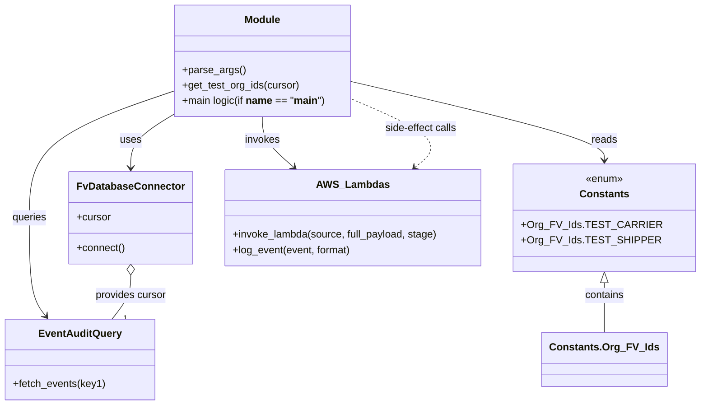

# Diagram: common/monitoring/scripts/replay_full_shipment.py


> Auto-generated by Obscura crawlers

## Diagram 1

```mermaid
flowchart TD
    Start([Start])
    ParseArgs[/parse_args()/]
    ConnectDB[(DB_CONN: FvDatabaseConnector)]
    ConnectCore[(DB_CONN_CORE: FvDatabaseConnector)]
    QueryEvents>Query event_audit using key1]
    GetTestOrgs>Call get_test_org_ids(cursor)]
    PrepareVars[[set test_carrier, test_shipper, new_shipment_id, eagle, cont=true]]
    Loop{for each event in results}
    HasSourceEvent{source and event and cont?}
    StopCondition{event_id == 4577694468?}
    ModifyAuthorizer[/modify authorizer.organization_id to test carrier/]
    SerializeReplace[/json.dumps and string replacements:\nkey2->test_carrier, key3->test_shipper, key1->new_shipment_id/]
    ParseBody[/body = json.loads(event.get("body"))/]
    AdjustSource{source == "v2_post_supplemental_shipment"?}
    InvokeLambda[/fv.aws.lambdas.invoke_lambda(source, full_payload=event, stage=copy_stage)/]
    PrintRes[/print(res)/]
    End([End])

    Start --> ParseArgs --> ConnectDB --> ConnectCore --> QueryEvents --> GetTestOrgs --> PrepareVars --> Loop
    Loop --> HasSourceEvent
    HasSourceEvent -- No --> Loop
    HasSourceEvent -- Yes --> StopCondition
    StopCondition -- Yes --> Loop
    StopCondition -- No --> ModifyAuthorizer --> SerializeReplace --> ParseBody --> AdjustSource
    AdjustSource -- Yes --> InvokeLambda
    AdjustSource -- No --> InvokeLambda
    InvokeLambda --> PrintRes --> Loop
    Loop --> End
```

> SVG rendering failed for this diagram.

## Diagram 2



### SVG

<svg id="container" width="1048.578125" xmlns="http://www.w3.org/2000/svg" class="classDiagram" height="632" viewBox="0 0 1048.578125 632" role="graphics-document document" aria-roledescription="class"><style>#container{font-family:"trebuchet ms",verdana,arial,sans-serif;font-size:16px;fill:#333;}@keyframes edge-animation-frame{from{stroke-dashoffset:0;}}@keyframes dash{to{stroke-dashoffset:0;}}#container .edge-animation-slow{stroke-dasharray:9,5!important;stroke-dashoffset:900;animation:dash 50s linear infinite;stroke-linecap:round;}#container .edge-animation-fast{stroke-dasharray:9,5!important;stroke-dashoffset:900;animation:dash 20s linear infinite;stroke-linecap:round;}#container .error-icon{fill:#552222;}#container .error-text{fill:#552222;stroke:#552222;}#container .edge-thickness-normal{stroke-width:1px;}#container .edge-thickness-thick{stroke-width:3.5px;}#container .edge-pattern-solid{stroke-dasharray:0;}#container .edge-thickness-invisible{stroke-width:0;fill:none;}#container .edge-pattern-dashed{stroke-dasharray:3;}#container .edge-pattern-dotted{stroke-dasharray:2;}#container .marker{fill:#333333;stroke:#333333;}#container .marker.cross{stroke:#333333;}#container svg{font-family:"trebuchet ms",verdana,arial,sans-serif;font-size:16px;}#container p{margin:0;}#container g.classGroup text{fill:#9370DB;stroke:none;font-family:"trebuchet ms",verdana,arial,sans-serif;font-size:10px;}#container g.classGroup text .title{font-weight:bolder;}#container .nodeLabel,#container .edgeLabel{color:#131300;}#container .edgeLabel .label rect{fill:#ECECFF;}#container .label text{fill:#131300;}#container .labelBkg{background:#ECECFF;}#container .edgeLabel .label span{background:#ECECFF;}#container .classTitle{font-weight:bolder;}#container .node rect,#container .node circle,#container .node ellipse,#container .node polygon,#container .node path{fill:#ECECFF;stroke:#9370DB;stroke-width:1px;}#container .divider{stroke:#9370DB;stroke-width:1;}#container g.clickable{cursor:pointer;}#container g.classGroup rect{fill:#ECECFF;stroke:#9370DB;}#container g.classGroup line{stroke:#9370DB;stroke-width:1;}#container .classLabel .box{stroke:none;stroke-width:0;fill:#ECECFF;opacity:0.5;}#container .classLabel .label{fill:#9370DB;font-size:10px;}#container .relation{stroke:#333333;stroke-width:1;fill:none;}#container .dashed-line{stroke-dasharray:3;}#container .dotted-line{stroke-dasharray:1 2;}#container #compositionStart,#container .composition{fill:#333333!important;stroke:#333333!important;stroke-width:1;}#container #compositionEnd,#container .composition{fill:#333333!important;stroke:#333333!important;stroke-width:1;}#container #dependencyStart,#container .dependency{fill:#333333!important;stroke:#333333!important;stroke-width:1;}#container #dependencyStart,#container .dependency{fill:#333333!important;stroke:#333333!important;stroke-width:1;}#container #extensionStart,#container .extension{fill:transparent!important;stroke:#333333!important;stroke-width:1;}#container #extensionEnd,#container .extension{fill:transparent!important;stroke:#333333!important;stroke-width:1;}#container #aggregationStart,#container .aggregation{fill:transparent!important;stroke:#333333!important;stroke-width:1;}#container #aggregationEnd,#container .aggregation{fill:transparent!important;stroke:#333333!important;stroke-width:1;}#container #lollipopStart,#container .lollipop{fill:#ECECFF!important;stroke:#333333!important;stroke-width:1;}#container #lollipopEnd,#container .lollipop{fill:#ECECFF!important;stroke:#333333!important;stroke-width:1;}#container .edgeTerminals{font-size:11px;line-height:initial;}#container .classTitleText{text-anchor:middle;font-size:18px;fill:#333;}#container .label-icon{display:inline-block;height:1em;overflow:visible;vertical-align:-0.125em;}#container .node .label-icon path{fill:currentColor;stroke:revert;stroke-width:revert;}#container :root{--mermaid-font-family:"trebuchet ms",verdana,arial,sans-serif;}</style><g><defs><marker id="container_class-aggregationStart" class="marker aggregation class" refX="18" refY="7" markerWidth="190" markerHeight="240" orient="auto"><path d="M 18,7 L9,13 L1,7 L9,1 Z"></path></marker></defs><defs><marker id="container_class-aggregationEnd" class="marker aggregation class" refX="1" refY="7" markerWidth="20" markerHeight="28" orient="auto"><path d="M 18,7 L9,13 L1,7 L9,1 Z"></path></marker></defs><defs><marker id="container_class-extensionStart" class="marker extension class" refX="18" refY="7" markerWidth="190" markerHeight="240" orient="auto"><path d="M 1,7 L18,13 V 1 Z"></path></marker></defs><defs><marker id="container_class-extensionEnd" class="marker extension class" refX="1" refY="7" markerWidth="20" markerHeight="28" orient="auto"><path d="M 1,1 V 13 L18,7 Z"></path></marker></defs><defs><marker id="container_class-compositionStart" class="marker composition class" refX="18" refY="7" markerWidth="190" markerHeight="240" orient="auto"><path d="M 18,7 L9,13 L1,7 L9,1 Z"></path></marker></defs><defs><marker id="container_class-compositionEnd" class="marker composition class" refX="1" refY="7" markerWidth="20" markerHeight="28" orient="auto"><path d="M 18,7 L9,13 L1,7 L9,1 Z"></path></marker></defs><defs><marker id="container_class-dependencyStart" class="marker dependency class" refX="6" refY="7" markerWidth="190" markerHeight="240" orient="auto"><path d="M 5,7 L9,13 L1,7 L9,1 Z"></path></marker></defs><defs><marker id="container_class-dependencyEnd" class="marker dependency class" refX="13" refY="7" markerWidth="20" markerHeight="28" orient="auto"><path d="M 18,7 L9,13 L14,7 L9,1 Z"></path></marker></defs><defs><marker id="container_class-lollipopStart" class="marker lollipop class" refX="13" refY="7" markerWidth="190" markerHeight="240" orient="auto"><circle stroke="black" fill="transparent" cx="7" cy="7" r="6"></circle></marker></defs><defs><marker id="container_class-lollipopEnd" class="marker lollipop class" refX="1" refY="7" markerWidth="190" markerHeight="240" orient="auto"><circle stroke="black" fill="transparent" cx="7" cy="7" r="6"></circle></marker></defs><g class="root"><g class="clusters"></g><g class="edgePaths"><path d="M264.559,178.476L253.546,185.23C242.534,191.984,220.509,205.492,209.497,219.413C198.484,233.333,198.484,247.667,198.484,254.833L198.484,262" id="id_Module_FvDatabaseConnector_1" class="edge-thickness-normal edge-pattern-solid relation" style=";;;" data-edge="true" data-et="edge" data-id="id_Module_FvDatabaseConnector_1" data-points="W3sieCI6MjY0LjU1ODU5Mzc1LCJ5IjoxNzguNDc2NDE5NTU5ODgzM30seyJ4IjoxOTguNDg0Mzc1LCJ5IjoyMTl9LHsieCI6MTk4LjQ4NDM3NSwieSI6MjY4fV0=" marker-end="url(#container_class-dependencyEnd)"></path><path d="M536.777,127.868L599.676,143.056C662.574,158.245,788.371,188.623,851.27,208.978C914.168,229.333,914.168,239.667,914.168,244.833L914.168,250" id="id_Module_Constants_2" class="edge-thickness-normal edge-pattern-solid relation" style=";;;" data-edge="true" data-et="edge" data-id="id_Module_Constants_2" data-points="W3sieCI6NTM2Ljc3NzM0Mzc1LCJ5IjoxMjcuODY3Njk3MTc2MjQxNDh9LHsieCI6OTE0LjE2Nzk2ODc1LCJ5IjoyMTl9LHsieCI6OTE0LjE2Nzk2ODc1LCJ5IjoyNTZ9XQ==" marker-end="url(#container_class-dependencyEnd)"></path><path d="M400.668,182L400.668,188.167C400.668,194.333,400.668,206.667,408.666,219.841C416.665,233.015,432.661,247.031,440.66,254.038L448.658,261.046" id="id_Module_AWS_Lambdas_3" class="edge-thickness-normal edge-pattern-solid relation" style=";;;" data-edge="true" data-et="edge" data-id="id_Module_AWS_Lambdas_3" data-points="W3sieCI6NDAwLjY2Nzk2ODc1LCJ5IjoxODJ9LHsieCI6NDAwLjY2Nzk2ODc1LCJ5IjoyMTl9LHsieCI6NDUzLjE3MDg3NDIyNTIwNjYsInkiOjI2NX1d" marker-end="url(#container_class-dependencyEnd)"></path><path d="M264.559,142.445L227.955,155.204C191.352,167.963,118.145,193.482,81.541,226.407C44.938,259.333,44.938,299.667,44.938,340C44.938,380.333,44.938,420.667,49.063,446.207C53.188,471.747,61.439,482.494,65.564,487.867L69.69,493.241" id="id_Module_EventAuditQuery_4" class="edge-thickness-normal edge-pattern-solid relation" style=";;;" data-edge="true" data-et="edge" data-id="id_Module_EventAuditQuery_4" data-points="W3sieCI6MjY0LjU1ODU5Mzc1LCJ5IjoxNDIuNDQ0ODA0Mzc0ODAwOTh9LHsieCI6NDQuOTM3NSwieSI6MjE5fSx7IngiOjQ0LjkzNzUsInkiOjM0MH0seyJ4Ijo0NC45Mzc1LCJ5Ijo0NjF9LHsieCI6NzMuMzQzNjcxODc1LCJ5Ijo0OTh9XQ==" marker-end="url(#container_class-dependencyEnd)"></path><path d="M198.484,429.25L198.484,434.542C198.484,439.833,198.484,450.417,193.75,461.875C189.016,473.333,179.547,485.667,174.813,491.833L170.078,498" id="id_FvDatabaseConnector_EventAuditQuery_5" class="edge-thickness-normal edge-pattern-solid relation" style=";;;" data-edge="true" data-et="edge" data-id="id_FvDatabaseConnector_EventAuditQuery_5" data-points="W3sieCI6MTk4LjQ4NDM3NSwieSI6NDEyfSx7IngiOjE5OC40ODQzNzUsInkiOjQ2MX0seyJ4IjoxNzAuMDc4MjAzMTI1MDAwMDIsInkiOjQ5OH1d" marker-start="url(#container_class-aggregationStart)"></path><path d="M914.168,441.25L914.168,444.542C914.168,447.833,914.168,454.417,914.168,467.375C914.168,480.333,914.168,499.667,914.168,509.333L914.168,519" id="id_Constants_Constants.Org_FV_Ids_6" class="edge-thickness-normal edge-pattern-solid relation" style=";;;" data-edge="true" data-et="edge" data-id="id_Constants_Constants.Org_FV_Ids_6" data-points="W3sieCI6OTE0LjE2Nzk2ODc1LCJ5Ijo0MjR9LHsieCI6OTE0LjE2Nzk2ODc1LCJ5Ijo0NjF9LHsieCI6OTE0LjE2Nzk2ODc1LCJ5Ijo1MTl9XQ==" marker-start="url(#container_class-extensionStart)"></path><path d="M629.378,261.059L637.423,254.049C645.469,247.039,661.56,233.02,646.126,215.499C630.693,197.978,583.735,176.956,560.256,166.445L536.777,155.934" id="id_AWS_Lambdas_Module_7" class="edge-thickness-normal edge-pattern-dashed relation" style=";;;" data-edge="true" data-et="edge" data-id="id_AWS_Lambdas_Module_7" data-points="W3sieCI6NjI0Ljg1NDE5MzU2OTIxNDksInkiOjI2NX0seyJ4Ijo2NzcuNjUwMzkwNjI1LCJ5IjoyMTl9LHsieCI6NTM2Ljc3NzM0Mzc1LCJ5IjoxNTUuOTMzNjk1MzA3MjY2NX1d" marker-start="url(#container_class-dependencyStart)"></path></g><g class="edgeLabels"><g class="edgeLabel" transform="translate(198.484375, 219)"><g class="label" data-id="id_Module_FvDatabaseConnector_1" transform="translate(-16.4921875, -12)"><foreignObject width="32.984375" height="24"><div xmlns="http://www.w3.org/1999/xhtml" class="labelBkg" style="display: table-cell; white-space: nowrap; line-height: 1.5; max-width: 200px; text-align: center;"><span class="edgeLabel"><p>uses</p></span></div></foreignObject></g></g><g class="edgeLabel" transform="translate(914.16796875, 219)"><g class="label" data-id="id_Module_Constants_2" transform="translate(-20.0078125, -12)"><foreignObject width="40.015625" height="24"><div xmlns="http://www.w3.org/1999/xhtml" class="labelBkg" style="display: table-cell; white-space: nowrap; line-height: 1.5; max-width: 200px; text-align: center;"><span class="edgeLabel"><p>reads</p></span></div></foreignObject></g></g><g class="edgeLabel" transform="translate(400.66796875, 219)"><g class="label" data-id="id_Module_AWS_Lambdas_3" transform="translate(-27.5859375, -12)"><foreignObject width="55.171875" height="24"><div xmlns="http://www.w3.org/1999/xhtml" class="labelBkg" style="display: table-cell; white-space: nowrap; line-height: 1.5; max-width: 200px; text-align: center;"><span class="edgeLabel"><p>invokes</p></span></div></foreignObject></g></g><g class="edgeLabel" transform="translate(44.9375, 340)"><g class="label" data-id="id_Module_EventAuditQuery_4" transform="translate(-27.2421875, -12)"><foreignObject width="54.484375" height="24"><div xmlns="http://www.w3.org/1999/xhtml" class="labelBkg" style="display: table-cell; white-space: nowrap; line-height: 1.5; max-width: 200px; text-align: center;"><span class="edgeLabel"><p>queries</p></span></div></foreignObject></g></g><g class="edgeLabel" transform="translate(198.484375, 461)"><g class="label" data-id="id_FvDatabaseConnector_EventAuditQuery_5" transform="translate(-56.296875, -12)"><foreignObject width="112.59375" height="24"><div xmlns="http://www.w3.org/1999/xhtml" class="labelBkg" style="display: table-cell; white-space: nowrap; line-height: 1.5; max-width: 200px; text-align: center;"><span class="edgeLabel"><p>provides cursor</p></span></div></foreignObject></g></g><g class="edgeLabel" transform="translate(914.16796875, 461)"><g class="label" data-id="id_Constants_Constants.Org_FV_Ids_6" transform="translate(-30.890625, -12)"><foreignObject width="61.78125" height="24"><div xmlns="http://www.w3.org/1999/xhtml" class="labelBkg" style="display: table-cell; white-space: nowrap; line-height: 1.5; max-width: 200px; text-align: center;"><span class="edgeLabel"><p>contains</p></span></div></foreignObject></g></g><g class="edgeLabel" transform="translate(639.16998, 201.77302)"><g class="label" data-id="id_AWS_Lambdas_Module_7" transform="translate(-57.6328125, -12)"><foreignObject width="115.265625" height="24"><div xmlns="http://www.w3.org/1999/xhtml" class="labelBkg" style="display: table-cell; white-space: nowrap; line-height: 1.5; max-width: 200px; text-align: center;"><span class="edgeLabel"><p>side-effect calls</p></span></div></foreignObject></g></g><g class="edgeTerminals" transform="translate(187.63304491937706, 488.25352244990205)"><g class="inner" transform="translate(0, 0)"></g><foreignObject style="width: 9px; height: 12px;"><div xmlns="http://www.w3.org/1999/xhtml" style="display: inline-block; padding-right: 1px; white-space: nowrap;"><span class="edgeLabel">1</span></div></foreignObject></g></g><g class="nodes"><g class="node default" id="classId-Module-0" transform="translate(400.66796875, 95)"><g class="basic label-container"><path d="M-136.109375 -87 L136.109375 -87 L136.109375 87 L-136.109375 87" stroke="none" stroke-width="0" fill="#ECECFF" style=""></path><path d="M-136.109375 -87 C-74.88966395896952 -87, -13.669952917939057 -87, 136.109375 -87 M-136.109375 -87 C-52.66521594534507 -87, 30.778943109309864 -87, 136.109375 -87 M136.109375 -87 C136.109375 -19.68244616681271, 136.109375 47.63510766637458, 136.109375 87 M136.109375 -87 C136.109375 -44.984995131623414, 136.109375 -2.969990263246828, 136.109375 87 M136.109375 87 C41.02128476417029 87, -54.06680547165942 87, -136.109375 87 M136.109375 87 C45.26650693176066 87, -45.57636113647868 87, -136.109375 87 M-136.109375 87 C-136.109375 25.573028312593557, -136.109375 -35.853943374812886, -136.109375 -87 M-136.109375 87 C-136.109375 26.55995885010246, -136.109375 -33.88008229979508, -136.109375 -87" stroke="#9370DB" stroke-width="1.3" fill="none" stroke-dasharray="0 0" style=""></path></g><g class="annotation-group text" transform="translate(0, -63)"></g><g class="label-group text" transform="translate(-27.09375, -63)"><g class="label" style="font-weight: bolder" transform="translate(0,-12)"><foreignObject width="54.1875" height="24"><div xmlns="http://www.w3.org/1999/xhtml" style="display: table-cell; white-space: nowrap; line-height: 1.5; max-width: 104px; text-align: center;"><span class="nodeLabel markdown-node-label" style=""><p>Module</p></span></div></foreignObject></g></g><g class="members-group text" transform="translate(-124.109375, -15)"></g><g class="methods-group text" transform="translate(-124.109375, 15)"><g class="label" style="" transform="translate(0,-12)"><foreignObject width="96.53125" height="24"><div xmlns="http://www.w3.org/1999/xhtml" style="display: table-cell; white-space: nowrap; line-height: 1.5; max-width: 154px; text-align: center;"><span class="nodeLabel markdown-node-label" style=""><p>+parse_args()</p></span></div></foreignObject></g><g class="label" style="" transform="translate(0,12)"><foreignObject width="183.6875" height="24"><div xmlns="http://www.w3.org/1999/xhtml" style="display: table-cell; white-space: nowrap; line-height: 1.5; max-width: 241px; text-align: center;"><span class="nodeLabel markdown-node-label" style=""><p>+get_test_org_ids(cursor)</p></span></div></foreignObject></g><g class="label" style="" transform="translate(0,36)"><foreignObject width="221.125" height="24"><div xmlns="http://www.w3.org/1999/xhtml" style="display: table-cell; white-space: nowrap; line-height: 1.5; max-width: 341px; text-align: center;"><span class="nodeLabel markdown-node-label" style=""><p>+main logic(if <strong>name</strong> == "<strong>main</strong>")</p></span></div></foreignObject></g></g><g class="divider" style=""><path d="M-136.109375 -39 C-64.07919713574107 -39, 7.950980728517862 -39, 136.109375 -39 M-136.109375 -39 C-35.21314785898397 -39, 65.68307928203205 -39, 136.109375 -39" stroke="#9370DB" stroke-width="1.3" fill="none" stroke-dasharray="0 0" style=""></path></g><g class="divider" style=""><path d="M-136.109375 -15 C-31.54573054078628 -15, 73.01791391842744 -15, 136.109375 -15 M-136.109375 -15 C-56.85335492193934 -15, 22.402665156121316 -15, 136.109375 -15" stroke="#9370DB" stroke-width="1.3" fill="none" stroke-dasharray="0 0" style=""></path></g></g><g class="node default" id="classId-FvDatabaseConnector-1" transform="translate(198.484375, 340)"><g class="basic label-container"><path d="M-91.3046875 -72 L91.3046875 -72 L91.3046875 72 L-91.3046875 72" stroke="none" stroke-width="0" fill="#ECECFF" style=""></path><path d="M-91.3046875 -72 C-36.56876537387828 -72, 18.167156752243443 -72, 91.3046875 -72 M-91.3046875 -72 C-29.132962800068007 -72, 33.038761899863985 -72, 91.3046875 -72 M91.3046875 -72 C91.3046875 -21.502647244185802, 91.3046875 28.994705511628396, 91.3046875 72 M91.3046875 -72 C91.3046875 -28.814255401510948, 91.3046875 14.371489196978104, 91.3046875 72 M91.3046875 72 C39.764860676732845 72, -11.774966146534311 72, -91.3046875 72 M91.3046875 72 C40.207640924148606 72, -10.889405651702788 72, -91.3046875 72 M-91.3046875 72 C-91.3046875 17.55702517339064, -91.3046875 -36.88594965321872, -91.3046875 -72 M-91.3046875 72 C-91.3046875 20.27091072440615, -91.3046875 -31.4581785511877, -91.3046875 -72" stroke="#9370DB" stroke-width="1.3" fill="none" stroke-dasharray="0 0" style=""></path></g><g class="annotation-group text" transform="translate(0, -48)"></g><g class="label-group text" transform="translate(-79.3046875, -48)"><g class="label" style="font-weight: bolder" transform="translate(0,-12)"><foreignObject width="158.609375" height="24"><div xmlns="http://www.w3.org/1999/xhtml" style="display: table-cell; white-space: nowrap; line-height: 1.5; max-width: 207px; text-align: center;"><span class="nodeLabel markdown-node-label" style=""><p>FvDatabaseConnector</p></span></div></foreignObject></g></g><g class="members-group text" transform="translate(-79.3046875, 0)"><g class="label" style="" transform="translate(0,-12)"><foreignObject width="53.71875" height="24"><div xmlns="http://www.w3.org/1999/xhtml" style="display: table-cell; white-space: nowrap; line-height: 1.5; max-width: 112px; text-align: center;"><span class="nodeLabel markdown-node-label" style=""><p>+cursor</p></span></div></foreignObject></g></g><g class="methods-group text" transform="translate(-79.3046875, 48)"><g class="label" style="" transform="translate(0,-12)"><foreignObject width="75.921875" height="24"><div xmlns="http://www.w3.org/1999/xhtml" style="display: table-cell; white-space: nowrap; line-height: 1.5; max-width: 133px; text-align: center;"><span class="nodeLabel markdown-node-label" style=""><p>+connect()</p></span></div></foreignObject></g></g><g class="divider" style=""><path d="M-91.3046875 -24 C-30.823633256667875 -24, 29.65742098666425 -24, 91.3046875 -24 M-91.3046875 -24 C-51.19007693890689 -24, -11.075466377813783 -24, 91.3046875 -24" stroke="#9370DB" stroke-width="1.3" fill="none" stroke-dasharray="0 0" style=""></path></g><g class="divider" style=""><path d="M-91.3046875 24 C-38.57879330372419 24, 14.14710089255162 24, 91.3046875 24 M-91.3046875 24 C-45.10786868328465 24, 1.0889501334307 24, 91.3046875 24" stroke="#9370DB" stroke-width="1.3" fill="none" stroke-dasharray="0 0" style=""></path></g></g><g class="node default" id="classId-Constants-2" transform="translate(914.16796875, 340)"><g class="basic label-container"><path d="M-126.41015625 -84 L126.41015625 -84 L126.41015625 84 L-126.41015625 84" stroke="none" stroke-width="0" fill="#ECECFF" style=""></path><path d="M-126.41015625 -84 C-53.20961176325686 -84, 19.99093272348628 -84, 126.41015625 -84 M-126.41015625 -84 C-47.63512732662247 -84, 31.139901596755067 -84, 126.41015625 -84 M126.41015625 -84 C126.41015625 -24.086065887216776, 126.41015625 35.82786822556645, 126.41015625 84 M126.41015625 -84 C126.41015625 -35.79167259517096, 126.41015625 12.416654809658084, 126.41015625 84 M126.41015625 84 C55.432412011874035 84, -15.54533222625193 84, -126.41015625 84 M126.41015625 84 C56.17219291989434 84, -14.065770410211314 84, -126.41015625 84 M-126.41015625 84 C-126.41015625 36.05411611374241, -126.41015625 -11.89176777251518, -126.41015625 -84 M-126.41015625 84 C-126.41015625 30.444765292778868, -126.41015625 -23.110469414442264, -126.41015625 -84" stroke="#9370DB" stroke-width="1.3" fill="none" stroke-dasharray="0 0" style=""></path></g><g class="annotation-group text" transform="translate(-29.53125, -60)"><g class="label" style="" transform="translate(0,-12)"><foreignObject width="59.0625" height="24"><div xmlns="http://www.w3.org/1999/xhtml" style="display: table-cell; white-space: nowrap; line-height: 1.5; max-width: 109px; text-align: center;"><span class="nodeLabel markdown-node-label" style=""><p>«enum»</p></span></div></foreignObject></g></g><g class="label-group text" transform="translate(-36.5390625, -36)"><g class="label" style="font-weight: bolder" transform="translate(0,-12)"><foreignObject width="73.078125" height="24"><div xmlns="http://www.w3.org/1999/xhtml" style="display: table-cell; white-space: nowrap; line-height: 1.5; max-width: 122px; text-align: center;"><span class="nodeLabel markdown-node-label" style=""><p>Constants</p></span></div></foreignObject></g></g><g class="members-group text" transform="translate(-114.41015625, 12)"><g class="label" style="" transform="translate(0,-12)"><foreignObject width="191.25" height="24"><div xmlns="http://www.w3.org/1999/xhtml" style="display: table-cell; white-space: nowrap; line-height: 1.5; max-width: 249px; text-align: center;"><span class="nodeLabel markdown-node-label" style=""><p>+Org_FV_Ids.TEST_CARRIER</p></span></div></foreignObject></g><g class="label" style="" transform="translate(0,12)"><foreignObject width="192.28125" height="24"><div xmlns="http://www.w3.org/1999/xhtml" style="display: table-cell; white-space: nowrap; line-height: 1.5; max-width: 250px; text-align: center;"><span class="nodeLabel markdown-node-label" style=""><p>+Org_FV_Ids.TEST_SHIPPER</p></span></div></foreignObject></g></g><g class="methods-group text" transform="translate(-114.41015625, 84)"></g><g class="divider" style=""><path d="M-126.41015625 -12 C-61.1219648110328 -12, 4.166226627934407 -12, 126.41015625 -12 M-126.41015625 -12 C-61.89374716971936 -12, 2.622661910561277 -12, 126.41015625 -12" stroke="#9370DB" stroke-width="1.3" fill="none" stroke-dasharray="0 0" style=""></path></g><g class="divider" style=""><path d="M-126.41015625 60 C-70.5225575405606 60, -14.634958831121196 60, 126.41015625 60 M-126.41015625 60 C-67.49556649612538 60, -8.580976742250755 60, 126.41015625 60" stroke="#9370DB" stroke-width="1.3" fill="none" stroke-dasharray="0 0" style=""></path></g></g><g class="node default" id="classId-AWS_Lambdas-3" transform="translate(538.7734375, 340)"><g class="basic label-container"><path d="M-198.984375 -75 L198.984375 -75 L198.984375 75 L-198.984375 75" stroke="none" stroke-width="0" fill="#ECECFF" style=""></path><path d="M-198.984375 -75 C-43.0897129592841 -75, 112.8049490814318 -75, 198.984375 -75 M-198.984375 -75 C-102.9588812668054 -75, -6.933387533610812 -75, 198.984375 -75 M198.984375 -75 C198.984375 -38.86507129184765, 198.984375 -2.7301425836952973, 198.984375 75 M198.984375 -75 C198.984375 -40.54575999158412, 198.984375 -6.09151998316824, 198.984375 75 M198.984375 75 C81.99343834562843 75, -34.99749830874313 75, -198.984375 75 M198.984375 75 C109.84809997021547 75, 20.711824940430944 75, -198.984375 75 M-198.984375 75 C-198.984375 18.944307811768077, -198.984375 -37.111384376463846, -198.984375 -75 M-198.984375 75 C-198.984375 44.908669657920285, -198.984375 14.81733931584057, -198.984375 -75" stroke="#9370DB" stroke-width="1.3" fill="none" stroke-dasharray="0 0" style=""></path></g><g class="annotation-group text" transform="translate(0, -51)"></g><g class="label-group text" transform="translate(-52.828125, -51)"><g class="label" style="font-weight: bolder" transform="translate(0,-12)"><foreignObject width="105.65625" height="24"><div xmlns="http://www.w3.org/1999/xhtml" style="display: table-cell; white-space: nowrap; line-height: 1.5; max-width: 154px; text-align: center;"><span class="nodeLabel markdown-node-label" style=""><p>AWS_Lambdas</p></span></div></foreignObject></g></g><g class="members-group text" transform="translate(-186.984375, -3)"></g><g class="methods-group text" transform="translate(-186.984375, 27)"><g class="label" style="" transform="translate(0,-12)"><foreignObject width="321.140625" height="24"><div xmlns="http://www.w3.org/1999/xhtml" style="display: table-cell; white-space: nowrap; line-height: 1.5; max-width: 379px; text-align: center;"><span class="nodeLabel markdown-node-label" style=""><p>+invoke_lambda(source, full_payload, stage)</p></span></div></foreignObject></g><g class="label" style="" transform="translate(0,12)"><foreignObject width="186.421875" height="24"><div xmlns="http://www.w3.org/1999/xhtml" style="display: table-cell; white-space: nowrap; line-height: 1.5; max-width: 244px; text-align: center;"><span class="nodeLabel markdown-node-label" style=""><p>+log_event(event, format)</p></span></div></foreignObject></g></g><g class="divider" style=""><path d="M-198.984375 -27 C-72.02032633293575 -27, 54.943722334128495 -27, 198.984375 -27 M-198.984375 -27 C-55.27491816433022 -27, 88.43453867133957 -27, 198.984375 -27" stroke="#9370DB" stroke-width="1.3" fill="none" stroke-dasharray="0 0" style=""></path></g><g class="divider" style=""><path d="M-198.984375 -3 C-67.54351346023907 -3, 63.89734807952186 -3, 198.984375 -3 M-198.984375 -3 C-88.77973204222815 -3, 21.424910915543705 -3, 198.984375 -3" stroke="#9370DB" stroke-width="1.3" fill="none" stroke-dasharray="0 0" style=""></path></g></g><g class="node default" id="classId-EventAuditQuery-4" transform="translate(121.7109375, 561)"><g class="basic label-container"><path d="M-113.7109375 -63 L113.7109375 -63 L113.7109375 63 L-113.7109375 63" stroke="none" stroke-width="0" fill="#ECECFF" style=""></path><path d="M-113.7109375 -63 C-42.53408411542888 -63, 28.642769269142235 -63, 113.7109375 -63 M-113.7109375 -63 C-27.13932811379 -63, 59.43228127242 -63, 113.7109375 -63 M113.7109375 -63 C113.7109375 -37.06059948626051, 113.7109375 -11.121198972521015, 113.7109375 63 M113.7109375 -63 C113.7109375 -15.593740568393798, 113.7109375 31.812518863212404, 113.7109375 63 M113.7109375 63 C36.624936409264805 63, -40.46106468147039 63, -113.7109375 63 M113.7109375 63 C67.63628245482167 63, 21.56162740964335 63, -113.7109375 63 M-113.7109375 63 C-113.7109375 30.736815521903964, -113.7109375 -1.5263689561920728, -113.7109375 -63 M-113.7109375 63 C-113.7109375 31.116948058268783, -113.7109375 -0.766103883462435, -113.7109375 -63" stroke="#9370DB" stroke-width="1.3" fill="none" stroke-dasharray="0 0" style=""></path></g><g class="annotation-group text" transform="translate(0, -39)"></g><g class="label-group text" transform="translate(-61.515625, -39)"><g class="label" style="font-weight: bolder" transform="translate(0,-12)"><foreignObject width="123.03125" height="24"><div xmlns="http://www.w3.org/1999/xhtml" style="display: table-cell; white-space: nowrap; line-height: 1.5; max-width: 172px; text-align: center;"><span class="nodeLabel markdown-node-label" style=""><p>EventAuditQuery</p></span></div></foreignObject></g></g><g class="members-group text" transform="translate(-101.7109375, 9)"></g><g class="methods-group text" transform="translate(-101.7109375, 39)"><g class="label" style="" transform="translate(0,-12)"><foreignObject width="141.90625" height="24"><div xmlns="http://www.w3.org/1999/xhtml" style="display: table-cell; white-space: nowrap; line-height: 1.5; max-width: 199px; text-align: center;"><span class="nodeLabel markdown-node-label" style=""><p>+fetch_events(key1)</p></span></div></foreignObject></g></g><g class="divider" style=""><path d="M-113.7109375 -15 C-25.091508722833296 -15, 63.52792005433341 -15, 113.7109375 -15 M-113.7109375 -15 C-25.78605539279036 -15, 62.13882671441928 -15, 113.7109375 -15" stroke="#9370DB" stroke-width="1.3" fill="none" stroke-dasharray="0 0" style=""></path></g><g class="divider" style=""><path d="M-113.7109375 9 C-53.11677512353096 9, 7.477387252938087 9, 113.7109375 9 M-113.7109375 9 C-29.6761222786337 9, 54.3586929427326 9, 113.7109375 9" stroke="#9370DB" stroke-width="1.3" fill="none" stroke-dasharray="0 0" style=""></path></g></g><g class="node default" id="classId-Constants.Org_FV_Ids-5" transform="translate(914.16796875, 561)"><g class="basic label-container"><path d="M-90.796875 -42 L90.796875 -42 L90.796875 42 L-90.796875 42" stroke="none" stroke-width="0" fill="#ECECFF" style=""></path><path d="M-90.796875 -42 C-47.13011490178365 -42, -3.4633548035672987 -42, 90.796875 -42 M-90.796875 -42 C-36.36963809315691 -42, 18.057598813686184 -42, 90.796875 -42 M90.796875 -42 C90.796875 -17.400591433058892, 90.796875 7.198817133882216, 90.796875 42 M90.796875 -42 C90.796875 -23.68396666913669, 90.796875 -5.367933338273382, 90.796875 42 M90.796875 42 C36.04902810062562 42, -18.69881879874876 42, -90.796875 42 M90.796875 42 C25.197875919585286 42, -40.40112316082943 42, -90.796875 42 M-90.796875 42 C-90.796875 20.9368701181483, -90.796875 -0.12625976370340197, -90.796875 -42 M-90.796875 42 C-90.796875 18.9554912121986, -90.796875 -4.089017575602803, -90.796875 -42" stroke="#9370DB" stroke-width="1.3" fill="none" stroke-dasharray="0 0" style=""></path></g><g class="annotation-group text" transform="translate(0, -18)"></g><g class="label-group text" transform="translate(-78.796875, -18)"><g class="label" style="font-weight: bolder" transform="translate(0,-12)"><foreignObject width="157.59375" height="24"><div xmlns="http://www.w3.org/1999/xhtml" style="display: table-cell; white-space: nowrap; line-height: 1.5; max-width: 205px; text-align: center;"><span class="nodeLabel markdown-node-label" style=""><p>Constants.Org_FV_Ids</p></span></div></foreignObject></g></g><g class="members-group text" transform="translate(-78.796875, 30)"></g><g class="methods-group text" transform="translate(-78.796875, 60)"></g><g class="divider" style=""><path d="M-90.796875 6 C-39.339183322670884 6, 12.118508354658232 6, 90.796875 6 M-90.796875 6 C-34.91569498452623 6, 20.965485030947534 6, 90.796875 6" stroke="#9370DB" stroke-width="1.3" fill="none" stroke-dasharray="0 0" style=""></path></g><g class="divider" style=""><path d="M-90.796875 24 C-50.30608661689875 24, -9.815298233797506 24, 90.796875 24 M-90.796875 24 C-39.51027326886391 24, 11.776328462272176 24, 90.796875 24" stroke="#9370DB" stroke-width="1.3" fill="none" stroke-dasharray="0 0" style=""></path></g></g></g></g></g></svg>
