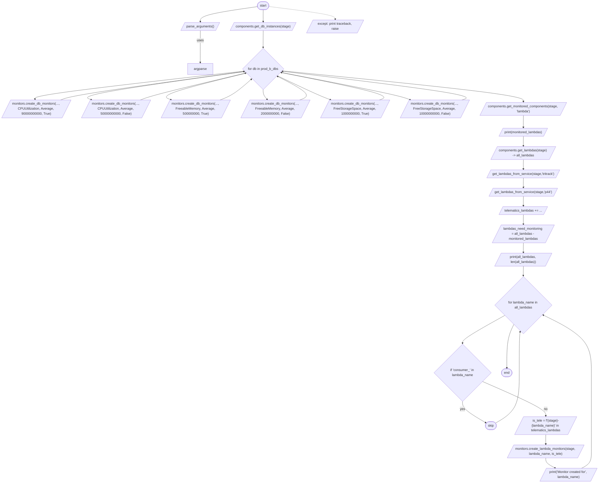
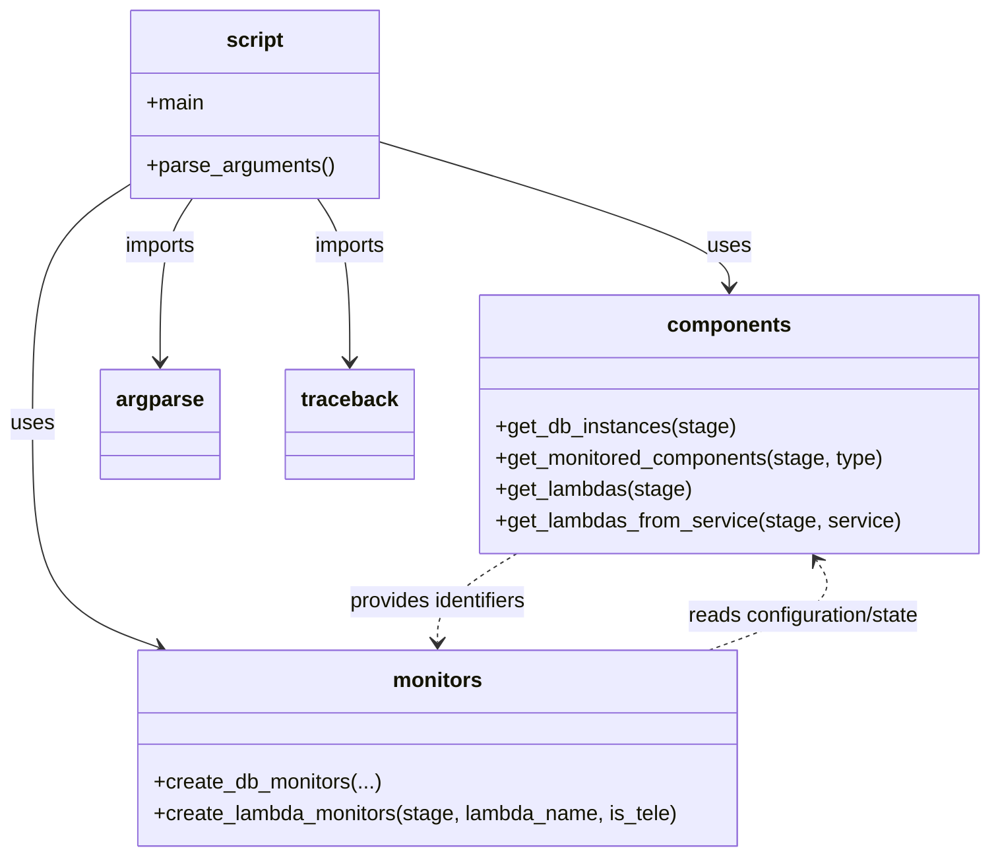
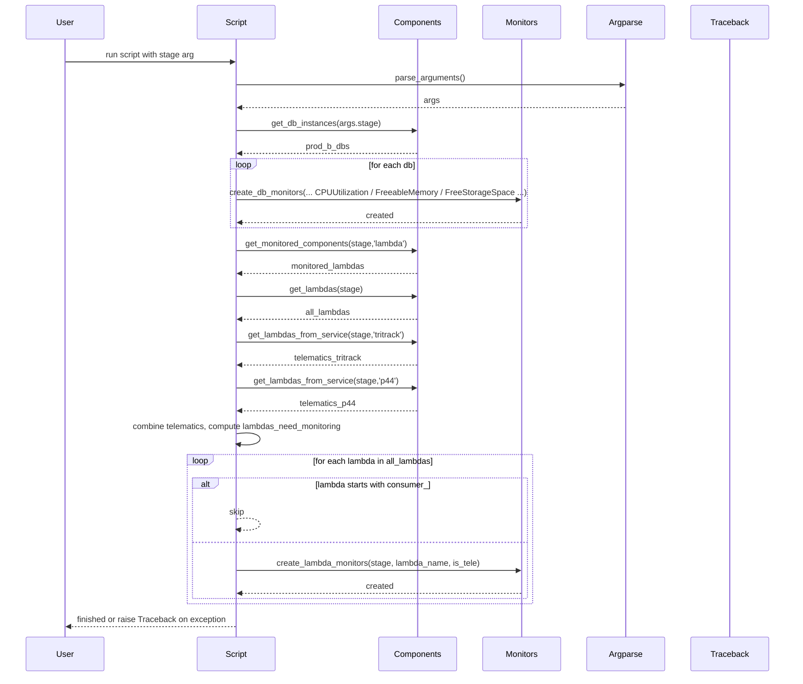

# Diagram: common/monitoring/update_monitors.py

> Auto-generated by Obscura crawlers

## Diagram 1

### SVG

<svg id="container" width="2932.670654296875" xmlns="http://www.w3.org/2000/svg" class="flowchart" height="2347.5625" viewBox="0 0 2932.670654296875 2347.5625" role="graphics-document document" aria-roledescription="flowchart-v2"><g><marker id="container_flowchart-v2-pointEnd" class="marker flowchart-v2" viewBox="0 0 10 10" refX="5" refY="5" markerUnits="userSpaceOnUse" markerWidth="8" markerHeight="8" orient="auto"><path d="M 0 0 L 10 5 L 0 10 z" class="arrowMarkerPath" style="stroke-width: 1; stroke-dasharray: 1, 0;"></path></marker><marker id="container_flowchart-v2-pointStart" class="marker flowchart-v2" viewBox="0 0 10 10" refX="4.5" refY="5" markerUnits="userSpaceOnUse" markerWidth="8" markerHeight="8" orient="auto"><path d="M 0 5 L 10 10 L 10 0 z" class="arrowMarkerPath" style="stroke-width: 1; stroke-dasharray: 1, 0;"></path></marker><marker id="container_flowchart-v2-circleEnd" class="marker flowchart-v2" viewBox="0 0 10 10" refX="11" refY="5" markerUnits="userSpaceOnUse" markerWidth="11" markerHeight="11" orient="auto"><circle cx="5" cy="5" r="5" class="arrowMarkerPath" style="stroke-width: 1; stroke-dasharray: 1, 0;"></circle></marker><marker id="container_flowchart-v2-circleStart" class="marker flowchart-v2" viewBox="0 0 10 10" refX="-1" refY="5" markerUnits="userSpaceOnUse" markerWidth="11" markerHeight="11" orient="auto"><circle cx="5" cy="5" r="5" class="arrowMarkerPath" style="stroke-width: 1; stroke-dasharray: 1, 0;"></circle></marker><marker id="container_flowchart-v2-crossEnd" class="marker cross flowchart-v2" viewBox="0 0 11 11" refX="12" refY="5.2" markerUnits="userSpaceOnUse" markerWidth="11" markerHeight="11" orient="auto"><path d="M 1,1 l 9,9 M 10,1 l -9,9" class="arrowMarkerPath" style="stroke-width: 2; stroke-dasharray: 1, 0;"></path></marker><marker id="container_flowchart-v2-crossStart" class="marker cross flowchart-v2" viewBox="0 0 11 11" refX="-1" refY="5.2" markerUnits="userSpaceOnUse" markerWidth="11" markerHeight="11" orient="auto"><path d="M 1,1 l 9,9 M 10,1 l -9,9" class="arrowMarkerPath" style="stroke-width: 2; stroke-dasharray: 1, 0;"></path></marker><g class="root"><g class="clusters"></g><g class="edgePaths"><path d="M1260.293,32.189L1214,38.824C1167.707,45.46,1075.122,58.73,1028.903,70.948C982.685,83.167,982.834,94.334,982.908,99.917L982.983,105.5" id="L_Start_ParseArgs_0" class="edge-thickness-normal edge-pattern-solid edge-thickness-normal edge-pattern-solid flowchart-link" style=";" data-edge="true" data-et="edge" data-id="L_Start_ParseArgs_0" data-points="W3sieCI6MTI2MC4yOTI4NDk4MTUzNzI4LCJ5IjozMi4xODkyNjgyNTQ5NjU0NX0seyJ4Ijo5ODIuNTM2MjU5NjUxMTg0MSwieSI6NzJ9LHsieCI6OTgzLjAzNjI1OTY1MTE4NDEsInkiOjEwOS41fV0=" marker-end="url(#container_flowchart-v2-pointEnd)"></path><path d="M983.036,148.5L982.953,156.583C982.87,164.667,982.703,180.833,982.62,207.13C982.536,233.427,982.536,269.854,982.536,288.068L982.536,306.281" id="L_ParseArgs_Argparse_0" class="edge-thickness-normal edge-pattern-solid edge-thickness-normal edge-pattern-solid flowchart-link" style=";" data-edge="true" data-et="edge" data-id="L_ParseArgs_Argparse_0" data-points="W3sieCI6OTgzLjAzNjI1OTY1MTE4NDEsInkiOjE0OC41fSx7IngiOjk4Mi41MzYyNTk2NTExODQxLCJ5IjoxOTd9LHsieCI6OTgyLjUzNjI1OTY1MTE4NDEsInkiOjMxMC4yODEyNX1d" marker-end="url(#container_flowchart-v2-pointEnd)"></path><path d="M1289.107,47.5L1289.023,51.583C1288.94,55.667,1288.773,63.833,1288.764,73.5C1288.755,83.167,1288.904,94.334,1288.979,99.917L1289.053,105.5" id="L_Start_GetDBs_0" class="edge-thickness-normal edge-pattern-solid edge-thickness-normal edge-pattern-solid flowchart-link" style=";" data-edge="true" data-et="edge" data-id="L_Start_GetDBs_0" data-points="W3sieCI6MTI4OS4xMDY1NzIxNTExODQsInkiOjQ3LjV9LHsieCI6MTI4OC42MDY1NzIxNTExODQsInkiOjcyfSx7IngiOjEyODkuMTA2NTcyMTUxMTg0LCJ5IjoxMDkuNX1d" marker-end="url(#container_flowchart-v2-pointEnd)"></path><path d="M1289.107,148.5L1289.023,156.583C1288.94,164.667,1288.773,180.833,1288.69,194.417C1288.607,208,1288.607,219,1288.607,224.5L1288.607,230" id="L_GetDBs_DBLoop_0" class="edge-thickness-normal edge-pattern-solid edge-thickness-normal edge-pattern-solid flowchart-link" style=";" data-edge="true" data-et="edge" data-id="L_GetDBs_DBLoop_0" data-points="W3sieCI6MTI4OS4xMDY1NzIxNTExODQsInkiOjE0OC41fSx7IngiOjEyODguNjA2NTcyMTUxMTg0LCJ5IjoxOTd9LHsieCI6MTI4OC42MDY1NzIxNTExODQsInkiOjIzNH1d" marker-end="url(#container_flowchart-v2-pointEnd)"></path><path d="M1195.936,347.892L1024.659,367.504C853.382,387.116,510.828,426.339,340.135,449.543C169.442,472.746,170.612,479.93,171.196,483.522L171.781,487.114" id="L_DBLoop_CreateDB1_0" class="edge-thickness-normal edge-pattern-solid edge-thickness-normal edge-pattern-solid flowchart-link" style=";" data-edge="true" data-et="edge" data-id="L_DBLoop_CreateDB1_0" data-points="W3sieCI6MTE5NS45MzYzMjI2NDQ1NTM3LCJ5IjozNDcuODkyMjUwNDkzMzY5OX0seyJ4IjoxNjguMjczNDM3NSwieSI6NDY1LjU2MjV9LHsieCI6MTcyLjQyMzA3MjUzNjQ5NjM2LCJ5Ijo0OTEuMDYyNX1d" marker-end="url(#container_flowchart-v2-pointEnd)"></path><path d="M1198.147,350.103L1062.38,369.346C926.614,388.589,655.08,427.076,530.042,450.335C405.004,473.595,426.461,481.628,437.19,485.644L447.919,489.66" id="L_DBLoop_CreateDB2_0" class="edge-thickness-normal edge-pattern-solid edge-thickness-normal edge-pattern-solid flowchart-link" style=";" data-edge="true" data-et="edge" data-id="L_DBLoop_CreateDB2_0" data-points="W3sieCI6MTE5OC4xNDY4ODY4OTAzODE0LCJ5IjozNTAuMTAyODE0NzM5MTk3NH0seyJ4IjozODMuNTQ2ODc1LCJ5Ijo0NjUuNTYyNX0seyJ4Ijo0NTEuNjY0OTE3ODgzMjExNywieSI6NDkxLjA2MjV9XQ==" marker-end="url(#container_flowchart-v2-pointEnd)"></path><path d="M1205.937,357.893L1133.963,375.838C1061.989,393.783,918.041,429.673,856.796,451.634C795.551,473.595,817.008,481.628,827.737,485.644L838.466,489.66" id="L_DBLoop_CreateDB3_0" class="edge-thickness-normal edge-pattern-solid edge-thickness-normal edge-pattern-solid flowchart-link" style=";" data-edge="true" data-et="edge" data-id="L_DBLoop_CreateDB3_0" data-points="W3sieCI6MTIwNS45MzY5NzQzNTE0MzQsInkiOjM1Ny44OTI5MDIyMDAyNDk4fSx7IngiOjc3NC4wOTM3NSwieSI6NDY1LjU2MjV9LHsieCI6ODQyLjIxMTc5Mjg4MzIxMTcsInkiOjQ5MS4wNjI1fV0=" marker-end="url(#container_flowchart-v2-pointEnd)"></path><path d="M1288.607,440.563L1288.607,444.729C1288.607,448.896,1288.607,457.229,1291.974,465.15C1295.341,473.07,1302.076,480.577,1305.443,484.331L1308.811,488.085" id="L_DBLoop_CreateDB4_0" class="edge-thickness-normal edge-pattern-solid edge-thickness-normal edge-pattern-solid flowchart-link" style=";" data-edge="true" data-et="edge" data-id="L_DBLoop_CreateDB4_0" data-points="W3sieCI6MTI4OC42MDY1NzIxNTExODQsInkiOjQ0MC41NjI1fSx7IngiOjEyODguNjA2NTcyMTUxMTg0LCJ5Ijo0NjUuNTYyNX0seyJ4IjoxMzExLjQ4MTU2ODYyODg1NDEsInkiOjQ5MS4wNjI1fV0=" marker-end="url(#container_flowchart-v2-pointEnd)"></path><path d="M1358.334,370.835L1391.143,386.623C1423.952,402.411,1489.57,433.987,1533.107,453.791C1576.645,473.595,1598.102,481.628,1608.831,485.644L1619.559,489.66" id="L_DBLoop_CreateDB5_0" class="edge-thickness-normal edge-pattern-solid edge-thickness-normal edge-pattern-solid flowchart-link" style=";" data-edge="true" data-et="edge" data-id="L_DBLoop_CreateDB5_0" data-points="W3sieCI6MTM1OC4zMzQyMjE0Mzk4MTA2LCJ5IjozNzAuODM0ODUwNzExMzczNH0seyJ4IjoxNTU1LjE4NzUsInkiOjQ2NS41NjI1fSx7IngiOjE2MjMuMzA1NTQyODgzMjExNywieSI6NDkxLjA2MjV9XQ==" marker-end="url(#container_flowchart-v2-pointEnd)"></path><path d="M1375.019,354.15L1470.138,372.719C1565.257,391.288,1755.496,428.425,1861.344,451.01C1967.192,473.595,1988.649,481.628,1999.378,485.644L2010.106,489.66" id="L_DBLoop_CreateDB6_0" class="edge-thickness-normal edge-pattern-solid edge-thickness-normal edge-pattern-solid flowchart-link" style=";" data-edge="true" data-et="edge" data-id="L_DBLoop_CreateDB6_0" data-points="W3sieCI6MTM3NS4wMTg4NDQzODI4NDA0LCJ5IjozNTQuMTUwMjI3NzY4MzQzNn0seyJ4IjoxOTQ1LjczNDM3NSwieSI6NDY1LjU2MjV9LHsieCI6MjAxMy44NTI0MTc4ODMyMTE3LCJ5Ijo0OTEuMDYyNX1d" marker-end="url(#container_flowchart-v2-pointEnd)"></path><path d="M296.429,491.063L307.615,486.813C318.802,482.563,341.174,474.063,490.76,450.62C640.345,427.178,917.143,388.793,1055.542,369.601L1193.941,350.409" id="L_CreateDB1_DBLoop_0" class="edge-thickness-normal edge-pattern-solid edge-thickness-normal edge-pattern-solid flowchart-link" style=";" data-edge="true" data-et="edge" data-id="L_CreateDB1_DBLoop_0" data-points="W3sieCI6Mjk2LjQyODgzMjExNjc4ODMsInkiOjQ5MS4wNjI1fSx7IngiOjM2My41NDY4NzUsInkiOjQ2NS41NjI1fSx7IngiOjExOTcuOTAzNDQxMjE4MzI1LCJ5IjozNDkuODU5MzY5MDY3MTQwOH1d" marker-end="url(#container_flowchart-v2-pointEnd)"></path><path d="M686.976,491.063L698.162,486.813C709.348,482.563,731.721,474.063,817.463,451.919C903.204,429.776,1052.315,393.99,1126.87,376.097L1201.425,358.204" id="L_CreateDB2_DBLoop_0" class="edge-thickness-normal edge-pattern-solid edge-thickness-normal edge-pattern-solid flowchart-link" style=";" data-edge="true" data-et="edge" data-id="L_CreateDB2_DBLoop_0" data-points="W3sieCI6Njg2Ljk3NTcwNzExNjc4ODMsInkiOjQ5MS4wNjI1fSx7IngiOjc1NC4wOTM3NSwieSI6NDY1LjU2MjV9LHsieCI6MTIwNS4zMTUwMTE4NzI3MDA2LCJ5IjozNTcuMjcwOTM5NzIxNTE2MzZ9XQ==" marker-end="url(#container_flowchart-v2-pointEnd)"></path><path d="M1077.523,491.063L1088.709,486.813C1099.895,482.563,1122.268,474.063,1147.848,456.987C1173.429,439.911,1202.216,414.259,1216.61,401.434L1231.004,388.608" id="L_CreateDB3_DBLoop_0" class="edge-thickness-normal edge-pattern-solid edge-thickness-normal edge-pattern-solid flowchart-link" style=";" data-edge="true" data-et="edge" data-id="L_CreateDB3_DBLoop_0" data-points="W3sieCI6MTA3Ny41MjI1ODIxMTY3ODgzLCJ5Ijo0OTEuMDYyNX0seyJ4IjoxMTQ0LjY0MDYyNSwieSI6NDY1LjU2MjV9LHsieCI6MTIzMy45OTA4MjkwNTE1MzYxLCJ5IjozODUuOTQ2NzU2OTAwMzUyMTd9XQ==" marker-end="url(#container_flowchart-v2-pointEnd)"></path><path d="M1468.069,491.063L1479.256,486.813C1490.442,482.563,1512.815,474.063,1494.819,454.631C1476.823,435.199,1418.458,404.835,1389.275,389.653L1360.093,374.471" id="L_CreateDB4_DBLoop_0" class="edge-thickness-normal edge-pattern-solid edge-thickness-normal edge-pattern-solid flowchart-link" style=";" data-edge="true" data-et="edge" data-id="L_CreateDB4_DBLoop_0" data-points="W3sieCI6MTQ2OC4wNjk0NTcxMTY3ODgzLCJ5Ijo0OTEuMDYyNX0seyJ4IjoxNTM1LjE4NzUsInkiOjQ2NS41NjI1fSx7IngiOjEzNTYuNTQ0MDM4MTMwMDk4LCJ5IjozNzIuNjI1MDM0MDIxMDg2MDR9XQ==" marker-end="url(#container_flowchart-v2-pointEnd)"></path><path d="M1858.616,491.063L1869.803,486.813C1880.989,482.563,1903.362,474.063,1823.342,451.449C1743.323,428.835,1560.911,392.108,1469.705,373.744L1378.499,355.381" id="L_CreateDB5_DBLoop_0" class="edge-thickness-normal edge-pattern-solid edge-thickness-normal edge-pattern-solid flowchart-link" style=";" data-edge="true" data-et="edge" data-id="L_CreateDB5_DBLoop_0" data-points="W3sieCI6MTg1OC42MTYzMzIxMTY3ODgzLCJ5Ijo0OTEuMDYyNX0seyJ4IjoxOTI1LjczNDM3NSwieSI6NDY1LjU2MjV9LHsieCI6MTM3NC41NzgwNjEwNDczMDEsInkiOjM1NC41OTEwMTExMDM4ODMxNX1d" marker-end="url(#container_flowchart-v2-pointEnd)"></path><path d="M2263.022,491.063L2275.536,486.813C2288.05,482.563,2313.078,474.063,2166.676,450.388C2020.273,426.714,1702.441,387.865,1543.525,368.44L1384.609,349.016" id="L_CreateDB6_DBLoop_0" class="edge-thickness-normal edge-pattern-solid edge-thickness-normal edge-pattern-solid flowchart-link" style=";" data-edge="true" data-et="edge" data-id="L_CreateDB6_DBLoop_0" data-points="W3sieCI6MjI2My4wMjIzODI1MjczNzI0LCJ5Ijo0OTEuMDYyNX0seyJ4IjoyMzM4LjEwNTQ2ODc1LCJ5Ijo0NjUuNTYyNX0seyJ4IjoxMzgwLjYzODY1MzIwNDE0MTcsInkiOjM0OC41MzA0MTg5NDcwNDI1fV0=" marker-end="url(#container_flowchart-v2-pointEnd)"></path><path d="M1382.457,346.712L1579.581,366.52C1776.706,386.329,2170.954,425.946,2368.153,451.337C2565.352,476.729,2565.501,487.896,2565.575,493.479L2565.65,499.063" id="L_DBLoop_GetMonitoredLambdas_0" class="edge-thickness-normal edge-pattern-solid edge-thickness-normal edge-pattern-solid flowchart-link" style=";" data-edge="true" data-et="edge" data-id="L_DBLoop_GetMonitoredLambdas_0" data-points="W3sieCI6MTM4Mi40NTcwNzQ2MzM3MTU4LCJ5IjozNDYuNzExOTk3NTE3NDY4MTV9LHsieCI6MjU2NS4yMDMxMjUsInkiOjQ2NS41NjI1fSx7IngiOjI1NjUuNzAzMTI1LCJ5Ijo1MDMuMDYyNX1d" marker-end="url(#container_flowchart-v2-pointEnd)"></path><path d="M2565.703,566.063L2565.62,572.146C2565.536,578.229,2565.37,590.396,2565.357,600.063C2565.344,609.729,2565.484,616.896,2565.554,620.48L2565.625,624.063" id="L_GetMonitoredLambdas_PrintMonitored_0" class="edge-thickness-normal edge-pattern-solid edge-thickness-normal edge-pattern-solid flowchart-link" style=";" data-edge="true" data-et="edge" data-id="L_GetMonitoredLambdas_PrintMonitored_0" data-points="W3sieCI6MjU2NS43MDMxMjUsInkiOjU2Ni4wNjI1fSx7IngiOjI1NjUuMjAzMTI1LCJ5Ijo2MDIuNTYyNX0seyJ4IjoyNTY1LjcwMzEyNSwieSI6NjI4LjA2MjV9XQ==" marker-end="url(#container_flowchart-v2-pointEnd)"></path><path d="M2565.703,667.063L2565.62,671.146C2565.536,675.229,2565.37,683.396,2565.357,691.063C2565.344,698.729,2565.484,705.896,2565.554,709.48L2565.625,713.063" id="L_PrintMonitored_GetAllLambdas_0" class="edge-thickness-normal edge-pattern-solid edge-thickness-normal edge-pattern-solid flowchart-link" style=";" data-edge="true" data-et="edge" data-id="L_PrintMonitored_GetAllLambdas_0" data-points="W3sieCI6MjU2NS43MDMxMjUsInkiOjY2Ny4wNjI1fSx7IngiOjI1NjUuMjAzMTI1LCJ5Ijo2OTEuNTYyNX0seyJ4IjoyNTY1LjcwMzEyNSwieSI6NzE3LjA2MjV9XQ==" marker-end="url(#container_flowchart-v2-pointEnd)"></path><path d="M2565.703,780.063L2565.62,784.146C2565.536,788.229,2565.37,796.396,2565.357,804.063C2565.344,811.729,2565.484,818.896,2565.554,822.48L2565.625,826.063" id="L_GetAllLambdas_GetTelematics1_0" class="edge-thickness-normal edge-pattern-solid edge-thickness-normal edge-pattern-solid flowchart-link" style=";" data-edge="true" data-et="edge" data-id="L_GetAllLambdas_GetTelematics1_0" data-points="W3sieCI6MjU2NS43MDMxMjUsInkiOjc4MC4wNjI1fSx7IngiOjI1NjUuMjAzMTI1LCJ5Ijo4MDQuNTYyNX0seyJ4IjoyNTY1LjcwMzEyNSwieSI6ODMwLjA2MjV9XQ==" marker-end="url(#container_flowchart-v2-pointEnd)"></path><path d="M2565.703,869.063L2565.62,873.146C2565.536,877.229,2565.37,885.396,2565.357,893.063C2565.344,900.729,2565.484,907.896,2565.554,911.48L2565.625,915.063" id="L_GetTelematics1_GetTelematics2_0" class="edge-thickness-normal edge-pattern-solid edge-thickness-normal edge-pattern-solid flowchart-link" style=";" data-edge="true" data-et="edge" data-id="L_GetTelematics1_GetTelematics2_0" data-points="W3sieCI6MjU2NS43MDMxMjUsInkiOjg2OS4wNjI1fSx7IngiOjI1NjUuMjAzMTI1LCJ5Ijo4OTMuNTYyNX0seyJ4IjoyNTY1LjcwMzEyNSwieSI6OTE5LjA2MjV9XQ==" marker-end="url(#container_flowchart-v2-pointEnd)"></path><path d="M2565.703,958.063L2565.62,962.146C2565.536,966.229,2565.37,974.396,2565.357,982.063C2565.344,989.729,2565.484,996.896,2565.554,1000.48L2565.625,1004.063" id="L_GetTelematics2_CombineTelematics_0" class="edge-thickness-normal edge-pattern-solid edge-thickness-normal edge-pattern-solid flowchart-link" style=";" data-edge="true" data-et="edge" data-id="L_GetTelematics2_CombineTelematics_0" data-points="W3sieCI6MjU2NS43MDMxMjUsInkiOjk1OC4wNjI1fSx7IngiOjI1NjUuMjAzMTI1LCJ5Ijo5ODIuNTYyNX0seyJ4IjoyNTY1LjcwMzEyNSwieSI6MTAwOC4wNjI1fV0=" marker-end="url(#container_flowchart-v2-pointEnd)"></path><path d="M2565.703,1047.063L2565.62,1051.146C2565.536,1055.229,2565.37,1063.396,2565.357,1071.063C2565.344,1078.729,2565.484,1085.896,2565.554,1089.48L2565.625,1093.063" id="L_CombineTelematics_CalcNeeded_0" class="edge-thickness-normal edge-pattern-solid edge-thickness-normal edge-pattern-solid flowchart-link" style=";" data-edge="true" data-et="edge" data-id="L_CombineTelematics_CalcNeeded_0" data-points="W3sieCI6MjU2NS43MDMxMjUsInkiOjEwNDcuMDYyNX0seyJ4IjoyNTY1LjIwMzEyNSwieSI6MTA3MS41NjI1fSx7IngiOjI1NjUuNzAzMTI1LCJ5IjoxMDk3LjA2MjV9XQ==" marker-end="url(#container_flowchart-v2-pointEnd)"></path><path d="M2565.703,1184.063L2565.62,1188.146C2565.536,1192.229,2565.37,1200.396,2565.357,1208.063C2565.344,1215.729,2565.484,1222.896,2565.554,1226.48L2565.625,1230.063" id="L_CalcNeeded_PrintAll_0" class="edge-thickness-normal edge-pattern-solid edge-thickness-normal edge-pattern-solid flowchart-link" style=";" data-edge="true" data-et="edge" data-id="L_CalcNeeded_PrintAll_0" data-points="W3sieCI6MjU2NS43MDMxMjUsInkiOjExODQuMDYyNX0seyJ4IjoyNTY1LjIwMzEyNSwieSI6MTIwOC41NjI1fSx7IngiOjI1NjUuNzAzMTI1LCJ5IjoxMjM0LjA2MjV9XQ==" marker-end="url(#container_flowchart-v2-pointEnd)"></path><path d="M2565.703,1297.063L2565.62,1301.146C2565.536,1305.229,2565.37,1313.396,2565.286,1320.979C2565.203,1328.563,2565.203,1335.563,2565.203,1339.063L2565.203,1342.563" id="L_PrintAll_LambdaLoop_0" class="edge-thickness-normal edge-pattern-solid edge-thickness-normal edge-pattern-solid flowchart-link" style=";" data-edge="true" data-et="edge" data-id="L_PrintAll_LambdaLoop_0" data-points="W3sieCI6MjU2NS43MDMxMjUsInkiOjEyOTcuMDYyNX0seyJ4IjoyNTY1LjIwMzEyNSwieSI6MTMyMS41NjI1fSx7IngiOjI1NjUuMjAzMTI1LCJ5IjoxMzQ2LjU2MjV9XQ==" marker-end="url(#container_flowchart-v2-pointEnd)"></path><path d="M2475.64,1535L2441.049,1554.094C2406.458,1573.187,2337.276,1611.375,2302.685,1633.969C2268.094,1656.563,2268.094,1663.563,2268.094,1667.063L2268.094,1670.563" id="L_LambdaLoop_CheckConsumer_0" class="edge-thickness-normal edge-pattern-solid edge-thickness-normal edge-pattern-solid flowchart-link" style=";" data-edge="true" data-et="edge" data-id="L_LambdaLoop_CheckConsumer_0" data-points="W3sieCI6MjQ3NS42NDA0NzM5NjM2MjMsInkiOjE1MzQuOTk5ODQ4OTYzNjIzMn0seyJ4IjoyMjY4LjA5NDI1NzM1NDczNjMsInkiOjE2NDkuNTYyNX0seyJ4IjoyMjY4LjA5NDI1NzM1NDczNjMsInkiOjE2NzQuNTYyNX1d" marker-end="url(#container_flowchart-v2-pointEnd)"></path><path d="M2268.094,1952.563L2268.094,1958.729C2268.094,1964.896,2268.094,1977.229,2286.924,1994.397C2305.753,2011.566,2343.412,2033.569,2362.241,2044.57L2381.07,2055.572" id="L_CheckConsumer_SkipLambda_0" class="edge-thickness-normal edge-pattern-solid edge-thickness-normal edge-pattern-solid flowchart-link" style=";" data-edge="true" data-et="edge" data-id="L_CheckConsumer_SkipLambda_0" data-points="W3sieCI6MjI2OC4wOTQyNTczNTQ3MzYzLCJ5IjoxOTUyLjU2MjV9LHsieCI6MjI2OC4wOTQyNTczNTQ3MzYzLCJ5IjoxOTg5LjU2MjV9LHsieCI6MjM4NC41MjQxMTY4NzM0MTksInkiOjIwNTcuNTg5OTM2MjM1MzI1Mn1d" marker-end="url(#container_flowchart-v2-pointEnd)"></path><path d="M2365.001,1855.655L2416.382,1877.973C2467.762,1900.291,2570.523,1944.927,2621.978,1972.828C2673.433,2000.729,2673.582,2011.896,2673.656,2017.479L2673.731,2023.063" id="L_CheckConsumer_IsTele_0" class="edge-thickness-normal edge-pattern-solid edge-thickness-normal edge-pattern-solid flowchart-link" style=";" data-edge="true" data-et="edge" data-id="L_CheckConsumer_IsTele_0" data-points="W3sieCI6MjM2NS4wMDEyOTUzMTQzMzY0LCJ5IjoxODU1LjY1NTQ2MjA0MDM5OTd9LHsieCI6MjY3My4yODQwNTI4NDg4MTYsInkiOjE5ODkuNTYyNX0seyJ4IjoyNjczLjc4NDA1Mjg0ODgxNiwieSI6MjAyNy4wNjI1fV0=" marker-end="url(#container_flowchart-v2-pointEnd)"></path><path d="M2673.784,2114.063L2673.701,2118.146C2673.617,2122.229,2673.451,2130.396,2673.438,2138.063C2673.425,2145.729,2673.565,2152.896,2673.635,2156.48L2673.706,2160.063" id="L_IsTele_CreateLambda_0" class="edge-thickness-normal edge-pattern-solid edge-thickness-normal edge-pattern-solid flowchart-link" style=";" data-edge="true" data-et="edge" data-id="L_IsTele_CreateLambda_0" data-points="W3sieCI6MjY3My43ODQwNTI4NDg4MTYsInkiOjIxMTQuMDYyNX0seyJ4IjoyNjczLjI4NDA1Mjg0ODgxNiwieSI6MjEzOC41NjI1fSx7IngiOjI2NzMuNzg0MDUyODQ4ODE2LCJ5IjoyMTY0LjA2MjV9XQ==" marker-end="url(#container_flowchart-v2-pointEnd)"></path><path d="M2673.784,2227.063L2673.701,2231.146C2673.617,2235.229,2673.451,2243.396,2681.144,2251.427C2688.838,2259.459,2704.392,2267.355,2712.169,2271.304L2719.946,2275.252" id="L_CreateLambda_PrintCreated_0" class="edge-thickness-normal edge-pattern-solid edge-thickness-normal edge-pattern-solid flowchart-link" style=";" data-edge="true" data-et="edge" data-id="L_CreateLambda_PrintCreated_0" data-points="W3sieCI6MjY3My43ODQwNTI4NDg4MTYsInkiOjIyMjcuMDYyNX0seyJ4IjoyNjczLjI4NDA1Mjg0ODgxNiwieSI6MjI1MS41NjI1fSx7IngiOjI3MjMuNTEyNjg5NDYzODYsInkiOjIyNzcuMDYyNX1d" marker-end="url(#container_flowchart-v2-pointEnd)"></path><path d="M2848.829,2277.063L2857.034,2272.813C2865.238,2268.563,2881.648,2260.063,2889.853,2246.396C2898.057,2232.729,2898.057,2213.896,2898.057,2195.063C2898.057,2176.229,2898.057,2157.396,2898.057,2136.563C2898.057,2115.729,2898.057,2092.896,2898.057,2068.063C2898.057,2043.229,2898.057,2016.396,2898.057,1973.646C2898.057,1930.896,2898.057,1872.229,2898.057,1815.563C2898.057,1758.896,2898.057,1704.229,2858.7,1657.504C2819.342,1610.779,2740.626,1571.995,2701.268,1552.603L2661.911,1533.211" id="L_PrintCreated_LambdaLoop_0" class="edge-thickness-normal edge-pattern-solid edge-thickness-normal edge-pattern-solid flowchart-link" style=";" data-edge="true" data-et="edge" data-id="L_PrintCreated_LambdaLoop_0" data-points="W3sieCI6Mjg0OC44Mjg4NTM3MzM3NzE3LCJ5IjoyMjc3LjA2MjV9LHsieCI6Mjg5OC4wNTc0OTAzNDg4MTYsInkiOjIyNTEuNTYyNX0seyJ4IjoyODk4LjA1NzQ5MDM0ODgxNiwieSI6MjE5NS4wNjI1fSx7IngiOjI4OTguMDU3NDkwMzQ4ODE2LCJ5IjoyMTM4LjU2MjV9LHsieCI6Mjg5OC4wNTc0OTAzNDg4MTYsInkiOjIwNzAuMDYyNX0seyJ4IjoyODk4LjA1NzQ5MDM0ODgxNiwieSI6MTk4OS41NjI1fSx7IngiOjI4OTguMDU3NDkwMzQ4ODE2LCJ5IjoxODEzLjU2MjV9LHsieCI6Mjg5OC4wNTc0OTAzNDg4MTYsInkiOjE2NDkuNTYyNX0seyJ4IjoyNjU4LjMyMjQ3NzQ5MDc1MiwieSI6MTUzMS40NDMxNDc1MDkyNDc2fV0=" marker-end="url(#container_flowchart-v2-pointEnd)"></path><path d="M2429.066,2057.59L2448.305,2046.252C2467.543,2034.914,2506.019,2012.238,2525.258,1971.567C2544.496,1930.896,2544.496,1872.229,2544.496,1815.563C2544.496,1758.896,2544.496,1704.229,2545.267,1670.793C2546.037,1637.358,2547.578,1625.153,2548.349,1619.05L2549.119,1612.948" id="L_SkipLambda_LambdaLoop_0" class="edge-thickness-normal edge-pattern-solid edge-thickness-normal edge-pattern-solid flowchart-link" style=";" data-edge="true" data-et="edge" data-id="L_SkipLambda_LambdaLoop_0" data-points="W3sieCI6MjQyOS4wNjYyMzQ5MjQ4NzIsInkiOjIwNTcuNTg5OTM1ODMxMzM5NX0seyJ4IjoyNTQ0LjQ5NjA5Mzc1LCJ5IjoxOTg5LjU2MjV9LHsieCI6MjU0NC40OTYwOTM3NSwieSI6MTgxMy41NjI1fSx7IngiOjI1NDQuNDk2MDkzNzUsInkiOjE2NDkuNTYyNX0seyJ4IjoyNTQ5LjYyMDE5MTcyMzA2MjQsInkiOjE2MDguOTc5NTY2NzIzMDYyNH1d" marker-end="url(#container_flowchart-v2-pointEnd)"></path><path d="M2518.904,1578.264L2512.97,1590.147C2507.035,1602.03,2495.165,1625.796,2489.311,1661.179C2483.457,1696.563,2483.619,1743.563,2483.7,1767.063L2483.781,1790.563" id="L_LambdaLoop_End_0" class="edge-thickness-normal edge-pattern-solid edge-thickness-normal edge-pattern-solid flowchart-link" style=";" data-edge="true" data-et="edge" data-id="L_LambdaLoop_End_0" data-points="W3sieCI6MjUxOC45MDQ0Nzk1MTU4MDY1LCJ5IjoxNTc4LjI2Mzg1NDUxNTgwNjh9LHsieCI6MjQ4My4yOTUxNzU1NTIzNjgsInkiOjE2NDkuNTYyNX0seyJ4IjoyNDgzLjc5NTE3NTU1MjM2OCwieSI6MTc5NC41NjI1fV0=" marker-end="url(#container_flowchart-v2-pointEnd)"></path><path d="M1318.021,31.672L1371.513,38.394C1425.005,45.115,1531.989,58.557,1585.552,68.862C1639.114,79.167,1639.255,86.334,1639.325,89.917L1639.395,93.501" id="L_Start_ExceptionHandler_0" class="edge-thickness-normal edge-pattern-dotted edge-thickness-normal edge-pattern-solid flowchart-link" style=";" data-edge="true" data-et="edge" data-id="L_Start_ExceptionHandler_0" data-points="W3sieCI6MTMxOC4wMjA5NTQ3MzY5MTM4LCJ5IjozMS42NzI0MDQ0Njg3MTE3NjV9LHsieCI6MTYzOC45NzM3NTk2NTExODQsInkiOjcyfSx7IngiOjE2MzkuNDczNzU5NjUxMTg0LCJ5Ijo5Ny41fV0=" marker-end="url(#container_flowchart-v2-pointEnd)"></path></g><g class="edgeLabels"><g class="edgeLabel"><g class="label" data-id="L_Start_ParseArgs_0" transform="translate(0, 0)"><foreignObject width="0" height="0">

</foreignObject></g></g><g class="edgeLabel" transform="translate(982.5362596511841, 197)"><g class="label" data-id="L_ParseArgs_Argparse_0" transform="translate(-16.4921875, -12)"><foreignObject width="32.984375" height="24">

uses

</foreignObject></g></g><g class="edgeLabel"><g class="label" data-id="L_Start_GetDBs_0" transform="translate(0, 0)"><foreignObject width="0" height="0">

</foreignObject></g></g><g class="edgeLabel"><g class="label" data-id="L_GetDBs_DBLoop_0" transform="translate(0, 0)"><foreignObject width="0" height="0">

</foreignObject></g></g><g class="edgeLabel"><g class="label" data-id="L_DBLoop_CreateDB1_0" transform="translate(0, 0)"><foreignObject width="0" height="0">

</foreignObject></g></g><g class="edgeLabel"><g class="label" data-id="L_DBLoop_CreateDB2_0" transform="translate(0, 0)"><foreignObject width="0" height="0">

</foreignObject></g></g><g class="edgeLabel"><g class="label" data-id="L_DBLoop_CreateDB3_0" transform="translate(0, 0)"><foreignObject width="0" height="0">

</foreignObject></g></g><g class="edgeLabel"><g class="label" data-id="L_DBLoop_CreateDB4_0" transform="translate(0, 0)"><foreignObject width="0" height="0">

</foreignObject></g></g><g class="edgeLabel"><g class="label" data-id="L_DBLoop_CreateDB5_0" transform="translate(0, 0)"><foreignObject width="0" height="0">

</foreignObject></g></g><g class="edgeLabel"><g class="label" data-id="L_DBLoop_CreateDB6_0" transform="translate(0, 0)"><foreignObject width="0" height="0">

</foreignObject></g></g><g class="edgeLabel"><g class="label" data-id="L_CreateDB1_DBLoop_0" transform="translate(0, 0)"><foreignObject width="0" height="0">

</foreignObject></g></g><g class="edgeLabel"><g class="label" data-id="L_CreateDB2_DBLoop_0" transform="translate(0, 0)"><foreignObject width="0" height="0">

</foreignObject></g></g><g class="edgeLabel"><g class="label" data-id="L_CreateDB3_DBLoop_0" transform="translate(0, 0)"><foreignObject width="0" height="0">

</foreignObject></g></g><g class="edgeLabel"><g class="label" data-id="L_CreateDB4_DBLoop_0" transform="translate(0, 0)"><foreignObject width="0" height="0">

</foreignObject></g></g><g class="edgeLabel"><g class="label" data-id="L_CreateDB5_DBLoop_0" transform="translate(0, 0)"><foreignObject width="0" height="0">

</foreignObject></g></g><g class="edgeLabel"><g class="label" data-id="L_CreateDB6_DBLoop_0" transform="translate(0, 0)"><foreignObject width="0" height="0">

</foreignObject></g></g><g class="edgeLabel"><g class="label" data-id="L_DBLoop_GetMonitoredLambdas_0" transform="translate(0, 0)"><foreignObject width="0" height="0">

</foreignObject></g></g><g class="edgeLabel"><g class="label" data-id="L_GetMonitoredLambdas_PrintMonitored_0" transform="translate(0, 0)"><foreignObject width="0" height="0">

</foreignObject></g></g><g class="edgeLabel"><g class="label" data-id="L_PrintMonitored_GetAllLambdas_0" transform="translate(0, 0)"><foreignObject width="0" height="0">

</foreignObject></g></g><g class="edgeLabel"><g class="label" data-id="L_GetAllLambdas_GetTelematics1_0" transform="translate(0, 0)"><foreignObject width="0" height="0">

</foreignObject></g></g><g class="edgeLabel"><g class="label" data-id="L_GetTelematics1_GetTelematics2_0" transform="translate(0, 0)"><foreignObject width="0" height="0">

</foreignObject></g></g><g class="edgeLabel"><g class="label" data-id="L_GetTelematics2_CombineTelematics_0" transform="translate(0, 0)"><foreignObject width="0" height="0">

</foreignObject></g></g><g class="edgeLabel"><g class="label" data-id="L_CombineTelematics_CalcNeeded_0" transform="translate(0, 0)"><foreignObject width="0" height="0">

</foreignObject></g></g><g class="edgeLabel"><g class="label" data-id="L_CalcNeeded_PrintAll_0" transform="translate(0, 0)"><foreignObject width="0" height="0">

</foreignObject></g></g><g class="edgeLabel"><g class="label" data-id="L_PrintAll_LambdaLoop_0" transform="translate(0, 0)"><foreignObject width="0" height="0">

</foreignObject></g></g><g class="edgeLabel"><g class="label" data-id="L_LambdaLoop_CheckConsumer_0" transform="translate(0, 0)"><foreignObject width="0" height="0">

</foreignObject></g></g><g class="edgeLabel" transform="translate(2268.0942573547363, 1989.5625)"><g class="label" data-id="L_CheckConsumer_SkipLambda_0" transform="translate(-12.0078125, -12)"><foreignObject width="24.015625" height="24">

yes

</foreignObject></g></g><g class="edgeLabel" transform="translate(2673.284052848816, 1989.5625)"><g class="label" data-id="L_CheckConsumer_IsTele_0" transform="translate(-9.3671875, -12)"><foreignObject width="18.734375" height="24">

no

</foreignObject></g></g><g class="edgeLabel"><g class="label" data-id="L_IsTele_CreateLambda_0" transform="translate(0, 0)"><foreignObject width="0" height="0">

</foreignObject></g></g><g class="edgeLabel"><g class="label" data-id="L_CreateLambda_PrintCreated_0" transform="translate(0, 0)"><foreignObject width="0" height="0">

</foreignObject></g></g><g class="edgeLabel"><g class="label" data-id="L_PrintCreated_LambdaLoop_0" transform="translate(0, 0)"><foreignObject width="0" height="0">

</foreignObject></g></g><g class="edgeLabel"><g class="label" data-id="L_SkipLambda_LambdaLoop_0" transform="translate(0, 0)"><foreignObject width="0" height="0">

</foreignObject></g></g><g class="edgeLabel"><g class="label" data-id="L_LambdaLoop_End_0" transform="translate(0, 0)"><foreignObject width="0" height="0">

</foreignObject></g></g><g class="edgeLabel"><g class="label" data-id="L_Start_ExceptionHandler_0" transform="translate(0, 0)"><foreignObject width="0" height="0">

</foreignObject></g></g></g><g class="nodes"><g class="node default" id="flowchart-Start-0" transform="translate(1288.606572151184, 27.5)"><g class="basic label-container outer-path"><path d="M-9.7734375 -19.5 C-2.7813156077717114 -19.5, 4.210806284456577 -19.5, 9.7734375 -19.5 C9.7734375 -19.5, 9.773437499999998 -19.5, 9.773437499999998 -19.5 C10.180270647601981 -19.48695365280909, 10.587103795203966 -19.473907305618177, 11.0228067896239 -19.45993515863156 C11.485843853970096 -19.415266529917627, 11.94888091831629 -19.37059790120369, 12.267042152847864 -19.3399052695533 C12.564579404790901 -19.291801754095, 12.862116656733939 -19.2436982386367, 13.501030759676757 -19.140403561325776 C13.85269825076118 -19.0601377513306, 14.204365741845603 -18.979871941335425, 14.71970188623539 -18.862249829261074 C14.99960166452608 -18.779177044288314, 15.279501442816773 -18.696104259315554, 15.918047751460602 -18.50658706670804 C16.32905590013996 -18.355332268676356, 16.740064048819317 -18.204077470644677, 17.091144095147794 -18.074876768247425 C17.323849552618498 -17.971864965187276, 17.556555010089205 -17.868853162127127, 18.23417041279238 -17.568892924097174 C18.64122046145531 -17.356535174437724, 19.048270510118236 -17.144177424778277, 19.342429764076783 -16.990714730406097 C19.705138406882696 -16.770838619624573, 20.06784704968861 -16.550962508843046, 20.411368073605697 -16.342718045390892 C20.746185137346004 -16.10916415572274, 21.081002201086314 -15.87561026605459, 21.436592844578712 -15.627565626425154 C21.662378930400646 -15.447507231402245, 21.888165016222576 -15.267448836379334, 22.41389120850187 -14.848196188198123 C22.6529311213996 -14.63110646395392, 22.89197103429733 -14.414016739709716, 23.339247236767985 -14.007812326905688 C23.58179141812732 -13.757365546404548, 23.824335599486655 -13.506918765903409, 24.208858442968648 -13.10986736009568 C24.419409278489045 -12.862542368011486, 24.629960114009442 -12.61521737592729, 25.019151408126582 -12.158051136245305 C25.284720233983467 -11.802213103414827, 25.550289059840352 -11.446375070584349, 25.766796464640635 -11.156274872382312 C25.961572568302074 -10.857046472451161, 26.15634867196351 -10.55781807252001, 26.448721378604247 -10.108655082055241 C26.648530740784576 -9.753873326612169, 26.848340102964904 -9.399091571169095, 27.0621239742735 -9.019496659696287 C27.27131871872187 -8.585099296798772, 27.480513463170233 -8.150701933901257, 27.60448364880834 -7.893275190886684 C27.70996331875043 -7.632738366819044, 27.815442988692514 -7.372201542751405, 28.073571729970325 -6.734618561215508 C28.164358580815186 -6.461183031391091, 28.25514543166005 -6.187747501566673, 28.46746063421488 -5.548287939305138 C28.570755329418112 -5.154380498291122, 28.674050024621348 -4.760473057277106, 28.78453178754556 -4.339158212148133 C28.87860082915517 -3.8561335649817607, 28.972669870764786 -3.373108917815388, 29.023482276581777 -3.1121979531509023 C29.087043845383754 -2.619226977174237, 29.150605414185726 -2.1262560011975715, 29.183330202509367 -1.872449005199798 C29.206281720172488 -1.5149605914650648, 29.22923323783561 -1.1574721777303316, 29.263418715913414 -0.6250057626472757 C29.263418715913414 -0.3415175088389563, 29.263418715913414 -0.05802925503063694, 29.263418715913414 0.625005762647271 C29.240284883050656 0.9853338827785292, 29.217151050187898 1.3456620029097874, 29.183330202509367 1.8724490051997846 C29.121645235463713 2.350865428531369, 29.059960268418056 2.829281851862953, 29.023482276581777 3.1121979531508885 C28.95387631011369 3.469609879738305, 28.8842703436456 3.827021806325722, 28.78453178754556 4.339158212148129 C28.687928592712534 4.707548062135937, 28.591325397879512 5.075937912123746, 28.467460634214884 5.548287939305125 C28.380994399789376 5.808710460871192, 28.294528165363865 6.069132982437258, 28.07357172997033 6.734618561215495 C27.97784078121094 6.971075855483167, 27.882109832451555 7.207533149750838, 27.604483648808344 7.893275190886679 C27.439603311669728 8.235652738829073, 27.274722974531116 8.578030286771467, 27.062123974273504 9.019496659696284 C26.860622263173806 9.377283352014606, 26.65912055207411 9.73507004433293, 26.44872137860425 10.108655082055236 C26.211364101627428 10.473299598844857, 25.9740068246506 10.837944115634476, 25.76679646464064 11.156274872382301 C25.556836129499924 11.437602593690835, 25.34687579435921 11.718930314999369, 25.019151408126582 12.158051136245302 C24.747632498690233 12.476992697132859, 24.476113589253885 12.795934258020418, 24.20885844296866 13.10986736009567 C23.87190243678254 13.457802101085438, 23.53494643059642 13.805736842075204, 23.33924723676799 14.007812326905684 C23.00577728768214 14.310660911534091, 22.672307338596294 14.6135094961625, 22.413891208501887 14.848196188198111 C22.183751665087467 15.031726349800657, 21.95361212167305 15.215256511403204, 21.436592844578715 15.627565626425152 C21.201349834825248 15.79166096652341, 20.96610682507178 15.955756306621666, 20.411368073605708 16.34271804539089 C20.04275781578192 16.566171749877988, 19.674147557958126 16.78962545436509, 19.342429764076787 16.990714730406093 C19.061600645745973 17.137223101559645, 18.780771527415155 17.283731472713196, 18.234170412792388 17.56889292409717 C17.929772918768357 17.703640665070772, 17.625375424744323 17.838388406044373, 17.091144095147804 18.07487676824742 C16.765009775081708 18.19489721278435, 16.438875455015612 18.31491765732128, 15.918047751460616 18.506587066708033 C15.582503117659913 18.606174952710358, 15.246958483859212 18.705762838712683, 14.719701886235413 18.86224982926107 C14.394271073569673 18.93652728861751, 14.068840260903935 19.010804747973946, 13.501030759676766 19.140403561325773 C13.008289932721361 19.22006607696574, 12.515549105765958 19.299728592605707, 12.267042152847878 19.3399052695533 C11.863394827540581 19.37884464156876, 11.459747502233284 19.41778401358422, 11.0228067896239 19.45993515863156 C10.585911690830073 19.473945534085157, 10.149016592036247 19.48795590953875, 9.773437500000004 19.5 C9.773437500000004 19.5, 9.773437500000002 19.5, 9.7734375 19.5 C5.571653961628534 19.5, 1.3698704232570673 19.5, -9.773437499999996 19.5 C-10.134514899582822 19.4884209505899, -10.495592299165647 19.476841901179803, -11.022806789623893 19.45993515863156 C-11.34851540343069 19.428514440379537, -11.674224017237487 19.397093722127515, -12.267042152847871 19.3399052695533 C-12.536137741723133 19.296399981611405, -12.805233330598394 19.25289469366951, -13.501030759676759 19.140403561325773 C-13.923083729504931 19.04407272511551, -14.345136699333105 18.947741888905245, -14.719701886235388 18.862249829261074 C-14.970913835340658 18.78769144140506, -15.222125784445929 18.713133053549047, -15.918047751460593 18.506587066708043 C-16.329312418208186 18.355237867656026, -16.740577084955778 18.203888668604005, -17.091144095147797 18.074876768247425 C-17.34578057168104 17.962156753608856, -17.600417048214283 17.84943673897029, -18.23417041279238 17.568892924097174 C-18.58921545390837 17.383666153564164, -18.94426049502436 17.198439383031157, -19.34242976407678 16.990714730406097 C-19.73045066624354 16.75549417924868, -20.1184715684103 16.520273628091264, -20.411368073605686 16.3427180453909 C-20.74045031616716 16.113164518720698, -21.069532558728632 15.883610992050494, -21.436592844578712 15.627565626425156 C-21.658883080292473 15.450295078835035, -21.881173316006233 15.273024531244912, -22.41389120850187 14.848196188198125 C-22.64125653631682 14.641709013233505, -22.868621864131775 14.435221838268886, -23.339247236767974 14.007812326905697 C-23.64521519235778 13.69187529232289, -23.95118314794759 13.375938257740087, -24.208858442968655 13.109867360095677 C-24.50232808210942 12.76514122306541, -24.79579772125018 12.420415086035142, -25.01915140812658 12.158051136245307 C-25.27812511196381 11.811049966093194, -25.537098815801038 11.46404879594108, -25.766796464640635 11.156274872382316 C-26.01084261739503 10.781354446183704, -26.254888770149428 10.406434019985092, -26.448721378604244 10.108655082055249 C-26.677934692613807 9.701663632666381, -26.90714800662337 9.294672183277514, -27.0621239742735 9.019496659696289 C-27.218597722538327 8.694575573422505, -27.375071470803153 8.36965448714872, -27.60448364880834 7.893275190886686 C-27.72453681004658 7.596741561558268, -27.844589971284815 7.300207932229851, -28.073571729970325 6.73461856121551 C-28.18723814253024 6.3922734368684635, -28.300904555090153 6.049928312521416, -28.46746063421488 5.5482879393051325 C-28.5662875448677 5.171418097131924, -28.665114455520513 4.794548254958714, -28.784531787545557 4.339158212148136 C-28.843389820135247 4.036934654449674, -28.902247852724937 3.734711096751212, -29.023482276581777 3.112197953150904 C-29.061399378227886 2.8181204003622957, -29.099316479874 2.5240428475736874, -29.183330202509364 1.872449005199809 C-29.213445769364963 1.4033747425758392, -29.24356133622056 0.9343004799518693, -29.263418715913414 0.6250057626472781 C-29.263418715913414 0.13820222343043992, -29.263418715913414 -0.3486013157863983, -29.263418715913414 -0.6250057626472687 C-29.240995859046294 -0.9742598577569599, -29.218573002179173 -1.323513952866651, -29.183330202509367 -1.8724490051997822 C-29.127929904621002 -2.3021227755957208, -29.072529606732637 -2.731796545991659, -29.023482276581777 -3.112197953150895 C-28.946263983583606 -3.5086975676045054, -28.869045690585434 -3.9051971820581155, -28.78453178754556 -4.339158212148126 C-28.673865998280878 -4.761174829470833, -28.56320020901619 -5.183191446793539, -28.467460634214884 -5.548287939305123 C-28.33015932104412 -5.961817618582022, -28.19285800787336 -6.375347297858922, -28.073571729970332 -6.734618561215485 C-27.97349842299434 -6.98180156423196, -27.873425116018343 -7.228984567248435, -27.604483648808344 -7.893275190886676 C-27.390756918225577 -8.337083319961245, -27.17703018764281 -8.780891449035813, -27.062123974273504 -9.019496659696282 C-26.93075329140403 -9.252758609855169, -26.799382608534557 -9.486020560014056, -26.448721378604247 -10.108655082055243 C-26.25034156937661 -10.41341974146652, -26.05196176014897 -10.718184400877796, -25.76679646464064 -11.156274872382308 C-25.535984209667408 -11.465542266617438, -25.305171954694174 -11.774809660852569, -25.019151408126586 -12.158051136245302 C-24.793754826282075 -12.422814786708699, -24.568358244437565 -12.687578437172096, -24.208858442968662 -13.10986736009567 C-23.89761832919501 -13.431248330855533, -23.586378215421355 -13.752629301615398, -23.339247236767996 -14.007812326905677 C-23.08055495858123 -14.24274980933229, -22.821862680394464 -14.477687291758905, -22.413891208501887 -14.848196188198107 C-22.13246971422668 -15.072622340942107, -21.851048219951473 -15.297048493686109, -21.43659284457872 -15.627565626425149 C-21.11448020727984 -15.852257458173517, -20.792367569980964 -16.076949289921885, -20.41136807360571 -16.342718045390885 C-20.07238899792949 -16.548209153127974, -19.733409922253266 -16.753700260865063, -19.34242976407679 -16.99071473040609 C-19.05737748499225 -17.139426321819798, -18.77232520590771 -17.288137913233502, -18.234170412792388 -17.56889292409717 C-17.81547459533869 -17.754237142313787, -17.39677877788499 -17.939581360530404, -17.091144095147804 -18.07487676824742 C-16.707730642449487 -18.215976463075506, -16.324317189751174 -18.357076157903588, -15.918047751460618 -18.506587066708033 C-15.631039279550837 -18.591769674632644, -15.344030807641056 -18.676952282557256, -14.719701886235413 -18.862249829261067 C-14.333081639227386 -18.950493377707758, -13.946461392219359 -19.03873692615445, -13.501030759676768 -19.140403561325773 C-13.247600871653542 -19.181376140243234, -12.994170983630319 -19.222348719160696, -12.26704215284788 -19.3399052695533 C-11.953621046386262 -19.37014062674962, -11.640199939924644 -19.400375983945946, -11.022806789623903 -19.45993515863156 C-10.532814857769027 -19.475648246174707, -10.042822925914153 -19.491361333717855, -9.773437500000005 -19.5 C-9.773437500000004 -19.5, -9.773437500000004 -19.5, -9.7734375 -19.5" stroke="none" stroke-width="0" fill="#ECECFF" style=""></path><path d="M-9.7734375 -19.5 C-5.554676808961299 -19.5, -1.3359161179225971 -19.5, 9.7734375 -19.5 M-9.7734375 -19.5 C-5.21392286068931 -19.5, -0.6544082213786204 -19.5, 9.7734375 -19.5 M9.7734375 -19.5 C9.7734375 -19.5, 9.7734375 -19.5, 9.773437499999998 -19.5 M9.7734375 -19.5 C9.7734375 -19.5, 9.773437499999998 -19.5, 9.773437499999998 -19.5 M9.773437499999998 -19.5 C10.15579192378322 -19.48773863783701, 10.538146347566443 -19.47547727567402, 11.0228067896239 -19.45993515863156 M9.773437499999998 -19.5 C10.12710598614502 -19.488658540023277, 10.480774472290042 -19.477317080046554, 11.0228067896239 -19.45993515863156 M11.0228067896239 -19.45993515863156 C11.385893060979019 -19.42490866270906, 11.748979332334136 -19.38988216678656, 12.267042152847864 -19.3399052695533 M11.0228067896239 -19.45993515863156 C11.460733243065933 -19.417688920351623, 11.898659696507965 -19.375442682071686, 12.267042152847864 -19.3399052695533 M12.267042152847864 -19.3399052695533 C12.696557877290381 -19.270464498169623, 13.126073601732898 -19.20102372678595, 13.501030759676757 -19.140403561325776 M12.267042152847864 -19.3399052695533 C12.725026801002079 -19.265861863363718, 13.183011449156293 -19.191818457174136, 13.501030759676757 -19.140403561325776 M13.501030759676757 -19.140403561325776 C13.814332906042418 -19.068894390905385, 14.12763505240808 -18.997385220484997, 14.71970188623539 -18.862249829261074 M13.501030759676757 -19.140403561325776 C13.941441349220513 -19.039882718210094, 14.381851938764267 -18.939361875094413, 14.71970188623539 -18.862249829261074 M14.71970188623539 -18.862249829261074 C15.051799030799975 -18.76368513996779, 15.38389617536456 -18.665120450674504, 15.918047751460602 -18.50658706670804 M14.71970188623539 -18.862249829261074 C15.113348652398548 -18.74541753535789, 15.506995418561708 -18.628585241454704, 15.918047751460602 -18.50658706670804 M15.918047751460602 -18.50658706670804 C16.172861349004044 -18.41281330734098, 16.427674946547487 -18.319039547973915, 17.091144095147794 -18.074876768247425 M15.918047751460602 -18.50658706670804 C16.36053150178816 -18.34374895631255, 16.803015252115717 -18.180910845917058, 17.091144095147794 -18.074876768247425 M17.091144095147794 -18.074876768247425 C17.416404274768638 -17.93089373522969, 17.741664454389486 -17.786910702211962, 18.23417041279238 -17.568892924097174 M17.091144095147794 -18.074876768247425 C17.531775405556598 -17.87982235799286, 17.972406715965402 -17.6847679477383, 18.23417041279238 -17.568892924097174 M18.23417041279238 -17.568892924097174 C18.46475446588197 -17.44859737129647, 18.695338518971564 -17.328301818495767, 19.342429764076783 -16.990714730406097 M18.23417041279238 -17.568892924097174 C18.493817945212818 -17.433434972745616, 18.753465477633256 -17.297977021394054, 19.342429764076783 -16.990714730406097 M19.342429764076783 -16.990714730406097 C19.573720857961153 -16.850504710076052, 19.805011951845522 -16.710294689746007, 20.411368073605697 -16.342718045390892 M19.342429764076783 -16.990714730406097 C19.663643564560807 -16.795993036890863, 19.98485736504483 -16.601271343375625, 20.411368073605697 -16.342718045390892 M20.411368073605697 -16.342718045390892 C20.7589019376084 -16.100293466361105, 21.1064358016111 -15.857868887331321, 21.436592844578712 -15.627565626425154 M20.411368073605697 -16.342718045390892 C20.79197992989188 -16.07721969086736, 21.17259178617806 -15.811721336343824, 21.436592844578712 -15.627565626425154 M21.436592844578712 -15.627565626425154 C21.747463412198915 -15.379654621361274, 22.058333979819118 -15.131743616297394, 22.41389120850187 -14.848196188198123 M21.436592844578712 -15.627565626425154 C21.781078039208513 -15.352847850843911, 22.125563233838314 -15.07813007526267, 22.41389120850187 -14.848196188198123 M22.41389120850187 -14.848196188198123 C22.63033939015255 -14.651623676528038, 22.84678757180323 -14.45505116485795, 23.339247236767985 -14.007812326905688 M22.41389120850187 -14.848196188198123 C22.65141831382099 -14.632480355770118, 22.88894541914011 -14.416764523342113, 23.339247236767985 -14.007812326905688 M23.339247236767985 -14.007812326905688 C23.51640962342685 -13.82487761737796, 23.693572010085713 -13.641942907850233, 24.208858442968648 -13.10986736009568 M23.339247236767985 -14.007812326905688 C23.64876418745395 -13.688210663508183, 23.95828113813991 -13.36860900011068, 24.208858442968648 -13.10986736009568 M24.208858442968648 -13.10986736009568 C24.45366043528789 -12.822309010289528, 24.698462427607133 -12.534750660483375, 25.019151408126582 -12.158051136245305 M24.208858442968648 -13.10986736009568 C24.508087946063227 -12.758375359119722, 24.807317449157804 -12.40688335814376, 25.019151408126582 -12.158051136245305 M25.019151408126582 -12.158051136245305 C25.194686246931095 -11.922850443800048, 25.37022108573561 -11.68764975135479, 25.766796464640635 -11.156274872382312 M25.019151408126582 -12.158051136245305 C25.31508692404697 -11.761524505192112, 25.611022439967353 -11.364997874138918, 25.766796464640635 -11.156274872382312 M25.766796464640635 -11.156274872382312 C25.958005708788786 -10.862526126499459, 26.149214952936937 -10.568777380616604, 26.448721378604247 -10.108655082055241 M25.766796464640635 -11.156274872382312 C25.908527070706278 -10.938538601468855, 26.05025767677192 -10.720802330555399, 26.448721378604247 -10.108655082055241 M26.448721378604247 -10.108655082055241 C26.659081946431858 -9.735138592559993, 26.869442514259468 -9.361622103064743, 27.0621239742735 -9.019496659696287 M26.448721378604247 -10.108655082055241 C26.5845826211843 -9.867419688411742, 26.720443863764352 -9.626184294768242, 27.0621239742735 -9.019496659696287 M27.0621239742735 -9.019496659696287 C27.18425246733153 -8.765894230730156, 27.306380960389557 -8.512291801764025, 27.60448364880834 -7.893275190886684 M27.0621239742735 -9.019496659696287 C27.19206490246387 -8.74967154201852, 27.322005830654234 -8.479846424340753, 27.60448364880834 -7.893275190886684 M27.60448364880834 -7.893275190886684 C27.745377260502703 -7.545265246008936, 27.886270872197066 -7.197255301131189, 28.073571729970325 -6.734618561215508 M27.60448364880834 -7.893275190886684 C27.720287707207195 -7.607236927722354, 27.836091765606053 -7.321198664558025, 28.073571729970325 -6.734618561215508 M28.073571729970325 -6.734618561215508 C28.153942938136574 -6.492553287631784, 28.234314146302818 -6.250488014048061, 28.46746063421488 -5.548287939305138 M28.073571729970325 -6.734618561215508 C28.168823771169098 -6.447734589476584, 28.264075812367867 -6.160850617737659, 28.46746063421488 -5.548287939305138 M28.46746063421488 -5.548287939305138 C28.57103195758584 -5.153325595196164, 28.674603280956806 -4.758363251087191, 28.78453178754556 -4.339158212148133 M28.46746063421488 -5.548287939305138 C28.58213527039586 -5.11098385124536, 28.69680990657684 -4.673679763185582, 28.78453178754556 -4.339158212148133 M28.78453178754556 -4.339158212148133 C28.867284728580874 -3.9142393497720804, 28.950037669616187 -3.4893204873960277, 29.023482276581777 -3.1121979531509023 M28.78453178754556 -4.339158212148133 C28.83683950090164 -4.070569159303809, 28.889147214257715 -3.8019801064594847, 29.023482276581777 -3.1121979531509023 M29.023482276581777 -3.1121979531509023 C29.0857550545801 -2.62922258414682, 29.148027832578425 -2.1462472151427385, 29.183330202509367 -1.872449005199798 M29.023482276581777 -3.1121979531509023 C29.071242059162955 -2.7417825106870986, 29.119001841744133 -2.371367068223295, 29.183330202509367 -1.872449005199798 M29.183330202509367 -1.872449005199798 C29.21056188975152 -1.4482934953809594, 29.23779357699367 -1.0241379855621209, 29.263418715913414 -0.6250057626472757 M29.183330202509367 -1.872449005199798 C29.20601287233595 -1.5191481135292273, 29.22869554216253 -1.1658472218586566, 29.263418715913414 -0.6250057626472757 M29.263418715913414 -0.6250057626472757 C29.263418715913414 -0.331673284294977, 29.263418715913414 -0.0383408059426783, 29.263418715913414 0.625005762647271 M29.263418715913414 -0.6250057626472757 C29.263418715913414 -0.36592872904145984, 29.263418715913414 -0.10685169543564399, 29.263418715913414 0.625005762647271 M29.263418715913414 0.625005762647271 C29.244934093655292 0.9129186748360587, 29.22644947139717 1.2008315870248465, 29.183330202509367 1.8724490051997846 M29.263418715913414 0.625005762647271 C29.24722018979923 0.8773108820906583, 29.23102166368504 1.1296160015340455, 29.183330202509367 1.8724490051997846 M29.183330202509367 1.8724490051997846 C29.135989022195712 2.239617851139047, 29.088647841882057 2.6067866970783093, 29.023482276581777 3.1121979531508885 M29.183330202509367 1.8724490051997846 C29.141432321649212 2.1974006954787533, 29.099534440789057 2.5223523857577224, 29.023482276581777 3.1121979531508885 M29.023482276581777 3.1121979531508885 C28.961947756373977 3.42816470909249, 28.900413236166177 3.7441314650340907, 28.78453178754556 4.339158212148129 M29.023482276581777 3.1121979531508885 C28.932361628019592 3.5800832251618218, 28.841240979457407 4.0479684971727545, 28.78453178754556 4.339158212148129 M28.78453178754556 4.339158212148129 C28.67364446933638 4.762019615347452, 28.5627571511272 5.184881018546774, 28.467460634214884 5.548287939305125 M28.78453178754556 4.339158212148129 C28.692205505737398 4.691238339146306, 28.599879223929236 5.043318466144483, 28.467460634214884 5.548287939305125 M28.467460634214884 5.548287939305125 C28.371197799133846 5.838216261169305, 28.274934964052807 6.128144583033485, 28.07357172997033 6.734618561215495 M28.467460634214884 5.548287939305125 C28.369864548681726 5.842231799106481, 28.272268463148563 6.1361756589078364, 28.07357172997033 6.734618561215495 M28.07357172997033 6.734618561215495 C27.893889125456482 7.178438068291526, 27.714206520942636 7.6222575753675565, 27.604483648808344 7.893275190886679 M28.07357172997033 6.734618561215495 C27.886054827503983 7.197788935700047, 27.698537925037638 7.6609593101846, 27.604483648808344 7.893275190886679 M27.604483648808344 7.893275190886679 C27.467465763582506 8.177795761271225, 27.33044787835667 8.46231633165577, 27.062123974273504 9.019496659696284 M27.604483648808344 7.893275190886679 C27.40034215465865 8.317179371416769, 27.196200660508953 8.741083551946858, 27.062123974273504 9.019496659696284 M27.062123974273504 9.019496659696284 C26.862068925598916 9.37471465638837, 26.662013876924327 9.729932653080457, 26.44872137860425 10.108655082055236 M27.062123974273504 9.019496659696284 C26.875913630289595 9.3501319812817, 26.689703286305686 9.680767302867118, 26.44872137860425 10.108655082055236 M26.44872137860425 10.108655082055236 C26.22712626076708 10.449084689673983, 26.005531142929907 10.789514297292728, 25.76679646464064 11.156274872382301 M26.44872137860425 10.108655082055236 C26.209133271423717 10.476726753099543, 25.96954516424318 10.844798424143852, 25.76679646464064 11.156274872382301 M25.76679646464064 11.156274872382301 C25.513227923936068 11.496033616357147, 25.259659383231497 11.835792360331993, 25.019151408126582 12.158051136245302 M25.76679646464064 11.156274872382301 C25.50167848325032 11.511508814700361, 25.236560501859994 11.866742757018422, 25.019151408126582 12.158051136245302 M25.019151408126582 12.158051136245302 C24.771733653394186 12.448682109423043, 24.524315898661794 12.739313082600784, 24.20885844296866 13.10986736009567 M25.019151408126582 12.158051136245302 C24.77933151612553 12.439757227528169, 24.53951162412448 12.721463318811038, 24.20885844296866 13.10986736009567 M24.20885844296866 13.10986736009567 C23.91285543311193 13.415514770071812, 23.616852423255203 13.721162180047955, 23.33924723676799 14.007812326905684 M24.20885844296866 13.10986736009567 C23.884056024416083 13.445252524025703, 23.559253605863507 13.780637687955734, 23.33924723676799 14.007812326905684 M23.33924723676799 14.007812326905684 C23.109479366336338 14.216481427506997, 22.879711495904683 14.42515052810831, 22.413891208501887 14.848196188198111 M23.33924723676799 14.007812326905684 C23.06822901078584 14.253943908993358, 22.797210784803692 14.50007549108103, 22.413891208501887 14.848196188198111 M22.413891208501887 14.848196188198111 C22.0256495684202 15.15780856461932, 21.637407928338508 15.467420941040526, 21.436592844578715 15.627565626425152 M22.413891208501887 14.848196188198111 C22.173997151587905 15.039505314738053, 21.934103094673922 15.230814441277994, 21.436592844578715 15.627565626425152 M21.436592844578715 15.627565626425152 C21.151844867220202 15.82619348888918, 20.867096889861692 16.024821351353207, 20.411368073605708 16.34271804539089 M21.436592844578715 15.627565626425152 C21.136100575665363 15.837176025118438, 20.835608306752015 16.046786423811724, 20.411368073605708 16.34271804539089 M20.411368073605708 16.34271804539089 C20.195410535411344 16.473632774151675, 19.979452997216985 16.60454750291246, 19.342429764076787 16.990714730406093 M20.411368073605708 16.34271804539089 C19.987196241883872 16.599853502491037, 19.563024410162033 16.856988959591185, 19.342429764076787 16.990714730406093 M19.342429764076787 16.990714730406093 C18.997129994130567 17.17085739921198, 18.651830224184348 17.35100006801786, 18.234170412792388 17.56889292409717 M19.342429764076787 16.990714730406093 C19.113240955817858 17.110282384872338, 18.884052147558933 17.229850039338583, 18.234170412792388 17.56889292409717 M18.234170412792388 17.56889292409717 C17.983219548680065 17.679981427446805, 17.732268684567746 17.791069930796436, 17.091144095147804 18.07487676824742 M18.234170412792388 17.56889292409717 C17.787281395743356 17.76671743545309, 17.34039237869433 17.964541946809007, 17.091144095147804 18.07487676824742 M17.091144095147804 18.07487676824742 C16.636734567288315 18.24210367501534, 16.182325039428825 18.409330581783262, 15.918047751460616 18.506587066708033 M17.091144095147804 18.07487676824742 C16.746060702926357 18.201870646500822, 16.400977310704913 18.328864524754223, 15.918047751460616 18.506587066708033 M15.918047751460616 18.506587066708033 C15.553466054123435 18.614793000749327, 15.188884356786252 18.722998934790624, 14.719701886235413 18.86224982926107 M15.918047751460616 18.506587066708033 C15.55329893215261 18.61484260167303, 15.1885501128446 18.723098136638022, 14.719701886235413 18.86224982926107 M14.719701886235413 18.86224982926107 C14.306925052698839 18.95646344789522, 13.894148219162265 19.050677066529374, 13.501030759676766 19.140403561325773 M14.719701886235413 18.86224982926107 C14.256189492950165 18.968043508327387, 13.792677099664916 19.073837187393707, 13.501030759676766 19.140403561325773 M13.501030759676766 19.140403561325773 C13.124149457730768 19.201334807466253, 12.747268155784772 19.262266053606734, 12.267042152847878 19.3399052695533 M13.501030759676766 19.140403561325773 C13.17152443276116 19.19367558890176, 12.842018105845554 19.246947616477744, 12.267042152847878 19.3399052695533 M12.267042152847878 19.3399052695533 C11.807519672735298 19.38423485055312, 11.347997192622719 19.428564431552942, 11.0228067896239 19.45993515863156 M12.267042152847878 19.3399052695533 C11.776077145648244 19.387268073326037, 11.28511213844861 19.434630877098776, 11.0228067896239 19.45993515863156 M11.0228067896239 19.45993515863156 C10.658421399266702 19.47162028886718, 10.294036008909504 19.4833054191028, 9.773437500000004 19.5 M11.0228067896239 19.45993515863156 C10.724401288510187 19.469504442241202, 10.425995787396474 19.47907372585085, 9.773437500000004 19.5 M9.773437500000004 19.5 C9.773437500000002 19.5, 9.773437500000002 19.5, 9.7734375 19.5 M9.773437500000004 19.5 C9.773437500000002 19.5, 9.7734375 19.5, 9.7734375 19.5 M9.7734375 19.5 C5.663618082117292 19.5, 1.5537986642345842 19.5, -9.773437499999996 19.5 M9.7734375 19.5 C2.5525537863601544 19.5, -4.668329927279691 19.5, -9.773437499999996 19.5 M-9.773437499999996 19.5 C-10.193765988046936 19.486520883508103, -10.614094476093877 19.47304176701621, -11.022806789623893 19.45993515863156 M-9.773437499999996 19.5 C-10.107077739623076 19.48930080690662, -10.440717979246156 19.478601613813236, -11.022806789623893 19.45993515863156 M-11.022806789623893 19.45993515863156 C-11.480893147130429 19.415744118652352, -11.938979504636963 19.371553078673145, -12.267042152847871 19.3399052695533 M-11.022806789623893 19.45993515863156 C-11.28804830251817 19.43434762888224, -11.553289815412448 19.40876009913292, -12.267042152847871 19.3399052695533 M-12.267042152847871 19.3399052695533 C-12.580747733489837 19.289187784098218, -12.894453314131804 19.238470298643136, -13.501030759676759 19.140403561325773 M-12.267042152847871 19.3399052695533 C-12.681679863143122 19.27286986011623, -13.096317573438375 19.20583445067916, -13.501030759676759 19.140403561325773 M-13.501030759676759 19.140403561325773 C-13.864343188392308 19.05747987030661, -14.227655617107857 18.974556179287454, -14.719701886235388 18.862249829261074 M-13.501030759676759 19.140403561325773 C-13.93098067057103 19.04227029984953, -14.3609305814653 18.944137038373285, -14.719701886235388 18.862249829261074 M-14.719701886235388 18.862249829261074 C-15.118870188502857 18.743778772425266, -15.518038490770328 18.625307715589457, -15.918047751460593 18.506587066708043 M-14.719701886235388 18.862249829261074 C-15.185743611770006 18.72393109142534, -15.651785337304624 18.585612353589603, -15.918047751460593 18.506587066708043 M-15.918047751460593 18.506587066708043 C-16.28389887691683 18.371950470649416, -16.649750002373064 18.237313874590793, -17.091144095147797 18.074876768247425 M-15.918047751460593 18.506587066708043 C-16.253388377716508 18.3831786163911, -16.588729003972425 18.259770166074155, -17.091144095147797 18.074876768247425 M-17.091144095147797 18.074876768247425 C-17.43968900098193 17.920586277651932, -17.78823390681606 17.766295787056443, -18.23417041279238 17.568892924097174 M-17.091144095147797 18.074876768247425 C-17.44172475780542 17.919685108494754, -17.792305420463045 17.764493448742083, -18.23417041279238 17.568892924097174 M-18.23417041279238 17.568892924097174 C-18.602866490862738 17.37654441632898, -18.97156256893309 17.184195908560785, -19.34242976407678 16.990714730406097 M-18.23417041279238 17.568892924097174 C-18.549152123482706 17.404567167385444, -18.864133834173035 17.240241410673715, -19.34242976407678 16.990714730406097 M-19.34242976407678 16.990714730406097 C-19.62905267537377 16.81696223719467, -19.915675586670762 16.643209743983242, -20.411368073605686 16.3427180453909 M-19.34242976407678 16.990714730406097 C-19.70063525095072 16.773568459214015, -20.058840737824664 16.556422188021934, -20.411368073605686 16.3427180453909 M-20.411368073605686 16.3427180453909 C-20.62232856426293 16.19556113944086, -20.833289054920176 16.04840423349082, -21.436592844578712 15.627565626425156 M-20.411368073605686 16.3427180453909 C-20.8211659899023 16.056860758848263, -21.230963906198916 15.771003472305626, -21.436592844578712 15.627565626425156 M-21.436592844578712 15.627565626425156 C-21.78932693937287 15.346269572475292, -22.142061034167025 15.064973518525429, -22.41389120850187 14.848196188198125 M-21.436592844578712 15.627565626425156 C-21.804087844036964 15.334498143809846, -22.171582843495216 15.041430661194536, -22.41389120850187 14.848196188198125 M-22.41389120850187 14.848196188198125 C-22.751736530347294 14.541374005795488, -23.089581852192723 14.234551823392852, -23.339247236767974 14.007812326905697 M-22.41389120850187 14.848196188198125 C-22.783234553744652 14.51276833433804, -23.152577898987435 14.177340480477955, -23.339247236767974 14.007812326905697 M-23.339247236767974 14.007812326905697 C-23.550195549578817 13.789990874749929, -23.76114386238966 13.57216942259416, -24.208858442968655 13.109867360095677 M-23.339247236767974 14.007812326905697 C-23.630271219766023 13.707306170946852, -23.921295202764068 13.406800014988006, -24.208858442968655 13.109867360095677 M-24.208858442968655 13.109867360095677 C-24.388864935863637 12.898421490881624, -24.56887142875862 12.686975621667571, -25.01915140812658 12.158051136245307 M-24.208858442968655 13.109867360095677 C-24.372350479813207 12.917820310657627, -24.535842516657763 12.725773261219576, -25.01915140812658 12.158051136245307 M-25.01915140812658 12.158051136245307 C-25.227420093342836 11.878990071723068, -25.435688778559097 11.599929007200831, -25.766796464640635 11.156274872382316 M-25.01915140812658 12.158051136245307 C-25.209011057092418 11.90365650320093, -25.398870706058254 11.64926187015655, -25.766796464640635 11.156274872382316 M-25.766796464640635 11.156274872382316 C-25.96865704419167 10.846162815036598, -26.170517623742708 10.53605075769088, -26.448721378604244 10.108655082055249 M-25.766796464640635 11.156274872382316 C-25.98097214387218 10.827243514860042, -26.19514782310372 10.498212157337766, -26.448721378604244 10.108655082055249 M-26.448721378604244 10.108655082055249 C-26.63327724029282 9.780957461319696, -26.817833101981396 9.453259840584144, -27.0621239742735 9.019496659696289 M-26.448721378604244 10.108655082055249 C-26.65010267385005 9.75108220027894, -26.851483969095852 9.39350931850263, -27.0621239742735 9.019496659696289 M-27.0621239742735 9.019496659696289 C-27.202433429828638 8.728141073094633, -27.342742885383775 8.436785486492978, -27.60448364880834 7.893275190886686 M-27.0621239742735 9.019496659696289 C-27.21073350829228 8.710905782571649, -27.35934304231106 8.402314905447009, -27.60448364880834 7.893275190886686 M-27.60448364880834 7.893275190886686 C-27.732901641196428 7.576080266895133, -27.861319633584515 7.2588853429035805, -28.073571729970325 6.73461856121551 M-27.60448364880834 7.893275190886686 C-27.717612360954774 7.613845084690138, -27.83074107310121 7.334414978493591, -28.073571729970325 6.73461856121551 M-28.073571729970325 6.73461856121551 C-28.222844224959363 6.28503358965076, -28.3721167199484 5.83544861808601, -28.46746063421488 5.5482879393051325 M-28.073571729970325 6.73461856121551 C-28.22238815936452 6.286407186558238, -28.37120458875872 5.838195811900965, -28.46746063421488 5.5482879393051325 M-28.46746063421488 5.5482879393051325 C-28.576444025508703 5.132687034601216, -28.685427416802526 4.717086129897298, -28.784531787545557 4.339158212148136 M-28.46746063421488 5.5482879393051325 C-28.548863967779386 5.237861747995728, -28.630267301343896 4.927435556686325, -28.784531787545557 4.339158212148136 M-28.784531787545557 4.339158212148136 C-28.852552553942882 3.9898859528919446, -28.920573320340207 3.6406136936357534, -29.023482276581777 3.112197953150904 M-28.784531787545557 4.339158212148136 C-28.864540532525712 3.9283302165292824, -28.944549277505867 3.5175022209104294, -29.023482276581777 3.112197953150904 M-29.023482276581777 3.112197953150904 C-29.08307807058665 2.649984743369737, -29.142673864591526 2.187771533588571, -29.183330202509364 1.872449005199809 M-29.023482276581777 3.112197953150904 C-29.067301127562562 2.7723475979547976, -29.111119978543343 2.432497242758691, -29.183330202509364 1.872449005199809 M-29.183330202509364 1.872449005199809 C-29.210931424983915 1.4425376858528909, -29.238532647458467 1.0126263665059727, -29.263418715913414 0.6250057626472781 M-29.183330202509364 1.872449005199809 C-29.213222127957497 1.4068581380172227, -29.243114053405627 0.9412672708346363, -29.263418715913414 0.6250057626472781 M-29.263418715913414 0.6250057626472781 C-29.263418715913414 0.23000451566818042, -29.263418715913414 -0.1649967313109173, -29.263418715913414 -0.6250057626472687 M-29.263418715913414 0.6250057626472781 C-29.263418715913414 0.3073871117899988, -29.263418715913414 -0.010231539067280582, -29.263418715913414 -0.6250057626472687 M-29.263418715913414 -0.6250057626472687 C-29.234971082908793 -1.0681006092102898, -29.206523449904175 -1.511195455773311, -29.183330202509367 -1.8724490051997822 M-29.263418715913414 -0.6250057626472687 C-29.23847056521953 -1.0135933474892969, -29.213522414525645 -1.402180932331325, -29.183330202509367 -1.8724490051997822 M-29.183330202509367 -1.8724490051997822 C-29.13614102327797 -2.2384389607610737, -29.08895184404657 -2.604428916322365, -29.023482276581777 -3.112197953150895 M-29.183330202509367 -1.8724490051997822 C-29.13702801313212 -2.231559642608227, -29.090725823754873 -2.5906702800166714, -29.023482276581777 -3.112197953150895 M-29.023482276581777 -3.112197953150895 C-28.928190505865622 -3.601501055855479, -28.832898735149467 -4.090804158560063, -28.78453178754556 -4.339158212148126 M-29.023482276581777 -3.112197953150895 C-28.95383516659212 -3.4698211430258685, -28.884188056602465 -3.827444332900842, -28.78453178754556 -4.339158212148126 M-28.78453178754556 -4.339158212148126 C-28.709218368736646 -4.62636091910871, -28.63390494992773 -4.913563626069295, -28.467460634214884 -5.548287939305123 M-28.78453178754556 -4.339158212148126 C-28.720655447638926 -4.5827463803929644, -28.65677910773229 -4.826334548637804, -28.467460634214884 -5.548287939305123 M-28.467460634214884 -5.548287939305123 C-28.381676736510116 -5.806655371383913, -28.295892838805347 -6.065022803462703, -28.073571729970332 -6.734618561215485 M-28.467460634214884 -5.548287939305123 C-28.324684112065786 -5.978308075668691, -28.181907589916687 -6.408328212032258, -28.073571729970332 -6.734618561215485 M-28.073571729970332 -6.734618561215485 C-27.895996798290696 -7.173232075641931, -27.718421866611063 -7.611845590068379, -27.604483648808344 -7.893275190886676 M-28.073571729970332 -6.734618561215485 C-27.940745923689747 -7.062700870740795, -27.80792011740916 -7.390783180266105, -27.604483648808344 -7.893275190886676 M-27.604483648808344 -7.893275190886676 C-27.417529183724668 -8.281490137817668, -27.23057471864099 -8.66970508474866, -27.062123974273504 -9.019496659696282 M-27.604483648808344 -7.893275190886676 C-27.435861762804297 -8.243422145104462, -27.26723987680025 -8.593569099322249, -27.062123974273504 -9.019496659696282 M-27.062123974273504 -9.019496659696282 C-26.837252518581423 -9.418778699981633, -26.61238106288934 -9.818060740266983, -26.448721378604247 -10.108655082055243 M-27.062123974273504 -9.019496659696282 C-26.923126200816252 -9.266301281520443, -26.784128427359 -9.513105903344602, -26.448721378604247 -10.108655082055243 M-26.448721378604247 -10.108655082055243 C-26.287317122076182 -10.35661536319384, -26.125912865548116 -10.604575644332433, -25.76679646464064 -11.156274872382308 M-26.448721378604247 -10.108655082055243 C-26.298518646009217 -10.339406814402356, -26.148315913414187 -10.57015854674947, -25.76679646464064 -11.156274872382308 M-25.76679646464064 -11.156274872382308 C-25.503285876059383 -11.509355054772717, -25.23977528747813 -11.862435237163124, -25.019151408126586 -12.158051136245302 M-25.76679646464064 -11.156274872382308 C-25.479908864406287 -11.540678120698292, -25.193021264171936 -11.925081369014277, -25.019151408126586 -12.158051136245302 M-25.019151408126586 -12.158051136245302 C-24.84756315931918 -12.359608456942432, -24.67597491051177 -12.561165777639562, -24.208858442968662 -13.10986736009567 M-25.019151408126586 -12.158051136245302 C-24.808727487375727 -12.405227047019544, -24.598303566624867 -12.652402957793788, -24.208858442968662 -13.10986736009567 M-24.208858442968662 -13.10986736009567 C-23.947921725477777 -13.379305944207934, -23.68698500798689 -13.648744528320197, -23.339247236767996 -14.007812326905677 M-24.208858442968662 -13.10986736009567 C-23.940411231747447 -13.387061145607502, -23.671964020526232 -13.664254931119332, -23.339247236767996 -14.007812326905677 M-23.339247236767996 -14.007812326905677 C-23.15007766273632 -14.179611128888592, -22.960908088704638 -14.351409930871508, -22.413891208501887 -14.848196188198107 M-23.339247236767996 -14.007812326905677 C-22.98119218413956 -14.332988452085269, -22.623137131511122 -14.658164577264861, -22.413891208501887 -14.848196188198107 M-22.413891208501887 -14.848196188198107 C-22.046958830909862 -15.1408149948471, -21.680026453317836 -15.433433801496092, -21.43659284457872 -15.627565626425149 M-22.413891208501887 -14.848196188198107 C-22.10793076579971 -15.092191499303773, -21.801970323097535 -15.336186810409439, -21.43659284457872 -15.627565626425149 M-21.43659284457872 -15.627565626425149 C-21.213937361794674 -15.782880452614798, -20.99128187901063 -15.938195278804445, -20.41136807360571 -16.342718045390885 M-21.43659284457872 -15.627565626425149 C-21.080615281523787 -15.875880164391932, -20.724637718468855 -16.124194702358714, -20.41136807360571 -16.342718045390885 M-20.41136807360571 -16.342718045390885 C-20.05633437342013 -16.557941560852996, -19.701300673234545 -16.773165076315106, -19.34242976407679 -16.99071473040609 M-20.41136807360571 -16.342718045390885 C-20.10348578500002 -16.529358098060815, -19.79560349639433 -16.71599815073074, -19.34242976407679 -16.99071473040609 M-19.34242976407679 -16.99071473040609 C-19.110577562507125 -17.11167187545656, -18.878725360937462 -17.232629020507034, -18.234170412792388 -17.56889292409717 M-19.34242976407679 -16.99071473040609 C-19.10616406877592 -17.113974392309153, -18.869898373475056 -17.237234054212216, -18.234170412792388 -17.56889292409717 M-18.234170412792388 -17.56889292409717 C-17.950392639575174 -17.69451292633188, -17.66661486635796 -17.82013292856659, -17.091144095147804 -18.07487676824742 M-18.234170412792388 -17.56889292409717 C-17.79331134715314 -17.764048154836132, -17.35245228151389 -17.959203385575094, -17.091144095147804 -18.07487676824742 M-17.091144095147804 -18.07487676824742 C-16.64286375778159 -18.2398480762562, -16.194583420415377 -18.40481938426498, -15.918047751460618 -18.506587066708033 M-17.091144095147804 -18.07487676824742 C-16.713953511732324 -18.213686389655848, -16.336762928316844 -18.35249601106428, -15.918047751460618 -18.506587066708033 M-15.918047751460618 -18.506587066708033 C-15.629211070741292 -18.592312277410855, -15.340374390021964 -18.678037488113674, -14.719701886235413 -18.862249829261067 M-15.918047751460618 -18.506587066708033 C-15.66806750494345 -18.580779891701237, -15.41808725842628 -18.654972716694445, -14.719701886235413 -18.862249829261067 M-14.719701886235413 -18.862249829261067 C-14.374188269412684 -18.941111057613796, -14.028674652589954 -19.01997228596652, -13.501030759676768 -19.140403561325773 M-14.719701886235413 -18.862249829261067 C-14.34031502432081 -18.948842404762434, -13.960928162406208 -19.035434980263798, -13.501030759676768 -19.140403561325773 M-13.501030759676768 -19.140403561325773 C-13.16312801775788 -19.19503305616432, -12.825225275838996 -19.249662551002864, -12.26704215284788 -19.3399052695533 M-13.501030759676768 -19.140403561325773 C-13.052893521346176 -19.212854914662877, -12.604756283015584 -19.285306267999978, -12.26704215284788 -19.3399052695533 M-12.26704215284788 -19.3399052695533 C-11.990781146544357 -19.36655583657893, -11.714520140240836 -19.39320640360456, -11.022806789623903 -19.45993515863156 M-12.26704215284788 -19.3399052695533 C-11.824151863265275 -19.382630363135828, -11.38126157368267 -19.42535545671836, -11.022806789623903 -19.45993515863156 M-11.022806789623903 -19.45993515863156 C-10.647188054340463 -19.471980520374583, -10.27156931905702 -19.48402588211761, -9.773437500000005 -19.5 M-11.022806789623903 -19.45993515863156 C-10.715976634770149 -19.469774604489054, -10.409146479916394 -19.479614050346548, -9.773437500000005 -19.5 M-9.773437500000005 -19.5 C-9.773437500000004 -19.5, -9.773437500000002 -19.5, -9.7734375 -19.5 M-9.773437500000005 -19.5 C-9.773437500000004 -19.5, -9.773437500000004 -19.5, -9.7734375 -19.5" stroke="#9370DB" stroke-width="1.3" fill="none" stroke-dasharray="0 0" style=""></path></g><g class="label" style="" transform="translate(-16.8984375, -12)"><rect></rect><foreignObject width="33.796875" height="24">

start

</foreignObject></g></g><g class="node default" id="flowchart-ParseArgs-1" transform="translate(982.5362596511841, 128.5)"><polygon points="-19.5,0 150.40625,0 169.90625,-39 0,-39" class="label-container" transform="translate(-75.203125,19.5)"></polygon><g class="label" style="" transform="translate(-67.703125, -12)"><rect></rect><foreignObject width="135.40625" height="24">

parse_arguments()

</foreignObject></g></g><g class="node default" id="flowchart-Argparse-3" transform="translate(982.5362596511841, 337.28125)"><rect class="basic label-container" style="" x="-61.5703125" y="-27" width="123.140625" height="54"></rect><g class="label" style="" transform="translate(-31.5703125, -12)"><rect></rect><foreignObject width="63.140625" height="24">

argparse

</foreignObject></g></g><g class="node default" id="flowchart-GetDBs-5" transform="translate(1288.606572151184, 128.5)"><polygon points="-19.5,0 283.734375,0 303.234375,-39 0,-39" class="label-container" transform="translate(-141.8671875,19.5)"></polygon><g class="label" style="" transform="translate(-134.3671875, -12)"><rect></rect><foreignObject width="268.734375" height="24">

components.get_db_instances(stage)

</foreignObject></g></g><g class="node default" id="flowchart-DBLoop-7" transform="translate(1288.606572151184, 337.28125)"><polygon points="103.28125,0 206.5625,-103.28125 103.28125,-206.5625 0,-103.28125" class="label-container" transform="translate(-102.78125, 103.28125)"></polygon><g class="label" style="" transform="translate(-76.28125, -12)"><rect></rect><foreignObject width="152.5625" height="24">

for db in prod_b_dbs

</foreignObject></g></g><g class="node default" id="flowchart-CreateDB1-9" transform="translate(178.2734375, 534.0625)"><polygon points="-43.5,0 253.546875,0 297.046875,-87 0,-87" class="label-container" transform="translate(-126.7734375,43.5)"></polygon><g class="label" style="" transform="translate(-119.2734375, -36)"><rect></rect><foreignObject width="238.546875" height="72">

monitors.create_db_monitors(..., CPUUtilization, Average, 90000000000, True)

</foreignObject></g></g><g class="node default" id="flowchart-CreateDB2-11" transform="translate(568.8203125, 534.0625)"><polygon points="-43.5,0 253.546875,0 297.046875,-87 0,-87" class="label-container" transform="translate(-126.7734375,43.5)"></polygon><g class="label" style="" transform="translate(-119.2734375, -36)"><rect></rect><foreignObject width="238.546875" height="72">

monitors.create_db_monitors(..., CPUUtilization, Average, 50000000000, False)

</foreignObject></g></g><g class="node default" id="flowchart-CreateDB3-13" transform="translate(959.3671875, 534.0625)"><polygon points="-43.5,0 253.546875,0 297.046875,-87 0,-87" class="label-container" transform="translate(-126.7734375,43.5)"></polygon><g class="label" style="" transform="translate(-119.2734375, -36)"><rect></rect><foreignObject width="238.546875" height="72">

monitors.create_db_monitors(..., FreeableMemory, Average, 500000000, True)

</foreignObject></g></g><g class="node default" id="flowchart-CreateDB4-15" transform="translate(1349.9140625, 534.0625)"><polygon points="-43.5,0 253.546875,0 297.046875,-87 0,-87" class="label-container" transform="translate(-126.7734375,43.5)"></polygon><g class="label" style="" transform="translate(-119.2734375, -36)"><rect></rect><foreignObject width="238.546875" height="72">

monitors.create_db_monitors(..., FreeableMemory, Average, 2000000000, False)

</foreignObject></g></g><g class="node default" id="flowchart-CreateDB5-17" transform="translate(1740.4609375, 534.0625)"><polygon points="-43.5,0 253.546875,0 297.046875,-87 0,-87" class="label-container" transform="translate(-126.7734375,43.5)"></polygon><g class="label" style="" transform="translate(-119.2734375, -36)"><rect></rect><foreignObject width="238.546875" height="72">

monitors.create_db_monitors(..., FreeStorageSpace, Average, 1000000000, True)

</foreignObject></g></g><g class="node default" id="flowchart-CreateDB6-19" transform="translate(2131.0078125, 534.0625)"><polygon points="-43.5,0 253.546875,0 297.046875,-87 0,-87" class="label-container" transform="translate(-126.7734375,43.5)"></polygon><g class="label" style="" transform="translate(-119.2734375, -36)"><rect></rect><foreignObject width="238.546875" height="72">

monitors.create_db_monitors(..., FreeStorageSpace, Average, 10000000000, False)

</foreignObject></g></g><g class="node default" id="flowchart-GetMonitoredLambdas-33" transform="translate(2565.203125, 534.0625)"><polygon points="-31.5,0 364.84375,0 396.34375,-63 0,-63" class="label-container" transform="translate(-182.421875,31.5)"></polygon><g class="label" style="" transform="translate(-174.921875, -24)"><rect></rect><foreignObject width="349.84375" height="48">

components.get_monitored_components(stage, 'lambda')

</foreignObject></g></g><g class="node default" id="flowchart-PrintMonitored-35" transform="translate(2565.203125, 647.0625)"><polygon points="-19.5,0 206.796875,0 226.296875,-39 0,-39" class="label-container" transform="translate(-103.3984375,19.5)"></polygon><g class="label" style="" transform="translate(-95.8984375, -12)"><rect></rect><foreignObject width="191.796875" height="24">

print(monitored_lambdas)

</foreignObject></g></g><g class="node default" id="flowchart-GetAllLambdas-37" transform="translate(2565.203125, 748.0625)"><polygon points="-31.5,0 254.546875,0 286.046875,-63 0,-63" class="label-container" transform="translate(-127.2734375,31.5)"></polygon><g class="label" style="" transform="translate(-119.7734375, -24)"><rect></rect><foreignObject width="239.546875" height="48">

components.get_lambdas(stage) -&gt; all_lambdas

</foreignObject></g></g><g class="node default" id="flowchart-GetTelematics1-39" transform="translate(2565.203125, 849.0625)"><polygon points="-19.5,0 319.234375,0 338.734375,-39 0,-39" class="label-container" transform="translate(-159.6171875,19.5)"></polygon><g class="label" style="" transform="translate(-152.1171875, -12)"><rect></rect><foreignObject width="304.234375" height="24">

get_lambdas_from_service(stage,'tritrack')

</foreignObject></g></g><g class="node default" id="flowchart-GetTelematics2-41" transform="translate(2565.203125, 938.0625)"><polygon points="-19.5,0 292.40625,0 311.90625,-39 0,-39" class="label-container" transform="translate(-146.203125,19.5)"></polygon><g class="label" style="" transform="translate(-138.703125, -12)"><rect></rect><foreignObject width="277.40625" height="24">

get_lambdas_from_service(stage,'p44')

</foreignObject></g></g><g class="node default" id="flowchart-CombineTelematics-43" transform="translate(2565.203125, 1027.0625)"><polygon points="-19.5,0 196.359375,0 215.859375,-39 0,-39" class="label-container" transform="translate(-98.1796875,19.5)"></polygon><g class="label" style="" transform="translate(-90.6796875, -12)"><rect></rect><foreignObject width="181.359375" height="24">

telematics_lambdas += ...

</foreignObject></g></g><g class="node default" id="flowchart-CalcNeeded-45" transform="translate(2565.203125, 1140.0625)"><polygon points="-43.5,0 215,0 258.5,-87 0,-87" class="label-container" transform="translate(-107.5,43.5)"></polygon><g class="label" style="" transform="translate(-100, -36)"><rect></rect><foreignObject width="200" height="72">

lambdas_need_monitoring = all_lambdas - monitored_lambdas

</foreignObject></g></g><g class="node default" id="flowchart-PrintAll-47" transform="translate(2565.203125, 1265.0625)"><polygon points="-31.5,0 215,0 246.5,-63 0,-63" class="label-container" transform="translate(-107.5,31.5)"></polygon><g class="label" style="" transform="translate(-100, -24)"><rect></rect><foreignObject width="200" height="48">

print(all_lambdas, len(all_lambdas))

</foreignObject></g></g><g class="node default" id="flowchart-LambdaLoop-49" transform="translate(2565.203125, 1485.5625)"><polygon points="139,0 278,-139 139,-278 0,-139" class="label-container" transform="translate(-138.5, 139)"></polygon><g class="label" style="" transform="translate(-100, -24)"><rect></rect><foreignObject width="200" height="48">

for lambda_name in all_lambdas

</foreignObject></g></g><g class="node default" id="flowchart-CheckConsumer-51" transform="translate(2268.0942573547363, 1813.5625)"><polygon points="139,0 278,-139 139,-278 0,-139" class="label-container" transform="translate(-138.5, 139)"></polygon><g class="label" style="" transform="translate(-100, -24)"><rect></rect><foreignObject width="200" height="48">

if 'consumer_' in lambda_name

</foreignObject></g></g><g class="node default" id="flowchart-SkipLambda-53" transform="translate(2406.295175552368, 2070.0625)"><g class="basic label-container outer-path"><path d="M-7.71875 -19.5 C-3.056084733153278 -19.5, 1.6065805336934442 -19.5, 7.71875 -19.5 C7.71875 -19.5, 7.718749999999999 -19.5, 7.718749999999999 -19.5 C8.130039516835815 -19.486810745721556, 8.54132903367163 -19.47362149144311, 8.9681192896239 -19.45993515863156 C9.33148874583506 -19.424881344206575, 9.69485820204622 -19.389827529781595, 10.212354652847864 -19.3399052695533 C10.559609189154918 -19.283763849122323, 10.906863725461971 -19.22762242869135, 11.446343259676757 -19.140403561325776 C11.729673930295139 -19.075735184662545, 12.01300460091352 -19.011066807999313, 12.66501438623539 -18.862249829261074 C13.121714140147223 -18.72670373956597, 13.578413894059056 -18.591157649870865, 13.863360251460602 -18.50658706670804 C14.14967069068504 -18.40122217844876, 14.43598112990948 -18.295857290189478, 15.036456595147794 -18.074876768247425 C15.454492432912996 -17.889824703461304, 15.872528270678197 -17.704772638675184, 16.17948291279238 -17.568892924097174 C16.607697324369475 -17.345493739861826, 17.035911735946573 -17.122094555626475, 17.287742264076783 -16.990714730406097 C17.695970534776098 -16.743244353692564, 18.104198805475413 -16.495773976979034, 18.356680573605697 -16.342718045390892 C18.674309007365554 -16.121154199913303, 18.991937441125412 -15.899590354435716, 19.381905344578712 -15.627565626425154 C19.716596433800383 -15.360658389274805, 20.05128752302205 -15.093751152124458, 20.35920370850187 -14.848196188198123 C20.615470088412994 -14.615461842399696, 20.871736468324116 -14.382727496601271, 21.284559736767985 -14.007812326905688 C21.524477551065257 -13.760077486024876, 21.764395365362525 -13.512342645144065, 22.154170942968648 -13.10986736009568 C22.456828207336773 -12.75434891568267, 22.7594854717049 -12.39883047126966, 22.964463908126582 -12.158051136245305 C23.20167511123577 -11.840209734464162, 23.43888631434496 -11.522368332683019, 23.712108964640635 -11.156274872382312 C23.96769978406571 -10.76361873800047, 24.223290603490785 -10.370962603618631, 24.394033878604247 -10.108655082055241 C24.53367212382507 -9.860713237760063, 24.673310369045893 -9.612771393464884, 25.0074364742735 -9.019496659696287 C25.181951074914032 -8.657113357451951, 25.35646567555456 -8.294730055207614, 25.54979614880834 -7.893275190886684 C25.665431542559894 -7.6076535326620975, 25.78106693631145 -7.32203187443751, 26.018884229970325 -6.734618561215508 C26.174762751239513 -6.265137291022299, 26.330641272508704 -5.795656020829089, 26.41277313421488 -5.548287939305138 C26.49723669881831 -5.2261917607318, 26.58170026342174 -4.9040955821584635, 26.72984428754556 -4.339158212148133 C26.805422719179838 -3.951078939213307, 26.881001150814114 -3.562999666278481, 26.968794776581777 -3.1121979531509023 C27.007824463263002 -2.8094914105347235, 27.046854149944224 -2.5067848679185447, 27.128642702509367 -1.872449005199798 C27.153922862009953 -1.4786901152007181, 27.179203021510535 -1.084931225201638, 27.208731215913414 -0.6250057626472757 C27.208731215913414 -0.16128099838762072, 27.208731215913414 0.30244376587203425, 27.208731215913414 0.625005762647271 C27.18305175604786 1.0249840781402086, 27.157372296182306 1.4249623936331464, 27.128642702509367 1.8724490051997846 C27.073301100309543 2.301667543426171, 27.01795949810972 2.730886081652557, 26.968794776581777 3.1121979531508885 C26.89840705640116 3.473624019828428, 26.828019336220546 3.8350500865059676, 26.72984428754556 4.339158212148129 C26.646408281271572 4.6573358654647095, 26.562972274997584 4.97551351878129, 26.412773134214884 5.548287939305125 C26.27744832778249 5.955864695199643, 26.142123521350097 6.363441451094161, 26.01888422997033 6.734618561215495 C25.845000291381538 7.164115251347062, 25.671116352792744 7.593611941478629, 25.549796148808344 7.893275190886679 C25.346425645100748 8.315578393267199, 25.14305514139315 8.73788159564772, 25.007436474273504 9.019496659696284 C24.77307716646415 9.435625342165055, 24.5387178586548 9.851754024633827, 24.39403387860425 10.108655082055236 C24.18416076475494 10.431076543749828, 23.974287650905623 10.753498005444422, 23.71210896464064 11.156274872382301 C23.43873205808545 11.522575022017728, 23.165355151530253 11.888875171653154, 22.964463908126582 12.158051136245302 C22.73035665089616 12.433046841668462, 22.49624939366574 12.70804254709162, 22.15417094296866 13.10986736009567 C21.924050196885204 13.347485923691458, 21.69392945080175 13.585104487287246, 21.28455973676799 14.007812326905684 C20.944832504948366 14.316343610154277, 20.605105273128743 14.624874893402872, 20.359203708501887 14.848196188198111 C20.060131457045426 15.086698350087785, 19.761059205588968 15.325200511977458, 19.381905344578715 15.627565626425152 C19.08351531665809 15.83570959280646, 18.785125288737465 16.043853559187767, 18.356680573605708 16.34271804539089 C18.009820927102965 16.552986401474392, 17.66296128060022 16.763254757557892, 17.287742264076787 16.990714730406093 C16.96273188759702 17.160272435636507, 16.637721511117253 17.32983014086692, 16.179482912792388 17.56889292409717 C15.789581943842759 17.74149051704987, 15.399680974893132 17.914088110002567, 15.036456595147804 18.07487676824742 C14.75020791667525 18.180218927979098, 14.4639592382027 18.285561087710775, 13.863360251460616 18.506587066708033 C13.385621855535655 18.648377314918548, 12.907883459610694 18.790167563129067, 12.665014386235413 18.86224982926107 C12.286190979891398 18.948713799705338, 11.907367573547383 19.03517777014961, 11.446343259676766 19.140403561325773 C11.168182121354766 19.185374496997827, 10.890020983032764 19.230345432669885, 10.212354652847878 19.3399052695533 C9.720973271688946 19.387308240421127, 9.229591890530013 19.434711211288956, 8.9681192896239 19.45993515863156 C8.604243853761716 19.47160393561909, 8.24036841789953 19.48327271260662, 7.7187500000000036 19.5 C7.718750000000003 19.5, 7.718750000000002 19.5, 7.71875 19.5 C4.416746551667643 19.5, 1.114743103335286 19.5, -7.7187499999999964 19.5 C-7.997516768693874 19.491060492314585, -8.276283537387751 19.482120984629173, -8.968119289623893 19.45993515863156 C-9.446490483201828 19.413787264912628, -9.924861676779763 19.3676393711937, -10.212354652847871 19.3399052695533 C-10.697487095560767 19.26147281847376, -11.182619538273665 19.18304036739422, -11.446343259676759 19.140403561325773 C-11.913324186977615 19.033818212004693, -12.380305114278473 18.92723286268361, -12.665014386235388 18.862249829261074 C-12.96269606465596 18.773899469668866, -13.26037774307653 18.685549110076657, -13.863360251460593 18.506587066708043 C-14.151570754156257 18.400522937527356, -14.439781256851923 18.294458808346672, -15.036456595147797 18.074876768247425 C-15.348861794953057 17.936584253464623, -15.661266994758318 17.798291738681826, -16.17948291279238 17.568892924097174 C-16.421731487800713 17.442511997682946, -16.66398006280905 17.316131071268714, -17.28774226407678 16.990714730406097 C-17.70800105292251 16.735951382893038, -18.128259841768237 16.48118803537998, -18.356680573605686 16.3427180453909 C-18.564184572348413 16.197972238571307, -18.771688571091136 16.05322643175171, -19.381905344578712 15.627565626425156 C-19.741618991819806 15.340703565132552, -20.101332639060896 15.053841503839948, -20.35920370850187 14.848196188198125 C-20.60162878937224 14.628032143967806, -20.84405387024261 14.407868099737486, -21.284559736767974 14.007812326905697 C-21.61248956550474 13.669197855195335, -21.940419394241513 13.330583383484974, -22.154170942968655 13.109867360095677 C-22.35627113875561 12.872468970297405, -22.558371334542564 12.63507058049913, -22.96446390812658 12.158051136245307 C-23.20760949871042 11.832258195881952, -23.450755089294262 11.506465255518599, -23.712108964640635 11.156274872382316 C-23.90901261221001 10.853777993683043, -24.10591625977938 10.551281114983771, -24.394033878604244 10.108655082055249 C-24.53727958666055 9.854307822200449, -24.680525294716855 9.599960562345649, -25.0074364742735 9.019496659696289 C-25.1357047447562 8.75314485153764, -25.263973015238896 8.48679304337899, -25.54979614880834 7.893275190886686 C-25.64725284848953 7.6525552584770455, -25.744709548170714 7.411835326067406, -26.018884229970325 6.73461856121551 C-26.14278259260347 6.3614564334877475, -26.266680955236613 5.988294305759985, -26.41277313421488 5.5482879393051325 C-26.529239826358246 5.104149965178805, -26.645706518501612 4.660011991052476, -26.729844287545557 4.339158212148136 C-26.819821577883207 3.877143842971351, -26.90979886822086 3.4151294737945666, -26.968794776581777 3.112197953150904 C-27.02319583433048 2.6902740919559047, -27.077596892079182 2.268350230760906, -27.128642702509364 1.872449005199809 C-27.15242396836967 1.5020365935331985, -27.176205234229982 1.131624181866588, -27.208731215913414 0.6250057626472781 C-27.208731215913414 0.36315950948290443, -27.208731215913414 0.10131325631853072, -27.208731215913414 -0.6250057626472687 C-27.18100588873821 -1.05685011288237, -27.153280561563005 -1.4886944631174714, -27.128642702509367 -1.8724490051997822 C-27.092332392327165 -2.1540646006911897, -27.056022082144963 -2.4356801961825973, -26.968794776581777 -3.112197953150895 C-26.918861822516565 -3.368593118942181, -26.868928868451352 -3.6249882847334676, -26.72984428754556 -4.339158212148126 C-26.616128769863728 -4.772804765686072, -26.5024132521819 -5.206451319224018, -26.412773134214884 -5.548287939305123 C-26.306791713568547 -5.867487092445656, -26.20081029292221 -6.186686245586189, -26.018884229970332 -6.734618561215485 C-25.857785229477326 -7.132536207070496, -25.696686228984323 -7.530453852925507, -25.549796148808344 -7.893275190886676 C-25.400296247479 -8.203714934782509, -25.25079634614966 -8.51415467867834, -25.007436474273504 -9.019496659696282 C-24.791453362088422 -9.402996546042575, -24.575470249903344 -9.786496432388867, -24.394033878604247 -10.108655082055243 C-24.211258372689972 -10.389447341235053, -24.028482866775693 -10.670239600414861, -23.71210896464064 -11.156274872382308 C-23.44609353718123 -11.512711310673929, -23.18007810972182 -11.869147748965549, -22.964463908126586 -12.158051136245302 C-22.77198548062192 -12.384147249525073, -22.579507053117254 -12.610243362804843, -22.154170942968662 -13.10986736009567 C-21.88964565504441 -13.383011437807497, -21.625120367120157 -13.656155515519323, -21.284559736767996 -14.007812326905677 C-20.916440088781624 -14.342128851294744, -20.548320440795255 -14.67644537568381, -20.359203708501887 -14.848196188198107 C-20.129384039089164 -15.031471258796506, -19.899564369676444 -15.214746329394902, -19.38190534457872 -15.627565626425149 C-19.155064268939523 -15.785800140999157, -18.928223193300322 -15.944034655573164, -18.35668057360571 -16.342718045390885 C-18.023079255346914 -16.544949124978324, -17.689477937088114 -16.74718020456576, -17.28774226407679 -16.99071473040609 C-16.98642295658599 -17.147912820119814, -16.68510364909519 -17.305110909833537, -16.179482912792388 -17.56889292409717 C-15.946667544493375 -17.67195338142062, -15.713852176194361 -17.775013838744073, -15.036456595147806 -18.07487676824742 C-14.747388605897449 -18.181256460406754, -14.45832061664709 -18.287636152566083, -13.863360251460618 -18.506587066708033 C-13.612076336048128 -18.58116681378627, -13.360792420635637 -18.65574656086451, -12.665014386235413 -18.862249829261067 C-12.282632190517836 -18.949526070156583, -11.90024999480026 -19.036802311052096, -11.446343259676768 -19.140403561325773 C-11.009932340102605 -19.210959094385295, -10.573521420528442 -19.28151462744482, -10.21235465284788 -19.3399052695533 C-9.958663419222326 -19.364378557752808, -9.704972185596773 -19.388851845952317, -8.968119289623903 -19.45993515863156 C-8.699472811239465 -19.4685501283047, -8.430826332855027 -19.47716509797784, -7.718750000000006 -19.5 C-7.7187500000000036 -19.5, -7.718750000000002 -19.5, -7.71875 -19.5" stroke="none" stroke-width="0" fill="#ECECFF" style=""></path><path d="M-7.71875 -19.5 C-3.3682014926668273 -19.5, 0.9823470146663453 -19.5, 7.71875 -19.5 M-7.71875 -19.5 C-4.0589252096041015 -19.5, -0.39910041920820216 -19.5, 7.71875 -19.5 M7.71875 -19.5 C7.71875 -19.5, 7.718749999999999 -19.5, 7.718749999999999 -19.5 M7.71875 -19.5 C7.71875 -19.5, 7.718749999999999 -19.5, 7.718749999999999 -19.5 M7.718749999999999 -19.5 C8.10478775020204 -19.48762052072792, 8.490825500404078 -19.47524104145584, 8.9681192896239 -19.45993515863156 M7.718749999999999 -19.5 C8.100021419665396 -19.487773367671128, 8.481292839330791 -19.475546735342256, 8.9681192896239 -19.45993515863156 M8.9681192896239 -19.45993515863156 C9.346213140118211 -19.423460899598755, 9.724306990612522 -19.386986640565954, 10.212354652847864 -19.3399052695533 M8.9681192896239 -19.45993515863156 C9.259648125036916 -19.431811722493986, 9.551176960449933 -19.403688286356413, 10.212354652847864 -19.3399052695533 M10.212354652847864 -19.3399052695533 C10.542599858146525 -19.286513785850428, 10.872845063445185 -19.23312230214756, 11.446343259676757 -19.140403561325776 M10.212354652847864 -19.3399052695533 C10.690000044026666 -19.26268326690284, 11.167645435205468 -19.185461264252385, 11.446343259676757 -19.140403561325776 M11.446343259676757 -19.140403561325776 C11.816712977317074 -19.055869090162652, 12.18708269495739 -18.971334618999528, 12.66501438623539 -18.862249829261074 M11.446343259676757 -19.140403561325776 C11.762014582718972 -19.068353641789287, 12.07768590576119 -18.996303722252794, 12.66501438623539 -18.862249829261074 M12.66501438623539 -18.862249829261074 C13.129261685746318 -18.724463667650035, 13.593508985257248 -18.586677506038992, 13.863360251460602 -18.50658706670804 M12.66501438623539 -18.862249829261074 C13.06449097178784 -18.743687275564493, 13.463967557340293 -18.625124721867916, 13.863360251460602 -18.50658706670804 M13.863360251460602 -18.50658706670804 C14.237566445348346 -18.368875728233213, 14.61177263923609 -18.231164389758387, 15.036456595147794 -18.074876768247425 M13.863360251460602 -18.50658706670804 C14.233349294897865 -18.3704276785819, 14.603338338335128 -18.234268290455763, 15.036456595147794 -18.074876768247425 M15.036456595147794 -18.074876768247425 C15.480871270092157 -17.878147574742492, 15.925285945036523 -17.681418381237556, 16.17948291279238 -17.568892924097174 M15.036456595147794 -18.074876768247425 C15.48618990240788 -17.875793173987944, 15.935923209667965 -17.67670957972846, 16.17948291279238 -17.568892924097174 M16.17948291279238 -17.568892924097174 C16.59908051166524 -17.349989125530293, 17.018678110538094 -17.131085326963415, 17.287742264076783 -16.990714730406097 M16.17948291279238 -17.568892924097174 C16.53830367349841 -17.381696363072503, 16.897124434204446 -17.194499802047833, 17.287742264076783 -16.990714730406097 M17.287742264076783 -16.990714730406097 C17.65638823017925 -16.767239379350617, 18.025034196281716 -16.543764028295136, 18.356680573605697 -16.342718045390892 M17.287742264076783 -16.990714730406097 C17.540131705862027 -16.83771476759089, 17.79252114764727 -16.68471480477568, 18.356680573605697 -16.342718045390892 M18.356680573605697 -16.342718045390892 C18.62533887021305 -16.15531364770782, 18.893997166820405 -15.967909250024746, 19.381905344578712 -15.627565626425154 M18.356680573605697 -16.342718045390892 C18.69160094950299 -16.10909208963434, 19.02652132540028 -15.875466133877788, 19.381905344578712 -15.627565626425154 M19.381905344578712 -15.627565626425154 C19.76851287157283 -15.319256411705707, 20.155120398566954 -15.01094719698626, 20.35920370850187 -14.848196188198123 M19.381905344578712 -15.627565626425154 C19.60868548990343 -15.446714495401809, 19.835465635228147 -15.265863364378461, 20.35920370850187 -14.848196188198123 M20.35920370850187 -14.848196188198123 C20.653434334603983 -14.58098371848795, 20.9476649607061 -14.313771248777776, 21.284559736767985 -14.007812326905688 M20.35920370850187 -14.848196188198123 C20.712159164719857 -14.527651381550575, 21.065114620937845 -14.207106574903026, 21.284559736767985 -14.007812326905688 M21.284559736767985 -14.007812326905688 C21.495468407648247 -13.790031808297906, 21.706377078528508 -13.572251289690122, 22.154170942968648 -13.10986736009568 M21.284559736767985 -14.007812326905688 C21.463042572685076 -13.823514145107941, 21.641525408602163 -13.639215963310194, 22.154170942968648 -13.10986736009568 M22.154170942968648 -13.10986736009568 C22.437683605761585 -12.776837254051577, 22.72119626855452 -12.443807148007473, 22.964463908126582 -12.158051136245305 M22.154170942968648 -13.10986736009568 C22.399890863973752 -12.821230759023493, 22.645610784978857 -12.532594157951307, 22.964463908126582 -12.158051136245305 M22.964463908126582 -12.158051136245305 C23.151510424533143 -11.90742584454871, 23.338556940939704 -11.656800552852113, 23.712108964640635 -11.156274872382312 M22.964463908126582 -12.158051136245305 C23.130556438265064 -11.935502277200515, 23.296648968403545 -11.712953418155726, 23.712108964640635 -11.156274872382312 M23.712108964640635 -11.156274872382312 C23.93741457685104 -10.810144948999028, 24.162720189061446 -10.464015025615744, 24.394033878604247 -10.108655082055241 M23.712108964640635 -11.156274872382312 C23.924916114071234 -10.829345944135992, 24.137723263501837 -10.502417015889673, 24.394033878604247 -10.108655082055241 M24.394033878604247 -10.108655082055241 C24.549430568961345 -9.832732522705005, 24.704827259318442 -9.556809963354768, 25.0074364742735 -9.019496659696287 M24.394033878604247 -10.108655082055241 C24.56808271045301 -9.799613756752422, 24.74213154230177 -9.4905724314496, 25.0074364742735 -9.019496659696287 M25.0074364742735 -9.019496659696287 C25.15143960771316 -8.720471071935368, 25.295442741152826 -8.421445484174447, 25.54979614880834 -7.893275190886684 M25.0074364742735 -9.019496659696287 C25.161035128702775 -8.700545767289183, 25.314633783132045 -8.38159487488208, 25.54979614880834 -7.893275190886684 M25.54979614880834 -7.893275190886684 C25.66340531893534 -7.612658344189123, 25.777014489062335 -7.332041497491562, 26.018884229970325 -6.734618561215508 M25.54979614880834 -7.893275190886684 C25.64525744280572 -7.657483949094597, 25.740718736803096 -7.421692707302509, 26.018884229970325 -6.734618561215508 M26.018884229970325 -6.734618561215508 C26.15429436137008 -6.326784820113985, 26.289704492769836 -5.918951079012461, 26.41277313421488 -5.548287939305138 M26.018884229970325 -6.734618561215508 C26.165242042906897 -6.293812147601265, 26.311599855843472 -5.853005733987024, 26.41277313421488 -5.548287939305138 M26.41277313421488 -5.548287939305138 C26.515324940279452 -5.157213456547029, 26.617876746344024 -4.76613897378892, 26.72984428754556 -4.339158212148133 M26.41277313421488 -5.548287939305138 C26.51376401355518 -5.163165946656608, 26.614754892895473 -4.778043954008078, 26.72984428754556 -4.339158212148133 M26.72984428754556 -4.339158212148133 C26.817170080447323 -3.8907587219104594, 26.90449587334908 -3.4423592316727856, 26.968794776581777 -3.1121979531509023 M26.72984428754556 -4.339158212148133 C26.806086192679622 -3.947672143017081, 26.882328097813684 -3.556186073886029, 26.968794776581777 -3.1121979531509023 M26.968794776581777 -3.1121979531509023 C27.02707024614029 -2.6602249190481726, 27.0853457156988 -2.208251884945443, 27.128642702509367 -1.872449005199798 M26.968794776581777 -3.1121979531509023 C27.01914048894999 -2.721726549908464, 27.069486201318202 -2.3312551466660256, 27.128642702509367 -1.872449005199798 M27.128642702509367 -1.872449005199798 C27.147326602683336 -1.5814321786174454, 27.166010502857304 -1.290415352035093, 27.208731215913414 -0.6250057626472757 M27.128642702509367 -1.872449005199798 C27.154041448142838 -1.4768430404599933, 27.179440193776312 -1.0812370757201886, 27.208731215913414 -0.6250057626472757 M27.208731215913414 -0.6250057626472757 C27.208731215913414 -0.3628474876786655, 27.208731215913414 -0.10068921271005526, 27.208731215913414 0.625005762647271 M27.208731215913414 -0.6250057626472757 C27.208731215913414 -0.2271063875283364, 27.208731215913414 0.1707929875906029, 27.208731215913414 0.625005762647271 M27.208731215913414 0.625005762647271 C27.192533378547733 0.8773001542767604, 27.176335541182052 1.1295945459062497, 27.128642702509367 1.8724490051997846 M27.208731215913414 0.625005762647271 C27.184739099473735 0.9987023422830861, 27.16074698303406 1.3723989219189012, 27.128642702509367 1.8724490051997846 M27.128642702509367 1.8724490051997846 C27.09292277132204 2.1494857377904406, 27.057202840134718 2.426522470381097, 26.968794776581777 3.1121979531508885 M27.128642702509367 1.8724490051997846 C27.092957185013823 2.1492188319927434, 27.057271667518275 2.4259886587857027, 26.968794776581777 3.1121979531508885 M26.968794776581777 3.1121979531508885 C26.87588698511382 3.5892598262701747, 26.78297919364586 4.06632169938946, 26.72984428754556 4.339158212148129 M26.968794776581777 3.1121979531508885 C26.875372672651995 3.5919007120616744, 26.78195056872221 4.07160347097246, 26.72984428754556 4.339158212148129 M26.72984428754556 4.339158212148129 C26.6532514935991 4.631239730992857, 26.576658699652643 4.923321249837585, 26.412773134214884 5.548287939305125 M26.72984428754556 4.339158212148129 C26.616459025849434 4.771545356478735, 26.503073764153307 5.2039325008093416, 26.412773134214884 5.548287939305125 M26.412773134214884 5.548287939305125 C26.278929797646626 5.951402744009039, 26.145086461078364 6.354517548712953, 26.01888422997033 6.734618561215495 M26.412773134214884 5.548287939305125 C26.30438904128077 5.874723558562589, 26.196004948346662 6.201159177820054, 26.01888422997033 6.734618561215495 M26.01888422997033 6.734618561215495 C25.840938400791696 7.17414819963528, 25.662992571613067 7.613677838055064, 25.549796148808344 7.893275190886679 M26.01888422997033 6.734618561215495 C25.919784124727972 6.9793977371343106, 25.820684019485615 7.224176913053126, 25.549796148808344 7.893275190886679 M25.549796148808344 7.893275190886679 C25.412496152674763 8.178381570607359, 25.27519615654118 8.463487950328037, 25.007436474273504 9.019496659696284 M25.549796148808344 7.893275190886679 C25.389723923225656 8.225668592306082, 25.22965169764297 8.558061993725484, 25.007436474273504 9.019496659696284 M25.007436474273504 9.019496659696284 C24.857955040587974 9.28491608184146, 24.708473606902448 9.550335503986638, 24.39403387860425 10.108655082055236 M25.007436474273504 9.019496659696284 C24.797065584974973 9.393031476008318, 24.58669469567644 9.766566292320352, 24.39403387860425 10.108655082055236 M24.39403387860425 10.108655082055236 C24.149104965293795 10.484931665522353, 23.90417605198334 10.86120824898947, 23.71210896464064 11.156274872382301 M24.39403387860425 10.108655082055236 C24.17395120999821 10.446761161505481, 23.95386854139217 10.784867240955725, 23.71210896464064 11.156274872382301 M23.71210896464064 11.156274872382301 C23.48596607194754 11.45928574654971, 23.25982317925444 11.762296620717118, 22.964463908126582 12.158051136245302 M23.71210896464064 11.156274872382301 C23.4675166508711 11.484006290015301, 23.22292433710156 11.8117377076483, 22.964463908126582 12.158051136245302 M22.964463908126582 12.158051136245302 C22.646799352399054 12.531197999028139, 22.32913479667152 12.904344861810978, 22.15417094296866 13.10986736009567 M22.964463908126582 12.158051136245302 C22.746355299003728 12.414253919252447, 22.52824668988087 12.670456702259592, 22.15417094296866 13.10986736009567 M22.15417094296866 13.10986736009567 C21.808271616044102 13.467036814008164, 21.462372289119543 13.824206267920658, 21.28455973676799 14.007812326905684 M22.15417094296866 13.10986736009567 C21.92740353726498 13.344023324434973, 21.700636131561303 13.578179288774276, 21.28455973676799 14.007812326905684 M21.28455973676799 14.007812326905684 C21.066149329668317 14.206166879810906, 20.84773892256864 14.404521432716127, 20.359203708501887 14.848196188198111 M21.28455973676799 14.007812326905684 C20.94101901524079 14.319806920607288, 20.597478293713596 14.631801514308892, 20.359203708501887 14.848196188198111 M20.359203708501887 14.848196188198111 C19.992777686712323 15.140411189569331, 19.626351664922762 15.432626190940553, 19.381905344578715 15.627565626425152 M20.359203708501887 14.848196188198111 C20.015457381943516 15.122324736154491, 19.67171105538515 15.396453284110873, 19.381905344578715 15.627565626425152 M19.381905344578715 15.627565626425152 C19.123333751757762 15.807933976193201, 18.864762158936813 15.98830232596125, 18.356680573605708 16.34271804539089 M19.381905344578715 15.627565626425152 C19.06940548519397 15.84555200043107, 18.756905625809225 16.063538374436988, 18.356680573605708 16.34271804539089 M18.356680573605708 16.34271804539089 C17.951905305836465 16.58809519143611, 17.547130038067223 16.833472337481332, 17.287742264076787 16.990714730406093 M18.356680573605708 16.34271804539089 C18.000269378710932 16.55877660624077, 17.643858183816153 16.77483516709065, 17.287742264076787 16.990714730406093 M17.287742264076787 16.990714730406093 C17.03168776900293 17.124298196475394, 16.77563327392907 17.257881662544694, 16.179482912792388 17.56889292409717 M17.287742264076787 16.990714730406093 C16.86701641604314 17.21020713583748, 16.446290568009495 17.429699541268864, 16.179482912792388 17.56889292409717 M16.179482912792388 17.56889292409717 C15.811467690680903 17.731802346142235, 15.443452468569419 17.8947117681873, 15.036456595147804 18.07487676824742 M16.179482912792388 17.56889292409717 C15.907260012966534 17.689397926644666, 15.63503711314068 17.80990292919216, 15.036456595147804 18.07487676824742 M15.036456595147804 18.07487676824742 C14.787259528496971 18.16658359232736, 14.53806246184614 18.2582904164073, 13.863360251460616 18.506587066708033 M15.036456595147804 18.07487676824742 C14.784703134951858 18.167524368783003, 14.532949674755914 18.260171969318588, 13.863360251460616 18.506587066708033 M13.863360251460616 18.506587066708033 C13.609908218762808 18.581810299615874, 13.356456186065 18.657033532523716, 12.665014386235413 18.86224982926107 M13.863360251460616 18.506587066708033 C13.43971193103133 18.632323664436033, 13.016063610602043 18.758060262164033, 12.665014386235413 18.86224982926107 M12.665014386235413 18.86224982926107 C12.381058526620615 18.927060901232995, 12.097102667005815 18.991871973204915, 11.446343259676766 19.140403561325773 M12.665014386235413 18.86224982926107 C12.269167526599926 18.952599291830705, 11.873320666964439 19.042948754400335, 11.446343259676766 19.140403561325773 M11.446343259676766 19.140403561325773 C11.044321005086776 19.205399401718736, 10.642298750496785 19.270395242111697, 10.212354652847878 19.3399052695533 M11.446343259676766 19.140403561325773 C10.95756456290888 19.2194255104838, 10.468785866140994 19.298447459641828, 10.212354652847878 19.3399052695533 M10.212354652847878 19.3399052695533 C9.815767784158439 19.378163527810276, 9.419180915469001 19.416421786067254, 8.9681192896239 19.45993515863156 M10.212354652847878 19.3399052695533 C9.95007849397655 19.365206735166385, 9.687802335105221 19.390508200779472, 8.9681192896239 19.45993515863156 M8.9681192896239 19.45993515863156 C8.689717007977386 19.468862977926797, 8.411314726330874 19.47779079722203, 7.7187500000000036 19.5 M8.9681192896239 19.45993515863156 C8.599862391802331 19.471744440576128, 8.23160549398076 19.4835537225207, 7.7187500000000036 19.5 M7.7187500000000036 19.5 C7.718750000000003 19.5, 7.718750000000002 19.5, 7.71875 19.5 M7.7187500000000036 19.5 C7.718750000000003 19.5, 7.718750000000001 19.5, 7.71875 19.5 M7.71875 19.5 C4.047705013746055 19.5, 0.37666002749210925 19.5, -7.7187499999999964 19.5 M7.71875 19.5 C2.442865144461897 19.5, -2.833019711076206 19.5, -7.7187499999999964 19.5 M-7.7187499999999964 19.5 C-8.128862057142067 19.486848504562147, -8.538974114284137 19.473697009124294, -8.968119289623893 19.45993515863156 M-7.7187499999999964 19.5 C-8.036634967957111 19.48980604780317, -8.354519935914224 19.47961209560634, -8.968119289623893 19.45993515863156 M-8.968119289623893 19.45993515863156 C-9.404367269682671 19.417850840660247, -9.840615249741452 19.37576652268893, -10.212354652847871 19.3399052695533 M-8.968119289623893 19.45993515863156 C-9.43681377889481 19.414720764939187, -9.905508268165729 19.369506371246814, -10.212354652847871 19.3399052695533 M-10.212354652847871 19.3399052695533 C-10.674078913701036 19.26525727178368, -11.135803174554201 19.19060927401406, -11.446343259676759 19.140403561325773 M-10.212354652847871 19.3399052695533 C-10.55120592048588 19.285122424432412, -10.89005718812389 19.230339579311526, -11.446343259676759 19.140403561325773 M-11.446343259676759 19.140403561325773 C-11.932426637995835 19.029458202214926, -12.418510016314912 18.91851284310408, -12.665014386235388 18.862249829261074 M-11.446343259676759 19.140403561325773 C-11.791289302750343 19.061671877977524, -12.136235345823927 18.982940194629276, -12.665014386235388 18.862249829261074 M-12.665014386235388 18.862249829261074 C-13.00634617909072 18.760944344828754, -13.347677971946052 18.659638860396434, -13.863360251460593 18.506587066708043 M-12.665014386235388 18.862249829261074 C-13.099662530847318 18.733248541454923, -13.53431067545925 18.604247253648772, -13.863360251460593 18.506587066708043 M-13.863360251460593 18.506587066708043 C-14.167022446221582 18.394836572013443, -14.47068464098257 18.283086077318842, -15.036456595147797 18.074876768247425 M-13.863360251460593 18.506587066708043 C-14.307768077257688 18.343040878753804, -14.752175903054782 18.179494690799565, -15.036456595147797 18.074876768247425 M-15.036456595147797 18.074876768247425 C-15.366168920955948 17.928922902180798, -15.695881246764099 17.782969036114167, -16.17948291279238 17.568892924097174 M-15.036456595147797 18.074876768247425 C-15.472699751178643 17.88176486376601, -15.908942907209488 17.688652959284592, -16.17948291279238 17.568892924097174 M-16.17948291279238 17.568892924097174 C-16.531290743151146 17.385355004342674, -16.883098573509915 17.201817084588175, -17.28774226407678 16.990714730406097 M-16.17948291279238 17.568892924097174 C-16.560778562611663 17.369971227817974, -16.942074212430946 17.171049531538774, -17.28774226407678 16.990714730406097 M-17.28774226407678 16.990714730406097 C-17.58323512964666 16.811585218788807, -17.87872799521654 16.63245570717152, -18.356680573605686 16.3427180453909 M-17.28774226407678 16.990714730406097 C-17.6884413431704 16.74780859389038, -18.08914042226402 16.504902457374662, -18.356680573605686 16.3427180453909 M-18.356680573605686 16.3427180453909 C-18.735089456787435 16.078756389539848, -19.113498339969183 15.8147947336888, -19.381905344578712 15.627565626425156 M-18.356680573605686 16.3427180453909 C-18.65658422361444 16.13351824176456, -18.956487873623196 15.924318438138219, -19.381905344578712 15.627565626425156 M-19.381905344578712 15.627565626425156 C-19.701201629131738 15.372935336325092, -20.020497913684768 15.118305046225029, -20.35920370850187 14.848196188198125 M-19.381905344578712 15.627565626425156 C-19.670071838979936 15.39776051557265, -19.95823833338116 15.167955404720143, -20.35920370850187 14.848196188198125 M-20.35920370850187 14.848196188198125 C-20.671518168545 14.564560458974746, -20.98383262858813 14.28092472975137, -21.284559736767974 14.007812326905697 M-20.35920370850187 14.848196188198125 C-20.64527230187299 14.588396260658687, -20.931340895244112 14.328596333119249, -21.284559736767974 14.007812326905697 M-21.284559736767974 14.007812326905697 C-21.57329721141933 13.709667178540638, -21.862034686070686 13.411522030175577, -22.154170942968655 13.109867360095677 M-21.284559736767974 14.007812326905697 C-21.596611224328388 13.685593546095976, -21.9086627118888 13.363374765286256, -22.154170942968655 13.109867360095677 M-22.154170942968655 13.109867360095677 C-22.365252903356165 12.861918478520709, -22.57633486374367 12.61396959694574, -22.96446390812658 12.158051136245307 M-22.154170942968655 13.109867360095677 C-22.392085664572473 12.830399190368665, -22.63000038617629 12.550931020641652, -22.96446390812658 12.158051136245307 M-22.96446390812658 12.158051136245307 C-23.13064355818117 11.93538554444972, -23.29682320823576 11.71271995265413, -23.712108964640635 11.156274872382316 M-22.96446390812658 12.158051136245307 C-23.17469170873137 11.876365035581522, -23.384919509336157 11.594678934917736, -23.712108964640635 11.156274872382316 M-23.712108964640635 11.156274872382316 C-23.98381119860131 10.738867278753219, -24.255513432561987 10.321459685124122, -24.394033878604244 10.108655082055249 M-23.712108964640635 11.156274872382316 C-23.86774518717171 10.917175840397096, -24.023381409702786 10.678076808411877, -24.394033878604244 10.108655082055249 M-24.394033878604244 10.108655082055249 C-24.528800671011165 9.869362995519243, -24.663567463418083 9.630070908983237, -25.0074364742735 9.019496659696289 M-24.394033878604244 10.108655082055249 C-24.52967293879863 9.867814195735907, -24.665311998993015 9.626973309416563, -25.0074364742735 9.019496659696289 M-25.0074364742735 9.019496659696289 C-25.13433895620952 8.755980940678015, -25.261241438145536 8.492465221659742, -25.54979614880834 7.893275190886686 M-25.0074364742735 9.019496659696289 C-25.195004279512283 8.630008098809846, -25.382572084751065 8.240519537923404, -25.54979614880834 7.893275190886686 M-25.54979614880834 7.893275190886686 C-25.68618314949975 7.556396662315626, -25.822570150191165 7.219518133744566, -26.018884229970325 6.73461856121551 M-25.54979614880834 7.893275190886686 C-25.700824631675335 7.5202319182681325, -25.851853114542333 7.147188645649578, -26.018884229970325 6.73461856121551 M-26.018884229970325 6.73461856121551 C-26.09825035694662 6.495580432037978, -26.177616483922915 6.256542302860447, -26.41277313421488 5.5482879393051325 M-26.018884229970325 6.73461856121551 C-26.15466865084459 6.325657519851687, -26.290453071718858 5.9166964784878635, -26.41277313421488 5.5482879393051325 M-26.41277313421488 5.5482879393051325 C-26.51338880713027 5.164596771370263, -26.61400448004566 4.780905603435394, -26.729844287545557 4.339158212148136 M-26.41277313421488 5.5482879393051325 C-26.48742136428541 5.263621885298633, -26.562069594355943 4.978955831292134, -26.729844287545557 4.339158212148136 M-26.729844287545557 4.339158212148136 C-26.794652423366145 4.00638213191378, -26.859460559186733 3.6736060516794233, -26.968794776581777 3.112197953150904 M-26.729844287545557 4.339158212148136 C-26.80551127109624 3.9506242438380315, -26.88117825464692 3.5620902755279276, -26.968794776581777 3.112197953150904 M-26.968794776581777 3.112197953150904 C-27.00406611524092 2.838640415624201, -27.039337453900067 2.565082878097498, -27.128642702509364 1.872449005199809 M-26.968794776581777 3.112197953150904 C-27.00792565243885 2.808706607268905, -27.047056528295922 2.505215261386905, -27.128642702509364 1.872449005199809 M-27.128642702509364 1.872449005199809 C-27.14655934451204 1.5933828439550441, -27.16447598651471 1.314316682710279, -27.208731215913414 0.6250057626472781 M-27.128642702509364 1.872449005199809 C-27.154240432632132 1.4737436964218262, -27.1798381627549 1.0750383876438436, -27.208731215913414 0.6250057626472781 M-27.208731215913414 0.6250057626472781 C-27.208731215913414 0.14742095909856978, -27.208731215913414 -0.3301638444501386, -27.208731215913414 -0.6250057626472687 M-27.208731215913414 0.6250057626472781 C-27.208731215913414 0.2769435435958919, -27.208731215913414 -0.07111867545549433, -27.208731215913414 -0.6250057626472687 M-27.208731215913414 -0.6250057626472687 C-27.191831766365397 -0.8882283303477903, -27.17493231681738 -1.1514508980483118, -27.128642702509367 -1.8724490051997822 M-27.208731215913414 -0.6250057626472687 C-27.187213686550734 -0.9601586511081195, -27.16569615718805 -1.2953115395689703, -27.128642702509367 -1.8724490051997822 M-27.128642702509367 -1.8724490051997822 C-27.069283951650153 -2.3328237551526767, -27.00992520079094 -2.7931985051055714, -26.968794776581777 -3.112197953150895 M-27.128642702509367 -1.8724490051997822 C-27.078894084226288 -2.258289464627489, -27.029145465943213 -2.6441299240551954, -26.968794776581777 -3.112197953150895 M-26.968794776581777 -3.112197953150895 C-26.899186636915058 -3.469621038653965, -26.82957849724834 -3.8270441241570348, -26.72984428754556 -4.339158212148126 M-26.968794776581777 -3.112197953150895 C-26.873977503794457 -3.599064609276084, -26.779160231007136 -4.085931265401273, -26.72984428754556 -4.339158212148126 M-26.72984428754556 -4.339158212148126 C-26.62340067761803 -4.745073829754172, -26.516957067690495 -5.150989447360218, -26.412773134214884 -5.548287939305123 M-26.72984428754556 -4.339158212148126 C-26.66144779739325 -4.599983672325227, -26.59305130724094 -4.860809132502328, -26.412773134214884 -5.548287939305123 M-26.412773134214884 -5.548287939305123 C-26.285593762629944 -5.931331943237913, -26.158414391045003 -6.314375947170704, -26.018884229970332 -6.734618561215485 M-26.412773134214884 -5.548287939305123 C-26.272887755816974 -5.96960041133131, -26.133002377419064 -6.390912883357498, -26.018884229970332 -6.734618561215485 M-26.018884229970332 -6.734618561215485 C-25.900784260821684 -7.0263277683202165, -25.782684291673036 -7.318036975424948, -25.549796148808344 -7.893275190886676 M-26.018884229970332 -6.734618561215485 C-25.91555376427311 -6.989846809246277, -25.812223298575883 -7.245075057277069, -25.549796148808344 -7.893275190886676 M-25.549796148808344 -7.893275190886676 C-25.437604862366715 -8.126242797691695, -25.325413575925086 -8.359210404496716, -25.007436474273504 -9.019496659696282 M-25.549796148808344 -7.893275190886676 C-25.433070453863444 -8.135658593969538, -25.316344758918543 -8.3780419970524, -25.007436474273504 -9.019496659696282 M-25.007436474273504 -9.019496659696282 C-24.850297754173454 -9.298512369254775, -24.6931590340734 -9.577528078813268, -24.394033878604247 -10.108655082055243 M-25.007436474273504 -9.019496659696282 C-24.78712699547747 -9.410678448052451, -24.566817516681432 -9.801860236408622, -24.394033878604247 -10.108655082055243 M-24.394033878604247 -10.108655082055243 C-24.2412014354746 -10.343446755959679, -24.088368992344957 -10.578238429864113, -23.71210896464064 -11.156274872382308 M-24.394033878604247 -10.108655082055243 C-24.138988987304323 -10.500472524234628, -23.883944096004395 -10.892289966414012, -23.71210896464064 -11.156274872382308 M-23.71210896464064 -11.156274872382308 C-23.466438827620966 -11.485450474978771, -23.22076869060129 -11.814626077575234, -22.964463908126586 -12.158051136245302 M-23.71210896464064 -11.156274872382308 C-23.509636071906836 -11.427570102985616, -23.30716317917303 -11.698865333588925, -22.964463908126586 -12.158051136245302 M-22.964463908126586 -12.158051136245302 C-22.69005284008274 -12.480389991201712, -22.415641772038896 -12.802728846158123, -22.154170942968662 -13.10986736009567 M-22.964463908126586 -12.158051136245302 C-22.788899973233942 -12.364278524041097, -22.6133360383413 -12.570505911836895, -22.154170942968662 -13.10986736009567 M-22.154170942968662 -13.10986736009567 C-21.952286912044244 -13.318329197012323, -21.750402881119825 -13.526791033928976, -21.284559736767996 -14.007812326905677 M-22.154170942968662 -13.10986736009567 C-21.819287164978338 -13.455662355340179, -21.484403386988017 -13.801457350584686, -21.284559736767996 -14.007812326905677 M-21.284559736767996 -14.007812326905677 C-20.983351283611864 -14.281361874523123, -20.68214283045573 -14.554911422140568, -20.359203708501887 -14.848196188198107 M-21.284559736767996 -14.007812326905677 C-21.023229442105077 -14.24514558609784, -20.76189914744216 -14.482478845290004, -20.359203708501887 -14.848196188198107 M-20.359203708501887 -14.848196188198107 C-20.01461609150141 -15.122995642894391, -19.67002847450093 -15.397795097590675, -19.38190534457872 -15.627565626425149 M-20.359203708501887 -14.848196188198107 C-20.0120135682822 -15.12507108590566, -19.664823428062512 -15.401945983613212, -19.38190534457872 -15.627565626425149 M-19.38190534457872 -15.627565626425149 C-19.08776580429263 -15.83274463663325, -18.793626264006537 -16.03792364684135, -18.35668057360571 -16.342718045390885 M-19.38190534457872 -15.627565626425149 C-19.08155513851038 -15.837076928227555, -18.781204932442044 -16.04658823002996, -18.35668057360571 -16.342718045390885 M-18.35668057360571 -16.342718045390885 C-17.993847414093846 -16.562669638931297, -17.631014254581984 -16.782621232471712, -17.28774226407679 -16.99071473040609 M-18.35668057360571 -16.342718045390885 C-18.07520627188673 -16.51334942121953, -17.793731970167755 -16.68398079704818, -17.28774226407679 -16.99071473040609 M-17.28774226407679 -16.99071473040609 C-16.976549324188102 -17.153063887817428, -16.665356384299418 -17.315413045228762, -16.179482912792388 -17.56889292409717 M-17.28774226407679 -16.99071473040609 C-16.876722394765306 -17.205143532955102, -16.46570252545382 -17.41957233550411, -16.179482912792388 -17.56889292409717 M-16.179482912792388 -17.56889292409717 C-15.834133367454939 -17.72176892338778, -15.488783822117492 -17.874644922678392, -15.036456595147806 -18.07487676824742 M-16.179482912792388 -17.56889292409717 C-15.883335112014281 -17.699988770589258, -15.587187311236175 -17.831084617081345, -15.036456595147806 -18.07487676824742 M-15.036456595147806 -18.07487676824742 C-14.647217715580316 -18.218120274013017, -14.257978836012827 -18.361363779778614, -13.863360251460618 -18.506587066708033 M-15.036456595147806 -18.07487676824742 C-14.69562710417486 -18.200305171518742, -14.354797613201915 -18.325733574790064, -13.863360251460618 -18.506587066708033 M-13.863360251460618 -18.506587066708033 C-13.596133258008553 -18.585898635661493, -13.328906264556487 -18.665210204614954, -12.665014386235413 -18.862249829261067 M-13.863360251460618 -18.506587066708033 C-13.468439150903599 -18.623797576370198, -13.07351805034658 -18.741008086032362, -12.665014386235413 -18.862249829261067 M-12.665014386235413 -18.862249829261067 C-12.403630265286179 -18.921909049176936, -12.142246144336944 -18.981568269092804, -11.446343259676768 -19.140403561325773 M-12.665014386235413 -18.862249829261067 C-12.33111441010261 -18.93846031991241, -11.997214433969805 -19.014670810563747, -11.446343259676768 -19.140403561325773 M-11.446343259676768 -19.140403561325773 C-11.102489470618494 -19.195995175314753, -10.758635681560218 -19.251586789303737, -10.21235465284788 -19.3399052695533 M-11.446343259676768 -19.140403561325773 C-11.082538462065644 -19.199220699655196, -10.718733664454518 -19.25803783798462, -10.21235465284788 -19.3399052695533 M-10.21235465284788 -19.3399052695533 C-9.83483082027248 -19.37632453964301, -9.45730698769708 -19.412743809732724, -8.968119289623903 -19.45993515863156 M-10.21235465284788 -19.3399052695533 C-9.824904027386202 -19.377282165414034, -9.437453401924522 -19.414659061274772, -8.968119289623903 -19.45993515863156 M-8.968119289623903 -19.45993515863156 C-8.595380616859917 -19.471888162375286, -8.222641944095932 -19.483841166119014, -7.718750000000006 -19.5 M-8.968119289623903 -19.45993515863156 C-8.558229342925323 -19.473079531419803, -8.148339396226742 -19.486223904208043, -7.718750000000006 -19.5 M-7.718750000000006 -19.5 C-7.718750000000004 -19.5, -7.718750000000002 -19.5, -7.71875 -19.5 M-7.718750000000006 -19.5 C-7.718750000000004 -19.5, -7.718750000000003 -19.5, -7.71875 -19.5" stroke="#9370DB" stroke-width="1.3" fill="none" stroke-dasharray="0 0" style=""></path></g><g class="label" style="" transform="translate(-14.84375, -12)"><rect></rect><foreignObject width="29.6875" height="24">

skip

</foreignObject></g></g><g class="node default" id="flowchart-IsTele-55" transform="translate(2673.284052848816, 2070.0625)"><polygon points="-43.5,0 215,0 258.5,-87 0,-87" class="label-container" transform="translate(-107.5,43.5)"></polygon><g class="label" style="" transform="translate(-100, -36)"><rect></rect><foreignObject width="200" height="72">

is_tele = f'{stage}-{lambda_name}' in telematics_lambdas

</foreignObject></g></g><g class="node default" id="flowchart-CreateLambda-57" transform="translate(2673.284052848816, 2195.0625)"><polygon points="-31.5,0 316.546875,0 348.046875,-63 0,-63" class="label-container" transform="translate(-158.2734375,31.5)"></polygon><g class="label" style="" transform="translate(-150.7734375, -24)"><rect></rect><foreignObject width="301.546875" height="48">

monitors.create_lambda_monitors(stage, lambda_name, is_tele)

</foreignObject></g></g><g class="node default" id="flowchart-PrintCreated-59" transform="translate(2785.670771598816, 2308.0625)"><polygon points="-31.5,0 215,0 246.5,-63 0,-63" class="label-container" transform="translate(-107.5,31.5)"></polygon><g class="label" style="" transform="translate(-100, -24)"><rect></rect><foreignObject width="200" height="48">

print('Monitor created for', lambda_name)

</foreignObject></g></g><g class="node default" id="flowchart-End-65" transform="translate(2483.295175552368, 1813.5625)"><g class="basic label-container outer-path"><path d="M-6.7109375 -19.5 C-2.510550610546985 -19.5, 1.6898362789060304 -19.5, 6.7109375 -19.5 C6.7109375 -19.5, 6.710937499999999 -19.5, 6.710937499999999 -19.5 C6.9993761452418175 -19.49075033405886, 7.287814790483637 -19.481500668117718, 7.9603067896239 -19.45993515863156 C8.212748994181046 -19.4355823627641, 8.465191198738195 -19.411229566896644, 9.204542152847864 -19.3399052695533 C9.593200079912128 -19.27707006999279, 9.981858006976392 -19.21423487043228, 10.438530759676757 -19.140403561325776 C10.785362693556884 -19.061241435707522, 11.132194627437013 -18.982079310089265, 11.65720188623539 -18.862249829261074 C12.08476539720967 -18.735351223530575, 12.512328908183951 -18.608452617800076, 12.855547751460602 -18.50658706670804 C13.211786654765959 -18.375487857255344, 13.568025558071316 -18.24438864780265, 14.028644095147794 -18.074876768247425 C14.302867994118103 -17.95348598273621, 14.57709189308841 -17.832095197224998, 15.171670412792382 -17.568892924097174 C15.559401172811693 -17.366614034948505, 15.947131932831002 -17.164335145799836, 16.279929764076783 -16.990714730406097 C16.626515347502956 -16.780612512970187, 16.973100930929125 -16.570510295534273, 17.348868073605697 -16.342718045390892 C17.59284833258029 -16.172527978465403, 17.83682859155488 -16.002337911539914, 18.374092844578712 -15.627565626425154 C18.62980797313515 -15.423639616266753, 18.885523101691586 -15.21971360610835, 19.35139120850187 -14.848196188198123 C19.5815190644645 -14.639200158262272, 19.811646920427133 -14.430204128326421, 20.276747236767985 -14.007812326905688 C20.607051452188713 -13.666746106003362, 20.937355667609445 -13.325679885101039, 21.146358442968648 -13.10986736009568 C21.331071090868985 -12.892893373424531, 21.515783738769326 -12.675919386753382, 21.956651408126582 -12.158051136245305 C22.170761903198265 -11.871162578716621, 22.384872398269952 -11.584274021187937, 22.704296464640635 -11.156274872382312 C22.976242714268782 -10.7384924051606, 23.248188963896926 -10.320709937938888, 23.386221378604247 -10.108655082055241 C23.585752318615476 -9.754367693366703, 23.78528325862671 -9.400080304678164, 23.9996239742735 -9.019496659696287 C24.1157984291547 -8.778257918400348, 24.2319728840359 -8.537019177104407, 24.54198364880834 -7.893275190886684 C24.635863268236125 -7.661390715861092, 24.72974288766391 -7.4295062408355, 25.011071729970325 -6.734618561215508 C25.103480540781796 -6.456297946395897, 25.195889351593262 -6.177977331576287, 25.40496063421488 -5.548287939305138 C25.49148372582408 -5.218337891654153, 25.578006817433277 -4.888387844003168, 25.72203178754556 -4.339158212148133 C25.772602399723187 -4.079488806718688, 25.823173011900813 -3.819819401289242, 25.960982276581777 -3.1121979531509023 C25.99986873858383 -2.8106022328634515, 26.038755200585886 -2.5090065125760006, 26.120830202509367 -1.872449005199798 C26.137738709326126 -1.609085363227754, 26.15464721614288 -1.3457217212557102, 26.200918715913414 -0.6250057626472757 C26.200918715913414 -0.23045087627297595, 26.200918715913414 0.1641040101013238, 26.200918715913414 0.625005762647271 C26.181924915602966 0.9208495340021284, 26.162931115292523 1.2166933053569857, 26.120830202509367 1.8724490051997846 C26.082932411088375 2.1663767916956016, 26.045034619667387 2.4603045781914186, 25.960982276581777 3.1121979531508885 C25.866668449800553 3.5964795204381326, 25.77235462301933 4.080761087725376, 25.72203178754556 4.339158212148129 C25.606973225100294 4.777926377448334, 25.491914662655027 5.216694542748539, 25.404960634214884 5.548287939305125 C25.271841998546442 5.949220060364192, 25.138723362878004 6.350152181423258, 25.01107172997033 6.734618561215495 C24.825612885878986 7.192705491723935, 24.640154041787646 7.650792422232374, 24.541983648808344 7.893275190886679 C24.34250947498206 8.30748758090055, 24.143035301155773 8.721699970914424, 23.999623974273504 9.019496659696284 C23.85149925743013 9.282507093705734, 23.70337454058676 9.545517527715182, 23.38622137860425 10.108655082055236 C23.17917311405944 10.42673681663986, 22.972124849514636 10.744818551224483, 22.70429646464064 11.156274872382301 C22.41867778953704 11.53897787662454, 22.133059114433436 11.921680880866775, 21.956651408126582 12.158051136245302 C21.68822174241664 12.473363895668873, 21.4197920767067 12.788676655092445, 21.14635844296866 13.10986736009567 C20.90704653892568 13.356976548892767, 20.667734634882702 13.604085737689864, 20.27674723676799 14.007812326905684 C20.088091282274267 14.179144673213855, 19.899435327780544 14.350477019522028, 19.351391208501887 14.848196188198111 C19.049757261219234 15.088741234339587, 18.748123313936578 15.32928628048106, 18.374092844578715 15.627565626425152 C18.14479748969549 15.787512139955759, 17.91550213481226 15.947458653486365, 17.348868073605708 16.34271804539089 C16.92167004970274 16.601687997975116, 16.494472025799773 16.860657950559347, 16.279929764076787 16.990714730406093 C15.9670412863202 17.15394844883707, 15.65415280856361 17.317182167268047, 15.171670412792386 17.56889292409717 C14.846790706375472 17.712707532913857, 14.521910999958557 17.856522141730547, 14.028644095147804 18.07487676824742 C13.694875055988485 18.197706859985228, 13.361106016829165 18.32053695172303, 12.855547751460616 18.506587066708033 C12.47962450085773 18.618159114225563, 12.103701250254844 18.72973116174309, 11.657201886235413 18.86224982926107 C11.33485935003749 18.935822409666617, 11.01251681383957 19.009394990072163, 10.438530759676766 19.140403561325773 C10.111140619360434 19.19333346026366, 9.783750479044102 19.24626335920155, 9.204542152847878 19.3399052695533 C8.928565856083491 19.366528370992103, 8.652589559319106 19.393151472430905, 7.960306789623901 19.45993515863156 C7.567854944927134 19.47252032542981, 7.175403100230368 19.485105492228058, 6.7109375000000036 19.5 C6.710937500000003 19.5, 6.710937500000001 19.5, 6.7109375 19.5 C3.8105960157837364 19.5, 0.9102545315674728 19.5, -6.7109374999999964 19.5 C-7.131161946157788 19.486524219928985, -7.551386392315579 19.47304843985797, -7.9603067896238935 19.45993515863156 C-8.413641463090181 19.41620250789698, -8.866976136556469 19.372469857162397, -9.204542152847871 19.3399052695533 C-9.581626479325717 19.278941199980988, -9.95871080580356 19.217977130408677, -10.438530759676759 19.140403561325773 C-10.826303604825748 19.051896939874815, -11.214076449974737 18.963390318423855, -11.657201886235388 18.862249829261074 C-12.098610958939098 18.731241933486118, -12.540020031642806 18.60023403771116, -12.855547751460593 18.506587066708043 C-13.16464193476207 18.39283755001779, -13.473736118063549 18.279088033327536, -14.028644095147797 18.074876768247425 C-14.403033596680363 17.90914564178893, -14.77742309821293 17.743414515330432, -15.17167041279238 17.568892924097174 C-15.530370460843049 17.381759338787486, -15.889070508893717 17.194625753477798, -16.27992976407678 16.990714730406097 C-16.57223434488027 16.813517975750635, -16.864538925683753 16.636321221095177, -17.348868073605686 16.3427180453909 C-17.73776048537891 16.071443533819075, -18.126652897152134 15.800169022247252, -18.374092844578712 15.627565626425156 C-18.651255208511476 15.406536016789035, -18.928417572444243 15.185506407152914, -19.35139120850187 14.848196188198125 C-19.589062982206194 14.632348971770394, -19.826734755910515 14.416501755342663, -20.276747236767974 14.007812326905697 C-20.461464073623375 13.81707702731815, -20.646180910478776 13.626341727730605, -21.146358442968655 13.109867360095677 C-21.362661715371328 12.855785228326626, -21.578964987774 12.601703096557575, -21.95665140812658 12.158051136245307 C-22.155803001084042 11.891206144765661, -22.35495459404151 11.624361153286015, -22.704296464640635 11.156274872382316 C-22.861795842736118 10.914313533122847, -23.0192952208316 10.672352193863377, -23.386221378604244 10.108655082055249 C-23.569751831674445 9.782778178155501, -23.753282284744646 9.456901274255753, -23.9996239742735 9.019496659696289 C-24.19311388341425 8.617710723344686, -24.386603792555 8.215924786993085, -24.54198364880834 7.893275190886686 C-24.685325245926297 7.539218674684088, -24.82866684304425 7.18516215848149, -25.011071729970325 6.73461856121551 C-25.137068585712065 6.355136106594132, -25.263065441453804 5.9756536519727526, -25.40496063421488 5.5482879393051325 C-25.505834844545646 5.163610856154617, -25.606709054876408 4.778933773004101, -25.722031787545557 4.339158212148136 C-25.784623555925975 4.017762710289627, -25.847215324306394 3.696367208431119, -25.960982276581777 3.112197953150904 C-26.001477921389274 2.7981217287935305, -26.041973566196766 2.484045504436157, -26.120830202509364 1.872449005199809 C-26.13776692762777 1.6086458404022015, -26.154703652746175 1.344842675604594, -26.200918715913414 0.6250057626472781 C-26.200918715913414 0.3561999490033281, -26.200918715913414 0.08739413535937801, -26.200918715913414 -0.6250057626472687 C-26.17226477789569 -1.0713139763157637, -26.143610839877972 -1.5176221899842588, -26.120830202509367 -1.8724490051997822 C-26.084922434761477 -2.150942561061656, -26.049014667013587 -2.4294361169235295, -25.960982276581777 -3.112197953150895 C-25.91044930440203 -3.371674085146459, -25.859916332222276 -3.6311502171420225, -25.72203178754556 -4.339158212148126 C-25.63204972777786 -4.682298804513759, -25.542067668010162 -5.025439396879392, -25.404960634214884 -5.548287939305123 C-25.296206351302512 -5.875838511795342, -25.187452068390144 -6.203389084285561, -25.011071729970332 -6.734618561215485 C-24.87063722008765 -7.08149451574225, -24.73020271020497 -7.428370470269015, -24.541983648808344 -7.893275190886676 C-24.4229247854764 -8.140503468047038, -24.303865922144457 -8.387731745207399, -23.999623974273504 -9.019496659696282 C-23.832879134474346 -9.315569007505633, -23.66613429467519 -9.611641355314987, -23.386221378604247 -10.108655082055243 C-23.133584225554074 -10.49677359171476, -22.880947072503904 -10.884892101374275, -22.70429646464064 -11.156274872382308 C-22.478379115921673 -11.458983538171857, -22.252461767202703 -11.761692203961406, -21.956651408126586 -12.158051136245302 C-21.70972278434388 -12.448107548377198, -21.462794160561174 -12.738163960509095, -21.146358442968662 -13.10986736009567 C-20.964858885353035 -13.297280554724614, -20.783359327737408 -13.484693749353557, -20.276747236767996 -14.007812326905677 C-20.061274318083846 -14.203499130553606, -19.845801399399694 -14.399185934201533, -19.351391208501887 -14.848196188198107 C-19.1289223510534 -15.025609181868349, -18.906453493604914 -15.20302217553859, -18.37409284457872 -15.627565626425149 C-18.160006539027638 -15.776902965530784, -17.945920233476556 -15.92624030463642, -17.34886807360571 -16.342718045390885 C-16.973750370001387 -16.570116601752144, -16.598632666397062 -16.7975151581134, -16.27992976407679 -16.99071473040609 C-16.046943403249617 -17.11226356561474, -15.813957042422448 -17.23381240082339, -15.17167041279239 -17.56889292409717 C-14.851786175123175 -17.710496187084566, -14.53190193745396 -17.852099450071965, -14.028644095147806 -18.07487676824742 C-13.632986736873999 -18.22048233350871, -13.237329378600194 -18.366087898769994, -12.855547751460618 -18.506587066708033 C-12.444009601750114 -18.62872942933428, -12.03247145203961 -18.750871791960527, -11.657201886235413 -18.862249829261067 C-11.389775411277194 -18.923288177049443, -11.122348936318973 -18.98432652483782, -10.438530759676768 -19.140403561325773 C-10.082822654416766 -19.197911689226654, -9.727114549156763 -19.255419817127535, -9.20454215284788 -19.3399052695533 C-8.786485402479288 -19.380234701474553, -8.368428652110694 -19.42056413339581, -7.960306789623903 -19.45993515863156 C-7.527500701107183 -19.473814407484344, -7.094694612590463 -19.48769365633713, -6.710937500000006 -19.5 C-6.710937500000004 -19.5, -6.7109375000000036 -19.5, -6.7109375 -19.5" stroke="none" stroke-width="0" fill="#ECECFF" style=""></path><path d="M-6.7109375 -19.5 C-3.8002498461946725 -19.5, -0.8895621923893451 -19.5, 6.7109375 -19.5 M-6.7109375 -19.5 C-2.6477543664991865 -19.5, 1.415428767001627 -19.5, 6.7109375 -19.5 M6.7109375 -19.5 C6.7109375 -19.5, 6.710937499999999 -19.5, 6.710937499999999 -19.5 M6.7109375 -19.5 C6.7109375 -19.5, 6.7109375 -19.5, 6.710937499999999 -19.5 M6.710937499999999 -19.5 C7.145263239297162 -19.48607201890451, 7.579588978594324 -19.472144037809013, 7.9603067896239 -19.45993515863156 M6.710937499999999 -19.5 C7.080476810266245 -19.488149593584392, 7.45001612053249 -19.476299187168788, 7.9603067896239 -19.45993515863156 M7.9603067896239 -19.45993515863156 C8.245143696752004 -19.43245728476741, 8.529980603880107 -19.404979410903263, 9.204542152847864 -19.3399052695533 M7.9603067896239 -19.45993515863156 C8.272014577523697 -19.429865083216328, 8.583722365423494 -19.399795007801096, 9.204542152847864 -19.3399052695533 M9.204542152847864 -19.3399052695533 C9.453281296507368 -19.2996910538073, 9.702020440166873 -19.2594768380613, 10.438530759676757 -19.140403561325776 M9.204542152847864 -19.3399052695533 C9.499544736592867 -19.29221153959261, 9.79454732033787 -19.244517809631926, 10.438530759676757 -19.140403561325776 M10.438530759676757 -19.140403561325776 C10.799972818988396 -19.057906769917757, 11.161414878300032 -18.975409978509738, 11.65720188623539 -18.862249829261074 M10.438530759676757 -19.140403561325776 C10.892469288840449 -19.036795054269902, 11.346407818004138 -18.933186547214024, 11.65720188623539 -18.862249829261074 M11.65720188623539 -18.862249829261074 C12.109256940400007 -18.728082262070416, 12.561311994564624 -18.59391469487976, 12.855547751460602 -18.50658706670804 M11.65720188623539 -18.862249829261074 C12.080171407938735 -18.736714695431846, 12.503140929642083 -18.61117956160262, 12.855547751460602 -18.50658706670804 M12.855547751460602 -18.50658706670804 C13.131831147209045 -18.4049122231369, 13.408114542957488 -18.303237379565758, 14.028644095147794 -18.074876768247425 M12.855547751460602 -18.50658706670804 C13.309760721246827 -18.339432495128044, 13.763973691033051 -18.172277923548044, 14.028644095147794 -18.074876768247425 M14.028644095147794 -18.074876768247425 C14.405785313637606 -17.907927538318738, 14.782926532127421 -17.74097830839005, 15.171670412792382 -17.568892924097174 M14.028644095147794 -18.074876768247425 C14.273597005881934 -17.966443380935345, 14.518549916616074 -17.85800999362327, 15.171670412792382 -17.568892924097174 M15.171670412792382 -17.568892924097174 C15.461377815529763 -17.41775275765553, 15.751085218267145 -17.266612591213885, 16.279929764076783 -16.990714730406097 M15.171670412792382 -17.568892924097174 C15.45245865975036 -17.422405875512652, 15.733246906708336 -17.275918826928134, 16.279929764076783 -16.990714730406097 M16.279929764076783 -16.990714730406097 C16.511744549855734 -16.850187244972002, 16.743559335634682 -16.70965975953791, 17.348868073605697 -16.342718045390892 M16.279929764076783 -16.990714730406097 C16.565679005180346 -16.817491861200182, 16.85142824628391 -16.644268991994267, 17.348868073605697 -16.342718045390892 M17.348868073605697 -16.342718045390892 C17.663274982109613 -16.123401396474268, 17.97768189061353 -15.904084747557645, 18.374092844578712 -15.627565626425154 M17.348868073605697 -16.342718045390892 C17.603618092886556 -16.165015459891162, 17.858368112167415 -15.98731287439143, 18.374092844578712 -15.627565626425154 M18.374092844578712 -15.627565626425154 C18.581059368821894 -15.46251533095173, 18.78802589306508 -15.297465035478307, 19.35139120850187 -14.848196188198123 M18.374092844578712 -15.627565626425154 C18.612037521350448 -15.43781107867347, 18.849982198122184 -15.248056530921783, 19.35139120850187 -14.848196188198123 M19.35139120850187 -14.848196188198123 C19.53918754503869 -14.677644524174166, 19.726983881575507 -14.507092860150209, 20.276747236767985 -14.007812326905688 M19.35139120850187 -14.848196188198123 C19.55164530262711 -14.666330718346563, 19.751899396752354 -14.484465248495004, 20.276747236767985 -14.007812326905688 M20.276747236767985 -14.007812326905688 C20.54337863975892 -13.732493512472248, 20.810010042749855 -13.457174698038807, 21.146358442968648 -13.10986736009568 M20.276747236767985 -14.007812326905688 C20.47074892931229 -13.80748965151852, 20.66475062185659 -13.60716697613135, 21.146358442968648 -13.10986736009568 M21.146358442968648 -13.10986736009568 C21.46710997956493 -12.73309435393022, 21.787861516161215 -12.356321347764759, 21.956651408126582 -12.158051136245305 M21.146358442968648 -13.10986736009568 C21.429347752381727 -12.777452014711209, 21.712337061794805 -12.445036669326738, 21.956651408126582 -12.158051136245305 M21.956651408126582 -12.158051136245305 C22.176654301695056 -11.863267301539473, 22.396657195263526 -11.568483466833639, 22.704296464640635 -11.156274872382312 M21.956651408126582 -12.158051136245305 C22.231200401425674 -11.790180497152356, 22.505749394724763 -11.422309858059407, 22.704296464640635 -11.156274872382312 M22.704296464640635 -11.156274872382312 C22.946066144693244 -10.784851719572158, 23.187835824745854 -10.413428566762004, 23.386221378604247 -10.108655082055241 M22.704296464640635 -11.156274872382312 C22.88880907918594 -10.872813947866266, 23.07332169373124 -10.58935302335022, 23.386221378604247 -10.108655082055241 M23.386221378604247 -10.108655082055241 C23.551926731861037 -9.814428447861285, 23.71763208511783 -9.520201813667331, 23.9996239742735 -9.019496659696287 M23.386221378604247 -10.108655082055241 C23.53198276443728 -9.849840981567866, 23.67774415027031 -9.591026881080488, 23.9996239742735 -9.019496659696287 M23.9996239742735 -9.019496659696287 C24.160452660525916 -8.685532451510527, 24.32128134677833 -8.351568243324767, 24.54198364880834 -7.893275190886684 M23.9996239742735 -9.019496659696287 C24.166720766059097 -8.672516596254907, 24.333817557844693 -8.325536532813524, 24.54198364880834 -7.893275190886684 M24.54198364880834 -7.893275190886684 C24.66991085022613 -7.577292530080564, 24.797838051643918 -7.261309869274445, 25.011071729970325 -6.734618561215508 M24.54198364880834 -7.893275190886684 C24.68710496857312 -7.5348227253378335, 24.8322262883379 -7.176370259788984, 25.011071729970325 -6.734618561215508 M25.011071729970325 -6.734618561215508 C25.093062319823215 -6.48767596800505, 25.175052909676104 -6.2407333747945914, 25.40496063421488 -5.548287939305138 M25.011071729970325 -6.734618561215508 C25.10728908698904 -6.444827212029095, 25.20350644400776 -6.155035862842681, 25.40496063421488 -5.548287939305138 M25.40496063421488 -5.548287939305138 C25.480377162511083 -5.260692031181595, 25.555793690807285 -4.973096123058051, 25.72203178754556 -4.339158212148133 M25.40496063421488 -5.548287939305138 C25.482534067372498 -5.252466818136534, 25.56010750053012 -4.95664569696793, 25.72203178754556 -4.339158212148133 M25.72203178754556 -4.339158212148133 C25.78709533784224 -4.0050706325609085, 25.85215888813892 -3.670983052973684, 25.960982276581777 -3.1121979531509023 M25.72203178754556 -4.339158212148133 C25.780258479863193 -4.0401764533128715, 25.838485172180825 -3.7411946944776098, 25.960982276581777 -3.1121979531509023 M25.960982276581777 -3.1121979531509023 C26.010090590342816 -2.7313235691536972, 26.059198904103855 -2.350449185156492, 26.120830202509367 -1.872449005199798 M25.960982276581777 -3.1121979531509023 C25.99332122362127 -2.8613834659600044, 26.02566017066076 -2.610568978769106, 26.120830202509367 -1.872449005199798 M26.120830202509367 -1.872449005199798 C26.13992369040837 -1.5750525191867941, 26.159017178307373 -1.2776560331737903, 26.200918715913414 -0.6250057626472757 M26.120830202509367 -1.872449005199798 C26.140556441707744 -1.5651969069513827, 26.16028268090612 -1.2579448087029677, 26.200918715913414 -0.6250057626472757 M26.200918715913414 -0.6250057626472757 C26.200918715913414 -0.2279546077149145, 26.200918715913414 0.1690965472174467, 26.200918715913414 0.625005762647271 M26.200918715913414 -0.6250057626472757 C26.200918715913414 -0.3291689140980987, 26.200918715913414 -0.03333206554892165, 26.200918715913414 0.625005762647271 M26.200918715913414 0.625005762647271 C26.17367716760188 1.0493148665814402, 26.146435619290347 1.4736239705156096, 26.120830202509367 1.8724490051997846 M26.200918715913414 0.625005762647271 C26.175740440139727 1.0171777313608719, 26.15056216436604 1.4093497000744726, 26.120830202509367 1.8724490051997846 M26.120830202509367 1.8724490051997846 C26.05912569064065 2.3510170143195, 25.997421178771926 2.8295850234392153, 25.960982276581777 3.1121979531508885 M26.120830202509367 1.8724490051997846 C26.073335484782255 2.240808656998432, 26.02584076705514 2.60916830879708, 25.960982276581777 3.1121979531508885 M25.960982276581777 3.1121979531508885 C25.89030774622051 3.4750967294887203, 25.81963321585924 3.837995505826552, 25.72203178754556 4.339158212148129 M25.960982276581777 3.1121979531508885 C25.884278251223588 3.5060569119636917, 25.807574225865398 3.899915870776495, 25.72203178754556 4.339158212148129 M25.72203178754556 4.339158212148129 C25.59527102040937 4.822551955702428, 25.468510253273177 5.305945699256728, 25.404960634214884 5.548287939305125 M25.72203178754556 4.339158212148129 C25.657242173658354 4.58622908989634, 25.592452559771143 4.8332999676445505, 25.404960634214884 5.548287939305125 M25.404960634214884 5.548287939305125 C25.261540423205165 5.980246763958991, 25.118120212195446 6.412205588612857, 25.01107172997033 6.734618561215495 M25.404960634214884 5.548287939305125 C25.270148727292803 5.9543199235940225, 25.13533682037072 6.36035190788292, 25.01107172997033 6.734618561215495 M25.01107172997033 6.734618561215495 C24.856397666341845 7.116666488797436, 24.70172360271336 7.498714416379377, 24.541983648808344 7.893275190886679 M25.01107172997033 6.734618561215495 C24.842023821905943 7.152170162453485, 24.67297591384156 7.569721763691476, 24.541983648808344 7.893275190886679 M24.541983648808344 7.893275190886679 C24.429272815892464 8.127321647061995, 24.316561982976584 8.36136810323731, 23.999623974273504 9.019496659696284 M24.541983648808344 7.893275190886679 C24.401934854219572 8.18408950941443, 24.261886059630797 8.474903827942184, 23.999623974273504 9.019496659696284 M23.999623974273504 9.019496659696284 C23.78354283536457 9.403170602417058, 23.567461696455638 9.786844545137834, 23.38622137860425 10.108655082055236 M23.999623974273504 9.019496659696284 C23.773745947987265 9.420565967997886, 23.547867921701023 9.82163527629949, 23.38622137860425 10.108655082055236 M23.38622137860425 10.108655082055236 C23.16017134257276 10.455928640333491, 22.93412130654127 10.803202198611746, 22.70429646464064 11.156274872382301 M23.38622137860425 10.108655082055236 C23.22146656992731 10.361762711043733, 23.05671176125037 10.614870340032228, 22.70429646464064 11.156274872382301 M22.70429646464064 11.156274872382301 C22.552327101549736 11.359899974230325, 22.400357738458833 11.563525076078347, 21.956651408126582 12.158051136245302 M22.70429646464064 11.156274872382301 C22.494048288071603 11.437988274981892, 22.283800111502565 11.719701677581483, 21.956651408126582 12.158051136245302 M21.956651408126582 12.158051136245302 C21.77695609682874 12.36913147384862, 21.597260785530896 12.58021181145194, 21.14635844296866 13.10986736009567 M21.956651408126582 12.158051136245302 C21.760423804186157 12.3885512455007, 21.56419620024573 12.619051354756099, 21.14635844296866 13.10986736009567 M21.14635844296866 13.10986736009567 C20.878863637081068 13.386077708906603, 20.61136883119348 13.662288057717534, 20.27674723676799 14.007812326905684 M21.14635844296866 13.10986736009567 C20.842845572700536 13.423269317517583, 20.539332702432418 13.736671274939495, 20.27674723676799 14.007812326905684 M20.27674723676799 14.007812326905684 C20.012144152749404 14.248117846797406, 19.74754106873082 14.488423366689126, 19.351391208501887 14.848196188198111 M20.27674723676799 14.007812326905684 C20.013978047824807 14.24645235181213, 19.751208858881622 14.485092376718574, 19.351391208501887 14.848196188198111 M19.351391208501887 14.848196188198111 C18.976139437967195 15.147449489330535, 18.600887667432502 15.44670279046296, 18.374092844578715 15.627565626425152 M19.351391208501887 14.848196188198111 C19.05891012857046 15.081442066195011, 18.766429048639036 15.314687944191911, 18.374092844578715 15.627565626425152 M18.374092844578715 15.627565626425152 C18.017815807335786 15.876089064621452, 17.66153877009286 16.12461250281775, 17.348868073605708 16.34271804539089 M18.374092844578715 15.627565626425152 C18.052487894726465 15.851903317388189, 17.730882944874214 16.076241008351225, 17.348868073605708 16.34271804539089 M17.348868073605708 16.34271804539089 C16.954843639608168 16.581577972824793, 16.560819205610628 16.820437900258696, 16.279929764076787 16.990714730406093 M17.348868073605708 16.34271804539089 C16.96763654983361 16.573822835466643, 16.586405026061513 16.8049276255424, 16.279929764076787 16.990714730406093 M16.279929764076787 16.990714730406093 C16.001902784546726 17.135761227542144, 15.723875805016668 17.280807724678198, 15.171670412792386 17.56889292409717 M16.279929764076787 16.990714730406093 C16.032887414958815 17.119596565702764, 15.78584506584084 17.24847840099943, 15.171670412792386 17.56889292409717 M15.171670412792386 17.56889292409717 C14.844733103522309 17.713618372660335, 14.517795794252232 17.858343821223496, 14.028644095147804 18.07487676824742 M15.171670412792386 17.56889292409717 C14.744419858263539 17.758024070649697, 14.317169303734692 17.947155217202223, 14.028644095147804 18.07487676824742 M14.028644095147804 18.07487676824742 C13.58160567876572 18.23939103785385, 13.134567262383635 18.403905307460278, 12.855547751460616 18.506587066708033 M14.028644095147804 18.07487676824742 C13.671574160567477 18.206281804891272, 13.314504225987148 18.337686841535128, 12.855547751460616 18.506587066708033 M12.855547751460616 18.506587066708033 C12.476346881574722 18.619131894424182, 12.09714601168883 18.731676722140335, 11.657201886235413 18.86224982926107 M12.855547751460616 18.506587066708033 C12.510288837395425 18.60905810010156, 12.165029923330234 18.711529133495088, 11.657201886235413 18.86224982926107 M11.657201886235413 18.86224982926107 C11.338970873875919 18.934883981180697, 11.020739861516425 19.00751813310032, 10.438530759676766 19.140403561325773 M11.657201886235413 18.86224982926107 C11.2871578209091 18.946709972408605, 10.917113755582784 19.031170115556137, 10.438530759676766 19.140403561325773 M10.438530759676766 19.140403561325773 C9.98656753436591 19.21347347056687, 9.534604309055055 19.286543379807974, 9.204542152847878 19.3399052695533 M10.438530759676766 19.140403561325773 C10.111158847924404 19.193330513210803, 9.783786936172042 19.24625746509583, 9.204542152847878 19.3399052695533 M9.204542152847878 19.3399052695533 C8.879250908728874 19.3712857246535, 8.55395966460987 19.4026661797537, 7.960306789623901 19.45993515863156 M9.204542152847878 19.3399052695533 C8.885180586040024 19.370713695814775, 8.565819019232167 19.40152212207625, 7.960306789623901 19.45993515863156 M7.960306789623901 19.45993515863156 C7.6213891587757665 19.47080358738971, 7.2824715279276315 19.48167201614786, 6.7109375000000036 19.5 M7.960306789623901 19.45993515863156 C7.587255507995984 19.471898187133096, 7.214204226368067 19.483861215634633, 6.7109375000000036 19.5 M6.7109375000000036 19.5 C6.710937500000003 19.5, 6.710937500000002 19.5, 6.7109375 19.5 M6.7109375000000036 19.5 C6.710937500000003 19.5, 6.710937500000002 19.5, 6.7109375 19.5 M6.7109375 19.5 C2.2349900562704796 19.5, -2.2409573874590407 19.5, -6.7109374999999964 19.5 M6.7109375 19.5 C2.896576429095822 19.5, -0.917784641808356 19.5, -6.7109374999999964 19.5 M-6.7109374999999964 19.5 C-7.097705280164547 19.487597110087936, -7.4844730603290985 19.475194220175876, -7.9603067896238935 19.45993515863156 M-6.7109374999999964 19.5 C-7.136576735574604 19.486350578171635, -7.56221597114921 19.47270115634327, -7.9603067896238935 19.45993515863156 M-7.9603067896238935 19.45993515863156 C-8.215330578935893 19.43533332038761, -8.470354368247893 19.41073148214366, -9.204542152847871 19.3399052695533 M-7.9603067896238935 19.45993515863156 C-8.240004439445897 19.432953062738868, -8.519702089267902 19.40597096684618, -9.204542152847871 19.3399052695533 M-9.204542152847871 19.3399052695533 C-9.650342122445487 19.267831787699155, -10.0961420920431 19.195758305845008, -10.438530759676759 19.140403561325773 M-9.204542152847871 19.3399052695533 C-9.55419447557999 19.28337619360823, -9.903846798312111 19.226847117663162, -10.438530759676759 19.140403561325773 M-10.438530759676759 19.140403561325773 C-10.687406297415357 19.0835993439016, -10.936281835153954 19.026795126477424, -11.657201886235388 18.862249829261074 M-10.438530759676759 19.140403561325773 C-10.881014212089395 19.039409600786964, -11.323497664502034 18.938415640248156, -11.657201886235388 18.862249829261074 M-11.657201886235388 18.862249829261074 C-12.111343095368262 18.72746310222629, -12.565484304501137 18.592676375191505, -12.855547751460593 18.506587066708043 M-11.657201886235388 18.862249829261074 C-11.901615572755759 18.78970913005545, -12.14602925927613 18.717168430849824, -12.855547751460593 18.506587066708043 M-12.855547751460593 18.506587066708043 C-13.242425700842857 18.36421240507481, -13.629303650225122 18.221837743441576, -14.028644095147797 18.074876768247425 M-12.855547751460593 18.506587066708043 C-13.172561660575077 18.38992301770946, -13.48957556968956 18.27325896871088, -14.028644095147797 18.074876768247425 M-14.028644095147797 18.074876768247425 C-14.40081158667972 17.91012925970263, -14.772979078211646 17.74538175115783, -15.17167041279238 17.568892924097174 M-14.028644095147797 18.074876768247425 C-14.37374151617386 17.922112376910462, -14.718838937199923 17.7693479855735, -15.17167041279238 17.568892924097174 M-15.17167041279238 17.568892924097174 C-15.52898446567063 17.382482411581165, -15.886298518548879 17.196071899065156, -16.27992976407678 16.990714730406097 M-15.17167041279238 17.568892924097174 C-15.49376074439369 17.400858604409475, -15.815851075995 17.232824284721776, -16.27992976407678 16.990714730406097 M-16.27992976407678 16.990714730406097 C-16.654377261047514 16.763722457244693, -17.02882475801825 16.536730184083293, -17.348868073605686 16.3427180453909 M-16.27992976407678 16.990714730406097 C-16.55810822795084 16.822081310847533, -16.8362866918249 16.65344789128897, -17.348868073605686 16.3427180453909 M-17.348868073605686 16.3427180453909 C-17.716355808621948 16.08637450973121, -18.083843543638206 15.83003097407152, -18.374092844578712 15.627565626425156 M-17.348868073605686 16.3427180453909 C-17.626741167820843 16.148885803798784, -17.904614262036002 15.955053562206666, -18.374092844578712 15.627565626425156 M-18.374092844578712 15.627565626425156 C-18.69628657337826 15.370624701642722, -19.018480302177807 15.11368377686029, -19.35139120850187 14.848196188198125 M-18.374092844578712 15.627565626425156 C-18.70050229913639 15.367262772535787, -19.02691175369407 15.106959918646417, -19.35139120850187 14.848196188198125 M-19.35139120850187 14.848196188198125 C-19.687073049676176 14.543338821698436, -20.022754890850486 14.238481455198746, -20.276747236767974 14.007812326905697 M-19.35139120850187 14.848196188198125 C-19.566429826818297 14.652903804653207, -19.78146844513472 14.457611421108288, -20.276747236767974 14.007812326905697 M-20.276747236767974 14.007812326905697 C-20.607255235796245 13.666535682697644, -20.937763234824516 13.32525903848959, -21.146358442968655 13.109867360095677 M-20.276747236767974 14.007812326905697 C-20.4838065882271 13.794006546635242, -20.690865939686223 13.580200766364786, -21.146358442968655 13.109867360095677 M-21.146358442968655 13.109867360095677 C-21.32794460546522 12.896565921081855, -21.509530767961788 12.683264482068033, -21.95665140812658 12.158051136245307 M-21.146358442968655 13.109867360095677 C-21.450625938024018 12.752457447092713, -21.754893433079385 12.395047534089747, -21.95665140812658 12.158051136245307 M-21.95665140812658 12.158051136245307 C-22.23474557450389 11.785430288199453, -22.512839740881205 11.412809440153602, -22.704296464640635 11.156274872382316 M-21.95665140812658 12.158051136245307 C-22.17375170589933 11.867156515473821, -22.390852003672087 11.576261894702336, -22.704296464640635 11.156274872382316 M-22.704296464640635 11.156274872382316 C-22.879204961928536 10.887568451040227, -23.054113459216435 10.61886202969814, -23.386221378604244 10.108655082055249 M-22.704296464640635 11.156274872382316 C-22.870266233888113 10.901300737694879, -23.036236003135595 10.646326603007441, -23.386221378604244 10.108655082055249 M-23.386221378604244 10.108655082055249 C-23.55361793166766 9.81142555135208, -23.721014484731075 9.514196020648914, -23.9996239742735 9.019496659696289 M-23.386221378604244 10.108655082055249 C-23.527504803048185 9.857792055456963, -23.668788227492126 9.606929028858678, -23.9996239742735 9.019496659696289 M-23.9996239742735 9.019496659696289 C-24.133241602930806 8.742036794830137, -24.26685923158811 8.464576929963986, -24.54198364880834 7.893275190886686 M-23.9996239742735 9.019496659696289 C-24.108706960516137 8.792983504761448, -24.217789946758774 8.566470349826607, -24.54198364880834 7.893275190886686 M-24.54198364880834 7.893275190886686 C-24.673700599272635 7.567931776665887, -24.805417549736926 7.242588362445089, -25.011071729970325 6.73461856121551 M-24.54198364880834 7.893275190886686 C-24.718707202657622 7.456764596161484, -24.895430756506904 7.020254001436282, -25.011071729970325 6.73461856121551 M-25.011071729970325 6.73461856121551 C-25.11143226755217 6.4323486122991245, -25.21179280513402 6.13007866338274, -25.40496063421488 5.5482879393051325 M-25.011071729970325 6.73461856121551 C-25.162651964120553 6.278083046985555, -25.314232198270783 5.821547532755599, -25.40496063421488 5.5482879393051325 M-25.40496063421488 5.5482879393051325 C-25.473429938914386 5.287184805701548, -25.54189924361389 5.026081672097963, -25.722031787545557 4.339158212148136 M-25.40496063421488 5.5482879393051325 C-25.471257553590238 5.295469052460273, -25.5375544729656 5.042650165615413, -25.722031787545557 4.339158212148136 M-25.722031787545557 4.339158212148136 C-25.801555798199825 3.9308192248440816, -25.881079808854093 3.5224802375400275, -25.960982276581777 3.112197953150904 M-25.722031787545557 4.339158212148136 C-25.798277731669373 3.9476514036583485, -25.87452367579319 3.5561445951685617, -25.960982276581777 3.112197953150904 M-25.960982276581777 3.112197953150904 C-26.013944474054302 2.701433608122842, -26.066906671526823 2.29066926309478, -26.120830202509364 1.872449005199809 M-25.960982276581777 3.112197953150904 C-26.006698388726615 2.7576328150229643, -26.052414500871457 2.4030676768950245, -26.120830202509364 1.872449005199809 M-26.120830202509364 1.872449005199809 C-26.143565287857058 1.5183316994788718, -26.166300373204756 1.1642143937579346, -26.200918715913414 0.6250057626472781 M-26.120830202509364 1.872449005199809 C-26.145582668834205 1.4869093623591902, -26.17033513515905 1.1013697195185714, -26.200918715913414 0.6250057626472781 M-26.200918715913414 0.6250057626472781 C-26.200918715913414 0.16855979743887461, -26.200918715913414 -0.2878861677695289, -26.200918715913414 -0.6250057626472687 M-26.200918715913414 0.6250057626472781 C-26.200918715913414 0.2913692575603843, -26.200918715913414 -0.042267247526509566, -26.200918715913414 -0.6250057626472687 M-26.200918715913414 -0.6250057626472687 C-26.16984079603658 -1.109069450374381, -26.138762876159745 -1.5931331381014933, -26.120830202509367 -1.8724490051997822 M-26.200918715913414 -0.6250057626472687 C-26.1819664516292 -0.920202576866291, -26.163014187344984 -1.2153993910853134, -26.120830202509367 -1.8724490051997822 M-26.120830202509367 -1.8724490051997822 C-26.058442512640617 -2.3563156079789693, -25.996054822771868 -2.8401822107581562, -25.960982276581777 -3.112197953150895 M-26.120830202509367 -1.8724490051997822 C-26.08294837200581 -2.1662530019718256, -26.04506654150225 -2.4600569987438687, -25.960982276581777 -3.112197953150895 M-25.960982276581777 -3.112197953150895 C-25.909518403875822 -3.376454062602627, -25.858054531169866 -3.640710172054359, -25.72203178754556 -4.339158212148126 M-25.960982276581777 -3.112197953150895 C-25.879800608564754 -3.5290486606666964, -25.798618940547733 -3.945899368182497, -25.72203178754556 -4.339158212148126 M-25.72203178754556 -4.339158212148126 C-25.629278727258196 -4.692865830454458, -25.536525666970835 -5.046573448760791, -25.404960634214884 -5.548287939305123 M-25.72203178754556 -4.339158212148126 C-25.63355439627955 -4.676560851389367, -25.54507700501354 -5.013963490630608, -25.404960634214884 -5.548287939305123 M-25.404960634214884 -5.548287939305123 C-25.29715561227759 -5.872979488982615, -25.18935059034029 -6.197671038660108, -25.011071729970332 -6.734618561215485 M-25.404960634214884 -5.548287939305123 C-25.281766090086983 -5.919330277833341, -25.158571545959084 -6.29037261636156, -25.011071729970332 -6.734618561215485 M-25.011071729970332 -6.734618561215485 C-24.848998756195677 -7.134941939906667, -24.68692578242102 -7.535265318597848, -24.541983648808344 -7.893275190886676 M-25.011071729970332 -6.734618561215485 C-24.879206114094643 -7.060329181876687, -24.74734049821895 -7.386039802537891, -24.541983648808344 -7.893275190886676 M-24.541983648808344 -7.893275190886676 C-24.377433090623335 -8.234967945775772, -24.212882532438325 -8.576660700664865, -23.999623974273504 -9.019496659696282 M-24.541983648808344 -7.893275190886676 C-24.34517609344524 -8.301950290605262, -24.14836853808213 -8.710625390323846, -23.999623974273504 -9.019496659696282 M-23.999623974273504 -9.019496659696282 C-23.793405268575928 -9.385658853570634, -23.587186562878355 -9.751821047444988, -23.386221378604247 -10.108655082055243 M-23.999623974273504 -9.019496659696282 C-23.81325611277798 -9.350411669573946, -23.62688825128246 -9.68132667945161, -23.386221378604247 -10.108655082055243 M-23.386221378604247 -10.108655082055243 C-23.222440050348183 -10.360267183701177, -23.05865872209212 -10.611879285347111, -22.70429646464064 -11.156274872382308 M-23.386221378604247 -10.108655082055243 C-23.1398179025854 -10.487196989817983, -22.89341442656655 -10.865738897580721, -22.70429646464064 -11.156274872382308 M-22.70429646464064 -11.156274872382308 C-22.479025898527155 -11.458116908403618, -22.25375533241367 -11.759958944424927, -21.956651408126586 -12.158051136245302 M-22.70429646464064 -11.156274872382308 C-22.549651864148558 -11.36348454862877, -22.395007263656474 -11.570694224875231, -21.956651408126586 -12.158051136245302 M-21.956651408126586 -12.158051136245302 C-21.75915909399492 -12.390036846055377, -21.561666779863256 -12.622022555865453, -21.146358442968662 -13.10986736009567 M-21.956651408126586 -12.158051136245302 C-21.71087262246971 -12.446756883086955, -21.465093836812834 -12.735462629928609, -21.146358442968662 -13.10986736009567 M-21.146358442968662 -13.10986736009567 C-20.937362889572228 -13.325672427831535, -20.72836733617579 -13.541477495567399, -20.276747236767996 -14.007812326905677 M-21.146358442968662 -13.10986736009567 C-20.882183388371892 -13.38264979314218, -20.618008333775123 -13.65543222618869, -20.276747236767996 -14.007812326905677 M-20.276747236767996 -14.007812326905677 C-20.060190694773873 -14.204483248572618, -19.843634152779753 -14.401154170239561, -19.351391208501887 -14.848196188198107 M-20.276747236767996 -14.007812326905677 C-19.919670804295517 -14.332099695152497, -19.56259437182304 -14.656387063399318, -19.351391208501887 -14.848196188198107 M-19.351391208501887 -14.848196188198107 C-19.054774118121603 -15.084740424464112, -18.758157027741316 -15.321284660730118, -18.37409284457872 -15.627565626425149 M-19.351391208501887 -14.848196188198107 C-19.04568135248888 -15.091991663087551, -18.739971496475878 -15.335787137976995, -18.37409284457872 -15.627565626425149 M-18.37409284457872 -15.627565626425149 C-18.15450134891671 -15.78074314783633, -17.934909853254698 -15.93392066924751, -17.34886807360571 -16.342718045390885 M-18.37409284457872 -15.627565626425149 C-17.97665016310955 -15.904804436001656, -17.57920748164038 -16.182043245578164, -17.34886807360571 -16.342718045390885 M-17.34886807360571 -16.342718045390885 C-16.94745427413909 -16.58605744959688, -16.546040474672466 -16.829396853802873, -16.27992976407679 -16.99071473040609 M-17.34886807360571 -16.342718045390885 C-16.993486641918896 -16.55815235773254, -16.63810521023208 -16.773586670074195, -16.27992976407679 -16.99071473040609 M-16.27992976407679 -16.99071473040609 C-15.896762316195694 -17.190612942535196, -15.513594868314598 -17.3905111546643, -15.17167041279239 -17.56889292409717 M-16.27992976407679 -16.99071473040609 C-15.847167987293743 -17.216486272156658, -15.414406210510695 -17.44225781390723, -15.17167041279239 -17.56889292409717 M-15.17167041279239 -17.56889292409717 C-14.77627722196048 -17.74392176075618, -14.380884031128572 -17.91895059741519, -14.028644095147806 -18.07487676824742 M-15.17167041279239 -17.56889292409717 C-14.850086929688812 -17.711248392632033, -14.528503446585235 -17.8536038611669, -14.028644095147806 -18.07487676824742 M-14.028644095147806 -18.07487676824742 C-13.600098069546242 -18.232585667104832, -13.171552043944677 -18.39029456596224, -12.855547751460618 -18.506587066708033 M-14.028644095147806 -18.07487676824742 C-13.62493787272408 -18.22344438991876, -13.221231650300357 -18.372012011590105, -12.855547751460618 -18.506587066708033 M-12.855547751460618 -18.506587066708033 C-12.405359372296932 -18.64020061455679, -11.955170993133244 -18.77381416240555, -11.657201886235413 -18.862249829261067 M-12.855547751460618 -18.506587066708033 C-12.585679489390982 -18.586682550322887, -12.315811227321344 -18.66677803393774, -11.657201886235413 -18.862249829261067 M-11.657201886235413 -18.862249829261067 C-11.38800964560104 -18.923691201542326, -11.118817404966666 -18.985132573823584, -10.438530759676768 -19.140403561325773 M-11.657201886235413 -18.862249829261067 C-11.26905769956067 -18.95084120699205, -10.880913512885927 -19.039432584723034, -10.438530759676768 -19.140403561325773 M-10.438530759676768 -19.140403561325773 C-10.14514140014933 -19.187836477705705, -9.85175204062189 -19.235269394085638, -9.20454215284788 -19.3399052695533 M-10.438530759676768 -19.140403561325773 C-10.009713489164897 -19.209731412094534, -9.580896218653024 -19.279059262863292, -9.20454215284788 -19.3399052695533 M-9.20454215284788 -19.3399052695533 C-8.713578757626996 -19.387267917820385, -8.22261536240611 -19.434630566087474, -7.960306789623903 -19.45993515863156 M-9.20454215284788 -19.3399052695533 C-8.95045014236985 -19.364417220213763, -8.696358131891818 -19.388929170874228, -7.960306789623903 -19.45993515863156 M-7.960306789623903 -19.45993515863156 C-7.57821337743961 -19.4721881506606, -7.196119965255318 -19.48444114268964, -6.710937500000006 -19.5 M-7.960306789623903 -19.45993515863156 C-7.587228749642398 -19.471899045221413, -7.214150709660891 -19.48386293181127, -6.710937500000006 -19.5 M-6.710937500000006 -19.5 C-6.710937500000004 -19.5, -6.710937500000003 -19.5, -6.7109375 -19.5 M-6.710937500000006 -19.5 C-6.710937500000005 -19.5, -6.7109375000000036 -19.5, -6.7109375 -19.5" stroke="#9370DB" stroke-width="1.3" fill="none" stroke-dasharray="0 0" style=""></path></g><g class="label" style="" transform="translate(-13.8359375, -12)"><rect></rect><foreignObject width="27.671875" height="24">

end

</foreignObject></g></g><g class="node default" id="flowchart-ExceptionHandler-67" transform="translate(1638.973759651184, 128.5)"><polygon points="-31.5,0 215,0 246.5,-63 0,-63" class="label-container" transform="translate(-107.5,31.5)"></polygon><g class="label" style="" transform="translate(-100, -24)"><rect></rect><foreignObject width="200" height="48">

except: print traceback, raise

</foreignObject></g></g></g></g></g></svg>

## Diagram 2

### SVG

<svg id="container" width="746.828125" xmlns="http://www.w3.org/2000/svg" class="classDiagram" height="656" viewBox="0 0 746.828125 656" role="graphics-document document" aria-roledescription="class"><g><defs><marker id="container_class-aggregationStart" class="marker aggregation class" refX="18" refY="7" markerWidth="190" markerHeight="240" orient="auto"><path d="M 18,7 L9,13 L1,7 L9,1 Z"></path></marker></defs><defs><marker id="container_class-aggregationEnd" class="marker aggregation class" refX="1" refY="7" markerWidth="20" markerHeight="28" orient="auto"><path d="M 18,7 L9,13 L1,7 L9,1 Z"></path></marker></defs><defs><marker id="container_class-extensionStart" class="marker extension class" refX="18" refY="7" markerWidth="190" markerHeight="240" orient="auto"><path d="M 1,7 L18,13 V 1 Z"></path></marker></defs><defs><marker id="container_class-extensionEnd" class="marker extension class" refX="1" refY="7" markerWidth="20" markerHeight="28" orient="auto"><path d="M 1,1 V 13 L18,7 Z"></path></marker></defs><defs><marker id="container_class-compositionStart" class="marker composition class" refX="18" refY="7" markerWidth="190" markerHeight="240" orient="auto"><path d="M 18,7 L9,13 L1,7 L9,1 Z"></path></marker></defs><defs><marker id="container_class-compositionEnd" class="marker composition class" refX="1" refY="7" markerWidth="20" markerHeight="28" orient="auto"><path d="M 18,7 L9,13 L1,7 L9,1 Z"></path></marker></defs><defs><marker id="container_class-dependencyStart" class="marker dependency class" refX="6" refY="7" markerWidth="190" markerHeight="240" orient="auto"><path d="M 5,7 L9,13 L1,7 L9,1 Z"></path></marker></defs><defs><marker id="container_class-dependencyEnd" class="marker dependency class" refX="13" refY="7" markerWidth="20" markerHeight="28" orient="auto"><path d="M 18,7 L9,13 L14,7 L9,1 Z"></path></marker></defs><defs><marker id="container_class-lollipopStart" class="marker lollipop class" refX="13" refY="7" markerWidth="190" markerHeight="240" orient="auto"><circle stroke="black" fill="transparent" cx="7" cy="7" r="6"></circle></marker></defs><defs><marker id="container_class-lollipopEnd" class="marker lollipop class" refX="1" refY="7" markerWidth="190" markerHeight="240" orient="auto"><circle stroke="black" fill="transparent" cx="7" cy="7" r="6"></circle></marker></defs><g class="root"><g class="clusters"></g><g class="edgePaths"><path d="M285.68,108.673L329.668,122.061C373.656,135.449,461.633,162.224,505.621,180.779C549.609,199.333,549.609,209.667,549.609,214.833L549.609,220" id="id_script_components_1" class="edge-thickness-normal edge-pattern-solid relation" style=";;;" data-edge="true" data-et="edge" data-id="id_script_components_1" data-points="W3sieCI6Mjg1LjY3OTY4NzUsInkiOjEwOC42NzMwNzI3MjgwNjU5Nn0seyJ4Ijo1NDkuNjA5Mzc1LCJ5IjoxODl9LHsieCI6NTQ5LjYwOTM3NSwieSI6MjI2fV0=" marker-end="url(#container_class-dependencyEnd)"></path><path d="M97.258,141.5L85.13,149.416C73.003,157.333,48.747,173.167,36.62,203.75C24.492,234.333,24.492,279.667,24.492,325C24.492,370.333,24.492,415.667,40.496,444.158C56.499,472.649,88.507,484.299,104.51,490.123L120.514,495.948" id="id_script_monitors_2" class="edge-thickness-normal edge-pattern-solid relation" style=";;;" data-edge="true" data-et="edge" data-id="id_script_monitors_2" data-points="W3sieCI6OTcuMjU3ODEyNSwieSI6MTQxLjQ5OTYwMjMwMTk2OTh9LHsieCI6MjQuNDkyMTg3NSwieSI6MTg5fSx7IngiOjI0LjQ5MjE4NzUsInkiOjMyNX0seyJ4IjoyNC40OTIxODc1LCJ5Ijo0NjF9LHsieCI6MTI2LjE1MTg1NTQ2ODc1LCJ5Ijo0OTh9XQ==" marker-end="url(#container_class-dependencyEnd)"></path><path d="M144.503,152L140.48,158.167C136.457,164.333,128.412,176.667,124.39,197.5C120.367,218.333,120.367,247.667,120.367,262.333L120.367,277" id="id_script_argparse_3" class="edge-thickness-normal edge-pattern-solid relation" style=";;;" data-edge="true" data-et="edge" data-id="id_script_argparse_3" data-points="W3sieCI6MTQ0LjUwMjU4MDI3NTIyOTM1LCJ5IjoxNTJ9LHsieCI6MTIwLjM2NzE4NzUsInkiOjE4OX0seyJ4IjoxMjAuMzY3MTg3NSwieSI6MjgzfV0=" marker-end="url(#container_class-dependencyEnd)"></path><path d="M238.435,152L242.457,158.167C246.48,164.333,254.525,176.667,258.548,197.5C262.57,218.333,262.57,247.667,262.57,262.333L262.57,277" id="id_script_traceback_4" class="edge-thickness-normal edge-pattern-solid relation" style=";;;" data-edge="true" data-et="edge" data-id="id_script_traceback_4" data-points="W3sieCI6MjM4LjQzNDkxOTcyNDc3MDY1LCJ5IjoxNTJ9LHsieCI6MjYyLjU3MDMxMjUsInkiOjE4OX0seyJ4IjoyNjIuNTcwMzEyNSwieSI6MjgzfV0=" marker-end="url(#container_class-dependencyEnd)"></path><path d="M391.362,424L381.505,430.167C371.647,436.333,351.933,448.667,342.076,460C332.219,471.333,332.219,481.667,332.219,486.833L332.219,492" id="id_components_monitors_5" class="edge-thickness-normal edge-pattern-dashed relation" style=";;;" data-edge="true" data-et="edge" data-id="id_components_monitors_5" data-points="W3sieCI6MzkxLjM2MTc4NzY4MzgyMzU0LCJ5Ijo0MjR9LHsieCI6MzMyLjIxODc1LCJ5Ijo0NjF9LHsieCI6MzMyLjIxODc1LCJ5Ijo0OTh9XQ==" marker-end="url(#container_class-dependencyEnd)"></path><path d="M538.882,498L555.874,491.833C572.867,485.667,606.851,473.333,620.264,461.83C633.677,450.328,626.518,439.655,622.939,434.319L619.359,428.983" id="id_monitors_components_6" class="edge-thickness-normal edge-pattern-dashed relation" style=";;;" data-edge="true" data-et="edge" data-id="id_monitors_components_6" data-points="W3sieCI6NTM4Ljg4MjA0NTIwMDg5MjksInkiOjQ5OH0seyJ4Ijo2NDAuODM1OTM3NSwieSI6NDYxfSx7IngiOjYxNi4wMTY5NDYyMzE2MTc3LCJ5Ijo0MjR9XQ==" marker-end="url(#container_class-dependencyEnd)"></path></g><g class="edgeLabels"><g class="edgeLabel" transform="translate(549.609375, 189)"><g class="label" data-id="id_script_components_1" transform="translate(-16.4921875, -12)"><foreignObject width="32.984375" height="24">

uses

</foreignObject></g></g><g class="edgeLabel" transform="translate(24.4921875, 325)"><g class="label" data-id="id_script_monitors_2" transform="translate(-16.4921875, -12)"><foreignObject width="32.984375" height="24">

uses

</foreignObject></g></g><g class="edgeLabel" transform="translate(120.3671875, 189)"><g class="label" data-id="id_script_argparse_3" transform="translate(-28.25, -12)"><foreignObject width="56.5" height="24">

imports

</foreignObject></g></g><g class="edgeLabel" transform="translate(262.5703125, 189)"><g class="label" data-id="id_script_traceback_4" transform="translate(-28.25, -12)"><foreignObject width="56.5" height="24">

imports

</foreignObject></g></g><g class="edgeLabel" transform="translate(332.21875, 461)"><g class="label" data-id="id_components_monitors_5" transform="translate(-70.3359375, -12)"><foreignObject width="140.671875" height="24">

provides identifiers

</foreignObject></g></g><g class="edgeLabel" transform="translate(610.79925, 471.90059)"><g class="label" data-id="id_monitors_components_6" transform="translate(-92.1171875, -12)"><foreignObject width="184.234375" height="24">

reads configuration/state

</foreignObject></g></g></g><g class="nodes"><g class="node default" id="classId-script-0" transform="translate(191.46875, 80)"><g class="basic label-container"><path d="M-94.2109375 -72 L94.2109375 -72 L94.2109375 72 L-94.2109375 72" stroke="none" stroke-width="0" fill="#ECECFF" style=""></path><path d="M-94.2109375 -72 C-55.38482197818691 -72, -16.558706456373827 -72, 94.2109375 -72 M-94.2109375 -72 C-44.51343142165319 -72, 5.184074656693625 -72, 94.2109375 -72 M94.2109375 -72 C94.2109375 -27.75576041094621, 94.2109375 16.488479178107582, 94.2109375 72 M94.2109375 -72 C94.2109375 -40.29627136581088, 94.2109375 -8.592542731621762, 94.2109375 72 M94.2109375 72 C44.75586093021658 72, -4.6992156395668445 72, -94.2109375 72 M94.2109375 72 C24.52380006543538 72, -45.16333736912924 72, -94.2109375 72 M-94.2109375 72 C-94.2109375 21.122381968955594, -94.2109375 -29.755236062088812, -94.2109375 -72 M-94.2109375 72 C-94.2109375 39.33882158656405, -94.2109375 6.677643173128104, -94.2109375 -72" stroke="#9370DB" stroke-width="1.3" fill="none" stroke-dasharray="0 0" style=""></path></g><g class="annotation-group text" transform="translate(0, -48)"></g><g class="label-group text" transform="translate(-21.03125, -48)"><g class="label" style="font-weight: bolder" transform="translate(0,-12)"><foreignObject width="42.0625" height="24">

script

</foreignObject></g></g><g class="members-group text" transform="translate(-82.2109375, 0)"><g class="label" style="" transform="translate(0,-12)"><foreignObject width="44.296875" height="24">

+main

</foreignObject></g></g><g class="methods-group text" transform="translate(-82.2109375, 48)"><g class="label" style="" transform="translate(0,-12)"><foreignObject width="143.390625" height="24">

+parse_arguments()

</foreignObject></g></g><g class="divider" style=""><path d="M-94.2109375 -24 C-35.895499501287745 -24, 22.41993849742451 -24, 94.2109375 -24 M-94.2109375 -24 C-40.75273684405435 -24, 12.705463811891306 -24, 94.2109375 -24" stroke="#9370DB" stroke-width="1.3" fill="none" stroke-dasharray="0 0" style=""></path></g><g class="divider" style=""><path d="M-94.2109375 24 C-52.40645836268986 24, -10.601979225379722 24, 94.2109375 24 M-94.2109375 24 C-41.86095012538782 24, 10.489037249224367 24, 94.2109375 24" stroke="#9370DB" stroke-width="1.3" fill="none" stroke-dasharray="0 0" style=""></path></g></g><g class="node default" id="classId-components-1" transform="translate(549.609375, 325)"><g class="basic label-container"><path d="M-189.21875 -99 L189.21875 -99 L189.21875 99 L-189.21875 99" stroke="none" stroke-width="0" fill="#ECECFF" style=""></path><path d="M-189.21875 -99 C-77.99424499670904 -99, 33.230260006581915 -99, 189.21875 -99 M-189.21875 -99 C-89.86997076529566 -99, 9.478808469408676 -99, 189.21875 -99 M189.21875 -99 C189.21875 -21.75187199817502, 189.21875 55.49625600364996, 189.21875 99 M189.21875 -99 C189.21875 -35.71704378003698, 189.21875 27.565912439926038, 189.21875 99 M189.21875 99 C58.232163642207155 99, -72.75442271558569 99, -189.21875 99 M189.21875 99 C88.85772699075298 99, -11.50329601849404 99, -189.21875 99 M-189.21875 99 C-189.21875 21.598583839395104, -189.21875 -55.80283232120979, -189.21875 -99 M-189.21875 99 C-189.21875 35.24940093194997, -189.21875 -28.501198136100058, -189.21875 -99" stroke="#9370DB" stroke-width="1.3" fill="none" stroke-dasharray="0 0" style=""></path></g><g class="annotation-group text" transform="translate(0, -75)"></g><g class="label-group text" transform="translate(-45.15625, -75)"><g class="label" style="font-weight: bolder" transform="translate(0,-12)"><foreignObject width="90.3125" height="24">

components

</foreignObject></g></g><g class="members-group text" transform="translate(-177.21875, -27)"></g><g class="methods-group text" transform="translate(-177.21875, 3)"><g class="label" style="" transform="translate(0,-12)"><foreignObject width="183.078125" height="24">

+get_db_instances(stage)

</foreignObject></g><g class="label" style="" transform="translate(0,12)"><foreignObject width="301.171875" height="24">

+get_monitored_components(stage, type)

</foreignObject></g><g class="label" style="" transform="translate(0,36)"><foreignObject width="149.65625" height="24">

+get_lambdas(stage)

</foreignObject></g><g class="label" style="" transform="translate(0,60)"><foreignObject width="309.28125" height="24">

+get_lambdas_from_service(stage, service)

</foreignObject></g></g><g class="divider" style=""><path d="M-189.21875 -51 C-53.175612455278554 -51, 82.86752508944289 -51, 189.21875 -51 M-189.21875 -51 C-56.532718062394906 -51, 76.15331387521019 -51, 189.21875 -51" stroke="#9370DB" stroke-width="1.3" fill="none" stroke-dasharray="0 0" style=""></path></g><g class="divider" style=""><path d="M-189.21875 -27 C-102.18023360663634 -27, -15.14171721327267 -27, 189.21875 -27 M-189.21875 -27 C-49.36230263153888 -27, 90.49414473692224 -27, 189.21875 -27" stroke="#9370DB" stroke-width="1.3" fill="none" stroke-dasharray="0 0" style=""></path></g></g><g class="node default" id="classId-monitors-2" transform="translate(332.21875, 573)"><g class="basic label-container"><path d="M-230.74609375 -75 L230.74609375 -75 L230.74609375 75 L-230.74609375 75" stroke="none" stroke-width="0" fill="#ECECFF" style=""></path><path d="M-230.74609375 -75 C-109.97312188965527 -75, 10.79984997068945 -75, 230.74609375 -75 M-230.74609375 -75 C-93.87615417287901 -75, 42.993785404241976 -75, 230.74609375 -75 M230.74609375 -75 C230.74609375 -27.099858242465835, 230.74609375 20.80028351506833, 230.74609375 75 M230.74609375 -75 C230.74609375 -31.97447993306662, 230.74609375 11.051040133866763, 230.74609375 75 M230.74609375 75 C82.91720242654554 75, -64.91168889690891 75, -230.74609375 75 M230.74609375 75 C127.58050532451966 75, 24.414916899039326 75, -230.74609375 75 M-230.74609375 75 C-230.74609375 23.418804558546277, -230.74609375 -28.162390882907445, -230.74609375 -75 M-230.74609375 75 C-230.74609375 44.52266240917499, -230.74609375 14.045324818349982, -230.74609375 -75" stroke="#9370DB" stroke-width="1.3" fill="none" stroke-dasharray="0 0" style=""></path></g><g class="annotation-group text" transform="translate(0, -51)"></g><g class="label-group text" transform="translate(-32.8984375, -51)"><g class="label" style="font-weight: bolder" transform="translate(0,-12)"><foreignObject width="65.796875" height="24">

monitors

</foreignObject></g></g><g class="members-group text" transform="translate(-218.74609375, -3)"></g><g class="methods-group text" transform="translate(-218.74609375, 27)"><g class="label" style="" transform="translate(0,-12)"><foreignObject width="174.734375" height="24">

+create_db_monitors(...)

</foreignObject></g><g class="label" style="" transform="translate(0,12)"><foreignObject width="404.59375" height="24">

+create_lambda_monitors(stage, lambda_name, is_tele)

</foreignObject></g></g><g class="divider" style=""><path d="M-230.74609375 -27 C-129.07247543926755 -27, -27.3988571285351 -27, 230.74609375 -27 M-230.74609375 -27 C-101.85368304804027 -27, 27.038727653919466 -27, 230.74609375 -27" stroke="#9370DB" stroke-width="1.3" fill="none" stroke-dasharray="0 0" style=""></path></g><g class="divider" style=""><path d="M-230.74609375 -3 C-47.92984033297603 -3, 134.88641308404794 -3, 230.74609375 -3 M-230.74609375 -3 C-85.69791311646605 -3, 59.35026751706789 -3, 230.74609375 -3" stroke="#9370DB" stroke-width="1.3" fill="none" stroke-dasharray="0 0" style=""></path></g></g><g class="node default" id="classId-argparse-3" transform="translate(120.3671875, 325)"><g class="basic label-container"><path d="M-44.3828125 -42 L44.3828125 -42 L44.3828125 42 L-44.3828125 42" stroke="none" stroke-width="0" fill="#ECECFF" style=""></path><path d="M-44.3828125 -42 C-21.90773392832258 -42, 0.5673446433548435 -42, 44.3828125 -42 M-44.3828125 -42 C-23.03729846597495 -42, -1.6917844319498982 -42, 44.3828125 -42 M44.3828125 -42 C44.3828125 -14.415322117315746, 44.3828125 13.169355765368508, 44.3828125 42 M44.3828125 -42 C44.3828125 -13.066752395263983, 44.3828125 15.866495209472035, 44.3828125 42 M44.3828125 42 C15.510364074648688 42, -13.362084350702624 42, -44.3828125 42 M44.3828125 42 C16.207026496092137 42, -11.968759507815726 42, -44.3828125 42 M-44.3828125 42 C-44.3828125 11.354407453048655, -44.3828125 -19.29118509390269, -44.3828125 -42 M-44.3828125 42 C-44.3828125 22.32255608704986, -44.3828125 2.6451121740997223, -44.3828125 -42" stroke="#9370DB" stroke-width="1.3" fill="none" stroke-dasharray="0 0" style=""></path></g><g class="annotation-group text" transform="translate(0, -18)"></g><g class="label-group text" transform="translate(-32.3828125, -18)"><g class="label" style="font-weight: bolder" transform="translate(0,-12)"><foreignObject width="64.765625" height="24">

argparse

</foreignObject></g></g><g class="members-group text" transform="translate(-32.3828125, 30)"></g><g class="methods-group text" transform="translate(-32.3828125, 60)"></g><g class="divider" style=""><path d="M-44.3828125 6 C-18.04195723818731 6, 8.298898023625377 6, 44.3828125 6 M-44.3828125 6 C-18.82625793487947 6, 6.730296630241057 6, 44.3828125 6" stroke="#9370DB" stroke-width="1.3" fill="none" stroke-dasharray="0 0" style=""></path></g><g class="divider" style=""><path d="M-44.3828125 24 C-10.519466264159178 24, 23.343879971681645 24, 44.3828125 24 M-44.3828125 24 C-9.214787347289096 24, 25.953237805421807 24, 44.3828125 24" stroke="#9370DB" stroke-width="1.3" fill="none" stroke-dasharray="0 0" style=""></path></g></g><g class="node default" id="classId-traceback-4" transform="translate(262.5703125, 325)"><g class="basic label-container"><path d="M-47.8203125 -42 L47.8203125 -42 L47.8203125 42 L-47.8203125 42" stroke="none" stroke-width="0" fill="#ECECFF" style=""></path><path d="M-47.8203125 -42 C-19.66538776687513 -42, 8.489536966249737 -42, 47.8203125 -42 M-47.8203125 -42 C-27.127446838354484 -42, -6.434581176708967 -42, 47.8203125 -42 M47.8203125 -42 C47.8203125 -10.865326208684419, 47.8203125 20.269347582631163, 47.8203125 42 M47.8203125 -42 C47.8203125 -22.830266200706337, 47.8203125 -3.6605324014126737, 47.8203125 42 M47.8203125 42 C28.12735100684422 42, 8.434389513688437 42, -47.8203125 42 M47.8203125 42 C10.518721996860855 42, -26.78286850627829 42, -47.8203125 42 M-47.8203125 42 C-47.8203125 11.351125426377394, -47.8203125 -19.297749147245213, -47.8203125 -42 M-47.8203125 42 C-47.8203125 23.715547445393717, -47.8203125 5.431094890787435, -47.8203125 -42" stroke="#9370DB" stroke-width="1.3" fill="none" stroke-dasharray="0 0" style=""></path></g><g class="annotation-group text" transform="translate(0, -18)"></g><g class="label-group text" transform="translate(-35.8203125, -18)"><g class="label" style="font-weight: bolder" transform="translate(0,-12)"><foreignObject width="71.640625" height="24">

traceback

</foreignObject></g></g><g class="members-group text" transform="translate(-35.8203125, 30)"></g><g class="methods-group text" transform="translate(-35.8203125, 60)"></g><g class="divider" style=""><path d="M-47.8203125 6 C-11.806907672335718 6, 24.206497155328563 6, 47.8203125 6 M-47.8203125 6 C-28.007227684034074 6, -8.194142868068148 6, 47.8203125 6" stroke="#9370DB" stroke-width="1.3" fill="none" stroke-dasharray="0 0" style=""></path></g><g class="divider" style=""><path d="M-47.8203125 24 C-22.985643681826026 24, 1.8490251363479473 24, 47.8203125 24 M-47.8203125 24 C-22.10176548149775 24, 3.616781537004499 24, 47.8203125 24" stroke="#9370DB" stroke-width="1.3" fill="none" stroke-dasharray="0 0" style=""></path></g></g></g></g></g></svg>

## Diagram 3

### SVG

<svg id="container" width="1599" xmlns="http://www.w3.org/2000/svg" height="1381" viewBox="-50 -10 1599 1381" role="graphics-document document" aria-roledescription="sequence"><g><rect x="1349" y="1295" fill="#eaeaea" stroke="#666" width="150" height="65" name="Traceback" rx="3" ry="3" class="actor actor-bottom"></rect><text x="1424" y="1327.5" dominant-baseline="central" alignment-baseline="central" class="actor actor-box" style="text-anchor: middle; font-size: 16px; font-weight: 400;"><tspan x="1424" dy="0">Traceback</tspan></text></g><g><rect x="1149" y="1295" fill="#eaeaea" stroke="#666" width="150" height="65" name="Argparse" rx="3" ry="3" class="actor actor-bottom"></rect><text x="1224" y="1327.5" dominant-baseline="central" alignment-baseline="central" class="actor actor-box" style="text-anchor: middle; font-size: 16px; font-weight: 400;"><tspan x="1224" dy="0">Argparse</tspan></text></g><g><rect x="949" y="1295" fill="#eaeaea" stroke="#666" width="150" height="65" name="Monitors" rx="3" ry="3" class="actor actor-bottom"></rect><text x="1024" y="1327.5" dominant-baseline="central" alignment-baseline="central" class="actor actor-box" style="text-anchor: middle; font-size: 16px; font-weight: 400;"><tspan x="1024" dy="0">Monitors</tspan></text></g><g><rect x="749" y="1295" fill="#eaeaea" stroke="#666" width="150" height="65" name="Components" rx="3" ry="3" class="actor actor-bottom"></rect><text x="824" y="1327.5" dominant-baseline="central" alignment-baseline="central" class="actor actor-box" style="text-anchor: middle; font-size: 16px; font-weight: 400;"><tspan x="824" dy="0">Components</tspan></text></g><g><rect x="362" y="1295" fill="#eaeaea" stroke="#666" width="150" height="65" name="Script" rx="3" ry="3" class="actor actor-bottom"></rect><text x="437" y="1327.5" dominant-baseline="central" alignment-baseline="central" class="actor actor-box" style="text-anchor: middle; font-size: 16px; font-weight: 400;"><tspan x="437" dy="0">Script</tspan></text></g><g><rect x="0" y="1295" fill="#eaeaea" stroke="#666" width="150" height="65" name="User" rx="3" ry="3" class="actor actor-bottom"></rect><text x="75" y="1327.5" dominant-baseline="central" alignment-baseline="central" class="actor actor-box" style="text-anchor: middle; font-size: 16px; font-weight: 400;"><tspan x="75" dy="0">User</tspan></text></g><g><line id="actor5" x1="1424" y1="65" x2="1424" y2="1295" class="actor-line 200" stroke-width="0.5px" stroke="#999" name="Traceback"></line><g id="root-5"><rect x="1349" y="0" fill="#eaeaea" stroke="#666" width="150" height="65" name="Traceback" rx="3" ry="3" class="actor actor-top"></rect><text x="1424" y="32.5" dominant-baseline="central" alignment-baseline="central" class="actor actor-box" style="text-anchor: middle; font-size: 16px; font-weight: 400;"><tspan x="1424" dy="0">Traceback</tspan></text></g></g><g><line id="actor4" x1="1224" y1="65" x2="1224" y2="1295" class="actor-line 200" stroke-width="0.5px" stroke="#999" name="Argparse"></line><g id="root-4"><rect x="1149" y="0" fill="#eaeaea" stroke="#666" width="150" height="65" name="Argparse" rx="3" ry="3" class="actor actor-top"></rect><text x="1224" y="32.5" dominant-baseline="central" alignment-baseline="central" class="actor actor-box" style="text-anchor: middle; font-size: 16px; font-weight: 400;"><tspan x="1224" dy="0">Argparse</tspan></text></g></g><g><line id="actor3" x1="1024" y1="65" x2="1024" y2="1295" class="actor-line 200" stroke-width="0.5px" stroke="#999" name="Monitors"></line><g id="root-3"><rect x="949" y="0" fill="#eaeaea" stroke="#666" width="150" height="65" name="Monitors" rx="3" ry="3" class="actor actor-top"></rect><text x="1024" y="32.5" dominant-baseline="central" alignment-baseline="central" class="actor actor-box" style="text-anchor: middle; font-size: 16px; font-weight: 400;"><tspan x="1024" dy="0">Monitors</tspan></text></g></g><g><line id="actor2" x1="824" y1="65" x2="824" y2="1295" class="actor-line 200" stroke-width="0.5px" stroke="#999" name="Components"></line><g id="root-2"><rect x="749" y="0" fill="#eaeaea" stroke="#666" width="150" height="65" name="Components" rx="3" ry="3" class="actor actor-top"></rect><text x="824" y="32.5" dominant-baseline="central" alignment-baseline="central" class="actor actor-box" style="text-anchor: middle; font-size: 16px; font-weight: 400;"><tspan x="824" dy="0">Components</tspan></text></g></g><g><line id="actor1" x1="437" y1="65" x2="437" y2="1295" class="actor-line 200" stroke-width="0.5px" stroke="#999" name="Script"></line><g id="root-1"><rect x="362" y="0" fill="#eaeaea" stroke="#666" width="150" height="65" name="Script" rx="3" ry="3" class="actor actor-top"></rect><text x="437" y="32.5" dominant-baseline="central" alignment-baseline="central" class="actor actor-box" style="text-anchor: middle; font-size: 16px; font-weight: 400;"><tspan x="437" dy="0">Script</tspan></text></g></g><g><line id="actor0" x1="75" y1="65" x2="75" y2="1295" class="actor-line 200" stroke-width="0.5px" stroke="#999" name="User"></line><g id="root-0"><rect x="0" y="0" fill="#eaeaea" stroke="#666" width="150" height="65" name="User" rx="3" ry="3" class="actor actor-top"></rect><text x="75" y="32.5" dominant-baseline="central" alignment-baseline="central" class="actor actor-box" style="text-anchor: middle; font-size: 16px; font-weight: 400;"><tspan x="75" dy="0">User</tspan></text></g></g><g></g><defs><symbol id="computer" width="24" height="24"><path transform="scale(.5)" d="M2 2v13h20v-13h-20zm18 11h-16v-9h16v9zm-10.228 6l.466-1h3.524l.467 1h-4.457zm14.228 3h-24l2-6h2.104l-1.33 4h18.45l-1.297-4h2.073l2 6zm-5-10h-14v-7h14v7z"></path></symbol></defs><defs><symbol id="database" fill-rule="evenodd" clip-rule="evenodd"><path transform="scale(.5)" d="M12.258.001l.256.004.255.005.253.008.251.01.249.012.247.015.246.016.242.019.241.02.239.023.236.024.233.027.231.028.229.031.225.032.223.034.22.036.217.038.214.04.211.041.208.043.205.045.201.046.198.048.194.05.191.051.187.053.183.054.18.056.175.057.172.059.168.06.163.061.16.063.155.064.15.066.074.033.073.033.071.034.07.034.069.035.068.035.067.035.066.035.064.036.064.036.062.036.06.036.06.037.058.037.058.037.055.038.055.038.053.038.052.038.051.039.05.039.048.039.047.039.045.04.044.04.043.04.041.04.04.041.039.041.037.041.036.041.034.041.033.042.032.042.03.042.029.042.027.042.026.043.024.043.023.043.021.043.02.043.018.044.017.043.015.044.013.044.012.044.011.045.009.044.007.045.006.045.004.045.002.045.001.045v17l-.001.045-.002.045-.004.045-.006.045-.007.045-.009.044-.011.045-.012.044-.013.044-.015.044-.017.043-.018.044-.02.043-.021.043-.023.043-.024.043-.026.043-.027.042-.029.042-.03.042-.032.042-.033.042-.034.041-.036.041-.037.041-.039.041-.04.041-.041.04-.043.04-.044.04-.045.04-.047.039-.048.039-.05.039-.051.039-.052.038-.053.038-.055.038-.055.038-.058.037-.058.037-.06.037-.06.036-.062.036-.064.036-.064.036-.066.035-.067.035-.068.035-.069.035-.07.034-.071.034-.073.033-.074.033-.15.066-.155.064-.16.063-.163.061-.168.06-.172.059-.175.057-.18.056-.183.054-.187.053-.191.051-.194.05-.198.048-.201.046-.205.045-.208.043-.211.041-.214.04-.217.038-.22.036-.223.034-.225.032-.229.031-.231.028-.233.027-.236.024-.239.023-.241.02-.242.019-.246.016-.247.015-.249.012-.251.01-.253.008-.255.005-.256.004-.258.001-.258-.001-.256-.004-.255-.005-.253-.008-.251-.01-.249-.012-.247-.015-.245-.016-.243-.019-.241-.02-.238-.023-.236-.024-.234-.027-.231-.028-.228-.031-.226-.032-.223-.034-.22-.036-.217-.038-.214-.04-.211-.041-.208-.043-.204-.045-.201-.046-.198-.048-.195-.05-.19-.051-.187-.053-.184-.054-.179-.056-.176-.057-.172-.059-.167-.06-.164-.061-.159-.063-.155-.064-.151-.066-.074-.033-.072-.033-.072-.034-.07-.034-.069-.035-.068-.035-.067-.035-.066-.035-.064-.036-.063-.036-.062-.036-.061-.036-.06-.037-.058-.037-.057-.037-.056-.038-.055-.038-.053-.038-.052-.038-.051-.039-.049-.039-.049-.039-.046-.039-.046-.04-.044-.04-.043-.04-.041-.04-.04-.041-.039-.041-.037-.041-.036-.041-.034-.041-.033-.042-.032-.042-.03-.042-.029-.042-.027-.042-.026-.043-.024-.043-.023-.043-.021-.043-.02-.043-.018-.044-.017-.043-.015-.044-.013-.044-.012-.044-.011-.045-.009-.044-.007-.045-.006-.045-.004-.045-.002-.045-.001-.045v-17l.001-.045.002-.045.004-.045.006-.045.007-.045.009-.044.011-.045.012-.044.013-.044.015-.044.017-.043.018-.044.02-.043.021-.043.023-.043.024-.043.026-.043.027-.042.029-.042.03-.042.032-.042.033-.042.034-.041.036-.041.037-.041.039-.041.04-.041.041-.04.043-.04.044-.04.046-.04.046-.039.049-.039.049-.039.051-.039.052-.038.053-.038.055-.038.056-.038.057-.037.058-.037.06-.037.061-.036.062-.036.063-.036.064-.036.066-.035.067-.035.068-.035.069-.035.07-.034.072-.034.072-.033.074-.033.151-.066.155-.064.159-.063.164-.061.167-.06.172-.059.176-.057.179-.056.184-.054.187-.053.19-.051.195-.05.198-.048.201-.046.204-.045.208-.043.211-.041.214-.04.217-.038.22-.036.223-.034.226-.032.228-.031.231-.028.234-.027.236-.024.238-.023.241-.02.243-.019.245-.016.247-.015.249-.012.251-.01.253-.008.255-.005.256-.004.258-.001.258.001zm-9.258 20.499v.01l.001.021.003.021.004.022.005.021.006.022.007.022.009.023.01.022.011.023.012.023.013.023.015.023.016.024.017.023.018.024.019.024.021.024.022.025.023.024.024.025.052.049.056.05.061.051.066.051.07.051.075.051.079.052.084.052.088.052.092.052.097.052.102.051.105.052.11.052.114.051.119.051.123.051.127.05.131.05.135.05.139.048.144.049.147.047.152.047.155.047.16.045.163.045.167.043.171.043.176.041.178.041.183.039.187.039.19.037.194.035.197.035.202.033.204.031.209.03.212.029.216.027.219.025.222.024.226.021.23.02.233.018.236.016.24.015.243.012.246.01.249.008.253.005.256.004.259.001.26-.001.257-.004.254-.005.25-.008.247-.011.244-.012.241-.014.237-.016.233-.018.231-.021.226-.021.224-.024.22-.026.216-.027.212-.028.21-.031.205-.031.202-.034.198-.034.194-.036.191-.037.187-.039.183-.04.179-.04.175-.042.172-.043.168-.044.163-.045.16-.046.155-.046.152-.047.148-.048.143-.049.139-.049.136-.05.131-.05.126-.05.123-.051.118-.052.114-.051.11-.052.106-.052.101-.052.096-.052.092-.052.088-.053.083-.051.079-.052.074-.052.07-.051.065-.051.06-.051.056-.05.051-.05.023-.024.023-.025.021-.024.02-.024.019-.024.018-.024.017-.024.015-.023.014-.024.013-.023.012-.023.01-.023.01-.022.008-.022.006-.022.006-.022.004-.022.004-.021.001-.021.001-.021v-4.127l-.077.055-.08.053-.083.054-.085.053-.087.052-.09.052-.093.051-.095.05-.097.05-.1.049-.102.049-.105.048-.106.047-.109.047-.111.046-.114.045-.115.045-.118.044-.12.043-.122.042-.124.042-.126.041-.128.04-.13.04-.132.038-.134.038-.135.037-.138.037-.139.035-.142.035-.143.034-.144.033-.147.032-.148.031-.15.03-.151.03-.153.029-.154.027-.156.027-.158.026-.159.025-.161.024-.162.023-.163.022-.165.021-.166.02-.167.019-.169.018-.169.017-.171.016-.173.015-.173.014-.175.013-.175.012-.177.011-.178.01-.179.008-.179.008-.181.006-.182.005-.182.004-.184.003-.184.002h-.37l-.184-.002-.184-.003-.182-.004-.182-.005-.181-.006-.179-.008-.179-.008-.178-.01-.176-.011-.176-.012-.175-.013-.173-.014-.172-.015-.171-.016-.17-.017-.169-.018-.167-.019-.166-.02-.165-.021-.163-.022-.162-.023-.161-.024-.159-.025-.157-.026-.156-.027-.155-.027-.153-.029-.151-.03-.15-.03-.148-.031-.146-.032-.145-.033-.143-.034-.141-.035-.14-.035-.137-.037-.136-.037-.134-.038-.132-.038-.13-.04-.128-.04-.126-.041-.124-.042-.122-.042-.12-.044-.117-.043-.116-.045-.113-.045-.112-.046-.109-.047-.106-.047-.105-.048-.102-.049-.1-.049-.097-.05-.095-.05-.093-.052-.09-.051-.087-.052-.085-.053-.083-.054-.08-.054-.077-.054v4.127zm0-5.654v.011l.001.021.003.021.004.021.005.022.006.022.007.022.009.022.01.022.011.023.012.023.013.023.015.024.016.023.017.024.018.024.019.024.021.024.022.024.023.025.024.024.052.05.056.05.061.05.066.051.07.051.075.052.079.051.084.052.088.052.092.052.097.052.102.052.105.052.11.051.114.051.119.052.123.05.127.051.131.05.135.049.139.049.144.048.147.048.152.047.155.046.16.045.163.045.167.044.171.042.176.042.178.04.183.04.187.038.19.037.194.036.197.034.202.033.204.032.209.03.212.028.216.027.219.025.222.024.226.022.23.02.233.018.236.016.24.014.243.012.246.01.249.008.253.006.256.003.259.001.26-.001.257-.003.254-.006.25-.008.247-.01.244-.012.241-.015.237-.016.233-.018.231-.02.226-.022.224-.024.22-.025.216-.027.212-.029.21-.03.205-.032.202-.033.198-.035.194-.036.191-.037.187-.039.183-.039.179-.041.175-.042.172-.043.168-.044.163-.045.16-.045.155-.047.152-.047.148-.048.143-.048.139-.05.136-.049.131-.05.126-.051.123-.051.118-.051.114-.052.11-.052.106-.052.101-.052.096-.052.092-.052.088-.052.083-.052.079-.052.074-.051.07-.052.065-.051.06-.05.056-.051.051-.049.023-.025.023-.024.021-.025.02-.024.019-.024.018-.024.017-.024.015-.023.014-.023.013-.024.012-.022.01-.023.01-.023.008-.022.006-.022.006-.022.004-.021.004-.022.001-.021.001-.021v-4.139l-.077.054-.08.054-.083.054-.085.052-.087.053-.09.051-.093.051-.095.051-.097.05-.1.049-.102.049-.105.048-.106.047-.109.047-.111.046-.114.045-.115.044-.118.044-.12.044-.122.042-.124.042-.126.041-.128.04-.13.039-.132.039-.134.038-.135.037-.138.036-.139.036-.142.035-.143.033-.144.033-.147.033-.148.031-.15.03-.151.03-.153.028-.154.028-.156.027-.158.026-.159.025-.161.024-.162.023-.163.022-.165.021-.166.02-.167.019-.169.018-.169.017-.171.016-.173.015-.173.014-.175.013-.175.012-.177.011-.178.009-.179.009-.179.007-.181.007-.182.005-.182.004-.184.003-.184.002h-.37l-.184-.002-.184-.003-.182-.004-.182-.005-.181-.007-.179-.007-.179-.009-.178-.009-.176-.011-.176-.012-.175-.013-.173-.014-.172-.015-.171-.016-.17-.017-.169-.018-.167-.019-.166-.02-.165-.021-.163-.022-.162-.023-.161-.024-.159-.025-.157-.026-.156-.027-.155-.028-.153-.028-.151-.03-.15-.03-.148-.031-.146-.033-.145-.033-.143-.033-.141-.035-.14-.036-.137-.036-.136-.037-.134-.038-.132-.039-.13-.039-.128-.04-.126-.041-.124-.042-.122-.043-.12-.043-.117-.044-.116-.044-.113-.046-.112-.046-.109-.046-.106-.047-.105-.048-.102-.049-.1-.049-.097-.05-.095-.051-.093-.051-.09-.051-.087-.053-.085-.052-.083-.054-.08-.054-.077-.054v4.139zm0-5.666v.011l.001.02.003.022.004.021.005.022.006.021.007.022.009.023.01.022.011.023.012.023.013.023.015.023.016.024.017.024.018.023.019.024.021.025.022.024.023.024.024.025.052.05.056.05.061.05.066.051.07.051.075.052.079.051.084.052.088.052.092.052.097.052.102.052.105.051.11.052.114.051.119.051.123.051.127.05.131.05.135.05.139.049.144.048.147.048.152.047.155.046.16.045.163.045.167.043.171.043.176.042.178.04.183.04.187.038.19.037.194.036.197.034.202.033.204.032.209.03.212.028.216.027.219.025.222.024.226.021.23.02.233.018.236.017.24.014.243.012.246.01.249.008.253.006.256.003.259.001.26-.001.257-.003.254-.006.25-.008.247-.01.244-.013.241-.014.237-.016.233-.018.231-.02.226-.022.224-.024.22-.025.216-.027.212-.029.21-.03.205-.032.202-.033.198-.035.194-.036.191-.037.187-.039.183-.039.179-.041.175-.042.172-.043.168-.044.163-.045.16-.045.155-.047.152-.047.148-.048.143-.049.139-.049.136-.049.131-.051.126-.05.123-.051.118-.052.114-.051.11-.052.106-.052.101-.052.096-.052.092-.052.088-.052.083-.052.079-.052.074-.052.07-.051.065-.051.06-.051.056-.05.051-.049.023-.025.023-.025.021-.024.02-.024.019-.024.018-.024.017-.024.015-.023.014-.024.013-.023.012-.023.01-.022.01-.023.008-.022.006-.022.006-.022.004-.022.004-.021.001-.021.001-.021v-4.153l-.077.054-.08.054-.083.053-.085.053-.087.053-.09.051-.093.051-.095.051-.097.05-.1.049-.102.048-.105.048-.106.048-.109.046-.111.046-.114.046-.115.044-.118.044-.12.043-.122.043-.124.042-.126.041-.128.04-.13.039-.132.039-.134.038-.135.037-.138.036-.139.036-.142.034-.143.034-.144.033-.147.032-.148.032-.15.03-.151.03-.153.028-.154.028-.156.027-.158.026-.159.024-.161.024-.162.023-.163.023-.165.021-.166.02-.167.019-.169.018-.169.017-.171.016-.173.015-.173.014-.175.013-.175.012-.177.01-.178.01-.179.009-.179.007-.181.006-.182.006-.182.004-.184.003-.184.001-.185.001-.185-.001-.184-.001-.184-.003-.182-.004-.182-.006-.181-.006-.179-.007-.179-.009-.178-.01-.176-.01-.176-.012-.175-.013-.173-.014-.172-.015-.171-.016-.17-.017-.169-.018-.167-.019-.166-.02-.165-.021-.163-.023-.162-.023-.161-.024-.159-.024-.157-.026-.156-.027-.155-.028-.153-.028-.151-.03-.15-.03-.148-.032-.146-.032-.145-.033-.143-.034-.141-.034-.14-.036-.137-.036-.136-.037-.134-.038-.132-.039-.13-.039-.128-.041-.126-.041-.124-.041-.122-.043-.12-.043-.117-.044-.116-.044-.113-.046-.112-.046-.109-.046-.106-.048-.105-.048-.102-.048-.1-.05-.097-.049-.095-.051-.093-.051-.09-.052-.087-.052-.085-.053-.083-.053-.08-.054-.077-.054v4.153zm8.74-8.179l-.257.004-.254.005-.25.008-.247.011-.244.012-.241.014-.237.016-.233.018-.231.021-.226.022-.224.023-.22.026-.216.027-.212.028-.21.031-.205.032-.202.033-.198.034-.194.036-.191.038-.187.038-.183.04-.179.041-.175.042-.172.043-.168.043-.163.045-.16.046-.155.046-.152.048-.148.048-.143.048-.139.049-.136.05-.131.05-.126.051-.123.051-.118.051-.114.052-.11.052-.106.052-.101.052-.096.052-.092.052-.088.052-.083.052-.079.052-.074.051-.07.052-.065.051-.06.05-.056.05-.051.05-.023.025-.023.024-.021.024-.02.025-.019.024-.018.024-.017.023-.015.024-.014.023-.013.023-.012.023-.01.023-.01.022-.008.022-.006.023-.006.021-.004.022-.004.021-.001.021-.001.021.001.021.001.021.004.021.004.022.006.021.006.023.008.022.01.022.01.023.012.023.013.023.014.023.015.024.017.023.018.024.019.024.02.025.021.024.023.024.023.025.051.05.056.05.06.05.065.051.07.052.074.051.079.052.083.052.088.052.092.052.096.052.101.052.106.052.11.052.114.052.118.051.123.051.126.051.131.05.136.05.139.049.143.048.148.048.152.048.155.046.16.046.163.045.168.043.172.043.175.042.179.041.183.04.187.038.191.038.194.036.198.034.202.033.205.032.21.031.212.028.216.027.22.026.224.023.226.022.231.021.233.018.237.016.241.014.244.012.247.011.25.008.254.005.257.004.26.001.26-.001.257-.004.254-.005.25-.008.247-.011.244-.012.241-.014.237-.016.233-.018.231-.021.226-.022.224-.023.22-.026.216-.027.212-.028.21-.031.205-.032.202-.033.198-.034.194-.036.191-.038.187-.038.183-.04.179-.041.175-.042.172-.043.168-.043.163-.045.16-.046.155-.046.152-.048.148-.048.143-.048.139-.049.136-.05.131-.05.126-.051.123-.051.118-.051.114-.052.11-.052.106-.052.101-.052.096-.052.092-.052.088-.052.083-.052.079-.052.074-.051.07-.052.065-.051.06-.05.056-.05.051-.05.023-.025.023-.024.021-.024.02-.025.019-.024.018-.024.017-.023.015-.024.014-.023.013-.023.012-.023.01-.023.01-.022.008-.022.006-.023.006-.021.004-.022.004-.021.001-.021.001-.021-.001-.021-.001-.021-.004-.021-.004-.022-.006-.021-.006-.023-.008-.022-.01-.022-.01-.023-.012-.023-.013-.023-.014-.023-.015-.024-.017-.023-.018-.024-.019-.024-.02-.025-.021-.024-.023-.024-.023-.025-.051-.05-.056-.05-.06-.05-.065-.051-.07-.052-.074-.051-.079-.052-.083-.052-.088-.052-.092-.052-.096-.052-.101-.052-.106-.052-.11-.052-.114-.052-.118-.051-.123-.051-.126-.051-.131-.05-.136-.05-.139-.049-.143-.048-.148-.048-.152-.048-.155-.046-.16-.046-.163-.045-.168-.043-.172-.043-.175-.042-.179-.041-.183-.04-.187-.038-.191-.038-.194-.036-.198-.034-.202-.033-.205-.032-.21-.031-.212-.028-.216-.027-.22-.026-.224-.023-.226-.022-.231-.021-.233-.018-.237-.016-.241-.014-.244-.012-.247-.011-.25-.008-.254-.005-.257-.004-.26-.001-.26.001z"></path></symbol></defs><defs><symbol id="clock" width="24" height="24"><path transform="scale(.5)" d="M12 2c5.514 0 10 4.486 10 10s-4.486 10-10 10-10-4.486-10-10 4.486-10 10-10zm0-2c-6.627 0-12 5.373-12 12s5.373 12 12 12 12-5.373 12-12-5.373-12-12-12zm5.848 12.459c.202.038.202.333.001.372-1.907.361-6.045 1.111-6.547 1.111-.719 0-1.301-.582-1.301-1.301 0-.512.77-5.447 1.125-7.445.034-.192.312-.181.343.014l.985 6.238 5.394 1.011z"></path></symbol></defs><defs><marker id="arrowhead" refX="7.9" refY="5" markerUnits="userSpaceOnUse" markerWidth="12" markerHeight="12" orient="auto-start-reverse"><path d="M -1 0 L 10 5 L 0 10 z"></path></marker></defs><defs><marker id="crosshead" markerWidth="15" markerHeight="8" orient="auto" refX="4" refY="4.5"><path fill="none" stroke="#000000" stroke-width="1pt" d="M 1,2 L 6,7 M 6,2 L 1,7" style="stroke-dasharray: 0, 0;"></path></marker></defs><defs><marker id="filled-head" refX="15.5" refY="7" markerWidth="20" markerHeight="28" orient="auto"><path d="M 18,7 L9,13 L14,7 L9,1 Z"></path></marker></defs><defs><marker id="sequencenumber" refX="15" refY="15" markerWidth="60" markerHeight="40" orient="auto"><circle cx="15" cy="15" r="6"></circle></marker></defs><g><line x1="426" y1="315" x2="1035" y2="315" class="loopLine"></line><line x1="1035" y1="315" x2="1035" y2="456" class="loopLine"></line><line x1="426" y1="456" x2="1035" y2="456" class="loopLine"></line><line x1="426" y1="315" x2="426" y2="456" class="loopLine"></line><polygon points="426,315 476,315 476,328 467.6,335 426,335" class="labelBox"></polygon><text x="451" y="328" text-anchor="middle" dominant-baseline="middle" alignment-baseline="middle" class="labelText" style="font-size: 16px; font-weight: 400;">loop</text><text x="755.5" y="333" text-anchor="middle" class="loopText" style="font-size: 16px; font-weight: 400;"><tspan x="755.5">[for each db]</tspan></text></g><g><line x1="353" y1="973" x2="1035" y2="973" class="loopLine"></line><line x1="1035" y1="973" x2="1035" y2="1217" class="loopLine"></line><line x1="353" y1="1217" x2="1035" y2="1217" class="loopLine"></line><line x1="353" y1="973" x2="353" y2="1217" class="loopLine"></line><line x1="353" y1="1101" x2="1035" y2="1101" class="loopLine" style="stroke-dasharray: 3, 3;"></line><polygon points="353,973 403,973 403,986 394.6,993 353,993" class="labelBox"></polygon><text x="378" y="986" text-anchor="middle" dominant-baseline="middle" alignment-baseline="middle" class="labelText" style="font-size: 16px; font-weight: 400;">alt</text><text x="719" y="991" text-anchor="middle" class="loopText" style="font-size: 16px; font-weight: 400;"><tspan x="719">[lambda starts with consumer_]</tspan></text></g><g><line x1="343" y1="928" x2="1045" y2="928" class="loopLine"></line><line x1="1045" y1="928" x2="1045" y2="1227" class="loopLine"></line><line x1="343" y1="1227" x2="1045" y2="1227" class="loopLine"></line><line x1="343" y1="928" x2="343" y2="1227" class="loopLine"></line><polygon points="343,928 393,928 393,941 384.6,948 343,948" class="labelBox"></polygon><text x="368" y="941" text-anchor="middle" dominant-baseline="middle" alignment-baseline="middle" class="labelText" style="font-size: 16px; font-weight: 400;">loop</text><text x="719" y="946" text-anchor="middle" class="loopText" style="font-size: 16px; font-weight: 400;"><tspan x="719">[for each lambda in all_lambdas]</tspan></text></g><text x="255" y="80" text-anchor="middle" dominant-baseline="middle" alignment-baseline="middle" class="messageText" dy="1em" style="font-size: 16px; font-weight: 400;">run script with stage arg</text><line x1="76" y1="113" x2="433" y2="113" class="messageLine0" stroke-width="2" stroke="none" marker-end="url(#arrowhead)" style="fill: none;"></line><text x="829" y="128" text-anchor="middle" dominant-baseline="middle" alignment-baseline="middle" class="messageText" dy="1em" style="font-size: 16px; font-weight: 400;">parse_arguments()</text><line x1="438" y1="161" x2="1220" y2="161" class="messageLine0" stroke-width="2" stroke="none" marker-end="url(#arrowhead)" style="fill: none;"></line><text x="832" y="176" text-anchor="middle" dominant-baseline="middle" alignment-baseline="middle" class="messageText" dy="1em" style="font-size: 16px; font-weight: 400;">args</text><line x1="1223" y1="209" x2="441" y2="209" class="messageLine1" stroke-width="2" stroke="none" marker-end="url(#arrowhead)" style="stroke-dasharray: 3, 3; fill: none;"></line><text x="629" y="224" text-anchor="middle" dominant-baseline="middle" alignment-baseline="middle" class="messageText" dy="1em" style="font-size: 16px; font-weight: 400;">get_db_instances(args.stage)</text><line x1="438" y1="257" x2="820" y2="257" class="messageLine0" stroke-width="2" stroke="none" marker-end="url(#arrowhead)" style="fill: none;"></line><text x="632" y="272" text-anchor="middle" dominant-baseline="middle" alignment-baseline="middle" class="messageText" dy="1em" style="font-size: 16px; font-weight: 400;">prod_b_dbs</text><line x1="823" y1="305" x2="441" y2="305" class="messageLine1" stroke-width="2" stroke="none" marker-end="url(#arrowhead)" style="stroke-dasharray: 3, 3; fill: none;"></line><text x="729" y="365" text-anchor="middle" dominant-baseline="middle" alignment-baseline="middle" class="messageText" dy="1em" style="font-size: 16px; font-weight: 400;">create_db_monitors(... CPUUtilization / FreeableMemory / FreeStorageSpace ...)</text><line x1="438" y1="398" x2="1020" y2="398" class="messageLine0" stroke-width="2" stroke="none" marker-end="url(#arrowhead)" style="fill: none;"></line><text x="732" y="413" text-anchor="middle" dominant-baseline="middle" alignment-baseline="middle" class="messageText" dy="1em" style="font-size: 16px; font-weight: 400;">created</text><line x1="1023" y1="446" x2="441" y2="446" class="messageLine1" stroke-width="2" stroke="none" marker-end="url(#arrowhead)" style="stroke-dasharray: 3, 3; fill: none;"></line><text x="629" y="471" text-anchor="middle" dominant-baseline="middle" alignment-baseline="middle" class="messageText" dy="1em" style="font-size: 16px; font-weight: 400;">get_monitored_components(stage,'lambda')</text><line x1="438" y1="504" x2="820" y2="504" class="messageLine0" stroke-width="2" stroke="none" marker-end="url(#arrowhead)" style="fill: none;"></line><text x="632" y="519" text-anchor="middle" dominant-baseline="middle" alignment-baseline="middle" class="messageText" dy="1em" style="font-size: 16px; font-weight: 400;">monitored_lambdas</text><line x1="823" y1="552" x2="441" y2="552" class="messageLine1" stroke-width="2" stroke="none" marker-end="url(#arrowhead)" style="stroke-dasharray: 3, 3; fill: none;"></line><text x="629" y="567" text-anchor="middle" dominant-baseline="middle" alignment-baseline="middle" class="messageText" dy="1em" style="font-size: 16px; font-weight: 400;">get_lambdas(stage)</text><line x1="438" y1="600" x2="820" y2="600" class="messageLine0" stroke-width="2" stroke="none" marker-end="url(#arrowhead)" style="fill: none;"></line><text x="632" y="615" text-anchor="middle" dominant-baseline="middle" alignment-baseline="middle" class="messageText" dy="1em" style="font-size: 16px; font-weight: 400;">all_lambdas</text><line x1="823" y1="648" x2="441" y2="648" class="messageLine1" stroke-width="2" stroke="none" marker-end="url(#arrowhead)" style="stroke-dasharray: 3, 3; fill: none;"></line><text x="629" y="663" text-anchor="middle" dominant-baseline="middle" alignment-baseline="middle" class="messageText" dy="1em" style="font-size: 16px; font-weight: 400;">get_lambdas_from_service(stage,'tritrack')</text><line x1="438" y1="696" x2="820" y2="696" class="messageLine0" stroke-width="2" stroke="none" marker-end="url(#arrowhead)" style="fill: none;"></line><text x="632" y="711" text-anchor="middle" dominant-baseline="middle" alignment-baseline="middle" class="messageText" dy="1em" style="font-size: 16px; font-weight: 400;">telematics_tritrack</text><line x1="823" y1="744" x2="441" y2="744" class="messageLine1" stroke-width="2" stroke="none" marker-end="url(#arrowhead)" style="stroke-dasharray: 3, 3; fill: none;"></line><text x="629" y="759" text-anchor="middle" dominant-baseline="middle" alignment-baseline="middle" class="messageText" dy="1em" style="font-size: 16px; font-weight: 400;">get_lambdas_from_service(stage,'p44')</text><line x1="438" y1="792" x2="820" y2="792" class="messageLine0" stroke-width="2" stroke="none" marker-end="url(#arrowhead)" style="fill: none;"></line><text x="632" y="807" text-anchor="middle" dominant-baseline="middle" alignment-baseline="middle" class="messageText" dy="1em" style="font-size: 16px; font-weight: 400;">telematics_p44</text><line x1="823" y1="840" x2="441" y2="840" class="messageLine1" stroke-width="2" stroke="none" marker-end="url(#arrowhead)" style="stroke-dasharray: 3, 3; fill: none;"></line><text x="438" y="855" text-anchor="middle" dominant-baseline="middle" alignment-baseline="middle" class="messageText" dy="1em" style="font-size: 16px; font-weight: 400;">combine telematics, compute lambdas_need_monitoring</text><path d="M 438,888 C 498,878 498,918 438,908" class="messageLine0" stroke-width="2" stroke="none" marker-end="url(#arrowhead)" style="fill: none;"></path><text x="438" y="1023" text-anchor="middle" dominant-baseline="middle" alignment-baseline="middle" class="messageText" dy="1em" style="font-size: 16px; font-weight: 400;">skip</text><path d="M 438,1056 C 498,1046 498,1086 438,1076" class="messageLine1" stroke-width="2" stroke="none" marker-end="url(#arrowhead)" style="stroke-dasharray: 3, 3; fill: none;"></path><text x="729" y="1126" text-anchor="middle" dominant-baseline="middle" alignment-baseline="middle" class="messageText" dy="1em" style="font-size: 16px; font-weight: 400;">create_lambda_monitors(stage, lambda_name, is_tele)</text><line x1="438" y1="1159" x2="1020" y2="1159" class="messageLine0" stroke-width="2" stroke="none" marker-end="url(#arrowhead)" style="fill: none;"></line><text x="732" y="1174" text-anchor="middle" dominant-baseline="middle" alignment-baseline="middle" class="messageText" dy="1em" style="font-size: 16px; font-weight: 400;">created</text><line x1="1023" y1="1207" x2="441" y2="1207" class="messageLine1" stroke-width="2" stroke="none" marker-end="url(#arrowhead)" style="stroke-dasharray: 3, 3; fill: none;"></line><text x="258" y="1242" text-anchor="middle" dominant-baseline="middle" alignment-baseline="middle" class="messageText" dy="1em" style="font-size: 16px; font-weight: 400;">finished or raise Traceback on exception</text><line x1="436" y1="1275" x2="79" y2="1275" class="messageLine1" stroke-width="2" stroke="none" marker-end="url(#arrowhead)" style="stroke-dasharray: 3, 3; fill: none;"></line></svg>
