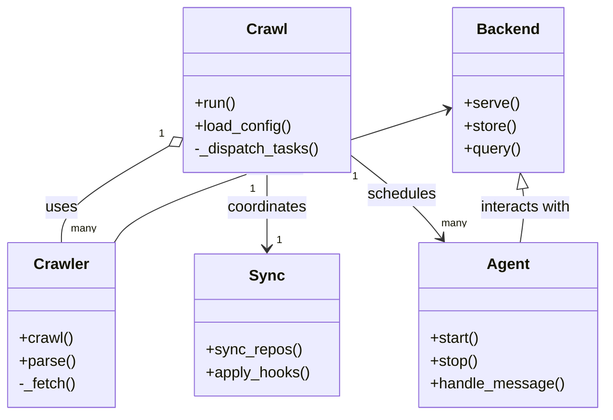
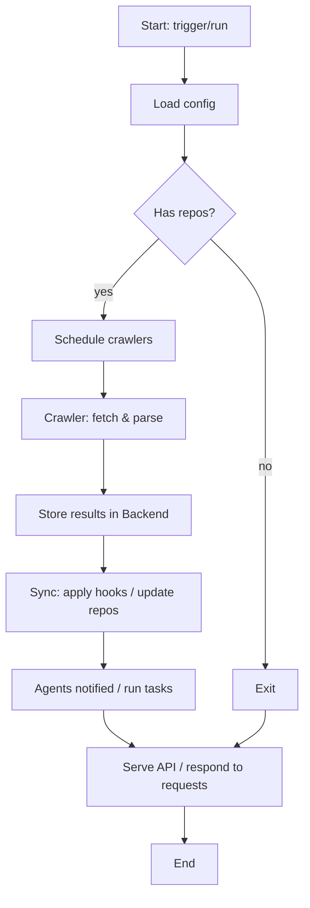

# Diagram: common/notification_service/config/config.alpha.yml

> Auto-generated by Obscura crawlers

## Diagram 1

### SVG

<svg id="container" width="630.75" xmlns="http://www.w3.org/2000/svg" class="classDiagram" height="438" viewBox="0 0 630.75 438" role="graphics-document document" aria-roledescription="class"><g><defs><marker id="container_class-aggregationStart" class="marker aggregation class" refX="18" refY="7" markerWidth="190" markerHeight="240" orient="auto"><path d="M 18,7 L9,13 L1,7 L9,1 Z"></path></marker></defs><defs><marker id="container_class-aggregationEnd" class="marker aggregation class" refX="1" refY="7" markerWidth="20" markerHeight="28" orient="auto"><path d="M 18,7 L9,13 L1,7 L9,1 Z"></path></marker></defs><defs><marker id="container_class-extensionStart" class="marker extension class" refX="18" refY="7" markerWidth="190" markerHeight="240" orient="auto"><path d="M 1,7 L18,13 V 1 Z"></path></marker></defs><defs><marker id="container_class-extensionEnd" class="marker extension class" refX="1" refY="7" markerWidth="20" markerHeight="28" orient="auto"><path d="M 1,1 V 13 L18,7 Z"></path></marker></defs><defs><marker id="container_class-compositionStart" class="marker composition class" refX="18" refY="7" markerWidth="190" markerHeight="240" orient="auto"><path d="M 18,7 L9,13 L1,7 L9,1 Z"></path></marker></defs><defs><marker id="container_class-compositionEnd" class="marker composition class" refX="1" refY="7" markerWidth="20" markerHeight="28" orient="auto"><path d="M 18,7 L9,13 L1,7 L9,1 Z"></path></marker></defs><defs><marker id="container_class-dependencyStart" class="marker dependency class" refX="6" refY="7" markerWidth="190" markerHeight="240" orient="auto"><path d="M 5,7 L9,13 L1,7 L9,1 Z"></path></marker></defs><defs><marker id="container_class-dependencyEnd" class="marker dependency class" refX="13" refY="7" markerWidth="20" markerHeight="28" orient="auto"><path d="M 18,7 L9,13 L14,7 L9,1 Z"></path></marker></defs><defs><marker id="container_class-lollipopStart" class="marker lollipop class" refX="13" refY="7" markerWidth="190" markerHeight="240" orient="auto"><circle stroke="black" fill="transparent" cx="7" cy="7" r="6"></circle></marker></defs><defs><marker id="container_class-lollipopEnd" class="marker lollipop class" refX="1" refY="7" markerWidth="190" markerHeight="240" orient="auto"><circle stroke="black" fill="transparent" cx="7" cy="7" r="6"></circle></marker></defs><g class="root"><g class="clusters"></g><g class="edgePaths"><path d="M176.665,154.041L157.868,164.867C139.071,175.694,101.477,197.347,82.68,214.34C63.883,231.333,63.883,243.667,63.883,249.833L63.883,256" id="id_Crawl_Crawler_1" class="edge-thickness-normal edge-pattern-solid relation" style=";;;" data-edge="true" data-et="edge" data-id="id_Crawl_Crawler_1" data-points="W3sieCI6MTkxLjYxMzI4MTI1LCJ5IjoxNDUuNDMxMTA2NDMzOTM2OTJ9LHsieCI6NjMuODgyODEyNSwieSI6MjE5fSx7IngiOjYzLjg4MjgxMjUsInkiOjI1Nn1d" marker-start="url(#container_class-aggregationStart)"></path><path d="M279.172,182L279.172,188.167C279.172,194.333,279.172,206.667,279.172,220C279.172,233.333,279.172,247.667,279.172,254.833L279.172,262" id="id_Crawl_Sync_2" class="edge-thickness-normal edge-pattern-solid relation" style=";;;" data-edge="true" data-et="edge" data-id="id_Crawl_Sync_2" data-points="W3sieCI6Mjc5LjE3MTg3NSwieSI6MTgyfSx7IngiOjI3OS4xNzE4NzUsInkiOjIxOX0seyJ4IjoyNzkuMTcxODc1LCJ5IjoyNjh9XQ==" marker-end="url(#container_class-dependencyEnd)"></path><path d="M366.73,163.554L378.533,172.795C390.336,182.036,413.941,200.518,429.774,215.126C445.608,229.734,453.668,240.468,457.699,245.835L461.729,251.202" id="id_Crawl_Agent_3" class="edge-thickness-normal edge-pattern-solid relation" style=";;;" data-edge="true" data-et="edge" data-id="id_Crawl_Agent_3" data-points="W3sieCI6MzY2LjczMDQ2ODc1LCJ5IjoxNjMuNTU0MTYzMzc4MDU4NH0seyJ4Ijo0MzcuNTQ2ODc1LCJ5IjoyMTl9LHsieCI6NDY1LjMzMTg0MjIzNzkwMzIzLCJ5IjoyNTZ9XQ==" marker-end="url(#container_class-dependencyEnd)"></path><path d="M546.536,199.053L547.043,202.377C547.55,205.702,548.564,212.351,548.13,221.842C547.697,231.333,545.816,243.667,544.875,249.833L543.934,256" id="id_Backend_Agent_4" class="edge-thickness-normal edge-pattern-solid relation" style=";;;" data-edge="true" data-et="edge" data-id="id_Backend_Agent_4" data-points="W3sieCI6NTQzLjkzNDQxMjgwMjQxOTQsInkiOjE4Mn0seyJ4Ijo1NDkuNTc4MTI1LCJ5IjoyMTl9LHsieCI6NTQzLjkzNDQxMjgwMjQxOTQsInkiOjI1Nn1d" marker-start="url(#container_class-extensionStart)"></path><path d="M467.291,115.186L412.971,132.488C358.651,149.791,250.011,184.395,191.837,207.864C133.664,231.333,125.957,243.667,122.103,249.833L118.25,256" id="id_Backend_Crawler_5" class="edge-thickness-normal edge-pattern-solid relation" style=";;;" data-edge="true" data-et="edge" data-id="id_Backend_Crawler_5" data-points="W3sieCI6NDczLjAwNzgxMjUsInkiOjExMy4zNjUwMjQ3MzQzNDQxMn0seyJ4IjoxNDEuMzcxMDkzNzUsInkiOjIxOX0seyJ4IjoxMTguMjQ5NTkwNDczNzkwMzIsInkiOjI1Nn1d" marker-start="url(#container_class-dependencyStart)"></path></g><g class="edgeLabels"><g class="edgeLabel" transform="translate(63.8828125, 219)"><g class="label" data-id="id_Crawl_Crawler_1" transform="translate(-16.4921875, -12)"><foreignObject width="32.984375" height="24">

uses

</foreignObject></g></g><g class="edgeLabel" transform="translate(279.171875, 219)"><g class="label" data-id="id_Crawl_Sync_2" transform="translate(-42.8046875, -12)"><foreignObject width="85.609375" height="24">

coordinates

</foreignObject></g></g><g class="edgeLabel" transform="translate(420.35496, 205.53955)"><g class="label" data-id="id_Crawl_Agent_3" transform="translate(-36.453125, -12)"><foreignObject width="72.90625" height="24">

schedules

</foreignObject></g></g><g class="edgeLabel" transform="translate(549.578125, 219)"><g class="label" data-id="id_Backend_Agent_4" transform="translate(-49.375, -12)"><foreignObject width="98.75" height="24">

interacts with

</foreignObject></g></g><g class="edgeLabel" transform="translate(286.4033, 172.80345)"><g class="label" data-id="id_Backend_Crawler_5" transform="translate(-31.5078125, -12)"><foreignObject width="63.015625" height="24">

writes to

</foreignObject></g></g><g class="edgeTerminals" transform="translate(168.96224076360198, 141.1672602379234)"><g class="inner" transform="translate(0, 0)"><foreignObject style="width: 9px; height: 12px;">
1
</foreignObject></g></g><g class="edgeTerminals" transform="translate(264.17187750000016, 199.50000214285714)"><g class="inner" transform="translate(0, 0)"><foreignObject style="width: 9px; height: 12px;">
1
</foreignObject></g></g><g class="edgeTerminals" transform="translate(371.2623706459596, 186.15309816481533)"><g class="inner" transform="translate(0, 0)"><foreignObject style="width: 9px; height: 12px;">
1
</foreignObject></g></g><g class="edgeTerminals" transform="translate(73.88281124999996, 233.49999892857144)"><g class="inner" transform="translate(0, 0)"></g><foreignObject style="width: 36px; height: 12px;">
many
</foreignObject></g><g class="edgeTerminals" transform="translate(289.1718774999998, 245.50000214285714)"><g class="inner" transform="translate(0, 0)"></g><foreignObject style="width: 9px; height: 12px;">
1
</foreignObject></g><g class="edgeTerminals" transform="translate(461.81793835167457, 227.9990975448429)"><g class="inner" transform="translate(0, 0)"></g><foreignObject style="width: 36px; height: 12px;">
many
</foreignObject></g></g><g class="nodes"><g class="node default" id="classId-Crawl-0" transform="translate(279.171875, 95)"><g class="basic label-container"><path d="M-87.55859375 -87 L87.55859375 -87 L87.55859375 87 L-87.55859375 87" stroke="none" stroke-width="0" fill="#ECECFF" style=""></path><path d="M-87.55859375 -87 C-46.04301172255667 -87, -4.527429695113341 -87, 87.55859375 -87 M-87.55859375 -87 C-35.35306575441143 -87, 16.852462241177136 -87, 87.55859375 -87 M87.55859375 -87 C87.55859375 -32.31678592790377, 87.55859375 22.366428144192454, 87.55859375 87 M87.55859375 -87 C87.55859375 -45.7464660067468, 87.55859375 -4.492932013493601, 87.55859375 87 M87.55859375 87 C33.17533015876353 87, -21.20793343247294 87, -87.55859375 87 M87.55859375 87 C26.410676048639715 87, -34.73724165272057 87, -87.55859375 87 M-87.55859375 87 C-87.55859375 50.21656740052771, -87.55859375 13.433134801055417, -87.55859375 -87 M-87.55859375 87 C-87.55859375 19.532632205676435, -87.55859375 -47.93473558864713, -87.55859375 -87" stroke="#9370DB" stroke-width="1.3" fill="none" stroke-dasharray="0 0" style=""></path></g><g class="annotation-group text" transform="translate(0, -63)"></g><g class="label-group text" transform="translate(-20.1484375, -63)"><g class="label" style="font-weight: bolder" transform="translate(0,-12)"><foreignObject width="40.296875" height="24">

Crawl

</foreignObject></g></g><g class="members-group text" transform="translate(-75.55859375, -15)"></g><g class="methods-group text" transform="translate(-75.55859375, 15)"><g class="label" style="" transform="translate(0,-12)"><foreignObject width="43.21875" height="24">

+run()

</foreignObject></g><g class="label" style="" transform="translate(0,12)"><foreignObject width="101.984375" height="24">

+load_config()

</foreignObject></g><g class="label" style="" transform="translate(0,36)"><foreignObject width="130.96875" height="24">

-_dispatch_tasks()

</foreignObject></g></g><g class="divider" style=""><path d="M-87.55859375 -39 C-32.58189026803321 -39, 22.394813213933574 -39, 87.55859375 -39 M-87.55859375 -39 C-31.37991002998877 -39, 24.798773690022458 -39, 87.55859375 -39" stroke="#9370DB" stroke-width="1.3" fill="none" stroke-dasharray="0 0" style=""></path></g><g class="divider" style=""><path d="M-87.55859375 -15 C-45.2472599932011 -15, -2.935926236402196 -15, 87.55859375 -15 M-87.55859375 -15 C-26.48247068747264 -15, 34.59365237505472 -15, 87.55859375 -15" stroke="#9370DB" stroke-width="1.3" fill="none" stroke-dasharray="0 0" style=""></path></g></g><g class="node default" id="classId-Crawler-1" transform="translate(63.8828125, 343)"><g class="basic label-container"><path d="M-55.8828125 -87 L55.8828125 -87 L55.8828125 87 L-55.8828125 87" stroke="none" stroke-width="0" fill="#ECECFF" style=""></path><path d="M-55.8828125 -87 C-13.115401276187939 -87, 29.652009947624123 -87, 55.8828125 -87 M-55.8828125 -87 C-12.923997334057084 -87, 30.03481783188583 -87, 55.8828125 -87 M55.8828125 -87 C55.8828125 -38.672356622817766, 55.8828125 9.655286754364468, 55.8828125 87 M55.8828125 -87 C55.8828125 -30.211951309487105, 55.8828125 26.57609738102579, 55.8828125 87 M55.8828125 87 C18.425888975328547 87, -19.031034549342905 87, -55.8828125 87 M55.8828125 87 C25.097007452760412 87, -5.688797594479176 87, -55.8828125 87 M-55.8828125 87 C-55.8828125 46.92770946689182, -55.8828125 6.855418933783639, -55.8828125 -87 M-55.8828125 87 C-55.8828125 17.91569707611015, -55.8828125 -51.1686058477797, -55.8828125 -87" stroke="#9370DB" stroke-width="1.3" fill="none" stroke-dasharray="0 0" style=""></path></g><g class="annotation-group text" transform="translate(0, -63)"></g><g class="label-group text" transform="translate(-27.734375, -63)"><g class="label" style="font-weight: bolder" transform="translate(0,-12)"><foreignObject width="55.46875" height="24">

Crawler

</foreignObject></g></g><g class="members-group text" transform="translate(-43.8828125, -15)"></g><g class="methods-group text" transform="translate(-43.8828125, 15)"><g class="label" style="" transform="translate(0,-12)"><foreignObject width="56.40625" height="24">

+crawl()

</foreignObject></g><g class="label" style="" transform="translate(0,12)"><foreignObject width="58.53125" height="24">

+parse()

</foreignObject></g><g class="label" style="" transform="translate(0,36)"><foreignObject width="60.03125" height="24">

-_fetch()

</foreignObject></g></g><g class="divider" style=""><path d="M-55.8828125 -39 C-25.103324297653188 -39, 5.676163904693624 -39, 55.8828125 -39 M-55.8828125 -39 C-16.988869188528895 -39, 21.90507412294221 -39, 55.8828125 -39" stroke="#9370DB" stroke-width="1.3" fill="none" stroke-dasharray="0 0" style=""></path></g><g class="divider" style=""><path d="M-55.8828125 -15 C-16.44631396230612 -15, 22.990184575387758 -15, 55.8828125 -15 M-55.8828125 -15 C-25.127302837844564 -15, 5.6282068243108725 -15, 55.8828125 -15" stroke="#9370DB" stroke-width="1.3" fill="none" stroke-dasharray="0 0" style=""></path></g></g><g class="node default" id="classId-Sync-2" transform="translate(279.171875, 343)"><g class="basic label-container"><path d="M-75.40625 -75 L75.40625 -75 L75.40625 75 L-75.40625 75" stroke="none" stroke-width="0" fill="#ECECFF" style=""></path><path d="M-75.40625 -75 C-16.032681410124994 -75, 43.34088717975001 -75, 75.40625 -75 M-75.40625 -75 C-20.88192726591354 -75, 33.64239546817292 -75, 75.40625 -75 M75.40625 -75 C75.40625 -17.43430280089583, 75.40625 40.13139439820834, 75.40625 75 M75.40625 -75 C75.40625 -21.204568587638313, 75.40625 32.590862824723374, 75.40625 75 M75.40625 75 C33.933876369879194 75, -7.538497260241613 75, -75.40625 75 M75.40625 75 C27.146765053824126 75, -21.11271989235175 75, -75.40625 75 M-75.40625 75 C-75.40625 26.52473009598839, -75.40625 -21.950539808023223, -75.40625 -75 M-75.40625 75 C-75.40625 38.92662896890061, -75.40625 2.8532579378012173, -75.40625 -75" stroke="#9370DB" stroke-width="1.3" fill="none" stroke-dasharray="0 0" style=""></path></g><g class="annotation-group text" transform="translate(0, -51)"></g><g class="label-group text" transform="translate(-17.09375, -51)"><g class="label" style="font-weight: bolder" transform="translate(0,-12)"><foreignObject width="34.1875" height="24">

Sync

</foreignObject></g></g><g class="members-group text" transform="translate(-63.40625, -3)"></g><g class="methods-group text" transform="translate(-63.40625, 27)"><g class="label" style="" transform="translate(0,-12)"><foreignObject width="99.515625" height="24">

+sync_repos()

</foreignObject></g><g class="label" style="" transform="translate(0,12)"><foreignObject width="109.71875" height="24">

+apply_hooks()

</foreignObject></g></g><g class="divider" style=""><path d="M-75.40625 -27 C-30.558192808286996 -27, 14.289864383426007 -27, 75.40625 -27 M-75.40625 -27 C-32.12452681145708 -27, 11.157196377085839 -27, 75.40625 -27" stroke="#9370DB" stroke-width="1.3" fill="none" stroke-dasharray="0 0" style=""></path></g><g class="divider" style=""><path d="M-75.40625 -3 C-36.98679923467065 -3, 1.4326515306587027 -3, 75.40625 -3 M-75.40625 -3 C-18.76422652870358 -3, 37.87779694259284 -3, 75.40625 -3" stroke="#9370DB" stroke-width="1.3" fill="none" stroke-dasharray="0 0" style=""></path></g></g><g class="node default" id="classId-Agent-3" transform="translate(530.6640625, 343)"><g class="basic label-container"><path d="M-92.0859375 -87 L92.0859375 -87 L92.0859375 87 L-92.0859375 87" stroke="none" stroke-width="0" fill="#ECECFF" style=""></path><path d="M-92.0859375 -87 C-23.287489814847504 -87, 45.51095787030499 -87, 92.0859375 -87 M-92.0859375 -87 C-52.90819995841615 -87, -13.730462416832296 -87, 92.0859375 -87 M92.0859375 -87 C92.0859375 -32.696962941833036, 92.0859375 21.60607411633393, 92.0859375 87 M92.0859375 -87 C92.0859375 -50.81946351476842, 92.0859375 -14.638927029536845, 92.0859375 87 M92.0859375 87 C36.853022419562684 87, -18.37989266087463 87, -92.0859375 87 M92.0859375 87 C22.074915886272905 87, -47.93610572745419 87, -92.0859375 87 M-92.0859375 87 C-92.0859375 35.81474591184665, -92.0859375 -15.3705081763067, -92.0859375 -87 M-92.0859375 87 C-92.0859375 43.86794304164377, -92.0859375 0.7358860832875393, -92.0859375 -87" stroke="#9370DB" stroke-width="1.3" fill="none" stroke-dasharray="0 0" style=""></path></g><g class="annotation-group text" transform="translate(0, -63)"></g><g class="label-group text" transform="translate(-21.078125, -63)"><g class="label" style="font-weight: bolder" transform="translate(0,-12)"><foreignObject width="42.15625" height="24">

Agent

</foreignObject></g></g><g class="members-group text" transform="translate(-80.0859375, -15)"></g><g class="methods-group text" transform="translate(-80.0859375, 15)"><g class="label" style="" transform="translate(0,-12)"><foreignObject width="52.15625" height="24">

+start()

</foreignObject></g><g class="label" style="" transform="translate(0,12)"><foreignObject width="50.21875" height="24">

+stop()

</foreignObject></g><g class="label" style="" transform="translate(0,36)"><foreignObject width="139.09375" height="24">

+handle_message()

</foreignObject></g></g><g class="divider" style=""><path d="M-92.0859375 -39 C-54.19659066927333 -39, -16.307243838546654 -39, 92.0859375 -39 M-92.0859375 -39 C-42.28513191700872 -39, 7.515673665982561 -39, 92.0859375 -39" stroke="#9370DB" stroke-width="1.3" fill="none" stroke-dasharray="0 0" style=""></path></g><g class="divider" style=""><path d="M-92.0859375 -15 C-49.77911523183344 -15, -7.472292963666874 -15, 92.0859375 -15 M-92.0859375 -15 C-28.63194323157829 -15, 34.82205103684342 -15, 92.0859375 -15" stroke="#9370DB" stroke-width="1.3" fill="none" stroke-dasharray="0 0" style=""></path></g></g><g class="node default" id="classId-Backend-4" transform="translate(530.6640625, 95)"><g class="basic label-container"><path d="M-57.65625 -87 L57.65625 -87 L57.65625 87 L-57.65625 87" stroke="none" stroke-width="0" fill="#ECECFF" style=""></path><path d="M-57.65625 -87 C-17.32888726488045 -87, 22.9984754702391 -87, 57.65625 -87 M-57.65625 -87 C-30.31214459336333 -87, -2.9680391867266565 -87, 57.65625 -87 M57.65625 -87 C57.65625 -19.85403496833314, 57.65625 47.29193006333372, 57.65625 87 M57.65625 -87 C57.65625 -25.074465209518053, 57.65625 36.851069580963895, 57.65625 87 M57.65625 87 C16.615691360745892 87, -24.424867278508216 87, -57.65625 87 M57.65625 87 C22.34040656073398 87, -12.975436878532037 87, -57.65625 87 M-57.65625 87 C-57.65625 34.15381896645593, -57.65625 -18.69236206708814, -57.65625 -87 M-57.65625 87 C-57.65625 47.90611660212212, -57.65625 8.812233204244237, -57.65625 -87" stroke="#9370DB" stroke-width="1.3" fill="none" stroke-dasharray="0 0" style=""></path></g><g class="annotation-group text" transform="translate(0, -63)"></g><g class="label-group text" transform="translate(-31.296875, -63)"><g class="label" style="font-weight: bolder" transform="translate(0,-12)"><foreignObject width="62.59375" height="24">

Backend

</foreignObject></g></g><g class="members-group text" transform="translate(-45.65625, -15)"></g><g class="methods-group text" transform="translate(-45.65625, 15)"><g class="label" style="" transform="translate(0,-12)"><foreignObject width="57.25" height="24">

+serve()

</foreignObject></g><g class="label" style="" transform="translate(0,12)"><foreignObject width="55.125" height="24">

+store()

</foreignObject></g><g class="label" style="" transform="translate(0,36)"><foreignObject width="60.015625" height="24">

+query()

</foreignObject></g></g><g class="divider" style=""><path d="M-57.65625 -39 C-16.915272509953752 -39, 23.825704980092496 -39, 57.65625 -39 M-57.65625 -39 C-23.94352409288595 -39, 9.769201814228097 -39, 57.65625 -39" stroke="#9370DB" stroke-width="1.3" fill="none" stroke-dasharray="0 0" style=""></path></g><g class="divider" style=""><path d="M-57.65625 -15 C-17.036484742477363 -15, 23.583280515045274 -15, 57.65625 -15 M-57.65625 -15 C-13.910274491453627 -15, 29.835701017092745 -15, 57.65625 -15" stroke="#9370DB" stroke-width="1.3" fill="none" stroke-dasharray="0 0" style=""></path></g></g></g></g></g></svg>

## Diagram 2

### SVG

<svg id="container" width="408.8515625" xmlns="http://www.w3.org/2000/svg" class="flowchart" height="1180.75" viewBox="0 0 408.8515625 1180.75" role="graphics-document document" aria-roledescription="flowchart-v2"><g><marker id="container_flowchart-v2-pointEnd" class="marker flowchart-v2" viewBox="0 0 10 10" refX="5" refY="5" markerUnits="userSpaceOnUse" markerWidth="8" markerHeight="8" orient="auto"><path d="M 0 0 L 10 5 L 0 10 z" class="arrowMarkerPath" style="stroke-width: 1; stroke-dasharray: 1, 0;"></path></marker><marker id="container_flowchart-v2-pointStart" class="marker flowchart-v2" viewBox="0 0 10 10" refX="4.5" refY="5" markerUnits="userSpaceOnUse" markerWidth="8" markerHeight="8" orient="auto"><path d="M 0 5 L 10 10 L 10 0 z" class="arrowMarkerPath" style="stroke-width: 1; stroke-dasharray: 1, 0;"></path></marker><marker id="container_flowchart-v2-circleEnd" class="marker flowchart-v2" viewBox="0 0 10 10" refX="11" refY="5" markerUnits="userSpaceOnUse" markerWidth="11" markerHeight="11" orient="auto"><circle cx="5" cy="5" r="5" class="arrowMarkerPath" style="stroke-width: 1; stroke-dasharray: 1, 0;"></circle></marker><marker id="container_flowchart-v2-circleStart" class="marker flowchart-v2" viewBox="0 0 10 10" refX="-1" refY="5" markerUnits="userSpaceOnUse" markerWidth="11" markerHeight="11" orient="auto"><circle cx="5" cy="5" r="5" class="arrowMarkerPath" style="stroke-width: 1; stroke-dasharray: 1, 0;"></circle></marker><marker id="container_flowchart-v2-crossEnd" class="marker cross flowchart-v2" viewBox="0 0 11 11" refX="12" refY="5.2" markerUnits="userSpaceOnUse" markerWidth="11" markerHeight="11" orient="auto"><path d="M 1,1 l 9,9 M 10,1 l -9,9" class="arrowMarkerPath" style="stroke-width: 2; stroke-dasharray: 1, 0;"></path></marker><marker id="container_flowchart-v2-crossStart" class="marker cross flowchart-v2" viewBox="0 0 11 11" refX="-1" refY="5.2" markerUnits="userSpaceOnUse" markerWidth="11" markerHeight="11" orient="auto"><path d="M 1,1 l 9,9 M 10,1 l -9,9" class="arrowMarkerPath" style="stroke-width: 2; stroke-dasharray: 1, 0;"></path></marker><g class="root"><g class="clusters"></g><g class="edgePaths"><path d="M247.773,62L247.773,66.167C247.773,70.333,247.773,78.667,247.773,86.333C247.773,94,247.773,101,247.773,104.5L247.773,108" id="L_A_B_0" class="edge-thickness-normal edge-pattern-solid edge-thickness-normal edge-pattern-solid flowchart-link" style=";" data-edge="true" data-et="edge" data-id="L_A_B_0" data-points="W3sieCI6MjQ3Ljc3MzQzNzUsInkiOjYyfSx7IngiOjI0Ny43NzM0Mzc1LCJ5Ijo4N30seyJ4IjoyNDcuNzczNDM3NSwieSI6MTEyfV0=" marker-end="url(#container_flowchart-v2-pointEnd)"></path><path d="M247.773,166L247.773,170.167C247.773,174.333,247.773,182.667,247.773,190.333C247.773,198,247.773,205,247.773,208.5L247.773,212" id="L_B_C_0" class="edge-thickness-normal edge-pattern-solid edge-thickness-normal edge-pattern-solid flowchart-link" style=";" data-edge="true" data-et="edge" data-id="L_B_C_0" data-points="W3sieCI6MjQ3Ljc3MzQzNzUsInkiOjE2Nn0seyJ4IjoyNDcuNzczNDM3NSwieSI6MTkxfSx7IngiOjI0Ny43NzM0Mzc1LCJ5IjoyMTZ9XQ==" marker-end="url(#container_flowchart-v2-pointEnd)"></path><path d="M213.59,314.566L200.991,326.43C188.393,338.294,163.197,362.022,150.598,379.386C138,396.75,138,407.75,138,413.25L138,418.75" id="L_C_D_0" class="edge-thickness-normal edge-pattern-solid edge-thickness-normal edge-pattern-solid flowchart-link" style=";" data-edge="true" data-et="edge" data-id="L_C_D_0" data-points="W3sieCI6MjEzLjU4OTY5MjEyNzQyMzY2LCJ5IjozMTQuNTY2MjU0NjI3NDIzN30seyJ4IjoxMzgsInkiOjM4NS43NX0seyJ4IjoxMzgsInkiOjQyMi43NX1d" marker-end="url(#container_flowchart-v2-pointEnd)"></path><path d="M281.957,314.566L294.555,326.43C307.154,338.294,332.35,362.022,344.949,384.553C357.547,407.083,357.547,428.417,357.547,447.75C357.547,467.083,357.547,484.417,357.547,501.75C357.547,519.083,357.547,536.417,357.547,555.75C357.547,575.083,357.547,596.417,357.547,617.75C357.547,639.083,357.547,660.417,357.547,679.75C357.547,699.083,357.547,716.417,357.547,735.75C357.547,755.083,357.547,776.417,357.547,797.75C357.547,819.083,357.547,840.417,357.547,854.583C357.547,868.75,357.547,875.75,357.547,879.25L357.547,882.75" id="L_C_E_0" class="edge-thickness-normal edge-pattern-solid edge-thickness-normal edge-pattern-solid flowchart-link" style=";" data-edge="true" data-et="edge" data-id="L_C_E_0" data-points="W3sieCI6MjgxLjk1NzE4Mjg3MjU3NjMsInkiOjMxNC41NjYyNTQ2Mjc0MjM3fSx7IngiOjM1Ny41NDY4NzUsInkiOjM4NS43NX0seyJ4IjozNTcuNTQ2ODc1LCJ5Ijo0NDkuNzV9LHsieCI6MzU3LjU0Njg3NSwieSI6NTAxLjc1fSx7IngiOjM1Ny41NDY4NzUsInkiOjU1My43NX0seyJ4IjozNTcuNTQ2ODc1LCJ5Ijo2MTcuNzV9LHsieCI6MzU3LjU0Njg3NSwieSI6NjgxLjc1fSx7IngiOjM1Ny41NDY4NzUsInkiOjczMy43NX0seyJ4IjozNTcuNTQ2ODc1LCJ5Ijo3OTcuNzV9LHsieCI6MzU3LjU0Njg3NSwieSI6ODYxLjc1fSx7IngiOjM1Ny41NDY4NzUsInkiOjg4Ni43NX1d" marker-end="url(#container_flowchart-v2-pointEnd)"></path><path d="M138,476.75L138,480.917C138,485.083,138,493.417,138,501.083C138,508.75,138,515.75,138,519.25L138,522.75" id="L_D_F_0" class="edge-thickness-normal edge-pattern-solid edge-thickness-normal edge-pattern-solid flowchart-link" style=";" data-edge="true" data-et="edge" data-id="L_D_F_0" data-points="W3sieCI6MTM4LCJ5Ijo0NzYuNzV9LHsieCI6MTM4LCJ5Ijo1MDEuNzV9LHsieCI6MTM4LCJ5Ijo1MjYuNzV9XQ==" marker-end="url(#container_flowchart-v2-pointEnd)"></path><path d="M138,580.75L138,586.917C138,593.083,138,605.417,138,617.083C138,628.75,138,639.75,138,645.25L138,650.75" id="L_F_G_0" class="edge-thickness-normal edge-pattern-solid edge-thickness-normal edge-pattern-solid flowchart-link" style=";" data-edge="true" data-et="edge" data-id="L_F_G_0" data-points="W3sieCI6MTM4LCJ5Ijo1ODAuNzV9LHsieCI6MTM4LCJ5Ijo2MTcuNzV9LHsieCI6MTM4LCJ5Ijo2NTQuNzV9XQ==" marker-end="url(#container_flowchart-v2-pointEnd)"></path><path d="M138,708.75L138,712.917C138,717.083,138,725.417,138,733.083C138,740.75,138,747.75,138,751.25L138,754.75" id="L_G_H_0" class="edge-thickness-normal edge-pattern-solid edge-thickness-normal edge-pattern-solid flowchart-link" style=";" data-edge="true" data-et="edge" data-id="L_G_H_0" data-points="W3sieCI6MTM4LCJ5Ijo3MDguNzV9LHsieCI6MTM4LCJ5Ijo3MzMuNzV9LHsieCI6MTM4LCJ5Ijo3NTguNzV9XQ==" marker-end="url(#container_flowchart-v2-pointEnd)"></path><path d="M138,836.75L138,840.917C138,845.083,138,853.417,138,861.083C138,868.75,138,875.75,138,879.25L138,882.75" id="L_H_I_0" class="edge-thickness-normal edge-pattern-solid edge-thickness-normal edge-pattern-solid flowchart-link" style=";" data-edge="true" data-et="edge" data-id="L_H_I_0" data-points="W3sieCI6MTM4LCJ5Ijo4MzYuNzV9LHsieCI6MTM4LCJ5Ijo4NjEuNzV9LHsieCI6MTM4LCJ5Ijo4ODYuNzV9XQ==" marker-end="url(#container_flowchart-v2-pointEnd)"></path><path d="M138,940.75L138,944.917C138,949.083,138,957.417,144.571,965.414C151.142,973.412,164.283,981.074,170.854,984.904L177.425,988.735" id="L_I_J_0" class="edge-thickness-normal edge-pattern-solid edge-thickness-normal edge-pattern-solid flowchart-link" style=";" data-edge="true" data-et="edge" data-id="L_I_J_0" data-points="W3sieCI6MTM4LCJ5Ijo5NDAuNzV9LHsieCI6MTM4LCJ5Ijo5NjUuNzV9LHsieCI6MTgwLjg4MDI0OTAyMzQzNzUsInkiOjk5MC43NX1d" marker-end="url(#container_flowchart-v2-pointEnd)"></path><path d="M357.547,940.75L357.547,944.917C357.547,949.083,357.547,957.417,350.976,965.414C344.405,973.412,331.264,981.074,324.693,984.904L318.122,988.735" id="L_E_J_0" class="edge-thickness-normal edge-pattern-solid edge-thickness-normal edge-pattern-solid flowchart-link" style=";" data-edge="true" data-et="edge" data-id="L_E_J_0" data-points="W3sieCI6MzU3LjU0Njg3NSwieSI6OTQwLjc1fSx7IngiOjM1Ny41NDY4NzUsInkiOjk2NS43NX0seyJ4IjozMTQuNjY2NjI1OTc2NTYyNSwieSI6OTkwLjc1fV0=" marker-end="url(#container_flowchart-v2-pointEnd)"></path><path d="M247.773,1068.75L247.773,1072.917C247.773,1077.083,247.773,1085.417,247.773,1093.083C247.773,1100.75,247.773,1107.75,247.773,1111.25L247.773,1114.75" id="L_J_K_0" class="edge-thickness-normal edge-pattern-solid edge-thickness-normal edge-pattern-solid flowchart-link" style=";" data-edge="true" data-et="edge" data-id="L_J_K_0" data-points="W3sieCI6MjQ3Ljc3MzQzNzUsInkiOjEwNjguNzV9LHsieCI6MjQ3Ljc3MzQzNzUsInkiOjEwOTMuNzV9LHsieCI6MjQ3Ljc3MzQzNzUsInkiOjExMTguNzV9XQ==" marker-end="url(#container_flowchart-v2-pointEnd)"></path></g><g class="edgeLabels"><g class="edgeLabel"><g class="label" data-id="L_A_B_0" transform="translate(0, 0)"><foreignObject width="0" height="0">

</foreignObject></g></g><g class="edgeLabel"><g class="label" data-id="L_B_C_0" transform="translate(0, 0)"><foreignObject width="0" height="0">

</foreignObject></g></g><g class="edgeLabel" transform="translate(138, 385.75)"><g class="label" data-id="L_C_D_0" transform="translate(-12.0078125, -12)"><foreignObject width="24.015625" height="24">

yes

</foreignObject></g></g><g class="edgeLabel" transform="translate(357.546875, 617.75)"><g class="label" data-id="L_C_E_0" transform="translate(-9.3671875, -12)"><foreignObject width="18.734375" height="24">

no

</foreignObject></g></g><g class="edgeLabel"><g class="label" data-id="L_D_F_0" transform="translate(0, 0)"><foreignObject width="0" height="0">

</foreignObject></g></g><g class="edgeLabel"><g class="label" data-id="L_F_G_0" transform="translate(0, 0)"><foreignObject width="0" height="0">

</foreignObject></g></g><g class="edgeLabel"><g class="label" data-id="L_G_H_0" transform="translate(0, 0)"><foreignObject width="0" height="0">

</foreignObject></g></g><g class="edgeLabel"><g class="label" data-id="L_H_I_0" transform="translate(0, 0)"><foreignObject width="0" height="0">

</foreignObject></g></g><g class="edgeLabel"><g class="label" data-id="L_I_J_0" transform="translate(0, 0)"><foreignObject width="0" height="0">

</foreignObject></g></g><g class="edgeLabel"><g class="label" data-id="L_E_J_0" transform="translate(0, 0)"><foreignObject width="0" height="0">

</foreignObject></g></g><g class="edgeLabel"><g class="label" data-id="L_J_K_0" transform="translate(0, 0)"><foreignObject width="0" height="0">

</foreignObject></g></g></g><g class="nodes"><g class="node default" id="flowchart-A-0" transform="translate(247.7734375, 35)"><rect class="basic label-container" style="" x="-91.34375" y="-27" width="182.6875" height="54"></rect><g class="label" style="" transform="translate(-61.34375, -12)"><rect></rect><foreignObject width="122.6875" height="24">

Start: trigger/run

</foreignObject></g></g><g class="node default" id="flowchart-B-1" transform="translate(247.7734375, 139)"><rect class="basic label-container" style="" x="-71.421875" y="-27" width="142.84375" height="54"></rect><g class="label" style="" transform="translate(-41.421875, -12)"><rect></rect><foreignObject width="82.84375" height="24">

Load config

</foreignObject></g></g><g class="node default" id="flowchart-C-3" transform="translate(247.7734375, 282.375)"><polygon points="66.375,0 132.75,-66.375 66.375,-132.75 0,-66.375" class="label-container" transform="translate(-65.875, 66.375)"></polygon><g class="label" style="" transform="translate(-39.375, -12)"><rect></rect><foreignObject width="78.75" height="24">

Has repos?

</foreignObject></g></g><g class="node default" id="flowchart-D-5" transform="translate(138, 449.75)"><rect class="basic label-container" style="" x="-95.5078125" y="-27" width="191.015625" height="54"></rect><g class="label" style="" transform="translate(-65.5078125, -12)"><rect></rect><foreignObject width="131.015625" height="24">

Schedule crawlers

</foreignObject></g></g><g class="node default" id="flowchart-E-7" transform="translate(357.546875, 913.75)"><rect class="basic label-container" style="" x="-43.3046875" y="-27" width="86.609375" height="54"></rect><g class="label" style="" transform="translate(-13.3046875, -12)"><rect></rect><foreignObject width="26.609375" height="24">

Exit

</foreignObject></g></g><g class="node default" id="flowchart-F-9" transform="translate(138, 553.75)"><rect class="basic label-container" style="" x="-109.4921875" y="-27" width="218.984375" height="54"></rect><g class="label" style="" transform="translate(-79.4921875, -12)"><rect></rect><foreignObject width="158.984375" height="24">

Crawler: fetch &amp; parse

</foreignObject></g></g><g class="node default" id="flowchart-G-11" transform="translate(138, 681.75)"><rect class="basic label-container" style="" x="-117.78125" y="-27" width="235.5625" height="54"></rect><g class="label" style="" transform="translate(-87.78125, -12)"><rect></rect><foreignObject width="175.5625" height="24">

Store results in Backend

</foreignObject></g></g><g class="node default" id="flowchart-H-13" transform="translate(138, 797.75)"><rect class="basic label-container" style="" x="-130" y="-39" width="260" height="78"></rect><g class="label" style="" transform="translate(-100, -24)"><rect></rect><foreignObject width="200" height="48">

Sync: apply hooks / update repos

</foreignObject></g></g><g class="node default" id="flowchart-I-15" transform="translate(138, 913.75)"><rect class="basic label-container" style="" x="-126.2421875" y="-27" width="252.484375" height="54"></rect><g class="label" style="" transform="translate(-96.2421875, -12)"><rect></rect><foreignObject width="192.484375" height="24">

Agents notified / run tasks

</foreignObject></g></g><g class="node default" id="flowchart-J-17" transform="translate(247.7734375, 1029.75)"><rect class="basic label-container" style="" x="-130" y="-39" width="260" height="78"></rect><g class="label" style="" transform="translate(-100, -24)"><rect></rect><foreignObject width="200" height="48">

Serve API / respond to requests

</foreignObject></g></g><g class="node default" id="flowchart-K-21" transform="translate(247.7734375, 1145.75)"><rect class="basic label-container" style="" x="-43.6796875" y="-27" width="87.359375" height="54"></rect><g class="label" style="" transform="translate(-13.6796875, -12)"><rect></rect><foreignObject width="27.359375" height="24">

End

</foreignObject></g></g></g></g></g></svg>
