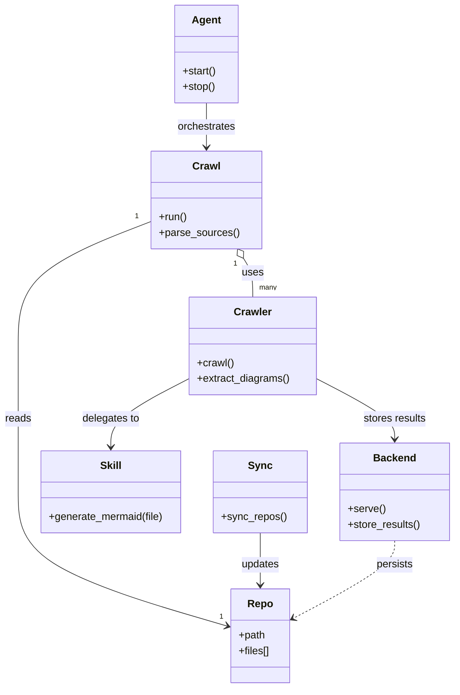

# Diagram: common/notification_service/config/config.dev.yml


> Auto-generated by Obscura crawlers

## Diagram 1



### SVG

<svg id="container" width="696.640625" xmlns="http://www.w3.org/2000/svg" class="classDiagram" height="1056" viewBox="0 0 696.640625 1056" role="graphics-document document" aria-roledescription="class"><style>#container{font-family:"trebuchet ms",verdana,arial,sans-serif;font-size:16px;fill:#333;}@keyframes edge-animation-frame{from{stroke-dashoffset:0;}}@keyframes dash{to{stroke-dashoffset:0;}}#container .edge-animation-slow{stroke-dasharray:9,5!important;stroke-dashoffset:900;animation:dash 50s linear infinite;stroke-linecap:round;}#container .edge-animation-fast{stroke-dasharray:9,5!important;stroke-dashoffset:900;animation:dash 20s linear infinite;stroke-linecap:round;}#container .error-icon{fill:#552222;}#container .error-text{fill:#552222;stroke:#552222;}#container .edge-thickness-normal{stroke-width:1px;}#container .edge-thickness-thick{stroke-width:3.5px;}#container .edge-pattern-solid{stroke-dasharray:0;}#container .edge-thickness-invisible{stroke-width:0;fill:none;}#container .edge-pattern-dashed{stroke-dasharray:3;}#container .edge-pattern-dotted{stroke-dasharray:2;}#container .marker{fill:#333333;stroke:#333333;}#container .marker.cross{stroke:#333333;}#container svg{font-family:"trebuchet ms",verdana,arial,sans-serif;font-size:16px;}#container p{margin:0;}#container g.classGroup text{fill:#9370DB;stroke:none;font-family:"trebuchet ms",verdana,arial,sans-serif;font-size:10px;}#container g.classGroup text .title{font-weight:bolder;}#container .nodeLabel,#container .edgeLabel{color:#131300;}#container .edgeLabel .label rect{fill:#ECECFF;}#container .label text{fill:#131300;}#container .labelBkg{background:#ECECFF;}#container .edgeLabel .label span{background:#ECECFF;}#container .classTitle{font-weight:bolder;}#container .node rect,#container .node circle,#container .node ellipse,#container .node polygon,#container .node path{fill:#ECECFF;stroke:#9370DB;stroke-width:1px;}#container .divider{stroke:#9370DB;stroke-width:1;}#container g.clickable{cursor:pointer;}#container g.classGroup rect{fill:#ECECFF;stroke:#9370DB;}#container g.classGroup line{stroke:#9370DB;stroke-width:1;}#container .classLabel .box{stroke:none;stroke-width:0;fill:#ECECFF;opacity:0.5;}#container .classLabel .label{fill:#9370DB;font-size:10px;}#container .relation{stroke:#333333;stroke-width:1;fill:none;}#container .dashed-line{stroke-dasharray:3;}#container .dotted-line{stroke-dasharray:1 2;}#container #compositionStart,#container .composition{fill:#333333!important;stroke:#333333!important;stroke-width:1;}#container #compositionEnd,#container .composition{fill:#333333!important;stroke:#333333!important;stroke-width:1;}#container #dependencyStart,#container .dependency{fill:#333333!important;stroke:#333333!important;stroke-width:1;}#container #dependencyStart,#container .dependency{fill:#333333!important;stroke:#333333!important;stroke-width:1;}#container #extensionStart,#container .extension{fill:transparent!important;stroke:#333333!important;stroke-width:1;}#container #extensionEnd,#container .extension{fill:transparent!important;stroke:#333333!important;stroke-width:1;}#container #aggregationStart,#container .aggregation{fill:transparent!important;stroke:#333333!important;stroke-width:1;}#container #aggregationEnd,#container .aggregation{fill:transparent!important;stroke:#333333!important;stroke-width:1;}#container #lollipopStart,#container .lollipop{fill:#ECECFF!important;stroke:#333333!important;stroke-width:1;}#container #lollipopEnd,#container .lollipop{fill:#ECECFF!important;stroke:#333333!important;stroke-width:1;}#container .edgeTerminals{font-size:11px;line-height:initial;}#container .classTitleText{text-anchor:middle;font-size:18px;fill:#333;}#container .label-icon{display:inline-block;height:1em;overflow:visible;vertical-align:-0.125em;}#container .node .label-icon path{fill:currentColor;stroke:revert;stroke-width:revert;}#container :root{--mermaid-font-family:"trebuchet ms",verdana,arial,sans-serif;}</style><g><defs><marker id="container_class-aggregationStart" class="marker aggregation class" refX="18" refY="7" markerWidth="190" markerHeight="240" orient="auto"><path d="M 18,7 L9,13 L1,7 L9,1 Z"></path></marker></defs><defs><marker id="container_class-aggregationEnd" class="marker aggregation class" refX="1" refY="7" markerWidth="20" markerHeight="28" orient="auto"><path d="M 18,7 L9,13 L1,7 L9,1 Z"></path></marker></defs><defs><marker id="container_class-extensionStart" class="marker extension class" refX="18" refY="7" markerWidth="190" markerHeight="240" orient="auto"><path d="M 1,7 L18,13 V 1 Z"></path></marker></defs><defs><marker id="container_class-extensionEnd" class="marker extension class" refX="1" refY="7" markerWidth="20" markerHeight="28" orient="auto"><path d="M 1,1 V 13 L18,7 Z"></path></marker></defs><defs><marker id="container_class-compositionStart" class="marker composition class" refX="18" refY="7" markerWidth="190" markerHeight="240" orient="auto"><path d="M 18,7 L9,13 L1,7 L9,1 Z"></path></marker></defs><defs><marker id="container_class-compositionEnd" class="marker composition class" refX="1" refY="7" markerWidth="20" markerHeight="28" orient="auto"><path d="M 18,7 L9,13 L1,7 L9,1 Z"></path></marker></defs><defs><marker id="container_class-dependencyStart" class="marker dependency class" refX="6" refY="7" markerWidth="190" markerHeight="240" orient="auto"><path d="M 5,7 L9,13 L1,7 L9,1 Z"></path></marker></defs><defs><marker id="container_class-dependencyEnd" class="marker dependency class" refX="13" refY="7" markerWidth="20" markerHeight="28" orient="auto"><path d="M 18,7 L9,13 L14,7 L9,1 Z"></path></marker></defs><defs><marker id="container_class-lollipopStart" class="marker lollipop class" refX="13" refY="7" markerWidth="190" markerHeight="240" orient="auto"><circle stroke="black" fill="transparent" cx="7" cy="7" r="6"></circle></marker></defs><defs><marker id="container_class-lollipopEnd" class="marker lollipop class" refX="1" refY="7" markerWidth="190" markerHeight="240" orient="auto"><circle stroke="black" fill="transparent" cx="7" cy="7" r="6"></circle></marker></defs><g class="root"><g class="clusters"></g><g class="edgePaths"><path d="M373.873,396.518L376.278,400.265C378.682,404.012,383.49,411.506,385.895,421.42C388.299,431.333,388.299,443.667,388.299,449.833L388.299,456" id="id_Crawl_Crawler_1" class="edge-thickness-normal edge-pattern-solid relation" style=";;;" data-edge="true" data-et="edge" data-id="id_Crawl_Crawler_1" data-points="W3sieCI6MzY0LjU1NzYzNDYyNjExNjA2LCJ5IjozODJ9LHsieCI6Mzg4LjI5ODgyODEyNSwieSI6NDE5fSx7IngiOjM4OC4yOTg4MjgxMjUsInkiOjQ1Nn1d" marker-start="url(#container_class-aggregationStart)"></path><path d="M233.422,339.235L199.186,352.529C164.951,365.823,96.479,392.412,62.243,424.372C28.008,456.333,28.008,493.667,28.008,531C28.008,568.333,28.008,605.667,28.008,643C28.008,680.333,28.008,717.667,28.008,755C28.008,792.333,28.008,829.667,81.613,864.008C135.218,898.349,242.429,929.699,296.034,945.373L349.64,961.048" id="id_Crawl_Repo_2" class="edge-thickness-normal edge-pattern-solid relation" style=";;;" data-edge="true" data-et="edge" data-id="id_Crawl_Repo_2" data-points="W3sieCI6MjMzLjQyMTg3NSwieSI6MzM5LjIzNDY3OTA5MDQyODl9LHsieCI6MjguMDA3ODEyNSwieSI6NDE5fSx7IngiOjI4LjAwNzgxMjUsInkiOjUzMX0seyJ4IjoyOC4wMDc4MTI1LCJ5Ijo2NDN9LHsieCI6MjguMDA3ODEyNSwieSI6NzU1fSx7IngiOjI4LjAwNzgxMjUsInkiOjg2N30seyJ4IjozNTUuMzk4NDM3NSwieSI6OTYyLjczMTk0NDUwMjY2MTd9XQ==" marker-end="url(#container_class-dependencyEnd)"></path><path d="M291.096,581.271L271.203,591.559C251.31,601.847,211.524,622.424,191.631,639.879C171.738,657.333,171.738,671.667,171.738,678.833L171.738,686" id="id_Crawler_Skill_3" class="edge-thickness-normal edge-pattern-solid relation" style=";;;" data-edge="true" data-et="edge" data-id="id_Crawler_Skill_3" data-points="W3sieCI6MjkxLjA5NTcwMzEyNSwieSI6NTgxLjI3MTE2MDQ1NDE4ODh9LHsieCI6MTcxLjczODI4MTI1LCJ5Ijo2NDN9LHsieCI6MTcxLjczODI4MTI1LCJ5Ijo2OTJ9XQ==" marker-end="url(#container_class-dependencyEnd)"></path><path d="M485.502,581.271L505.395,591.559C525.288,601.847,565.074,622.424,584.966,637.879C604.859,653.333,604.859,663.667,604.859,668.833L604.859,674" id="id_Crawler_Backend_4" class="edge-thickness-normal edge-pattern-solid relation" style=";;;" data-edge="true" data-et="edge" data-id="id_Crawler_Backend_4" data-points="W3sieCI6NDg1LjUwMTk1MzEyNSwieSI6NTgxLjI3MTE2MDQ1NDE4ODh9LHsieCI6NjA0Ljg1OTM3NSwieSI6NjQzfSx7IngiOjYwNC44NTkzNzUsInkiOjY4MH1d" marker-end="url(#container_class-dependencyEnd)"></path><path d="M316.434,158L316.434,164.167C316.434,170.333,316.434,182.667,316.434,194C316.434,205.333,316.434,215.667,316.434,220.833L316.434,226" id="id_Agent_Crawl_5" class="edge-thickness-normal edge-pattern-solid relation" style=";;;" data-edge="true" data-et="edge" data-id="id_Agent_Crawl_5" data-points="W3sieCI6MzE2LjQzMzU5Mzc1LCJ5IjoxNTh9LHsieCI6MzE2LjQzMzU5Mzc1LCJ5IjoxOTV9LHsieCI6MzE2LjQzMzU5Mzc1LCJ5IjoyMzJ9XQ==" marker-end="url(#container_class-dependencyEnd)"></path><path d="M400.773,818L400.773,826.167C400.773,834.333,400.773,850.667,400.773,864C400.773,877.333,400.773,887.667,400.773,892.833L400.773,898" id="id_Sync_Repo_6" class="edge-thickness-normal edge-pattern-solid relation" style=";;;" data-edge="true" data-et="edge" data-id="id_Sync_Repo_6" data-points="W3sieCI6NDAwLjc3MzQzNzUsInkiOjgxOH0seyJ4Ijo0MDAuNzczNDM3NSwieSI6ODY3fSx7IngiOjQwMC43NzM0Mzc1LCJ5Ijo5MDR9XQ==" marker-end="url(#container_class-dependencyEnd)"></path><path d="M604.859,830L604.859,836.167C604.859,842.333,604.859,854.667,579.29,874.49C553.72,894.313,502.58,921.626,477.011,935.283L451.441,948.939" id="id_Backend_Repo_7" class="edge-thickness-normal edge-pattern-dashed relation" style=";;;" data-edge="true" data-et="edge" data-id="id_Backend_Repo_7" data-points="W3sieCI6NjA0Ljg1OTM3NSwieSI6ODMwfSx7IngiOjYwNC44NTkzNzUsInkiOjg2N30seyJ4Ijo0NDYuMTQ4NDM3NSwieSI6OTUxLjc2NTcyMzY5MTc2NTl9XQ==" marker-end="url(#container_class-dependencyEnd)"></path></g><g class="edgeLabels"><g class="edgeLabel" transform="translate(388.298828125, 419)"><g class="label" data-id="id_Crawl_Crawler_1" transform="translate(-16.4921875, -12)"><foreignObject width="32.984375" height="24"><div xmlns="http://www.w3.org/1999/xhtml" class="labelBkg" style="display: table-cell; white-space: nowrap; line-height: 1.5; max-width: 200px; text-align: center;"><span class="edgeLabel"><p>uses</p></span></div></foreignObject></g></g><g class="edgeLabel" transform="translate(28.0078125, 643)"><g class="label" data-id="id_Crawl_Repo_2" transform="translate(-20.0078125, -12)"><foreignObject width="40.015625" height="24"><div xmlns="http://www.w3.org/1999/xhtml" class="labelBkg" style="display: table-cell; white-space: nowrap; line-height: 1.5; max-width: 200px; text-align: center;"><span class="edgeLabel"><p>reads</p></span></div></foreignObject></g></g><g class="edgeLabel" transform="translate(171.73828125, 643)"><g class="label" data-id="id_Crawler_Skill_3" transform="translate(-44.59375, -12)"><foreignObject width="89.1875" height="24"><div xmlns="http://www.w3.org/1999/xhtml" class="labelBkg" style="display: table-cell; white-space: nowrap; line-height: 1.5; max-width: 200px; text-align: center;"><span class="edgeLabel"><p>delegates to</p></span></div></foreignObject></g></g><g class="edgeLabel" transform="translate(604.859375, 643)"><g class="label" data-id="id_Crawler_Backend_4" transform="translate(-48.8125, -12)"><foreignObject width="97.625" height="24"><div xmlns="http://www.w3.org/1999/xhtml" class="labelBkg" style="display: table-cell; white-space: nowrap; line-height: 1.5; max-width: 200px; text-align: center;"><span class="edgeLabel"><p>stores results</p></span></div></foreignObject></g></g><g class="edgeLabel" transform="translate(316.43359375, 195)"><g class="label" data-id="id_Agent_Crawl_5" transform="translate(-45.046875, -12)"><foreignObject width="90.09375" height="24"><div xmlns="http://www.w3.org/1999/xhtml" class="labelBkg" style="display: table-cell; white-space: nowrap; line-height: 1.5; max-width: 200px; text-align: center;"><span class="edgeLabel"><p>orchestrates</p></span></div></foreignObject></g></g><g class="edgeLabel" transform="translate(400.7734375, 867)"><g class="label" data-id="id_Sync_Repo_6" transform="translate(-29.4140625, -12)"><foreignObject width="58.828125" height="24"><div xmlns="http://www.w3.org/1999/xhtml" class="labelBkg" style="display: table-cell; white-space: nowrap; line-height: 1.5; max-width: 200px; text-align: center;"><span class="edgeLabel"><p>updates</p></span></div></foreignObject></g></g><g class="edgeLabel" transform="translate(604.859375, 867)"><g class="label" data-id="id_Backend_Repo_7" transform="translate(-28.4375, -12)"><foreignObject width="56.875" height="24"><div xmlns="http://www.w3.org/1999/xhtml" class="labelBkg" style="display: table-cell; white-space: nowrap; line-height: 1.5; max-width: 200px; text-align: center;"><span class="edgeLabel"><p>persists</p></span></div></foreignObject></g></g><g class="edgeTerminals" transform="translate(361.38376414331043, 404.8292910751057)"><g class="inner" transform="translate(0, 0)"><foreignObject style="width: 9px; height: 12px;"><div xmlns="http://www.w3.org/1999/xhtml" style="display: inline-block; padding-right: 1px; white-space: nowrap;"><span class="edgeLabel">1</span></div></foreignObject></g></g><g class="edgeTerminals" transform="translate(211.67891062825723, 331.58657512209834)"><g class="inner" transform="translate(0, 0)"><foreignObject style="width: 9px; height: 12px;"><div xmlns="http://www.w3.org/1999/xhtml" style="display: inline-block; padding-right: 1px; white-space: nowrap;"><span class="edgeLabel">1</span></div></foreignObject></g></g><g class="edgeTerminals" transform="translate(398.2988290625, 433.5000008035714)"><g class="inner" transform="translate(0, 0)"></g><foreignObject style="width: 36px; height: 12px;"><div xmlns="http://www.w3.org/1999/xhtml" style="display: inline-block; padding-right: 1px; white-space: nowrap;"><span class="edgeLabel">many</span></div></foreignObject></g><g class="edgeTerminals" transform="translate(337.8116403208791, 938.4233328214435)"><g class="inner" transform="translate(0, 0)"></g><foreignObject style="width: 9px; height: 12px;"><div xmlns="http://www.w3.org/1999/xhtml" style="display: inline-block; padding-right: 1px; white-space: nowrap;"><span class="edgeLabel">1</span></div></foreignObject></g></g><g class="nodes"><g class="node default" id="classId-Crawl-0" transform="translate(316.43359375, 307)"><g class="basic label-container"><path d="M-83.01171875 -75 L83.01171875 -75 L83.01171875 75 L-83.01171875 75" stroke="none" stroke-width="0" fill="#ECECFF" style=""></path><path d="M-83.01171875 -75 C-17.256814492296428 -75, 48.498089765407144 -75, 83.01171875 -75 M-83.01171875 -75 C-43.22890633174557 -75, -3.44609391349114 -75, 83.01171875 -75 M83.01171875 -75 C83.01171875 -22.823596144026197, 83.01171875 29.352807711947605, 83.01171875 75 M83.01171875 -75 C83.01171875 -29.290976996382845, 83.01171875 16.41804600723431, 83.01171875 75 M83.01171875 75 C41.91310518120493 75, 0.8144916124098529 75, -83.01171875 75 M83.01171875 75 C26.212006770331016 75, -30.58770520933797 75, -83.01171875 75 M-83.01171875 75 C-83.01171875 43.94286062928263, -83.01171875 12.885721258565255, -83.01171875 -75 M-83.01171875 75 C-83.01171875 39.45886590454129, -83.01171875 3.917731809082582, -83.01171875 -75" stroke="#9370DB" stroke-width="1.3" fill="none" stroke-dasharray="0 0" style=""></path></g><g class="annotation-group text" transform="translate(0, -51)"></g><g class="label-group text" transform="translate(-20.1484375, -51)"><g class="label" style="font-weight: bolder" transform="translate(0,-12)"><foreignObject width="40.296875" height="24"><div xmlns="http://www.w3.org/1999/xhtml" style="display: table-cell; white-space: nowrap; line-height: 1.5; max-width: 89px; text-align: center;"><span class="nodeLabel markdown-node-label" style=""><p>Crawl</p></span></div></foreignObject></g></g><g class="members-group text" transform="translate(-71.01171875, -3)"></g><g class="methods-group text" transform="translate(-71.01171875, 27)"><g class="label" style="" transform="translate(0,-12)"><foreignObject width="43.21875" height="24"><div xmlns="http://www.w3.org/1999/xhtml" style="display: table-cell; white-space: nowrap; line-height: 1.5; max-width: 101px; text-align: center;"><span class="nodeLabel markdown-node-label" style=""><p>+run()</p></span></div></foreignObject></g><g class="label" style="" transform="translate(0,12)"><foreignObject width="121.875" height="24"><div xmlns="http://www.w3.org/1999/xhtml" style="display: table-cell; white-space: nowrap; line-height: 1.5; max-width: 179px; text-align: center;"><span class="nodeLabel markdown-node-label" style=""><p>+parse_sources()</p></span></div></foreignObject></g></g><g class="divider" style=""><path d="M-83.01171875 -27 C-44.95415806391275 -27, -6.8965973778255005 -27, 83.01171875 -27 M-83.01171875 -27 C-41.19744998650909 -27, 0.6168187769818161 -27, 83.01171875 -27" stroke="#9370DB" stroke-width="1.3" fill="none" stroke-dasharray="0 0" style=""></path></g><g class="divider" style=""><path d="M-83.01171875 -3 C-36.50649745881372 -3, 9.998723832372562 -3, 83.01171875 -3 M-83.01171875 -3 C-27.50726712159576 -3, 27.99718450680848 -3, 83.01171875 -3" stroke="#9370DB" stroke-width="1.3" fill="none" stroke-dasharray="0 0" style=""></path></g></g><g class="node default" id="classId-Crawler-1" transform="translate(388.298828125, 531)"><g class="basic label-container"><path d="M-97.203125 -75 L97.203125 -75 L97.203125 75 L-97.203125 75" stroke="none" stroke-width="0" fill="#ECECFF" style=""></path><path d="M-97.203125 -75 C-53.585724984778096 -75, -9.968324969556193 -75, 97.203125 -75 M-97.203125 -75 C-47.032717128661346 -75, 3.1376907426773073 -75, 97.203125 -75 M97.203125 -75 C97.203125 -15.964565818870227, 97.203125 43.070868362259546, 97.203125 75 M97.203125 -75 C97.203125 -27.896405370750514, 97.203125 19.20718925849897, 97.203125 75 M97.203125 75 C34.47038774354721 75, -28.262349512905587 75, -97.203125 75 M97.203125 75 C45.58490427189629 75, -6.033316456207416 75, -97.203125 75 M-97.203125 75 C-97.203125 21.106839204413646, -97.203125 -32.78632159117271, -97.203125 -75 M-97.203125 75 C-97.203125 44.785258133624225, -97.203125 14.570516267248443, -97.203125 -75" stroke="#9370DB" stroke-width="1.3" fill="none" stroke-dasharray="0 0" style=""></path></g><g class="annotation-group text" transform="translate(0, -51)"></g><g class="label-group text" transform="translate(-27.734375, -51)"><g class="label" style="font-weight: bolder" transform="translate(0,-12)"><foreignObject width="55.46875" height="24"><div xmlns="http://www.w3.org/1999/xhtml" style="display: table-cell; white-space: nowrap; line-height: 1.5; max-width: 105px; text-align: center;"><span class="nodeLabel markdown-node-label" style=""><p>Crawler</p></span></div></foreignObject></g></g><g class="members-group text" transform="translate(-85.203125, -3)"></g><g class="methods-group text" transform="translate(-85.203125, 27)"><g class="label" style="" transform="translate(0,-12)"><foreignObject width="56.40625" height="24"><div xmlns="http://www.w3.org/1999/xhtml" style="display: table-cell; white-space: nowrap; line-height: 1.5; max-width: 114px; text-align: center;"><span class="nodeLabel markdown-node-label" style=""><p>+crawl()</p></span></div></foreignObject></g><g class="label" style="" transform="translate(0,12)"><foreignObject width="142.671875" height="24"><div xmlns="http://www.w3.org/1999/xhtml" style="display: table-cell; white-space: nowrap; line-height: 1.5; max-width: 200px; text-align: center;"><span class="nodeLabel markdown-node-label" style=""><p>+extract_diagrams()</p></span></div></foreignObject></g></g><g class="divider" style=""><path d="M-97.203125 -27 C-29.93197813490454 -27, 37.33916873019092 -27, 97.203125 -27 M-97.203125 -27 C-48.58915278102294 -27, 0.02481943795412178 -27, 97.203125 -27" stroke="#9370DB" stroke-width="1.3" fill="none" stroke-dasharray="0 0" style=""></path></g><g class="divider" style=""><path d="M-97.203125 -3 C-19.993731780652055 -3, 57.21566143869589 -3, 97.203125 -3 M-97.203125 -3 C-44.33149148605145 -3, 8.540142027897105 -3, 97.203125 -3" stroke="#9370DB" stroke-width="1.3" fill="none" stroke-dasharray="0 0" style=""></path></g></g><g class="node default" id="classId-Backend-2" transform="translate(604.859375, 755)"><g class="basic label-container"><path d="M-83.78125 -75 L83.78125 -75 L83.78125 75 L-83.78125 75" stroke="none" stroke-width="0" fill="#ECECFF" style=""></path><path d="M-83.78125 -75 C-25.718708691409958 -75, 32.343832617180084 -75, 83.78125 -75 M-83.78125 -75 C-38.93029391716917 -75, 5.920662165661653 -75, 83.78125 -75 M83.78125 -75 C83.78125 -37.097618362265685, 83.78125 0.8047632754686305, 83.78125 75 M83.78125 -75 C83.78125 -39.084536620991535, 83.78125 -3.169073241983071, 83.78125 75 M83.78125 75 C43.67624612462715 75, 3.571242249254297 75, -83.78125 75 M83.78125 75 C24.849135255521432 75, -34.082979488957136 75, -83.78125 75 M-83.78125 75 C-83.78125 15.239072351530936, -83.78125 -44.52185529693813, -83.78125 -75 M-83.78125 75 C-83.78125 23.34283980264918, -83.78125 -28.31432039470164, -83.78125 -75" stroke="#9370DB" stroke-width="1.3" fill="none" stroke-dasharray="0 0" style=""></path></g><g class="annotation-group text" transform="translate(0, -51)"></g><g class="label-group text" transform="translate(-31.296875, -51)"><g class="label" style="font-weight: bolder" transform="translate(0,-12)"><foreignObject width="62.59375" height="24"><div xmlns="http://www.w3.org/1999/xhtml" style="display: table-cell; white-space: nowrap; line-height: 1.5; max-width: 112px; text-align: center;"><span class="nodeLabel markdown-node-label" style=""><p>Backend</p></span></div></foreignObject></g></g><g class="members-group text" transform="translate(-71.78125, -3)"></g><g class="methods-group text" transform="translate(-71.78125, 27)"><g class="label" style="" transform="translate(0,-12)"><foreignObject width="57.25" height="24"><div xmlns="http://www.w3.org/1999/xhtml" style="display: table-cell; white-space: nowrap; line-height: 1.5; max-width: 115px; text-align: center;"><span class="nodeLabel markdown-node-label" style=""><p>+serve()</p></span></div></foreignObject></g><g class="label" style="" transform="translate(0,12)"><foreignObject width="112.265625" height="24"><div xmlns="http://www.w3.org/1999/xhtml" style="display: table-cell; white-space: nowrap; line-height: 1.5; max-width: 170px; text-align: center;"><span class="nodeLabel markdown-node-label" style=""><p>+store_results()</p></span></div></foreignObject></g></g><g class="divider" style=""><path d="M-83.78125 -27 C-34.52345925570848 -27, 14.734331488583038 -27, 83.78125 -27 M-83.78125 -27 C-17.71830977635979 -27, 48.34463044728042 -27, 83.78125 -27" stroke="#9370DB" stroke-width="1.3" fill="none" stroke-dasharray="0 0" style=""></path></g><g class="divider" style=""><path d="M-83.78125 -3 C-34.15391567636596 -3, 15.473418647268076 -3, 83.78125 -3 M-83.78125 -3 C-17.25865755159704 -3, 49.26393489680592 -3, 83.78125 -3" stroke="#9370DB" stroke-width="1.3" fill="none" stroke-dasharray="0 0" style=""></path></g></g><g class="node default" id="classId-Agent-3" transform="translate(316.43359375, 83)"><g class="basic label-container"><path d="M-48.6171875 -75 L48.6171875 -75 L48.6171875 75 L-48.6171875 75" stroke="none" stroke-width="0" fill="#ECECFF" style=""></path><path d="M-48.6171875 -75 C-22.43195450366405 -75, 3.753278492671903 -75, 48.6171875 -75 M-48.6171875 -75 C-17.04477281732921 -75, 14.527641865341579 -75, 48.6171875 -75 M48.6171875 -75 C48.6171875 -31.484791305340067, 48.6171875 12.030417389319865, 48.6171875 75 M48.6171875 -75 C48.6171875 -16.255531117555975, 48.6171875 42.48893776488805, 48.6171875 75 M48.6171875 75 C12.692652645770991 75, -23.231882208458018 75, -48.6171875 75 M48.6171875 75 C24.23032837149356 75, -0.15653075701288088 75, -48.6171875 75 M-48.6171875 75 C-48.6171875 27.36060987705895, -48.6171875 -20.278780245882103, -48.6171875 -75 M-48.6171875 75 C-48.6171875 34.03572447783026, -48.6171875 -6.9285510443394855, -48.6171875 -75" stroke="#9370DB" stroke-width="1.3" fill="none" stroke-dasharray="0 0" style=""></path></g><g class="annotation-group text" transform="translate(0, -51)"></g><g class="label-group text" transform="translate(-21.078125, -51)"><g class="label" style="font-weight: bolder" transform="translate(0,-12)"><foreignObject width="42.15625" height="24"><div xmlns="http://www.w3.org/1999/xhtml" style="display: table-cell; white-space: nowrap; line-height: 1.5; max-width: 91px; text-align: center;"><span class="nodeLabel markdown-node-label" style=""><p>Agent</p></span></div></foreignObject></g></g><g class="members-group text" transform="translate(-36.6171875, -3)"></g><g class="methods-group text" transform="translate(-36.6171875, 27)"><g class="label" style="" transform="translate(0,-12)"><foreignObject width="52.15625" height="24"><div xmlns="http://www.w3.org/1999/xhtml" style="display: table-cell; white-space: nowrap; line-height: 1.5; max-width: 110px; text-align: center;"><span class="nodeLabel markdown-node-label" style=""><p>+start()</p></span></div></foreignObject></g><g class="label" style="" transform="translate(0,12)"><foreignObject width="50.21875" height="24"><div xmlns="http://www.w3.org/1999/xhtml" style="display: table-cell; white-space: nowrap; line-height: 1.5; max-width: 108px; text-align: center;"><span class="nodeLabel markdown-node-label" style=""><p>+stop()</p></span></div></foreignObject></g></g><g class="divider" style=""><path d="M-48.6171875 -27 C-25.818459525015495 -27, -3.01973155003099 -27, 48.6171875 -27 M-48.6171875 -27 C-18.113418389368682 -27, 12.390350721262635 -27, 48.6171875 -27" stroke="#9370DB" stroke-width="1.3" fill="none" stroke-dasharray="0 0" style=""></path></g><g class="divider" style=""><path d="M-48.6171875 -3 C-28.459566473008326 -3, -8.301945446016653 -3, 48.6171875 -3 M-48.6171875 -3 C-19.859841515037985 -3, 8.89750446992403 -3, 48.6171875 -3" stroke="#9370DB" stroke-width="1.3" fill="none" stroke-dasharray="0 0" style=""></path></g></g><g class="node default" id="classId-Skill-4" transform="translate(171.73828125, 755)"><g class="basic label-container"><path d="M-108.73046875 -63 L108.73046875 -63 L108.73046875 63 L-108.73046875 63" stroke="none" stroke-width="0" fill="#ECECFF" style=""></path><path d="M-108.73046875 -63 C-25.43331598533807 -63, 57.86383677932386 -63, 108.73046875 -63 M-108.73046875 -63 C-60.966695827619056 -63, -13.202922905238111 -63, 108.73046875 -63 M108.73046875 -63 C108.73046875 -27.310807693364595, 108.73046875 8.37838461327081, 108.73046875 63 M108.73046875 -63 C108.73046875 -14.599046874171137, 108.73046875 33.801906251657726, 108.73046875 63 M108.73046875 63 C45.7755958498456 63, -17.179277050308798 63, -108.73046875 63 M108.73046875 63 C41.98115357346015 63, -24.768161603079704 63, -108.73046875 63 M-108.73046875 63 C-108.73046875 18.019940856457055, -108.73046875 -26.96011828708589, -108.73046875 -63 M-108.73046875 63 C-108.73046875 29.882056765812763, -108.73046875 -3.235886468374474, -108.73046875 -63" stroke="#9370DB" stroke-width="1.3" fill="none" stroke-dasharray="0 0" style=""></path></g><g class="annotation-group text" transform="translate(0, -39)"></g><g class="label-group text" transform="translate(-16.0078125, -39)"><g class="label" style="font-weight: bolder" transform="translate(0,-12)"><foreignObject width="32.015625" height="24"><div xmlns="http://www.w3.org/1999/xhtml" style="display: table-cell; white-space: nowrap; line-height: 1.5; max-width: 81px; text-align: center;"><span class="nodeLabel markdown-node-label" style=""><p>Skill</p></span></div></foreignObject></g></g><g class="members-group text" transform="translate(-96.73046875, 9)"></g><g class="methods-group text" transform="translate(-96.73046875, 39)"><g class="label" style="" transform="translate(0,-12)"><foreignObject width="177.453125" height="24"><div xmlns="http://www.w3.org/1999/xhtml" style="display: table-cell; white-space: nowrap; line-height: 1.5; max-width: 235px; text-align: center;"><span class="nodeLabel markdown-node-label" style=""><p>+generate_mermaid(file)</p></span></div></foreignObject></g></g><g class="divider" style=""><path d="M-108.73046875 -15 C-61.943327906362704 -15, -15.156187062725408 -15, 108.73046875 -15 M-108.73046875 -15 C-59.22475110879971 -15, -9.719033467599417 -15, 108.73046875 -15" stroke="#9370DB" stroke-width="1.3" fill="none" stroke-dasharray="0 0" style=""></path></g><g class="divider" style=""><path d="M-108.73046875 9 C-43.0444793295468 9, 22.641510090906394 9, 108.73046875 9 M-108.73046875 9 C-46.35863861627139 9, 16.013191517457216 9, 108.73046875 9" stroke="#9370DB" stroke-width="1.3" fill="none" stroke-dasharray="0 0" style=""></path></g></g><g class="node default" id="classId-Sync-5" transform="translate(400.7734375, 755)"><g class="basic label-container"><path d="M-70.3046875 -63 L70.3046875 -63 L70.3046875 63 L-70.3046875 63" stroke="none" stroke-width="0" fill="#ECECFF" style=""></path><path d="M-70.3046875 -63 C-16.347939161918347 -63, 37.608809176163305 -63, 70.3046875 -63 M-70.3046875 -63 C-23.1813779487579 -63, 23.941931602484203 -63, 70.3046875 -63 M70.3046875 -63 C70.3046875 -23.837250096866057, 70.3046875 15.325499806267885, 70.3046875 63 M70.3046875 -63 C70.3046875 -12.81528561055093, 70.3046875 37.36942877889814, 70.3046875 63 M70.3046875 63 C40.991026729553255 63, 11.67736595910651 63, -70.3046875 63 M70.3046875 63 C41.76598916833741 63, 13.227290836674825 63, -70.3046875 63 M-70.3046875 63 C-70.3046875 36.830690527708974, -70.3046875 10.661381055417948, -70.3046875 -63 M-70.3046875 63 C-70.3046875 36.37692458561809, -70.3046875 9.753849171236183, -70.3046875 -63" stroke="#9370DB" stroke-width="1.3" fill="none" stroke-dasharray="0 0" style=""></path></g><g class="annotation-group text" transform="translate(0, -39)"></g><g class="label-group text" transform="translate(-17.09375, -39)"><g class="label" style="font-weight: bolder" transform="translate(0,-12)"><foreignObject width="34.1875" height="24"><div xmlns="http://www.w3.org/1999/xhtml" style="display: table-cell; white-space: nowrap; line-height: 1.5; max-width: 84px; text-align: center;"><span class="nodeLabel markdown-node-label" style=""><p>Sync</p></span></div></foreignObject></g></g><g class="members-group text" transform="translate(-58.3046875, 9)"></g><g class="methods-group text" transform="translate(-58.3046875, 39)"><g class="label" style="" transform="translate(0,-12)"><foreignObject width="99.515625" height="24"><div xmlns="http://www.w3.org/1999/xhtml" style="display: table-cell; white-space: nowrap; line-height: 1.5; max-width: 157px; text-align: center;"><span class="nodeLabel markdown-node-label" style=""><p>+sync_repos()</p></span></div></foreignObject></g></g><g class="divider" style=""><path d="M-70.3046875 -15 C-14.760848972481796 -15, 40.78298955503641 -15, 70.3046875 -15 M-70.3046875 -15 C-24.012025778711823 -15, 22.280635942576353 -15, 70.3046875 -15" stroke="#9370DB" stroke-width="1.3" fill="none" stroke-dasharray="0 0" style=""></path></g><g class="divider" style=""><path d="M-70.3046875 9 C-26.867649420474947 9, 16.569388659050105 9, 70.3046875 9 M-70.3046875 9 C-33.12805610117192 9, 4.048575297656157 9, 70.3046875 9" stroke="#9370DB" stroke-width="1.3" fill="none" stroke-dasharray="0 0" style=""></path></g></g><g class="node default" id="classId-Repo-6" transform="translate(400.7734375, 976)"><g class="basic label-container"><path d="M-45.375 -72 L45.375 -72 L45.375 72 L-45.375 72" stroke="none" stroke-width="0" fill="#ECECFF" style=""></path><path d="M-45.375 -72 C-25.425373796040276 -72, -5.475747592080552 -72, 45.375 -72 M-45.375 -72 C-16.07802187862148 -72, 13.218956242757038 -72, 45.375 -72 M45.375 -72 C45.375 -22.066987609462373, 45.375 27.866024781075254, 45.375 72 M45.375 -72 C45.375 -39.829041031591565, 45.375 -7.65808206318313, 45.375 72 M45.375 72 C25.158064842603192 72, 4.941129685206384 72, -45.375 72 M45.375 72 C21.373718987931614 72, -2.627562024136772 72, -45.375 72 M-45.375 72 C-45.375 20.303322927730505, -45.375 -31.39335414453899, -45.375 -72 M-45.375 72 C-45.375 37.078316321592204, -45.375 2.156632643184409, -45.375 -72" stroke="#9370DB" stroke-width="1.3" fill="none" stroke-dasharray="0 0" style=""></path></g><g class="annotation-group text" transform="translate(0, -48)"></g><g class="label-group text" transform="translate(-18.6875, -48)"><g class="label" style="font-weight: bolder" transform="translate(0,-12)"><foreignObject width="37.375" height="24"><div xmlns="http://www.w3.org/1999/xhtml" style="display: table-cell; white-space: nowrap; line-height: 1.5; max-width: 87px; text-align: center;"><span class="nodeLabel markdown-node-label" style=""><p>Repo</p></span></div></foreignObject></g></g><g class="members-group text" transform="translate(-33.375, 0)"><g class="label" style="" transform="translate(0,-12)"><foreignObject width="41.1875" height="24"><div xmlns="http://www.w3.org/1999/xhtml" style="display: table-cell; white-space: nowrap; line-height: 1.5; max-width: 99px; text-align: center;"><span class="nodeLabel markdown-node-label" style=""><p>+path</p></span></div></foreignObject></g><g class="label" style="" transform="translate(0,12)"><foreignObject width="48.0625" height="24"><div xmlns="http://www.w3.org/1999/xhtml" style="display: table-cell; white-space: nowrap; line-height: 1.5; max-width: 105px; text-align: center;"><span class="nodeLabel markdown-node-label" style=""><p>+files[]</p></span></div></foreignObject></g></g><g class="methods-group text" transform="translate(-33.375, 72)"></g><g class="divider" style=""><path d="M-45.375 -24 C-16.332994335470644 -24, 12.709011329058711 -24, 45.375 -24 M-45.375 -24 C-13.675320584537271 -24, 18.024358830925458 -24, 45.375 -24" stroke="#9370DB" stroke-width="1.3" fill="none" stroke-dasharray="0 0" style=""></path></g><g class="divider" style=""><path d="M-45.375 48 C-26.696835070438283 48, -8.018670140876566 48, 45.375 48 M-45.375 48 C-14.088537346417592 48, 17.197925307164816 48, 45.375 48" stroke="#9370DB" stroke-width="1.3" fill="none" stroke-dasharray="0 0" style=""></path></g></g></g></g></g></svg>

## Diagram 2

```mermaid
flowchart TD
    A[Start] --> B[Read repository files]
    B --> C{Find crawler modules}
    C -->|yes| D[Load crawler]
    C -->|no| E[Exit]
    D --> F[Run crawler.extract_diagrams()]
    F --> G[Generate Mermaid via Skill]
    G --> H[Store diagrams in Backend]
    H --> I[Notify agents/subscribers]
    I --> J[End]
    E --> J
```

> SVG rendering failed for this diagram.
