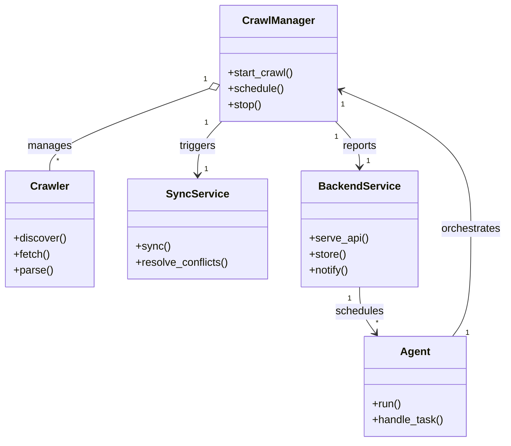
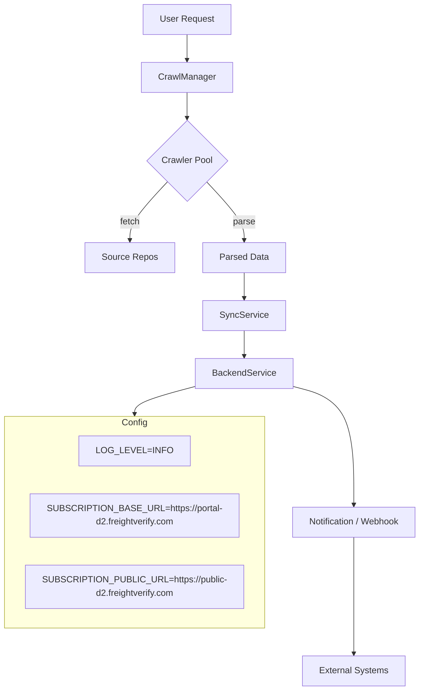

# Diagram: common/notification_service/config/config.dev2.yml

> Auto-generated by Obscura crawlers

## Diagram 1

### SVG

<svg id="container" width="748.640625" xmlns="http://www.w3.org/2000/svg" class="classDiagram" height="662" viewBox="0 0 748.640625 662" role="graphics-document document" aria-roledescription="class"><g><defs><marker id="container_class-aggregationStart" class="marker aggregation class" refX="18" refY="7" markerWidth="190" markerHeight="240" orient="auto"><path d="M 18,7 L9,13 L1,7 L9,1 Z"></path></marker></defs><defs><marker id="container_class-aggregationEnd" class="marker aggregation class" refX="1" refY="7" markerWidth="20" markerHeight="28" orient="auto"><path d="M 18,7 L9,13 L1,7 L9,1 Z"></path></marker></defs><defs><marker id="container_class-extensionStart" class="marker extension class" refX="18" refY="7" markerWidth="190" markerHeight="240" orient="auto"><path d="M 1,7 L18,13 V 1 Z"></path></marker></defs><defs><marker id="container_class-extensionEnd" class="marker extension class" refX="1" refY="7" markerWidth="20" markerHeight="28" orient="auto"><path d="M 1,1 V 13 L18,7 Z"></path></marker></defs><defs><marker id="container_class-compositionStart" class="marker composition class" refX="18" refY="7" markerWidth="190" markerHeight="240" orient="auto"><path d="M 18,7 L9,13 L1,7 L9,1 Z"></path></marker></defs><defs><marker id="container_class-compositionEnd" class="marker composition class" refX="1" refY="7" markerWidth="20" markerHeight="28" orient="auto"><path d="M 18,7 L9,13 L1,7 L9,1 Z"></path></marker></defs><defs><marker id="container_class-dependencyStart" class="marker dependency class" refX="6" refY="7" markerWidth="190" markerHeight="240" orient="auto"><path d="M 5,7 L9,13 L1,7 L9,1 Z"></path></marker></defs><defs><marker id="container_class-dependencyEnd" class="marker dependency class" refX="13" refY="7" markerWidth="20" markerHeight="28" orient="auto"><path d="M 18,7 L9,13 L14,7 L9,1 Z"></path></marker></defs><defs><marker id="container_class-lollipopStart" class="marker lollipop class" refX="13" refY="7" markerWidth="190" markerHeight="240" orient="auto"><circle stroke="black" fill="transparent" cx="7" cy="7" r="6"></circle></marker></defs><defs><marker id="container_class-lollipopEnd" class="marker lollipop class" refX="1" refY="7" markerWidth="190" markerHeight="240" orient="auto"><circle stroke="black" fill="transparent" cx="7" cy="7" r="6"></circle></marker></defs><g class="root"><g class="clusters"></g><g class="edgePaths"><path d="M308.504,132.808L269.333,147.173C230.161,161.539,151.819,190.269,112.648,210.801C73.477,231.333,73.477,243.667,73.477,249.833L73.477,256" id="id_CrawlManager_Crawler_1" class="edge-thickness-normal edge-pattern-solid relation" style=";;;" data-edge="true" data-et="edge" data-id="id_CrawlManager_Crawler_1" data-points="W3sieCI6MzI0LjY5OTIxODc1LCJ5IjoxMjYuODY4NDgyNzY4OTc4Mzh9LHsieCI6NzMuNDc2NTYyNSwieSI6MjE5fSx7IngiOjczLjQ3NjU2MjUsInkiOjI1Nn1d" marker-start="url(#container_class-aggregationStart)"></path><path d="M328.002,182L322.076,188.167C316.151,194.333,304.3,206.667,298.375,220C292.449,233.333,292.449,247.667,292.449,254.833L292.449,262" id="id_CrawlManager_SyncService_2" class="edge-thickness-normal edge-pattern-solid relation" style=";;;" data-edge="true" data-et="edge" data-id="id_CrawlManager_SyncService_2" data-points="W3sieCI6MzI4LjAwMTU3NTEwMDgwNjQ2LCJ5IjoxODJ9LHsieCI6MjkyLjQ0OTIxODc1LCJ5IjoyMTl9LHsieCI6MjkyLjQ0OTIxODc1LCJ5IjoyNjh9XQ==" marker-end="url(#container_class-dependencyEnd)"></path><path d="M495.194,182L501.119,188.167C507.045,194.333,518.895,206.667,524.821,218C530.746,229.333,530.746,239.667,530.746,244.833L530.746,250" id="id_CrawlManager_BackendService_3" class="edge-thickness-normal edge-pattern-solid relation" style=";;;" data-edge="true" data-et="edge" data-id="id_CrawlManager_BackendService_3" data-points="W3sieCI6NDk1LjE5MzczNzM5OTE5MzU0LCJ5IjoxODJ9LHsieCI6NTMwLjc0NjA5Mzc1LCJ5IjoyMTl9LHsieCI6NTMwLjc0NjA5Mzc1LCJ5IjoyNTZ9XQ==" marker-end="url(#container_class-dependencyEnd)"></path><path d="M668.364,504L672.903,497.833C677.441,491.667,686.517,479.333,691.056,452.5C695.594,425.667,695.594,384.333,695.594,343C695.594,301.667,695.594,260.333,663.661,225.724C631.727,191.114,567.861,163.229,535.928,149.286L503.995,135.343" id="id_Agent_CrawlManager_4" class="edge-thickness-normal edge-pattern-solid relation" style=";;;" data-edge="true" data-et="edge" data-id="id_Agent_CrawlManager_4" data-points="W3sieCI6NjY4LjM2NDQ0OTYzNzI3NjgsInkiOjUwNH0seyJ4Ijo2OTUuNTkzNzUsInkiOjQ2N30seyJ4Ijo2OTUuNTkzNzUsInkiOjM0M30seyJ4Ijo2OTUuNTkzNzUsInkiOjIxOX0seyJ4Ijo0OTguNDk2MDkzNzUsInkiOjEzMi45NDIwOTMxNzM1OTY2N31d" marker-end="url(#container_class-dependencyEnd)"></path><path d="M530.746,430L530.746,436.167C530.746,442.333,530.746,454.667,534.692,466.195C538.637,477.723,546.528,488.445,550.474,493.806L554.419,499.168" id="id_BackendService_Agent_5" class="edge-thickness-normal edge-pattern-solid relation" style=";;;" data-edge="true" data-et="edge" data-id="id_BackendService_Agent_5" data-points="W3sieCI6NTMwLjc0NjA5Mzc1LCJ5Ijo0MzB9LHsieCI6NTMwLjc0NjA5Mzc1LCJ5Ijo0Njd9LHsieCI6NTU3Ljk3NTM5NDExMjcyMzIsInkiOjUwNH1d" marker-end="url(#container_class-dependencyEnd)"></path></g><g class="edgeLabels"><g class="edgeLabel" transform="translate(73.4765625, 219)"><g class="label" data-id="id_CrawlManager_Crawler_1" transform="translate(-32.296875, -12)"><foreignObject width="64.59375" height="24">

manages

</foreignObject></g></g><g class="edgeLabel" transform="translate(292.44921875, 219)"><g class="label" data-id="id_CrawlManager_SyncService_2" transform="translate(-27.4921875, -12)"><foreignObject width="54.984375" height="24">

triggers

</foreignObject></g></g><g class="edgeLabel" transform="translate(530.74609375, 219)"><g class="label" data-id="id_CrawlManager_BackendService_3" transform="translate(-26.3515625, -12)"><foreignObject width="52.703125" height="24">

reports

</foreignObject></g></g><g class="edgeLabel" transform="translate(695.59375, 343)"><g class="label" data-id="id_Agent_CrawlManager_4" transform="translate(-45.046875, -12)"><foreignObject width="90.09375" height="24">

orchestrates

</foreignObject></g></g><g class="edgeLabel" transform="translate(530.74609375, 467)"><g class="label" data-id="id_BackendService_Agent_5" transform="translate(-36.453125, -12)"><foreignObject width="72.90625" height="24">

schedules

</foreignObject></g></g><g class="edgeTerminals" transform="translate(303.1045978753731, 118.8110461525511)"><g class="inner" transform="translate(0, 0)"><foreignObject style="width: 9px; height: 12px;">
1
</foreignObject></g></g><g class="edgeTerminals" transform="translate(305.06044340992935, 184.22586723921214)"><g class="inner" transform="translate(0, 0)"><foreignObject style="width: 9px; height: 12px;">
1
</foreignObject></g></g><g class="edgeTerminals" transform="translate(496.502699023835, 205.01166220370365)"><g class="inner" transform="translate(0, 0)"><foreignObject style="width: 9px; height: 12px;">
1
</foreignObject></g></g><g class="edgeTerminals" transform="translate(690.8181858246459, 498.7961825129957)"><g class="inner" transform="translate(0, 0)"><foreignObject style="width: 9px; height: 12px;">
1
</foreignObject></g></g><g class="edgeTerminals" transform="translate(515.7460918750002, 447.49999839285715)"><g class="inner" transform="translate(0, 0)"><foreignObject style="width: 9px; height: 12px;">
1
</foreignObject></g></g><g class="edgeTerminals" transform="translate(83.47656124999996, 233.49999892857144)"><g class="inner" transform="translate(0, 0)"></g><foreignObject style="width: 9px; height: 12px;">
*
</foreignObject></g><g class="edgeTerminals" transform="translate(302.449219375, 245.5000005357143)"><g class="inner" transform="translate(0, 0)"></g><foreignObject style="width: 9px; height: 12px;">
1
</foreignObject></g><g class="edgeTerminals" transform="translate(540.7460918749999, 233.49999839285712)"><g class="inner" transform="translate(0, 0)"></g><foreignObject style="width: 9px; height: 12px;">
1
</foreignObject></g><g class="edgeTerminals" transform="translate(503.5317989552605, 148.69142139480152)"><g class="inner" transform="translate(0, 0)"></g><foreignObject style="width: 9px; height: 12px;">
1
</foreignObject></g><g class="edgeTerminals" transform="translate(554.6838872951475, 476.0145464444803)"><g class="inner" transform="translate(0, 0)"></g><foreignObject style="width: 9px; height: 12px;">
*
</foreignObject></g></g><g class="nodes"><g class="node default" id="classId-CrawlManager-0" transform="translate(411.59765625, 95)"><g class="basic label-container"><path d="M-86.8984375 -87 L86.8984375 -87 L86.8984375 87 L-86.8984375 87" stroke="none" stroke-width="0" fill="#ECECFF" style=""></path><path d="M-86.8984375 -87 C-23.832817634061676 -87, 39.23280223187665 -87, 86.8984375 -87 M-86.8984375 -87 C-51.48336180205756 -87, -16.068286104115117 -87, 86.8984375 -87 M86.8984375 -87 C86.8984375 -32.894557026662966, 86.8984375 21.21088594667407, 86.8984375 87 M86.8984375 -87 C86.8984375 -21.10522230780795, 86.8984375 44.7895553843841, 86.8984375 87 M86.8984375 87 C33.37276765905679 87, -20.152902181886418 87, -86.8984375 87 M86.8984375 87 C18.92014747670943 87, -49.05814254658114 87, -86.8984375 87 M-86.8984375 87 C-86.8984375 30.097443158641937, -86.8984375 -26.805113682716126, -86.8984375 -87 M-86.8984375 87 C-86.8984375 32.1039508349535, -86.8984375 -22.792098330092998, -86.8984375 -87" stroke="#9370DB" stroke-width="1.3" fill="none" stroke-dasharray="0 0" style=""></path></g><g class="annotation-group text" transform="translate(0, -63)"></g><g class="label-group text" transform="translate(-51.59375, -63)"><g class="label" style="font-weight: bolder" transform="translate(0,-12)"><foreignObject width="103.1875" height="24">

CrawlManager

</foreignObject></g></g><g class="members-group text" transform="translate(-74.8984375, -15)"></g><g class="methods-group text" transform="translate(-74.8984375, 15)"><g class="label" style="" transform="translate(0,-12)"><foreignObject width="98.203125" height="24">

+start_crawl()

</foreignObject></g><g class="label" style="" transform="translate(0,12)"><foreignObject width="83.78125" height="24">

+schedule()

</foreignObject></g><g class="label" style="" transform="translate(0,36)"><foreignObject width="50.21875" height="24">

+stop()

</foreignObject></g></g><g class="divider" style=""><path d="M-86.8984375 -39 C-29.712579523367758 -39, 27.473278453264484 -39, 86.8984375 -39 M-86.8984375 -39 C-43.580577781715135 -39, -0.2627180634302704 -39, 86.8984375 -39" stroke="#9370DB" stroke-width="1.3" fill="none" stroke-dasharray="0 0" style=""></path></g><g class="divider" style=""><path d="M-86.8984375 -15 C-39.419134738530154 -15, 8.060168022939692 -15, 86.8984375 -15 M-86.8984375 -15 C-28.147711698134287 -15, 30.603014103731425 -15, 86.8984375 -15" stroke="#9370DB" stroke-width="1.3" fill="none" stroke-dasharray="0 0" style=""></path></g></g><g class="node default" id="classId-Crawler-1" transform="translate(73.4765625, 343)"><g class="basic label-container"><path d="M-65.4765625 -87 L65.4765625 -87 L65.4765625 87 L-65.4765625 87" stroke="none" stroke-width="0" fill="#ECECFF" style=""></path><path d="M-65.4765625 -87 C-18.380735207468994 -87, 28.71509208506201 -87, 65.4765625 -87 M-65.4765625 -87 C-13.551681112277073 -87, 38.37320027544585 -87, 65.4765625 -87 M65.4765625 -87 C65.4765625 -39.85011233199836, 65.4765625 7.299775336003279, 65.4765625 87 M65.4765625 -87 C65.4765625 -23.401949428259705, 65.4765625 40.19610114348059, 65.4765625 87 M65.4765625 87 C22.70716328340223 87, -20.062235933195538 87, -65.4765625 87 M65.4765625 87 C28.456378940719745 87, -8.56380461856051 87, -65.4765625 87 M-65.4765625 87 C-65.4765625 29.422415482013193, -65.4765625 -28.155169035973614, -65.4765625 -87 M-65.4765625 87 C-65.4765625 31.016942762158784, -65.4765625 -24.96611447568243, -65.4765625 -87" stroke="#9370DB" stroke-width="1.3" fill="none" stroke-dasharray="0 0" style=""></path></g><g class="annotation-group text" transform="translate(0, -63)"></g><g class="label-group text" transform="translate(-27.734375, -63)"><g class="label" style="font-weight: bolder" transform="translate(0,-12)"><foreignObject width="55.46875" height="24">

Crawler

</foreignObject></g></g><g class="members-group text" transform="translate(-53.4765625, -15)"></g><g class="methods-group text" transform="translate(-53.4765625, 15)"><g class="label" style="" transform="translate(0,-12)"><foreignObject width="79.21875" height="24">

+discover()

</foreignObject></g><g class="label" style="" transform="translate(0,12)"><foreignObject width="54.59375" height="24">

+fetch()

</foreignObject></g><g class="label" style="" transform="translate(0,36)"><foreignObject width="58.53125" height="24">

+parse()

</foreignObject></g></g><g class="divider" style=""><path d="M-65.4765625 -39 C-36.48544792626897 -39, -7.494333352537936 -39, 65.4765625 -39 M-65.4765625 -39 C-31.207161074860224 -39, 3.062240350279552 -39, 65.4765625 -39" stroke="#9370DB" stroke-width="1.3" fill="none" stroke-dasharray="0 0" style=""></path></g><g class="divider" style=""><path d="M-65.4765625 -15 C-30.297482548563686 -15, 4.881597402872629 -15, 65.4765625 -15 M-65.4765625 -15 C-35.27262696544634 -15, -5.0686914308926845 -15, 65.4765625 -15" stroke="#9370DB" stroke-width="1.3" fill="none" stroke-dasharray="0 0" style=""></path></g></g><g class="node default" id="classId-SyncService-2" transform="translate(292.44921875, 343)"><g class="basic label-container"><path d="M-103.49609375 -75 L103.49609375 -75 L103.49609375 75 L-103.49609375 75" stroke="none" stroke-width="0" fill="#ECECFF" style=""></path><path d="M-103.49609375 -75 C-40.775314026638675 -75, 21.94546569672265 -75, 103.49609375 -75 M-103.49609375 -75 C-23.974590026181218 -75, 55.546913697637564 -75, 103.49609375 -75 M103.49609375 -75 C103.49609375 -41.60319429099379, 103.49609375 -8.206388581987582, 103.49609375 75 M103.49609375 -75 C103.49609375 -20.700104844589397, 103.49609375 33.599790310821206, 103.49609375 75 M103.49609375 75 C31.02054326033023 75, -41.45500722933954 75, -103.49609375 75 M103.49609375 75 C30.924173454509642 75, -41.647746840980716 75, -103.49609375 75 M-103.49609375 75 C-103.49609375 16.847511878623095, -103.49609375 -41.30497624275381, -103.49609375 -75 M-103.49609375 75 C-103.49609375 42.812677121618975, -103.49609375 10.62535424323795, -103.49609375 -75" stroke="#9370DB" stroke-width="1.3" fill="none" stroke-dasharray="0 0" style=""></path></g><g class="annotation-group text" transform="translate(0, -51)"></g><g class="label-group text" transform="translate(-43.7421875, -51)"><g class="label" style="font-weight: bolder" transform="translate(0,-12)"><foreignObject width="87.484375" height="24">

SyncService

</foreignObject></g></g><g class="members-group text" transform="translate(-91.49609375, -3)"></g><g class="methods-group text" transform="translate(-91.49609375, 27)"><g class="label" style="" transform="translate(0,-12)"><foreignObject width="50.453125" height="24">

+sync()

</foreignObject></g><g class="label" style="" transform="translate(0,12)"><foreignObject width="139.25" height="24">

+resolve_conflicts()

</foreignObject></g></g><g class="divider" style=""><path d="M-103.49609375 -27 C-58.47040048379397 -27, -13.444707217587947 -27, 103.49609375 -27 M-103.49609375 -27 C-44.56278814783421 -27, 14.370517454331576 -27, 103.49609375 -27" stroke="#9370DB" stroke-width="1.3" fill="none" stroke-dasharray="0 0" style=""></path></g><g class="divider" style=""><path d="M-103.49609375 -3 C-42.508175125356416 -3, 18.479743499287167 -3, 103.49609375 -3 M-103.49609375 -3 C-30.918699509907228 -3, 41.658694730185545 -3, 103.49609375 -3" stroke="#9370DB" stroke-width="1.3" fill="none" stroke-dasharray="0 0" style=""></path></g></g><g class="node default" id="classId-BackendService-3" transform="translate(530.74609375, 343)"><g class="basic label-container"><path d="M-84.80078125 -87 L84.80078125 -87 L84.80078125 87 L-84.80078125 87" stroke="none" stroke-width="0" fill="#ECECFF" style=""></path><path d="M-84.80078125 -87 C-36.847094610124984 -87, 11.106592029750033 -87, 84.80078125 -87 M-84.80078125 -87 C-48.88870001100947 -87, -12.976618772018938 -87, 84.80078125 -87 M84.80078125 -87 C84.80078125 -36.48446957729981, 84.80078125 14.031060845400376, 84.80078125 87 M84.80078125 -87 C84.80078125 -40.55848004447729, 84.80078125 5.883039911045415, 84.80078125 87 M84.80078125 87 C36.49011839372484 87, -11.820544462550316 87, -84.80078125 87 M84.80078125 87 C46.58435753838386 87, 8.367933826767725 87, -84.80078125 87 M-84.80078125 87 C-84.80078125 20.994246219394356, -84.80078125 -45.01150756121129, -84.80078125 -87 M-84.80078125 87 C-84.80078125 51.2848165432711, -84.80078125 15.569633086542197, -84.80078125 -87" stroke="#9370DB" stroke-width="1.3" fill="none" stroke-dasharray="0 0" style=""></path></g><g class="annotation-group text" transform="translate(0, -63)"></g><g class="label-group text" transform="translate(-57.9453125, -63)"><g class="label" style="font-weight: bolder" transform="translate(0,-12)"><foreignObject width="115.890625" height="24">

BackendService

</foreignObject></g></g><g class="members-group text" transform="translate(-72.80078125, -15)"></g><g class="methods-group text" transform="translate(-72.80078125, 15)"><g class="label" style="" transform="translate(0,-12)"><foreignObject width="87.65625" height="24">

+serve_api()

</foreignObject></g><g class="label" style="" transform="translate(0,12)"><foreignObject width="55.125" height="24">

+store()

</foreignObject></g><g class="label" style="" transform="translate(0,36)"><foreignObject width="60.59375" height="24">

+notify()

</foreignObject></g></g><g class="divider" style=""><path d="M-84.80078125 -39 C-32.53626739317428 -39, 19.728246463651445 -39, 84.80078125 -39 M-84.80078125 -39 C-27.971496954602408 -39, 28.857787340795184 -39, 84.80078125 -39" stroke="#9370DB" stroke-width="1.3" fill="none" stroke-dasharray="0 0" style=""></path></g><g class="divider" style=""><path d="M-84.80078125 -15 C-36.62171655240452 -15, 11.557348145190957 -15, 84.80078125 -15 M-84.80078125 -15 C-37.20422551554321 -15, 10.392330218913585 -15, 84.80078125 -15" stroke="#9370DB" stroke-width="1.3" fill="none" stroke-dasharray="0 0" style=""></path></g></g><g class="node default" id="classId-Agent-4" transform="translate(613.169921875, 579)"><g class="basic label-container"><path d="M-75.671875 -75 L75.671875 -75 L75.671875 75 L-75.671875 75" stroke="none" stroke-width="0" fill="#ECECFF" style=""></path><path d="M-75.671875 -75 C-30.277543123050364 -75, 15.116788753899272 -75, 75.671875 -75 M-75.671875 -75 C-34.677432035325445 -75, 6.3170109293491095 -75, 75.671875 -75 M75.671875 -75 C75.671875 -31.343030134078532, 75.671875 12.313939731842936, 75.671875 75 M75.671875 -75 C75.671875 -24.653868752604147, 75.671875 25.692262494791706, 75.671875 75 M75.671875 75 C19.49559903631245 75, -36.6806769273751 75, -75.671875 75 M75.671875 75 C16.32756936086885 75, -43.0167362782623 75, -75.671875 75 M-75.671875 75 C-75.671875 17.66781422648279, -75.671875 -39.66437154703442, -75.671875 -75 M-75.671875 75 C-75.671875 43.78856409711335, -75.671875 12.577128194226695, -75.671875 -75" stroke="#9370DB" stroke-width="1.3" fill="none" stroke-dasharray="0 0" style=""></path></g><g class="annotation-group text" transform="translate(0, -51)"></g><g class="label-group text" transform="translate(-21.078125, -51)"><g class="label" style="font-weight: bolder" transform="translate(0,-12)"><foreignObject width="42.15625" height="24">

Agent

</foreignObject></g></g><g class="members-group text" transform="translate(-63.671875, -3)"></g><g class="methods-group text" transform="translate(-63.671875, 27)"><g class="label" style="" transform="translate(0,-12)"><foreignObject width="43.21875" height="24">

+run()

</foreignObject></g><g class="label" style="" transform="translate(0,12)"><foreignObject width="106.265625" height="24">

+handle_task()

</foreignObject></g></g><g class="divider" style=""><path d="M-75.671875 -27 C-28.4020101691123 -27, 18.867854661775397 -27, 75.671875 -27 M-75.671875 -27 C-27.343165458476157 -27, 20.985544083047685 -27, 75.671875 -27" stroke="#9370DB" stroke-width="1.3" fill="none" stroke-dasharray="0 0" style=""></path></g><g class="divider" style=""><path d="M-75.671875 -3 C-17.563057675841492 -3, 40.545759648317016 -3, 75.671875 -3 M-75.671875 -3 C-41.051189171159905 -3, -6.43050334231981 -3, 75.671875 -3" stroke="#9370DB" stroke-width="1.3" fill="none" stroke-dasharray="0 0" style=""></path></g></g></g></g></g></svg>

## Diagram 2

### SVG

<svg id="container" width="745.09375" xmlns="http://www.w3.org/2000/svg" class="flowchart" height="1238.375" viewBox="0 0 745.09375 1238.375" role="graphics-document document" aria-roledescription="flowchart-v2"><g><marker id="container_flowchart-v2-pointEnd" class="marker flowchart-v2" viewBox="0 0 10 10" refX="5" refY="5" markerUnits="userSpaceOnUse" markerWidth="8" markerHeight="8" orient="auto"><path d="M 0 0 L 10 5 L 0 10 z" class="arrowMarkerPath" style="stroke-width: 1; stroke-dasharray: 1, 0;"></path></marker><marker id="container_flowchart-v2-pointStart" class="marker flowchart-v2" viewBox="0 0 10 10" refX="4.5" refY="5" markerUnits="userSpaceOnUse" markerWidth="8" markerHeight="8" orient="auto"><path d="M 0 5 L 10 10 L 10 0 z" class="arrowMarkerPath" style="stroke-width: 1; stroke-dasharray: 1, 0;"></path></marker><marker id="container_flowchart-v2-circleEnd" class="marker flowchart-v2" viewBox="0 0 10 10" refX="11" refY="5" markerUnits="userSpaceOnUse" markerWidth="11" markerHeight="11" orient="auto"><circle cx="5" cy="5" r="5" class="arrowMarkerPath" style="stroke-width: 1; stroke-dasharray: 1, 0;"></circle></marker><marker id="container_flowchart-v2-circleStart" class="marker flowchart-v2" viewBox="0 0 10 10" refX="-1" refY="5" markerUnits="userSpaceOnUse" markerWidth="11" markerHeight="11" orient="auto"><circle cx="5" cy="5" r="5" class="arrowMarkerPath" style="stroke-width: 1; stroke-dasharray: 1, 0;"></circle></marker><marker id="container_flowchart-v2-crossEnd" class="marker cross flowchart-v2" viewBox="0 0 11 11" refX="12" refY="5.2" markerUnits="userSpaceOnUse" markerWidth="11" markerHeight="11" orient="auto"><path d="M 1,1 l 9,9 M 10,1 l -9,9" class="arrowMarkerPath" style="stroke-width: 2; stroke-dasharray: 1, 0;"></path></marker><marker id="container_flowchart-v2-crossStart" class="marker cross flowchart-v2" viewBox="0 0 11 11" refX="-1" refY="5.2" markerUnits="userSpaceOnUse" markerWidth="11" markerHeight="11" orient="auto"><path d="M 1,1 l 9,9 M 10,1 l -9,9" class="arrowMarkerPath" style="stroke-width: 2; stroke-dasharray: 1, 0;"></path></marker><g class="root"><g class="clusters"></g><g class="edgePaths"><path d="M326.641,62L326.641,66.167C326.641,70.333,326.641,78.667,326.641,86.333C326.641,94,326.641,101,326.641,104.5L326.641,108" id="L_A_B_0" class="edge-thickness-normal edge-pattern-solid edge-thickness-normal edge-pattern-solid flowchart-link" style=";" data-edge="true" data-et="edge" data-id="L_A_B_0" data-points="W3sieCI6MzI2LjY0MDYyNSwieSI6NjJ9LHsieCI6MzI2LjY0MDYyNSwieSI6ODd9LHsieCI6MzI2LjY0MDYyNSwieSI6MTEyfV0=" marker-end="url(#container_flowchart-v2-pointEnd)"></path><path d="M326.641,166L326.641,170.167C326.641,174.333,326.641,182.667,326.641,190.333C326.641,198,326.641,205,326.641,208.5L326.641,212" id="L_B_C_0" class="edge-thickness-normal edge-pattern-solid edge-thickness-normal edge-pattern-solid flowchart-link" style=";" data-edge="true" data-et="edge" data-id="L_B_C_0" data-points="W3sieCI6MzI2LjY0MDYyNSwieSI6MTY2fSx7IngiOjMyNi42NDA2MjUsInkiOjE5MX0seyJ4IjozMjYuNjQwNjI1LCJ5IjoyMTZ9XQ==" marker-end="url(#container_flowchart-v2-pointEnd)"></path><path d="M291.947,325.682L280.891,337.631C269.835,349.579,247.722,373.477,236.666,390.926C225.609,408.375,225.609,419.375,225.609,424.875L225.609,430.375" id="L_C_D_0" class="edge-thickness-normal edge-pattern-solid edge-thickness-normal edge-pattern-solid flowchart-link" style=";" data-edge="true" data-et="edge" data-id="L_C_D_0" data-points="W3sieCI6MjkxLjk0NzI3MTcyMjE2NDQzLCJ5IjozMjUuNjgxNjQ2NzIyMTY0NDN9LHsieCI6MjI1LjYwOTM3NSwieSI6Mzk3LjM3NX0seyJ4IjoyMjUuNjA5Mzc1LCJ5Ijo0MzQuMzc1fV0=" marker-end="url(#container_flowchart-v2-pointEnd)"></path><path d="M361.334,325.682L372.39,337.631C383.447,349.579,405.559,373.477,416.616,390.926C427.672,408.375,427.672,419.375,427.672,424.875L427.672,430.375" id="L_C_E_0" class="edge-thickness-normal edge-pattern-solid edge-thickness-normal edge-pattern-solid flowchart-link" style=";" data-edge="true" data-et="edge" data-id="L_C_E_0" data-points="W3sieCI6MzYxLjMzMzk3ODI3NzgzNTU3LCJ5IjozMjUuNjgxNjQ2NzIyMTY0NDN9LHsieCI6NDI3LjY3MTg3NSwieSI6Mzk3LjM3NX0seyJ4Ijo0MjcuNjcxODc1LCJ5Ijo0MzQuMzc1fV0=" marker-end="url(#container_flowchart-v2-pointEnd)"></path><path d="M427.672,488.375L427.672,492.542C427.672,496.708,427.672,505.042,427.672,512.708C427.672,520.375,427.672,527.375,427.672,530.875L427.672,534.375" id="L_E_F_0" class="edge-thickness-normal edge-pattern-solid edge-thickness-normal edge-pattern-solid flowchart-link" style=";" data-edge="true" data-et="edge" data-id="L_E_F_0" data-points="W3sieCI6NDI3LjY3MTg3NSwieSI6NDg4LjM3NX0seyJ4Ijo0MjcuNjcxODc1LCJ5Ijo1MTMuMzc1fSx7IngiOjQyNy42NzE4NzUsInkiOjUzOC4zNzV9XQ==" marker-end="url(#container_flowchart-v2-pointEnd)"></path><path d="M427.672,592.375L427.672,596.542C427.672,600.708,427.672,609.042,427.672,616.708C427.672,624.375,427.672,631.375,427.672,634.875L427.672,638.375" id="L_F_G_0" class="edge-thickness-normal edge-pattern-solid edge-thickness-normal edge-pattern-solid flowchart-link" style=";" data-edge="true" data-et="edge" data-id="L_F_G_0" data-points="W3sieCI6NDI3LjY3MTg3NSwieSI6NTkyLjM3NX0seyJ4Ijo0MjcuNjcxODc1LCJ5Ijo2MTcuMzc1fSx7IngiOjQyNy42NzE4NzUsInkiOjY0Mi4zNzV9XQ==" marker-end="url(#container_flowchart-v2-pointEnd)"></path><path d="M514.594,692.581L532.569,697.38C550.544,702.179,586.495,711.777,604.47,747.243C622.445,782.708,622.445,844.042,622.445,874.708L622.445,905.375" id="L_G_H_0" class="edge-thickness-normal edge-pattern-solid edge-thickness-normal edge-pattern-solid flowchart-link" style=";" data-edge="true" data-et="edge" data-id="L_G_H_0" data-points="W3sieCI6NTE0LjU5Mzc1LCJ5Ijo2OTIuNTgxMTI4OTE1ODA3N30seyJ4Ijo2MjIuNDQ1MzEyNSwieSI6NzIxLjM3NX0seyJ4Ijo2MjIuNDQ1MzEyNSwieSI6OTA5LjM3NX1d" marker-end="url(#container_flowchart-v2-pointEnd)"></path><path d="M622.445,963.375L622.445,994.708C622.445,1026.042,622.445,1088.708,622.445,1123.542C622.445,1158.375,622.445,1165.375,622.445,1168.875L622.445,1172.375" id="L_H_I_0" class="edge-thickness-normal edge-pattern-solid edge-thickness-normal edge-pattern-solid flowchart-link" style=";" data-edge="true" data-et="edge" data-id="L_H_I_0" data-points="W3sieCI6NjIyLjQ0NTMxMjUsInkiOjk2My4zNzV9LHsieCI6NjIyLjQ0NTMxMjUsInkiOjExNTEuMzc1fSx7IngiOjYyMi40NDUzMTI1LCJ5IjoxMTc2LjM3NX1d" marker-end="url(#container_flowchart-v2-pointEnd)"></path><path d="M340.75,692.581L322.775,697.38C304.799,702.179,268.849,711.777,250.874,720.076C232.898,728.375,232.898,735.375,232.898,738.875L232.898,742.375" id="L_G_Config_0" class="edge-thickness-normal edge-pattern-solid edge-thickness-normal edge-pattern-solid flowchart-link" style=";" data-edge="true" data-et="edge" data-id="L_G_Config_0" data-points="W3sieCI6MzQwLjc1LCJ5Ijo2OTIuNTgxMTI4OTE1ODA3N30seyJ4IjoyMzIuODk4NDM3NSwieSI6NzIxLjM3NX0seyJ4IjoyMzIuODk4NDM3NSwieSI6NzQ2LjM3NX1d" marker-end="url(#container_flowchart-v2-pointEnd)"></path></g><g class="edgeLabels"><g class="edgeLabel"><g class="label" data-id="L_A_B_0" transform="translate(0, 0)"><foreignObject width="0" height="0">

</foreignObject></g></g><g class="edgeLabel"><g class="label" data-id="L_B_C_0" transform="translate(0, 0)"><foreignObject width="0" height="0">

</foreignObject></g></g><g class="edgeLabel" transform="translate(225.609375, 397.375)"><g class="label" data-id="L_C_D_0" transform="translate(-18.2421875, -12)"><foreignObject width="36.484375" height="24">

fetch

</foreignObject></g></g><g class="edgeLabel" transform="translate(427.671875, 397.375)"><g class="label" data-id="L_C_E_0" transform="translate(-20.09375, -12)"><foreignObject width="40.1875" height="24">

parse

</foreignObject></g></g><g class="edgeLabel"><g class="label" data-id="L_E_F_0" transform="translate(0, 0)"><foreignObject width="0" height="0">

</foreignObject></g></g><g class="edgeLabel"><g class="label" data-id="L_F_G_0" transform="translate(0, 0)"><foreignObject width="0" height="0">

</foreignObject></g></g><g class="edgeLabel"><g class="label" data-id="L_G_H_0" transform="translate(0, 0)"><foreignObject width="0" height="0">

</foreignObject></g></g><g class="edgeLabel"><g class="label" data-id="L_H_I_0" transform="translate(0, 0)"><foreignObject width="0" height="0">

</foreignObject></g></g><g class="edgeLabel"><g class="label" data-id="L_G_Config_0" transform="translate(0, 0)"><foreignObject width="0" height="0">

</foreignObject></g></g></g><g class="nodes"><g class="root" transform="translate(0, 738.375)"><g class="clusters"><g class="cluster" id="Config" data-look="classic"><rect style="" x="8" y="8" width="449.796875" height="380"></rect><g class="cluster-label" transform="translate(210.453125, 8)"><foreignObject width="44.890625" height="24">

Config

</foreignObject></g></g></g><g class="edgePaths"></g><g class="edgeLabels"></g><g class="nodes"><g class="node default" id="flowchart-LOG_LEVEL-16" transform="translate(232.8984375, 70)"><rect class="basic label-container" style="" x="-90.2578125" y="-27" width="180.515625" height="54"></rect><g class="label" style="" transform="translate(-60.2578125, -12)"><rect></rect><foreignObject width="120.515625" height="24">

LOG_LEVEL=INFO

</foreignObject></g></g><g class="node default" id="flowchart-SUB_BASE-17" transform="translate(232.8984375, 186)"><rect class="basic label-container" style="" x="-179.453125" y="-39" width="358.90625" height="78"></rect><g class="label" style="" transform="translate(-149.453125, -24)"><rect></rect><foreignObject width="298.90625" height="48">

SUBSCRIPTION_BASE_URL=https://portal-d2.freightverify.com

</foreignObject></g></g><g class="node default" id="flowchart-SUB_PUB-18" transform="translate(232.8984375, 314)"><rect class="basic label-container" style="" x="-187.3984375" y="-39" width="374.796875" height="78"></rect><g class="label" style="" transform="translate(-157.3984375, -24)"><rect></rect><foreignObject width="314.796875" height="48">

SUBSCRIPTION_PUBLIC_URL=https://public-d2.freightverify.com

</foreignObject></g></g></g></g><g class="node default" id="flowchart-A-0" transform="translate(326.640625, 35)"><rect class="basic label-container" style="" x="-78.0703125" y="-27" width="156.140625" height="54"></rect><g class="label" style="" transform="translate(-48.0703125, -12)"><rect></rect><foreignObject width="96.140625" height="24">

User Request

</foreignObject></g></g><g class="node default" id="flowchart-B-1" transform="translate(326.640625, 139)"><rect class="basic label-container" style="" x="-80.578125" y="-27" width="161.15625" height="54"></rect><g class="label" style="" transform="translate(-50.578125, -12)"><rect></rect><foreignObject width="101.15625" height="24">

CrawlManager

</foreignObject></g></g><g class="node default" id="flowchart-C-3" transform="translate(326.640625, 288.1875)"><polygon points="72.1875,0 144.375,-72.1875 72.1875,-144.375 0,-72.1875" class="label-container" transform="translate(-71.6875, 72.1875)"></polygon><g class="label" style="" transform="translate(-45.1875, -12)"><rect></rect><foreignObject width="90.375" height="24">

Crawler Pool

</foreignObject></g></g><g class="node default" id="flowchart-D-5" transform="translate(225.609375, 461.375)"><rect class="basic label-container" style="" x="-78.921875" y="-27" width="157.84375" height="54"></rect><g class="label" style="" transform="translate(-48.921875, -12)"><rect></rect><foreignObject width="97.84375" height="24">

Source Repos

</foreignObject></g></g><g class="node default" id="flowchart-E-7" transform="translate(427.671875, 461.375)"><rect class="basic label-container" style="" x="-73.140625" y="-27" width="146.28125" height="54"></rect><g class="label" style="" transform="translate(-43.140625, -12)"><rect></rect><foreignObject width="86.28125" height="24">

Parsed Data

</foreignObject></g></g><g class="node default" id="flowchart-F-9" transform="translate(427.671875, 565.375)"><rect class="basic label-container" style="" x="-72.7578125" y="-27" width="145.515625" height="54"></rect><g class="label" style="" transform="translate(-42.7578125, -12)"><rect></rect><foreignObject width="85.515625" height="24">

SyncService

</foreignObject></g></g><g class="node default" id="flowchart-G-11" transform="translate(427.671875, 669.375)"><rect class="basic label-container" style="" x="-86.921875" y="-27" width="173.84375" height="54"></rect><g class="label" style="" transform="translate(-56.921875, -12)"><rect></rect><foreignObject width="113.84375" height="24">

BackendService

</foreignObject></g></g><g class="node default" id="flowchart-H-13" transform="translate(622.4453125, 936.375)"><rect class="basic label-container" style="" x="-114.6484375" y="-27" width="229.296875" height="54"></rect><g class="label" style="" transform="translate(-84.6484375, -12)"><rect></rect><foreignObject width="169.296875" height="24">

Notification / Webhook

</foreignObject></g></g><g class="node default" id="flowchart-I-15" transform="translate(622.4453125, 1203.375)"><rect class="basic label-container" style="" x="-91.421875" y="-27" width="182.84375" height="54"></rect><g class="label" style="" transform="translate(-61.421875, -12)"><rect></rect><foreignObject width="122.84375" height="24">

External Systems

</foreignObject></g></g></g></g></g></svg>
