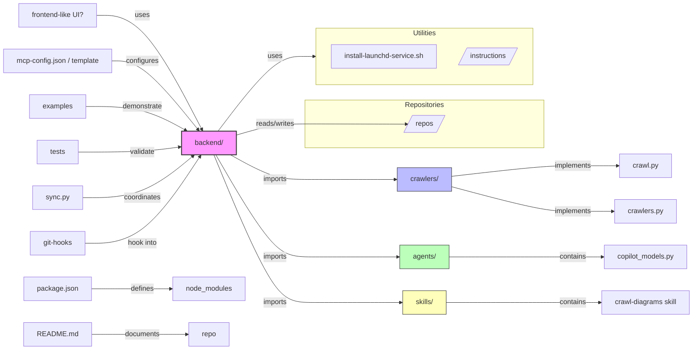

# Diagram: common/notification_service/config/config.prod-a.yml

> Auto-generated by Obscura crawlers

## Mermaid

### SVG

<svg id="container" width="1624.5625" xmlns="http://www.w3.org/2000/svg" class="flowchart" height="798" viewBox="0 0 1624.5625 798" role="graphics-document document" aria-roledescription="flowchart-v2"><g><marker id="container_flowchart-v2-pointEnd" class="marker flowchart-v2" viewBox="0 0 10 10" refX="5" refY="5" markerUnits="userSpaceOnUse" markerWidth="8" markerHeight="8" orient="auto"><path d="M 0 0 L 10 5 L 0 10 z" class="arrowMarkerPath" style="stroke-width: 1; stroke-dasharray: 1, 0;"></path></marker><marker id="container_flowchart-v2-pointStart" class="marker flowchart-v2" viewBox="0 0 10 10" refX="4.5" refY="5" markerUnits="userSpaceOnUse" markerWidth="8" markerHeight="8" orient="auto"><path d="M 0 5 L 10 10 L 10 0 z" class="arrowMarkerPath" style="stroke-width: 1; stroke-dasharray: 1, 0;"></path></marker><marker id="container_flowchart-v2-circleEnd" class="marker flowchart-v2" viewBox="0 0 10 10" refX="11" refY="5" markerUnits="userSpaceOnUse" markerWidth="11" markerHeight="11" orient="auto"><circle cx="5" cy="5" r="5" class="arrowMarkerPath" style="stroke-width: 1; stroke-dasharray: 1, 0;"></circle></marker><marker id="container_flowchart-v2-circleStart" class="marker flowchart-v2" viewBox="0 0 10 10" refX="-1" refY="5" markerUnits="userSpaceOnUse" markerWidth="11" markerHeight="11" orient="auto"><circle cx="5" cy="5" r="5" class="arrowMarkerPath" style="stroke-width: 1; stroke-dasharray: 1, 0;"></circle></marker><marker id="container_flowchart-v2-crossEnd" class="marker cross flowchart-v2" viewBox="0 0 11 11" refX="12" refY="5.2" markerUnits="userSpaceOnUse" markerWidth="11" markerHeight="11" orient="auto"><path d="M 1,1 l 9,9 M 10,1 l -9,9" class="arrowMarkerPath" style="stroke-width: 2; stroke-dasharray: 1, 0;"></path></marker><marker id="container_flowchart-v2-crossStart" class="marker cross flowchart-v2" viewBox="0 0 11 11" refX="-1" refY="5.2" markerUnits="userSpaceOnUse" markerWidth="11" markerHeight="11" orient="auto"><path d="M 1,1 l 9,9 M 10,1 l -9,9" class="arrowMarkerPath" style="stroke-width: 2; stroke-dasharray: 1, 0;"></path></marker><g class="root"><g class="clusters"><g class="cluster" id="Repositories" data-look="classic"><rect style="" x="717.421875" y="228.25" width="558.4375" height="109"></rect><g class="cluster-label" transform="translate(951.2578125, 228.25)"><foreignObject width="90.765625" height="24">

Repositories

</foreignObject></g></g></g><g class="edgePaths"><path d="M227.766,35L245.889,35C264.013,35,300.26,35,341.532,78.453C382.803,121.907,429.098,208.813,452.245,252.266L475.393,295.72" id="L_A_backend_0" class="edge-thickness-normal edge-pattern-solid edge-thickness-normal edge-pattern-solid flowchart-link" style=";" data-edge="true" data-et="edge" data-id="L_A_backend_0" data-points="W3sieCI6MjI3Ljc2NTYyNSwieSI6MzV9LHsieCI6MzM2LjUwNzgxMjUsInkiOjM1fSx7IngiOjQ3Ny4yNzMzOTA1NTc5Mzk5MywieSI6Mjk5LjI1fV0=" marker-end="url(#container_flowchart-v2-pointEnd)"></path><path d="M541.868,353.25L559.303,362.625C576.738,372,611.607,390.75,640.866,400.125C670.125,409.5,693.773,409.5,740.766,409.5C787.758,409.5,858.094,409.5,893.262,409.5L928.43,409.5" id="L_backend_crawlers_0" class="edge-thickness-normal edge-pattern-solid edge-thickness-normal edge-pattern-solid flowchart-link" style=";" data-edge="true" data-et="edge" data-id="L_backend_crawlers_0" data-points="W3sieCI6NTQxLjg2ODI0MzI0MzI0MzIsInkiOjM1My4yNX0seyJ4Ijo2NDYuNDc2NTYyNSwieSI6NDA5LjV9LHsieCI6NzE3LjQyMTg3NSwieSI6NDA5LjV9LHsieCI6OTMyLjQyOTY4NzUsInkiOjQwOS41fV0=" marker-end="url(#container_flowchart-v2-pointEnd)"></path><path d="M507.734,353.25L530.858,392.083C553.981,430.917,600.229,508.583,635.177,547.417C670.125,586.25,693.773,586.25,741.777,586.25C789.781,586.25,862.141,586.25,898.32,586.25L934.5,586.25" id="L_backend_agents_0" class="edge-thickness-normal edge-pattern-solid edge-thickness-normal edge-pattern-solid flowchart-link" style=";" data-edge="true" data-et="edge" data-id="L_backend_agents_0" data-points="W3sieCI6NTA3LjczMzc0Mzk5MDM4NDYsInkiOjM1My4yNX0seyJ4Ijo2NDYuNDc2NTYyNSwieSI6NTg2LjI1fSx7IngiOjcxNy40MjE4NzUsInkiOjU4Ni4yNX0seyJ4Ijo5MzguNSwieSI6NTg2LjI1fV0=" marker-end="url(#container_flowchart-v2-pointEnd)"></path><path d="M503.14,353.25L527.03,409.417C550.919,465.583,598.698,577.917,634.411,634.083C670.125,690.25,693.773,690.25,742.688,690.25C791.602,690.25,865.781,690.25,902.871,690.25L939.961,690.25" id="L_backend_skills_0" class="edge-thickness-normal edge-pattern-solid edge-thickness-normal edge-pattern-solid flowchart-link" style=";" data-edge="true" data-et="edge" data-id="L_backend_skills_0" data-points="W3sieCI6NTAzLjE0MDE3NDI3ODg0NjEzLCJ5IjozNTMuMjV9LHsieCI6NjQ2LjQ3NjU2MjUsInkiOjY5MC4yNX0seyJ4Ijo3MTcuNDIxODc1LCJ5Ijo2OTAuMjV9LHsieCI6OTQzLjk2MDkzNzUsInkiOjY5MC4yNX1d" marker-end="url(#container_flowchart-v2-pointEnd)"></path><path d="M1060.852,402.314L1096.686,398.303C1132.521,394.292,1204.19,386.271,1251.368,382.261C1298.547,378.25,1321.234,378.25,1350.365,378.25C1379.495,378.25,1415.068,378.25,1432.854,378.25L1450.641,378.25" id="L_crawlers_crawl_py_0" class="edge-thickness-normal edge-pattern-solid edge-thickness-normal edge-pattern-solid flowchart-link" style=";" data-edge="true" data-et="edge" data-id="L_crawlers_crawl_py_0" data-points="W3sieCI6MTA2MC44NTE1NjI1LCJ5Ijo0MDIuMzEzNTQ5MjQ0NTQzOTR9LHsieCI6MTI3NS44NTkzNzUsInkiOjM3OC4yNX0seyJ4IjoxMzQzLjkyMTg3NSwieSI6Mzc4LjI1fSx7IngiOjE0NTQuNjQwNjI1LCJ5IjozNzguMjV9XQ==" marker-end="url(#container_flowchart-v2-pointEnd)"></path><path d="M1060.852,426.23L1096.686,435.567C1132.521,444.903,1204.19,463.577,1251.368,472.913C1298.547,482.25,1321.234,482.25,1348.533,482.25C1375.831,482.25,1407.74,482.25,1423.694,482.25L1439.648,482.25" id="L_crawlers_crawlers_py_0" class="edge-thickness-normal edge-pattern-solid edge-thickness-normal edge-pattern-solid flowchart-link" style=";" data-edge="true" data-et="edge" data-id="L_crawlers_crawlers_py_0" data-points="W3sieCI6MTA2MC44NTE1NjI1LCJ5Ijo0MjYuMjMwMDU3MzU4NzAxNzR9LHsieCI6MTI3NS44NTkzNzUsInkiOjQ4Mi4yNX0seyJ4IjoxMzQzLjkyMTg3NSwieSI6NDgyLjI1fSx7IngiOjE0NDMuNjQ4NDM3NSwieSI6NDgyLjI1fV0=" marker-end="url(#container_flowchart-v2-pointEnd)"></path><path d="M1054.781,586.25L1091.628,586.25C1128.474,586.25,1202.167,586.25,1250.357,586.25C1298.547,586.25,1321.234,586.25,1344.186,586.25C1367.138,586.25,1390.354,586.25,1401.962,586.25L1413.57,586.25" id="L_agents_copilot_models_0" class="edge-thickness-normal edge-pattern-solid edge-thickness-normal edge-pattern-solid flowchart-link" style=";" data-edge="true" data-et="edge" data-id="L_agents_copilot_models_0" data-points="W3sieCI6MTA1NC43ODEyNSwieSI6NTg2LjI1fSx7IngiOjEyNzUuODU5Mzc1LCJ5Ijo1ODYuMjV9LHsieCI6MTM0My45MjE4NzUsInkiOjU4Ni4yNX0seyJ4IjoxNDE3LjU3MDMxMjUsInkiOjU4Ni4yNX1d" marker-end="url(#container_flowchart-v2-pointEnd)"></path><path d="M1049.32,690.25L1087.077,690.25C1124.833,690.25,1200.346,690.25,1249.447,690.25C1298.547,690.25,1321.234,690.25,1343.255,690.25C1365.276,690.25,1386.63,690.25,1397.307,690.25L1407.984,690.25" id="L_skills_crawl_diagrams_skill_0" class="edge-thickness-normal edge-pattern-solid edge-thickness-normal edge-pattern-solid flowchart-link" style=";" data-edge="true" data-et="edge" data-id="L_skills_crawl_diagrams_skill_0" data-points="W3sieCI6MTA0OS4zMjAzMTI1LCJ5Ijo2OTAuMjV9LHsieCI6MTI3NS44NTkzNzUsInkiOjY5MC4yNX0seyJ4IjoxMzQzLjkyMTg3NSwieSI6NjkwLjI1fSx7IngiOjE0MTEuOTg0Mzc1LCJ5Ijo2OTAuMjV9XQ==" marker-end="url(#container_flowchart-v2-pointEnd)"></path><path d="M265.234,139L277.113,139C288.992,139,312.75,139,346.333,165.195C379.916,191.39,423.325,243.78,445.029,269.975L466.733,296.17" id="L_repo_config_backend_0" class="edge-thickness-normal edge-pattern-solid edge-thickness-normal edge-pattern-solid flowchart-link" style=";" data-edge="true" data-et="edge" data-id="L_repo_config_backend_0" data-points="W3sieCI6MjY1LjIzNDM3NSwieSI6MTM5fSx7IngiOjMzNi41MDc4MTI1LCJ5IjoxMzl9LHsieCI6NDY5LjI4NTA0NjcyODk3MTk2LCJ5IjoyOTkuMjV9XQ==" marker-end="url(#container_flowchart-v2-pointEnd)"></path><path d="M201.031,243L223.611,243C246.19,243,291.349,243,330.813,252.06C370.276,261.12,404.045,279.239,420.929,288.299L437.813,297.359" id="L_examples_backend_0" class="edge-thickness-normal edge-pattern-solid edge-thickness-normal edge-pattern-solid flowchart-link" style=";" data-edge="true" data-et="edge" data-id="L_examples_backend_0" data-points="W3sieCI6MjAxLjAzMTI1LCJ5IjoyNDN9LHsieCI6MzM2LjUwNzgxMjUsInkiOjI0M30seyJ4Ijo0NDEuMzM3ODM3ODM3ODM3OCwieSI6Mjk5LjI1fV0=" marker-end="url(#container_flowchart-v2-pointEnd)"></path><path d="M184.109,347L209.509,347C234.909,347,285.708,347,325.494,345.076C365.28,343.152,394.052,339.304,408.438,337.38L422.824,335.456" id="L_tests_backend_0" class="edge-thickness-normal edge-pattern-solid edge-thickness-normal edge-pattern-solid flowchart-link" style=";" data-edge="true" data-et="edge" data-id="L_tests_backend_0" data-points="W3sieCI6MTg0LjEwOTM3NSwieSI6MzQ3fSx7IngiOjMzNi41MDc4MTI1LCJ5IjozNDd9LHsieCI6NDI2Ljc4OTA2MjUsInkiOjMzNC45MjU1MjQ5NTA5MDM5fV0=" marker-end="url(#container_flowchart-v2-pointEnd)"></path><path d="M213.289,659L233.826,659C254.362,659,295.435,659,327.184,659C358.932,659,381.357,659,392.569,659L403.781,659" id="L_package_json_node_modules_0" class="edge-thickness-normal edge-pattern-solid edge-thickness-normal edge-pattern-solid flowchart-link" style=";" data-edge="true" data-et="edge" data-id="L_package_json_node_modules_0" data-points="W3sieCI6MjEzLjI4OTA2MjUsInkiOjY1OX0seyJ4IjozMzYuNTA3ODEyNSwieSI6NjU5fSx7IngiOjQwNy43ODEyNSwieSI6NjU5fV0=" marker-end="url(#container_flowchart-v2-pointEnd)"></path><path d="M193.328,451L217.191,451C241.055,451,288.781,451,332.387,435.126C375.992,419.252,415.476,387.504,435.218,371.63L454.96,355.757" id="L_sync_py_backend_0" class="edge-thickness-normal edge-pattern-solid edge-thickness-normal edge-pattern-solid flowchart-link" style=";" data-edge="true" data-et="edge" data-id="L_sync_py_backend_0" data-points="W3sieCI6MTkzLjMyODEyNSwieSI6NDUxfSx7IngiOjMzNi41MDc4MTI1LCJ5Ijo0NTF9LHsieCI6NDU4LjA3NzAyOTA1ODExNjI0LCJ5IjozNTMuMjV9XQ==" marker-end="url(#container_flowchart-v2-pointEnd)"></path><path d="M200.656,555L223.298,555C245.94,555,291.224,555,336.298,521.927C381.371,488.853,426.235,422.707,448.667,389.634L471.098,356.56" id="L_git_hooks_backend_0" class="edge-thickness-normal edge-pattern-solid edge-thickness-normal edge-pattern-solid flowchart-link" style=";" data-edge="true" data-et="edge" data-id="L_git_hooks_backend_0" data-points="W3sieCI6MjAwLjY1NjI1LCJ5Ijo1NTV9LHsieCI6MzM2LjUwNzgxMjUsInkiOjU1NX0seyJ4Ijo0NzMuMzQzNjQ3NTQwOTgzNiwieSI6MzUzLjI1fV0=" marker-end="url(#container_flowchart-v2-pointEnd)"></path><path d="M209.484,763L230.655,763C251.826,763,294.167,763,332.757,763C371.346,763,406.185,763,423.604,763L441.023,763" id="L_README_repo_0" class="edge-thickness-normal edge-pattern-solid edge-thickness-normal edge-pattern-solid flowchart-link" style=";" data-edge="true" data-et="edge" data-id="L_README_repo_0" data-points="W3sieCI6MjA5LjQ4NDM3NSwieSI6NzYzfSx7IngiOjMzNi41MDc4MTI1LCJ5Ijo3NjN9LHsieCI6NDQ1LjAyMzQzNzUsInkiOjc2M31d" marker-end="url(#container_flowchart-v2-pointEnd)"></path><path d="M556.523,308.024L571.516,303.812C586.508,299.599,616.492,291.175,643.309,286.962C670.125,282.75,693.773,282.75,745.28,282.832C796.786,282.914,876.151,283.078,915.833,283.16L955.516,283.242" id="L_backend_repos_0" class="edge-thickness-normal edge-pattern-solid edge-thickness-normal edge-pattern-solid flowchart-link" style=";" data-edge="true" data-et="edge" data-id="L_backend_repos_0" data-points="W3sieCI6NTU2LjUyMzQzNzUsInkiOjMwOC4wMjQyMDkwMTI0NjQwNH0seyJ4Ijo2NDYuNDc2NTYyNSwieSI6MjgyLjc1fSx7IngiOjcxNy40MjE4NzUsInkiOjI4Mi43NX0seyJ4Ijo5NTkuNTE1NjI1LCJ5IjoyODMuMjV9XQ==" marker-end="url(#container_flowchart-v2-pointEnd)"></path><path d="M512.822,299.25L535.097,270.833C557.373,242.417,601.925,185.583,636.025,157.167C670.125,128.75,693.773,128.75,709.098,128.75C724.422,128.75,731.422,128.75,734.922,128.75L738.422,128.75" id="L_backend_Utilities_0" class="edge-thickness-normal edge-pattern-solid edge-thickness-normal edge-pattern-solid flowchart-link" style=";" data-edge="true" data-et="edge" data-id="L_backend_Utilities_0" data-points="W3sieCI6NTEyLjgyMTU1ODU0NDMwMzgsInkiOjI5OS4yNX0seyJ4Ijo2NDYuNDc2NTYyNSwieSI6MTI4Ljc1fSx7IngiOjcxNy40MjE4NzUsInkiOjEyOC43NX0seyJ4Ijo3NDIuNDIxODc1LCJ5IjoxMjguNzV9XQ==" marker-end="url(#container_flowchart-v2-pointEnd)"></path></g><g class="edgeLabels"><g class="edgeLabel" transform="translate(336.5078125, 35)"><g class="label" data-id="L_A_backend_0" transform="translate(-16.4921875, -12)"><foreignObject width="32.984375" height="24">

uses

</foreignObject></g></g><g class="edgeLabel" transform="translate(646.4765625, 409.5)"><g class="label" data-id="L_backend_crawlers_0" transform="translate(-28.25, -12)"><foreignObject width="56.5" height="24">

imports

</foreignObject></g></g><g class="edgeLabel" transform="translate(646.4765625, 586.25)"><g class="label" data-id="L_backend_agents_0" transform="translate(-28.25, -12)"><foreignObject width="56.5" height="24">

imports

</foreignObject></g></g><g class="edgeLabel" transform="translate(646.4765625, 690.25)"><g class="label" data-id="L_backend_skills_0" transform="translate(-28.25, -12)"><foreignObject width="56.5" height="24">

imports

</foreignObject></g></g><g class="edgeLabel" transform="translate(1343.921875, 378.25)"><g class="label" data-id="L_crawlers_crawl_py_0" transform="translate(-43.0625, -12)"><foreignObject width="86.125" height="24">

implements

</foreignObject></g></g><g class="edgeLabel" transform="translate(1343.921875, 482.25)"><g class="label" data-id="L_crawlers_crawlers_py_0" transform="translate(-43.0625, -12)"><foreignObject width="86.125" height="24">

implements

</foreignObject></g></g><g class="edgeLabel" transform="translate(1343.921875, 586.25)"><g class="label" data-id="L_agents_copilot_models_0" transform="translate(-30.890625, -12)"><foreignObject width="61.78125" height="24">

contains

</foreignObject></g></g><g class="edgeLabel" transform="translate(1343.921875, 690.25)"><g class="label" data-id="L_skills_crawl_diagrams_skill_0" transform="translate(-30.890625, -12)"><foreignObject width="61.78125" height="24">

contains

</foreignObject></g></g><g class="edgeLabel" transform="translate(336.5078125, 139)"><g class="label" data-id="L_repo_config_backend_0" transform="translate(-37.3046875, -12)"><foreignObject width="74.609375" height="24">

configures

</foreignObject></g></g><g class="edgeLabel" transform="translate(336.5078125, 243)"><g class="label" data-id="L_examples_backend_0" transform="translate(-46.2734375, -12)"><foreignObject width="92.546875" height="24">

demonstrate

</foreignObject></g></g><g class="edgeLabel" transform="translate(336.5078125, 347)"><g class="label" data-id="L_tests_backend_0" transform="translate(-28.9453125, -12)"><foreignObject width="57.890625" height="24">

validate

</foreignObject></g></g><g class="edgeLabel" transform="translate(336.5078125, 659)"><g class="label" data-id="L_package_json_node_modules_0" transform="translate(-26.53125, -12)"><foreignObject width="53.0625" height="24">

defines

</foreignObject></g></g><g class="edgeLabel" transform="translate(336.5078125, 451)"><g class="label" data-id="L_sync_py_backend_0" transform="translate(-42.8046875, -12)"><foreignObject width="85.609375" height="24">

coordinates

</foreignObject></g></g><g class="edgeLabel" transform="translate(336.5078125, 555)"><g class="label" data-id="L_git_hooks_backend_0" transform="translate(-34.6328125, -12)"><foreignObject width="69.265625" height="24">

hook into

</foreignObject></g></g><g class="edgeLabel" transform="translate(336.5078125, 763)"><g class="label" data-id="L_README_repo_0" transform="translate(-40.390625, -12)"><foreignObject width="80.78125" height="24">

documents

</foreignObject></g></g><g class="edgeLabel" transform="translate(646.4765625, 282.75)"><g class="label" data-id="L_backend_repos_0" transform="translate(-45.9453125, -12)"><foreignObject width="91.890625" height="24">

reads/writes

</foreignObject></g></g><g class="edgeLabel" transform="translate(646.4765625, 128.75)"><g class="label" data-id="L_backend_Utilities_0" transform="translate(-16.4921875, -12)"><foreignObject width="32.984375" height="24">

uses

</foreignObject></g></g></g><g class="nodes"><g class="root" transform="translate(734.421875, 56.25)"><g class="clusters"><g class="cluster" id="Utilities" data-look="classic"><rect style="" x="8" y="8" width="508.4375" height="129"></rect><g class="cluster-label" transform="translate(233.9375, 8)"><foreignObject width="56.5625" height="24">

Utilities

</foreignObject></g></g></g><g class="edgePaths"></g><g class="edgeLabels"></g><g class="nodes"><g class="node default" id="flowchart-install_launchd-31" transform="translate(166.8359375, 72.5)"><rect class="basic label-container" style="" x="-123.8359375" y="-27" width="247.671875" height="54"></rect><g class="label" style="" transform="translate(-93.8359375, -12)"><rect></rect><foreignObject width="187.671875" height="24">

install-launchd-service.sh

</foreignObject></g></g><g class="node default" id="flowchart-instructions-32" transform="translate(411.0546875, 72.5)"><polygon points="-19.5,0 101.765625,0 121.265625,-39 0,-39" class="label-container" transform="translate(-50.8828125,19.5)"></polygon><g class="label" style="" transform="translate(-43.3828125, -12)"><rect></rect><foreignObject width="86.765625" height="24">

instructions

</foreignObject></g></g></g></g><g class="node default" id="flowchart-A-0" transform="translate(136.6171875, 35)"><rect class="basic label-container" style="" x="-91.1484375" y="-27" width="182.296875" height="54"></rect><g class="label" style="" transform="translate(-61.1484375, -12)"><rect></rect><foreignObject width="122.296875" height="24">

frontend-like UI?

</foreignObject></g></g><g class="node default" id="flowchart-backend-1" transform="translate(491.65625, 326.25)"><rect class="basic label-container" style="fill:#f9f !important;stroke:#333 !important;stroke-width:2px !important" x="-64.8671875" y="-27" width="129.734375" height="54"></rect><g class="label" style="" transform="translate(-34.8671875, -12)"><rect></rect><foreignObject width="69.734375" height="24">

backend/

</foreignObject></g></g><g class="node default" id="flowchart-crawlers-3" transform="translate(996.640625, 409.5)"><rect class="basic label-container" style="fill:#bbf !important;stroke:#333 !important" x="-64.2109375" y="-27" width="128.421875" height="54"></rect><g class="label" style="" transform="translate(-34.2109375, -12)"><rect></rect><foreignObject width="68.421875" height="24">

crawlers/

</foreignObject></g></g><g class="node default" id="flowchart-agents-5" transform="translate(996.640625, 586.25)"><rect class="basic label-container" style="fill:#bfb !important;stroke:#333 !important" x="-58.140625" y="-27" width="116.28125" height="54"></rect><g class="label" style="" transform="translate(-28.140625, -12)"><rect></rect><foreignObject width="56.28125" height="24">

agents/

</foreignObject></g></g><g class="node default" id="flowchart-skills-7" transform="translate(996.640625, 690.25)"><rect class="basic label-container" style="fill:#ffb !important;stroke:#333 !important" x="-52.6796875" y="-27" width="105.359375" height="54"></rect><g class="label" style="" transform="translate(-22.6796875, -12)"><rect></rect><foreignObject width="45.359375" height="24">

skills/

</foreignObject></g></g><g class="node default" id="flowchart-crawl_py-9" transform="translate(1514.2734375, 378.25)"><rect class="basic label-container" style="" x="-59.6328125" y="-27" width="119.265625" height="54"></rect><g class="label" style="" transform="translate(-29.6328125, -12)"><rect></rect><foreignObject width="59.265625" height="24">

crawl.py

</foreignObject></g></g><g class="node default" id="flowchart-crawlers_py-11" transform="translate(1514.2734375, 482.25)"><rect class="basic label-container" style="" x="-70.625" y="-27" width="141.25" height="54"></rect><g class="label" style="" transform="translate(-40.625, -12)"><rect></rect><foreignObject width="81.25" height="24">

crawlers.py

</foreignObject></g></g><g class="node default" id="flowchart-copilot_models-13" transform="translate(1514.2734375, 586.25)"><rect class="basic label-container" style="" x="-96.703125" y="-27" width="193.40625" height="54"></rect><g class="label" style="" transform="translate(-66.703125, -12)"><rect></rect><foreignObject width="133.40625" height="24">

copilot_models.py

</foreignObject></g></g><g class="node default" id="flowchart-crawl_diagrams_skill-15" transform="translate(1514.2734375, 690.25)"><rect class="basic label-container" style="" x="-102.2890625" y="-27" width="204.578125" height="54"></rect><g class="label" style="" transform="translate(-72.2890625, -12)"><rect></rect><foreignObject width="144.578125" height="24">

crawl-diagrams skill

</foreignObject></g></g><g class="node default" id="flowchart-repo_config-16" transform="translate(136.6171875, 139)"><rect class="basic label-container" style="" x="-128.6171875" y="-27" width="257.234375" height="54"></rect><g class="label" style="" transform="translate(-98.6171875, -12)"><rect></rect><foreignObject width="197.234375" height="24">

mcp-config.json / template

</foreignObject></g></g><g class="node default" id="flowchart-examples-18" transform="translate(136.6171875, 243)"><rect class="basic label-container" style="" x="-64.4140625" y="-27" width="128.828125" height="54"></rect><g class="label" style="" transform="translate(-34.4140625, -12)"><rect></rect><foreignObject width="68.828125" height="24">

examples

</foreignObject></g></g><g class="node default" id="flowchart-tests-20" transform="translate(136.6171875, 347)"><rect class="basic label-container" style="" x="-47.4921875" y="-27" width="94.984375" height="54"></rect><g class="label" style="" transform="translate(-17.4921875, -12)"><rect></rect><foreignObject width="34.984375" height="24">

tests

</foreignObject></g></g><g class="node default" id="flowchart-package_json-22" transform="translate(136.6171875, 659)"><rect class="basic label-container" style="" x="-76.671875" y="-27" width="153.34375" height="54"></rect><g class="label" style="" transform="translate(-46.671875, -12)"><rect></rect><foreignObject width="93.34375" height="24">

package.json

</foreignObject></g></g><g class="node default" id="flowchart-node_modules-23" transform="translate(491.65625, 659)"><rect class="basic label-container" style="" x="-83.875" y="-27" width="167.75" height="54"></rect><g class="label" style="" transform="translate(-53.875, -12)"><rect></rect><foreignObject width="107.75" height="24">

node_modules

</foreignObject></g></g><g class="node default" id="flowchart-sync_py-24" transform="translate(136.6171875, 451)"><rect class="basic label-container" style="" x="-56.7109375" y="-27" width="113.421875" height="54"></rect><g class="label" style="" transform="translate(-26.7109375, -12)"><rect></rect><foreignObject width="53.421875" height="24">

sync.py

</foreignObject></g></g><g class="node default" id="flowchart-git_hooks-26" transform="translate(136.6171875, 555)"><rect class="basic label-container" style="" x="-64.0390625" y="-27" width="128.078125" height="54"></rect><g class="label" style="" transform="translate(-34.0390625, -12)"><rect></rect><foreignObject width="68.078125" height="24">

git-hooks

</foreignObject></g></g><g class="node default" id="flowchart-README-28" transform="translate(136.6171875, 763)"><rect class="basic label-container" style="" x="-72.8671875" y="-27" width="145.734375" height="54"></rect><g class="label" style="" transform="translate(-42.8671875, -12)"><rect></rect><foreignObject width="85.734375" height="24">

README.md

</foreignObject></g></g><g class="node default" id="flowchart-repo-29" transform="translate(491.65625, 763)"><rect class="basic label-container" style="" x="-46.6328125" y="-27" width="93.265625" height="54"></rect><g class="label" style="" transform="translate(-16.6328125, -12)"><rect></rect><foreignObject width="33.265625" height="24">

repo

</foreignObject></g></g><g class="node default" id="flowchart-repos-30" transform="translate(996.640625, 282.75)"><polygon points="-19.5,0 55.75,0 75.25,-39 0,-39" class="label-container" transform="translate(-27.875,19.5)"></polygon><g class="label" style="" transform="translate(-20.375, -12)"><rect></rect><foreignObject width="40.75" height="24">

repos

</foreignObject></g></g></g></g></g></svg>
