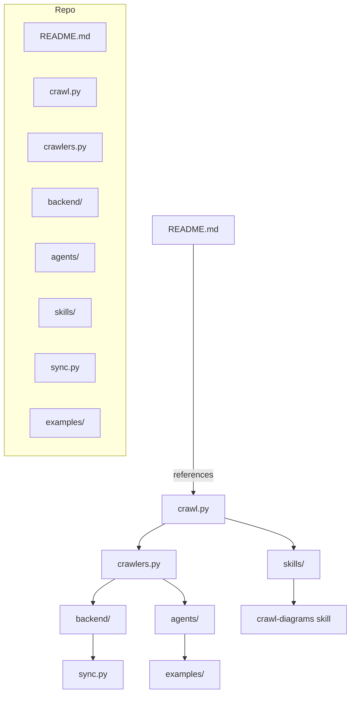
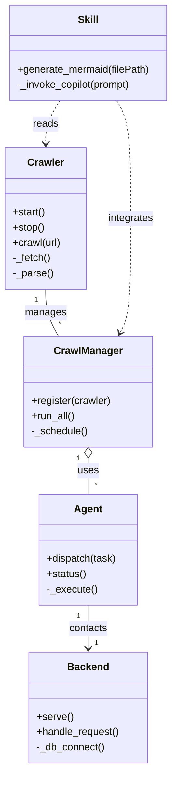

# Diagram: common/notification_service/config/config.prod-b.yml

> Auto-generated by Obscura crawlers

## Diagram 1

### SVG

<svg id="container" width="654.74609375" xmlns="http://www.w3.org/2000/svg" class="flowchart" height="1308" viewBox="0 0 654.74609375 1308" role="graphics-document document" aria-roledescription="flowchart-v2"><g><marker id="container_flowchart-v2-pointEnd" class="marker flowchart-v2" viewBox="0 0 10 10" refX="5" refY="5" markerUnits="userSpaceOnUse" markerWidth="8" markerHeight="8" orient="auto"><path d="M 0 0 L 10 5 L 0 10 z" class="arrowMarkerPath" style="stroke-width: 1; stroke-dasharray: 1, 0;"></path></marker><marker id="container_flowchart-v2-pointStart" class="marker flowchart-v2" viewBox="0 0 10 10" refX="4.5" refY="5" markerUnits="userSpaceOnUse" markerWidth="8" markerHeight="8" orient="auto"><path d="M 0 5 L 10 10 L 10 0 z" class="arrowMarkerPath" style="stroke-width: 1; stroke-dasharray: 1, 0;"></path></marker><marker id="container_flowchart-v2-circleEnd" class="marker flowchart-v2" viewBox="0 0 10 10" refX="11" refY="5" markerUnits="userSpaceOnUse" markerWidth="11" markerHeight="11" orient="auto"><circle cx="5" cy="5" r="5" class="arrowMarkerPath" style="stroke-width: 1; stroke-dasharray: 1, 0;"></circle></marker><marker id="container_flowchart-v2-circleStart" class="marker flowchart-v2" viewBox="0 0 10 10" refX="-1" refY="5" markerUnits="userSpaceOnUse" markerWidth="11" markerHeight="11" orient="auto"><circle cx="5" cy="5" r="5" class="arrowMarkerPath" style="stroke-width: 1; stroke-dasharray: 1, 0;"></circle></marker><marker id="container_flowchart-v2-crossEnd" class="marker cross flowchart-v2" viewBox="0 0 11 11" refX="12" refY="5.2" markerUnits="userSpaceOnUse" markerWidth="11" markerHeight="11" orient="auto"><path d="M 1,1 l 9,9 M 10,1 l -9,9" class="arrowMarkerPath" style="stroke-width: 2; stroke-dasharray: 1, 0;"></path></marker><marker id="container_flowchart-v2-crossStart" class="marker cross flowchart-v2" viewBox="0 0 11 11" refX="-1" refY="5.2" markerUnits="userSpaceOnUse" markerWidth="11" markerHeight="11" orient="auto"><path d="M 1,1 l 9,9 M 10,1 l -9,9" class="arrowMarkerPath" style="stroke-width: 2; stroke-dasharray: 1, 0;"></path></marker><g class="root"><g class="clusters"></g><g class="edgePaths"><path d="M351.602,461L351.602,533.667C351.602,606.333,351.602,751.667,351.602,829.833C351.602,908,351.602,919,351.602,924.5L351.602,930" id="L_A_B_0" class="edge-thickness-normal edge-pattern-solid edge-thickness-normal edge-pattern-solid flowchart-link" style=";" data-edge="true" data-et="edge" data-id="L_A_B_0" data-points="W3sieCI6MzUxLjYwMTU2MjUsInkiOjQ2MX0seyJ4IjozNTEuNjAxNTYyNSwieSI6ODk3fSx7IngiOjM1MS42MDE1NjI1LCJ5Ijo5MzR9XQ==" marker-end="url(#container_flowchart-v2-pointEnd)"></path><path d="M296.971,988L288.54,992.167C280.109,996.333,263.248,1004.667,254.817,1012.333C246.387,1020,246.387,1027,246.387,1030.5L246.387,1034" id="L_B_C_0" class="edge-thickness-normal edge-pattern-solid edge-thickness-normal edge-pattern-solid flowchart-link" style=";" data-edge="true" data-et="edge" data-id="L_B_C_0" data-points="W3sieCI6Mjk2Ljk3MDc3ODI0NTE5MjMsInkiOjk4OH0seyJ4IjoyNDYuMzg2NzE4NzUsInkiOjEwMTN9LHsieCI6MjQ2LjM4NjcxODc1LCJ5IjoxMDM4fV0=" marker-end="url(#container_flowchart-v2-pointEnd)"></path><path d="M200.881,1092L193.859,1096.167C186.836,1100.333,172.791,1108.667,165.769,1116.333C158.746,1124,158.746,1131,158.746,1134.5L158.746,1138" id="L_C_D_0" class="edge-thickness-normal edge-pattern-solid edge-thickness-normal edge-pattern-solid flowchart-link" style=";" data-edge="true" data-et="edge" data-id="L_C_D_0" data-points="W3sieCI6MjAwLjg4MTAwOTYxNTM4NDYsInkiOjEwOTJ9LHsieCI6MTU4Ljc0NjA5Mzc1LCJ5IjoxMTE3fSx7IngiOjE1OC43NDYwOTM3NSwieSI6MTE0Mn1d" marker-end="url(#container_flowchart-v2-pointEnd)"></path><path d="M291.892,1092L298.915,1096.167C305.937,1100.333,319.982,1108.667,327.005,1116.333C334.027,1124,334.027,1131,334.027,1134.5L334.027,1138" id="L_C_E_0" class="edge-thickness-normal edge-pattern-solid edge-thickness-normal edge-pattern-solid flowchart-link" style=";" data-edge="true" data-et="edge" data-id="L_C_E_0" data-points="W3sieCI6MjkxLjg5MjQyNzg4NDYxNTM2LCJ5IjoxMDkyfSx7IngiOjMzNC4wMjczNDM3NSwieSI6MTExN30seyJ4IjozMzQuMDI3MzQzNzUsInkiOjExNDJ9XQ==" marker-end="url(#container_flowchart-v2-pointEnd)"></path><path d="M411.234,977.079L433.438,983.066C455.642,989.053,500.049,1001.026,522.253,1010.513C544.457,1020,544.457,1027,544.457,1030.5L544.457,1034" id="L_B_F_0" class="edge-thickness-normal edge-pattern-solid edge-thickness-normal edge-pattern-solid flowchart-link" style=";" data-edge="true" data-et="edge" data-id="L_B_F_0" data-points="W3sieCI6NDExLjIzNDM3NSwieSI6OTc3LjA3ODkxMjcyMjA0MzR9LHsieCI6NTQ0LjQ1NzAzMTI1LCJ5IjoxMDEzfSx7IngiOjU0NC40NTcwMzEyNSwieSI6MTAzOH1d" marker-end="url(#container_flowchart-v2-pointEnd)"></path><path d="M158.746,1196L158.746,1200.167C158.746,1204.333,158.746,1212.667,158.746,1220.333C158.746,1228,158.746,1235,158.746,1238.5L158.746,1242" id="L_D_G_0" class="edge-thickness-normal edge-pattern-solid edge-thickness-normal edge-pattern-solid flowchart-link" style=";" data-edge="true" data-et="edge" data-id="L_D_G_0" data-points="W3sieCI6MTU4Ljc0NjA5Mzc1LCJ5IjoxMTk2fSx7IngiOjE1OC43NDYwOTM3NSwieSI6MTIyMX0seyJ4IjoxNTguNzQ2MDkzNzUsInkiOjEyNDZ9XQ==" marker-end="url(#container_flowchart-v2-pointEnd)"></path><path d="M544.457,1092L544.457,1096.167C544.457,1100.333,544.457,1108.667,544.457,1116.333C544.457,1124,544.457,1131,544.457,1134.5L544.457,1138" id="L_F_H_0" class="edge-thickness-normal edge-pattern-solid edge-thickness-normal edge-pattern-solid flowchart-link" style=";" data-edge="true" data-et="edge" data-id="L_F_H_0" data-points="W3sieCI6NTQ0LjQ1NzAzMTI1LCJ5IjoxMDkyfSx7IngiOjU0NC40NTcwMzEyNSwieSI6MTExN30seyJ4Ijo1NDQuNDU3MDMxMjUsInkiOjExNDJ9XQ==" marker-end="url(#container_flowchart-v2-pointEnd)"></path><path d="M334.027,1196L334.027,1200.167C334.027,1204.333,334.027,1212.667,334.027,1220.333C334.027,1228,334.027,1235,334.027,1238.5L334.027,1242" id="L_E_I_0" class="edge-thickness-normal edge-pattern-solid edge-thickness-normal edge-pattern-solid flowchart-link" style=";" data-edge="true" data-et="edge" data-id="L_E_I_0" data-points="W3sieCI6MzM0LjAyNzM0Mzc1LCJ5IjoxMTk2fSx7IngiOjMzNC4wMjczNDM3NSwieSI6MTIyMX0seyJ4IjozMzQuMDI3MzQzNzUsInkiOjEyNDZ9XQ==" marker-end="url(#container_flowchart-v2-pointEnd)"></path></g><g class="edgeLabels"><g class="edgeLabel" transform="translate(351.6015625, 897)"><g class="label" data-id="L_A_B_0" transform="translate(-37.828125, -12)"><foreignObject width="75.65625" height="24">

references

</foreignObject></g></g><g class="edgeLabel"><g class="label" data-id="L_B_C_0" transform="translate(0, 0)"><foreignObject width="0" height="0">

</foreignObject></g></g><g class="edgeLabel"><g class="label" data-id="L_C_D_0" transform="translate(0, 0)"><foreignObject width="0" height="0">

</foreignObject></g></g><g class="edgeLabel"><g class="label" data-id="L_C_E_0" transform="translate(0, 0)"><foreignObject width="0" height="0">

</foreignObject></g></g><g class="edgeLabel"><g class="label" data-id="L_B_F_0" transform="translate(0, 0)"><foreignObject width="0" height="0">

</foreignObject></g></g><g class="edgeLabel"><g class="label" data-id="L_D_G_0" transform="translate(0, 0)"><foreignObject width="0" height="0">

</foreignObject></g></g><g class="edgeLabel"><g class="label" data-id="L_F_H_0" transform="translate(0, 0)"><foreignObject width="0" height="0">

</foreignObject></g></g><g class="edgeLabel"><g class="label" data-id="L_E_I_0" transform="translate(0, 0)"><foreignObject width="0" height="0">

</foreignObject></g></g></g><g class="nodes"><g class="root" transform="translate(0, 0)"><g class="clusters"><g class="cluster" id="Repo" data-look="classic"><rect style="" x="8" y="8" width="220.734375" height="852"></rect><g class="cluster-label" transform="translate(99.859375, 8)"><foreignObject width="37.015625" height="24">

Repo

</foreignObject></g></g></g><g class="edgePaths"></g><g class="edgeLabels"></g><g class="nodes"><g class="node default" id="flowchart-README.md-16" transform="translate(118.3671875, 70)"><rect class="basic label-container" style="" x="-72.8671875" y="-27" width="145.734375" height="54"></rect><g class="label" style="" transform="translate(-42.8671875, -12)"><rect></rect><foreignObject width="85.734375" height="24">

README.md

</foreignObject></g></g><g class="node default" id="flowchart-crawl.py-17" transform="translate(118.3671875, 174)"><rect class="basic label-container" style="" x="-59.6328125" y="-27" width="119.265625" height="54"></rect><g class="label" style="" transform="translate(-29.6328125, -12)"><rect></rect><foreignObject width="59.265625" height="24">

crawl.py

</foreignObject></g></g><g class="node default" id="flowchart-crawlers.py-18" transform="translate(118.3671875, 278)"><rect class="basic label-container" style="" x="-70.625" y="-27" width="141.25" height="54"></rect><g class="label" style="" transform="translate(-40.625, -12)"><rect></rect><foreignObject width="81.25" height="24">

crawlers.py

</foreignObject></g></g><g class="node default" id="flowchart-backend/-19" transform="translate(118.3671875, 382)"><rect class="basic label-container" style="" x="-64.8671875" y="-27" width="129.734375" height="54"></rect><g class="label" style="" transform="translate(-34.8671875, -12)"><rect></rect><foreignObject width="69.734375" height="24">

backend/

</foreignObject></g></g><g class="node default" id="flowchart-agents/-20" transform="translate(118.3671875, 486)"><rect class="basic label-container" style="" x="-58.140625" y="-27" width="116.28125" height="54"></rect><g class="label" style="" transform="translate(-28.140625, -12)"><rect></rect><foreignObject width="56.28125" height="24">

agents/

</foreignObject></g></g><g class="node default" id="flowchart-skills/-21" transform="translate(118.3671875, 590)"><rect class="basic label-container" style="" x="-52.6796875" y="-27" width="105.359375" height="54"></rect><g class="label" style="" transform="translate(-22.6796875, -12)"><rect></rect><foreignObject width="45.359375" height="24">

skills/

</foreignObject></g></g><g class="node default" id="flowchart-sync.py-22" transform="translate(118.3671875, 694)"><rect class="basic label-container" style="" x="-56.7109375" y="-27" width="113.421875" height="54"></rect><g class="label" style="" transform="translate(-26.7109375, -12)"><rect></rect><foreignObject width="53.421875" height="24">

sync.py

</foreignObject></g></g><g class="node default" id="flowchart-examples/-23" transform="translate(118.3671875, 798)"><rect class="basic label-container" style="" x="-68.5703125" y="-27" width="137.140625" height="54"></rect><g class="label" style="" transform="translate(-38.5703125, -12)"><rect></rect><foreignObject width="77.140625" height="24">

examples/

</foreignObject></g></g></g></g><g class="node default" id="flowchart-A-0" transform="translate(351.6015625, 434)"><rect class="basic label-container" style="" x="-72.8671875" y="-27" width="145.734375" height="54"></rect><g class="label" style="" transform="translate(-42.8671875, -12)"><rect></rect><foreignObject width="85.734375" height="24">

README.md

</foreignObject></g></g><g class="node default" id="flowchart-B-1" transform="translate(351.6015625, 961)"><rect class="basic label-container" style="" x="-59.6328125" y="-27" width="119.265625" height="54"></rect><g class="label" style="" transform="translate(-29.6328125, -12)"><rect></rect><foreignObject width="59.265625" height="24">

crawl.py

</foreignObject></g></g><g class="node default" id="flowchart-C-3" transform="translate(246.38671875, 1065)"><rect class="basic label-container" style="" x="-70.625" y="-27" width="141.25" height="54"></rect><g class="label" style="" transform="translate(-40.625, -12)"><rect></rect><foreignObject width="81.25" height="24">

crawlers.py

</foreignObject></g></g><g class="node default" id="flowchart-D-5" transform="translate(158.74609375, 1169)"><rect class="basic label-container" style="" x="-64.8671875" y="-27" width="129.734375" height="54"></rect><g class="label" style="" transform="translate(-34.8671875, -12)"><rect></rect><foreignObject width="69.734375" height="24">

backend/

</foreignObject></g></g><g class="node default" id="flowchart-E-7" transform="translate(334.02734375, 1169)"><rect class="basic label-container" style="" x="-58.140625" y="-27" width="116.28125" height="54"></rect><g class="label" style="" transform="translate(-28.140625, -12)"><rect></rect><foreignObject width="56.28125" height="24">

agents/

</foreignObject></g></g><g class="node default" id="flowchart-F-9" transform="translate(544.45703125, 1065)"><rect class="basic label-container" style="" x="-52.6796875" y="-27" width="105.359375" height="54"></rect><g class="label" style="" transform="translate(-22.6796875, -12)"><rect></rect><foreignObject width="45.359375" height="24">

skills/

</foreignObject></g></g><g class="node default" id="flowchart-G-11" transform="translate(158.74609375, 1273)"><rect class="basic label-container" style="" x="-56.7109375" y="-27" width="113.421875" height="54"></rect><g class="label" style="" transform="translate(-26.7109375, -12)"><rect></rect><foreignObject width="53.421875" height="24">

sync.py

</foreignObject></g></g><g class="node default" id="flowchart-H-13" transform="translate(544.45703125, 1169)"><rect class="basic label-container" style="" x="-102.2890625" y="-27" width="204.578125" height="54"></rect><g class="label" style="" transform="translate(-72.2890625, -12)"><rect></rect><foreignObject width="144.578125" height="24">

crawl-diagrams skill

</foreignObject></g></g><g class="node default" id="flowchart-I-15" transform="translate(334.02734375, 1273)"><rect class="basic label-container" style="" x="-68.5703125" y="-27" width="137.140625" height="54"></rect><g class="label" style="" transform="translate(-38.5703125, -12)"><rect></rect><foreignObject width="77.140625" height="24">

examples/

</foreignObject></g></g></g></g></g></svg>

## Diagram 2

### SVG

<svg id="container" width="272.7265625" xmlns="http://www.w3.org/2000/svg" class="classDiagram" height="1206" viewBox="0 0 272.7265625 1206" role="graphics-document document" aria-roledescription="class"><g><defs><marker id="container_class-aggregationStart" class="marker aggregation class" refX="18" refY="7" markerWidth="190" markerHeight="240" orient="auto"><path d="M 18,7 L9,13 L1,7 L9,1 Z"></path></marker></defs><defs><marker id="container_class-aggregationEnd" class="marker aggregation class" refX="1" refY="7" markerWidth="20" markerHeight="28" orient="auto"><path d="M 18,7 L9,13 L1,7 L9,1 Z"></path></marker></defs><defs><marker id="container_class-extensionStart" class="marker extension class" refX="18" refY="7" markerWidth="190" markerHeight="240" orient="auto"><path d="M 1,7 L18,13 V 1 Z"></path></marker></defs><defs><marker id="container_class-extensionEnd" class="marker extension class" refX="1" refY="7" markerWidth="20" markerHeight="28" orient="auto"><path d="M 1,1 V 13 L18,7 Z"></path></marker></defs><defs><marker id="container_class-compositionStart" class="marker composition class" refX="18" refY="7" markerWidth="190" markerHeight="240" orient="auto"><path d="M 18,7 L9,13 L1,7 L9,1 Z"></path></marker></defs><defs><marker id="container_class-compositionEnd" class="marker composition class" refX="1" refY="7" markerWidth="20" markerHeight="28" orient="auto"><path d="M 18,7 L9,13 L1,7 L9,1 Z"></path></marker></defs><defs><marker id="container_class-dependencyStart" class="marker dependency class" refX="6" refY="7" markerWidth="190" markerHeight="240" orient="auto"><path d="M 5,7 L9,13 L1,7 L9,1 Z"></path></marker></defs><defs><marker id="container_class-dependencyEnd" class="marker dependency class" refX="13" refY="7" markerWidth="20" markerHeight="28" orient="auto"><path d="M 18,7 L9,13 L14,7 L9,1 Z"></path></marker></defs><defs><marker id="container_class-lollipopStart" class="marker lollipop class" refX="13" refY="7" markerWidth="190" markerHeight="240" orient="auto"><circle stroke="black" fill="transparent" cx="7" cy="7" r="6"></circle></marker></defs><defs><marker id="container_class-lollipopEnd" class="marker lollipop class" refX="1" refY="7" markerWidth="190" markerHeight="240" orient="auto"><circle stroke="black" fill="transparent" cx="7" cy="7" r="6"></circle></marker></defs><g class="root"><g class="clusters"></g><g class="edgePaths"><path d="M72.156,454L72.156,460.167C72.156,466.333,72.156,478.667,75.523,491C78.891,503.333,85.625,515.667,88.992,521.833L92.359,528" id="id_Crawler_CrawlManager_1" class="edge-thickness-normal edge-pattern-solid relation" style=";;;" data-edge="true" data-et="edge" data-id="id_Crawler_CrawlManager_1" data-points="W3sieCI6NzIuMTU2MjUsInkiOjQ1NH0seyJ4Ijo3Mi4xNTYyNSwieSI6NDkxfSx7IngiOjkyLjM1OTE1NDQ4NTg4NzEsInkiOjUyOH1d"></path><path d="M139.863,719.25L139.863,722.542C139.863,725.833,139.863,732.417,139.863,741.875C139.863,751.333,139.863,763.667,139.863,769.833L139.863,776" id="id_CrawlManager_Agent_2" class="edge-thickness-normal edge-pattern-solid relation" style=";;;" data-edge="true" data-et="edge" data-id="id_CrawlManager_Agent_2" data-points="W3sieCI6MTM5Ljg2MzI4MTI1LCJ5Ijo3MDJ9LHsieCI6MTM5Ljg2MzI4MTI1LCJ5Ijo3Mzl9LHsieCI6MTM5Ljg2MzI4MTI1LCJ5Ijo3NzZ9XQ==" marker-start="url(#container_class-aggregationStart)"></path><path d="M139.863,950L139.863,956.167C139.863,962.333,139.863,974.667,139.863,986C139.863,997.333,139.863,1007.667,139.863,1012.833L139.863,1018" id="id_Agent_Backend_3" class="edge-thickness-normal edge-pattern-solid relation" style=";;;" data-edge="true" data-et="edge" data-id="id_Agent_Backend_3" data-points="W3sieCI6MTM5Ljg2MzI4MTI1LCJ5Ijo5NTB9LHsieCI6MTM5Ljg2MzI4MTI1LCJ5Ijo5ODd9LHsieCI6MTM5Ljg2MzI4MTI1LCJ5IjoxMDI0fV0=" marker-end="url(#container_class-dependencyEnd)"></path><path d="M94.524,158L90.796,164.167C87.068,170.333,79.612,182.667,75.884,194C72.156,205.333,72.156,215.667,72.156,220.833L72.156,226" id="id_Skill_Crawler_4" class="edge-thickness-normal edge-pattern-dashed relation" style=";;;" data-edge="true" data-et="edge" data-id="id_Skill_Crawler_4" data-points="W3sieCI6OTQuNTIzNzUxMzk1MDg5MjgsInkiOjE1OH0seyJ4Ijo3Mi4xNTYyNSwieSI6MTk1fSx7IngiOjcyLjE1NjI1LCJ5IjoyMzJ9XQ==" marker-end="url(#container_class-dependencyEnd)"></path><path d="M185.203,158L188.931,164.167C192.659,170.333,200.114,182.667,203.842,213.5C207.57,244.333,207.57,293.667,207.57,343C207.57,392.333,207.57,441.667,204.682,471.622C201.794,501.578,196.019,512.156,193.131,517.445L190.243,522.734" id="id_Skill_CrawlManager_5" class="edge-thickness-normal edge-pattern-dashed relation" style=";;;" data-edge="true" data-et="edge" data-id="id_Skill_CrawlManager_5" data-points="W3sieCI6MTg1LjIwMjgxMTEwNDkxMDcyLCJ5IjoxNTh9LHsieCI6MjA3LjU3MDMxMjUsInkiOjE5NX0seyJ4IjoyMDcuNTcwMzEyNSwieSI6MzQzfSx7IngiOjIwNy41NzAzMTI1LCJ5Ijo0OTF9LHsieCI6MTg3LjM2NzQwODAxNDExMjksInkiOjUyOH1d" marker-end="url(#container_class-dependencyEnd)"></path></g><g class="edgeLabels"><g class="edgeLabel" transform="translate(72.15625, 491)"><g class="label" data-id="id_Crawler_CrawlManager_1" transform="translate(-32.296875, -12)"><foreignObject width="64.59375" height="24">

manages

</foreignObject></g></g><g class="edgeLabel" transform="translate(139.86328125, 739)"><g class="label" data-id="id_CrawlManager_Agent_2" transform="translate(-16.4921875, -12)"><foreignObject width="32.984375" height="24">

uses

</foreignObject></g></g><g class="edgeLabel" transform="translate(139.86328125, 987)"><g class="label" data-id="id_Agent_Backend_3" transform="translate(-30.65625, -12)"><foreignObject width="61.3125" height="24">

contacts

</foreignObject></g></g><g class="edgeLabel" transform="translate(72.15625, 195)"><g class="label" data-id="id_Skill_Crawler_4" transform="translate(-20.0078125, -12)"><foreignObject width="40.015625" height="24">

reads

</foreignObject></g></g><g class="edgeLabel" transform="translate(207.5703125, 343)"><g class="label" data-id="id_Skill_CrawlManager_5" transform="translate(-36.2578125, -12)"><foreignObject width="72.515625" height="24">

integrates

</foreignObject></g></g><g class="edgeTerminals" transform="translate(57.15625, 471.5)"><g class="inner" transform="translate(0, 0)"><foreignObject style="width: 9px; height: 12px;">
1
</foreignObject></g></g><g class="edgeTerminals" transform="translate(124.86328062500003, 719.4999994642857)"><g class="inner" transform="translate(0, 0)"><foreignObject style="width: 9px; height: 12px;">
1
</foreignObject></g></g><g class="edgeTerminals" transform="translate(124.86328062500003, 967.4999994642857)"><g class="inner" transform="translate(0, 0)"><foreignObject style="width: 9px; height: 12px;">
1
</foreignObject></g></g><g class="edgeTerminals" transform="translate(92.1377754009626, 500.45194609460225)"><g class="inner" transform="translate(0, 0)"></g><foreignObject style="width: 9px; height: 12px;">
*
</foreignObject></g><g class="edgeTerminals" transform="translate(149.86328062500002, 753.4999994642857)"><g class="inner" transform="translate(0, 0)"></g><foreignObject style="width: 9px; height: 12px;">
*
</foreignObject></g><g class="edgeTerminals" transform="translate(149.86328062500002, 1001.4999994642857)"><g class="inner" transform="translate(0, 0)"></g><foreignObject style="width: 9px; height: 12px;">
1
</foreignObject></g></g><g class="nodes"><g class="node default" id="classId-Crawler-0" transform="translate(72.15625, 343)"><g class="basic label-container"><path d="M-64.15625 -111 L64.15625 -111 L64.15625 111 L-64.15625 111" stroke="none" stroke-width="0" fill="#ECECFF" style=""></path><path d="M-64.15625 -111 C-35.42712681351068 -111, -6.698003627021357 -111, 64.15625 -111 M-64.15625 -111 C-23.166114208482938 -111, 17.824021583034124 -111, 64.15625 -111 M64.15625 -111 C64.15625 -59.249291418125694, 64.15625 -7.498582836251387, 64.15625 111 M64.15625 -111 C64.15625 -25.309259682418755, 64.15625 60.38148063516249, 64.15625 111 M64.15625 111 C38.43425196720517 111, 12.712253934410342 111, -64.15625 111 M64.15625 111 C17.697085049419172 111, -28.762079901161655 111, -64.15625 111 M-64.15625 111 C-64.15625 59.28273751813501, -64.15625 7.565475036270016, -64.15625 -111 M-64.15625 111 C-64.15625 50.60869195323633, -64.15625 -9.782616093527338, -64.15625 -111" stroke="#9370DB" stroke-width="1.3" fill="none" stroke-dasharray="0 0" style=""></path></g><g class="annotation-group text" transform="translate(0, -87)"></g><g class="label-group text" transform="translate(-27.734375, -87)"><g class="label" style="font-weight: bolder" transform="translate(0,-12)"><foreignObject width="55.46875" height="24">

Crawler

</foreignObject></g></g><g class="members-group text" transform="translate(-52.15625, -39)"></g><g class="methods-group text" transform="translate(-52.15625, -9)"><g class="label" style="" transform="translate(0,-12)"><foreignObject width="52.15625" height="24">

+start()

</foreignObject></g><g class="label" style="" transform="translate(0,12)"><foreignObject width="50.21875" height="24">

+stop()

</foreignObject></g><g class="label" style="" transform="translate(0,36)"><foreignObject width="76.578125" height="24">

+crawl(url)

</foreignObject></g><g class="label" style="" transform="translate(0,60)"><foreignObject width="60.03125" height="24">

-_fetch()

</foreignObject></g><g class="label" style="" transform="translate(0,84)"><foreignObject width="64.046875" height="24">

-_parse()

</foreignObject></g></g><g class="divider" style=""><path d="M-64.15625 -63 C-34.40158517515429 -63, -4.6469203503085765 -63, 64.15625 -63 M-64.15625 -63 C-18.60089912569618 -63, 26.95445174860764 -63, 64.15625 -63" stroke="#9370DB" stroke-width="1.3" fill="none" stroke-dasharray="0 0" style=""></path></g><g class="divider" style=""><path d="M-64.15625 -39 C-17.706939772952623 -39, 28.742370454094754 -39, 64.15625 -39 M-64.15625 -39 C-16.228066532294818 -39, 31.700116935410364 -39, 64.15625 -39" stroke="#9370DB" stroke-width="1.3" fill="none" stroke-dasharray="0 0" style=""></path></g></g><g class="node default" id="classId-CrawlManager-1" transform="translate(139.86328125, 615)"><g class="basic label-container"><path d="M-100.984375 -87 L100.984375 -87 L100.984375 87 L-100.984375 87" stroke="none" stroke-width="0" fill="#ECECFF" style=""></path><path d="M-100.984375 -87 C-25.529527040924407 -87, 49.925320918151186 -87, 100.984375 -87 M-100.984375 -87 C-24.46562248750361 -87, 52.05313002499278 -87, 100.984375 -87 M100.984375 -87 C100.984375 -41.95723550471334, 100.984375 3.085528990573323, 100.984375 87 M100.984375 -87 C100.984375 -43.10138287660445, 100.984375 0.7972342467911062, 100.984375 87 M100.984375 87 C47.20691834549469 87, -6.570538309010615 87, -100.984375 87 M100.984375 87 C45.009718053649706 87, -10.964938892700587 87, -100.984375 87 M-100.984375 87 C-100.984375 21.51747993428212, -100.984375 -43.96504013143576, -100.984375 -87 M-100.984375 87 C-100.984375 31.348826231591552, -100.984375 -24.302347536816896, -100.984375 -87" stroke="#9370DB" stroke-width="1.3" fill="none" stroke-dasharray="0 0" style=""></path></g><g class="annotation-group text" transform="translate(0, -63)"></g><g class="label-group text" transform="translate(-51.59375, -63)"><g class="label" style="font-weight: bolder" transform="translate(0,-12)"><foreignObject width="103.1875" height="24">

CrawlManager

</foreignObject></g></g><g class="members-group text" transform="translate(-88.984375, -15)"></g><g class="methods-group text" transform="translate(-88.984375, 15)"><g class="label" style="" transform="translate(0,-12)"><foreignObject width="126.375" height="24">

+register(crawler)

</foreignObject></g><g class="label" style="" transform="translate(0,12)"><foreignObject width="69.140625" height="24">

+run_all()

</foreignObject></g><g class="label" style="" transform="translate(0,36)"><foreignObject width="89.28125" height="24">

-_schedule()

</foreignObject></g></g><g class="divider" style=""><path d="M-100.984375 -39 C-47.07650903010262 -39, 6.831356939794759 -39, 100.984375 -39 M-100.984375 -39 C-20.9609989699276 -39, 59.0623770601448 -39, 100.984375 -39" stroke="#9370DB" stroke-width="1.3" fill="none" stroke-dasharray="0 0" style=""></path></g><g class="divider" style=""><path d="M-100.984375 -15 C-59.542192091109605 -15, -18.10000918221921 -15, 100.984375 -15 M-100.984375 -15 C-47.046594512462796 -15, 6.891185975074407 -15, 100.984375 -15" stroke="#9370DB" stroke-width="1.3" fill="none" stroke-dasharray="0 0" style=""></path></g></g><g class="node default" id="classId-Agent-2" transform="translate(139.86328125, 863)"><g class="basic label-container"><path d="M-77.734375 -87 L77.734375 -87 L77.734375 87 L-77.734375 87" stroke="none" stroke-width="0" fill="#ECECFF" style=""></path><path d="M-77.734375 -87 C-21.983236419108287 -87, 33.767902161783425 -87, 77.734375 -87 M-77.734375 -87 C-17.742550648791116 -87, 42.24927370241777 -87, 77.734375 -87 M77.734375 -87 C77.734375 -17.61409965293379, 77.734375 51.77180069413242, 77.734375 87 M77.734375 -87 C77.734375 -28.461559719243198, 77.734375 30.076880561513605, 77.734375 87 M77.734375 87 C22.557180331318968 87, -32.620014337362065 87, -77.734375 87 M77.734375 87 C45.136161257057516 87, 12.537947514115032 87, -77.734375 87 M-77.734375 87 C-77.734375 21.286160895342817, -77.734375 -44.427678209314365, -77.734375 -87 M-77.734375 87 C-77.734375 33.26532186274909, -77.734375 -20.46935627450182, -77.734375 -87" stroke="#9370DB" stroke-width="1.3" fill="none" stroke-dasharray="0 0" style=""></path></g><g class="annotation-group text" transform="translate(0, -63)"></g><g class="label-group text" transform="translate(-21.078125, -63)"><g class="label" style="font-weight: bolder" transform="translate(0,-12)"><foreignObject width="42.15625" height="24">

Agent

</foreignObject></g></g><g class="members-group text" transform="translate(-65.734375, -15)"></g><g class="methods-group text" transform="translate(-65.734375, 15)"><g class="label" style="" transform="translate(0,-12)"><foreignObject width="110.390625" height="24">

+dispatch(task)

</foreignObject></g><g class="label" style="" transform="translate(0,12)"><foreignObject width="62.765625" height="24">

+status()

</foreignObject></g><g class="label" style="" transform="translate(0,36)"><foreignObject width="79.515625" height="24">

-_execute()

</foreignObject></g></g><g class="divider" style=""><path d="M-77.734375 -39 C-40.46394475312127 -39, -3.1935145062425363 -39, 77.734375 -39 M-77.734375 -39 C-32.36228084174334 -39, 13.009813316513316 -39, 77.734375 -39" stroke="#9370DB" stroke-width="1.3" fill="none" stroke-dasharray="0 0" style=""></path></g><g class="divider" style=""><path d="M-77.734375 -15 C-31.334149200814366 -15, 15.066076598371268 -15, 77.734375 -15 M-77.734375 -15 C-45.331115350592086 -15, -12.927855701184171 -15, 77.734375 -15" stroke="#9370DB" stroke-width="1.3" fill="none" stroke-dasharray="0 0" style=""></path></g></g><g class="node default" id="classId-Backend-3" transform="translate(139.86328125, 1111)"><g class="basic label-container"><path d="M-93.6328125 -87 L93.6328125 -87 L93.6328125 87 L-93.6328125 87" stroke="none" stroke-width="0" fill="#ECECFF" style=""></path><path d="M-93.6328125 -87 C-43.253203479870926 -87, 7.126405540258148 -87, 93.6328125 -87 M-93.6328125 -87 C-54.52168452229606 -87, -15.410556544592126 -87, 93.6328125 -87 M93.6328125 -87 C93.6328125 -20.981331706063926, 93.6328125 45.03733658787215, 93.6328125 87 M93.6328125 -87 C93.6328125 -43.76341802935903, 93.6328125 -0.5268360587180609, 93.6328125 87 M93.6328125 87 C25.237150023658742 87, -43.158512452682515 87, -93.6328125 87 M93.6328125 87 C27.495180493937696 87, -38.64245151212461 87, -93.6328125 87 M-93.6328125 87 C-93.6328125 34.07172378946858, -93.6328125 -18.856552421062844, -93.6328125 -87 M-93.6328125 87 C-93.6328125 22.05767796119909, -93.6328125 -42.88464407760182, -93.6328125 -87" stroke="#9370DB" stroke-width="1.3" fill="none" stroke-dasharray="0 0" style=""></path></g><g class="annotation-group text" transform="translate(0, -63)"></g><g class="label-group text" transform="translate(-31.296875, -63)"><g class="label" style="font-weight: bolder" transform="translate(0,-12)"><foreignObject width="62.59375" height="24">

Backend

</foreignObject></g></g><g class="members-group text" transform="translate(-81.6328125, -15)"></g><g class="methods-group text" transform="translate(-81.6328125, 15)"><g class="label" style="" transform="translate(0,-12)"><foreignObject width="57.25" height="24">

+serve()

</foreignObject></g><g class="label" style="" transform="translate(0,12)"><foreignObject width="131.96875" height="24">

+handle_request()

</foreignObject></g><g class="label" style="" transform="translate(0,36)"><foreignObject width="107.859375" height="24">

-_db_connect()

</foreignObject></g></g><g class="divider" style=""><path d="M-93.6328125 -39 C-31.243224183739805 -39, 31.14636413252039 -39, 93.6328125 -39 M-93.6328125 -39 C-23.907735614086974 -39, 45.81734127182605 -39, 93.6328125 -39" stroke="#9370DB" stroke-width="1.3" fill="none" stroke-dasharray="0 0" style=""></path></g><g class="divider" style=""><path d="M-93.6328125 -15 C-49.42242419245483 -15, -5.212035884909653 -15, 93.6328125 -15 M-93.6328125 -15 C-33.908812079524715 -15, 25.81518834095057 -15, 93.6328125 -15" stroke="#9370DB" stroke-width="1.3" fill="none" stroke-dasharray="0 0" style=""></path></g></g><g class="node default" id="classId-Skill-4" transform="translate(139.86328125, 83)"><g class="basic label-container"><path d="M-124.86328125 -75 L124.86328125 -75 L124.86328125 75 L-124.86328125 75" stroke="none" stroke-width="0" fill="#ECECFF" style=""></path><path d="M-124.86328125 -75 C-71.33175941813613 -75, -17.80023758627226 -75, 124.86328125 -75 M-124.86328125 -75 C-66.89634275557222 -75, -8.929404261144455 -75, 124.86328125 -75 M124.86328125 -75 C124.86328125 -37.88191793955768, 124.86328125 -0.7638358791153621, 124.86328125 75 M124.86328125 -75 C124.86328125 -26.34739462586235, 124.86328125 22.3052107482753, 124.86328125 75 M124.86328125 75 C26.984479325259016 75, -70.89432259948197 75, -124.86328125 75 M124.86328125 75 C31.21419070083566 75, -62.43489984832868 75, -124.86328125 75 M-124.86328125 75 C-124.86328125 40.59538882224873, -124.86328125 6.190777644497459, -124.86328125 -75 M-124.86328125 75 C-124.86328125 18.795192950200246, -124.86328125 -37.40961409959951, -124.86328125 -75" stroke="#9370DB" stroke-width="1.3" fill="none" stroke-dasharray="0 0" style=""></path></g><g class="annotation-group text" transform="translate(0, -51)"></g><g class="label-group text" transform="translate(-16.0078125, -51)"><g class="label" style="font-weight: bolder" transform="translate(0,-12)"><foreignObject width="32.015625" height="24">

Skill

</foreignObject></g></g><g class="members-group text" transform="translate(-112.86328125, -3)"></g><g class="methods-group text" transform="translate(-112.86328125, 27)"><g class="label" style="" transform="translate(0,-12)"><foreignObject width="209.71875" height="24">

+generate_mermaid(filePath)

</foreignObject></g><g class="label" style="" transform="translate(0,12)"><foreignObject width="183.1875" height="24">

-_invoke_copilot(prompt)

</foreignObject></g></g><g class="divider" style=""><path d="M-124.86328125 -27 C-36.10327248804158 -27, 52.656736273916835 -27, 124.86328125 -27 M-124.86328125 -27 C-41.627105430577075 -27, 41.60907038884585 -27, 124.86328125 -27" stroke="#9370DB" stroke-width="1.3" fill="none" stroke-dasharray="0 0" style=""></path></g><g class="divider" style=""><path d="M-124.86328125 -3 C-44.91070636423308 -3, 35.04186852153384 -3, 124.86328125 -3 M-124.86328125 -3 C-40.92043820372598 -3, 43.02240484254804 -3, 124.86328125 -3" stroke="#9370DB" stroke-width="1.3" fill="none" stroke-dasharray="0 0" style=""></path></g></g></g></g></g></svg>
