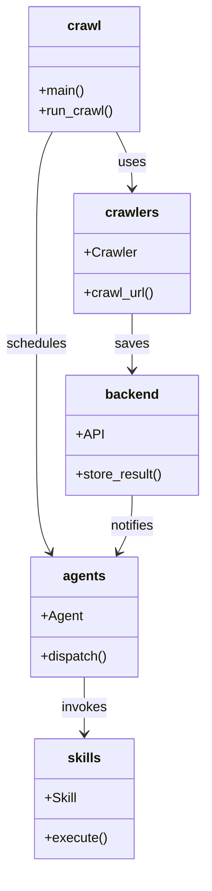
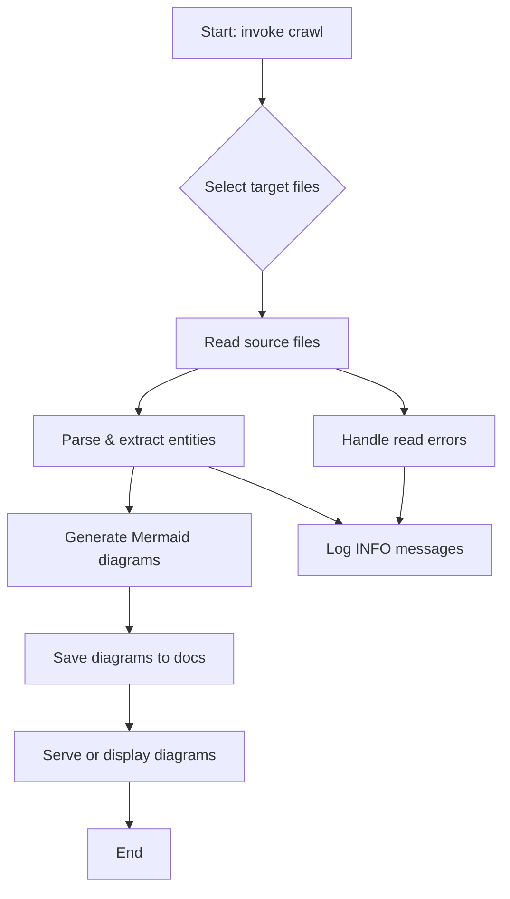

# Diagram: common/notification_service/config/config.qa.yml

> Auto-generated by Obscura crawlers

## Diagram 1

### SVG

<svg id="container" width="247.3125" xmlns="http://www.w3.org/2000/svg" class="classDiagram" height="1038" viewBox="0 0 247.3125 1038" role="graphics-document document" aria-roledescription="class"><g><defs><marker id="container_class-aggregationStart" class="marker aggregation class" refX="18" refY="7" markerWidth="190" markerHeight="240" orient="auto"><path d="M 18,7 L9,13 L1,7 L9,1 Z"></path></marker></defs><defs><marker id="container_class-aggregationEnd" class="marker aggregation class" refX="1" refY="7" markerWidth="20" markerHeight="28" orient="auto"><path d="M 18,7 L9,13 L1,7 L9,1 Z"></path></marker></defs><defs><marker id="container_class-extensionStart" class="marker extension class" refX="18" refY="7" markerWidth="190" markerHeight="240" orient="auto"><path d="M 1,7 L18,13 V 1 Z"></path></marker></defs><defs><marker id="container_class-extensionEnd" class="marker extension class" refX="1" refY="7" markerWidth="20" markerHeight="28" orient="auto"><path d="M 1,1 V 13 L18,7 Z"></path></marker></defs><defs><marker id="container_class-compositionStart" class="marker composition class" refX="18" refY="7" markerWidth="190" markerHeight="240" orient="auto"><path d="M 18,7 L9,13 L1,7 L9,1 Z"></path></marker></defs><defs><marker id="container_class-compositionEnd" class="marker composition class" refX="1" refY="7" markerWidth="20" markerHeight="28" orient="auto"><path d="M 18,7 L9,13 L1,7 L9,1 Z"></path></marker></defs><defs><marker id="container_class-dependencyStart" class="marker dependency class" refX="6" refY="7" markerWidth="190" markerHeight="240" orient="auto"><path d="M 5,7 L9,13 L1,7 L9,1 Z"></path></marker></defs><defs><marker id="container_class-dependencyEnd" class="marker dependency class" refX="13" refY="7" markerWidth="20" markerHeight="28" orient="auto"><path d="M 18,7 L9,13 L14,7 L9,1 Z"></path></marker></defs><defs><marker id="container_class-lollipopStart" class="marker lollipop class" refX="13" refY="7" markerWidth="190" markerHeight="240" orient="auto"><circle stroke="black" fill="transparent" cx="7" cy="7" r="6"></circle></marker></defs><defs><marker id="container_class-lollipopEnd" class="marker lollipop class" refX="1" refY="7" markerWidth="190" markerHeight="240" orient="auto"><circle stroke="black" fill="transparent" cx="7" cy="7" r="6"></circle></marker></defs><g class="root"><g class="clusters"></g><g class="edgePaths"><path d="M140.399,158L143.563,164.167C146.727,170.333,153.055,182.667,156.219,194C159.383,205.333,159.383,215.667,159.383,220.833L159.383,226" id="id_crawl_crawlers_1" class="edge-thickness-normal edge-pattern-solid relation" style=";;;" data-edge="true" data-et="edge" data-id="id_crawl_crawlers_1" data-points="W3sieCI6MTQwLjM5ODg5MDkwNDAxNzg2LCJ5IjoxNTh9LHsieCI6MTU5LjM4MjgxMjUsInkiOjE5NX0seyJ4IjoxNTkuMzgyODEyNSwieSI6MjMyfV0=" marker-end="url(#container_class-dependencyEnd)"></path><path d="M159.383,376L159.383,382.167C159.383,388.333,159.383,400.667,159.383,412C159.383,423.333,159.383,433.667,159.383,438.833L159.383,444" id="id_crawlers_backend_2" class="edge-thickness-normal edge-pattern-solid relation" style=";;;" data-edge="true" data-et="edge" data-id="id_crawlers_backend_2" data-points="W3sieCI6MTU5LjM4MjgxMjUsInkiOjM3Nn0seyJ4IjoxNTkuMzgyODEyNSwieSI6NDEzfSx7IngiOjE1OS4zODI4MTI1LCJ5Ijo0NTB9XQ==" marker-end="url(#container_class-dependencyEnd)"></path><path d="M63.437,158L60.273,164.167C57.109,170.333,50.781,182.667,47.617,207C44.453,231.333,44.453,267.667,44.453,304C44.453,340.333,44.453,376.667,44.453,413C44.453,449.333,44.453,485.667,44.453,522C44.453,558.333,44.453,594.667,47.238,618.115C50.023,641.564,55.592,652.128,58.377,657.41L61.161,662.692" id="id_crawl_agents_3" class="edge-thickness-normal edge-pattern-solid relation" style=";;;" data-edge="true" data-et="edge" data-id="id_crawl_agents_3" data-points="W3sieCI6NjMuNDM3MDQ2NTk1OTgyMTQ2LCJ5IjoxNTh9LHsieCI6NDQuNDUzMTI1LCJ5IjoxOTV9LHsieCI6NDQuNDUzMTI1LCJ5IjozMDR9LHsieCI6NDQuNDUzMTI1LCJ5Ijo0MTN9LHsieCI6NDQuNDUzMTI1LCJ5Ijo1MjJ9LHsieCI6NDQuNDUzMTI1LCJ5Ijo2MzF9LHsieCI6NjMuOTU5NTM5ODUwOTE3NDMsInkiOjY2OH1d" marker-end="url(#container_class-dependencyEnd)"></path><path d="M101.918,812L101.918,818.167C101.918,824.333,101.918,836.667,101.918,848C101.918,859.333,101.918,869.667,101.918,874.833L101.918,880" id="id_agents_skills_4" class="edge-thickness-normal edge-pattern-solid relation" style=";;;" data-edge="true" data-et="edge" data-id="id_agents_skills_4" data-points="W3sieCI6MTAxLjkxNzk2ODc1LCJ5Ijo4MTJ9LHsieCI6MTAxLjkxNzk2ODc1LCJ5Ijo4NDl9LHsieCI6MTAxLjkxNzk2ODc1LCJ5Ijo4ODZ9XQ==" marker-end="url(#container_class-dependencyEnd)"></path><path d="M159.383,594L159.383,600.167C159.383,606.333,159.383,618.667,156.598,630.115C153.813,641.564,148.244,652.128,145.459,657.41L142.675,662.692" id="id_backend_agents_5" class="edge-thickness-normal edge-pattern-solid relation" style=";;;" data-edge="true" data-et="edge" data-id="id_backend_agents_5" data-points="W3sieCI6MTU5LjM4MjgxMjUsInkiOjU5NH0seyJ4IjoxNTkuMzgyODEyNSwieSI6NjMxfSx7IngiOjEzOS44NzYzOTc2NDkwODI1OCwieSI6NjY4fV0=" marker-end="url(#container_class-dependencyEnd)"></path></g><g class="edgeLabels"><g class="edgeLabel" transform="translate(159.3828125, 195)"><g class="label" data-id="id_crawl_crawlers_1" transform="translate(-16.4921875, -12)"><foreignObject width="32.984375" height="24">

uses

</foreignObject></g></g><g class="edgeLabel" transform="translate(159.3828125, 413)"><g class="label" data-id="id_crawlers_backend_2" transform="translate(-19.890625, -12)"><foreignObject width="39.78125" height="24">

saves

</foreignObject></g></g><g class="edgeLabel" transform="translate(44.453125, 413)"><g class="label" data-id="id_crawl_agents_3" transform="translate(-36.453125, -12)"><foreignObject width="72.90625" height="24">

schedules

</foreignObject></g></g><g class="edgeLabel" transform="translate(101.91796875, 849)"><g class="label" data-id="id_agents_skills_4" transform="translate(-27.5859375, -12)"><foreignObject width="55.171875" height="24">

invokes

</foreignObject></g></g><g class="edgeLabel" transform="translate(159.3828125, 631)"><g class="label" data-id="id_backend_agents_5" transform="translate(-27.203125, -12)"><foreignObject width="54.40625" height="24">

notifies

</foreignObject></g></g></g><g class="nodes"><g class="node default" id="classId-crawl-0" transform="translate(101.91796875, 83)"><g class="basic label-container"><path d="M-66.37109375 -75 L66.37109375 -75 L66.37109375 75 L-66.37109375 75" stroke="none" stroke-width="0" fill="#ECECFF" style=""></path><path d="M-66.37109375 -75 C-17.315295485521602 -75, 31.740502778956795 -75, 66.37109375 -75 M-66.37109375 -75 C-37.49945791697336 -75, -8.627822083946725 -75, 66.37109375 -75 M66.37109375 -75 C66.37109375 -40.492857848431356, 66.37109375 -5.985715696862712, 66.37109375 75 M66.37109375 -75 C66.37109375 -35.58776503875662, 66.37109375 3.824469922486756, 66.37109375 75 M66.37109375 75 C22.433234231563638 75, -21.504625286872724 75, -66.37109375 75 M66.37109375 75 C18.150296039905697 75, -30.070501670188605 75, -66.37109375 75 M-66.37109375 75 C-66.37109375 22.292690155390552, -66.37109375 -30.414619689218895, -66.37109375 -75 M-66.37109375 75 C-66.37109375 44.85964034974476, -66.37109375 14.719280699489516, -66.37109375 -75" stroke="#9370DB" stroke-width="1.3" fill="none" stroke-dasharray="0 0" style=""></path></g><g class="annotation-group text" transform="translate(0, -51)"></g><g class="label-group text" transform="translate(-19.4765625, -51)"><g class="label" style="font-weight: bolder" transform="translate(0,-12)"><foreignObject width="38.953125" height="24">

crawl

</foreignObject></g></g><g class="members-group text" transform="translate(-54.37109375, -3)"></g><g class="methods-group text" transform="translate(-54.37109375, 27)"><g class="label" style="" transform="translate(0,-12)"><foreignObject width="54.65625" height="24">

+main()

</foreignObject></g><g class="label" style="" transform="translate(0,12)"><foreignObject width="89.265625" height="24">

+run_crawl()

</foreignObject></g></g><g class="divider" style=""><path d="M-66.37109375 -27 C-30.246277721988413 -27, 5.878538306023174 -27, 66.37109375 -27 M-66.37109375 -27 C-19.995542546589057 -27, 26.380008656821886 -27, 66.37109375 -27" stroke="#9370DB" stroke-width="1.3" fill="none" stroke-dasharray="0 0" style=""></path></g><g class="divider" style=""><path d="M-66.37109375 -3 C-25.530733021982684 -3, 15.309627706034632 -3, 66.37109375 -3 M-66.37109375 -3 C-27.564402763260787 -3, 11.242288223478425 -3, 66.37109375 -3" stroke="#9370DB" stroke-width="1.3" fill="none" stroke-dasharray="0 0" style=""></path></g></g><g class="node default" id="classId-crawlers-1" transform="translate(159.3828125, 304)"><g class="basic label-container"><path d="M-69.703125 -72 L69.703125 -72 L69.703125 72 L-69.703125 72" stroke="none" stroke-width="0" fill="#ECECFF" style=""></path><path d="M-69.703125 -72 C-30.630121910525503 -72, 8.442881178948994 -72, 69.703125 -72 M-69.703125 -72 C-29.14145650257197 -72, 11.42021199485606 -72, 69.703125 -72 M69.703125 -72 C69.703125 -28.961317334709513, 69.703125 14.077365330580975, 69.703125 72 M69.703125 -72 C69.703125 -19.806513855449396, 69.703125 32.38697228910121, 69.703125 72 M69.703125 72 C24.959829944782243 72, -19.783465110435515 72, -69.703125 72 M69.703125 72 C39.42072258171271 72, 9.138320163425412 72, -69.703125 72 M-69.703125 72 C-69.703125 41.7695403579591, -69.703125 11.539080715918196, -69.703125 -72 M-69.703125 72 C-69.703125 22.29625796681013, -69.703125 -27.407484066379737, -69.703125 -72" stroke="#9370DB" stroke-width="1.3" fill="none" stroke-dasharray="0 0" style=""></path></g><g class="annotation-group text" transform="translate(0, -48)"></g><g class="label-group text" transform="translate(-30.828125, -48)"><g class="label" style="font-weight: bolder" transform="translate(0,-12)"><foreignObject width="61.65625" height="24">

crawlers

</foreignObject></g></g><g class="members-group text" transform="translate(-57.703125, 0)"><g class="label" style="" transform="translate(0,-12)"><foreignObject width="61.921875" height="24">

+Crawler

</foreignObject></g></g><g class="methods-group text" transform="translate(-57.703125, 48)"><g class="label" style="" transform="translate(0,-12)"><foreignObject width="84.578125" height="24">

+crawl_url()

</foreignObject></g></g><g class="divider" style=""><path d="M-69.703125 -24 C-25.83706610354991 -24, 18.028992792900183 -24, 69.703125 -24 M-69.703125 -24 C-28.957100754757292 -24, 11.788923490485416 -24, 69.703125 -24" stroke="#9370DB" stroke-width="1.3" fill="none" stroke-dasharray="0 0" style=""></path></g><g class="divider" style=""><path d="M-69.703125 24 C-29.97749122569453 24, 9.748142548610943 24, 69.703125 24 M-69.703125 24 C-37.26991072293187 24, -4.836696445863737 24, 69.703125 24" stroke="#9370DB" stroke-width="1.3" fill="none" stroke-dasharray="0 0" style=""></path></g></g><g class="node default" id="classId-backend-2" transform="translate(159.3828125, 522)"><g class="basic label-container"><path d="M-79.9296875 -72 L79.9296875 -72 L79.9296875 72 L-79.9296875 72" stroke="none" stroke-width="0" fill="#ECECFF" style=""></path><path d="M-79.9296875 -72 C-40.69427134641039 -72, -1.4588551928207778 -72, 79.9296875 -72 M-79.9296875 -72 C-31.025725991714822 -72, 17.878235516570356 -72, 79.9296875 -72 M79.9296875 -72 C79.9296875 -18.818615775374063, 79.9296875 34.362768449251874, 79.9296875 72 M79.9296875 -72 C79.9296875 -25.697009379815334, 79.9296875 20.60598124036933, 79.9296875 72 M79.9296875 72 C38.20083064418433 72, -3.5280262116313423 72, -79.9296875 72 M79.9296875 72 C45.99019168792963 72, 12.050695875859262 72, -79.9296875 72 M-79.9296875 72 C-79.9296875 15.733901595906673, -79.9296875 -40.532196808186654, -79.9296875 -72 M-79.9296875 72 C-79.9296875 14.767459635621393, -79.9296875 -42.465080728757215, -79.9296875 -72" stroke="#9370DB" stroke-width="1.3" fill="none" stroke-dasharray="0 0" style=""></path></g><g class="annotation-group text" transform="translate(0, -48)"></g><g class="label-group text" transform="translate(-31.0625, -48)"><g class="label" style="font-weight: bolder" transform="translate(0,-12)"><foreignObject width="62.125" height="24">

backend

</foreignObject></g></g><g class="members-group text" transform="translate(-67.9296875, 0)"><g class="label" style="" transform="translate(0,-12)"><foreignObject width="31.015625" height="24">

+API

</foreignObject></g></g><g class="methods-group text" transform="translate(-67.9296875, 48)"><g class="label" style="" transform="translate(0,-12)"><foreignObject width="104.796875" height="24">

+store_result()

</foreignObject></g></g><g class="divider" style=""><path d="M-79.9296875 -24 C-18.920938735895106 -24, 42.08781002820979 -24, 79.9296875 -24 M-79.9296875 -24 C-20.09314192355796 -24, 39.74340365288408 -24, 79.9296875 -24" stroke="#9370DB" stroke-width="1.3" fill="none" stroke-dasharray="0 0" style=""></path></g><g class="divider" style=""><path d="M-79.9296875 24 C-16.770265803690336 24, 46.38915589261933 24, 79.9296875 24 M-79.9296875 24 C-43.28809517888405 24, -6.646502857768098 24, 79.9296875 24" stroke="#9370DB" stroke-width="1.3" fill="none" stroke-dasharray="0 0" style=""></path></g></g><g class="node default" id="classId-agents-3" transform="translate(101.91796875, 740)"><g class="basic label-container"><path d="M-64.51953125 -72 L64.51953125 -72 L64.51953125 72 L-64.51953125 72" stroke="none" stroke-width="0" fill="#ECECFF" style=""></path><path d="M-64.51953125 -72 C-22.733987501881906 -72, 19.05155624623619 -72, 64.51953125 -72 M-64.51953125 -72 C-21.98106945376515 -72, 20.557392342469697 -72, 64.51953125 -72 M64.51953125 -72 C64.51953125 -14.865953137946548, 64.51953125 42.268093724106905, 64.51953125 72 M64.51953125 -72 C64.51953125 -28.107555086470008, 64.51953125 15.784889827059985, 64.51953125 72 M64.51953125 72 C22.99686090858387 72, -18.52580943283226 72, -64.51953125 72 M64.51953125 72 C31.699756887534434 72, -1.1200174749311316 72, -64.51953125 72 M-64.51953125 72 C-64.51953125 17.29939394508483, -64.51953125 -37.40121210983034, -64.51953125 -72 M-64.51953125 72 C-64.51953125 20.34387954774438, -64.51953125 -31.312240904511242, -64.51953125 -72" stroke="#9370DB" stroke-width="1.3" fill="none" stroke-dasharray="0 0" style=""></path></g><g class="annotation-group text" transform="translate(0, -48)"></g><g class="label-group text" transform="translate(-24.5234375, -48)"><g class="label" style="font-weight: bolder" transform="translate(0,-12)"><foreignObject width="49.046875" height="24">

agents

</foreignObject></g></g><g class="members-group text" transform="translate(-52.51953125, 0)"><g class="label" style="" transform="translate(0,-12)"><foreignObject width="48.9375" height="24">

+Agent

</foreignObject></g></g><g class="methods-group text" transform="translate(-52.51953125, 48)"><g class="label" style="" transform="translate(0,-12)"><foreignObject width="80.515625" height="24">

+dispatch()

</foreignObject></g></g><g class="divider" style=""><path d="M-64.51953125 -24 C-38.6472918046432 -24, -12.775052359286398 -24, 64.51953125 -24 M-64.51953125 -24 C-31.986584871118836 -24, 0.5463615077623274 -24, 64.51953125 -24" stroke="#9370DB" stroke-width="1.3" fill="none" stroke-dasharray="0 0" style=""></path></g><g class="divider" style=""><path d="M-64.51953125 24 C-13.046295800340339 24, 38.42693964931932 24, 64.51953125 24 M-64.51953125 24 C-28.341636079893092 24, 7.836259090213815 24, 64.51953125 24" stroke="#9370DB" stroke-width="1.3" fill="none" stroke-dasharray="0 0" style=""></path></g></g><g class="node default" id="classId-skills-4" transform="translate(101.91796875, 958)"><g class="basic label-container"><path d="M-58.7421875 -72 L58.7421875 -72 L58.7421875 72 L-58.7421875 72" stroke="none" stroke-width="0" fill="#ECECFF" style=""></path><path d="M-58.7421875 -72 C-30.18180387758269 -72, -1.6214202551653827 -72, 58.7421875 -72 M-58.7421875 -72 C-30.636934678749025 -72, -2.53168185749805 -72, 58.7421875 -72 M58.7421875 -72 C58.7421875 -28.583976316197187, 58.7421875 14.832047367605625, 58.7421875 72 M58.7421875 -72 C58.7421875 -21.059379996024823, 58.7421875 29.881240007950353, 58.7421875 72 M58.7421875 72 C14.346430232173972 72, -30.049327035652055 72, -58.7421875 72 M58.7421875 72 C19.450226784917746 72, -19.84173393016451 72, -58.7421875 72 M-58.7421875 72 C-58.7421875 24.725116729130676, -58.7421875 -22.54976654173865, -58.7421875 -72 M-58.7421875 72 C-58.7421875 35.83359700483746, -58.7421875 -0.3328059903250846, -58.7421875 -72" stroke="#9370DB" stroke-width="1.3" fill="none" stroke-dasharray="0 0" style=""></path></g><g class="annotation-group text" transform="translate(0, -48)"></g><g class="label-group text" transform="translate(-19.15625, -48)"><g class="label" style="font-weight: bolder" transform="translate(0,-12)"><foreignObject width="38.3125" height="24">

skills

</foreignObject></g></g><g class="members-group text" transform="translate(-46.7421875, 0)"><g class="label" style="" transform="translate(0,-12)"><foreignObject width="38.15625" height="24">

+Skill

</foreignObject></g></g><g class="methods-group text" transform="translate(-46.7421875, 48)"><g class="label" style="" transform="translate(0,-12)"><foreignObject width="74.328125" height="24">

+execute()

</foreignObject></g></g><g class="divider" style=""><path d="M-58.7421875 -24 C-12.79306405914432 -24, 33.15605938171136 -24, 58.7421875 -24 M-58.7421875 -24 C-31.05238822970703 -24, -3.3625889594140617 -24, 58.7421875 -24" stroke="#9370DB" stroke-width="1.3" fill="none" stroke-dasharray="0 0" style=""></path></g><g class="divider" style=""><path d="M-58.7421875 24 C-25.598571867788962 24, 7.545043764422076 24, 58.7421875 24 M-58.7421875 24 C-30.590195275855052 24, -2.4382030517101043 24, 58.7421875 24" stroke="#9370DB" stroke-width="1.3" fill="none" stroke-dasharray="0 0" style=""></path></g></g></g></g></g></svg>

## Diagram 2

### SVG

<svg id="container" width="534.72265625" xmlns="http://www.w3.org/2000/svg" class="flowchart" height="947.546875" viewBox="0 0 534.72265625 947.546875" role="graphics-document document" aria-roledescription="flowchart-v2"><g><marker id="container_flowchart-v2-pointEnd" class="marker flowchart-v2" viewBox="0 0 10 10" refX="5" refY="5" markerUnits="userSpaceOnUse" markerWidth="8" markerHeight="8" orient="auto"><path d="M 0 0 L 10 5 L 0 10 z" class="arrowMarkerPath" style="stroke-width: 1; stroke-dasharray: 1, 0;"></path></marker><marker id="container_flowchart-v2-pointStart" class="marker flowchart-v2" viewBox="0 0 10 10" refX="4.5" refY="5" markerUnits="userSpaceOnUse" markerWidth="8" markerHeight="8" orient="auto"><path d="M 0 5 L 10 10 L 10 0 z" class="arrowMarkerPath" style="stroke-width: 1; stroke-dasharray: 1, 0;"></path></marker><marker id="container_flowchart-v2-circleEnd" class="marker flowchart-v2" viewBox="0 0 10 10" refX="11" refY="5" markerUnits="userSpaceOnUse" markerWidth="11" markerHeight="11" orient="auto"><circle cx="5" cy="5" r="5" class="arrowMarkerPath" style="stroke-width: 1; stroke-dasharray: 1, 0;"></circle></marker><marker id="container_flowchart-v2-circleStart" class="marker flowchart-v2" viewBox="0 0 10 10" refX="-1" refY="5" markerUnits="userSpaceOnUse" markerWidth="11" markerHeight="11" orient="auto"><circle cx="5" cy="5" r="5" class="arrowMarkerPath" style="stroke-width: 1; stroke-dasharray: 1, 0;"></circle></marker><marker id="container_flowchart-v2-crossEnd" class="marker cross flowchart-v2" viewBox="0 0 11 11" refX="12" refY="5.2" markerUnits="userSpaceOnUse" markerWidth="11" markerHeight="11" orient="auto"><path d="M 1,1 l 9,9 M 10,1 l -9,9" class="arrowMarkerPath" style="stroke-width: 2; stroke-dasharray: 1, 0;"></path></marker><marker id="container_flowchart-v2-crossStart" class="marker cross flowchart-v2" viewBox="0 0 11 11" refX="-1" refY="5.2" markerUnits="userSpaceOnUse" markerWidth="11" markerHeight="11" orient="auto"><path d="M 1,1 l 9,9 M 10,1 l -9,9" class="arrowMarkerPath" style="stroke-width: 2; stroke-dasharray: 1, 0;"></path></marker><g class="root"><g class="clusters"></g><g class="edgePaths"><path d="M279.145,62L279.145,66.167C279.145,70.333,279.145,78.667,279.145,86.333C279.145,94,279.145,101,279.145,104.5L279.145,108" id="L_A_B_0" class="edge-thickness-normal edge-pattern-solid edge-thickness-normal edge-pattern-solid flowchart-link" style=";" data-edge="true" data-et="edge" data-id="L_A_B_0" data-points="W3sieCI6Mjc5LjE0NDUzMTI1LCJ5Ijo2Mn0seyJ4IjoyNzkuMTQ0NTMxMjUsInkiOjg3fSx7IngiOjI3OS4xNDQ1MzEyNSwieSI6MTEyfV0=" marker-end="url(#container_flowchart-v2-pointEnd)"></path><path d="M279.145,291.547L279.145,295.714C279.145,299.88,279.145,308.214,279.145,315.88C279.145,323.547,279.145,330.547,279.145,334.047L279.145,337.547" id="L_B_C_0" class="edge-thickness-normal edge-pattern-solid edge-thickness-normal edge-pattern-solid flowchart-link" style=";" data-edge="true" data-et="edge" data-id="L_B_C_0" data-points="W3sieCI6Mjc5LjE0NDUzMTI1LCJ5IjoyOTEuNTQ2ODc1fSx7IngiOjI3OS4xNDQ1MzEyNSwieSI6MzE2LjU0Njg3NX0seyJ4IjoyNzkuMTQ0NTMxMjUsInkiOjM0MS41NDY4NzV9XQ==" marker-end="url(#container_flowchart-v2-pointEnd)"></path><path d="M211.05,395.547L200.542,399.714C190.034,403.88,169.017,412.214,158.508,419.88C148,427.547,148,434.547,148,438.047L148,441.547" id="L_C_D_0" class="edge-thickness-normal edge-pattern-solid edge-thickness-normal edge-pattern-solid flowchart-link" style=";" data-edge="true" data-et="edge" data-id="L_C_D_0" data-points="W3sieCI6MjExLjA1MDI1NTQwODY1Mzg0LCJ5IjozOTUuNTQ2ODc1fSx7IngiOjE0OCwieSI6NDIwLjU0Njg3NX0seyJ4IjoxNDgsInkiOjQ0NS41NDY4NzV9XQ==" marker-end="url(#container_flowchart-v2-pointEnd)"></path><path d="M142.808,499.547L142.006,503.714C141.205,507.88,139.603,516.214,138.801,523.88C138,531.547,138,538.547,138,542.047L138,545.547" id="L_D_E_0" class="edge-thickness-normal edge-pattern-solid edge-thickness-normal edge-pattern-solid flowchart-link" style=";" data-edge="true" data-et="edge" data-id="L_D_E_0" data-points="W3sieCI6MTQyLjgwNzY5MjMwNzY5MjMyLCJ5Ijo0OTkuNTQ2ODc1fSx7IngiOjEzOCwieSI6NTI0LjU0Njg3NX0seyJ4IjoxMzgsInkiOjU0OS41NDY4NzV9XQ==" marker-end="url(#container_flowchart-v2-pointEnd)"></path><path d="M138,627.547L138,631.714C138,635.88,138,644.214,138,651.88C138,659.547,138,666.547,138,670.047L138,673.547" id="L_E_F_0" class="edge-thickness-normal edge-pattern-solid edge-thickness-normal edge-pattern-solid flowchart-link" style=";" data-edge="true" data-et="edge" data-id="L_E_F_0" data-points="W3sieCI6MTM4LCJ5Ijo2MjcuNTQ2ODc1fSx7IngiOjEzOCwieSI6NjUyLjU0Njg3NX0seyJ4IjoxMzgsInkiOjY3Ny41NDY4NzV9XQ==" marker-end="url(#container_flowchart-v2-pointEnd)"></path><path d="M138,731.547L138,735.714C138,739.88,138,748.214,138,755.88C138,763.547,138,770.547,138,774.047L138,777.547" id="L_F_G_0" class="edge-thickness-normal edge-pattern-solid edge-thickness-normal edge-pattern-solid flowchart-link" style=";" data-edge="true" data-et="edge" data-id="L_F_G_0" data-points="W3sieCI6MTM4LCJ5Ijo3MzEuNTQ2ODc1fSx7IngiOjEzOCwieSI6NzU2LjU0Njg3NX0seyJ4IjoxMzgsInkiOjc4MS41NDY4NzV9XQ==" marker-end="url(#container_flowchart-v2-pointEnd)"></path><path d="M138,835.547L138,839.714C138,843.88,138,852.214,138,859.88C138,867.547,138,874.547,138,878.047L138,881.547" id="L_G_H_0" class="edge-thickness-normal edge-pattern-solid edge-thickness-normal edge-pattern-solid flowchart-link" style=";" data-edge="true" data-et="edge" data-id="L_G_H_0" data-points="W3sieCI6MTM4LCJ5Ijo4MzUuNTQ2ODc1fSx7IngiOjEzOCwieSI6ODYwLjU0Njg3NX0seyJ4IjoxMzgsInkiOjg4NS41NDY4NzV9XQ==" marker-end="url(#container_flowchart-v2-pointEnd)"></path><path d="M220.416,499.547L231.592,503.714C242.767,507.88,265.118,516.214,288.331,526.254C311.543,536.295,335.618,548.044,347.655,553.918L359.692,559.793" id="L_D_I_0" class="edge-thickness-normal edge-pattern-solid edge-thickness-normal edge-pattern-solid flowchart-link" style=";" data-edge="true" data-et="edge" data-id="L_D_I_0" data-points="W3sieCI6MjIwLjQxNjQ2NjM0NjE1Mzg0LCJ5Ijo0OTkuNTQ2ODc1fSx7IngiOjI4Ny40Njg3NSwieSI6NTI0LjU0Njg3NX0seyJ4IjozNjMuMjg2NjgyMTI4OTA2MjUsInkiOjU2MS41NDY4NzV9XQ==" marker-end="url(#container_flowchart-v2-pointEnd)"></path><path d="M356.753,395.547L368.73,399.714C380.707,403.88,404.66,412.214,416.637,419.88C428.613,427.547,428.613,434.547,428.613,438.047L428.613,441.547" id="L_C_J_0" class="edge-thickness-normal edge-pattern-solid edge-thickness-normal edge-pattern-solid flowchart-link" style=";" data-edge="true" data-et="edge" data-id="L_C_J_0" data-points="W3sieCI6MzU2Ljc1MzMwNTI4ODQ2MTU1LCJ5IjozOTUuNTQ2ODc1fSx7IngiOjQyOC42MTMyODEyNSwieSI6NDIwLjU0Njg3NX0seyJ4Ijo0MjguNjEzMjgxMjUsInkiOjQ0NS41NDY4NzV9XQ==" marker-end="url(#container_flowchart-v2-pointEnd)"></path><path d="M428.613,499.547L428.613,503.714C428.613,507.88,428.613,516.214,427.753,525.888C426.892,535.563,425.171,546.579,424.31,552.087L423.45,557.595" id="L_J_I_0" class="edge-thickness-normal edge-pattern-solid edge-thickness-normal edge-pattern-solid flowchart-link" style=";" data-edge="true" data-et="edge" data-id="L_J_I_0" data-points="W3sieCI6NDI4LjYxMzI4MTI1LCJ5Ijo0OTkuNTQ2ODc1fSx7IngiOjQyOC42MTMyODEyNSwieSI6NTI0LjU0Njg3NX0seyJ4Ijo0MjIuODMyMDMxMjUsInkiOjU2MS41NDY4NzV9XQ==" marker-end="url(#container_flowchart-v2-pointEnd)"></path></g><g class="edgeLabels"><g class="edgeLabel"><g class="label" data-id="L_A_B_0" transform="translate(0, 0)"><foreignObject width="0" height="0">

</foreignObject></g></g><g class="edgeLabel"><g class="label" data-id="L_B_C_0" transform="translate(0, 0)"><foreignObject width="0" height="0">

</foreignObject></g></g><g class="edgeLabel"><g class="label" data-id="L_C_D_0" transform="translate(0, 0)"><foreignObject width="0" height="0">

</foreignObject></g></g><g class="edgeLabel"><g class="label" data-id="L_D_E_0" transform="translate(0, 0)"><foreignObject width="0" height="0">

</foreignObject></g></g><g class="edgeLabel"><g class="label" data-id="L_E_F_0" transform="translate(0, 0)"><foreignObject width="0" height="0">

</foreignObject></g></g><g class="edgeLabel"><g class="label" data-id="L_F_G_0" transform="translate(0, 0)"><foreignObject width="0" height="0">

</foreignObject></g></g><g class="edgeLabel"><g class="label" data-id="L_G_H_0" transform="translate(0, 0)"><foreignObject width="0" height="0">

</foreignObject></g></g><g class="edgeLabel"><g class="label" data-id="L_D_I_0" transform="translate(0, 0)"><foreignObject width="0" height="0">

</foreignObject></g></g><g class="edgeLabel"><g class="label" data-id="L_C_J_0" transform="translate(0, 0)"><foreignObject width="0" height="0">

</foreignObject></g></g><g class="edgeLabel"><g class="label" data-id="L_J_I_0" transform="translate(0, 0)"><foreignObject width="0" height="0">

</foreignObject></g></g></g><g class="nodes"><g class="node default" id="flowchart-A-0" transform="translate(279.14453125, 35)"><rect class="basic label-container" style="" x="-96.5859375" y="-27" width="193.171875" height="54"></rect><g class="label" style="" transform="translate(-66.5859375, -12)"><rect></rect><foreignObject width="133.171875" height="24">

Start: invoke crawl

</foreignObject></g></g><g class="node default" id="flowchart-B-1" transform="translate(279.14453125, 201.7734375)"><polygon points="89.7734375,0 179.546875,-89.7734375 89.7734375,-179.546875 0,-89.7734375" class="label-container" transform="translate(-89.2734375, 89.7734375)"></polygon><g class="label" style="" transform="translate(-62.7734375, -12)"><rect></rect><foreignObject width="125.546875" height="24">

Select target files

</foreignObject></g></g><g class="node default" id="flowchart-C-3" transform="translate(279.14453125, 368.546875)"><rect class="basic label-container" style="" x="-91.3125" y="-27" width="182.625" height="54"></rect><g class="label" style="" transform="translate(-61.3125, -12)"><rect></rect><foreignObject width="122.625" height="24">

Read source files

</foreignObject></g></g><g class="node default" id="flowchart-D-5" transform="translate(148, 472.546875)"><rect class="basic label-container" style="" x="-114.1796875" y="-27" width="228.359375" height="54"></rect><g class="label" style="" transform="translate(-84.1796875, -12)"><rect></rect><foreignObject width="168.359375" height="24">

Parse &amp; extract entities

</foreignObject></g></g><g class="node default" id="flowchart-E-7" transform="translate(138, 588.546875)"><rect class="basic label-container" style="" x="-130" y="-39" width="260" height="78"></rect><g class="label" style="" transform="translate(-100, -24)"><rect></rect><foreignObject width="200" height="48">

Generate Mermaid diagrams

</foreignObject></g></g><g class="node default" id="flowchart-F-9" transform="translate(138, 704.546875)"><rect class="basic label-container" style="" x="-110.8984375" y="-27" width="221.796875" height="54"></rect><g class="label" style="" transform="translate(-80.8984375, -12)"><rect></rect><foreignObject width="161.796875" height="24">

Save diagrams to docs

</foreignObject></g></g><g class="node default" id="flowchart-G-11" transform="translate(138, 808.546875)"><rect class="basic label-container" style="" x="-123.421875" y="-27" width="246.84375" height="54"></rect><g class="label" style="" transform="translate(-93.421875, -12)"><rect></rect><foreignObject width="186.84375" height="24">

Serve or display diagrams

</foreignObject></g></g><g class="node default" id="flowchart-H-13" transform="translate(138, 912.546875)"><rect class="basic label-container" style="" x="-43.6796875" y="-27" width="87.359375" height="54"></rect><g class="label" style="" transform="translate(-13.6796875, -12)"><rect></rect><foreignObject width="27.359375" height="24">

End

</foreignObject></g></g><g class="node default" id="flowchart-I-15" transform="translate(418.61328125, 588.546875)"><rect class="basic label-container" style="" x="-98.9375" y="-27" width="197.875" height="54"></rect><g class="label" style="" transform="translate(-68.9375, -12)"><rect></rect><foreignObject width="137.875" height="24">

Log INFO messages

</foreignObject></g></g><g class="node default" id="flowchart-J-17" transform="translate(428.61328125, 472.546875)"><rect class="basic label-container" style="" x="-98.109375" y="-27" width="196.21875" height="54"></rect><g class="label" style="" transform="translate(-68.109375, -12)"><rect></rect><foreignObject width="136.21875" height="24">

Handle read errors

</foreignObject></g></g></g></g></g></svg>
