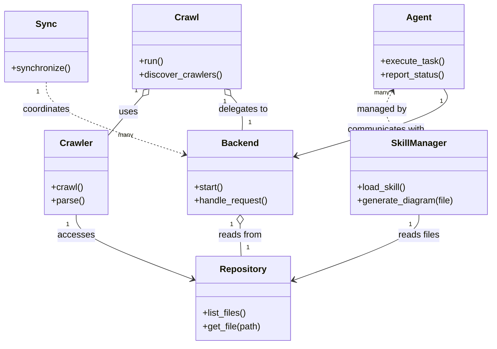

# Diagram: common/notification_service/config/config.staging1.yml

> Auto-generated by Obscura crawlers

## Mermaid

### SVG

<svg id="container" width="869.8125" xmlns="http://www.w3.org/2000/svg" class="classDiagram" height="614" viewBox="0 0 869.8125 614" role="graphics-document document" aria-roledescription="class"><g><defs><marker id="container_class-aggregationStart" class="marker aggregation class" refX="18" refY="7" markerWidth="190" markerHeight="240" orient="auto"><path d="M 18,7 L9,13 L1,7 L9,1 Z"></path></marker></defs><defs><marker id="container_class-aggregationEnd" class="marker aggregation class" refX="1" refY="7" markerWidth="20" markerHeight="28" orient="auto"><path d="M 18,7 L9,13 L1,7 L9,1 Z"></path></marker></defs><defs><marker id="container_class-extensionStart" class="marker extension class" refX="18" refY="7" markerWidth="190" markerHeight="240" orient="auto"><path d="M 1,7 L18,13 V 1 Z"></path></marker></defs><defs><marker id="container_class-extensionEnd" class="marker extension class" refX="1" refY="7" markerWidth="20" markerHeight="28" orient="auto"><path d="M 1,1 V 13 L18,7 Z"></path></marker></defs><defs><marker id="container_class-compositionStart" class="marker composition class" refX="18" refY="7" markerWidth="190" markerHeight="240" orient="auto"><path d="M 18,7 L9,13 L1,7 L9,1 Z"></path></marker></defs><defs><marker id="container_class-compositionEnd" class="marker composition class" refX="1" refY="7" markerWidth="20" markerHeight="28" orient="auto"><path d="M 18,7 L9,13 L1,7 L9,1 Z"></path></marker></defs><defs><marker id="container_class-dependencyStart" class="marker dependency class" refX="6" refY="7" markerWidth="190" markerHeight="240" orient="auto"><path d="M 5,7 L9,13 L1,7 L9,1 Z"></path></marker></defs><defs><marker id="container_class-dependencyEnd" class="marker dependency class" refX="13" refY="7" markerWidth="20" markerHeight="28" orient="auto"><path d="M 18,7 L9,13 L14,7 L9,1 Z"></path></marker></defs><defs><marker id="container_class-lollipopStart" class="marker lollipop class" refX="13" refY="7" markerWidth="190" markerHeight="240" orient="auto"><circle stroke="black" fill="transparent" cx="7" cy="7" r="6"></circle></marker></defs><defs><marker id="container_class-lollipopEnd" class="marker lollipop class" refX="1" refY="7" markerWidth="190" markerHeight="240" orient="auto"><circle stroke="black" fill="transparent" cx="7" cy="7" r="6"></circle></marker></defs><g class="root"><g class="clusters"></g><g class="edgePaths"><path d="M250.67,170.903L247.106,174.919C243.542,178.935,236.415,186.968,226.456,198.644C216.497,210.32,203.706,225.641,197.311,233.301L190.916,240.961" id="id_Crawl_Crawler_1" class="edge-thickness-normal edge-pattern-solid relation" style=";;;" data-edge="true" data-et="edge" data-id="id_Crawl_Crawler_1" data-points="W3sieCI6MjYyLjExODkzMTM2MTYwNzEsInkiOjE1OH0seyJ4IjoyMjkuMjg3MTA5Mzc1LCJ5IjoxOTV9LHsieCI6MTkwLjkxNjAxNTYyNSwieSI6MjQwLjk2MTMxNTExODg1MzY2fV0=" marker-start="url(#container_class-aggregationStart)"></path><path d="M406.67,170.903L410.234,174.919C413.798,178.935,420.925,186.968,424.376,197.15C427.827,207.333,427.601,219.667,427.488,225.833L427.375,232" id="id_Crawl_Backend_2" class="edge-thickness-normal edge-pattern-solid relation" style=";;;" data-edge="true" data-et="edge" data-id="id_Crawl_Backend_2" data-points="W3sieCI6Mzk1LjIyMDkxMjM4ODM5MjksInkiOjE1OH0seyJ4Ijo0MjguMDUyNzM0Mzc1LCJ5IjoxOTV9LHsieCI6NDI3LjM3NDU5ODkxMTgzMDMzLCJ5IjoyMzJ9XQ==" marker-start="url(#container_class-aggregationStart)"></path><path d="M426,399.25L426,402.542C426,405.833,426,412.417,426.113,421.875C426.226,431.333,426.452,443.667,426.565,449.833L426.678,456" id="id_Backend_Repository_3" class="edge-thickness-normal edge-pattern-solid relation" style=";;;" data-edge="true" data-et="edge" data-id="id_Backend_Repository_3" data-points="W3sieCI6NDI2LCJ5IjozODJ9LHsieCI6NDI2LCJ5Ijo0MTl9LHsieCI6NDI2LjY3ODEzNTQ2MzE2OTY3LCJ5Ijo0NTZ9XQ==" marker-start="url(#container_class-aggregationStart)"></path><path d="M80.727,146L80.727,154.167C80.727,162.333,80.727,178.667,121.715,200.129C162.704,221.592,244.682,248.184,285.671,261.48L326.66,274.776" id="id_Sync_Backend_4" class="edge-thickness-normal edge-pattern-dashed relation" style=";;;" data-edge="true" data-et="edge" data-id="id_Sync_Backend_4" data-points="W3sieCI6ODAuNzI2NTYyNSwieSI6MTQ2fSx7IngiOjgwLjcyNjU2MjUsInkiOjE5NX0seyJ4IjozMzIuMzY3MTg3NSwieSI6Mjc2LjYyNzMzMzQwODc1NjY3fV0=" marker-end="url(#container_class-dependencyEnd)"></path><path d="M692.491,163.145L689.305,168.454C686.119,173.763,679.747,184.382,680.262,195.857C680.776,207.333,688.177,219.667,691.878,225.833L695.579,232" id="id_Agent_SkillManager_5" class="edge-thickness-normal edge-pattern-dashed relation" style=";;;" data-edge="true" data-et="edge" data-id="id_Agent_SkillManager_5" data-points="W3sieCI6Njk1LjU3ODYxMzI4MTI1LCJ5IjoxNTh9LHsieCI6NjczLjM3NSwieSI6MTk1fSx7IngiOjY5NS41Nzg2MTMyODEyNSwieSI6MjMyfV0=" marker-start="url(#container_class-dependencyStart)"></path><path d="M740.586,382L740.586,388.167C740.586,394.333,740.586,406.667,703.473,426.133C666.36,445.6,592.134,472.2,555.021,485.499L517.908,498.799" id="id_SkillManager_Repository_6" class="edge-thickness-normal edge-pattern-solid relation" style=";;;" data-edge="true" data-et="edge" data-id="id_SkillManager_Repository_6" data-points="W3sieCI6NzQwLjU4NTkzNzUsInkiOjM4Mn0seyJ4Ijo3NDAuNTg1OTM3NSwieSI6NDE5fSx7IngiOjUxMi4yNTk3NjU2MjUsInkiOjUwMC44MjM0MDYyNjMwODQ1Nn1d" marker-end="url(#container_class-dependencyEnd)"></path><path d="M135.783,382L135.783,388.167C135.783,394.333,135.783,406.667,169.527,425.764C203.27,444.861,270.756,470.723,304.5,483.653L338.243,496.584" id="id_Crawler_Repository_7" class="edge-thickness-normal edge-pattern-solid relation" style=";;;" data-edge="true" data-et="edge" data-id="id_Crawler_Repository_7" data-points="W3sieCI6MTM1Ljc4MzIwMzEyNSwieSI6MzgyfSx7IngiOjEzNS43ODMyMDMxMjUsInkiOjQxOX0seyJ4IjozNDMuODQ1NzAzMTI1LCJ5Ijo0OTguNzMxMTk4NDYwMzI1M31d" marker-end="url(#container_class-dependencyEnd)"></path><path d="M785.593,158L789.294,164.167C792.994,170.333,800.396,182.667,757.028,202.641C713.661,222.615,619.526,250.229,572.458,264.037L525.39,277.844" id="id_Agent_Backend_8" class="edge-thickness-normal edge-pattern-solid relation" style=";;;" data-edge="true" data-et="edge" data-id="id_Agent_Backend_8" data-points="W3sieCI6Nzg1LjU5MzI2MTcxODc1LCJ5IjoxNTh9LHsieCI6ODA3Ljc5Njg3NSwieSI6MTk1fSx7IngiOjUxOS42MzI4MTI1LCJ5IjoyNzkuNTMyODQyMjM0NDk5N31d" marker-end="url(#container_class-dependencyEnd)"></path></g><g class="edgeLabels"><g class="edgeLabel" transform="translate(225.95244, 198.9943)"><g class="label" data-id="id_Crawl_Crawler_1" transform="translate(-16.4921875, -12)"><foreignObject width="32.984375" height="24">

uses

</foreignObject></g></g><g class="edgeLabel" transform="translate(428.052734375, 195)"><g class="label" data-id="id_Crawl_Backend_2" transform="translate(-44.59375, -12)"><foreignObject width="89.1875" height="24">

delegates to

</foreignObject></g></g><g class="edgeLabel" transform="translate(426, 419)"><g class="label" data-id="id_Backend_Repository_3" transform="translate(-39.1796875, -12)"><foreignObject width="78.359375" height="24">

reads from

</foreignObject></g></g><g class="edgeLabel" transform="translate(80.7265625, 195)"><g class="label" data-id="id_Sync_Backend_4" transform="translate(-42.8046875, -12)"><foreignObject width="85.609375" height="24">

coordinates

</foreignObject></g></g><g class="edgeLabel" transform="translate(673.375, 195)"><g class="label" data-id="id_Agent_SkillManager_5" transform="translate(-44.125, -12)"><foreignObject width="88.25" height="24">

managed by

</foreignObject></g></g><g class="edgeLabel" transform="translate(740.5859375, 419)"><g class="label" data-id="id_SkillManager_Repository_6" transform="translate(-37.125, -12)"><foreignObject width="74.25" height="24">

reads files

</foreignObject></g></g><g class="edgeLabel" transform="translate(135.783203125, 419)"><g class="label" data-id="id_Crawler_Repository_7" transform="translate(-31.53125, -12)"><foreignObject width="63.0625" height="24">

accesses

</foreignObject></g></g><g class="edgeLabel" transform="translate(684.41789, 231.19319)"><g class="label" data-id="id_Agent_Backend_8" transform="translate(-70.296875, -12)"><foreignObject width="140.59375" height="24">

communicates with

</foreignObject></g></g><g class="edgeTerminals" transform="translate(239.28411694055706, 161.13389839143477)"><g class="inner" transform="translate(0, 0)"><foreignObject style="width: 9px; height: 12px;">
1
</foreignObject></g></g><g class="edgeTerminals" transform="translate(395.6162666560841, 181.04547070940586)"><g class="inner" transform="translate(0, 0)"><foreignObject style="width: 9px; height: 12px;">
1
</foreignObject></g></g><g class="edgeTerminals" transform="translate(411, 399.5)"><g class="inner" transform="translate(0, 0)"><foreignObject style="width: 9px; height: 12px;">
1
</foreignObject></g></g><g class="edgeTerminals" transform="translate(65.72656125000005, 163.49999892857144)"><g class="inner" transform="translate(0, 0)"><foreignObject style="width: 9px; height: 12px;">
1
</foreignObject></g></g><g class="edgeTerminals" transform="translate(673.7120212655786, 165.28712122582854)"><g class="inner" transform="translate(0, 0)"><foreignObject style="width: 36px; height: 12px;">
many
</foreignObject></g></g><g class="edgeTerminals" transform="translate(725.58593875, 399.5000010714286)"><g class="inner" transform="translate(0, 0)"><foreignObject style="width: 9px; height: 12px;">
1
</foreignObject></g></g><g class="edgeTerminals" transform="translate(120.78320156250004, 399.4999986607143)"><g class="inner" transform="translate(0, 0)"><foreignObject style="width: 9px; height: 12px;">
1
</foreignObject></g></g><g class="edgeTerminals" transform="translate(781.7361764297792, 180.723840349666)"><g class="inner" transform="translate(0, 0)"><foreignObject style="width: 9px; height: 12px;">
1
</foreignObject></g></g><g class="edgeTerminals" transform="translate(208.6460018070102, 232.14062534144003)"><g class="inner" transform="translate(0, 0)"></g><foreignObject style="width: 36px; height: 12px;">
many
</foreignObject></g><g class="edgeTerminals" transform="translate(437.6927657325551, 209.77781334689948)"><g class="inner" transform="translate(0, 0)"></g><foreignObject style="width: 9px; height: 12px;">
1
</foreignObject></g><g class="edgeTerminals" transform="translate(436.3549289738712, 433.22806477872996)"><g class="inner" transform="translate(0, 0)"></g><foreignObject style="width: 9px; height: 12px;">
1
</foreignObject></g></g><g class="nodes"><g class="node default" id="classId-Crawl-0" transform="translate(328.669921875, 83)"><g class="basic label-container"><path d="M-95.09765625 -75 L95.09765625 -75 L95.09765625 75 L-95.09765625 75" stroke="none" stroke-width="0" fill="#ECECFF" style=""></path><path d="M-95.09765625 -75 C-49.56390569321221 -75, -4.030155136424426 -75, 95.09765625 -75 M-95.09765625 -75 C-39.301426249801324 -75, 16.494803750397352 -75, 95.09765625 -75 M95.09765625 -75 C95.09765625 -17.844683118926554, 95.09765625 39.31063376214689, 95.09765625 75 M95.09765625 -75 C95.09765625 -41.36103091121246, 95.09765625 -7.722061822424919, 95.09765625 75 M95.09765625 75 C33.98729153643693 75, -27.123073177126145 75, -95.09765625 75 M95.09765625 75 C55.70107811177222 75, 16.304499973544438 75, -95.09765625 75 M-95.09765625 75 C-95.09765625 44.20426080239825, -95.09765625 13.408521604796505, -95.09765625 -75 M-95.09765625 75 C-95.09765625 17.069728445899145, -95.09765625 -40.86054310820171, -95.09765625 -75" stroke="#9370DB" stroke-width="1.3" fill="none" stroke-dasharray="0 0" style=""></path></g><g class="annotation-group text" transform="translate(0, -51)"></g><g class="label-group text" transform="translate(-20.1484375, -51)"><g class="label" style="font-weight: bolder" transform="translate(0,-12)"><foreignObject width="40.296875" height="24">

Crawl

</foreignObject></g></g><g class="members-group text" transform="translate(-83.09765625, -3)"></g><g class="methods-group text" transform="translate(-83.09765625, 27)"><g class="label" style="" transform="translate(0,-12)"><foreignObject width="43.21875" height="24">

+run()

</foreignObject></g><g class="label" style="" transform="translate(0,12)"><foreignObject width="146.046875" height="24">

+discover_crawlers()

</foreignObject></g></g><g class="divider" style=""><path d="M-95.09765625 -27 C-36.48877874967438 -27, 22.120098750651238 -27, 95.09765625 -27 M-95.09765625 -27 C-19.67982769340189 -27, 55.73800086319622 -27, 95.09765625 -27" stroke="#9370DB" stroke-width="1.3" fill="none" stroke-dasharray="0 0" style=""></path></g><g class="divider" style=""><path d="M-95.09765625 -3 C-25.24687121194806 -3, 44.60391382610388 -3, 95.09765625 -3 M-95.09765625 -3 C-48.75147725229887 -3, -2.4052982545977386 -3, 95.09765625 -3" stroke="#9370DB" stroke-width="1.3" fill="none" stroke-dasharray="0 0" style=""></path></g></g><g class="node default" id="classId-Crawler-1" transform="translate(135.783203125, 307)"><g class="basic label-container"><path d="M-55.1328125 -75 L55.1328125 -75 L55.1328125 75 L-55.1328125 75" stroke="none" stroke-width="0" fill="#ECECFF" style=""></path><path d="M-55.1328125 -75 C-20.93517596194927 -75, 13.26246057610146 -75, 55.1328125 -75 M-55.1328125 -75 C-26.126856105671838 -75, 2.879100288656325 -75, 55.1328125 -75 M55.1328125 -75 C55.1328125 -28.30813912692443, 55.1328125 18.38372174615114, 55.1328125 75 M55.1328125 -75 C55.1328125 -34.39686039773573, 55.1328125 6.206279204528542, 55.1328125 75 M55.1328125 75 C32.908268694760075 75, 10.68372488952015 75, -55.1328125 75 M55.1328125 75 C11.307441677848061 75, -32.51792914430388 75, -55.1328125 75 M-55.1328125 75 C-55.1328125 38.552080687285965, -55.1328125 2.1041613745719303, -55.1328125 -75 M-55.1328125 75 C-55.1328125 40.03542479718506, -55.1328125 5.070849594370117, -55.1328125 -75" stroke="#9370DB" stroke-width="1.3" fill="none" stroke-dasharray="0 0" style=""></path></g><g class="annotation-group text" transform="translate(0, -51)"></g><g class="label-group text" transform="translate(-27.734375, -51)"><g class="label" style="font-weight: bolder" transform="translate(0,-12)"><foreignObject width="55.46875" height="24">

Crawler

</foreignObject></g></g><g class="members-group text" transform="translate(-43.1328125, -3)"></g><g class="methods-group text" transform="translate(-43.1328125, 27)"><g class="label" style="" transform="translate(0,-12)"><foreignObject width="56.40625" height="24">

+crawl()

</foreignObject></g><g class="label" style="" transform="translate(0,12)"><foreignObject width="58.53125" height="24">

+parse()

</foreignObject></g></g><g class="divider" style=""><path d="M-55.1328125 -27 C-26.368250158780075 -27, 2.39631218243985 -27, 55.1328125 -27 M-55.1328125 -27 C-28.52273304636788 -27, -1.912653592735758 -27, 55.1328125 -27" stroke="#9370DB" stroke-width="1.3" fill="none" stroke-dasharray="0 0" style=""></path></g><g class="divider" style=""><path d="M-55.1328125 -3 C-29.53666869113129 -3, -3.9405248822625794 -3, 55.1328125 -3 M-55.1328125 -3 C-19.13233891531931 -3, 16.868134669361382 -3, 55.1328125 -3" stroke="#9370DB" stroke-width="1.3" fill="none" stroke-dasharray="0 0" style=""></path></g></g><g class="node default" id="classId-Backend-2" transform="translate(426, 307)"><g class="basic label-container"><path d="M-93.6328125 -75 L93.6328125 -75 L93.6328125 75 L-93.6328125 75" stroke="none" stroke-width="0" fill="#ECECFF" style=""></path><path d="M-93.6328125 -75 C-38.703984216225315 -75, 16.22484406754937 -75, 93.6328125 -75 M-93.6328125 -75 C-46.59056052243558 -75, 0.451691455128838 -75, 93.6328125 -75 M93.6328125 -75 C93.6328125 -21.44597129715396, 93.6328125 32.10805740569208, 93.6328125 75 M93.6328125 -75 C93.6328125 -44.84993039089247, 93.6328125 -14.699860781784942, 93.6328125 75 M93.6328125 75 C40.31022466256244 75, -13.01236317487512 75, -93.6328125 75 M93.6328125 75 C25.07855217339069 75, -43.47570815321862 75, -93.6328125 75 M-93.6328125 75 C-93.6328125 22.434516447877414, -93.6328125 -30.130967104245173, -93.6328125 -75 M-93.6328125 75 C-93.6328125 20.652514000532754, -93.6328125 -33.69497199893449, -93.6328125 -75" stroke="#9370DB" stroke-width="1.3" fill="none" stroke-dasharray="0 0" style=""></path></g><g class="annotation-group text" transform="translate(0, -51)"></g><g class="label-group text" transform="translate(-31.296875, -51)"><g class="label" style="font-weight: bolder" transform="translate(0,-12)"><foreignObject width="62.59375" height="24">

Backend

</foreignObject></g></g><g class="members-group text" transform="translate(-81.6328125, -3)"></g><g class="methods-group text" transform="translate(-81.6328125, 27)"><g class="label" style="" transform="translate(0,-12)"><foreignObject width="52.15625" height="24">

+start()

</foreignObject></g><g class="label" style="" transform="translate(0,12)"><foreignObject width="131.96875" height="24">

+handle_request()

</foreignObject></g></g><g class="divider" style=""><path d="M-93.6328125 -27 C-51.626828007834746 -27, -9.620843515669492 -27, 93.6328125 -27 M-93.6328125 -27 C-24.06937629754478 -27, 45.49405990491044 -27, 93.6328125 -27" stroke="#9370DB" stroke-width="1.3" fill="none" stroke-dasharray="0 0" style=""></path></g><g class="divider" style=""><path d="M-93.6328125 -3 C-45.2357725794175 -3, 3.1612673411650007 -3, 93.6328125 -3 M-93.6328125 -3 C-21.77914897150157 -3, 50.07451455699686 -3, 93.6328125 -3" stroke="#9370DB" stroke-width="1.3" fill="none" stroke-dasharray="0 0" style=""></path></g></g><g class="node default" id="classId-Sync-3" transform="translate(80.7265625, 83)"><g class="basic label-container"><path d="M-72.7265625 -63 L72.7265625 -63 L72.7265625 63 L-72.7265625 63" stroke="none" stroke-width="0" fill="#ECECFF" style=""></path><path d="M-72.7265625 -63 C-41.33882195948034 -63, -9.951081418960676 -63, 72.7265625 -63 M-72.7265625 -63 C-32.425286596045474 -63, 7.875989307909052 -63, 72.7265625 -63 M72.7265625 -63 C72.7265625 -26.892982599500492, 72.7265625 9.214034800999016, 72.7265625 63 M72.7265625 -63 C72.7265625 -14.84133416261605, 72.7265625 33.3173316747679, 72.7265625 63 M72.7265625 63 C40.51450138372844 63, 8.302440267456873 63, -72.7265625 63 M72.7265625 63 C26.03048828637536 63, -20.665585927249282 63, -72.7265625 63 M-72.7265625 63 C-72.7265625 19.930851423028784, -72.7265625 -23.138297153942432, -72.7265625 -63 M-72.7265625 63 C-72.7265625 14.691602218259774, -72.7265625 -33.61679556348045, -72.7265625 -63" stroke="#9370DB" stroke-width="1.3" fill="none" stroke-dasharray="0 0" style=""></path></g><g class="annotation-group text" transform="translate(0, -39)"></g><g class="label-group text" transform="translate(-17.09375, -39)"><g class="label" style="font-weight: bolder" transform="translate(0,-12)"><foreignObject width="34.1875" height="24">

Sync

</foreignObject></g></g><g class="members-group text" transform="translate(-60.7265625, 9)"></g><g class="methods-group text" transform="translate(-60.7265625, 39)"><g class="label" style="" transform="translate(0,-12)"><foreignObject width="104.359375" height="24">

+synchronize()

</foreignObject></g></g><g class="divider" style=""><path d="M-72.7265625 -15 C-28.8158928239746 -15, 15.0947768520508 -15, 72.7265625 -15 M-72.7265625 -15 C-32.814652386818615 -15, 7.09725772636277 -15, 72.7265625 -15" stroke="#9370DB" stroke-width="1.3" fill="none" stroke-dasharray="0 0" style=""></path></g><g class="divider" style=""><path d="M-72.7265625 9 C-29.198047840800456 9, 14.330466818399088 9, 72.7265625 9 M-72.7265625 9 C-32.50764995358746 9, 7.711262592825079 9, 72.7265625 9" stroke="#9370DB" stroke-width="1.3" fill="none" stroke-dasharray="0 0" style=""></path></g></g><g class="node default" id="classId-Agent-4" transform="translate(740.5859375, 83)"><g class="basic label-container"><path d="M-80.6875 -75 L80.6875 -75 L80.6875 75 L-80.6875 75" stroke="none" stroke-width="0" fill="#ECECFF" style=""></path><path d="M-80.6875 -75 C-16.6107693868328 -75, 47.4659612263344 -75, 80.6875 -75 M-80.6875 -75 C-33.144820199547084 -75, 14.397859600905832 -75, 80.6875 -75 M80.6875 -75 C80.6875 -25.70684701592935, 80.6875 23.586305968141303, 80.6875 75 M80.6875 -75 C80.6875 -39.900406501637804, 80.6875 -4.800813003275607, 80.6875 75 M80.6875 75 C36.17695042876281 75, -8.333599142474384 75, -80.6875 75 M80.6875 75 C24.491041785949612 75, -31.705416428100776 75, -80.6875 75 M-80.6875 75 C-80.6875 40.874843500184824, -80.6875 6.749687000369647, -80.6875 -75 M-80.6875 75 C-80.6875 33.0809730799089, -80.6875 -8.838053840182198, -80.6875 -75" stroke="#9370DB" stroke-width="1.3" fill="none" stroke-dasharray="0 0" style=""></path></g><g class="annotation-group text" transform="translate(0, -51)"></g><g class="label-group text" transform="translate(-21.078125, -51)"><g class="label" style="font-weight: bolder" transform="translate(0,-12)"><foreignObject width="42.15625" height="24">

Agent

</foreignObject></g></g><g class="members-group text" transform="translate(-68.6875, -3)"></g><g class="methods-group text" transform="translate(-68.6875, 27)"><g class="label" style="" transform="translate(0,-12)"><foreignObject width="111.875" height="24">

+execute_task()

</foreignObject></g><g class="label" style="" transform="translate(0,12)"><foreignObject width="116.296875" height="24">

+report_status()

</foreignObject></g></g><g class="divider" style=""><path d="M-80.6875 -27 C-32.36667137717947 -27, 15.954157245641056 -27, 80.6875 -27 M-80.6875 -27 C-25.986618687338627 -27, 28.714262625322746 -27, 80.6875 -27" stroke="#9370DB" stroke-width="1.3" fill="none" stroke-dasharray="0 0" style=""></path></g><g class="divider" style=""><path d="M-80.6875 -3 C-28.935939884033168 -3, 22.815620231933664 -3, 80.6875 -3 M-80.6875 -3 C-25.075552503286858 -3, 30.536394993426285 -3, 80.6875 -3" stroke="#9370DB" stroke-width="1.3" fill="none" stroke-dasharray="0 0" style=""></path></g></g><g class="node default" id="classId-SkillManager-5" transform="translate(740.5859375, 307)"><g class="basic label-container"><path d="M-121.2265625 -75 L121.2265625 -75 L121.2265625 75 L-121.2265625 75" stroke="none" stroke-width="0" fill="#ECECFF" style=""></path><path d="M-121.2265625 -75 C-68.15784300811819 -75, -15.089123516236384 -75, 121.2265625 -75 M-121.2265625 -75 C-70.53948936724315 -75, -19.8524162344863 -75, 121.2265625 -75 M121.2265625 -75 C121.2265625 -31.65713435270427, 121.2265625 11.685731294591463, 121.2265625 75 M121.2265625 -75 C121.2265625 -22.4731449430055, 121.2265625 30.053710113989, 121.2265625 75 M121.2265625 75 C56.33537498684771 75, -8.555812526304578 75, -121.2265625 75 M121.2265625 75 C56.98517105564581 75, -7.256220388708385 75, -121.2265625 75 M-121.2265625 75 C-121.2265625 29.359392410902935, -121.2265625 -16.28121517819413, -121.2265625 -75 M-121.2265625 75 C-121.2265625 25.791979572792073, -121.2265625 -23.416040854415854, -121.2265625 -75" stroke="#9370DB" stroke-width="1.3" fill="none" stroke-dasharray="0 0" style=""></path></g><g class="annotation-group text" transform="translate(0, -51)"></g><g class="label-group text" transform="translate(-47.453125, -51)"><g class="label" style="font-weight: bolder" transform="translate(0,-12)"><foreignObject width="94.90625" height="24">

SkillManager

</foreignObject></g></g><g class="members-group text" transform="translate(-109.2265625, -3)"></g><g class="methods-group text" transform="translate(-109.2265625, 27)"><g class="label" style="" transform="translate(0,-12)"><foreignObject width="88.296875" height="24">

+load_skill()

</foreignObject></g><g class="label" style="" transform="translate(0,12)"><foreignObject width="171" height="24">

+generate_diagram(file)

</foreignObject></g></g><g class="divider" style=""><path d="M-121.2265625 -27 C-55.129324275095655 -27, 10.96791394980869 -27, 121.2265625 -27 M-121.2265625 -27 C-45.59644211229819 -27, 30.033678275403616 -27, 121.2265625 -27" stroke="#9370DB" stroke-width="1.3" fill="none" stroke-dasharray="0 0" style=""></path></g><g class="divider" style=""><path d="M-121.2265625 -3 C-65.1763071346516 -3, -9.126051769303189 -3, 121.2265625 -3 M-121.2265625 -3 C-31.122791056644886 -3, 58.98098038671023 -3, 121.2265625 -3" stroke="#9370DB" stroke-width="1.3" fill="none" stroke-dasharray="0 0" style=""></path></g></g><g class="node default" id="classId-Repository-6" transform="translate(428.052734375, 531)"><g class="basic label-container"><path d="M-84.20703125 -75 L84.20703125 -75 L84.20703125 75 L-84.20703125 75" stroke="none" stroke-width="0" fill="#ECECFF" style=""></path><path d="M-84.20703125 -75 C-19.587699650193358 -75, 45.031631949613285 -75, 84.20703125 -75 M-84.20703125 -75 C-40.96440305772204 -75, 2.2782251345559246 -75, 84.20703125 -75 M84.20703125 -75 C84.20703125 -36.41966467173777, 84.20703125 2.1606706565244593, 84.20703125 75 M84.20703125 -75 C84.20703125 -30.071794784465077, 84.20703125 14.856410431069847, 84.20703125 75 M84.20703125 75 C20.714688605256043 75, -42.77765403948791 75, -84.20703125 75 M84.20703125 75 C40.85396765616001 75, -2.499095937679982 75, -84.20703125 75 M-84.20703125 75 C-84.20703125 18.527702605344572, -84.20703125 -37.944594789310855, -84.20703125 -75 M-84.20703125 75 C-84.20703125 41.5386366048339, -84.20703125 8.077273209667794, -84.20703125 -75" stroke="#9370DB" stroke-width="1.3" fill="none" stroke-dasharray="0 0" style=""></path></g><g class="annotation-group text" transform="translate(0, -51)"></g><g class="label-group text" transform="translate(-39.7734375, -51)"><g class="label" style="font-weight: bolder" transform="translate(0,-12)"><foreignObject width="79.546875" height="24">

Repository

</foreignObject></g></g><g class="members-group text" transform="translate(-72.20703125, -3)"></g><g class="methods-group text" transform="translate(-72.20703125, 27)"><g class="label" style="" transform="translate(0,-12)"><foreignObject width="78.8125" height="24">

+list_files()

</foreignObject></g><g class="label" style="" transform="translate(0,12)"><foreignObject width="104.640625" height="24">

+get_file(path)

</foreignObject></g></g><g class="divider" style=""><path d="M-84.20703125 -27 C-25.413884275304973 -27, 33.379262699390054 -27, 84.20703125 -27 M-84.20703125 -27 C-36.26606534566395 -27, 11.674900558672107 -27, 84.20703125 -27" stroke="#9370DB" stroke-width="1.3" fill="none" stroke-dasharray="0 0" style=""></path></g><g class="divider" style=""><path d="M-84.20703125 -3 C-33.54666720756451 -3, 17.11369683487098 -3, 84.20703125 -3 M-84.20703125 -3 C-19.71590228510759 -3, 44.77522667978482 -3, 84.20703125 -3" stroke="#9370DB" stroke-width="1.3" fill="none" stroke-dasharray="0 0" style=""></path></g></g></g></g></g></svg>
