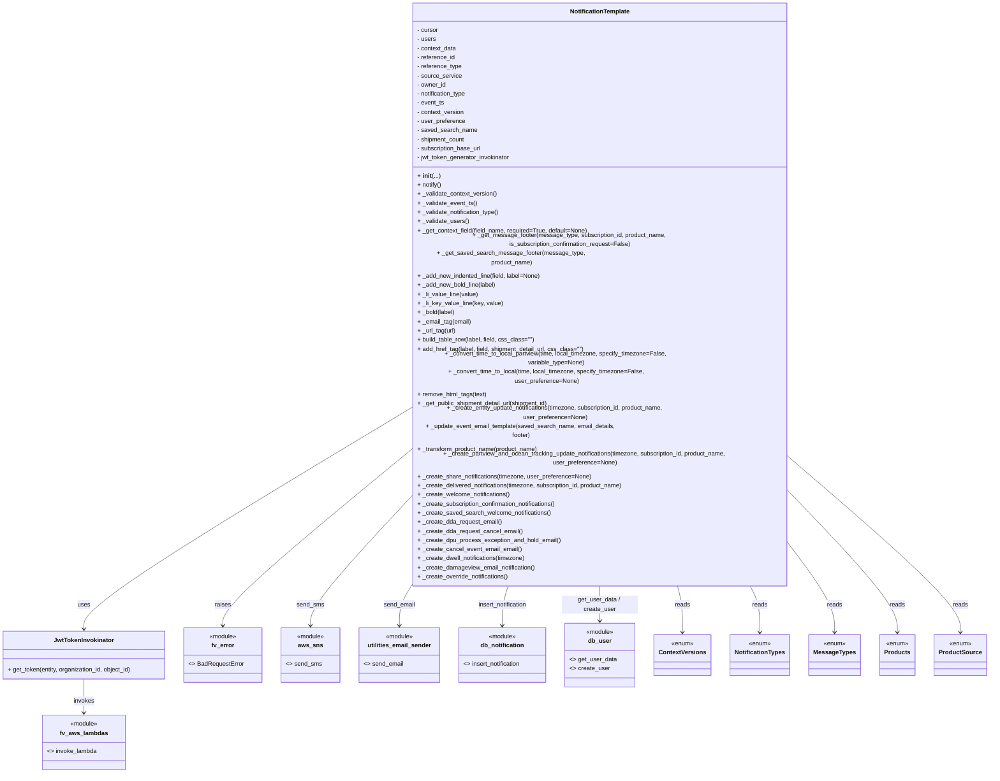

# Diagram: common/notification_service/notification_service/common/notification_templates.py

> Auto-generated by Obscura crawlers

## Mermaid

```mermaid
classDiagram
    class NotificationTemplate {
        - cursor
        - users
        - context_data
        - reference_id
        - reference_type
        - source_service
        - owner_id
        - notification_type
        - event_ts
        - context_version
        - user_preference
        - saved_search_name
        - shipment_count
        - subscription_base_url
        - jwt_token_generator_invokinator
        + __init__(...)
        + notify()
        + _validate_context_version()
        + _validate_event_ts()
        + _validate_notification_type()
        + _validate_users()
        + _get_context_field(field_name, required=True, default=None)
        + _get_message_footer(message_type, subscription_id, product_name, is_subscription_confirmation_request=False)
        + _get_saved_search_message_footer(message_type, product_name)
        + _add_new_indented_line(field, label=None)
        + _add_new_bold_line(label)
        + _li_value_line(value)
        + _li_key_value_line(key, value)
        + _bold(label)
        + _email_tag(email)
        + _url_tag(url)
        + build_table_row(label, field, css_class="")
        + add_href_tag(label, field, shipment_detail_url, css_class="")
        + _convert_time_to_local_partview(time, local_timezone, specify_timezone=False, variable_type=None)
        + _convert_time_to_local(time, local_timezone, specify_timezone=False, user_preference=None)
        + remove_html_tags(text)
        + _get_public_shipment_detail_url(shipment_id)
        + _create_entity_update_notifications(timezone, subscription_id, product_name, user_preference=None)
        + _update_event_email_template(saved_search_name, email_details, footer)
        + _transform_product_name(product_name)
        + _create_partview_and_ocean_tracking_update_notifications(timezone, subscription_id, product_name, user_preference=None)
        + _create_share_notifications(timezone, user_preference=None)
        + _create_delivered_notifications(timezone, subscription_id, product_name)
        + _create_welcome_notifications()
        + _create_subscription_confirmation_notifications()
        + _create_saved_search_welcome_notifications()
        + _create_dda_request_email()
        + _create_dda_request_cancel_email()
        + _create_dpu_process_exception_and_hold_email()
        + _create_cancel_event_email_email()
        + _create_dwell_notifications(timezone)
        + _create_damageview_email_notification()
        + _create_override_notifications()
    }

    class JwtTokenInvokinator {
        + get_token(entity, organization_id, object_id)
    }

    class fv_error <<module>> {
        <<uses>> BadRequestError
    }
    class fv_aws_lambdas <<module>> {
        <<uses>> invoke_lambda
    }
    class aws_sns <<module>> {
        <<uses>> send_sms
    }
    class utilities_email_sender <<module>> {
        <<uses>> send_email
    }
    class db_notification <<module>> {
        <<uses>> insert_notification
    }
    class db_user <<module>> {
        <<uses>> get_user_data
        <<uses>> create_user
    }
    class ContextVersions <<enum>>
    class NotificationTypes <<enum>>
    class MessageTypes <<enum>>
    class Products <<enum>>
    class ProductSource <<enum>>

    NotificationTemplate --> JwtTokenInvokinator : uses
    JwtTokenInvokinator --> fv_aws_lambdas : invokes
    NotificationTemplate --> utilities_email_sender : send_email
    NotificationTemplate --> aws_sns : send_sms
    NotificationTemplate --> db_notification : insert_notification
    NotificationTemplate --> db_user : get_user_data / create_user
    NotificationTemplate --> fv_error : raises
    NotificationTemplate --> ContextVersions : reads
    NotificationTemplate --> NotificationTypes : reads
    NotificationTemplate --> MessageTypes : reads
    NotificationTemplate --> Products : reads
    NotificationTemplate --> ProductSource : reads
```

> SVG rendering failed for this diagram.
