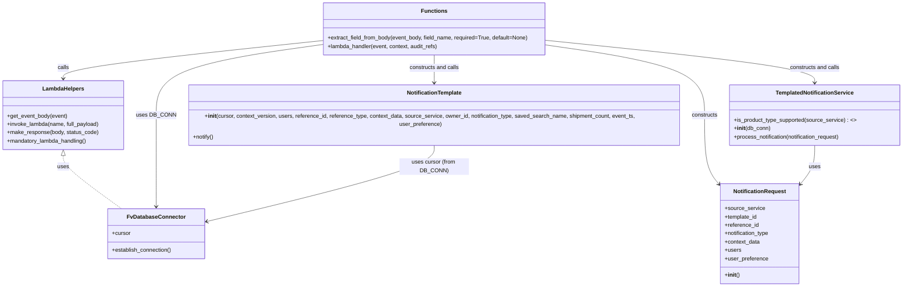

# Diagram: common/notification_service/notification_service/create_notification.py


> Auto-generated by Obscura crawlers

## Diagram 1

```mermaid
flowchart LR
    Start([Start: lambda_handler invoked]) --> EstablishDB[Establish DB connection DB_CONN.establish_connection()]
    EstablishDB --> GetCursor[Get cursor: cursor = DB_CONN.cursor]
    GetCursor --> ParseEvent[Parse event body: event_body = get_event_body(event)]
    ParseEvent --> ExtractFields[Extract fields via extract_field_from_body]
    ExtractFields --> InvokePref{Invoke user_preference lambda}
    InvokePref -->|success (<=300)| ParsePref[Parse user preference body]
    InvokePref -->|failure| PrefNone[Set user_preference = None]
    ParsePref --> CheckProduct[TemplatedNotificationService.is_product_type_supported(source_service)?]
    PrefNone --> CheckProduct
    CheckProduct -->|yes| BuildReq[Build NotificationRequest object]
    BuildReq --> ProcessTemplated[TemplatedNotificationService(DB_CONN).process_notification(request)]
    ProcessTemplated --> ReturnOK1[Return 200 OK]
    CheckProduct -->|no| BuildTemplate[Instantiate NotificationTemplate with context]
    BuildTemplate --> NotifyTemplate[template.notify()]
    NotifyTemplate --> ReturnOK2[Return 200 OK]
    ReturnOK1 --> End([End])
    ReturnOK2 --> End
```

> SVG rendering failed for this diagram.

## Diagram 2



### SVG

<svg id="container" width="2640.2890625" xmlns="http://www.w3.org/2000/svg" class="classDiagram" height="824" viewBox="0 0 2640.2890625 824" role="graphics-document document" aria-roledescription="class"><style>#container{font-family:"trebuchet ms",verdana,arial,sans-serif;font-size:16px;fill:#333;}@keyframes edge-animation-frame{from{stroke-dashoffset:0;}}@keyframes dash{to{stroke-dashoffset:0;}}#container .edge-animation-slow{stroke-dasharray:9,5!important;stroke-dashoffset:900;animation:dash 50s linear infinite;stroke-linecap:round;}#container .edge-animation-fast{stroke-dasharray:9,5!important;stroke-dashoffset:900;animation:dash 20s linear infinite;stroke-linecap:round;}#container .error-icon{fill:#552222;}#container .error-text{fill:#552222;stroke:#552222;}#container .edge-thickness-normal{stroke-width:1px;}#container .edge-thickness-thick{stroke-width:3.5px;}#container .edge-pattern-solid{stroke-dasharray:0;}#container .edge-thickness-invisible{stroke-width:0;fill:none;}#container .edge-pattern-dashed{stroke-dasharray:3;}#container .edge-pattern-dotted{stroke-dasharray:2;}#container .marker{fill:#333333;stroke:#333333;}#container .marker.cross{stroke:#333333;}#container svg{font-family:"trebuchet ms",verdana,arial,sans-serif;font-size:16px;}#container p{margin:0;}#container g.classGroup text{fill:#9370DB;stroke:none;font-family:"trebuchet ms",verdana,arial,sans-serif;font-size:10px;}#container g.classGroup text .title{font-weight:bolder;}#container .nodeLabel,#container .edgeLabel{color:#131300;}#container .edgeLabel .label rect{fill:#ECECFF;}#container .label text{fill:#131300;}#container .labelBkg{background:#ECECFF;}#container .edgeLabel .label span{background:#ECECFF;}#container .classTitle{font-weight:bolder;}#container .node rect,#container .node circle,#container .node ellipse,#container .node polygon,#container .node path{fill:#ECECFF;stroke:#9370DB;stroke-width:1px;}#container .divider{stroke:#9370DB;stroke-width:1;}#container g.clickable{cursor:pointer;}#container g.classGroup rect{fill:#ECECFF;stroke:#9370DB;}#container g.classGroup line{stroke:#9370DB;stroke-width:1;}#container .classLabel .box{stroke:none;stroke-width:0;fill:#ECECFF;opacity:0.5;}#container .classLabel .label{fill:#9370DB;font-size:10px;}#container .relation{stroke:#333333;stroke-width:1;fill:none;}#container .dashed-line{stroke-dasharray:3;}#container .dotted-line{stroke-dasharray:1 2;}#container #compositionStart,#container .composition{fill:#333333!important;stroke:#333333!important;stroke-width:1;}#container #compositionEnd,#container .composition{fill:#333333!important;stroke:#333333!important;stroke-width:1;}#container #dependencyStart,#container .dependency{fill:#333333!important;stroke:#333333!important;stroke-width:1;}#container #dependencyStart,#container .dependency{fill:#333333!important;stroke:#333333!important;stroke-width:1;}#container #extensionStart,#container .extension{fill:transparent!important;stroke:#333333!important;stroke-width:1;}#container #extensionEnd,#container .extension{fill:transparent!important;stroke:#333333!important;stroke-width:1;}#container #aggregationStart,#container .aggregation{fill:transparent!important;stroke:#333333!important;stroke-width:1;}#container #aggregationEnd,#container .aggregation{fill:transparent!important;stroke:#333333!important;stroke-width:1;}#container #lollipopStart,#container .lollipop{fill:#ECECFF!important;stroke:#333333!important;stroke-width:1;}#container #lollipopEnd,#container .lollipop{fill:#ECECFF!important;stroke:#333333!important;stroke-width:1;}#container .edgeTerminals{font-size:11px;line-height:initial;}#container .classTitleText{text-anchor:middle;font-size:18px;fill:#333;}#container .label-icon{display:inline-block;height:1em;overflow:visible;vertical-align:-0.125em;}#container .node .label-icon path{fill:currentColor;stroke:revert;stroke-width:revert;}#container :root{--mermaid-font-family:"trebuchet ms",verdana,arial,sans-serif;}</style><g><defs><marker id="container_class-aggregationStart" class="marker aggregation class" refX="18" refY="7" markerWidth="190" markerHeight="240" orient="auto"><path d="M 18,7 L9,13 L1,7 L9,1 Z"></path></marker></defs><defs><marker id="container_class-aggregationEnd" class="marker aggregation class" refX="1" refY="7" markerWidth="20" markerHeight="28" orient="auto"><path d="M 18,7 L9,13 L1,7 L9,1 Z"></path></marker></defs><defs><marker id="container_class-extensionStart" class="marker extension class" refX="18" refY="7" markerWidth="190" markerHeight="240" orient="auto"><path d="M 1,7 L18,13 V 1 Z"></path></marker></defs><defs><marker id="container_class-extensionEnd" class="marker extension class" refX="1" refY="7" markerWidth="20" markerHeight="28" orient="auto"><path d="M 1,1 V 13 L18,7 Z"></path></marker></defs><defs><marker id="container_class-compositionStart" class="marker composition class" refX="18" refY="7" markerWidth="190" markerHeight="240" orient="auto"><path d="M 18,7 L9,13 L1,7 L9,1 Z"></path></marker></defs><defs><marker id="container_class-compositionEnd" class="marker composition class" refX="1" refY="7" markerWidth="20" markerHeight="28" orient="auto"><path d="M 18,7 L9,13 L1,7 L9,1 Z"></path></marker></defs><defs><marker id="container_class-dependencyStart" class="marker dependency class" refX="6" refY="7" markerWidth="190" markerHeight="240" orient="auto"><path d="M 5,7 L9,13 L1,7 L9,1 Z"></path></marker></defs><defs><marker id="container_class-dependencyEnd" class="marker dependency class" refX="13" refY="7" markerWidth="20" markerHeight="28" orient="auto"><path d="M 18,7 L9,13 L14,7 L9,1 Z"></path></marker></defs><defs><marker id="container_class-lollipopStart" class="marker lollipop class" refX="13" refY="7" markerWidth="190" markerHeight="240" orient="auto"><circle stroke="black" fill="transparent" cx="7" cy="7" r="6"></circle></marker></defs><defs><marker id="container_class-lollipopEnd" class="marker lollipop class" refX="1" refY="7" markerWidth="190" markerHeight="240" orient="auto"><circle stroke="black" fill="transparent" cx="7" cy="7" r="6"></circle></marker></defs><g class="root"><g class="clusters"></g><g class="edgePaths"><path d="M182.328,447.25L182.328,452.542C182.328,457.833,182.328,468.417,209.749,493.875C237.169,519.333,292.01,559.667,319.431,579.833L346.852,600" id="id_LambdaHelpers_FvDatabaseConnector_1" class="edge-thickness-normal edge-pattern-dashed relation" style=";;;" data-edge="true" data-et="edge" data-id="id_LambdaHelpers_FvDatabaseConnector_1" data-points="W3sieCI6MTgyLjMyODEyNSwieSI6NDMwfSx7IngiOjE4Mi4zMjgxMjUsInkiOjQ3OX0seyJ4IjozNDYuODUxNjgzOTM3ODIzODUsInkiOjYwMH1d" marker-start="url(#container_class-extensionStart)"></path><path d="M945.418,126.807L861.973,138.173C778.529,149.538,611.639,172.269,528.195,206.301C444.75,240.333,444.75,285.667,444.75,333C444.75,380.333,444.75,429.667,444.75,473.5C444.75,517.333,444.75,555.667,444.75,574.833L444.75,594" id="id_Functions_FvDatabaseConnector_2" class="edge-thickness-normal edge-pattern-solid relation" style=";;;" data-edge="true" data-et="edge" data-id="id_Functions_FvDatabaseConnector_2" data-points="W3sieCI6OTQ1LjQxNzk2ODc1LCJ5IjoxMjYuODA3MDk1MjE3MjgzOX0seyJ4Ijo0NDQuNzUsInkiOjE5NX0seyJ4Ijo0NDQuNzUsInkiOjMzMX0seyJ4Ijo0NDQuNzUsInkiOjQ3OX0seyJ4Ijo0NDQuNzUsInkiOjYwMH1d" marker-end="url(#container_class-dependencyEnd)"></path><path d="M945.418,116.209L818.236,129.341C691.055,142.473,436.691,168.736,309.51,187.035C182.328,205.333,182.328,215.667,182.328,220.833L182.328,226" id="id_Functions_LambdaHelpers_3" class="edge-thickness-normal edge-pattern-solid relation" style=";;;" data-edge="true" data-et="edge" data-id="id_Functions_LambdaHelpers_3" data-points="W3sieCI6OTQ1LjQxNzk2ODc1LCJ5IjoxMTYuMjA5MDExNTUyNTMzNzh9LHsieCI6MTgyLjMyODEyNSwieSI6MTk1fSx7IngiOjE4Mi4zMjgxMjUsInkiOjIzMn1d" marker-end="url(#container_class-dependencyEnd)"></path><path d="M1588.676,127.635L1669.579,138.862C1750.482,150.09,1912.288,172.545,1993.191,206.439C2074.094,240.333,2074.094,285.667,2074.094,333C2074.094,380.333,2074.094,429.667,2080.75,462.477C2087.407,495.287,2100.72,511.574,2107.376,519.717L2114.033,527.861" id="id_Functions_NotificationRequest_4" class="edge-thickness-normal edge-pattern-solid relation" style=";;;" data-edge="true" data-et="edge" data-id="id_Functions_NotificationRequest_4" data-points="W3sieCI6MTU4OC42NzU3ODEyNSwieSI6MTI3LjYzNDg3NjM4MTg3MDY0fSx7IngiOjIwNzQuMDkzNzUsInkiOjE5NX0seyJ4IjoyMDc0LjA5Mzc1LCJ5IjozMzF9LHsieCI6MjA3NC4wOTM3NSwieSI6NDc5fSx7IngiOjIxMTcuODMwMDc4MTI1LCJ5Ijo1MzIuNTA2MTA5NzE0ODh9XQ==" marker-end="url(#container_class-dependencyEnd)"></path><path d="M1588.676,115.089L1722.165,128.408C1855.655,141.726,2122.634,168.363,2256.124,188.848C2389.613,209.333,2389.613,223.667,2389.613,230.833L2389.613,238" id="id_Functions_TemplatedNotificationService_5" class="edge-thickness-normal edge-pattern-solid relation" style=";;;" data-edge="true" data-et="edge" data-id="id_Functions_TemplatedNotificationService_5" data-points="W3sieCI6MTU4OC42NzU3ODEyNSwieSI6MTE1LjA4OTM1OTk2OTY1NjU4fSx7IngiOjIzODkuNjEzMjgxMjUsInkiOjE5NX0seyJ4IjoyMzg5LjYxMzI4MTI1LCJ5IjoyNDR9XQ==" marker-end="url(#container_class-dependencyEnd)"></path><path d="M1267.047,158L1267.047,164.167C1267.047,170.333,1267.047,182.667,1267.047,198C1267.047,213.333,1267.047,231.667,1267.047,240.833L1267.047,250" id="id_Functions_NotificationTemplate_6" class="edge-thickness-normal edge-pattern-solid relation" style=";;;" data-edge="true" data-et="edge" data-id="id_Functions_NotificationTemplate_6" data-points="W3sieCI6MTI2Ny4wNDY4NzUsInkiOjE1OH0seyJ4IjoxMjY3LjA0Njg3NSwieSI6MTk1fSx7IngiOjEyNjcuMDQ2ODc1LCJ5IjoyNTZ9XQ==" marker-end="url(#container_class-dependencyEnd)"></path><path d="M2389.613,418L2389.613,428.167C2389.613,438.333,2389.613,458.667,2382.957,476.977C2376.3,495.287,2362.987,511.574,2356.331,519.717L2349.674,527.861" id="id_TemplatedNotificationService_NotificationRequest_7" class="edge-thickness-normal edge-pattern-solid relation" style=";;;" data-edge="true" data-et="edge" data-id="id_TemplatedNotificationService_NotificationRequest_7" data-points="W3sieCI6MjM4OS42MTMyODEyNSwieSI6NDE4fSx7IngiOjIzODkuNjEzMjgxMjUsInkiOjQ3OX0seyJ4IjoyMzQ1Ljg3Njk1MzEyNSwieSI6NTMyLjUwNjEwOTcxNDg4fV0=" marker-end="url(#container_class-dependencyEnd)"></path><path d="M1267.047,406L1267.047,418.167C1267.047,430.333,1267.047,454.667,1154.018,493.362C1040.99,532.057,814.933,585.115,701.905,611.644L588.876,638.172" id="id_NotificationTemplate_FvDatabaseConnector_8" class="edge-thickness-normal edge-pattern-solid relation" style=";;;" data-edge="true" data-et="edge" data-id="id_NotificationTemplate_FvDatabaseConnector_8" data-points="W3sieCI6MTI2Ny4wNDY4NzUsInkiOjQwNn0seyJ4IjoxMjY3LjA0Njg3NSwieSI6NDc5fSx7IngiOjU4My4wMzUxNTYyNSwieSI6NjM5LjU0MzMwOTUxNzkyOH1d" marker-end="url(#container_class-dependencyEnd)"></path></g><g class="edgeLabels"><g class="edgeLabel" transform="translate(182.328125, 479)"><g class="label" data-id="id_LambdaHelpers_FvDatabaseConnector_1" transform="translate(-16.4921875, -12)"><foreignObject width="32.984375" height="24"><div xmlns="http://www.w3.org/1999/xhtml" class="labelBkg" style="display: table-cell; white-space: nowrap; line-height: 1.5; max-width: 200px; text-align: center;"><span class="edgeLabel"><p>uses</p></span></div></foreignObject></g></g><g class="edgeLabel" transform="translate(444.75, 331)"><g class="label" data-id="id_Functions_FvDatabaseConnector_2" transform="translate(-53.09375, -12)"><foreignObject width="106.1875" height="24"><div xmlns="http://www.w3.org/1999/xhtml" class="labelBkg" style="display: table-cell; white-space: nowrap; line-height: 1.5; max-width: 200px; text-align: center;"><span class="edgeLabel"><p>uses DB_CONN</p></span></div></foreignObject></g></g><g class="edgeLabel" transform="translate(182.328125, 195)"><g class="label" data-id="id_Functions_LambdaHelpers_3" transform="translate(-16.4453125, -12)"><foreignObject width="32.890625" height="24"><div xmlns="http://www.w3.org/1999/xhtml" class="labelBkg" style="display: table-cell; white-space: nowrap; line-height: 1.5; max-width: 200px; text-align: center;"><span class="edgeLabel"><p>calls</p></span></div></foreignObject></g></g><g class="edgeLabel" transform="translate(2074.09375, 331)"><g class="label" data-id="id_Functions_NotificationRequest_4" transform="translate(-37.84375, -12)"><foreignObject width="75.6875" height="24"><div xmlns="http://www.w3.org/1999/xhtml" class="labelBkg" style="display: table-cell; white-space: nowrap; line-height: 1.5; max-width: 200px; text-align: center;"><span class="edgeLabel"><p>constructs</p></span></div></foreignObject></g></g><g class="edgeLabel" transform="translate(2389.61328125, 195)"><g class="label" data-id="id_Functions_TemplatedNotificationService_5" transform="translate(-72.3515625, -12)"><foreignObject width="144.703125" height="24"><div xmlns="http://www.w3.org/1999/xhtml" class="labelBkg" style="display: table-cell; white-space: nowrap; line-height: 1.5; max-width: 200px; text-align: center;"><span class="edgeLabel"><p>constructs and calls</p></span></div></foreignObject></g></g><g class="edgeLabel" transform="translate(1267.046875, 195)"><g class="label" data-id="id_Functions_NotificationTemplate_6" transform="translate(-72.3515625, -12)"><foreignObject width="144.703125" height="24"><div xmlns="http://www.w3.org/1999/xhtml" class="labelBkg" style="display: table-cell; white-space: nowrap; line-height: 1.5; max-width: 200px; text-align: center;"><span class="edgeLabel"><p>constructs and calls</p></span></div></foreignObject></g></g><g class="edgeLabel" transform="translate(2389.61328125, 479)"><g class="label" data-id="id_TemplatedNotificationService_NotificationRequest_7" transform="translate(-16.4921875, -12)"><foreignObject width="32.984375" height="24"><div xmlns="http://www.w3.org/1999/xhtml" class="labelBkg" style="display: table-cell; white-space: nowrap; line-height: 1.5; max-width: 200px; text-align: center;"><span class="edgeLabel"><p>uses</p></span></div></foreignObject></g></g><g class="edgeLabel" transform="translate(1267.046875, 479)"><g class="label" data-id="id_NotificationTemplate_FvDatabaseConnector_8" transform="translate(-100, -24)"><foreignObject width="200" height="48"><div xmlns="http://www.w3.org/1999/xhtml" class="labelBkg" style="display: table; white-space: break-spaces; line-height: 1.5; max-width: 200px; text-align: center; width: 200px;"><span class="edgeLabel"><p>uses cursor (from DB_CONN)</p></span></div></foreignObject></g></g></g><g class="nodes"><g class="node default" id="classId-FvDatabaseConnector-0" transform="translate(444.75, 672)"><g class="basic label-container"><path d="M-138.28515625 -72 L138.28515625 -72 L138.28515625 72 L-138.28515625 72" stroke="none" stroke-width="0" fill="#ECECFF" style=""></path><path d="M-138.28515625 -72 C-72.52539684950737 -72, -6.765637449014747 -72, 138.28515625 -72 M-138.28515625 -72 C-31.92036575103863 -72, 74.44442474792274 -72, 138.28515625 -72 M138.28515625 -72 C138.28515625 -17.053320494489014, 138.28515625 37.89335901102197, 138.28515625 72 M138.28515625 -72 C138.28515625 -15.794555451971164, 138.28515625 40.41088909605767, 138.28515625 72 M138.28515625 72 C77.16309366270141 72, 16.04103107540284 72, -138.28515625 72 M138.28515625 72 C66.9763371884663 72, -4.332481873067394 72, -138.28515625 72 M-138.28515625 72 C-138.28515625 19.07876350552325, -138.28515625 -33.8424729889535, -138.28515625 -72 M-138.28515625 72 C-138.28515625 35.62821692886086, -138.28515625 -0.7435661422782829, -138.28515625 -72" stroke="#9370DB" stroke-width="1.3" fill="none" stroke-dasharray="0 0" style=""></path></g><g class="annotation-group text" transform="translate(0, -48)"></g><g class="label-group text" transform="translate(-79.3046875, -48)"><g class="label" style="font-weight: bolder" transform="translate(0,-12)"><foreignObject width="158.609375" height="24"><div xmlns="http://www.w3.org/1999/xhtml" style="display: table-cell; white-space: nowrap; line-height: 1.5; max-width: 207px; text-align: center;"><span class="nodeLabel markdown-node-label" style=""><p>FvDatabaseConnector</p></span></div></foreignObject></g></g><g class="members-group text" transform="translate(-126.28515625, 0)"><g class="label" style="" transform="translate(0,-12)"><foreignObject width="53.71875" height="24"><div xmlns="http://www.w3.org/1999/xhtml" style="display: table-cell; white-space: nowrap; line-height: 1.5; max-width: 112px; text-align: center;"><span class="nodeLabel markdown-node-label" style=""><p>+cursor</p></span></div></foreignObject></g></g><g class="methods-group text" transform="translate(-126.28515625, 48)"><g class="label" style="" transform="translate(0,-12)"><foreignObject width="173.265625" height="24"><div xmlns="http://www.w3.org/1999/xhtml" style="display: table-cell; white-space: nowrap; line-height: 1.5; max-width: 231px; text-align: center;"><span class="nodeLabel markdown-node-label" style=""><p>+establish_connection()</p></span></div></foreignObject></g></g><g class="divider" style=""><path d="M-138.28515625 -24 C-60.26344198963487 -24, 17.75827227073026 -24, 138.28515625 -24 M-138.28515625 -24 C-59.9453651153905 -24, 18.394426019218997 -24, 138.28515625 -24" stroke="#9370DB" stroke-width="1.3" fill="none" stroke-dasharray="0 0" style=""></path></g><g class="divider" style=""><path d="M-138.28515625 24 C-69.39968748329738 24, -0.5142187165947689 24, 138.28515625 24 M-138.28515625 24 C-75.02669321357412 24, -11.76823017714824 24, 138.28515625 24" stroke="#9370DB" stroke-width="1.3" fill="none" stroke-dasharray="0 0" style=""></path></g></g><g class="node default" id="classId-NotificationRequest-1" transform="translate(2231.853515625, 672)"><g class="basic label-container"><path d="M-114.0234375 -144 L114.0234375 -144 L114.0234375 144 L-114.0234375 144" stroke="none" stroke-width="0" fill="#ECECFF" style=""></path><path d="M-114.0234375 -144 C-68.18743270819496 -144, -22.351427916389937 -144, 114.0234375 -144 M-114.0234375 -144 C-50.445438688776896 -144, 13.132560122446208 -144, 114.0234375 -144 M114.0234375 -144 C114.0234375 -37.281772627501255, 114.0234375 69.43645474499749, 114.0234375 144 M114.0234375 -144 C114.0234375 -59.034852650310214, 114.0234375 25.930294699379573, 114.0234375 144 M114.0234375 144 C30.039691550004534 144, -53.94405439999093 144, -114.0234375 144 M114.0234375 144 C29.3863737752896 144, -55.2506899494208 144, -114.0234375 144 M-114.0234375 144 C-114.0234375 72.45979815608823, -114.0234375 0.9195963121764521, -114.0234375 -144 M-114.0234375 144 C-114.0234375 67.35429771087941, -114.0234375 -9.291404578241185, -114.0234375 -144" stroke="#9370DB" stroke-width="1.3" fill="none" stroke-dasharray="0 0" style=""></path></g><g class="annotation-group text" transform="translate(0, -120)"></g><g class="label-group text" transform="translate(-72.859375, -120)"><g class="label" style="font-weight: bolder" transform="translate(0,-12)"><foreignObject width="145.71875" height="24"><div xmlns="http://www.w3.org/1999/xhtml" style="display: table-cell; white-space: nowrap; line-height: 1.5; max-width: 194px; text-align: center;"><span class="nodeLabel markdown-node-label" style=""><p>NotificationRequest</p></span></div></foreignObject></g></g><g class="members-group text" transform="translate(-102.0234375, -72)"><g class="label" style="" transform="translate(0,-12)"><foreignObject width="114.65625" height="24"><div xmlns="http://www.w3.org/1999/xhtml" style="display: table-cell; white-space: nowrap; line-height: 1.5; max-width: 172px; text-align: center;"><span class="nodeLabel markdown-node-label" style=""><p>+source_service</p></span></div></foreignObject></g><g class="label" style="" transform="translate(0,12)"><foreignObject width="95.03125" height="24"><div xmlns="http://www.w3.org/1999/xhtml" style="display: table-cell; white-space: nowrap; line-height: 1.5; max-width: 152px; text-align: center;"><span class="nodeLabel markdown-node-label" style=""><p>+template_id</p></span></div></foreignObject></g><g class="label" style="" transform="translate(0,36)"><foreignObject width="98.25" height="24"><div xmlns="http://www.w3.org/1999/xhtml" style="display: table-cell; white-space: nowrap; line-height: 1.5; max-width: 156px; text-align: center;"><span class="nodeLabel markdown-node-label" style=""><p>+reference_id</p></span></div></foreignObject></g><g class="label" style="" transform="translate(0,60)"><foreignObject width="131.1875" height="24"><div xmlns="http://www.w3.org/1999/xhtml" style="display: table-cell; white-space: nowrap; line-height: 1.5; max-width: 189px; text-align: center;"><span class="nodeLabel markdown-node-label" style=""><p>+notification_type</p></span></div></foreignObject></g><g class="label" style="" transform="translate(0,84)"><foreignObject width="102.328125" height="24"><div xmlns="http://www.w3.org/1999/xhtml" style="display: table-cell; white-space: nowrap; line-height: 1.5; max-width: 160px; text-align: center;"><span class="nodeLabel markdown-node-label" style=""><p>+context_data</p></span></div></foreignObject></g><g class="label" style="" transform="translate(0,108)"><foreignObject width="46.90625" height="24"><div xmlns="http://www.w3.org/1999/xhtml" style="display: table-cell; white-space: nowrap; line-height: 1.5; max-width: 104px; text-align: center;"><span class="nodeLabel markdown-node-label" style=""><p>+users</p></span></div></foreignObject></g><g class="label" style="" transform="translate(0,132)"><foreignObject width="124.390625" height="24"><div xmlns="http://www.w3.org/1999/xhtml" style="display: table-cell; white-space: nowrap; line-height: 1.5; max-width: 182px; text-align: center;"><span class="nodeLabel markdown-node-label" style=""><p>+user_preference</p></span></div></foreignObject></g></g><g class="methods-group text" transform="translate(-102.0234375, 120)"><g class="label" style="" transform="translate(0,-12)"><foreignObject width="42.796875" height="24"><div xmlns="http://www.w3.org/1999/xhtml" style="display: table-cell; white-space: nowrap; line-height: 1.5; max-width: 132px; text-align: center;"><span class="nodeLabel markdown-node-label" style=""><p>+<strong>init</strong>()</p></span></div></foreignObject></g></g><g class="divider" style=""><path d="M-114.0234375 -96 C-33.68532710092322 -96, 46.652783298153565 -96, 114.0234375 -96 M-114.0234375 -96 C-37.077265148018896 -96, 39.86890720396221 -96, 114.0234375 -96" stroke="#9370DB" stroke-width="1.3" fill="none" stroke-dasharray="0 0" style=""></path></g><g class="divider" style=""><path d="M-114.0234375 96 C-23.42135842335169 96, 67.18072065329662 96, 114.0234375 96 M-114.0234375 96 C-43.75647490615333 96, 26.51048768769334 96, 114.0234375 96" stroke="#9370DB" stroke-width="1.3" fill="none" stroke-dasharray="0 0" style=""></path></g></g><g class="node default" id="classId-TemplatedNotificationService-2" transform="translate(2389.61328125, 331)"><g class="basic label-container"><path d="M-242.67578125 -87 L242.67578125 -87 L242.67578125 87 L-242.67578125 87" stroke="none" stroke-width="0" fill="#ECECFF" style=""></path><path d="M-242.67578125 -87 C-135.87418427512617 -87, -29.072587300252337 -87, 242.67578125 -87 M-242.67578125 -87 C-131.75295903931652 -87, -20.830136828633016 -87, 242.67578125 -87 M242.67578125 -87 C242.67578125 -45.3003682111184, 242.67578125 -3.600736422236807, 242.67578125 87 M242.67578125 -87 C242.67578125 -41.29041853411871, 242.67578125 4.419162931762585, 242.67578125 87 M242.67578125 87 C80.92776881132846 87, -80.82024362734307 87, -242.67578125 87 M242.67578125 87 C95.91407116258065 87, -50.84763892483869 87, -242.67578125 87 M-242.67578125 87 C-242.67578125 43.345102811812765, -242.67578125 -0.3097943763744695, -242.67578125 -87 M-242.67578125 87 C-242.67578125 22.48874816852289, -242.67578125 -42.02250366295422, -242.67578125 -87" stroke="#9370DB" stroke-width="1.3" fill="none" stroke-dasharray="0 0" style=""></path></g><g class="annotation-group text" transform="translate(0, -63)"></g><g class="label-group text" transform="translate(-108.2421875, -63)"><g class="label" style="font-weight: bolder" transform="translate(0,-12)"><foreignObject width="216.484375" height="24"><div xmlns="http://www.w3.org/1999/xhtml" style="display: table-cell; white-space: nowrap; line-height: 1.5; max-width: 263px; text-align: center;"><span class="nodeLabel markdown-node-label" style=""><p>TemplatedNotificationService</p></span></div></foreignObject></g></g><g class="members-group text" transform="translate(-230.67578125, -15)"></g><g class="methods-group text" transform="translate(-230.67578125, 15)"><g class="label" style="" transform="translate(0,-12)"><foreignObject width="353.109375" height="24"><div xmlns="http://www.w3.org/1999/xhtml" style="display: table-cell; white-space: nowrap; line-height: 1.5; max-width: 450px; text-align: center;"><span class="nodeLabel markdown-node-label" style=""><p>+is_product_type_supported(source_service) : &lt;&gt;</p></span></div></foreignObject></g><g class="label" style="" transform="translate(0,12)"><foreignObject width="104.96875" height="24"><div xmlns="http://www.w3.org/1999/xhtml" style="display: table-cell; white-space: nowrap; line-height: 1.5; max-width: 194px; text-align: center;"><span class="nodeLabel markdown-node-label" style=""><p>+<strong>init</strong>(db_conn)</p></span></div></foreignObject></g><g class="label" style="" transform="translate(0,36)"><foreignObject width="312.140625" height="24"><div xmlns="http://www.w3.org/1999/xhtml" style="display: table-cell; white-space: nowrap; line-height: 1.5; max-width: 370px; text-align: center;"><span class="nodeLabel markdown-node-label" style=""><p>+process_notification(notification_request)</p></span></div></foreignObject></g></g><g class="divider" style=""><path d="M-242.67578125 -39 C-118.46425190483832 -39, 5.747277440323359 -39, 242.67578125 -39 M-242.67578125 -39 C-82.50549726406845 -39, 77.6647867218631 -39, 242.67578125 -39" stroke="#9370DB" stroke-width="1.3" fill="none" stroke-dasharray="0 0" style=""></path></g><g class="divider" style=""><path d="M-242.67578125 -15 C-135.01612140988982 -15, -27.35646156977967 -15, 242.67578125 -15 M-242.67578125 -15 C-86.60685374311689 -15, 69.46207376376623 -15, 242.67578125 -15" stroke="#9370DB" stroke-width="1.3" fill="none" stroke-dasharray="0 0" style=""></path></g></g><g class="node default" id="classId-NotificationTemplate-3" transform="translate(1267.046875, 331)"><g class="basic label-container"><path d="M-734.203125 -75 L734.203125 -75 L734.203125 75 L-734.203125 75" stroke="none" stroke-width="0" fill="#ECECFF" style=""></path><path d="M-734.203125 -75 C-385.60182058425187 -75, -37.00051616850374 -75, 734.203125 -75 M-734.203125 -75 C-242.17777282318332 -75, 249.84757935363336 -75, 734.203125 -75 M734.203125 -75 C734.203125 -21.56946053588134, 734.203125 31.86107892823732, 734.203125 75 M734.203125 -75 C734.203125 -34.82052732097106, 734.203125 5.3589453580578805, 734.203125 75 M734.203125 75 C319.0809748042749 75, -96.04117539145022 75, -734.203125 75 M734.203125 75 C350.7796818355251 75, -32.643761328949836 75, -734.203125 75 M-734.203125 75 C-734.203125 34.79588055661996, -734.203125 -5.408238886760074, -734.203125 -75 M-734.203125 75 C-734.203125 16.49172081010039, -734.203125 -42.01655837979922, -734.203125 -75" stroke="#9370DB" stroke-width="1.3" fill="none" stroke-dasharray="0 0" style=""></path></g><g class="annotation-group text" transform="translate(0, -51)"></g><g class="label-group text" transform="translate(-76.796875, -51)"><g class="label" style="font-weight: bolder" transform="translate(0,-12)"><foreignObject width="153.59375" height="24"><div xmlns="http://www.w3.org/1999/xhtml" style="display: table-cell; white-space: nowrap; line-height: 1.5; max-width: 202px; text-align: center;"><span class="nodeLabel markdown-node-label" style=""><p>NotificationTemplate</p></span></div></foreignObject></g></g><g class="members-group text" transform="translate(-722.203125, -3)"></g><g class="methods-group text" transform="translate(-722.203125, 27)"><g class="label" style="" transform="translate(0,-12)"><foreignObject width="1367.609375" height="24"><div xmlns="http://www.w3.org/1999/xhtml" style="display: table-cell; white-space: nowrap; line-height: 1.5; max-width: 1456px; text-align: center;"><span class="nodeLabel markdown-node-label" style=""><p>+<strong>init</strong>(cursor, context_version, users, reference_id, reference_type, context_data, source_service, owner_id, notification_type, saved_search_name, shipment_count, event_ts, user_preference)</p></span></div></foreignObject></g><g class="label" style="" transform="translate(0,12)"><foreignObject width="60.59375" height="24"><div xmlns="http://www.w3.org/1999/xhtml" style="display: table-cell; white-space: nowrap; line-height: 1.5; max-width: 118px; text-align: center;"><span class="nodeLabel markdown-node-label" style=""><p>+notify()</p></span></div></foreignObject></g></g><g class="divider" style=""><path d="M-734.203125 -27 C-247.29608519328946 -27, 239.6109546134211 -27, 734.203125 -27 M-734.203125 -27 C-347.83742396110165 -27, 38.5282770777967 -27, 734.203125 -27" stroke="#9370DB" stroke-width="1.3" fill="none" stroke-dasharray="0 0" style=""></path></g><g class="divider" style=""><path d="M-734.203125 -3 C-253.32665958405653 -3, 227.54980583188694 -3, 734.203125 -3 M-734.203125 -3 C-376.64678094781124 -3, -19.090436895622474 -3, 734.203125 -3" stroke="#9370DB" stroke-width="1.3" fill="none" stroke-dasharray="0 0" style=""></path></g></g><g class="node default" id="classId-LambdaHelpers-4" transform="translate(182.328125, 331)"><g class="basic label-container"><path d="M-174.328125 -99 L174.328125 -99 L174.328125 99 L-174.328125 99" stroke="none" stroke-width="0" fill="#ECECFF" style=""></path><path d="M-174.328125 -99 C-66.95529863436633 -99, 40.41752773126734 -99, 174.328125 -99 M-174.328125 -99 C-51.414230536776856 -99, 71.49966392644629 -99, 174.328125 -99 M174.328125 -99 C174.328125 -31.178921702068976, 174.328125 36.64215659586205, 174.328125 99 M174.328125 -99 C174.328125 -54.30071957296477, 174.328125 -9.601439145929547, 174.328125 99 M174.328125 99 C37.624157091264834 99, -99.07981081747033 99, -174.328125 99 M174.328125 99 C39.852827039772166 99, -94.62247092045567 99, -174.328125 99 M-174.328125 99 C-174.328125 24.261820393994967, -174.328125 -50.47635921201007, -174.328125 -99 M-174.328125 99 C-174.328125 52.64894234313487, -174.328125 6.2978846862697395, -174.328125 -99" stroke="#9370DB" stroke-width="1.3" fill="none" stroke-dasharray="0 0" style=""></path></g><g class="annotation-group text" transform="translate(0, -75)"></g><g class="label-group text" transform="translate(-57.421875, -75)"><g class="label" style="font-weight: bolder" transform="translate(0,-12)"><foreignObject width="114.84375" height="24"><div xmlns="http://www.w3.org/1999/xhtml" style="display: table-cell; white-space: nowrap; line-height: 1.5; max-width: 164px; text-align: center;"><span class="nodeLabel markdown-node-label" style=""><p>LambdaHelpers</p></span></div></foreignObject></g></g><g class="members-group text" transform="translate(-162.328125, -27)"></g><g class="methods-group text" transform="translate(-162.328125, 3)"><g class="label" style="" transform="translate(0,-12)"><foreignObject width="174.203125" height="24"><div xmlns="http://www.w3.org/1999/xhtml" style="display: table-cell; white-space: nowrap; line-height: 1.5; max-width: 232px; text-align: center;"><span class="nodeLabel markdown-node-label" style=""><p>+get_event_body(event)</p></span></div></foreignObject></g><g class="label" style="" transform="translate(0,12)"><foreignObject width="267.234375" height="24"><div xmlns="http://www.w3.org/1999/xhtml" style="display: table-cell; white-space: nowrap; line-height: 1.5; max-width: 325px; text-align: center;"><span class="nodeLabel markdown-node-label" style=""><p>+invoke_lambda(name, full_payload)</p></span></div></foreignObject></g><g class="label" style="" transform="translate(0,36)"><foreignObject width="262.609375" height="24"><div xmlns="http://www.w3.org/1999/xhtml" style="display: table-cell; white-space: nowrap; line-height: 1.5; max-width: 320px; text-align: center;"><span class="nodeLabel markdown-node-label" style=""><p>+make_response(body, status_code)</p></span></div></foreignObject></g><g class="label" style="" transform="translate(0,60)"><foreignObject width="232.078125" height="24"><div xmlns="http://www.w3.org/1999/xhtml" style="display: table-cell; white-space: nowrap; line-height: 1.5; max-width: 289px; text-align: center;"><span class="nodeLabel markdown-node-label" style=""><p>+mandatory_lambda_handling()</p></span></div></foreignObject></g></g><g class="divider" style=""><path d="M-174.328125 -51 C-68.49422421358543 -51, 37.33967657282915 -51, 174.328125 -51 M-174.328125 -51 C-86.92558040334006 -51, 0.4769641933198727 -51, 174.328125 -51" stroke="#9370DB" stroke-width="1.3" fill="none" stroke-dasharray="0 0" style=""></path></g><g class="divider" style=""><path d="M-174.328125 -27 C-63.17647368630222 -27, 47.97517762739557 -27, 174.328125 -27 M-174.328125 -27 C-38.171713589099994 -27, 97.98469782180001 -27, 174.328125 -27" stroke="#9370DB" stroke-width="1.3" fill="none" stroke-dasharray="0 0" style=""></path></g></g><g class="node default" id="classId-Functions-5" transform="translate(1267.046875, 83)"><g class="basic label-container"><path d="M-321.62890625 -75 L321.62890625 -75 L321.62890625 75 L-321.62890625 75" stroke="none" stroke-width="0" fill="#ECECFF" style=""></path><path d="M-321.62890625 -75 C-114.87601048239921 -75, 91.87688528520158 -75, 321.62890625 -75 M-321.62890625 -75 C-143.47468088279544 -75, 34.67954448440912 -75, 321.62890625 -75 M321.62890625 -75 C321.62890625 -21.399287192605364, 321.62890625 32.20142561478927, 321.62890625 75 M321.62890625 -75 C321.62890625 -15.459799593387899, 321.62890625 44.0804008132242, 321.62890625 75 M321.62890625 75 C77.08812862405134 75, -167.45264900189733 75, -321.62890625 75 M321.62890625 75 C176.55490949454332 75, 31.480912739086648 75, -321.62890625 75 M-321.62890625 75 C-321.62890625 28.07941251346878, -321.62890625 -18.841174973062436, -321.62890625 -75 M-321.62890625 75 C-321.62890625 35.66186548611285, -321.62890625 -3.676269027774296, -321.62890625 -75" stroke="#9370DB" stroke-width="1.3" fill="none" stroke-dasharray="0 0" style=""></path></g><g class="annotation-group text" transform="translate(0, -51)"></g><g class="label-group text" transform="translate(-35.1328125, -51)"><g class="label" style="font-weight: bolder" transform="translate(0,-12)"><foreignObject width="70.265625" height="24"><div xmlns="http://www.w3.org/1999/xhtml" style="display: table-cell; white-space: nowrap; line-height: 1.5; max-width: 120px; text-align: center;"><span class="nodeLabel markdown-node-label" style=""><p>Functions</p></span></div></foreignObject></g></g><g class="members-group text" transform="translate(-309.62890625, -3)"></g><g class="methods-group text" transform="translate(-309.62890625, 27)"><g class="label" style="" transform="translate(0,-12)"><foreignObject width="584.125" height="24"><div xmlns="http://www.w3.org/1999/xhtml" style="display: table-cell; white-space: nowrap; line-height: 1.5; max-width: 641px; text-align: center;"><span class="nodeLabel markdown-node-label" style=""><p>+extract_field_from_body(event_body, field_name, required=True, default=None)</p></span></div></foreignObject></g><g class="label" style="" transform="translate(0,12)"><foreignObject width="321.6875" height="24"><div xmlns="http://www.w3.org/1999/xhtml" style="display: table-cell; white-space: nowrap; line-height: 1.5; max-width: 379px; text-align: center;"><span class="nodeLabel markdown-node-label" style=""><p>+lambda_handler(event, context, audit_refs)</p></span></div></foreignObject></g></g><g class="divider" style=""><path d="M-321.62890625 -27 C-120.33558964023982 -27, 80.95772696952037 -27, 321.62890625 -27 M-321.62890625 -27 C-172.32081058066734 -27, -23.012714911334683 -27, 321.62890625 -27" stroke="#9370DB" stroke-width="1.3" fill="none" stroke-dasharray="0 0" style=""></path></g><g class="divider" style=""><path d="M-321.62890625 -3 C-112.8070820500119 -3, 96.0147421499762 -3, 321.62890625 -3 M-321.62890625 -3 C-91.01544220345181 -3, 139.59802184309638 -3, 321.62890625 -3" stroke="#9370DB" stroke-width="1.3" fill="none" stroke-dasharray="0 0" style=""></path></g></g></g></g></g></svg>
