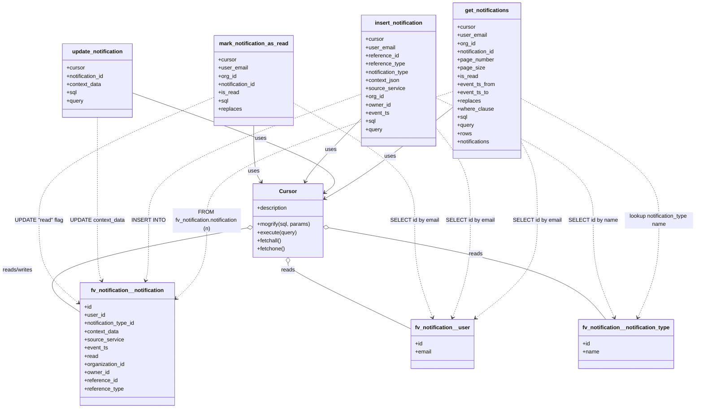

# Diagram: common/notification_service/notification_service/db/db_notification.py

> Auto-generated by Obscura crawlers

## Mermaid

### SVG

<svg id="container" width="1999.17578125" xmlns="http://www.w3.org/2000/svg" class="classDiagram" height="1196" viewBox="0 0 1999.17578125 1196" role="graphics-document document" aria-roledescription="class"><g><defs><marker id="container_class-aggregationStart" class="marker aggregation class" refX="18" refY="7" markerWidth="190" markerHeight="240" orient="auto"><path d="M 18,7 L9,13 L1,7 L9,1 Z"></path></marker></defs><defs><marker id="container_class-aggregationEnd" class="marker aggregation class" refX="1" refY="7" markerWidth="20" markerHeight="28" orient="auto"><path d="M 18,7 L9,13 L1,7 L9,1 Z"></path></marker></defs><defs><marker id="container_class-extensionStart" class="marker extension class" refX="18" refY="7" markerWidth="190" markerHeight="240" orient="auto"><path d="M 1,7 L18,13 V 1 Z"></path></marker></defs><defs><marker id="container_class-extensionEnd" class="marker extension class" refX="1" refY="7" markerWidth="20" markerHeight="28" orient="auto"><path d="M 1,1 V 13 L18,7 Z"></path></marker></defs><defs><marker id="container_class-compositionStart" class="marker composition class" refX="18" refY="7" markerWidth="190" markerHeight="240" orient="auto"><path d="M 18,7 L9,13 L1,7 L9,1 Z"></path></marker></defs><defs><marker id="container_class-compositionEnd" class="marker composition class" refX="1" refY="7" markerWidth="20" markerHeight="28" orient="auto"><path d="M 18,7 L9,13 L1,7 L9,1 Z"></path></marker></defs><defs><marker id="container_class-dependencyStart" class="marker dependency class" refX="6" refY="7" markerWidth="190" markerHeight="240" orient="auto"><path d="M 5,7 L9,13 L1,7 L9,1 Z"></path></marker></defs><defs><marker id="container_class-dependencyEnd" class="marker dependency class" refX="13" refY="7" markerWidth="20" markerHeight="28" orient="auto"><path d="M 18,7 L9,13 L14,7 L9,1 Z"></path></marker></defs><defs><marker id="container_class-lollipopStart" class="marker lollipop class" refX="13" refY="7" markerWidth="190" markerHeight="240" orient="auto"><circle stroke="black" fill="transparent" cx="7" cy="7" r="6"></circle></marker></defs><defs><marker id="container_class-lollipopEnd" class="marker lollipop class" refX="1" refY="7" markerWidth="190" markerHeight="240" orient="auto"><circle stroke="black" fill="transparent" cx="7" cy="7" r="6"></circle></marker></defs><g class="root"><g class="clusters"></g><g class="edgePaths"><path d="M1309.303,314.737L1269.924,345.78C1230.546,376.824,1151.79,438.912,1089.526,483.502C1027.261,528.093,981.49,555.185,958.604,568.732L935.718,582.278" id="id_get_notifications_Cursor_1" class="edge-thickness-normal edge-pattern-solid relation" style=";;;" data-edge="true" data-et="edge" data-id="id_get_notifications_Cursor_1" data-points="W3sieCI6MTMwOS4zMDI3MzQzNzUsInkiOjMxNC43MzY1OTI1NjUwNDcxfSx7IngiOjEwNzMuMDMzMjAzMTI1LCJ5Ijo1MDF9LHsieCI6OTMwLjU1NDY4NzUsInkiOjU4NS4zMzQxMDQwNDYyNDI4fV0=" marker-end="url(#container_class-dependencyEnd)"></path><path d="M389.375,273.806L494.487,311.671C599.6,349.537,809.824,425.269,900.819,473.797C991.813,522.325,963.578,543.65,949.46,554.313L935.343,564.975" id="id_update_notification_Cursor_2" class="edge-thickness-normal edge-pattern-solid relation" style=";;;" data-edge="true" data-et="edge" data-id="id_update_notification_Cursor_2" data-points="W3sieCI6Mzg5LjM3NSwieSI6MjczLjgwNTU3OTM3NzQ5MDh9LHsieCI6MTAyMC4wNDg4MjgxMjUsInkiOjUwMX0seyJ4Ijo5MzAuNTU0Njg3NSwieSI6NTY4LjU5MTUzMzgyMDk3MTF9XQ==" marker-end="url(#container_class-dependencyEnd)"></path><path d="M1036.311,352.275L1012.542,377.062C988.773,401.85,941.235,451.425,915.087,481.468C888.939,511.511,884.181,522.023,881.802,527.278L879.423,532.534" id="id_insert_notification_Cursor_3" class="edge-thickness-normal edge-pattern-solid relation" style=";;;" data-edge="true" data-et="edge" data-id="id_insert_notification_Cursor_3" data-points="W3sieCI6MTAzNi4zMTA1NDY4NzUsInkiOjM1Mi4yNzQ1OTU3MDgwNDg5M30seyJ4Ijo4OTMuNjk3MjY1NjI1LCJ5Ijo1MDF9LHsieCI6ODc2Ljk0OTA4NDA1MTcyNDIsInkiOjUzOH1d" marker-end="url(#container_class-dependencyEnd)"></path><path d="M727.563,368L727.563,390.167C727.563,412.333,727.563,456.667,731.267,484.178C734.971,511.69,742.38,522.379,746.085,527.724L749.789,533.069" id="id_mark_notification_as_read_Cursor_4" class="edge-thickness-normal edge-pattern-solid relation" style=";;;" data-edge="true" data-et="edge" data-id="id_mark_notification_as_read_Cursor_4" data-points="W3sieCI6NzI3LjU2MjUsInkiOjM2OH0seyJ4Ijo3MjcuNTYyNSwieSI6NTAxfSx7IngiOjc1My4yMDczMjc1ODYyMDY5LCJ5Ijo1Mzh9XQ==" marker-end="url(#container_class-dependencyEnd)"></path><path d="M1509.053,426.251L1515.593,438.71C1522.133,451.168,1535.213,476.084,1541.753,512.709C1548.293,549.333,1548.293,597.667,1548.293,646C1548.293,694.333,1548.293,742.667,1519.012,790.404C1489.732,838.141,1431.171,885.282,1401.89,908.853L1372.609,932.424" id="id_get_notifications_fv_notification__user_5" class="edge-thickness-normal edge-pattern-dashed relation" style=";;;" data-edge="true" data-et="edge" data-id="id_get_notifications_fv_notification__user_5" data-points="W3sieCI6MTUwOS4wNTI3MzQzNzUsInkiOjQyNi4yNTE0NDk1OTA3NDUxfSx7IngiOjE1NDguMjkyOTY4NzUsInkiOjUwMX0seyJ4IjoxNTQ4LjI5Mjk2ODc1LCJ5Ijo2NDZ9LHsieCI6MTU0OC4yOTI5Njg3NSwieSI6NzkxfSx7IngiOjEzNjcuOTM1NTQ2ODc1LCJ5Ijo5MzYuMTg2MDMyMzU3ODYzN31d" marker-end="url(#container_class-dependencyEnd)"></path><path d="M1309.303,268.332L1189.514,307.11C1069.725,345.888,830.148,423.444,710.359,486.389C590.57,549.333,590.57,597.667,590.57,646C590.57,694.333,590.57,742.667,577.959,779.254C565.348,815.842,540.126,840.683,527.515,853.104L514.904,865.525" id="id_get_notifications_fv_notification__notification_6" class="edge-thickness-normal edge-pattern-dashed relation" style=";;;" data-edge="true" data-et="edge" data-id="id_get_notifications_fv_notification__notification_6" data-points="W3sieCI6MTMwOS4zMDI3MzQzNzUsInkiOjI2OC4zMzE1ODQ0NjAwODAxNH0seyJ4Ijo1OTAuNTcwMzEyNSwieSI6NTAxfSx7IngiOjU5MC41NzAzMTI1LCJ5Ijo2NDZ9LHsieCI6NTkwLjU3MDMxMjUsInkiOjc5MX0seyJ4Ijo1MTAuNjI4OTA2MjUsInkiOjg2OS43MzUyNjIzMDg3NDI0fV0=" marker-end="url(#container_class-dependencyEnd)"></path><path d="M1509.053,290.911L1572.74,325.926C1636.427,360.941,1763.801,430.97,1827.489,490.152C1891.176,549.333,1891.176,597.667,1891.176,646C1891.176,694.333,1891.176,742.667,1881.123,790.082C1871.071,837.498,1850.966,883.995,1840.913,907.244L1830.861,930.493" id="id_get_notifications_fv_notification__notification_type_7" class="edge-thickness-normal edge-pattern-dashed relation" style=";;;" data-edge="true" data-et="edge" data-id="id_get_notifications_fv_notification__notification_type_7" data-points="W3sieCI6MTUwOS4wNTI3MzQzNzUsInkiOjI5MC45MTA3NTE1NTA5NTc3NH0seyJ4IjoxODkxLjE3NTc4MTI1LCJ5Ijo1MDF9LHsieCI6MTg5MS4xNzU3ODEyNSwieSI6NjQ2fSx7IngiOjE4OTEuMTc1NzgxMjUsInkiOjc5MX0seyJ4IjoxODI4LjQ3OTU2ODY5MjM5NjIsInkiOjkzNn1d" marker-end="url(#container_class-dependencyEnd)"></path><path d="M1259.303,377.718L1275.468,398.265C1291.633,418.812,1323.964,459.906,1340.13,504.62C1356.295,549.333,1356.295,597.667,1356.295,646C1356.295,694.333,1356.295,742.667,1347.993,790.058C1339.691,837.45,1323.086,883.9,1314.784,907.125L1306.482,930.35" id="id_insert_notification_fv_notification__user_8" class="edge-thickness-normal edge-pattern-dashed relation" style=";;;" data-edge="true" data-et="edge" data-id="id_insert_notification_fv_notification__user_8" data-points="W3sieCI6MTI1OS4zMDI3MzQzNzUsInkiOjM3Ny43MTc2Mjg3NjM2MDcxfSx7IngiOjEzNTYuMjk0OTIxODc1LCJ5Ijo1MDF9LHsieCI6MTM1Ni4yOTQ5MjE4NzUsInkiOjY0Nn0seyJ4IjoxMzU2LjI5NDkyMTg3NSwieSI6NzkxfSx7IngiOjEzMDQuNDYyMjI0NTgyMzczMiwieSI6OTM2fV0=" marker-end="url(#container_class-dependencyEnd)"></path><path d="M1259.303,289.169L1333.339,324.474C1407.375,359.779,1555.447,430.39,1629.483,489.861C1703.52,549.333,1703.52,597.667,1703.52,646C1703.52,694.333,1703.52,742.667,1713.572,790.082C1723.625,837.498,1743.73,883.995,1753.782,907.244L1763.834,930.493" id="id_insert_notification_fv_notification__notification_type_9" class="edge-thickness-normal edge-pattern-dashed relation" style=";;;" data-edge="true" data-et="edge" data-id="id_insert_notification_fv_notification__notification_type_9" data-points="W3sieCI6MTI1OS4zMDI3MzQzNzUsInkiOjI4OS4xNjg1NzkyMTA5NjU2fSx7IngiOjE3MDMuNTE5NTMxMjUsInkiOjUwMX0seyJ4IjoxNzAzLjUxOTUzMTI1LCJ5Ijo2NDZ9LHsieCI6MTcwMy41MTk1MzEyNSwieSI6NzkxfSx7IngiOjE3NjYuMjE1NzQzODA3NjAzOCwieSI6OTM2fV0=" marker-end="url(#container_class-dependencyEnd)"></path><path d="M1036.311,276.931L934.584,314.276C832.858,351.621,629.406,426.31,527.679,487.822C425.953,549.333,425.953,597.667,425.953,646C425.953,694.333,425.953,742.667,424.619,772.031C423.284,801.396,420.615,811.792,419.281,816.99L417.947,822.188" id="id_insert_notification_fv_notification__notification_10" class="edge-thickness-normal edge-pattern-dashed relation" style=";;;" data-edge="true" data-et="edge" data-id="id_insert_notification_fv_notification__notification_10" data-points="W3sieCI6MTAzNi4zMTA1NDY4NzUsInkiOjI3Ni45MzEzODU5NDQ5Mjh9LHsieCI6NDI1Ljk1MzEyNSwieSI6NTAxfSx7IngiOjQyNS45NTMxMjUsInkiOjY0Nn0seyJ4Ijo0MjUuOTUzMTI1LCJ5Ijo3OTF9LHsieCI6NDE2LjQ1NDY5MTEwMDIzMDQzLCJ5Ijo4Mjh9XQ==" marker-end="url(#container_class-dependencyEnd)"></path><path d="M284.43,344L284.43,370.167C284.43,396.333,284.43,448.667,284.43,499C284.43,549.333,284.43,597.667,284.43,646C284.43,694.333,284.43,742.667,286.501,772.07C288.572,801.473,292.714,811.947,294.784,817.184L296.855,822.42" id="id_update_notification_fv_notification__notification_11" class="edge-thickness-normal edge-pattern-dashed relation" style=";;;" data-edge="true" data-et="edge" data-id="id_update_notification_fv_notification__notification_11" data-points="W3sieCI6Mjg0LjQyOTY4NzUsInkiOjM0NH0seyJ4IjoyODQuNDI5Njg3NSwieSI6NTAxfSx7IngiOjI4NC40Mjk2ODc1LCJ5Ijo2NDZ9LHsieCI6Mjg0LjQyOTY4NzUsInkiOjc5MX0seyJ4IjoyOTkuMDYxOTc3OTY2NTg5OSwieSI6ODI4fV0=" marker-end="url(#container_class-dependencyEnd)"></path><path d="M845.352,301.909L904.652,335.091C963.952,368.273,1082.553,434.636,1141.854,491.985C1201.154,549.333,1201.154,597.667,1201.154,646C1201.154,694.333,1201.154,742.667,1209.456,790.058C1217.759,837.45,1234.363,883.9,1242.665,907.125L1250.967,930.35" id="id_mark_notification_as_read_fv_notification__user_12" class="edge-thickness-normal edge-pattern-dashed relation" style=";;;" data-edge="true" data-et="edge" data-id="id_mark_notification_as_read_fv_notification__user_12" data-points="W3sieCI6ODQ1LjM1MTU2MjUsInkiOjMwMS45MDkyOTUyMzc5MzgxfSx7IngiOjEyMDEuMTU0Mjk2ODc1LCJ5Ijo1MDF9LHsieCI6MTIwMS4xNTQyOTY4NzUsInkiOjY0Nn0seyJ4IjoxMjAxLjE1NDI5Njg3NSwieSI6NzkxfSx7IngiOjEyNTIuOTg2OTk0MTY3NjI2OCwieSI6OTM2fV0=" marker-end="url(#container_class-dependencyEnd)"></path><path d="M609.773,287.367L528.126,322.972C446.479,358.578,283.185,429.789,201.538,489.561C119.891,549.333,119.891,597.667,119.891,646C119.891,694.333,119.891,742.667,137.464,782.065C155.037,821.464,190.183,851.927,207.756,867.159L225.329,882.391" id="id_mark_notification_as_read_fv_notification__notification_13" class="edge-thickness-normal edge-pattern-dashed relation" style=";;;" data-edge="true" data-et="edge" data-id="id_mark_notification_as_read_fv_notification__notification_13" data-points="W3sieCI6NjA5Ljc3MzQzNzUsInkiOjI4Ny4zNjY3MDQzNzg5MDUxfSx7IngiOjExOS44OTA2MjUsInkiOjUwMX0seyJ4IjoxMTkuODkwNjI1LCJ5Ijo2NDZ9LHsieCI6MTE5Ljg5MDYyNSwieSI6NzkxfSx7IngiOjIyOS44NjMyODEyNSwieSI6ODg2LjMyMDczMTQ1OTk1NTR9XQ==" marker-end="url(#container_class-dependencyEnd)"></path><path d="M708.615,668.374L599.504,688.811C490.392,709.249,272.169,750.125,192.377,790.677C112.585,831.23,171.224,871.46,200.544,891.575L229.863,911.69" id="id_Cursor_fv_notification__notification_14" class="edge-thickness-normal edge-pattern-solid relation" style=";;;" data-edge="true" data-et="edge" data-id="id_Cursor_fv_notification__notification_14" data-points="W3sieCI6NzI1LjU3MDMxMjUsInkiOjY2NS4xOTc4MjYxNTI3NzQ4fSx7IngiOjUzLjk0NTMxMjUsInkiOjc5MX0seyJ4IjoyMjkuODYzMjgxMjUsInkiOjkxMS42ODk1NTA4Mzc5MzM3fV0=" marker-start="url(#container_class-aggregationStart)"></path><path d="M947.527,667.711L1060.59,688.26C1173.653,708.808,1399.78,749.904,1531.936,794.619C1664.092,839.333,1702.278,887.667,1721.371,911.833L1740.464,936" id="id_Cursor_fv_notification__notification_type_15" class="edge-thickness-normal edge-pattern-solid relation" style=";;;" data-edge="true" data-et="edge" data-id="id_Cursor_fv_notification__notification_type_15" data-points="W3sieCI6OTMwLjU1NDY4NzUsInkiOjY2NC42MjY5MTQzMzk0MzA1fSx7IngiOjE2MjUuOTA2MjUsInkiOjc5MX0seyJ4IjoxNzQwLjQ2Mzg3MTY4Nzc4OCwieSI6OTM2fV0=" marker-start="url(#container_class-aggregationStart)"></path><path d="M828.063,771.25L828.063,774.542C828.063,777.833,828.063,784.417,888.304,816.716C948.546,849.015,1069.03,907.029,1129.272,936.036L1189.514,965.044" id="id_Cursor_fv_notification__user_16" class="edge-thickness-normal edge-pattern-solid relation" style=";;;" data-edge="true" data-et="edge" data-id="id_Cursor_fv_notification__user_16" data-points="W3sieCI6ODI4LjA2MjUsInkiOjc1NH0seyJ4Ijo4MjguMDYyNSwieSI6NzkxfSx7IngiOjExODkuNTEzNjcxODc1LCJ5Ijo5NjUuMDQzNzA3MzkyMzM1fV0=" marker-start="url(#container_class-aggregationStart)"></path></g><g class="edgeLabels"><g class="edgeLabel" transform="translate(1126.15723, 459.1196)"><g class="label" data-id="id_get_notifications_Cursor_1" transform="translate(-16.4921875, -12)"><foreignObject width="32.984375" height="24">

uses

</foreignObject></g></g><g class="edgeLabel" transform="translate(757.46853, 406.40787)"><g class="label" data-id="id_update_notification_Cursor_2" transform="translate(-16.4921875, -12)"><foreignObject width="32.984375" height="24">

uses

</foreignObject></g></g><g class="edgeLabel" transform="translate(950.94901, 441.29456)"><g class="label" data-id="id_insert_notification_Cursor_3" transform="translate(-16.4921875, -12)"><foreignObject width="32.984375" height="24">

uses

</foreignObject></g></g><g class="edgeLabel" transform="translate(727.5625, 501)"><g class="label" data-id="id_mark_notification_as_read_Cursor_4" transform="translate(-16.4921875, -12)"><foreignObject width="32.984375" height="24">

uses

</foreignObject></g></g><g class="edgeLabel" transform="translate(1548.29296875, 646)"><g class="label" data-id="id_get_notifications_fv_notification__user_5" transform="translate(-67.5703125, -12)"><foreignObject width="135.140625" height="24">

SELECT id by email

</foreignObject></g></g><g class="edgeLabel" transform="translate(590.5703125, 646)"><g class="label" data-id="id_get_notifications_fv_notification__notification_6" transform="translate(-100, -36)"><foreignObject width="200" height="72">

FROM fv_notification.notification (n)

</foreignObject></g></g><g class="edgeLabel" transform="translate(1891.17578125, 646)"><g class="label" data-id="id_get_notifications_fv_notification__notification_type_7" transform="translate(-100, -24)"><foreignObject width="200" height="48">

lookup notification_type name

</foreignObject></g></g><g class="edgeLabel" transform="translate(1356.294921875, 646)"><g class="label" data-id="id_insert_notification_fv_notification__user_8" transform="translate(-67.5703125, -12)"><foreignObject width="135.140625" height="24">

SELECT id by email

</foreignObject></g></g><g class="edgeLabel" transform="translate(1703.51953125, 646)"><g class="label" data-id="id_insert_notification_fv_notification__notification_type_9" transform="translate(-67.65625, -12)"><foreignObject width="135.3125" height="24">

SELECT id by name

</foreignObject></g></g><g class="edgeLabel" transform="translate(425.953125, 646)"><g class="label" data-id="id_insert_notification_fv_notification__notification_10" transform="translate(-44.6171875, -12)"><foreignObject width="89.234375" height="24">

INSERT INTO

</foreignObject></g></g><g class="edgeLabel" transform="translate(284.4296875, 646)"><g class="label" data-id="id_update_notification_fv_notification__notification_11" transform="translate(-76.90625, -12)"><foreignObject width="153.8125" height="24">

UPDATE context_data

</foreignObject></g></g><g class="edgeLabel" transform="translate(1201.154296875, 646)"><g class="label" data-id="id_mark_notification_as_read_fv_notification__user_12" transform="translate(-67.5703125, -12)"><foreignObject width="135.140625" height="24">

SELECT id by email

</foreignObject></g></g><g class="edgeLabel" transform="translate(119.890625, 646)"><g class="label" data-id="id_mark_notification_as_read_fv_notification__notification_13" transform="translate(-67.6328125, -12)"><foreignObject width="135.265625" height="24">

UPDATE "read" flag

</foreignObject></g></g><g class="edgeLabel" transform="translate(53.9453125, 791)"><g class="label" data-id="id_Cursor_fv_notification__notification_14" transform="translate(-45.9453125, -12)"><foreignObject width="91.890625" height="24">

reads/writes

</foreignObject></g></g><g class="edgeLabel" transform="translate(1369.13785, 744.33495)"><g class="label" data-id="id_Cursor_fv_notification__notification_type_15" transform="translate(-20.0078125, -12)"><foreignObject width="40.015625" height="24">

reads

</foreignObject></g></g><g class="edgeLabel" transform="translate(828.0625, 791)"><g class="label" data-id="id_Cursor_fv_notification__user_16" transform="translate(-20.0078125, -12)"><foreignObject width="40.015625" height="24">

reads

</foreignObject></g></g></g><g class="nodes"><g class="node default" id="classId-get_notifications-0" transform="translate(1409.177734375, 236)"><g class="basic label-container"><path d="M-99.875 -228 L99.875 -228 L99.875 228 L-99.875 228" stroke="none" stroke-width="0" fill="#ECECFF" style=""></path><path d="M-99.875 -228 C-21.68830787172361 -228, 56.49838425655278 -228, 99.875 -228 M-99.875 -228 C-27.84700731522328 -228, 44.18098536955344 -228, 99.875 -228 M99.875 -228 C99.875 -79.2112789056975, 99.875 69.577442188605, 99.875 228 M99.875 -228 C99.875 -73.45410810620561, 99.875 81.09178378758878, 99.875 228 M99.875 228 C27.42080290550585 228, -45.0333941889883 228, -99.875 228 M99.875 228 C53.61167646911571 228, 7.3483529382314146 228, -99.875 228 M-99.875 228 C-99.875 133.32186020139306, -99.875 38.64372040278616, -99.875 -228 M-99.875 228 C-99.875 119.87159782720994, -99.875 11.743195654419878, -99.875 -228" stroke="#9370DB" stroke-width="1.3" fill="none" stroke-dasharray="0 0" style=""></path></g><g class="annotation-group text" transform="translate(0, -204)"></g><g class="label-group text" transform="translate(-61.953125, -204)"><g class="label" style="font-weight: bolder" transform="translate(0,-12)"><foreignObject width="123.90625" height="24">

get_notifications

</foreignObject></g></g><g class="members-group text" transform="translate(-87.875, -156)"><g class="label" style="" transform="translate(0,-12)"><foreignObject width="53.71875" height="24">

+cursor

</foreignObject></g><g class="label" style="" transform="translate(0,12)"><foreignObject width="86.734375" height="24">

+user_email

</foreignObject></g><g class="label" style="" transform="translate(0,36)"><foreignObject width="54.0625" height="24">

+org_id

</foreignObject></g><g class="label" style="" transform="translate(0,60)"><foreignObject width="113.796875" height="24">

+notification_id

</foreignObject></g><g class="label" style="" transform="translate(0,84)"><foreignObject width="107.46875" height="24">

+page_number

</foreignObject></g><g class="label" style="" transform="translate(0,108)"><foreignObject width="78.25" height="24">

+page_size

</foreignObject></g><g class="label" style="" transform="translate(0,132)"><foreignObject width="60.5" height="24">

+is_read

</foreignObject></g><g class="label" style="" transform="translate(0,156)"><foreignObject width="111.375" height="24">

+event_ts_from

</foreignObject></g><g class="label" style="" transform="translate(0,180)"><foreignObject width="92.140625" height="24">

+event_ts_to

</foreignObject></g><g class="label" style="" transform="translate(0,204)"><foreignObject width="68.75" height="24">

+replaces

</foreignObject></g><g class="label" style="" transform="translate(0,228)"><foreignObject width="106.125" height="24">

+where_clause

</foreignObject></g><g class="label" style="" transform="translate(0,252)"><foreignObject width="29.71875" height="24">

+sql

</foreignObject></g><g class="label" style="" transform="translate(0,276)"><foreignObject width="49.640625" height="24">

+query

</foreignObject></g><g class="label" style="" transform="translate(0,300)"><foreignObject width="41.96875" height="24">

+rows

</foreignObject></g><g class="label" style="" transform="translate(0,324)"><foreignObject width="98.875" height="24">

+notifications

</foreignObject></g></g><g class="methods-group text" transform="translate(-87.875, 228)"></g><g class="divider" style=""><path d="M-99.875 -180 C-45.15352665038963 -180, 9.567946699220741 -180, 99.875 -180 M-99.875 -180 C-48.56624610984621 -180, 2.7425077803075766 -180, 99.875 -180" stroke="#9370DB" stroke-width="1.3" fill="none" stroke-dasharray="0 0" style=""></path></g><g class="divider" style=""><path d="M-99.875 204 C-26.52551450305181 204, 46.82397099389638 204, 99.875 204 M-99.875 204 C-22.607140997116517 204, 54.66071800576697 204, 99.875 204" stroke="#9370DB" stroke-width="1.3" fill="none" stroke-dasharray="0 0" style=""></path></g></g><g class="node default" id="classId-update_notification-1" transform="translate(284.4296875, 236)"><g class="basic label-container"><path d="M-104.9453125 -108 L104.9453125 -108 L104.9453125 108 L-104.9453125 108" stroke="none" stroke-width="0" fill="#ECECFF" style=""></path><path d="M-104.9453125 -108 C-41.55933742225958 -108, 21.826637655480837 -108, 104.9453125 -108 M-104.9453125 -108 C-37.34631642910006 -108, 30.252679641799887 -108, 104.9453125 -108 M104.9453125 -108 C104.9453125 -62.73201229377731, 104.9453125 -17.46402458755462, 104.9453125 108 M104.9453125 -108 C104.9453125 -29.624572914052152, 104.9453125 48.750854171895696, 104.9453125 108 M104.9453125 108 C29.86348317135905 108, -45.2183461572819 108, -104.9453125 108 M104.9453125 108 C24.622620022645634 108, -55.70007245470873 108, -104.9453125 108 M-104.9453125 108 C-104.9453125 63.25224344979218, -104.9453125 18.504486899584364, -104.9453125 -108 M-104.9453125 108 C-104.9453125 62.508017269704396, -104.9453125 17.016034539408793, -104.9453125 -108" stroke="#9370DB" stroke-width="1.3" fill="none" stroke-dasharray="0 0" style=""></path></g><g class="annotation-group text" transform="translate(0, -84)"></g><g class="label-group text" transform="translate(-72.09375, -84)"><g class="label" style="font-weight: bolder" transform="translate(0,-12)"><foreignObject width="144.1875" height="24">

update_notification

</foreignObject></g></g><g class="members-group text" transform="translate(-92.9453125, -36)"><g class="label" style="" transform="translate(0,-12)"><foreignObject width="53.71875" height="24">

+cursor

</foreignObject></g><g class="label" style="" transform="translate(0,12)"><foreignObject width="113.796875" height="24">

+notification_id

</foreignObject></g><g class="label" style="" transform="translate(0,36)"><foreignObject width="102.328125" height="24">

+context_data

</foreignObject></g><g class="label" style="" transform="translate(0,60)"><foreignObject width="29.71875" height="24">

+sql

</foreignObject></g><g class="label" style="" transform="translate(0,84)"><foreignObject width="49.640625" height="24">

+query

</foreignObject></g></g><g class="methods-group text" transform="translate(-92.9453125, 108)"></g><g class="divider" style=""><path d="M-104.9453125 -60 C-52.17914851960901 -60, 0.5870154607819842 -60, 104.9453125 -60 M-104.9453125 -60 C-32.448469965496415 -60, 40.04837256900717 -60, 104.9453125 -60" stroke="#9370DB" stroke-width="1.3" fill="none" stroke-dasharray="0 0" style=""></path></g><g class="divider" style=""><path d="M-104.9453125 84 C-43.22326293826634 84, 18.498786623467325 84, 104.9453125 84 M-104.9453125 84 C-62.444938373614505 84, -19.94456424722901 84, 104.9453125 84" stroke="#9370DB" stroke-width="1.3" fill="none" stroke-dasharray="0 0" style=""></path></g></g><g class="node default" id="classId-insert_notification-2" transform="translate(1147.806640625, 236)"><g class="basic label-container"><path d="M-111.49609375 -192 L111.49609375 -192 L111.49609375 192 L-111.49609375 192" stroke="none" stroke-width="0" fill="#ECECFF" style=""></path><path d="M-111.49609375 -192 C-55.88467408906829 -192, -0.27325442813658185 -192, 111.49609375 -192 M-111.49609375 -192 C-57.66168118160538 -192, -3.8272686132107623 -192, 111.49609375 -192 M111.49609375 -192 C111.49609375 -65.40267370285143, 111.49609375 61.19465259429714, 111.49609375 192 M111.49609375 -192 C111.49609375 -110.2640802398646, 111.49609375 -28.528160479729195, 111.49609375 192 M111.49609375 192 C25.377117503688922 192, -60.741858742622156 192, -111.49609375 192 M111.49609375 192 C36.055860673247636 192, -39.38437240350473 192, -111.49609375 192 M-111.49609375 192 C-111.49609375 113.44193132863796, -111.49609375 34.88386265727593, -111.49609375 -192 M-111.49609375 192 C-111.49609375 54.486321937394536, -111.49609375 -83.02735612521093, -111.49609375 -192" stroke="#9370DB" stroke-width="1.3" fill="none" stroke-dasharray="0 0" style=""></path></g><g class="annotation-group text" transform="translate(0, -168)"></g><g class="label-group text" transform="translate(-67.8046875, -168)"><g class="label" style="font-weight: bolder" transform="translate(0,-12)"><foreignObject width="135.609375" height="24">

insert_notification

</foreignObject></g></g><g class="members-group text" transform="translate(-99.49609375, -120)"><g class="label" style="" transform="translate(0,-12)"><foreignObject width="53.71875" height="24">

+cursor

</foreignObject></g><g class="label" style="" transform="translate(0,12)"><foreignObject width="86.734375" height="24">

+user_email

</foreignObject></g><g class="label" style="" transform="translate(0,36)"><foreignObject width="98.25" height="24">

+reference_id

</foreignObject></g><g class="label" style="" transform="translate(0,60)"><foreignObject width="115.640625" height="24">

+reference_type

</foreignObject></g><g class="label" style="" transform="translate(0,84)"><foreignObject width="131.1875" height="24">

+notification_type

</foreignObject></g><g class="label" style="" transform="translate(0,108)"><foreignObject width="101.25" height="24">

+context_json

</foreignObject></g><g class="label" style="" transform="translate(0,132)"><foreignObject width="114.65625" height="24">

+source_service

</foreignObject></g><g class="label" style="" transform="translate(0,156)"><foreignObject width="54.0625" height="24">

+org_id

</foreignObject></g><g class="label" style="" transform="translate(0,180)"><foreignObject width="74.203125" height="24">

+owner_id

</foreignObject></g><g class="label" style="" transform="translate(0,204)"><foreignObject width="69.578125" height="24">

+event_ts

</foreignObject></g><g class="label" style="" transform="translate(0,228)"><foreignObject width="29.71875" height="24">

+sql

</foreignObject></g><g class="label" style="" transform="translate(0,252)"><foreignObject width="49.640625" height="24">

+query

</foreignObject></g></g><g class="methods-group text" transform="translate(-99.49609375, 192)"></g><g class="divider" style=""><path d="M-111.49609375 -144 C-32.13737052275796 -144, 47.221352704484076 -144, 111.49609375 -144 M-111.49609375 -144 C-45.564190667648475 -144, 20.36771241470305 -144, 111.49609375 -144" stroke="#9370DB" stroke-width="1.3" fill="none" stroke-dasharray="0 0" style=""></path></g><g class="divider" style=""><path d="M-111.49609375 168 C-57.94581515123906 168, -4.39553655247812 168, 111.49609375 168 M-111.49609375 168 C-38.21295745834496 168, 35.07017883331008 168, 111.49609375 168" stroke="#9370DB" stroke-width="1.3" fill="none" stroke-dasharray="0 0" style=""></path></g></g><g class="node default" id="classId-mark_notification_as_read-3" transform="translate(727.5625, 236)"><g class="basic label-container"><path d="M-117.7890625 -132 L117.7890625 -132 L117.7890625 132 L-117.7890625 132" stroke="none" stroke-width="0" fill="#ECECFF" style=""></path><path d="M-117.7890625 -132 C-29.86120790807773 -132, 58.06664668384454 -132, 117.7890625 -132 M-117.7890625 -132 C-39.221652933195145 -132, 39.34575663360971 -132, 117.7890625 -132 M117.7890625 -132 C117.7890625 -35.80957430918714, 117.7890625 60.38085138162572, 117.7890625 132 M117.7890625 -132 C117.7890625 -44.826520718502096, 117.7890625 42.34695856299581, 117.7890625 132 M117.7890625 132 C54.02238523642465 132, -9.744292027150706 132, -117.7890625 132 M117.7890625 132 C55.3473725538183 132, -7.0943173923633935 132, -117.7890625 132 M-117.7890625 132 C-117.7890625 60.95615130989336, -117.7890625 -10.087697380213285, -117.7890625 -132 M-117.7890625 132 C-117.7890625 30.088912438683508, -117.7890625 -71.82217512263298, -117.7890625 -132" stroke="#9370DB" stroke-width="1.3" fill="none" stroke-dasharray="0 0" style=""></path></g><g class="annotation-group text" transform="translate(0, -108)"></g><g class="label-group text" transform="translate(-97.78125, -108)"><g class="label" style="font-weight: bolder" transform="translate(0,-12)"><foreignObject width="195.5625" height="24">

mark_notification_as_read

</foreignObject></g></g><g class="members-group text" transform="translate(-105.7890625, -60)"><g class="label" style="" transform="translate(0,-12)"><foreignObject width="53.71875" height="24">

+cursor

</foreignObject></g><g class="label" style="" transform="translate(0,12)"><foreignObject width="86.734375" height="24">

+user_email

</foreignObject></g><g class="label" style="" transform="translate(0,36)"><foreignObject width="54.0625" height="24">

+org_id

</foreignObject></g><g class="label" style="" transform="translate(0,60)"><foreignObject width="113.796875" height="24">

+notification_id

</foreignObject></g><g class="label" style="" transform="translate(0,84)"><foreignObject width="60.5" height="24">

+is_read

</foreignObject></g><g class="label" style="" transform="translate(0,108)"><foreignObject width="29.71875" height="24">

+sql

</foreignObject></g><g class="label" style="" transform="translate(0,132)"><foreignObject width="68.75" height="24">

+replaces

</foreignObject></g></g><g class="methods-group text" transform="translate(-105.7890625, 132)"></g><g class="divider" style=""><path d="M-117.7890625 -84 C-44.29861369100364 -84, 29.191835117992724 -84, 117.7890625 -84 M-117.7890625 -84 C-44.4100967711677 -84, 28.968868957664597 -84, 117.7890625 -84" stroke="#9370DB" stroke-width="1.3" fill="none" stroke-dasharray="0 0" style=""></path></g><g class="divider" style=""><path d="M-117.7890625 108 C-33.53724952040952 108, 50.714563459180965 108, 117.7890625 108 M-117.7890625 108 C-53.494929363317794 108, 10.799203773364411 108, 117.7890625 108" stroke="#9370DB" stroke-width="1.3" fill="none" stroke-dasharray="0 0" style=""></path></g></g><g class="node default" id="classId-Cursor-4" transform="translate(828.0625, 646)"><g class="basic label-container"><path d="M-102.4921875 -108 L102.4921875 -108 L102.4921875 108 L-102.4921875 108" stroke="none" stroke-width="0" fill="#ECECFF" style=""></path><path d="M-102.4921875 -108 C-59.00741303624969 -108, -15.522638572499375 -108, 102.4921875 -108 M-102.4921875 -108 C-34.92740220412399 -108, 32.637383091752014 -108, 102.4921875 -108 M102.4921875 -108 C102.4921875 -22.73293199676351, 102.4921875 62.53413600647298, 102.4921875 108 M102.4921875 -108 C102.4921875 -64.36090871670578, 102.4921875 -20.721817433411545, 102.4921875 108 M102.4921875 108 C30.47755425182143 108, -41.53707899635714 108, -102.4921875 108 M102.4921875 108 C48.52715740970073 108, -5.437872680598545 108, -102.4921875 108 M-102.4921875 108 C-102.4921875 61.52053605375299, -102.4921875 15.041072107505983, -102.4921875 -108 M-102.4921875 108 C-102.4921875 50.41021362868591, -102.4921875 -7.1795727426281815, -102.4921875 -108" stroke="#9370DB" stroke-width="1.3" fill="none" stroke-dasharray="0 0" style=""></path></g><g class="annotation-group text" transform="translate(0, -84)"></g><g class="label-group text" transform="translate(-23.90625, -84)"><g class="label" style="font-weight: bolder" transform="translate(0,-12)"><foreignObject width="47.8125" height="24">

Cursor

</foreignObject></g></g><g class="members-group text" transform="translate(-90.4921875, -36)"><g class="label" style="" transform="translate(0,-12)"><foreignObject width="90.59375" height="24">

+description

</foreignObject></g></g><g class="methods-group text" transform="translate(-90.4921875, 12)"><g class="label" style="" transform="translate(0,-12)"><foreignObject width="157.078125" height="24">

+mogrify(sql, params)

</foreignObject></g><g class="label" style="" transform="translate(0,12)"><foreignObject width="115.96875" height="24">

+execute(query)

</foreignObject></g><g class="label" style="" transform="translate(0,36)"><foreignObject width="72.515625" height="24">

+fetchall()

</foreignObject></g><g class="label" style="" transform="translate(0,60)"><foreignObject width="82.046875" height="24">

+fetchone()

</foreignObject></g></g><g class="divider" style=""><path d="M-102.4921875 -60 C-40.03128579856198 -60, 22.429615902876037 -60, 102.4921875 -60 M-102.4921875 -60 C-50.50210506722362 -60, 1.4879773655527657 -60, 102.4921875 -60" stroke="#9370DB" stroke-width="1.3" fill="none" stroke-dasharray="0 0" style=""></path></g><g class="divider" style=""><path d="M-102.4921875 -12 C-47.33580207785396 -12, 7.820583344292075 -12, 102.4921875 -12 M-102.4921875 -12 C-50.302095868131886 -12, 1.8879957637362281 -12, 102.4921875 -12" stroke="#9370DB" stroke-width="1.3" fill="none" stroke-dasharray="0 0" style=""></path></g></g><g class="node default" id="classId-fv_notification__notification-5" transform="translate(370.24609375, 1008)"><g class="basic label-container"><path d="M-140.3828125 -180 L140.3828125 -180 L140.3828125 180 L-140.3828125 180" stroke="none" stroke-width="0" fill="#ECECFF" style=""></path><path d="M-140.3828125 -180 C-38.966933314909284 -180, 62.44894587018143 -180, 140.3828125 -180 M-140.3828125 -180 C-74.97416287716946 -180, -9.565513254338924 -180, 140.3828125 -180 M140.3828125 -180 C140.3828125 -68.36149144222009, 140.3828125 43.27701711555983, 140.3828125 180 M140.3828125 -180 C140.3828125 -51.12514270613434, 140.3828125 77.74971458773132, 140.3828125 180 M140.3828125 180 C39.26346809949955 180, -61.855876301000905 180, -140.3828125 180 M140.3828125 180 C52.23386910140506 180, -35.915074297189875 180, -140.3828125 180 M-140.3828125 180 C-140.3828125 87.95331197927345, -140.3828125 -4.093376041453098, -140.3828125 -180 M-140.3828125 180 C-140.3828125 95.26567792405797, -140.3828125 10.531355848115936, -140.3828125 -180" stroke="#9370DB" stroke-width="1.3" fill="none" stroke-dasharray="0 0" style=""></path></g><g class="annotation-group text" transform="translate(0, -156)"></g><g class="label-group text" transform="translate(-103.5, -156)"><g class="label" style="font-weight: bolder" transform="translate(0,-12)"><foreignObject width="207" height="24">

fv_notification__notification

</foreignObject></g></g><g class="members-group text" transform="translate(-128.3828125, -108)"><g class="label" style="" transform="translate(0,-12)"><foreignObject width="22.078125" height="24">

+id

</foreignObject></g><g class="label" style="" transform="translate(0,12)"><foreignObject width="60.796875" height="24">

+user_id

</foreignObject></g><g class="label" style="" transform="translate(0,36)"><foreignObject width="153.265625" height="24">

+notification_type_id

</foreignObject></g><g class="label" style="" transform="translate(0,60)"><foreignObject width="102.328125" height="24">

+context_data

</foreignObject></g><g class="label" style="" transform="translate(0,84)"><foreignObject width="114.65625" height="24">

+source_service

</foreignObject></g><g class="label" style="" transform="translate(0,108)"><foreignObject width="69.578125" height="24">

+event_ts

</foreignObject></g><g class="label" style="" transform="translate(0,132)"><foreignObject width="40.515625" height="24">

+read

</foreignObject></g><g class="label" style="" transform="translate(0,156)"><foreignObject width="120.75" height="24">

+organization_id

</foreignObject></g><g class="label" style="" transform="translate(0,180)"><foreignObject width="74.203125" height="24">

+owner_id

</foreignObject></g><g class="label" style="" transform="translate(0,204)"><foreignObject width="98.25" height="24">

+reference_id

</foreignObject></g><g class="label" style="" transform="translate(0,228)"><foreignObject width="115.640625" height="24">

+reference_type

</foreignObject></g></g><g class="methods-group text" transform="translate(-128.3828125, 180)"></g><g class="divider" style=""><path d="M-140.3828125 -132 C-47.335156331544454 -132, 45.71249983691109 -132, 140.3828125 -132 M-140.3828125 -132 C-69.59689277100657 -132, 1.1890269579868686 -132, 140.3828125 -132" stroke="#9370DB" stroke-width="1.3" fill="none" stroke-dasharray="0 0" style=""></path></g><g class="divider" style=""><path d="M-140.3828125 156 C-31.26143534291019 156, 77.85994181417962 156, 140.3828125 156 M-140.3828125 156 C-83.2464918837297 156, -26.11017126745942 156, 140.3828125 156" stroke="#9370DB" stroke-width="1.3" fill="none" stroke-dasharray="0 0" style=""></path></g></g><g class="node default" id="classId-fv_notification__notification_type-6" transform="translate(1797.34765625, 1008)"><g class="basic label-container"><path d="M-135.8828125 -72 L135.8828125 -72 L135.8828125 72 L-135.8828125 72" stroke="none" stroke-width="0" fill="#ECECFF" style=""></path><path d="M-135.8828125 -72 C-73.97123373515127 -72, -12.059654970302546 -72, 135.8828125 -72 M-135.8828125 -72 C-60.41879606726134 -72, 15.04522036547732 -72, 135.8828125 -72 M135.8828125 -72 C135.8828125 -22.737966624996815, 135.8828125 26.52406675000637, 135.8828125 72 M135.8828125 -72 C135.8828125 -34.88841086870879, 135.8828125 2.2231782625824223, 135.8828125 72 M135.8828125 72 C58.3728489985576 72, -19.1371145028848 72, -135.8828125 72 M135.8828125 72 C46.893625724971486 72, -42.09556105005703 72, -135.8828125 72 M-135.8828125 72 C-135.8828125 41.76253786980548, -135.8828125 11.525075739610955, -135.8828125 -72 M-135.8828125 72 C-135.8828125 21.359243636994712, -135.8828125 -29.281512726010575, -135.8828125 -72" stroke="#9370DB" stroke-width="1.3" fill="none" stroke-dasharray="0 0" style=""></path></g><g class="annotation-group text" transform="translate(0, -48)"></g><g class="label-group text" transform="translate(-123.8828125, -48)"><g class="label" style="font-weight: bolder" transform="translate(0,-12)"><foreignObject width="247.765625" height="24">

fv_notification__notification_type

</foreignObject></g></g><g class="members-group text" transform="translate(-123.8828125, 0)"><g class="label" style="" transform="translate(0,-12)"><foreignObject width="22.078125" height="24">

+id

</foreignObject></g><g class="label" style="" transform="translate(0,12)"><foreignObject width="48.5" height="24">

+name

</foreignObject></g></g><g class="methods-group text" transform="translate(-123.8828125, 72)"></g><g class="divider" style=""><path d="M-135.8828125 -24 C-54.8791094201155 -24, 26.124593659769005 -24, 135.8828125 -24 M-135.8828125 -24 C-50.17437753069153 -24, 35.53405743861694 -24, 135.8828125 -24" stroke="#9370DB" stroke-width="1.3" fill="none" stroke-dasharray="0 0" style=""></path></g><g class="divider" style=""><path d="M-135.8828125 48 C-41.21759578131139 48, 53.44762093737722 48, 135.8828125 48 M-135.8828125 48 C-72.62074720590505 48, -9.358681911810109 48, 135.8828125 48" stroke="#9370DB" stroke-width="1.3" fill="none" stroke-dasharray="0 0" style=""></path></g></g><g class="node default" id="classId-fv_notification__user-7" transform="translate(1278.724609375, 1008)"><g class="basic label-container"><path d="M-89.2109375 -72 L89.2109375 -72 L89.2109375 72 L-89.2109375 72" stroke="none" stroke-width="0" fill="#ECECFF" style=""></path><path d="M-89.2109375 -72 C-17.906286551401834 -72, 53.39836439719633 -72, 89.2109375 -72 M-89.2109375 -72 C-22.110716108215072 -72, 44.989505283569855 -72, 89.2109375 -72 M89.2109375 -72 C89.2109375 -17.60535133348698, 89.2109375 36.78929733302604, 89.2109375 72 M89.2109375 -72 C89.2109375 -17.574563252856322, 89.2109375 36.850873494287356, 89.2109375 72 M89.2109375 72 C18.77724478364199 72, -51.65644793271602 72, -89.2109375 72 M89.2109375 72 C29.1366712784271 72, -30.937594943145797 72, -89.2109375 72 M-89.2109375 72 C-89.2109375 41.12754092800566, -89.2109375 10.255081856011323, -89.2109375 -72 M-89.2109375 72 C-89.2109375 40.212521948871256, -89.2109375 8.425043897742519, -89.2109375 -72" stroke="#9370DB" stroke-width="1.3" fill="none" stroke-dasharray="0 0" style=""></path></g><g class="annotation-group text" transform="translate(0, -48)"></g><g class="label-group text" transform="translate(-77.2109375, -48)"><g class="label" style="font-weight: bolder" transform="translate(0,-12)"><foreignObject width="154.421875" height="24">

fv_notification__user

</foreignObject></g></g><g class="members-group text" transform="translate(-77.2109375, 0)"><g class="label" style="" transform="translate(0,-12)"><foreignObject width="22.078125" height="24">

+id

</foreignObject></g><g class="label" style="" transform="translate(0,12)"><foreignObject width="48.328125" height="24">

+email

</foreignObject></g></g><g class="methods-group text" transform="translate(-77.2109375, 72)"></g><g class="divider" style=""><path d="M-89.2109375 -24 C-50.76469163020787 -24, -12.318445760415742 -24, 89.2109375 -24 M-89.2109375 -24 C-34.23849217165128 -24, 20.73395315669744 -24, 89.2109375 -24" stroke="#9370DB" stroke-width="1.3" fill="none" stroke-dasharray="0 0" style=""></path></g><g class="divider" style=""><path d="M-89.2109375 48 C-28.331424489685418 48, 32.548088520629165 48, 89.2109375 48 M-89.2109375 48 C-49.57722592328179 48, -9.943514346563575 48, 89.2109375 48" stroke="#9370DB" stroke-width="1.3" fill="none" stroke-dasharray="0 0" style=""></path></g></g></g></g></g></svg>
