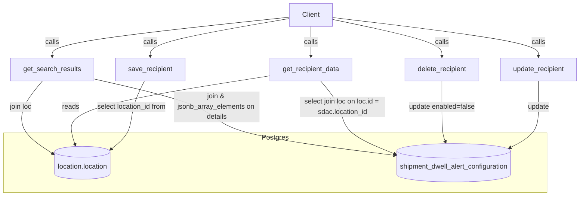

# Diagram: common/notification_service/notification_service/db/dwell_alert_recipients_db.py


> Auto-generated by Obscura crawlers

## Diagram 1



### SVG

<svg id="container" width="1378.390625" xmlns="http://www.w3.org/2000/svg" class="flowchart" height="460.64825439453125" viewBox="0 0 1378.390625 460.64825439453125" role="graphics-document document" aria-roledescription="flowchart-v2"><style>#container{font-family:"trebuchet ms",verdana,arial,sans-serif;font-size:16px;fill:#333;}@keyframes edge-animation-frame{from{stroke-dashoffset:0;}}@keyframes dash{to{stroke-dashoffset:0;}}#container .edge-animation-slow{stroke-dasharray:9,5!important;stroke-dashoffset:900;animation:dash 50s linear infinite;stroke-linecap:round;}#container .edge-animation-fast{stroke-dasharray:9,5!important;stroke-dashoffset:900;animation:dash 20s linear infinite;stroke-linecap:round;}#container .error-icon{fill:#552222;}#container .error-text{fill:#552222;stroke:#552222;}#container .edge-thickness-normal{stroke-width:1px;}#container .edge-thickness-thick{stroke-width:3.5px;}#container .edge-pattern-solid{stroke-dasharray:0;}#container .edge-thickness-invisible{stroke-width:0;fill:none;}#container .edge-pattern-dashed{stroke-dasharray:3;}#container .edge-pattern-dotted{stroke-dasharray:2;}#container .marker{fill:#333333;stroke:#333333;}#container .marker.cross{stroke:#333333;}#container svg{font-family:"trebuchet ms",verdana,arial,sans-serif;font-size:16px;}#container p{margin:0;}#container .label{font-family:"trebuchet ms",verdana,arial,sans-serif;color:#333;}#container .cluster-label text{fill:#333;}#container .cluster-label span{color:#333;}#container .cluster-label span p{background-color:transparent;}#container .label text,#container span{fill:#333;color:#333;}#container .node rect,#container .node circle,#container .node ellipse,#container .node polygon,#container .node path{fill:#ECECFF;stroke:#9370DB;stroke-width:1px;}#container .rough-node .label text,#container .node .label text,#container .image-shape .label,#container .icon-shape .label{text-anchor:middle;}#container .node .katex path{fill:#000;stroke:#000;stroke-width:1px;}#container .rough-node .label,#container .node .label,#container .image-shape .label,#container .icon-shape .label{text-align:center;}#container .node.clickable{cursor:pointer;}#container .root .anchor path{fill:#333333!important;stroke-width:0;stroke:#333333;}#container .arrowheadPath{fill:#333333;}#container .edgePath .path{stroke:#333333;stroke-width:2.0px;}#container .flowchart-link{stroke:#333333;fill:none;}#container .edgeLabel{background-color:rgba(232,232,232, 0.8);text-align:center;}#container .edgeLabel p{background-color:rgba(232,232,232, 0.8);}#container .edgeLabel rect{opacity:0.5;background-color:rgba(232,232,232, 0.8);fill:rgba(232,232,232, 0.8);}#container .labelBkg{background-color:rgba(232, 232, 232, 0.5);}#container .cluster rect{fill:#ffffde;stroke:#aaaa33;stroke-width:1px;}#container .cluster text{fill:#333;}#container .cluster span{color:#333;}#container div.mermaidTooltip{position:absolute;text-align:center;max-width:200px;padding:2px;font-family:"trebuchet ms",verdana,arial,sans-serif;font-size:12px;background:hsl(80, 100%, 96.2745098039%);border:1px solid #aaaa33;border-radius:2px;pointer-events:none;z-index:100;}#container .flowchartTitleText{text-anchor:middle;font-size:18px;fill:#333;}#container rect.text{fill:none;stroke-width:0;}#container .icon-shape,#container .image-shape{background-color:rgba(232,232,232, 0.8);text-align:center;}#container .icon-shape p,#container .image-shape p{background-color:rgba(232,232,232, 0.8);padding:2px;}#container .icon-shape rect,#container .image-shape rect{opacity:0.5;background-color:rgba(232,232,232, 0.8);fill:rgba(232,232,232, 0.8);}#container .label-icon{display:inline-block;height:1em;overflow:visible;vertical-align:-0.125em;}#container .node .label-icon path{fill:currentColor;stroke:revert;stroke-width:revert;}#container :root{--mermaid-font-family:"trebuchet ms",verdana,arial,sans-serif;}</style><g><marker id="container_flowchart-v2-pointEnd" class="marker flowchart-v2" viewBox="0 0 10 10" refX="5" refY="5" markerUnits="userSpaceOnUse" markerWidth="8" markerHeight="8" orient="auto"><path d="M 0 0 L 10 5 L 0 10 z" class="arrowMarkerPath" style="stroke-width: 1; stroke-dasharray: 1, 0;"></path></marker><marker id="container_flowchart-v2-pointStart" class="marker flowchart-v2" viewBox="0 0 10 10" refX="4.5" refY="5" markerUnits="userSpaceOnUse" markerWidth="8" markerHeight="8" orient="auto"><path d="M 0 5 L 10 10 L 10 0 z" class="arrowMarkerPath" style="stroke-width: 1; stroke-dasharray: 1, 0;"></path></marker><marker id="container_flowchart-v2-circleEnd" class="marker flowchart-v2" viewBox="0 0 10 10" refX="11" refY="5" markerUnits="userSpaceOnUse" markerWidth="11" markerHeight="11" orient="auto"><circle cx="5" cy="5" r="5" class="arrowMarkerPath" style="stroke-width: 1; stroke-dasharray: 1, 0;"></circle></marker><marker id="container_flowchart-v2-circleStart" class="marker flowchart-v2" viewBox="0 0 10 10" refX="-1" refY="5" markerUnits="userSpaceOnUse" markerWidth="11" markerHeight="11" orient="auto"><circle cx="5" cy="5" r="5" class="arrowMarkerPath" style="stroke-width: 1; stroke-dasharray: 1, 0;"></circle></marker><marker id="container_flowchart-v2-crossEnd" class="marker cross flowchart-v2" viewBox="0 0 11 11" refX="12" refY="5.2" markerUnits="userSpaceOnUse" markerWidth="11" markerHeight="11" orient="auto"><path d="M 1,1 l 9,9 M 10,1 l -9,9" class="arrowMarkerPath" style="stroke-width: 2; stroke-dasharray: 1, 0;"></path></marker><marker id="container_flowchart-v2-crossStart" class="marker cross flowchart-v2" viewBox="0 0 11 11" refX="-1" refY="5.2" markerUnits="userSpaceOnUse" markerWidth="11" markerHeight="11" orient="auto"><path d="M 1,1 l 9,9 M 10,1 l -9,9" class="arrowMarkerPath" style="stroke-width: 2; stroke-dasharray: 1, 0;"></path></marker><g class="root"><g class="clusters"><g class="cluster" id="DB" data-look="classic"><rect style="" x="8" y="312" width="1290.484375" height="140.6482391357422"></rect><g class="cluster-label" transform="translate(622.546875, 312)"><foreignObject width="61.390625" height="24"><div xmlns="http://www.w3.org/1999/xhtml" style="display: table-cell; white-space: nowrap; line-height: 1.5; max-width: 200px; text-align: center;"><span class="nodeLabel"><p>Postgres</p></span></div></foreignObject></g></g></g><g class="edgePaths"><path d="M682.688,43.608L628.057,52.84C573.427,62.072,464.167,80.536,409.536,95.268C354.906,110,354.906,121,354.906,126.5L354.906,132" id="L_A_B_0" class="edge-thickness-normal edge-pattern-solid edge-thickness-normal edge-pattern-solid flowchart-link" style=";" data-edge="true" data-et="edge" data-id="L_A_B_0" data-points="W3sieCI6NjgyLjY4NzUsInkiOjQzLjYwNzk3MDk1NDY5OTIzfSx7IngiOjM1NC45MDYyNSwieSI6OTl9LHsieCI6MzU0LjkwNjI1LCJ5IjoxMzZ9XQ==" marker-end="url(#container_flowchart-v2-pointEnd)"></path><path d="M784.563,40.983L866.883,50.653C949.203,60.322,1113.844,79.661,1196.164,94.831C1278.484,110,1278.484,121,1278.484,126.5L1278.484,132" id="L_A_C_0" class="edge-thickness-normal edge-pattern-solid edge-thickness-normal edge-pattern-solid flowchart-link" style=";" data-edge="true" data-et="edge" data-id="L_A_C_0" data-points="W3sieCI6Nzg0LjU2MjUsInkiOjQwLjk4MzE5NTIwNTE4NDgzfSx7IngiOjEyNzguNDg0Mzc1LCJ5Ijo5OX0seyJ4IjoxMjc4LjQ4NDM3NSwieSI6MTM2fV0=" marker-end="url(#container_flowchart-v2-pointEnd)"></path><path d="M784.563,45.389L828.37,54.325C872.177,63.26,959.792,81.13,1003.599,95.565C1047.406,110,1047.406,121,1047.406,126.5L1047.406,132" id="L_A_D_0" class="edge-thickness-normal edge-pattern-solid edge-thickness-normal edge-pattern-solid flowchart-link" style=";" data-edge="true" data-et="edge" data-id="L_A_D_0" data-points="W3sieCI6Nzg0LjU2MjUsInkiOjQ1LjM4OTQwMzQ0NTg3MTkzfSx7IngiOjEwNDcuNDA2MjUsInkiOjk5fSx7IngiOjEwNDcuNDA2MjUsInkiOjEzNn1d" marker-end="url(#container_flowchart-v2-pointEnd)"></path><path d="M733.625,62L733.625,68.167C733.625,74.333,733.625,86.667,733.625,98.333C733.625,110,733.625,121,733.625,126.5L733.625,132" id="L_A_E_0" class="edge-thickness-normal edge-pattern-solid edge-thickness-normal edge-pattern-solid flowchart-link" style=";" data-edge="true" data-et="edge" data-id="L_A_E_0" data-points="W3sieCI6NzMzLjYyNSwieSI6NjJ9LHsieCI6NzMzLjYyNSwieSI6OTl9LHsieCI6NzMzLjYyNSwieSI6MTM2fV0=" marker-end="url(#container_flowchart-v2-pointEnd)"></path><path d="M682.688,40.353L589.676,50.127C496.664,59.902,310.641,79.451,217.629,94.725C124.617,110,124.617,121,124.617,126.5L124.617,132" id="L_A_F_0" class="edge-thickness-normal edge-pattern-solid edge-thickness-normal edge-pattern-solid flowchart-link" style=";" data-edge="true" data-et="edge" data-id="L_A_F_0" data-points="W3sieCI6NjgyLjY4NzUsInkiOjQwLjM1Mjk2OTA5Njc2MzQzfSx7IngiOjEyNC42MTcxODc1LCJ5Ijo5OX0seyJ4IjoxMjQuNjE3MTg3NSwieSI6MTM2fV0=" marker-end="url(#container_flowchart-v2-pointEnd)"></path><path d="M341.152,190L335.973,200.167C330.794,210.333,320.436,230.667,315.257,251C310.078,271.333,310.078,291.667,302.09,308.027C294.101,324.387,278.124,336.774,270.135,342.967L262.147,349.16" id="L_B_G_0" class="edge-thickness-normal edge-pattern-solid edge-thickness-normal edge-pattern-solid flowchart-link" style=";" data-edge="true" data-et="edge" data-id="L_B_G_0" data-points="W3sieCI6MzQxLjE1MjE2NjE5MzE4MTgsInkiOjE5MH0seyJ4IjozMTAuMDc4MTI1LCJ5IjoyNTF9LHsieCI6MzEwLjA3ODEyNSwieSI6MzEyfSx7IngiOjI1OC45ODU0NDE2NDk4MDgyNSwieSI6MzUxLjYxMTI0NzM4MjAwOTU0fV0=" marker-end="url(#container_flowchart-v2-pointEnd)"></path><path d="M1278.484,190L1278.484,200.167C1278.484,210.333,1278.484,230.667,1278.484,251C1278.484,271.333,1278.484,291.667,1266.963,307.701C1255.442,323.735,1232.399,335.47,1220.878,341.337L1209.357,347.205" id="L_C_H_0" class="edge-thickness-normal edge-pattern-solid edge-thickness-normal edge-pattern-solid flowchart-link" style=";" data-edge="true" data-et="edge" data-id="L_C_H_0" data-points="W3sieCI6MTI3OC40ODQzNzUsInkiOjE5MH0seyJ4IjoxMjc4LjQ4NDM3NSwieSI6MjUxfSx7IngiOjEyNzguNDg0Mzc1LCJ5IjozMTJ9LHsieCI6MTIwNS43OTIyMjExNTM0NjI0LCJ5IjozNDkuMDIwMTI0Mzk3MjIxMTR9XQ==" marker-end="url(#container_flowchart-v2-pointEnd)"></path><path d="M1047.406,190L1047.406,200.167C1047.406,210.333,1047.406,230.667,1047.406,251C1047.406,271.333,1047.406,291.667,1048.747,305.398C1050.089,319.13,1052.771,326.259,1054.112,329.824L1055.453,333.389" id="L_D_H_0" class="edge-thickness-normal edge-pattern-solid edge-thickness-normal edge-pattern-solid flowchart-link" style=";" data-edge="true" data-et="edge" data-id="L_D_H_0" data-points="W3sieCI6MTA0Ny40MDYyNSwieSI6MTkwfSx7IngiOjEwNDcuNDA2MjUsInkiOjI1MX0seyJ4IjoxMDQ3LjQwNjI1LCJ5IjozMTJ9LHsieCI6MTA1Ni44NjE2MzE4ODUxMzM0LCJ5IjozMzcuMTMyODg4ODI3Mjk4ODd9XQ==" marker-end="url(#container_flowchart-v2-pointEnd)"></path><path d="M757.133,190L765.984,200.167C774.836,210.333,792.539,230.667,801.391,251C810.242,271.333,810.242,291.667,830.545,310.031C850.848,328.396,891.454,344.791,911.757,352.989L932.06,361.187" id="L_E_H_0" class="edge-thickness-normal edge-pattern-solid edge-thickness-normal edge-pattern-solid flowchart-link" style=";" data-edge="true" data-et="edge" data-id="L_E_H_0" data-points="W3sieCI6NzU3LjEzMjU0NjE2NDc3MjcsInkiOjE5MH0seyJ4Ijo4MTAuMjQyMTg3NSwieSI6MjUxfSx7IngiOjgxMC4yNDIxODc1LCJ5IjozMTJ9LHsieCI6OTM1Ljc2OTUzMTI1LCJ5IjozNjIuNjg0MTY3NzQzMzQxNzN9XQ==" marker-end="url(#container_flowchart-v2-pointEnd)"></path><path d="M635.633,178.207L557.452,190.339C479.272,202.471,322.911,226.736,244.731,249.034C166.551,271.333,166.551,291.667,168.403,306.473C170.255,321.28,173.958,330.561,175.81,335.201L177.662,339.841" id="L_E_G_0" class="edge-thickness-normal edge-pattern-solid edge-thickness-normal edge-pattern-solid flowchart-link" style=";" data-edge="true" data-et="edge" data-id="L_E_G_0" data-points="W3sieCI6NjM1LjYzMjgxMjUsInkiOjE3OC4yMDY2NzM1MDkxNzE5NH0seyJ4IjoxNjYuNTUwNzgxMjUsInkiOjI1MX0seyJ4IjoxNjYuNTUwNzgxMjUsInkiOjMxMn0seyJ4IjoxNzkuMTQ0OTg4MTY0NjI4MTMsInkiOjM0My41NTYwMzkzOTE4NjI5NX1d" marker-end="url(#container_flowchart-v2-pointEnd)"></path><path d="M222.516,185.146L271.034,196.122C319.552,207.097,416.589,229.049,465.107,250.191C513.625,271.333,513.625,291.667,583.321,310.58C653.017,329.493,792.409,346.986,862.105,355.732L931.801,364.478" id="L_F_H_0" class="edge-thickness-normal edge-pattern-solid edge-thickness-normal edge-pattern-solid flowchart-link" style=";" data-edge="true" data-et="edge" data-id="L_F_H_0" data-points="W3sieCI6MjIyLjUxNTYyNSwieSI6MTg1LjE0NjI0NTQ1NjE4ODZ9LHsieCI6NTEzLjYyNSwieSI6MjUxfSx7IngiOjUxMy42MjUsInkiOjMxMn0seyJ4Ijo5MzUuNzY5NTMxMjUsInkiOjM2NC45NzY1NTIzOTk1MzYxNn1d" marker-end="url(#container_flowchart-v2-pointEnd)"></path><path d="M101.11,190L92.258,200.167C83.406,210.333,65.703,230.667,56.852,251C48,271.333,48,291.667,60.499,309.902C72.998,328.137,97.997,344.275,110.496,352.343L122.995,360.412" id="L_F_G_0" class="edge-thickness-normal edge-pattern-solid edge-thickness-normal edge-pattern-solid flowchart-link" style=";" data-edge="true" data-et="edge" data-id="L_F_G_0" data-points="W3sieCI6MTAxLjEwOTY0MTMzNTIyNzI4LCJ5IjoxOTB9LHsieCI6NDgsInkiOjI1MX0seyJ4Ijo0OCwieSI6MzEyfSx7IngiOjEyNi4zNTU0Njg3NSwieSI6MzYyLjU4MTQ2Mjg0MjEyMzl9XQ==" marker-end="url(#container_flowchart-v2-pointEnd)"></path></g><g class="edgeLabels"><g class="edgeLabel" transform="translate(354.90625, 99)"><g class="label" data-id="L_A_B_0" transform="translate(-16.4453125, -12)"><foreignObject width="32.890625" height="24"><div xmlns="http://www.w3.org/1999/xhtml" class="labelBkg" style="display: table-cell; white-space: nowrap; line-height: 1.5; max-width: 200px; text-align: center;"><span class="edgeLabel"><p>calls</p></span></div></foreignObject></g></g><g class="edgeLabel" transform="translate(1278.484375, 99)"><g class="label" data-id="L_A_C_0" transform="translate(-16.4453125, -12)"><foreignObject width="32.890625" height="24"><div xmlns="http://www.w3.org/1999/xhtml" class="labelBkg" style="display: table-cell; white-space: nowrap; line-height: 1.5; max-width: 200px; text-align: center;"><span class="edgeLabel"><p>calls</p></span></div></foreignObject></g></g><g class="edgeLabel" transform="translate(1047.40625, 99)"><g class="label" data-id="L_A_D_0" transform="translate(-16.4453125, -12)"><foreignObject width="32.890625" height="24"><div xmlns="http://www.w3.org/1999/xhtml" class="labelBkg" style="display: table-cell; white-space: nowrap; line-height: 1.5; max-width: 200px; text-align: center;"><span class="edgeLabel"><p>calls</p></span></div></foreignObject></g></g><g class="edgeLabel" transform="translate(733.625, 99)"><g class="label" data-id="L_A_E_0" transform="translate(-16.4453125, -12)"><foreignObject width="32.890625" height="24"><div xmlns="http://www.w3.org/1999/xhtml" class="labelBkg" style="display: table-cell; white-space: nowrap; line-height: 1.5; max-width: 200px; text-align: center;"><span class="edgeLabel"><p>calls</p></span></div></foreignObject></g></g><g class="edgeLabel" transform="translate(124.6171875, 99)"><g class="label" data-id="L_A_F_0" transform="translate(-16.4453125, -12)"><foreignObject width="32.890625" height="24"><div xmlns="http://www.w3.org/1999/xhtml" class="labelBkg" style="display: table-cell; white-space: nowrap; line-height: 1.5; max-width: 200px; text-align: center;"><span class="edgeLabel"><p>calls</p></span></div></foreignObject></g></g><g class="edgeLabel" transform="translate(310.078125, 251)"><g class="label" data-id="L_B_G_0" transform="translate(-83.546875, -12)"><foreignObject width="167.09375" height="24"><div xmlns="http://www.w3.org/1999/xhtml" class="labelBkg" style="display: table-cell; white-space: nowrap; line-height: 1.5; max-width: 200px; text-align: center;"><span class="edgeLabel"><p>select location_id from</p></span></div></foreignObject></g></g><g class="edgeLabel" transform="translate(1278.484375, 251)"><g class="label" data-id="L_C_H_0" transform="translate(-25.6796875, -12)"><foreignObject width="51.359375" height="24"><div xmlns="http://www.w3.org/1999/xhtml" class="labelBkg" style="display: table-cell; white-space: nowrap; line-height: 1.5; max-width: 200px; text-align: center;"><span class="edgeLabel"><p>update</p></span></div></foreignObject></g></g><g class="edgeLabel" transform="translate(1047.40625, 251)"><g class="label" data-id="L_D_H_0" transform="translate(-78.609375, -12)"><foreignObject width="157.21875" height="24"><div xmlns="http://www.w3.org/1999/xhtml" class="labelBkg" style="display: table-cell; white-space: nowrap; line-height: 1.5; max-width: 200px; text-align: center;"><span class="edgeLabel"><p>update enabled=false</p></span></div></foreignObject></g></g><g class="edgeLabel" transform="translate(810.2421875, 251)"><g class="label" data-id="L_E_H_0" transform="translate(-100, -24)"><foreignObject width="200" height="48"><div xmlns="http://www.w3.org/1999/xhtml" class="labelBkg" style="display: table; white-space: break-spaces; line-height: 1.5; max-width: 200px; text-align: center; width: 200px;"><span class="edgeLabel"><p>select join loc on loc.id = sdac.location_id</p></span></div></foreignObject></g></g><g class="edgeLabel" transform="translate(166.55078125, 251)"><g class="label" data-id="L_E_G_0" transform="translate(-20.0078125, -12)"><foreignObject width="40.015625" height="24"><div xmlns="http://www.w3.org/1999/xhtml" class="labelBkg" style="display: table-cell; white-space: nowrap; line-height: 1.5; max-width: 200px; text-align: center;"><span class="edgeLabel"><p>reads</p></span></div></foreignObject></g></g><g class="edgeLabel" transform="translate(513.625, 251)"><g class="label" data-id="L_F_H_0" transform="translate(-100, -36)"><foreignObject width="200" height="72"><div xmlns="http://www.w3.org/1999/xhtml" class="labelBkg" style="display: table; white-space: break-spaces; line-height: 1.5; max-width: 200px; text-align: center; width: 200px;"><span class="edgeLabel"><p>join &amp; jsonb_array_elements on details</p></span></div></foreignObject></g></g><g class="edgeLabel" transform="translate(48, 251)"><g class="label" data-id="L_F_G_0" transform="translate(-26.78125, -12)"><foreignObject width="53.5625" height="24"><div xmlns="http://www.w3.org/1999/xhtml" class="labelBkg" style="display: table-cell; white-space: nowrap; line-height: 1.5; max-width: 200px; text-align: center;"><span class="edgeLabel"><p>join loc</p></span></div></foreignObject></g></g></g><g class="nodes"><g class="node default" id="flowchart-A-0" transform="translate(733.625, 35)"><rect class="basic label-container" style="" x="-50.9375" y="-27" width="101.875" height="54"></rect><g class="label" style="" transform="translate(-20.9375, -12)"><rect></rect><foreignObject width="41.875" height="24"><div xmlns="http://www.w3.org/1999/xhtml" style="display: table-cell; white-space: nowrap; line-height: 1.5; max-width: 200px; text-align: center;"><span class="nodeLabel"><p>Client</p></span></div></foreignObject></g></g><g class="node default" id="flowchart-B-1" transform="translate(354.90625, 163)"><rect class="basic label-container" style="" x="-82.390625" y="-27" width="164.78125" height="54"></rect><g class="label" style="" transform="translate(-52.390625, -12)"><rect></rect><foreignObject width="104.78125" height="24"><div xmlns="http://www.w3.org/1999/xhtml" style="display: table-cell; white-space: nowrap; line-height: 1.5; max-width: 200px; text-align: center;"><span class="nodeLabel"><p>save_recipient</p></span></div></foreignObject></g></g><g class="node default" id="flowchart-C-3" transform="translate(1278.484375, 163)"><rect class="basic label-container" style="" x="-91.90625" y="-27" width="183.8125" height="54"></rect><g class="label" style="" transform="translate(-61.90625, -12)"><rect></rect><foreignObject width="123.8125" height="24"><div xmlns="http://www.w3.org/1999/xhtml" style="display: table-cell; white-space: nowrap; line-height: 1.5; max-width: 200px; text-align: center;"><span class="nodeLabel"><p>update_recipient</p></span></div></foreignObject></g></g><g class="node default" id="flowchart-D-5" transform="translate(1047.40625, 163)"><rect class="basic label-container" style="" x="-89.171875" y="-27" width="178.34375" height="54"></rect><g class="label" style="" transform="translate(-59.171875, -12)"><rect></rect><foreignObject width="118.34375" height="24"><div xmlns="http://www.w3.org/1999/xhtml" style="display: table-cell; white-space: nowrap; line-height: 1.5; max-width: 200px; text-align: center;"><span class="nodeLabel"><p>delete_recipient</p></span></div></foreignObject></g></g><g class="node default" id="flowchart-E-7" transform="translate(733.625, 163)"><rect class="basic label-container" style="" x="-97.9921875" y="-27" width="195.984375" height="54"></rect><g class="label" style="" transform="translate(-67.9921875, -12)"><rect></rect><foreignObject width="135.984375" height="24"><div xmlns="http://www.w3.org/1999/xhtml" style="display: table-cell; white-space: nowrap; line-height: 1.5; max-width: 200px; text-align: center;"><span class="nodeLabel"><p>get_recipient_data</p></span></div></foreignObject></g></g><g class="node default" id="flowchart-F-9" transform="translate(124.6171875, 163)"><rect class="basic label-container" style="" x="-97.8984375" y="-27" width="195.796875" height="54"></rect><g class="label" style="" transform="translate(-67.8984375, -12)"><rect></rect><foreignObject width="135.796875" height="24"><div xmlns="http://www.w3.org/1999/xhtml" style="display: table-cell; white-space: nowrap; line-height: 1.5; max-width: 200px; text-align: center;"><span class="nodeLabel"><p>get_search_results</p></span></div></foreignObject></g></g><g class="node default" id="flowchart-G-10" transform="translate(194.93359375, 382.3241195678711)"><path d="M0,13.079628084396234 a68.578125,13.079628084396234 0,0,0 137.15625,0 a68.578125,13.079628084396234 0,0,0 -137.15625,0 l0,52.079628084396234 a68.578125,13.079628084396234 0,0,0 137.15625,0 l0,-52.079628084396234" class="basic label-container" style="" transform="translate(-68.578125, -39.11944212659435)"></path><g class="label" style="" transform="translate(-61.078125, -2)"><rect></rect><foreignObject width="122.15625" height="24"><div xmlns="http://www.w3.org/1999/xhtml" style="display: table-cell; white-space: nowrap; line-height: 1.5; max-width: 200px; text-align: center;"><span class="nodeLabel"><p>location.location</p></span></div></foreignObject></g></g><g class="node default" id="flowchart-H-11" transform="translate(1074.00390625, 382.3241195678711)"><path d="M0,17.21608157546509 a138.234375,17.21608157546509 0,0,0 276.46875,0 a138.234375,17.21608157546509 0,0,0 -276.46875,0 l0,56.21608157546509 a138.234375,17.21608157546509 0,0,0 276.46875,0 l0,-56.21608157546509" class="basic label-container" style="" transform="translate(-138.234375, -45.32412236319763)"></path><g class="label" style="" transform="translate(-130.734375, -2)"><rect></rect><foreignObject width="261.46875" height="24"><div xmlns="http://www.w3.org/1999/xhtml" style="display: table; white-space: break-spaces; line-height: 1.5; max-width: 200px; text-align: center; width: 200px;"><span class="nodeLabel"><p>shipment_dwell_alert_configuration</p></span></div></foreignObject></g></g></g></g></g></svg>

## Diagram 2

```mermaid
classDiagram
    class Module {
        +save_recipient(cursor, data)
        +update_recipient(cursor, data)
        +delete_recipient(cursor, data)
        +get_recipient_data(cursor, actor_organization_id, location_code, page_size, offset)
        +get_search_results(cursor, data)
    }
    class SQLQuery {
        +query: str
        +mogrify(cursor, data)
        +execute(cursor)
    }
    class Cursor {
        +mogrify(query, data)
        +execute(query, params=None)
        +fetchall()
    }
    Module o-- SQLQuery : builds
    Module o-- Cursor : uses
    SQLQuery --> Cursor : executed on
    Cursor --> "Postgres:shipment_dwell_alert_configuration"
    Cursor --> "Postgres:location.location"
```

> SVG rendering failed for this diagram.
