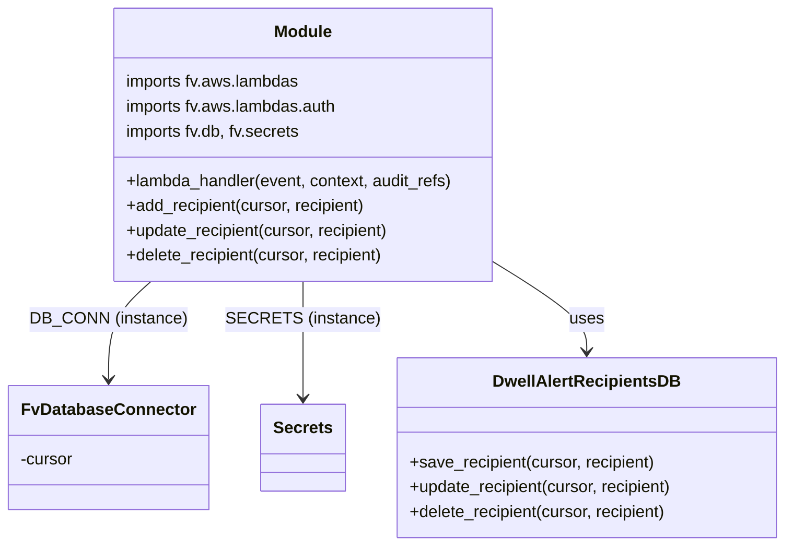

# Diagram: common/notification_service/notification_service/dwell_alert_recipients.py


> Auto-generated by Obscura crawlers

## Diagram 1



### SVG

<svg id="container" width="746.7109375" xmlns="http://www.w3.org/2000/svg" class="classDiagram" height="528" viewBox="0 0 746.7109375 528" role="graphics-document document" aria-roledescription="class"><style>#container{font-family:"trebuchet ms",verdana,arial,sans-serif;font-size:16px;fill:#333;}@keyframes edge-animation-frame{from{stroke-dashoffset:0;}}@keyframes dash{to{stroke-dashoffset:0;}}#container .edge-animation-slow{stroke-dasharray:9,5!important;stroke-dashoffset:900;animation:dash 50s linear infinite;stroke-linecap:round;}#container .edge-animation-fast{stroke-dasharray:9,5!important;stroke-dashoffset:900;animation:dash 20s linear infinite;stroke-linecap:round;}#container .error-icon{fill:#552222;}#container .error-text{fill:#552222;stroke:#552222;}#container .edge-thickness-normal{stroke-width:1px;}#container .edge-thickness-thick{stroke-width:3.5px;}#container .edge-pattern-solid{stroke-dasharray:0;}#container .edge-thickness-invisible{stroke-width:0;fill:none;}#container .edge-pattern-dashed{stroke-dasharray:3;}#container .edge-pattern-dotted{stroke-dasharray:2;}#container .marker{fill:#333333;stroke:#333333;}#container .marker.cross{stroke:#333333;}#container svg{font-family:"trebuchet ms",verdana,arial,sans-serif;font-size:16px;}#container p{margin:0;}#container g.classGroup text{fill:#9370DB;stroke:none;font-family:"trebuchet ms",verdana,arial,sans-serif;font-size:10px;}#container g.classGroup text .title{font-weight:bolder;}#container .nodeLabel,#container .edgeLabel{color:#131300;}#container .edgeLabel .label rect{fill:#ECECFF;}#container .label text{fill:#131300;}#container .labelBkg{background:#ECECFF;}#container .edgeLabel .label span{background:#ECECFF;}#container .classTitle{font-weight:bolder;}#container .node rect,#container .node circle,#container .node ellipse,#container .node polygon,#container .node path{fill:#ECECFF;stroke:#9370DB;stroke-width:1px;}#container .divider{stroke:#9370DB;stroke-width:1;}#container g.clickable{cursor:pointer;}#container g.classGroup rect{fill:#ECECFF;stroke:#9370DB;}#container g.classGroup line{stroke:#9370DB;stroke-width:1;}#container .classLabel .box{stroke:none;stroke-width:0;fill:#ECECFF;opacity:0.5;}#container .classLabel .label{fill:#9370DB;font-size:10px;}#container .relation{stroke:#333333;stroke-width:1;fill:none;}#container .dashed-line{stroke-dasharray:3;}#container .dotted-line{stroke-dasharray:1 2;}#container #compositionStart,#container .composition{fill:#333333!important;stroke:#333333!important;stroke-width:1;}#container #compositionEnd,#container .composition{fill:#333333!important;stroke:#333333!important;stroke-width:1;}#container #dependencyStart,#container .dependency{fill:#333333!important;stroke:#333333!important;stroke-width:1;}#container #dependencyStart,#container .dependency{fill:#333333!important;stroke:#333333!important;stroke-width:1;}#container #extensionStart,#container .extension{fill:transparent!important;stroke:#333333!important;stroke-width:1;}#container #extensionEnd,#container .extension{fill:transparent!important;stroke:#333333!important;stroke-width:1;}#container #aggregationStart,#container .aggregation{fill:transparent!important;stroke:#333333!important;stroke-width:1;}#container #aggregationEnd,#container .aggregation{fill:transparent!important;stroke:#333333!important;stroke-width:1;}#container #lollipopStart,#container .lollipop{fill:#ECECFF!important;stroke:#333333!important;stroke-width:1;}#container #lollipopEnd,#container .lollipop{fill:#ECECFF!important;stroke:#333333!important;stroke-width:1;}#container .edgeTerminals{font-size:11px;line-height:initial;}#container .classTitleText{text-anchor:middle;font-size:18px;fill:#333;}#container .label-icon{display:inline-block;height:1em;overflow:visible;vertical-align:-0.125em;}#container .node .label-icon path{fill:currentColor;stroke:revert;stroke-width:revert;}#container :root{--mermaid-font-family:"trebuchet ms",verdana,arial,sans-serif;}</style><g><defs><marker id="container_class-aggregationStart" class="marker aggregation class" refX="18" refY="7" markerWidth="190" markerHeight="240" orient="auto"><path d="M 18,7 L9,13 L1,7 L9,1 Z"></path></marker></defs><defs><marker id="container_class-aggregationEnd" class="marker aggregation class" refX="1" refY="7" markerWidth="20" markerHeight="28" orient="auto"><path d="M 18,7 L9,13 L1,7 L9,1 Z"></path></marker></defs><defs><marker id="container_class-extensionStart" class="marker extension class" refX="18" refY="7" markerWidth="190" markerHeight="240" orient="auto"><path d="M 1,7 L18,13 V 1 Z"></path></marker></defs><defs><marker id="container_class-extensionEnd" class="marker extension class" refX="1" refY="7" markerWidth="20" markerHeight="28" orient="auto"><path d="M 1,1 V 13 L18,7 Z"></path></marker></defs><defs><marker id="container_class-compositionStart" class="marker composition class" refX="18" refY="7" markerWidth="190" markerHeight="240" orient="auto"><path d="M 18,7 L9,13 L1,7 L9,1 Z"></path></marker></defs><defs><marker id="container_class-compositionEnd" class="marker composition class" refX="1" refY="7" markerWidth="20" markerHeight="28" orient="auto"><path d="M 18,7 L9,13 L1,7 L9,1 Z"></path></marker></defs><defs><marker id="container_class-dependencyStart" class="marker dependency class" refX="6" refY="7" markerWidth="190" markerHeight="240" orient="auto"><path d="M 5,7 L9,13 L1,7 L9,1 Z"></path></marker></defs><defs><marker id="container_class-dependencyEnd" class="marker dependency class" refX="13" refY="7" markerWidth="20" markerHeight="28" orient="auto"><path d="M 18,7 L9,13 L14,7 L9,1 Z"></path></marker></defs><defs><marker id="container_class-lollipopStart" class="marker lollipop class" refX="13" refY="7" markerWidth="190" markerHeight="240" orient="auto"><circle stroke="black" fill="transparent" cx="7" cy="7" r="6"></circle></marker></defs><defs><marker id="container_class-lollipopEnd" class="marker lollipop class" refX="1" refY="7" markerWidth="190" markerHeight="240" orient="auto"><circle stroke="black" fill="transparent" cx="7" cy="7" r="6"></circle></marker></defs><g class="root"><g class="clusters"></g><g class="edgePaths"><path d="M138.816,272L132.23,278.167C125.645,284.333,112.475,296.667,105.89,312.5C99.305,328.333,99.305,347.667,99.305,357.333L99.305,367" id="id_Module_FvDatabaseConnector_1" class="edge-thickness-normal edge-pattern-solid relation" style=";;;" data-edge="true" data-et="edge" data-id="id_Module_FvDatabaseConnector_1" data-points="W3sieCI6MTM4LjgxNTU5NzI2MzMxMzYsInkiOjI3Mn0seyJ4Ijo5OS4zMDQ2ODc1LCJ5IjozMDl9LHsieCI6OTkuMzA0Njg3NSwieSI6MzczfV0=" marker-end="url(#container_class-dependencyEnd)"></path><path d="M279.773,272L279.773,278.167C279.773,284.333,279.773,296.667,279.773,315.5C279.773,334.333,279.773,359.667,279.773,372.333L279.773,385" id="id_Module_Secrets_2" class="edge-thickness-normal edge-pattern-solid relation" style=";;;" data-edge="true" data-et="edge" data-id="id_Module_Secrets_2" data-points="W3sieCI6Mjc5Ljc3MzQzNzUsInkiOjI3Mn0seyJ4IjoyNzkuNzczNDM3NSwieSI6MzA5fSx7IngiOjI3OS43NzM0Mzc1LCJ5IjozOTF9XQ==" marker-end="url(#container_class-dependencyEnd)"></path><path d="M466.164,254.942L480.774,263.952C495.384,272.962,524.604,290.981,539.214,305.157C553.824,319.333,553.824,329.667,553.824,334.833L553.824,340" id="id_Module_DwellAlertRecipientsDB_3" class="edge-thickness-normal edge-pattern-solid relation" style=";;;" data-edge="true" data-et="edge" data-id="id_Module_DwellAlertRecipientsDB_3" data-points="W3sieCI6NDY2LjE2NDA2MjUsInkiOjI1NC45NDIyNTgwNzgzMTAxfSx7IngiOjU1My44MjQyMTg3NSwieSI6MzA5fSx7IngiOjU1My44MjQyMTg3NSwieSI6MzQ2fV0=" marker-end="url(#container_class-dependencyEnd)"></path></g><g class="edgeLabels"><g class="edgeLabel" transform="translate(99.3046875, 309)"><g class="label" data-id="id_Module_FvDatabaseConnector_1" transform="translate(-72.3671875, -12)"><foreignObject width="144.734375" height="24"><div xmlns="http://www.w3.org/1999/xhtml" class="labelBkg" style="display: table-cell; white-space: nowrap; line-height: 1.5; max-width: 200px; text-align: center;"><span class="edgeLabel"><p>DB_CONN (instance)</p></span></div></foreignObject></g></g><g class="edgeLabel" transform="translate(279.7734375, 309)"><g class="label" data-id="id_Module_Secrets_2" transform="translate(-68.3671875, -12)"><foreignObject width="136.734375" height="24"><div xmlns="http://www.w3.org/1999/xhtml" class="labelBkg" style="display: table-cell; white-space: nowrap; line-height: 1.5; max-width: 200px; text-align: center;"><span class="edgeLabel"><p>SECRETS (instance)</p></span></div></foreignObject></g></g><g class="edgeLabel" transform="translate(553.82421875, 309)"><g class="label" data-id="id_Module_DwellAlertRecipientsDB_3" transform="translate(-16.4921875, -12)"><foreignObject width="32.984375" height="24"><div xmlns="http://www.w3.org/1999/xhtml" class="labelBkg" style="display: table-cell; white-space: nowrap; line-height: 1.5; max-width: 200px; text-align: center;"><span class="edgeLabel"><p>uses</p></span></div></foreignObject></g></g></g><g class="nodes"><g class="node default" id="classId-Module-0" transform="translate(279.7734375, 140)"><g class="basic label-container"><path d="M-186.390625 -132 L186.390625 -132 L186.390625 132 L-186.390625 132" stroke="none" stroke-width="0" fill="#ECECFF" style=""></path><path d="M-186.390625 -132 C-108.79444386465221 -132, -31.198262729304417 -132, 186.390625 -132 M-186.390625 -132 C-75.93323374571995 -132, 34.52415750856011 -132, 186.390625 -132 M186.390625 -132 C186.390625 -78.02872896007023, 186.390625 -24.057457920140436, 186.390625 132 M186.390625 -132 C186.390625 -41.898737389498564, 186.390625 48.20252522100287, 186.390625 132 M186.390625 132 C70.8968097387631 132, -44.59700552247381 132, -186.390625 132 M186.390625 132 C73.25825643184456 132, -39.874112136310885 132, -186.390625 132 M-186.390625 132 C-186.390625 45.51272606924739, -186.390625 -40.974547861505215, -186.390625 -132 M-186.390625 132 C-186.390625 48.20581836399637, -186.390625 -35.58836327200726, -186.390625 -132" stroke="#9370DB" stroke-width="1.3" fill="none" stroke-dasharray="0 0" style=""></path></g><g class="annotation-group text" transform="translate(0, -108)"></g><g class="label-group text" transform="translate(-27.09375, -108)"><g class="label" style="font-weight: bolder" transform="translate(0,-12)"><foreignObject width="54.1875" height="24"><div xmlns="http://www.w3.org/1999/xhtml" style="display: table-cell; white-space: nowrap; line-height: 1.5; max-width: 104px; text-align: center;"><span class="nodeLabel markdown-node-label" style=""><p>Module</p></span></div></foreignObject></g></g><g class="members-group text" transform="translate(-174.390625, -60)"><g class="label" style="" transform="translate(0,-12)"><foreignObject width="170.703125" height="24"><div xmlns="http://www.w3.org/1999/xhtml" style="display: table-cell; white-space: nowrap; line-height: 1.5; max-width: 221px; text-align: center;"><span class="nodeLabel markdown-node-label" style=""><p>imports fv.aws.lambdas</p></span></div></foreignObject></g><g class="label" style="" transform="translate(0,12)"><foreignObject width="207.703125" height="24"><div xmlns="http://www.w3.org/1999/xhtml" style="display: table-cell; white-space: nowrap; line-height: 1.5; max-width: 258px; text-align: center;"><span class="nodeLabel markdown-node-label" style=""><p>imports fv.aws.lambdas.auth</p></span></div></foreignObject></g><g class="label" style="" transform="translate(0,36)"><foreignObject width="172.015625" height="24"><div xmlns="http://www.w3.org/1999/xhtml" style="display: table-cell; white-space: nowrap; line-height: 1.5; max-width: 222px; text-align: center;"><span class="nodeLabel markdown-node-label" style=""><p>imports fv.db, fv.secrets</p></span></div></foreignObject></g></g><g class="methods-group text" transform="translate(-174.390625, 36)"><g class="label" style="" transform="translate(0,-12)"><foreignObject width="321.6875" height="24"><div xmlns="http://www.w3.org/1999/xhtml" style="display: table-cell; white-space: nowrap; line-height: 1.5; max-width: 379px; text-align: center;"><span class="nodeLabel markdown-node-label" style=""><p>+lambda_handler(event, context, audit_refs)</p></span></div></foreignObject></g><g class="label" style="" transform="translate(0,12)"><foreignObject width="235.734375" height="24"><div xmlns="http://www.w3.org/1999/xhtml" style="display: table-cell; white-space: nowrap; line-height: 1.5; max-width: 293px; text-align: center;"><span class="nodeLabel markdown-node-label" style=""><p>+add_recipient(cursor, recipient)</p></span></div></foreignObject></g><g class="label" style="" transform="translate(0,36)"><foreignObject width="259.15625" height="24"><div xmlns="http://www.w3.org/1999/xhtml" style="display: table-cell; white-space: nowrap; line-height: 1.5; max-width: 317px; text-align: center;"><span class="nodeLabel markdown-node-label" style=""><p>+update_recipient(cursor, recipient)</p></span></div></foreignObject></g><g class="label" style="" transform="translate(0,60)"><foreignObject width="253.6875" height="24"><div xmlns="http://www.w3.org/1999/xhtml" style="display: table-cell; white-space: nowrap; line-height: 1.5; max-width: 311px; text-align: center;"><span class="nodeLabel markdown-node-label" style=""><p>+delete_recipient(cursor, recipient)</p></span></div></foreignObject></g></g><g class="divider" style=""><path d="M-186.390625 -84 C-109.52216994206731 -84, -32.653714884134615 -84, 186.390625 -84 M-186.390625 -84 C-68.60589077976688 -84, 49.17884344046624 -84, 186.390625 -84" stroke="#9370DB" stroke-width="1.3" fill="none" stroke-dasharray="0 0" style=""></path></g><g class="divider" style=""><path d="M-186.390625 12 C-102.24113947946753 12, -18.09165395893507 12, 186.390625 12 M-186.390625 12 C-73.53850462494732 12, 39.313615750105356 12, 186.390625 12" stroke="#9370DB" stroke-width="1.3" fill="none" stroke-dasharray="0 0" style=""></path></g></g><g class="node default" id="classId-FvDatabaseConnector-1" transform="translate(99.3046875, 433)"><g class="basic label-container"><path d="M-91.3046875 -60 L91.3046875 -60 L91.3046875 60 L-91.3046875 60" stroke="none" stroke-width="0" fill="#ECECFF" style=""></path><path d="M-91.3046875 -60 C-51.79277453613791 -60, -12.280861572275825 -60, 91.3046875 -60 M-91.3046875 -60 C-26.929587381186664 -60, 37.44551273762667 -60, 91.3046875 -60 M91.3046875 -60 C91.3046875 -35.45602541750585, 91.3046875 -10.912050835011698, 91.3046875 60 M91.3046875 -60 C91.3046875 -17.474012900121927, 91.3046875 25.051974199756145, 91.3046875 60 M91.3046875 60 C47.768509151055994 60, 4.2323308021119885 60, -91.3046875 60 M91.3046875 60 C54.1577258823304 60, 17.010764264660807 60, -91.3046875 60 M-91.3046875 60 C-91.3046875 33.90505902474071, -91.3046875 7.810118049481424, -91.3046875 -60 M-91.3046875 60 C-91.3046875 15.15516474507055, -91.3046875 -29.6896705098589, -91.3046875 -60" stroke="#9370DB" stroke-width="1.3" fill="none" stroke-dasharray="0 0" style=""></path></g><g class="annotation-group text" transform="translate(0, -36)"></g><g class="label-group text" transform="translate(-79.3046875, -36)"><g class="label" style="font-weight: bolder" transform="translate(0,-12)"><foreignObject width="158.609375" height="24"><div xmlns="http://www.w3.org/1999/xhtml" style="display: table-cell; white-space: nowrap; line-height: 1.5; max-width: 207px; text-align: center;"><span class="nodeLabel markdown-node-label" style=""><p>FvDatabaseConnector</p></span></div></foreignObject></g></g><g class="members-group text" transform="translate(-79.3046875, 12)"><g class="label" style="" transform="translate(0,-12)"><foreignObject width="52.1875" height="24"><div xmlns="http://www.w3.org/1999/xhtml" style="display: table-cell; white-space: nowrap; line-height: 1.5; max-width: 110px; text-align: center;"><span class="nodeLabel markdown-node-label" style=""><p>-cursor</p></span></div></foreignObject></g></g><g class="methods-group text" transform="translate(-79.3046875, 60)"></g><g class="divider" style=""><path d="M-91.3046875 -12 C-21.379021598607537 -12, 48.54664430278493 -12, 91.3046875 -12 M-91.3046875 -12 C-53.70960322790854 -12, -16.114518955817076 -12, 91.3046875 -12" stroke="#9370DB" stroke-width="1.3" fill="none" stroke-dasharray="0 0" style=""></path></g><g class="divider" style=""><path d="M-91.3046875 36 C-31.784641769187182 36, 27.735403961625636 36, 91.3046875 36 M-91.3046875 36 C-37.44428641767234 36, 16.416114664655325 36, 91.3046875 36" stroke="#9370DB" stroke-width="1.3" fill="none" stroke-dasharray="0 0" style=""></path></g></g><g class="node default" id="classId-Secrets-2" transform="translate(279.7734375, 433)"><g class="basic label-container"><path d="M-39.1640625 -42 L39.1640625 -42 L39.1640625 42 L-39.1640625 42" stroke="none" stroke-width="0" fill="#ECECFF" style=""></path><path d="M-39.1640625 -42 C-15.422321750937783 -42, 8.319418998124434 -42, 39.1640625 -42 M-39.1640625 -42 C-11.428742399246318 -42, 16.306577701507365 -42, 39.1640625 -42 M39.1640625 -42 C39.1640625 -22.370779375694113, 39.1640625 -2.741558751388226, 39.1640625 42 M39.1640625 -42 C39.1640625 -23.876747716203674, 39.1640625 -5.753495432407348, 39.1640625 42 M39.1640625 42 C22.90039586126579 42, 6.636729222531578 42, -39.1640625 42 M39.1640625 42 C14.06103703589983 42, -11.04198842820034 42, -39.1640625 42 M-39.1640625 42 C-39.1640625 18.811778763002856, -39.1640625 -4.376442473994288, -39.1640625 -42 M-39.1640625 42 C-39.1640625 12.79133540682102, -39.1640625 -16.41732918635796, -39.1640625 -42" stroke="#9370DB" stroke-width="1.3" fill="none" stroke-dasharray="0 0" style=""></path></g><g class="annotation-group text" transform="translate(0, -18)"></g><g class="label-group text" transform="translate(-27.1640625, -18)"><g class="label" style="font-weight: bolder" transform="translate(0,-12)"><foreignObject width="54.328125" height="24"><div xmlns="http://www.w3.org/1999/xhtml" style="display: table-cell; white-space: nowrap; line-height: 1.5; max-width: 103px; text-align: center;"><span class="nodeLabel markdown-node-label" style=""><p>Secrets</p></span></div></foreignObject></g></g><g class="members-group text" transform="translate(-27.1640625, 30)"></g><g class="methods-group text" transform="translate(-27.1640625, 60)"></g><g class="divider" style=""><path d="M-39.1640625 6 C-8.387604502732383 6, 22.388853494535233 6, 39.1640625 6 M-39.1640625 6 C-8.859925221553116 6, 21.444212056893768 6, 39.1640625 6" stroke="#9370DB" stroke-width="1.3" fill="none" stroke-dasharray="0 0" style=""></path></g><g class="divider" style=""><path d="M-39.1640625 24 C-14.888428764998466 24, 9.387204970003069 24, 39.1640625 24 M-39.1640625 24 C-17.02207254756125 24, 5.119917404877498 24, 39.1640625 24" stroke="#9370DB" stroke-width="1.3" fill="none" stroke-dasharray="0 0" style=""></path></g></g><g class="node default" id="classId-DwellAlertRecipientsDB-3" transform="translate(553.82421875, 433)"><g class="basic label-container"><path d="M-184.88671875 -87 L184.88671875 -87 L184.88671875 87 L-184.88671875 87" stroke="none" stroke-width="0" fill="#ECECFF" style=""></path><path d="M-184.88671875 -87 C-73.65199673590178 -87, 37.58272527819645 -87, 184.88671875 -87 M-184.88671875 -87 C-69.63042107718242 -87, 45.62587659563516 -87, 184.88671875 -87 M184.88671875 -87 C184.88671875 -35.431797446168, 184.88671875 16.136405107664004, 184.88671875 87 M184.88671875 -87 C184.88671875 -48.977813210469265, 184.88671875 -10.955626420938529, 184.88671875 87 M184.88671875 87 C98.10674461509413 87, 11.326770480188259 87, -184.88671875 87 M184.88671875 87 C51.17431687484304 87, -82.53808500031391 87, -184.88671875 87 M-184.88671875 87 C-184.88671875 43.93165390093935, -184.88671875 0.8633078018787046, -184.88671875 -87 M-184.88671875 87 C-184.88671875 51.903801806055924, -184.88671875 16.807603612111848, -184.88671875 -87" stroke="#9370DB" stroke-width="1.3" fill="none" stroke-dasharray="0 0" style=""></path></g><g class="annotation-group text" transform="translate(0, -63)"></g><g class="label-group text" transform="translate(-86.6171875, -63)"><g class="label" style="font-weight: bolder" transform="translate(0,-12)"><foreignObject width="173.234375" height="24"><div xmlns="http://www.w3.org/1999/xhtml" style="display: table-cell; white-space: nowrap; line-height: 1.5; max-width: 220px; text-align: center;"><span class="nodeLabel markdown-node-label" style=""><p>DwellAlertRecipientsDB</p></span></div></foreignObject></g></g><g class="members-group text" transform="translate(-172.88671875, -15)"></g><g class="methods-group text" transform="translate(-172.88671875, 15)"><g class="label" style="" transform="translate(0,-12)"><foreignObject width="240.125" height="24"><div xmlns="http://www.w3.org/1999/xhtml" style="display: table-cell; white-space: nowrap; line-height: 1.5; max-width: 297px; text-align: center;"><span class="nodeLabel markdown-node-label" style=""><p>+save_recipient(cursor, recipient)</p></span></div></foreignObject></g><g class="label" style="" transform="translate(0,12)"><foreignObject width="259.15625" height="24"><div xmlns="http://www.w3.org/1999/xhtml" style="display: table-cell; white-space: nowrap; line-height: 1.5; max-width: 317px; text-align: center;"><span class="nodeLabel markdown-node-label" style=""><p>+update_recipient(cursor, recipient)</p></span></div></foreignObject></g><g class="label" style="" transform="translate(0,36)"><foreignObject width="253.6875" height="24"><div xmlns="http://www.w3.org/1999/xhtml" style="display: table-cell; white-space: nowrap; line-height: 1.5; max-width: 311px; text-align: center;"><span class="nodeLabel markdown-node-label" style=""><p>+delete_recipient(cursor, recipient)</p></span></div></foreignObject></g></g><g class="divider" style=""><path d="M-184.88671875 -39 C-68.85137281655734 -39, 47.18397311688531 -39, 184.88671875 -39 M-184.88671875 -39 C-84.80279660727217 -39, 15.281125535455658 -39, 184.88671875 -39" stroke="#9370DB" stroke-width="1.3" fill="none" stroke-dasharray="0 0" style=""></path></g><g class="divider" style=""><path d="M-184.88671875 -15 C-83.75714380676243 -15, 17.372431136475143 -15, 184.88671875 -15 M-184.88671875 -15 C-53.86492530314291 -15, 77.15686814371418 -15, 184.88671875 -15" stroke="#9370DB" stroke-width="1.3" fill="none" stroke-dasharray="0 0" style=""></path></g></g></g></g></g></svg>

## Diagram 2

```mermaid
flowchart TD
    Event["Incoming event"] -->|body| GetBody[get_event_body(event)]
    Event -->|auth| GetOrg[auth.get_organization_id(event)]
    GetBody --> Handler[lambda_handler]
    GetOrg --> Handler
    Handler --> Cursor[DB_CONN.cursor]
    Handler --> ForLoop{for recipient in data.recipients}
    ForLoop -->|status == "created"| Add[add_recipient(cursor, recipient)]
    ForLoop -->|status == "updated"| Update[update_recipient(cursor, recipient)]
    ForLoop -->|status == "deleted"| Delete[delete_recipient(cursor, recipient)]
    Add --> DBDSave[DwellAlertRecipientsDB.save_recipient]
    Update --> DBDUpdate[DwellAlertRecipientsDB.update_recipient]
    Delete --> DBDDelete[DwellAlertRecipientsDB.delete_recipient]
    DBDSave --> DB[Database]
    DBDUpdate --> DB
    DBDDelete --> DB
    Handler --> Response[make_response({"status":"SUCCESS"})]
    Response --> Client[Caller]
```

> SVG rendering failed for this diagram.
