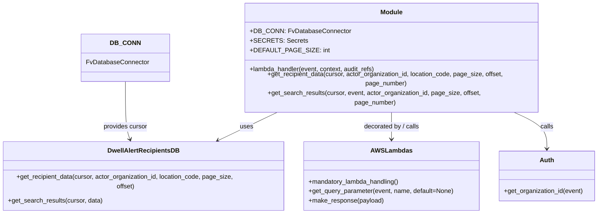
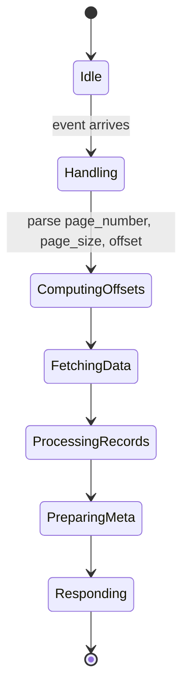

# Diagram: common/notification_service/notification_service/dwell_alert_search.py


> Auto-generated by Obscura crawlers

## Diagram 1



> SVG rendering failed for this diagram.

## Diagram 2

```mermaid
flowchart TD
    Start([Lambda invoked])
    A[Extract actor_organization_id via auth.get_organization_id(event)]
    B[Read query params: locationCode, prefill, pageNumber, pageSize]
    C{prefill == "1"?}
    D[Call get_recipient_data(cursor, actor_org_id, locationCode, page_size, offset, page_number)]
    E[Call get_search_results(cursor, event, actor_org_id, page_size, offset, page_number)]
    F[Build response with recipients + meta]
    G[Build response with results + meta]
    H[Return fv.aws.lambdas.make_response(response)]
    Start --> A --> B --> C
    C -- yes --> D --> F --> H
    C -- no --> E --> G --> H
```

> SVG rendering failed for this diagram.

## Diagram 3



### SVG

<svg id="container" width="216" xmlns="http://www.w3.org/2000/svg" class="statediagram" height="796" viewBox="0 0 216 796" role="graphics-document document" aria-roledescription="stateDiagram"><style>#container{font-family:"trebuchet ms",verdana,arial,sans-serif;font-size:16px;fill:#333;}@keyframes edge-animation-frame{from{stroke-dashoffset:0;}}@keyframes dash{to{stroke-dashoffset:0;}}#container .edge-animation-slow{stroke-dasharray:9,5!important;stroke-dashoffset:900;animation:dash 50s linear infinite;stroke-linecap:round;}#container .edge-animation-fast{stroke-dasharray:9,5!important;stroke-dashoffset:900;animation:dash 20s linear infinite;stroke-linecap:round;}#container .error-icon{fill:#552222;}#container .error-text{fill:#552222;stroke:#552222;}#container .edge-thickness-normal{stroke-width:1px;}#container .edge-thickness-thick{stroke-width:3.5px;}#container .edge-pattern-solid{stroke-dasharray:0;}#container .edge-thickness-invisible{stroke-width:0;fill:none;}#container .edge-pattern-dashed{stroke-dasharray:3;}#container .edge-pattern-dotted{stroke-dasharray:2;}#container .marker{fill:#333333;stroke:#333333;}#container .marker.cross{stroke:#333333;}#container svg{font-family:"trebuchet ms",verdana,arial,sans-serif;font-size:16px;}#container p{margin:0;}#container defs #statediagram-barbEnd{fill:#333333;stroke:#333333;}#container g.stateGroup text{fill:#9370DB;stroke:none;font-size:10px;}#container g.stateGroup text{fill:#333;stroke:none;font-size:10px;}#container g.stateGroup .state-title{font-weight:bolder;fill:#131300;}#container g.stateGroup rect{fill:#ECECFF;stroke:#9370DB;}#container g.stateGroup line{stroke:#333333;stroke-width:1;}#container .transition{stroke:#333333;stroke-width:1;fill:none;}#container .stateGroup .composit{fill:white;border-bottom:1px;}#container .stateGroup .alt-composit{fill:#e0e0e0;border-bottom:1px;}#container .state-note{stroke:#aaaa33;fill:#fff5ad;}#container .state-note text{fill:black;stroke:none;font-size:10px;}#container .stateLabel .box{stroke:none;stroke-width:0;fill:#ECECFF;opacity:0.5;}#container .edgeLabel .label rect{fill:#ECECFF;opacity:0.5;}#container .edgeLabel{background-color:rgba(232,232,232, 0.8);text-align:center;}#container .edgeLabel p{background-color:rgba(232,232,232, 0.8);}#container .edgeLabel rect{opacity:0.5;background-color:rgba(232,232,232, 0.8);fill:rgba(232,232,232, 0.8);}#container .edgeLabel .label text{fill:#333;}#container .label div .edgeLabel{color:#333;}#container .stateLabel text{fill:#131300;font-size:10px;font-weight:bold;}#container .node circle.state-start{fill:#333333;stroke:#333333;}#container .node .fork-join{fill:#333333;stroke:#333333;}#container .node circle.state-end{fill:#9370DB;stroke:white;stroke-width:1.5;}#container .end-state-inner{fill:white;stroke-width:1.5;}#container .node rect{fill:#ECECFF;stroke:#9370DB;stroke-width:1px;}#container .node polygon{fill:#ECECFF;stroke:#9370DB;stroke-width:1px;}#container #statediagram-barbEnd{fill:#333333;}#container .statediagram-cluster rect{fill:#ECECFF;stroke:#9370DB;stroke-width:1px;}#container .cluster-label,#container .nodeLabel{color:#131300;}#container .statediagram-cluster rect.outer{rx:5px;ry:5px;}#container .statediagram-state .divider{stroke:#9370DB;}#container .statediagram-state .title-state{rx:5px;ry:5px;}#container .statediagram-cluster.statediagram-cluster .inner{fill:white;}#container .statediagram-cluster.statediagram-cluster-alt .inner{fill:#f0f0f0;}#container .statediagram-cluster .inner{rx:0;ry:0;}#container .statediagram-state rect.basic{rx:5px;ry:5px;}#container .statediagram-state rect.divider{stroke-dasharray:10,10;fill:#f0f0f0;}#container .note-edge{stroke-dasharray:5;}#container .statediagram-note rect{fill:#fff5ad;stroke:#aaaa33;stroke-width:1px;rx:0;ry:0;}#container .statediagram-note rect{fill:#fff5ad;stroke:#aaaa33;stroke-width:1px;rx:0;ry:0;}#container .statediagram-note text{fill:black;}#container .statediagram-note .nodeLabel{color:black;}#container .statediagram .edgeLabel{color:red;}#container #dependencyStart,#container #dependencyEnd{fill:#333333;stroke:#333333;stroke-width:1;}#container .statediagramTitleText{text-anchor:middle;font-size:18px;fill:#333;}#container :root{--mermaid-font-family:"trebuchet ms",verdana,arial,sans-serif;}</style><g><defs><marker id="container_stateDiagram-barbEnd" refX="19" refY="7" markerWidth="20" markerHeight="14" markerUnits="userSpaceOnUse" orient="auto"><path d="M 19,7 L9,13 L14,7 L9,1 Z"></path></marker></defs><g class="root"><g class="clusters"></g><g class="edgePaths"><path d="M108,22L108,26.167C108,30.333,108,38.667,108.083,47.083C108.167,55.5,108.333,64,108.417,68.25L108.5,72.5" id="edge0" class="edge-thickness-normal edge-pattern-solid transition" style="fill:none;;;fill:none" data-edge="true" data-et="edge" data-id="edge0" data-points="W3sieCI6MTA4LCJ5IjoyMn0seyJ4IjoxMDgsInkiOjQ3fSx7IngiOjEwOC41LCJ5Ijo3Mi41fV0=" marker-end="url(#container_stateDiagram-barbEnd)"></path><path d="M108.5,112.5L108.417,118.583C108.333,124.667,108.167,136.833,108.167,149.167C108.167,161.5,108.333,174,108.417,180.25L108.5,186.5" id="edge1" class="edge-thickness-normal edge-pattern-solid transition" style="fill:none;;;fill:none" data-edge="true" data-et="edge" data-id="edge1" data-points="W3sieCI6MTA4LjUsInkiOjExMi41fSx7IngiOjEwOCwieSI6MTQ5fSx7IngiOjEwOC41LCJ5IjoxODYuNX1d" marker-end="url(#container_stateDiagram-barbEnd)"></path><path d="M108.5,226.5L108.417,234.583C108.333,242.667,108.167,258.833,108.167,275.167C108.167,291.5,108.333,308,108.417,316.25L108.5,324.5" id="edge2" class="edge-thickness-normal edge-pattern-solid transition" style="fill:none;;;fill:none" data-edge="true" data-et="edge" data-id="edge2" data-points="W3sieCI6MTA4LjUsInkiOjIyNi41fSx7IngiOjEwOCwieSI6Mjc1fSx7IngiOjEwOC41LCJ5IjozMjQuNX1d" marker-end="url(#container_stateDiagram-barbEnd)"></path><path d="M108.5,364.5L108.417,368.583C108.333,372.667,108.167,380.833,108.167,389.167C108.167,397.5,108.333,406,108.417,410.25L108.5,414.5" id="edge3" class="edge-thickness-normal edge-pattern-solid transition" style="fill:none;;;fill:none" data-edge="true" data-et="edge" data-id="edge3" data-points="W3sieCI6MTA4LjUsInkiOjM2NC41fSx7IngiOjEwOCwieSI6Mzg5fSx7IngiOjEwOC41LCJ5Ijo0MTQuNX1d" marker-end="url(#container_stateDiagram-barbEnd)"></path><path d="M108.5,454.5L108.417,458.583C108.333,462.667,108.167,470.833,108.167,479.167C108.167,487.5,108.333,496,108.417,500.25L108.5,504.5" id="edge4" class="edge-thickness-normal edge-pattern-solid transition" style="fill:none;;;fill:none" data-edge="true" data-et="edge" data-id="edge4" data-points="W3sieCI6MTA4LjUsInkiOjQ1NC41fSx7IngiOjEwOCwieSI6NDc5fSx7IngiOjEwOC41LCJ5Ijo1MDQuNX1d" marker-end="url(#container_stateDiagram-barbEnd)"></path><path d="M108.5,544.5L108.417,548.583C108.333,552.667,108.167,560.833,108.167,569.167C108.167,577.5,108.333,586,108.417,590.25L108.5,594.5" id="edge5" class="edge-thickness-normal edge-pattern-solid transition" style="fill:none;;;fill:none" data-edge="true" data-et="edge" data-id="edge5" data-points="W3sieCI6MTA4LjUsInkiOjU0NC41fSx7IngiOjEwOCwieSI6NTY5fSx7IngiOjEwOC41LCJ5Ijo1OTQuNX1d" marker-end="url(#container_stateDiagram-barbEnd)"></path><path d="M108.5,634.5L108.417,638.583C108.333,642.667,108.167,650.833,108.167,659.167C108.167,667.5,108.333,676,108.417,680.25L108.5,684.5" id="edge6" class="edge-thickness-normal edge-pattern-solid transition" style="fill:none;;;fill:none" data-edge="true" data-et="edge" data-id="edge6" data-points="W3sieCI6MTA4LjUsInkiOjYzNC41fSx7IngiOjEwOCwieSI6NjU5fSx7IngiOjEwOC41LCJ5Ijo2ODQuNX1d" marker-end="url(#container_stateDiagram-barbEnd)"></path><path d="M108.5,724.5L108.417,728.583C108.333,732.667,108.167,740.833,108.083,749.083C108,757.333,108,765.667,108,769.833L108,774" id="edge7" class="edge-thickness-normal edge-pattern-solid transition" style="fill:none;;;fill:none" data-edge="true" data-et="edge" data-id="edge7" data-points="W3sieCI6MTA4LjUsInkiOjcyNC41fSx7IngiOjEwOCwieSI6NzQ5fSx7IngiOjEwOCwieSI6Nzc0fV0=" marker-end="url(#container_stateDiagram-barbEnd)"></path></g><g class="edgeLabels"><g class="edgeLabel"><g class="label" data-id="edge0" transform="translate(0, 0)"><foreignObject width="0" height="0"><div xmlns="http://www.w3.org/1999/xhtml" class="labelBkg" style="display: table-cell; white-space: nowrap; line-height: 1.5; max-width: 200px; text-align: center;"><span class="edgeLabel"></span></div></foreignObject></g></g><g class="edgeLabel" transform="translate(108, 149)"><g class="label" data-id="edge1" transform="translate(-47.078125, -12)"><foreignObject width="94.15625" height="24"><div xmlns="http://www.w3.org/1999/xhtml" class="labelBkg" style="display: table-cell; white-space: nowrap; line-height: 1.5; max-width: 200px; text-align: center;"><span class="edgeLabel"><p>event arrives</p></span></div></foreignObject></g></g><g class="edgeLabel" transform="translate(108, 275)"><g class="label" data-id="edge2" transform="translate(-100, -24)"><foreignObject width="200" height="48"><div xmlns="http://www.w3.org/1999/xhtml" class="labelBkg" style="display: table; white-space: break-spaces; line-height: 1.5; max-width: 200px; text-align: center; width: 200px;"><span class="edgeLabel"><p>parse page_number, page_size, offset</p></span></div></foreignObject></g></g><g class="edgeLabel"><g class="label" data-id="edge3" transform="translate(0, 0)"><foreignObject width="0" height="0"><div xmlns="http://www.w3.org/1999/xhtml" class="labelBkg" style="display: table-cell; white-space: nowrap; line-height: 1.5; max-width: 200px; text-align: center;"><span class="edgeLabel"></span></div></foreignObject></g></g><g class="edgeLabel"><g class="label" data-id="edge4" transform="translate(0, 0)"><foreignObject width="0" height="0"><div xmlns="http://www.w3.org/1999/xhtml" class="labelBkg" style="display: table-cell; white-space: nowrap; line-height: 1.5; max-width: 200px; text-align: center;"><span class="edgeLabel"></span></div></foreignObject></g></g><g class="edgeLabel"><g class="label" data-id="edge5" transform="translate(0, 0)"><foreignObject width="0" height="0"><div xmlns="http://www.w3.org/1999/xhtml" class="labelBkg" style="display: table-cell; white-space: nowrap; line-height: 1.5; max-width: 200px; text-align: center;"><span class="edgeLabel"></span></div></foreignObject></g></g><g class="edgeLabel"><g class="label" data-id="edge6" transform="translate(0, 0)"><foreignObject width="0" height="0"><div xmlns="http://www.w3.org/1999/xhtml" class="labelBkg" style="display: table-cell; white-space: nowrap; line-height: 1.5; max-width: 200px; text-align: center;"><span class="edgeLabel"></span></div></foreignObject></g></g><g class="edgeLabel"><g class="label" data-id="edge7" transform="translate(0, 0)"><foreignObject width="0" height="0"><div xmlns="http://www.w3.org/1999/xhtml" class="labelBkg" style="display: table-cell; white-space: nowrap; line-height: 1.5; max-width: 200px; text-align: center;"><span class="edgeLabel"></span></div></foreignObject></g></g></g><g class="nodes"><g class="node default" id="state-root_start-0" transform="translate(108, 15)"><circle class="state-start" r="7" width="14" height="14"></circle></g><g class="node  statediagram-state" id="state-Idle-1" transform="translate(108, 92)"><g class="basic label-container outer-path"><path d="M-16.8125 -20 C-8.53242596467784 -20, -0.2523519293556795 -20, 16.8125 -20 C16.8125 -20, 16.8125 -20, 16.8125 -20 C16.914265780734784 -19.995790936174252, 17.016031561469564 -19.991581872348508, 17.225396727361662 -19.982922465033347 C17.355400242508722 -19.966717543769832, 17.485403757655778 -19.95051262250632, 17.63547295140367 -19.931806517013612 C17.74921414894461 -19.907957495831905, 17.86295534648555 -19.8841084746502, 18.039927435703998 -19.847001329696653 C18.156080560676465 -19.81242104613741, 18.272233685648928 -19.777840762578165, 18.435997346023417 -19.729086208503173 C18.53866069623466 -19.689026844942024, 18.641324046445906 -19.648967481380872, 18.820977123264846 -19.578866633275286 C18.945309746497422 -19.51808411752564, 19.069642369729998 -19.45730160177599, 19.19223696518537 -19.397368756032446 C19.284111318944895 -19.34262352397218, 19.375985672704417 -19.287878291911912, 19.547240790612136 -19.185832391312644 C19.674438347338885 -19.09501508138605, 19.801635904065634 -19.00419777145946, 19.88356356344834 -18.94570254698197 C19.981511463183065 -18.86274490759897, 20.07945936291779 -18.779787268215966, 20.198907858128706 -18.678619553365657 C20.289197378654915 -18.588330032839448, 20.379486899181124 -18.49804051231324, 20.491119553365657 -18.386407858128706 C20.56570236048415 -18.2983481041638, 20.640285167602645 -18.210288350198894, 20.75820254698197 -18.07106356344834 C20.838733434964382 -17.95827303705334, 20.919264322946795 -17.845482510658336, 20.998332391312644 -17.734740790612136 C21.079966150162473 -17.597741666541708, 21.161599909012303 -17.46074254247128, 21.209868756032446 -17.37973696518537 C21.2803245837546 -17.235617266046916, 21.35078041147675 -17.091497566908465, 21.391366633275286 -17.008477123264846 C21.44184727755504 -16.879106319490823, 21.492327921834796 -16.749735515716797, 21.541586208503173 -16.623497346023417 C21.57677166529798 -16.505311479985075, 21.611957122092786 -16.387125613946736, 21.659501329696653 -16.227427435703994 C21.690199183136038 -16.081022659359967, 21.72089703657542 -15.934617883015939, 21.744306517013612 -15.82297295140367 C21.759654607817257 -15.699843333997721, 21.775002698620902 -15.57671371659177, 21.795422465033347 -15.412896727361662 C21.799925999347455 -15.304011306632828, 21.80442953366156 -15.195125885903995, 21.8125 -15 C21.8125 -15, 21.8125 -15, 21.8125 -15 C21.8125 -8.142318426949979, 21.8125 -1.2846368538999577, 21.8125 15 C21.8125 15, 21.8125 15, 21.8125 15 C21.808103731552862 15.106291971175649, 21.803707463105724 15.2125839423513, 21.795422465033347 15.412896727361662 C21.779103926104327 15.543811736965148, 21.76278538717531 15.674726746568632, 21.744306517013612 15.822972951403669 C21.721087529935588 15.93370937852245, 21.69786854285756 16.044445805641228, 21.659501329696653 16.227427435703994 C21.621496649938482 16.355082904749718, 21.58349197018031 16.482738373795446, 21.541586208503173 16.623497346023417 C21.48426625629555 16.770395793838244, 21.42694630408793 16.917294241653067, 21.391366633275286 17.008477123264846 C21.352964096032274 17.087030768755213, 21.314561558789258 17.16558441424558, 21.209868756032446 17.379736965185366 C21.15232466916842 17.476308403360918, 21.09478058230439 17.572879841536473, 20.998332391312644 17.734740790612133 C20.924017453208403 17.838825337520646, 20.84970251510416 17.94290988442916, 20.75820254698197 18.07106356344834 C20.68990615603919 18.151700959860054, 20.62160976509641 18.232338356271764, 20.491119553365657 18.386407858128706 C20.414189844689414 18.46333756680495, 20.33726013601317 18.54026727548119, 20.198907858128706 18.678619553365657 C20.1214339510242 18.74423660553905, 20.043960043919693 18.809853657712445, 19.88356356344834 18.94570254698197 C19.791992843524685 19.011082784350624, 19.70042212360103 19.076463021719277, 19.547240790612136 19.185832391312644 C19.4131585035552 19.26572809255824, 19.279076216498265 19.34562379380384, 19.19223696518537 19.397368756032446 C19.10428583736337 19.440365442445472, 19.01633470954137 19.4833621288585, 18.820977123264846 19.578866633275286 C18.687772796755578 19.63084312276811, 18.55456847024631 19.682819612260936, 18.435997346023417 19.729086208503173 C18.28522735534208 19.77397237950564, 18.13445736466074 19.81885855050811, 18.039927435703998 19.847001329696653 C17.908430111442765 19.874573419136937, 17.776932787181533 19.90214550857722, 17.63547295140367 19.931806517013612 C17.471865637528484 19.952200147420324, 17.308258323653295 19.972593777827036, 17.225396727361662 19.982922465033347 C17.122427514399547 19.987181303184197, 17.01945830143743 19.991440141335048, 16.8125 20 C16.8125 20, 16.8125 20, 16.8125 20 C7.732112350080024 20, -1.3482752998399512 20, -16.8125 20 C-16.8125 20, -16.8125 20, -16.8125 20 C-16.945065460935208 19.99451705197821, -17.077630921870416 19.98903410395642, -17.225396727361662 19.982922465033347 C-17.350108233691305 19.967377191981, -17.474819740020944 19.95183191892865, -17.63547295140367 19.931806517013612 C-17.771521138495984 19.903280211982143, -17.907569325588298 19.874753906950676, -18.039927435703994 19.847001329696653 C-18.172910028349055 19.807410696528585, -18.30589262099412 19.767820063360517, -18.435997346023417 19.729086208503173 C-18.56512744015033 19.67869948941918, -18.69425753427724 19.62831277033519, -18.820977123264846 19.578866633275286 C-18.902108198354437 19.53920406748035, -18.983239273444028 19.499541501685414, -19.19223696518537 19.397368756032446 C-19.30587948008628 19.329652515366995, -19.41952199498719 19.261936274701544, -19.547240790612133 19.185832391312644 C-19.670663925512553 19.09770996677235, -19.794087060412973 19.00958754223205, -19.88356356344834 18.94570254698197 C-19.95197360331129 18.887762198771366, -20.02038364317424 18.82982185056076, -20.198907858128706 18.67861955336566 C-20.258710146966525 18.61881726452784, -20.31851243580434 18.559014975690022, -20.491119553365657 18.386407858128706 C-20.58834452750781 18.271614548075355, -20.685569501649965 18.156821238022005, -20.758202546981966 18.07106356344834 C-20.82300065430733 17.9803081673794, -20.887798761632695 17.889552771310452, -20.998332391312644 17.734740790612133 C-21.06700913830151 17.61948633811548, -21.135685885290375 17.504231885618825, -21.209868756032446 17.37973696518537 C-21.282361056070986 17.231451595341877, -21.354853356109526 17.08316622549838, -21.391366633275286 17.00847712326485 C-21.43099872899289 16.90690876669196, -21.470630824710494 16.805340410119065, -21.541586208503173 16.623497346023417 C-21.56579094649884 16.542195064261612, -21.589995684494507 16.460892782499812, -21.659501329696653 16.227427435703994 C-21.68462159575786 16.107623393325078, -21.70974186181907 15.987819350946161, -21.744306517013612 15.82297295140367 C-21.756308212470064 15.726689694503422, -21.768309907926515 15.630406437603176, -21.795422465033347 15.412896727361664 C-21.80159519138713 15.26365396396795, -21.807767917740914 15.114411200574237, -21.8125 15 C-21.8125 15, -21.8125 15, -21.8125 15 C-21.8125 6.4809039538760285, -21.8125 -2.038192092247943, -21.8125 -15 C-21.8125 -15, -21.8125 -15, -21.8125 -15 C-21.806056658472546 -15.155785635055354, -21.799613316945088 -15.311571270110708, -21.795422465033347 -15.41289672736166 C-21.7767417022993 -15.562762609556492, -21.758060939565254 -15.712628491751323, -21.744306517013612 -15.822972951403669 C-21.722835380912468 -15.925373494977421, -21.701364244811323 -16.027774038551176, -21.659501329696653 -16.227427435703994 C-21.62394128739269 -16.34687151228833, -21.588381245088726 -16.466315588872668, -21.541586208503173 -16.623497346023417 C-21.49375414777211 -16.746080411894223, -21.445922087041044 -16.868663477765026, -21.39136663327529 -17.008477123264846 C-21.336181740369362 -17.121359625957936, -21.280996847463435 -17.23424212865103, -21.209868756032446 -17.379736965185366 C-21.135559565067695 -17.50444387830547, -21.061250374102944 -17.629150791425573, -20.998332391312644 -17.734740790612133 C-20.945780603906414 -17.80834414844226, -20.89322881650018 -17.881947506272382, -20.75820254698197 -18.07106356344834 C-20.69887612552929 -18.141110136895776, -20.63954970407661 -18.21115671034321, -20.49111955336566 -18.386407858128706 C-20.42705247950993 -18.450474931984438, -20.362985405654193 -18.51454200584017, -20.198907858128706 -18.678619553365657 C-20.092275802138936 -18.768932297910716, -19.98564374614916 -18.85924504245578, -19.88356356344834 -18.945702546981966 C-19.765017830247913 -19.03034257364275, -19.64647209704749 -19.11498260030353, -19.547240790612136 -19.185832391312644 C-19.426834444912764 -19.257579000318398, -19.306428099213388 -19.32932560932415, -19.192236965185366 -19.397368756032446 C-19.066938270015246 -19.45862355557401, -18.941639574845127 -19.519878355115576, -18.82097712326485 -19.578866633275286 C-18.73880246129543 -19.61093128587599, -18.656627799326007 -19.642995938476687, -18.43599734602342 -19.729086208503173 C-18.29267673516054 -19.771754603044407, -18.149356124297658 -19.81442299758564, -18.039927435703994 -19.847001329696653 C-17.921316038926445 -19.871871524272557, -17.802704642148893 -19.896741718848464, -17.635472951403674 -19.931806517013612 C-17.508827658555344 -19.947592836304135, -17.382182365707017 -19.96337915559466, -17.225396727361662 -19.982922465033347 C-17.10904568017971 -19.98773477994161, -16.99269463299776 -19.99254709484988, -16.8125 -20 C-16.8125 -20, -16.8125 -20, -16.8125 -20" stroke="none" stroke-width="0" fill="#ECECFF" style=""></path><path d="M-16.8125 -20 C-6.885277843058159 -20, 3.0419443138836826 -20, 16.8125 -20 M-16.8125 -20 C-5.416128072759264 -20, 5.980243854481472 -20, 16.8125 -20 M16.8125 -20 C16.8125 -20, 16.8125 -20, 16.8125 -20 M16.8125 -20 C16.8125 -20, 16.8125 -20, 16.8125 -20 M16.8125 -20 C16.901758131257594 -19.996308256383262, 16.99101626251519 -19.992616512766524, 17.225396727361662 -19.982922465033347 M16.8125 -20 C16.95923262333426 -19.99393109380704, 17.105965246668514 -19.987862187614073, 17.225396727361662 -19.982922465033347 M17.225396727361662 -19.982922465033347 C17.33385522177137 -19.96940312780404, 17.44231371618108 -19.95588379057473, 17.63547295140367 -19.931806517013612 M17.225396727361662 -19.982922465033347 C17.34671416011994 -19.967800262810464, 17.46803159287822 -19.95267806058758, 17.63547295140367 -19.931806517013612 M17.63547295140367 -19.931806517013612 C17.748325650453133 -19.908143794374574, 17.861178349502595 -19.884481071735536, 18.039927435703998 -19.847001329696653 M17.63547295140367 -19.931806517013612 C17.760773011112274 -19.905533857303098, 17.886073070820874 -19.879261197592584, 18.039927435703998 -19.847001329696653 M18.039927435703998 -19.847001329696653 C18.14830400783164 -19.814736226228785, 18.256680579959287 -19.782471122760917, 18.435997346023417 -19.729086208503173 M18.039927435703998 -19.847001329696653 C18.16660765974966 -19.80928699295465, 18.29328788379532 -19.771572656212648, 18.435997346023417 -19.729086208503173 M18.435997346023417 -19.729086208503173 C18.553548557067533 -19.683217583618244, 18.671099768111645 -19.637348958733316, 18.820977123264846 -19.578866633275286 M18.435997346023417 -19.729086208503173 C18.548413193886425 -19.685221408549605, 18.660829041749437 -19.641356608596038, 18.820977123264846 -19.578866633275286 M18.820977123264846 -19.578866633275286 C18.962630022214853 -19.50961675068167, 19.10428292116486 -19.440366868088052, 19.19223696518537 -19.397368756032446 M18.820977123264846 -19.578866633275286 C18.925868454698882 -19.52758838594864, 19.03075978613292 -19.47631013862199, 19.19223696518537 -19.397368756032446 M19.19223696518537 -19.397368756032446 C19.32882466213329 -19.31598015453476, 19.465412359081206 -19.234591553037077, 19.547240790612136 -19.185832391312644 M19.19223696518537 -19.397368756032446 C19.26730206603415 -19.352639664643675, 19.34236716688293 -19.307910573254908, 19.547240790612136 -19.185832391312644 M19.547240790612136 -19.185832391312644 C19.633669568189532 -19.124123430214556, 19.720098345766925 -19.06241446911647, 19.88356356344834 -18.94570254698197 M19.547240790612136 -19.185832391312644 C19.668178291103896 -19.099484675628904, 19.78911579159566 -19.013136959945165, 19.88356356344834 -18.94570254698197 M19.88356356344834 -18.94570254698197 C19.982052332056025 -18.862286815031002, 20.08054110066371 -18.778871083080034, 20.198907858128706 -18.678619553365657 M19.88356356344834 -18.94570254698197 C19.97471560600081 -18.868500705027508, 20.06586764855328 -18.791298863073045, 20.198907858128706 -18.678619553365657 M20.198907858128706 -18.678619553365657 C20.259109351138655 -18.618418060355708, 20.319310844148603 -18.55821656734576, 20.491119553365657 -18.386407858128706 M20.198907858128706 -18.678619553365657 C20.288383361481632 -18.58914405001273, 20.377858864834554 -18.49966854665981, 20.491119553365657 -18.386407858128706 M20.491119553365657 -18.386407858128706 C20.54789597455491 -18.319372064303057, 20.604672395744164 -18.252336270477407, 20.75820254698197 -18.07106356344834 M20.491119553365657 -18.386407858128706 C20.548782402388866 -18.318325460937192, 20.606445251412076 -18.25024306374568, 20.75820254698197 -18.07106356344834 M20.75820254698197 -18.07106356344834 C20.81887963482273 -17.986080014289293, 20.87955672266349 -17.901096465130244, 20.998332391312644 -17.734740790612136 M20.75820254698197 -18.07106356344834 C20.841836103744562 -17.95392747904804, 20.92546966050715 -17.83679139464774, 20.998332391312644 -17.734740790612136 M20.998332391312644 -17.734740790612136 C21.057463321490687 -17.635506285745546, 21.116594251668726 -17.53627178087896, 21.209868756032446 -17.37973696518537 M20.998332391312644 -17.734740790612136 C21.05390100566554 -17.641484623072934, 21.10946962001844 -17.54822845553373, 21.209868756032446 -17.37973696518537 M21.209868756032446 -17.37973696518537 C21.280804131219053 -17.23463633602971, 21.35173950640566 -17.08953570687405, 21.391366633275286 -17.008477123264846 M21.209868756032446 -17.37973696518537 C21.25709332747142 -17.28313756031332, 21.304317898910394 -17.186538155441273, 21.391366633275286 -17.008477123264846 M21.391366633275286 -17.008477123264846 C21.427207016064262 -16.916626094120236, 21.463047398853238 -16.82477506497563, 21.541586208503173 -16.623497346023417 M21.391366633275286 -17.008477123264846 C21.4503242353725 -16.85738173847468, 21.509281837469707 -16.70628635368451, 21.541586208503173 -16.623497346023417 M21.541586208503173 -16.623497346023417 C21.581796743613463 -16.488432539458902, 21.622007278723753 -16.353367732894387, 21.659501329696653 -16.227427435703994 M21.541586208503173 -16.623497346023417 C21.56623067650913 -16.540718037193525, 21.590875144515085 -16.457938728363633, 21.659501329696653 -16.227427435703994 M21.659501329696653 -16.227427435703994 C21.691883550436128 -16.072989543352758, 21.7242657711756 -15.918551651001524, 21.744306517013612 -15.82297295140367 M21.659501329696653 -16.227427435703994 C21.684619458525546 -16.10763358625337, 21.709737587354443 -15.987839736802746, 21.744306517013612 -15.82297295140367 M21.744306517013612 -15.82297295140367 C21.75708081484301 -15.720491514169133, 21.769855112672413 -15.618010076934597, 21.795422465033347 -15.412896727361662 M21.744306517013612 -15.82297295140367 C21.763068161880433 -15.672458194623024, 21.78182980674725 -15.521943437842378, 21.795422465033347 -15.412896727361662 M21.795422465033347 -15.412896727361662 C21.800953266930374 -15.27917426639602, 21.806484068827398 -15.145451805430378, 21.8125 -15 M21.795422465033347 -15.412896727361662 C21.80201268923862 -15.25355979657807, 21.808602913443888 -15.09422286579448, 21.8125 -15 M21.8125 -15 C21.8125 -15, 21.8125 -15, 21.8125 -15 M21.8125 -15 C21.8125 -15, 21.8125 -15, 21.8125 -15 M21.8125 -15 C21.8125 -6.04784575864713, 21.8125 2.9043084827057406, 21.8125 15 M21.8125 -15 C21.8125 -5.8471506666096715, 21.8125 3.305698666780657, 21.8125 15 M21.8125 15 C21.8125 15, 21.8125 15, 21.8125 15 M21.8125 15 C21.8125 15, 21.8125 15, 21.8125 15 M21.8125 15 C21.807504733174806 15.120774416708798, 21.80250946634961 15.241548833417596, 21.795422465033347 15.412896727361662 M21.8125 15 C21.805967728521622 15.157935763031729, 21.79943545704325 15.315871526063459, 21.795422465033347 15.412896727361662 M21.795422465033347 15.412896727361662 C21.784893570096994 15.49736448441407, 21.77436467516064 15.58183224146648, 21.744306517013612 15.822972951403669 M21.795422465033347 15.412896727361662 C21.78498679708556 15.496616573577432, 21.77455112913777 15.580336419793202, 21.744306517013612 15.822972951403669 M21.744306517013612 15.822972951403669 C21.71576704371774 15.959083940828677, 21.68722757042187 16.095194930253683, 21.659501329696653 16.227427435703994 M21.744306517013612 15.822972951403669 C21.71851035975576 15.946000466709544, 21.692714202497907 16.069027982015417, 21.659501329696653 16.227427435703994 M21.659501329696653 16.227427435703994 C21.62562254977959 16.341224251478494, 21.59174376986253 16.455021067252993, 21.541586208503173 16.623497346023417 M21.659501329696653 16.227427435703994 C21.622718448474235 16.35097895581097, 21.58593556725182 16.47453047591794, 21.541586208503173 16.623497346023417 M21.541586208503173 16.623497346023417 C21.499893859858545 16.730345678336505, 21.45820151121392 16.83719401064959, 21.391366633275286 17.008477123264846 M21.541586208503173 16.623497346023417 C21.487201811516154 16.762872610570064, 21.432817414529136 16.902247875116714, 21.391366633275286 17.008477123264846 M21.391366633275286 17.008477123264846 C21.330571252679086 17.132836061961655, 21.269775872082885 17.257195000658466, 21.209868756032446 17.379736965185366 M21.391366633275286 17.008477123264846 C21.32993873053051 17.13412990669669, 21.26851082778574 17.25978269012853, 21.209868756032446 17.379736965185366 M21.209868756032446 17.379736965185366 C21.159510641960534 17.46424878498754, 21.10915252788862 17.54876060478971, 20.998332391312644 17.734740790612133 M21.209868756032446 17.379736965185366 C21.16208021679862 17.459936482001478, 21.114291677564797 17.54013599881759, 20.998332391312644 17.734740790612133 M20.998332391312644 17.734740790612133 C20.927737277618412 17.833615399274418, 20.85714216392418 17.932490007936707, 20.75820254698197 18.07106356344834 M20.998332391312644 17.734740790612133 C20.933072878573057 17.826142425172364, 20.86781336583347 17.9175440597326, 20.75820254698197 18.07106356344834 M20.75820254698197 18.07106356344834 C20.70081801111599 18.13881735691605, 20.64343347525001 18.20657115038376, 20.491119553365657 18.386407858128706 M20.75820254698197 18.07106356344834 C20.700728604938732 18.13892291859007, 20.643254662895494 18.206782273731797, 20.491119553365657 18.386407858128706 M20.491119553365657 18.386407858128706 C20.377025430011706 18.500501981482657, 20.26293130665775 18.61459610483661, 20.198907858128706 18.678619553365657 M20.491119553365657 18.386407858128706 C20.39066340579923 18.486864005695132, 20.2902072582328 18.58732015326156, 20.198907858128706 18.678619553365657 M20.198907858128706 18.678619553365657 C20.099994733291673 18.762394696709208, 20.001081608454644 18.84616984005276, 19.88356356344834 18.94570254698197 M20.198907858128706 18.678619553365657 C20.117721561455944 18.74738083911513, 20.036535264783183 18.816142124864605, 19.88356356344834 18.94570254698197 M19.88356356344834 18.94570254698197 C19.768137576107186 19.028115117912588, 19.652711588766035 19.110527688843202, 19.547240790612136 19.185832391312644 M19.88356356344834 18.94570254698197 C19.79915204823065 19.005971210438823, 19.714740533012957 19.066239873895675, 19.547240790612136 19.185832391312644 M19.547240790612136 19.185832391312644 C19.438939109618744 19.250366185738226, 19.33063742862535 19.314899980163805, 19.19223696518537 19.397368756032446 M19.547240790612136 19.185832391312644 C19.44364378555637 19.24756280736946, 19.340046780500607 19.309293223426273, 19.19223696518537 19.397368756032446 M19.19223696518537 19.397368756032446 C19.08007821514658 19.452199827825577, 18.96791946510779 19.50703089961871, 18.820977123264846 19.578866633275286 M19.19223696518537 19.397368756032446 C19.060540292674045 19.46175133610656, 18.92884362016272 19.526133916180672, 18.820977123264846 19.578866633275286 M18.820977123264846 19.578866633275286 C18.739219665820155 19.61076849216527, 18.65746220837546 19.642670351055255, 18.435997346023417 19.729086208503173 M18.820977123264846 19.578866633275286 C18.66828642690561 19.63844672787841, 18.515595730546373 19.698026822481538, 18.435997346023417 19.729086208503173 M18.435997346023417 19.729086208503173 C18.27776940121893 19.776192708647983, 18.119541456414446 19.82329920879279, 18.039927435703998 19.847001329696653 M18.435997346023417 19.729086208503173 C18.302659951844024 19.768782470664583, 18.169322557664636 19.808478732825993, 18.039927435703998 19.847001329696653 M18.039927435703998 19.847001329696653 C17.951188356293667 19.865607957991912, 17.862449276883332 19.884214586287175, 17.63547295140367 19.931806517013612 M18.039927435703998 19.847001329696653 C17.95171378878667 19.86549778638368, 17.863500141869345 19.883994243070713, 17.63547295140367 19.931806517013612 M17.63547295140367 19.931806517013612 C17.55227889301461 19.942176645577153, 17.469084834625544 19.95254677414069, 17.225396727361662 19.982922465033347 M17.63547295140367 19.931806517013612 C17.513670269714385 19.946989205452667, 17.3918675880251 19.96217189389172, 17.225396727361662 19.982922465033347 M17.225396727361662 19.982922465033347 C17.091391803085482 19.988464949699313, 16.957386878809302 19.994007434365283, 16.8125 20 M17.225396727361662 19.982922465033347 C17.091667476909652 19.988453547745607, 16.957938226457646 19.993984630457867, 16.8125 20 M16.8125 20 C16.8125 20, 16.8125 20, 16.8125 20 M16.8125 20 C16.8125 20, 16.8125 20, 16.8125 20 M16.8125 20 C4.495803776808014 20, -7.820892446383972 20, -16.8125 20 M16.8125 20 C8.543213122955573 20, 0.2739262459111451 20, -16.8125 20 M-16.8125 20 C-16.8125 20, -16.8125 20, -16.8125 20 M-16.8125 20 C-16.8125 20, -16.8125 20, -16.8125 20 M-16.8125 20 C-16.922637330725752 19.995444686305408, -17.032774661451505 19.990889372610816, -17.225396727361662 19.982922465033347 M-16.8125 20 C-16.904891157320343 19.99617867346678, -16.997282314640685 19.992357346933556, -17.225396727361662 19.982922465033347 M-17.225396727361662 19.982922465033347 C-17.318679206591174 19.97129481612347, -17.411961685820685 19.959667167213595, -17.63547295140367 19.931806517013612 M-17.225396727361662 19.982922465033347 C-17.336733733973247 19.96904432163226, -17.448070740584832 19.955166178231178, -17.63547295140367 19.931806517013612 M-17.63547295140367 19.931806517013612 C-17.737314726322595 19.910452542378785, -17.839156501241515 19.88909856774396, -18.039927435703994 19.847001329696653 M-17.63547295140367 19.931806517013612 C-17.771051654054293 19.903378652517645, -17.90663035670492 19.874950788021675, -18.039927435703994 19.847001329696653 M-18.039927435703994 19.847001329696653 C-18.17292116404218 19.807407381289103, -18.30591489238036 19.767813432881553, -18.435997346023417 19.729086208503173 M-18.039927435703994 19.847001329696653 C-18.129911174182055 19.82021201005476, -18.219894912660116 19.793422690412868, -18.435997346023417 19.729086208503173 M-18.435997346023417 19.729086208503173 C-18.554041301354236 19.68302531420094, -18.672085256685055 19.636964419898703, -18.820977123264846 19.578866633275286 M-18.435997346023417 19.729086208503173 C-18.51495388264136 19.69827727231125, -18.593910419259306 19.667468336119324, -18.820977123264846 19.578866633275286 M-18.820977123264846 19.578866633275286 C-18.92338395150265 19.528802985550325, -19.02579077974045 19.478739337825367, -19.19223696518537 19.397368756032446 M-18.820977123264846 19.578866633275286 C-18.90410361915697 19.53822856569165, -18.98723011504909 19.497590498108018, -19.19223696518537 19.397368756032446 M-19.19223696518537 19.397368756032446 C-19.32024909293483 19.32109008463612, -19.44826122068429 19.244811413239788, -19.547240790612133 19.185832391312644 M-19.19223696518537 19.397368756032446 C-19.330374286578067 19.315056778789906, -19.46851160797077 19.232744801547366, -19.547240790612133 19.185832391312644 M-19.547240790612133 19.185832391312644 C-19.674521090190755 19.094956004125326, -19.801801389769377 19.004079616938007, -19.88356356344834 18.94570254698197 M-19.547240790612133 19.185832391312644 C-19.672795267431386 19.09618821789145, -19.79834974425064 19.006544044470253, -19.88356356344834 18.94570254698197 M-19.88356356344834 18.94570254698197 C-19.961937999744023 18.879322785489663, -20.04031243603971 18.81294302399736, -20.198907858128706 18.67861955336566 M-19.88356356344834 18.94570254698197 C-19.95302690340892 18.886870099094928, -20.0224902433695 18.828037651207886, -20.198907858128706 18.67861955336566 M-20.198907858128706 18.67861955336566 C-20.30449842928396 18.573028982210406, -20.41008900043921 18.467438411055152, -20.491119553365657 18.386407858128706 M-20.198907858128706 18.67861955336566 C-20.273604609231434 18.603922802262932, -20.348301360334162 18.5292260511602, -20.491119553365657 18.386407858128706 M-20.491119553365657 18.386407858128706 C-20.551383538538687 18.31525430528843, -20.61164752371172 18.24410075244815, -20.758202546981966 18.07106356344834 M-20.491119553365657 18.386407858128706 C-20.557705405800668 18.307790090716775, -20.62429125823568 18.22917232330484, -20.758202546981966 18.07106356344834 M-20.758202546981966 18.07106356344834 C-20.824131030745413 17.978724976672453, -20.890059514508856 17.886386389896565, -20.998332391312644 17.734740790612133 M-20.758202546981966 18.07106356344834 C-20.81291366900421 17.99443586931565, -20.867624791026458 17.917808175182962, -20.998332391312644 17.734740790612133 M-20.998332391312644 17.734740790612133 C-21.06618357918994 17.6208718050687, -21.13403476706723 17.50700281952527, -21.209868756032446 17.37973696518537 M-20.998332391312644 17.734740790612133 C-21.07783820726954 17.60131281549419, -21.157344023226432 17.467884840376247, -21.209868756032446 17.37973696518537 M-21.209868756032446 17.37973696518537 C-21.248217097362474 17.301294179206934, -21.286565438692502 17.222851393228495, -21.391366633275286 17.00847712326485 M-21.209868756032446 17.37973696518537 C-21.25541868278551 17.28656310077037, -21.30096860953858 17.19338923635537, -21.391366633275286 17.00847712326485 M-21.391366633275286 17.00847712326485 C-21.42978248341392 16.91002573697597, -21.468198333552557 16.811574350687092, -21.541586208503173 16.623497346023417 M-21.391366633275286 17.00847712326485 C-21.441939049764915 16.878871127473666, -21.49251146625455 16.74926513168248, -21.541586208503173 16.623497346023417 M-21.541586208503173 16.623497346023417 C-21.576826173285813 16.50512839088137, -21.612066138068453 16.386759435739325, -21.659501329696653 16.227427435703994 M-21.541586208503173 16.623497346023417 C-21.56556625861495 16.5429497775598, -21.589546308726728 16.462402209096183, -21.659501329696653 16.227427435703994 M-21.659501329696653 16.227427435703994 C-21.68834000631538 16.089889480199734, -21.717178682934104 15.952351524695475, -21.744306517013612 15.82297295140367 M-21.659501329696653 16.227427435703994 C-21.69228508340174 16.071074544828793, -21.725068837106825 15.914721653953592, -21.744306517013612 15.82297295140367 M-21.744306517013612 15.82297295140367 C-21.760385552940022 15.693979347755903, -21.776464588866432 15.564985744108135, -21.795422465033347 15.412896727361664 M-21.744306517013612 15.82297295140367 C-21.758960209953226 15.705414120906633, -21.773613902892837 15.587855290409594, -21.795422465033347 15.412896727361664 M-21.795422465033347 15.412896727361664 C-21.80195519708583 15.254949828674699, -21.808487929138312 15.097002929987733, -21.8125 15 M-21.795422465033347 15.412896727361664 C-21.800945616473594 15.279359237387064, -21.806468767913838 15.145821747412466, -21.8125 15 M-21.8125 15 C-21.8125 15, -21.8125 15, -21.8125 15 M-21.8125 15 C-21.8125 15, -21.8125 15, -21.8125 15 M-21.8125 15 C-21.8125 3.129429327162386, -21.8125 -8.741141345675228, -21.8125 -15 M-21.8125 15 C-21.8125 8.071594079014169, -21.8125 1.1431881580283374, -21.8125 -15 M-21.8125 -15 C-21.8125 -15, -21.8125 -15, -21.8125 -15 M-21.8125 -15 C-21.8125 -15, -21.8125 -15, -21.8125 -15 M-21.8125 -15 C-21.807157945492328 -15.129158969834503, -21.801815890984656 -15.258317939669007, -21.795422465033347 -15.41289672736166 M-21.8125 -15 C-21.806435899679492 -15.146616428051228, -21.800371799358985 -15.293232856102454, -21.795422465033347 -15.41289672736166 M-21.795422465033347 -15.41289672736166 C-21.7792444736295 -15.542684198483435, -21.763066482225653 -15.672471669605208, -21.744306517013612 -15.822972951403669 M-21.795422465033347 -15.41289672736166 C-21.78164243753819 -15.523446601937554, -21.76786241004303 -15.633996476513449, -21.744306517013612 -15.822972951403669 M-21.744306517013612 -15.822972951403669 C-21.72142122054112 -15.932117935050098, -21.69853592406863 -16.041262918696525, -21.659501329696653 -16.227427435703994 M-21.744306517013612 -15.822972951403669 C-21.71746860230395 -15.950968835818422, -21.690630687594286 -16.078964720233174, -21.659501329696653 -16.227427435703994 M-21.659501329696653 -16.227427435703994 C-21.61439265804673 -16.37894479288584, -21.569283986396808 -16.530462150067684, -21.541586208503173 -16.623497346023417 M-21.659501329696653 -16.227427435703994 C-21.627199171754707 -16.335928471616064, -21.594897013812762 -16.444429507528138, -21.541586208503173 -16.623497346023417 M-21.541586208503173 -16.623497346023417 C-21.492447518240375 -16.74942901639733, -21.44330882797758 -16.87536068677124, -21.39136663327529 -17.008477123264846 M-21.541586208503173 -16.623497346023417 C-21.50983768564768 -16.704861836890277, -21.478089162792184 -16.786226327757138, -21.39136663327529 -17.008477123264846 M-21.39136663327529 -17.008477123264846 C-21.328776851249454 -17.136506568753404, -21.26618706922362 -17.26453601424196, -21.209868756032446 -17.379736965185366 M-21.39136663327529 -17.008477123264846 C-21.34448682025414 -17.10437131352145, -21.297607007232994 -17.200265503778052, -21.209868756032446 -17.379736965185366 M-21.209868756032446 -17.379736965185366 C-21.16240260870419 -17.459395438574187, -21.114936461375937 -17.539053911963013, -20.998332391312644 -17.734740790612133 M-21.209868756032446 -17.379736965185366 C-21.145021616661474 -17.488564506847865, -21.080174477290498 -17.59739204851037, -20.998332391312644 -17.734740790612133 M-20.998332391312644 -17.734740790612133 C-20.946713846457044 -17.807037060923705, -20.895095301601444 -17.879333331235273, -20.75820254698197 -18.07106356344834 M-20.998332391312644 -17.734740790612133 C-20.913913282734004 -17.85297710878686, -20.829494174155364 -17.971213426961587, -20.75820254698197 -18.07106356344834 M-20.75820254698197 -18.07106356344834 C-20.654625480104386 -18.193356775222416, -20.551048413226802 -18.315649986996487, -20.49111955336566 -18.386407858128706 M-20.75820254698197 -18.07106356344834 C-20.67263946576757 -18.172087702540463, -20.587076384553168 -18.27311184163258, -20.49111955336566 -18.386407858128706 M-20.49111955336566 -18.386407858128706 C-20.427550535868004 -18.44997687562636, -20.363981518370352 -18.513545893124014, -20.198907858128706 -18.678619553365657 M-20.49111955336566 -18.386407858128706 C-20.42858399451775 -18.448943416976615, -20.366048435669843 -18.511478975824524, -20.198907858128706 -18.678619553365657 M-20.198907858128706 -18.678619553365657 C-20.085598065854647 -18.774588052041913, -19.972288273580585 -18.870556550718174, -19.88356356344834 -18.945702546981966 M-20.198907858128706 -18.678619553365657 C-20.117099920021793 -18.74790734255277, -20.03529198191488 -18.817195131739883, -19.88356356344834 -18.945702546981966 M-19.88356356344834 -18.945702546981966 C-19.81470462448322 -18.994866884427896, -19.745845685518095 -19.04403122187383, -19.547240790612136 -19.185832391312644 M-19.88356356344834 -18.945702546981966 C-19.80103536605184 -19.004626547359916, -19.718507168655336 -19.06355054773787, -19.547240790612136 -19.185832391312644 M-19.547240790612136 -19.185832391312644 C-19.446083609781788 -19.246108987691375, -19.34492642895144 -19.30638558407011, -19.192236965185366 -19.397368756032446 M-19.547240790612136 -19.185832391312644 C-19.4245573703922 -19.258935842221995, -19.30187395017226 -19.332039293131345, -19.192236965185366 -19.397368756032446 M-19.192236965185366 -19.397368756032446 C-19.09909906928713 -19.442901098849134, -19.0059611733889 -19.48843344166582, -18.82097712326485 -19.578866633275286 M-19.192236965185366 -19.397368756032446 C-19.048656430280314 -19.467561002422073, -18.905075895375262 -19.537753248811697, -18.82097712326485 -19.578866633275286 M-18.82097712326485 -19.578866633275286 C-18.676000202650126 -19.63543680324277, -18.5310232820354 -19.69200697321025, -18.43599734602342 -19.729086208503173 M-18.82097712326485 -19.578866633275286 C-18.72740472409309 -19.615378696733156, -18.633832324921332 -19.651890760191026, -18.43599734602342 -19.729086208503173 M-18.43599734602342 -19.729086208503173 C-18.316958485871496 -19.764525612648335, -18.197919625719575 -19.799965016793493, -18.039927435703994 -19.847001329696653 M-18.43599734602342 -19.729086208503173 C-18.2783039994247 -19.776033551866362, -18.120610652825984 -19.82298089522955, -18.039927435703994 -19.847001329696653 M-18.039927435703994 -19.847001329696653 C-17.93321263544978 -19.869377070296256, -17.826497835195568 -19.89175281089586, -17.635472951403674 -19.931806517013612 M-18.039927435703994 -19.847001329696653 C-17.92091681582908 -19.871955232553383, -17.801906195954167 -19.896909135410116, -17.635472951403674 -19.931806517013612 M-17.635472951403674 -19.931806517013612 C-17.477085098754916 -19.951549542256945, -17.318697246106158 -19.971292567500274, -17.225396727361662 -19.982922465033347 M-17.635472951403674 -19.931806517013612 C-17.514306296683657 -19.946909924773628, -17.39313964196364 -19.96201333253364, -17.225396727361662 -19.982922465033347 M-17.225396727361662 -19.982922465033347 C-17.076194988411743 -19.989093494603583, -16.926993249461827 -19.99526452417382, -16.8125 -20 M-17.225396727361662 -19.982922465033347 C-17.101769184755184 -19.988035738018567, -16.97814164214871 -19.993149011003783, -16.8125 -20 M-16.8125 -20 C-16.8125 -20, -16.8125 -20, -16.8125 -20 M-16.8125 -20 C-16.8125 -20, -16.8125 -20, -16.8125 -20" stroke="#9370DB" stroke-width="1.3" fill="none" stroke-dasharray="0 0" style=""></path></g><g class="label" style="" transform="translate(-13.8125, -12)"><rect></rect><foreignObject width="27.625" height="24"><div xmlns="http://www.w3.org/1999/xhtml" style="display: table-cell; white-space: nowrap; line-height: 1.5; max-width: 200px; text-align: center;"><span class="nodeLabel"><p>Idle</p></span></div></foreignObject></g></g><g class="node  statediagram-state" id="state-Handling-2" transform="translate(108, 206)"><g class="basic label-container outer-path"><path d="M-35.71875 -20 C-14.255972050579437 -20, 7.206805898841125 -20, 35.71875 -20 C35.71875 -20, 35.71875 -20, 35.71875 -20 C35.81243973500048 -19.996124963896637, 35.90612947000097 -19.99224992779327, 36.13164672736166 -19.982922465033347 C36.24461038811481 -19.96884155940497, 36.35757404886795 -19.954760653776592, 36.54172295140367 -19.931806517013612 C36.63826038565283 -19.911564745658893, 36.73479781990198 -19.891322974304174, 36.946177435703994 -19.847001329696653 C37.028326298758735 -19.822544553530054, 37.110475161813476 -19.79808777736346, 37.34224734602342 -19.729086208503173 C37.42609732808208 -19.69636784397511, 37.50994731014073 -19.66364947944705, 37.727227123264846 -19.578866633275286 C37.861843526155546 -19.51305668399464, 37.99645992904625 -19.447246734713996, 38.098486965185366 -19.397368756032446 C38.20843808582657 -19.331852108910834, 38.31838920646777 -19.266335461789218, 38.453490790612136 -19.185832391312644 C38.58787686193521 -19.089882580614763, 38.722262933258285 -18.993932769916878, 38.78981356344834 -18.94570254698197 C38.88684752415742 -18.863518974468324, 38.9838814848665 -18.781335401954678, 39.105157858128706 -18.678619553365657 C39.22169802058593 -18.56207939090843, 39.33823818304316 -18.445539228451203, 39.39736955336566 -18.386407858128706 C39.49892480461204 -18.266501799559574, 39.60048005585841 -18.146595740990442, 39.66445254698197 -18.07106356344834 C39.713345382973564 -18.00258488592971, 39.76223821896516 -17.934106208411084, 39.904582391312644 -17.734740790612136 C39.98516456088068 -17.599506461064422, 40.06574673044873 -17.464272131516708, 40.11611875603245 -17.37973696518537 C40.170738922640204 -17.268009628598744, 40.225359089247966 -17.15628229201212, 40.29761663327529 -17.008477123264846 C40.34886609085391 -16.877136019867166, 40.40011554843253 -16.74579491646949, 40.447836208503176 -16.623497346023417 C40.47865519081675 -16.519978209228007, 40.50947417313033 -16.416459072432602, 40.56575132969665 -16.227427435703994 C40.586772880221176 -16.1271710640647, 40.6077944307457 -16.026914692425407, 40.65055651701361 -15.82297295140367 C40.667516773372405 -15.68690978216122, 40.68447702973119 -15.55084661291877, 40.70167246503335 -15.412896727361662 C40.70538252653915 -15.323195710379563, 40.70909258804495 -15.233494693397464, 40.71875 -15 C40.71875 -15, 40.71875 -15, 40.71875 -15 C40.71875 -7.985782692634508, 40.71875 -0.9715653852690167, 40.71875 15 C40.71875 15, 40.71875 15, 40.71875 15 C40.712045122542655 15.162108990841077, 40.70534024508532 15.324217981682155, 40.70167246503335 15.412896727361662 C40.68325450800775 15.560654258312846, 40.66483655098215 15.70841178926403, 40.65055651701361 15.822972951403669 C40.6283943464191 15.92866918959812, 40.606232175824594 16.034365427792572, 40.56575132969665 16.227427435703994 C40.53534373337314 16.329564751316997, 40.504936137049626 16.43170206693, 40.447836208503176 16.623497346023417 C40.38870737670891 16.77503155491843, 40.32957854491464 16.92656576381345, 40.29761663327529 17.008477123264846 C40.25877110595006 17.087936919451817, 40.21992557862483 17.16739671563879, 40.11611875603245 17.379736965185366 C40.068142887254666 17.460250861539993, 40.02016701847689 17.540764757894618, 39.904582391312644 17.734740790612133 C39.821567769998154 17.851010001980917, 39.738553148683664 17.967279213349702, 39.66445254698197 18.07106356344834 C39.573830888994216 18.178060352850686, 39.48320923100647 18.28505714225303, 39.39736955336566 18.386407858128706 C39.33236912385725 18.451408287637115, 39.26736869434884 18.516408717145527, 39.105157858128706 18.678619553365657 C39.01210621393212 18.75743027584324, 38.919054569735536 18.83624099832083, 38.78981356344834 18.94570254698197 C38.67152410645045 19.03015959595111, 38.553234649452556 19.114616644920247, 38.453490790612136 19.185832391312644 C38.34166510478602 19.252466036833276, 38.229839418959905 19.319099682353905, 38.098486965185366 19.397368756032446 C38.01540112958674 19.43798694600982, 37.932315293988125 19.47860513598719, 37.727227123264846 19.578866633275286 C37.62178618448436 19.620009815259365, 37.516345245703874 19.661152997243445, 37.34224734602342 19.729086208503173 C37.22865461980894 19.76290422832567, 37.11506189359447 19.79672224814817, 36.946177435703994 19.847001329696653 C36.843933618282584 19.868439603779393, 36.741689800861174 19.889877877862133, 36.54172295140367 19.931806517013612 C36.456006638445736 19.942491044281287, 36.3702903254878 19.953175571548957, 36.13164672736166 19.982922465033347 C36.03088814832581 19.987089870688678, 35.93012956928996 19.99125727634401, 35.71875 20 C35.71875 20, 35.71875 20, 35.71875 20 C10.204209604480539 20, -15.310330791038922 20, -35.71875 20 C-35.71875 20, -35.71875 20, -35.71875 20 C-35.84661895689914 19.994711300822004, -35.97448791379829 19.98942260164401, -36.13164672736166 19.982922465033347 C-36.246630657732524 19.968589733059744, -36.361614588103386 19.954257001086138, -36.54172295140367 19.931806517013612 C-36.63740821496232 19.911743427062707, -36.73309347852097 19.891680337111804, -36.946177435703994 19.847001329696653 C-37.0652232715636 19.811559848793333, -37.18426910742321 19.776118367890017, -37.34224734602342 19.729086208503173 C-37.42515484909808 19.696735600415856, -37.508062352172736 19.66438499232854, -37.727227123264846 19.578866633275286 C-37.805893968156006 19.540408756217328, -37.88456081304716 19.501950879159367, -38.098486965185366 19.397368756032446 C-38.179979725075434 19.348809611191104, -38.26147248496551 19.30025046634976, -38.453490790612136 19.185832391312644 C-38.57268613248761 19.100728552972683, -38.69188147436309 19.01562471463272, -38.78981356344834 18.94570254698197 C-38.88248185453813 18.867216508023645, -38.97515014562792 18.78873046906532, -39.105157858128706 18.67861955336566 C-39.21880457546918 18.564972836025188, -39.332451292809644 18.451326118684715, -39.39736955336566 18.386407858128706 C-39.49929688080481 18.26606249002889, -39.60122420824397 18.145717121929078, -39.66445254698197 18.07106356344834 C-39.717014493808016 17.997445976465432, -39.76957644063407 17.923828389482523, -39.904582391312644 17.734740790612133 C-39.964547735404054 17.63410595851752, -40.024513079495456 17.533471126422906, -40.11611875603244 17.37973696518537 C-40.175836331808966 17.25758271148573, -40.235553907585484 17.135428457786087, -40.29761663327528 17.00847712326485 C-40.35517118497422 16.860977448480963, -40.41272573667316 16.71347777369708, -40.447836208503176 16.623497346023417 C-40.47644704749968 16.527395231885592, -40.505057886496196 16.431293117747767, -40.56575132969665 16.227427435703994 C-40.58891543331427 16.116952759810317, -40.612079536931894 16.006478083916637, -40.65055651701361 15.82297295140367 C-40.66747687003034 15.687229905576178, -40.68439722304707 15.551486859748685, -40.70167246503335 15.412896727361664 C-40.70543661340789 15.321888010460398, -40.70920076178243 15.230879293559132, -40.71875 15 C-40.71875 15, -40.71875 15, -40.71875 15 C-40.71875 4.9708834351584805, -40.71875 -5.058233129683039, -40.71875 -15 C-40.71875 -15, -40.71875 -15, -40.71875 -15 C-40.71219490409596 -15.158487606765535, -40.70563980819192 -15.316975213531071, -40.70167246503335 -15.41289672736166 C-40.69014018773647 -15.505414090566665, -40.67860791043959 -15.597931453771668, -40.65055651701361 -15.822972951403669 C-40.625206370420926 -15.943873344309612, -40.59985622382824 -16.064773737215553, -40.56575132969665 -16.227427435703994 C-40.54116326875848 -16.310017276533063, -40.51657520782031 -16.39260711736213, -40.447836208503176 -16.623497346023417 C-40.39628423851962 -16.755613722271452, -40.344732268536056 -16.887730098519487, -40.29761663327529 -17.008477123264846 C-40.225484017127265 -17.15602674795053, -40.15335140097924 -17.30357637263622, -40.11611875603245 -17.379736965185366 C-40.07139691603049 -17.454789896636896, -40.02667507602852 -17.529842828088427, -39.904582391312644 -17.734740790612133 C-39.81746462459358 -17.85675681468412, -39.730346857874515 -17.978772838756104, -39.66445254698197 -18.07106356344834 C-39.590313558497414 -18.158599301742345, -39.516174570012865 -18.246135040036354, -39.39736955336566 -18.386407858128706 C-39.33734321600007 -18.446434195494295, -39.27731687863448 -18.506460532859883, -39.105157858128706 -18.678619553365657 C-39.02457464971734 -18.74687004941326, -38.94399144130596 -18.81512054546086, -38.78981356344834 -18.945702546981966 C-38.67351218375794 -19.028740136036628, -38.55721080406755 -19.111777725091294, -38.453490790612136 -19.185832391312644 C-38.32846219661978 -19.260333262471924, -38.20343360262742 -19.3348341336312, -38.098486965185366 -19.397368756032446 C-37.95456862963468 -19.467726143094964, -37.810650294084 -19.538083530157486, -37.727227123264846 -19.578866633275286 C-37.6023016238118 -19.62761271442645, -37.47737612435875 -19.676358795577617, -37.34224734602342 -19.729086208503173 C-37.25734858052516 -19.754361666098095, -37.1724498150269 -19.77963712369302, -36.946177435703994 -19.847001329696653 C-36.83524005479379 -19.8702624523538, -36.724302673883585 -19.893523575010946, -36.54172295140367 -19.931806517013612 C-36.3918363523945 -19.950489862095875, -36.24194975338533 -19.969173207178137, -36.13164672736166 -19.982922465033347 C-35.99604590647379 -19.98853095647143, -35.860445085585916 -19.994139447909507, -35.71875 -20 C-35.71875 -20, -35.71875 -20, -35.71875 -20" stroke="none" stroke-width="0" fill="#ECECFF" style=""></path><path d="M-35.71875 -20 C-15.443550325868166 -20, 4.831649348263667 -20, 35.71875 -20 M-35.71875 -20 C-7.41551311412395 -20, 20.8877237717521 -20, 35.71875 -20 M35.71875 -20 C35.71875 -20, 35.71875 -20, 35.71875 -20 M35.71875 -20 C35.71875 -20, 35.71875 -20, 35.71875 -20 M35.71875 -20 C35.86039674126262 -19.99414144744551, 36.002043482525245 -19.98828289489102, 36.13164672736166 -19.982922465033347 M35.71875 -20 C35.85720594280781 -19.994273419845804, 35.995661885615625 -19.98854683969161, 36.13164672736166 -19.982922465033347 M36.13164672736166 -19.982922465033347 C36.22465745267386 -19.97132869021394, 36.31766817798606 -19.95973491539453, 36.54172295140367 -19.931806517013612 M36.13164672736166 -19.982922465033347 C36.23179376965501 -19.97043914922991, 36.33194081194836 -19.957955833426475, 36.54172295140367 -19.931806517013612 M36.54172295140367 -19.931806517013612 C36.70079599577943 -19.89845240709763, 36.85986904015519 -19.865098297181646, 36.946177435703994 -19.847001329696653 M36.54172295140367 -19.931806517013612 C36.62560486522408 -19.914218329244225, 36.70948677904449 -19.896630141474837, 36.946177435703994 -19.847001329696653 M36.946177435703994 -19.847001329696653 C37.08852211444678 -19.804623482736083, 37.23086679318957 -19.762245635775514, 37.34224734602342 -19.729086208503173 M36.946177435703994 -19.847001329696653 C37.090129945615026 -19.80414481065794, 37.23408245552606 -19.76128829161923, 37.34224734602342 -19.729086208503173 M37.34224734602342 -19.729086208503173 C37.44431413471008 -19.689259623971253, 37.546380923396754 -19.649433039439334, 37.727227123264846 -19.578866633275286 M37.34224734602342 -19.729086208503173 C37.45553721616996 -19.684880363996275, 37.56882708631649 -19.640674519489377, 37.727227123264846 -19.578866633275286 M37.727227123264846 -19.578866633275286 C37.84365189521657 -19.521950030449595, 37.960076667168295 -19.4650334276239, 38.098486965185366 -19.397368756032446 M37.727227123264846 -19.578866633275286 C37.87557101319358 -19.50634572451033, 38.02391490312231 -19.43382481574537, 38.098486965185366 -19.397368756032446 M38.098486965185366 -19.397368756032446 C38.189309258143474 -19.343250416139124, 38.28013155110158 -19.289132076245803, 38.453490790612136 -19.185832391312644 M38.098486965185366 -19.397368756032446 C38.17676069418992 -19.350727737258122, 38.25503442319448 -19.3040867184838, 38.453490790612136 -19.185832391312644 M38.453490790612136 -19.185832391312644 C38.57317164693553 -19.100381902319757, 38.69285250325892 -19.01493141332687, 38.78981356344834 -18.94570254698197 M38.453490790612136 -19.185832391312644 C38.530720461204325 -19.13069146635945, 38.60795013179651 -19.07555054140626, 38.78981356344834 -18.94570254698197 M38.78981356344834 -18.94570254698197 C38.90628999912754 -18.847052038151645, 39.022766434806734 -18.74840152932132, 39.105157858128706 -18.678619553365657 M38.78981356344834 -18.94570254698197 C38.87563919986051 -18.873011940908942, 38.96146483627268 -18.80032133483591, 39.105157858128706 -18.678619553365657 M39.105157858128706 -18.678619553365657 C39.191541496963886 -18.592235914530477, 39.277925135799066 -18.505852275695297, 39.39736955336566 -18.386407858128706 M39.105157858128706 -18.678619553365657 C39.20175620196026 -18.582021209534105, 39.29835454579181 -18.485422865702557, 39.39736955336566 -18.386407858128706 M39.39736955336566 -18.386407858128706 C39.47185397554959 -18.29846426703653, 39.54633839773353 -18.210520675944352, 39.66445254698197 -18.07106356344834 M39.39736955336566 -18.386407858128706 C39.45174962101325 -18.322201433583245, 39.50612968866085 -18.257995009037785, 39.66445254698197 -18.07106356344834 M39.66445254698197 -18.07106356344834 C39.74463050763767 -17.95876734252986, 39.82480846829337 -17.84647112161138, 39.904582391312644 -17.734740790612136 M39.66445254698197 -18.07106356344834 C39.71603714187329 -17.99881484302028, 39.7676217367646 -17.926566122592224, 39.904582391312644 -17.734740790612136 M39.904582391312644 -17.734740790612136 C39.97724998868072 -17.61278882701284, 40.049917586048785 -17.49083686341354, 40.11611875603245 -17.37973696518537 M39.904582391312644 -17.734740790612136 C39.963328255468696 -17.63615250991144, 40.022074119624754 -17.537564229210744, 40.11611875603245 -17.37973696518537 M40.11611875603245 -17.37973696518537 C40.17323939394051 -17.262894832801788, 40.230360031848576 -17.14605270041821, 40.29761663327529 -17.008477123264846 M40.11611875603245 -17.37973696518537 C40.1542040489424 -17.301832253350497, 40.192289341852344 -17.223927541515625, 40.29761663327529 -17.008477123264846 M40.29761663327529 -17.008477123264846 C40.352682613163154 -16.867355111445477, 40.40774859305102 -16.726233099626107, 40.447836208503176 -16.623497346023417 M40.29761663327529 -17.008477123264846 C40.33040836784981 -16.924439109892035, 40.36320010242433 -16.840401096519223, 40.447836208503176 -16.623497346023417 M40.447836208503176 -16.623497346023417 C40.48583425905238 -16.495864144098096, 40.52383230960158 -16.368230942172776, 40.56575132969665 -16.227427435703994 M40.447836208503176 -16.623497346023417 C40.474204467418524 -16.534927925594765, 40.50057272633387 -16.44635850516611, 40.56575132969665 -16.227427435703994 M40.56575132969665 -16.227427435703994 C40.59764626546995 -16.07531351192046, 40.62954120124324 -15.923199588136924, 40.65055651701361 -15.82297295140367 M40.56575132969665 -16.227427435703994 C40.58426579749947 -16.139127889836626, 40.60278026530229 -16.050828343969258, 40.65055651701361 -15.82297295140367 M40.65055651701361 -15.82297295140367 C40.67013855350881 -15.665876626360424, 40.689720590004 -15.508780301317179, 40.70167246503335 -15.412896727361662 M40.65055651701361 -15.82297295140367 C40.66618443123107 -15.697598458701783, 40.68181234544854 -15.572223965999896, 40.70167246503335 -15.412896727361662 M40.70167246503335 -15.412896727361662 C40.70784090094172 -15.263757697373997, 40.71400933685009 -15.114618667386333, 40.71875 -15 M40.70167246503335 -15.412896727361662 C40.70662217723278 -15.293223719956366, 40.711571889432214 -15.17355071255107, 40.71875 -15 M40.71875 -15 C40.71875 -15, 40.71875 -15, 40.71875 -15 M40.71875 -15 C40.71875 -15, 40.71875 -15, 40.71875 -15 M40.71875 -15 C40.71875 -6.8164300327697, 40.71875 1.3671399344605994, 40.71875 15 M40.71875 -15 C40.71875 -5.719627306315958, 40.71875 3.560745387368083, 40.71875 15 M40.71875 15 C40.71875 15, 40.71875 15, 40.71875 15 M40.71875 15 C40.71875 15, 40.71875 15, 40.71875 15 M40.71875 15 C40.714898108233506 15.093130156526842, 40.71104621646701 15.186260313053685, 40.70167246503335 15.412896727361662 M40.71875 15 C40.713829823880175 15.118958890840265, 40.70890964776035 15.23791778168053, 40.70167246503335 15.412896727361662 M40.70167246503335 15.412896727361662 C40.691235395053845 15.496627821336588, 40.680798325074335 15.580358915311514, 40.65055651701361 15.822972951403669 M40.70167246503335 15.412896727361662 C40.6838392011046 15.555963574746029, 40.666005937175846 15.699030422130395, 40.65055651701361 15.822972951403669 M40.65055651701361 15.822972951403669 C40.62269276533245 15.95586127667505, 40.59482901365129 16.08874960194643, 40.56575132969665 16.227427435703994 M40.65055651701361 15.822972951403669 C40.62681382791957 15.936207027964857, 40.60307113882553 16.049441104526043, 40.56575132969665 16.227427435703994 M40.56575132969665 16.227427435703994 C40.53741039728252 16.32262294961281, 40.509069464868396 16.417818463521623, 40.447836208503176 16.623497346023417 M40.56575132969665 16.227427435703994 C40.53905450957478 16.31710047377122, 40.512357689452905 16.406773511838445, 40.447836208503176 16.623497346023417 M40.447836208503176 16.623497346023417 C40.41462528133882 16.70860965793296, 40.38141435417447 16.7937219698425, 40.29761663327529 17.008477123264846 M40.447836208503176 16.623497346023417 C40.391200385107304 16.768642521955062, 40.33456456171143 16.913787697886704, 40.29761663327529 17.008477123264846 M40.29761663327529 17.008477123264846 C40.249388277724954 17.107129801355114, 40.20115992217462 17.20578247944538, 40.11611875603245 17.379736965185366 M40.29761663327529 17.008477123264846 C40.25305342371143 17.099632625408894, 40.20849021414757 17.190788127552945, 40.11611875603245 17.379736965185366 M40.11611875603245 17.379736965185366 C40.06934816948822 17.45822813696402, 40.022577582943995 17.536719308742676, 39.904582391312644 17.734740790612133 M40.11611875603245 17.379736965185366 C40.0337222465619 17.51801614996101, 39.95132573709135 17.65629533473665, 39.904582391312644 17.734740790612133 M39.904582391312644 17.734740790612133 C39.8359902560286 17.830810053463598, 39.76739812074456 17.926879316315066, 39.66445254698197 18.07106356344834 M39.904582391312644 17.734740790612133 C39.831775963393724 17.836712537548642, 39.758969535474805 17.93868428448515, 39.66445254698197 18.07106356344834 M39.66445254698197 18.07106356344834 C39.580053161205726 18.170713729932917, 39.49565377542949 18.270363896417496, 39.39736955336566 18.386407858128706 M39.66445254698197 18.07106356344834 C39.60467553617357 18.141642146742768, 39.54489852536518 18.212220730037195, 39.39736955336566 18.386407858128706 M39.39736955336566 18.386407858128706 C39.290013084424984 18.49376432706938, 39.18265661548431 18.601120796010054, 39.105157858128706 18.678619553365657 M39.39736955336566 18.386407858128706 C39.32395146806769 18.459825943426672, 39.250533382769724 18.53324402872464, 39.105157858128706 18.678619553365657 M39.105157858128706 18.678619553365657 C39.01430125052593 18.75557117468155, 38.923444642923165 18.83252279599744, 38.78981356344834 18.94570254698197 M39.105157858128706 18.678619553365657 C39.02101499735542 18.749884921174353, 38.93687213658214 18.821150288983045, 38.78981356344834 18.94570254698197 M38.78981356344834 18.94570254698197 C38.671496292944475 19.03017945441268, 38.55317902244062 19.114656361843384, 38.453490790612136 19.185832391312644 M38.78981356344834 18.94570254698197 C38.70505639318767 19.00621800339597, 38.620299222926995 19.066733459809964, 38.453490790612136 19.185832391312644 M38.453490790612136 19.185832391312644 C38.3304280054459 19.25916189466395, 38.20736522027967 19.332491398015257, 38.098486965185366 19.397368756032446 M38.453490790612136 19.185832391312644 C38.36612061191667 19.237893717592552, 38.2787504332212 19.28995504387246, 38.098486965185366 19.397368756032446 M38.098486965185366 19.397368756032446 C37.96815147588593 19.461085894182602, 37.83781598658649 19.524803032332755, 37.727227123264846 19.578866633275286 M38.098486965185366 19.397368756032446 C37.98462500383891 19.453032477096876, 37.87076304249245 19.508696198161307, 37.727227123264846 19.578866633275286 M37.727227123264846 19.578866633275286 C37.60436689477391 19.626806843196327, 37.481506666282975 19.67474705311737, 37.34224734602342 19.729086208503173 M37.727227123264846 19.578866633275286 C37.58400156135415 19.634753420955843, 37.44077599944346 19.6906402086364, 37.34224734602342 19.729086208503173 M37.34224734602342 19.729086208503173 C37.24861525134283 19.756961690846573, 37.15498315666223 19.784837173189974, 36.946177435703994 19.847001329696653 M37.34224734602342 19.729086208503173 C37.1994896067916 19.77158702889938, 37.056731867559776 19.814087849295586, 36.946177435703994 19.847001329696653 M36.946177435703994 19.847001329696653 C36.82344201092206 19.8727362420121, 36.70070658614012 19.89847115432755, 36.54172295140367 19.931806517013612 M36.946177435703994 19.847001329696653 C36.864369056956235 19.86415474288183, 36.78256067820847 19.881308156067004, 36.54172295140367 19.931806517013612 M36.54172295140367 19.931806517013612 C36.41483816755404 19.947622688826318, 36.2879533837044 19.96343886063902, 36.13164672736166 19.982922465033347 M36.54172295140367 19.931806517013612 C36.44891815119026 19.943374623296226, 36.35611335097686 19.954942729578836, 36.13164672736166 19.982922465033347 M36.13164672736166 19.982922465033347 C36.03825291212512 19.98678526180474, 35.94485909688857 19.990648058576134, 35.71875 20 M36.13164672736166 19.982922465033347 C35.988934597137366 19.988825082401238, 35.84622246691307 19.994727699769133, 35.71875 20 M35.71875 20 C35.71875 20, 35.71875 20, 35.71875 20 M35.71875 20 C35.71875 20, 35.71875 20, 35.71875 20 M35.71875 20 C18.983765306760567 20, 2.2487806135211343 20, -35.71875 20 M35.71875 20 C8.448585050712186 20, -18.821579898575628 20, -35.71875 20 M-35.71875 20 C-35.71875 20, -35.71875 20, -35.71875 20 M-35.71875 20 C-35.71875 20, -35.71875 20, -35.71875 20 M-35.71875 20 C-35.846621394087244 19.99471120001916, -35.97449278817448 19.98942240003832, -36.13164672736166 19.982922465033347 M-35.71875 20 C-35.82139214796544 19.995754689357476, -35.92403429593087 19.99150937871495, -36.13164672736166 19.982922465033347 M-36.13164672736166 19.982922465033347 C-36.28126109319118 19.96427305378154, -36.43087545902071 19.945623642529732, -36.54172295140367 19.931806517013612 M-36.13164672736166 19.982922465033347 C-36.249732435480595 19.968203096866656, -36.36781814359953 19.953483728699965, -36.54172295140367 19.931806517013612 M-36.54172295140367 19.931806517013612 C-36.690078249918265 19.900699682083204, -36.83843354843286 19.869592847152795, -36.946177435703994 19.847001329696653 M-36.54172295140367 19.931806517013612 C-36.63733405424397 19.911758976930134, -36.732945157084266 19.89171143684666, -36.946177435703994 19.847001329696653 M-36.946177435703994 19.847001329696653 C-37.08881164656368 19.80453728529022, -37.23144585742335 19.76207324088379, -37.34224734602342 19.729086208503173 M-36.946177435703994 19.847001329696653 C-37.033315542335316 19.821059191361236, -37.12045364896664 19.79511705302582, -37.34224734602342 19.729086208503173 M-37.34224734602342 19.729086208503173 C-37.49104765023121 19.671024149628177, -37.639847954439 19.612962090753182, -37.727227123264846 19.578866633275286 M-37.34224734602342 19.729086208503173 C-37.47906987993684 19.675697890100185, -37.615892413850254 19.622309571697198, -37.727227123264846 19.578866633275286 M-37.727227123264846 19.578866633275286 C-37.842400092009186 19.522561999747673, -37.95757306075353 19.466257366220063, -38.098486965185366 19.397368756032446 M-37.727227123264846 19.578866633275286 C-37.82471283706572 19.531208771803296, -37.92219855086659 19.483550910331306, -38.098486965185366 19.397368756032446 M-38.098486965185366 19.397368756032446 C-38.235182225056406 19.315916060944478, -38.37187748492745 19.23446336585651, -38.453490790612136 19.185832391312644 M-38.098486965185366 19.397368756032446 C-38.23737854525971 19.314607338169424, -38.37627012533405 19.2318459203064, -38.453490790612136 19.185832391312644 M-38.453490790612136 19.185832391312644 C-38.54032885908593 19.123831202131367, -38.627166927559735 19.061830012950086, -38.78981356344834 18.94570254698197 M-38.453490790612136 19.185832391312644 C-38.54043722152282 19.123753832838524, -38.6273836524335 19.061675274364408, -38.78981356344834 18.94570254698197 M-38.78981356344834 18.94570254698197 C-38.90240690275882 18.85034085301259, -39.01500024206929 18.75497915904321, -39.105157858128706 18.67861955336566 M-38.78981356344834 18.94570254698197 C-38.864741176949636 18.882242095481697, -38.93966879045092 18.818781643981424, -39.105157858128706 18.67861955336566 M-39.105157858128706 18.67861955336566 C-39.17560193544433 18.608175476050036, -39.24604601275995 18.537731398734415, -39.39736955336566 18.386407858128706 M-39.105157858128706 18.67861955336566 C-39.193588505994086 18.59018890550028, -39.28201915385946 18.501758257634904, -39.39736955336566 18.386407858128706 M-39.39736955336566 18.386407858128706 C-39.49245149065297 18.27414482690859, -39.587533427940286 18.16188179568847, -39.66445254698197 18.07106356344834 M-39.39736955336566 18.386407858128706 C-39.48022315289165 18.288582798021036, -39.563076752417636 18.190757737913366, -39.66445254698197 18.07106356344834 M-39.66445254698197 18.07106356344834 C-39.73468468686276 17.97269733124274, -39.804916826743536 17.87433109903714, -39.904582391312644 17.734740790612133 M-39.66445254698197 18.07106356344834 C-39.73393874160808 17.973742092576494, -39.80342493623419 17.876420621704646, -39.904582391312644 17.734740790612133 M-39.904582391312644 17.734740790612133 C-39.968264589297185 17.62786827284885, -40.031946787281726 17.52099575508557, -40.11611875603244 17.37973696518537 M-39.904582391312644 17.734740790612133 C-39.96056722435532 17.640786117984778, -40.016552057398 17.546831445357423, -40.11611875603244 17.37973696518537 M-40.11611875603244 17.37973696518537 C-40.16444463494824 17.28088479986256, -40.21277051386404 17.18203263453975, -40.29761663327528 17.00847712326485 M-40.11611875603244 17.37973696518537 C-40.17895936739824 17.251194440081125, -40.241799978764035 17.122651914976885, -40.29761663327528 17.00847712326485 M-40.29761663327528 17.00847712326485 C-40.35315621134455 16.86614138332715, -40.40869578941381 16.723805643389447, -40.447836208503176 16.623497346023417 M-40.29761663327528 17.00847712326485 C-40.35155113219817 16.87025484864145, -40.40548563112105 16.73203257401805, -40.447836208503176 16.623497346023417 M-40.447836208503176 16.623497346023417 C-40.47921836813873 16.51808652994928, -40.510600527774294 16.41267571387514, -40.56575132969665 16.227427435703994 M-40.447836208503176 16.623497346023417 C-40.493312935983056 16.470743711101374, -40.538789663462936 16.317990076179335, -40.56575132969665 16.227427435703994 M-40.56575132969665 16.227427435703994 C-40.59821256542528 16.07261270358975, -40.63067380115391 15.917797971475508, -40.65055651701361 15.82297295140367 M-40.56575132969665 16.227427435703994 C-40.59613313151588 16.082529978653596, -40.62651493333511 15.9376325216032, -40.65055651701361 15.82297295140367 M-40.65055651701361 15.82297295140367 C-40.66458223580637 15.710452025453348, -40.67860795459913 15.597931099503027, -40.70167246503335 15.412896727361664 M-40.65055651701361 15.82297295140367 C-40.66774686987107 15.685063839613113, -40.68493722272852 15.547154727822553, -40.70167246503335 15.412896727361664 M-40.70167246503335 15.412896727361664 C-40.70552229617406 15.3198163921728, -40.70937212731477 15.226736056983935, -40.71875 15 M-40.70167246503335 15.412896727361664 C-40.70764482247968 15.268498437500785, -40.71361717992601 15.124100147639904, -40.71875 15 M-40.71875 15 C-40.71875 15, -40.71875 15, -40.71875 15 M-40.71875 15 C-40.71875 15, -40.71875 15, -40.71875 15 M-40.71875 15 C-40.71875 6.223912247192388, -40.71875 -2.5521755056152244, -40.71875 -15 M-40.71875 15 C-40.71875 5.845431220738089, -40.71875 -3.3091375585238225, -40.71875 -15 M-40.71875 -15 C-40.71875 -15, -40.71875 -15, -40.71875 -15 M-40.71875 -15 C-40.71875 -15, -40.71875 -15, -40.71875 -15 M-40.71875 -15 C-40.71522669553075 -15.085185648144863, -40.711703391061505 -15.170371296289728, -40.70167246503335 -15.41289672736166 M-40.71875 -15 C-40.71449894647228 -15.102780998127743, -40.710247892944565 -15.205561996255485, -40.70167246503335 -15.41289672736166 M-40.70167246503335 -15.41289672736166 C-40.68962481016924 -15.509548692289064, -40.67757715530513 -15.606200657216467, -40.65055651701361 -15.822972951403669 M-40.70167246503335 -15.41289672736166 C-40.68448994937878 -15.550742965417298, -40.66730743372421 -15.688589203472935, -40.65055651701361 -15.822972951403669 M-40.65055651701361 -15.822972951403669 C-40.61923132882353 -15.972369624365164, -40.58790614063345 -16.12176629732666, -40.56575132969665 -16.227427435703994 M-40.65055651701361 -15.822972951403669 C-40.62198488654293 -15.959237305427775, -40.593413256072246 -16.095501659451884, -40.56575132969665 -16.227427435703994 M-40.56575132969665 -16.227427435703994 C-40.5390015509167 -16.317278358768018, -40.51225177213675 -16.40712928183204, -40.447836208503176 -16.623497346023417 M-40.56575132969665 -16.227427435703994 C-40.52745340802691 -16.356067886967807, -40.48915548635716 -16.484708338231616, -40.447836208503176 -16.623497346023417 M-40.447836208503176 -16.623497346023417 C-40.404561484194296 -16.734400959612685, -40.36128675988542 -16.84530457320195, -40.29761663327529 -17.008477123264846 M-40.447836208503176 -16.623497346023417 C-40.40653484964357 -16.72934365739408, -40.365233490783964 -16.83518996876474, -40.29761663327529 -17.008477123264846 M-40.29761663327529 -17.008477123264846 C-40.24546292509711 -17.11515923849363, -40.19330921691893 -17.221841353722414, -40.11611875603245 -17.379736965185366 M-40.29761663327529 -17.008477123264846 C-40.23401248544299 -17.13858148717492, -40.170408337610695 -17.268685851084996, -40.11611875603245 -17.379736965185366 M-40.11611875603245 -17.379736965185366 C-40.043888052110866 -17.500955726977903, -39.97165734818929 -17.622174488770437, -39.904582391312644 -17.734740790612133 M-40.11611875603245 -17.379736965185366 C-40.057893411052184 -17.47745170199748, -39.99966806607192 -17.5751664388096, -39.904582391312644 -17.734740790612133 M-39.904582391312644 -17.734740790612133 C-39.84505568577034 -17.818113129113396, -39.78552898022804 -17.901485467614656, -39.66445254698197 -18.07106356344834 M-39.904582391312644 -17.734740790612133 C-39.823119833422325 -17.848836201902504, -39.74165727553201 -17.96293161319288, -39.66445254698197 -18.07106356344834 M-39.66445254698197 -18.07106356344834 C-39.60932825035486 -18.136148697489485, -39.55420395372774 -18.201233831530633, -39.39736955336566 -18.386407858128706 M-39.66445254698197 -18.07106356344834 C-39.5774222615749 -18.1738200272573, -39.49039197616783 -18.276576491066262, -39.39736955336566 -18.386407858128706 M-39.39736955336566 -18.386407858128706 C-39.30914834538495 -18.47462906610941, -39.220927137404246 -18.562850274090117, -39.105157858128706 -18.678619553365657 M-39.39736955336566 -18.386407858128706 C-39.31469637052949 -18.469081040964873, -39.23202318769332 -18.551754223801037, -39.105157858128706 -18.678619553365657 M-39.105157858128706 -18.678619553365657 C-39.009955336164936 -18.759251976386594, -38.914752814201165 -18.83988439940753, -38.78981356344834 -18.945702546981966 M-39.105157858128706 -18.678619553365657 C-39.01962861517675 -18.75105912698312, -38.93409937222479 -18.82349870060058, -38.78981356344834 -18.945702546981966 M-38.78981356344834 -18.945702546981966 C-38.672017764867874 -19.029807130615712, -38.55422196628741 -19.113911714249454, -38.453490790612136 -19.185832391312644 M-38.78981356344834 -18.945702546981966 C-38.68816292706814 -19.018279706370397, -38.58651229068794 -19.090856865758827, -38.453490790612136 -19.185832391312644 M-38.453490790612136 -19.185832391312644 C-38.37079038982398 -19.235111133936236, -38.28808998903583 -19.28438987655983, -38.098486965185366 -19.397368756032446 M-38.453490790612136 -19.185832391312644 C-38.382097351302576 -19.228373647306807, -38.310703911993016 -19.270914903300973, -38.098486965185366 -19.397368756032446 M-38.098486965185366 -19.397368756032446 C-37.96489487365673 -19.46267795000142, -37.8313027821281 -19.527987143970396, -37.727227123264846 -19.578866633275286 M-38.098486965185366 -19.397368756032446 C-37.96218800540526 -19.464001257254573, -37.82588904562515 -19.530633758476704, -37.727227123264846 -19.578866633275286 M-37.727227123264846 -19.578866633275286 C-37.63723722455029 -19.613980800716927, -37.547247325835734 -19.64909496815857, -37.34224734602342 -19.729086208503173 M-37.727227123264846 -19.578866633275286 C-37.64475450426729 -19.61104754906914, -37.56228188526973 -19.643228464863, -37.34224734602342 -19.729086208503173 M-37.34224734602342 -19.729086208503173 C-37.24804644889611 -19.757131030671925, -37.1538455517688 -19.785175852840673, -36.946177435703994 -19.847001329696653 M-37.34224734602342 -19.729086208503173 C-37.19699359489394 -19.77233012383728, -37.05173984376446 -19.815574039171384, -36.946177435703994 -19.847001329696653 M-36.946177435703994 -19.847001329696653 C-36.82343628824332 -19.87273744193165, -36.70069514078265 -19.898473554166646, -36.54172295140367 -19.931806517013612 M-36.946177435703994 -19.847001329696653 C-36.7992692828138 -19.87780473009854, -36.65236112992361 -19.908608130500426, -36.54172295140367 -19.931806517013612 M-36.54172295140367 -19.931806517013612 C-36.455955695211244 -19.94249739434884, -36.370188439018825 -19.95318827168407, -36.13164672736166 -19.982922465033347 M-36.54172295140367 -19.931806517013612 C-36.40677168370053 -19.948628174990066, -36.271820415997404 -19.96544983296652, -36.13164672736166 -19.982922465033347 M-36.13164672736166 -19.982922465033347 C-35.98283648804811 -19.989077302058845, -35.834026248734546 -19.995232139084347, -35.71875 -20 M-36.13164672736166 -19.982922465033347 C-36.01995725234916 -19.987541975890508, -35.908267777336654 -19.99216148674767, -35.71875 -20 M-35.71875 -20 C-35.71875 -20, -35.71875 -20, -35.71875 -20 M-35.71875 -20 C-35.71875 -20, -35.71875 -20, -35.71875 -20" stroke="#9370DB" stroke-width="1.3" fill="none" stroke-dasharray="0 0" style=""></path></g><g class="label" style="" transform="translate(-32.71875, -12)"><rect></rect><foreignObject width="65.4375" height="24"><div xmlns="http://www.w3.org/1999/xhtml" style="display: table-cell; white-space: nowrap; line-height: 1.5; max-width: 200px; text-align: center;"><span class="nodeLabel"><p>Handling</p></span></div></foreignObject></g></g><g class="node  statediagram-state" id="state-ComputingOffsets-3" transform="translate(108, 344)"><g class="basic label-container outer-path"><path d="M-67.828125 -20 C-18.409535835408256 -20, 31.009053329183487 -20, 67.828125 -20 C67.828125 -20, 67.828125 -20, 67.828125 -20 C67.92519509404697 -19.995985151212274, 68.02226518809393 -19.99197030242455, 68.24102172736166 -19.982922465033347 C68.3783723316762 -19.96580173006018, 68.51572293599074 -19.94868099508701, 68.65109795140367 -19.931806517013612 C68.77118268204426 -19.906627396812983, 68.89126741268484 -19.881448276612353, 69.055552435704 -19.847001329696653 C69.19465056302596 -19.805590022971213, 69.33374869034792 -19.764178716245773, 69.45162234602341 -19.729086208503173 C69.54834388840965 -19.691345345549916, 69.64506543079587 -19.653604482596656, 69.83660212326485 -19.578866633275286 C69.92643569243381 -19.53494967736384, 70.01626926160276 -19.4910327214524, 70.20786196518537 -19.397368756032446 C70.32377009870868 -19.32830249969703, 70.43967823223198 -19.25923624336162, 70.56286579061214 -19.185832391312644 C70.6886463418405 -19.096026803865843, 70.81442689306884 -19.006221216419043, 70.89918856344833 -18.94570254698197 C70.96362436470476 -18.89112820717007, 71.02806016596118 -18.83655386735817, 71.2145328581287 -18.678619553365657 C71.31337146707064 -18.579780944423728, 71.41221007601257 -18.480942335481803, 71.50674455336566 -18.386407858128706 C71.56477598442584 -18.317890276948482, 71.62280741548601 -18.24937269576826, 71.77382754698196 -18.07106356344834 C71.83635449477711 -17.98348912421917, 71.89888144257225 -17.89591468499, 72.01395739131264 -17.734740790612136 C72.08610095218137 -17.613668273731975, 72.1582445130501 -17.492595756851816, 72.22549375603245 -17.37973696518537 C72.26785121361814 -17.29309340082907, 72.31020867120385 -17.206449836472764, 72.40699163327528 -17.008477123264846 C72.45200398099247 -16.89312036252986, 72.49701632870965 -16.777763601794874, 72.55721120850318 -16.623497346023417 C72.60128653738714 -16.475450926008048, 72.64536186627112 -16.327404505992682, 72.67512632969665 -16.227427435703994 C72.69584900322167 -16.12859647383656, 72.71657167674668 -16.029765511969128, 72.75993151701361 -15.82297295140367 C72.77741804142407 -15.682687811840383, 72.79490456583453 -15.542402672277097, 72.81104746503335 -15.412896727361662 C72.81666302202967 -15.277125077025508, 72.822278579026 -15.141353426689355, 72.828125 -15 C72.828125 -15, 72.828125 -15, 72.828125 -15 C72.828125 -3.650304509951189, 72.828125 7.699390980097622, 72.828125 15 C72.828125 15, 72.828125 15, 72.828125 15 C72.82178213720438 15.153356283300418, 72.81543927440875 15.306712566600835, 72.81104746503335 15.412896727361662 C72.79996685585064 15.501790596100616, 72.78888624666791 15.590684464839569, 72.75993151701361 15.822972951403669 C72.74161575509676 15.910324825445985, 72.72329999317992 15.9976766994883, 72.67512632969665 16.227427435703994 C72.64449649854267 16.330311224953988, 72.61386666738869 16.43319501420398, 72.55721120850318 16.623497346023417 C72.5091328092859 16.74671172332883, 72.46105441006864 16.869926100634242, 72.40699163327528 17.008477123264846 C72.3466018897007 17.13200631817176, 72.28621214612612 17.255535513078673, 72.22549375603245 17.379736965185366 C72.15466419101222 17.49860431250318, 72.08383462599198 17.617471659820993, 72.01395739131264 17.734740790612133 C71.95710197666999 17.814371753421717, 71.90024656202735 17.894002716231302, 71.77382754698196 18.07106356344834 C71.69233275916162 18.167284277606782, 71.61083797134125 18.26350499176522, 71.50674455336566 18.386407858128706 C71.3935703707032 18.49958204079117, 71.28039618804073 18.612756223453637, 71.2145328581287 18.678619553365657 C71.11262071506485 18.76493473557923, 71.010708572001 18.851249917792806, 70.89918856344833 18.94570254698197 C70.80168184763728 19.015321003952486, 70.70417513182625 19.084939460923003, 70.56286579061214 19.185832391312644 C70.4612971507777 19.24635416404082, 70.35972851094327 19.306875936768993, 70.20786196518537 19.397368756032446 C70.10470644667565 19.447798416128588, 70.00155092816593 19.49822807622473, 69.83660212326485 19.578866633275286 C69.70293127941066 19.631025158400977, 69.56926043555646 19.683183683526668, 69.45162234602341 19.729086208503173 C69.36194188003033 19.75578524001439, 69.27226141403723 19.782484271525608, 69.055552435704 19.847001329696653 C68.92087642208888 19.875239920205765, 68.78620040847377 19.903478510714876, 68.65109795140367 19.931806517013612 C68.55790197161458 19.943423383779482, 68.46470599182551 19.955040250545352, 68.24102172736166 19.982922465033347 C68.13255377588776 19.987408732691346, 68.02408582441385 19.99189500034935, 67.828125 20 C67.828125 20, 67.828125 20, 67.828125 20 C22.36016229418488 20, -23.107800411630237 20, -67.828125 20 C-67.828125 20, -67.828125 20, -67.828125 20 C-67.97765773049575 19.993815280518163, -68.12719046099149 19.987630561036326, -68.24102172736166 19.982922465033347 C-68.3920831294386 19.964092680901402, -68.54314453151555 19.94526289676946, -68.65109795140367 19.931806517013612 C-68.7352648997106 19.914158563797287, -68.81943184801752 19.89651061058096, -69.055552435704 19.847001329696653 C-69.17174328638609 19.81240981470703, -69.28793413706819 19.777818299717406, -69.45162234602341 19.729086208503173 C-69.58130064441103 19.67848557945287, -69.71097894279863 19.627884950402567, -69.83660212326485 19.578866633275286 C-69.91663093352902 19.539742931918095, -69.99665974379319 19.500619230560904, -70.20786196518537 19.397368756032446 C-70.34006284363274 19.31859413098185, -70.4722637220801 19.239819505931255, -70.56286579061214 19.185832391312644 C-70.6801521346812 19.102091551208623, -70.79743847875025 19.018350711104606, -70.89918856344833 18.94570254698197 C-71.00701585979837 18.854377485490335, -71.11484315614841 18.7630524239987, -71.2145328581287 18.67861955336566 C-71.28893333177112 18.604219079723254, -71.36333380541352 18.52981860608085, -71.50674455336566 18.386407858128706 C-71.57757190089963 18.302782166916543, -71.64839924843358 18.219156475704377, -71.77382754698196 18.07106356344834 C-71.8636558384412 17.945251213272048, -71.95348412990045 17.81943886309575, -72.01395739131264 17.734740790612133 C-72.06052587226272 17.656588795783794, -72.10709435321279 17.578436800955455, -72.22549375603245 17.37973696518537 C-72.2934879183226 17.24065268317151, -72.36148208061275 17.10156840115765, -72.40699163327528 17.00847712326485 C-72.46541613227758 16.858747964616754, -72.52384063127988 16.709018805968654, -72.55721120850318 16.623497346023417 C-72.60034637027844 16.47860889165878, -72.6434815320537 16.33372043729414, -72.67512632969665 16.227427435703994 C-72.70077584742566 16.105099276379693, -72.72642536515465 15.98277111705539, -72.75993151701361 15.82297295140367 C-72.77065071850043 15.736978465519073, -72.78136991998726 15.650983979634473, -72.81104746503335 15.412896727361664 C-72.8153291535302 15.309375043969768, -72.81961084202705 15.205853360577871, -72.828125 15 C-72.828125 15, -72.828125 15, -72.828125 15 C-72.828125 5.7661628691985065, -72.828125 -3.467674261602987, -72.828125 -15 C-72.828125 -15, -72.828125 -15, -72.828125 -15 C-72.82261793793657 -15.13314848470865, -72.81711087587314 -15.2662969694173, -72.81104746503335 -15.41289672736166 C-72.79483335719807 -15.542973941516713, -72.77861924936279 -15.673051155671764, -72.75993151701361 -15.822972951403669 C-72.72874725891631 -15.97169749793281, -72.697563000819 -16.12042204446195, -72.67512632969665 -16.227427435703994 C-72.65057821609768 -16.309883095785985, -72.6260301024987 -16.39233875586798, -72.55721120850318 -16.623497346023417 C-72.52162317818294 -16.714701651217098, -72.48603514786268 -16.80590595641078, -72.40699163327528 -17.008477123264846 C-72.36694968639011 -17.090384234778277, -72.32690773950493 -17.172291346291708, -72.22549375603245 -17.379736965185366 C-72.15640334292706 -17.495685638999518, -72.08731292982168 -17.611634312813674, -72.01395739131264 -17.734740790612133 C-71.94311302040921 -17.833964505717137, -71.8722686495058 -17.933188220822142, -71.77382754698196 -18.07106356344834 C-71.67419622082242 -18.18869804795987, -71.57456489466288 -18.306332532471398, -71.50674455336566 -18.386407858128706 C-71.40770613677242 -18.485446274721944, -71.30866772017917 -18.584484691315186, -71.2145328581287 -18.678619553365657 C-71.14624645989873 -18.73645518245488, -71.07796006166876 -18.794290811544105, -70.89918856344833 -18.945702546981966 C-70.81587995701084 -19.00518374870536, -70.73257135057334 -19.064664950428757, -70.56286579061214 -19.185832391312644 C-70.4229702453872 -19.269192042555282, -70.28307470016226 -19.35255169379792, -70.20786196518537 -19.397368756032446 C-70.0662906593007 -19.466578750207, -69.92471935341604 -19.53578874438155, -69.83660212326485 -19.578866633275286 C-69.70259482679705 -19.63115644261819, -69.56858753032927 -19.6834462519611, -69.45162234602341 -19.729086208503173 C-69.31563957095815 -19.769570034676978, -69.1796567958929 -19.810053860850786, -69.055552435704 -19.847001329696653 C-68.96713898392862 -19.86553968105681, -68.87872553215324 -19.884078032416962, -68.65109795140367 -19.931806517013612 C-68.51063870375849 -19.949314743973844, -68.37017945611329 -19.96682297093408, -68.24102172736167 -19.982922465033347 C-68.11519555996477 -19.988126673812552, -67.9893693925679 -19.993330882591756, -67.828125 -20 C-67.828125 -20, -67.828125 -20, -67.828125 -20" stroke="none" stroke-width="0" fill="#ECECFF" style=""></path><path d="M-67.828125 -20 C-30.885752467770594 -20, 6.056620064458812 -20, 67.828125 -20 M-67.828125 -20 C-32.468595864056766 -20, 2.8909332718864675 -20, 67.828125 -20 M67.828125 -20 C67.828125 -20, 67.828125 -20, 67.828125 -20 M67.828125 -20 C67.828125 -20, 67.828125 -20, 67.828125 -20 M67.828125 -20 C67.99119146922993 -19.99325552094356, 68.15425793845985 -19.986511041887123, 68.24102172736166 -19.982922465033347 M67.828125 -20 C67.95529473587766 -19.994740220817377, 68.0824644717553 -19.98948044163475, 68.24102172736166 -19.982922465033347 M68.24102172736166 -19.982922465033347 C68.38603810517448 -19.964846192390116, 68.53105448298729 -19.946769919746885, 68.65109795140367 -19.931806517013612 M68.24102172736166 -19.982922465033347 C68.38393127737123 -19.96510880820192, 68.52684082738081 -19.947295151370486, 68.65109795140367 -19.931806517013612 M68.65109795140367 -19.931806517013612 C68.79488203796177 -19.9016581644373, 68.93866612451986 -19.871509811860985, 69.055552435704 -19.847001329696653 M68.65109795140367 -19.931806517013612 C68.78071170353377 -19.904629371117302, 68.91032545566388 -19.87745222522099, 69.055552435704 -19.847001329696653 M69.055552435704 -19.847001329696653 C69.20131950211028 -19.803604593783405, 69.34708656851656 -19.76020785787016, 69.45162234602341 -19.729086208503173 M69.055552435704 -19.847001329696653 C69.19452331376804 -19.805627906716676, 69.3334941918321 -19.764254483736696, 69.45162234602341 -19.729086208503173 M69.45162234602341 -19.729086208503173 C69.60422783897734 -19.66953936037197, 69.75683333193126 -19.609992512240765, 69.83660212326485 -19.578866633275286 M69.45162234602341 -19.729086208503173 C69.59334375472505 -19.673786343226077, 69.7350651634267 -19.61848647794898, 69.83660212326485 -19.578866633275286 M69.83660212326485 -19.578866633275286 C69.9378565670724 -19.529366351969855, 70.03911101087995 -19.47986607066443, 70.20786196518537 -19.397368756032446 M69.83660212326485 -19.578866633275286 C69.94628976144432 -19.52524361445814, 70.05597739962379 -19.471620595641, 70.20786196518537 -19.397368756032446 M70.20786196518537 -19.397368756032446 C70.30618745341093 -19.33877948220271, 70.40451294163647 -19.280190208372975, 70.56286579061214 -19.185832391312644 M70.20786196518537 -19.397368756032446 C70.28441106539343 -19.351755392962016, 70.36096016560148 -19.306142029891582, 70.56286579061214 -19.185832391312644 M70.56286579061214 -19.185832391312644 C70.6726199733285 -19.10746941104798, 70.78237415604487 -19.02910643078331, 70.89918856344833 -18.94570254698197 M70.56286579061214 -19.185832391312644 C70.65937345345147 -19.116927244453585, 70.75588111629078 -19.048022097594526, 70.89918856344833 -18.94570254698197 M70.89918856344833 -18.94570254698197 C70.98767583711532 -18.870757649146164, 71.0761631107823 -18.795812751310358, 71.2145328581287 -18.678619553365657 M70.89918856344833 -18.94570254698197 C70.9681972160172 -18.88725519967162, 71.03720586858607 -18.828807852361273, 71.2145328581287 -18.678619553365657 M71.2145328581287 -18.678619553365657 C71.31964796675564 -18.573504444738727, 71.42476307538257 -18.468389336111795, 71.50674455336566 -18.386407858128706 M71.2145328581287 -18.678619553365657 C71.31430321295818 -18.578849198536183, 71.41407356778765 -18.479078843706713, 71.50674455336566 -18.386407858128706 M71.50674455336566 -18.386407858128706 C71.57379051783626 -18.30724683746291, 71.64083648230684 -18.228085816797112, 71.77382754698196 -18.07106356344834 M71.50674455336566 -18.386407858128706 C71.60319755765408 -18.272526011159325, 71.69965056194252 -18.15864416418994, 71.77382754698196 -18.07106356344834 M71.77382754698196 -18.07106356344834 C71.85231125248006 -17.961140294522085, 71.93079495797816 -17.851217025595833, 72.01395739131264 -17.734740790612136 M71.77382754698196 -18.07106356344834 C71.84507549662284 -17.971274601152103, 71.91632344626373 -17.871485638855866, 72.01395739131264 -17.734740790612136 M72.01395739131264 -17.734740790612136 C72.07870599675175 -17.626078610223548, 72.14345460219084 -17.517416429834963, 72.22549375603245 -17.37973696518537 M72.01395739131264 -17.734740790612136 C72.0898342550116 -17.607402983185054, 72.16571111871056 -17.48006517575797, 72.22549375603245 -17.37973696518537 M72.22549375603245 -17.37973696518537 C72.29195566829847 -17.243786950692318, 72.3584175805645 -17.107836936199266, 72.40699163327528 -17.008477123264846 M72.22549375603245 -17.37973696518537 C72.27231746967854 -17.2839575280346, 72.31914118332462 -17.18817809088383, 72.40699163327528 -17.008477123264846 M72.40699163327528 -17.008477123264846 C72.44046361351829 -16.92269578965215, 72.4739355937613 -16.83691445603945, 72.55721120850318 -16.623497346023417 M72.40699163327528 -17.008477123264846 C72.46159931323892 -16.86852963349076, 72.51620699320256 -16.728582143716675, 72.55721120850318 -16.623497346023417 M72.55721120850318 -16.623497346023417 C72.584173318652 -16.532933214463515, 72.61113542880082 -16.442369082903618, 72.67512632969665 -16.227427435703994 M72.55721120850318 -16.623497346023417 C72.58465038139732 -16.531330788948907, 72.61208955429149 -16.4391642318744, 72.67512632969665 -16.227427435703994 M72.67512632969665 -16.227427435703994 C72.70009164701129 -16.10836237778312, 72.72505696432592 -15.989297319862242, 72.75993151701361 -15.82297295140367 M72.67512632969665 -16.227427435703994 C72.6989839244465 -16.113645348941642, 72.72284151919635 -15.99986326217929, 72.75993151701361 -15.82297295140367 M72.75993151701361 -15.82297295140367 C72.77988517513707 -15.662895302527263, 72.79983883326051 -15.502817653650853, 72.81104746503335 -15.412896727361662 M72.75993151701361 -15.82297295140367 C72.77054733479468 -15.737807858327455, 72.78116315257576 -15.652642765251239, 72.81104746503335 -15.412896727361662 M72.81104746503335 -15.412896727361662 C72.81642256213904 -15.282938861163426, 72.82179765924474 -15.152980994965192, 72.828125 -15 M72.81104746503335 -15.412896727361662 C72.81461265880372 -15.326698289292471, 72.8181778525741 -15.24049985122328, 72.828125 -15 M72.828125 -15 C72.828125 -15, 72.828125 -15, 72.828125 -15 M72.828125 -15 C72.828125 -15, 72.828125 -15, 72.828125 -15 M72.828125 -15 C72.828125 -4.236762257026278, 72.828125 6.526475485947444, 72.828125 15 M72.828125 -15 C72.828125 -4.931539824627166, 72.828125 5.136920350745669, 72.828125 15 M72.828125 15 C72.828125 15, 72.828125 15, 72.828125 15 M72.828125 15 C72.828125 15, 72.828125 15, 72.828125 15 M72.828125 15 C72.82391155063769 15.101871813232982, 72.81969810127538 15.203743626465963, 72.81104746503335 15.412896727361662 M72.828125 15 C72.82290269707329 15.126263643549265, 72.81768039414659 15.252527287098532, 72.81104746503335 15.412896727361662 M72.81104746503335 15.412896727361662 C72.79428016250682 15.547411930029826, 72.77751285998029 15.681927132697991, 72.75993151701361 15.822972951403669 M72.81104746503335 15.412896727361662 C72.7968283374029 15.526969270154337, 72.78260920977243 15.641041812947012, 72.75993151701361 15.822972951403669 M72.75993151701361 15.822972951403669 C72.73097571060829 15.96106952447526, 72.70201990420296 16.09916609754685, 72.67512632969665 16.227427435703994 M72.75993151701361 15.822972951403669 C72.72679664178351 15.981000417618192, 72.6936617665534 16.139027883832714, 72.67512632969665 16.227427435703994 M72.67512632969665 16.227427435703994 C72.63585876780985 16.359324851044384, 72.59659120592305 16.491222266384774, 72.55721120850318 16.623497346023417 M72.67512632969665 16.227427435703994 C72.63710731429721 16.355131057319937, 72.59908829889777 16.482834678935877, 72.55721120850318 16.623497346023417 M72.55721120850318 16.623497346023417 C72.516944543513 16.726691964265786, 72.47667787852282 16.82988658250816, 72.40699163327528 17.008477123264846 M72.55721120850318 16.623497346023417 C72.50203075756482 16.764912722002887, 72.44685030662647 16.906328097982357, 72.40699163327528 17.008477123264846 M72.40699163327528 17.008477123264846 C72.34077565394053 17.14392407390629, 72.27455967460575 17.279371024547736, 72.22549375603245 17.379736965185366 M72.40699163327528 17.008477123264846 C72.34895490287049 17.127193152801887, 72.29091817246568 17.245909182338924, 72.22549375603245 17.379736965185366 M72.22549375603245 17.379736965185366 C72.14941198474541 17.507418651915305, 72.07333021345836 17.635100338645245, 72.01395739131264 17.734740790612133 M72.22549375603245 17.379736965185366 C72.16474057662036 17.481693955543484, 72.10398739720829 17.5836509459016, 72.01395739131264 17.734740790612133 M72.01395739131264 17.734740790612133 C71.94778315375305 17.827423576995464, 71.88160891619346 17.920106363378796, 71.77382754698196 18.07106356344834 M72.01395739131264 17.734740790612133 C71.95276749995708 17.820442565781374, 71.8915776086015 17.906144340950615, 71.77382754698196 18.07106356344834 M71.77382754698196 18.07106356344834 C71.68427238651317 18.1768011416095, 71.59471722604437 18.282538719770653, 71.50674455336566 18.386407858128706 M71.77382754698196 18.07106356344834 C71.67275829131657 18.190395808119305, 71.57168903565118 18.30972805279027, 71.50674455336566 18.386407858128706 M71.50674455336566 18.386407858128706 C71.42559178633337 18.467560625160992, 71.34443901930109 18.548713392193275, 71.2145328581287 18.678619553365657 M71.50674455336566 18.386407858128706 C71.40850357488942 18.48464883660494, 71.3102625964132 18.582889815081174, 71.2145328581287 18.678619553365657 M71.2145328581287 18.678619553365657 C71.12681712490189 18.752910989781885, 71.03910139167508 18.827202426198113, 70.89918856344833 18.94570254698197 M71.2145328581287 18.678619553365657 C71.11487513667865 18.76302533787125, 71.0152174152286 18.847431122376847, 70.89918856344833 18.94570254698197 M70.89918856344833 18.94570254698197 C70.77989651809932 19.03087543027494, 70.66060447275032 19.11604831356791, 70.56286579061214 19.185832391312644 M70.89918856344833 18.94570254698197 C70.78962209869529 19.023931499196948, 70.68005563394223 19.102160451411926, 70.56286579061214 19.185832391312644 M70.56286579061214 19.185832391312644 C70.44199630458414 19.257854972052943, 70.32112681855614 19.329877552793246, 70.20786196518537 19.397368756032446 M70.56286579061214 19.185832391312644 C70.46872057439936 19.241930763687847, 70.37457535818656 19.298029136063054, 70.20786196518537 19.397368756032446 M70.20786196518537 19.397368756032446 C70.0680086035255 19.465738898451395, 69.92815524186562 19.534109040870344, 69.83660212326485 19.578866633275286 M70.20786196518537 19.397368756032446 C70.08998222897887 19.45499664754032, 69.97210249277236 19.512624539048193, 69.83660212326485 19.578866633275286 M69.83660212326485 19.578866633275286 C69.73074481963346 19.62017228132834, 69.62488751600205 19.661477929381398, 69.45162234602341 19.729086208503173 M69.83660212326485 19.578866633275286 C69.74234985145026 19.615643983861606, 69.64809757963566 19.652421334447926, 69.45162234602341 19.729086208503173 M69.45162234602341 19.729086208503173 C69.30239437177335 19.77351330132364, 69.15316639752326 19.81794039414411, 69.055552435704 19.847001329696653 M69.45162234602341 19.729086208503173 C69.36663468071177 19.75438813271926, 69.28164701540011 19.779690056935348, 69.055552435704 19.847001329696653 M69.055552435704 19.847001329696653 C68.9018396726782 19.87923150680536, 68.7481269096524 19.91146168391407, 68.65109795140367 19.931806517013612 M69.055552435704 19.847001329696653 C68.92579078084036 19.874209487534998, 68.79602912597672 19.901417645373343, 68.65109795140367 19.931806517013612 M68.65109795140367 19.931806517013612 C68.50953586179041 19.949452213081802, 68.36797377217717 19.96709790914999, 68.24102172736166 19.982922465033347 M68.65109795140367 19.931806517013612 C68.490250735498 19.95185610156722, 68.3294035195923 19.971905686120824, 68.24102172736166 19.982922465033347 M68.24102172736166 19.982922465033347 C68.0937901052753 19.98901200996736, 67.94655848318897 19.995101554901378, 67.828125 20 M68.24102172736166 19.982922465033347 C68.09270736190884 19.98905679256426, 67.94439299645602 19.995191120095168, 67.828125 20 M67.828125 20 C67.828125 20, 67.828125 20, 67.828125 20 M67.828125 20 C67.828125 20, 67.828125 20, 67.828125 20 M67.828125 20 C13.853236238927678 20, -40.12165252214464 20, -67.828125 20 M67.828125 20 C28.755116249548784 20, -10.317892500902431 20, -67.828125 20 M-67.828125 20 C-67.828125 20, -67.828125 20, -67.828125 20 M-67.828125 20 C-67.828125 20, -67.828125 20, -67.828125 20 M-67.828125 20 C-67.9886742255399 19.993359634912714, -68.14922345107979 19.98671926982543, -68.24102172736166 19.982922465033347 M-67.828125 20 C-67.9886701845437 19.993359802049554, -68.14921536908739 19.986719604099108, -68.24102172736166 19.982922465033347 M-68.24102172736166 19.982922465033347 C-68.37067023144259 19.966761795853078, -68.5003187355235 19.950601126672808, -68.65109795140367 19.931806517013612 M-68.24102172736166 19.982922465033347 C-68.34741240049333 19.969660881457546, -68.45380307362498 19.95639929788174, -68.65109795140367 19.931806517013612 M-68.65109795140367 19.931806517013612 C-68.77425615598818 19.90598295709567, -68.89741436057271 19.880159397177724, -69.055552435704 19.847001329696653 M-68.65109795140367 19.931806517013612 C-68.73506096416435 19.914201324584646, -68.81902397692502 19.896596132155683, -69.055552435704 19.847001329696653 M-69.055552435704 19.847001329696653 C-69.20787572185243 19.80165272259773, -69.36019900800086 19.756304115498803, -69.45162234602341 19.729086208503173 M-69.055552435704 19.847001329696653 C-69.15395533747333 19.817705516544464, -69.25235823924267 19.78840970339228, -69.45162234602341 19.729086208503173 M-69.45162234602341 19.729086208503173 C-69.5943831062968 19.67338078698429, -69.73714386657021 19.61767536546541, -69.83660212326485 19.578866633275286 M-69.45162234602341 19.729086208503173 C-69.53481966674642 19.69662251321855, -69.61801698746942 19.66415881793393, -69.83660212326485 19.578866633275286 M-69.83660212326485 19.578866633275286 C-69.9412357335407 19.52771437814561, -70.04586934381655 19.47656212301594, -70.20786196518537 19.397368756032446 M-69.83660212326485 19.578866633275286 C-69.91882917606203 19.538668276627227, -70.00105622885921 19.49846991997917, -70.20786196518537 19.397368756032446 M-70.20786196518537 19.397368756032446 C-70.32500765522262 19.327565076076933, -70.44215334525987 19.25776139612142, -70.56286579061214 19.185832391312644 M-70.20786196518537 19.397368756032446 C-70.33605430494312 19.320982701587315, -70.46424664470086 19.24459664714218, -70.56286579061214 19.185832391312644 M-70.56286579061214 19.185832391312644 C-70.68863703620181 19.096033447964157, -70.81440828179149 19.00623450461567, -70.89918856344833 18.94570254698197 M-70.56286579061214 19.185832391312644 C-70.63923445999305 19.131306209408482, -70.71560312937396 19.07678002750432, -70.89918856344833 18.94570254698197 M-70.89918856344833 18.94570254698197 C-70.98008481265796 18.877186918902698, -71.06098106186761 18.808671290823426, -71.2145328581287 18.67861955336566 M-70.89918856344833 18.94570254698197 C-70.98129712154497 18.8761601456514, -71.0634056796416 18.806617744320828, -71.2145328581287 18.67861955336566 M-71.2145328581287 18.67861955336566 C-71.29864382612398 18.59450858537039, -71.38275479411925 18.510397617375123, -71.50674455336566 18.386407858128706 M-71.2145328581287 18.67861955336566 C-71.31133974962756 18.581812661866806, -71.40814664112642 18.485005770367952, -71.50674455336566 18.386407858128706 M-71.50674455336566 18.386407858128706 C-71.61191394380603 18.26223459347665, -71.71708333424638 18.138061328824595, -71.77382754698196 18.07106356344834 M-71.50674455336566 18.386407858128706 C-71.56794410246006 18.314149687053785, -71.62914365155446 18.241891515978864, -71.77382754698196 18.07106356344834 M-71.77382754698196 18.07106356344834 C-71.82213924235549 18.003398824008165, -71.87045093772903 17.935734084567994, -72.01395739131264 17.734740790612133 M-71.77382754698196 18.07106356344834 C-71.86562058286194 17.942499417495327, -71.9574136187419 17.813935271542313, -72.01395739131264 17.734740790612133 M-72.01395739131264 17.734740790612133 C-72.09817296185973 17.593408827456223, -72.18238853240682 17.452076864300317, -72.22549375603245 17.37973696518537 M-72.01395739131264 17.734740790612133 C-72.0814124796343 17.621536545893235, -72.14886756795595 17.508332301174338, -72.22549375603245 17.37973696518537 M-72.22549375603245 17.37973696518537 C-72.28624624162748 17.255465769615874, -72.34699872722253 17.13119457404638, -72.40699163327528 17.00847712326485 M-72.22549375603245 17.37973696518537 C-72.28289705346627 17.262316643500387, -72.34030035090008 17.144896321815402, -72.40699163327528 17.00847712326485 M-72.40699163327528 17.00847712326485 C-72.43874337325828 16.92710438760683, -72.47049511324127 16.845731651948807, -72.55721120850318 16.623497346023417 M-72.40699163327528 17.00847712326485 C-72.44970061211318 16.89902339105801, -72.49240959095106 16.78956965885117, -72.55721120850318 16.623497346023417 M-72.55721120850318 16.623497346023417 C-72.58294322243353 16.537065034827222, -72.60867523636388 16.450632723631024, -72.67512632969665 16.227427435703994 M-72.55721120850318 16.623497346023417 C-72.59471388619735 16.497528072187023, -72.63221656389155 16.371558798350627, -72.67512632969665 16.227427435703994 M-72.67512632969665 16.227427435703994 C-72.70694902486986 16.075658043140567, -72.73877172004305 15.923888650577139, -72.75993151701361 15.82297295140367 M-72.67512632969665 16.227427435703994 C-72.69368813545532 16.1389021247729, -72.71224994121398 16.050376813841808, -72.75993151701361 15.82297295140367 M-72.75993151701361 15.82297295140367 C-72.77402030365656 15.70994606543768, -72.7881090902995 15.59691917947169, -72.81104746503335 15.412896727361664 M-72.75993151701361 15.82297295140367 C-72.77815124378293 15.67680571698687, -72.79637097055225 15.530638482570069, -72.81104746503335 15.412896727361664 M-72.81104746503335 15.412896727361664 C-72.81736939501567 15.260046552824873, -72.823691324998 15.10719637828808, -72.828125 15 M-72.81104746503335 15.412896727361664 C-72.81482307920322 15.32161079308816, -72.81859869337309 15.230324858814658, -72.828125 15 M-72.828125 15 C-72.828125 15, -72.828125 15, -72.828125 15 M-72.828125 15 C-72.828125 15, -72.828125 15, -72.828125 15 M-72.828125 15 C-72.828125 3.456324858478176, -72.828125 -8.087350283043648, -72.828125 -15 M-72.828125 15 C-72.828125 8.788781017311788, -72.828125 2.5775620346235772, -72.828125 -15 M-72.828125 -15 C-72.828125 -15, -72.828125 -15, -72.828125 -15 M-72.828125 -15 C-72.828125 -15, -72.828125 -15, -72.828125 -15 M-72.828125 -15 C-72.82417170774896 -15.095581794207915, -72.8202184154979 -15.191163588415828, -72.81104746503335 -15.41289672736166 M-72.828125 -15 C-72.82346733673535 -15.112611915178938, -72.81880967347068 -15.225223830357878, -72.81104746503335 -15.41289672736166 M-72.81104746503335 -15.41289672736166 C-72.79801220330957 -15.517471739939412, -72.78497694158578 -15.622046752517162, -72.75993151701361 -15.822972951403669 M-72.81104746503335 -15.41289672736166 C-72.79829261971568 -15.515222107379913, -72.785537774398 -15.617547487398165, -72.75993151701361 -15.822972951403669 M-72.75993151701361 -15.822972951403669 C-72.73803939380832 -15.927381274542457, -72.71614727060303 -16.031789597681243, -72.67512632969665 -16.227427435703994 M-72.75993151701361 -15.822972951403669 C-72.73958183691973 -15.92002502602841, -72.71923215682584 -16.017077100653154, -72.67512632969665 -16.227427435703994 M-72.67512632969665 -16.227427435703994 C-72.62974108255345 -16.379873793591702, -72.58435583541025 -16.53232015147941, -72.55721120850318 -16.623497346023417 M-72.67512632969665 -16.227427435703994 C-72.63684479202392 -16.356012854091922, -72.5985632543512 -16.48459827247985, -72.55721120850318 -16.623497346023417 M-72.55721120850318 -16.623497346023417 C-72.50557549307975 -16.755828343440065, -72.45393977765632 -16.888159340856717, -72.40699163327528 -17.008477123264846 M-72.55721120850318 -16.623497346023417 C-72.52492144094066 -16.70624892819597, -72.49263167337813 -16.78900051036852, -72.40699163327528 -17.008477123264846 M-72.40699163327528 -17.008477123264846 C-72.3401008315206 -17.145304445229346, -72.27321002976592 -17.28213176719385, -72.22549375603245 -17.379736965185366 M-72.40699163327528 -17.008477123264846 C-72.36586094324845 -17.09261129447068, -72.32473025322162 -17.17674546567651, -72.22549375603245 -17.379736965185366 M-72.22549375603245 -17.379736965185366 C-72.14520265138854 -17.514482824764084, -72.06491154674464 -17.649228684342802, -72.01395739131264 -17.734740790612133 M-72.22549375603245 -17.379736965185366 C-72.15250674193098 -17.502224979228814, -72.0795197278295 -17.62471299327226, -72.01395739131264 -17.734740790612133 M-72.01395739131264 -17.734740790612133 C-71.96131063343348 -17.80847716286569, -71.90866387555432 -17.88221353511924, -71.77382754698196 -18.07106356344834 M-72.01395739131264 -17.734740790612133 C-71.93898234018278 -17.839749883337863, -71.86400728905289 -17.944758976063593, -71.77382754698196 -18.07106356344834 M-71.77382754698196 -18.07106356344834 C-71.67024742137636 -18.193360386655762, -71.56666729577076 -18.315657209863186, -71.50674455336566 -18.386407858128706 M-71.77382754698196 -18.07106356344834 C-71.69965968878084 -18.158633388152296, -71.62549183057972 -18.246203212856248, -71.50674455336566 -18.386407858128706 M-71.50674455336566 -18.386407858128706 C-71.43611622473826 -18.457036186756106, -71.36548789611086 -18.527664515383506, -71.2145328581287 -18.678619553365657 M-71.50674455336566 -18.386407858128706 C-71.40358378529471 -18.489568626199656, -71.30042301722376 -18.592729394270606, -71.2145328581287 -18.678619553365657 M-71.2145328581287 -18.678619553365657 C-71.10215361726698 -18.773799915198744, -70.98977437640526 -18.868980277031827, -70.89918856344833 -18.945702546981966 M-71.2145328581287 -18.678619553365657 C-71.12678420566698 -18.75293887095163, -71.03903555320525 -18.827258188537606, -70.89918856344833 -18.945702546981966 M-70.89918856344833 -18.945702546981966 C-70.7763767233102 -19.03338851545101, -70.65356488317205 -19.12107448392005, -70.56286579061214 -19.185832391312644 M-70.89918856344833 -18.945702546981966 C-70.76550486882488 -19.04115087035528, -70.63182117420143 -19.136599193728596, -70.56286579061214 -19.185832391312644 M-70.56286579061214 -19.185832391312644 C-70.47074211427743 -19.240726187381014, -70.37861843794272 -19.295619983449388, -70.20786196518537 -19.397368756032446 M-70.56286579061214 -19.185832391312644 C-70.43056314455019 -19.264667656699174, -70.29826049848826 -19.343502922085708, -70.20786196518537 -19.397368756032446 M-70.20786196518537 -19.397368756032446 C-70.08248270245507 -19.458662942654154, -69.95710343972478 -19.51995712927586, -69.83660212326485 -19.578866633275286 M-70.20786196518537 -19.397368756032446 C-70.09304312820365 -19.45350026509056, -69.9782242912219 -19.509631774148676, -69.83660212326485 -19.578866633275286 M-69.83660212326485 -19.578866633275286 C-69.70792945878763 -19.629074862756095, -69.57925679431041 -19.679283092236904, -69.45162234602341 -19.729086208503173 M-69.83660212326485 -19.578866633275286 C-69.69638677348108 -19.633578832539037, -69.5561714236973 -19.68829103180279, -69.45162234602341 -19.729086208503173 M-69.45162234602341 -19.729086208503173 C-69.33293936773332 -19.76441966202756, -69.21425638944324 -19.799753115551948, -69.055552435704 -19.847001329696653 M-69.45162234602341 -19.729086208503173 C-69.29939518160279 -19.77440619892386, -69.14716801718217 -19.819726189344543, -69.055552435704 -19.847001329696653 M-69.055552435704 -19.847001329696653 C-68.96834446895272 -19.86528691742766, -68.88113650220144 -19.883572505158668, -68.65109795140367 -19.931806517013612 M-69.055552435704 -19.847001329696653 C-68.95936809390348 -19.867169065350424, -68.86318375210297 -19.887336801004196, -68.65109795140367 -19.931806517013612 M-68.65109795140367 -19.931806517013612 C-68.53040720120269 -19.946850603337193, -68.40971645100171 -19.961894689660774, -68.24102172736167 -19.982922465033347 M-68.65109795140367 -19.931806517013612 C-68.56837867143678 -19.942117464508545, -68.48565939146988 -19.95242841200348, -68.24102172736167 -19.982922465033347 M-68.24102172736167 -19.982922465033347 C-68.15390210592415 -19.986525759229664, -68.06678248448662 -19.99012905342598, -67.828125 -20 M-68.24102172736167 -19.982922465033347 C-68.10955681335626 -19.988359894097417, -67.97809189935086 -19.993797323161484, -67.828125 -20 M-67.828125 -20 C-67.828125 -20, -67.828125 -20, -67.828125 -20 M-67.828125 -20 C-67.828125 -20, -67.828125 -20, -67.828125 -20" stroke="#9370DB" stroke-width="1.3" fill="none" stroke-dasharray="0 0" style=""></path></g><g class="label" style="" transform="translate(-64.828125, -12)"><rect></rect><foreignObject width="129.65625" height="24"><div xmlns="http://www.w3.org/1999/xhtml" style="display: table-cell; white-space: nowrap; line-height: 1.5; max-width: 200px; text-align: center;"><span class="nodeLabel"><p>ComputingOffsets</p></span></div></foreignObject></g></g><g class="node  statediagram-state" id="state-FetchingData-4" transform="translate(108, 434)"><g class="basic label-container outer-path"><path d="M-50.0078125 -20 C-20.255511019469598 -20, 9.496790461060804 -20, 50.0078125 -20 C50.0078125 -20, 50.0078125 -20, 50.0078125 -20 C50.1013781903155 -19.996130094422757, 50.194943880630994 -19.992260188845517, 50.42070922736166 -19.982922465033347 C50.55713604858868 -19.96591687950195, 50.6935628698157 -19.948911293970557, 50.83078545140367 -19.931806517013612 C50.984724472233005 -19.899528898632386, 51.13866349306234 -19.867251280251164, 51.235239935703994 -19.847001329696653 C51.382281670106394 -19.80322510867907, 51.529323404508794 -19.75944888766148, 51.63130984602342 -19.729086208503173 C51.76209376141373 -19.678054166359694, 51.892877676804034 -19.627022124216214, 52.016289623264846 -19.578866633275286 C52.157897499972755 -19.50963876071466, 52.29950537668067 -19.440410888154034, 52.387549465185366 -19.397368756032446 C52.527238597456176 -19.314132100213577, 52.66692772972698 -19.230895444394708, 52.742553290612136 -19.185832391312644 C52.87471470213013 -19.09147095718581, 53.006876113648126 -18.997109523058974, 53.07887606344834 -18.94570254698197 C53.18567994595358 -18.855244272801812, 53.29248382845882 -18.764785998621658, 53.394220358128706 -18.678619553365657 C53.47588722199066 -18.596952689503702, 53.557554085852615 -18.515285825641744, 53.68643205336566 -18.386407858128706 C53.77084026562375 -18.2867472702367, 53.855248477881844 -18.187086682344695, 53.95351504698197 -18.07106356344834 C54.02259388561548 -17.974312630142723, 54.09167272424898 -17.877561696837102, 54.193644891312644 -17.734740790612136 C54.25883918588461 -17.62533064735046, 54.32403348045658 -17.515920504088783, 54.40518125603245 -17.37973696518537 C54.45733446037317 -17.273055880572592, 54.50948766471388 -17.16637479595981, 54.58667913327529 -17.008477123264846 C54.62177276673251 -16.918539848642297, 54.65686640018973 -16.828602574019747, 54.736898708503176 -16.623497346023417 C54.7729184701792 -16.502509099288375, 54.808938231855215 -16.381520852553333, 54.85481382969665 -16.227427435703994 C54.88721180671397 -16.07291439821797, 54.919609783731296 -15.918401360731952, 54.93961901701361 -15.82297295140367 C54.9563667964861 -15.688614371875524, 54.97311457595859 -15.554255792347377, 54.99073496503335 -15.412896727361662 C54.99606533617839 -15.284020235191681, 55.00139570732344 -15.1551437430217, 55.0078125 -15 C55.0078125 -15, 55.0078125 -15, 55.0078125 -15 C55.0078125 -3.5112696505380825, 55.0078125 7.977460698923835, 55.0078125 15 C55.0078125 15, 55.0078125 15, 55.0078125 15 C55.001652117427945 15.14894431826744, 54.9954917348559 15.297888636534877, 54.99073496503335 15.412896727361662 C54.97289854242996 15.555988915122548, 54.955062119826565 15.699081102883435, 54.93961901701361 15.822972951403669 C54.91737211934558 15.929073271540645, 54.89512522167755 16.035173591677623, 54.85481382969665 16.227427435703994 C54.830929338020326 16.307654029040954, 54.807044846344 16.387880622377914, 54.736898708503176 16.623497346023417 C54.70111096795073 16.715213464678087, 54.66532322739828 16.806929583332757, 54.58667913327529 17.008477123264846 C54.53363204202664 17.116986682773177, 54.48058495077799 17.225496242281505, 54.40518125603245 17.379736965185366 C54.346268730610475 17.478604939578585, 54.2873562051885 17.577472913971807, 54.193644891312644 17.734740790612133 C54.1006774809582 17.86494975035623, 54.00771007060374 17.995158710100334, 53.95351504698197 18.07106356344834 C53.886053608425975 18.150715133439817, 53.81859216986998 18.230366703431297, 53.68643205336566 18.386407858128706 C53.59247440855907 18.480365502935292, 53.498516763752484 18.574323147741882, 53.394220358128706 18.678619553365657 C53.29863695170148 18.759574569071596, 53.20305354527426 18.84052958477754, 53.07887606344834 18.94570254698197 C53.00812779312137 18.99621584109231, 52.937379522794394 19.04672913520265, 52.742553290612136 19.185832391312644 C52.64735742388956 19.242556815503388, 52.55216155716698 19.299281239694132, 52.387549465185366 19.397368756032446 C52.24097732337732 19.469023509919865, 52.09440518156927 19.540678263807283, 52.016289623264846 19.578866633275286 C51.936819953798974 19.609875794525795, 51.857350284333094 19.640884955776304, 51.63130984602342 19.729086208503173 C51.55139495421988 19.752877902612372, 51.47148006241635 19.77666959672157, 51.235239935703994 19.847001329696653 C51.12347921377311 19.870435088811533, 51.011718491842224 19.893868847926417, 50.83078545140367 19.931806517013612 C50.68035781192461 19.950557302720114, 50.52993017244555 19.969308088426615, 50.42070922736166 19.982922465033347 C50.2755654051177 19.988925657927133, 50.13042158287374 19.99492885082092, 50.0078125 20 C50.0078125 20, 50.0078125 20, 50.0078125 20 C21.950393219085257 20, -6.107026061829487 20, -50.0078125 20 C-50.0078125 20, -50.0078125 20, -50.0078125 20 C-50.14911359780058 19.99415574336485, -50.29041469560116 19.988311486729696, -50.42070922736166 19.982922465033347 C-50.52849039353551 19.96948755668059, -50.636271559709364 19.956052648327834, -50.83078545140367 19.931806517013612 C-50.97916903135096 19.90069375209036, -51.127552611298256 19.869580987167108, -51.235239935703994 19.847001329696653 C-51.36373893990392 19.808745518642347, -51.49223794410384 19.77048970758804, -51.63130984602342 19.729086208503173 C-51.73840143495741 19.687298940830527, -51.8454930238914 19.645511673157877, -52.016289623264846 19.578866633275286 C-52.122550779678846 19.526918719321696, -52.22881193609284 19.47497080536811, -52.387549465185366 19.397368756032446 C-52.509607212967836 19.324638124973045, -52.63166496075031 19.251907493913645, -52.742553290612136 19.185832391312644 C-52.86730444990066 19.096761775584184, -52.99205560918917 19.007691159855725, -53.07887606344834 18.94570254698197 C-53.17467380056975 18.864566002437893, -53.27047153769115 18.78342945789382, -53.394220358128706 18.67861955336566 C-53.5006418625805 18.572198048913865, -53.60706336703229 18.465776544462074, -53.68643205336566 18.386407858128706 C-53.77565288659641 18.2810650193916, -53.864873719827166 18.175722180654496, -53.95351504698197 18.07106356344834 C-54.03675399364555 17.954480164879573, -54.11999294030912 17.83789676631081, -54.193644891312644 17.734740790612133 C-54.25262443306577 17.63576034830373, -54.311603974818894 17.536779905995324, -54.40518125603244 17.37973696518537 C-54.44543027789238 17.29740627504081, -54.48567929975231 17.215075584896255, -54.58667913327528 17.00847712326485 C-54.631011795969755 16.89486224595777, -54.675344458664235 16.781247368650693, -54.736898708503176 16.623497346023417 C-54.77934791948069 16.480912959773164, -54.821797130458215 16.33832857352291, -54.85481382969665 16.227427435703994 C-54.88242255094294 16.09575540634894, -54.91003127218924 15.964083376993882, -54.93961901701361 15.82297295140367 C-54.955468319269606 15.695822379524849, -54.97131762152559 15.568671807646028, -54.99073496503335 15.412896727361664 C-54.99577725520898 15.290985390860833, -55.0008195453846 15.169074054360003, -55.0078125 15 C-55.0078125 15, -55.0078125 15, -55.0078125 15 C-55.0078125 3.1571418651807903, -55.0078125 -8.68571626963842, -55.0078125 -15 C-55.0078125 -15, -55.0078125 -15, -55.0078125 -15 C-55.00402776730356 -15.091506399919535, -55.000243034607124 -15.18301279983907, -54.99073496503335 -15.41289672736166 C-54.977619646479646 -15.518113993556835, -54.96450432792594 -15.62333125975201, -54.93961901701361 -15.822972951403669 C-54.91858900512718 -15.923269677128319, -54.89755899324075 -16.02356640285297, -54.85481382969665 -16.227427435703994 C-54.82251554164796 -16.33591547287376, -54.79021725359927 -16.444403510043532, -54.736898708503176 -16.623497346023417 C-54.706335899831075 -16.70182311186724, -54.67577309115897 -16.780148877711056, -54.58667913327529 -17.008477123264846 C-54.536383166426404 -17.111359167866237, -54.486087199577526 -17.214241212467627, -54.40518125603245 -17.379736965185366 C-54.3477899219997 -17.476052051033417, -54.29039858796694 -17.572367136881468, -54.193644891312644 -17.734740790612133 C-54.13422221662041 -17.817967424842216, -54.07479954192818 -17.9011940590723, -53.95351504698197 -18.07106356344834 C-53.86928133078359 -18.170518124231954, -53.78504761458522 -18.269972685015567, -53.68643205336566 -18.386407858128706 C-53.59562693059224 -18.477212980902127, -53.504821807818814 -18.568018103675545, -53.394220358128706 -18.678619553365657 C-53.28179534833397 -18.773838679507627, -53.16937033853924 -18.869057805649597, -53.07887606344834 -18.945702546981966 C-52.960821491624785 -19.02999189116004, -52.84276691980123 -19.114281235338115, -52.742553290612136 -19.185832391312644 C-52.62533677117389 -19.255678276430263, -52.50812025173565 -19.325524161547882, -52.387549465185366 -19.397368756032446 C-52.260550688162674 -19.459454674947935, -52.13355191113999 -19.521540593863424, -52.016289623264846 -19.578866633275286 C-51.880521542122196 -19.63184350293035, -51.74475346097954 -19.684820372585413, -51.63130984602342 -19.729086208503173 C-51.54296758861697 -19.755386838056644, -51.454625331210515 -19.781687467610112, -51.235239935703994 -19.847001329696653 C-51.14239852744227 -19.86646812589753, -51.04955711918054 -19.88593492209841, -50.83078545140367 -19.931806517013612 C-50.72624360948036 -19.94483764401963, -50.621701767557056 -19.957868771025645, -50.42070922736166 -19.982922465033347 C-50.27518313730692 -19.98894146864074, -50.129657047252174 -19.99496047224813, -50.0078125 -20 C-50.0078125 -20, -50.0078125 -20, -50.0078125 -20" stroke="none" stroke-width="0" fill="#ECECFF" style=""></path><path d="M-50.0078125 -20 C-14.834593700772274 -20, 20.338625098455452 -20, 50.0078125 -20 M-50.0078125 -20 C-26.439165966965884 -20, -2.8705194339317686 -20, 50.0078125 -20 M50.0078125 -20 C50.0078125 -20, 50.0078125 -20, 50.0078125 -20 M50.0078125 -20 C50.0078125 -20, 50.0078125 -20, 50.0078125 -20 M50.0078125 -20 C50.14478813692868 -19.994334645749856, 50.281763773857364 -19.98866929149971, 50.42070922736166 -19.982922465033347 M50.0078125 -20 C50.16486815076836 -19.9935041302341, 50.32192380153672 -19.9870082604682, 50.42070922736166 -19.982922465033347 M50.42070922736166 -19.982922465033347 C50.50880771438458 -19.97194100007814, 50.596906201407506 -19.96095953512293, 50.83078545140367 -19.931806517013612 M50.42070922736166 -19.982922465033347 C50.551775691623114 -19.9665850473009, 50.68284215588457 -19.95024762956845, 50.83078545140367 -19.931806517013612 M50.83078545140367 -19.931806517013612 C50.98053800265246 -19.900406708993643, 51.13029055390125 -19.869006900973673, 51.235239935703994 -19.847001329696653 M50.83078545140367 -19.931806517013612 C50.93000961149265 -19.911001398491386, 51.02923377158163 -19.89019627996916, 51.235239935703994 -19.847001329696653 M51.235239935703994 -19.847001329696653 C51.3370212721707 -19.81669971295675, 51.43880260863741 -19.78639809621685, 51.63130984602342 -19.729086208503173 M51.235239935703994 -19.847001329696653 C51.35014483518149 -19.81279265896808, 51.46504973465898 -19.778583988239504, 51.63130984602342 -19.729086208503173 M51.63130984602342 -19.729086208503173 C51.72100091637883 -19.694088644249103, 51.81069198673424 -19.659091079995033, 52.016289623264846 -19.578866633275286 M51.63130984602342 -19.729086208503173 C51.75868586463551 -19.679383931808967, 51.8860618832476 -19.62968165511476, 52.016289623264846 -19.578866633275286 M52.016289623264846 -19.578866633275286 C52.13123333753626 -19.52267407543022, 52.24617705180766 -19.466481517585155, 52.387549465185366 -19.397368756032446 M52.016289623264846 -19.578866633275286 C52.138910381010135 -19.51892099756755, 52.26153113875542 -19.45897536185982, 52.387549465185366 -19.397368756032446 M52.387549465185366 -19.397368756032446 C52.49222820962952 -19.334993763209397, 52.59690695407368 -19.272618770386345, 52.742553290612136 -19.185832391312644 M52.387549465185366 -19.397368756032446 C52.501467403990624 -19.329488398342587, 52.61538534279589 -19.261608040652728, 52.742553290612136 -19.185832391312644 M52.742553290612136 -19.185832391312644 C52.83986759536963 -19.11635131319384, 52.93718190012713 -19.046870235075033, 53.07887606344834 -18.94570254698197 M52.742553290612136 -19.185832391312644 C52.86953818665804 -19.095166918193758, 52.996523082703945 -19.004501445074872, 53.07887606344834 -18.94570254698197 M53.07887606344834 -18.94570254698197 C53.195687863083144 -18.846767999370144, 53.31249966271795 -18.747833451758318, 53.394220358128706 -18.678619553365657 M53.07887606344834 -18.94570254698197 C53.15788714808938 -18.878783571846583, 53.236898232730425 -18.8118645967112, 53.394220358128706 -18.678619553365657 M53.394220358128706 -18.678619553365657 C53.502259360053216 -18.570580551441147, 53.610298361977726 -18.46254154951664, 53.68643205336566 -18.386407858128706 M53.394220358128706 -18.678619553365657 C53.50948913545829 -18.563350776036074, 53.62475791278787 -18.448081998706495, 53.68643205336566 -18.386407858128706 M53.68643205336566 -18.386407858128706 C53.75711695861289 -18.302950348206682, 53.827801863860124 -18.219492838284662, 53.95351504698197 -18.07106356344834 M53.68643205336566 -18.386407858128706 C53.76077004089692 -18.29863716210423, 53.83510802842818 -18.210866466079757, 53.95351504698197 -18.07106356344834 M53.95351504698197 -18.07106356344834 C54.00260427788296 -18.002309817744482, 54.05169350878395 -17.933556072040627, 54.193644891312644 -17.734740790612136 M53.95351504698197 -18.07106356344834 C54.01901622418694 -17.979323456744755, 54.08451740139191 -17.887583350041165, 54.193644891312644 -17.734740790612136 M54.193644891312644 -17.734740790612136 C54.258008299069836 -17.6267250553433, 54.32237170682703 -17.518709320074464, 54.40518125603245 -17.37973696518537 M54.193644891312644 -17.734740790612136 C54.25252315542434 -17.6359303141164, 54.31140141953603 -17.53711983762067, 54.40518125603245 -17.37973696518537 M54.40518125603245 -17.37973696518537 C54.46720645093895 -17.252862401108416, 54.52923164584546 -17.125987837031467, 54.58667913327529 -17.008477123264846 M54.40518125603245 -17.37973696518537 C54.46841638603705 -17.250387439306778, 54.531651516041656 -17.121037913428186, 54.58667913327529 -17.008477123264846 M54.58667913327529 -17.008477123264846 C54.64626897566469 -16.855761445470385, 54.70585881805409 -16.703045767675928, 54.736898708503176 -16.623497346023417 M54.58667913327529 -17.008477123264846 C54.6340602339594 -16.887049768945992, 54.681441334643516 -16.76562241462714, 54.736898708503176 -16.623497346023417 M54.736898708503176 -16.623497346023417 C54.7755593864098 -16.493638418038763, 54.81422006431643 -16.363779490054107, 54.85481382969665 -16.227427435703994 M54.736898708503176 -16.623497346023417 C54.783032230009674 -16.46853757885481, 54.82916575151618 -16.313577811686205, 54.85481382969665 -16.227427435703994 M54.85481382969665 -16.227427435703994 C54.87203425714096 -16.14529945129915, 54.88925468458526 -16.063171466894303, 54.93961901701361 -15.82297295140367 M54.85481382969665 -16.227427435703994 C54.87869252634512 -16.113544709372363, 54.902571222993586 -15.99966198304073, 54.93961901701361 -15.82297295140367 M54.93961901701361 -15.82297295140367 C54.95668953743365 -15.686025191898635, 54.973760057853674 -15.549077432393599, 54.99073496503335 -15.412896727361662 M54.93961901701361 -15.82297295140367 C54.951330536118114 -15.72901762594799, 54.963042055222616 -15.635062300492308, 54.99073496503335 -15.412896727361662 M54.99073496503335 -15.412896727361662 C54.995958324476256 -15.28660753960588, 55.00118168391916 -15.1603183518501, 55.0078125 -15 M54.99073496503335 -15.412896727361662 C54.99580996521483 -15.290194535834152, 55.000884965396324 -15.167492344306641, 55.0078125 -15 M55.0078125 -15 C55.0078125 -15, 55.0078125 -15, 55.0078125 -15 M55.0078125 -15 C55.0078125 -15, 55.0078125 -15, 55.0078125 -15 M55.0078125 -15 C55.0078125 -3.6855615566243625, 55.0078125 7.628876886751275, 55.0078125 15 M55.0078125 -15 C55.0078125 -7.398648991851749, 55.0078125 0.2027020162965023, 55.0078125 15 M55.0078125 15 C55.0078125 15, 55.0078125 15, 55.0078125 15 M55.0078125 15 C55.0078125 15, 55.0078125 15, 55.0078125 15 M55.0078125 15 C55.00217878532663 15.136210662491203, 54.996545070653255 15.272421324982405, 54.99073496503335 15.412896727361662 M55.0078125 15 C55.00106839213408 15.163057494670594, 54.99432428426816 15.32611498934119, 54.99073496503335 15.412896727361662 M54.99073496503335 15.412896727361662 C54.97086185443358 15.572328186044098, 54.95098874383381 15.731759644726534, 54.93961901701361 15.822972951403669 M54.99073496503335 15.412896727361662 C54.97074231574711 15.57328718172103, 54.95074966646088 15.733677636080397, 54.93961901701361 15.822972951403669 M54.93961901701361 15.822972951403669 C54.922011053391444 15.906949180590765, 54.904403089769275 15.99092540977786, 54.85481382969665 16.227427435703994 M54.93961901701361 15.822972951403669 C54.92022035693805 15.915489403583091, 54.9008216968625 16.008005855762512, 54.85481382969665 16.227427435703994 M54.85481382969665 16.227427435703994 C54.82552245402081 16.325815432253023, 54.796231078344974 16.42420342880205, 54.736898708503176 16.623497346023417 M54.85481382969665 16.227427435703994 C54.818452527326976 16.349562897406358, 54.7820912249573 16.471698359108725, 54.736898708503176 16.623497346023417 M54.736898708503176 16.623497346023417 C54.7061744027181 16.702236993496744, 54.67545009693302 16.780976640970074, 54.58667913327529 17.008477123264846 M54.736898708503176 16.623497346023417 C54.70543376242232 16.70413509190139, 54.67396881634146 16.78477283777936, 54.58667913327529 17.008477123264846 M54.58667913327529 17.008477123264846 C54.54511208326489 17.093503883083727, 54.50354503325449 17.17853064290261, 54.40518125603245 17.379736965185366 M54.58667913327529 17.008477123264846 C54.533531233257186 17.117192890407, 54.48038333323909 17.225908657549155, 54.40518125603245 17.379736965185366 M54.40518125603245 17.379736965185366 C54.33171381157223 17.503031245401687, 54.258246367112015 17.62632552561801, 54.193644891312644 17.734740790612133 M54.40518125603245 17.379736965185366 C54.32800283300609 17.509259070999445, 54.25082440997972 17.63878117681352, 54.193644891312644 17.734740790612133 M54.193644891312644 17.734740790612133 C54.09969613378301 17.866324212593497, 54.005747376253375 17.997907634574865, 53.95351504698197 18.07106356344834 M54.193644891312644 17.734740790612133 C54.14257443452457 17.8062694158226, 54.091503977736494 17.87779804103307, 53.95351504698197 18.07106356344834 M53.95351504698197 18.07106356344834 C53.85796332892138 18.183881263779348, 53.762411610860795 18.29669896411035, 53.68643205336566 18.386407858128706 M53.95351504698197 18.07106356344834 C53.88082788965256 18.156885127936622, 53.80814073232314 18.2427066924249, 53.68643205336566 18.386407858128706 M53.68643205336566 18.386407858128706 C53.596062558183384 18.476777353310982, 53.505693063001104 18.56714684849326, 53.394220358128706 18.678619553365657 M53.68643205336566 18.386407858128706 C53.58369883069748 18.48914108079688, 53.48096560802931 18.591874303465058, 53.394220358128706 18.678619553365657 M53.394220358128706 18.678619553365657 C53.30873945131628 18.75101818836123, 53.22325854450386 18.8234168233568, 53.07887606344834 18.94570254698197 M53.394220358128706 18.678619553365657 C53.32665911129147 18.735841010554314, 53.25909786445423 18.793062467742974, 53.07887606344834 18.94570254698197 M53.07887606344834 18.94570254698197 C52.945204019606024 19.041142551857437, 52.811531975763714 19.136582556732904, 52.742553290612136 19.185832391312644 M53.07887606344834 18.94570254698197 C52.95302053642592 19.035561666116813, 52.827165009403494 19.125420785251656, 52.742553290612136 19.185832391312644 M52.742553290612136 19.185832391312644 C52.6707406080985 19.228623462032658, 52.59892792558485 19.271414532752676, 52.387549465185366 19.397368756032446 M52.742553290612136 19.185832391312644 C52.622480651660894 19.25738015425724, 52.50240801270965 19.328927917201835, 52.387549465185366 19.397368756032446 M52.387549465185366 19.397368756032446 C52.26021047606157 19.459620994509574, 52.13287148693778 19.521873232986703, 52.016289623264846 19.578866633275286 M52.387549465185366 19.397368756032446 C52.296878128937195 19.441695271312646, 52.20620679268902 19.48602178659285, 52.016289623264846 19.578866633275286 M52.016289623264846 19.578866633275286 C51.91032828156141 19.62021287711002, 51.804366939857985 19.66155912094476, 51.63130984602342 19.729086208503173 M52.016289623264846 19.578866633275286 C51.86392038365799 19.6383212950644, 51.711551144051136 19.69777595685352, 51.63130984602342 19.729086208503173 M51.63130984602342 19.729086208503173 C51.51116154422472 19.76485590773723, 51.39101324242601 19.80062560697128, 51.235239935703994 19.847001329696653 M51.63130984602342 19.729086208503173 C51.482132330664825 19.773498279060778, 51.33295481530624 19.817910349618383, 51.235239935703994 19.847001329696653 M51.235239935703994 19.847001329696653 C51.085039146590574 19.878495123313392, 50.934838357477155 19.90998891693013, 50.83078545140367 19.931806517013612 M51.235239935703994 19.847001329696653 C51.08100358822547 19.879341290920294, 50.92676724074694 19.911681252143936, 50.83078545140367 19.931806517013612 M50.83078545140367 19.931806517013612 C50.71292008199193 19.946498419989094, 50.59505471258019 19.961190322964576, 50.42070922736166 19.982922465033347 M50.83078545140367 19.931806517013612 C50.69381011145403 19.94888047533248, 50.556834771504384 19.965954433651348, 50.42070922736166 19.982922465033347 M50.42070922736166 19.982922465033347 C50.32419014950636 19.986914523622804, 50.22767107165105 19.99090658221226, 50.0078125 20 M50.42070922736166 19.982922465033347 C50.277364326843546 19.988851253974182, 50.13401942632542 19.99478004291502, 50.0078125 20 M50.0078125 20 C50.0078125 20, 50.0078125 20, 50.0078125 20 M50.0078125 20 C50.0078125 20, 50.0078125 20, 50.0078125 20 M50.0078125 20 C18.570085297867177 20, -12.867641904265646 20, -50.0078125 20 M50.0078125 20 C11.236725073811094 20, -27.534362352377812 20, -50.0078125 20 M-50.0078125 20 C-50.0078125 20, -50.0078125 20, -50.0078125 20 M-50.0078125 20 C-50.0078125 20, -50.0078125 20, -50.0078125 20 M-50.0078125 20 C-50.10812321216043 19.995851118255658, -50.20843392432085 19.991702236511316, -50.42070922736166 19.982922465033347 M-50.0078125 20 C-50.16605399990384 19.993455083151055, -50.324295499807675 19.98691016630211, -50.42070922736166 19.982922465033347 M-50.42070922736166 19.982922465033347 C-50.57187862407984 19.964079219383414, -50.72304802079801 19.945235973733478, -50.83078545140367 19.931806517013612 M-50.42070922736166 19.982922465033347 C-50.581833033656224 19.962838403523723, -50.742956839950786 19.942754342014094, -50.83078545140367 19.931806517013612 M-50.83078545140367 19.931806517013612 C-50.926301655636955 19.911778875075555, -51.02181785987025 19.891751233137494, -51.235239935703994 19.847001329696653 M-50.83078545140367 19.931806517013612 C-50.95713303555104 19.905314214525735, -51.0834806196984 19.878821912037857, -51.235239935703994 19.847001329696653 M-51.235239935703994 19.847001329696653 C-51.36583631614711 19.80812110268077, -51.496432696590226 19.769240875664888, -51.63130984602342 19.729086208503173 M-51.235239935703994 19.847001329696653 C-51.326499838551385 19.819832079460813, -51.417759741398775 19.792662829224973, -51.63130984602342 19.729086208503173 M-51.63130984602342 19.729086208503173 C-51.78255959863589 19.670068371894786, -51.933809351248364 19.611050535286395, -52.016289623264846 19.578866633275286 M-51.63130984602342 19.729086208503173 C-51.72948465211826 19.690778280291145, -51.8276594582131 19.652470352079117, -52.016289623264846 19.578866633275286 M-52.016289623264846 19.578866633275286 C-52.144828906357226 19.516027606832512, -52.2733681894496 19.453188580389742, -52.387549465185366 19.397368756032446 M-52.016289623264846 19.578866633275286 C-52.15916855206497 19.509017381210192, -52.30204748086509 19.4391681291451, -52.387549465185366 19.397368756032446 M-52.387549465185366 19.397368756032446 C-52.48167780692679 19.341280438659677, -52.57580614866821 19.285192121286908, -52.742553290612136 19.185832391312644 M-52.387549465185366 19.397368756032446 C-52.49461278993441 19.33357286176285, -52.60167611468345 19.269776967493254, -52.742553290612136 19.185832391312644 M-52.742553290612136 19.185832391312644 C-52.81418042278856 19.13469160190272, -52.88580755496499 19.083550812492796, -53.07887606344834 18.94570254698197 M-52.742553290612136 19.185832391312644 C-52.87031019768561 19.09461571291465, -52.99806710475909 19.003399034516654, -53.07887606344834 18.94570254698197 M-53.07887606344834 18.94570254698197 C-53.169498740397025 18.86894905482347, -53.2601214173457 18.79219556266497, -53.394220358128706 18.67861955336566 M-53.07887606344834 18.94570254698197 C-53.158934582954636 18.87789643976857, -53.23899310246093 18.81009033255517, -53.394220358128706 18.67861955336566 M-53.394220358128706 18.67861955336566 C-53.4777906768527 18.595049234641667, -53.56136099557669 18.511478915917674, -53.68643205336566 18.386407858128706 M-53.394220358128706 18.67861955336566 C-53.46674565032737 18.606094261166994, -53.53927094252604 18.53356896896833, -53.68643205336566 18.386407858128706 M-53.68643205336566 18.386407858128706 C-53.77048175938897 18.287170557748244, -53.85453146541229 18.18793325736778, -53.95351504698197 18.07106356344834 M-53.68643205336566 18.386407858128706 C-53.75070590106751 18.310519869546958, -53.81497974876936 18.234631880965207, -53.95351504698197 18.07106356344834 M-53.95351504698197 18.07106356344834 C-54.02119638901342 17.976269945917203, -54.088877731044875 17.881476328386064, -54.193644891312644 17.734740790612133 M-53.95351504698197 18.07106356344834 C-54.01013772752406 17.991758565027936, -54.06676040806616 17.91245356660753, -54.193644891312644 17.734740790612133 M-54.193644891312644 17.734740790612133 C-54.258858421597374 17.625298365659198, -54.324071951882104 17.51585594070626, -54.40518125603244 17.37973696518537 M-54.193644891312644 17.734740790612133 C-54.236531858968725 17.66276717227455, -54.279418826624806 17.590793553936965, -54.40518125603244 17.37973696518537 M-54.40518125603244 17.37973696518537 C-54.4739633711622 17.239040899876212, -54.54274548629195 17.098344834567058, -54.58667913327528 17.00847712326485 M-54.40518125603244 17.37973696518537 C-54.444254630495536 17.2998111002285, -54.48332800495863 17.219885235271626, -54.58667913327528 17.00847712326485 M-54.58667913327528 17.00847712326485 C-54.624070691156376 16.9126507730576, -54.66146224903746 16.816824422850353, -54.736898708503176 16.623497346023417 M-54.58667913327528 17.00847712326485 C-54.63856201876617 16.875512683253458, -54.69044490425706 16.742548243242062, -54.736898708503176 16.623497346023417 M-54.736898708503176 16.623497346023417 C-54.77664565948019 16.4899896911137, -54.81639261045721 16.35648203620398, -54.85481382969665 16.227427435703994 M-54.736898708503176 16.623497346023417 C-54.768741244103985 16.516540154340916, -54.800583779704795 16.409582962658412, -54.85481382969665 16.227427435703994 M-54.85481382969665 16.227427435703994 C-54.88761509002 16.070991051937803, -54.920416350343345 15.91455466817161, -54.93961901701361 15.82297295140367 M-54.85481382969665 16.227427435703994 C-54.87650074005265 16.123997817521325, -54.89818765040865 16.020568199338655, -54.93961901701361 15.82297295140367 M-54.93961901701361 15.82297295140367 C-54.95531099034064 15.697084546336171, -54.97100296366768 15.571196141268672, -54.99073496503335 15.412896727361664 M-54.93961901701361 15.82297295140367 C-54.955008831460084 15.699508607272145, -54.97039864590656 15.576044263140618, -54.99073496503335 15.412896727361664 M-54.99073496503335 15.412896727361664 C-54.99568695493151 15.293168650278506, -55.00063894482967 15.173440573195348, -55.0078125 15 M-54.99073496503335 15.412896727361664 C-54.99691233024503 15.263541806724522, -55.003089695456715 15.11418688608738, -55.0078125 15 M-55.0078125 15 C-55.0078125 15, -55.0078125 15, -55.0078125 15 M-55.0078125 15 C-55.0078125 15, -55.0078125 15, -55.0078125 15 M-55.0078125 15 C-55.0078125 5.039895578511214, -55.0078125 -4.920208842977573, -55.0078125 -15 M-55.0078125 15 C-55.0078125 3.594611475987426, -55.0078125 -7.810777048025148, -55.0078125 -15 M-55.0078125 -15 C-55.0078125 -15, -55.0078125 -15, -55.0078125 -15 M-55.0078125 -15 C-55.0078125 -15, -55.0078125 -15, -55.0078125 -15 M-55.0078125 -15 C-55.004211069287855 -15.087074566544098, -55.00060963857572 -15.174149133088195, -54.99073496503335 -15.41289672736166 M-55.0078125 -15 C-55.002277406044286 -15.133826233377189, -54.99674231208857 -15.267652466754377, -54.99073496503335 -15.41289672736166 M-54.99073496503335 -15.41289672736166 C-54.97436347697498 -15.544236519833744, -54.9579919889166 -15.675576312305827, -54.93961901701361 -15.822972951403669 M-54.99073496503335 -15.41289672736166 C-54.972719798432976 -15.557422883701648, -54.95470463183261 -15.701949040041635, -54.93961901701361 -15.822972951403669 M-54.93961901701361 -15.822972951403669 C-54.916572739390475 -15.932885689362395, -54.89352646176733 -16.042798427321124, -54.85481382969665 -16.227427435703994 M-54.93961901701361 -15.822972951403669 C-54.91315034685701 -15.949207827795046, -54.886681676700405 -16.075442704186422, -54.85481382969665 -16.227427435703994 M-54.85481382969665 -16.227427435703994 C-54.829186427676596 -16.31350836168761, -54.80355902565653 -16.399589287671223, -54.736898708503176 -16.623497346023417 M-54.85481382969665 -16.227427435703994 C-54.815796392688476 -16.358484696387006, -54.7767789556803 -16.489541957070013, -54.736898708503176 -16.623497346023417 M-54.736898708503176 -16.623497346023417 C-54.678068485186415 -16.774266286976633, -54.619238261869654 -16.92503522792985, -54.58667913327529 -17.008477123264846 M-54.736898708503176 -16.623497346023417 C-54.69454465218341 -16.732041489771117, -54.652190595863644 -16.840585633518813, -54.58667913327529 -17.008477123264846 M-54.58667913327529 -17.008477123264846 C-54.52827293676328 -17.127948907803766, -54.46986674025127 -17.247420692342683, -54.40518125603245 -17.379736965185366 M-54.58667913327529 -17.008477123264846 C-54.523495569865915 -17.137721167986946, -54.46031200645654 -17.266965212709046, -54.40518125603245 -17.379736965185366 M-54.40518125603245 -17.379736965185366 C-54.355236700540075 -17.463554744140378, -54.3052921450477 -17.54737252309539, -54.193644891312644 -17.734740790612133 M-54.40518125603245 -17.379736965185366 C-54.36164296169927 -17.452803650723375, -54.318104667366086 -17.525870336261384, -54.193644891312644 -17.734740790612133 M-54.193644891312644 -17.734740790612133 C-54.139747407503776 -17.810228913523382, -54.08584992369491 -17.885717036434635, -53.95351504698197 -18.07106356344834 M-54.193644891312644 -17.734740790612133 C-54.1341555160497 -17.81806084480404, -54.07466614078676 -17.901380898995946, -53.95351504698197 -18.07106356344834 M-53.95351504698197 -18.07106356344834 C-53.849451970692655 -18.193930605450518, -53.74538889440334 -18.316797647452695, -53.68643205336566 -18.386407858128706 M-53.95351504698197 -18.07106356344834 C-53.85141697168302 -18.19161053316526, -53.74931889638407 -18.312157502882183, -53.68643205336566 -18.386407858128706 M-53.68643205336566 -18.386407858128706 C-53.59268220550465 -18.480157705989708, -53.49893235764365 -18.57390755385071, -53.394220358128706 -18.678619553365657 M-53.68643205336566 -18.386407858128706 C-53.587823790138124 -18.48501612135624, -53.48921552691059 -18.583624384583775, -53.394220358128706 -18.678619553365657 M-53.394220358128706 -18.678619553365657 C-53.30444254519198 -18.75465748220711, -53.214664732255265 -18.830695411048566, -53.07887606344834 -18.945702546981966 M-53.394220358128706 -18.678619553365657 C-53.32618273799763 -18.736244478153203, -53.25814511786655 -18.79386940294075, -53.07887606344834 -18.945702546981966 M-53.07887606344834 -18.945702546981966 C-52.99136968584753 -19.008180899708496, -52.90386330824672 -19.07065925243502, -52.742553290612136 -19.185832391312644 M-53.07887606344834 -18.945702546981966 C-52.98452719244876 -19.0130663460933, -52.89017832144918 -19.080430145204637, -52.742553290612136 -19.185832391312644 M-52.742553290612136 -19.185832391312644 C-52.655522255686655 -19.237691631769575, -52.56849122076118 -19.28955087222651, -52.387549465185366 -19.397368756032446 M-52.742553290612136 -19.185832391312644 C-52.607438985013125 -19.266343042130828, -52.47232467941412 -19.34685369294901, -52.387549465185366 -19.397368756032446 M-52.387549465185366 -19.397368756032446 C-52.292545227569455 -19.443813497718388, -52.197540989953545 -19.49025823940433, -52.016289623264846 -19.578866633275286 M-52.387549465185366 -19.397368756032446 C-52.29266437447553 -19.44375525034528, -52.19777928376568 -19.490141744658118, -52.016289623264846 -19.578866633275286 M-52.016289623264846 -19.578866633275286 C-51.884413361263576 -19.630324910389017, -51.75253709926231 -19.68178318750275, -51.63130984602342 -19.729086208503173 M-52.016289623264846 -19.578866633275286 C-51.91190132464536 -19.619599073793964, -51.80751302602588 -19.660331514312645, -51.63130984602342 -19.729086208503173 M-51.63130984602342 -19.729086208503173 C-51.498026195509546 -19.76876647048212, -51.36474254499567 -19.808446732461068, -51.235239935703994 -19.847001329696653 M-51.63130984602342 -19.729086208503173 C-51.52003978024291 -19.762212742354567, -51.408769714462395 -19.795339276205965, -51.235239935703994 -19.847001329696653 M-51.235239935703994 -19.847001329696653 C-51.111921625774386 -19.87285846017521, -50.98860331584478 -19.89871559065377, -50.83078545140367 -19.931806517013612 M-51.235239935703994 -19.847001329696653 C-51.10353257459603 -19.87461745923248, -50.97182521348806 -19.902233588768304, -50.83078545140367 -19.931806517013612 M-50.83078545140367 -19.931806517013612 C-50.70251927578507 -19.947794879130747, -50.57425310016647 -19.96378324124788, -50.42070922736166 -19.982922465033347 M-50.83078545140367 -19.931806517013612 C-50.73516090649674 -19.943726104105725, -50.639536361589805 -19.955645691197837, -50.42070922736166 -19.982922465033347 M-50.42070922736166 -19.982922465033347 C-50.31611159312821 -19.987248655186185, -50.21151395889476 -19.991574845339024, -50.0078125 -20 M-50.42070922736166 -19.982922465033347 C-50.267075280563006 -19.989276812076213, -50.11344133376435 -19.995631159119075, -50.0078125 -20 M-50.0078125 -20 C-50.0078125 -20, -50.0078125 -20, -50.0078125 -20 M-50.0078125 -20 C-50.0078125 -20, -50.0078125 -20, -50.0078125 -20" stroke="#9370DB" stroke-width="1.3" fill="none" stroke-dasharray="0 0" style=""></path></g><g class="label" style="" transform="translate(-47.0078125, -12)"><rect></rect><foreignObject width="94.015625" height="24"><div xmlns="http://www.w3.org/1999/xhtml" style="display: table-cell; white-space: nowrap; line-height: 1.5; max-width: 200px; text-align: center;"><span class="nodeLabel"><p>FetchingData</p></span></div></foreignObject></g></g><g class="node  statediagram-state" id="state-ProcessingRecords-5" transform="translate(108, 524)"><g class="basic label-container outer-path"><path d="M-70.3125 -20 C-33.375096662145864 -20, 3.562306675708271 -20, 70.3125 -20 C70.3125 -20, 70.3125 -20, 70.3125 -20 C70.4421737321238 -19.994636654766552, 70.57184746424763 -19.989273309533107, 70.72539672736166 -19.982922465033347 C70.8827320650486 -19.963310635643186, 71.04006740273554 -19.943698806253025, 71.13547295140367 -19.931806517013612 C71.2461026932737 -19.908609899479888, 71.35673243514371 -19.885413281946164, 71.539927435704 -19.847001329696653 C71.68919256503666 -19.80256317532884, 71.83845769436932 -19.75812502096102, 71.93599734602341 -19.729086208503173 C72.06450286285413 -19.67894320023642, 72.19300837968484 -19.62880019196967, 72.32097712326485 -19.578866633275286 C72.41575731755199 -19.532531419698746, 72.51053751183913 -19.48619620612221, 72.69223696518537 -19.397368756032446 C72.8144421923646 -19.324550246327163, 72.93664741954383 -19.25173173662188, 73.04724079061214 -19.185832391312644 C73.14778044855909 -19.114048455279203, 73.24832010650606 -19.042264519245766, 73.38356356344833 -18.94570254698197 C73.46574085037103 -18.876101935305044, 73.54791813729373 -18.806501323628122, 73.6989078581287 -18.678619553365657 C73.76699108561984 -18.610536325874534, 73.83507431311095 -18.542453098383415, 73.99111955336566 -18.386407858128706 C74.06076073034038 -18.304182675849408, 74.13040190731509 -18.221957493570113, 74.25820254698196 -18.07106356344834 C74.31195937534935 -17.99577244074016, 74.36571620371673 -17.92048131803198, 74.49833239131264 -17.734740790612136 C74.57676170138599 -17.60311942547003, 74.65519101145934 -17.471498060327924, 74.70986875603245 -17.37973696518537 C74.78173132963074 -17.23273972136412, 74.85359390322904 -17.08574247754287, 74.89136663327528 -17.008477123264846 C74.95015681253443 -16.857810806436067, 75.00894699179358 -16.707144489607284, 75.04158620850318 -16.623497346023417 C75.07403751590148 -16.514495325918585, 75.10648882329978 -16.405493305813753, 75.15950132969665 -16.227427435703994 C75.17845158698039 -16.137049514499644, 75.19740184426412 -16.046671593295297, 75.24430651701361 -15.82297295140367 C75.25965851341633 -15.699812001441384, 75.27501050981905 -15.576651051479097, 75.29542246503335 -15.412896727361662 C75.30081808507722 -15.28244266226656, 75.30621370512111 -15.151988597171455, 75.3125 -15 C75.3125 -15, 75.3125 -15, 75.3125 -15 C75.3125 -5.845328720529698, 75.3125 3.309342558940603, 75.3125 15 C75.3125 15, 75.3125 15, 75.3125 15 C75.30906761899628 15.082987321429044, 75.30563523799256 15.165974642858089, 75.29542246503335 15.412896727361662 C75.27565639706049 15.571469439645893, 75.25589032908762 15.730042151930125, 75.24430651701361 15.822972951403669 C75.22574009831963 15.911520262432084, 75.20717367962565 16.000067573460502, 75.15950132969665 16.227427435703994 C75.11884595463097 16.363986433339665, 75.07819057956527 16.500545430975336, 75.04158620850318 16.623497346023417 C74.99800508770369 16.7351861865215, 74.9544239669042 16.84687502701958, 74.89136663327528 17.008477123264846 C74.83998006874494 17.113590021080462, 74.78859350421457 17.218702918896078, 74.70986875603245 17.379736965185366 C74.64871812327634 17.482360968318076, 74.58756749052023 17.584984971450787, 74.49833239131264 17.734740790612133 C74.41505773194085 17.851374207940896, 74.33178307256907 17.96800762526966, 74.25820254698196 18.07106356344834 C74.18268257680626 18.160229823744018, 74.10716260663055 18.2493960840397, 73.99111955336566 18.386407858128706 C73.90245816441544 18.47506924707893, 73.8137967754652 18.563730636029156, 73.6989078581287 18.678619553365657 C73.61872617200653 18.74652997738148, 73.53854448588434 18.814440401397306, 73.38356356344833 18.94570254698197 C73.29858716921517 19.00637452630384, 73.213610774982 19.067046505625715, 73.04724079061214 19.185832391312644 C72.93009735204922 19.255634729680658, 72.8129539134863 19.325437068048668, 72.69223696518537 19.397368756032446 C72.54922114195054 19.46728493170872, 72.4062053187157 19.537201107384988, 72.32097712326485 19.578866633275286 C72.19128992031617 19.629470736896103, 72.06160271736748 19.68007484051692, 71.93599734602341 19.729086208503173 C71.78712366832562 19.773407822669967, 71.63824999062783 19.817729436836764, 71.539927435704 19.847001329696653 C71.3947012280689 19.877452063264688, 71.24947502043379 19.907902796832726, 71.13547295140367 19.931806517013612 C71.01908724418522 19.946313980289048, 70.90270153696676 19.96082144356448, 70.72539672736166 19.982922465033347 C70.56873206481929 19.9894021634066, 70.41206740227692 19.99588186177985, 70.3125 20 C70.3125 20, 70.3125 20, 70.3125 20 C27.18278080077814 20, -15.94693839844372 20, -70.3125 20 C-70.3125 20, -70.3125 20, -70.3125 20 C-70.4653014659308 19.99368008462052, -70.6181029318616 19.987360169241043, -70.72539672736166 19.982922465033347 C-70.84641717558303 19.967837281894383, -70.96743762380439 19.952752098755422, -71.13547295140367 19.931806517013612 C-71.27529846266324 19.90248819039258, -71.41512397392282 19.87316986377155, -71.539927435704 19.847001329696653 C-71.68962930055152 19.80243315353263, -71.83933116539902 19.75786497736861, -71.93599734602341 19.729086208503173 C-72.04489559737532 19.68659397896748, -72.15379384872722 19.64410174943179, -72.32097712326485 19.578866633275286 C-72.46187416251487 19.509986267972664, -72.6027712017649 19.44110590267004, -72.69223696518537 19.397368756032446 C-72.78370043927931 19.342868355110802, -72.87516391337326 19.28836795418916, -73.04724079061214 19.185832391312644 C-73.12436630716779 19.130765830912193, -73.20149182372344 19.07569927051174, -73.38356356344833 18.94570254698197 C-73.50861569147949 18.839788797229485, -73.63366781951063 18.733875047477003, -73.6989078581287 18.67861955336566 C-73.79232340011173 18.585204011382643, -73.88573894209475 18.491788469399626, -73.99111955336566 18.386407858128706 C-74.08448923273622 18.27616648601072, -74.17785891210677 18.165925113892737, -74.25820254698196 18.07106356344834 C-74.34641379576091 17.9475160224612, -74.43462504453986 17.823968481474058, -74.49833239131264 17.734740790612133 C-74.54594675869517 17.65483357187715, -74.59356112607767 17.574926353142168, -74.70986875603245 17.37973696518537 C-74.75261577347973 17.292296543395654, -74.79536279092702 17.204856121605935, -74.89136663327528 17.00847712326485 C-74.943942767815 16.87373603820578, -74.99651890235474 16.73899495314671, -75.04158620850318 16.623497346023417 C-75.0728319368563 16.51854479454886, -75.10407766520943 16.4135922430743, -75.15950132969665 16.227427435703994 C-75.19259809501756 16.069581723980665, -75.22569486033846 15.911736012257338, -75.24430651701361 15.82297295140367 C-75.26203022501063 15.68078501333322, -75.27975393300767 15.538597075262766, -75.29542246503335 15.412896727361664 C-75.30152690903243 15.26530487909396, -75.30763135303152 15.117713030826256, -75.3125 15 C-75.3125 15, -75.3125 15, -75.3125 15 C-75.3125 3.9721004959100554, -75.3125 -7.055799008179889, -75.3125 -15 C-75.3125 -15, -75.3125 -15, -75.3125 -15 C-75.30876518499956 -15.090299501303534, -75.30503036999913 -15.180599002607066, -75.29542246503335 -15.41289672736166 C-75.28476619262968 -15.498386366485123, -75.27410992022601 -15.583876005608587, -75.24430651701361 -15.822972951403669 C-75.21740933670858 -15.951251486403432, -75.19051215640357 -16.079530021403194, -75.15950132969665 -16.227427435703994 C-75.13557744101745 -16.307786361240918, -75.11165355233825 -16.38814528677784, -75.04158620850318 -16.623497346023417 C-74.996771246515 -16.738348250488556, -74.95195628452682 -16.8531991549537, -74.89136663327528 -17.008477123264846 C-74.85281169803308 -17.087342503845164, -74.81425676279088 -17.16620788442548, -74.70986875603245 -17.379736965185366 C-74.65190876065328 -17.47700638790885, -74.59394876527412 -17.574275810632336, -74.49833239131264 -17.734740790612133 C-74.41440391562841 -17.852289934662576, -74.33047543994418 -17.96983907871302, -74.25820254698196 -18.07106356344834 C-74.17976195414916 -18.163678196399133, -74.10132136131634 -18.256292829349924, -73.99111955336566 -18.386407858128706 C-73.89631631722482 -18.481211094269558, -73.80151308108395 -18.576014330410413, -73.6989078581287 -18.678619553365657 C-73.58180692871083 -18.777798981412317, -73.46470599929296 -18.876978409458978, -73.38356356344833 -18.945702546981966 C-73.27387113419074 -19.02402143612454, -73.16417870493314 -19.102340325267114, -73.04724079061214 -19.185832391312644 C-72.95328527156948 -19.241817728709368, -72.85932975252683 -19.29780306610609, -72.69223696518537 -19.397368756032446 C-72.58368007971748 -19.450438983532933, -72.47512319424959 -19.50350921103342, -72.32097712326485 -19.578866633275286 C-72.24051502826373 -19.610263040171315, -72.1600529332626 -19.641659447067344, -71.93599734602341 -19.729086208503173 C-71.8129361136065 -19.765723124756057, -71.68987488118958 -19.80236004100894, -71.539927435704 -19.847001329696653 C-71.39952788952868 -19.8764400187823, -71.25912834335337 -19.905878707867952, -71.13547295140367 -19.931806517013612 C-71.0520607137809 -19.94220384159027, -70.96864847615814 -19.95260116616693, -70.72539672736167 -19.982922465033347 C-70.5686720696654 -19.989404644824518, -70.41194741196912 -19.995886824615692, -70.3125 -20 C-70.3125 -20, -70.3125 -20, -70.3125 -20" stroke="none" stroke-width="0" fill="#ECECFF" style=""></path><path d="M-70.3125 -20 C-37.08823705711066 -20, -3.863974114221321 -20, 70.3125 -20 M-70.3125 -20 C-29.02239816704966 -20, 12.267703665900683 -20, 70.3125 -20 M70.3125 -20 C70.3125 -20, 70.3125 -20, 70.3125 -20 M70.3125 -20 C70.3125 -20, 70.3125 -20, 70.3125 -20 M70.3125 -20 C70.412694050649 -19.995855943411463, 70.51288810129797 -19.991711886822923, 70.72539672736166 -19.982922465033347 M70.3125 -20 C70.40922213522674 -19.995999542895536, 70.50594427045348 -19.991999085791072, 70.72539672736166 -19.982922465033347 M70.72539672736166 -19.982922465033347 C70.86554419495116 -19.96545310141653, 71.00569166254066 -19.94798373779971, 71.13547295140367 -19.931806517013612 M70.72539672736166 -19.982922465033347 C70.8471621151254 -19.967744425277264, 70.96892750288913 -19.95256638552118, 71.13547295140367 -19.931806517013612 M71.13547295140367 -19.931806517013612 C71.24995519280033 -19.907802115275047, 71.36443743419699 -19.883797713536485, 71.539927435704 -19.847001329696653 M71.13547295140367 -19.931806517013612 C71.27479826298952 -19.902593071234982, 71.41412357457537 -19.87337962545635, 71.539927435704 -19.847001329696653 M71.539927435704 -19.847001329696653 C71.63692155302488 -19.81812492984663, 71.73391567034575 -19.78924852999661, 71.93599734602341 -19.729086208503173 M71.539927435704 -19.847001329696653 C71.66305530634301 -19.810344574385486, 71.78618317698202 -19.77368781907432, 71.93599734602341 -19.729086208503173 M71.93599734602341 -19.729086208503173 C72.0702403640201 -19.67670442033427, 72.20448338201679 -19.624322632165374, 72.32097712326485 -19.578866633275286 M71.93599734602341 -19.729086208503173 C72.05637385067757 -19.68211515063063, 72.17675035533175 -19.635144092758086, 72.32097712326485 -19.578866633275286 M72.32097712326485 -19.578866633275286 C72.4663897017589 -19.50777875534981, 72.61180228025295 -19.436690877424333, 72.69223696518537 -19.397368756032446 M72.32097712326485 -19.578866633275286 C72.45586290693747 -19.512924991754954, 72.5907486906101 -19.446983350234625, 72.69223696518537 -19.397368756032446 M72.69223696518537 -19.397368756032446 C72.78475011166397 -19.34224288613133, 72.87726325814258 -19.28711701623022, 73.04724079061214 -19.185832391312644 M72.69223696518537 -19.397368756032446 C72.80884182180243 -19.327887342845436, 72.92544667841949 -19.258405929658426, 73.04724079061214 -19.185832391312644 M73.04724079061214 -19.185832391312644 C73.12222071474294 -19.132297754458822, 73.19720063887375 -19.078763117605, 73.38356356344833 -18.94570254698197 M73.04724079061214 -19.185832391312644 C73.17953544464685 -19.09137582385741, 73.31183009868155 -18.996919256402172, 73.38356356344833 -18.94570254698197 M73.38356356344833 -18.94570254698197 C73.49704290313541 -18.849590448971934, 73.61052224282247 -18.7534783509619, 73.6989078581287 -18.678619553365657 M73.38356356344833 -18.94570254698197 C73.49983800875674 -18.847223115269017, 73.61611245406515 -18.748743683556064, 73.6989078581287 -18.678619553365657 M73.6989078581287 -18.678619553365657 C73.76638167995245 -18.611145731541917, 73.83385550177618 -18.54367190971818, 73.99111955336566 -18.386407858128706 M73.6989078581287 -18.678619553365657 C73.78169386848624 -18.595833543008123, 73.86447987884378 -18.513047532650592, 73.99111955336566 -18.386407858128706 M73.99111955336566 -18.386407858128706 C74.08223069658186 -18.278833134609208, 74.17334183979806 -18.17125841108971, 74.25820254698196 -18.07106356344834 M73.99111955336566 -18.386407858128706 C74.07458659876508 -18.287858503846916, 74.1580536441645 -18.189309149565126, 74.25820254698196 -18.07106356344834 M74.25820254698196 -18.07106356344834 C74.33524892330193 -17.96315339929053, 74.4122952996219 -17.855243235132722, 74.49833239131264 -17.734740790612136 M74.25820254698196 -18.07106356344834 C74.33542416825048 -17.96290795346855, 74.412645789519 -17.85475234348876, 74.49833239131264 -17.734740790612136 M74.49833239131264 -17.734740790612136 C74.56328974118756 -17.62572829185939, 74.62824709106246 -17.51671579310664, 74.70986875603245 -17.37973696518537 M74.49833239131264 -17.734740790612136 C74.54408775087099 -17.657953389549892, 74.58984311042933 -17.581165988487648, 74.70986875603245 -17.37973696518537 M74.70986875603245 -17.37973696518537 C74.77151155939436 -17.253644595515066, 74.83315436275626 -17.127552225844763, 74.89136663327528 -17.008477123264846 M74.70986875603245 -17.37973696518537 C74.75863532523044 -17.279983353482084, 74.80740189442842 -17.1802297417788, 74.89136663327528 -17.008477123264846 M74.89136663327528 -17.008477123264846 C74.92337931969051 -16.92643563921499, 74.95539200610574 -16.844394155165133, 75.04158620850318 -16.623497346023417 M74.89136663327528 -17.008477123264846 C74.93319233904111 -16.901287025940537, 74.97501804480694 -16.794096928616227, 75.04158620850318 -16.623497346023417 M75.04158620850318 -16.623497346023417 C75.07403943363316 -16.514488884371417, 75.10649265876314 -16.405480422719414, 75.15950132969665 -16.227427435703994 M75.04158620850318 -16.623497346023417 C75.0857675448121 -16.475094853344316, 75.12994888112104 -16.326692360665213, 75.15950132969665 -16.227427435703994 M75.15950132969665 -16.227427435703994 C75.18778132288129 -16.092553963674984, 75.21606131606593 -15.95768049164597, 75.24430651701361 -15.82297295140367 M75.15950132969665 -16.227427435703994 C75.1924031381473 -16.07051151592991, 75.22530494659794 -15.913595596155822, 75.24430651701361 -15.82297295140367 M75.24430651701361 -15.82297295140367 C75.26207898221261 -15.680393860081564, 75.2798514474116 -15.537814768759455, 75.29542246503335 -15.412896727361662 M75.24430651701361 -15.82297295140367 C75.26439025363958 -15.66185175147895, 75.28447399026554 -15.50073055155423, 75.29542246503335 -15.412896727361662 M75.29542246503335 -15.412896727361662 C75.29955645669818 -15.312946024131874, 75.30369044836301 -15.212995320902083, 75.3125 -15 M75.29542246503335 -15.412896727361662 C75.30193877149304 -15.255346962893581, 75.30845507795273 -15.097797198425498, 75.3125 -15 M75.3125 -15 C75.3125 -15, 75.3125 -15, 75.3125 -15 M75.3125 -15 C75.3125 -15, 75.3125 -15, 75.3125 -15 M75.3125 -15 C75.3125 -3.573738885454448, 75.3125 7.852522229091104, 75.3125 15 M75.3125 -15 C75.3125 -8.427575800576296, 75.3125 -1.8551516011525937, 75.3125 15 M75.3125 15 C75.3125 15, 75.3125 15, 75.3125 15 M75.3125 15 C75.3125 15, 75.3125 15, 75.3125 15 M75.3125 15 C75.3066852353665 15.140588046942451, 75.30087047073299 15.2811760938849, 75.29542246503335 15.412896727361662 M75.3125 15 C75.30654919926906 15.1438770965356, 75.30059839853813 15.287754193071201, 75.29542246503335 15.412896727361662 M75.29542246503335 15.412896727361662 C75.28157597150896 15.523979823747045, 75.26772947798456 15.635062920132428, 75.24430651701361 15.822972951403669 M75.29542246503335 15.412896727361662 C75.28373727124512 15.506640858724124, 75.27205207745688 15.600384990086585, 75.24430651701361 15.822972951403669 M75.24430651701361 15.822972951403669 C75.22103486357538 15.933960555911808, 75.19776321013717 16.04494816041995, 75.15950132969665 16.227427435703994 M75.24430651701361 15.822972951403669 C75.2246359488983 15.916786192488047, 75.204965380783 16.010599433572427, 75.15950132969665 16.227427435703994 M75.15950132969665 16.227427435703994 C75.1346105879353 16.311033963496346, 75.10971984617396 16.394640491288694, 75.04158620850318 16.623497346023417 M75.15950132969665 16.227427435703994 C75.13205279716003 16.319625431263376, 75.1046042646234 16.411823426822757, 75.04158620850318 16.623497346023417 M75.04158620850318 16.623497346023417 C75.00181773150159 16.725415217872523, 74.96204925449999 16.827333089721627, 74.89136663327528 17.008477123264846 M75.04158620850318 16.623497346023417 C75.0071758752171 16.711683472386643, 74.97276554193103 16.799869598749872, 74.89136663327528 17.008477123264846 M74.89136663327528 17.008477123264846 C74.8329537664829 17.127962552080348, 74.77454089969052 17.247447980895853, 74.70986875603245 17.379736965185366 M74.89136663327528 17.008477123264846 C74.85121666467758 17.090605196722986, 74.81106669607988 17.172733270181126, 74.70986875603245 17.379736965185366 M74.70986875603245 17.379736965185366 C74.66127211838653 17.461292646120075, 74.61267548074062 17.542848327054788, 74.49833239131264 17.734740790612133 M74.70986875603245 17.379736965185366 C74.64844750360373 17.482815126727843, 74.58702625117502 17.58589328827032, 74.49833239131264 17.734740790612133 M74.49833239131264 17.734740790612133 C74.43356283869888 17.825456193319113, 74.36879328608512 17.91617159602609, 74.25820254698196 18.07106356344834 M74.49833239131264 17.734740790612133 C74.40819064439009 17.86099216248053, 74.31804889746753 17.987243534348927, 74.25820254698196 18.07106356344834 M74.25820254698196 18.07106356344834 C74.20093500860116 18.13867921824633, 74.14366747022036 18.206294873044325, 73.99111955336566 18.386407858128706 M74.25820254698196 18.07106356344834 C74.20018410276691 18.139565811089508, 74.14216565855186 18.208068058730678, 73.99111955336566 18.386407858128706 M73.99111955336566 18.386407858128706 C73.87523190919559 18.50229550229877, 73.75934426502553 18.618183146468837, 73.6989078581287 18.678619553365657 M73.99111955336566 18.386407858128706 C73.89201712776735 18.485510283727017, 73.79291470216904 18.584612709325327, 73.6989078581287 18.678619553365657 M73.6989078581287 18.678619553365657 C73.61656175015413 18.74836314917986, 73.53421564217955 18.81810674499406, 73.38356356344833 18.94570254698197 M73.6989078581287 18.678619553365657 C73.58197032438947 18.77766059233178, 73.46503279065023 18.87670163129791, 73.38356356344833 18.94570254698197 M73.38356356344833 18.94570254698197 C73.30464381663964 19.00205016316025, 73.22572406983095 19.058397779338527, 73.04724079061214 19.185832391312644 M73.38356356344833 18.94570254698197 C73.26193575004405 19.032543136611846, 73.14030793663977 19.119383726241722, 73.04724079061214 19.185832391312644 M73.04724079061214 19.185832391312644 C72.93445251239761 19.253039617397672, 72.82166423418309 19.3202468434827, 72.69223696518537 19.397368756032446 M73.04724079061214 19.185832391312644 C72.9311626294715 19.254999962117072, 72.81508446833088 19.3241675329215, 72.69223696518537 19.397368756032446 M72.69223696518537 19.397368756032446 C72.57842368424993 19.45300867869408, 72.46461040331447 19.50864860135571, 72.32097712326485 19.578866633275286 M72.69223696518537 19.397368756032446 C72.57920159865076 19.452628379516828, 72.46616623211614 19.50788800300121, 72.32097712326485 19.578866633275286 M72.32097712326485 19.578866633275286 C72.16797243983324 19.63856924601424, 72.01496775640162 19.698271858753195, 71.93599734602341 19.729086208503173 M72.32097712326485 19.578866633275286 C72.16781973704815 19.63862883082588, 72.01466235083144 19.698391028376474, 71.93599734602341 19.729086208503173 M71.93599734602341 19.729086208503173 C71.8134764625513 19.765562255905248, 71.69095557907917 19.802038303307324, 71.539927435704 19.847001329696653 M71.93599734602341 19.729086208503173 C71.80113554573839 19.76923630602549, 71.66627374545335 19.80938640354781, 71.539927435704 19.847001329696653 M71.539927435704 19.847001329696653 C71.43120686540274 19.869797636048787, 71.3224862951015 19.892593942400918, 71.13547295140367 19.931806517013612 M71.539927435704 19.847001329696653 C71.41893147444746 19.87237151486522, 71.29793551319092 19.897741700033784, 71.13547295140367 19.931806517013612 M71.13547295140367 19.931806517013612 C71.03272010168399 19.944614646374003, 70.9299672519643 19.957422775734397, 70.72539672736166 19.982922465033347 M71.13547295140367 19.931806517013612 C71.04233467219987 19.943416191409028, 70.94919639299606 19.955025865804444, 70.72539672736166 19.982922465033347 M70.72539672736166 19.982922465033347 C70.63492660141152 19.986664337121372, 70.54445647546139 19.990406209209393, 70.3125 20 M70.72539672736166 19.982922465033347 C70.59983211068688 19.988115855994664, 70.4742674940121 19.993309246955985, 70.3125 20 M70.3125 20 C70.3125 20, 70.3125 20, 70.3125 20 M70.3125 20 C70.3125 20, 70.3125 20, 70.3125 20 M70.3125 20 C36.86772387823315 20, 3.4229477564663 20, -70.3125 20 M70.3125 20 C22.118496340783686 20, -26.075507318432628 20, -70.3125 20 M-70.3125 20 C-70.3125 20, -70.3125 20, -70.3125 20 M-70.3125 20 C-70.3125 20, -70.3125 20, -70.3125 20 M-70.3125 20 C-70.4427357329939 19.994613410238628, -70.57297146598778 19.989226820477253, -70.72539672736166 19.982922465033347 M-70.3125 20 C-70.4227316034664 19.995440787156014, -70.53296320693279 19.990881574312024, -70.72539672736166 19.982922465033347 M-70.72539672736166 19.982922465033347 C-70.8692682770994 19.964988895060856, -71.01313982683713 19.947055325088364, -71.13547295140367 19.931806517013612 M-70.72539672736166 19.982922465033347 C-70.87999481236254 19.96365183383468, -71.03459289736342 19.944381202636013, -71.13547295140367 19.931806517013612 M-71.13547295140367 19.931806517013612 C-71.29213435632231 19.898958074716216, -71.44879576124093 19.86610963241882, -71.539927435704 19.847001329696653 M-71.13547295140367 19.931806517013612 C-71.28358729923814 19.900750204127974, -71.4317016470726 19.869693891242335, -71.539927435704 19.847001329696653 M-71.539927435704 19.847001329696653 C-71.66059878059723 19.81107591378664, -71.78127012549047 19.775150497876634, -71.93599734602341 19.729086208503173 M-71.539927435704 19.847001329696653 C-71.66286257496263 19.810401953003463, -71.78579771422126 19.77380257631027, -71.93599734602341 19.729086208503173 M-71.93599734602341 19.729086208503173 C-72.01919836744031 19.69662106920331, -72.10239938885722 19.664155929903448, -72.32097712326485 19.578866633275286 M-71.93599734602341 19.729086208503173 C-72.0879599731326 19.66979020740299, -72.2399226002418 19.61049420630281, -72.32097712326485 19.578866633275286 M-72.32097712326485 19.578866633275286 C-72.46294492181892 19.5094628056458, -72.60491272037298 19.440058978016314, -72.69223696518537 19.397368756032446 M-72.32097712326485 19.578866633275286 C-72.41410779570988 19.53333782178969, -72.50723846815491 19.487809010304094, -72.69223696518537 19.397368756032446 M-72.69223696518537 19.397368756032446 C-72.79927811660798 19.333586074197566, -72.90631926803059 19.26980339236269, -73.04724079061214 19.185832391312644 M-72.69223696518537 19.397368756032446 C-72.79536544421916 19.33591752088684, -72.89849392325294 19.27446628574124, -73.04724079061214 19.185832391312644 M-73.04724079061214 19.185832391312644 C-73.13029256885662 19.126534561394518, -73.21334434710111 19.067236731476388, -73.38356356344833 18.94570254698197 M-73.04724079061214 19.185832391312644 C-73.14185654149297 19.118278043628585, -73.23647229237379 19.05072369594453, -73.38356356344833 18.94570254698197 M-73.38356356344833 18.94570254698197 C-73.45903779692499 18.881779131978465, -73.53451203040164 18.81785571697496, -73.6989078581287 18.67861955336566 M-73.38356356344833 18.94570254698197 C-73.45720736636257 18.883329427583824, -73.5308511692768 18.820956308185682, -73.6989078581287 18.67861955336566 M-73.6989078581287 18.67861955336566 C-73.77629511410501 18.601232297389352, -73.85368237008133 18.523845041413043, -73.99111955336566 18.386407858128706 M-73.6989078581287 18.67861955336566 C-73.8049695793906 18.57255783210377, -73.9110313006525 18.466496110841877, -73.99111955336566 18.386407858128706 M-73.99111955336566 18.386407858128706 C-74.0796926610495 18.281829787499706, -74.16826576873335 18.177251716870707, -74.25820254698196 18.07106356344834 M-73.99111955336566 18.386407858128706 C-74.05781561235321 18.307659970086075, -74.12451167134076 18.228912082043443, -74.25820254698196 18.07106356344834 M-74.25820254698196 18.07106356344834 C-74.33580697774867 17.96237179540683, -74.41341140851537 17.853680027365318, -74.49833239131264 17.734740790612133 M-74.25820254698196 18.07106356344834 C-74.30869146551625 18.00034943323983, -74.35918038405052 17.929635303031315, -74.49833239131264 17.734740790612133 M-74.49833239131264 17.734740790612133 C-74.54688635459597 17.653256726498416, -74.5954403178793 17.571772662384703, -74.70986875603245 17.37973696518537 M-74.49833239131264 17.734740790612133 C-74.54772304937616 17.65185257148197, -74.59711370743968 17.568964352351813, -74.70986875603245 17.37973696518537 M-74.70986875603245 17.37973696518537 C-74.75904292919603 17.27914958624399, -74.8082171023596 17.17856220730261, -74.89136663327528 17.00847712326485 M-74.70986875603245 17.37973696518537 C-74.74730769820765 17.303154384910673, -74.78474664038285 17.22657180463598, -74.89136663327528 17.00847712326485 M-74.89136663327528 17.00847712326485 C-74.94775868907429 16.863956670143107, -75.00415074487331 16.719436217021368, -75.04158620850318 16.623497346023417 M-74.89136663327528 17.00847712326485 C-74.94177321113962 16.87929613544568, -74.99217978900396 16.75011514762651, -75.04158620850318 16.623497346023417 M-75.04158620850318 16.623497346023417 C-75.08505308698871 16.477494674869963, -75.12851996547424 16.331492003716505, -75.15950132969665 16.227427435703994 M-75.04158620850318 16.623497346023417 C-75.08334500365851 16.483232025640266, -75.12510379881385 16.34296670525712, -75.15950132969665 16.227427435703994 M-75.15950132969665 16.227427435703994 C-75.1890198855764 16.08664698732158, -75.21853844145616 15.945866538939164, -75.24430651701361 15.82297295140367 M-75.15950132969665 16.227427435703994 C-75.19235566621765 16.070737919943987, -75.22521000273866 15.914048404183978, -75.24430651701361 15.82297295140367 M-75.24430651701361 15.82297295140367 C-75.25610243137007 15.728340567464505, -75.26789834572652 15.633708183525341, -75.29542246503335 15.412896727361664 M-75.24430651701361 15.82297295140367 C-75.26148738146367 15.685139960088769, -75.27866824591374 15.547306968773865, -75.29542246503335 15.412896727361664 M-75.29542246503335 15.412896727361664 C-75.3008518286062 15.281626818954987, -75.30628119217904 15.15035691054831, -75.3125 15 M-75.29542246503335 15.412896727361664 C-75.30078576871576 15.283223999849296, -75.30614907239817 15.153551272336928, -75.3125 15 M-75.3125 15 C-75.3125 15, -75.3125 15, -75.3125 15 M-75.3125 15 C-75.3125 15, -75.3125 15, -75.3125 15 M-75.3125 15 C-75.3125 6.1358026296553465, -75.3125 -2.728394740689307, -75.3125 -15 M-75.3125 15 C-75.3125 4.340896792292071, -75.3125 -6.318206415415858, -75.3125 -15 M-75.3125 -15 C-75.3125 -15, -75.3125 -15, -75.3125 -15 M-75.3125 -15 C-75.3125 -15, -75.3125 -15, -75.3125 -15 M-75.3125 -15 C-75.30819486032797 -15.10408868053178, -75.30388972065595 -15.208177361063559, -75.29542246503335 -15.41289672736166 M-75.3125 -15 C-75.30726885122257 -15.126477516501195, -75.30203770244513 -15.252955033002388, -75.29542246503335 -15.41289672736166 M-75.29542246503335 -15.41289672736166 C-75.27844652337129 -15.54908573149885, -75.26147058170922 -15.68527473563604, -75.24430651701361 -15.822972951403669 M-75.29542246503335 -15.41289672736166 C-75.27611715338358 -15.567773035284835, -75.25681184173382 -15.72264934320801, -75.24430651701361 -15.822972951403669 M-75.24430651701361 -15.822972951403669 C-75.22457848955537 -15.917060228660231, -75.20485046209713 -16.011147505916796, -75.15950132969665 -16.227427435703994 M-75.24430651701361 -15.822972951403669 C-75.22689868123489 -15.905994727139541, -75.20949084545617 -15.989016502875415, -75.15950132969665 -16.227427435703994 M-75.15950132969665 -16.227427435703994 C-75.11561536030796 -16.374837808386733, -75.07172939091926 -16.52224818106947, -75.04158620850318 -16.623497346023417 M-75.15950132969665 -16.227427435703994 C-75.12100573293377 -16.356731865901313, -75.08251013617087 -16.486036296098636, -75.04158620850318 -16.623497346023417 M-75.04158620850318 -16.623497346023417 C-75.0006637686303 -16.72837257125644, -74.95974132875743 -16.83324779648946, -74.89136663327528 -17.008477123264846 M-75.04158620850318 -16.623497346023417 C-75.00077612067089 -16.72808463765328, -74.95996603283862 -16.832671929283137, -74.89136663327528 -17.008477123264846 M-74.89136663327528 -17.008477123264846 C-74.84087918191798 -17.111750855688737, -74.79039173056069 -17.215024588112627, -74.70986875603245 -17.379736965185366 M-74.89136663327528 -17.008477123264846 C-74.82586900732902 -17.142454658563757, -74.76037138138275 -17.276432193862668, -74.70986875603245 -17.379736965185366 M-74.70986875603245 -17.379736965185366 C-74.63426134810207 -17.50662256748565, -74.55865394017171 -17.63350816978593, -74.49833239131264 -17.734740790612133 M-74.70986875603245 -17.379736965185366 C-74.6257270994805 -17.520944884652323, -74.54158544292855 -17.66215280411928, -74.49833239131264 -17.734740790612133 M-74.49833239131264 -17.734740790612133 C-74.43354182130508 -17.825485630010654, -74.36875125129752 -17.91623046940918, -74.25820254698196 -18.07106356344834 M-74.49833239131264 -17.734740790612133 C-74.41658464793029 -17.84923562903627, -74.33483690454796 -17.9637304674604, -74.25820254698196 -18.07106356344834 M-74.25820254698196 -18.07106356344834 C-74.19184866850317 -18.149407439727725, -74.12549479002438 -18.227751316007108, -73.99111955336566 -18.386407858128706 M-74.25820254698196 -18.07106356344834 C-74.18459838909367 -18.157967828450605, -74.11099423120535 -18.244872093452866, -73.99111955336566 -18.386407858128706 M-73.99111955336566 -18.386407858128706 C-73.9169292488241 -18.460598162670266, -73.84273894428253 -18.53478846721183, -73.6989078581287 -18.678619553365657 M-73.99111955336566 -18.386407858128706 C-73.89932402279301 -18.478203388701353, -73.80752849222037 -18.569998919274003, -73.6989078581287 -18.678619553365657 M-73.6989078581287 -18.678619553365657 C-73.63128525795275 -18.73589297418152, -73.56366265777682 -18.793166394997385, -73.38356356344833 -18.945702546981966 M-73.6989078581287 -18.678619553365657 C-73.63003193951435 -18.736954480751105, -73.5611560209 -18.795289408136554, -73.38356356344833 -18.945702546981966 M-73.38356356344833 -18.945702546981966 C-73.25589083069289 -19.03685912607205, -73.12821809793743 -19.128015705162127, -73.04724079061214 -19.185832391312644 M-73.38356356344833 -18.945702546981966 C-73.26457331217024 -19.030659953449923, -73.14558306089215 -19.115617359917884, -73.04724079061214 -19.185832391312644 M-73.04724079061214 -19.185832391312644 C-72.91275366847132 -19.265969321907953, -72.77826654633053 -19.346106252503265, -72.69223696518537 -19.397368756032446 M-73.04724079061214 -19.185832391312644 C-72.93477372073583 -19.25284821877231, -72.82230665085952 -19.31986404623198, -72.69223696518537 -19.397368756032446 M-72.69223696518537 -19.397368756032446 C-72.59129756147712 -19.44671502361807, -72.49035815776887 -19.49606129120369, -72.32097712326485 -19.578866633275286 M-72.69223696518537 -19.397368756032446 C-72.60781421413922 -19.438640524146695, -72.52339146309308 -19.479912292260945, -72.32097712326485 -19.578866633275286 M-72.32097712326485 -19.578866633275286 C-72.22912555381488 -19.614707226892065, -72.13727398436492 -19.650547820508844, -71.93599734602341 -19.729086208503173 M-72.32097712326485 -19.578866633275286 C-72.20572786180736 -19.623837034644225, -72.09047860034987 -19.668807436013164, -71.93599734602341 -19.729086208503173 M-71.93599734602341 -19.729086208503173 C-71.83790941577661 -19.758288250570295, -71.73982148552982 -19.78749029263742, -71.539927435704 -19.847001329696653 M-71.93599734602341 -19.729086208503173 C-71.81855482109209 -19.76405036306209, -71.70111229616077 -19.79901451762101, -71.539927435704 -19.847001329696653 M-71.539927435704 -19.847001329696653 C-71.40847379803927 -19.87456425902092, -71.27702016037455 -19.902127188345187, -71.13547295140367 -19.931806517013612 M-71.539927435704 -19.847001329696653 C-71.37890956590269 -19.88076322662184, -71.21789169610139 -19.91452512354703, -71.13547295140367 -19.931806517013612 M-71.13547295140367 -19.931806517013612 C-71.0249083812858 -19.94558837630617, -70.91434381116794 -19.959370235598723, -70.72539672736167 -19.982922465033347 M-71.13547295140367 -19.931806517013612 C-70.98487659422126 -19.950578333359907, -70.83428023703884 -19.969350149706198, -70.72539672736167 -19.982922465033347 M-70.72539672736167 -19.982922465033347 C-70.62024849463468 -19.98727142810833, -70.51510026190768 -19.99162039118331, -70.3125 -20 M-70.72539672736167 -19.982922465033347 C-70.61010466087653 -19.987690980176005, -70.4948125943914 -19.99245949531866, -70.3125 -20 M-70.3125 -20 C-70.3125 -20, -70.3125 -20, -70.3125 -20 M-70.3125 -20 C-70.3125 -20, -70.3125 -20, -70.3125 -20" stroke="#9370DB" stroke-width="1.3" fill="none" stroke-dasharray="0 0" style=""></path></g><g class="label" style="" transform="translate(-67.3125, -12)"><rect></rect><foreignObject width="134.625" height="24"><div xmlns="http://www.w3.org/1999/xhtml" style="display: table-cell; white-space: nowrap; line-height: 1.5; max-width: 200px; text-align: center;"><span class="nodeLabel"><p>ProcessingRecords</p></span></div></foreignObject></g></g><g class="node  statediagram-state" id="state-PreparingMeta-6" transform="translate(108, 614)"><g class="basic label-container outer-path"><path d="M-55.6875 -20 C-19.486091799311232 -20, 16.715316401377535 -20, 55.6875 -20 C55.6875 -20, 55.6875 -20, 55.6875 -20 C55.786598894274015 -19.995901239414188, 55.88569778854803 -19.991802478828376, 56.10039672736166 -19.982922465033347 C56.24348828648252 -19.965086120789856, 56.38657984560337 -19.947249776546364, 56.51047295140367 -19.931806517013612 C56.631788039392795 -19.906369418005823, 56.75310312738192 -19.880932318998035, 56.914927435703994 -19.847001329696653 C57.05797530800584 -19.804414132943087, 57.20102318030768 -19.761826936189518, 57.31099734602342 -19.729086208503173 C57.392330085279006 -19.69735007516484, 57.473662824534586 -19.665613941826514, 57.695977123264846 -19.578866633275286 C57.82043534260598 -19.51802271732955, 57.94489356194712 -19.45717880138381, 58.067236965185366 -19.397368756032446 C58.14615707093723 -19.350342580317346, 58.2250771766891 -19.303316404602246, 58.422240790612136 -19.185832391312644 C58.506358446423754 -19.125773539438995, 58.590476102235364 -19.065714687565347, 58.75856356344834 -18.94570254698197 C58.844142431731 -18.87322094285339, 58.929721300013654 -18.80073933872481, 59.073907858128706 -18.678619553365657 C59.178015555314914 -18.57451185617945, 59.28212325250112 -18.470404158993244, 59.36611955336566 -18.386407858128706 C59.449196900772606 -18.28831861939718, 59.53227424817956 -18.19022938066566, 59.63320254698197 -18.07106356344834 C59.69199500186704 -17.988719606978, 59.750787456752114 -17.906375650507663, 59.873332391312644 -17.734740790612136 C59.92561925331926 -17.64699211413044, 59.97790611532589 -17.559243437648746, 60.08486875603245 -17.37973696518537 C60.13344198598484 -17.280378835230135, 60.18201521593723 -17.181020705274896, 60.26636663327529 -17.008477123264846 C60.299453241710765 -16.923683412952197, 60.33253985014623 -16.838889702639552, 60.416586208503176 -16.623497346023417 C60.45224144519335 -16.50373351713225, 60.487896681883534 -16.38396968824108, 60.53450132969665 -16.227427435703994 C60.562340557965605 -16.09465606794845, 60.59017978623456 -15.961884700192902, 60.61930651701361 -15.82297295140367 C60.62994742736092 -15.737606553935947, 60.64058833770822 -15.652240156468224, 60.67042246503335 -15.412896727361662 C60.67569800681475 -15.28534588698258, 60.68097354859615 -15.157795046603496, 60.6875 -15 C60.6875 -15, 60.6875 -15, 60.6875 -15 C60.6875 -8.791129633106038, 60.6875 -2.5822592662120787, 60.6875 15 C60.6875 15, 60.6875 15, 60.6875 15 C60.68185948730427 15.136375023518013, 60.67621897460855 15.272750047036027, 60.67042246503335 15.412896727361662 C60.65558105791762 15.53196148944212, 60.6407396508019 15.651026251522577, 60.61930651701361 15.822972951403669 C60.59489157168089 15.939413164982339, 60.570476626348174 16.055853378561007, 60.53450132969665 16.227427435703994 C60.50918597748721 16.312460204850236, 60.48387062527778 16.397492973996474, 60.416586208503176 16.623497346023417 C60.37060062046304 16.74134830794468, 60.32461503242289 16.85919926986594, 60.26636663327529 17.008477123264846 C60.196507112468105 17.15137705711265, 60.12664759166092 17.294276990960455, 60.08486875603245 17.379736965185366 C60.015162921955294 17.496718448651492, 59.94545708787813 17.61369993211762, 59.873332391312644 17.734740790612133 C59.8083675685519 17.825729686176558, 59.74340274579116 17.916718581740984, 59.63320254698197 18.07106356344834 C59.53522867300252 18.18674109786873, 59.43725479902308 18.30241863228912, 59.36611955336566 18.386407858128706 C59.29279968540967 18.45972772608469, 59.21947981745369 18.533047594040678, 59.073907858128706 18.678619553365657 C59.007650921959545 18.73473631576924, 58.94139398579039 18.790853078172823, 58.75856356344834 18.94570254698197 C58.636258384912594 19.033026766019994, 58.51395320637685 19.120350985058018, 58.422240790612136 19.185832391312644 C58.288691767913846 19.265410335971456, 58.15514274521556 19.344988280630268, 58.067236965185366 19.397368756032446 C57.97648117952379 19.441736556115195, 57.8857253938622 19.486104356197945, 57.695977123264846 19.578866633275286 C57.59760057484318 19.61725328158752, 57.499224026421516 19.655639929899753, 57.31099734602342 19.729086208503173 C57.19971603669175 19.76221608970478, 57.088434727360074 19.795345970906386, 56.914927435703994 19.847001329696653 C56.81150654304315 19.86868641050312, 56.7080856503823 19.890371491309587, 56.51047295140367 19.931806517013612 C56.37957979604438 19.948122331813934, 56.248686640685094 19.964438146614256, 56.10039672736166 19.982922465033347 C55.969679816105874 19.988328956474845, 55.838962904850085 19.993735447916343, 55.6875 20 C55.6875 20, 55.6875 20, 55.6875 20 C12.269690307966933 20, -31.148119384066135 20, -55.6875 20 C-55.6875 20, -55.6875 20, -55.6875 20 C-55.83106521852521 19.994062098638985, -55.97463043705042 19.98812419727797, -56.10039672736166 19.982922465033347 C-56.24111196111902 19.96538232943751, -56.38182719487637 19.947842193841673, -56.51047295140367 19.931806517013612 C-56.59699450495379 19.913664854995783, -56.683516058503905 19.89552319297795, -56.914927435703994 19.847001329696653 C-57.03990167762456 19.809794885838695, -57.164875919545125 19.772588441980734, -57.31099734602342 19.729086208503173 C-57.41187857718796 19.689722229951904, -57.51275980835251 19.650358251400633, -57.695977123264846 19.578866633275286 C-57.80679674624737 19.524690220808658, -57.917616369229904 19.470513808342034, -58.067236965185366 19.397368756032446 C-58.207756386646416 19.31363735524355, -58.34827580810746 19.229905954454658, -58.422240790612136 19.185832391312644 C-58.539088923919444 19.1024044276788, -58.65593705722675 19.01897646404495, -58.75856356344834 18.94570254698197 C-58.83413028130096 18.88170080170767, -58.90969699915358 18.81769905643337, -59.073907858128706 18.67861955336566 C-59.15336450077461 18.59916291071976, -59.23282114342051 18.519706268073854, -59.36611955336566 18.386407858128706 C-59.45249638116642 18.2844229302576, -59.53887320896719 18.182438002386487, -59.63320254698197 18.07106356344834 C-59.68545972883206 17.997872826372667, -59.73771691068215 17.924682089296997, -59.873332391312644 17.734740790612133 C-59.946312253115074 17.61226477967521, -60.019292114917505 17.48978876873829, -60.08486875603244 17.37973696518537 C-60.14786359268736 17.250878967209886, -60.210858429342274 17.122020969234402, -60.26636663327528 17.00847712326485 C-60.31521852591053 16.883280452218422, -60.36407041854578 16.758083781171994, -60.416586208503176 16.623497346023417 C-60.44437002348697 16.53017315657611, -60.47215383847076 16.436848967128803, -60.53450132969665 16.227427435703994 C-60.5533641651374 16.137466448387055, -60.57222700057816 16.047505461070116, -60.61930651701361 15.82297295140367 C-60.63221356558951 15.719426525120275, -60.64512061416541 15.615880098836879, -60.67042246503335 15.412896727361664 C-60.67567733393984 15.285845711015211, -60.680932202846336 15.158794694668757, -60.6875 15 C-60.6875 15, -60.6875 15, -60.6875 15 C-60.6875 5.678890900399049, -60.6875 -3.6422181992019027, -60.6875 -15 C-60.6875 -15, -60.6875 -15, -60.6875 -15 C-60.682397987378984 -15.123355292100873, -60.677295974757975 -15.246710584201747, -60.67042246503335 -15.41289672736166 C-60.65692464894112 -15.521182569067578, -60.643426832848895 -15.629468410773494, -60.61930651701361 -15.822972951403669 C-60.5953638158468 -15.93716092928039, -60.571421114679985 -16.05134890715711, -60.53450132969665 -16.227427435703994 C-60.49969144018341 -16.34435179348095, -60.464881550670164 -16.461276151257906, -60.416586208503176 -16.623497346023417 C-60.36590963912229 -16.75337026279885, -60.31523306974141 -16.883243179574283, -60.26636663327529 -17.008477123264846 C-60.2252959495705 -17.092488549577048, -60.18422526586571 -17.17649997588925, -60.08486875603245 -17.379736965185366 C-60.01576477602403 -17.49570840720055, -59.9466607960156 -17.61167984921573, -59.873332391312644 -17.734740790612133 C-59.80954386188411 -17.824082184858014, -59.74575533245557 -17.9134235791039, -59.63320254698197 -18.07106356344834 C-59.53781684186449 -18.18368525266781, -59.442431136747004 -18.29630694188728, -59.36611955336566 -18.386407858128706 C-59.27525980540189 -18.47726760609248, -59.18440005743811 -18.568127354056248, -59.073907858128706 -18.678619553365657 C-58.95744184272761 -18.777261236670622, -58.84097582732651 -18.875902919975587, -58.75856356344834 -18.945702546981966 C-58.68302530119504 -18.99963582959298, -58.60748703894174 -19.053569112203995, -58.422240790612136 -19.185832391312644 C-58.32228220689376 -19.24539477883595, -58.222323623175384 -19.304957166359255, -58.067236965185366 -19.397368756032446 C-57.949589164409204 -19.45488326121756, -57.831941363633035 -19.512397766402675, -57.695977123264846 -19.578866633275286 C-57.60740949059044 -19.613425830785925, -57.51884185791604 -19.647985028296567, -57.31099734602342 -19.729086208503173 C-57.17356726901653 -19.770000915133696, -57.03613719200964 -19.81091562176422, -56.914927435703994 -19.847001329696653 C-56.81216291268979 -19.868548784260877, -56.70939838967559 -19.890096238825098, -56.51047295140367 -19.931806517013612 C-56.413890695464495 -19.9438454826614, -56.31730843952532 -19.955884448309185, -56.10039672736166 -19.982922465033347 C-55.95036428669143 -19.989127852680884, -55.80033184602121 -19.99533324032842, -55.6875 -20 C-55.6875 -20, -55.6875 -20, -55.6875 -20" stroke="none" stroke-width="0" fill="#ECECFF" style=""></path><path d="M-55.6875 -20 C-31.045805665827565 -20, -6.40411133165513 -20, 55.6875 -20 M-55.6875 -20 C-14.011539875511986 -20, 27.66442024897603 -20, 55.6875 -20 M55.6875 -20 C55.6875 -20, 55.6875 -20, 55.6875 -20 M55.6875 -20 C55.6875 -20, 55.6875 -20, 55.6875 -20 M55.6875 -20 C55.8131691170036 -19.99480228687311, 55.93883823400721 -19.98960457374622, 56.10039672736166 -19.982922465033347 M55.6875 -20 C55.7892856075212 -19.9957901161323, 55.8910712150424 -19.991580232264603, 56.10039672736166 -19.982922465033347 M56.10039672736166 -19.982922465033347 C56.25507496889422 -19.963641842333427, 56.40975321042678 -19.944361219633507, 56.51047295140367 -19.931806517013612 M56.10039672736166 -19.982922465033347 C56.21192159387475 -19.96902090491996, 56.32344646038783 -19.955119344806572, 56.51047295140367 -19.931806517013612 M56.51047295140367 -19.931806517013612 C56.654330554009675 -19.901642749743047, 56.79818815661567 -19.871478982472485, 56.914927435703994 -19.847001329696653 M56.51047295140367 -19.931806517013612 C56.63690503313278 -19.905296497245978, 56.76333711486188 -19.878786477478343, 56.914927435703994 -19.847001329696653 M56.914927435703994 -19.847001329696653 C57.05758945180256 -19.804529007311945, 57.20025146790113 -19.762056684927234, 57.31099734602342 -19.729086208503173 M56.914927435703994 -19.847001329696653 C57.03826584581059 -19.810281894070247, 57.1616042559172 -19.773562458443838, 57.31099734602342 -19.729086208503173 M57.31099734602342 -19.729086208503173 C57.42913841002833 -19.682987422278725, 57.547279474033246 -19.636888636054273, 57.695977123264846 -19.578866633275286 M57.31099734602342 -19.729086208503173 C57.40869116327945 -19.69096596271845, 57.50638498053547 -19.652845716933726, 57.695977123264846 -19.578866633275286 M57.695977123264846 -19.578866633275286 C57.83408533487893 -19.51134964272739, 57.97219354649301 -19.443832652179495, 58.067236965185366 -19.397368756032446 M57.695977123264846 -19.578866633275286 C57.82752814912454 -19.51455525551048, 57.95907917498423 -19.450243877745677, 58.067236965185366 -19.397368756032446 M58.067236965185366 -19.397368756032446 C58.1896835101913 -19.32440645211384, 58.31213005519723 -19.25144414819524, 58.422240790612136 -19.185832391312644 M58.067236965185366 -19.397368756032446 C58.19218019036724 -19.322918753642846, 58.317123415549105 -19.248468751253245, 58.422240790612136 -19.185832391312644 M58.422240790612136 -19.185832391312644 C58.55268727825351 -19.09269538929922, 58.68313376589488 -18.999558387285795, 58.75856356344834 -18.94570254698197 M58.422240790612136 -19.185832391312644 C58.51084999313863 -19.12256663672363, 58.59945919566512 -19.059300882134618, 58.75856356344834 -18.94570254698197 M58.75856356344834 -18.94570254698197 C58.82540170323005 -18.889093530228585, 58.89223984301176 -18.832484513475205, 59.073907858128706 -18.678619553365657 M58.75856356344834 -18.94570254698197 C58.85048555358418 -18.867848592688826, 58.942407543720016 -18.78999463839568, 59.073907858128706 -18.678619553365657 M59.073907858128706 -18.678619553365657 C59.16189329457663 -18.590634116917734, 59.24987873102455 -18.502648680469814, 59.36611955336566 -18.386407858128706 M59.073907858128706 -18.678619553365657 C59.16352946049054 -18.588997951003826, 59.25315106285237 -18.49937634864199, 59.36611955336566 -18.386407858128706 M59.36611955336566 -18.386407858128706 C59.42913247293908 -18.312008644574963, 59.49214539251251 -18.237609431021223, 59.63320254698197 -18.07106356344834 M59.36611955336566 -18.386407858128706 C59.46542694032789 -18.269155847904717, 59.56473432729011 -18.151903837680727, 59.63320254698197 -18.07106356344834 M59.63320254698197 -18.07106356344834 C59.6974918091714 -17.981020849335014, 59.761781071360836 -17.89097813522169, 59.873332391312644 -17.734740790612136 M59.63320254698197 -18.07106356344834 C59.70431234985503 -17.97146808773908, 59.7754221527281 -17.87187261202982, 59.873332391312644 -17.734740790612136 M59.873332391312644 -17.734740790612136 C59.91869373168147 -17.658614639069583, 59.96405507205031 -17.582488487527034, 60.08486875603245 -17.37973696518537 M59.873332391312644 -17.734740790612136 C59.927984257906516 -17.643023124322287, 59.982636124500395 -17.55130545803244, 60.08486875603245 -17.37973696518537 M60.08486875603245 -17.37973696518537 C60.13586300617502 -17.275426559276564, 60.186857256317595 -17.17111615336776, 60.26636663327529 -17.008477123264846 M60.08486875603245 -17.37973696518537 C60.135213268649146 -17.276755618628723, 60.18555778126584 -17.173774272072077, 60.26636663327529 -17.008477123264846 M60.26636663327529 -17.008477123264846 C60.30952523429318 -16.89787110816519, 60.35268383531107 -16.787265093065535, 60.416586208503176 -16.623497346023417 M60.26636663327529 -17.008477123264846 C60.31264493512443 -16.889876000142472, 60.35892323697357 -16.771274877020094, 60.416586208503176 -16.623497346023417 M60.416586208503176 -16.623497346023417 C60.459196927833 -16.480370462780712, 60.50180764716281 -16.33724357953801, 60.53450132969665 -16.227427435703994 M60.416586208503176 -16.623497346023417 C60.44509222848247 -16.52774731275807, 60.47359824846176 -16.43199727949272, 60.53450132969665 -16.227427435703994 M60.53450132969665 -16.227427435703994 C60.55808640914273 -16.11494503402148, 60.58167148858882 -16.00246263233897, 60.61930651701361 -15.82297295140367 M60.53450132969665 -16.227427435703994 C60.55285701515114 -16.139885157579837, 60.57121270060562 -16.052342879455676, 60.61930651701361 -15.82297295140367 M60.61930651701361 -15.82297295140367 C60.63820059352889 -15.671395765529022, 60.65709467004417 -15.519818579654372, 60.67042246503335 -15.412896727361662 M60.61930651701361 -15.82297295140367 C60.63640967068254 -15.685763392597174, 60.653512824351466 -15.548553833790677, 60.67042246503335 -15.412896727361662 M60.67042246503335 -15.412896727361662 C60.675904537920005 -15.280352425243251, 60.681386610806655 -15.147808123124841, 60.6875 -15 M60.67042246503335 -15.412896727361662 C60.67671231452399 -15.260822187601905, 60.68300216401464 -15.108747647842145, 60.6875 -15 M60.6875 -15 C60.6875 -15, 60.6875 -15, 60.6875 -15 M60.6875 -15 C60.6875 -15, 60.6875 -15, 60.6875 -15 M60.6875 -15 C60.6875 -5.369695911783468, 60.6875 4.260608176433063, 60.6875 15 M60.6875 -15 C60.6875 -3.8029434218991582, 60.6875 7.3941131562016835, 60.6875 15 M60.6875 15 C60.6875 15, 60.6875 15, 60.6875 15 M60.6875 15 C60.6875 15, 60.6875 15, 60.6875 15 M60.6875 15 C60.68307470943159 15.106993661373805, 60.67864941886318 15.213987322747611, 60.67042246503335 15.412896727361662 M60.6875 15 C60.68180854082975 15.137606795705498, 60.6761170816595 15.275213591410994, 60.67042246503335 15.412896727361662 M60.67042246503335 15.412896727361662 C60.65709814352852 15.51979071372596, 60.643773822023704 15.626684700090259, 60.61930651701361 15.822972951403669 M60.67042246503335 15.412896727361662 C60.65019711541894 15.575154013416533, 60.62997176580454 15.737411299471406, 60.61930651701361 15.822972951403669 M60.61930651701361 15.822972951403669 C60.587344445343966 15.975407060958789, 60.55538237367433 16.12784117051391, 60.53450132969665 16.227427435703994 M60.61930651701361 15.822972951403669 C60.59172072223713 15.95453563941045, 60.56413492746064 16.086098327417233, 60.53450132969665 16.227427435703994 M60.53450132969665 16.227427435703994 C60.490056933407885 16.376713531279563, 60.44561253711911 16.525999626855135, 60.416586208503176 16.623497346023417 M60.53450132969665 16.227427435703994 C60.491053280106854 16.373366861711535, 60.447605230517055 16.51930628771908, 60.416586208503176 16.623497346023417 M60.416586208503176 16.623497346023417 C60.38220891772929 16.711598791685333, 60.3478316269554 16.79970023734725, 60.26636663327529 17.008477123264846 M60.416586208503176 16.623497346023417 C60.370142260212276 16.742522984593617, 60.323698311921376 16.861548623163813, 60.26636663327529 17.008477123264846 M60.26636663327529 17.008477123264846 C60.19603402604081 17.1523447708671, 60.12570141880634 17.29621241846935, 60.08486875603245 17.379736965185366 M60.26636663327529 17.008477123264846 C60.21416312585289 17.115261104475845, 60.161959618430494 17.222045085686844, 60.08486875603245 17.379736965185366 M60.08486875603245 17.379736965185366 C60.02053495495594 17.48770301403307, 59.95620115387944 17.59566906288077, 59.873332391312644 17.734740790612133 M60.08486875603245 17.379736965185366 C60.01698459082048 17.49366129383719, 59.94910042560851 17.607585622489015, 59.873332391312644 17.734740790612133 M59.873332391312644 17.734740790612133 C59.79899970515371 17.838850195217873, 59.72466701899478 17.942959599823613, 59.63320254698197 18.07106356344834 M59.873332391312644 17.734740790612133 C59.79086120718161 17.85024887084826, 59.70839002305057 17.965756951084387, 59.63320254698197 18.07106356344834 M59.63320254698197 18.07106356344834 C59.54937162803888 18.17004254241131, 59.46554070909579 18.269021521374277, 59.36611955336566 18.386407858128706 M59.63320254698197 18.07106356344834 C59.527986610495226 18.195291784913508, 59.422770674008476 18.319520006378678, 59.36611955336566 18.386407858128706 M59.36611955336566 18.386407858128706 C59.292966884058 18.45956052743636, 59.21981421475035 18.532713196744016, 59.073907858128706 18.678619553365657 M59.36611955336566 18.386407858128706 C59.26457114880304 18.48795626269132, 59.16302274424043 18.58950466725393, 59.073907858128706 18.678619553365657 M59.073907858128706 18.678619553365657 C59.007919413176076 18.734508915308602, 58.941930968223446 18.79039827725155, 58.75856356344834 18.94570254698197 M59.073907858128706 18.678619553365657 C58.96816536240853 18.768178878794494, 58.86242286668835 18.85773820422333, 58.75856356344834 18.94570254698197 M58.75856356344834 18.94570254698197 C58.67926695334593 19.002319238380135, 58.59997034324352 19.058935929778297, 58.422240790612136 19.185832391312644 M58.75856356344834 18.94570254698197 C58.687394874997445 18.996516013863246, 58.616226186546555 19.047329480744523, 58.422240790612136 19.185832391312644 M58.422240790612136 19.185832391312644 C58.33768075414092 19.236219236283095, 58.2531207176697 19.28660608125354, 58.067236965185366 19.397368756032446 M58.422240790612136 19.185832391312644 C58.3271803243465 19.24247613434338, 58.232119858080864 19.299119877374114, 58.067236965185366 19.397368756032446 M58.067236965185366 19.397368756032446 C57.92468222427814 19.467059522293948, 57.782127483370914 19.536750288555446, 57.695977123264846 19.578866633275286 M58.067236965185366 19.397368756032446 C57.981744896031614 19.439163281915548, 57.89625282687786 19.480957807798653, 57.695977123264846 19.578866633275286 M57.695977123264846 19.578866633275286 C57.60816309976672 19.613131771572842, 57.520349076268595 19.6473969098704, 57.31099734602342 19.729086208503173 M57.695977123264846 19.578866633275286 C57.61216566232062 19.611569966817857, 57.52835420137639 19.644273300360425, 57.31099734602342 19.729086208503173 M57.31099734602342 19.729086208503173 C57.165371195001406 19.77244099208886, 57.019745043979384 19.815795775674548, 56.914927435703994 19.847001329696653 M57.31099734602342 19.729086208503173 C57.16512348323157 19.772514739077963, 57.019249620439716 19.815943269652756, 56.914927435703994 19.847001329696653 M56.914927435703994 19.847001329696653 C56.76710386284116 19.8779966734822, 56.61928028997833 19.90899201726775, 56.51047295140367 19.931806517013612 M56.914927435703994 19.847001329696653 C56.78191789285151 19.874890498031778, 56.64890834999902 19.902779666366904, 56.51047295140367 19.931806517013612 M56.51047295140367 19.931806517013612 C56.37796040196115 19.948324189075898, 56.24544785251862 19.964841861138186, 56.10039672736166 19.982922465033347 M56.51047295140367 19.931806517013612 C56.37185858486098 19.94908477978424, 56.2332442183183 19.966363042554867, 56.10039672736166 19.982922465033347 M56.10039672736166 19.982922465033347 C56.01668284353514 19.98638489688011, 55.932968959708624 19.989847328726874, 55.6875 20 M56.10039672736166 19.982922465033347 C55.9614400352877 19.988669756330392, 55.82248334321374 19.994417047627433, 55.6875 20 M55.6875 20 C55.6875 20, 55.6875 20, 55.6875 20 M55.6875 20 C55.6875 20, 55.6875 20, 55.6875 20 M55.6875 20 C17.0650814739015 20, -21.557337052197 20, -55.6875 20 M55.6875 20 C12.209923324216795 20, -31.26765335156641 20, -55.6875 20 M-55.6875 20 C-55.6875 20, -55.6875 20, -55.6875 20 M-55.6875 20 C-55.6875 20, -55.6875 20, -55.6875 20 M-55.6875 20 C-55.829989822160904 19.994106577361624, -55.9724796443218 19.988213154723248, -56.10039672736166 19.982922465033347 M-55.6875 20 C-55.84011005120677 19.99368800159207, -55.99272010241354 19.98737600318414, -56.10039672736166 19.982922465033347 M-56.10039672736166 19.982922465033347 C-56.25939340339753 19.963103550033956, -56.4183900794334 19.943284635034562, -56.51047295140367 19.931806517013612 M-56.10039672736166 19.982922465033347 C-56.20447871299491 19.969948659054108, -56.30856069862816 19.95697485307487, -56.51047295140367 19.931806517013612 M-56.51047295140367 19.931806517013612 C-56.62619591191845 19.90754196383328, -56.74191887243324 19.883277410652948, -56.914927435703994 19.847001329696653 M-56.51047295140367 19.931806517013612 C-56.63692158369564 19.905293026957878, -56.763370215987614 19.878779536902144, -56.914927435703994 19.847001329696653 M-56.914927435703994 19.847001329696653 C-57.03316922092559 19.81179922503969, -57.1514110061472 19.776597120382725, -57.31099734602342 19.729086208503173 M-56.914927435703994 19.847001329696653 C-57.018717757991546 19.81610161196405, -57.1225080802791 19.78520189423145, -57.31099734602342 19.729086208503173 M-57.31099734602342 19.729086208503173 C-57.46251802210506 19.66996265722907, -57.61403869818669 19.61083910595497, -57.695977123264846 19.578866633275286 M-57.31099734602342 19.729086208503173 C-57.40223697417389 19.693484395122418, -57.49347660232436 19.657882581741664, -57.695977123264846 19.578866633275286 M-57.695977123264846 19.578866633275286 C-57.830868649306105 19.51292218448199, -57.965760175347356 19.446977735688694, -58.067236965185366 19.397368756032446 M-57.695977123264846 19.578866633275286 C-57.80460671796383 19.525760860397657, -57.913236312662804 19.47265508752003, -58.067236965185366 19.397368756032446 M-58.067236965185366 19.397368756032446 C-58.18364517411179 19.328004519435176, -58.300053383038204 19.25864028283791, -58.422240790612136 19.185832391312644 M-58.067236965185366 19.397368756032446 C-58.15780680230862 19.34340084716474, -58.24837663943188 19.289432938297036, -58.422240790612136 19.185832391312644 M-58.422240790612136 19.185832391312644 C-58.55545561969498 19.09071883150092, -58.688670448777835 18.995605271689193, -58.75856356344834 18.94570254698197 M-58.422240790612136 19.185832391312644 C-58.52395518658152 19.113209708452537, -58.62566958255089 19.04058702559243, -58.75856356344834 18.94570254698197 M-58.75856356344834 18.94570254698197 C-58.82541389332401 18.88908320574566, -58.892264223199675 18.83246386450935, -59.073907858128706 18.67861955336566 M-58.75856356344834 18.94570254698197 C-58.8777315524798 18.84477240874681, -58.99689954151127 18.743842270511646, -59.073907858128706 18.67861955336566 M-59.073907858128706 18.67861955336566 C-59.138013441479025 18.61451397001534, -59.202119024829344 18.550408386665023, -59.36611955336566 18.386407858128706 M-59.073907858128706 18.67861955336566 C-59.16010432696119 18.592423084533173, -59.24630079579367 18.50622661570069, -59.36611955336566 18.386407858128706 M-59.36611955336566 18.386407858128706 C-59.46485435789084 18.269831894710656, -59.56358916241603 18.15325593129261, -59.63320254698197 18.07106356344834 M-59.36611955336566 18.386407858128706 C-59.427608255096985 18.313808285180485, -59.48909695682831 18.241208712232265, -59.63320254698197 18.07106356344834 M-59.63320254698197 18.07106356344834 C-59.71949503628683 17.950203412312845, -59.80578752559168 17.829343261177346, -59.873332391312644 17.734740790612133 M-59.63320254698197 18.07106356344834 C-59.71676169957806 17.9540316885671, -59.80032085217414 17.83699981368586, -59.873332391312644 17.734740790612133 M-59.873332391312644 17.734740790612133 C-59.95196394447216 17.602780017778336, -60.03059549763168 17.470819244944536, -60.08486875603244 17.37973696518537 M-59.873332391312644 17.734740790612133 C-59.93792865149817 17.626334278547418, -60.002524911683686 17.517927766482703, -60.08486875603244 17.37973696518537 M-60.08486875603244 17.37973696518537 C-60.14353163938408 17.25974011932369, -60.20219452273572 17.139743273462013, -60.26636663327528 17.00847712326485 M-60.08486875603244 17.37973696518537 C-60.13074580592035 17.285893959702864, -60.17662285580825 17.19205095422036, -60.26636663327528 17.00847712326485 M-60.26636663327528 17.00847712326485 C-60.3255993554995 16.85667666601627, -60.38483207772371 16.70487620876769, -60.416586208503176 16.623497346023417 M-60.26636663327528 17.00847712326485 C-60.300838792849355 16.920132549704945, -60.33531095242343 16.831787976145044, -60.416586208503176 16.623497346023417 M-60.416586208503176 16.623497346023417 C-60.44686030348964 16.52180845349693, -60.4771343984761 16.42011956097045, -60.53450132969665 16.227427435703994 M-60.416586208503176 16.623497346023417 C-60.45384801437796 16.498337146366318, -60.49110982025275 16.37317694670922, -60.53450132969665 16.227427435703994 M-60.53450132969665 16.227427435703994 C-60.563756922844526 16.087901114097047, -60.5930125159924 15.948374792490101, -60.61930651701361 15.82297295140367 M-60.53450132969665 16.227427435703994 C-60.55784660714025 16.11608870221345, -60.58119188458385 16.0047499687229, -60.61930651701361 15.82297295140367 M-60.61930651701361 15.82297295140367 C-60.63636062394816 15.686156868614297, -60.653414730882695 15.549340785824926, -60.67042246503335 15.412896727361664 M-60.61930651701361 15.82297295140367 C-60.638222646731215 15.671218844347129, -60.65713877644882 15.519464737290587, -60.67042246503335 15.412896727361664 M-60.67042246503335 15.412896727361664 C-60.67428091146888 15.319608093548736, -60.67813935790441 15.226319459735807, -60.6875 15 M-60.67042246503335 15.412896727361664 C-60.67576814271039 15.28365015736841, -60.681113820387424 15.154403587375155, -60.6875 15 M-60.6875 15 C-60.6875 15, -60.6875 15, -60.6875 15 M-60.6875 15 C-60.6875 15, -60.6875 15, -60.6875 15 M-60.6875 15 C-60.6875 4.336391973739943, -60.6875 -6.327216052520114, -60.6875 -15 M-60.6875 15 C-60.6875 7.797301859584875, -60.6875 0.5946037191697506, -60.6875 -15 M-60.6875 -15 C-60.6875 -15, -60.6875 -15, -60.6875 -15 M-60.6875 -15 C-60.6875 -15, -60.6875 -15, -60.6875 -15 M-60.6875 -15 C-60.6827372806825 -15.115151936352444, -60.677974561365005 -15.230303872704889, -60.67042246503335 -15.41289672736166 M-60.6875 -15 C-60.683636682478635 -15.093406405810002, -60.67977336495728 -15.186812811620007, -60.67042246503335 -15.41289672736166 M-60.67042246503335 -15.41289672736166 C-60.65651173594323 -15.524495151727043, -60.64260100685312 -15.636093576092428, -60.61930651701361 -15.822972951403669 M-60.67042246503335 -15.41289672736166 C-60.655053833322484 -15.53619113360549, -60.63968520161162 -15.659485539849321, -60.61930651701361 -15.822972951403669 M-60.61930651701361 -15.822972951403669 C-60.598565538231554 -15.9218912150451, -60.5778245594495 -16.02080947868653, -60.53450132969665 -16.227427435703994 M-60.61930651701361 -15.822972951403669 C-60.60032418298427 -15.913503853622673, -60.58134184895492 -16.00403475584168, -60.53450132969665 -16.227427435703994 M-60.53450132969665 -16.227427435703994 C-60.49086325340188 -16.374005150162017, -60.44722517710712 -16.52058286462004, -60.416586208503176 -16.623497346023417 M-60.53450132969665 -16.227427435703994 C-60.488642058089596 -16.38146601369874, -60.44278278648254 -16.53550459169349, -60.416586208503176 -16.623497346023417 M-60.416586208503176 -16.623497346023417 C-60.38418142762694 -16.706543682057625, -60.3517766467507 -16.789590018091832, -60.26636663327529 -17.008477123264846 M-60.416586208503176 -16.623497346023417 C-60.37408632866381 -16.73241520342334, -60.33158644882444 -16.841333060823263, -60.26636663327529 -17.008477123264846 M-60.26636663327529 -17.008477123264846 C-60.20826988511577 -17.127315921081422, -60.15017313695625 -17.246154718897998, -60.08486875603245 -17.379736965185366 M-60.26636663327529 -17.008477123264846 C-60.228359222713415 -17.086222524210392, -60.19035181215154 -17.16396792515594, -60.08486875603245 -17.379736965185366 M-60.08486875603245 -17.379736965185366 C-60.03646669228543 -17.460966108985303, -59.98806462853842 -17.54219525278524, -59.873332391312644 -17.734740790612133 M-60.08486875603245 -17.379736965185366 C-60.036293460648864 -17.461256829182503, -59.987718165265285 -17.54277669317964, -59.873332391312644 -17.734740790612133 M-59.873332391312644 -17.734740790612133 C-59.785054387234496 -17.858381828213126, -59.69677638315634 -17.982022865814123, -59.63320254698197 -18.07106356344834 M-59.873332391312644 -17.734740790612133 C-59.793573019707104 -17.84645074108838, -59.713813648101564 -17.958160691564625, -59.63320254698197 -18.07106356344834 M-59.63320254698197 -18.07106356344834 C-59.550583715477785 -18.168611433476457, -59.46796488397359 -18.266159303504573, -59.36611955336566 -18.386407858128706 M-59.63320254698197 -18.07106356344834 C-59.5337922705423 -18.188437055048794, -59.43438199410263 -18.305810546649244, -59.36611955336566 -18.386407858128706 M-59.36611955336566 -18.386407858128706 C-59.298016161525645 -18.454511249968714, -59.22991276968564 -18.522614641808726, -59.073907858128706 -18.678619553365657 M-59.36611955336566 -18.386407858128706 C-59.30637555327311 -18.446151858221256, -59.246631553180556 -18.505895858313803, -59.073907858128706 -18.678619553365657 M-59.073907858128706 -18.678619553365657 C-58.97602366716878 -18.76152323416884, -58.87813947620886 -18.84442691497203, -58.75856356344834 -18.945702546981966 M-59.073907858128706 -18.678619553365657 C-58.9606703625541 -18.774526819860952, -58.84743286697949 -18.870434086356244, -58.75856356344834 -18.945702546981966 M-58.75856356344834 -18.945702546981966 C-58.69105737163211 -18.99390104152781, -58.62355117981588 -19.04209953607365, -58.422240790612136 -19.185832391312644 M-58.75856356344834 -18.945702546981966 C-58.68230452485653 -19.000150454007212, -58.60604548626472 -19.054598361032458, -58.422240790612136 -19.185832391312644 M-58.422240790612136 -19.185832391312644 C-58.33599809914074 -19.237221881033154, -58.24975540766934 -19.288611370753664, -58.067236965185366 -19.397368756032446 M-58.422240790612136 -19.185832391312644 C-58.28425482518759 -19.268054179974136, -58.14626885976303 -19.350275968635632, -58.067236965185366 -19.397368756032446 M-58.067236965185366 -19.397368756032446 C-57.95103713947031 -19.454175389343963, -57.83483731375525 -19.51098202265548, -57.695977123264846 -19.578866633275286 M-58.067236965185366 -19.397368756032446 C-57.930369132209954 -19.464279362413578, -57.79350129923454 -19.53118996879471, -57.695977123264846 -19.578866633275286 M-57.695977123264846 -19.578866633275286 C-57.56918992682365 -19.62833915084544, -57.442402730382454 -19.677811668415597, -57.31099734602342 -19.729086208503173 M-57.695977123264846 -19.578866633275286 C-57.57263381147062 -19.626995342886207, -57.449290499676394 -19.67512405249713, -57.31099734602342 -19.729086208503173 M-57.31099734602342 -19.729086208503173 C-57.191888007647535 -19.764546594924703, -57.07277866927164 -19.800006981346236, -56.914927435703994 -19.847001329696653 M-57.31099734602342 -19.729086208503173 C-57.18901681746234 -19.765401385278214, -57.06703628890126 -19.801716562053254, -56.914927435703994 -19.847001329696653 M-56.914927435703994 -19.847001329696653 C-56.775095801924444 -19.876320940075125, -56.63526416814489 -19.905640550453597, -56.51047295140367 -19.931806517013612 M-56.914927435703994 -19.847001329696653 C-56.83137223017458 -19.86452101394119, -56.747817024645165 -19.88204069818573, -56.51047295140367 -19.931806517013612 M-56.51047295140367 -19.931806517013612 C-56.41465365041992 -19.943750380425385, -56.318834349436166 -19.955694243837154, -56.10039672736166 -19.982922465033347 M-56.51047295140367 -19.931806517013612 C-56.42675439254986 -19.9422420244919, -56.34303583369605 -19.95267753197019, -56.10039672736166 -19.982922465033347 M-56.10039672736166 -19.982922465033347 C-55.94538815764836 -19.989333666900517, -55.79037958793506 -19.995744868767687, -55.6875 -20 M-56.10039672736166 -19.982922465033347 C-56.00682371559017 -19.986792673428248, -55.91325070381869 -19.99066288182315, -55.6875 -20 M-55.6875 -20 C-55.6875 -20, -55.6875 -20, -55.6875 -20 M-55.6875 -20 C-55.6875 -20, -55.6875 -20, -55.6875 -20" stroke="#9370DB" stroke-width="1.3" fill="none" stroke-dasharray="0 0" style=""></path></g><g class="label" style="" transform="translate(-52.6875, -12)"><rect></rect><foreignObject width="105.375" height="24"><div xmlns="http://www.w3.org/1999/xhtml" style="display: table-cell; white-space: nowrap; line-height: 1.5; max-width: 200px; text-align: center;"><span class="nodeLabel"><p>PreparingMeta</p></span></div></foreignObject></g></g><g class="node  statediagram-state" id="state-Responding-7" transform="translate(108, 704)"><g class="basic label-container outer-path"><path d="M-45.8203125 -20 C-12.216124734386916 -20, 21.388063031226167 -20, 45.8203125 -20 C45.8203125 -20, 45.8203125 -20, 45.8203125 -20 C45.91663864708046 -19.996015921086414, 46.01296479416092 -19.992031842172832, 46.23320922736166 -19.982922465033347 C46.36887754022882 -19.96601142747041, 46.504545853095976 -19.949100389907468, 46.64328545140367 -19.931806517013612 C46.786568091800284 -19.9017633066407, 46.92985073219689 -19.871720096267783, 47.047739935703994 -19.847001329696653 C47.14725411534528 -19.817374674787654, 47.24676829498656 -19.787748019878656, 47.44380984602342 -19.729086208503173 C47.575305866674675 -19.677776302024625, 47.70680188732594 -19.62646639554608, 47.828789623264846 -19.578866633275286 C47.91114086909846 -19.538607562351306, 47.993492114932074 -19.498348491427326, 48.200049465185366 -19.397368756032446 C48.33047996059499 -19.31964905029579, 48.46091045600462 -19.24192934455914, 48.555053290612136 -19.185832391312644 C48.63871319356719 -19.12610036869668, 48.72237309652224 -19.066368346080715, 48.89137606344834 -18.94570254698197 C48.981026164863295 -18.869772784281864, 49.070676266278255 -18.793843021581758, 49.206720358128706 -18.678619553365657 C49.31028643345837 -18.57505347803599, 49.41385250878804 -18.471487402706323, 49.49893205336566 -18.386407858128706 C49.579732771627434 -18.291006630349557, 49.66053348988921 -18.195605402570408, 49.76601504698197 -18.07106356344834 C49.8547723562182 -17.94675121720494, 49.94352966545442 -17.822438870961545, 50.006144891312644 -17.734740790612136 C50.08661369897405 -17.59969670689079, 50.16708250663546 -17.464652623169446, 50.21768125603245 -17.37973696518537 C50.2799114574272 -17.252443053634078, 50.34214165882195 -17.12514914208279, 50.39917913327529 -17.008477123264846 C50.456782977162206 -16.86085112342965, 50.51438682104912 -16.713225123594455, 50.549398708503176 -16.623497346023417 C50.5798209169758 -16.52131094906675, 50.61024312544842 -16.41912455211008, 50.66731382969665 -16.227427435703994 C50.699882249558925 -16.072101519016382, 50.7324506694212 -15.916775602328771, 50.75211901701361 -15.82297295140367 C50.76675054133887 -15.70559196797823, 50.781382065664125 -15.588210984552786, 50.80323496503335 -15.412896727361662 C50.808611039484006 -15.282915231140768, 50.813987113934665 -15.152933734919873, 50.8203125 -15 C50.8203125 -15, 50.8203125 -15, 50.8203125 -15 C50.8203125 -7.633942299249074, 50.8203125 -0.2678845984981475, 50.8203125 15 C50.8203125 15, 50.8203125 15, 50.8203125 15 C50.81466204739641 15.136615348332773, 50.80901159479282 15.273230696665548, 50.80323496503335 15.412896727361662 C50.789496193444236 15.52311562761687, 50.775757421855126 15.633334527872076, 50.75211901701361 15.822972951403669 C50.72845536592777 15.935830078418954, 50.70479171484194 16.04868720543424, 50.66731382969665 16.227427435703994 C50.632467869472364 16.34447295286359, 50.59762190924808 16.46151847002319, 50.549398708503176 16.623497346023417 C50.49261410296313 16.769023817912213, 50.43582949742309 16.91455028980101, 50.39917913327529 17.008477123264846 C50.32751536809155 17.15506769797414, 50.25585160290781 17.301658272683436, 50.21768125603245 17.379736965185366 C50.15049762513207 17.492485645570824, 50.08331399423169 17.605234325956285, 50.006144891312644 17.734740790612133 C49.94710222009891 17.81743519685559, 49.88805954888518 17.90012960309905, 49.76601504698197 18.07106356344834 C49.691227099385976 18.159365526317345, 49.61643915178998 18.24766748918635, 49.49893205336566 18.386407858128706 C49.414635290740044 18.470704620754315, 49.33033852811444 18.555001383379928, 49.206720358128706 18.678619553365657 C49.13819689462929 18.736655966496055, 49.069673431129864 18.79469237962645, 48.89137606344834 18.94570254698197 C48.80041532992157 19.010647262434304, 48.7094545963948 19.07559197788664, 48.555053290612136 19.185832391312644 C48.45885489957353 19.243154190331957, 48.362656508534926 19.30047598935127, 48.200049465185366 19.397368756032446 C48.06151147051786 19.465095854712338, 47.922973475850355 19.53282295339223, 47.828789623264846 19.578866633275286 C47.68079219369254 19.636615409495366, 47.53279476412023 19.694364185715443, 47.44380984602342 19.729086208503173 C47.35795324873253 19.7546468249778, 47.272096651441636 19.78020744145243, 47.047739935703994 19.847001329696653 C46.92407372493319 19.872931407310553, 46.80040751416238 19.89886148492445, 46.64328545140367 19.931806517013612 C46.51150262775171 19.948233228850963, 46.37971980409974 19.964659940688318, 46.23320922736166 19.982922465033347 C46.075466365837194 19.989446758046366, 45.917723504312725 19.995971051059385, 45.8203125 20 C45.8203125 20, 45.8203125 20, 45.8203125 20 C14.655067253127363 20, -16.510177993745273 20, -45.8203125 20 C-45.8203125 20, -45.8203125 20, -45.8203125 20 C-45.90933724062043 19.99631790949142, -45.99836198124087 19.992635818982837, -46.23320922736166 19.982922465033347 C-46.382376320532146 19.964328806260347, -46.53154341370262 19.945735147487348, -46.64328545140367 19.931806517013612 C-46.77622696012169 19.90393161393636, -46.90916846883972 19.87605671085911, -47.047739935703994 19.847001329696653 C-47.16151455697173 19.81312915737054, -47.27528917823947 19.779256985044427, -47.44380984602342 19.729086208503173 C-47.54410824309288 19.689949652521523, -47.64440664016233 19.650813096539874, -47.828789623264846 19.578866633275286 C-47.94064136434176 19.52418564901812, -48.05249310541866 19.46950466476095, -48.200049465185366 19.397368756032446 C-48.32710246805364 19.32166159901469, -48.45415547092191 19.24595444199693, -48.555053290612136 19.185832391312644 C-48.65328288448159 19.11569780932873, -48.751512478351046 19.045563227344818, -48.89137606344834 18.94570254698197 C-48.99286176063765 18.859748546000173, -49.09434745782697 18.773794545018376, -49.206720358128706 18.67861955336566 C-49.27210859999152 18.613231311502847, -49.33749684185433 18.54784306964003, -49.49893205336566 18.386407858128706 C-49.60537140171231 18.260735157010068, -49.711810750058966 18.135062455891433, -49.76601504698197 18.07106356344834 C-49.85486904481456 17.94661579639991, -49.94372304264716 17.822168029351477, -50.006144891312644 17.734740790612133 C-50.05703704743648 17.64933273260703, -50.10792920356031 17.563924674601925, -50.21768125603244 17.37973696518537 C-50.276038739444864 17.260364824884316, -50.334396222857286 17.140992684583267, -50.39917913327528 17.00847712326485 C-50.45642675814182 16.861764034539316, -50.513674383008365 16.71505094581378, -50.549398708503176 16.623497346023417 C-50.594566231091335 16.471782312024608, -50.639733753679494 16.3200672780258, -50.66731382969665 16.227427435703994 C-50.68525080093143 16.141882097261934, -50.70318777216621 16.056336758819878, -50.75211901701361 15.82297295140367 C-50.77090552545024 15.67225872734878, -50.789692033886865 15.521544503293889, -50.80323496503335 15.412896727361664 C-50.80978297244186 15.254580504616799, -50.81633097985037 15.096264281871935, -50.8203125 15 C-50.8203125 15, -50.8203125 15, -50.8203125 15 C-50.8203125 7.476130495482201, -50.8203125 -0.047739009035597135, -50.8203125 -15 C-50.8203125 -15, -50.8203125 -15, -50.8203125 -15 C-50.81663599363568 -15.08888972846001, -50.81295948727136 -15.177779456920021, -50.80323496503335 -15.41289672736166 C-50.785700808353724 -15.553563995435518, -50.7681666516741 -15.694231263509373, -50.75211901701361 -15.822972951403669 C-50.728989518133076 -15.933282589738521, -50.70586001925253 -16.043592228073376, -50.66731382969665 -16.227427435703994 C-50.6230898387105 -16.37597320291831, -50.57886584772434 -16.524518970132625, -50.549398708503176 -16.623497346023417 C-50.50478148945453 -16.737841478766587, -50.46016427040588 -16.85218561150976, -50.39917913327529 -17.008477123264846 C-50.35350791665502 -17.101899090068752, -50.30783670003474 -17.19532105687266, -50.21768125603245 -17.379736965185366 C-50.17008185933435 -17.459619059870192, -50.12248246263625 -17.539501154555015, -50.006144891312644 -17.734740790612133 C-49.948069806863394 -17.81608000727265, -49.889994722414144 -17.897419223933166, -49.76601504698197 -18.07106356344834 C-49.67186967608518 -18.18222079282072, -49.57772430518839 -18.293378022193096, -49.49893205336566 -18.386407858128706 C-49.396522581582026 -18.48881732991234, -49.29411310979839 -18.591226801695974, -49.206720358128706 -18.678619553365657 C-49.12561109631034 -18.747315593921634, -49.04450183449197 -18.816011634477615, -48.89137606344834 -18.945702546981966 C-48.80254396506776 -19.009127446151922, -48.713711866687184 -19.072552345321874, -48.555053290612136 -19.185832391312644 C-48.48339640358428 -19.228530628073297, -48.41173951655642 -19.27122886483395, -48.200049465185366 -19.397368756032446 C-48.079209984431145 -19.456443578481768, -47.958370503676925 -19.51551840093109, -47.828789623264846 -19.578866633275286 C-47.70858808078082 -19.62576942069719, -47.5883865382968 -19.672672208119096, -47.44380984602342 -19.729086208503173 C-47.35811125425185 -19.75459978469659, -47.27241266248028 -19.78011336089001, -47.047739935703994 -19.847001329696653 C-46.92894598246117 -19.871909802338035, -46.81015202921836 -19.89681827497942, -46.64328545140367 -19.931806517013612 C-46.53314843693162 -19.945535081550496, -46.423011422459574 -19.95926364608738, -46.23320922736166 -19.982922465033347 C-46.121779318370905 -19.987531240160436, -46.01034940938015 -19.992140015287525, -45.8203125 -20 C-45.8203125 -20, -45.8203125 -20, -45.8203125 -20" stroke="none" stroke-width="0" fill="#ECECFF" style=""></path><path d="M-45.8203125 -20 C-16.12537375834524 -20, 13.569564983309519 -20, 45.8203125 -20 M-45.8203125 -20 C-23.36213021507136 -20, -0.9039479301427207 -20, 45.8203125 -20 M45.8203125 -20 C45.8203125 -20, 45.8203125 -20, 45.8203125 -20 M45.8203125 -20 C45.8203125 -20, 45.8203125 -20, 45.8203125 -20 M45.8203125 -20 C45.93830951739793 -19.99511960726003, 46.056306534795866 -19.990239214520056, 46.23320922736166 -19.982922465033347 M45.8203125 -20 C45.90865784113905 -19.996346009661828, 45.997003182278114 -19.992692019323652, 46.23320922736166 -19.982922465033347 M46.23320922736166 -19.982922465033347 C46.32875210449971 -19.97101305781801, 46.42429498163777 -19.95910365060267, 46.64328545140367 -19.931806517013612 M46.23320922736166 -19.982922465033347 C46.33495770013363 -19.970239531128925, 46.43670617290559 -19.957556597224507, 46.64328545140367 -19.931806517013612 M46.64328545140367 -19.931806517013612 C46.77666460258996 -19.903839849960587, 46.91004375377624 -19.87587318290756, 47.047739935703994 -19.847001329696653 M46.64328545140367 -19.931806517013612 C46.78895017121728 -19.90126383711074, 46.9346148910309 -19.870721157207868, 47.047739935703994 -19.847001329696653 M47.047739935703994 -19.847001329696653 C47.16514564911539 -19.812048134402048, 47.28255136252679 -19.777094939107442, 47.44380984602342 -19.729086208503173 M47.047739935703994 -19.847001329696653 C47.20556614730224 -19.800014430709282, 47.3633923589005 -19.753027531721912, 47.44380984602342 -19.729086208503173 M47.44380984602342 -19.729086208503173 C47.54896859499164 -19.688053137325525, 47.654127343959864 -19.647020066147878, 47.828789623264846 -19.578866633275286 M47.44380984602342 -19.729086208503173 C47.52705185082702 -19.696605077436196, 47.61029385563062 -19.664123946369216, 47.828789623264846 -19.578866633275286 M47.828789623264846 -19.578866633275286 C47.96091012310621 -19.514276856644923, 48.09303062294758 -19.449687080014556, 48.200049465185366 -19.397368756032446 M47.828789623264846 -19.578866633275286 C47.91538735216974 -19.536531583276386, 48.001985081074636 -19.494196533277485, 48.200049465185366 -19.397368756032446 M48.200049465185366 -19.397368756032446 C48.315884847294086 -19.328345850130656, 48.431720229402806 -19.259322944228863, 48.555053290612136 -19.185832391312644 M48.200049465185366 -19.397368756032446 C48.27960705808654 -19.34996272042722, 48.359164650987715 -19.302556684821997, 48.555053290612136 -19.185832391312644 M48.555053290612136 -19.185832391312644 C48.6746302295356 -19.10045609791721, 48.79420716845907 -19.015079804521772, 48.89137606344834 -18.94570254698197 M48.555053290612136 -19.185832391312644 C48.63340098901504 -19.129893209845687, 48.71174868741794 -19.073954028378726, 48.89137606344834 -18.94570254698197 M48.89137606344834 -18.94570254698197 C48.970407656731744 -18.878766201912548, 49.04943925001515 -18.81182985684313, 49.206720358128706 -18.678619553365657 M48.89137606344834 -18.94570254698197 C48.987561845183336 -18.86423734541507, 49.08374762691833 -18.78277214384817, 49.206720358128706 -18.678619553365657 M49.206720358128706 -18.678619553365657 C49.283064751629055 -18.60227515986531, 49.3594091451294 -18.52593076636496, 49.49893205336566 -18.386407858128706 M49.206720358128706 -18.678619553365657 C49.297308094901396 -18.588031816592967, 49.387895831674086 -18.497444079820276, 49.49893205336566 -18.386407858128706 M49.49893205336566 -18.386407858128706 C49.58286277141092 -18.287311046588453, 49.6667934894562 -18.1882142350482, 49.76601504698197 -18.07106356344834 M49.49893205336566 -18.386407858128706 C49.56692308552873 -18.306130998146916, 49.6349141176918 -18.225854138165126, 49.76601504698197 -18.07106356344834 M49.76601504698197 -18.07106356344834 C49.859082220959415 -17.94071487605644, 49.95214939493687 -17.810366188664542, 50.006144891312644 -17.734740790612136 M49.76601504698197 -18.07106356344834 C49.851521280352465 -17.951304632266332, 49.93702751372296 -17.83154570108432, 50.006144891312644 -17.734740790612136 M50.006144891312644 -17.734740790612136 C50.0517422037034 -17.658218626920146, 50.09733951609415 -17.58169646322816, 50.21768125603245 -17.37973696518537 M50.006144891312644 -17.734740790612136 C50.09056806484594 -17.59306042469166, 50.17499123837924 -17.45138005877119, 50.21768125603245 -17.37973696518537 M50.21768125603245 -17.37973696518537 C50.26545763451851 -17.28200882095733, 50.31323401300458 -17.184280676729287, 50.39917913327529 -17.008477123264846 M50.21768125603245 -17.37973696518537 C50.28398648020664 -17.244107461307046, 50.35029170438083 -17.108477957428722, 50.39917913327529 -17.008477123264846 M50.39917913327529 -17.008477123264846 C50.43714160908954 -16.911187635790718, 50.47510408490378 -16.81389814831659, 50.549398708503176 -16.623497346023417 M50.39917913327529 -17.008477123264846 C50.43679497903334 -16.912075972491305, 50.474410824791384 -16.815674821717764, 50.549398708503176 -16.623497346023417 M50.549398708503176 -16.623497346023417 C50.58363099860285 -16.508513110476905, 50.61786328870252 -16.393528874930396, 50.66731382969665 -16.227427435703994 M50.549398708503176 -16.623497346023417 C50.576106259743455 -16.53378826276485, 50.60281381098374 -16.444079179506286, 50.66731382969665 -16.227427435703994 M50.66731382969665 -16.227427435703994 C50.692672073704614 -16.1064884244538, 50.71803031771257 -15.98554941320361, 50.75211901701361 -15.82297295140367 M50.66731382969665 -16.227427435703994 C50.700604060975266 -16.068659042519442, 50.73389429225387 -15.909890649334887, 50.75211901701361 -15.82297295140367 M50.75211901701361 -15.82297295140367 C50.765375067642374 -15.716626666180662, 50.77863111827113 -15.610280380957654, 50.80323496503335 -15.412896727361662 M50.75211901701361 -15.82297295140367 C50.768568880287376 -15.691004396018393, 50.785018743561146 -15.559035840633117, 50.80323496503335 -15.412896727361662 M50.80323496503335 -15.412896727361662 C50.809555708428555 -15.260075241856223, 50.81587645182377 -15.107253756350783, 50.8203125 -15 M50.80323496503335 -15.412896727361662 C50.80818392759276 -15.293241844581049, 50.81313289015217 -15.173586961800435, 50.8203125 -15 M50.8203125 -15 C50.8203125 -15, 50.8203125 -15, 50.8203125 -15 M50.8203125 -15 C50.8203125 -15, 50.8203125 -15, 50.8203125 -15 M50.8203125 -15 C50.8203125 -7.123566524494336, 50.8203125 0.7528669510113275, 50.8203125 15 M50.8203125 -15 C50.8203125 -5.886747254809444, 50.8203125 3.2265054903811112, 50.8203125 15 M50.8203125 15 C50.8203125 15, 50.8203125 15, 50.8203125 15 M50.8203125 15 C50.8203125 15, 50.8203125 15, 50.8203125 15 M50.8203125 15 C50.81552115487334 15.115844044607273, 50.810729809746675 15.231688089214547, 50.80323496503335 15.412896727361662 M50.8203125 15 C50.81624733243171 15.098286689993715, 50.812182164863415 15.196573379987433, 50.80323496503335 15.412896727361662 M50.80323496503335 15.412896727361662 C50.79184605155293 15.504263958468998, 50.78045713807252 15.595631189576334, 50.75211901701361 15.822972951403669 M50.80323496503335 15.412896727361662 C50.784160996639926 15.565917090659045, 50.765087028246505 15.718937453956428, 50.75211901701361 15.822972951403669 M50.75211901701361 15.822972951403669 C50.727360037247415 15.941053940432228, 50.70260105748122 16.05913492946079, 50.66731382969665 16.227427435703994 M50.75211901701361 15.822972951403669 C50.71984482932033 15.976895610531935, 50.687570641627055 16.1308182696602, 50.66731382969665 16.227427435703994 M50.66731382969665 16.227427435703994 C50.63639986301857 16.331265619355733, 50.60548589634049 16.435103803007475, 50.549398708503176 16.623497346023417 M50.66731382969665 16.227427435703994 C50.62918737903907 16.35549192599079, 50.59106092838148 16.483556416277587, 50.549398708503176 16.623497346023417 M50.549398708503176 16.623497346023417 C50.50110103161045 16.747273683849112, 50.45280335471773 16.87105002167481, 50.39917913327529 17.008477123264846 M50.549398708503176 16.623497346023417 C50.49221767666057 16.770039771455032, 50.43503664481796 16.916582196886644, 50.39917913327529 17.008477123264846 M50.39917913327529 17.008477123264846 C50.34698793579944 17.115235924077712, 50.29479673832359 17.221994724890575, 50.21768125603245 17.379736965185366 M50.39917913327529 17.008477123264846 C50.349547853939505 17.109999527826428, 50.29991657460373 17.211521932388006, 50.21768125603245 17.379736965185366 M50.21768125603245 17.379736965185366 C50.16404419953438 17.46975156039063, 50.11040714303631 17.55976615559589, 50.006144891312644 17.734740790612133 M50.21768125603245 17.379736965185366 C50.134363480542845 17.519562233829067, 50.05104570505324 17.659387502472764, 50.006144891312644 17.734740790612133 M50.006144891312644 17.734740790612133 C49.94687547340879 17.817752775354695, 49.88760605550494 17.90076476009726, 49.76601504698197 18.07106356344834 M50.006144891312644 17.734740790612133 C49.92464631346517 17.84888665099143, 49.843147735617684 17.963032511370727, 49.76601504698197 18.07106356344834 M49.76601504698197 18.07106356344834 C49.68688024261824 18.164497850404853, 49.6077454382545 18.257932137361365, 49.49893205336566 18.386407858128706 M49.76601504698197 18.07106356344834 C49.69386322830814 18.156253054780358, 49.6217114096343 18.241442546112374, 49.49893205336566 18.386407858128706 M49.49893205336566 18.386407858128706 C49.41479495882574 18.47054495266863, 49.33065786428581 18.554682047208548, 49.206720358128706 18.678619553365657 M49.49893205336566 18.386407858128706 C49.413791814854044 18.47154809664032, 49.32865157634243 18.556688335151936, 49.206720358128706 18.678619553365657 M49.206720358128706 18.678619553365657 C49.11625071269356 18.755243434443695, 49.02578106725841 18.831867315521734, 48.89137606344834 18.94570254698197 M49.206720358128706 18.678619553365657 C49.12347847635512 18.74912183088706, 49.04023659458152 18.819624108408462, 48.89137606344834 18.94570254698197 M48.89137606344834 18.94570254698197 C48.81979894389926 18.996807628062314, 48.748221824350175 19.047912709142654, 48.555053290612136 19.185832391312644 M48.89137606344834 18.94570254698197 C48.79123355539801 19.01720292343944, 48.69109104734768 19.088703299896913, 48.555053290612136 19.185832391312644 M48.555053290612136 19.185832391312644 C48.4375040417366 19.255876540140562, 48.31995479286107 19.325920688968484, 48.200049465185366 19.397368756032446 M48.555053290612136 19.185832391312644 C48.43017340464202 19.260244651724165, 48.305293518671895 19.33465691213568, 48.200049465185366 19.397368756032446 M48.200049465185366 19.397368756032446 C48.10062878684067 19.445972564029184, 48.00120810849598 19.494576372025925, 47.828789623264846 19.578866633275286 M48.200049465185366 19.397368756032446 C48.09540281104644 19.448527387918215, 47.990756156907516 19.499686019803985, 47.828789623264846 19.578866633275286 M47.828789623264846 19.578866633275286 C47.68894432168254 19.633434439282755, 47.54909902010024 19.688002245290225, 47.44380984602342 19.729086208503173 M47.828789623264846 19.578866633275286 C47.72768236226454 19.618318808942156, 47.62657510126422 19.65777098460903, 47.44380984602342 19.729086208503173 M47.44380984602342 19.729086208503173 C47.33463490826499 19.761588995717414, 47.22545997050656 19.794091782931655, 47.047739935703994 19.847001329696653 M47.44380984602342 19.729086208503173 C47.319804624481236 19.76600416249513, 47.19579940293906 19.802922116487085, 47.047739935703994 19.847001329696653 M47.047739935703994 19.847001329696653 C46.925965797339686 19.87253468144626, 46.80419165897538 19.89806803319587, 46.64328545140367 19.931806517013612 M47.047739935703994 19.847001329696653 C46.893975207404104 19.879242402777525, 46.74021047910422 19.911483475858397, 46.64328545140367 19.931806517013612 M46.64328545140367 19.931806517013612 C46.528465680827395 19.94611878649016, 46.41364591025113 19.96043105596671, 46.23320922736166 19.982922465033347 M46.64328545140367 19.931806517013612 C46.51426392280272 19.947889033781806, 46.38524239420177 19.96397155055, 46.23320922736166 19.982922465033347 M46.23320922736166 19.982922465033347 C46.08578885006862 19.98901981694046, 45.93836847277557 19.99511716884757, 45.8203125 20 M46.23320922736166 19.982922465033347 C46.0738691860201 19.989512817892248, 45.91452914467853 19.996103170751148, 45.8203125 20 M45.8203125 20 C45.8203125 20, 45.8203125 20, 45.8203125 20 M45.8203125 20 C45.8203125 20, 45.8203125 20, 45.8203125 20 M45.8203125 20 C19.57154614550731 20, -6.677220208985382 20, -45.8203125 20 M45.8203125 20 C21.68873974130903 20, -2.4428330173819433 20, -45.8203125 20 M-45.8203125 20 C-45.8203125 20, -45.8203125 20, -45.8203125 20 M-45.8203125 20 C-45.8203125 20, -45.8203125 20, -45.8203125 20 M-45.8203125 20 C-45.905824501008766 19.996463197476455, -45.99133650201754 19.992926394952914, -46.23320922736166 19.982922465033347 M-45.8203125 20 C-45.9617048423894 19.994151969460738, -46.103097184778804 19.98830393892148, -46.23320922736166 19.982922465033347 M-46.23320922736166 19.982922465033347 C-46.390135908928634 19.96336157457542, -46.5470625904956 19.94380068411749, -46.64328545140367 19.931806517013612 M-46.23320922736166 19.982922465033347 C-46.3741303466278 19.965356665835603, -46.51505146589394 19.94779086663786, -46.64328545140367 19.931806517013612 M-46.64328545140367 19.931806517013612 C-46.79983582443803 19.898981355654143, -46.956386197472376 19.86615619429468, -47.047739935703994 19.847001329696653 M-46.64328545140367 19.931806517013612 C-46.74713561004247 19.910031428596692, -46.85098576868126 19.888256340179773, -47.047739935703994 19.847001329696653 M-47.047739935703994 19.847001329696653 C-47.14023168828706 19.81946534190492, -47.23272344087012 19.791929354113183, -47.44380984602342 19.729086208503173 M-47.047739935703994 19.847001329696653 C-47.1795353084151 19.80776414721683, -47.31133068112621 19.76852696473701, -47.44380984602342 19.729086208503173 M-47.44380984602342 19.729086208503173 C-47.537160304167905 19.69266074670288, -47.63051076231238 19.656235284902586, -47.828789623264846 19.578866633275286 M-47.44380984602342 19.729086208503173 C-47.58115485277648 19.675494020565527, -47.718499859529544 19.621901832627877, -47.828789623264846 19.578866633275286 M-47.828789623264846 19.578866633275286 C-47.958755676869536 19.515330101231157, -48.088721730474234 19.451793569187032, -48.200049465185366 19.397368756032446 M-47.828789623264846 19.578866633275286 C-47.9269864884829 19.53086111105995, -48.02518335370095 19.48285558884461, -48.200049465185366 19.397368756032446 M-48.200049465185366 19.397368756032446 C-48.275918544085314 19.352160597709528, -48.35178762298527 19.306952439386606, -48.555053290612136 19.185832391312644 M-48.200049465185366 19.397368756032446 C-48.2956083504358 19.340428019750934, -48.39116723568623 19.283487283469423, -48.555053290612136 19.185832391312644 M-48.555053290612136 19.185832391312644 C-48.67148669006354 19.102700541960374, -48.78792008951495 19.019568692608104, -48.89137606344834 18.94570254698197 M-48.555053290612136 19.185832391312644 C-48.62298628017171 19.137329169035148, -48.69091926973129 19.08882594675765, -48.89137606344834 18.94570254698197 M-48.89137606344834 18.94570254698197 C-49.01225467972264 18.843323581377216, -49.133133295996934 18.74094461577246, -49.206720358128706 18.67861955336566 M-48.89137606344834 18.94570254698197 C-48.98414509500009 18.867131185204705, -49.07691412655184 18.788559823427445, -49.206720358128706 18.67861955336566 M-49.206720358128706 18.67861955336566 C-49.26826357880771 18.617076332686658, -49.32980679948671 18.555533112007655, -49.49893205336566 18.386407858128706 M-49.206720358128706 18.67861955336566 C-49.288722870778486 18.596617040715877, -49.370725383428265 18.514614528066097, -49.49893205336566 18.386407858128706 M-49.49893205336566 18.386407858128706 C-49.59110195870221 18.27758305653588, -49.68327186403877 18.16875825494306, -49.76601504698197 18.07106356344834 M-49.49893205336566 18.386407858128706 C-49.58897436403466 18.280095102813036, -49.67901667470367 18.17378234749737, -49.76601504698197 18.07106356344834 M-49.76601504698197 18.07106356344834 C-49.85287117655761 17.949413984995797, -49.93972730613326 17.82776440654325, -50.006144891312644 17.734740790612133 M-49.76601504698197 18.07106356344834 C-49.82664740256781 17.986142665710457, -49.88727975815364 17.901221767972576, -50.006144891312644 17.734740790612133 M-50.006144891312644 17.734740790612133 C-50.07851065463913 17.613295369892814, -50.15087641796562 17.4918499491735, -50.21768125603244 17.37973696518537 M-50.006144891312644 17.734740790612133 C-50.084868509165425 17.602625513287634, -50.16359212701821 17.470510235963133, -50.21768125603244 17.37973696518537 M-50.21768125603244 17.37973696518537 C-50.2662833636758 17.280319764969114, -50.31488547131916 17.18090256475286, -50.39917913327528 17.00847712326485 M-50.21768125603244 17.37973696518537 C-50.281961108788586 17.248250424761594, -50.34624096154473 17.116763884337818, -50.39917913327528 17.00847712326485 M-50.39917913327528 17.00847712326485 C-50.453501575123944 16.869260636130054, -50.507824016972606 16.730044148995255, -50.549398708503176 16.623497346023417 M-50.39917913327528 17.00847712326485 C-50.4503345545643 16.877377014223406, -50.50148997585331 16.746276905181958, -50.549398708503176 16.623497346023417 M-50.549398708503176 16.623497346023417 C-50.59374333809665 16.474546360870153, -50.63808796769012 16.32559537571689, -50.66731382969665 16.227427435703994 M-50.549398708503176 16.623497346023417 C-50.58425519474347 16.506416472599295, -50.619111680983764 16.389335599175173, -50.66731382969665 16.227427435703994 M-50.66731382969665 16.227427435703994 C-50.701108286200224 16.066254282152933, -50.7349027427038 15.905081128601873, -50.75211901701361 15.82297295140367 M-50.66731382969665 16.227427435703994 C-50.69727237497736 16.08454858164747, -50.727230920258066 15.941669727590947, -50.75211901701361 15.82297295140367 M-50.75211901701361 15.82297295140367 C-50.76746021137405 15.699898660515169, -50.78280140573449 15.576824369626667, -50.80323496503335 15.412896727361664 M-50.75211901701361 15.82297295140367 C-50.7673564130257 15.700731379781882, -50.78259380903779 15.578489808160091, -50.80323496503335 15.412896727361664 M-50.80323496503335 15.412896727361664 C-50.80943013091996 15.26311142608503, -50.81562529680656 15.113326124808395, -50.8203125 15 M-50.80323496503335 15.412896727361664 C-50.8070285569969 15.321176130111834, -50.810822148960455 15.229455532862003, -50.8203125 15 M-50.8203125 15 C-50.8203125 15, -50.8203125 15, -50.8203125 15 M-50.8203125 15 C-50.8203125 15, -50.8203125 15, -50.8203125 15 M-50.8203125 15 C-50.8203125 4.194621376716444, -50.8203125 -6.610757246567111, -50.8203125 -15 M-50.8203125 15 C-50.8203125 5.380210318710256, -50.8203125 -4.239579362579487, -50.8203125 -15 M-50.8203125 -15 C-50.8203125 -15, -50.8203125 -15, -50.8203125 -15 M-50.8203125 -15 C-50.8203125 -15, -50.8203125 -15, -50.8203125 -15 M-50.8203125 -15 C-50.815591200778215 -15.114150490769164, -50.81086990155642 -15.22830098153833, -50.80323496503335 -15.41289672736166 M-50.8203125 -15 C-50.81392550904169 -15.154423203906466, -50.807538518083376 -15.308846407812934, -50.80323496503335 -15.41289672736166 M-50.80323496503335 -15.41289672736166 C-50.7837584665382 -15.569146376832405, -50.76428196804306 -15.725396026303152, -50.75211901701361 -15.822972951403669 M-50.80323496503335 -15.41289672736166 C-50.790025747730425 -15.518867293574012, -50.7768165304275 -15.624837859786362, -50.75211901701361 -15.822972951403669 M-50.75211901701361 -15.822972951403669 C-50.72709911836497 -15.942298319642779, -50.70207921971633 -16.061623687881887, -50.66731382969665 -16.227427435703994 M-50.75211901701361 -15.822972951403669 C-50.71834386848146 -15.98405402101656, -50.68456871994931 -16.145135090629452, -50.66731382969665 -16.227427435703994 M-50.66731382969665 -16.227427435703994 C-50.6434101107307 -16.30771861236836, -50.619506391764745 -16.38800978903273, -50.549398708503176 -16.623497346023417 M-50.66731382969665 -16.227427435703994 C-50.64133034252692 -16.314704430621518, -50.61534685535719 -16.40198142553904, -50.549398708503176 -16.623497346023417 M-50.549398708503176 -16.623497346023417 C-50.51544389228951 -16.710516082179343, -50.481489076075846 -16.79753481833527, -50.39917913327529 -17.008477123264846 M-50.549398708503176 -16.623497346023417 C-50.49406050428498 -16.765317009010364, -50.438722300066786 -16.90713667199731, -50.39917913327529 -17.008477123264846 M-50.39917913327529 -17.008477123264846 C-50.34381162176618 -17.12173317828141, -50.288444110257075 -17.23498923329797, -50.21768125603245 -17.379736965185366 M-50.39917913327529 -17.008477123264846 C-50.360596171505335 -17.087399833023998, -50.32201320973538 -17.166322542783146, -50.21768125603245 -17.379736965185366 M-50.21768125603245 -17.379736965185366 C-50.139429599427835 -17.51106018933841, -50.06117794282323 -17.642383413491448, -50.006144891312644 -17.734740790612133 M-50.21768125603245 -17.379736965185366 C-50.1445253969879 -17.50250833760445, -50.07136953794336 -17.625279710023534, -50.006144891312644 -17.734740790612133 M-50.006144891312644 -17.734740790612133 C-49.920990125488515 -17.8540074608672, -49.835835359664394 -17.973274131122274, -49.76601504698197 -18.07106356344834 M-50.006144891312644 -17.734740790612133 C-49.92685686036032 -17.84579058742909, -49.84756882940799 -17.95684038424605, -49.76601504698197 -18.07106356344834 M-49.76601504698197 -18.07106356344834 C-49.67715430274621 -18.175981245912443, -49.58829355851045 -18.280898928376544, -49.49893205336566 -18.386407858128706 M-49.76601504698197 -18.07106356344834 C-49.66217587145323 -18.193666246322046, -49.55833669592449 -18.316268929195754, -49.49893205336566 -18.386407858128706 M-49.49893205336566 -18.386407858128706 C-49.39190543779839 -18.493434473695967, -49.284878822231136 -18.60046108926323, -49.206720358128706 -18.678619553365657 M-49.49893205336566 -18.386407858128706 C-49.43208555409489 -18.453254357399477, -49.365239054824116 -18.520100856670247, -49.206720358128706 -18.678619553365657 M-49.206720358128706 -18.678619553365657 C-49.09596911729681 -18.772421069508784, -48.985217876464915 -18.866222585651915, -48.89137606344834 -18.945702546981966 M-49.206720358128706 -18.678619553365657 C-49.09121143180064 -18.776450623575364, -48.975702505472576 -18.874281693785072, -48.89137606344834 -18.945702546981966 M-48.89137606344834 -18.945702546981966 C-48.77613115975583 -19.027985826672527, -48.66088625606332 -19.110269106363088, -48.555053290612136 -19.185832391312644 M-48.89137606344834 -18.945702546981966 C-48.76340761403115 -19.03707026371031, -48.635439164613956 -19.128437980438648, -48.555053290612136 -19.185832391312644 M-48.555053290612136 -19.185832391312644 C-48.47166620933452 -19.23552030669456, -48.3882791280569 -19.285208222076477, -48.200049465185366 -19.397368756032446 M-48.555053290612136 -19.185832391312644 C-48.41842175335852 -19.267247115962334, -48.28179021610491 -19.348661840612024, -48.200049465185366 -19.397368756032446 M-48.200049465185366 -19.397368756032446 C-48.05773182281005 -19.46694361188463, -47.91541418043474 -19.53651846773682, -47.828789623264846 -19.578866633275286 M-48.200049465185366 -19.397368756032446 C-48.08145472818384 -19.455346190129823, -47.96285999118232 -19.513323624227198, -47.828789623264846 -19.578866633275286 M-47.828789623264846 -19.578866633275286 C-47.68861806951814 -19.633561743272345, -47.54844651577144 -19.688256853269404, -47.44380984602342 -19.729086208503173 M-47.828789623264846 -19.578866633275286 C-47.69284224822702 -19.631913463625345, -47.55689487318919 -19.684960293975404, -47.44380984602342 -19.729086208503173 M-47.44380984602342 -19.729086208503173 C-47.31227462773884 -19.768245939654495, -47.18073940945426 -19.807405670805817, -47.047739935703994 -19.847001329696653 M-47.44380984602342 -19.729086208503173 C-47.33328854286258 -19.76198982606443, -47.22276723970175 -19.794893443625682, -47.047739935703994 -19.847001329696653 M-47.047739935703994 -19.847001329696653 C-46.90158480270312 -19.877646838431502, -46.755429669702245 -19.90829234716635, -46.64328545140367 -19.931806517013612 M-47.047739935703994 -19.847001329696653 C-46.957745118303635 -19.86587125855996, -46.86775030090328 -19.884741187423266, -46.64328545140367 -19.931806517013612 M-46.64328545140367 -19.931806517013612 C-46.50274498007856 -19.949324868494987, -46.36220450875345 -19.966843219976365, -46.23320922736166 -19.982922465033347 M-46.64328545140367 -19.931806517013612 C-46.481236555677675 -19.95200589080061, -46.31918765995168 -19.972205264587608, -46.23320922736166 -19.982922465033347 M-46.23320922736166 -19.982922465033347 C-46.08567908844122 -19.98902435671495, -45.93814894952077 -19.995126248396552, -45.8203125 -20 M-46.23320922736166 -19.982922465033347 C-46.14371113519162 -19.98662413350684, -46.054213043021576 -19.99032580198033, -45.8203125 -20 M-45.8203125 -20 C-45.8203125 -20, -45.8203125 -20, -45.8203125 -20 M-45.8203125 -20 C-45.8203125 -20, -45.8203125 -20, -45.8203125 -20" stroke="#9370DB" stroke-width="1.3" fill="none" stroke-dasharray="0 0" style=""></path></g><g class="label" style="" transform="translate(-42.8203125, -12)"><rect></rect><foreignObject width="85.640625" height="24"><div xmlns="http://www.w3.org/1999/xhtml" style="display: table-cell; white-space: nowrap; line-height: 1.5; max-width: 200px; text-align: center;"><span class="nodeLabel"><p>Responding</p></span></div></foreignObject></g></g><g class="node default" id="state-root_end-7" transform="translate(108, 781)"><g><path d="M7 0 C7 0.40517908122283747, 6.964012880168563 0.816513743121899, 6.893654271085456 1.2155372436685123 C6.823295662002349 1.6145607442151257, 6.716427752933756 2.013397210557766, 6.5778483455013586 2.394141003279681 C6.439268938068961 2.7748847960015954, 6.26476736710249 3.149104622578984, 6.062177826491071 3.4999999999999996 C5.859588285879653 3.8508953774210153, 5.622755194947063 4.189128084166967, 5.362311101832846 4.499513267805774 C5.10186700871863 4.809898451444582, 4.809898451444583 5.10186700871863, 4.499513267805775 5.362311101832846 C4.189128084166968 5.622755194947063, 3.8508953774210166 5.859588285879652, 3.500000000000001 6.06217782649107 C3.149104622578985 6.264767367102489, 2.7748847960015963 6.439268938068961, 2.3941410032796817 6.5778483455013586 C2.013397210557767 6.716427752933756, 1.6145607442151264 6.823295662002349, 1.2155372436685128 6.893654271085456 C0.8165137431218992 6.964012880168563, 0.4051790812228379 7, 4.286263797015736e-16 7 C-0.405179081222837 7, -0.8165137431218985 6.964012880168563, -1.2155372436685121 6.893654271085456 C-1.6145607442151257 6.823295662002349, -2.0133972105577667 6.716427752933756, -2.394141003279681 6.5778483455013586 C-2.774884796001595 6.439268938068961, -3.149104622578983 6.26476736710249, -3.4999999999999982 6.062177826491071 C-3.8508953774210135 5.859588285879653, -4.189128084166966 5.6227551949470636, -4.499513267805773 5.362311101832848 C-4.809898451444581 5.101867008718632, -5.101867008718628 4.809898451444586, -5.3623111018328435 4.499513267805779 C-5.622755194947059 4.189128084166971, -5.859588285879649 3.8508953774210206, -6.062177826491068 3.5000000000000053 C-6.264767367102486 3.14910462257899, -6.439268938068958 2.774884796001602, -6.577848345501356 2.394141003279688 C-6.716427752933754 2.0133972105577738, -6.823295662002347 1.614560744215134, -6.893654271085454 1.215537243668521 C-6.9640128801685615 0.816513743121908, -6.999999999999999 0.4051790812228472, -7 1.0183126166254463e-14 C-7.000000000000001 -0.40517908122282686, -6.964012880168565 -0.8165137431218878, -6.893654271085459 -1.215537243668501 C-6.823295662002352 -1.6145607442151142, -6.716427752933759 -2.0133972105577542, -6.577848345501363 -2.394141003279669 C-6.439268938068967 -2.7748847960015834, -6.264767367102496 -3.149104622578972, -6.062177826491078 -3.4999999999999876 C-5.859588285879661 -3.8508953774210033, -5.6227551949470715 -4.1891280841669545, -5.362311101832856 -4.499513267805763 C-5.10186700871864 -4.809898451444571, -4.809898451444594 -5.10186700871862, -4.499513267805787 -5.362311101832836 C-4.189128084166979 -5.622755194947053, -3.850895377421028 -5.859588285879643, -3.5000000000000133 -6.062177826491062 C-3.1491046225789985 -6.264767367102482, -2.774884796001611 -6.439268938068954, -2.3941410032796973 -6.577848345501353 C-2.0133972105577835 -6.716427752933752, -1.6145607442151435 -6.823295662002345, -1.2155372436685306 -6.893654271085453 C-0.8165137431219176 -6.9640128801685615, -0.40517908122285695 -6.999999999999999, -1.9937625952807352e-14 -7 C0.4051790812228171 -7.000000000000001, 0.8165137431218781 -6.964012880168565, 1.2155372436684913 -6.89365427108546 C1.6145607442151044 -6.823295662002354, 2.013397210557745 -6.716427752933763, 2.3941410032796595 -6.5778483455013665 C2.774884796001574 -6.43926893806897, 3.149104622578963 -6.2647673671025, 3.499999999999979 -6.062177826491083 C3.8508953774209953 -5.859588285879665, 4.189128084166947 -5.622755194947077, 4.499513267805756 -5.362311101832862 C4.809898451444564 -5.1018670087186475, 5.101867008718613 -4.809898451444602, 5.362311101832829 -4.499513267805796 C5.622755194947046 -4.189128084166989, 5.859588285879637 -3.8508953774210393, 6.062177826491056 -3.500000000000025 C6.2647673671024755 -3.1491046225790105, 6.439268938068949 -2.774884796001623, 6.577848345501348 -2.3941410032797092 C6.716427752933747 -2.0133972105577955, 6.823295662002342 -1.6145607442151562, 6.893654271085451 -1.2155372436685434 C6.96401288016856 -0.8165137431219307, 6.982275711847575 -0.2025895406114567, 7 -3.2800750208310675e-14 C7.017724288152425 0.2025895406113911, 7.017724288152424 -0.2025895406114242, 7 0" stroke="none" stroke-width="0" fill="#ECECFF" style=""></path><path d="M7 0 C7 0.40517908122283747, 6.964012880168563 0.816513743121899, 6.893654271085456 1.2155372436685123 C6.823295662002349 1.6145607442151257, 6.716427752933756 2.013397210557766, 6.5778483455013586 2.394141003279681 C6.439268938068961 2.7748847960015954, 6.26476736710249 3.149104622578984, 6.062177826491071 3.4999999999999996 C5.859588285879653 3.8508953774210153, 5.622755194947063 4.189128084166967, 5.362311101832846 4.499513267805774 C5.10186700871863 4.809898451444582, 4.809898451444583 5.10186700871863, 4.499513267805775 5.362311101832846 C4.189128084166968 5.622755194947063, 3.8508953774210166 5.859588285879652, 3.500000000000001 6.06217782649107 C3.149104622578985 6.264767367102489, 2.7748847960015963 6.439268938068961, 2.3941410032796817 6.5778483455013586 C2.013397210557767 6.716427752933756, 1.6145607442151264 6.823295662002349, 1.2155372436685128 6.893654271085456 C0.8165137431218992 6.964012880168563, 0.4051790812228379 7, 4.286263797015736e-16 7 C-0.405179081222837 7, -0.8165137431218985 6.964012880168563, -1.2155372436685121 6.893654271085456 C-1.6145607442151257 6.823295662002349, -2.0133972105577667 6.716427752933756, -2.394141003279681 6.5778483455013586 C-2.774884796001595 6.439268938068961, -3.149104622578983 6.26476736710249, -3.4999999999999982 6.062177826491071 C-3.8508953774210135 5.859588285879653, -4.189128084166966 5.6227551949470636, -4.499513267805773 5.362311101832848 C-4.809898451444581 5.101867008718632, -5.101867008718628 4.809898451444586, -5.3623111018328435 4.499513267805779 C-5.622755194947059 4.189128084166971, -5.859588285879649 3.8508953774210206, -6.062177826491068 3.5000000000000053 C-6.264767367102486 3.14910462257899, -6.439268938068958 2.774884796001602, -6.577848345501356 2.394141003279688 C-6.716427752933754 2.0133972105577738, -6.823295662002347 1.614560744215134, -6.893654271085454 1.215537243668521 C-6.9640128801685615 0.816513743121908, -6.999999999999999 0.4051790812228472, -7 1.0183126166254463e-14 C-7.000000000000001 -0.40517908122282686, -6.964012880168565 -0.8165137431218878, -6.893654271085459 -1.215537243668501 C-6.823295662002352 -1.6145607442151142, -6.716427752933759 -2.0133972105577542, -6.577848345501363 -2.394141003279669 C-6.439268938068967 -2.7748847960015834, -6.264767367102496 -3.149104622578972, -6.062177826491078 -3.4999999999999876 C-5.859588285879661 -3.8508953774210033, -5.6227551949470715 -4.1891280841669545, -5.362311101832856 -4.499513267805763 C-5.10186700871864 -4.809898451444571, -4.809898451444594 -5.10186700871862, -4.499513267805787 -5.362311101832836 C-4.189128084166979 -5.622755194947053, -3.850895377421028 -5.859588285879643, -3.5000000000000133 -6.062177826491062 C-3.1491046225789985 -6.264767367102482, -2.774884796001611 -6.439268938068954, -2.3941410032796973 -6.577848345501353 C-2.0133972105577835 -6.716427752933752, -1.6145607442151435 -6.823295662002345, -1.2155372436685306 -6.893654271085453 C-0.8165137431219176 -6.9640128801685615, -0.40517908122285695 -6.999999999999999, -1.9937625952807352e-14 -7 C0.4051790812228171 -7.000000000000001, 0.8165137431218781 -6.964012880168565, 1.2155372436684913 -6.89365427108546 C1.6145607442151044 -6.823295662002354, 2.013397210557745 -6.716427752933763, 2.3941410032796595 -6.5778483455013665 C2.774884796001574 -6.43926893806897, 3.149104622578963 -6.2647673671025, 3.499999999999979 -6.062177826491083 C3.8508953774209953 -5.859588285879665, 4.189128084166947 -5.622755194947077, 4.499513267805756 -5.362311101832862 C4.809898451444564 -5.1018670087186475, 5.101867008718613 -4.809898451444602, 5.362311101832829 -4.499513267805796 C5.622755194947046 -4.189128084166989, 5.859588285879637 -3.8508953774210393, 6.062177826491056 -3.500000000000025 C6.2647673671024755 -3.1491046225790105, 6.439268938068949 -2.774884796001623, 6.577848345501348 -2.3941410032797092 C6.716427752933747 -2.0133972105577955, 6.823295662002342 -1.6145607442151562, 6.893654271085451 -1.2155372436685434 C6.96401288016856 -0.8165137431219307, 6.982275711847575 -0.2025895406114567, 7 -3.2800750208310675e-14 C7.017724288152425 0.2025895406113911, 7.017724288152424 -0.2025895406114242, 7 0" stroke="#333333" stroke-width="2" fill="none" stroke-dasharray="0 0" style=""></path><g><path d="M2.5 0 C2.5 0.14470681472244193, 2.487147457203058 0.29161205111496386, 2.46201938253052 0.4341204441673258 C2.436891307857982 0.5766288372196877, 2.3987241974763416 0.7190704323420595, 2.3492315519647713 0.8550503583141718 C2.299738906453201 0.991030284286284, 2.2374169168223177 1.124680222349637, 2.165063509461097 1.2499999999999998 C2.092710102099876 1.3753197776503625, 2.0081268553382365 1.496117172916774, 1.915111107797445 1.6069690242163481 C1.8220953602566536 1.7178208755159223, 1.7178208755159226 1.8220953602566536, 1.6069690242163484 1.915111107797445 C1.4961171729167742 2.0081268553382365, 1.375319777650363 2.0927101020998755, 1.2500000000000002 2.1650635094610964 C1.1246802223496375 2.2374169168223172, 0.9910302842862845 2.2997389064532, 0.8550503583141721 2.349231551964771 C0.7190704323420597 2.3987241974763416, 0.576628837219688 2.436891307857982, 0.43412044416732604 2.46201938253052 C0.291612051114964 2.487147457203058, 0.14470681472244212 2.5, 1.5308084989341916e-16 2.5 C-0.1447068147224418 2.5, -0.2916120511149638 2.487147457203058, -0.43412044416732576 2.46201938253052 C-0.5766288372196877 2.436891307857982, -0.7190704323420595 2.3987241974763416, -0.8550503583141718 2.3492315519647713 C-0.991030284286284 2.299738906453201, -1.124680222349637 2.2374169168223177, -1.2499999999999996 2.165063509461097 C-1.375319777650362 2.092710102099876, -1.4961171729167733 2.008126855338237, -1.6069690242163475 1.9151111077974459 C-1.7178208755159217 1.8220953602566548, -1.822095360256653 1.7178208755159234, -1.9151111077974443 1.6069690242163495 C-2.0081268553382357 1.4961171729167755, -2.0927101020998746 1.3753197776503645, -2.1650635094610955 1.250000000000002 C-2.2374169168223164 1.1246802223496395, -2.2997389064531992 0.9910302842862865, -2.34923155196477 0.8550503583141743 C-2.3987241974763407 0.7190704323420621, -2.436891307857981 0.5766288372196907, -2.4620193825305194 0.434120444167329 C-2.487147457203058 0.29161205111496724, -2.5 0.14470681472244545, -2.5 3.636830773662308e-15 C-2.5 -0.14470681472243818, -2.4871474572030587 -0.2916120511149599, -2.4620193825305208 -0.4341204441673218 C-2.436891307857983 -0.5766288372196837, -2.398724197476343 -0.7190704323420553, -2.3492315519647726 -0.8550503583141675 C-2.2997389064532023 -0.9910302842862798, -2.23741691682232 -1.1246802223496328, -2.165063509461099 -1.2499999999999956 C-2.092710102099878 -1.3753197776503583, -2.00812685533824 -1.4961171729167695, -1.9151111077974488 -1.606969024216344 C-1.8220953602566576 -1.7178208755159183, -1.7178208755159263 -1.82209536025665, -1.6069690242163523 -1.9151111077974416 C-1.4961171729167784 -2.0081268553382334, -1.3753197776503672 -2.0927101020998724, -1.2500000000000047 -2.1650635094610937 C-1.1246802223496422 -2.237416916822315, -0.9910302842862897 -2.299738906453198, -0.8550503583141776 -2.3492315519647686 C-0.7190704323420656 -2.3987241974763394, -0.5766288372196942 -2.4368913078579806, -0.43412044416733236 -2.462019382530519 C-0.29161205111497057 -2.4871474572030574, -0.1447068147224489 -2.4999999999999996, -7.120580697431198e-15 -2.5 C0.14470681472243463 -2.5000000000000004, 0.29161205111495647 -2.487147457203059, 0.4341204441673183 -2.4620193825305217 C0.5766288372196802 -2.436891307857984, 0.7190704323420518 -2.3987241974763442, 0.8550503583141642 -2.349231551964774 C0.9910302842862766 -2.2997389064532037, 1.1246802223496295 -2.2374169168223212, 1.2499999999999925 -2.165063509461101 C1.3753197776503554 -2.0927101020998804, 1.4961171729167668 -2.008126855338242, 1.6069690242163412 -1.915111107797451 C1.7178208755159157 -1.82209536025666, 1.8220953602566472 -1.7178208755159294, 1.915111107797439 -1.6069690242163557 C2.0081268553382308 -1.496117172916782, 2.09271010209987 -1.3753197776503712, 2.1650635094610915 -1.2500000000000089 C2.237416916822313 -1.1246802223496466, 2.299738906453196 -0.9910302842862939, 2.3492315519647673 -0.855050358314182 C2.3987241974763385 -0.71907043234207, 2.4368913078579792 -0.5766288372196986, 2.462019382530518 -0.4341204441673369 C2.487147457203057 -0.29161205111497523, 2.4936698970884197 -0.07235340736123454, 2.5 -1.1714553645825241e-14 C2.5063301029115803 0.07235340736121111, 2.50633010291158 -0.07235340736122292, 2.5 0" stroke="none" stroke-width="0" fill="#9370DB" style=""></path><path d="M2.5 0 C2.5 0.14470681472244193, 2.487147457203058 0.29161205111496386, 2.46201938253052 0.4341204441673258 C2.436891307857982 0.5766288372196877, 2.3987241974763416 0.7190704323420595, 2.3492315519647713 0.8550503583141718 C2.299738906453201 0.991030284286284, 2.2374169168223177 1.124680222349637, 2.165063509461097 1.2499999999999998 C2.092710102099876 1.3753197776503625, 2.0081268553382365 1.496117172916774, 1.915111107797445 1.6069690242163481 C1.8220953602566536 1.7178208755159223, 1.7178208755159226 1.8220953602566536, 1.6069690242163484 1.915111107797445 C1.4961171729167742 2.0081268553382365, 1.375319777650363 2.0927101020998755, 1.2500000000000002 2.1650635094610964 C1.1246802223496375 2.2374169168223172, 0.9910302842862845 2.2997389064532, 0.8550503583141721 2.349231551964771 C0.7190704323420597 2.3987241974763416, 0.576628837219688 2.436891307857982, 0.43412044416732604 2.46201938253052 C0.291612051114964 2.487147457203058, 0.14470681472244212 2.5, 1.5308084989341916e-16 2.5 C-0.1447068147224418 2.5, -0.2916120511149638 2.487147457203058, -0.43412044416732576 2.46201938253052 C-0.5766288372196877 2.436891307857982, -0.7190704323420595 2.3987241974763416, -0.8550503583141718 2.3492315519647713 C-0.991030284286284 2.299738906453201, -1.124680222349637 2.2374169168223177, -1.2499999999999996 2.165063509461097 C-1.375319777650362 2.092710102099876, -1.4961171729167733 2.008126855338237, -1.6069690242163475 1.9151111077974459 C-1.7178208755159217 1.8220953602566548, -1.822095360256653 1.7178208755159234, -1.9151111077974443 1.6069690242163495 C-2.0081268553382357 1.4961171729167755, -2.0927101020998746 1.3753197776503645, -2.1650635094610955 1.250000000000002 C-2.2374169168223164 1.1246802223496395, -2.2997389064531992 0.9910302842862865, -2.34923155196477 0.8550503583141743 C-2.3987241974763407 0.7190704323420621, -2.436891307857981 0.5766288372196907, -2.4620193825305194 0.434120444167329 C-2.487147457203058 0.29161205111496724, -2.5 0.14470681472244545, -2.5 3.636830773662308e-15 C-2.5 -0.14470681472243818, -2.4871474572030587 -0.2916120511149599, -2.4620193825305208 -0.4341204441673218 C-2.436891307857983 -0.5766288372196837, -2.398724197476343 -0.7190704323420553, -2.3492315519647726 -0.8550503583141675 C-2.2997389064532023 -0.9910302842862798, -2.23741691682232 -1.1246802223496328, -2.165063509461099 -1.2499999999999956 C-2.092710102099878 -1.3753197776503583, -2.00812685533824 -1.4961171729167695, -1.9151111077974488 -1.606969024216344 C-1.8220953602566576 -1.7178208755159183, -1.7178208755159263 -1.82209536025665, -1.6069690242163523 -1.9151111077974416 C-1.4961171729167784 -2.0081268553382334, -1.3753197776503672 -2.0927101020998724, -1.2500000000000047 -2.1650635094610937 C-1.1246802223496422 -2.237416916822315, -0.9910302842862897 -2.299738906453198, -0.8550503583141776 -2.3492315519647686 C-0.7190704323420656 -2.3987241974763394, -0.5766288372196942 -2.4368913078579806, -0.43412044416733236 -2.462019382530519 C-0.29161205111497057 -2.4871474572030574, -0.1447068147224489 -2.4999999999999996, -7.120580697431198e-15 -2.5 C0.14470681472243463 -2.5000000000000004, 0.29161205111495647 -2.487147457203059, 0.4341204441673183 -2.4620193825305217 C0.5766288372196802 -2.436891307857984, 0.7190704323420518 -2.3987241974763442, 0.8550503583141642 -2.349231551964774 C0.9910302842862766 -2.2997389064532037, 1.1246802223496295 -2.2374169168223212, 1.2499999999999925 -2.165063509461101 C1.3753197776503554 -2.0927101020998804, 1.4961171729167668 -2.008126855338242, 1.6069690242163412 -1.915111107797451 C1.7178208755159157 -1.82209536025666, 1.8220953602566472 -1.7178208755159294, 1.915111107797439 -1.6069690242163557 C2.0081268553382308 -1.496117172916782, 2.09271010209987 -1.3753197776503712, 2.1650635094610915 -1.2500000000000089 C2.237416916822313 -1.1246802223496466, 2.299738906453196 -0.9910302842862939, 2.3492315519647673 -0.855050358314182 C2.3987241974763385 -0.71907043234207, 2.4368913078579792 -0.5766288372196986, 2.462019382530518 -0.4341204441673369 C2.487147457203057 -0.29161205111497523, 2.4936698970884197 -0.07235340736123454, 2.5 -1.1714553645825241e-14 C2.5063301029115803 0.07235340736121111, 2.50633010291158 -0.07235340736122292, 2.5 0" stroke="#9370DB" stroke-width="2" fill="none" stroke-dasharray="0 0" style=""></path></g></g></g></g></g></g></svg>
