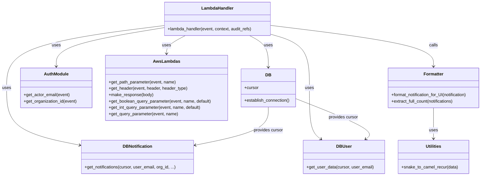

# Diagram: common/notification_service/notification_service/get_notifications.py


> Auto-generated by Obscura crawlers

## Diagram 1

```mermaid
flowchart LR
    Start([Start]) --> ReceiveEvent[/"Receive event (lambda_handler)"/]
    ReceiveEvent --> GetUserEmail[get_actor_email(event)]
    ReceiveEvent --> GetPath[get_path_parameter(event, "notification_id")]
    ReceiveEvent --> CheckMock[get_header HeaderOptions.MOCK ?]
    CheckMock -->|true & notification_id != null| ReturnEmptyMock[make_response({})]
    CheckMock -->|true & notification_id == null| ReturnMockList[make_response(mock notifications list)]
    CheckMock -->|false| DBConnect[DB_CONN.establish_connection()]
    DBConnect --> Cursor[cursor = DB_CONN.cursor]
    Cursor --> GetOrg[get_organization_id(event)]
    Cursor --> CheckUser[db_user.get_user_data(cursor, user_email)]
    CheckUser -->|no user & notification_id != null| ReturnEmptyDataSingle[make_response({"data":[]})]
    CheckUser -->|no user & notification_id == null| ReturnEmptyDataList[make_response({"meta":{totalPages:0,currentPage:0,totalCount:0,"unreadCount":0},"data":[]})]
    CheckUser -->|user exists & notification_id != null| GetSingle[db_notification.get_notifications(cursor, user_email, org_id, notification_id)]
    GetSingle --> FormatSingle[format_notification_for_UI(notification)]
    FormatSingle --> ReturnSingle[make_response({"data": formatted})]
    CheckUser -->|user exists & notification_id == null| ParsePaging[get_int_qsp page_number/page_size; parse qsp filters]
    ParsePaging --> QueryNotifications[db_notification.get_notifications(cursor, user_email, org_id, page_number, page_size, is_read, event_ts_to, event_ts_from)]
    QueryNotifications --> TotalCount[total_count = extract_full_count(notifications)]
    QueryNotifications --> UnreadCount[extract_full_count(db_notification.get_notifications(..., is_read=False))]
    QueryNotifications --> FormatLoop{notifications != None}
    FormatLoop -->|true| ForEach[/for notification in notifications/]
    ForEach --> FormatItem[format_notification_for_UI(notification)]
    FormatItem --> CollectResults[append formatted to results]
    CollectResults --> EndLoop{all processed}
    EndLoop --> BuildResponse[make_response({"meta":{totalPages:ceil(total_count/page_size),currentPage:page_number,totalCount:total_count,"unreadCount":unread_count},"data":results})]
    BuildResponse --> End([End])
```

> SVG rendering failed for this diagram.

## Diagram 2



### SVG

<svg id="container" width="1813.28515625" xmlns="http://www.w3.org/2000/svg" class="classDiagram" height="662" viewBox="0 0 1813.28515625 662" role="graphics-document document" aria-roledescription="class"><style>#container{font-family:"trebuchet ms",verdana,arial,sans-serif;font-size:16px;fill:#333;}@keyframes edge-animation-frame{from{stroke-dashoffset:0;}}@keyframes dash{to{stroke-dashoffset:0;}}#container .edge-animation-slow{stroke-dasharray:9,5!important;stroke-dashoffset:900;animation:dash 50s linear infinite;stroke-linecap:round;}#container .edge-animation-fast{stroke-dasharray:9,5!important;stroke-dashoffset:900;animation:dash 20s linear infinite;stroke-linecap:round;}#container .error-icon{fill:#552222;}#container .error-text{fill:#552222;stroke:#552222;}#container .edge-thickness-normal{stroke-width:1px;}#container .edge-thickness-thick{stroke-width:3.5px;}#container .edge-pattern-solid{stroke-dasharray:0;}#container .edge-thickness-invisible{stroke-width:0;fill:none;}#container .edge-pattern-dashed{stroke-dasharray:3;}#container .edge-pattern-dotted{stroke-dasharray:2;}#container .marker{fill:#333333;stroke:#333333;}#container .marker.cross{stroke:#333333;}#container svg{font-family:"trebuchet ms",verdana,arial,sans-serif;font-size:16px;}#container p{margin:0;}#container g.classGroup text{fill:#9370DB;stroke:none;font-family:"trebuchet ms",verdana,arial,sans-serif;font-size:10px;}#container g.classGroup text .title{font-weight:bolder;}#container .nodeLabel,#container .edgeLabel{color:#131300;}#container .edgeLabel .label rect{fill:#ECECFF;}#container .label text{fill:#131300;}#container .labelBkg{background:#ECECFF;}#container .edgeLabel .label span{background:#ECECFF;}#container .classTitle{font-weight:bolder;}#container .node rect,#container .node circle,#container .node ellipse,#container .node polygon,#container .node path{fill:#ECECFF;stroke:#9370DB;stroke-width:1px;}#container .divider{stroke:#9370DB;stroke-width:1;}#container g.clickable{cursor:pointer;}#container g.classGroup rect{fill:#ECECFF;stroke:#9370DB;}#container g.classGroup line{stroke:#9370DB;stroke-width:1;}#container .classLabel .box{stroke:none;stroke-width:0;fill:#ECECFF;opacity:0.5;}#container .classLabel .label{fill:#9370DB;font-size:10px;}#container .relation{stroke:#333333;stroke-width:1;fill:none;}#container .dashed-line{stroke-dasharray:3;}#container .dotted-line{stroke-dasharray:1 2;}#container #compositionStart,#container .composition{fill:#333333!important;stroke:#333333!important;stroke-width:1;}#container #compositionEnd,#container .composition{fill:#333333!important;stroke:#333333!important;stroke-width:1;}#container #dependencyStart,#container .dependency{fill:#333333!important;stroke:#333333!important;stroke-width:1;}#container #dependencyStart,#container .dependency{fill:#333333!important;stroke:#333333!important;stroke-width:1;}#container #extensionStart,#container .extension{fill:transparent!important;stroke:#333333!important;stroke-width:1;}#container #extensionEnd,#container .extension{fill:transparent!important;stroke:#333333!important;stroke-width:1;}#container #aggregationStart,#container .aggregation{fill:transparent!important;stroke:#333333!important;stroke-width:1;}#container #aggregationEnd,#container .aggregation{fill:transparent!important;stroke:#333333!important;stroke-width:1;}#container #lollipopStart,#container .lollipop{fill:#ECECFF!important;stroke:#333333!important;stroke-width:1;}#container #lollipopEnd,#container .lollipop{fill:#ECECFF!important;stroke:#333333!important;stroke-width:1;}#container .edgeTerminals{font-size:11px;line-height:initial;}#container .classTitleText{text-anchor:middle;font-size:18px;fill:#333;}#container .label-icon{display:inline-block;height:1em;overflow:visible;vertical-align:-0.125em;}#container .node .label-icon path{fill:currentColor;stroke:revert;stroke-width:revert;}#container :root{--mermaid-font-family:"trebuchet ms",verdana,arial,sans-serif;}</style><g><defs><marker id="container_class-aggregationStart" class="marker aggregation class" refX="18" refY="7" markerWidth="190" markerHeight="240" orient="auto"><path d="M 18,7 L9,13 L1,7 L9,1 Z"></path></marker></defs><defs><marker id="container_class-aggregationEnd" class="marker aggregation class" refX="1" refY="7" markerWidth="20" markerHeight="28" orient="auto"><path d="M 18,7 L9,13 L1,7 L9,1 Z"></path></marker></defs><defs><marker id="container_class-extensionStart" class="marker extension class" refX="18" refY="7" markerWidth="190" markerHeight="240" orient="auto"><path d="M 1,7 L18,13 V 1 Z"></path></marker></defs><defs><marker id="container_class-extensionEnd" class="marker extension class" refX="1" refY="7" markerWidth="20" markerHeight="28" orient="auto"><path d="M 1,1 V 13 L18,7 Z"></path></marker></defs><defs><marker id="container_class-compositionStart" class="marker composition class" refX="18" refY="7" markerWidth="190" markerHeight="240" orient="auto"><path d="M 18,7 L9,13 L1,7 L9,1 Z"></path></marker></defs><defs><marker id="container_class-compositionEnd" class="marker composition class" refX="1" refY="7" markerWidth="20" markerHeight="28" orient="auto"><path d="M 18,7 L9,13 L1,7 L9,1 Z"></path></marker></defs><defs><marker id="container_class-dependencyStart" class="marker dependency class" refX="6" refY="7" markerWidth="190" markerHeight="240" orient="auto"><path d="M 5,7 L9,13 L1,7 L9,1 Z"></path></marker></defs><defs><marker id="container_class-dependencyEnd" class="marker dependency class" refX="13" refY="7" markerWidth="20" markerHeight="28" orient="auto"><path d="M 18,7 L9,13 L14,7 L9,1 Z"></path></marker></defs><defs><marker id="container_class-lollipopStart" class="marker lollipop class" refX="13" refY="7" markerWidth="190" markerHeight="240" orient="auto"><circle stroke="black" fill="transparent" cx="7" cy="7" r="6"></circle></marker></defs><defs><marker id="container_class-lollipopEnd" class="marker lollipop class" refX="1" refY="7" markerWidth="190" markerHeight="240" orient="auto"><circle stroke="black" fill="transparent" cx="7" cy="7" r="6"></circle></marker></defs><g class="root"><g class="clusters"></g><g class="edgePaths"><path d="M617.184,104.211L549.493,115.342C481.802,126.474,346.421,148.737,278.73,173.035C211.039,197.333,211.039,223.667,211.039,236.833L211.039,250" id="id_LambdaHandler_AuthModule_1" class="edge-thickness-normal edge-pattern-solid relation" style=";;;" data-edge="true" data-et="edge" data-id="id_LambdaHandler_AuthModule_1" data-points="W3sieCI6NjE3LjE4MzU5Mzc1LCJ5IjoxMDQuMjEwNjQwMjUyMzIzNzh9LHsieCI6MjExLjAzOTA2MjUsInkiOjE3MX0seyJ4IjoyMTEuMDM5MDYyNSwieSI6MjU2fV0=" marker-end="url(#container_class-dependencyEnd)"></path><path d="M698.019,134L686.164,140.167C674.308,146.333,650.598,158.667,638.742,170C626.887,181.333,626.887,191.667,626.887,196.833L626.887,202" id="id_LambdaHandler_AwsLambdas_2" class="edge-thickness-normal edge-pattern-solid relation" style=";;;" data-edge="true" data-et="edge" data-id="id_LambdaHandler_AwsLambdas_2" data-points="W3sieCI6Njk4LjAxOTIxODc0OTk5OTksInkiOjEzNH0seyJ4Ijo2MjYuODg2NzE4NzUsInkiOjE3MX0seyJ4Ijo2MjYuODg2NzE4NzUsInkiOjIwOH1d" marker-end="url(#container_class-dependencyEnd)"></path><path d="M940.254,134L952.11,140.167C963.965,146.333,987.676,158.667,999.531,178.5C1011.387,198.333,1011.387,225.667,1011.387,239.333L1011.387,253" id="id_LambdaHandler_DB_3" class="edge-thickness-normal edge-pattern-solid relation" style=";;;" data-edge="true" data-et="edge" data-id="id_LambdaHandler_DB_3" data-points="W3sieCI6OTQwLjI1NDIxODc1MDAwMDEsInkiOjEzNH0seyJ4IjoxMDExLjM4NjcxODc1LCJ5IjoxNzF9LHsieCI6MTAxMS4zODY3MTg3NSwieSI6MjU5fV0=" marker-end="url(#container_class-dependencyEnd)"></path><path d="M617.184,96.414L518.402,108.845C419.62,121.276,222.056,146.138,123.274,185.236C24.492,224.333,24.492,277.667,24.492,331C24.492,384.333,24.492,437.667,70.568,473.671C116.645,509.675,208.797,528.35,254.873,537.688L300.95,547.026" id="id_LambdaHandler_DBNotification_4" class="edge-thickness-normal edge-pattern-solid relation" style=";;;" data-edge="true" data-et="edge" data-id="id_LambdaHandler_DBNotification_4" data-points="W3sieCI6NjE3LjE4MzU5Mzc1LCJ5Ijo5Ni40MTQyNzIzMDEzOTI2M30seyJ4IjoyNC40OTIxODc1LCJ5IjoxNzF9LHsieCI6MjQuNDkyMTg3NSwieSI6MzMxfSx7IngiOjI0LjQ5MjE4NzUsInkiOjQ5MX0seyJ4IjozMDYuODMwMDc4MTI1LCJ5Ijo1NDguMjE3NDM5NDkwMTkzOH1d" marker-end="url(#container_class-dependencyEnd)"></path><path d="M1021.09,129.125L1045.339,136.104C1069.589,143.083,1118.087,157.042,1142.337,190.687C1166.586,224.333,1166.586,277.667,1166.586,331C1166.586,384.333,1166.586,437.667,1173.719,469.886C1180.851,502.105,1195.117,513.21,1202.249,518.762L1209.382,524.314" id="id_LambdaHandler_DBUser_5" class="edge-thickness-normal edge-pattern-solid relation" style=";;;" data-edge="true" data-et="edge" data-id="id_LambdaHandler_DBUser_5" data-points="W3sieCI6MTAyMS4wODk4NDM3NSwieSI6MTI5LjEyNDUwMTEwNzQwMTA0fSx7IngiOjExNjYuNTg1OTM3NSwieSI6MTcxfSx7IngiOjExNjYuNTg1OTM3NSwieSI6MzMxfSx7IngiOjExNjYuNTg1OTM3NSwieSI6NDkxfSx7IngiOjEyMTQuMTE2NDg0Mzc1LCJ5Ijo1Mjh9XQ==" marker-end="url(#container_class-dependencyEnd)"></path><path d="M1628.754,406L1628.754,420.167C1628.754,434.333,1628.754,462.667,1628.754,482C1628.754,501.333,1628.754,511.667,1628.754,516.833L1628.754,522" id="id_Formatter_Utilities_6" class="edge-thickness-normal edge-pattern-solid relation" style=";;;" data-edge="true" data-et="edge" data-id="id_Formatter_Utilities_6" data-points="W3sieCI6MTYyOC43NTM5MDYyNSwieSI6NDA2fSx7IngiOjE2MjguNzUzOTA2MjUsInkiOjQ5MX0seyJ4IjoxNjI4Ljc1MzkwNjI1LCJ5Ijo1Mjh9XQ==" marker-end="url(#container_class-dependencyEnd)"></path><path d="M1021.09,95.944L1122.367,108.454C1223.645,120.963,1426.199,145.981,1527.477,171.657C1628.754,197.333,1628.754,223.667,1628.754,236.833L1628.754,250" id="id_LambdaHandler_Formatter_7" class="edge-thickness-normal edge-pattern-solid relation" style=";;;" data-edge="true" data-et="edge" data-id="id_LambdaHandler_Formatter_7" data-points="W3sieCI6MTAyMS4wODk4NDM3NSwieSI6OTUuOTQ0MjczNDMxNjk1MTV9LHsieCI6MTYyOC43NTM5MDYyNSwieSI6MTcxfSx7IngiOjE2MjguNzUzOTA2MjUsInkiOjI1Nn1d" marker-end="url(#container_class-dependencyEnd)"></path><path d="M1011.387,403L1011.387,417.667C1011.387,432.333,1011.387,461.667,965.31,485.671C919.234,509.675,827.082,528.35,781.006,537.688L734.929,547.026" id="id_DB_DBNotification_8" class="edge-thickness-normal edge-pattern-solid relation" style=";;;" data-edge="true" data-et="edge" data-id="id_DB_DBNotification_8" data-points="W3sieCI6MTAxMS4zODY3MTg3NSwieSI6NDAzfSx7IngiOjEwMTEuMzg2NzE4NzUsInkiOjQ5MX0seyJ4Ijo3MjkuMDQ4ODI4MTI1LCJ5Ijo1NDguMjE3NDM5NDkwMTkzOH1d" marker-end="url(#container_class-dependencyEnd)"></path><path d="M1115.094,372.06L1165.162,391.883C1215.231,411.707,1315.368,451.353,1358.778,476.705C1402.188,502.056,1388.87,513.112,1382.211,518.64L1375.553,524.168" id="id_DB_DBUser_9" class="edge-thickness-normal edge-pattern-solid relation" style=";;;" data-edge="true" data-et="edge" data-id="id_DB_DBUser_9" data-points="W3sieCI6MTExNS4wOTM3NSwieSI6MzcyLjA1OTk4Mjg5MTAyOTR9LHsieCI6MTQxNS41MDU4NTkzNzUsInkiOjQ5MX0seyJ4IjoxMzcwLjkzNjAzNTE1NjI1LCJ5Ijo1Mjh9XQ==" marker-end="url(#container_class-dependencyEnd)"></path></g><g class="edgeLabels"><g class="edgeLabel" transform="translate(211.0390625, 171)"><g class="label" data-id="id_LambdaHandler_AuthModule_1" transform="translate(-16.4921875, -12)"><foreignObject width="32.984375" height="24"><div xmlns="http://www.w3.org/1999/xhtml" class="labelBkg" style="display: table-cell; white-space: nowrap; line-height: 1.5; max-width: 200px; text-align: center;"><span class="edgeLabel"><p>uses</p></span></div></foreignObject></g></g><g class="edgeLabel" transform="translate(626.88671875, 171)"><g class="label" data-id="id_LambdaHandler_AwsLambdas_2" transform="translate(-16.4921875, -12)"><foreignObject width="32.984375" height="24"><div xmlns="http://www.w3.org/1999/xhtml" class="labelBkg" style="display: table-cell; white-space: nowrap; line-height: 1.5; max-width: 200px; text-align: center;"><span class="edgeLabel"><p>uses</p></span></div></foreignObject></g></g><g class="edgeLabel" transform="translate(1011.38671875, 171)"><g class="label" data-id="id_LambdaHandler_DB_3" transform="translate(-16.4921875, -12)"><foreignObject width="32.984375" height="24"><div xmlns="http://www.w3.org/1999/xhtml" class="labelBkg" style="display: table-cell; white-space: nowrap; line-height: 1.5; max-width: 200px; text-align: center;"><span class="edgeLabel"><p>uses</p></span></div></foreignObject></g></g><g class="edgeLabel" transform="translate(24.4921875, 331)"><g class="label" data-id="id_LambdaHandler_DBNotification_4" transform="translate(-16.4921875, -12)"><foreignObject width="32.984375" height="24"><div xmlns="http://www.w3.org/1999/xhtml" class="labelBkg" style="display: table-cell; white-space: nowrap; line-height: 1.5; max-width: 200px; text-align: center;"><span class="edgeLabel"><p>uses</p></span></div></foreignObject></g></g><g class="edgeLabel" transform="translate(1166.5859375, 331)"><g class="label" data-id="id_LambdaHandler_DBUser_5" transform="translate(-16.4921875, -12)"><foreignObject width="32.984375" height="24"><div xmlns="http://www.w3.org/1999/xhtml" class="labelBkg" style="display: table-cell; white-space: nowrap; line-height: 1.5; max-width: 200px; text-align: center;"><span class="edgeLabel"><p>uses</p></span></div></foreignObject></g></g><g class="edgeLabel" transform="translate(1628.75390625, 491)"><g class="label" data-id="id_Formatter_Utilities_6" transform="translate(-16.4921875, -12)"><foreignObject width="32.984375" height="24"><div xmlns="http://www.w3.org/1999/xhtml" class="labelBkg" style="display: table-cell; white-space: nowrap; line-height: 1.5; max-width: 200px; text-align: center;"><span class="edgeLabel"><p>uses</p></span></div></foreignObject></g></g><g class="edgeLabel" transform="translate(1628.75390625, 171)"><g class="label" data-id="id_LambdaHandler_Formatter_7" transform="translate(-16.4453125, -12)"><foreignObject width="32.890625" height="24"><div xmlns="http://www.w3.org/1999/xhtml" class="labelBkg" style="display: table-cell; white-space: nowrap; line-height: 1.5; max-width: 200px; text-align: center;"><span class="edgeLabel"><p>calls</p></span></div></foreignObject></g></g><g class="edgeLabel" transform="translate(1011.38671875, 491)"><g class="label" data-id="id_DB_DBNotification_8" transform="translate(-56.296875, -12)"><foreignObject width="112.59375" height="24"><div xmlns="http://www.w3.org/1999/xhtml" class="labelBkg" style="display: table-cell; white-space: nowrap; line-height: 1.5; max-width: 200px; text-align: center;"><span class="edgeLabel"><p>provides cursor</p></span></div></foreignObject></g></g><g class="edgeLabel" transform="translate(1292.22916, 442.19194)"><g class="label" data-id="id_DB_DBUser_9" transform="translate(-56.296875, -12)"><foreignObject width="112.59375" height="24"><div xmlns="http://www.w3.org/1999/xhtml" class="labelBkg" style="display: table-cell; white-space: nowrap; line-height: 1.5; max-width: 200px; text-align: center;"><span class="edgeLabel"><p>provides cursor</p></span></div></foreignObject></g></g></g><g class="nodes"><g class="node default" id="classId-LambdaHandler-0" transform="translate(819.13671875, 71)"><g class="basic label-container"><path d="M-201.953125 -63 L201.953125 -63 L201.953125 63 L-201.953125 63" stroke="none" stroke-width="0" fill="#ECECFF" style=""></path><path d="M-201.953125 -63 C-92.66541418484772 -63, 16.62229663030456 -63, 201.953125 -63 M-201.953125 -63 C-93.91521345153944 -63, 14.122698096921113 -63, 201.953125 -63 M201.953125 -63 C201.953125 -32.43724754957355, 201.953125 -1.8744950991470972, 201.953125 63 M201.953125 -63 C201.953125 -34.5050946351649, 201.953125 -6.010189270329803, 201.953125 63 M201.953125 63 C72.9792345445583 63, -55.99465591088341 63, -201.953125 63 M201.953125 63 C110.91623422233143 63, 19.87934344466285 63, -201.953125 63 M-201.953125 63 C-201.953125 22.39145426014978, -201.953125 -18.217091479700443, -201.953125 -63 M-201.953125 63 C-201.953125 23.73956967249807, -201.953125 -15.520860655003858, -201.953125 -63" stroke="#9370DB" stroke-width="1.3" fill="none" stroke-dasharray="0 0" style=""></path></g><g class="annotation-group text" transform="translate(0, -39)"></g><g class="label-group text" transform="translate(-58.21875, -39)"><g class="label" style="font-weight: bolder" transform="translate(0,-12)"><foreignObject width="116.4375" height="24"><div xmlns="http://www.w3.org/1999/xhtml" style="display: table-cell; white-space: nowrap; line-height: 1.5; max-width: 167px; text-align: center;"><span class="nodeLabel markdown-node-label" style=""><p>LambdaHandler</p></span></div></foreignObject></g></g><g class="members-group text" transform="translate(-189.953125, 9)"></g><g class="methods-group text" transform="translate(-189.953125, 39)"><g class="label" style="" transform="translate(0,-12)"><foreignObject width="321.6875" height="24"><div xmlns="http://www.w3.org/1999/xhtml" style="display: table-cell; white-space: nowrap; line-height: 1.5; max-width: 379px; text-align: center;"><span class="nodeLabel markdown-node-label" style=""><p>+lambda_handler(event, context, audit_refs)</p></span></div></foreignObject></g></g><g class="divider" style=""><path d="M-201.953125 -15 C-90.03274387502009 -15, 21.887637249959823 -15, 201.953125 -15 M-201.953125 -15 C-104.60548982564515 -15, -7.257854651290302 -15, 201.953125 -15" stroke="#9370DB" stroke-width="1.3" fill="none" stroke-dasharray="0 0" style=""></path></g><g class="divider" style=""><path d="M-201.953125 9 C-114.66933324836107 9, -27.38554149672214 9, 201.953125 9 M-201.953125 9 C-48.08627566860028 9, 105.78057366279944 9, 201.953125 9" stroke="#9370DB" stroke-width="1.3" fill="none" stroke-dasharray="0 0" style=""></path></g></g><g class="node default" id="classId-DB-1" transform="translate(1011.38671875, 331)"><g class="basic label-container"><path d="M-103.70703125 -72 L103.70703125 -72 L103.70703125 72 L-103.70703125 72" stroke="none" stroke-width="0" fill="#ECECFF" style=""></path><path d="M-103.70703125 -72 C-52.59736906051549 -72, -1.48770687103098 -72, 103.70703125 -72 M-103.70703125 -72 C-42.26457201359431 -72, 19.17788722281138 -72, 103.70703125 -72 M103.70703125 -72 C103.70703125 -40.08171975962958, 103.70703125 -8.163439519259164, 103.70703125 72 M103.70703125 -72 C103.70703125 -28.402887110492394, 103.70703125 15.194225779015213, 103.70703125 72 M103.70703125 72 C58.31192743228326 72, 12.916823614566525 72, -103.70703125 72 M103.70703125 72 C59.55829162113166 72, 15.409551992263317 72, -103.70703125 72 M-103.70703125 72 C-103.70703125 22.00416875146766, -103.70703125 -27.99166249706468, -103.70703125 -72 M-103.70703125 72 C-103.70703125 24.369910515925085, -103.70703125 -23.26017896814983, -103.70703125 -72" stroke="#9370DB" stroke-width="1.3" fill="none" stroke-dasharray="0 0" style=""></path></g><g class="annotation-group text" transform="translate(0, -48)"></g><g class="label-group text" transform="translate(-10.1484375, -48)"><g class="label" style="font-weight: bolder" transform="translate(0,-12)"><foreignObject width="20.296875" height="24"><div xmlns="http://www.w3.org/1999/xhtml" style="display: table-cell; white-space: nowrap; line-height: 1.5; max-width: 70px; text-align: center;"><span class="nodeLabel markdown-node-label" style=""><p>DB</p></span></div></foreignObject></g></g><g class="members-group text" transform="translate(-91.70703125, 0)"><g class="label" style="" transform="translate(0,-12)"><foreignObject width="53.71875" height="24"><div xmlns="http://www.w3.org/1999/xhtml" style="display: table-cell; white-space: nowrap; line-height: 1.5; max-width: 112px; text-align: center;"><span class="nodeLabel markdown-node-label" style=""><p>+cursor</p></span></div></foreignObject></g></g><g class="methods-group text" transform="translate(-91.70703125, 48)"><g class="label" style="" transform="translate(0,-12)"><foreignObject width="173.265625" height="24"><div xmlns="http://www.w3.org/1999/xhtml" style="display: table-cell; white-space: nowrap; line-height: 1.5; max-width: 231px; text-align: center;"><span class="nodeLabel markdown-node-label" style=""><p>+establish_connection()</p></span></div></foreignObject></g></g><g class="divider" style=""><path d="M-103.70703125 -24 C-20.901669059037104 -24, 61.90369313192579 -24, 103.70703125 -24 M-103.70703125 -24 C-45.40138279979212 -24, 12.904265650415766 -24, 103.70703125 -24" stroke="#9370DB" stroke-width="1.3" fill="none" stroke-dasharray="0 0" style=""></path></g><g class="divider" style=""><path d="M-103.70703125 24 C-48.99354002210294 24, 5.719951205794118 24, 103.70703125 24 M-103.70703125 24 C-38.55981717455899 24, 26.587396900882027 24, 103.70703125 24" stroke="#9370DB" stroke-width="1.3" fill="none" stroke-dasharray="0 0" style=""></path></g></g><g class="node default" id="classId-AuthModule-2" transform="translate(211.0390625, 331)"><g class="basic label-container"><path d="M-135.0546875 -75 L135.0546875 -75 L135.0546875 75 L-135.0546875 75" stroke="none" stroke-width="0" fill="#ECECFF" style=""></path><path d="M-135.0546875 -75 C-54.536391694923026 -75, 25.98190411015395 -75, 135.0546875 -75 M-135.0546875 -75 C-57.51930489608513 -75, 20.016077707829737 -75, 135.0546875 -75 M135.0546875 -75 C135.0546875 -36.717375840565225, 135.0546875 1.5652483188695498, 135.0546875 75 M135.0546875 -75 C135.0546875 -38.11423254514258, 135.0546875 -1.2284650902851553, 135.0546875 75 M135.0546875 75 C33.54054207652976 75, -67.97360334694048 75, -135.0546875 75 M135.0546875 75 C70.39531209464144 75, 5.73593668928288 75, -135.0546875 75 M-135.0546875 75 C-135.0546875 22.375845720991123, -135.0546875 -30.248308558017754, -135.0546875 -75 M-135.0546875 75 C-135.0546875 25.837316181317163, -135.0546875 -23.325367637365673, -135.0546875 -75" stroke="#9370DB" stroke-width="1.3" fill="none" stroke-dasharray="0 0" style=""></path></g><g class="annotation-group text" transform="translate(0, -51)"></g><g class="label-group text" transform="translate(-44.09375, -51)"><g class="label" style="font-weight: bolder" transform="translate(0,-12)"><foreignObject width="88.1875" height="24"><div xmlns="http://www.w3.org/1999/xhtml" style="display: table-cell; white-space: nowrap; line-height: 1.5; max-width: 138px; text-align: center;"><span class="nodeLabel markdown-node-label" style=""><p>AuthModule</p></span></div></foreignObject></g></g><g class="members-group text" transform="translate(-123.0546875, -3)"></g><g class="methods-group text" transform="translate(-123.0546875, 27)"><g class="label" style="" transform="translate(0,-12)"><foreignObject width="173.71875" height="24"><div xmlns="http://www.w3.org/1999/xhtml" style="display: table-cell; white-space: nowrap; line-height: 1.5; max-width: 231px; text-align: center;"><span class="nodeLabel markdown-node-label" style=""><p>+get_actor_email(event)</p></span></div></foreignObject></g><g class="label" style="" transform="translate(0,12)"><foreignObject width="202.015625" height="24"><div xmlns="http://www.w3.org/1999/xhtml" style="display: table-cell; white-space: nowrap; line-height: 1.5; max-width: 259px; text-align: center;"><span class="nodeLabel markdown-node-label" style=""><p>+get_organization_id(event)</p></span></div></foreignObject></g></g><g class="divider" style=""><path d="M-135.0546875 -27 C-52.501714351614666 -27, 30.051258796770668 -27, 135.0546875 -27 M-135.0546875 -27 C-43.55196965957751 -27, 47.95074818084498 -27, 135.0546875 -27" stroke="#9370DB" stroke-width="1.3" fill="none" stroke-dasharray="0 0" style=""></path></g><g class="divider" style=""><path d="M-135.0546875 -3 C-41.57375365173752 -3, 51.90718019652496 -3, 135.0546875 -3 M-135.0546875 -3 C-27.924491583452664 -3, 79.20570433309467 -3, 135.0546875 -3" stroke="#9370DB" stroke-width="1.3" fill="none" stroke-dasharray="0 0" style=""></path></g></g><g class="node default" id="classId-AwsLambdas-3" transform="translate(626.88671875, 331)"><g class="basic label-container"><path d="M-230.79296875 -123 L230.79296875 -123 L230.79296875 123 L-230.79296875 123" stroke="none" stroke-width="0" fill="#ECECFF" style=""></path><path d="M-230.79296875 -123 C-132.8616754579362 -123, -34.9303821658724 -123, 230.79296875 -123 M-230.79296875 -123 C-85.12408565797139 -123, 60.544797434057216 -123, 230.79296875 -123 M230.79296875 -123 C230.79296875 -67.24072542670574, 230.79296875 -11.481450853411474, 230.79296875 123 M230.79296875 -123 C230.79296875 -71.58723424391044, 230.79296875 -20.174468487820903, 230.79296875 123 M230.79296875 123 C107.59137184777856 123, -15.610225054442878 123, -230.79296875 123 M230.79296875 123 C121.53535994271778 123, 12.277751135435551 123, -230.79296875 123 M-230.79296875 123 C-230.79296875 69.25248366477713, -230.79296875 15.504967329554262, -230.79296875 -123 M-230.79296875 123 C-230.79296875 35.04317658526648, -230.79296875 -52.91364682946704, -230.79296875 -123" stroke="#9370DB" stroke-width="1.3" fill="none" stroke-dasharray="0 0" style=""></path></g><g class="annotation-group text" transform="translate(0, -99)"></g><g class="label-group text" transform="translate(-47.4921875, -99)"><g class="label" style="font-weight: bolder" transform="translate(0,-12)"><foreignObject width="94.984375" height="24"><div xmlns="http://www.w3.org/1999/xhtml" style="display: table-cell; white-space: nowrap; line-height: 1.5; max-width: 143px; text-align: center;"><span class="nodeLabel markdown-node-label" style=""><p>AwsLambdas</p></span></div></foreignObject></g></g><g class="members-group text" transform="translate(-218.79296875, -51)"></g><g class="methods-group text" transform="translate(-218.79296875, -21)"><g class="label" style="" transform="translate(0,-12)"><foreignObject width="254.984375" height="24"><div xmlns="http://www.w3.org/1999/xhtml" style="display: table-cell; white-space: nowrap; line-height: 1.5; max-width: 312px; text-align: center;"><span class="nodeLabel markdown-node-label" style=""><p>+get_path_parameter(event, name)</p></span></div></foreignObject></g><g class="label" style="" transform="translate(0,12)"><foreignObject width="296.34375" height="24"><div xmlns="http://www.w3.org/1999/xhtml" style="display: table-cell; white-space: nowrap; line-height: 1.5; max-width: 354px; text-align: center;"><span class="nodeLabel markdown-node-label" style=""><p>+get_header(event, header, header_type)</p></span></div></foreignObject></g><g class="label" style="" transform="translate(0,36)"><foreignObject width="168.140625" height="24"><div xmlns="http://www.w3.org/1999/xhtml" style="display: table-cell; white-space: nowrap; line-height: 1.5; max-width: 226px; text-align: center;"><span class="nodeLabel markdown-node-label" style=""><p>+make_response(body)</p></span></div></foreignObject></g><g class="label" style="" transform="translate(0,60)"><foreignObject width="390.09375" height="24"><div xmlns="http://www.w3.org/1999/xhtml" style="display: table-cell; white-space: nowrap; line-height: 1.5; max-width: 447px; text-align: center;"><span class="nodeLabel markdown-node-label" style=""><p>+get_boolean_query_parameter(event, name, default)</p></span></div></foreignObject></g><g class="label" style="" transform="translate(0,84)"><foreignObject width="350.3125" height="24"><div xmlns="http://www.w3.org/1999/xhtml" style="display: table-cell; white-space: nowrap; line-height: 1.5; max-width: 408px; text-align: center;"><span class="nodeLabel markdown-node-label" style=""><p>+get_int_query_parameter(event, name, default)</p></span></div></foreignObject></g><g class="label" style="" transform="translate(0,108)"><foreignObject width="262.625" height="24"><div xmlns="http://www.w3.org/1999/xhtml" style="display: table-cell; white-space: nowrap; line-height: 1.5; max-width: 320px; text-align: center;"><span class="nodeLabel markdown-node-label" style=""><p>+get_query_parameter(event, name)</p></span></div></foreignObject></g></g><g class="divider" style=""><path d="M-230.79296875 -75 C-64.26035800369635 -75, 102.2722527426073 -75, 230.79296875 -75 M-230.79296875 -75 C-92.23437413832087 -75, 46.32422047335825 -75, 230.79296875 -75" stroke="#9370DB" stroke-width="1.3" fill="none" stroke-dasharray="0 0" style=""></path></g><g class="divider" style=""><path d="M-230.79296875 -51 C-47.18649109836696 -51, 136.41998655326609 -51, 230.79296875 -51 M-230.79296875 -51 C-70.72692120722678 -51, 89.33912633554644 -51, 230.79296875 -51" stroke="#9370DB" stroke-width="1.3" fill="none" stroke-dasharray="0 0" style=""></path></g></g><g class="node default" id="classId-DBNotification-4" transform="translate(517.939453125, 591)"><g class="basic label-container"><path d="M-211.109375 -63 L211.109375 -63 L211.109375 63 L-211.109375 63" stroke="none" stroke-width="0" fill="#ECECFF" style=""></path><path d="M-211.109375 -63 C-98.32886627576033 -63, 14.451642448479333 -63, 211.109375 -63 M-211.109375 -63 C-64.82236834780491 -63, 81.46463830439018 -63, 211.109375 -63 M211.109375 -63 C211.109375 -14.861014332957971, 211.109375 33.27797133408406, 211.109375 63 M211.109375 -63 C211.109375 -20.816572970811066, 211.109375 21.366854058377868, 211.109375 63 M211.109375 63 C51.40614537931867 63, -108.29708424136265 63, -211.109375 63 M211.109375 63 C89.71492562715854 63, -31.67952374568293 63, -211.109375 63 M-211.109375 63 C-211.109375 28.029026855567466, -211.109375 -6.9419462888650685, -211.109375 -63 M-211.109375 63 C-211.109375 34.06448139699273, -211.109375 5.128962793985458, -211.109375 -63" stroke="#9370DB" stroke-width="1.3" fill="none" stroke-dasharray="0 0" style=""></path></g><g class="annotation-group text" transform="translate(0, -39)"></g><g class="label-group text" transform="translate(-53.03125, -39)"><g class="label" style="font-weight: bolder" transform="translate(0,-12)"><foreignObject width="106.0625" height="24"><div xmlns="http://www.w3.org/1999/xhtml" style="display: table-cell; white-space: nowrap; line-height: 1.5; max-width: 155px; text-align: center;"><span class="nodeLabel markdown-node-label" style=""><p>DBNotification</p></span></div></foreignObject></g></g><g class="members-group text" transform="translate(-199.109375, 9)"></g><g class="methods-group text" transform="translate(-199.109375, 39)"><g class="label" style="" transform="translate(0,-12)"><foreignObject width="345.1875" height="24"><div xmlns="http://www.w3.org/1999/xhtml" style="display: table-cell; white-space: nowrap; line-height: 1.5; max-width: 403px; text-align: center;"><span class="nodeLabel markdown-node-label" style=""><p>+get_notifications(cursor, user_email, org_id, ...)</p></span></div></foreignObject></g></g><g class="divider" style=""><path d="M-211.109375 -15 C-115.66181013116538 -15, -20.214245262330763 -15, 211.109375 -15 M-211.109375 -15 C-92.77006246260605 -15, 25.569250074787902 -15, 211.109375 -15" stroke="#9370DB" stroke-width="1.3" fill="none" stroke-dasharray="0 0" style=""></path></g><g class="divider" style=""><path d="M-211.109375 9 C-74.42017272587103 9, 62.26902954825795 9, 211.109375 9 M-211.109375 9 C-81.39946335785544 9, 48.31044828428912 9, 211.109375 9" stroke="#9370DB" stroke-width="1.3" fill="none" stroke-dasharray="0 0" style=""></path></g></g><g class="node default" id="classId-DBUser-5" transform="translate(1295.046875, 591)"><g class="basic label-container"><path d="M-151.01171875 -63 L151.01171875 -63 L151.01171875 63 L-151.01171875 63" stroke="none" stroke-width="0" fill="#ECECFF" style=""></path><path d="M-151.01171875 -63 C-89.93161165648752 -63, -28.85150456297505 -63, 151.01171875 -63 M-151.01171875 -63 C-55.815837870216086 -63, 39.38004300956783 -63, 151.01171875 -63 M151.01171875 -63 C151.01171875 -29.7677602166143, 151.01171875 3.464479566771402, 151.01171875 63 M151.01171875 -63 C151.01171875 -35.82390861276568, 151.01171875 -8.647817225531355, 151.01171875 63 M151.01171875 63 C60.17391498548987 63, -30.663888779020255 63, -151.01171875 63 M151.01171875 63 C66.72439873261824 63, -17.56292128476352 63, -151.01171875 63 M-151.01171875 63 C-151.01171875 24.900615781788602, -151.01171875 -13.198768436422796, -151.01171875 -63 M-151.01171875 63 C-151.01171875 20.231085145793678, -151.01171875 -22.537829708412644, -151.01171875 -63" stroke="#9370DB" stroke-width="1.3" fill="none" stroke-dasharray="0 0" style=""></path></g><g class="annotation-group text" transform="translate(0, -39)"></g><g class="label-group text" transform="translate(-26.8046875, -39)"><g class="label" style="font-weight: bolder" transform="translate(0,-12)"><foreignObject width="53.609375" height="24"><div xmlns="http://www.w3.org/1999/xhtml" style="display: table-cell; white-space: nowrap; line-height: 1.5; max-width: 104px; text-align: center;"><span class="nodeLabel markdown-node-label" style=""><p>DBUser</p></span></div></foreignObject></g></g><g class="members-group text" transform="translate(-139.01171875, 9)"></g><g class="methods-group text" transform="translate(-139.01171875, 39)"><g class="label" style="" transform="translate(0,-12)"><foreignObject width="251.21875" height="24"><div xmlns="http://www.w3.org/1999/xhtml" style="display: table-cell; white-space: nowrap; line-height: 1.5; max-width: 309px; text-align: center;"><span class="nodeLabel markdown-node-label" style=""><p>+get_user_data(cursor, user_email)</p></span></div></foreignObject></g></g><g class="divider" style=""><path d="M-151.01171875 -15 C-57.79441450267335 -15, 35.422889744653304 -15, 151.01171875 -15 M-151.01171875 -15 C-42.2125305468046 -15, 66.5866576563908 -15, 151.01171875 -15" stroke="#9370DB" stroke-width="1.3" fill="none" stroke-dasharray="0 0" style=""></path></g><g class="divider" style=""><path d="M-151.01171875 9 C-47.13523749929682 9, 56.74124375140636 9, 151.01171875 9 M-151.01171875 9 C-38.16573070961077 9, 74.68025733077846 9, 151.01171875 9" stroke="#9370DB" stroke-width="1.3" fill="none" stroke-dasharray="0 0" style=""></path></g></g><g class="node default" id="classId-Utilities-6" transform="translate(1628.75390625, 591)"><g class="basic label-container"><path d="M-132.6953125 -63 L132.6953125 -63 L132.6953125 63 L-132.6953125 63" stroke="none" stroke-width="0" fill="#ECECFF" style=""></path><path d="M-132.6953125 -63 C-76.25529493416465 -63, -19.81527736832932 -63, 132.6953125 -63 M-132.6953125 -63 C-27.87507107447061 -63, 76.94517035105878 -63, 132.6953125 -63 M132.6953125 -63 C132.6953125 -30.673536606902616, 132.6953125 1.6529267861947687, 132.6953125 63 M132.6953125 -63 C132.6953125 -23.880343806692522, 132.6953125 15.239312386614955, 132.6953125 63 M132.6953125 63 C36.55726637357263 63, -59.58077975285474 63, -132.6953125 63 M132.6953125 63 C58.41175902552118 63, -15.871794448957644 63, -132.6953125 63 M-132.6953125 63 C-132.6953125 23.795280336905094, -132.6953125 -15.409439326189812, -132.6953125 -63 M-132.6953125 63 C-132.6953125 27.89298078417289, -132.6953125 -7.214038431654217, -132.6953125 -63" stroke="#9370DB" stroke-width="1.3" fill="none" stroke-dasharray="0 0" style=""></path></g><g class="annotation-group text" transform="translate(0, -39)"></g><g class="label-group text" transform="translate(-28.8125, -39)"><g class="label" style="font-weight: bolder" transform="translate(0,-12)"><foreignObject width="57.625" height="24"><div xmlns="http://www.w3.org/1999/xhtml" style="display: table-cell; white-space: nowrap; line-height: 1.5; max-width: 107px; text-align: center;"><span class="nodeLabel markdown-node-label" style=""><p>Utilities</p></span></div></foreignObject></g></g><g class="members-group text" transform="translate(-120.6953125, 9)"></g><g class="methods-group text" transform="translate(-120.6953125, 39)"><g class="label" style="" transform="translate(0,-12)"><foreignObject width="212.578125" height="24"><div xmlns="http://www.w3.org/1999/xhtml" style="display: table-cell; white-space: nowrap; line-height: 1.5; max-width: 270px; text-align: center;"><span class="nodeLabel markdown-node-label" style=""><p>+snake_to_camel_recur(data)</p></span></div></foreignObject></g></g><g class="divider" style=""><path d="M-132.6953125 -15 C-54.49506416798705 -15, 23.705184164025894 -15, 132.6953125 -15 M-132.6953125 -15 C-51.34372552018135 -15, 30.007861459637297 -15, 132.6953125 -15" stroke="#9370DB" stroke-width="1.3" fill="none" stroke-dasharray="0 0" style=""></path></g><g class="divider" style=""><path d="M-132.6953125 9 C-61.031497614234326 9, 10.632317271531349 9, 132.6953125 9 M-132.6953125 9 C-42.490182354858334 9, 47.71494779028333 9, 132.6953125 9" stroke="#9370DB" stroke-width="1.3" fill="none" stroke-dasharray="0 0" style=""></path></g></g><g class="node default" id="classId-Formatter-7" transform="translate(1628.75390625, 331)"><g class="basic label-container"><path d="M-176.53125 -75 L176.53125 -75 L176.53125 75 L-176.53125 75" stroke="none" stroke-width="0" fill="#ECECFF" style=""></path><path d="M-176.53125 -75 C-44.064919132358995 -75, 88.40141173528201 -75, 176.53125 -75 M-176.53125 -75 C-97.1583551607319 -75, -17.785460321463802 -75, 176.53125 -75 M176.53125 -75 C176.53125 -30.516770687721504, 176.53125 13.966458624556992, 176.53125 75 M176.53125 -75 C176.53125 -38.50089434205192, 176.53125 -2.0017886841038433, 176.53125 75 M176.53125 75 C44.32215371422711 75, -87.88694257154577 75, -176.53125 75 M176.53125 75 C48.82681097267613 75, -78.87762805464774 75, -176.53125 75 M-176.53125 75 C-176.53125 26.447496494264648, -176.53125 -22.105007011470704, -176.53125 -75 M-176.53125 75 C-176.53125 23.928738771935876, -176.53125 -27.142522456128248, -176.53125 -75" stroke="#9370DB" stroke-width="1.3" fill="none" stroke-dasharray="0 0" style=""></path></g><g class="annotation-group text" transform="translate(0, -51)"></g><g class="label-group text" transform="translate(-36.296875, -51)"><g class="label" style="font-weight: bolder" transform="translate(0,-12)"><foreignObject width="72.59375" height="24"><div xmlns="http://www.w3.org/1999/xhtml" style="display: table-cell; white-space: nowrap; line-height: 1.5; max-width: 122px; text-align: center;"><span class="nodeLabel markdown-node-label" style=""><p>Formatter</p></span></div></foreignObject></g></g><g class="members-group text" transform="translate(-164.53125, -3)"></g><g class="methods-group text" transform="translate(-164.53125, 27)"><g class="label" style="" transform="translate(0,-12)"><foreignObject width="292.765625" height="24"><div xmlns="http://www.w3.org/1999/xhtml" style="display: table-cell; white-space: nowrap; line-height: 1.5; max-width: 350px; text-align: center;"><span class="nodeLabel markdown-node-label" style=""><p>+format_notification_for_UI(notification)</p></span></div></foreignObject></g><g class="label" style="" transform="translate(0,12)"><foreignObject width="240.28125" height="24"><div xmlns="http://www.w3.org/1999/xhtml" style="display: table-cell; white-space: nowrap; line-height: 1.5; max-width: 298px; text-align: center;"><span class="nodeLabel markdown-node-label" style=""><p>+extract_full_count(notifications)</p></span></div></foreignObject></g></g><g class="divider" style=""><path d="M-176.53125 -27 C-53.67827769881269 -27, 69.17469460237461 -27, 176.53125 -27 M-176.53125 -27 C-47.27083276184652 -27, 81.98958447630696 -27, 176.53125 -27" stroke="#9370DB" stroke-width="1.3" fill="none" stroke-dasharray="0 0" style=""></path></g><g class="divider" style=""><path d="M-176.53125 -3 C-70.98596934917144 -3, 34.55931130165712 -3, 176.53125 -3 M-176.53125 -3 C-59.3917340296878 -3, 57.74778194062441 -3, 176.53125 -3" stroke="#9370DB" stroke-width="1.3" fill="none" stroke-dasharray="0 0" style=""></path></g></g></g></g></g></svg>
