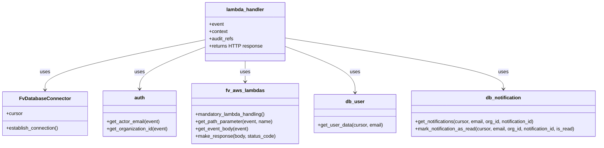

# Diagram: common/notification_service/notification_service/mark_notifications_as_read.py


> Auto-generated by Obscura crawlers

## Diagram 1

```mermaid
flowchart TD
    Event[HTTP Event] -->|path/patch| Lambda[lambda_handler]
    Lambda --> Auth[get_actor_email / get_organization_id]
    Lambda --> DB[DB_CONN.establish_connection()]
    DB --> Cursor[(cursor)]
    Lambda --> CheckUser{db_user.get_user_data}
    CheckUser -- not found --> Error1[NotFoundError: User does not exist]
    CheckUser -- found --> ParseBody[get_event_body -> is_read]
    ParseBody --> DecideNotif{notification_id present?}
    DecideNotif -- yes --> GetNotif[db_notification.get_notifications]
    GetNotif -- not found --> Error2[NotFoundError: Notification does not exist]
    GetNotif -- found --> Mark[db_notification.mark_notification_as_read]
    DecideNotif -- no --> Mark
    Mark --> Response[fv.aws.lambdas.make_response 200 OK]
```

> SVG rendering failed for this diagram.

## Diagram 2



### SVG

<svg id="container" width="1960.9765625" xmlns="http://www.w3.org/2000/svg" class="classDiagram" height="480" viewBox="0 0 1960.9765625 480" role="graphics-document document" aria-roledescription="class"><style>#container{font-family:"trebuchet ms",verdana,arial,sans-serif;font-size:16px;fill:#333;}@keyframes edge-animation-frame{from{stroke-dashoffset:0;}}@keyframes dash{to{stroke-dashoffset:0;}}#container .edge-animation-slow{stroke-dasharray:9,5!important;stroke-dashoffset:900;animation:dash 50s linear infinite;stroke-linecap:round;}#container .edge-animation-fast{stroke-dasharray:9,5!important;stroke-dashoffset:900;animation:dash 20s linear infinite;stroke-linecap:round;}#container .error-icon{fill:#552222;}#container .error-text{fill:#552222;stroke:#552222;}#container .edge-thickness-normal{stroke-width:1px;}#container .edge-thickness-thick{stroke-width:3.5px;}#container .edge-pattern-solid{stroke-dasharray:0;}#container .edge-thickness-invisible{stroke-width:0;fill:none;}#container .edge-pattern-dashed{stroke-dasharray:3;}#container .edge-pattern-dotted{stroke-dasharray:2;}#container .marker{fill:#333333;stroke:#333333;}#container .marker.cross{stroke:#333333;}#container svg{font-family:"trebuchet ms",verdana,arial,sans-serif;font-size:16px;}#container p{margin:0;}#container g.classGroup text{fill:#9370DB;stroke:none;font-family:"trebuchet ms",verdana,arial,sans-serif;font-size:10px;}#container g.classGroup text .title{font-weight:bolder;}#container .nodeLabel,#container .edgeLabel{color:#131300;}#container .edgeLabel .label rect{fill:#ECECFF;}#container .label text{fill:#131300;}#container .labelBkg{background:#ECECFF;}#container .edgeLabel .label span{background:#ECECFF;}#container .classTitle{font-weight:bolder;}#container .node rect,#container .node circle,#container .node ellipse,#container .node polygon,#container .node path{fill:#ECECFF;stroke:#9370DB;stroke-width:1px;}#container .divider{stroke:#9370DB;stroke-width:1;}#container g.clickable{cursor:pointer;}#container g.classGroup rect{fill:#ECECFF;stroke:#9370DB;}#container g.classGroup line{stroke:#9370DB;stroke-width:1;}#container .classLabel .box{stroke:none;stroke-width:0;fill:#ECECFF;opacity:0.5;}#container .classLabel .label{fill:#9370DB;font-size:10px;}#container .relation{stroke:#333333;stroke-width:1;fill:none;}#container .dashed-line{stroke-dasharray:3;}#container .dotted-line{stroke-dasharray:1 2;}#container #compositionStart,#container .composition{fill:#333333!important;stroke:#333333!important;stroke-width:1;}#container #compositionEnd,#container .composition{fill:#333333!important;stroke:#333333!important;stroke-width:1;}#container #dependencyStart,#container .dependency{fill:#333333!important;stroke:#333333!important;stroke-width:1;}#container #dependencyStart,#container .dependency{fill:#333333!important;stroke:#333333!important;stroke-width:1;}#container #extensionStart,#container .extension{fill:transparent!important;stroke:#333333!important;stroke-width:1;}#container #extensionEnd,#container .extension{fill:transparent!important;stroke:#333333!important;stroke-width:1;}#container #aggregationStart,#container .aggregation{fill:transparent!important;stroke:#333333!important;stroke-width:1;}#container #aggregationEnd,#container .aggregation{fill:transparent!important;stroke:#333333!important;stroke-width:1;}#container #lollipopStart,#container .lollipop{fill:#ECECFF!important;stroke:#333333!important;stroke-width:1;}#container #lollipopEnd,#container .lollipop{fill:#ECECFF!important;stroke:#333333!important;stroke-width:1;}#container .edgeTerminals{font-size:11px;line-height:initial;}#container .classTitleText{text-anchor:middle;font-size:18px;fill:#333;}#container .label-icon{display:inline-block;height:1em;overflow:visible;vertical-align:-0.125em;}#container .node .label-icon path{fill:currentColor;stroke:revert;stroke-width:revert;}#container :root{--mermaid-font-family:"trebuchet ms",verdana,arial,sans-serif;}</style><g><defs><marker id="container_class-aggregationStart" class="marker aggregation class" refX="18" refY="7" markerWidth="190" markerHeight="240" orient="auto"><path d="M 18,7 L9,13 L1,7 L9,1 Z"></path></marker></defs><defs><marker id="container_class-aggregationEnd" class="marker aggregation class" refX="1" refY="7" markerWidth="20" markerHeight="28" orient="auto"><path d="M 18,7 L9,13 L1,7 L9,1 Z"></path></marker></defs><defs><marker id="container_class-extensionStart" class="marker extension class" refX="18" refY="7" markerWidth="190" markerHeight="240" orient="auto"><path d="M 1,7 L18,13 V 1 Z"></path></marker></defs><defs><marker id="container_class-extensionEnd" class="marker extension class" refX="1" refY="7" markerWidth="20" markerHeight="28" orient="auto"><path d="M 1,1 V 13 L18,7 Z"></path></marker></defs><defs><marker id="container_class-compositionStart" class="marker composition class" refX="18" refY="7" markerWidth="190" markerHeight="240" orient="auto"><path d="M 18,7 L9,13 L1,7 L9,1 Z"></path></marker></defs><defs><marker id="container_class-compositionEnd" class="marker composition class" refX="1" refY="7" markerWidth="20" markerHeight="28" orient="auto"><path d="M 18,7 L9,13 L1,7 L9,1 Z"></path></marker></defs><defs><marker id="container_class-dependencyStart" class="marker dependency class" refX="6" refY="7" markerWidth="190" markerHeight="240" orient="auto"><path d="M 5,7 L9,13 L1,7 L9,1 Z"></path></marker></defs><defs><marker id="container_class-dependencyEnd" class="marker dependency class" refX="13" refY="7" markerWidth="20" markerHeight="28" orient="auto"><path d="M 18,7 L9,13 L14,7 L9,1 Z"></path></marker></defs><defs><marker id="container_class-lollipopStart" class="marker lollipop class" refX="13" refY="7" markerWidth="190" markerHeight="240" orient="auto"><circle stroke="black" fill="transparent" cx="7" cy="7" r="6"></circle></marker></defs><defs><marker id="container_class-lollipopEnd" class="marker lollipop class" refX="1" refY="7" markerWidth="190" markerHeight="240" orient="auto"><circle stroke="black" fill="transparent" cx="7" cy="7" r="6"></circle></marker></defs><g class="root"><g class="clusters"></g><g class="edgePaths"><path d="M672.582,130.019L584.866,147.85C497.15,165.68,321.717,201.34,234.001,228.837C146.285,256.333,146.285,275.667,146.285,285.333L146.285,295" id="id_lambda_handler_FvDatabaseConnector_1" class="edge-thickness-normal edge-pattern-solid relation" style=";;;" data-edge="true" data-et="edge" data-id="id_lambda_handler_FvDatabaseConnector_1" data-points="W3sieCI6NjcyLjU4MjAzMTI1LCJ5IjoxMzAuMDE5NDA4ODM5MzUwMn0seyJ4IjoxNDYuMjg1MTU2MjUsInkiOjIzN30seyJ4IjoxNDYuMjg1MTU2MjUsInkiOjMwMX1d" marker-end="url(#container_class-dependencyEnd)"></path><path d="M672.582,153.393L636.47,167.327C600.358,181.262,528.134,209.131,492.022,232.232C455.91,255.333,455.91,273.667,455.91,282.833L455.91,292" id="id_lambda_handler_auth_2" class="edge-thickness-normal edge-pattern-solid relation" style=";;;" data-edge="true" data-et="edge" data-id="id_lambda_handler_auth_2" data-points="W3sieCI6NjcyLjU4MjAzMTI1LCJ5IjoxNTMuMzkyODUxMDcxNTQ1OTV9LHsieCI6NDU1LjkxMDE1NjI1LCJ5IjoyMzd9LHsieCI6NDU1LjkxMDE1NjI1LCJ5IjoyOTh9XQ==" marker-end="url(#container_class-dependencyEnd)"></path><path d="M800.586,200L800.586,206.167C800.586,212.333,800.586,224.667,800.586,236C800.586,247.333,800.586,257.667,800.586,262.833L800.586,268" id="id_lambda_handler_fv_aws_lambdas_3" class="edge-thickness-normal edge-pattern-solid relation" style=";;;" data-edge="true" data-et="edge" data-id="id_lambda_handler_fv_aws_lambdas_3" data-points="W3sieCI6ODAwLjU4NTkzNzUsInkiOjIwMH0seyJ4Ijo4MDAuNTg1OTM3NSwieSI6MjM3fSx7IngiOjgwMC41ODU5Mzc1LCJ5IjoyNzR9XQ==" marker-end="url(#container_class-dependencyEnd)"></path><path d="M928.59,151.756L966.671,165.963C1004.753,180.17,1080.915,208.585,1118.997,233.959C1157.078,259.333,1157.078,281.667,1157.078,292.833L1157.078,304" id="id_lambda_handler_db_user_4" class="edge-thickness-normal edge-pattern-solid relation" style=";;;" data-edge="true" data-et="edge" data-id="id_lambda_handler_db_user_4" data-points="W3sieCI6OTI4LjU4OTg0Mzc1LCJ5IjoxNTEuNzU1NjU5NTI5NzA1Njd9LHsieCI6MTE1Ny4wNzgxMjUsInkiOjIzN30seyJ4IjoxMTU3LjA3ODEyNSwieSI6MzEwfV0=" marker-end="url(#container_class-dependencyEnd)"></path><path d="M928.59,124.123L1048.259,142.936C1167.928,161.749,1407.267,199.374,1526.936,227.354C1646.605,255.333,1646.605,273.667,1646.605,282.833L1646.605,292" id="id_lambda_handler_db_notification_5" class="edge-thickness-normal edge-pattern-solid relation" style=";;;" data-edge="true" data-et="edge" data-id="id_lambda_handler_db_notification_5" data-points="W3sieCI6OTI4LjU4OTg0Mzc1LCJ5IjoxMjQuMTIzMDgwOTcyMDE1MDl9LHsieCI6MTY0Ni42MDU0Njg3NSwieSI6MjM3fSx7IngiOjE2NDYuNjA1NDY4NzUsInkiOjI5OH1d" marker-end="url(#container_class-dependencyEnd)"></path></g><g class="edgeLabels"><g class="edgeLabel" transform="translate(146.28515625, 237)"><g class="label" data-id="id_lambda_handler_FvDatabaseConnector_1" transform="translate(-16.4921875, -12)"><foreignObject width="32.984375" height="24"><div xmlns="http://www.w3.org/1999/xhtml" class="labelBkg" style="display: table-cell; white-space: nowrap; line-height: 1.5; max-width: 200px; text-align: center;"><span class="edgeLabel"><p>uses</p></span></div></foreignObject></g></g><g class="edgeLabel" transform="translate(455.91015625, 237)"><g class="label" data-id="id_lambda_handler_auth_2" transform="translate(-16.4921875, -12)"><foreignObject width="32.984375" height="24"><div xmlns="http://www.w3.org/1999/xhtml" class="labelBkg" style="display: table-cell; white-space: nowrap; line-height: 1.5; max-width: 200px; text-align: center;"><span class="edgeLabel"><p>uses</p></span></div></foreignObject></g></g><g class="edgeLabel" transform="translate(800.5859375, 237)"><g class="label" data-id="id_lambda_handler_fv_aws_lambdas_3" transform="translate(-16.4921875, -12)"><foreignObject width="32.984375" height="24"><div xmlns="http://www.w3.org/1999/xhtml" class="labelBkg" style="display: table-cell; white-space: nowrap; line-height: 1.5; max-width: 200px; text-align: center;"><span class="edgeLabel"><p>uses</p></span></div></foreignObject></g></g><g class="edgeLabel" transform="translate(1157.078125, 237)"><g class="label" data-id="id_lambda_handler_db_user_4" transform="translate(-16.4921875, -12)"><foreignObject width="32.984375" height="24"><div xmlns="http://www.w3.org/1999/xhtml" class="labelBkg" style="display: table-cell; white-space: nowrap; line-height: 1.5; max-width: 200px; text-align: center;"><span class="edgeLabel"><p>uses</p></span></div></foreignObject></g></g><g class="edgeLabel" transform="translate(1646.60546875, 237)"><g class="label" data-id="id_lambda_handler_db_notification_5" transform="translate(-16.4921875, -12)"><foreignObject width="32.984375" height="24"><div xmlns="http://www.w3.org/1999/xhtml" class="labelBkg" style="display: table-cell; white-space: nowrap; line-height: 1.5; max-width: 200px; text-align: center;"><span class="edgeLabel"><p>uses</p></span></div></foreignObject></g></g></g><g class="nodes"><g class="node default" id="classId-lambda_handler-0" transform="translate(800.5859375, 104)"><g class="basic label-container"><path d="M-128.00390625 -96 L128.00390625 -96 L128.00390625 96 L-128.00390625 96" stroke="none" stroke-width="0" fill="#ECECFF" style=""></path><path d="M-128.00390625 -96 C-56.70499190171164 -96, 14.593922446576727 -96, 128.00390625 -96 M-128.00390625 -96 C-41.304198251750876 -96, 45.39550974649825 -96, 128.00390625 -96 M128.00390625 -96 C128.00390625 -22.155823969451276, 128.00390625 51.68835206109745, 128.00390625 96 M128.00390625 -96 C128.00390625 -34.9017846054186, 128.00390625 26.196430789162804, 128.00390625 96 M128.00390625 96 C53.10654397112647 96, -21.79081830774706 96, -128.00390625 96 M128.00390625 96 C60.989996343428146 96, -6.023913563143708 96, -128.00390625 96 M-128.00390625 96 C-128.00390625 21.34713126055219, -128.00390625 -53.30573747889562, -128.00390625 -96 M-128.00390625 96 C-128.00390625 56.98155350519998, -128.00390625 17.963107010399966, -128.00390625 -96" stroke="#9370DB" stroke-width="1.3" fill="none" stroke-dasharray="0 0" style=""></path></g><g class="annotation-group text" transform="translate(0, -72)"></g><g class="label-group text" transform="translate(-59.9765625, -72)"><g class="label" style="font-weight: bolder" transform="translate(0,-12)"><foreignObject width="119.953125" height="24"><div xmlns="http://www.w3.org/1999/xhtml" style="display: table-cell; white-space: nowrap; line-height: 1.5; max-width: 170px; text-align: center;"><span class="nodeLabel markdown-node-label" style=""><p>lambda_handler</p></span></div></foreignObject></g></g><g class="members-group text" transform="translate(-116.00390625, -24)"><g class="label" style="" transform="translate(0,-12)"><foreignObject width="48.328125" height="24"><div xmlns="http://www.w3.org/1999/xhtml" style="display: table-cell; white-space: nowrap; line-height: 1.5; max-width: 106px; text-align: center;"><span class="nodeLabel markdown-node-label" style=""><p>+event</p></span></div></foreignObject></g><g class="label" style="" transform="translate(0,12)"><foreignObject width="61.6875" height="24"><div xmlns="http://www.w3.org/1999/xhtml" style="display: table-cell; white-space: nowrap; line-height: 1.5; max-width: 119px; text-align: center;"><span class="nodeLabel markdown-node-label" style=""><p>+context</p></span></div></foreignObject></g><g class="label" style="" transform="translate(0,36)"><foreignObject width="81.109375" height="24"><div xmlns="http://www.w3.org/1999/xhtml" style="display: table-cell; white-space: nowrap; line-height: 1.5; max-width: 138px; text-align: center;"><span class="nodeLabel markdown-node-label" style=""><p>+audit_refs</p></span></div></foreignObject></g><g class="label" style="" transform="translate(0,60)"><foreignObject width="172.03125" height="24"><div xmlns="http://www.w3.org/1999/xhtml" style="display: table-cell; white-space: nowrap; line-height: 1.5; max-width: 229px; text-align: center;"><span class="nodeLabel markdown-node-label" style=""><p>+returns HTTP response</p></span></div></foreignObject></g></g><g class="methods-group text" transform="translate(-116.00390625, 96)"></g><g class="divider" style=""><path d="M-128.00390625 -48 C-49.68058083039922 -48, 28.642744589201556 -48, 128.00390625 -48 M-128.00390625 -48 C-49.945761908800506 -48, 28.112382432398988 -48, 128.00390625 -48" stroke="#9370DB" stroke-width="1.3" fill="none" stroke-dasharray="0 0" style=""></path></g><g class="divider" style=""><path d="M-128.00390625 72 C-66.00061710289616 72, -3.997327955792315 72, 128.00390625 72 M-128.00390625 72 C-71.9984139091223 72, -15.992921568244611 72, 128.00390625 72" stroke="#9370DB" stroke-width="1.3" fill="none" stroke-dasharray="0 0" style=""></path></g></g><g class="node default" id="classId-FvDatabaseConnector-1" transform="translate(146.28515625, 373)"><g class="basic label-container"><path d="M-138.28515625 -72 L138.28515625 -72 L138.28515625 72 L-138.28515625 72" stroke="none" stroke-width="0" fill="#ECECFF" style=""></path><path d="M-138.28515625 -72 C-48.38754103236535 -72, 41.5100741852693 -72, 138.28515625 -72 M-138.28515625 -72 C-49.980695557236416 -72, 38.32376513552717 -72, 138.28515625 -72 M138.28515625 -72 C138.28515625 -17.014300487669352, 138.28515625 37.971399024661295, 138.28515625 72 M138.28515625 -72 C138.28515625 -22.037844001517193, 138.28515625 27.924311996965614, 138.28515625 72 M138.28515625 72 C47.38547518534409 72, -43.51420587931182 72, -138.28515625 72 M138.28515625 72 C32.41226789802745 72, -73.4606204539451 72, -138.28515625 72 M-138.28515625 72 C-138.28515625 41.203351172362574, -138.28515625 10.406702344725154, -138.28515625 -72 M-138.28515625 72 C-138.28515625 28.289255647610787, -138.28515625 -15.421488704778426, -138.28515625 -72" stroke="#9370DB" stroke-width="1.3" fill="none" stroke-dasharray="0 0" style=""></path></g><g class="annotation-group text" transform="translate(0, -48)"></g><g class="label-group text" transform="translate(-79.3046875, -48)"><g class="label" style="font-weight: bolder" transform="translate(0,-12)"><foreignObject width="158.609375" height="24"><div xmlns="http://www.w3.org/1999/xhtml" style="display: table-cell; white-space: nowrap; line-height: 1.5; max-width: 207px; text-align: center;"><span class="nodeLabel markdown-node-label" style=""><p>FvDatabaseConnector</p></span></div></foreignObject></g></g><g class="members-group text" transform="translate(-126.28515625, 0)"><g class="label" style="" transform="translate(0,-12)"><foreignObject width="53.71875" height="24"><div xmlns="http://www.w3.org/1999/xhtml" style="display: table-cell; white-space: nowrap; line-height: 1.5; max-width: 112px; text-align: center;"><span class="nodeLabel markdown-node-label" style=""><p>+cursor</p></span></div></foreignObject></g></g><g class="methods-group text" transform="translate(-126.28515625, 48)"><g class="label" style="" transform="translate(0,-12)"><foreignObject width="173.265625" height="24"><div xmlns="http://www.w3.org/1999/xhtml" style="display: table-cell; white-space: nowrap; line-height: 1.5; max-width: 231px; text-align: center;"><span class="nodeLabel markdown-node-label" style=""><p>+establish_connection()</p></span></div></foreignObject></g></g><g class="divider" style=""><path d="M-138.28515625 -24 C-54.8076762436484 -24, 28.669803762703197 -24, 138.28515625 -24 M-138.28515625 -24 C-74.79191003790369 -24, -11.298663825807381 -24, 138.28515625 -24" stroke="#9370DB" stroke-width="1.3" fill="none" stroke-dasharray="0 0" style=""></path></g><g class="divider" style=""><path d="M-138.28515625 24 C-49.57049568662282 24, 39.14416487675436 24, 138.28515625 24 M-138.28515625 24 C-54.30957359975254 24, 29.66600905049492 24, 138.28515625 24" stroke="#9370DB" stroke-width="1.3" fill="none" stroke-dasharray="0 0" style=""></path></g></g><g class="node default" id="classId-db_user-2" transform="translate(1157.078125, 373)"><g class="basic label-container"><path d="M-133.15625 -63 L133.15625 -63 L133.15625 63 L-133.15625 63" stroke="none" stroke-width="0" fill="#ECECFF" style=""></path><path d="M-133.15625 -63 C-61.634454354450824 -63, 9.887341291098352 -63, 133.15625 -63 M-133.15625 -63 C-47.28828439810779 -63, 38.57968120378442 -63, 133.15625 -63 M133.15625 -63 C133.15625 -13.902767914856135, 133.15625 35.19446417028773, 133.15625 63 M133.15625 -63 C133.15625 -34.85364243151021, 133.15625 -6.707284863020419, 133.15625 63 M133.15625 63 C36.74153276833209 63, -59.673184463335815 63, -133.15625 63 M133.15625 63 C39.84295015107216 63, -53.47034969785568 63, -133.15625 63 M-133.15625 63 C-133.15625 12.841631351079606, -133.15625 -37.31673729784079, -133.15625 -63 M-133.15625 63 C-133.15625 18.771802319826115, -133.15625 -25.45639536034777, -133.15625 -63" stroke="#9370DB" stroke-width="1.3" fill="none" stroke-dasharray="0 0" style=""></path></g><g class="annotation-group text" transform="translate(0, -39)"></g><g class="label-group text" transform="translate(-29.484375, -39)"><g class="label" style="font-weight: bolder" transform="translate(0,-12)"><foreignObject width="58.96875" height="24"><div xmlns="http://www.w3.org/1999/xhtml" style="display: table-cell; white-space: nowrap; line-height: 1.5; max-width: 109px; text-align: center;"><span class="nodeLabel markdown-node-label" style=""><p>db_user</p></span></div></foreignObject></g></g><g class="members-group text" transform="translate(-121.15625, 9)"></g><g class="methods-group text" transform="translate(-121.15625, 39)"><g class="label" style="" transform="translate(0,-12)"><foreignObject width="212.828125" height="24"><div xmlns="http://www.w3.org/1999/xhtml" style="display: table-cell; white-space: nowrap; line-height: 1.5; max-width: 270px; text-align: center;"><span class="nodeLabel markdown-node-label" style=""><p>+get_user_data(cursor, email)</p></span></div></foreignObject></g></g><g class="divider" style=""><path d="M-133.15625 -15 C-46.941817120511075 -15, 39.27261575897785 -15, 133.15625 -15 M-133.15625 -15 C-33.84018136826788 -15, 65.47588726346424 -15, 133.15625 -15" stroke="#9370DB" stroke-width="1.3" fill="none" stroke-dasharray="0 0" style=""></path></g><g class="divider" style=""><path d="M-133.15625 9 C-69.96214440929398 9, -6.768038818587968 9, 133.15625 9 M-133.15625 9 C-32.213552226463776 9, 68.72914554707245 9, 133.15625 9" stroke="#9370DB" stroke-width="1.3" fill="none" stroke-dasharray="0 0" style=""></path></g></g><g class="node default" id="classId-db_notification-3" transform="translate(1646.60546875, 373)"><g class="basic label-container"><path d="M-306.37109375 -75 L306.37109375 -75 L306.37109375 75 L-306.37109375 75" stroke="none" stroke-width="0" fill="#ECECFF" style=""></path><path d="M-306.37109375 -75 C-68.53940405389005 -75, 169.2922856422199 -75, 306.37109375 -75 M-306.37109375 -75 C-167.93864595098555 -75, -29.50619815197109 -75, 306.37109375 -75 M306.37109375 -75 C306.37109375 -36.88451545899901, 306.37109375 1.2309690820019767, 306.37109375 75 M306.37109375 -75 C306.37109375 -21.104814574130835, 306.37109375 32.79037085173833, 306.37109375 75 M306.37109375 75 C113.22646711484839 75, -79.91815952030322 75, -306.37109375 75 M306.37109375 75 C149.54575621497108 75, -7.279581320057844 75, -306.37109375 75 M-306.37109375 75 C-306.37109375 36.14765269296797, -306.37109375 -2.704694614064067, -306.37109375 -75 M-306.37109375 75 C-306.37109375 29.50804670748579, -306.37109375 -15.983906585028421, -306.37109375 -75" stroke="#9370DB" stroke-width="1.3" fill="none" stroke-dasharray="0 0" style=""></path></g><g class="annotation-group text" transform="translate(0, -51)"></g><g class="label-group text" transform="translate(-55.7734375, -51)"><g class="label" style="font-weight: bolder" transform="translate(0,-12)"><foreignObject width="111.546875" height="24"><div xmlns="http://www.w3.org/1999/xhtml" style="display: table-cell; white-space: nowrap; line-height: 1.5; max-width: 160px; text-align: center;"><span class="nodeLabel markdown-node-label" style=""><p>db_notification</p></span></div></foreignObject></g></g><g class="members-group text" transform="translate(-294.37109375, -3)"></g><g class="methods-group text" transform="translate(-294.37109375, 27)"><g class="label" style="" transform="translate(0,-12)"><foreignObject width="401.078125" height="24"><div xmlns="http://www.w3.org/1999/xhtml" style="display: table-cell; white-space: nowrap; line-height: 1.5; max-width: 458px; text-align: center;"><span class="nodeLabel markdown-node-label" style=""><p>+get_notifications(cursor, email, org_id, notification_id)</p></span></div></foreignObject></g><g class="label" style="" transform="translate(0,12)"><foreignObject width="532.96875" height="24"><div xmlns="http://www.w3.org/1999/xhtml" style="display: table-cell; white-space: nowrap; line-height: 1.5; max-width: 590px; text-align: center;"><span class="nodeLabel markdown-node-label" style=""><p>+mark_notification_as_read(cursor, email, org_id, notification_id, is_read)</p></span></div></foreignObject></g></g><g class="divider" style=""><path d="M-306.37109375 -27 C-90.41972507208979 -27, 125.53164360582042 -27, 306.37109375 -27 M-306.37109375 -27 C-111.48209879527556 -27, 83.40689615944888 -27, 306.37109375 -27" stroke="#9370DB" stroke-width="1.3" fill="none" stroke-dasharray="0 0" style=""></path></g><g class="divider" style=""><path d="M-306.37109375 -3 C-154.26979265465098 -3, -2.1684915593019696 -3, 306.37109375 -3 M-306.37109375 -3 C-125.3095624700282 -3, 55.751968809943605 -3, 306.37109375 -3" stroke="#9370DB" stroke-width="1.3" fill="none" stroke-dasharray="0 0" style=""></path></g></g><g class="node default" id="classId-auth-4" transform="translate(455.91015625, 373)"><g class="basic label-container"><path d="M-121.33984375 -75 L121.33984375 -75 L121.33984375 75 L-121.33984375 75" stroke="none" stroke-width="0" fill="#ECECFF" style=""></path><path d="M-121.33984375 -75 C-69.948821738437 -75, -18.55779972687401 -75, 121.33984375 -75 M-121.33984375 -75 C-28.11132885049919 -75, 65.11718604900162 -75, 121.33984375 -75 M121.33984375 -75 C121.33984375 -35.89036973132393, 121.33984375 3.2192605373521417, 121.33984375 75 M121.33984375 -75 C121.33984375 -16.039302530703047, 121.33984375 42.921394938593906, 121.33984375 75 M121.33984375 75 C70.74935833053932 75, 20.158872911078646 75, -121.33984375 75 M121.33984375 75 C44.05234526240696 75, -33.23515322518608 75, -121.33984375 75 M-121.33984375 75 C-121.33984375 44.15755221660737, -121.33984375 13.31510443321475, -121.33984375 -75 M-121.33984375 75 C-121.33984375 22.077514144100363, -121.33984375 -30.844971711799275, -121.33984375 -75" stroke="#9370DB" stroke-width="1.3" fill="none" stroke-dasharray="0 0" style=""></path></g><g class="annotation-group text" transform="translate(0, -51)"></g><g class="label-group text" transform="translate(-16.6640625, -51)"><g class="label" style="font-weight: bolder" transform="translate(0,-12)"><foreignObject width="33.328125" height="24"><div xmlns="http://www.w3.org/1999/xhtml" style="display: table-cell; white-space: nowrap; line-height: 1.5; max-width: 83px; text-align: center;"><span class="nodeLabel markdown-node-label" style=""><p>auth</p></span></div></foreignObject></g></g><g class="members-group text" transform="translate(-109.33984375, -3)"></g><g class="methods-group text" transform="translate(-109.33984375, 27)"><g class="label" style="" transform="translate(0,-12)"><foreignObject width="173.71875" height="24"><div xmlns="http://www.w3.org/1999/xhtml" style="display: table-cell; white-space: nowrap; line-height: 1.5; max-width: 231px; text-align: center;"><span class="nodeLabel markdown-node-label" style=""><p>+get_actor_email(event)</p></span></div></foreignObject></g><g class="label" style="" transform="translate(0,12)"><foreignObject width="202.015625" height="24"><div xmlns="http://www.w3.org/1999/xhtml" style="display: table-cell; white-space: nowrap; line-height: 1.5; max-width: 259px; text-align: center;"><span class="nodeLabel markdown-node-label" style=""><p>+get_organization_id(event)</p></span></div></foreignObject></g></g><g class="divider" style=""><path d="M-121.33984375 -27 C-31.95834701634479 -27, 57.42314971731042 -27, 121.33984375 -27 M-121.33984375 -27 C-24.729528589557432 -27, 71.88078657088514 -27, 121.33984375 -27" stroke="#9370DB" stroke-width="1.3" fill="none" stroke-dasharray="0 0" style=""></path></g><g class="divider" style=""><path d="M-121.33984375 -3 C-55.71656566829944 -3, 9.906712413401124 -3, 121.33984375 -3 M-121.33984375 -3 C-68.50753290196752 -3, -15.675222053935045 -3, 121.33984375 -3" stroke="#9370DB" stroke-width="1.3" fill="none" stroke-dasharray="0 0" style=""></path></g></g><g class="node default" id="classId-fv_aws_lambdas-5" transform="translate(800.5859375, 373)"><g class="basic label-container"><path d="M-173.3359375 -99 L173.3359375 -99 L173.3359375 99 L-173.3359375 99" stroke="none" stroke-width="0" fill="#ECECFF" style=""></path><path d="M-173.3359375 -99 C-84.4451002644567 -99, 4.445736971086603 -99, 173.3359375 -99 M-173.3359375 -99 C-76.78620862345635 -99, 19.763520253087307 -99, 173.3359375 -99 M173.3359375 -99 C173.3359375 -22.255270830106994, 173.3359375 54.48945833978601, 173.3359375 99 M173.3359375 -99 C173.3359375 -27.5584475661326, 173.3359375 43.8831048677348, 173.3359375 99 M173.3359375 99 C84.71595979051759 99, -3.9040179189648256 99, -173.3359375 99 M173.3359375 99 C64.90224162739604 99, -43.531454245207925 99, -173.3359375 99 M-173.3359375 99 C-173.3359375 51.29762206621289, -173.3359375 3.5952441324257762, -173.3359375 -99 M-173.3359375 99 C-173.3359375 53.283908604378865, -173.3359375 7.567817208757731, -173.3359375 -99" stroke="#9370DB" stroke-width="1.3" fill="none" stroke-dasharray="0 0" style=""></path></g><g class="annotation-group text" transform="translate(0, -75)"></g><g class="label-group text" transform="translate(-60.0625, -75)"><g class="label" style="font-weight: bolder" transform="translate(0,-12)"><foreignObject width="120.125" height="24"><div xmlns="http://www.w3.org/1999/xhtml" style="display: table-cell; white-space: nowrap; line-height: 1.5; max-width: 168px; text-align: center;"><span class="nodeLabel markdown-node-label" style=""><p>fv_aws_lambdas</p></span></div></foreignObject></g></g><g class="members-group text" transform="translate(-161.3359375, -27)"></g><g class="methods-group text" transform="translate(-161.3359375, 3)"><g class="label" style="" transform="translate(0,-12)"><foreignObject width="232.078125" height="24"><div xmlns="http://www.w3.org/1999/xhtml" style="display: table-cell; white-space: nowrap; line-height: 1.5; max-width: 289px; text-align: center;"><span class="nodeLabel markdown-node-label" style=""><p>+mandatory_lambda_handling()</p></span></div></foreignObject></g><g class="label" style="" transform="translate(0,12)"><foreignObject width="254.984375" height="24"><div xmlns="http://www.w3.org/1999/xhtml" style="display: table-cell; white-space: nowrap; line-height: 1.5; max-width: 312px; text-align: center;"><span class="nodeLabel markdown-node-label" style=""><p>+get_path_parameter(event, name)</p></span></div></foreignObject></g><g class="label" style="" transform="translate(0,36)"><foreignObject width="174.203125" height="24"><div xmlns="http://www.w3.org/1999/xhtml" style="display: table-cell; white-space: nowrap; line-height: 1.5; max-width: 232px; text-align: center;"><span class="nodeLabel markdown-node-label" style=""><p>+get_event_body(event)</p></span></div></foreignObject></g><g class="label" style="" transform="translate(0,60)"><foreignObject width="262.609375" height="24"><div xmlns="http://www.w3.org/1999/xhtml" style="display: table-cell; white-space: nowrap; line-height: 1.5; max-width: 320px; text-align: center;"><span class="nodeLabel markdown-node-label" style=""><p>+make_response(body, status_code)</p></span></div></foreignObject></g></g><g class="divider" style=""><path d="M-173.3359375 -51 C-35.88003968097911 -51, 101.57585813804178 -51, 173.3359375 -51 M-173.3359375 -51 C-41.26258868241294 -51, 90.81076013517412 -51, 173.3359375 -51" stroke="#9370DB" stroke-width="1.3" fill="none" stroke-dasharray="0 0" style=""></path></g><g class="divider" style=""><path d="M-173.3359375 -27 C-84.83290311744878 -27, 3.670131265102441 -27, 173.3359375 -27 M-173.3359375 -27 C-49.94801292480115 -27, 73.4399116503977 -27, 173.3359375 -27" stroke="#9370DB" stroke-width="1.3" fill="none" stroke-dasharray="0 0" style=""></path></g></g></g></g></g></svg>
