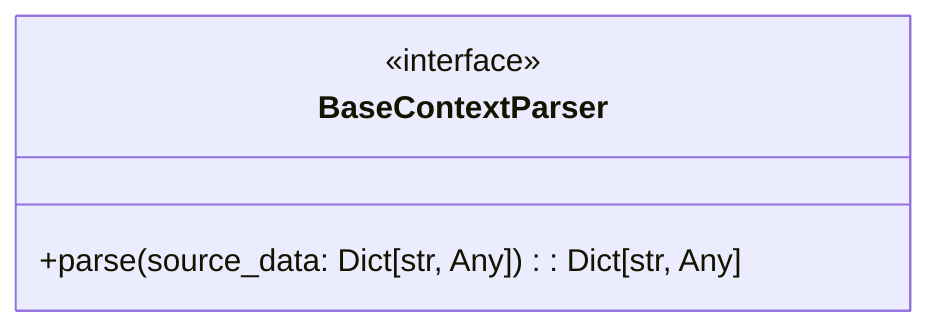

# Diagram: common/notification_service/notification_service/templated_notifications/base/base_context_parser.py

> Auto-generated by Obscura crawlers

## Mermaid

> SVG rendering failed for this diagram.
