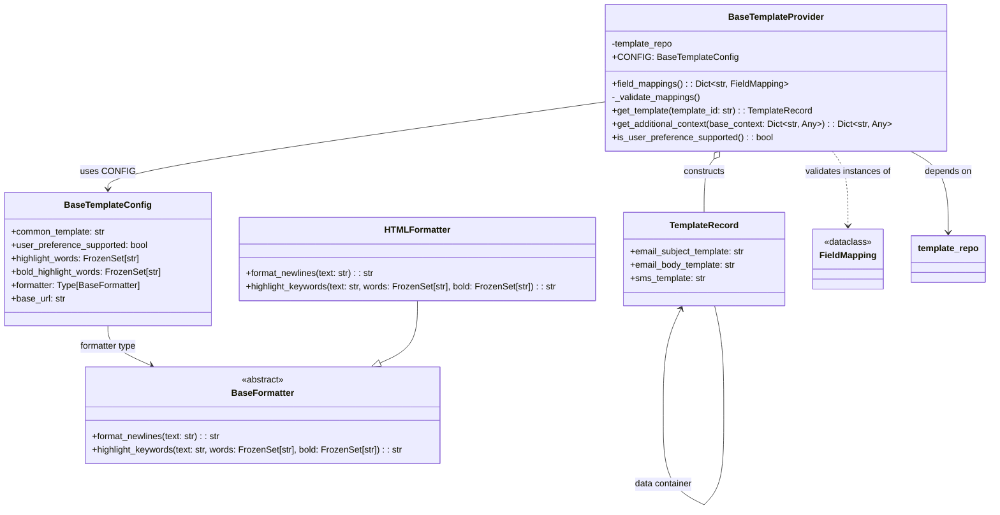

# Diagram: common/notification_service/notification_service/templated_notifications/base/base_template_provider.py

> Auto-generated by Obscura crawlers

## Mermaid

### SVG

<svg id="container" width="1776.8828125" xmlns="http://www.w3.org/2000/svg" class="classDiagram" height="916.1499633789062" viewBox="0 0 1776.8828125 916.1499633789062" role="graphics-document document" aria-roledescription="class"><g><defs><marker id="container_class-aggregationStart" class="marker aggregation class" refX="18" refY="7" markerWidth="190" markerHeight="240" orient="auto"><path d="M 18,7 L9,13 L1,7 L9,1 Z"></path></marker></defs><defs><marker id="container_class-aggregationEnd" class="marker aggregation class" refX="1" refY="7" markerWidth="20" markerHeight="28" orient="auto"><path d="M 18,7 L9,13 L1,7 L9,1 Z"></path></marker></defs><defs><marker id="container_class-extensionStart" class="marker extension class" refX="18" refY="7" markerWidth="190" markerHeight="240" orient="auto"><path d="M 1,7 L18,13 V 1 Z"></path></marker></defs><defs><marker id="container_class-extensionEnd" class="marker extension class" refX="1" refY="7" markerWidth="20" markerHeight="28" orient="auto"><path d="M 1,1 V 13 L18,7 Z"></path></marker></defs><defs><marker id="container_class-compositionStart" class="marker composition class" refX="18" refY="7" markerWidth="190" markerHeight="240" orient="auto"><path d="M 18,7 L9,13 L1,7 L9,1 Z"></path></marker></defs><defs><marker id="container_class-compositionEnd" class="marker composition class" refX="1" refY="7" markerWidth="20" markerHeight="28" orient="auto"><path d="M 18,7 L9,13 L1,7 L9,1 Z"></path></marker></defs><defs><marker id="container_class-dependencyStart" class="marker dependency class" refX="6" refY="7" markerWidth="190" markerHeight="240" orient="auto"><path d="M 5,7 L9,13 L1,7 L9,1 Z"></path></marker></defs><defs><marker id="container_class-dependencyEnd" class="marker dependency class" refX="13" refY="7" markerWidth="20" markerHeight="28" orient="auto"><path d="M 18,7 L9,13 L14,7 L9,1 Z"></path></marker></defs><defs><marker id="container_class-lollipopStart" class="marker lollipop class" refX="13" refY="7" markerWidth="190" markerHeight="240" orient="auto"><circle stroke="black" fill="transparent" cx="7" cy="7" r="6"></circle></marker></defs><defs><marker id="container_class-lollipopEnd" class="marker lollipop class" refX="1" refY="7" markerWidth="190" markerHeight="240" orient="auto"><circle stroke="black" fill="transparent" cx="7" cy="7" r="6"></circle></marker></defs><g class="root"><g class="clusters"></g><g class="edgePaths"><path d="M1092.857,182.769L943.026,203.808C793.195,224.846,493.533,266.923,343.702,293.128C193.871,319.333,193.871,329.667,193.871,334.833L193.871,340" id="id_BaseTemplateProvider_BaseTemplateConfig_1" class="edge-thickness-normal edge-pattern-solid relation" style=";;;" data-edge="true" data-et="edge" data-id="id_BaseTemplateProvider_BaseTemplateConfig_1" data-points="W3sieCI6MTA5Mi44NTc0MjE4NzUsInkiOjE4Mi43NjkzNTUwOTc4MjgyNX0seyJ4IjoxOTMuODcxMDkzNzUsInkiOjMwOX0seyJ4IjoxOTMuODcxMDkzNzUsInkiOjM0Nn1d" marker-end="url(#container_class-dependencyEnd)"></path><path d="M193.871,586L193.871,592.167C193.871,598.333,193.871,610.667,206.807,622.593C219.743,634.52,245.614,646.04,258.55,651.8L271.486,657.559" id="id_BaseTemplateConfig_BaseFormatter_2" class="edge-thickness-normal edge-pattern-solid relation" style=";;;" data-edge="true" data-et="edge" data-id="id_BaseTemplateConfig_BaseFormatter_2" data-points="W3sieCI6MTkzLjg3MTA5Mzc1LCJ5Ijo1ODZ9LHsieCI6MTkzLjg3MTA5Mzc1LCJ5Ijo2MjN9LHsieCI6Mjc2Ljk2NzIzNzkwMzIyNTgsInkiOjY2MH1d" marker-end="url(#container_class-dependencyEnd)"></path><path d="M750.84,541L750.84,554.667C750.84,568.333,750.84,595.667,739.617,614.331C728.394,632.994,705.948,642.989,694.725,647.986L683.502,652.983" id="id_HTMLFormatter_BaseFormatter_3" class="edge-thickness-normal edge-pattern-solid relation" style=";;;" data-edge="true" data-et="edge" data-id="id_HTMLFormatter_BaseFormatter_3" data-points="W3sieCI6NzUwLjgzOTg0Mzc1LCJ5Ijo1NDF9LHsieCI6NzUwLjgzOTg0Mzc1LCJ5Ijo2MjN9LHsieCI6NjY3Ljc0MzY5OTU5Njc3NDEsInkiOjY2MH1d" marker-end="url(#container_class-extensionEnd)"></path><path d="M1286.369,285.719L1283.411,289.599C1280.453,293.479,1274.537,301.24,1271.579,317.286C1268.621,333.333,1268.621,357.667,1268.621,369.833L1268.621,382" id="id_BaseTemplateProvider_TemplateRecord_4" class="edge-thickness-normal edge-pattern-solid relation" style=";;;" data-edge="true" data-et="edge" data-id="id_BaseTemplateProvider_TemplateRecord_4" data-points="W3sieCI6MTI5Ni44MjY0OTU0Njk2NzQ1LCJ5IjoyNzJ9LHsieCI6MTI2OC42MjEwOTM3NSwieSI6MzA5fSx7IngiOjEyNjguNjIxMDkzNzUsInkiOjM4Mn1d" marker-start="url(#container_class-aggregationStart)"></path><path d="M1498.076,272L1502.777,278.167C1507.478,284.333,1516.879,296.667,1521.58,319C1526.281,341.333,1526.281,373.667,1526.281,389.833L1526.281,406" id="id_BaseTemplateProvider_FieldMapping_5" class="edge-thickness-normal edge-pattern-dashed relation" style=";;;" data-edge="true" data-et="edge" data-id="id_BaseTemplateProvider_FieldMapping_5" data-points="W3sieCI6MTQ5OC4wNzU4NDgyODAzMjU1LCJ5IjoyNzJ9LHsieCI6MTUyNi4yODEyNSwieSI6MzA5fSx7IngiOjE1MjYuMjgxMjUsInkiOjQxMn1d" marker-end="url(#container_class-dependencyEnd)"></path><path d="M1636.16,272L1647.311,278.167C1658.463,284.333,1680.767,296.667,1691.919,321C1703.07,345.333,1703.07,381.667,1703.07,399.833L1703.07,418" id="id_BaseTemplateProvider_template_repo_6" class="edge-thickness-normal edge-pattern-solid relation" style=";;;" data-edge="true" data-et="edge" data-id="id_BaseTemplateProvider_template_repo_6" data-points="W3sieCI6MTYzNi4xNTk2MTMwNzMyMjQ4LCJ5IjoyNzJ9LHsieCI6MTcwMy4wNzAzMTI1LCJ5IjozMDl9LHsieCI6MTcwMy4wNzAzMTI1LCJ5Ijo0MjR9XQ==" marker-end="url(#container_class-dependencyEnd)"></path><path d="M1226.523,555.429L1221.222,566.69C1215.92,577.952,1205.317,600.476,1200.016,632.396C1194.714,664.317,1194.714,705.633,1194.714,726.292L1194.714,746.95" id="TemplateRecord-cyclic-special-1" class="edge-thickness-normal edge-pattern-solid relation" style=";;;" data-edge="true" data-et="edge" data-id="TemplateRecord-cyclic-special-1" data-points="W3sieCI6MTIyOS4wNzg2ODczMDExNTQ4LCJ5Ijo1NTB9LHsieCI6MTE5NC43MTQ0NTMxMjUzNzI1LCJ5Ijo2MjN9LHsieCI6MTE5NC43MTQ0NTMxMjUzNzI1LCJ5Ijo3NDYuOTQ5OTk5OTk5MjU0OX1d" marker-start="url(#container_class-dependencyStart)"></path><path d="M1194.714,747.05L1194.714,767.708C1194.714,788.367,1194.714,829.683,1207.024,856.512C1219.333,883.342,1243.952,895.683,1256.262,901.854L1268.571,908.025" id="TemplateRecord-cyclic-special-mid" class="edge-thickness-normal edge-pattern-solid relation" style=";;;" data-edge="true" data-et="edge" data-id="TemplateRecord-cyclic-special-mid" data-points="W3sieCI6MTE5NC43MTQ0NTMxMjUzNzI1LCJ5Ijo3NDcuMDUwMDAwMDAwNzQ1MX0seyJ4IjoxMTk0LjcxNDQ1MzEyNTM3MjUsInkiOjg3MX0seyJ4IjoxMjY4LjU3MTA5Mzc0OTI1NSwieSI6OTA4LjAyNDkzNDU5MzczOTl9XQ=="></path><path d="M1268.67,908L1274.749,901.833C1280.828,895.667,1292.986,883.333,1299.066,856.5C1305.145,829.667,1305.145,788.333,1305.145,747C1305.145,705.667,1305.145,664.333,1302.314,631.5C1299.484,598.667,1293.823,574.333,1290.993,562.167L1288.162,550" id="TemplateRecord-cyclic-special-2" class="edge-thickness-normal edge-pattern-solid relation" style=";;;" data-edge="true" data-et="edge" data-id="TemplateRecord-cyclic-special-2" data-points="W3sieCI6MTI2OC42NzAzODMxNDAwNzIzLCJ5Ijo5MDh9LHsieCI6MTMwNS4xNDQ1MzEyNSwieSI6ODcxfSx7IngiOjEzMDUuMTQ0NTMxMjUsInkiOjc0N30seyJ4IjoxMzA1LjE0NDUzMTI1LCJ5Ijo2MjN9LHsieCI6MTI4OC4xNjIyOTU5NzkyOTk0LCJ5Ijo1NTB9XQ=="></path></g><g class="edgeLabels"><g class="edgeLabel" transform="translate(193.87109375, 309)"><g class="label" data-id="id_BaseTemplateProvider_BaseTemplateConfig_1" transform="translate(-45.265625, -12)"><foreignObject width="90.53125" height="24">

uses CONFIG

</foreignObject></g></g><g class="edgeLabel" transform="translate(193.87109375, 623)"><g class="label" data-id="id_BaseTemplateConfig_BaseFormatter_2" transform="translate(-52.6953125, -12)"><foreignObject width="105.390625" height="24">

formatter type

</foreignObject></g></g><g class="edgeLabel"><g class="label" data-id="id_HTMLFormatter_BaseFormatter_3" transform="translate(0, 0)"><foreignObject width="0" height="0">

</foreignObject></g></g><g class="edgeLabel" transform="translate(1268.62109375, 309)"><g class="label" data-id="id_BaseTemplateProvider_TemplateRecord_4" transform="translate(-37.84375, -12)"><foreignObject width="75.6875" height="24">

constructs

</foreignObject></g></g><g class="edgeLabel" transform="translate(1526.28125, 309)"><g class="label" data-id="id_BaseTemplateProvider_FieldMapping_5" transform="translate(-78.5859375, -12)"><foreignObject width="157.171875" height="24">

validates instances of

</foreignObject></g></g><g class="edgeLabel" transform="translate(1703.0703125, 309)"><g class="label" data-id="id_BaseTemplateProvider_template_repo_6" transform="translate(-42.9453125, -12)"><foreignObject width="85.890625" height="24">

depends on

</foreignObject></g></g><g class="edgeLabel"><g class="label" data-id="TemplateRecord-cyclic-special-1" transform="translate(0, 0)"><foreignObject width="0" height="0">

</foreignObject></g></g><g class="edgeLabel" transform="translate(1194.7144531253725, 871)"><g class="label" data-id="TemplateRecord-cyclic-special-mid" transform="translate(-53.046875, -12)"><foreignObject width="106.09375" height="24">

data container

</foreignObject></g></g><g class="edgeLabel"><g class="label" data-id="TemplateRecord-cyclic-special-2" transform="translate(0, 0)"><foreignObject width="0" height="0">

</foreignObject></g></g></g><g class="nodes"><g class="node default" id="classId-BaseTemplateConfig-0" transform="translate(193.87109375, 466)"><g class="basic label-container"><path d="M-185.87109375 -120 L185.87109375 -120 L185.87109375 120 L-185.87109375 120" stroke="none" stroke-width="0" fill="#ECECFF" style=""></path><path d="M-185.87109375 -120 C-68.23573576643005 -120, 49.39962221713989 -120, 185.87109375 -120 M-185.87109375 -120 C-70.14827213194002 -120, 45.57454948611996 -120, 185.87109375 -120 M185.87109375 -120 C185.87109375 -41.92217848209434, 185.87109375 36.15564303581132, 185.87109375 120 M185.87109375 -120 C185.87109375 -48.603336444693724, 185.87109375 22.79332711061255, 185.87109375 120 M185.87109375 120 C110.5988885958431 120, 35.326683441686214 120, -185.87109375 120 M185.87109375 120 C81.40872748797604 120, -23.053638774047926 120, -185.87109375 120 M-185.87109375 120 C-185.87109375 57.28117187951919, -185.87109375 -5.437656240961616, -185.87109375 -120 M-185.87109375 120 C-185.87109375 54.134003893106325, -185.87109375 -11.73199221378735, -185.87109375 -120" stroke="#9370DB" stroke-width="1.3" fill="none" stroke-dasharray="0 0" style=""></path></g><g class="annotation-group text" transform="translate(0, -96)"></g><g class="label-group text" transform="translate(-74.3671875, -96)"><g class="label" style="font-weight: bolder" transform="translate(0,-12)"><foreignObject width="148.734375" height="24">

BaseTemplateConfig

</foreignObject></g></g><g class="members-group text" transform="translate(-173.87109375, -48)"><g class="label" style="" transform="translate(0,-12)"><foreignObject width="171.359375" height="24">

+common_template: str

</foreignObject></g><g class="label" style="" transform="translate(0,12)"><foreignObject width="248.484375" height="24">

+user_preference_supported: bool

</foreignObject></g><g class="label" style="" transform="translate(0,36)"><foreignObject width="232.03125" height="24">

+highlight_words: FrozenSet[str]

</foreignObject></g><g class="label" style="" transform="translate(0,60)"><foreignObject width="273.375" height="24">

+bold_highlight_words: FrozenSet[str]

</foreignObject></g><g class="label" style="" transform="translate(0,84)"><foreignObject width="235.265625" height="24">

+formatter: Type[BaseFormatter]

</foreignObject></g><g class="label" style="" transform="translate(0,108)"><foreignObject width="97.59375" height="24">

+base_url: str

</foreignObject></g></g><g class="methods-group text" transform="translate(-173.87109375, 120)"></g><g class="divider" style=""><path d="M-185.87109375 -72 C-100.69965231764824 -72, -15.528210885296488 -72, 185.87109375 -72 M-185.87109375 -72 C-65.47159070850735 -72, 54.9279123329853 -72, 185.87109375 -72" stroke="#9370DB" stroke-width="1.3" fill="none" stroke-dasharray="0 0" style=""></path></g><g class="divider" style=""><path d="M-185.87109375 96 C-73.93656976589 96, 37.99795421822 96, 185.87109375 96 M-185.87109375 96 C-69.4785965942069 96, 46.91390056158619 96, 185.87109375 96" stroke="#9370DB" stroke-width="1.3" fill="none" stroke-dasharray="0 0" style=""></path></g></g><g class="node default" id="classId-BaseTemplateProvider-1" transform="translate(1397.451171875, 140)"><g class="basic label-container"><path d="M-304.59375 -132 L304.59375 -132 L304.59375 132 L-304.59375 132" stroke="none" stroke-width="0" fill="#ECECFF" style=""></path><path d="M-304.59375 -132 C-72.48023553017129 -132, 159.63327893965743 -132, 304.59375 -132 M-304.59375 -132 C-164.4981388545607 -132, -24.402527709121387 -132, 304.59375 -132 M304.59375 -132 C304.59375 -36.9642927734821, 304.59375 58.0714144530358, 304.59375 132 M304.59375 -132 C304.59375 -35.09313451506365, 304.59375 61.813730969872694, 304.59375 132 M304.59375 132 C114.9948228523186 132, -74.60410429536279 132, -304.59375 132 M304.59375 132 C172.93267606052 132, 41.27160212104002 132, -304.59375 132 M-304.59375 132 C-304.59375 51.54099537586656, -304.59375 -28.918009248266884, -304.59375 -132 M-304.59375 132 C-304.59375 56.69719304024801, -304.59375 -18.60561391950398, -304.59375 -132" stroke="#9370DB" stroke-width="1.3" fill="none" stroke-dasharray="0 0" style=""></path></g><g class="annotation-group text" transform="translate(0, -108)"></g><g class="label-group text" transform="translate(-82.4375, -108)"><g class="label" style="font-weight: bolder" transform="translate(0,-12)"><foreignObject width="164.875" height="24">

BaseTemplateProvider

</foreignObject></g></g><g class="members-group text" transform="translate(-292.59375, -60)"><g class="label" style="" transform="translate(0,-12)"><foreignObject width="112.6875" height="24">

-template_repo

</foreignObject></g><g class="label" style="" transform="translate(0,12)"><foreignObject width="215.625" height="24">

+CONFIG: BaseTemplateConfig

</foreignObject></g></g><g class="methods-group text" transform="translate(-292.59375, 12)"><g class="label" style="" transform="translate(0,-12)"><foreignObject width="317.46875" height="24">

+field_mappings() : : Dict&lt;str, FieldMapping&gt;

</foreignObject></g><g class="label" style="" transform="translate(0,12)"><foreignObject width="160.265625" height="24">

-_validate_mappings()

</foreignObject></g><g class="label" style="" transform="translate(0,36)"><foreignObject width="365.96875" height="24">

+get_template(template_id: str) : : TemplateRecord

</foreignObject></g><g class="label" style="" transform="translate(0,60)"><foreignObject width="502.75" height="24">

+get_additional_context(base_context: Dict&lt;str, Any&gt;) : : Dict&lt;str, Any&gt;

</foreignObject></g><g class="label" style="" transform="translate(0,84)"><foreignObject width="290.84375" height="24">

+is_user_preference_supported() : : bool

</foreignObject></g></g><g class="divider" style=""><path d="M-304.59375 -84 C-91.28194000542041 -84, 122.02986998915918 -84, 304.59375 -84 M-304.59375 -84 C-73.59073217863502 -84, 157.41228564272996 -84, 304.59375 -84" stroke="#9370DB" stroke-width="1.3" fill="none" stroke-dasharray="0 0" style=""></path></g><g class="divider" style=""><path d="M-304.59375 -12 C-170.0178544763998 -12, -35.44195895279961 -12, 304.59375 -12 M-304.59375 -12 C-158.90125972843865 -12, -13.208769456877292 -12, 304.59375 -12" stroke="#9370DB" stroke-width="1.3" fill="none" stroke-dasharray="0 0" style=""></path></g></g><g class="node default" id="classId-BaseFormatter-2" transform="translate(472.35546875, 747)"><g class="basic label-container"><path d="M-319.91796875 -87 L319.91796875 -87 L319.91796875 87 L-319.91796875 87" stroke="none" stroke-width="0" fill="#ECECFF" style=""></path><path d="M-319.91796875 -87 C-175.09569677426302 -87, -30.273424798526037 -87, 319.91796875 -87 M-319.91796875 -87 C-179.16421859106364 -87, -38.41046843212729 -87, 319.91796875 -87 M319.91796875 -87 C319.91796875 -42.28672387282192, 319.91796875 2.426552254356153, 319.91796875 87 M319.91796875 -87 C319.91796875 -50.93392928951838, 319.91796875 -14.867858579036763, 319.91796875 87 M319.91796875 87 C112.30351459180622 87, -95.31093956638756 87, -319.91796875 87 M319.91796875 87 C107.15835525758985 87, -105.6012582348203 87, -319.91796875 87 M-319.91796875 87 C-319.91796875 20.970268993078236, -319.91796875 -45.05946201384353, -319.91796875 -87 M-319.91796875 87 C-319.91796875 40.982570489696556, -319.91796875 -5.034859020606888, -319.91796875 -87" stroke="#9370DB" stroke-width="1.3" fill="none" stroke-dasharray="0 0" style=""></path></g><g class="annotation-group text" transform="translate(-38.609375, -63)"><g class="label" style="" transform="translate(0,-12)"><foreignObject width="77.21875" height="24">

«abstract»

</foreignObject></g></g><g class="label-group text" transform="translate(-53.8203125, -39)"><g class="label" style="font-weight: bolder" transform="translate(0,-12)"><foreignObject width="107.640625" height="24">

BaseFormatter

</foreignObject></g></g><g class="members-group text" transform="translate(-307.91796875, 9)"></g><g class="methods-group text" transform="translate(-307.91796875, 39)"><g class="label" style="" transform="translate(0,-12)"><foreignObject width="234.734375" height="24">

+format_newlines(text: str) : : str

</foreignObject></g><g class="label" style="" transform="translate(0,12)"><foreignObject width="562.015625" height="24">

+highlight_keywords(text: str, words: FrozenSet[str], bold: FrozenSet[str]) : : str

</foreignObject></g></g><g class="divider" style=""><path d="M-319.91796875 -15 C-156.04481810358484 -15, 7.82833254283031 -15, 319.91796875 -15 M-319.91796875 -15 C-184.2558441798703 -15, -48.59371960974062 -15, 319.91796875 -15" stroke="#9370DB" stroke-width="1.3" fill="none" stroke-dasharray="0 0" style=""></path></g><g class="divider" style=""><path d="M-319.91796875 9 C-114.6308715085053 9, 90.65622573298941 9, 319.91796875 9 M-319.91796875 9 C-178.4405746508868 9, -36.963180551773576 9, 319.91796875 9" stroke="#9370DB" stroke-width="1.3" fill="none" stroke-dasharray="0 0" style=""></path></g></g><g class="node default" id="classId-HTMLFormatter-3" transform="translate(750.83984375, 466)"><g class="basic label-container"><path d="M-321.09765625 -75 L321.09765625 -75 L321.09765625 75 L-321.09765625 75" stroke="none" stroke-width="0" fill="#ECECFF" style=""></path><path d="M-321.09765625 -75 C-120.82976633745912 -75, 79.43812357508176 -75, 321.09765625 -75 M-321.09765625 -75 C-113.44733114245574 -75, 94.20299396508852 -75, 321.09765625 -75 M321.09765625 -75 C321.09765625 -18.792901088713997, 321.09765625 37.41419782257201, 321.09765625 75 M321.09765625 -75 C321.09765625 -16.54028267052253, 321.09765625 41.91943465895494, 321.09765625 75 M321.09765625 75 C159.52505238009832 75, -2.047551489803368 75, -321.09765625 75 M321.09765625 75 C132.85646303142468 75, -55.38473018715064 75, -321.09765625 75 M-321.09765625 75 C-321.09765625 25.10923071747792, -321.09765625 -24.78153856504416, -321.09765625 -75 M-321.09765625 75 C-321.09765625 35.82126069508899, -321.09765625 -3.3574786098220244, -321.09765625 -75" stroke="#9370DB" stroke-width="1.3" fill="none" stroke-dasharray="0 0" style=""></path></g><g class="annotation-group text" transform="translate(0, -51)"></g><g class="label-group text" transform="translate(-56.1796875, -51)"><g class="label" style="font-weight: bolder" transform="translate(0,-12)"><foreignObject width="112.359375" height="24">

HTMLFormatter

</foreignObject></g></g><g class="members-group text" transform="translate(-309.09765625, -3)"></g><g class="methods-group text" transform="translate(-309.09765625, 27)"><g class="label" style="" transform="translate(0,-12)"><foreignObject width="234.734375" height="24">

+format_newlines(text: str) : : str

</foreignObject></g><g class="label" style="" transform="translate(0,12)"><foreignObject width="562.015625" height="24">

+highlight_keywords(text: str, words: FrozenSet[str], bold: FrozenSet[str]) : : str

</foreignObject></g></g><g class="divider" style=""><path d="M-321.09765625 -27 C-139.9594164058607 -27, 41.178823438278584 -27, 321.09765625 -27 M-321.09765625 -27 C-175.7792892675611 -27, -30.460922285122194 -27, 321.09765625 -27" stroke="#9370DB" stroke-width="1.3" fill="none" stroke-dasharray="0 0" style=""></path></g><g class="divider" style=""><path d="M-321.09765625 -3 C-78.79663127041928 -3, 163.50439370916143 -3, 321.09765625 -3 M-321.09765625 -3 C-159.57383653363854 -3, 1.9499831827229173 -3, 321.09765625 -3" stroke="#9370DB" stroke-width="1.3" fill="none" stroke-dasharray="0 0" style=""></path></g></g><g class="node default" id="classId-TemplateRecord-4" transform="translate(1268.62109375, 466)"><g class="basic label-container"><path d="M-146.68359375 -84 L146.68359375 -84 L146.68359375 84 L-146.68359375 84" stroke="none" stroke-width="0" fill="#ECECFF" style=""></path><path d="M-146.68359375 -84 C-36.13578371965356 -84, 74.41202631069288 -84, 146.68359375 -84 M-146.68359375 -84 C-42.842071716375074 -84, 60.99945031724985 -84, 146.68359375 -84 M146.68359375 -84 C146.68359375 -45.472996230606405, 146.68359375 -6.9459924612128106, 146.68359375 84 M146.68359375 -84 C146.68359375 -20.12913284744417, 146.68359375 43.74173430511166, 146.68359375 84 M146.68359375 84 C57.54136957871938 84, -31.600854592561234 84, -146.68359375 84 M146.68359375 84 C72.39215018464866 84, -1.8992933807026873 84, -146.68359375 84 M-146.68359375 84 C-146.68359375 40.90151278177691, -146.68359375 -2.196974436446183, -146.68359375 -84 M-146.68359375 84 C-146.68359375 39.462737221549645, -146.68359375 -5.07452555690071, -146.68359375 -84" stroke="#9370DB" stroke-width="1.3" fill="none" stroke-dasharray="0 0" style=""></path></g><g class="annotation-group text" transform="translate(0, -60)"></g><g class="label-group text" transform="translate(-59.2578125, -60)"><g class="label" style="font-weight: bolder" transform="translate(0,-12)"><foreignObject width="118.515625" height="24">

TemplateRecord

</foreignObject></g></g><g class="members-group text" transform="translate(-134.68359375, -12)"><g class="label" style="" transform="translate(0,-12)"><foreignObject width="210.109375" height="24">

+email_subject_template: str

</foreignObject></g><g class="label" style="" transform="translate(0,12)"><foreignObject width="193" height="24">

+email_body_template: str

</foreignObject></g><g class="label" style="" transform="translate(0,36)"><foreignObject width="136.875" height="24">

+sms_template: str

</foreignObject></g></g><g class="methods-group text" transform="translate(-134.68359375, 84)"></g><g class="divider" style=""><path d="M-146.68359375 -36 C-47.878358704928445 -36, 50.92687634014311 -36, 146.68359375 -36 M-146.68359375 -36 C-42.531997088286545 -36, 61.61959957342691 -36, 146.68359375 -36" stroke="#9370DB" stroke-width="1.3" fill="none" stroke-dasharray="0 0" style=""></path></g><g class="divider" style=""><path d="M-146.68359375 60 C-61.73125856660576 60, 23.22107661678848 60, 146.68359375 60 M-146.68359375 60 C-83.2336149998527 60, -19.783636249705424 60, 146.68359375 60" stroke="#9370DB" stroke-width="1.3" fill="none" stroke-dasharray="0 0" style=""></path></g></g><g class="node default" id="classId-FieldMapping-5" transform="translate(1526.28125, 466)"><g class="basic label-container"><path d="M-60.9765625 -54 L60.9765625 -54 L60.9765625 54 L-60.9765625 54" stroke="none" stroke-width="0" fill="#ECECFF" style=""></path><path d="M-60.9765625 -54 C-28.337098908153315 -54, 4.302364683693369 -54, 60.9765625 -54 M-60.9765625 -54 C-18.198765500449134 -54, 24.57903149910173 -54, 60.9765625 -54 M60.9765625 -54 C60.9765625 -19.139256383167165, 60.9765625 15.72148723366567, 60.9765625 54 M60.9765625 -54 C60.9765625 -26.1151367129525, 60.9765625 1.769726574095003, 60.9765625 54 M60.9765625 54 C26.1324075553583 54, -8.711747389283403 54, -60.9765625 54 M60.9765625 54 C16.081362821324966 54, -28.81383685735007 54, -60.9765625 54 M-60.9765625 54 C-60.9765625 26.217566907928838, -60.9765625 -1.5648661841423248, -60.9765625 -54 M-60.9765625 54 C-60.9765625 24.851658243495606, -60.9765625 -4.296683513008787, -60.9765625 -54" stroke="#9370DB" stroke-width="1.3" fill="none" stroke-dasharray="0 0" style=""></path></g><g class="annotation-group text" transform="translate(-43.0859375, -30)"><g class="label" style="" transform="translate(0,-12)"><foreignObject width="86.171875" height="24">

«dataclass»

</foreignObject></g></g><g class="label-group text" transform="translate(-48.9765625, -6)"><g class="label" style="font-weight: bolder" transform="translate(0,-12)"><foreignObject width="97.953125" height="24">

FieldMapping

</foreignObject></g></g><g class="members-group text" transform="translate(-48.9765625, 42)"></g><g class="methods-group text" transform="translate(-48.9765625, 72)"></g><g class="divider" style=""><path d="M-60.9765625 18 C-28.783082136390064 18, 3.410398227219872 18, 60.9765625 18 M-60.9765625 18 C-33.103633712883564 18, -5.230704925767121 18, 60.9765625 18" stroke="#9370DB" stroke-width="1.3" fill="none" stroke-dasharray="0 0" style=""></path></g><g class="divider" style=""><path d="M-60.9765625 36 C-23.815337101258628 36, 13.345888297482745 36, 60.9765625 36 M-60.9765625 36 C-29.913715318853416 36, 1.1491318622931672 36, 60.9765625 36" stroke="#9370DB" stroke-width="1.3" fill="none" stroke-dasharray="0 0" style=""></path></g></g><g class="node default" id="classId-template_repo-6" transform="translate(1703.0703125, 466)"><g class="basic label-container"><path d="M-65.8125 -42 L65.8125 -42 L65.8125 42 L-65.8125 42" stroke="none" stroke-width="0" fill="#ECECFF" style=""></path><path d="M-65.8125 -42 C-25.233318837247687 -42, 15.345862325504626 -42, 65.8125 -42 M-65.8125 -42 C-36.17065131740998 -42, -6.528802634819947 -42, 65.8125 -42 M65.8125 -42 C65.8125 -14.33528110959232, 65.8125 13.329437780815361, 65.8125 42 M65.8125 -42 C65.8125 -20.415684934815193, 65.8125 1.168630130369614, 65.8125 42 M65.8125 42 C38.27242103990915 42, 10.732342079818295 42, -65.8125 42 M65.8125 42 C20.28769442450129 42, -25.23711115099742 42, -65.8125 42 M-65.8125 42 C-65.8125 15.920849867667375, -65.8125 -10.15830026466525, -65.8125 -42 M-65.8125 42 C-65.8125 18.081555482314876, -65.8125 -5.836889035370248, -65.8125 -42" stroke="#9370DB" stroke-width="1.3" fill="none" stroke-dasharray="0 0" style=""></path></g><g class="annotation-group text" transform="translate(0, -18)"></g><g class="label-group text" transform="translate(-53.8125, -18)"><g class="label" style="font-weight: bolder" transform="translate(0,-12)"><foreignObject width="107.625" height="24">

template_repo

</foreignObject></g></g><g class="members-group text" transform="translate(-53.8125, 30)"></g><g class="methods-group text" transform="translate(-53.8125, 60)"></g><g class="divider" style=""><path d="M-65.8125 6 C-30.385775184994664 6, 5.040949630010672 6, 65.8125 6 M-65.8125 6 C-16.283940916203207 6, 33.244618167593586 6, 65.8125 6" stroke="#9370DB" stroke-width="1.3" fill="none" stroke-dasharray="0 0" style=""></path></g><g class="divider" style=""><path d="M-65.8125 24 C-17.158473514021104 24, 31.495552971957792 24, 65.8125 24 M-65.8125 24 C-39.12788567244036 24, -12.443271344880714 24, 65.8125 24" stroke="#9370DB" stroke-width="1.3" fill="none" stroke-dasharray="0 0" style=""></path></g></g><g class="label edgeLabel" id="TemplateRecord---TemplateRecord---1" transform="translate(1194.7144531253725, 747)"><rect width="0.1" height="0.1"></rect><g class="label" style="" transform="translate(0, 0)"><rect></rect><foreignObject width="0" height="0">

</foreignObject></g></g><g class="label edgeLabel" id="TemplateRecord---TemplateRecord---2" transform="translate(1268.62109375, 908.0500000007451)"><rect width="0.1" height="0.1"></rect><g class="label" style="" transform="translate(0, 0)"><rect></rect><foreignObject width="0" height="0">

</foreignObject></g></g></g></g></g></svg>
