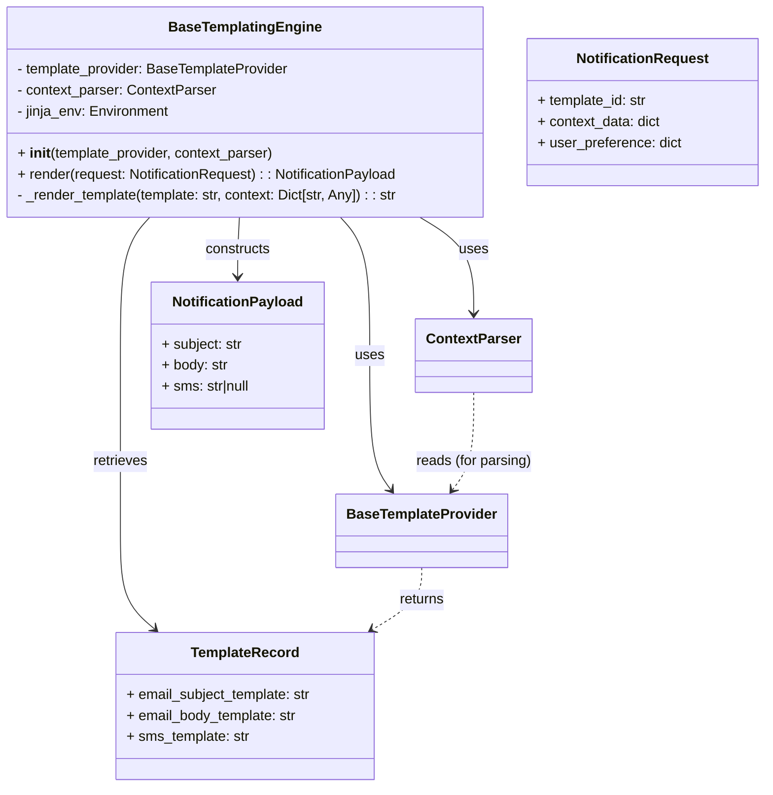
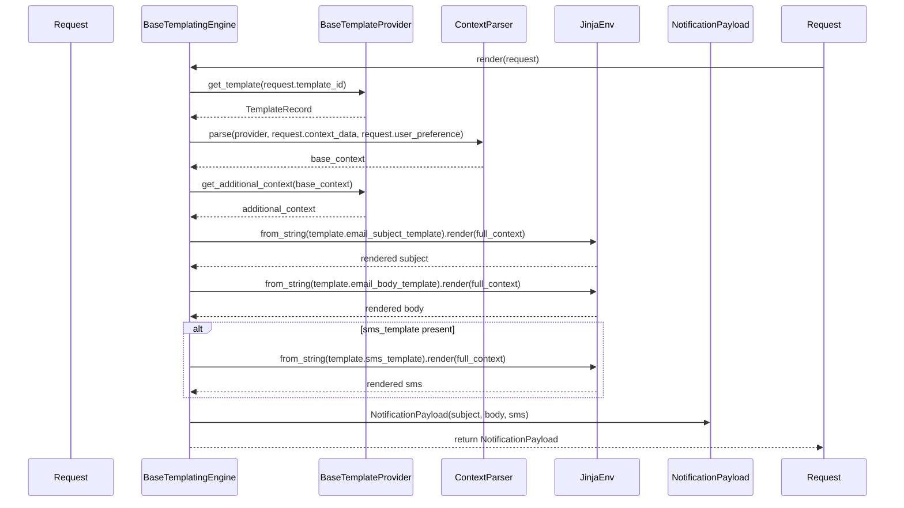

# Diagram: common/notification_service/notification_service/templated_notifications/base/base_templating_engine.py

> Auto-generated by Obscura crawlers

## Diagram 1

### SVG

<svg id="container" width="875.4453125" xmlns="http://www.w3.org/2000/svg" class="classDiagram" height="898" viewBox="0 0 875.4453125 898" role="graphics-document document" aria-roledescription="class"><g><defs><marker id="container_class-aggregationStart" class="marker aggregation class" refX="18" refY="7" markerWidth="190" markerHeight="240" orient="auto"><path d="M 18,7 L9,13 L1,7 L9,1 Z"></path></marker></defs><defs><marker id="container_class-aggregationEnd" class="marker aggregation class" refX="1" refY="7" markerWidth="20" markerHeight="28" orient="auto"><path d="M 18,7 L9,13 L1,7 L9,1 Z"></path></marker></defs><defs><marker id="container_class-extensionStart" class="marker extension class" refX="18" refY="7" markerWidth="190" markerHeight="240" orient="auto"><path d="M 1,7 L18,13 V 1 Z"></path></marker></defs><defs><marker id="container_class-extensionEnd" class="marker extension class" refX="1" refY="7" markerWidth="20" markerHeight="28" orient="auto"><path d="M 1,1 V 13 L18,7 Z"></path></marker></defs><defs><marker id="container_class-compositionStart" class="marker composition class" refX="18" refY="7" markerWidth="190" markerHeight="240" orient="auto"><path d="M 18,7 L9,13 L1,7 L9,1 Z"></path></marker></defs><defs><marker id="container_class-compositionEnd" class="marker composition class" refX="1" refY="7" markerWidth="20" markerHeight="28" orient="auto"><path d="M 18,7 L9,13 L1,7 L9,1 Z"></path></marker></defs><defs><marker id="container_class-dependencyStart" class="marker dependency class" refX="6" refY="7" markerWidth="190" markerHeight="240" orient="auto"><path d="M 5,7 L9,13 L1,7 L9,1 Z"></path></marker></defs><defs><marker id="container_class-dependencyEnd" class="marker dependency class" refX="13" refY="7" markerWidth="20" markerHeight="28" orient="auto"><path d="M 18,7 L9,13 L14,7 L9,1 Z"></path></marker></defs><defs><marker id="container_class-lollipopStart" class="marker lollipop class" refX="13" refY="7" markerWidth="190" markerHeight="240" orient="auto"><circle stroke="black" fill="transparent" cx="7" cy="7" r="6"></circle></marker></defs><defs><marker id="container_class-lollipopEnd" class="marker lollipop class" refX="1" refY="7" markerWidth="190" markerHeight="240" orient="auto"><circle stroke="black" fill="transparent" cx="7" cy="7" r="6"></circle></marker></defs><g class="root"><g class="clusters"></g><g class="edgePaths"><path d="M391.172,248L396.773,254.167C402.374,260.333,413.576,272.667,419.177,299C424.777,325.333,424.777,365.667,424.777,406C424.777,446.333,424.777,486.667,428.678,512.192C432.579,537.716,440.381,548.433,444.283,553.791L448.184,559.149" id="id_BaseTemplatingEngine_BaseTemplateProvider_1" class="edge-thickness-normal edge-pattern-solid relation" style=";;;" data-edge="true" data-et="edge" data-id="id_BaseTemplatingEngine_BaseTemplateProvider_1" data-points="W3sieCI6MzkxLjE3MjQ0NzI1MzE4NDcsInkiOjI0OH0seyJ4Ijo0MjQuNzc3MzQzNzUsInkiOjI4NX0seyJ4Ijo0MjQuNzc3MzQzNzUsInkiOjQwNn0seyJ4Ijo0MjQuNzc3MzQzNzUsInkiOjUyN30seyJ4Ijo0NTEuNzE1MDQxNTM0ODEwMSwieSI6NTY0fV0=" marker-end="url(#container_class-dependencyEnd)"></path><path d="M479.094,248L489.213,254.167C499.332,260.333,519.571,272.667,529.69,291C539.809,309.333,539.809,333.667,539.809,345.833L539.809,358" id="id_BaseTemplatingEngine_ContextParser_2" class="edge-thickness-normal edge-pattern-solid relation" style=";;;" data-edge="true" data-et="edge" data-id="id_BaseTemplatingEngine_ContextParser_2" data-points="W3sieCI6NDc5LjA5NDQyMTc3NTQ3NzcsInkiOjI0OH0seyJ4Ijo1MzkuODA4NTkzNzUsInkiOjI4NX0seyJ4Ijo1MzkuODA4NTkzNzUsInkiOjM2NH1d" marker-end="url(#container_class-dependencyEnd)"></path><path d="M173.195,248L167.594,254.167C161.993,260.333,150.791,272.667,145.191,299C139.59,325.333,139.59,365.667,139.59,406C139.59,446.333,139.59,486.667,139.59,520C139.59,553.333,139.59,579.667,139.59,606C139.59,632.333,139.59,658.667,146.095,677.353C152.599,696.039,165.609,707.079,172.113,712.598L178.618,718.118" id="id_BaseTemplatingEngine_TemplateRecord_3" class="edge-thickness-normal edge-pattern-solid relation" style=";;;" data-edge="true" data-et="edge" data-id="id_BaseTemplatingEngine_TemplateRecord_3" data-points="W3sieCI6MTczLjE5NDc0MDI0NjgxNTMsInkiOjI0OH0seyJ4IjoxMzkuNTg5ODQzNzUsInkiOjI4NX0seyJ4IjoxMzkuNTg5ODQzNzUsInkiOjQwNn0seyJ4IjoxMzkuNTg5ODQzNzUsInkiOjUyN30seyJ4IjoxMzkuNTg5ODQzNzUsInkiOjYwNn0seyJ4IjoxMzkuNTg5ODQzNzUsInkiOjY4NX0seyJ4IjoxODMuMTkyODkxMjcwNjYxMTYsInkiOjcyMn1d" marker-end="url(#container_class-dependencyEnd)"></path><path d="M275.881,248L275.557,254.167C275.233,260.333,274.585,272.667,274.261,284C273.938,295.333,273.938,305.667,273.938,310.833L273.938,316" id="id_BaseTemplatingEngine_NotificationPayload_4" class="edge-thickness-normal edge-pattern-solid relation" style=";;;" data-edge="true" data-et="edge" data-id="id_BaseTemplatingEngine_NotificationPayload_4" data-points="W3sieCI6Mjc1Ljg4MDg0NjkzNDcxMzM2LCJ5IjoyNDh9LHsieCI6MjczLjkzNzUsInkiOjI4NX0seyJ4IjoyNzMuOTM3NSwieSI6MzIyfV0=" marker-end="url(#container_class-dependencyEnd)"></path><path d="M482.293,648L482.293,654.167C482.293,660.333,482.293,672.667,472.95,684.483C463.608,696.298,444.922,707.597,435.58,713.246L426.237,718.895" id="id_BaseTemplateProvider_TemplateRecord_5" class="edge-thickness-normal edge-pattern-dashed relation" style=";;;" data-edge="true" data-et="edge" data-id="id_BaseTemplateProvider_TemplateRecord_5" data-points="W3sieCI6NDgyLjI5Mjk2ODc1LCJ5Ijo2NDh9LHsieCI6NDgyLjI5Mjk2ODc1LCJ5Ijo2ODV9LHsieCI6NDIxLjEwMjQ5ODcwODY3NzcsInkiOjcyMn1d" marker-end="url(#container_class-dependencyEnd)"></path><path d="M539.809,448L539.809,461.167C539.809,474.333,539.809,500.667,535.908,519.192C532.007,537.716,524.204,548.433,520.303,553.791L516.402,559.149" id="id_ContextParser_BaseTemplateProvider_6" class="edge-thickness-normal edge-pattern-dashed relation" style=";;;" data-edge="true" data-et="edge" data-id="id_ContextParser_BaseTemplateProvider_6" data-points="W3sieCI6NTM5LjgwODU5Mzc1LCJ5Ijo0NDh9LHsieCI6NTM5LjgwODU5Mzc1LCJ5Ijo1Mjd9LHsieCI6NTEyLjg3MDg5NTk2NTE4OTksInkiOjU2NH1d" marker-end="url(#container_class-dependencyEnd)"></path></g><g class="edgeLabels"><g class="edgeLabel" transform="translate(424.77734375, 406)"><g class="label" data-id="id_BaseTemplatingEngine_BaseTemplateProvider_1" transform="translate(-16.4921875, -12)"><foreignObject width="32.984375" height="24">

uses

</foreignObject></g></g><g class="edgeLabel" transform="translate(539.80859375, 285)"><g class="label" data-id="id_BaseTemplatingEngine_ContextParser_2" transform="translate(-16.4921875, -12)"><foreignObject width="32.984375" height="24">

uses

</foreignObject></g></g><g class="edgeLabel" transform="translate(139.58984375, 527)"><g class="label" data-id="id_BaseTemplatingEngine_TemplateRecord_3" transform="translate(-31.7734375, -12)"><foreignObject width="63.546875" height="24">

retrieves

</foreignObject></g></g><g class="edgeLabel" transform="translate(273.9375, 285)"><g class="label" data-id="id_BaseTemplatingEngine_NotificationPayload_4" transform="translate(-37.84375, -12)"><foreignObject width="75.6875" height="24">

constructs

</foreignObject></g></g><g class="edgeLabel" transform="translate(482.29296875, 685)"><g class="label" data-id="id_BaseTemplateProvider_TemplateRecord_5" transform="translate(-26.265625, -12)"><foreignObject width="52.53125" height="24">

returns

</foreignObject></g></g><g class="edgeLabel" transform="translate(539.80859375, 527)"><g class="label" data-id="id_ContextParser_BaseTemplateProvider_6" transform="translate(-66.6171875, -12)"><foreignObject width="133.234375" height="24">

reads (for parsing)

</foreignObject></g></g></g><g class="nodes"><g class="node default" id="classId-BaseTemplatingEngine-0" transform="translate(282.18359375, 128)"><g class="basic label-container"><path d="M-274.18359375 -120 L274.18359375 -120 L274.18359375 120 L-274.18359375 120" stroke="none" stroke-width="0" fill="#ECECFF" style=""></path><path d="M-274.18359375 -120 C-137.02686350633863 -120, 0.12986673732274312 -120, 274.18359375 -120 M-274.18359375 -120 C-129.16701612296814 -120, 15.849561504063729 -120, 274.18359375 -120 M274.18359375 -120 C274.18359375 -26.23674088522513, 274.18359375 67.52651822954974, 274.18359375 120 M274.18359375 -120 C274.18359375 -41.95840901268919, 274.18359375 36.083181974621624, 274.18359375 120 M274.18359375 120 C94.98109449657835 120, -84.2214047568433 120, -274.18359375 120 M274.18359375 120 C157.3581779504815 120, 40.53276215096295 120, -274.18359375 120 M-274.18359375 120 C-274.18359375 42.2248912424411, -274.18359375 -35.550217515117794, -274.18359375 -120 M-274.18359375 120 C-274.18359375 59.824581269432485, -274.18359375 -0.3508374611350291, -274.18359375 -120" stroke="#9370DB" stroke-width="1.3" fill="none" stroke-dasharray="0 0" style=""></path></g><g class="annotation-group text" transform="translate(0, -96)"></g><g class="label-group text" transform="translate(-82.8828125, -96)"><g class="label" style="font-weight: bolder" transform="translate(0,-12)"><foreignObject width="165.765625" height="24">

BaseTemplatingEngine

</foreignObject></g></g><g class="members-group text" transform="translate(-262.18359375, -48)"><g class="label" style="" transform="translate(0,-12)"><foreignObject width="315.46875" height="24">

- template_provider: BaseTemplateProvider

</foreignObject></g><g class="label" style="" transform="translate(0,12)"><foreignObject width="227.734375" height="24">

- context_parser: ContextParser

</foreignObject></g><g class="label" style="" transform="translate(0,36)"><foreignObject width="176.296875" height="24">

- jinja_env: Environment

</foreignObject></g></g><g class="methods-group text" transform="translate(-262.18359375, 48)"><g class="label" style="" transform="translate(0,-12)"><foreignObject width="296.578125" height="24">

+ <strong>init</strong>(template_provider, context_parser)

</foreignObject></g><g class="label" style="" transform="translate(0,12)"><foreignObject width="440.40625" height="24">

+ render(request: NotificationRequest) : : NotificationPayload

</foreignObject></g><g class="label" style="" transform="translate(0,36)"><foreignObject width="441.484375" height="24">

- _render_template(template: str, context: Dict[str, Any]) : : str

</foreignObject></g></g><g class="divider" style=""><path d="M-274.18359375 -72 C-109.6798704965413 -72, 54.823852756917404 -72, 274.18359375 -72 M-274.18359375 -72 C-85.81983708877618 -72, 102.54391957244763 -72, 274.18359375 -72" stroke="#9370DB" stroke-width="1.3" fill="none" stroke-dasharray="0 0" style=""></path></g><g class="divider" style=""><path d="M-274.18359375 24 C-123.91353401852268 24, 26.356525712954635 24, 274.18359375 24 M-274.18359375 24 C-91.65849534510963 24, 90.86660305978074 24, 274.18359375 24" stroke="#9370DB" stroke-width="1.3" fill="none" stroke-dasharray="0 0" style=""></path></g></g><g class="node default" id="classId-BaseTemplateProvider-1" transform="translate(482.29296875, 606)"><g class="basic label-container"><path d="M-94.4375 -42 L94.4375 -42 L94.4375 42 L-94.4375 42" stroke="none" stroke-width="0" fill="#ECECFF" style=""></path><path d="M-94.4375 -42 C-36.057690612476264 -42, 22.32211877504747 -42, 94.4375 -42 M-94.4375 -42 C-27.810089712869882 -42, 38.817320574260236 -42, 94.4375 -42 M94.4375 -42 C94.4375 -13.839849748930568, 94.4375 14.320300502138863, 94.4375 42 M94.4375 -42 C94.4375 -18.65885792955794, 94.4375 4.682284140884121, 94.4375 42 M94.4375 42 C41.89504430545247 42, -10.647411389095055 42, -94.4375 42 M94.4375 42 C45.20343705076886 42, -4.030625898462276 42, -94.4375 42 M-94.4375 42 C-94.4375 12.297321953910792, -94.4375 -17.405356092178415, -94.4375 -42 M-94.4375 42 C-94.4375 17.293935361005484, -94.4375 -7.412129277989031, -94.4375 -42" stroke="#9370DB" stroke-width="1.3" fill="none" stroke-dasharray="0 0" style=""></path></g><g class="annotation-group text" transform="translate(0, -18)"></g><g class="label-group text" transform="translate(-82.4375, -18)"><g class="label" style="font-weight: bolder" transform="translate(0,-12)"><foreignObject width="164.875" height="24">

BaseTemplateProvider

</foreignObject></g></g><g class="members-group text" transform="translate(-82.4375, 30)"></g><g class="methods-group text" transform="translate(-82.4375, 60)"></g><g class="divider" style=""><path d="M-94.4375 6 C-28.871526684449748 6, 36.694446631100504 6, 94.4375 6 M-94.4375 6 C-33.76813650003009 6, 26.901226999939823 6, 94.4375 6" stroke="#9370DB" stroke-width="1.3" fill="none" stroke-dasharray="0 0" style=""></path></g><g class="divider" style=""><path d="M-94.4375 24 C-24.1850269117747 24, 46.0674461764506 24, 94.4375 24 M-94.4375 24 C-30.26251312384116 24, 33.91247375231768 24, 94.4375 24" stroke="#9370DB" stroke-width="1.3" fill="none" stroke-dasharray="0 0" style=""></path></g></g><g class="node default" id="classId-ContextParser-2" transform="translate(539.80859375, 406)"><g class="basic label-container"><path d="M-63.5390625 -42 L63.5390625 -42 L63.5390625 42 L-63.5390625 42" stroke="none" stroke-width="0" fill="#ECECFF" style=""></path><path d="M-63.5390625 -42 C-32.305616373947565 -42, -1.07217024789513 -42, 63.5390625 -42 M-63.5390625 -42 C-13.764288741190214 -42, 36.01048501761957 -42, 63.5390625 -42 M63.5390625 -42 C63.5390625 -15.488233906997227, 63.5390625 11.023532186005546, 63.5390625 42 M63.5390625 -42 C63.5390625 -20.792254507865493, 63.5390625 0.4154909842690131, 63.5390625 42 M63.5390625 42 C20.283061765662595 42, -22.97293896867481 42, -63.5390625 42 M63.5390625 42 C28.81598917748758 42, -5.9070841450248395 42, -63.5390625 42 M-63.5390625 42 C-63.5390625 19.504842684770942, -63.5390625 -2.9903146304581156, -63.5390625 -42 M-63.5390625 42 C-63.5390625 11.518998621167064, -63.5390625 -18.96200275766587, -63.5390625 -42" stroke="#9370DB" stroke-width="1.3" fill="none" stroke-dasharray="0 0" style=""></path></g><g class="annotation-group text" transform="translate(0, -18)"></g><g class="label-group text" transform="translate(-51.5390625, -18)"><g class="label" style="font-weight: bolder" transform="translate(0,-12)"><foreignObject width="103.078125" height="24">

ContextParser

</foreignObject></g></g><g class="members-group text" transform="translate(-51.5390625, 30)"></g><g class="methods-group text" transform="translate(-51.5390625, 60)"></g><g class="divider" style=""><path d="M-63.5390625 6 C-16.19746962291378 6, 31.14412325417244 6, 63.5390625 6 M-63.5390625 6 C-30.036790369371914 6, 3.4654817612561715 6, 63.5390625 6" stroke="#9370DB" stroke-width="1.3" fill="none" stroke-dasharray="0 0" style=""></path></g><g class="divider" style=""><path d="M-63.5390625 24 C-29.394040870186103 24, 4.750980759627794 24, 63.5390625 24 M-63.5390625 24 C-22.10202428835361 24, 19.335013923292777 24, 63.5390625 24" stroke="#9370DB" stroke-width="1.3" fill="none" stroke-dasharray="0 0" style=""></path></g></g><g class="node default" id="classId-TemplateRecord-3" transform="translate(282.18359375, 806)"><g class="basic label-container"><path d="M-148.80078125 -84 L148.80078125 -84 L148.80078125 84 L-148.80078125 84" stroke="none" stroke-width="0" fill="#ECECFF" style=""></path><path d="M-148.80078125 -84 C-69.98544475055326 -84, 8.829891748893488 -84, 148.80078125 -84 M-148.80078125 -84 C-71.91568276328424 -84, 4.969415723431524 -84, 148.80078125 -84 M148.80078125 -84 C148.80078125 -42.24716027030871, 148.80078125 -0.4943205406174229, 148.80078125 84 M148.80078125 -84 C148.80078125 -35.56086907815217, 148.80078125 12.878261843695654, 148.80078125 84 M148.80078125 84 C81.6026896405297 84, 14.404598031059408 84, -148.80078125 84 M148.80078125 84 C41.35355307815455 84, -66.0936750936909 84, -148.80078125 84 M-148.80078125 84 C-148.80078125 38.61239433763044, -148.80078125 -6.775211324739118, -148.80078125 -84 M-148.80078125 84 C-148.80078125 43.59582276539508, -148.80078125 3.1916455307901543, -148.80078125 -84" stroke="#9370DB" stroke-width="1.3" fill="none" stroke-dasharray="0 0" style=""></path></g><g class="annotation-group text" transform="translate(0, -60)"></g><g class="label-group text" transform="translate(-59.2578125, -60)"><g class="label" style="font-weight: bolder" transform="translate(0,-12)"><foreignObject width="118.515625" height="24">

TemplateRecord

</foreignObject></g></g><g class="members-group text" transform="translate(-136.80078125, -12)"><g class="label" style="" transform="translate(0,-12)"><foreignObject width="214.34375" height="24">

+ email_subject_template: str

</foreignObject></g><g class="label" style="" transform="translate(0,12)"><foreignObject width="197.234375" height="24">

+ email_body_template: str

</foreignObject></g><g class="label" style="" transform="translate(0,36)"><foreignObject width="141.109375" height="24">

+ sms_template: str

</foreignObject></g></g><g class="methods-group text" transform="translate(-136.80078125, 84)"></g><g class="divider" style=""><path d="M-148.80078125 -36 C-47.97916700088447 -36, 52.84244724823105 -36, 148.80078125 -36 M-148.80078125 -36 C-70.56578833575192 -36, 7.6692045784961635 -36, 148.80078125 -36" stroke="#9370DB" stroke-width="1.3" fill="none" stroke-dasharray="0 0" style=""></path></g><g class="divider" style=""><path d="M-148.80078125 60 C-41.73732675145072 60, 65.32612774709855 60, 148.80078125 60 M-148.80078125 60 C-53.580433844516875 60, 41.63991356096625 60, 148.80078125 60" stroke="#9370DB" stroke-width="1.3" fill="none" stroke-dasharray="0 0" style=""></path></g></g><g class="node default" id="classId-NotificationRequest-4" transform="translate(736.90625, 128)"><g class="basic label-container"><path d="M-130.5390625 -84 L130.5390625 -84 L130.5390625 84 L-130.5390625 84" stroke="none" stroke-width="0" fill="#ECECFF" style=""></path><path d="M-130.5390625 -84 C-51.55786087171694 -84, 27.42334075656612 -84, 130.5390625 -84 M-130.5390625 -84 C-55.4955135461077 -84, 19.548035407784596 -84, 130.5390625 -84 M130.5390625 -84 C130.5390625 -48.671263575429684, 130.5390625 -13.342527150859368, 130.5390625 84 M130.5390625 -84 C130.5390625 -50.07651720682853, 130.5390625 -16.153034413657053, 130.5390625 84 M130.5390625 84 C60.878522631661625 84, -8.78201723667675 84, -130.5390625 84 M130.5390625 84 C62.18629516503819 84, -6.1664721699236225 84, -130.5390625 84 M-130.5390625 84 C-130.5390625 18.541260667274116, -130.5390625 -46.91747866545177, -130.5390625 -84 M-130.5390625 84 C-130.5390625 49.04568767287276, -130.5390625 14.091375345745519, -130.5390625 -84" stroke="#9370DB" stroke-width="1.3" fill="none" stroke-dasharray="0 0" style=""></path></g><g class="annotation-group text" transform="translate(0, -60)"></g><g class="label-group text" transform="translate(-72.859375, -60)"><g class="label" style="font-weight: bolder" transform="translate(0,-12)"><foreignObject width="145.71875" height="24">

NotificationRequest

</foreignObject></g></g><g class="members-group text" transform="translate(-118.5390625, -12)"><g class="label" style="" transform="translate(0,-12)"><foreignObject width="126.859375" height="24">

+ template_id: str

</foreignObject></g><g class="label" style="" transform="translate(0,12)"><foreignObject width="142.15625" height="24">

+ context_data: dict

</foreignObject></g><g class="label" style="" transform="translate(0,36)"><foreignObject width="164.21875" height="24">

+ user_preference: dict

</foreignObject></g></g><g class="methods-group text" transform="translate(-118.5390625, 84)"></g><g class="divider" style=""><path d="M-130.5390625 -36 C-41.68536604374907 -36, 47.16833041250186 -36, 130.5390625 -36 M-130.5390625 -36 C-60.557080420460636 -36, 9.424901659078728 -36, 130.5390625 -36" stroke="#9370DB" stroke-width="1.3" fill="none" stroke-dasharray="0 0" style=""></path></g><g class="divider" style=""><path d="M-130.5390625 60 C-71.93649110925891 60, -13.33391971851782 60, 130.5390625 60 M-130.5390625 60 C-55.799967094001545 60, 18.93912831199691 60, 130.5390625 60" stroke="#9370DB" stroke-width="1.3" fill="none" stroke-dasharray="0 0" style=""></path></g></g><g class="node default" id="classId-NotificationPayload-5" transform="translate(273.9375, 406)"><g class="basic label-container"><path d="M-99.34765625 -84 L99.34765625 -84 L99.34765625 84 L-99.34765625 84" stroke="none" stroke-width="0" fill="#ECECFF" style=""></path><path d="M-99.34765625 -84 C-35.91656261554912 -84, 27.514531018901764 -84, 99.34765625 -84 M-99.34765625 -84 C-26.259996351042588 -84, 46.827663547914824 -84, 99.34765625 -84 M99.34765625 -84 C99.34765625 -30.491787908851386, 99.34765625 23.01642418229723, 99.34765625 84 M99.34765625 -84 C99.34765625 -27.67200226913132, 99.34765625 28.655995461737362, 99.34765625 84 M99.34765625 84 C30.315070241299196 84, -38.71751576740161 84, -99.34765625 84 M99.34765625 84 C47.75363844215221 84, -3.8403793656955827 84, -99.34765625 84 M-99.34765625 84 C-99.34765625 21.588479587116723, -99.34765625 -40.823040825766554, -99.34765625 -84 M-99.34765625 84 C-99.34765625 42.073699034277965, -99.34765625 0.14739806855592974, -99.34765625 -84" stroke="#9370DB" stroke-width="1.3" fill="none" stroke-dasharray="0 0" style=""></path></g><g class="annotation-group text" transform="translate(0, -60)"></g><g class="label-group text" transform="translate(-71.7890625, -60)"><g class="label" style="font-weight: bolder" transform="translate(0,-12)"><foreignObject width="143.578125" height="24">

NotificationPayload

</foreignObject></g></g><g class="members-group text" transform="translate(-87.34765625, -12)"><g class="label" style="" transform="translate(0,-12)"><foreignObject width="92.71875" height="24">

+ subject: str

</foreignObject></g><g class="label" style="" transform="translate(0,12)"><foreignObject width="76.09375" height="24">

+ body: str

</foreignObject></g><g class="label" style="" transform="translate(0,36)"><foreignObject width="102.90625" height="24">

+ sms: str|null

</foreignObject></g></g><g class="methods-group text" transform="translate(-87.34765625, 84)"></g><g class="divider" style=""><path d="M-99.34765625 -36 C-35.712836577195425 -36, 27.92198309560915 -36, 99.34765625 -36 M-99.34765625 -36 C-59.30514014535745 -36, -19.262624040714897 -36, 99.34765625 -36" stroke="#9370DB" stroke-width="1.3" fill="none" stroke-dasharray="0 0" style=""></path></g><g class="divider" style=""><path d="M-99.34765625 60 C-56.698016922509055 60, -14.04837759501811 60, 99.34765625 60 M-99.34765625 60 C-56.270742451461295 60, -13.19382865292259 60, 99.34765625 60" stroke="#9370DB" stroke-width="1.3" fill="none" stroke-dasharray="0 0" style=""></path></g></g></g></g></g></svg>

## Diagram 2

### SVG

<svg id="container" width="1638.5" xmlns="http://www.w3.org/2000/svg" height="946" viewBox="-50 -10 1638.5 946" role="graphics-document document" aria-roledescription="sequence"><g><rect x="1388.5" y="860" fill="#eaeaea" stroke="#666" width="150" height="65" name="Request" rx="3" ry="3" class="actor actor-bottom"></rect><text x="1463.5" y="892.5" dominant-baseline="central" alignment-baseline="central" class="actor actor-box" style="text-anchor: middle; font-size: 16px; font-weight: 400;"><tspan x="1463.5" dy="0">Request</tspan></text></g><g><rect x="1176.5" y="860" fill="#eaeaea" stroke="#666" width="162" height="65" name="Payload" rx="3" ry="3" class="actor actor-bottom"></rect><text x="1257.5" y="892.5" dominant-baseline="central" alignment-baseline="central" class="actor actor-box" style="text-anchor: middle; font-size: 16px; font-weight: 400;"><tspan x="1257.5" dy="0">NotificationPayload</tspan></text></g><g><rect x="976.5" y="860" fill="#eaeaea" stroke="#666" width="150" height="65" name="Jinja" rx="3" ry="3" class="actor actor-bottom"></rect><text x="1051.5" y="892.5" dominant-baseline="central" alignment-baseline="central" class="actor actor-box" style="text-anchor: middle; font-size: 16px; font-weight: 400;"><tspan x="1051.5" dy="0">JinjaEnv</tspan></text></g><g><rect x="776.5" y="860" fill="#eaeaea" stroke="#666" width="150" height="65" name="Parser" rx="3" ry="3" class="actor actor-bottom"></rect><text x="851.5" y="892.5" dominant-baseline="central" alignment-baseline="central" class="actor actor-box" style="text-anchor: middle; font-size: 16px; font-weight: 400;"><tspan x="851.5" dy="0">ContextParser</tspan></text></g><g><rect x="543.5" y="860" fill="#eaeaea" stroke="#666" width="183" height="65" name="Provider" rx="3" ry="3" class="actor actor-bottom"></rect><text x="635" y="892.5" dominant-baseline="central" alignment-baseline="central" class="actor actor-box" style="text-anchor: middle; font-size: 16px; font-weight: 400;"><tspan x="635" dy="0">BaseTemplateProvider</tspan></text></g><g><rect x="200" y="860" fill="#eaeaea" stroke="#666" width="184" height="65" name="Engine" rx="3" ry="3" class="actor actor-bottom"></rect><text x="292" y="892.5" dominant-baseline="central" alignment-baseline="central" class="actor actor-box" style="text-anchor: middle; font-size: 16px; font-weight: 400;"><tspan x="292" dy="0">BaseTemplatingEngine</tspan></text></g><g><rect x="0" y="860" fill="#eaeaea" stroke="#666" width="150" height="65" name="Client" rx="3" ry="3" class="actor actor-bottom"></rect><text x="75" y="892.5" dominant-baseline="central" alignment-baseline="central" class="actor actor-box" style="text-anchor: middle; font-size: 16px; font-weight: 400;"><tspan x="75" dy="0">Request</tspan></text></g><g><line id="actor6" x1="1463.5" y1="65" x2="1463.5" y2="860" class="actor-line 200" stroke-width="0.5px" stroke="#999" name="Request"></line><g id="root-6"><rect x="1388.5" y="0" fill="#eaeaea" stroke="#666" width="150" height="65" name="Request" rx="3" ry="3" class="actor actor-top"></rect><text x="1463.5" y="32.5" dominant-baseline="central" alignment-baseline="central" class="actor actor-box" style="text-anchor: middle; font-size: 16px; font-weight: 400;"><tspan x="1463.5" dy="0">Request</tspan></text></g></g><g><line id="actor5" x1="1257.5" y1="65" x2="1257.5" y2="860" class="actor-line 200" stroke-width="0.5px" stroke="#999" name="Payload"></line><g id="root-5"><rect x="1176.5" y="0" fill="#eaeaea" stroke="#666" width="162" height="65" name="Payload" rx="3" ry="3" class="actor actor-top"></rect><text x="1257.5" y="32.5" dominant-baseline="central" alignment-baseline="central" class="actor actor-box" style="text-anchor: middle; font-size: 16px; font-weight: 400;"><tspan x="1257.5" dy="0">NotificationPayload</tspan></text></g></g><g><line id="actor4" x1="1051.5" y1="65" x2="1051.5" y2="860" class="actor-line 200" stroke-width="0.5px" stroke="#999" name="Jinja"></line><g id="root-4"><rect x="976.5" y="0" fill="#eaeaea" stroke="#666" width="150" height="65" name="Jinja" rx="3" ry="3" class="actor actor-top"></rect><text x="1051.5" y="32.5" dominant-baseline="central" alignment-baseline="central" class="actor actor-box" style="text-anchor: middle; font-size: 16px; font-weight: 400;"><tspan x="1051.5" dy="0">JinjaEnv</tspan></text></g></g><g><line id="actor3" x1="851.5" y1="65" x2="851.5" y2="860" class="actor-line 200" stroke-width="0.5px" stroke="#999" name="Parser"></line><g id="root-3"><rect x="776.5" y="0" fill="#eaeaea" stroke="#666" width="150" height="65" name="Parser" rx="3" ry="3" class="actor actor-top"></rect><text x="851.5" y="32.5" dominant-baseline="central" alignment-baseline="central" class="actor actor-box" style="text-anchor: middle; font-size: 16px; font-weight: 400;"><tspan x="851.5" dy="0">ContextParser</tspan></text></g></g><g><line id="actor2" x1="635" y1="65" x2="635" y2="860" class="actor-line 200" stroke-width="0.5px" stroke="#999" name="Provider"></line><g id="root-2"><rect x="543.5" y="0" fill="#eaeaea" stroke="#666" width="183" height="65" name="Provider" rx="3" ry="3" class="actor actor-top"></rect><text x="635" y="32.5" dominant-baseline="central" alignment-baseline="central" class="actor actor-box" style="text-anchor: middle; font-size: 16px; font-weight: 400;"><tspan x="635" dy="0">BaseTemplateProvider</tspan></text></g></g><g><line id="actor1" x1="292" y1="65" x2="292" y2="860" class="actor-line 200" stroke-width="0.5px" stroke="#999" name="Engine"></line><g id="root-1"><rect x="200" y="0" fill="#eaeaea" stroke="#666" width="184" height="65" name="Engine" rx="3" ry="3" class="actor actor-top"></rect><text x="292" y="32.5" dominant-baseline="central" alignment-baseline="central" class="actor actor-box" style="text-anchor: middle; font-size: 16px; font-weight: 400;"><tspan x="292" dy="0">BaseTemplatingEngine</tspan></text></g></g><g><line id="actor0" x1="75" y1="65" x2="75" y2="860" class="actor-line 200" stroke-width="0.5px" stroke="#999" name="Client"></line><g id="root-0"><rect x="0" y="0" fill="#eaeaea" stroke="#666" width="150" height="65" name="Client" rx="3" ry="3" class="actor actor-top"></rect><text x="75" y="32.5" dominant-baseline="central" alignment-baseline="central" class="actor actor-box" style="text-anchor: middle; font-size: 16px; font-weight: 400;"><tspan x="75" dy="0">Request</tspan></text></g></g><g></g><defs><symbol id="computer" width="24" height="24"><path transform="scale(.5)" d="M2 2v13h20v-13h-20zm18 11h-16v-9h16v9zm-10.228 6l.466-1h3.524l.467 1h-4.457zm14.228 3h-24l2-6h2.104l-1.33 4h18.45l-1.297-4h2.073l2 6zm-5-10h-14v-7h14v7z"></path></symbol></defs><defs><symbol id="database" fill-rule="evenodd" clip-rule="evenodd"><path transform="scale(.5)" d="M12.258.001l.256.004.255.005.253.008.251.01.249.012.247.015.246.016.242.019.241.02.239.023.236.024.233.027.231.028.229.031.225.032.223.034.22.036.217.038.214.04.211.041.208.043.205.045.201.046.198.048.194.05.191.051.187.053.183.054.18.056.175.057.172.059.168.06.163.061.16.063.155.064.15.066.074.033.073.033.071.034.07.034.069.035.068.035.067.035.066.035.064.036.064.036.062.036.06.036.06.037.058.037.058.037.055.038.055.038.053.038.052.038.051.039.05.039.048.039.047.039.045.04.044.04.043.04.041.04.04.041.039.041.037.041.036.041.034.041.033.042.032.042.03.042.029.042.027.042.026.043.024.043.023.043.021.043.02.043.018.044.017.043.015.044.013.044.012.044.011.045.009.044.007.045.006.045.004.045.002.045.001.045v17l-.001.045-.002.045-.004.045-.006.045-.007.045-.009.044-.011.045-.012.044-.013.044-.015.044-.017.043-.018.044-.02.043-.021.043-.023.043-.024.043-.026.043-.027.042-.029.042-.03.042-.032.042-.033.042-.034.041-.036.041-.037.041-.039.041-.04.041-.041.04-.043.04-.044.04-.045.04-.047.039-.048.039-.05.039-.051.039-.052.038-.053.038-.055.038-.055.038-.058.037-.058.037-.06.037-.06.036-.062.036-.064.036-.064.036-.066.035-.067.035-.068.035-.069.035-.07.034-.071.034-.073.033-.074.033-.15.066-.155.064-.16.063-.163.061-.168.06-.172.059-.175.057-.18.056-.183.054-.187.053-.191.051-.194.05-.198.048-.201.046-.205.045-.208.043-.211.041-.214.04-.217.038-.22.036-.223.034-.225.032-.229.031-.231.028-.233.027-.236.024-.239.023-.241.02-.242.019-.246.016-.247.015-.249.012-.251.01-.253.008-.255.005-.256.004-.258.001-.258-.001-.256-.004-.255-.005-.253-.008-.251-.01-.249-.012-.247-.015-.245-.016-.243-.019-.241-.02-.238-.023-.236-.024-.234-.027-.231-.028-.228-.031-.226-.032-.223-.034-.22-.036-.217-.038-.214-.04-.211-.041-.208-.043-.204-.045-.201-.046-.198-.048-.195-.05-.19-.051-.187-.053-.184-.054-.179-.056-.176-.057-.172-.059-.167-.06-.164-.061-.159-.063-.155-.064-.151-.066-.074-.033-.072-.033-.072-.034-.07-.034-.069-.035-.068-.035-.067-.035-.066-.035-.064-.036-.063-.036-.062-.036-.061-.036-.06-.037-.058-.037-.057-.037-.056-.038-.055-.038-.053-.038-.052-.038-.051-.039-.049-.039-.049-.039-.046-.039-.046-.04-.044-.04-.043-.04-.041-.04-.04-.041-.039-.041-.037-.041-.036-.041-.034-.041-.033-.042-.032-.042-.03-.042-.029-.042-.027-.042-.026-.043-.024-.043-.023-.043-.021-.043-.02-.043-.018-.044-.017-.043-.015-.044-.013-.044-.012-.044-.011-.045-.009-.044-.007-.045-.006-.045-.004-.045-.002-.045-.001-.045v-17l.001-.045.002-.045.004-.045.006-.045.007-.045.009-.044.011-.045.012-.044.013-.044.015-.044.017-.043.018-.044.02-.043.021-.043.023-.043.024-.043.026-.043.027-.042.029-.042.03-.042.032-.042.033-.042.034-.041.036-.041.037-.041.039-.041.04-.041.041-.04.043-.04.044-.04.046-.04.046-.039.049-.039.049-.039.051-.039.052-.038.053-.038.055-.038.056-.038.057-.037.058-.037.06-.037.061-.036.062-.036.063-.036.064-.036.066-.035.067-.035.068-.035.069-.035.07-.034.072-.034.072-.033.074-.033.151-.066.155-.064.159-.063.164-.061.167-.06.172-.059.176-.057.179-.056.184-.054.187-.053.19-.051.195-.05.198-.048.201-.046.204-.045.208-.043.211-.041.214-.04.217-.038.22-.036.223-.034.226-.032.228-.031.231-.028.234-.027.236-.024.238-.023.241-.02.243-.019.245-.016.247-.015.249-.012.251-.01.253-.008.255-.005.256-.004.258-.001.258.001zm-9.258 20.499v.01l.001.021.003.021.004.022.005.021.006.022.007.022.009.023.01.022.011.023.012.023.013.023.015.023.016.024.017.023.018.024.019.024.021.024.022.025.023.024.024.025.052.049.056.05.061.051.066.051.07.051.075.051.079.052.084.052.088.052.092.052.097.052.102.051.105.052.11.052.114.051.119.051.123.051.127.05.131.05.135.05.139.048.144.049.147.047.152.047.155.047.16.045.163.045.167.043.171.043.176.041.178.041.183.039.187.039.19.037.194.035.197.035.202.033.204.031.209.03.212.029.216.027.219.025.222.024.226.021.23.02.233.018.236.016.24.015.243.012.246.01.249.008.253.005.256.004.259.001.26-.001.257-.004.254-.005.25-.008.247-.011.244-.012.241-.014.237-.016.233-.018.231-.021.226-.021.224-.024.22-.026.216-.027.212-.028.21-.031.205-.031.202-.034.198-.034.194-.036.191-.037.187-.039.183-.04.179-.04.175-.042.172-.043.168-.044.163-.045.16-.046.155-.046.152-.047.148-.048.143-.049.139-.049.136-.05.131-.05.126-.05.123-.051.118-.052.114-.051.11-.052.106-.052.101-.052.096-.052.092-.052.088-.053.083-.051.079-.052.074-.052.07-.051.065-.051.06-.051.056-.05.051-.05.023-.024.023-.025.021-.024.02-.024.019-.024.018-.024.017-.024.015-.023.014-.024.013-.023.012-.023.01-.023.01-.022.008-.022.006-.022.006-.022.004-.022.004-.021.001-.021.001-.021v-4.127l-.077.055-.08.053-.083.054-.085.053-.087.052-.09.052-.093.051-.095.05-.097.05-.1.049-.102.049-.105.048-.106.047-.109.047-.111.046-.114.045-.115.045-.118.044-.12.043-.122.042-.124.042-.126.041-.128.04-.13.04-.132.038-.134.038-.135.037-.138.037-.139.035-.142.035-.143.034-.144.033-.147.032-.148.031-.15.03-.151.03-.153.029-.154.027-.156.027-.158.026-.159.025-.161.024-.162.023-.163.022-.165.021-.166.02-.167.019-.169.018-.169.017-.171.016-.173.015-.173.014-.175.013-.175.012-.177.011-.178.01-.179.008-.179.008-.181.006-.182.005-.182.004-.184.003-.184.002h-.37l-.184-.002-.184-.003-.182-.004-.182-.005-.181-.006-.179-.008-.179-.008-.178-.01-.176-.011-.176-.012-.175-.013-.173-.014-.172-.015-.171-.016-.17-.017-.169-.018-.167-.019-.166-.02-.165-.021-.163-.022-.162-.023-.161-.024-.159-.025-.157-.026-.156-.027-.155-.027-.153-.029-.151-.03-.15-.03-.148-.031-.146-.032-.145-.033-.143-.034-.141-.035-.14-.035-.137-.037-.136-.037-.134-.038-.132-.038-.13-.04-.128-.04-.126-.041-.124-.042-.122-.042-.12-.044-.117-.043-.116-.045-.113-.045-.112-.046-.109-.047-.106-.047-.105-.048-.102-.049-.1-.049-.097-.05-.095-.05-.093-.052-.09-.051-.087-.052-.085-.053-.083-.054-.08-.054-.077-.054v4.127zm0-5.654v.011l.001.021.003.021.004.021.005.022.006.022.007.022.009.022.01.022.011.023.012.023.013.023.015.024.016.023.017.024.018.024.019.024.021.024.022.024.023.025.024.024.052.05.056.05.061.05.066.051.07.051.075.052.079.051.084.052.088.052.092.052.097.052.102.052.105.052.11.051.114.051.119.052.123.05.127.051.131.05.135.049.139.049.144.048.147.048.152.047.155.046.16.045.163.045.167.044.171.042.176.042.178.04.183.04.187.038.19.037.194.036.197.034.202.033.204.032.209.03.212.028.216.027.219.025.222.024.226.022.23.02.233.018.236.016.24.014.243.012.246.01.249.008.253.006.256.003.259.001.26-.001.257-.003.254-.006.25-.008.247-.01.244-.012.241-.015.237-.016.233-.018.231-.02.226-.022.224-.024.22-.025.216-.027.212-.029.21-.03.205-.032.202-.033.198-.035.194-.036.191-.037.187-.039.183-.039.179-.041.175-.042.172-.043.168-.044.163-.045.16-.045.155-.047.152-.047.148-.048.143-.048.139-.05.136-.049.131-.05.126-.051.123-.051.118-.051.114-.052.11-.052.106-.052.101-.052.096-.052.092-.052.088-.052.083-.052.079-.052.074-.051.07-.052.065-.051.06-.05.056-.051.051-.049.023-.025.023-.024.021-.025.02-.024.019-.024.018-.024.017-.024.015-.023.014-.023.013-.024.012-.022.01-.023.01-.023.008-.022.006-.022.006-.022.004-.021.004-.022.001-.021.001-.021v-4.139l-.077.054-.08.054-.083.054-.085.052-.087.053-.09.051-.093.051-.095.051-.097.05-.1.049-.102.049-.105.048-.106.047-.109.047-.111.046-.114.045-.115.044-.118.044-.12.044-.122.042-.124.042-.126.041-.128.04-.13.039-.132.039-.134.038-.135.037-.138.036-.139.036-.142.035-.143.033-.144.033-.147.033-.148.031-.15.03-.151.03-.153.028-.154.028-.156.027-.158.026-.159.025-.161.024-.162.023-.163.022-.165.021-.166.02-.167.019-.169.018-.169.017-.171.016-.173.015-.173.014-.175.013-.175.012-.177.011-.178.009-.179.009-.179.007-.181.007-.182.005-.182.004-.184.003-.184.002h-.37l-.184-.002-.184-.003-.182-.004-.182-.005-.181-.007-.179-.007-.179-.009-.178-.009-.176-.011-.176-.012-.175-.013-.173-.014-.172-.015-.171-.016-.17-.017-.169-.018-.167-.019-.166-.02-.165-.021-.163-.022-.162-.023-.161-.024-.159-.025-.157-.026-.156-.027-.155-.028-.153-.028-.151-.03-.15-.03-.148-.031-.146-.033-.145-.033-.143-.033-.141-.035-.14-.036-.137-.036-.136-.037-.134-.038-.132-.039-.13-.039-.128-.04-.126-.041-.124-.042-.122-.043-.12-.043-.117-.044-.116-.044-.113-.046-.112-.046-.109-.046-.106-.047-.105-.048-.102-.049-.1-.049-.097-.05-.095-.051-.093-.051-.09-.051-.087-.053-.085-.052-.083-.054-.08-.054-.077-.054v4.139zm0-5.666v.011l.001.02.003.022.004.021.005.022.006.021.007.022.009.023.01.022.011.023.012.023.013.023.015.023.016.024.017.024.018.023.019.024.021.025.022.024.023.024.024.025.052.05.056.05.061.05.066.051.07.051.075.052.079.051.084.052.088.052.092.052.097.052.102.052.105.051.11.052.114.051.119.051.123.051.127.05.131.05.135.05.139.049.144.048.147.048.152.047.155.046.16.045.163.045.167.043.171.043.176.042.178.04.183.04.187.038.19.037.194.036.197.034.202.033.204.032.209.03.212.028.216.027.219.025.222.024.226.021.23.02.233.018.236.017.24.014.243.012.246.01.249.008.253.006.256.003.259.001.26-.001.257-.003.254-.006.25-.008.247-.01.244-.013.241-.014.237-.016.233-.018.231-.02.226-.022.224-.024.22-.025.216-.027.212-.029.21-.03.205-.032.202-.033.198-.035.194-.036.191-.037.187-.039.183-.039.179-.041.175-.042.172-.043.168-.044.163-.045.16-.045.155-.047.152-.047.148-.048.143-.049.139-.049.136-.049.131-.051.126-.05.123-.051.118-.052.114-.051.11-.052.106-.052.101-.052.096-.052.092-.052.088-.052.083-.052.079-.052.074-.052.07-.051.065-.051.06-.051.056-.05.051-.049.023-.025.023-.025.021-.024.02-.024.019-.024.018-.024.017-.024.015-.023.014-.024.013-.023.012-.023.01-.022.01-.023.008-.022.006-.022.006-.022.004-.022.004-.021.001-.021.001-.021v-4.153l-.077.054-.08.054-.083.053-.085.053-.087.053-.09.051-.093.051-.095.051-.097.05-.1.049-.102.048-.105.048-.106.048-.109.046-.111.046-.114.046-.115.044-.118.044-.12.043-.122.043-.124.042-.126.041-.128.04-.13.039-.132.039-.134.038-.135.037-.138.036-.139.036-.142.034-.143.034-.144.033-.147.032-.148.032-.15.03-.151.03-.153.028-.154.028-.156.027-.158.026-.159.024-.161.024-.162.023-.163.023-.165.021-.166.02-.167.019-.169.018-.169.017-.171.016-.173.015-.173.014-.175.013-.175.012-.177.01-.178.01-.179.009-.179.007-.181.006-.182.006-.182.004-.184.003-.184.001-.185.001-.185-.001-.184-.001-.184-.003-.182-.004-.182-.006-.181-.006-.179-.007-.179-.009-.178-.01-.176-.01-.176-.012-.175-.013-.173-.014-.172-.015-.171-.016-.17-.017-.169-.018-.167-.019-.166-.02-.165-.021-.163-.023-.162-.023-.161-.024-.159-.024-.157-.026-.156-.027-.155-.028-.153-.028-.151-.03-.15-.03-.148-.032-.146-.032-.145-.033-.143-.034-.141-.034-.14-.036-.137-.036-.136-.037-.134-.038-.132-.039-.13-.039-.128-.041-.126-.041-.124-.041-.122-.043-.12-.043-.117-.044-.116-.044-.113-.046-.112-.046-.109-.046-.106-.048-.105-.048-.102-.048-.1-.05-.097-.049-.095-.051-.093-.051-.09-.052-.087-.052-.085-.053-.083-.053-.08-.054-.077-.054v4.153zm8.74-8.179l-.257.004-.254.005-.25.008-.247.011-.244.012-.241.014-.237.016-.233.018-.231.021-.226.022-.224.023-.22.026-.216.027-.212.028-.21.031-.205.032-.202.033-.198.034-.194.036-.191.038-.187.038-.183.04-.179.041-.175.042-.172.043-.168.043-.163.045-.16.046-.155.046-.152.048-.148.048-.143.048-.139.049-.136.05-.131.05-.126.051-.123.051-.118.051-.114.052-.11.052-.106.052-.101.052-.096.052-.092.052-.088.052-.083.052-.079.052-.074.051-.07.052-.065.051-.06.05-.056.05-.051.05-.023.025-.023.024-.021.024-.02.025-.019.024-.018.024-.017.023-.015.024-.014.023-.013.023-.012.023-.01.023-.01.022-.008.022-.006.023-.006.021-.004.022-.004.021-.001.021-.001.021.001.021.001.021.004.021.004.022.006.021.006.023.008.022.01.022.01.023.012.023.013.023.014.023.015.024.017.023.018.024.019.024.02.025.021.024.023.024.023.025.051.05.056.05.06.05.065.051.07.052.074.051.079.052.083.052.088.052.092.052.096.052.101.052.106.052.11.052.114.052.118.051.123.051.126.051.131.05.136.05.139.049.143.048.148.048.152.048.155.046.16.046.163.045.168.043.172.043.175.042.179.041.183.04.187.038.191.038.194.036.198.034.202.033.205.032.21.031.212.028.216.027.22.026.224.023.226.022.231.021.233.018.237.016.241.014.244.012.247.011.25.008.254.005.257.004.26.001.26-.001.257-.004.254-.005.25-.008.247-.011.244-.012.241-.014.237-.016.233-.018.231-.021.226-.022.224-.023.22-.026.216-.027.212-.028.21-.031.205-.032.202-.033.198-.034.194-.036.191-.038.187-.038.183-.04.179-.041.175-.042.172-.043.168-.043.163-.045.16-.046.155-.046.152-.048.148-.048.143-.048.139-.049.136-.05.131-.05.126-.051.123-.051.118-.051.114-.052.11-.052.106-.052.101-.052.096-.052.092-.052.088-.052.083-.052.079-.052.074-.051.07-.052.065-.051.06-.05.056-.05.051-.05.023-.025.023-.024.021-.024.02-.025.019-.024.018-.024.017-.023.015-.024.014-.023.013-.023.012-.023.01-.023.01-.022.008-.022.006-.023.006-.021.004-.022.004-.021.001-.021.001-.021-.001-.021-.001-.021-.004-.021-.004-.022-.006-.021-.006-.023-.008-.022-.01-.022-.01-.023-.012-.023-.013-.023-.014-.023-.015-.024-.017-.023-.018-.024-.019-.024-.02-.025-.021-.024-.023-.024-.023-.025-.051-.05-.056-.05-.06-.05-.065-.051-.07-.052-.074-.051-.079-.052-.083-.052-.088-.052-.092-.052-.096-.052-.101-.052-.106-.052-.11-.052-.114-.052-.118-.051-.123-.051-.126-.051-.131-.05-.136-.05-.139-.049-.143-.048-.148-.048-.152-.048-.155-.046-.16-.046-.163-.045-.168-.043-.172-.043-.175-.042-.179-.041-.183-.04-.187-.038-.191-.038-.194-.036-.198-.034-.202-.033-.205-.032-.21-.031-.212-.028-.216-.027-.22-.026-.224-.023-.226-.022-.231-.021-.233-.018-.237-.016-.241-.014-.244-.012-.247-.011-.25-.008-.254-.005-.257-.004-.26-.001-.26.001z"></path></symbol></defs><defs><symbol id="clock" width="24" height="24"><path transform="scale(.5)" d="M12 2c5.514 0 10 4.486 10 10s-4.486 10-10 10-10-4.486-10-10 4.486-10 10-10zm0-2c-6.627 0-12 5.373-12 12s5.373 12 12 12 12-5.373 12-12-5.373-12-12-12zm5.848 12.459c.202.038.202.333.001.372-1.907.361-6.045 1.111-6.547 1.111-.719 0-1.301-.582-1.301-1.301 0-.512.77-5.447 1.125-7.445.034-.192.312-.181.343.014l.985 6.238 5.394 1.011z"></path></symbol></defs><defs><marker id="arrowhead" refX="7.9" refY="5" markerUnits="userSpaceOnUse" markerWidth="12" markerHeight="12" orient="auto-start-reverse"><path d="M -1 0 L 10 5 L 0 10 z"></path></marker></defs><defs><marker id="crosshead" markerWidth="15" markerHeight="8" orient="auto" refX="4" refY="4.5"><path fill="none" stroke="#000000" stroke-width="1pt" d="M 1,2 L 6,7 M 6,2 L 1,7" style="stroke-dasharray: 0, 0;"></path></marker></defs><defs><marker id="filled-head" refX="15.5" refY="7" markerWidth="20" markerHeight="28" orient="auto"><path d="M 18,7 L9,13 L14,7 L9,1 Z"></path></marker></defs><defs><marker id="sequencenumber" refX="15" refY="15" markerWidth="60" markerHeight="40" orient="auto"><circle cx="15" cy="15" r="6"></circle></marker></defs><g><line x1="281" y1="603" x2="1062.5" y2="603" class="loopLine"></line><line x1="1062.5" y1="603" x2="1062.5" y2="744" class="loopLine"></line><line x1="281" y1="744" x2="1062.5" y2="744" class="loopLine"></line><line x1="281" y1="603" x2="281" y2="744" class="loopLine"></line><polygon points="281,603 331,603 331,616 322.6,623 281,623" class="labelBox"></polygon><text x="306" y="616" text-anchor="middle" dominant-baseline="middle" alignment-baseline="middle" class="labelText" style="font-size: 16px; font-weight: 400;">alt</text><text x="696.75" y="621" text-anchor="middle" class="loopText" style="font-size: 16px; font-weight: 400;"><tspan x="696.75">[sms_template present]</tspan></text></g><text x="879" y="80" text-anchor="middle" dominant-baseline="middle" alignment-baseline="middle" class="messageText" dy="1em" style="font-size: 16px; font-weight: 400;">render(request)</text><line x1="1462.5" y1="113" x2="296" y2="113" class="messageLine0" stroke-width="2" stroke="none" marker-end="url(#arrowhead)" style="fill: none;"></line><text x="462" y="128" text-anchor="middle" dominant-baseline="middle" alignment-baseline="middle" class="messageText" dy="1em" style="font-size: 16px; font-weight: 400;">get_template(request.template_id)</text><line x1="293" y1="161" x2="631" y2="161" class="messageLine0" stroke-width="2" stroke="none" marker-end="url(#arrowhead)" style="fill: none;"></line><text x="465" y="176" text-anchor="middle" dominant-baseline="middle" alignment-baseline="middle" class="messageText" dy="1em" style="font-size: 16px; font-weight: 400;">TemplateRecord</text><line x1="634" y1="209" x2="296" y2="209" class="messageLine1" stroke-width="2" stroke="none" marker-end="url(#arrowhead)" style="stroke-dasharray: 3, 3; fill: none;"></line><text x="570" y="224" text-anchor="middle" dominant-baseline="middle" alignment-baseline="middle" class="messageText" dy="1em" style="font-size: 16px; font-weight: 400;">parse(provider, request.context_data, request.user_preference)</text><line x1="293" y1="257" x2="847.5" y2="257" class="messageLine0" stroke-width="2" stroke="none" marker-end="url(#arrowhead)" style="fill: none;"></line><text x="573" y="272" text-anchor="middle" dominant-baseline="middle" alignment-baseline="middle" class="messageText" dy="1em" style="font-size: 16px; font-weight: 400;">base_context</text><line x1="850.5" y1="305" x2="296" y2="305" class="messageLine1" stroke-width="2" stroke="none" marker-end="url(#arrowhead)" style="stroke-dasharray: 3, 3; fill: none;"></line><text x="462" y="320" text-anchor="middle" dominant-baseline="middle" alignment-baseline="middle" class="messageText" dy="1em" style="font-size: 16px; font-weight: 400;">get_additional_context(base_context)</text><line x1="293" y1="353" x2="631" y2="353" class="messageLine0" stroke-width="2" stroke="none" marker-end="url(#arrowhead)" style="fill: none;"></line><text x="465" y="368" text-anchor="middle" dominant-baseline="middle" alignment-baseline="middle" class="messageText" dy="1em" style="font-size: 16px; font-weight: 400;">additional_context</text><line x1="634" y1="401" x2="296" y2="401" class="messageLine1" stroke-width="2" stroke="none" marker-end="url(#arrowhead)" style="stroke-dasharray: 3, 3; fill: none;"></line><text x="670" y="416" text-anchor="middle" dominant-baseline="middle" alignment-baseline="middle" class="messageText" dy="1em" style="font-size: 16px; font-weight: 400;">from_string(template.email_subject_template).render(full_context)</text><line x1="293" y1="449" x2="1047.5" y2="449" class="messageLine0" stroke-width="2" stroke="none" marker-end="url(#arrowhead)" style="fill: none;"></line><text x="673" y="464" text-anchor="middle" dominant-baseline="middle" alignment-baseline="middle" class="messageText" dy="1em" style="font-size: 16px; font-weight: 400;">rendered subject</text><line x1="1050.5" y1="497" x2="296" y2="497" class="messageLine1" stroke-width="2" stroke="none" marker-end="url(#arrowhead)" style="stroke-dasharray: 3, 3; fill: none;"></line><text x="670" y="512" text-anchor="middle" dominant-baseline="middle" alignment-baseline="middle" class="messageText" dy="1em" style="font-size: 16px; font-weight: 400;">from_string(template.email_body_template).render(full_context)</text><line x1="293" y1="545" x2="1047.5" y2="545" class="messageLine0" stroke-width="2" stroke="none" marker-end="url(#arrowhead)" style="fill: none;"></line><text x="673" y="560" text-anchor="middle" dominant-baseline="middle" alignment-baseline="middle" class="messageText" dy="1em" style="font-size: 16px; font-weight: 400;">rendered body</text><line x1="1050.5" y1="593" x2="296" y2="593" class="messageLine1" stroke-width="2" stroke="none" marker-end="url(#arrowhead)" style="stroke-dasharray: 3, 3; fill: none;"></line><text x="670" y="653" text-anchor="middle" dominant-baseline="middle" alignment-baseline="middle" class="messageText" dy="1em" style="font-size: 16px; font-weight: 400;">from_string(template.sms_template).render(full_context)</text><line x1="293" y1="686" x2="1047.5" y2="686" class="messageLine0" stroke-width="2" stroke="none" marker-end="url(#arrowhead)" style="fill: none;"></line><text x="673" y="701" text-anchor="middle" dominant-baseline="middle" alignment-baseline="middle" class="messageText" dy="1em" style="font-size: 16px; font-weight: 400;">rendered sms</text><line x1="1050.5" y1="734" x2="296" y2="734" class="messageLine1" stroke-width="2" stroke="none" marker-end="url(#arrowhead)" style="stroke-dasharray: 3, 3; fill: none;"></line><text x="773" y="759" text-anchor="middle" dominant-baseline="middle" alignment-baseline="middle" class="messageText" dy="1em" style="font-size: 16px; font-weight: 400;">NotificationPayload(subject, body, sms)</text><line x1="293" y1="792" x2="1253.5" y2="792" class="messageLine0" stroke-width="2" stroke="none" marker-end="url(#arrowhead)" style="fill: none;"></line><text x="876" y="807" text-anchor="middle" dominant-baseline="middle" alignment-baseline="middle" class="messageText" dy="1em" style="font-size: 16px; font-weight: 400;">return NotificationPayload</text><line x1="293" y1="840" x2="1459.5" y2="840" class="messageLine1" stroke-width="2" stroke="none" marker-end="url(#arrowhead)" style="stroke-dasharray: 3, 3; fill: none;"></line></svg>
