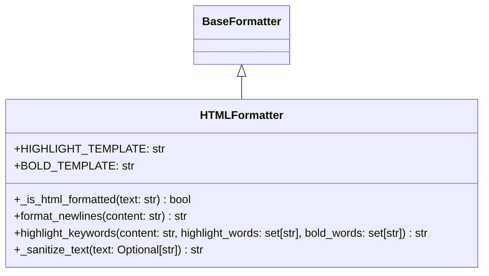

# Diagram: common/notification_service/notification_service/templated_notifications/formatters/html_formatter.py

> Auto-generated by Obscura crawlers

## Mermaid

### SVG

<svg id="container" width="704.8359375" xmlns="http://www.w3.org/2000/svg" class="classDiagram" height="390" viewBox="0 0 704.8359375 390" role="graphics-document document" aria-roledescription="class"><g><defs><marker id="container_class-aggregationStart" class="marker aggregation class" refX="18" refY="7" markerWidth="190" markerHeight="240" orient="auto"><path d="M 18,7 L9,13 L1,7 L9,1 Z"></path></marker></defs><defs><marker id="container_class-aggregationEnd" class="marker aggregation class" refX="1" refY="7" markerWidth="20" markerHeight="28" orient="auto"><path d="M 18,7 L9,13 L1,7 L9,1 Z"></path></marker></defs><defs><marker id="container_class-extensionStart" class="marker extension class" refX="18" refY="7" markerWidth="190" markerHeight="240" orient="auto"><path d="M 1,7 L18,13 V 1 Z"></path></marker></defs><defs><marker id="container_class-extensionEnd" class="marker extension class" refX="1" refY="7" markerWidth="20" markerHeight="28" orient="auto"><path d="M 1,1 V 13 L18,7 Z"></path></marker></defs><defs><marker id="container_class-compositionStart" class="marker composition class" refX="18" refY="7" markerWidth="190" markerHeight="240" orient="auto"><path d="M 18,7 L9,13 L1,7 L9,1 Z"></path></marker></defs><defs><marker id="container_class-compositionEnd" class="marker composition class" refX="1" refY="7" markerWidth="20" markerHeight="28" orient="auto"><path d="M 18,7 L9,13 L1,7 L9,1 Z"></path></marker></defs><defs><marker id="container_class-dependencyStart" class="marker dependency class" refX="6" refY="7" markerWidth="190" markerHeight="240" orient="auto"><path d="M 5,7 L9,13 L1,7 L9,1 Z"></path></marker></defs><defs><marker id="container_class-dependencyEnd" class="marker dependency class" refX="13" refY="7" markerWidth="20" markerHeight="28" orient="auto"><path d="M 18,7 L9,13 L14,7 L9,1 Z"></path></marker></defs><defs><marker id="container_class-lollipopStart" class="marker lollipop class" refX="13" refY="7" markerWidth="190" markerHeight="240" orient="auto"><circle stroke="black" fill="transparent" cx="7" cy="7" r="6"></circle></marker></defs><defs><marker id="container_class-lollipopEnd" class="marker lollipop class" refX="1" refY="7" markerWidth="190" markerHeight="240" orient="auto"><circle stroke="black" fill="transparent" cx="7" cy="7" r="6"></circle></marker></defs><g class="root"><g class="clusters"></g><g class="edgePaths"><path d="M352.418,109.25L352.418,110.542C352.418,111.833,352.418,114.417,352.418,119.875C352.418,125.333,352.418,133.667,352.418,137.833L352.418,142" id="id_BaseFormatter_HTMLFormatter_1" class="edge-thickness-normal edge-pattern-solid relation" style=";;;" data-edge="true" data-et="edge" data-id="id_BaseFormatter_HTMLFormatter_1" data-points="W3sieCI6MzUyLjQxNzk2ODc1LCJ5Ijo5Mn0seyJ4IjozNTIuNDE3OTY4NzUsInkiOjExN30seyJ4IjozNTIuNDE3OTY4NzUsInkiOjE0Mn1d" marker-start="url(#container_class-extensionStart)"></path></g><g class="edgeLabels"><g class="edgeLabel"><g class="label" data-id="id_BaseFormatter_HTMLFormatter_1" transform="translate(0, 0)"><foreignObject width="0" height="0">

</foreignObject></g></g></g><g class="nodes"><g class="node default" id="classId-BaseFormatter-0" transform="translate(352.41796875, 50)"><g class="basic label-container"><path d="M-65.8203125 -42 L65.8203125 -42 L65.8203125 42 L-65.8203125 42" stroke="none" stroke-width="0" fill="#ECECFF" style=""></path><path d="M-65.8203125 -42 C-30.714568359126503 -42, 4.391175781746995 -42, 65.8203125 -42 M-65.8203125 -42 C-21.624617745342924 -42, 22.571077009314152 -42, 65.8203125 -42 M65.8203125 -42 C65.8203125 -13.064328621978426, 65.8203125 15.871342756043148, 65.8203125 42 M65.8203125 -42 C65.8203125 -21.198292186917044, 65.8203125 -0.39658437383408796, 65.8203125 42 M65.8203125 42 C22.261035185627343 42, -21.298242128745315 42, -65.8203125 42 M65.8203125 42 C31.611116765641064 42, -2.5980789687178714 42, -65.8203125 42 M-65.8203125 42 C-65.8203125 23.96768718857453, -65.8203125 5.93537437714906, -65.8203125 -42 M-65.8203125 42 C-65.8203125 13.747961488586917, -65.8203125 -14.504077022826166, -65.8203125 -42" stroke="#9370DB" stroke-width="1.3" fill="none" stroke-dasharray="0 0" style=""></path></g><g class="annotation-group text" transform="translate(0, -18)"></g><g class="label-group text" transform="translate(-53.8203125, -18)"><g class="label" style="font-weight: bolder" transform="translate(0,-12)"><foreignObject width="107.640625" height="24">

BaseFormatter

</foreignObject></g></g><g class="members-group text" transform="translate(-53.8203125, 30)"></g><g class="methods-group text" transform="translate(-53.8203125, 60)"></g><g class="divider" style=""><path d="M-65.8203125 6 C-27.14492563651821 6, 11.530461226963581 6, 65.8203125 6 M-65.8203125 6 C-38.665307740640344 6, -11.510302981280681 6, 65.8203125 6" stroke="#9370DB" stroke-width="1.3" fill="none" stroke-dasharray="0 0" style=""></path></g><g class="divider" style=""><path d="M-65.8203125 24 C-14.473716206764571 24, 36.87288008647086 24, 65.8203125 24 M-65.8203125 24 C-34.89347009506628 24, -3.9666276901325546 24, 65.8203125 24" stroke="#9370DB" stroke-width="1.3" fill="none" stroke-dasharray="0 0" style=""></path></g></g><g class="node default" id="classId-HTMLFormatter-1" transform="translate(352.41796875, 262)"><g class="basic label-container"><path d="M-344.41796875 -120 L344.41796875 -120 L344.41796875 120 L-344.41796875 120" stroke="none" stroke-width="0" fill="#ECECFF" style=""></path><path d="M-344.41796875 -120 C-164.0977537248622 -120, 16.222461300275597 -120, 344.41796875 -120 M-344.41796875 -120 C-196.27306845347732 -120, -48.128168156954644 -120, 344.41796875 -120 M344.41796875 -120 C344.41796875 -58.24627555094223, 344.41796875 3.507448898115541, 344.41796875 120 M344.41796875 -120 C344.41796875 -50.086010115793144, 344.41796875 19.827979768413712, 344.41796875 120 M344.41796875 120 C72.24603122433842 120, -199.92590630132315 120, -344.41796875 120 M344.41796875 120 C134.0293836336456 120, -76.35920148270878 120, -344.41796875 120 M-344.41796875 120 C-344.41796875 38.37066033512441, -344.41796875 -43.258679329751175, -344.41796875 -120 M-344.41796875 120 C-344.41796875 49.17998136224814, -344.41796875 -21.640037275503715, -344.41796875 -120" stroke="#9370DB" stroke-width="1.3" fill="none" stroke-dasharray="0 0" style=""></path></g><g class="annotation-group text" transform="translate(0, -96)"></g><g class="label-group text" transform="translate(-56.1796875, -96)"><g class="label" style="font-weight: bolder" transform="translate(0,-12)"><foreignObject width="112.359375" height="24">

HTMLFormatter

</foreignObject></g></g><g class="members-group text" transform="translate(-332.41796875, -48)"><g class="label" style="" transform="translate(0,-12)"><foreignObject width="192.46875" height="24">

+HIGHLIGHT_TEMPLATE: str

</foreignObject></g><g class="label" style="" transform="translate(0,12)"><foreignObject width="153.1875" height="24">

+BOLD_TEMPLATE: str

</foreignObject></g></g><g class="methods-group text" transform="translate(-332.41796875, 24)"><g class="label" style="" transform="translate(0,-12)"><foreignObject width="260.09375" height="24">

+_is_html_formatted(text: str) : bool

</foreignObject></g><g class="label" style="" transform="translate(0,12)"><foreignObject width="254.453125" height="24">

+format_newlines(content: str) : str

</foreignObject></g><g class="label" style="" transform="translate(0,36)"><foreignObject width="608.65625" height="24">

+highlight_keywords(content: str, highlight_words: set[str], bold_words: set[str]) : str

</foreignObject></g><g class="label" style="" transform="translate(0,60)"><foreignObject width="276.59375" height="24">

+_sanitize_text(text: Optional[str]) : str

</foreignObject></g></g><g class="divider" style=""><path d="M-344.41796875 -72 C-94.94847335509672 -72, 154.52102203980655 -72, 344.41796875 -72 M-344.41796875 -72 C-129.41883259966093 -72, 85.58030355067814 -72, 344.41796875 -72" stroke="#9370DB" stroke-width="1.3" fill="none" stroke-dasharray="0 0" style=""></path></g><g class="divider" style=""><path d="M-344.41796875 0 C-137.47844937660932 0, 69.46106999678136 0, 344.41796875 0 M-344.41796875 0 C-164.7461946381239 0, 14.92557947375218 0, 344.41796875 0" stroke="#9370DB" stroke-width="1.3" fill="none" stroke-dasharray="0 0" style=""></path></g></g></g></g></g></svg>
