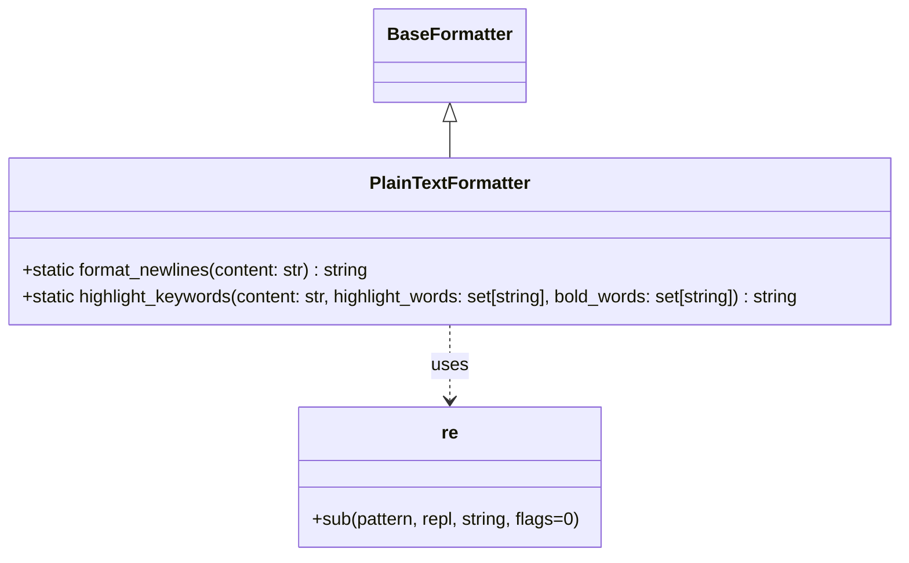

# Diagram: common/notification_service/notification_service/templated_notifications/formatters/text_formatter.py

> Auto-generated by Obscura crawlers

## Mermaid

### SVG

<svg id="container" width="829.28125" xmlns="http://www.w3.org/2000/svg" class="classDiagram" height="500" viewBox="0 0 829.28125 500" role="graphics-document document" aria-roledescription="class"><g><defs><marker id="container_class-aggregationStart" class="marker aggregation class" refX="18" refY="7" markerWidth="190" markerHeight="240" orient="auto"><path d="M 18,7 L9,13 L1,7 L9,1 Z"></path></marker></defs><defs><marker id="container_class-aggregationEnd" class="marker aggregation class" refX="1" refY="7" markerWidth="20" markerHeight="28" orient="auto"><path d="M 18,7 L9,13 L1,7 L9,1 Z"></path></marker></defs><defs><marker id="container_class-extensionStart" class="marker extension class" refX="18" refY="7" markerWidth="190" markerHeight="240" orient="auto"><path d="M 1,7 L18,13 V 1 Z"></path></marker></defs><defs><marker id="container_class-extensionEnd" class="marker extension class" refX="1" refY="7" markerWidth="20" markerHeight="28" orient="auto"><path d="M 1,1 V 13 L18,7 Z"></path></marker></defs><defs><marker id="container_class-compositionStart" class="marker composition class" refX="18" refY="7" markerWidth="190" markerHeight="240" orient="auto"><path d="M 18,7 L9,13 L1,7 L9,1 Z"></path></marker></defs><defs><marker id="container_class-compositionEnd" class="marker composition class" refX="1" refY="7" markerWidth="20" markerHeight="28" orient="auto"><path d="M 18,7 L9,13 L1,7 L9,1 Z"></path></marker></defs><defs><marker id="container_class-dependencyStart" class="marker dependency class" refX="6" refY="7" markerWidth="190" markerHeight="240" orient="auto"><path d="M 5,7 L9,13 L1,7 L9,1 Z"></path></marker></defs><defs><marker id="container_class-dependencyEnd" class="marker dependency class" refX="13" refY="7" markerWidth="20" markerHeight="28" orient="auto"><path d="M 18,7 L9,13 L14,7 L9,1 Z"></path></marker></defs><defs><marker id="container_class-lollipopStart" class="marker lollipop class" refX="13" refY="7" markerWidth="190" markerHeight="240" orient="auto"><circle stroke="black" fill="transparent" cx="7" cy="7" r="6"></circle></marker></defs><defs><marker id="container_class-lollipopEnd" class="marker lollipop class" refX="1" refY="7" markerWidth="190" markerHeight="240" orient="auto"><circle stroke="black" fill="transparent" cx="7" cy="7" r="6"></circle></marker></defs><g class="root"><g class="clusters"></g><g class="edgePaths"><path d="M414.641,109.25L414.641,110.542C414.641,111.833,414.641,114.417,414.641,119.875C414.641,125.333,414.641,133.667,414.641,137.833L414.641,142" id="id_BaseFormatter_PlainTextFormatter_1" class="edge-thickness-normal edge-pattern-solid relation" style=";;;" data-edge="true" data-et="edge" data-id="id_BaseFormatter_PlainTextFormatter_1" data-points="W3sieCI6NDE0LjY0MDYyNSwieSI6OTJ9LHsieCI6NDE0LjY0MDYyNSwieSI6MTE3fSx7IngiOjQxNC42NDA2MjUsInkiOjE0Mn1d" marker-start="url(#container_class-extensionStart)"></path><path d="M414.641,292L414.641,298.167C414.641,304.333,414.641,316.667,414.641,328C414.641,339.333,414.641,349.667,414.641,354.833L414.641,360" id="id_PlainTextFormatter_re_2" class="edge-thickness-normal edge-pattern-dashed relation" style=";;;" data-edge="true" data-et="edge" data-id="id_PlainTextFormatter_re_2" data-points="W3sieCI6NDE0LjY0MDYyNSwieSI6MjkyfSx7IngiOjQxNC42NDA2MjUsInkiOjMyOX0seyJ4Ijo0MTQuNjQwNjI1LCJ5IjozNjZ9XQ==" marker-end="url(#container_class-dependencyEnd)"></path></g><g class="edgeLabels"><g class="edgeLabel"><g class="label" data-id="id_BaseFormatter_PlainTextFormatter_1" transform="translate(0, 0)"><foreignObject width="0" height="0">

</foreignObject></g></g><g class="edgeLabel" transform="translate(414.640625, 329)"><g class="label" data-id="id_PlainTextFormatter_re_2" transform="translate(-16.4921875, -12)"><foreignObject width="32.984375" height="24">

uses

</foreignObject></g></g></g><g class="nodes"><g class="node default" id="classId-BaseFormatter-0" transform="translate(414.640625, 50)"><g class="basic label-container"><path d="M-65.8203125 -42 L65.8203125 -42 L65.8203125 42 L-65.8203125 42" stroke="none" stroke-width="0" fill="#ECECFF" style=""></path><path d="M-65.8203125 -42 C-18.40825094208183 -42, 29.003810615836343 -42, 65.8203125 -42 M-65.8203125 -42 C-30.020132531168187 -42, 5.780047437663626 -42, 65.8203125 -42 M65.8203125 -42 C65.8203125 -15.716507941941334, 65.8203125 10.566984116117332, 65.8203125 42 M65.8203125 -42 C65.8203125 -17.436296350245904, 65.8203125 7.127407299508192, 65.8203125 42 M65.8203125 42 C19.171010003172782 42, -27.478292493654436 42, -65.8203125 42 M65.8203125 42 C22.41815619804089 42, -20.98400010391822 42, -65.8203125 42 M-65.8203125 42 C-65.8203125 18.482292377723287, -65.8203125 -5.035415244553427, -65.8203125 -42 M-65.8203125 42 C-65.8203125 15.611281759756892, -65.8203125 -10.777436480486216, -65.8203125 -42" stroke="#9370DB" stroke-width="1.3" fill="none" stroke-dasharray="0 0" style=""></path></g><g class="annotation-group text" transform="translate(0, -18)"></g><g class="label-group text" transform="translate(-53.8203125, -18)"><g class="label" style="font-weight: bolder" transform="translate(0,-12)"><foreignObject width="107.640625" height="24">

BaseFormatter

</foreignObject></g></g><g class="members-group text" transform="translate(-53.8203125, 30)"></g><g class="methods-group text" transform="translate(-53.8203125, 60)"></g><g class="divider" style=""><path d="M-65.8203125 6 C-38.30843666052608 6, -10.796560821052154 6, 65.8203125 6 M-65.8203125 6 C-24.707760938294584 6, 16.404790623410832 6, 65.8203125 6" stroke="#9370DB" stroke-width="1.3" fill="none" stroke-dasharray="0 0" style=""></path></g><g class="divider" style=""><path d="M-65.8203125 24 C-32.486419607811456 24, 0.847473284377088 24, 65.8203125 24 M-65.8203125 24 C-38.04149709680813 24, -10.262681693616265 24, 65.8203125 24" stroke="#9370DB" stroke-width="1.3" fill="none" stroke-dasharray="0 0" style=""></path></g></g><g class="node default" id="classId-PlainTextFormatter-1" transform="translate(414.640625, 217)"><g class="basic label-container"><path d="M-406.640625 -75 L406.640625 -75 L406.640625 75 L-406.640625 75" stroke="none" stroke-width="0" fill="#ECECFF" style=""></path><path d="M-406.640625 -75 C-161.12212346652393 -75, 84.39637806695214 -75, 406.640625 -75 M-406.640625 -75 C-220.22890801196607 -75, -33.81719102393214 -75, 406.640625 -75 M406.640625 -75 C406.640625 -38.5700124452409, 406.640625 -2.140024890481797, 406.640625 75 M406.640625 -75 C406.640625 -17.725811189252013, 406.640625 39.54837762149597, 406.640625 75 M406.640625 75 C126.85931293952484 75, -152.92199912095032 75, -406.640625 75 M406.640625 75 C82.98825134124195 75, -240.6641223175161 75, -406.640625 75 M-406.640625 75 C-406.640625 36.29983452867739, -406.640625 -2.400330942645226, -406.640625 -75 M-406.640625 75 C-406.640625 28.86979938419406, -406.640625 -17.26040123161188, -406.640625 -75" stroke="#9370DB" stroke-width="1.3" fill="none" stroke-dasharray="0 0" style=""></path></g><g class="annotation-group text" transform="translate(0, -51)"></g><g class="label-group text" transform="translate(-69.984375, -51)"><g class="label" style="font-weight: bolder" transform="translate(0,-12)"><foreignObject width="139.96875" height="24">

PlainTextFormatter

</foreignObject></g></g><g class="members-group text" transform="translate(-394.640625, -3)"></g><g class="methods-group text" transform="translate(-394.640625, 27)"><g class="label" style="" transform="translate(0,-12)"><foreignObject width="320.921875" height="24">

+static format_newlines(content: str) : string

</foreignObject></g><g class="label" style="" transform="translate(0,12)"><foreignObject width="719.296875" height="24">

+static highlight_keywords(content: str, highlight_words: set[string], bold_words: set[string]) : string

</foreignObject></g></g><g class="divider" style=""><path d="M-406.640625 -27 C-82.87872091562474 -27, 240.88318316875052 -27, 406.640625 -27 M-406.640625 -27 C-201.89127869412167 -27, 2.858067611756667 -27, 406.640625 -27" stroke="#9370DB" stroke-width="1.3" fill="none" stroke-dasharray="0 0" style=""></path></g><g class="divider" style=""><path d="M-406.640625 -3 C-142.31309721501736 -3, 122.01443056996527 -3, 406.640625 -3 M-406.640625 -3 C-94.9425271734255 -3, 216.755570653149 -3, 406.640625 -3" stroke="#9370DB" stroke-width="1.3" fill="none" stroke-dasharray="0 0" style=""></path></g></g><g class="node default" id="classId-re-2" transform="translate(414.640625, 429)"><g class="basic label-container"><path d="M-137.3828125 -63 L137.3828125 -63 L137.3828125 63 L-137.3828125 63" stroke="none" stroke-width="0" fill="#ECECFF" style=""></path><path d="M-137.3828125 -63 C-82.21656256294465 -63, -27.05031262588929 -63, 137.3828125 -63 M-137.3828125 -63 C-37.74579311856495 -63, 61.891226262870106 -63, 137.3828125 -63 M137.3828125 -63 C137.3828125 -36.18500429310854, 137.3828125 -9.370008586217082, 137.3828125 63 M137.3828125 -63 C137.3828125 -33.8538539536186, 137.3828125 -4.707707907237193, 137.3828125 63 M137.3828125 63 C67.92438114067498 63, -1.5340502186500373 63, -137.3828125 63 M137.3828125 63 C44.51431105132232 63, -48.35419039735535 63, -137.3828125 63 M-137.3828125 63 C-137.3828125 15.921774252782548, -137.3828125 -31.156451494434904, -137.3828125 -63 M-137.3828125 63 C-137.3828125 22.890898614917134, -137.3828125 -17.218202770165732, -137.3828125 -63" stroke="#9370DB" stroke-width="1.3" fill="none" stroke-dasharray="0 0" style=""></path></g><g class="annotation-group text" transform="translate(0, -39)"></g><g class="label-group text" transform="translate(-7.390625, -39)"><g class="label" style="font-weight: bolder" transform="translate(0,-12)"><foreignObject width="14.78125" height="24">

re

</foreignObject></g></g><g class="members-group text" transform="translate(-125.3828125, 9)"></g><g class="methods-group text" transform="translate(-125.3828125, 39)"><g class="label" style="" transform="translate(0,-12)"><foreignObject width="243.375" height="24">

+sub(pattern, repl, string, flags=0)

</foreignObject></g></g><g class="divider" style=""><path d="M-137.3828125 -15 C-69.69713856407677 -15, -2.011464628153533 -15, 137.3828125 -15 M-137.3828125 -15 C-44.82436216900973 -15, 47.73408816198054 -15, 137.3828125 -15" stroke="#9370DB" stroke-width="1.3" fill="none" stroke-dasharray="0 0" style=""></path></g><g class="divider" style=""><path d="M-137.3828125 9 C-33.115882802120126 9, 71.15104689575975 9, 137.3828125 9 M-137.3828125 9 C-58.18114277718006 9, 21.020526945639887 9, 137.3828125 9" stroke="#9370DB" stroke-width="1.3" fill="none" stroke-dasharray="0 0" style=""></path></g></g></g></g></g></svg>
