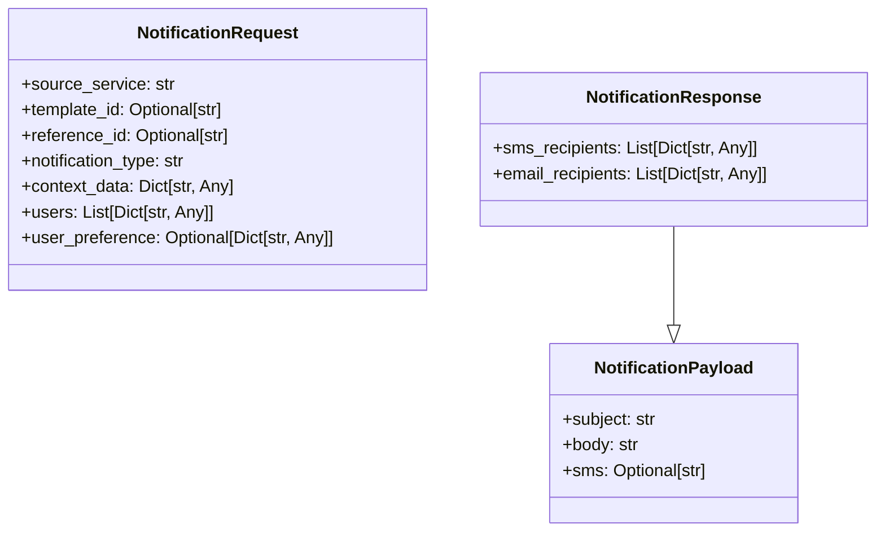

# Diagram: common/notification_service/notification_service/templated_notifications/models/notification.py

> Auto-generated by Obscura crawlers

## Mermaid

### SVG

<svg id="container" width="825.6171875" xmlns="http://www.w3.org/2000/svg" class="classDiagram" height="498" viewBox="0 0 825.6171875 498" role="graphics-document document" aria-roledescription="class"><g><defs><marker id="container_class-aggregationStart" class="marker aggregation class" refX="18" refY="7" markerWidth="190" markerHeight="240" orient="auto"><path d="M 18,7 L9,13 L1,7 L9,1 Z"></path></marker></defs><defs><marker id="container_class-aggregationEnd" class="marker aggregation class" refX="1" refY="7" markerWidth="20" markerHeight="28" orient="auto"><path d="M 18,7 L9,13 L1,7 L9,1 Z"></path></marker></defs><defs><marker id="container_class-extensionStart" class="marker extension class" refX="18" refY="7" markerWidth="190" markerHeight="240" orient="auto"><path d="M 1,7 L18,13 V 1 Z"></path></marker></defs><defs><marker id="container_class-extensionEnd" class="marker extension class" refX="1" refY="7" markerWidth="20" markerHeight="28" orient="auto"><path d="M 1,1 V 13 L18,7 Z"></path></marker></defs><defs><marker id="container_class-compositionStart" class="marker composition class" refX="18" refY="7" markerWidth="190" markerHeight="240" orient="auto"><path d="M 18,7 L9,13 L1,7 L9,1 Z"></path></marker></defs><defs><marker id="container_class-compositionEnd" class="marker composition class" refX="1" refY="7" markerWidth="20" markerHeight="28" orient="auto"><path d="M 18,7 L9,13 L1,7 L9,1 Z"></path></marker></defs><defs><marker id="container_class-dependencyStart" class="marker dependency class" refX="6" refY="7" markerWidth="190" markerHeight="240" orient="auto"><path d="M 5,7 L9,13 L1,7 L9,1 Z"></path></marker></defs><defs><marker id="container_class-dependencyEnd" class="marker dependency class" refX="13" refY="7" markerWidth="20" markerHeight="28" orient="auto"><path d="M 18,7 L9,13 L14,7 L9,1 Z"></path></marker></defs><defs><marker id="container_class-lollipopStart" class="marker lollipop class" refX="13" refY="7" markerWidth="190" markerHeight="240" orient="auto"><circle stroke="black" fill="transparent" cx="7" cy="7" r="6"></circle></marker></defs><defs><marker id="container_class-lollipopEnd" class="marker lollipop class" refX="1" refY="7" markerWidth="190" markerHeight="240" orient="auto"><circle stroke="black" fill="transparent" cx="7" cy="7" r="6"></circle></marker></defs><g class="root"><g class="clusters"></g><g class="edgePaths"><path d="M634.574,212L634.574,226.167C634.574,240.333,634.574,268.667,634.574,284.125C634.574,299.583,634.574,302.167,634.574,303.458L634.574,304.75" id="id_NotificationResponse_NotificationPayload_1" class="edge-thickness-normal edge-pattern-solid relation" style=";;;" data-edge="true" data-et="edge" data-id="id_NotificationResponse_NotificationPayload_1" data-points="W3sieCI6NjM0LjU3NDIxODc1LCJ5IjoyMTJ9LHsieCI6NjM0LjU3NDIxODc1LCJ5IjoyOTd9LHsieCI6NjM0LjU3NDIxODc1LCJ5IjozMjJ9XQ==" marker-end="url(#container_class-extensionEnd)"></path></g><g class="edgeLabels"><g class="edgeLabel"><g class="label" data-id="id_NotificationResponse_NotificationPayload_1" transform="translate(0, 0)"><foreignObject width="0" height="0">

</foreignObject></g></g></g><g class="nodes"><g class="node default" id="classId-NotificationRequest-0" transform="translate(204.765625, 140)"><g class="basic label-container"><path d="M-196.765625 -132 L196.765625 -132 L196.765625 132 L-196.765625 132" stroke="none" stroke-width="0" fill="#ECECFF" style=""></path><path d="M-196.765625 -132 C-100.88412520231621 -132, -5.002625404632425 -132, 196.765625 -132 M-196.765625 -132 C-52.07966997605669 -132, 92.60628504788662 -132, 196.765625 -132 M196.765625 -132 C196.765625 -34.54692221394106, 196.765625 62.90615557211788, 196.765625 132 M196.765625 -132 C196.765625 -62.14680385357417, 196.765625 7.70639229285166, 196.765625 132 M196.765625 132 C84.08930593179853 132, -28.58701313640293 132, -196.765625 132 M196.765625 132 C107.82443849533269 132, 18.88325199066537 132, -196.765625 132 M-196.765625 132 C-196.765625 30.593592148064303, -196.765625 -70.8128157038714, -196.765625 -132 M-196.765625 132 C-196.765625 53.85585421751682, -196.765625 -24.288291564966357, -196.765625 -132" stroke="#9370DB" stroke-width="1.3" fill="none" stroke-dasharray="0 0" style=""></path></g><g class="annotation-group text" transform="translate(0, -108)"></g><g class="label-group text" transform="translate(-72.859375, -108)"><g class="label" style="font-weight: bolder" transform="translate(0,-12)"><foreignObject width="145.71875" height="24">

NotificationRequest

</foreignObject></g></g><g class="members-group text" transform="translate(-184.765625, -60)"><g class="label" style="" transform="translate(0,-12)"><foreignObject width="142.171875" height="24">

+source_service: str

</foreignObject></g><g class="label" style="" transform="translate(0,12)"><foreignObject width="195.65625" height="24">

+template_id: Optional[str]

</foreignObject></g><g class="label" style="" transform="translate(0,36)"><foreignObject width="198.875" height="24">

+reference_id: Optional[str]

</foreignObject></g><g class="label" style="" transform="translate(0,60)"><foreignObject width="158.703125" height="24">

+notification_type: str

</foreignObject></g><g class="label" style="" transform="translate(0,84)"><foreignObject width="201.484375" height="24">

+context_data: Dict[str, Any]

</foreignObject></g><g class="label" style="" transform="translate(0,108)"><foreignObject width="182.09375" height="24">

+users: List[Dict[str, Any]]

</foreignObject></g><g class="label" style="" transform="translate(0,132)"><foreignObject width="296.671875" height="24">

+user_preference: Optional[Dict[str, Any]]

</foreignObject></g></g><g class="methods-group text" transform="translate(-184.765625, 132)"></g><g class="divider" style=""><path d="M-196.765625 -84 C-58.236854565913376 -84, 80.29191586817325 -84, 196.765625 -84 M-196.765625 -84 C-92.18278354442333 -84, 12.40005791115334 -84, 196.765625 -84" stroke="#9370DB" stroke-width="1.3" fill="none" stroke-dasharray="0 0" style=""></path></g><g class="divider" style=""><path d="M-196.765625 108 C-108.24157781276739 108, -19.717530625534778 108, 196.765625 108 M-196.765625 108 C-67.81682953029105 108, 61.13196593941791 108, 196.765625 108" stroke="#9370DB" stroke-width="1.3" fill="none" stroke-dasharray="0 0" style=""></path></g></g><g class="node default" id="classId-NotificationPayload-1" transform="translate(634.57421875, 406)"><g class="basic label-container"><path d="M-116.52734375 -84 L116.52734375 -84 L116.52734375 84 L-116.52734375 84" stroke="none" stroke-width="0" fill="#ECECFF" style=""></path><path d="M-116.52734375 -84 C-34.985247512173615 -84, 46.55684872565277 -84, 116.52734375 -84 M-116.52734375 -84 C-64.67947833808758 -84, -12.831612926175154 -84, 116.52734375 -84 M116.52734375 -84 C116.52734375 -18.60308862139965, 116.52734375 46.7938227572007, 116.52734375 84 M116.52734375 -84 C116.52734375 -34.445561608761615, 116.52734375 15.10887678247677, 116.52734375 84 M116.52734375 84 C36.362825772817246 84, -43.80169220436551 84, -116.52734375 84 M116.52734375 84 C38.783021049945006 84, -38.96130165010999 84, -116.52734375 84 M-116.52734375 84 C-116.52734375 17.516920741389868, -116.52734375 -48.966158517220265, -116.52734375 -84 M-116.52734375 84 C-116.52734375 41.795085276260544, -116.52734375 -0.4098294474789128, -116.52734375 -84" stroke="#9370DB" stroke-width="1.3" fill="none" stroke-dasharray="0 0" style=""></path></g><g class="annotation-group text" transform="translate(0, -60)"></g><g class="label-group text" transform="translate(-71.7890625, -60)"><g class="label" style="font-weight: bolder" transform="translate(0,-12)"><foreignObject width="143.578125" height="24">

NotificationPayload

</foreignObject></g></g><g class="members-group text" transform="translate(-104.52734375, -12)"><g class="label" style="" transform="translate(0,-12)"><foreignObject width="88.46875" height="24">

+subject: str

</foreignObject></g><g class="label" style="" transform="translate(0,12)"><foreignObject width="71.84375" height="24">

+body: str

</foreignObject></g><g class="label" style="" transform="translate(0,36)"><foreignObject width="137.265625" height="24">

+sms: Optional[str]

</foreignObject></g></g><g class="methods-group text" transform="translate(-104.52734375, 84)"></g><g class="divider" style=""><path d="M-116.52734375 -36 C-40.98432130904851 -36, 34.55870113190298 -36, 116.52734375 -36 M-116.52734375 -36 C-30.20331590711598 -36, 56.12071193576804 -36, 116.52734375 -36" stroke="#9370DB" stroke-width="1.3" fill="none" stroke-dasharray="0 0" style=""></path></g><g class="divider" style=""><path d="M-116.52734375 60 C-45.21565402042029 60, 26.096035709159423 60, 116.52734375 60 M-116.52734375 60 C-60.05575781447111 60, -3.5841718789422146 60, 116.52734375 60" stroke="#9370DB" stroke-width="1.3" fill="none" stroke-dasharray="0 0" style=""></path></g></g><g class="node default" id="classId-NotificationResponse-2" transform="translate(634.57421875, 140)"><g class="basic label-container"><path d="M-183.04296875 -72 L183.04296875 -72 L183.04296875 72 L-183.04296875 72" stroke="none" stroke-width="0" fill="#ECECFF" style=""></path><path d="M-183.04296875 -72 C-73.78039470691586 -72, 35.48217933616829 -72, 183.04296875 -72 M-183.04296875 -72 C-46.75401720096539 -72, 89.53493434806921 -72, 183.04296875 -72 M183.04296875 -72 C183.04296875 -32.09506890742909, 183.04296875 7.809862185141824, 183.04296875 72 M183.04296875 -72 C183.04296875 -29.322678780486044, 183.04296875 13.354642439027913, 183.04296875 72 M183.04296875 72 C105.57798896179854 72, 28.113009173597078 72, -183.04296875 72 M183.04296875 72 C68.75755753795661 72, -45.52785367408677 72, -183.04296875 72 M-183.04296875 72 C-183.04296875 36.14782351557896, -183.04296875 0.2956470311579267, -183.04296875 -72 M-183.04296875 72 C-183.04296875 34.989672112701776, -183.04296875 -2.020655774596449, -183.04296875 -72" stroke="#9370DB" stroke-width="1.3" fill="none" stroke-dasharray="0 0" style=""></path></g><g class="annotation-group text" transform="translate(0, -48)"></g><g class="label-group text" transform="translate(-78.3203125, -48)"><g class="label" style="font-weight: bolder" transform="translate(0,-12)"><foreignObject width="156.640625" height="24">

NotificationResponse

</foreignObject></g></g><g class="members-group text" transform="translate(-171.04296875, 0)"><g class="label" style="" transform="translate(0,-12)"><foreignObject width="251.765625" height="24">

+sms_recipients: List[Dict[str, Any]]

</foreignObject></g><g class="label" style="" transform="translate(0,12)"><foreignObject width="263.765625" height="24">

+email_recipients: List[Dict[str, Any]]

</foreignObject></g></g><g class="methods-group text" transform="translate(-171.04296875, 72)"></g><g class="divider" style=""><path d="M-183.04296875 -24 C-106.80779054130227 -24, -30.572612332604535 -24, 183.04296875 -24 M-183.04296875 -24 C-71.33256660726363 -24, 40.37783553547274 -24, 183.04296875 -24" stroke="#9370DB" stroke-width="1.3" fill="none" stroke-dasharray="0 0" style=""></path></g><g class="divider" style=""><path d="M-183.04296875 48 C-81.72286815583232 48, 19.597232438335368 48, 183.04296875 48 M-183.04296875 48 C-46.261815585678306 48, 90.51933757864339 48, 183.04296875 48" stroke="#9370DB" stroke-width="1.3" fill="none" stroke-dasharray="0 0" style=""></path></g></g></g></g></g></svg>
