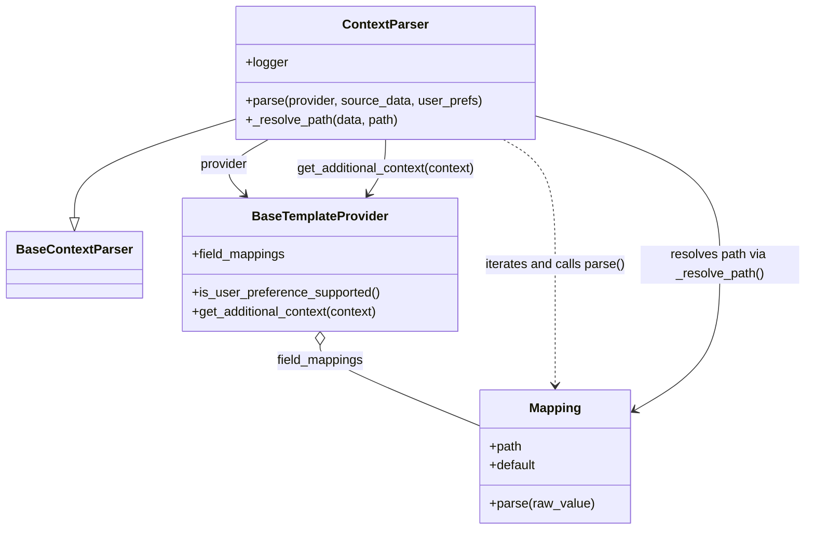

# Diagram: common/notification_service/notification_service/templated_notifications/parser/context_parser.py

> Auto-generated by Obscura crawlers

## Mermaid

### SVG

<svg id="container" width="1009.3828125" xmlns="http://www.w3.org/2000/svg" class="classDiagram" height="668" viewBox="0 0 1009.3828125 668" role="graphics-document document" aria-roledescription="class"><g><defs><marker id="container_class-aggregationStart" class="marker aggregation class" refX="18" refY="7" markerWidth="190" markerHeight="240" orient="auto"><path d="M 18,7 L9,13 L1,7 L9,1 Z"></path></marker></defs><defs><marker id="container_class-aggregationEnd" class="marker aggregation class" refX="1" refY="7" markerWidth="20" markerHeight="28" orient="auto"><path d="M 18,7 L9,13 L1,7 L9,1 Z"></path></marker></defs><defs><marker id="container_class-extensionStart" class="marker extension class" refX="18" refY="7" markerWidth="190" markerHeight="240" orient="auto"><path d="M 1,7 L18,13 V 1 Z"></path></marker></defs><defs><marker id="container_class-extensionEnd" class="marker extension class" refX="1" refY="7" markerWidth="20" markerHeight="28" orient="auto"><path d="M 1,1 V 13 L18,7 Z"></path></marker></defs><defs><marker id="container_class-compositionStart" class="marker composition class" refX="18" refY="7" markerWidth="190" markerHeight="240" orient="auto"><path d="M 18,7 L9,13 L1,7 L9,1 Z"></path></marker></defs><defs><marker id="container_class-compositionEnd" class="marker composition class" refX="1" refY="7" markerWidth="20" markerHeight="28" orient="auto"><path d="M 18,7 L9,13 L1,7 L9,1 Z"></path></marker></defs><defs><marker id="container_class-dependencyStart" class="marker dependency class" refX="6" refY="7" markerWidth="190" markerHeight="240" orient="auto"><path d="M 5,7 L9,13 L1,7 L9,1 Z"></path></marker></defs><defs><marker id="container_class-dependencyEnd" class="marker dependency class" refX="13" refY="7" markerWidth="20" markerHeight="28" orient="auto"><path d="M 18,7 L9,13 L14,7 L9,1 Z"></path></marker></defs><defs><marker id="container_class-lollipopStart" class="marker lollipop class" refX="13" refY="7" markerWidth="190" markerHeight="240" orient="auto"><circle stroke="black" fill="transparent" cx="7" cy="7" r="6"></circle></marker></defs><defs><marker id="container_class-lollipopEnd" class="marker lollipop class" refX="1" refY="7" markerWidth="190" markerHeight="240" orient="auto"><circle stroke="black" fill="transparent" cx="7" cy="7" r="6"></circle></marker></defs><g class="root"><g class="clusters"></g><g class="edgePaths"><path d="M288.926,150.478L255.615,160.898C222.305,171.318,155.684,192.159,122.373,212.871C89.063,233.583,89.063,254.167,89.063,264.458L89.063,274.75" id="id_ContextParser_BaseContextParser_1" class="edge-thickness-normal edge-pattern-solid relation" style=";;;" data-edge="true" data-et="edge" data-id="id_ContextParser_BaseContextParser_1" data-points="W3sieCI6Mjg4LjkyNTc4MTI1LCJ5IjoxNTAuNDc3NjMwNzgxNjYwMjh9LHsieCI6ODkuMDYyNSwieSI6MjEzfSx7IngiOjg5LjA2MjUsInkiOjI5Mn1d" marker-end="url(#container_class-extensionEnd)"></path><path d="M330.354,176L319.672,182.167C308.99,188.333,287.626,200.667,282.67,212.309C277.714,223.951,289.166,234.902,294.892,240.378L300.618,245.853" id="id_ContextParser_BaseTemplateProvider_2" class="edge-thickness-normal edge-pattern-solid relation" style=";;;" data-edge="true" data-et="edge" data-id="id_ContextParser_BaseTemplateProvider_2" data-points="W3sieCI6MzMwLjM1MzU2NDA0OTU4NjgsInkiOjE3Nn0seyJ4IjoyNjYuMjYxNzE4NzUsInkiOjIxM30seyJ4IjozMDQuOTU0Mjg3MTkwMDgyNjUsInkiOjI1MH1d" marker-end="url(#container_class-dependencyEnd)"></path><path d="M392.797,435.25L392.797,438.542C392.797,441.833,392.797,448.417,427.165,465.603C461.533,482.79,530.268,510.58,564.636,524.475L599.004,538.37" id="id_BaseTemplateProvider_Mapping_3" class="edge-thickness-normal edge-pattern-solid relation" style=";;;" data-edge="true" data-et="edge" data-id="id_BaseTemplateProvider_Mapping_3" data-points="W3sieCI6MzkyLjc5Njg3NSwieSI6NDE4fSx7IngiOjM5Mi43OTY4NzUsInkiOjQ1NX0seyJ4Ijo1OTkuMDAzOTA2MjUsInkiOjUzOC4zNjk5MDk2Nzk0NDAzfV0=" marker-start="url(#container_class-aggregationStart)"></path><path d="M625.962,176L636.981,182.167C648,188.333,670.039,200.667,681.059,227C692.078,253.333,692.078,293.667,692.078,334C692.078,374.333,692.078,414.667,692.078,440C692.078,465.333,692.078,475.667,692.078,480.833L692.078,486" id="id_ContextParser_Mapping_4" class="edge-thickness-normal edge-pattern-dashed relation" style=";;;" data-edge="true" data-et="edge" data-id="id_ContextParser_Mapping_4" data-points="W3sieCI6NjI1Ljk2MTY0NzcyNzI3MjcsInkiOjE3Nn0seyJ4Ijo2OTIuMDc4MTI1LCJ5IjoyMTN9LHsieCI6NjkyLjA3ODEyNSwieSI6MzM0fSx7IngiOjY5Mi4wNzgxMjUsInkiOjQ1NX0seyJ4Ijo2OTIuMDc4MTI1LCJ5Ijo0OTJ9XQ==" marker-end="url(#container_class-dependencyEnd)"></path><path d="M662.793,145.156L702.558,156.463C742.323,167.77,821.853,190.385,861.618,221.859C901.383,253.333,901.383,293.667,901.383,334C901.383,374.333,901.383,414.667,882.877,445.532C864.371,476.397,827.359,497.794,808.853,508.492L790.347,519.19" id="id_ContextParser_Mapping_5" class="edge-thickness-normal edge-pattern-solid relation" style=";;;" data-edge="true" data-et="edge" data-id="id_ContextParser_Mapping_5" data-points="W3sieCI6NjYyLjc5Mjk2ODc1LCJ5IjoxNDUuMTU1NjI2MzQyNTU2MDV9LHsieCI6OTAxLjM4MjgxMjUsInkiOjIxM30seyJ4Ijo5MDEuMzgyODEyNSwieSI6MzM0fSx7IngiOjkwMS4zODI4MTI1LCJ5Ijo0NTV9LHsieCI6Nzg1LjE1MjM0Mzc1LCJ5Ijo1MjIuMTkzMzY3MTc1NTQ0fV0=" marker-end="url(#container_class-dependencyEnd)"></path><path d="M475.859,176L475.859,182.167C475.859,188.333,475.859,200.667,472.192,212.176C468.525,223.684,461.19,234.369,457.523,239.711L453.856,245.053" id="id_ContextParser_BaseTemplateProvider_6" class="edge-thickness-normal edge-pattern-solid relation" style=";;;" data-edge="true" data-et="edge" data-id="id_ContextParser_BaseTemplateProvider_6" data-points="W3sieCI6NDc1Ljg1OTM3NSwieSI6MTc2fSx7IngiOjQ3NS44NTkzNzUsInkiOjIxM30seyJ4Ijo0NTAuNDYwMDk4MTQwNDk1ODYsInkiOjI1MH1d" marker-end="url(#container_class-dependencyEnd)"></path></g><g class="edgeLabels"><g class="edgeLabel"><g class="label" data-id="id_ContextParser_BaseContextParser_1" transform="translate(0, 0)"><foreignObject width="0" height="0">

</foreignObject></g></g><g class="edgeLabel" transform="translate(275.12529, 207.88309)"><g class="label" data-id="id_ContextParser_BaseTemplateProvider_2" transform="translate(-30.6640625, -12)"><foreignObject width="61.328125" height="24">

provider

</foreignObject></g></g><g class="edgeLabel" transform="translate(392.796875, 455)"><g class="label" data-id="id_BaseTemplateProvider_Mapping_3" transform="translate(-55.7109375, -12)"><foreignObject width="111.421875" height="24">

field_mappings

</foreignObject></g></g><g class="edgeLabel" transform="translate(692.078125, 334)"><g class="label" data-id="id_ContextParser_Mapping_4" transform="translate(-89.3046875, -12)"><foreignObject width="178.609375" height="24">

iterates and calls parse()

</foreignObject></g></g><g class="edgeLabel" transform="translate(901.3828125, 334)"><g class="label" data-id="id_ContextParser_Mapping_5" transform="translate(-100, -24)"><foreignObject width="200" height="48">

resolves path via _resolve_path()

</foreignObject></g></g><g class="edgeLabel" transform="translate(475.859375, 213)"><g class="label" data-id="id_ContextParser_BaseTemplateProvider_6" transform="translate(-115.4609375, -12)"><foreignObject width="230.921875" height="24">

get_additional_context(context)

</foreignObject></g></g></g><g class="nodes"><g class="node default" id="classId-ContextParser-0" transform="translate(475.859375, 92)"><g class="basic label-container"><path d="M-186.93359375 -84 L186.93359375 -84 L186.93359375 84 L-186.93359375 84" stroke="none" stroke-width="0" fill="#ECECFF" style=""></path><path d="M-186.93359375 -84 C-37.38675512273528 -84, 112.16008350452944 -84, 186.93359375 -84 M-186.93359375 -84 C-49.91581467932983 -84, 87.10196439134035 -84, 186.93359375 -84 M186.93359375 -84 C186.93359375 -29.080630483213653, 186.93359375 25.838739033572693, 186.93359375 84 M186.93359375 -84 C186.93359375 -20.229698999597588, 186.93359375 43.540602000804824, 186.93359375 84 M186.93359375 84 C100.86761877108084 84, 14.801643792161684 84, -186.93359375 84 M186.93359375 84 C84.11262971734223 84, -18.70833431531554 84, -186.93359375 84 M-186.93359375 84 C-186.93359375 30.68413314833287, -186.93359375 -22.631733703334262, -186.93359375 -84 M-186.93359375 84 C-186.93359375 30.680529100741545, -186.93359375 -22.63894179851691, -186.93359375 -84" stroke="#9370DB" stroke-width="1.3" fill="none" stroke-dasharray="0 0" style=""></path></g><g class="annotation-group text" transform="translate(0, -60)"></g><g class="label-group text" transform="translate(-51.5390625, -60)"><g class="label" style="font-weight: bolder" transform="translate(0,-12)"><foreignObject width="103.078125" height="24">

ContextParser

</foreignObject></g></g><g class="members-group text" transform="translate(-174.93359375, -12)"><g class="label" style="" transform="translate(0,-12)"><foreignObject width="53.21875" height="24">

+logger

</foreignObject></g></g><g class="methods-group text" transform="translate(-174.93359375, 36)"><g class="label" style="" transform="translate(0,-12)"><foreignObject width="298.328125" height="24">

+parse(provider, source_data, user_prefs)

</foreignObject></g><g class="label" style="" transform="translate(0,12)"><foreignObject width="192.8125" height="24">

+_resolve_path(data, path)

</foreignObject></g></g><g class="divider" style=""><path d="M-186.93359375 -36 C-84.62345479620343 -36, 17.686684157593135 -36, 186.93359375 -36 M-186.93359375 -36 C-40.991093050680604 -36, 104.95140764863879 -36, 186.93359375 -36" stroke="#9370DB" stroke-width="1.3" fill="none" stroke-dasharray="0 0" style=""></path></g><g class="divider" style=""><path d="M-186.93359375 12 C-97.27077324255222 12, -7.607952735104448 12, 186.93359375 12 M-186.93359375 12 C-106.02493552587664 12, -25.116277301753286 12, 186.93359375 12" stroke="#9370DB" stroke-width="1.3" fill="none" stroke-dasharray="0 0" style=""></path></g></g><g class="node default" id="classId-BaseContextParser-1" transform="translate(89.0625, 334)"><g class="basic label-container"><path d="M-81.0625 -42 L81.0625 -42 L81.0625 42 L-81.0625 42" stroke="none" stroke-width="0" fill="#ECECFF" style=""></path><path d="M-81.0625 -42 C-37.587062170841165 -42, 5.8883756583176705 -42, 81.0625 -42 M-81.0625 -42 C-23.39449868437226 -42, 34.27350263125548 -42, 81.0625 -42 M81.0625 -42 C81.0625 -16.671292590234106, 81.0625 8.657414819531787, 81.0625 42 M81.0625 -42 C81.0625 -13.866776664499795, 81.0625 14.26644667100041, 81.0625 42 M81.0625 42 C21.37804912827051 42, -38.30640174345898 42, -81.0625 42 M81.0625 42 C26.789099417532277 42, -27.484301164935445 42, -81.0625 42 M-81.0625 42 C-81.0625 21.662970231285595, -81.0625 1.3259404625711895, -81.0625 -42 M-81.0625 42 C-81.0625 23.09768689850214, -81.0625 4.1953737970042795, -81.0625 -42" stroke="#9370DB" stroke-width="1.3" fill="none" stroke-dasharray="0 0" style=""></path></g><g class="annotation-group text" transform="translate(0, -18)"></g><g class="label-group text" transform="translate(-69.0625, -18)"><g class="label" style="font-weight: bolder" transform="translate(0,-12)"><foreignObject width="138.125" height="24">

BaseContextParser

</foreignObject></g></g><g class="members-group text" transform="translate(-69.0625, 30)"></g><g class="methods-group text" transform="translate(-69.0625, 60)"></g><g class="divider" style=""><path d="M-81.0625 6 C-38.106241006773786 6, 4.850017986452428 6, 81.0625 6 M-81.0625 6 C-46.502136870333466 6, -11.941773740666932 6, 81.0625 6" stroke="#9370DB" stroke-width="1.3" fill="none" stroke-dasharray="0 0" style=""></path></g><g class="divider" style=""><path d="M-81.0625 24 C-26.99116235029785 24, 27.080175299404303 24, 81.0625 24 M-81.0625 24 C-40.68141745053021 24, -0.30033490106042393 24, 81.0625 24" stroke="#9370DB" stroke-width="1.3" fill="none" stroke-dasharray="0 0" style=""></path></g></g><g class="node default" id="classId-BaseTemplateProvider-2" transform="translate(392.796875, 334)"><g class="basic label-container"><path d="M-172.671875 -84 L172.671875 -84 L172.671875 84 L-172.671875 84" stroke="none" stroke-width="0" fill="#ECECFF" style=""></path><path d="M-172.671875 -84 C-101.85518309182301 -84, -31.038491183646016 -84, 172.671875 -84 M-172.671875 -84 C-60.19126985295496 -84, 52.28933529409008 -84, 172.671875 -84 M172.671875 -84 C172.671875 -49.23448272633045, 172.671875 -14.468965452660896, 172.671875 84 M172.671875 -84 C172.671875 -47.26372277117456, 172.671875 -10.527445542349113, 172.671875 84 M172.671875 84 C89.41133524751892 84, 6.1507954950378405 84, -172.671875 84 M172.671875 84 C57.81596910843854 84, -57.039936783122926 84, -172.671875 84 M-172.671875 84 C-172.671875 33.84623883700177, -172.671875 -16.30752232599646, -172.671875 -84 M-172.671875 84 C-172.671875 35.17478577802765, -172.671875 -13.650428443944705, -172.671875 -84" stroke="#9370DB" stroke-width="1.3" fill="none" stroke-dasharray="0 0" style=""></path></g><g class="annotation-group text" transform="translate(0, -60)"></g><g class="label-group text" transform="translate(-82.4375, -60)"><g class="label" style="font-weight: bolder" transform="translate(0,-12)"><foreignObject width="164.875" height="24">

BaseTemplateProvider

</foreignObject></g></g><g class="members-group text" transform="translate(-160.671875, -12)"><g class="label" style="" transform="translate(0,-12)"><foreignObject width="119.15625" height="24">

+field_mappings

</foreignObject></g></g><g class="methods-group text" transform="translate(-160.671875, 36)"><g class="label" style="" transform="translate(0,-12)"><foreignObject width="237.5625" height="24">

+is_user_preference_supported()

</foreignObject></g><g class="label" style="" transform="translate(0,12)"><foreignObject width="238.90625" height="24">

+get_additional_context(context)

</foreignObject></g></g><g class="divider" style=""><path d="M-172.671875 -36 C-86.48216117193806 -36, -0.2924473438761197 -36, 172.671875 -36 M-172.671875 -36 C-42.940059558707986 -36, 86.79175588258403 -36, 172.671875 -36" stroke="#9370DB" stroke-width="1.3" fill="none" stroke-dasharray="0 0" style=""></path></g><g class="divider" style=""><path d="M-172.671875 12 C-92.79762223396116 12, -12.923369467922328 12, 172.671875 12 M-172.671875 12 C-87.4573579726309 12, -2.242840945261804 12, 172.671875 12" stroke="#9370DB" stroke-width="1.3" fill="none" stroke-dasharray="0 0" style=""></path></g></g><g class="node default" id="classId-Mapping-3" transform="translate(692.078125, 576)"><g class="basic label-container"><path d="M-93.07421875 -84 L93.07421875 -84 L93.07421875 84 L-93.07421875 84" stroke="none" stroke-width="0" fill="#ECECFF" style=""></path><path d="M-93.07421875 -84 C-53.848491214192464 -84, -14.622763678384928 -84, 93.07421875 -84 M-93.07421875 -84 C-51.765202965300624 -84, -10.456187180601248 -84, 93.07421875 -84 M93.07421875 -84 C93.07421875 -34.56704796067381, 93.07421875 14.865904078652378, 93.07421875 84 M93.07421875 -84 C93.07421875 -46.63279961809641, 93.07421875 -9.265599236192827, 93.07421875 84 M93.07421875 84 C46.16489504846363 84, -0.7444286530727453 84, -93.07421875 84 M93.07421875 84 C36.9595400236092 84, -19.1551387027816 84, -93.07421875 84 M-93.07421875 84 C-93.07421875 17.484331290857128, -93.07421875 -49.031337418285744, -93.07421875 -84 M-93.07421875 84 C-93.07421875 39.52889541440827, -93.07421875 -4.942209171183464, -93.07421875 -84" stroke="#9370DB" stroke-width="1.3" fill="none" stroke-dasharray="0 0" style=""></path></g><g class="annotation-group text" transform="translate(0, -60)"></g><g class="label-group text" transform="translate(-31.5078125, -60)"><g class="label" style="font-weight: bolder" transform="translate(0,-12)"><foreignObject width="63.015625" height="24">

Mapping

</foreignObject></g></g><g class="members-group text" transform="translate(-81.07421875, -12)"><g class="label" style="" transform="translate(0,-12)"><foreignObject width="41.1875" height="24">

+path

</foreignObject></g><g class="label" style="" transform="translate(0,12)"><foreignObject width="59.765625" height="24">

+default

</foreignObject></g></g><g class="methods-group text" transform="translate(-81.07421875, 60)"><g class="label" style="" transform="translate(0,-12)"><foreignObject width="130.640625" height="24">

+parse(raw_value)

</foreignObject></g></g><g class="divider" style=""><path d="M-93.07421875 -36 C-24.258967471917927 -36, 44.556283806164146 -36, 93.07421875 -36 M-93.07421875 -36 C-23.386742107897362 -36, 46.300734534205276 -36, 93.07421875 -36" stroke="#9370DB" stroke-width="1.3" fill="none" stroke-dasharray="0 0" style=""></path></g><g class="divider" style=""><path d="M-93.07421875 36 C-36.81379983791242 36, 19.44661907417516 36, 93.07421875 36 M-93.07421875 36 C-43.66817139707666 36, 5.737875955846675 36, 93.07421875 36" stroke="#9370DB" stroke-width="1.3" fill="none" stroke-dasharray="0 0" style=""></path></g></g></g></g></g></svg>
