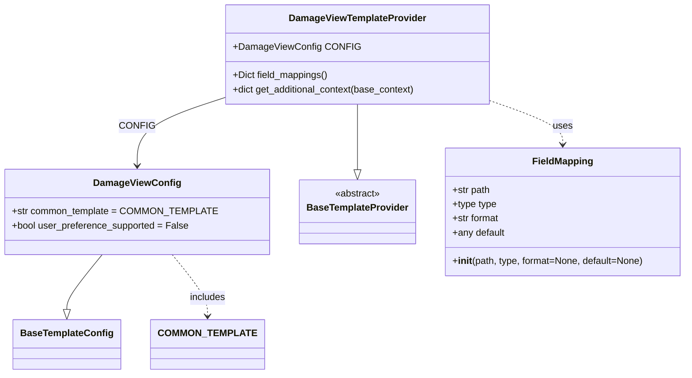

# Diagram: common/notification_service/notification_service/templated_notifications/products/damageview/damageview.py

> Auto-generated by Obscura crawlers

## Mermaid

### SVG

<svg id="container" width="1125.96875" xmlns="http://www.w3.org/2000/svg" class="classDiagram" height="632" viewBox="0 0 1125.96875 632" role="graphics-document document" aria-roledescription="class"><g><defs><marker id="container_class-aggregationStart" class="marker aggregation class" refX="18" refY="7" markerWidth="190" markerHeight="240" orient="auto"><path d="M 18,7 L9,13 L1,7 L9,1 Z"></path></marker></defs><defs><marker id="container_class-aggregationEnd" class="marker aggregation class" refX="1" refY="7" markerWidth="20" markerHeight="28" orient="auto"><path d="M 18,7 L9,13 L1,7 L9,1 Z"></path></marker></defs><defs><marker id="container_class-extensionStart" class="marker extension class" refX="18" refY="7" markerWidth="190" markerHeight="240" orient="auto"><path d="M 1,7 L18,13 V 1 Z"></path></marker></defs><defs><marker id="container_class-extensionEnd" class="marker extension class" refX="1" refY="7" markerWidth="20" markerHeight="28" orient="auto"><path d="M 1,1 V 13 L18,7 Z"></path></marker></defs><defs><marker id="container_class-compositionStart" class="marker composition class" refX="18" refY="7" markerWidth="190" markerHeight="240" orient="auto"><path d="M 18,7 L9,13 L1,7 L9,1 Z"></path></marker></defs><defs><marker id="container_class-compositionEnd" class="marker composition class" refX="1" refY="7" markerWidth="20" markerHeight="28" orient="auto"><path d="M 18,7 L9,13 L1,7 L9,1 Z"></path></marker></defs><defs><marker id="container_class-dependencyStart" class="marker dependency class" refX="6" refY="7" markerWidth="190" markerHeight="240" orient="auto"><path d="M 5,7 L9,13 L1,7 L9,1 Z"></path></marker></defs><defs><marker id="container_class-dependencyEnd" class="marker dependency class" refX="13" refY="7" markerWidth="20" markerHeight="28" orient="auto"><path d="M 18,7 L9,13 L14,7 L9,1 Z"></path></marker></defs><defs><marker id="container_class-lollipopStart" class="marker lollipop class" refX="13" refY="7" markerWidth="190" markerHeight="240" orient="auto"><circle stroke="black" fill="transparent" cx="7" cy="7" r="6"></circle></marker></defs><defs><marker id="container_class-lollipopEnd" class="marker lollipop class" refX="1" refY="7" markerWidth="190" markerHeight="240" orient="auto"><circle stroke="black" fill="transparent" cx="7" cy="7" r="6"></circle></marker></defs><g class="root"><g class="clusters"></g><g class="edgePaths"><path d="M164.39,430L155.08,442.167C145.769,454.333,127.148,478.667,117.838,494.125C108.527,509.583,108.527,516.167,108.527,519.458L108.527,522.75" id="id_DamageViewConfig_BaseTemplateConfig_1" class="edge-thickness-normal edge-pattern-solid relation" style=";;;" data-edge="true" data-et="edge" data-id="id_DamageViewConfig_BaseTemplateConfig_1" data-points="W3sieCI6MTY0LjM5MDQzNjQyMjQxMzc5LCJ5Ijo0MzB9LHsieCI6MTA4LjUyNzM0Mzc1LCJ5Ijo1MDN9LHsieCI6MTA4LjUyNzM0Mzc1LCJ5Ijo1NDB9XQ==" marker-end="url(#container_class-extensionEnd)"></path><path d="M575.414,176L575.414,182.167C575.414,188.333,575.414,200.667,575.414,219.125C575.414,237.583,575.414,262.167,575.414,274.458L575.414,286.75" id="id_DamageViewTemplateProvider_BaseTemplateProvider_2" class="edge-thickness-normal edge-pattern-solid relation" style=";;;" data-edge="true" data-et="edge" data-id="id_DamageViewTemplateProvider_BaseTemplateProvider_2" data-points="W3sieCI6NTc1LjQxNDA2MjUsInkiOjE3Nn0seyJ4Ijo1NzUuNDE0MDYyNSwieSI6MjEzfSx7IngiOjU3NS40MTQwNjI1LCJ5IjozMDR9XQ==" marker-end="url(#container_class-extensionEnd)"></path><path d="M351.527,168.112L329.521,175.593C307.514,183.075,263.501,198.037,241.495,216.685C219.488,235.333,219.488,257.667,219.488,268.833L219.488,280" id="id_DamageViewTemplateProvider_DamageViewConfig_3" class="edge-thickness-normal edge-pattern-solid relation" style=";;;" data-edge="true" data-et="edge" data-id="id_DamageViewTemplateProvider_DamageViewConfig_3" data-points="W3sieCI6MzUxLjUyNzM0Mzc1LCJ5IjoxNjguMTEyMTk2NDA2ODE3Nn0seyJ4IjoyMTkuNDg4MjgxMjUsInkiOjIxM30seyJ4IjoyMTkuNDg4MjgxMjUsInkiOjI4Nn1d" marker-end="url(#container_class-dependencyEnd)"></path><path d="M799.301,170.866L819.236,177.889C839.171,184.911,879.04,198.955,898.975,211.144C918.91,223.333,918.91,233.667,918.91,238.833L918.91,244" id="id_DamageViewTemplateProvider_FieldMapping_4" class="edge-thickness-normal edge-pattern-dashed relation" style=";;;" data-edge="true" data-et="edge" data-id="id_DamageViewTemplateProvider_FieldMapping_4" data-points="W3sieCI6Nzk5LjMwMDc4MTI1LCJ5IjoxNzAuODY2Mzc4NTc1MDgzODd9LHsieCI6OTE4LjkxMDE1NjI1LCJ5IjoyMTN9LHsieCI6OTE4LjkxMDE1NjI1LCJ5IjoyNTB9XQ==" marker-end="url(#container_class-dependencyEnd)"></path><path d="M274.586,430L283.897,442.167C293.207,454.333,311.828,478.667,321.139,496C330.449,513.333,330.449,523.667,330.449,528.833L330.449,534" id="id_DamageViewConfig_COMMON_TEMPLATE_5" class="edge-thickness-normal edge-pattern-dashed relation" style=";;;" data-edge="true" data-et="edge" data-id="id_DamageViewConfig_COMMON_TEMPLATE_5" data-points="W3sieCI6Mjc0LjU4NjEyNjA3NzU4NjIsInkiOjQzMH0seyJ4IjozMzAuNDQ5MjE4NzUsInkiOjUwM30seyJ4IjozMzAuNDQ5MjE4NzUsInkiOjU0MH1d" marker-end="url(#container_class-dependencyEnd)"></path></g><g class="edgeLabels"><g class="edgeLabel"><g class="label" data-id="id_DamageViewConfig_BaseTemplateConfig_1" transform="translate(0, 0)"><foreignObject width="0" height="0">

</foreignObject></g></g><g class="edgeLabel"><g class="label" data-id="id_DamageViewTemplateProvider_BaseTemplateProvider_2" transform="translate(0, 0)"><foreignObject width="0" height="0">

</foreignObject></g></g><g class="edgeLabel" transform="translate(219.48828125, 213)"><g class="label" data-id="id_DamageViewTemplateProvider_DamageViewConfig_3" transform="translate(-26.65625, -12)"><foreignObject width="53.3125" height="24">

CONFIG

</foreignObject></g></g><g class="edgeLabel" transform="translate(918.91015625, 213)"><g class="label" data-id="id_DamageViewTemplateProvider_FieldMapping_4" transform="translate(-16.4921875, -12)"><foreignObject width="32.984375" height="24">

uses

</foreignObject></g></g><g class="edgeLabel" transform="translate(330.44921875, 503)"><g class="label" data-id="id_DamageViewConfig_COMMON_TEMPLATE_5" transform="translate(-30.6484375, -12)"><foreignObject width="61.296875" height="24">

includes

</foreignObject></g></g></g><g class="nodes"><g class="node default" id="classId-BaseTemplateConfig-0" transform="translate(108.52734375, 582)"><g class="basic label-container"><path d="M-86.3671875 -42 L86.3671875 -42 L86.3671875 42 L-86.3671875 42" stroke="none" stroke-width="0" fill="#ECECFF" style=""></path><path d="M-86.3671875 -42 C-38.71158534373172 -42, 8.94401681253656 -42, 86.3671875 -42 M-86.3671875 -42 C-41.83318026297754 -42, 2.700826974044915 -42, 86.3671875 -42 M86.3671875 -42 C86.3671875 -22.53942990341998, 86.3671875 -3.078859806839958, 86.3671875 42 M86.3671875 -42 C86.3671875 -15.574477729666487, 86.3671875 10.851044540667026, 86.3671875 42 M86.3671875 42 C50.27669987795491 42, 14.186212255909822 42, -86.3671875 42 M86.3671875 42 C18.964662673309064 42, -48.43786215338187 42, -86.3671875 42 M-86.3671875 42 C-86.3671875 12.02067142669501, -86.3671875 -17.95865714660998, -86.3671875 -42 M-86.3671875 42 C-86.3671875 12.42691006607835, -86.3671875 -17.1461798678433, -86.3671875 -42" stroke="#9370DB" stroke-width="1.3" fill="none" stroke-dasharray="0 0" style=""></path></g><g class="annotation-group text" transform="translate(0, -18)"></g><g class="label-group text" transform="translate(-74.3671875, -18)"><g class="label" style="font-weight: bolder" transform="translate(0,-12)"><foreignObject width="148.734375" height="24">

BaseTemplateConfig

</foreignObject></g></g><g class="members-group text" transform="translate(-74.3671875, 30)"></g><g class="methods-group text" transform="translate(-74.3671875, 60)"></g><g class="divider" style=""><path d="M-86.3671875 6 C-17.61410237203428 6, 51.13898275593144 6, 86.3671875 6 M-86.3671875 6 C-44.85462894740295 6, -3.3420703948059014 6, 86.3671875 6" stroke="#9370DB" stroke-width="1.3" fill="none" stroke-dasharray="0 0" style=""></path></g><g class="divider" style=""><path d="M-86.3671875 24 C-43.57306983906827 24, -0.7789521781365352 24, 86.3671875 24 M-86.3671875 24 C-27.359936057164788 24, 31.647315385670424 24, 86.3671875 24" stroke="#9370DB" stroke-width="1.3" fill="none" stroke-dasharray="0 0" style=""></path></g></g><g class="node default" id="classId-DamageViewConfig-1" transform="translate(219.48828125, 358)"><g class="basic label-container"><path d="M-211.48828125 -72 L211.48828125 -72 L211.48828125 72 L-211.48828125 72" stroke="none" stroke-width="0" fill="#ECECFF" style=""></path><path d="M-211.48828125 -72 C-125.2041171723749 -72, -38.919953094749786 -72, 211.48828125 -72 M-211.48828125 -72 C-105.55270637913861 -72, 0.3828684917227747 -72, 211.48828125 -72 M211.48828125 -72 C211.48828125 -22.5663136838688, 211.48828125 26.867372632262402, 211.48828125 72 M211.48828125 -72 C211.48828125 -34.31321259768531, 211.48828125 3.373574804629385, 211.48828125 72 M211.48828125 72 C56.135397640183896 72, -99.21748596963221 72, -211.48828125 72 M211.48828125 72 C64.96778696821414 72, -81.55270731357172 72, -211.48828125 72 M-211.48828125 72 C-211.48828125 31.155547260194425, -211.48828125 -9.688905479611151, -211.48828125 -72 M-211.48828125 72 C-211.48828125 20.333971823288884, -211.48828125 -31.33205635342223, -211.48828125 -72" stroke="#9370DB" stroke-width="1.3" fill="none" stroke-dasharray="0 0" style=""></path></g><g class="annotation-group text" transform="translate(0, -48)"></g><g class="label-group text" transform="translate(-69.3828125, -48)"><g class="label" style="font-weight: bolder" transform="translate(0,-12)"><foreignObject width="138.765625" height="24">

DamageViewConfig

</foreignObject></g></g><g class="members-group text" transform="translate(-199.48828125, 0)"><g class="label" style="" transform="translate(0,-12)"><foreignObject width="329.59375" height="24">

+str common_template = COMMON_TEMPLATE

</foreignObject></g><g class="label" style="" transform="translate(0,12)"><foreignObject width="297.453125" height="24">

+bool user_preference_supported = False

</foreignObject></g></g><g class="methods-group text" transform="translate(-199.48828125, 72)"></g><g class="divider" style=""><path d="M-211.48828125 -24 C-59.2314636753664 -24, 93.0253538992672 -24, 211.48828125 -24 M-211.48828125 -24 C-120.32084012093753 -24, -29.153398991875065 -24, 211.48828125 -24" stroke="#9370DB" stroke-width="1.3" fill="none" stroke-dasharray="0 0" style=""></path></g><g class="divider" style=""><path d="M-211.48828125 48 C-61.688197297552165 48, 88.11188665489567 48, 211.48828125 48 M-211.48828125 48 C-48.90149651052036 48, 113.68528822895928 48, 211.48828125 48" stroke="#9370DB" stroke-width="1.3" fill="none" stroke-dasharray="0 0" style=""></path></g></g><g class="node default" id="classId-BaseTemplateProvider-2" transform="translate(575.4140625, 358)"><g class="basic label-container"><path d="M-94.4375 -54 L94.4375 -54 L94.4375 54 L-94.4375 54" stroke="none" stroke-width="0" fill="#ECECFF" style=""></path><path d="M-94.4375 -54 C-55.107960291290894 -54, -15.778420582581788 -54, 94.4375 -54 M-94.4375 -54 C-55.56880432202757 -54, -16.700108644055135 -54, 94.4375 -54 M94.4375 -54 C94.4375 -27.06679273192601, 94.4375 -0.13358546385202175, 94.4375 54 M94.4375 -54 C94.4375 -28.57248356196007, 94.4375 -3.1449671239201393, 94.4375 54 M94.4375 54 C36.14302712841787 54, -22.15144574316426 54, -94.4375 54 M94.4375 54 C49.76178029771005 54, 5.0860605954200935 54, -94.4375 54 M-94.4375 54 C-94.4375 30.396126405720185, -94.4375 6.79225281144037, -94.4375 -54 M-94.4375 54 C-94.4375 17.188551260089845, -94.4375 -19.62289747982031, -94.4375 -54" stroke="#9370DB" stroke-width="1.3" fill="none" stroke-dasharray="0 0" style=""></path></g><g class="annotation-group text" transform="translate(-38.609375, -30)"><g class="label" style="" transform="translate(0,-12)"><foreignObject width="77.21875" height="24">

«abstract»

</foreignObject></g></g><g class="label-group text" transform="translate(-82.4375, -6)"><g class="label" style="font-weight: bolder" transform="translate(0,-12)"><foreignObject width="164.875" height="24">

BaseTemplateProvider

</foreignObject></g></g><g class="members-group text" transform="translate(-82.4375, 42)"></g><g class="methods-group text" transform="translate(-82.4375, 72)"></g><g class="divider" style=""><path d="M-94.4375 18 C-46.18189950440416 18, 2.0737009911916857 18, 94.4375 18 M-94.4375 18 C-40.625650823594654 18, 13.186198352810692 18, 94.4375 18" stroke="#9370DB" stroke-width="1.3" fill="none" stroke-dasharray="0 0" style=""></path></g><g class="divider" style=""><path d="M-94.4375 36 C-34.976062169288795 36, 24.48537566142241 36, 94.4375 36 M-94.4375 36 C-42.362902837749964 36, 9.711694324500073 36, 94.4375 36" stroke="#9370DB" stroke-width="1.3" fill="none" stroke-dasharray="0 0" style=""></path></g></g><g class="node default" id="classId-DamageViewTemplateProvider-3" transform="translate(575.4140625, 92)"><g class="basic label-container"><path d="M-223.88671875 -84 L223.88671875 -84 L223.88671875 84 L-223.88671875 84" stroke="none" stroke-width="0" fill="#ECECFF" style=""></path><path d="M-223.88671875 -84 C-122.07022149565756 -84, -20.253724241315126 -84, 223.88671875 -84 M-223.88671875 -84 C-128.254662614047 -84, -32.62260647809401 -84, 223.88671875 -84 M223.88671875 -84 C223.88671875 -21.743250982781, 223.88671875 40.513498034438, 223.88671875 84 M223.88671875 -84 C223.88671875 -41.69017406448691, 223.88671875 0.6196518710261785, 223.88671875 84 M223.88671875 84 C120.47759646401171 84, 17.068474178023422 84, -223.88671875 84 M223.88671875 84 C99.8071215047101 84, -24.272475740579807 84, -223.88671875 84 M-223.88671875 84 C-223.88671875 45.488934444504224, -223.88671875 6.977868889008448, -223.88671875 -84 M-223.88671875 84 C-223.88671875 40.65761778189708, -223.88671875 -2.684764436205839, -223.88671875 -84" stroke="#9370DB" stroke-width="1.3" fill="none" stroke-dasharray="0 0" style=""></path></g><g class="annotation-group text" transform="translate(0, -60)"></g><g class="label-group text" transform="translate(-111.3671875, -60)"><g class="label" style="font-weight: bolder" transform="translate(0,-12)"><foreignObject width="222.734375" height="24">

DamageViewTemplateProvider

</foreignObject></g></g><g class="members-group text" transform="translate(-211.88671875, -12)"><g class="label" style="" transform="translate(0,-12)"><foreignObject width="201.90625" height="24">

+DamageViewConfig CONFIG

</foreignObject></g></g><g class="methods-group text" transform="translate(-211.88671875, 36)"><g class="label" style="" transform="translate(0,-12)"><foreignObject width="162.25" height="24">

+Dict field_mappings()

</foreignObject></g><g class="label" style="" transform="translate(0,12)"><foreignObject width="312.40625" height="24">

+dict get_additional_context(base_context)

</foreignObject></g></g><g class="divider" style=""><path d="M-223.88671875 -36 C-113.00775403132195 -36, -2.128789312643903 -36, 223.88671875 -36 M-223.88671875 -36 C-47.588637329924865 -36, 128.70944409015027 -36, 223.88671875 -36" stroke="#9370DB" stroke-width="1.3" fill="none" stroke-dasharray="0 0" style=""></path></g><g class="divider" style=""><path d="M-223.88671875 12 C-82.08167687921255 12, 59.7233649915749 12, 223.88671875 12 M-223.88671875 12 C-65.52921752554079 12, 92.82828369891843 12, 223.88671875 12" stroke="#9370DB" stroke-width="1.3" fill="none" stroke-dasharray="0 0" style=""></path></g></g><g class="node default" id="classId-FieldMapping-4" transform="translate(918.91015625, 358)"><g class="basic label-container"><path d="M-199.05859375 -108 L199.05859375 -108 L199.05859375 108 L-199.05859375 108" stroke="none" stroke-width="0" fill="#ECECFF" style=""></path><path d="M-199.05859375 -108 C-114.63886523866358 -108, -30.219136727327168 -108, 199.05859375 -108 M-199.05859375 -108 C-85.00280519193534 -108, 29.052983366129325 -108, 199.05859375 -108 M199.05859375 -108 C199.05859375 -55.441182136960755, 199.05859375 -2.8823642739215103, 199.05859375 108 M199.05859375 -108 C199.05859375 -36.59076218897003, 199.05859375 34.818475622059935, 199.05859375 108 M199.05859375 108 C63.21123706247448 108, -72.63611962505104 108, -199.05859375 108 M199.05859375 108 C68.13707170977236 108, -62.784450330455286 108, -199.05859375 108 M-199.05859375 108 C-199.05859375 38.23909219872846, -199.05859375 -31.521815602543086, -199.05859375 -108 M-199.05859375 108 C-199.05859375 61.600820829570345, -199.05859375 15.20164165914069, -199.05859375 -108" stroke="#9370DB" stroke-width="1.3" fill="none" stroke-dasharray="0 0" style=""></path></g><g class="annotation-group text" transform="translate(0, -84)"></g><g class="label-group text" transform="translate(-48.9765625, -84)"><g class="label" style="font-weight: bolder" transform="translate(0,-12)"><foreignObject width="97.953125" height="24">

FieldMapping

</foreignObject></g></g><g class="members-group text" transform="translate(-187.05859375, -36)"><g class="label" style="" transform="translate(0,-12)"><foreignObject width="64.859375" height="24">

+str path

</foreignObject></g><g class="label" style="" transform="translate(0,12)"><foreignObject width="75.734375" height="24">

+type type

</foreignObject></g><g class="label" style="" transform="translate(0,36)"><foreignObject width="80.5625" height="24">

+str format

</foreignObject></g><g class="label" style="" transform="translate(0,60)"><foreignObject width="89.609375" height="24">

+any default

</foreignObject></g></g><g class="methods-group text" transform="translate(-187.05859375, 84)"><g class="label" style="" transform="translate(0,-12)"><foreignObject width="325.140625" height="24">

+<strong>init</strong>(path, type, format=None, default=None)

</foreignObject></g></g><g class="divider" style=""><path d="M-199.05859375 -60 C-81.91799598651653 -60, 35.22260177696694 -60, 199.05859375 -60 M-199.05859375 -60 C-84.25188645431662 -60, 30.554820841366762 -60, 199.05859375 -60" stroke="#9370DB" stroke-width="1.3" fill="none" stroke-dasharray="0 0" style=""></path></g><g class="divider" style=""><path d="M-199.05859375 60 C-114.75193598355767 60, -30.445278217115344 60, 199.05859375 60 M-199.05859375 60 C-116.46419717385331 60, -33.869800597706615 60, 199.05859375 60" stroke="#9370DB" stroke-width="1.3" fill="none" stroke-dasharray="0 0" style=""></path></g></g><g class="node default" id="classId-COMMON_TEMPLATE-5" transform="translate(330.44921875, 582)"><g class="basic label-container"><path d="M-85.5546875 -42 L85.5546875 -42 L85.5546875 42 L-85.5546875 42" stroke="none" stroke-width="0" fill="#ECECFF" style=""></path><path d="M-85.5546875 -42 C-49.755935330713704 -42, -13.957183161427409 -42, 85.5546875 -42 M-85.5546875 -42 C-28.75872575834422 -42, 28.03723598331156 -42, 85.5546875 -42 M85.5546875 -42 C85.5546875 -13.61887002682403, 85.5546875 14.76225994635194, 85.5546875 42 M85.5546875 -42 C85.5546875 -9.521725748008265, 85.5546875 22.95654850398347, 85.5546875 42 M85.5546875 42 C21.685155079042218 42, -42.184377341915564 42, -85.5546875 42 M85.5546875 42 C34.99024920905036 42, -15.574189081899277 42, -85.5546875 42 M-85.5546875 42 C-85.5546875 13.456246780500813, -85.5546875 -15.087506438998375, -85.5546875 -42 M-85.5546875 42 C-85.5546875 20.379927777214366, -85.5546875 -1.2401444455712678, -85.5546875 -42" stroke="#9370DB" stroke-width="1.3" fill="none" stroke-dasharray="0 0" style=""></path></g><g class="annotation-group text" transform="translate(0, -18)"></g><g class="label-group text" transform="translate(-73.5546875, -18)"><g class="label" style="font-weight: bolder" transform="translate(0,-12)"><foreignObject width="147.109375" height="24">

COMMON_TEMPLATE

</foreignObject></g></g><g class="members-group text" transform="translate(-73.5546875, 30)"></g><g class="methods-group text" transform="translate(-73.5546875, 60)"></g><g class="divider" style=""><path d="M-85.5546875 6 C-27.066304562864147 6, 31.422078374271706 6, 85.5546875 6 M-85.5546875 6 C-31.92595156742344 6, 21.70278436515312 6, 85.5546875 6" stroke="#9370DB" stroke-width="1.3" fill="none" stroke-dasharray="0 0" style=""></path></g><g class="divider" style=""><path d="M-85.5546875 24 C-49.30921402636697 24, -13.063740552733947 24, 85.5546875 24 M-85.5546875 24 C-39.65973269641001 24, 6.235222107179979 24, 85.5546875 24" stroke="#9370DB" stroke-width="1.3" fill="none" stroke-dasharray="0 0" style=""></path></g></g></g></g></g></svg>
