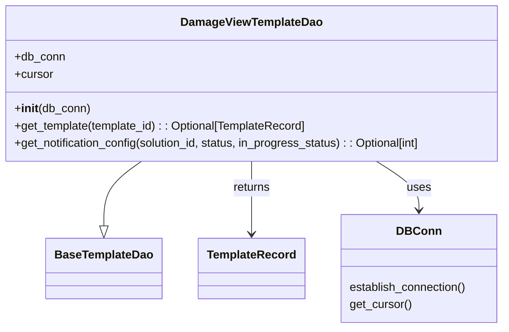

# Diagram: common/notification_service/notification_service/templated_notifications/products/damageview/template_dao.py


> Auto-generated by Obscura crawlers

## Diagram 1



### SVG

<svg id="container" width="711.5625" xmlns="http://www.w3.org/2000/svg" class="classDiagram" height="456" viewBox="0 0 711.5625 456" role="graphics-document document" aria-roledescription="class"><style>#container{font-family:"trebuchet ms",verdana,arial,sans-serif;font-size:16px;fill:#333;}@keyframes edge-animation-frame{from{stroke-dashoffset:0;}}@keyframes dash{to{stroke-dashoffset:0;}}#container .edge-animation-slow{stroke-dasharray:9,5!important;stroke-dashoffset:900;animation:dash 50s linear infinite;stroke-linecap:round;}#container .edge-animation-fast{stroke-dasharray:9,5!important;stroke-dashoffset:900;animation:dash 20s linear infinite;stroke-linecap:round;}#container .error-icon{fill:#552222;}#container .error-text{fill:#552222;stroke:#552222;}#container .edge-thickness-normal{stroke-width:1px;}#container .edge-thickness-thick{stroke-width:3.5px;}#container .edge-pattern-solid{stroke-dasharray:0;}#container .edge-thickness-invisible{stroke-width:0;fill:none;}#container .edge-pattern-dashed{stroke-dasharray:3;}#container .edge-pattern-dotted{stroke-dasharray:2;}#container .marker{fill:#333333;stroke:#333333;}#container .marker.cross{stroke:#333333;}#container svg{font-family:"trebuchet ms",verdana,arial,sans-serif;font-size:16px;}#container p{margin:0;}#container g.classGroup text{fill:#9370DB;stroke:none;font-family:"trebuchet ms",verdana,arial,sans-serif;font-size:10px;}#container g.classGroup text .title{font-weight:bolder;}#container .nodeLabel,#container .edgeLabel{color:#131300;}#container .edgeLabel .label rect{fill:#ECECFF;}#container .label text{fill:#131300;}#container .labelBkg{background:#ECECFF;}#container .edgeLabel .label span{background:#ECECFF;}#container .classTitle{font-weight:bolder;}#container .node rect,#container .node circle,#container .node ellipse,#container .node polygon,#container .node path{fill:#ECECFF;stroke:#9370DB;stroke-width:1px;}#container .divider{stroke:#9370DB;stroke-width:1;}#container g.clickable{cursor:pointer;}#container g.classGroup rect{fill:#ECECFF;stroke:#9370DB;}#container g.classGroup line{stroke:#9370DB;stroke-width:1;}#container .classLabel .box{stroke:none;stroke-width:0;fill:#ECECFF;opacity:0.5;}#container .classLabel .label{fill:#9370DB;font-size:10px;}#container .relation{stroke:#333333;stroke-width:1;fill:none;}#container .dashed-line{stroke-dasharray:3;}#container .dotted-line{stroke-dasharray:1 2;}#container #compositionStart,#container .composition{fill:#333333!important;stroke:#333333!important;stroke-width:1;}#container #compositionEnd,#container .composition{fill:#333333!important;stroke:#333333!important;stroke-width:1;}#container #dependencyStart,#container .dependency{fill:#333333!important;stroke:#333333!important;stroke-width:1;}#container #dependencyStart,#container .dependency{fill:#333333!important;stroke:#333333!important;stroke-width:1;}#container #extensionStart,#container .extension{fill:transparent!important;stroke:#333333!important;stroke-width:1;}#container #extensionEnd,#container .extension{fill:transparent!important;stroke:#333333!important;stroke-width:1;}#container #aggregationStart,#container .aggregation{fill:transparent!important;stroke:#333333!important;stroke-width:1;}#container #aggregationEnd,#container .aggregation{fill:transparent!important;stroke:#333333!important;stroke-width:1;}#container #lollipopStart,#container .lollipop{fill:#ECECFF!important;stroke:#333333!important;stroke-width:1;}#container #lollipopEnd,#container .lollipop{fill:#ECECFF!important;stroke:#333333!important;stroke-width:1;}#container .edgeTerminals{font-size:11px;line-height:initial;}#container .classTitleText{text-anchor:middle;font-size:18px;fill:#333;}#container .label-icon{display:inline-block;height:1em;overflow:visible;vertical-align:-0.125em;}#container .node .label-icon path{fill:currentColor;stroke:revert;stroke-width:revert;}#container :root{--mermaid-font-family:"trebuchet ms",verdana,arial,sans-serif;}</style><g><defs><marker id="container_class-aggregationStart" class="marker aggregation class" refX="18" refY="7" markerWidth="190" markerHeight="240" orient="auto"><path d="M 18,7 L9,13 L1,7 L9,1 Z"></path></marker></defs><defs><marker id="container_class-aggregationEnd" class="marker aggregation class" refX="1" refY="7" markerWidth="20" markerHeight="28" orient="auto"><path d="M 18,7 L9,13 L1,7 L9,1 Z"></path></marker></defs><defs><marker id="container_class-extensionStart" class="marker extension class" refX="18" refY="7" markerWidth="190" markerHeight="240" orient="auto"><path d="M 1,7 L18,13 V 1 Z"></path></marker></defs><defs><marker id="container_class-extensionEnd" class="marker extension class" refX="1" refY="7" markerWidth="20" markerHeight="28" orient="auto"><path d="M 1,1 V 13 L18,7 Z"></path></marker></defs><defs><marker id="container_class-compositionStart" class="marker composition class" refX="18" refY="7" markerWidth="190" markerHeight="240" orient="auto"><path d="M 18,7 L9,13 L1,7 L9,1 Z"></path></marker></defs><defs><marker id="container_class-compositionEnd" class="marker composition class" refX="1" refY="7" markerWidth="20" markerHeight="28" orient="auto"><path d="M 18,7 L9,13 L1,7 L9,1 Z"></path></marker></defs><defs><marker id="container_class-dependencyStart" class="marker dependency class" refX="6" refY="7" markerWidth="190" markerHeight="240" orient="auto"><path d="M 5,7 L9,13 L1,7 L9,1 Z"></path></marker></defs><defs><marker id="container_class-dependencyEnd" class="marker dependency class" refX="13" refY="7" markerWidth="20" markerHeight="28" orient="auto"><path d="M 18,7 L9,13 L14,7 L9,1 Z"></path></marker></defs><defs><marker id="container_class-lollipopStart" class="marker lollipop class" refX="13" refY="7" markerWidth="190" markerHeight="240" orient="auto"><circle stroke="black" fill="transparent" cx="7" cy="7" r="6"></circle></marker></defs><defs><marker id="container_class-lollipopEnd" class="marker lollipop class" refX="1" refY="7" markerWidth="190" markerHeight="240" orient="auto"><circle stroke="black" fill="transparent" cx="7" cy="7" r="6"></circle></marker></defs><g class="root"><g class="clusters"></g><g class="edgePaths"><path d="M207.654,224L199.196,230.167C190.738,236.333,173.822,248.667,165.364,263.625C156.906,278.583,156.906,296.167,156.906,304.958L156.906,313.75" id="id_DamageViewTemplateDao_BaseTemplateDao_1" class="edge-thickness-normal edge-pattern-solid relation" style=";;;" data-edge="true" data-et="edge" data-id="id_DamageViewTemplateDao_BaseTemplateDao_1" data-points="W3sieCI6MjA3LjY1MzY2Mzc5MzEwMzQ1LCJ5IjoyMjR9LHsieCI6MTU2LjkwNjI1LCJ5IjoyNjF9LHsieCI6MTU2LjkwNjI1LCJ5IjozMzF9XQ==" marker-end="url(#container_class-extensionEnd)"></path><path d="M355.781,224L355.781,230.167C355.781,236.333,355.781,248.667,355.781,265.5C355.781,282.333,355.781,303.667,355.781,314.333L355.781,325" id="id_DamageViewTemplateDao_TemplateRecord_2" class="edge-thickness-normal edge-pattern-solid relation" style=";;;" data-edge="true" data-et="edge" data-id="id_DamageViewTemplateDao_TemplateRecord_2" data-points="W3sieCI6MzU1Ljc4MTI1LCJ5IjoyMjR9LHsieCI6MzU1Ljc4MTI1LCJ5IjoyNjF9LHsieCI6MzU1Ljc4MTI1LCJ5IjozMzF9XQ==" marker-end="url(#container_class-dependencyEnd)"></path><path d="M527.199,224L536.987,230.167C546.775,236.333,566.35,248.667,576.138,260C585.926,271.333,585.926,281.667,585.926,286.833L585.926,292" id="id_DamageViewTemplateDao_DBConn_3" class="edge-thickness-normal edge-pattern-solid relation" style=";;;" data-edge="true" data-et="edge" data-id="id_DamageViewTemplateDao_DBConn_3" data-points="W3sieCI6NTI3LjE5OTI0NTY4OTY1NTIsInkiOjIyNH0seyJ4Ijo1ODUuOTI1NzgxMjUsInkiOjI2MX0seyJ4Ijo1ODUuOTI1NzgxMjUsInkiOjI5OH1d" marker-end="url(#container_class-dependencyEnd)"></path></g><g class="edgeLabels"><g class="edgeLabel"><g class="label" data-id="id_DamageViewTemplateDao_BaseTemplateDao_1" transform="translate(0, 0)"><foreignObject width="0" height="0"><div xmlns="http://www.w3.org/1999/xhtml" class="labelBkg" style="display: table-cell; white-space: nowrap; line-height: 1.5; max-width: 200px; text-align: center;"><span class="edgeLabel"></span></div></foreignObject></g></g><g class="edgeLabel" transform="translate(355.78125, 261)"><g class="label" data-id="id_DamageViewTemplateDao_TemplateRecord_2" transform="translate(-26.265625, -12)"><foreignObject width="52.53125" height="24"><div xmlns="http://www.w3.org/1999/xhtml" class="labelBkg" style="display: table-cell; white-space: nowrap; line-height: 1.5; max-width: 200px; text-align: center;"><span class="edgeLabel"><p>returns</p></span></div></foreignObject></g></g><g class="edgeLabel" transform="translate(585.92578125, 261)"><g class="label" data-id="id_DamageViewTemplateDao_DBConn_3" transform="translate(-16.4921875, -12)"><foreignObject width="32.984375" height="24"><div xmlns="http://www.w3.org/1999/xhtml" class="labelBkg" style="display: table-cell; white-space: nowrap; line-height: 1.5; max-width: 200px; text-align: center;"><span class="edgeLabel"><p>uses</p></span></div></foreignObject></g></g></g><g class="nodes"><g class="node default" id="classId-DamageViewTemplateDao-0" transform="translate(355.78125, 116)"><g class="basic label-container"><path d="M-347.78125 -108 L347.78125 -108 L347.78125 108 L-347.78125 108" stroke="none" stroke-width="0" fill="#ECECFF" style=""></path><path d="M-347.78125 -108 C-189.27034135766817 -108, -30.759432715336345 -108, 347.78125 -108 M-347.78125 -108 C-126.84916868477046 -108, 94.08291263045908 -108, 347.78125 -108 M347.78125 -108 C347.78125 -41.32379325566717, 347.78125 25.35241348866566, 347.78125 108 M347.78125 -108 C347.78125 -42.23377509620673, 347.78125 23.532449807586545, 347.78125 108 M347.78125 108 C92.92408680251211 108, -161.93307639497579 108, -347.78125 108 M347.78125 108 C153.18474264017254 108, -41.41176471965491 108, -347.78125 108 M-347.78125 108 C-347.78125 36.128008847944, -347.78125 -35.743982304111995, -347.78125 -108 M-347.78125 108 C-347.78125 41.507772667790945, -347.78125 -24.98445466441811, -347.78125 -108" stroke="#9370DB" stroke-width="1.3" fill="none" stroke-dasharray="0 0" style=""></path></g><g class="annotation-group text" transform="translate(0, -84)"></g><g class="label-group text" transform="translate(-94.546875, -84)"><g class="label" style="font-weight: bolder" transform="translate(0,-12)"><foreignObject width="189.09375" height="24"><div xmlns="http://www.w3.org/1999/xhtml" style="display: table-cell; white-space: nowrap; line-height: 1.5; max-width: 237px; text-align: center;"><span class="nodeLabel markdown-node-label" style=""><p>DamageViewTemplateDao</p></span></div></foreignObject></g></g><g class="members-group text" transform="translate(-335.78125, -36)"><g class="label" style="" transform="translate(0,-12)"><foreignObject width="70.171875" height="24"><div xmlns="http://www.w3.org/1999/xhtml" style="display: table-cell; white-space: nowrap; line-height: 1.5; max-width: 128px; text-align: center;"><span class="nodeLabel markdown-node-label" style=""><p>+db_conn</p></span></div></foreignObject></g><g class="label" style="" transform="translate(0,12)"><foreignObject width="53.71875" height="24"><div xmlns="http://www.w3.org/1999/xhtml" style="display: table-cell; white-space: nowrap; line-height: 1.5; max-width: 112px; text-align: center;"><span class="nodeLabel markdown-node-label" style=""><p>+cursor</p></span></div></foreignObject></g></g><g class="methods-group text" transform="translate(-335.78125, 36)"><g class="label" style="" transform="translate(0,-12)"><foreignObject width="104.96875" height="24"><div xmlns="http://www.w3.org/1999/xhtml" style="display: table-cell; white-space: nowrap; line-height: 1.5; max-width: 194px; text-align: center;"><span class="nodeLabel markdown-node-label" style=""><p>+<strong>init</strong>(db_conn)</p></span></div></foreignObject></g><g class="label" style="" transform="translate(0,12)"><foreignObject width="411.65625" height="24"><div xmlns="http://www.w3.org/1999/xhtml" style="display: table-cell; white-space: nowrap; line-height: 1.5; max-width: 469px; text-align: center;"><span class="nodeLabel markdown-node-label" style=""><p>+get_template(template_id) : : Optional[TemplateRecord]</p></span></div></foreignObject></g><g class="label" style="" transform="translate(0,36)"><foreignObject width="577.015625" height="24"><div xmlns="http://www.w3.org/1999/xhtml" style="display: table-cell; white-space: nowrap; line-height: 1.5; max-width: 634px; text-align: center;"><span class="nodeLabel markdown-node-label" style=""><p>+get_notification_config(solution_id, status, in_progress_status) : : Optional[int]</p></span></div></foreignObject></g></g><g class="divider" style=""><path d="M-347.78125 -60 C-192.21294361987898 -60, -36.64463723975797 -60, 347.78125 -60 M-347.78125 -60 C-202.8747962492182 -60, -57.968342498436414 -60, 347.78125 -60" stroke="#9370DB" stroke-width="1.3" fill="none" stroke-dasharray="0 0" style=""></path></g><g class="divider" style=""><path d="M-347.78125 12 C-170.91219673741205 12, 5.956856525175908 12, 347.78125 12 M-347.78125 12 C-73.13675069956662 12, 201.50774860086676 12, 347.78125 12" stroke="#9370DB" stroke-width="1.3" fill="none" stroke-dasharray="0 0" style=""></path></g></g><g class="node default" id="classId-BaseTemplateDao-1" transform="translate(156.90625, 373)"><g class="basic label-container"><path d="M-77.6171875 -42 L77.6171875 -42 L77.6171875 42 L-77.6171875 42" stroke="none" stroke-width="0" fill="#ECECFF" style=""></path><path d="M-77.6171875 -42 C-37.83900812366695 -42, 1.9391712526660996 -42, 77.6171875 -42 M-77.6171875 -42 C-36.36076885039099 -42, 4.89564979921802 -42, 77.6171875 -42 M77.6171875 -42 C77.6171875 -20.987371833615953, 77.6171875 0.02525633276809458, 77.6171875 42 M77.6171875 -42 C77.6171875 -22.840645369315897, 77.6171875 -3.6812907386317946, 77.6171875 42 M77.6171875 42 C18.52446920706445 42, -40.5682490858711 42, -77.6171875 42 M77.6171875 42 C20.819930487269332 42, -35.977326525461336 42, -77.6171875 42 M-77.6171875 42 C-77.6171875 23.42690959800155, -77.6171875 4.853819196003101, -77.6171875 -42 M-77.6171875 42 C-77.6171875 22.631225990073364, -77.6171875 3.2624519801467287, -77.6171875 -42" stroke="#9370DB" stroke-width="1.3" fill="none" stroke-dasharray="0 0" style=""></path></g><g class="annotation-group text" transform="translate(0, -18)"></g><g class="label-group text" transform="translate(-65.6171875, -18)"><g class="label" style="font-weight: bolder" transform="translate(0,-12)"><foreignObject width="131.234375" height="24"><div xmlns="http://www.w3.org/1999/xhtml" style="display: table-cell; white-space: nowrap; line-height: 1.5; max-width: 180px; text-align: center;"><span class="nodeLabel markdown-node-label" style=""><p>BaseTemplateDao</p></span></div></foreignObject></g></g><g class="members-group text" transform="translate(-65.6171875, 30)"></g><g class="methods-group text" transform="translate(-65.6171875, 60)"></g><g class="divider" style=""><path d="M-77.6171875 6 C-16.873076971228365 6, 43.87103355754327 6, 77.6171875 6 M-77.6171875 6 C-18.87457881293932 6, 39.86802987412136 6, 77.6171875 6" stroke="#9370DB" stroke-width="1.3" fill="none" stroke-dasharray="0 0" style=""></path></g><g class="divider" style=""><path d="M-77.6171875 24 C-28.821710179142336 24, 19.973767141715328 24, 77.6171875 24 M-77.6171875 24 C-30.968120584914175 24, 15.68094633017165 24, 77.6171875 24" stroke="#9370DB" stroke-width="1.3" fill="none" stroke-dasharray="0 0" style=""></path></g></g><g class="node default" id="classId-TemplateRecord-2" transform="translate(355.78125, 373)"><g class="basic label-container"><path d="M-71.2578125 -42 L71.2578125 -42 L71.2578125 42 L-71.2578125 42" stroke="none" stroke-width="0" fill="#ECECFF" style=""></path><path d="M-71.2578125 -42 C-40.259748808533146 -42, -9.261685117066293 -42, 71.2578125 -42 M-71.2578125 -42 C-20.8654919775932 -42, 29.526828544813597 -42, 71.2578125 -42 M71.2578125 -42 C71.2578125 -12.712636694625576, 71.2578125 16.574726610748847, 71.2578125 42 M71.2578125 -42 C71.2578125 -18.945093656140777, 71.2578125 4.1098126877184455, 71.2578125 42 M71.2578125 42 C25.647096556759692 42, -19.963619386480616 42, -71.2578125 42 M71.2578125 42 C39.448558827512244 42, 7.639305155024488 42, -71.2578125 42 M-71.2578125 42 C-71.2578125 18.748463267879494, -71.2578125 -4.503073464241012, -71.2578125 -42 M-71.2578125 42 C-71.2578125 21.97149079603494, -71.2578125 1.9429815920698772, -71.2578125 -42" stroke="#9370DB" stroke-width="1.3" fill="none" stroke-dasharray="0 0" style=""></path></g><g class="annotation-group text" transform="translate(0, -18)"></g><g class="label-group text" transform="translate(-59.2578125, -18)"><g class="label" style="font-weight: bolder" transform="translate(0,-12)"><foreignObject width="118.515625" height="24"><div xmlns="http://www.w3.org/1999/xhtml" style="display: table-cell; white-space: nowrap; line-height: 1.5; max-width: 167px; text-align: center;"><span class="nodeLabel markdown-node-label" style=""><p>TemplateRecord</p></span></div></foreignObject></g></g><g class="members-group text" transform="translate(-59.2578125, 30)"></g><g class="methods-group text" transform="translate(-59.2578125, 60)"></g><g class="divider" style=""><path d="M-71.2578125 6 C-27.268124488361813 6, 16.721563523276373 6, 71.2578125 6 M-71.2578125 6 C-21.91477763016445 6, 27.428257239671098 6, 71.2578125 6" stroke="#9370DB" stroke-width="1.3" fill="none" stroke-dasharray="0 0" style=""></path></g><g class="divider" style=""><path d="M-71.2578125 24 C-36.99789511977284 24, -2.737977739545684 24, 71.2578125 24 M-71.2578125 24 C-40.21245568433262 24, -9.167098868665235 24, 71.2578125 24" stroke="#9370DB" stroke-width="1.3" fill="none" stroke-dasharray="0 0" style=""></path></g></g><g class="node default" id="classId-DBConn-3" transform="translate(585.92578125, 373)"><g class="basic label-container"><path d="M-108.88671875 -75 L108.88671875 -75 L108.88671875 75 L-108.88671875 75" stroke="none" stroke-width="0" fill="#ECECFF" style=""></path><path d="M-108.88671875 -75 C-50.950046834296515 -75, 6.98662508140697 -75, 108.88671875 -75 M-108.88671875 -75 C-59.76759584503027 -75, -10.648472940060543 -75, 108.88671875 -75 M108.88671875 -75 C108.88671875 -35.351777071872995, 108.88671875 4.29644585625401, 108.88671875 75 M108.88671875 -75 C108.88671875 -16.30916011227739, 108.88671875 42.38167977544522, 108.88671875 75 M108.88671875 75 C57.51552438128022 75, 6.144330012560445 75, -108.88671875 75 M108.88671875 75 C60.70240452798901 75, 12.51809030597802 75, -108.88671875 75 M-108.88671875 75 C-108.88671875 35.447917865342085, -108.88671875 -4.104164269315831, -108.88671875 -75 M-108.88671875 75 C-108.88671875 39.37780787685864, -108.88671875 3.7556157537172794, -108.88671875 -75" stroke="#9370DB" stroke-width="1.3" fill="none" stroke-dasharray="0 0" style=""></path></g><g class="annotation-group text" transform="translate(0, -51)"></g><g class="label-group text" transform="translate(-28.4921875, -51)"><g class="label" style="font-weight: bolder" transform="translate(0,-12)"><foreignObject width="56.984375" height="24"><div xmlns="http://www.w3.org/1999/xhtml" style="display: table-cell; white-space: nowrap; line-height: 1.5; max-width: 107px; text-align: center;"><span class="nodeLabel markdown-node-label" style=""><p>DBConn</p></span></div></foreignObject></g></g><g class="members-group text" transform="translate(-96.88671875, -3)"></g><g class="methods-group text" transform="translate(-96.88671875, 27)"><g class="label" style="" transform="translate(0,-12)"><foreignObject width="165.28125" height="24"><div xmlns="http://www.w3.org/1999/xhtml" style="display: table-cell; white-space: nowrap; line-height: 1.5; max-width: 215px; text-align: center;"><span class="nodeLabel markdown-node-label" style=""><p>establish_connection()</p></span></div></foreignObject></g><g class="label" style="" transform="translate(0,12)"><foreignObject width="86.65625" height="24"><div xmlns="http://www.w3.org/1999/xhtml" style="display: table-cell; white-space: nowrap; line-height: 1.5; max-width: 137px; text-align: center;"><span class="nodeLabel markdown-node-label" style=""><p>get_cursor()</p></span></div></foreignObject></g></g><g class="divider" style=""><path d="M-108.88671875 -27 C-22.848970293819463 -27, 63.188778162361075 -27, 108.88671875 -27 M-108.88671875 -27 C-41.44193637811969 -27, 26.002845993760616 -27, 108.88671875 -27" stroke="#9370DB" stroke-width="1.3" fill="none" stroke-dasharray="0 0" style=""></path></g><g class="divider" style=""><path d="M-108.88671875 -3 C-52.81990822479545 -3, 3.246902300409104 -3, 108.88671875 -3 M-108.88671875 -3 C-33.05266107134129 -3, 42.78139660731742 -3, 108.88671875 -3" stroke="#9370DB" stroke-width="1.3" fill="none" stroke-dasharray="0 0" style=""></path></g></g></g></g></g></svg>

## Diagram 2

```mermaid
flowchart TD
    A[Caller] --> B[DamageViewTemplateDao.__init__]
    B --> C[db_conn.establish_connection()]
    B --> D[db_conn.get_cursor() -> cursor]
    A --> E[get_template(template_id)]
    E --> F[Execute SELECT email_subject_template, email_body_template, sms_template FROM damage.notification_template WHERE id=%s]
    F --> G{row fetched?}
    G -- Yes --> H[Create TemplateRecord(email_subject_template, email_body_template, sms_template)]
    H --> I[Return TemplateRecord]
    G -- No --> J[Return None]
    A --> K[get_notification_config(solution_id, status, in_progress_status)]
    K --> L[Execute SELECT id FROM damage.notification_template WHERE solution_id=%s AND status=%s AND (in_progress_status=%s OR in_progress_status IS NULL) AND is_active=TRUE ORDER BY in_progress_status NULLS LAST LIMIT 1]
    L --> M{row fetched?}
    M -- Yes --> N[Return row.id]
    M -- No --> O[Return None]
```

> SVG rendering failed for this diagram.
