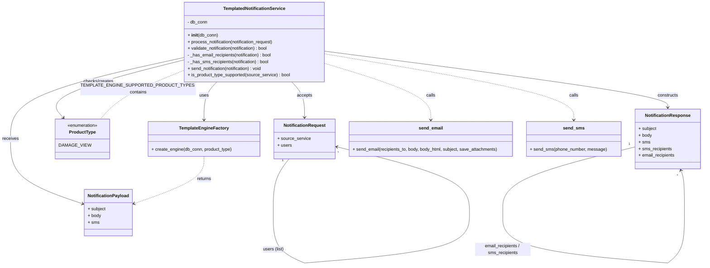

# Diagram: common/notification_service/notification_service/templated_notifications/templated_notification_service.py

> Auto-generated by Obscura crawlers

## Mermaid

### SVG

<svg id="container" width="2473.7734375" xmlns="http://www.w3.org/2000/svg" class="classDiagram" height="983.55322265625" viewBox="0 0 2473.7734375 983.55322265625" role="graphics-document document" aria-roledescription="class"><g><defs><marker id="container_class-aggregationStart" class="marker aggregation class" refX="18" refY="7" markerWidth="190" markerHeight="240" orient="auto"><path d="M 18,7 L9,13 L1,7 L9,1 Z"></path></marker></defs><defs><marker id="container_class-aggregationEnd" class="marker aggregation class" refX="1" refY="7" markerWidth="20" markerHeight="28" orient="auto"><path d="M 18,7 L9,13 L1,7 L9,1 Z"></path></marker></defs><defs><marker id="container_class-extensionStart" class="marker extension class" refX="18" refY="7" markerWidth="190" markerHeight="240" orient="auto"><path d="M 1,7 L18,13 V 1 Z"></path></marker></defs><defs><marker id="container_class-extensionEnd" class="marker extension class" refX="1" refY="7" markerWidth="20" markerHeight="28" orient="auto"><path d="M 1,1 V 13 L18,7 Z"></path></marker></defs><defs><marker id="container_class-compositionStart" class="marker composition class" refX="18" refY="7" markerWidth="190" markerHeight="240" orient="auto"><path d="M 18,7 L9,13 L1,7 L9,1 Z"></path></marker></defs><defs><marker id="container_class-compositionEnd" class="marker composition class" refX="1" refY="7" markerWidth="20" markerHeight="28" orient="auto"><path d="M 18,7 L9,13 L1,7 L9,1 Z"></path></marker></defs><defs><marker id="container_class-dependencyStart" class="marker dependency class" refX="6" refY="7" markerWidth="190" markerHeight="240" orient="auto"><path d="M 5,7 L9,13 L1,7 L9,1 Z"></path></marker></defs><defs><marker id="container_class-dependencyEnd" class="marker dependency class" refX="13" refY="7" markerWidth="20" markerHeight="28" orient="auto"><path d="M 18,7 L9,13 L14,7 L9,1 Z"></path></marker></defs><defs><marker id="container_class-lollipopStart" class="marker lollipop class" refX="13" refY="7" markerWidth="190" markerHeight="240" orient="auto"><circle stroke="black" fill="transparent" cx="7" cy="7" r="6"></circle></marker></defs><defs><marker id="container_class-lollipopEnd" class="marker lollipop class" refX="1" refY="7" markerWidth="190" markerHeight="240" orient="auto"><circle stroke="black" fill="transparent" cx="7" cy="7" r="6"></circle></marker></defs><g class="root"><g class="clusters"></g><g class="edgePaths"><path d="M729.01,296L721.438,304.167C713.866,312.333,698.722,328.667,691.15,351.5C683.578,374.333,683.578,403.667,683.578,418.333L683.578,433" id="id_TemplatedNotificationService_TemplateEngineFactory_1" class="edge-thickness-normal edge-pattern-solid relation" style=";;;" data-edge="true" data-et="edge" data-id="id_TemplatedNotificationService_TemplateEngineFactory_1" data-points="W3sieCI6NzI5LjAwOTgzNjQ2MzczMDYsInkiOjI5Nn0seyJ4Ijo2ODMuNTc4MTI1LCJ5IjozNDV9LHsieCI6NjgzLjU3ODEyNSwieSI6NDM5fV0=" marker-end="url(#container_class-dependencyEnd)"></path><path d="M996.037,296L1003.609,304.167C1011.181,312.333,1026.325,328.667,1033.897,350C1041.469,371.333,1041.469,397.667,1041.469,410.833L1041.469,424" id="id_TemplatedNotificationService_NotificationRequest_2" class="edge-thickness-normal edge-pattern-solid relation" style=";;;" data-edge="true" data-et="edge" data-id="id_TemplatedNotificationService_NotificationRequest_2" data-points="W3sieCI6OTk2LjAzNzAzODUzNjI2OTQsInkiOjI5Nn0seyJ4IjoxMDQxLjQ2ODc1LCJ5IjozNDV9LHsieCI6MTA0MS40Njg3NSwieSI6NDMwfV0=" marker-end="url(#container_class-dependencyEnd)"></path><path d="M1115.762,184.897L1321.168,211.581C1526.574,238.265,1937.387,291.632,2142.793,325.483C2348.199,359.333,2348.199,373.667,2348.199,380.833L2348.199,388" id="id_TemplatedNotificationService_NotificationResponse_3" class="edge-thickness-normal edge-pattern-solid relation" style=";;;" data-edge="true" data-et="edge" data-id="id_TemplatedNotificationService_NotificationResponse_3" data-points="W3sieCI6MTExNS43NjE3MTg3NSwieSI6MTg0Ljg5NzQ3OTMxNDE3OTk1fSx7IngiOjIzNDguMTk5MjE4NzUsInkiOjM0NX0seyJ4IjoyMzQ4LjE5OTIxODc1LCJ5IjozOTR9XQ==" marker-end="url(#container_class-dependencyEnd)"></path><path d="M609.285,211.24L513.986,233.533C418.688,255.827,228.09,300.413,132.791,348.873C37.492,397.333,37.492,449.667,37.492,500C37.492,550.333,37.492,598.667,78.293,637.604C119.094,676.541,200.696,706.083,241.497,720.854L282.298,735.624" id="id_TemplatedNotificationService_NotificationPayload_4" class="edge-thickness-normal edge-pattern-solid relation" style=";;;" data-edge="true" data-et="edge" data-id="id_TemplatedNotificationService_NotificationPayload_4" data-points="W3sieCI6NjA5LjI4NTE1NjI1LCJ5IjoyMTEuMjQwMTY2MDkyMTkzNDh9LHsieCI6MzcuNDkyMTg3NSwieSI6MzQ1fSx7IngiOjM3LjQ5MjE4NzUsInkiOjUwMn0seyJ4IjozNy40OTIxODc1LCJ5Ijo2NDd9LHsieCI6Mjg3LjkzOTQ1MzEyNSwieSI6NzM3LjY2Njc0MjYzMjc1MDd9XQ==" marker-end="url(#container_class-dependencyEnd)"></path><path d="M609.285,220.828L533.142,241.524C456.998,262.219,304.711,303.609,239.359,337.693C174.006,371.776,195.589,398.552,206.38,411.94L217.171,425.329" id="id_TemplatedNotificationService_ProductType_5" class="edge-thickness-normal edge-pattern-solid relation" style=";;;" data-edge="true" data-et="edge" data-id="id_TemplatedNotificationService_ProductType_5" data-points="W3sieCI6NjA5LjI4NTE1NjI1LCJ5IjoyMjAuODI4MzU1Mzk2ODgyNTl9LHsieCI6MTUyLjQyMzgyODEyNSwieSI6MzQ1fSx7IngiOjIyMC45MzY0Njc0NTYyMTAxOCwieSI6NDMwfV0=" marker-end="url(#container_class-dependencyEnd)"></path><path d="M1115.762,228.995L1179.352,248.329C1242.943,267.663,1370.124,306.332,1433.714,340.333C1497.305,374.333,1497.305,403.667,1497.305,418.333L1497.305,433" id="id_TemplatedNotificationService_send_email_6" class="edge-thickness-normal edge-pattern-dashed relation" style=";;;" data-edge="true" data-et="edge" data-id="id_TemplatedNotificationService_send_email_6" data-points="W3sieCI6MTExNS43NjE3MTg3NSwieSI6MjI4Ljk5NTAwOTM1MzYxNTl9LHsieCI6MTQ5Ny4zMDQ2ODc1LCJ5IjozNDV9LHsieCI6MTQ5Ny4zMDQ2ODc1LCJ5Ijo0Mzl9XQ==" marker-end="url(#container_class-dependencyEnd)"></path><path d="M1115.762,194.485L1265.292,219.57C1414.822,244.656,1713.882,294.828,1863.411,334.581C2012.941,374.333,2012.941,403.667,2012.941,418.333L2012.941,433" id="id_TemplatedNotificationService_send_sms_7" class="edge-thickness-normal edge-pattern-dashed relation" style=";;;" data-edge="true" data-et="edge" data-id="id_TemplatedNotificationService_send_sms_7" data-points="W3sieCI6MTExNS43NjE3MTg3NSwieSI6MTk0LjQ4NDU0ODc1NDM1ODk3fSx7IngiOjIwMTIuOTQxNDA2MjUsInkiOjM0NX0seyJ4IjoyMDEyLjk0MTQwNjI1LCJ5Ijo0Mzl9XQ==" marker-end="url(#container_class-dependencyEnd)"></path><path d="M683.578,565L683.578,578.667C683.578,592.333,683.578,619.667,646.5,647.72C609.423,675.773,535.267,704.546,498.189,718.932L461.111,733.319" id="id_TemplateEngineFactory_NotificationPayload_8" class="edge-thickness-normal edge-pattern-dashed relation" style=";;;" data-edge="true" data-et="edge" data-id="id_TemplateEngineFactory_NotificationPayload_8" data-points="W3sieCI6NjgzLjU3ODEyNSwieSI6NTY1fSx7IngiOjY4My41NzgxMjUsInkiOjY0N30seyJ4Ijo0NTUuNTE3NTc4MTI1LCJ5Ijo3MzUuNDg5MjExOTIyMzEzM31d" marker-end="url(#container_class-dependencyEnd)"></path><path d="M337.005,430L348.424,415.833C359.842,401.667,382.68,373.333,428.06,344.824C473.44,316.315,541.363,287.631,575.324,273.288L609.285,258.946" id="id_ProductType_TemplatedNotificationService_9" class="edge-thickness-normal edge-pattern-dashed relation" style=";;;" data-edge="true" data-et="edge" data-id="id_ProductType_TemplatedNotificationService_9" data-points="W3sieCI6MzM3LjAwNDkzODc5Mzc4OTgsInkiOjQzMH0seyJ4Ijo0MDUuNTE3NTc4MTI1LCJ5IjozNDV9LHsieCI6NjA5LjI4NTE1NjI1LCJ5IjoyNTguOTQ2MDg2NzQ4NDA5MTN9XQ=="></path><path d="M985.842,574L976.442,586.167C967.042,598.333,948.243,622.667,938.843,654.992C929.443,687.317,929.443,727.633,929.443,747.792L929.443,767.95" id="NotificationRequest-cyclic-special-1" class="edge-thickness-normal edge-pattern-solid relation" style=";;;" data-edge="true" data-et="edge" data-id="NotificationRequest-cyclic-special-1" data-points="W3sieCI6OTg1Ljg0MjE1NTE3MjU5ODcsInkiOjU3NH0seyJ4Ijo5MjkuNDQyOTY4NzUwMzcyNSwieSI6NjQ3fSx7IngiOjkyOS40NDI5Njg3NTAzNzI1LCJ5Ijo3NjcuOTQ5OTk5OTk5MjU0OX1d"></path><path d="M929.443,768.05L929.443,790.208C929.443,812.367,929.443,856.683,948.106,887.013C966.768,917.343,1004.093,933.685,1022.756,941.857L1041.419,950.028" id="NotificationRequest-cyclic-special-mid" class="edge-thickness-normal edge-pattern-solid relation" style=";;;" data-edge="true" data-et="edge" data-id="NotificationRequest-cyclic-special-mid" data-points="W3sieCI6OTI5LjQ0Mjk2ODc1MDM3MjUsInkiOjc2OC4wNTAwMDAwMDA3NDUxfSx7IngiOjkyOS40NDI5Njg3NTAzNzI1LCJ5Ijo5MDF9LHsieCI6MTA0MS40MTg3NDk5OTkyNTUsInkiOjk1MC4wMjgxMDc3MTgzNjgzfV0="></path><path d="M1041.519,950.046L1140.405,941.872C1239.29,933.697,1437.062,917.349,1535.948,887.008C1634.834,856.667,1634.834,812.333,1634.834,770C1634.834,727.667,1634.834,687.333,1554.892,647.631C1474.949,607.929,1315.065,568.858,1235.122,549.323L1155.18,529.788" id="NotificationRequest-cyclic-special-2" class="edge-thickness-normal edge-pattern-solid relation" style=";;;" data-edge="true" data-et="edge" data-id="NotificationRequest-cyclic-special-2" data-points="W3sieCI6MTA0MS41MTg3NTAwMDA3NDUsInkiOjk1MC4wNDU4NjY3OTU5NDIyfSx7IngiOjE2MzQuODMzOTg0Mzc1LCJ5Ijo5MDF9LHsieCI6MTYzNC44MzM5ODQzNzUsInkiOjc2OH0seyJ4IjoxNjM0LjgzMzk4NDM3NSwieSI6NjQ3fSx7IngiOjExNDkuMzUxNTYyNSwieSI6NTI4LjM2MzIwMjQ3MDAyMTZ9XQ==" marker-end="url(#container_class-dependencyEnd)"></path><path d="M2230.625,530.731L2151.326,550.11C2072.028,569.488,1913.431,608.244,1834.132,647.78C1754.834,687.317,1754.834,727.633,1754.834,747.792L1754.834,767.95" id="NotificationResponse-cyclic-special-1" class="edge-thickness-normal edge-pattern-solid relation" style=";;;" data-edge="true" data-et="edge" data-id="NotificationResponse-cyclic-special-1" data-points="W3sieCI6MjIzMC42MjUsInkiOjUzMC43MzE0ODA1OTc2MjQxfSx7IngiOjE3NTQuODMzOTg0Mzc1LCJ5Ijo2NDd9LHsieCI6MTc1NC44MzM5ODQzNzUsInkiOjc2Ny45NDk5OTk5OTkyNTQ5fV0="></path><path d="M1754.834,768.05L1754.834,790.208C1754.834,812.367,1754.834,856.683,1853.72,887.016C1952.606,917.349,2150.377,933.697,2249.263,941.872L2348.149,950.046" id="NotificationResponse-cyclic-special-mid" class="edge-thickness-normal edge-pattern-solid relation" style=";;;" data-edge="true" data-et="edge" data-id="NotificationResponse-cyclic-special-mid" data-points="W3sieCI6MTc1NC44MzM5ODQzNzUsInkiOjc2OC4wNTAwMDAwMDA3NDUxfSx7IngiOjE3NTQuODMzOTg0Mzc1LCJ5Ijo5MDF9LHsieCI6MjM0OC4xNDkyMTg3NDkyNTUsInkiOjk1MC4wNDU4NjY3OTU5NDIyfV0="></path><path d="M2348.249,950.009L2358.241,941.841C2368.233,933.673,2388.216,917.336,2398.208,887.002C2408.199,856.667,2408.199,812.333,2408.199,770C2408.199,727.667,2408.199,687.333,2406.03,661.924C2403.86,636.515,2399.522,626.029,2397.352,620.787L2395.183,615.544" id="NotificationResponse-cyclic-special-2" class="edge-thickness-normal edge-pattern-solid relation" style=";;;" data-edge="true" data-et="edge" data-id="NotificationResponse-cyclic-special-2" data-points="W3sieCI6MjM0OC4yNDkyMTg3NTA3NDUsInkiOjk1MC4wMDkxMjUwMDAxMzUzfSx7IngiOjI0MDguMTk5MjE4NzUsInkiOjkwMX0seyJ4IjoyNDA4LjE5OTIxODc1LCJ5Ijo3Njh9LHsieCI6MjQwOC4xOTkyMTg3NSwieSI6NjQ3fSx7IngiOjIzOTIuODg4ODczOTIyNDE0LCJ5Ijo2MTB9XQ==" marker-end="url(#container_class-dependencyEnd)"></path></g><g class="edgeLabels"><g class="edgeLabel" transform="translate(683.578125, 345)"><g class="label" data-id="id_TemplatedNotificationService_TemplateEngineFactory_1" transform="translate(-16.4921875, -12)"><foreignObject width="32.984375" height="24">

uses

</foreignObject></g></g><g class="edgeLabel" transform="translate(1041.46875, 345)"><g class="label" data-id="id_TemplatedNotificationService_NotificationRequest_2" transform="translate(-27.421875, -12)"><foreignObject width="54.84375" height="24">

accepts

</foreignObject></g></g><g class="edgeLabel" transform="translate(2348.19921875, 345)"><g class="label" data-id="id_TemplatedNotificationService_NotificationResponse_3" transform="translate(-37.84375, -12)"><foreignObject width="75.6875" height="24">

constructs

</foreignObject></g></g><g class="edgeLabel" transform="translate(37.4921875, 502)"><g class="label" data-id="id_TemplatedNotificationService_NotificationPayload_4" transform="translate(-29.4921875, -12)"><foreignObject width="58.984375" height="24">

receives

</foreignObject></g></g><g class="edgeLabel" transform="translate(328.17841, 297.23116)"><g class="label" data-id="id_TemplatedNotificationService_ProductType_5" transform="translate(-54.421875, -12)"><foreignObject width="108.84375" height="24">

checks/creates

</foreignObject></g></g><g class="edgeLabel" transform="translate(1497.3046875, 345)"><g class="label" data-id="id_TemplatedNotificationService_send_email_6" transform="translate(-16.4453125, -12)"><foreignObject width="32.890625" height="24">

calls

</foreignObject></g></g><g class="edgeLabel" transform="translate(2012.94140625, 345)"><g class="label" data-id="id_TemplatedNotificationService_send_sms_7" transform="translate(-16.4453125, -12)"><foreignObject width="32.890625" height="24">

calls

</foreignObject></g></g><g class="edgeLabel" transform="translate(683.578125, 647)"><g class="label" data-id="id_TemplateEngineFactory_NotificationPayload_8" transform="translate(-26.265625, -12)"><foreignObject width="52.53125" height="24">

returns

</foreignObject></g></g><g class="edgeLabel" transform="translate(405.517578125, 345)"><g class="label" data-id="id_ProductType_TemplatedNotificationService_9" transform="translate(-178.671875, -24)"><foreignObject width="357.34375" height="48">

TEMPLATE_ENGINE_SUPPORTED_PRODUCT_TYPES contains

</foreignObject></g></g><g class="edgeLabel"><g class="label" data-id="NotificationRequest-cyclic-special-1" transform="translate(0, 0)"><foreignObject width="0" height="0">

</foreignObject></g></g><g class="edgeLabel" transform="translate(929.4429687503725, 901)"><g class="label" data-id="NotificationRequest-cyclic-special-mid" transform="translate(-37.984375, -12)"><foreignObject width="75.96875" height="24">

users (list)

</foreignObject></g></g><g class="edgeLabel"><g class="label" data-id="NotificationRequest-cyclic-special-2" transform="translate(0, 0)"><foreignObject width="0" height="0">

</foreignObject></g></g><g class="edgeLabel"><g class="label" data-id="NotificationResponse-cyclic-special-1" transform="translate(0, 0)"><foreignObject width="0" height="0">

</foreignObject></g></g><g class="edgeLabel" transform="translate(1754.833984375, 901)"><g class="label" data-id="NotificationResponse-cyclic-special-mid" transform="translate(-100, -24)"><foreignObject width="200" height="48">

email_recipients / sms_recipients

</foreignObject></g></g><g class="edgeLabel"><g class="label" data-id="NotificationResponse-cyclic-special-2" transform="translate(0, 0)"><foreignObject width="0" height="0">

</foreignObject></g></g><g class="edgeTerminals" transform="translate(963.2729479877165, 578.6776914377501)"><g class="inner" transform="translate(0, 0)"><foreignObject style="width: 9px; height: 12px;">
1
</foreignObject></g></g><g class="edgeTerminals" transform="translate(914.4429693751863, 785.5500005359271)"><g class="inner" transform="translate(0, 0)"><foreignObject style="width: 9px; height: 12px;">
1
</foreignObject></g></g><g class="edgeTerminals" transform="translate(1060.1950106245165, 963.5531744941075)"><g class="inner" transform="translate(0, 0)"><foreignObject style="width: 9px; height: 12px;">
1
</foreignObject></g></g><g class="edgeTerminals" transform="translate(2210.0644646571313, 520.3144557706102)"><g class="inner" transform="translate(0, 0)"><foreignObject style="width: 9px; height: 12px;">
1
</foreignObject></g></g><g class="edgeTerminals" transform="translate(1739.8339821875004, 785.5499981253726)"><g class="inner" transform="translate(0, 0)"><foreignObject style="width: 9px; height: 12px;">
1
</foreignObject></g></g><g class="edgeTerminals" transform="translate(2371.291822066266, 950.5462369582841)"><g class="inner" transform="translate(0, 0)"><foreignObject style="width: 9px; height: 12px;">
1
</foreignObject></g></g><g class="edgeTerminals" transform="translate(939.4429693751863, 745.4500005351821)"><g class="inner" transform="translate(0, 0)"></g><foreignObject style="width: 9px; height: 12px;">
*
</foreignObject></g><g class="edgeTerminals" transform="translate(1026.4042971224017, 924.2685127919393)"><g class="inner" transform="translate(0, 0)"></g><foreignObject style="width: 9px; height: 12px;">
*
</foreignObject></g><g class="edgeTerminals" transform="translate(1157.7905823730891, 542.0886598996028)"><g class="inner" transform="translate(0, 0)"></g><foreignObject style="width: 9px; height: 12px;">
*
</foreignObject></g><g class="edgeTerminals" transform="translate(1764.8339821875, 745.4499981246275)"><g class="inner" transform="translate(0, 0)"></g><foreignObject style="width: 9px; height: 12px;">
*
</foreignObject></g><g class="edgeTerminals" transform="translate(2326.9444500427553, 928.6551523054706)"><g class="inner" transform="translate(0, 0)"></g><foreignObject style="width: 9px; height: 12px;">
*
</foreignObject></g><g class="edgeTerminals" transform="translate(2380.7197799252053, 626.9055729791829)"><g class="inner" transform="translate(0, 0)"></g><foreignObject style="width: 9px; height: 12px;">
*
</foreignObject></g></g><g class="nodes"><g class="node default" id="classId-TemplatedNotificationService-0" transform="translate(862.5234375, 152)"><g class="basic label-container"><path d="M-253.23828125 -144 L253.23828125 -144 L253.23828125 144 L-253.23828125 144" stroke="none" stroke-width="0" fill="#ECECFF" style=""></path><path d="M-253.23828125 -144 C-61.84580406059075 -144, 129.5466731288185 -144, 253.23828125 -144 M-253.23828125 -144 C-144.1820809444153 -144, -35.12588063883061 -144, 253.23828125 -144 M253.23828125 -144 C253.23828125 -82.12732623220413, 253.23828125 -20.254652464408238, 253.23828125 144 M253.23828125 -144 C253.23828125 -68.28845306659838, 253.23828125 7.423093866803242, 253.23828125 144 M253.23828125 144 C69.85801218982496 144, -113.52225687035008 144, -253.23828125 144 M253.23828125 144 C126.76839167132164 144, 0.2985020926432753 144, -253.23828125 144 M-253.23828125 144 C-253.23828125 44.91379935355975, -253.23828125 -54.172401292880494, -253.23828125 -144 M-253.23828125 144 C-253.23828125 55.16974100199684, -253.23828125 -33.66051799600632, -253.23828125 -144" stroke="#9370DB" stroke-width="1.3" fill="none" stroke-dasharray="0 0" style=""></path></g><g class="annotation-group text" transform="translate(0, -120)"></g><g class="label-group text" transform="translate(-108.2421875, -120)"><g class="label" style="font-weight: bolder" transform="translate(0,-12)"><foreignObject width="216.484375" height="24">

TemplatedNotificationService

</foreignObject></g></g><g class="members-group text" transform="translate(-241.23828125, -72)"><g class="label" style="" transform="translate(0,-12)"><foreignObject width="72.875" height="24">

- db_conn

</foreignObject></g></g><g class="methods-group text" transform="translate(-241.23828125, -24)"><g class="label" style="" transform="translate(0,-12)"><foreignObject width="109.21875" height="24">

+ <strong>init</strong>(db_conn)

</foreignObject></g><g class="label" style="" transform="translate(0,12)"><foreignObject width="316.375" height="24">

+ process_notification(notification_request)

</foreignObject></g><g class="label" style="" transform="translate(0,36)"><foreignObject width="300.5" height="24">

+ validate_notification(notification) : bool

</foreignObject></g><g class="label" style="" transform="translate(0,60)"><foreignObject width="311.65625" height="24">

- _has_email_recipients(notification) : bool

</foreignObject></g><g class="label" style="" transform="translate(0,84)"><foreignObject width="299.96875" height="24">

- _has_sms_recipients(notification) : bool

</foreignObject></g><g class="label" style="" transform="translate(0,108)"><foreignObject width="276.421875" height="24">

+ send_notification(notification) : void

</foreignObject></g><g class="label" style="" transform="translate(0,132)"><foreignObject width="374.234375" height="24">

+ is_product_type_supported(source_service) : bool

</foreignObject></g></g><g class="divider" style=""><path d="M-253.23828125 -96 C-59.102392633419726 -96, 135.03349598316055 -96, 253.23828125 -96 M-253.23828125 -96 C-108.65798930571435 -96, 35.922302638571296 -96, 253.23828125 -96" stroke="#9370DB" stroke-width="1.3" fill="none" stroke-dasharray="0 0" style=""></path></g><g class="divider" style=""><path d="M-253.23828125 -48 C-116.7625657844674 -48, 19.713149681065204 -48, 253.23828125 -48 M-253.23828125 -48 C-89.27397249608967 -48, 74.69033625782066 -48, 253.23828125 -48" stroke="#9370DB" stroke-width="1.3" fill="none" stroke-dasharray="0 0" style=""></path></g></g><g class="node default" id="classId-TemplateEngineFactory-1" transform="translate(683.578125, 502)"><g class="basic label-container"><path d="M-200.0078125 -63 L200.0078125 -63 L200.0078125 63 L-200.0078125 63" stroke="none" stroke-width="0" fill="#ECECFF" style=""></path><path d="M-200.0078125 -63 C-51.437629473959504 -63, 97.13255355208099 -63, 200.0078125 -63 M-200.0078125 -63 C-96.46542397401218 -63, 7.076964551975635 -63, 200.0078125 -63 M200.0078125 -63 C200.0078125 -21.766379455158102, 200.0078125 19.467241089683796, 200.0078125 63 M200.0078125 -63 C200.0078125 -34.86587691214416, 200.0078125 -6.731753824288326, 200.0078125 63 M200.0078125 63 C86.83710923509754 63, -26.333594029804914 63, -200.0078125 63 M200.0078125 63 C55.70381536493656 63, -88.60018177012688 63, -200.0078125 63 M-200.0078125 63 C-200.0078125 27.30874413074376, -200.0078125 -8.382511738512477, -200.0078125 -63 M-200.0078125 63 C-200.0078125 36.80490245059382, -200.0078125 10.609804901187644, -200.0078125 -63" stroke="#9370DB" stroke-width="1.3" fill="none" stroke-dasharray="0 0" style=""></path></g><g class="annotation-group text" transform="translate(0, -39)"></g><g class="label-group text" transform="translate(-84.953125, -39)"><g class="label" style="font-weight: bolder" transform="translate(0,-12)"><foreignObject width="169.90625" height="24">

TemplateEngineFactory

</foreignObject></g></g><g class="members-group text" transform="translate(-188.0078125, 9)"></g><g class="methods-group text" transform="translate(-188.0078125, 39)"><g class="label" style="" transform="translate(0,-12)"><foreignObject width="291.0625" height="24">

+ create_engine(db_conn, product_type)

</foreignObject></g></g><g class="divider" style=""><path d="M-200.0078125 -15 C-88.76935982492972 -15, 22.469092850140555 -15, 200.0078125 -15 M-200.0078125 -15 C-105.73315790877635 -15, -11.458503317552697 -15, 200.0078125 -15" stroke="#9370DB" stroke-width="1.3" fill="none" stroke-dasharray="0 0" style=""></path></g><g class="divider" style=""><path d="M-200.0078125 9 C-42.186662162995674 9, 115.63448817400865 9, 200.0078125 9 M-200.0078125 9 C-66.6147882121981 9, 66.77823607560379 9, 200.0078125 9" stroke="#9370DB" stroke-width="1.3" fill="none" stroke-dasharray="0 0" style=""></path></g></g><g class="node default" id="classId-ProductType-2" transform="translate(278.970703125, 502)"><g class="basic label-container"><path d="M-90.94921875 -72 L90.94921875 -72 L90.94921875 72 L-90.94921875 72" stroke="none" stroke-width="0" fill="#ECECFF" style=""></path><path d="M-90.94921875 -72 C-36.59853202257873 -72, 17.75215470484254 -72, 90.94921875 -72 M-90.94921875 -72 C-41.28972501068137 -72, 8.369768728637254 -72, 90.94921875 -72 M90.94921875 -72 C90.94921875 -35.863552183127794, 90.94921875 0.2728956337444117, 90.94921875 72 M90.94921875 -72 C90.94921875 -28.538351738237274, 90.94921875 14.923296523525451, 90.94921875 72 M90.94921875 72 C50.592213062975695 72, 10.23520737595139 72, -90.94921875 72 M90.94921875 72 C40.62783905660642 72, -9.693540636787162 72, -90.94921875 72 M-90.94921875 72 C-90.94921875 25.03968859872277, -90.94921875 -21.920622802554462, -90.94921875 -72 M-90.94921875 72 C-90.94921875 38.88133877921609, -90.94921875 5.762677558432173, -90.94921875 -72" stroke="#9370DB" stroke-width="1.3" fill="none" stroke-dasharray="0 0" style=""></path></g><g class="annotation-group text" transform="translate(-55.5546875, -48)"><g class="label" style="" transform="translate(0,-12)"><foreignObject width="111.109375" height="24">

«enumeration»

</foreignObject></g></g><g class="label-group text" transform="translate(-45.9140625, -24)"><g class="label" style="font-weight: bolder" transform="translate(0,-12)"><foreignObject width="91.828125" height="24">

ProductType

</foreignObject></g></g><g class="members-group text" transform="translate(-78.94921875, 24)"><g class="label" style="" transform="translate(0,-12)"><foreignObject width="102.34375" height="24">

DAMAGE_VIEW

</foreignObject></g></g><g class="methods-group text" transform="translate(-78.94921875, 72)"></g><g class="divider" style=""><path d="M-90.94921875 0 C-31.085071319873755 0, 28.77907611025249 0, 90.94921875 0 M-90.94921875 0 C-30.73008870474112 0, 29.48904134051776 0, 90.94921875 0" stroke="#9370DB" stroke-width="1.3" fill="none" stroke-dasharray="0 0" style=""></path></g><g class="divider" style=""><path d="M-90.94921875 48 C-38.41442617001623 48, 14.120366409967545 48, 90.94921875 48 M-90.94921875 48 C-24.700987042203593 48, 41.547244665592814 48, 90.94921875 48" stroke="#9370DB" stroke-width="1.3" fill="none" stroke-dasharray="0 0" style=""></path></g></g><g class="node default" id="classId-NotificationRequest-3" transform="translate(1041.46875, 502)"><g class="basic label-container"><path d="M-107.8828125 -72 L107.8828125 -72 L107.8828125 72 L-107.8828125 72" stroke="none" stroke-width="0" fill="#ECECFF" style=""></path><path d="M-107.8828125 -72 C-26.625047819272297 -72, 54.63271686145541 -72, 107.8828125 -72 M-107.8828125 -72 C-23.18015590139987 -72, 61.52250069720026 -72, 107.8828125 -72 M107.8828125 -72 C107.8828125 -27.446419927503833, 107.8828125 17.107160144992335, 107.8828125 72 M107.8828125 -72 C107.8828125 -25.899497111146694, 107.8828125 20.201005777706612, 107.8828125 72 M107.8828125 72 C60.99487270220843 72, 14.106932904416865 72, -107.8828125 72 M107.8828125 72 C48.68242542044082 72, -10.517961659118356 72, -107.8828125 72 M-107.8828125 72 C-107.8828125 40.49636576479674, -107.8828125 8.992731529593485, -107.8828125 -72 M-107.8828125 72 C-107.8828125 38.02265127592257, -107.8828125 4.04530255184514, -107.8828125 -72" stroke="#9370DB" stroke-width="1.3" fill="none" stroke-dasharray="0 0" style=""></path></g><g class="annotation-group text" transform="translate(0, -48)"></g><g class="label-group text" transform="translate(-72.859375, -48)"><g class="label" style="font-weight: bolder" transform="translate(0,-12)"><foreignObject width="145.71875" height="24">

NotificationRequest

</foreignObject></g></g><g class="members-group text" transform="translate(-95.8828125, 0)"><g class="label" style="" transform="translate(0,-12)"><foreignObject width="118.90625" height="24">

+ source_service

</foreignObject></g><g class="label" style="" transform="translate(0,12)"><foreignObject width="51.140625" height="24">

+ users

</foreignObject></g></g><g class="methods-group text" transform="translate(-95.8828125, 72)"></g><g class="divider" style=""><path d="M-107.8828125 -24 C-39.92739009911318 -24, 28.028032301773635 -24, 107.8828125 -24 M-107.8828125 -24 C-44.69412800775051 -24, 18.494556484498986 -24, 107.8828125 -24" stroke="#9370DB" stroke-width="1.3" fill="none" stroke-dasharray="0 0" style=""></path></g><g class="divider" style=""><path d="M-107.8828125 48 C-49.660887872183785 48, 8.56103675563243 48, 107.8828125 48 M-107.8828125 48 C-52.464564392061384 48, 2.953683715877233 48, 107.8828125 48" stroke="#9370DB" stroke-width="1.3" fill="none" stroke-dasharray="0 0" style=""></path></g></g><g class="node default" id="classId-NotificationPayload-4" transform="translate(371.728515625, 768)"><g class="basic label-container"><path d="M-83.7890625 -84 L83.7890625 -84 L83.7890625 84 L-83.7890625 84" stroke="none" stroke-width="0" fill="#ECECFF" style=""></path><path d="M-83.7890625 -84 C-28.11472063221899 -84, 27.55962123556202 -84, 83.7890625 -84 M-83.7890625 -84 C-33.94380231423363 -84, 15.901457871532742 -84, 83.7890625 -84 M83.7890625 -84 C83.7890625 -38.431749143842595, 83.7890625 7.136501712314811, 83.7890625 84 M83.7890625 -84 C83.7890625 -43.523923876373786, 83.7890625 -3.047847752747572, 83.7890625 84 M83.7890625 84 C44.84752226750861 84, 5.905982035017217 84, -83.7890625 84 M83.7890625 84 C17.645103388177162 84, -48.498855723645676 84, -83.7890625 84 M-83.7890625 84 C-83.7890625 34.27430881327435, -83.7890625 -15.451382373451295, -83.7890625 -84 M-83.7890625 84 C-83.7890625 32.588445433422365, -83.7890625 -18.82310913315527, -83.7890625 -84" stroke="#9370DB" stroke-width="1.3" fill="none" stroke-dasharray="0 0" style=""></path></g><g class="annotation-group text" transform="translate(0, -60)"></g><g class="label-group text" transform="translate(-71.7890625, -60)"><g class="label" style="font-weight: bolder" transform="translate(0,-12)"><foreignObject width="143.578125" height="24">

NotificationPayload

</foreignObject></g></g><g class="members-group text" transform="translate(-71.7890625, -12)"><g class="label" style="" transform="translate(0,-12)"><foreignObject width="65.140625" height="24">

+ subject

</foreignObject></g><g class="label" style="" transform="translate(0,12)"><foreignObject width="48.515625" height="24">

+ body

</foreignObject></g><g class="label" style="" transform="translate(0,36)"><foreignObject width="40.890625" height="24">

+ sms

</foreignObject></g></g><g class="methods-group text" transform="translate(-71.7890625, 84)"></g><g class="divider" style=""><path d="M-83.7890625 -36 C-47.38872402244318 -36, -10.988385544886356 -36, 83.7890625 -36 M-83.7890625 -36 C-48.63493839685202 -36, -13.480814293704043 -36, 83.7890625 -36" stroke="#9370DB" stroke-width="1.3" fill="none" stroke-dasharray="0 0" style=""></path></g><g class="divider" style=""><path d="M-83.7890625 60 C-26.62730415473716 60, 30.53445419052568 60, 83.7890625 60 M-83.7890625 60 C-24.48985719783601 60, 34.80934810432798 60, 83.7890625 60" stroke="#9370DB" stroke-width="1.3" fill="none" stroke-dasharray="0 0" style=""></path></g></g><g class="node default" id="classId-NotificationResponse-5" transform="translate(2348.19921875, 502)"><g class="basic label-container"><path d="M-117.57421875 -108 L117.57421875 -108 L117.57421875 108 L-117.57421875 108" stroke="none" stroke-width="0" fill="#ECECFF" style=""></path><path d="M-117.57421875 -108 C-44.80785861812183 -108, 27.958501513756346 -108, 117.57421875 -108 M-117.57421875 -108 C-44.98592649916266 -108, 27.602365751674682 -108, 117.57421875 -108 M117.57421875 -108 C117.57421875 -31.85565715346125, 117.57421875 44.2886856930775, 117.57421875 108 M117.57421875 -108 C117.57421875 -26.020684452662437, 117.57421875 55.95863109467513, 117.57421875 108 M117.57421875 108 C31.75718907531565 108, -54.0598405993687 108, -117.57421875 108 M117.57421875 108 C41.82574099548958 108, -33.922736759020836 108, -117.57421875 108 M-117.57421875 108 C-117.57421875 44.80341238397759, -117.57421875 -18.393175232044825, -117.57421875 -108 M-117.57421875 108 C-117.57421875 50.84946458456086, -117.57421875 -6.301070830878274, -117.57421875 -108" stroke="#9370DB" stroke-width="1.3" fill="none" stroke-dasharray="0 0" style=""></path></g><g class="annotation-group text" transform="translate(0, -84)"></g><g class="label-group text" transform="translate(-78.3203125, -84)"><g class="label" style="font-weight: bolder" transform="translate(0,-12)"><foreignObject width="156.640625" height="24">

NotificationResponse

</foreignObject></g></g><g class="members-group text" transform="translate(-105.57421875, -36)"><g class="label" style="" transform="translate(0,-12)"><foreignObject width="65.140625" height="24">

+ subject

</foreignObject></g><g class="label" style="" transform="translate(0,12)"><foreignObject width="48.515625" height="24">

+ body

</foreignObject></g><g class="label" style="" transform="translate(0,36)"><foreignObject width="40.890625" height="24">

+ sms

</foreignObject></g><g class="label" style="" transform="translate(0,60)"><foreignObject width="120.828125" height="24">

+ sms_recipients

</foreignObject></g><g class="label" style="" transform="translate(0,84)"><foreignObject width="132.828125" height="24">

+ email_recipients

</foreignObject></g></g><g class="methods-group text" transform="translate(-105.57421875, 108)"></g><g class="divider" style=""><path d="M-117.57421875 -60 C-28.94574348714619 -60, 59.68273177570762 -60, 117.57421875 -60 M-117.57421875 -60 C-31.76105248961302 -60, 54.05211377077396 -60, 117.57421875 -60" stroke="#9370DB" stroke-width="1.3" fill="none" stroke-dasharray="0 0" style=""></path></g><g class="divider" style=""><path d="M-117.57421875 84 C-66.31535245400792 84, -15.056486158015858 84, 117.57421875 84 M-117.57421875 84 C-51.78908665797286 84, 13.996045434054281 84, 117.57421875 84" stroke="#9370DB" stroke-width="1.3" fill="none" stroke-dasharray="0 0" style=""></path></g></g><g class="node default" id="classId-send_email-6" transform="translate(1497.3046875, 502)"><g class="basic label-container"><path d="M-297.953125 -63 L297.953125 -63 L297.953125 63 L-297.953125 63" stroke="none" stroke-width="0" fill="#ECECFF" style=""></path><path d="M-297.953125 -63 C-133.66053499916282 -63, 30.63205500167436 -63, 297.953125 -63 M-297.953125 -63 C-98.10863339947338 -63, 101.73585820105325 -63, 297.953125 -63 M297.953125 -63 C297.953125 -13.842893401368002, 297.953125 35.314213197263996, 297.953125 63 M297.953125 -63 C297.953125 -26.97280559534026, 297.953125 9.054388809319477, 297.953125 63 M297.953125 63 C114.97277103182327 63, -68.00758293635346 63, -297.953125 63 M297.953125 63 C146.69890195330825 63, -4.5553210933834976 63, -297.953125 63 M-297.953125 63 C-297.953125 28.148071092805218, -297.953125 -6.703857814389565, -297.953125 -63 M-297.953125 63 C-297.953125 15.308027996900094, -297.953125 -32.38394400619981, -297.953125 -63" stroke="#9370DB" stroke-width="1.3" fill="none" stroke-dasharray="0 0" style=""></path></g><g class="annotation-group text" transform="translate(0, -39)"></g><g class="label-group text" transform="translate(-41.890625, -39)"><g class="label" style="font-weight: bolder" transform="translate(0,-12)"><foreignObject width="83.78125" height="24">

send_email

</foreignObject></g></g><g class="members-group text" transform="translate(-285.953125, 9)"></g><g class="methods-group text" transform="translate(-285.953125, 39)"><g class="label" style="" transform="translate(0,-12)"><foreignObject width="530.015625" height="24">

+ send_email(recipients_to, body, body_html, subject, save_attachments)

</foreignObject></g></g><g class="divider" style=""><path d="M-297.953125 -15 C-166.1388132063142 -15, -34.32450141262842 -15, 297.953125 -15 M-297.953125 -15 C-124.45758703218812 -15, 49.03795093562377 -15, 297.953125 -15" stroke="#9370DB" stroke-width="1.3" fill="none" stroke-dasharray="0 0" style=""></path></g><g class="divider" style=""><path d="M-297.953125 9 C-130.05113171165462 9, 37.85086157669076 9, 297.953125 9 M-297.953125 9 C-164.40303896584987 9, -30.852952931699747 9, 297.953125 9" stroke="#9370DB" stroke-width="1.3" fill="none" stroke-dasharray="0 0" style=""></path></g></g><g class="node default" id="classId-send_sms-7" transform="translate(2012.94140625, 502)"><g class="basic label-container"><path d="M-167.68359375 -63 L167.68359375 -63 L167.68359375 63 L-167.68359375 63" stroke="none" stroke-width="0" fill="#ECECFF" style=""></path><path d="M-167.68359375 -63 C-95.30976449985036 -63, -22.93593524970072 -63, 167.68359375 -63 M-167.68359375 -63 C-57.451493167604156 -63, 52.78060741479169 -63, 167.68359375 -63 M167.68359375 -63 C167.68359375 -16.10771926433017, 167.68359375 30.784561471339657, 167.68359375 63 M167.68359375 -63 C167.68359375 -15.853256252385208, 167.68359375 31.293487495229584, 167.68359375 63 M167.68359375 63 C68.80100735719246 63, -30.08157903561508 63, -167.68359375 63 M167.68359375 63 C85.90685650518198 63, 4.130119260363955 63, -167.68359375 63 M-167.68359375 63 C-167.68359375 29.67123004874253, -167.68359375 -3.657539902514941, -167.68359375 -63 M-167.68359375 63 C-167.68359375 21.139350854167574, -167.68359375 -20.72129829166485, -167.68359375 -63" stroke="#9370DB" stroke-width="1.3" fill="none" stroke-dasharray="0 0" style=""></path></g><g class="annotation-group text" transform="translate(0, -39)"></g><g class="label-group text" transform="translate(-36.3515625, -39)"><g class="label" style="font-weight: bolder" transform="translate(0,-12)"><foreignObject width="72.703125" height="24">

send_sms

</foreignObject></g></g><g class="members-group text" transform="translate(-155.68359375, 9)"></g><g class="methods-group text" transform="translate(-155.68359375, 39)"><g class="label" style="" transform="translate(0,-12)"><foreignObject width="275.015625" height="24">

+ send_sms(phone_number, message)

</foreignObject></g></g><g class="divider" style=""><path d="M-167.68359375 -15 C-88.21658721087056 -15, -8.749580671741114 -15, 167.68359375 -15 M-167.68359375 -15 C-79.25499595621052 -15, 9.173601837578957 -15, 167.68359375 -15" stroke="#9370DB" stroke-width="1.3" fill="none" stroke-dasharray="0 0" style=""></path></g><g class="divider" style=""><path d="M-167.68359375 9 C-47.204421707407235 9, 73.27475033518553 9, 167.68359375 9 M-167.68359375 9 C-60.34671748213718 9, 46.99015878572564 9, 167.68359375 9" stroke="#9370DB" stroke-width="1.3" fill="none" stroke-dasharray="0 0" style=""></path></g></g><g class="label edgeLabel" id="NotificationRequest---NotificationRequest---1" transform="translate(929.4429687503725, 768)"><rect width="0.1" height="0.1"></rect><g class="label" style="" transform="translate(0, 0)"><rect></rect><foreignObject width="0" height="0">

</foreignObject></g></g><g class="label edgeLabel" id="NotificationRequest---NotificationRequest---2" transform="translate(1041.46875, 950.0500000007451)"><rect width="0.1" height="0.1"></rect><g class="label" style="" transform="translate(0, 0)"><rect></rect><foreignObject width="0" height="0">

</foreignObject></g></g><g class="label edgeLabel" id="NotificationResponse---NotificationResponse---1" transform="translate(1754.833984375, 768)"><rect width="0.1" height="0.1"></rect><g class="label" style="" transform="translate(0, 0)"><rect></rect><foreignObject width="0" height="0">

</foreignObject></g></g><g class="label edgeLabel" id="NotificationResponse---NotificationResponse---2" transform="translate(2348.19921875, 950.0500000007451)"><rect width="0.1" height="0.1"></rect><g class="label" style="" transform="translate(0, 0)"><rect></rect><foreignObject width="0" height="0">

</foreignObject></g></g></g></g></g></svg>
