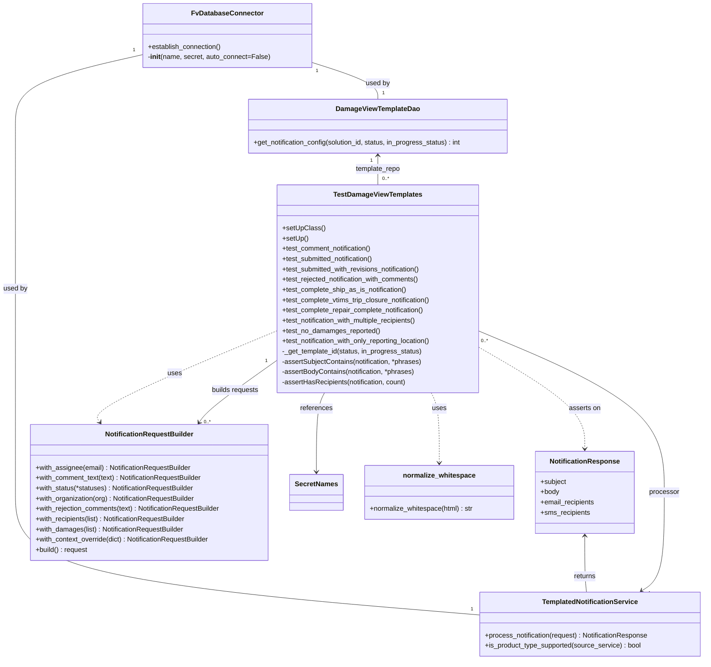

# Diagram: common/notification_service/notification_service/templated_notifications/tests/integration/test_damage_view_notification.py

> Auto-generated by Obscura crawlers

## Mermaid

### SVG

<svg id="container" width="1652.25" xmlns="http://www.w3.org/2000/svg" class="classDiagram" height="1542" viewBox="0 0 1652.25 1542" role="graphics-document document" aria-roledescription="class"><g><defs><marker id="container_class-aggregationStart" class="marker aggregation class" refX="18" refY="7" markerWidth="190" markerHeight="240" orient="auto"><path d="M 18,7 L9,13 L1,7 L9,1 Z"></path></marker></defs><defs><marker id="container_class-aggregationEnd" class="marker aggregation class" refX="1" refY="7" markerWidth="20" markerHeight="28" orient="auto"><path d="M 18,7 L9,13 L1,7 L9,1 Z"></path></marker></defs><defs><marker id="container_class-extensionStart" class="marker extension class" refX="18" refY="7" markerWidth="190" markerHeight="240" orient="auto"><path d="M 1,7 L18,13 V 1 Z"></path></marker></defs><defs><marker id="container_class-extensionEnd" class="marker extension class" refX="1" refY="7" markerWidth="20" markerHeight="28" orient="auto"><path d="M 1,1 V 13 L18,7 Z"></path></marker></defs><defs><marker id="container_class-compositionStart" class="marker composition class" refX="18" refY="7" markerWidth="190" markerHeight="240" orient="auto"><path d="M 18,7 L9,13 L1,7 L9,1 Z"></path></marker></defs><defs><marker id="container_class-compositionEnd" class="marker composition class" refX="1" refY="7" markerWidth="20" markerHeight="28" orient="auto"><path d="M 18,7 L9,13 L1,7 L9,1 Z"></path></marker></defs><defs><marker id="container_class-dependencyStart" class="marker dependency class" refX="6" refY="7" markerWidth="190" markerHeight="240" orient="auto"><path d="M 5,7 L9,13 L1,7 L9,1 Z"></path></marker></defs><defs><marker id="container_class-dependencyEnd" class="marker dependency class" refX="13" refY="7" markerWidth="20" markerHeight="28" orient="auto"><path d="M 18,7 L9,13 L14,7 L9,1 Z"></path></marker></defs><defs><marker id="container_class-lollipopStart" class="marker lollipop class" refX="13" refY="7" markerWidth="190" markerHeight="240" orient="auto"><circle stroke="black" fill="transparent" cx="7" cy="7" r="6"></circle></marker></defs><defs><marker id="container_class-lollipopEnd" class="marker lollipop class" refX="1" refY="7" markerWidth="190" markerHeight="240" orient="auto"><circle stroke="black" fill="transparent" cx="7" cy="7" r="6"></circle></marker></defs><g class="root"><g class="clusters"></g><g class="edgePaths"><path d="M727.854,144.106L754.759,152.588C781.665,161.071,835.476,178.035,862.382,192.684C889.287,207.333,889.287,219.667,889.287,225.833L889.287,232" id="id_FvDatabaseConnector_DamageViewTemplateDao_1" class="edge-thickness-normal edge-pattern-solid relation" style=";;;" data-edge="true" data-et="edge" data-id="id_FvDatabaseConnector_DamageViewTemplateDao_1" data-points="W3sieCI6NzI3Ljg1MzUxNTYyNSwieSI6MTQ0LjEwNTc5OTA0NTU4NzV9LHsieCI6ODg5LjI4NzEwOTM3NSwieSI6MTk1fSx7IngiOjg4OS4yODcxMDkzNzUsInkiOjIzMn1d"></path><path d="M340.205,126.616L289.556,138.013C238.908,149.411,137.61,172.205,86.961,200.269C36.313,228.333,36.313,261.667,36.313,295C36.313,328.333,36.313,361.667,36.313,425C36.313,488.333,36.313,581.667,36.313,675C36.313,768.333,36.313,861.667,36.313,941C36.313,1020.333,36.313,1085.667,36.313,1151C36.313,1216.333,36.313,1281.667,217.639,1329.4C398.966,1377.133,761.62,1407.265,942.947,1422.331L1124.273,1437.398" id="id_FvDatabaseConnector_TemplatedNotificationService_2" class="edge-thickness-normal edge-pattern-solid relation" style=";;;" data-edge="true" data-et="edge" data-id="id_FvDatabaseConnector_TemplatedNotificationService_2" data-points="W3sieCI6MzQwLjIwNTA3ODEyNSwieSI6MTI2LjYxNTc5MjQyNzEzNzk5fSx7IngiOjM2LjMxMjUsInkiOjE5NX0seyJ4IjozNi4zMTI1LCJ5IjoyOTV9LHsieCI6MzYuMzEyNSwieSI6Mzk1fSx7IngiOjM2LjMxMjUsInkiOjY3NX0seyJ4IjozNi4zMTI1LCJ5Ijo5NTV9LHsieCI6MzYuMzEyNSwieSI6MTE1MX0seyJ4IjozNi4zMTI1LCJ5IjoxMzQ3fSx7IngiOjExMjQuMjczNDM3NSwieSI6MTQzNy4zOTc3ODU5ODg1NTMzfV0="></path><path d="M889.287,364L889.287,369.167C889.287,374.333,889.287,384.667,889.287,396C889.287,407.333,889.287,419.667,889.287,425.833L889.287,432" id="id_DamageViewTemplateDao_TestDamageViewTemplates_3" class="edge-thickness-normal edge-pattern-solid relation" style=";;;" data-edge="true" data-et="edge" data-id="id_DamageViewTemplateDao_TestDamageViewTemplates_3" data-points="W3sieCI6ODg5LjI4NzEwOTM3NSwieSI6MzU4fSx7IngiOjg4OS4yODcxMDkzNzUsInkiOjM5NX0seyJ4Ijo4ODkuMjg3MTA5Mzc1LCJ5Ijo0MzJ9XQ==" marker-start="url(#container_class-dependencyStart)"></path><path d="M1505.637,1380.749L1514.361,1375.124C1523.086,1369.499,1540.535,1358.25,1549.26,1319.958C1557.984,1281.667,1557.984,1216.333,1557.984,1151C1557.984,1085.667,1557.984,1020.333,1486.692,957.815C1415.399,895.296,1272.814,835.592,1201.521,805.74L1130.229,775.888" id="id_TemplatedNotificationService_TestDamageViewTemplates_4" class="edge-thickness-normal edge-pattern-solid relation" style=";;;" data-edge="true" data-et="edge" data-id="id_TemplatedNotificationService_TestDamageViewTemplates_4" data-points="W3sieCI6MTUwMC41OTM4NTQ2MzE2OTYzLCJ5IjoxMzg0fSx7IngiOjE1NTcuOTg0Mzc1LCJ5IjoxMzQ3fSx7IngiOjE1NTcuOTg0Mzc1LCJ5IjoxMTUxfSx7IngiOjE1NTcuOTg0Mzc1LCJ5Ijo5NTV9LHsieCI6MTEzMC4yMjg1MTU2MjUsInkiOjc3NS44ODgwOTU3MzE4NDh9XQ==" marker-start="url(#container_class-dependencyStart)"></path><path d="M470.687,987.112L474.495,981.76C478.304,976.408,485.922,965.704,515.531,942.097C545.141,918.49,596.743,881.981,622.545,863.726L648.346,845.471" id="id_NotificationRequestBuilder_TestDamageViewTemplates_5" class="edge-thickness-normal edge-pattern-solid relation" style=";;;" data-edge="true" data-et="edge" data-id="id_NotificationRequestBuilder_TestDamageViewTemplates_5" data-points="W3sieCI6NDY3LjIwNzgyODQ0Mzg3NzUzLCJ5Ijo5OTJ9LHsieCI6NDkzLjUzOTA2MjUsInkiOjk1NX0seyJ4Ijo2NDguMzQ1NzAzMTI1LCJ5Ijo4NDUuNDcxMDcxODkyMTM0N31d" marker-start="url(#container_class-dependencyStart)"></path><path d="M1372.082,1253L1372.082,1268.667C1372.082,1284.333,1372.082,1315.667,1372.753,1337.5C1373.423,1359.333,1374.764,1371.667,1375.435,1377.833L1376.106,1384" id="id_NotificationResponse_TemplatedNotificationService_6" class="edge-thickness-normal edge-pattern-solid relation" style=";;;" data-edge="true" data-et="edge" data-id="id_NotificationResponse_TemplatedNotificationService_6" data-points="W3sieCI6MTM3Mi4wODIwMzEyNSwieSI6MTI0N30seyJ4IjoxMzcyLjA4MjAzMTI1LCJ5IjoxMzQ3fSx7IngiOjEzNzYuMTA1Njc4MDEzMzkzLCJ5IjoxMzg0fV0=" marker-start="url(#container_class-dependencyStart)"></path><path d="M1012.921,918L1016.059,924.167C1019.196,930.333,1025.471,942.667,1028.609,970C1031.746,997.333,1031.746,1039.667,1031.746,1060.833L1031.746,1082" id="id_TestDamageViewTemplates_normalize_whitespace_7" class="edge-thickness-normal edge-pattern-dashed relation" style=";;;" data-edge="true" data-et="edge" data-id="id_TestDamageViewTemplates_normalize_whitespace_7" data-points="W3sieCI6MTAxMi45MjExNTY1MjkwMTc4LCJ5Ijo5MTh9LHsieCI6MTAzMS43NDYwOTM3NSwieSI6OTU1fSx7IngiOjEwMzEuNzQ2MDkzNzUsInkiOjEwODh9XQ==" marker-end="url(#container_class-dependencyEnd)"></path><path d="M765.653,918L762.516,924.167C759.378,930.333,753.103,942.667,749.966,973.5C746.828,1004.333,746.828,1053.667,746.828,1078.333L746.828,1103" id="id_TestDamageViewTemplates_SecretNames_8" class="edge-thickness-normal edge-pattern-solid relation" style=";;;" data-edge="true" data-et="edge" data-id="id_TestDamageViewTemplates_SecretNames_8" data-points="W3sieCI6NzY1LjY1MzA2MjIyMDk4MjIsInkiOjkxOH0seyJ4Ijo3NDYuODI4MTI1LCJ5Ijo5NTV9LHsieCI6NzQ2LjgyODEyNSwieSI6MTEwOX1d" marker-end="url(#container_class-dependencyEnd)"></path><path d="M648.346,774.819L575.86,804.849C503.374,834.88,358.402,894.94,289.757,930.324C221.113,965.708,228.796,976.417,232.637,981.771L236.479,987.125" id="id_TestDamageViewTemplates_NotificationRequestBuilder_9" class="edge-thickness-normal edge-pattern-dashed relation" style=";;;" data-edge="true" data-et="edge" data-id="id_TestDamageViewTemplates_NotificationRequestBuilder_9" data-points="W3sieCI6NjQ4LjM0NTcwMzEyNSwieSI6Nzc0LjgxOTI2ODkyNjMzNDl9LHsieCI6MjEzLjQyOTY4NzUsInkiOjk1NX0seyJ4IjoyMzkuOTc2MjQzNjIyNDQ4OTgsInkiOjk5Mn1d" marker-end="url(#container_class-dependencyEnd)"></path><path d="M1130.229,814.736L1170.537,838.113C1210.846,861.49,1291.464,908.245,1331.773,947.289C1372.082,986.333,1372.082,1017.667,1372.082,1033.333L1372.082,1049" id="id_TestDamageViewTemplates_NotificationResponse_10" class="edge-thickness-normal edge-pattern-dashed relation" style=";;;" data-edge="true" data-et="edge" data-id="id_TestDamageViewTemplates_NotificationResponse_10" data-points="W3sieCI6MTEzMC4yMjg1MTU2MjUsInkiOjgxNC43MzU1MDgxNjk3OTU4fSx7IngiOjEzNzIuMDgyMDMxMjUsInkiOjk1NX0seyJ4IjoxMzcyLjA4MjAzMTI1LCJ5IjoxMDU1fV0=" marker-end="url(#container_class-dependencyEnd)"></path></g><g class="edgeLabels"><g class="edgeLabel" transform="translate(889.287109375, 195)"><g class="label" data-id="id_FvDatabaseConnector_DamageViewTemplateDao_1" transform="translate(-28.3125, -12)"><foreignObject width="56.625" height="24">

used by

</foreignObject></g></g><g class="edgeLabel" transform="translate(36.3125, 675)"><g class="label" data-id="id_FvDatabaseConnector_TemplatedNotificationService_2" transform="translate(-28.3125, -12)"><foreignObject width="56.625" height="24">

used by

</foreignObject></g></g><g class="edgeLabel" transform="translate(889.287109375, 395)"><g class="label" data-id="id_DamageViewTemplateDao_TestDamageViewTemplates_3" transform="translate(-53.15625, -12)"><foreignObject width="106.3125" height="24">

template_repo

</foreignObject></g></g><g class="edgeLabel" transform="translate(1557.984375, 1151)"><g class="label" data-id="id_TemplatedNotificationService_TestDamageViewTemplates_4" transform="translate(-35.453125, -12)"><foreignObject width="70.90625" height="24">

processor

</foreignObject></g></g><g class="edgeLabel" transform="translate(552.40625, 913.35024)"><g class="label" data-id="id_NotificationRequestBuilder_TestDamageViewTemplates_5" transform="translate(-55.9765625, -12)"><foreignObject width="111.953125" height="24">

builds requests

</foreignObject></g></g><g class="edgeLabel" transform="translate(1372.08203125, 1347)"><g class="label" data-id="id_NotificationResponse_TemplatedNotificationService_6" transform="translate(-26.265625, -12)"><foreignObject width="52.53125" height="24">

returns

</foreignObject></g></g><g class="edgeLabel" transform="translate(1031.74609375, 955)"><g class="label" data-id="id_TestDamageViewTemplates_normalize_whitespace_7" transform="translate(-16.4921875, -12)"><foreignObject width="32.984375" height="24">

uses

</foreignObject></g></g><g class="edgeLabel" transform="translate(746.828125, 955)"><g class="label" data-id="id_TestDamageViewTemplates_SecretNames_8" transform="translate(-37.828125, -12)"><foreignObject width="75.65625" height="24">

references

</foreignObject></g></g><g class="edgeLabel" transform="translate(409.85239, 873.62432)"><g class="label" data-id="id_TestDamageViewTemplates_NotificationRequestBuilder_9" transform="translate(-16.4921875, -12)"><foreignObject width="32.984375" height="24">

uses

</foreignObject></g></g><g class="edgeLabel" transform="translate(1372.08203125, 955)"><g class="label" data-id="id_TestDamageViewTemplates_NotificationResponse_10" transform="translate(-37.21875, -12)"><foreignObject width="74.4375" height="24">

asserts on

</foreignObject></g></g><g class="edgeTerminals" transform="translate(740.0335916171387, 163.67352091202048)"><g class="inner" transform="translate(0, 0)"><foreignObject style="width: 9px; height: 12px;">
1
</foreignObject></g></g><g class="edgeTerminals" transform="translate(319.8389400422453, 115.82364674847733)"><g class="inner" transform="translate(0, 0)"><foreignObject style="width: 9px; height: 12px;">
1
</foreignObject></g></g><g class="edgeTerminals" transform="translate(874.2871096875, 375.50000026785716)"><g class="inner" transform="translate(0, 0)"><foreignObject style="width: 9px; height: 12px;">
1
</foreignObject></g></g><g class="edgeTerminals" transform="translate(1523.4299456290964, 1387.1245747573823)"><g class="inner" transform="translate(0, 0)"><foreignObject style="width: 9px; height: 12px;">
1
</foreignObject></g></g><g class="edgeTerminals" transform="translate(489.57583416573254, 986.4392156269101)"><g class="inner" transform="translate(0, 0)"><foreignObject style="width: 36px; height: 12px;">
0..*
</foreignObject></g></g><g class="edgeTerminals" transform="translate(899.2871096875, 209.50000026785713)"><g class="inner" transform="translate(0, 0)"></g><foreignObject style="width: 9px; height: 12px;">
1
</foreignObject></g><g class="edgeTerminals" transform="translate(1103.075591947948, 1416.0002300629537)"><g class="inner" transform="translate(0, 0)"></g><foreignObject style="width: 9px; height: 12px;">
1
</foreignObject></g><g class="edgeTerminals" transform="translate(899.2871096875, 409.50000026785716)"><g class="inner" transform="translate(0, 0)"></g><foreignObject style="width: 36px; height: 12px;">
0..*
</foreignObject></g><g class="edgeTerminals" transform="translate(1135.5770606300484, 791.4831820131137)"><g class="inner" transform="translate(0, 0)"></g><foreignObject style="width: 36px; height: 12px;">
0..*
</foreignObject></g><g class="edgeTerminals" transform="translate(620.3961671783698, 838.3335881978118)"><g class="inner" transform="translate(0, 0)"></g><foreignObject style="width: 9px; height: 12px;">
1
</foreignObject></g></g><g class="nodes"><g class="node default" id="classId-FvDatabaseConnector-0" transform="translate(534.029296875, 83)"><g class="basic label-container"><path d="M-193.82421875 -75 L193.82421875 -75 L193.82421875 75 L-193.82421875 75" stroke="none" stroke-width="0" fill="#ECECFF" style=""></path><path d="M-193.82421875 -75 C-51.800623343193536 -75, 90.22297206361293 -75, 193.82421875 -75 M-193.82421875 -75 C-103.07848064434647 -75, -12.33274253869294 -75, 193.82421875 -75 M193.82421875 -75 C193.82421875 -37.94239349089381, 193.82421875 -0.8847869817876131, 193.82421875 75 M193.82421875 -75 C193.82421875 -42.045708354748406, 193.82421875 -9.091416709496812, 193.82421875 75 M193.82421875 75 C77.55887572100825 75, -38.7064673079835 75, -193.82421875 75 M193.82421875 75 C69.4278997028953 75, -54.968419344209394 75, -193.82421875 75 M-193.82421875 75 C-193.82421875 38.4314856887488, -193.82421875 1.862971377497601, -193.82421875 -75 M-193.82421875 75 C-193.82421875 26.124111834360285, -193.82421875 -22.75177633127943, -193.82421875 -75" stroke="#9370DB" stroke-width="1.3" fill="none" stroke-dasharray="0 0" style=""></path></g><g class="annotation-group text" transform="translate(0, -51)"></g><g class="label-group text" transform="translate(-79.3046875, -51)"><g class="label" style="font-weight: bolder" transform="translate(0,-12)"><foreignObject width="158.609375" height="24">

FvDatabaseConnector

</foreignObject></g></g><g class="members-group text" transform="translate(-181.82421875, -3)"></g><g class="methods-group text" transform="translate(-181.82421875, 27)"><g class="label" style="" transform="translate(0,-12)"><foreignObject width="173.265625" height="24">

+establish_connection()

</foreignObject></g><g class="label" style="" transform="translate(0,12)"><foreignObject width="284.34375" height="24">

-<strong>init</strong>(name, secret, auto_connect=False)

</foreignObject></g></g><g class="divider" style=""><path d="M-193.82421875 -27 C-90.5162536699959 -27, 12.79171141000819 -27, 193.82421875 -27 M-193.82421875 -27 C-74.63417929587978 -27, 44.55586015824045 -27, 193.82421875 -27" stroke="#9370DB" stroke-width="1.3" fill="none" stroke-dasharray="0 0" style=""></path></g><g class="divider" style=""><path d="M-193.82421875 -3 C-51.17051584859195 -3, 91.4831870528161 -3, 193.82421875 -3 M-193.82421875 -3 C-89.08313923221247 -3, 15.657940285575052 -3, 193.82421875 -3" stroke="#9370DB" stroke-width="1.3" fill="none" stroke-dasharray="0 0" style=""></path></g></g><g class="node default" id="classId-DamageViewTemplateDao-1" transform="translate(889.287109375, 295)"><g class="basic label-container"><path d="M-307.1015625 -63 L307.1015625 -63 L307.1015625 63 L-307.1015625 63" stroke="none" stroke-width="0" fill="#ECECFF" style=""></path><path d="M-307.1015625 -63 C-85.57407746273279 -63, 135.95340757453442 -63, 307.1015625 -63 M-307.1015625 -63 C-155.51589971680957 -63, -3.930236933619142 -63, 307.1015625 -63 M307.1015625 -63 C307.1015625 -14.584895806635664, 307.1015625 33.83020838672867, 307.1015625 63 M307.1015625 -63 C307.1015625 -20.081236439504195, 307.1015625 22.83752712099161, 307.1015625 63 M307.1015625 63 C180.31767187450754 63, 53.53378124901505 63, -307.1015625 63 M307.1015625 63 C96.20663748998697 63, -114.68828752002605 63, -307.1015625 63 M-307.1015625 63 C-307.1015625 26.827469351902543, -307.1015625 -9.345061296194913, -307.1015625 -63 M-307.1015625 63 C-307.1015625 14.680825715702653, -307.1015625 -33.638348568594694, -307.1015625 -63" stroke="#9370DB" stroke-width="1.3" fill="none" stroke-dasharray="0 0" style=""></path></g><g class="annotation-group text" transform="translate(0, -39)"></g><g class="label-group text" transform="translate(-94.546875, -39)"><g class="label" style="font-weight: bolder" transform="translate(0,-12)"><foreignObject width="189.09375" height="24">

DamageViewTemplateDao

</foreignObject></g></g><g class="members-group text" transform="translate(-295.1015625, 9)"></g><g class="methods-group text" transform="translate(-295.1015625, 39)"><g class="label" style="" transform="translate(0,-12)"><foreignObject width="495.65625" height="24">

+get_notification_config(solution_id, status, in_progress_status) : int

</foreignObject></g></g><g class="divider" style=""><path d="M-307.1015625 -15 C-110.67191194849877 -15, 85.75773860300245 -15, 307.1015625 -15 M-307.1015625 -15 C-167.08947522863235 -15, -27.077387957264705 -15, 307.1015625 -15" stroke="#9370DB" stroke-width="1.3" fill="none" stroke-dasharray="0 0" style=""></path></g><g class="divider" style=""><path d="M-307.1015625 9 C-137.75708214394407 9, 31.58739821211185 9, 307.1015625 9 M-307.1015625 9 C-90.05173477998207 9, 126.99809294003586 9, 307.1015625 9" stroke="#9370DB" stroke-width="1.3" fill="none" stroke-dasharray="0 0" style=""></path></g></g><g class="node default" id="classId-TemplatedNotificationService-2" transform="translate(1384.26171875, 1459)"><g class="basic label-container"><path d="M-259.98828125 -75 L259.98828125 -75 L259.98828125 75 L-259.98828125 75" stroke="none" stroke-width="0" fill="#ECECFF" style=""></path><path d="M-259.98828125 -75 C-82.62297539029129 -75, 94.74233046941742 -75, 259.98828125 -75 M-259.98828125 -75 C-120.2630157001895 -75, 19.462249849621003 -75, 259.98828125 -75 M259.98828125 -75 C259.98828125 -40.873368187424155, 259.98828125 -6.746736374848311, 259.98828125 75 M259.98828125 -75 C259.98828125 -26.83527518184193, 259.98828125 21.32944963631614, 259.98828125 75 M259.98828125 75 C134.45865300274264 75, 8.929024755485273 75, -259.98828125 75 M259.98828125 75 C60.69846346878646 75, -138.5913543124271 75, -259.98828125 75 M-259.98828125 75 C-259.98828125 21.769615906810017, -259.98828125 -31.460768186379966, -259.98828125 -75 M-259.98828125 75 C-259.98828125 44.031243220291444, -259.98828125 13.062486440582894, -259.98828125 -75" stroke="#9370DB" stroke-width="1.3" fill="none" stroke-dasharray="0 0" style=""></path></g><g class="annotation-group text" transform="translate(0, -51)"></g><g class="label-group text" transform="translate(-108.2421875, -51)"><g class="label" style="font-weight: bolder" transform="translate(0,-12)"><foreignObject width="216.484375" height="24">

TemplatedNotificationService

</foreignObject></g></g><g class="members-group text" transform="translate(-247.98828125, -3)"></g><g class="methods-group text" transform="translate(-247.98828125, 27)"><g class="label" style="" transform="translate(0,-12)"><foreignObject width="387.734375" height="24">

+process_notification(request) : NotificationResponse

</foreignObject></g><g class="label" style="" transform="translate(0,12)"><foreignObject width="370" height="24">

+is_product_type_supported(source_service) : bool

</foreignObject></g></g><g class="divider" style=""><path d="M-259.98828125 -27 C-121.27166658560643 -27, 17.44494807878715 -27, 259.98828125 -27 M-259.98828125 -27 C-151.68968948555357 -27, -43.391097721107116 -27, 259.98828125 -27" stroke="#9370DB" stroke-width="1.3" fill="none" stroke-dasharray="0 0" style=""></path></g><g class="divider" style=""><path d="M-259.98828125 -3 C-134.7848785856546 -3, -9.581475921309249 -3, 259.98828125 -3 M-259.98828125 -3 C-73.24809349193447 -3, 113.49209426613106 -3, 259.98828125 -3" stroke="#9370DB" stroke-width="1.3" fill="none" stroke-dasharray="0 0" style=""></path></g></g><g class="node default" id="classId-NotificationResponse-3" transform="translate(1372.08203125, 1151)"><g class="basic label-container"><path d="M-115.44921875 -96 L115.44921875 -96 L115.44921875 96 L-115.44921875 96" stroke="none" stroke-width="0" fill="#ECECFF" style=""></path><path d="M-115.44921875 -96 C-56.16878681437943 -96, 3.111645121241139 -96, 115.44921875 -96 M-115.44921875 -96 C-61.50944885142069 -96, -7.569678952841386 -96, 115.44921875 -96 M115.44921875 -96 C115.44921875 -36.79027859504859, 115.44921875 22.41944280990282, 115.44921875 96 M115.44921875 -96 C115.44921875 -21.107421057785416, 115.44921875 53.78515788442917, 115.44921875 96 M115.44921875 96 C42.984286507624645 96, -29.48064573475071 96, -115.44921875 96 M115.44921875 96 C28.452491130531442 96, -58.544236488937116 96, -115.44921875 96 M-115.44921875 96 C-115.44921875 35.95742298367433, -115.44921875 -24.085154032651346, -115.44921875 -96 M-115.44921875 96 C-115.44921875 38.08710758079358, -115.44921875 -19.825784838412844, -115.44921875 -96" stroke="#9370DB" stroke-width="1.3" fill="none" stroke-dasharray="0 0" style=""></path></g><g class="annotation-group text" transform="translate(0, -72)"></g><g class="label-group text" transform="translate(-78.3203125, -72)"><g class="label" style="font-weight: bolder" transform="translate(0,-12)"><foreignObject width="156.640625" height="24">

NotificationResponse

</foreignObject></g></g><g class="members-group text" transform="translate(-103.44921875, -24)"><g class="label" style="" transform="translate(0,-12)"><foreignObject width="60.90625" height="24">

+subject

</foreignObject></g><g class="label" style="" transform="translate(0,12)"><foreignObject width="44.28125" height="24">

+body

</foreignObject></g><g class="label" style="" transform="translate(0,36)"><foreignObject width="128.578125" height="24">

+email_recipients

</foreignObject></g><g class="label" style="" transform="translate(0,60)"><foreignObject width="116.578125" height="24">

+sms_recipients

</foreignObject></g></g><g class="methods-group text" transform="translate(-103.44921875, 96)"></g><g class="divider" style=""><path d="M-115.44921875 -48 C-37.444188855105836 -48, 40.56084103978833 -48, 115.44921875 -48 M-115.44921875 -48 C-67.33447146900383 -48, -19.21972418800766 -48, 115.44921875 -48" stroke="#9370DB" stroke-width="1.3" fill="none" stroke-dasharray="0 0" style=""></path></g><g class="divider" style=""><path d="M-115.44921875 72 C-23.60024489392221 72, 68.24872896215558 72, 115.44921875 72 M-115.44921875 72 C-31.921013830950784 72, 51.60719108809843 72, 115.44921875 72" stroke="#9370DB" stroke-width="1.3" fill="none" stroke-dasharray="0 0" style=""></path></g></g><g class="node default" id="classId-NotificationRequestBuilder-4" transform="translate(354.0546875, 1151)"><g class="basic label-container"><path d="M-282.7421875 -159 L282.7421875 -159 L282.7421875 159 L-282.7421875 159" stroke="none" stroke-width="0" fill="#ECECFF" style=""></path><path d="M-282.7421875 -159 C-126.35224067291853 -159, 30.037706154162947 -159, 282.7421875 -159 M-282.7421875 -159 C-65.46958202849657 -159, 151.80302344300685 -159, 282.7421875 -159 M282.7421875 -159 C282.7421875 -50.70570332345606, 282.7421875 57.58859335308787, 282.7421875 159 M282.7421875 -159 C282.7421875 -49.11458139272375, 282.7421875 60.7708372145525, 282.7421875 159 M282.7421875 159 C60.83352890516443 159, -161.07512968967114 159, -282.7421875 159 M282.7421875 159 C160.23648557408274 159, 37.7307836481655 159, -282.7421875 159 M-282.7421875 159 C-282.7421875 80.82885072220309, -282.7421875 2.6577014444061717, -282.7421875 -159 M-282.7421875 159 C-282.7421875 90.09526861642678, -282.7421875 21.190537232853558, -282.7421875 -159" stroke="#9370DB" stroke-width="1.3" fill="none" stroke-dasharray="0 0" style=""></path></g><g class="annotation-group text" transform="translate(0, -135)"></g><g class="label-group text" transform="translate(-99.390625, -135)"><g class="label" style="font-weight: bolder" transform="translate(0,-12)"><foreignObject width="198.78125" height="24">

NotificationRequestBuilder

</foreignObject></g></g><g class="members-group text" transform="translate(-270.7421875, -87)"></g><g class="methods-group text" transform="translate(-270.7421875, -57)"><g class="label" style="" transform="translate(0,-12)"><foreignObject width="369.71875" height="24">

+with_assignee(email) : NotificationRequestBuilder

</foreignObject></g><g class="label" style="" transform="translate(0,12)"><foreignObject width="397.671875" height="24">

+with_comment_text(text) : NotificationRequestBuilder

</foreignObject></g><g class="label" style="" transform="translate(0,36)"><foreignObject width="378.75" height="24">

+with_status(*statuses) : NotificationRequestBuilder

</foreignObject></g><g class="label" style="" transform="translate(0,60)"><foreignObject width="380.359375" height="24">

+with_organization(org) : NotificationRequestBuilder

</foreignObject></g><g class="label" style="" transform="translate(0,84)"><foreignObject width="442.09375" height="24">

+with_rejection_comments(text) : NotificationRequestBuilder

</foreignObject></g><g class="label" style="" transform="translate(0,108)"><foreignObject width="361.109375" height="24">

+with_recipients(list) : NotificationRequestBuilder

</foreignObject></g><g class="label" style="" transform="translate(0,132)"><foreignObject width="353.640625" height="24">

+with_damages(list) : NotificationRequestBuilder

</foreignObject></g><g class="label" style="" transform="translate(0,156)"><foreignObject width="416.5625" height="24">

+with_context_override(dict) : NotificationRequestBuilder

</foreignObject></g><g class="label" style="" transform="translate(0,180)"><foreignObject width="123.453125" height="24">

+build() : request

</foreignObject></g></g><g class="divider" style=""><path d="M-282.7421875 -111 C-153.20023866613553 -111, -23.658289832271066 -111, 282.7421875 -111 M-282.7421875 -111 C-144.21176777111916 -111, -5.681348042238312 -111, 282.7421875 -111" stroke="#9370DB" stroke-width="1.3" fill="none" stroke-dasharray="0 0" style=""></path></g><g class="divider" style=""><path d="M-282.7421875 -87 C-122.66888348807214 -87, 37.40442052385572 -87, 282.7421875 -87 M-282.7421875 -87 C-165.8343996873703 -87, -48.92661187474059 -87, 282.7421875 -87" stroke="#9370DB" stroke-width="1.3" fill="none" stroke-dasharray="0 0" style=""></path></g></g><g class="node default" id="classId-SecretNames-5" transform="translate(746.828125, 1151)"><g class="basic label-container"><path d="M-60.03125 -42 L60.03125 -42 L60.03125 42 L-60.03125 42" stroke="none" stroke-width="0" fill="#ECECFF" style=""></path><path d="M-60.03125 -42 C-23.456470223109186 -42, 13.118309553781629 -42, 60.03125 -42 M-60.03125 -42 C-20.382467753513303 -42, 19.266314492973393 -42, 60.03125 -42 M60.03125 -42 C60.03125 -10.853354112141567, 60.03125 20.293291775716867, 60.03125 42 M60.03125 -42 C60.03125 -23.938600324524113, 60.03125 -5.877200649048227, 60.03125 42 M60.03125 42 C15.318935661905783 42, -29.393378676188433 42, -60.03125 42 M60.03125 42 C31.608103946256787 42, 3.184957892513573 42, -60.03125 42 M-60.03125 42 C-60.03125 12.371607419194422, -60.03125 -17.256785161611155, -60.03125 -42 M-60.03125 42 C-60.03125 15.279503720528727, -60.03125 -11.440992558942547, -60.03125 -42" stroke="#9370DB" stroke-width="1.3" fill="none" stroke-dasharray="0 0" style=""></path></g><g class="annotation-group text" transform="translate(0, -18)"></g><g class="label-group text" transform="translate(-48.03125, -18)"><g class="label" style="font-weight: bolder" transform="translate(0,-12)"><foreignObject width="96.0625" height="24">

SecretNames

</foreignObject></g></g><g class="members-group text" transform="translate(-48.03125, 30)"></g><g class="methods-group text" transform="translate(-48.03125, 60)"></g><g class="divider" style=""><path d="M-60.03125 6 C-21.644628944507275 6, 16.74199211098545 6, 60.03125 6 M-60.03125 6 C-30.013278583677764 6, 0.004692832644472844 6, 60.03125 6" stroke="#9370DB" stroke-width="1.3" fill="none" stroke-dasharray="0 0" style=""></path></g><g class="divider" style=""><path d="M-60.03125 24 C-34.312479469122536 24, -8.59370893824508 24, 60.03125 24 M-60.03125 24 C-23.805850849199402 24, 12.419548301601196 24, 60.03125 24" stroke="#9370DB" stroke-width="1.3" fill="none" stroke-dasharray="0 0" style=""></path></g></g><g class="node default" id="classId-TestDamageViewTemplates-6" transform="translate(889.287109375, 675)"><g class="basic label-container"><path d="M-240.94140625 -243 L240.94140625 -243 L240.94140625 243 L-240.94140625 243" stroke="none" stroke-width="0" fill="#ECECFF" style=""></path><path d="M-240.94140625 -243 C-75.20943918750493 -243, 90.52252787499015 -243, 240.94140625 -243 M-240.94140625 -243 C-70.13447294715493 -243, 100.67246035569013 -243, 240.94140625 -243 M240.94140625 -243 C240.94140625 -59.667106530370006, 240.94140625 123.66578693925999, 240.94140625 243 M240.94140625 -243 C240.94140625 -128.7745715408106, 240.94140625 -14.549143081621224, 240.94140625 243 M240.94140625 243 C94.11432544266961 243, -52.71275536466078 243, -240.94140625 243 M240.94140625 243 C81.32885417945371 243, -78.28369789109257 243, -240.94140625 243 M-240.94140625 243 C-240.94140625 135.92470714078112, -240.94140625 28.849414281562247, -240.94140625 -243 M-240.94140625 243 C-240.94140625 67.89184730122722, -240.94140625 -107.21630539754557, -240.94140625 -243" stroke="#9370DB" stroke-width="1.3" fill="none" stroke-dasharray="0 0" style=""></path></g><g class="annotation-group text" transform="translate(0, -219)"></g><g class="label-group text" transform="translate(-99.4765625, -219)"><g class="label" style="font-weight: bolder" transform="translate(0,-12)"><foreignObject width="198.953125" height="24">

TestDamageViewTemplates

</foreignObject></g></g><g class="members-group text" transform="translate(-228.94140625, -171)"></g><g class="methods-group text" transform="translate(-228.94140625, -141)"><g class="label" style="" transform="translate(0,-12)"><foreignObject width="97.15625" height="24">

+setUpClass()

</foreignObject></g><g class="label" style="" transform="translate(0,12)"><foreignObject width="60.421875" height="24">

+setUp()

</foreignObject></g><g class="label" style="" transform="translate(0,36)"><foreignObject width="213.484375" height="24">

+test_comment_notification()

</foreignObject></g><g class="label" style="" transform="translate(0,60)"><foreignObject width="219.9375" height="24">

+test_submitted_notification()

</foreignObject></g><g class="label" style="" transform="translate(0,84)"><foreignObject width="332" height="24">

+test_submitted_with_revisions_notification()

</foreignObject></g><g class="label" style="" transform="translate(0,108)"><foreignObject width="327.5" height="24">

+test_rejected_notification_with_comments()

</foreignObject></g><g class="label" style="" transform="translate(0,132)"><foreignObject width="295.203125" height="24">

+test_complete_ship_as_is_notification()

</foreignObject></g><g class="label" style="" transform="translate(0,156)"><foreignObject width="353.65625" height="24">

+test_complete_vtims_trip_closure_notification()

</foreignObject></g><g class="label" style="" transform="translate(0,180)"><foreignObject width="338.015625" height="24">

+test_complete_repair_complete_notification()

</foreignObject></g><g class="label" style="" transform="translate(0,204)"><foreignObject width="325.734375" height="24">

+test_notification_with_multiple_recipients()

</foreignObject></g><g class="label" style="" transform="translate(0,228)"><foreignObject width="230.421875" height="24">

+test_no_damamges_reported()

</foreignObject></g><g class="label" style="" transform="translate(0,252)"><foreignObject width="358.40625" height="24">

+test_notification_with_only_reporting_location()

</foreignObject></g><g class="label" style="" transform="translate(0,276)"><foreignObject width="330.84375" height="24">

-_get_template_id(status, in_progress_status)

</foreignObject></g><g class="label" style="" transform="translate(0,300)"><foreignObject width="333.046875" height="24">

-assertSubjectContains(notification, *phrases)

</foreignObject></g><g class="label" style="" transform="translate(0,324)"><foreignObject width="315.40625" height="24">

-assertBodyContains(notification, *phrases)

</foreignObject></g><g class="label" style="" transform="translate(0,348)"><foreignObject width="295.78125" height="24">

-assertHasRecipients(notification, count)

</foreignObject></g></g><g class="divider" style=""><path d="M-240.94140625 -195 C-88.82008802013596 -195, 63.30123020972809 -195, 240.94140625 -195 M-240.94140625 -195 C-138.25305254997028 -195, -35.56469884994053 -195, 240.94140625 -195" stroke="#9370DB" stroke-width="1.3" fill="none" stroke-dasharray="0 0" style=""></path></g><g class="divider" style=""><path d="M-240.94140625 -171 C-91.41273394810179 -171, 58.11593835379642 -171, 240.94140625 -171 M-240.94140625 -171 C-109.60657907909018 -171, 21.728248091819637 -171, 240.94140625 -171" stroke="#9370DB" stroke-width="1.3" fill="none" stroke-dasharray="0 0" style=""></path></g></g><g class="node default" id="classId-normalize_whitespace-7" transform="translate(1031.74609375, 1151)"><g class="basic label-container"><path d="M-174.88671875 -63 L174.88671875 -63 L174.88671875 63 L-174.88671875 63" stroke="none" stroke-width="0" fill="#ECECFF" style=""></path><path d="M-174.88671875 -63 C-91.34961720559268 -63, -7.812515661185358 -63, 174.88671875 -63 M-174.88671875 -63 C-60.37163621484305 -63, 54.1434463203139 -63, 174.88671875 -63 M174.88671875 -63 C174.88671875 -28.66629204611415, 174.88671875 5.667415907771698, 174.88671875 63 M174.88671875 -63 C174.88671875 -35.96199089167827, 174.88671875 -8.923981783356545, 174.88671875 63 M174.88671875 63 C56.089070405741055 63, -62.70857793851789 63, -174.88671875 63 M174.88671875 63 C100.34345077819047 63, 25.800182806380946 63, -174.88671875 63 M-174.88671875 63 C-174.88671875 18.770264585702094, -174.88671875 -25.459470828595812, -174.88671875 -63 M-174.88671875 63 C-174.88671875 34.73282849666019, -174.88671875 6.465656993320373, -174.88671875 -63" stroke="#9370DB" stroke-width="1.3" fill="none" stroke-dasharray="0 0" style=""></path></g><g class="annotation-group text" transform="translate(0, -39)"></g><g class="label-group text" transform="translate(-81.3046875, -39)"><g class="label" style="font-weight: bolder" transform="translate(0,-12)"><foreignObject width="162.609375" height="24">

normalize_whitespace

</foreignObject></g></g><g class="members-group text" transform="translate(-162.88671875, 9)"></g><g class="methods-group text" transform="translate(-162.88671875, 39)"><g class="label" style="" transform="translate(0,-12)"><foreignObject width="244.46875" height="24">

+normalize_whitespace(html) : str

</foreignObject></g></g><g class="divider" style=""><path d="M-174.88671875 -15 C-84.5310158054564 -15, 5.824687139087189 -15, 174.88671875 -15 M-174.88671875 -15 C-64.45874819881269 -15, 45.96922235237463 -15, 174.88671875 -15" stroke="#9370DB" stroke-width="1.3" fill="none" stroke-dasharray="0 0" style=""></path></g><g class="divider" style=""><path d="M-174.88671875 9 C-87.5132373913028 9, -0.13975603260558955 9, 174.88671875 9 M-174.88671875 9 C-77.44584269889705 9, 19.995033352205894 9, 174.88671875 9" stroke="#9370DB" stroke-width="1.3" fill="none" stroke-dasharray="0 0" style=""></path></g></g></g></g></g></svg>
