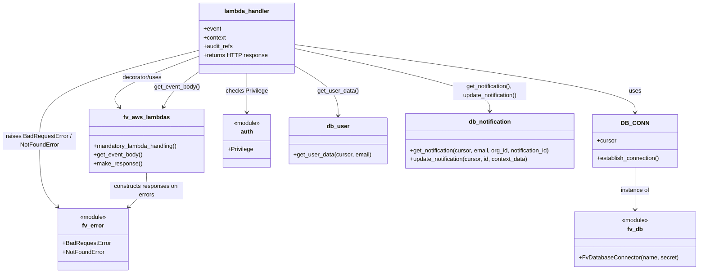

# Diagram: common/notification_service/notification_service/update_notification.py


> Auto-generated by Obscura crawlers

## Diagram 1



### SVG

<svg id="container" width="1920.068359375" xmlns="http://www.w3.org/2000/svg" class="classDiagram" height="746" viewBox="0 0 1920.068359375 746" role="graphics-document document" aria-roledescription="class"><style>#container{font-family:"trebuchet ms",verdana,arial,sans-serif;font-size:16px;fill:#333;}@keyframes edge-animation-frame{from{stroke-dashoffset:0;}}@keyframes dash{to{stroke-dashoffset:0;}}#container .edge-animation-slow{stroke-dasharray:9,5!important;stroke-dashoffset:900;animation:dash 50s linear infinite;stroke-linecap:round;}#container .edge-animation-fast{stroke-dasharray:9,5!important;stroke-dashoffset:900;animation:dash 20s linear infinite;stroke-linecap:round;}#container .error-icon{fill:#552222;}#container .error-text{fill:#552222;stroke:#552222;}#container .edge-thickness-normal{stroke-width:1px;}#container .edge-thickness-thick{stroke-width:3.5px;}#container .edge-pattern-solid{stroke-dasharray:0;}#container .edge-thickness-invisible{stroke-width:0;fill:none;}#container .edge-pattern-dashed{stroke-dasharray:3;}#container .edge-pattern-dotted{stroke-dasharray:2;}#container .marker{fill:#333333;stroke:#333333;}#container .marker.cross{stroke:#333333;}#container svg{font-family:"trebuchet ms",verdana,arial,sans-serif;font-size:16px;}#container p{margin:0;}#container g.classGroup text{fill:#9370DB;stroke:none;font-family:"trebuchet ms",verdana,arial,sans-serif;font-size:10px;}#container g.classGroup text .title{font-weight:bolder;}#container .nodeLabel,#container .edgeLabel{color:#131300;}#container .edgeLabel .label rect{fill:#ECECFF;}#container .label text{fill:#131300;}#container .labelBkg{background:#ECECFF;}#container .edgeLabel .label span{background:#ECECFF;}#container .classTitle{font-weight:bolder;}#container .node rect,#container .node circle,#container .node ellipse,#container .node polygon,#container .node path{fill:#ECECFF;stroke:#9370DB;stroke-width:1px;}#container .divider{stroke:#9370DB;stroke-width:1;}#container g.clickable{cursor:pointer;}#container g.classGroup rect{fill:#ECECFF;stroke:#9370DB;}#container g.classGroup line{stroke:#9370DB;stroke-width:1;}#container .classLabel .box{stroke:none;stroke-width:0;fill:#ECECFF;opacity:0.5;}#container .classLabel .label{fill:#9370DB;font-size:10px;}#container .relation{stroke:#333333;stroke-width:1;fill:none;}#container .dashed-line{stroke-dasharray:3;}#container .dotted-line{stroke-dasharray:1 2;}#container #compositionStart,#container .composition{fill:#333333!important;stroke:#333333!important;stroke-width:1;}#container #compositionEnd,#container .composition{fill:#333333!important;stroke:#333333!important;stroke-width:1;}#container #dependencyStart,#container .dependency{fill:#333333!important;stroke:#333333!important;stroke-width:1;}#container #dependencyStart,#container .dependency{fill:#333333!important;stroke:#333333!important;stroke-width:1;}#container #extensionStart,#container .extension{fill:transparent!important;stroke:#333333!important;stroke-width:1;}#container #extensionEnd,#container .extension{fill:transparent!important;stroke:#333333!important;stroke-width:1;}#container #aggregationStart,#container .aggregation{fill:transparent!important;stroke:#333333!important;stroke-width:1;}#container #aggregationEnd,#container .aggregation{fill:transparent!important;stroke:#333333!important;stroke-width:1;}#container #lollipopStart,#container .lollipop{fill:#ECECFF!important;stroke:#333333!important;stroke-width:1;}#container #lollipopEnd,#container .lollipop{fill:#ECECFF!important;stroke:#333333!important;stroke-width:1;}#container .edgeTerminals{font-size:11px;line-height:initial;}#container .classTitleText{text-anchor:middle;font-size:18px;fill:#333;}#container .label-icon{display:inline-block;height:1em;overflow:visible;vertical-align:-0.125em;}#container .node .label-icon path{fill:currentColor;stroke:revert;stroke-width:revert;}#container :root{--mermaid-font-family:"trebuchet ms",verdana,arial,sans-serif;}</style><g><defs><marker id="container_class-aggregationStart" class="marker aggregation class" refX="18" refY="7" markerWidth="190" markerHeight="240" orient="auto"><path d="M 18,7 L9,13 L1,7 L9,1 Z"></path></marker></defs><defs><marker id="container_class-aggregationEnd" class="marker aggregation class" refX="1" refY="7" markerWidth="20" markerHeight="28" orient="auto"><path d="M 18,7 L9,13 L1,7 L9,1 Z"></path></marker></defs><defs><marker id="container_class-extensionStart" class="marker extension class" refX="18" refY="7" markerWidth="190" markerHeight="240" orient="auto"><path d="M 1,7 L18,13 V 1 Z"></path></marker></defs><defs><marker id="container_class-extensionEnd" class="marker extension class" refX="1" refY="7" markerWidth="20" markerHeight="28" orient="auto"><path d="M 1,1 V 13 L18,7 Z"></path></marker></defs><defs><marker id="container_class-compositionStart" class="marker composition class" refX="18" refY="7" markerWidth="190" markerHeight="240" orient="auto"><path d="M 18,7 L9,13 L1,7 L9,1 Z"></path></marker></defs><defs><marker id="container_class-compositionEnd" class="marker composition class" refX="1" refY="7" markerWidth="20" markerHeight="28" orient="auto"><path d="M 18,7 L9,13 L1,7 L9,1 Z"></path></marker></defs><defs><marker id="container_class-dependencyStart" class="marker dependency class" refX="6" refY="7" markerWidth="190" markerHeight="240" orient="auto"><path d="M 5,7 L9,13 L1,7 L9,1 Z"></path></marker></defs><defs><marker id="container_class-dependencyEnd" class="marker dependency class" refX="13" refY="7" markerWidth="20" markerHeight="28" orient="auto"><path d="M 18,7 L9,13 L14,7 L9,1 Z"></path></marker></defs><defs><marker id="container_class-lollipopStart" class="marker lollipop class" refX="13" refY="7" markerWidth="190" markerHeight="240" orient="auto"><circle stroke="black" fill="transparent" cx="7" cy="7" r="6"></circle></marker></defs><defs><marker id="container_class-lollipopEnd" class="marker lollipop class" refX="1" refY="7" markerWidth="190" markerHeight="240" orient="auto"><circle stroke="black" fill="transparent" cx="7" cy="7" r="6"></circle></marker></defs><g class="root"><g class="clusters"></g><g class="edgePaths"><path d="M549.127,152.204L506.287,168.336C463.447,184.469,377.766,216.735,340.845,240.254C303.924,263.773,315.762,278.545,321.681,285.932L327.6,293.318" id="id_lambda_handler_fv_aws_lambdas_1" class="edge-thickness-normal edge-pattern-solid relation" style=";;;" data-edge="true" data-et="edge" data-id="id_lambda_handler_fv_aws_lambdas_1" data-points="W3sieCI6NTQ5LjEyNjk1MzEyNSwieSI6MTUyLjIwMzYzODk4Mjg3MDN9LHsieCI6MjkyLjA4NTkzNzUsInkiOjI0OX0seyJ4IjozMzEuMzUyMzY2NzI3OTQxMTYsInkiOjI5OH1d" marker-end="url(#container_class-dependencyEnd)"></path><path d="M677.131,200L677.131,208.167C677.131,216.333,677.131,232.667,677.131,250.5C677.131,268.333,677.131,287.667,677.131,297.333L677.131,307" id="id_lambda_handler_auth_2" class="edge-thickness-normal edge-pattern-solid relation" style=";;;" data-edge="true" data-et="edge" data-id="id_lambda_handler_auth_2" data-points="W3sieCI6Njc3LjEzMDg1OTM3NSwieSI6MjAwfSx7IngiOjY3Ny4xMzA4NTkzNzUsInkiOjI0OX0seyJ4Ijo2NzcuMTMwODU5Mzc1LCJ5IjozMTN9XQ==" marker-end="url(#container_class-dependencyEnd)"></path><path d="M805.135,121.332L962.286,142.61C1119.437,163.888,1433.739,206.444,1590.89,237.389C1748.041,268.333,1748.041,287.667,1748.041,297.333L1748.041,307" id="id_lambda_handler_DB_CONN_3" class="edge-thickness-normal edge-pattern-solid relation" style=";;;" data-edge="true" data-et="edge" data-id="id_lambda_handler_DB_CONN_3" data-points="W3sieCI6ODA1LjEzNDc2NTYyNSwieSI6MTIxLjMzMTU4MTI3MDMxMjU3fSx7IngiOjE3NDguMDQxMDE1NjI1LCJ5IjoyNDl9LHsieCI6MTc0OC4wNDEwMTU2MjUsInkiOjMxM31d" marker-end="url(#container_class-dependencyEnd)"></path><path d="M1748.041,457L1748.041,467.667C1748.041,478.333,1748.041,499.667,1748.041,519C1748.041,538.333,1748.041,555.667,1748.041,564.333L1748.041,573" id="id_DB_CONN_fv_db_4" class="edge-thickness-normal edge-pattern-solid relation" style=";;;" data-edge="true" data-et="edge" data-id="id_DB_CONN_fv_db_4" data-points="W3sieCI6MTc0OC4wNDEwMTU2MjUsInkiOjQ1N30seyJ4IjoxNzQ4LjA0MTAxNTYyNSwieSI6NTIxfSx7IngiOjE3NDguMDQxMDE1NjI1LCJ5Ijo1Nzl9XQ==" marker-end="url(#container_class-dependencyEnd)"></path><path d="M549.127,193.647L535.954,202.872C522.781,212.098,496.436,230.549,479.571,247.049C462.706,263.55,455.322,278.1,451.63,285.375L447.938,292.65" id="id_lambda_handler_fv_aws_lambdas_5" class="edge-thickness-normal edge-pattern-solid relation" style=";;;" data-edge="true" data-et="edge" data-id="id_lambda_handler_fv_aws_lambdas_5" data-points="W3sieCI6NTQ5LjEyNjk1MzEyNSwieSI6MTkzLjY0NjgwOTExMjc3Nzd9LHsieCI6NDcwLjA4OTg0Mzc1LCJ5IjoyNDl9LHsieCI6NDQ1LjIyMjUxMjYzNzg2NzYsInkiOjI5OH1d" marker-end="url(#container_class-dependencyEnd)"></path><path d="M805.135,178.68L825.223,190.4C845.312,202.12,885.489,225.56,905.577,248.447C925.666,271.333,925.666,293.667,925.666,304.833L925.666,316" id="id_lambda_handler_db_user_6" class="edge-thickness-normal edge-pattern-solid relation" style=";;;" data-edge="true" data-et="edge" data-id="id_lambda_handler_db_user_6" data-points="W3sieCI6ODA1LjEzNDc2NTYyNSwieSI6MTc4LjY3OTg0MjgyOTA3NjYyfSx7IngiOjkyNS42NjYwMTU2MjUsInkiOjI0OX0seyJ4Ijo5MjUuNjY2MDE1NjI1LCJ5IjozMjJ9XQ==" marker-end="url(#container_class-dependencyEnd)"></path><path d="M805.135,131.769L895.198,151.308C985.261,170.846,1165.387,209.923,1255.451,238.628C1345.514,267.333,1345.514,285.667,1345.514,294.833L1345.514,304" id="id_lambda_handler_db_notification_7" class="edge-thickness-normal edge-pattern-solid relation" style=";;;" data-edge="true" data-et="edge" data-id="id_lambda_handler_db_notification_7" data-points="W3sieCI6ODA1LjEzNDc2NTYyNSwieSI6MTMxLjc2OTM2NTE4ODgzMDN9LHsieCI6MTM0NS41MTM2NzE4NzUsInkiOjI0OX0seyJ4IjoxMzQ1LjUxMzY3MTg3NSwieSI6MzEwfV0=" marker-end="url(#container_class-dependencyEnd)"></path><path d="M549.127,136.612L475.606,155.343C402.085,174.075,255.042,211.537,181.521,252.935C108,294.333,108,339.667,108,385C108,430.333,108,475.667,116.257,505.828C124.515,535.989,141.029,550.978,149.286,558.473L157.544,565.968" id="id_lambda_handler_fv_error_8" class="edge-thickness-normal edge-pattern-solid relation" style=";;;" data-edge="true" data-et="edge" data-id="id_lambda_handler_fv_error_8" data-points="W3sieCI6NTQ5LjEyNjk1MzEyNSwieSI6MTM2LjYxMjEyNDQzNTkwMzE2fSx7IngiOjEwOCwieSI6MjQ5fSx7IngiOjEwOCwieSI6Mzg1fSx7IngiOjEwOCwieSI6NTIxfSx7IngiOjE2MS45ODY2MzY1MTMxNTc5LCJ5Ijo1NzB9XQ==" marker-end="url(#container_class-dependencyEnd)"></path><path d="M401.07,472L401.07,480.167C401.07,488.333,401.07,504.667,392.813,520.328C384.556,535.989,368.041,550.978,359.784,558.473L351.527,565.968" id="id_fv_aws_lambdas_fv_error_9" class="edge-thickness-normal edge-pattern-solid relation" style=";;;" data-edge="true" data-et="edge" data-id="id_fv_aws_lambdas_fv_error_9" data-points="W3sieCI6NDAxLjA3MDMxMjUsInkiOjQ3Mn0seyJ4Ijo0MDEuMDcwMzEyNSwieSI6NTIxfSx7IngiOjM0Ny4wODM2NzU5ODY4NDIxLCJ5Ijo1NzB9XQ==" marker-end="url(#container_class-dependencyEnd)"></path></g><g class="edgeLabels"><g class="edgeLabel" transform="translate(391.22468, 211.66639)"><g class="label" data-id="id_lambda_handler_fv_aws_lambdas_1" transform="translate(-55.1015625, -12)"><foreignObject width="110.203125" height="24"><div xmlns="http://www.w3.org/1999/xhtml" class="labelBkg" style="display: table-cell; white-space: nowrap; line-height: 1.5; max-width: 200px; text-align: center;"><span class="edgeLabel"><p>decorator/uses</p></span></div></foreignObject></g></g><g class="edgeLabel" transform="translate(677.130859375, 249)"><g class="label" data-id="id_lambda_handler_auth_2" transform="translate(-57.6953125, -12)"><foreignObject width="115.390625" height="24"><div xmlns="http://www.w3.org/1999/xhtml" class="labelBkg" style="display: table-cell; white-space: nowrap; line-height: 1.5; max-width: 200px; text-align: center;"><span class="edgeLabel"><p>checks Privilege</p></span></div></foreignObject></g></g><g class="edgeLabel" transform="translate(1748.041015625, 249)"><g class="label" data-id="id_lambda_handler_DB_CONN_3" transform="translate(-16.4921875, -12)"><foreignObject width="32.984375" height="24"><div xmlns="http://www.w3.org/1999/xhtml" class="labelBkg" style="display: table-cell; white-space: nowrap; line-height: 1.5; max-width: 200px; text-align: center;"><span class="edgeLabel"><p>uses</p></span></div></foreignObject></g></g><g class="edgeLabel" transform="translate(1748.041015625, 521)"><g class="label" data-id="id_DB_CONN_fv_db_4" transform="translate(-40.0546875, -12)"><foreignObject width="80.109375" height="24"><div xmlns="http://www.w3.org/1999/xhtml" class="labelBkg" style="display: table-cell; white-space: nowrap; line-height: 1.5; max-width: 200px; text-align: center;"><span class="edgeLabel"><p>instance of</p></span></div></foreignObject></g></g><g class="edgeLabel" transform="translate(487.10408, 237.08417)"><g class="label" data-id="id_lambda_handler_fv_aws_lambdas_5" transform="translate(-62.9375, -12)"><foreignObject width="125.875" height="24"><div xmlns="http://www.w3.org/1999/xhtml" class="labelBkg" style="display: table-cell; white-space: nowrap; line-height: 1.5; max-width: 200px; text-align: center;"><span class="edgeLabel"><p>get_event_body()</p></span></div></foreignObject></g></g><g class="edgeLabel" transform="translate(925.666015625, 249)"><g class="label" data-id="id_lambda_handler_db_user_6" transform="translate(-55.984375, -12)"><foreignObject width="111.96875" height="24"><div xmlns="http://www.w3.org/1999/xhtml" class="labelBkg" style="display: table-cell; white-space: nowrap; line-height: 1.5; max-width: 200px; text-align: center;"><span class="edgeLabel"><p>get_user_data()</p></span></div></foreignObject></g></g><g class="edgeLabel" transform="translate(1345.513671875, 249)"><g class="label" data-id="id_lambda_handler_db_notification_7" transform="translate(-100, -24)"><foreignObject width="200" height="48"><div xmlns="http://www.w3.org/1999/xhtml" class="labelBkg" style="display: table; white-space: break-spaces; line-height: 1.5; max-width: 200px; text-align: center; width: 200px;"><span class="edgeLabel"><p>get_notification(), update_notification()</p></span></div></foreignObject></g></g><g class="edgeLabel" transform="translate(108, 385)"><g class="label" data-id="id_lambda_handler_fv_error_8" transform="translate(-100, -24)"><foreignObject width="200" height="48"><div xmlns="http://www.w3.org/1999/xhtml" class="labelBkg" style="display: table; white-space: break-spaces; line-height: 1.5; max-width: 200px; text-align: center; width: 200px;"><span class="edgeLabel"><p>raises BadRequestError / NotFoundError</p></span></div></foreignObject></g></g><g class="edgeLabel" transform="translate(401.0703125, 521)"><g class="label" data-id="id_fv_aws_lambdas_fv_error_9" transform="translate(-100, -24)"><foreignObject width="200" height="48"><div xmlns="http://www.w3.org/1999/xhtml" class="labelBkg" style="display: table; white-space: break-spaces; line-height: 1.5; max-width: 200px; text-align: center; width: 200px;"><span class="edgeLabel"><p>constructs responses on errors</p></span></div></foreignObject></g></g></g><g class="nodes"><g class="node default" id="classId-lambda_handler-0" transform="translate(677.130859375, 104)"><g class="basic label-container"><path d="M-128.00390625 -96 L128.00390625 -96 L128.00390625 96 L-128.00390625 96" stroke="none" stroke-width="0" fill="#ECECFF" style=""></path><path d="M-128.00390625 -96 C-53.420353532137185 -96, 21.16319918572563 -96, 128.00390625 -96 M-128.00390625 -96 C-53.05968480129307 -96, 21.884536647413853 -96, 128.00390625 -96 M128.00390625 -96 C128.00390625 -52.572209426552845, 128.00390625 -9.144418853105691, 128.00390625 96 M128.00390625 -96 C128.00390625 -32.06607017061533, 128.00390625 31.867859658769333, 128.00390625 96 M128.00390625 96 C68.07507838621439 96, 8.146250522428787 96, -128.00390625 96 M128.00390625 96 C43.56494647729387 96, -40.874013295412254 96, -128.00390625 96 M-128.00390625 96 C-128.00390625 20.145041785914984, -128.00390625 -55.70991642817003, -128.00390625 -96 M-128.00390625 96 C-128.00390625 35.73320464686026, -128.00390625 -24.533590706279483, -128.00390625 -96" stroke="#9370DB" stroke-width="1.3" fill="none" stroke-dasharray="0 0" style=""></path></g><g class="annotation-group text" transform="translate(0, -72)"></g><g class="label-group text" transform="translate(-59.9765625, -72)"><g class="label" style="font-weight: bolder" transform="translate(0,-12)"><foreignObject width="119.953125" height="24"><div xmlns="http://www.w3.org/1999/xhtml" style="display: table-cell; white-space: nowrap; line-height: 1.5; max-width: 170px; text-align: center;"><span class="nodeLabel markdown-node-label" style=""><p>lambda_handler</p></span></div></foreignObject></g></g><g class="members-group text" transform="translate(-116.00390625, -24)"><g class="label" style="" transform="translate(0,-12)"><foreignObject width="48.328125" height="24"><div xmlns="http://www.w3.org/1999/xhtml" style="display: table-cell; white-space: nowrap; line-height: 1.5; max-width: 106px; text-align: center;"><span class="nodeLabel markdown-node-label" style=""><p>+event</p></span></div></foreignObject></g><g class="label" style="" transform="translate(0,12)"><foreignObject width="61.6875" height="24"><div xmlns="http://www.w3.org/1999/xhtml" style="display: table-cell; white-space: nowrap; line-height: 1.5; max-width: 119px; text-align: center;"><span class="nodeLabel markdown-node-label" style=""><p>+context</p></span></div></foreignObject></g><g class="label" style="" transform="translate(0,36)"><foreignObject width="81.109375" height="24"><div xmlns="http://www.w3.org/1999/xhtml" style="display: table-cell; white-space: nowrap; line-height: 1.5; max-width: 138px; text-align: center;"><span class="nodeLabel markdown-node-label" style=""><p>+audit_refs</p></span></div></foreignObject></g><g class="label" style="" transform="translate(0,60)"><foreignObject width="172.03125" height="24"><div xmlns="http://www.w3.org/1999/xhtml" style="display: table-cell; white-space: nowrap; line-height: 1.5; max-width: 229px; text-align: center;"><span class="nodeLabel markdown-node-label" style=""><p>+returns HTTP response</p></span></div></foreignObject></g></g><g class="methods-group text" transform="translate(-116.00390625, 96)"></g><g class="divider" style=""><path d="M-128.00390625 -48 C-52.24779342925997 -48, 23.508319391480057 -48, 128.00390625 -48 M-128.00390625 -48 C-52.242750202737724 -48, 23.51840584452455 -48, 128.00390625 -48" stroke="#9370DB" stroke-width="1.3" fill="none" stroke-dasharray="0 0" style=""></path></g><g class="divider" style=""><path d="M-128.00390625 72 C-61.68298011449875 72, 4.637946021002506 72, 128.00390625 72 M-128.00390625 72 C-75.69456574905253 72, -23.38522524810506 72, 128.00390625 72" stroke="#9370DB" stroke-width="1.3" fill="none" stroke-dasharray="0 0" style=""></path></g></g><g class="node default" id="classId-DB_CONN-1" transform="translate(1748.041015625, 385)"><g class="basic label-container"><path d="M-115.8359375 -72 L115.8359375 -72 L115.8359375 72 L-115.8359375 72" stroke="none" stroke-width="0" fill="#ECECFF" style=""></path><path d="M-115.8359375 -72 C-67.32434610479386 -72, -18.812754709587722 -72, 115.8359375 -72 M-115.8359375 -72 C-65.58406563791542 -72, -15.33219377583083 -72, 115.8359375 -72 M115.8359375 -72 C115.8359375 -28.07786212397535, 115.8359375 15.844275752049299, 115.8359375 72 M115.8359375 -72 C115.8359375 -40.91605861081787, 115.8359375 -9.832117221635741, 115.8359375 72 M115.8359375 72 C26.303501110149853 72, -63.228935279700295 72, -115.8359375 72 M115.8359375 72 C57.639018042173646 72, -0.557901415652708 72, -115.8359375 72 M-115.8359375 72 C-115.8359375 38.859053492095754, -115.8359375 5.7181069841915075, -115.8359375 -72 M-115.8359375 72 C-115.8359375 40.69269207340073, -115.8359375 9.385384146801456, -115.8359375 -72" stroke="#9370DB" stroke-width="1.3" fill="none" stroke-dasharray="0 0" style=""></path></g><g class="annotation-group text" transform="translate(0, -48)"></g><g class="label-group text" transform="translate(-34.40625, -48)"><g class="label" style="font-weight: bolder" transform="translate(0,-12)"><foreignObject width="68.8125" height="24"><div xmlns="http://www.w3.org/1999/xhtml" style="display: table-cell; white-space: nowrap; line-height: 1.5; max-width: 119px; text-align: center;"><span class="nodeLabel markdown-node-label" style=""><p>DB_CONN</p></span></div></foreignObject></g></g><g class="members-group text" transform="translate(-103.8359375, 0)"><g class="label" style="" transform="translate(0,-12)"><foreignObject width="53.71875" height="24"><div xmlns="http://www.w3.org/1999/xhtml" style="display: table-cell; white-space: nowrap; line-height: 1.5; max-width: 112px; text-align: center;"><span class="nodeLabel markdown-node-label" style=""><p>+cursor</p></span></div></foreignObject></g></g><g class="methods-group text" transform="translate(-103.8359375, 48)"><g class="label" style="" transform="translate(0,-12)"><foreignObject width="173.265625" height="24"><div xmlns="http://www.w3.org/1999/xhtml" style="display: table-cell; white-space: nowrap; line-height: 1.5; max-width: 231px; text-align: center;"><span class="nodeLabel markdown-node-label" style=""><p>+establish_connection()</p></span></div></foreignObject></g></g><g class="divider" style=""><path d="M-115.8359375 -24 C-32.26914726214555 -24, 51.2976429757089 -24, 115.8359375 -24 M-115.8359375 -24 C-47.17161022255945 -24, 21.492717054881098 -24, 115.8359375 -24" stroke="#9370DB" stroke-width="1.3" fill="none" stroke-dasharray="0 0" style=""></path></g><g class="divider" style=""><path d="M-115.8359375 24 C-27.629771898730112 24, 60.576393702539775 24, 115.8359375 24 M-115.8359375 24 C-36.66933143200795 24, 42.4972746359841 24, 115.8359375 24" stroke="#9370DB" stroke-width="1.3" fill="none" stroke-dasharray="0 0" style=""></path></g></g><g class="node default" id="classId-fv_aws_lambdas-2" transform="translate(401.0703125, 385)"><g class="basic label-container"><path d="M-158.0703125 -87 L158.0703125 -87 L158.0703125 87 L-158.0703125 87" stroke="none" stroke-width="0" fill="#ECECFF" style=""></path><path d="M-158.0703125 -87 C-58.76738391978195 -87, 40.5355446604361 -87, 158.0703125 -87 M-158.0703125 -87 C-32.93473959511229 -87, 92.20083330977542 -87, 158.0703125 -87 M158.0703125 -87 C158.0703125 -48.342884154771674, 158.0703125 -9.685768309543349, 158.0703125 87 M158.0703125 -87 C158.0703125 -43.61203955627063, 158.0703125 -0.22407911254126134, 158.0703125 87 M158.0703125 87 C75.92574000025031 87, -6.218832499499371 87, -158.0703125 87 M158.0703125 87 C34.763424313766706 87, -88.54346387246659 87, -158.0703125 87 M-158.0703125 87 C-158.0703125 39.27051366314868, -158.0703125 -8.458972673702647, -158.0703125 -87 M-158.0703125 87 C-158.0703125 39.05682481042436, -158.0703125 -8.886350379151281, -158.0703125 -87" stroke="#9370DB" stroke-width="1.3" fill="none" stroke-dasharray="0 0" style=""></path></g><g class="annotation-group text" transform="translate(0, -63)"></g><g class="label-group text" transform="translate(-60.0625, -63)"><g class="label" style="font-weight: bolder" transform="translate(0,-12)"><foreignObject width="120.125" height="24"><div xmlns="http://www.w3.org/1999/xhtml" style="display: table-cell; white-space: nowrap; line-height: 1.5; max-width: 168px; text-align: center;"><span class="nodeLabel markdown-node-label" style=""><p>fv_aws_lambdas</p></span></div></foreignObject></g></g><g class="members-group text" transform="translate(-146.0703125, -15)"></g><g class="methods-group text" transform="translate(-146.0703125, 15)"><g class="label" style="" transform="translate(0,-12)"><foreignObject width="232.078125" height="24"><div xmlns="http://www.w3.org/1999/xhtml" style="display: table-cell; white-space: nowrap; line-height: 1.5; max-width: 289px; text-align: center;"><span class="nodeLabel markdown-node-label" style=""><p>+mandatory_lambda_handling()</p></span></div></foreignObject></g><g class="label" style="" transform="translate(0,12)"><foreignObject width="133.859375" height="24"><div xmlns="http://www.w3.org/1999/xhtml" style="display: table-cell; white-space: nowrap; line-height: 1.5; max-width: 191px; text-align: center;"><span class="nodeLabel markdown-node-label" style=""><p>+get_event_body()</p></span></div></foreignObject></g><g class="label" style="" transform="translate(0,36)"><foreignObject width="131.84375" height="24"><div xmlns="http://www.w3.org/1999/xhtml" style="display: table-cell; white-space: nowrap; line-height: 1.5; max-width: 189px; text-align: center;"><span class="nodeLabel markdown-node-label" style=""><p>+make_response()</p></span></div></foreignObject></g></g><g class="divider" style=""><path d="M-158.0703125 -39 C-36.649545010283944 -39, 84.77122247943211 -39, 158.0703125 -39 M-158.0703125 -39 C-77.46682865902918 -39, 3.1366551819416486 -39, 158.0703125 -39" stroke="#9370DB" stroke-width="1.3" fill="none" stroke-dasharray="0 0" style=""></path></g><g class="divider" style=""><path d="M-158.0703125 -15 C-43.36268802925663 -15, 71.34493644148674 -15, 158.0703125 -15 M-158.0703125 -15 C-48.8975624487839 -15, 60.2751876024322 -15, 158.0703125 -15" stroke="#9370DB" stroke-width="1.3" fill="none" stroke-dasharray="0 0" style=""></path></g></g><g class="node default" id="classId-auth-3" transform="translate(677.130859375, 385)"><g class="basic label-container"><path d="M-65.37890625 -72 L65.37890625 -72 L65.37890625 72 L-65.37890625 72" stroke="none" stroke-width="0" fill="#ECECFF" style=""></path><path d="M-65.37890625 -72 C-34.732246272411004 -72, -4.085586294822015 -72, 65.37890625 -72 M-65.37890625 -72 C-36.833056842250585 -72, -8.287207434501163 -72, 65.37890625 -72 M65.37890625 -72 C65.37890625 -32.560354137095, 65.37890625 6.879291725810006, 65.37890625 72 M65.37890625 -72 C65.37890625 -19.666336520738575, 65.37890625 32.66732695852285, 65.37890625 72 M65.37890625 72 C35.85210617016212 72, 6.325306090324247 72, -65.37890625 72 M65.37890625 72 C29.412185845947704 72, -6.554534558104592 72, -65.37890625 72 M-65.37890625 72 C-65.37890625 17.014925142282827, -65.37890625 -37.970149715434346, -65.37890625 -72 M-65.37890625 72 C-65.37890625 15.632152470836026, -65.37890625 -40.73569505832795, -65.37890625 -72" stroke="#9370DB" stroke-width="1.3" fill="none" stroke-dasharray="0 0" style=""></path></g><g class="annotation-group text" transform="translate(-36.6015625, -48)"><g class="label" style="" transform="translate(0,-12)"><foreignObject width="73.203125" height="24"><div xmlns="http://www.w3.org/1999/xhtml" style="display: table-cell; white-space: nowrap; line-height: 1.5; max-width: 123px; text-align: center;"><span class="nodeLabel markdown-node-label" style=""><p>«module»</p></span></div></foreignObject></g></g><g class="label-group text" transform="translate(-16.6640625, -24)"><g class="label" style="font-weight: bolder" transform="translate(0,-12)"><foreignObject width="33.328125" height="24"><div xmlns="http://www.w3.org/1999/xhtml" style="display: table-cell; white-space: nowrap; line-height: 1.5; max-width: 83px; text-align: center;"><span class="nodeLabel markdown-node-label" style=""><p>auth</p></span></div></foreignObject></g></g><g class="members-group text" transform="translate(-53.37890625, 24)"><g class="label" style="" transform="translate(0,-12)"><foreignObject width="70.15625" height="24"><div xmlns="http://www.w3.org/1999/xhtml" style="display: table-cell; white-space: nowrap; line-height: 1.5; max-width: 128px; text-align: center;"><span class="nodeLabel markdown-node-label" style=""><p>+Privilege</p></span></div></foreignObject></g></g><g class="methods-group text" transform="translate(-53.37890625, 72)"></g><g class="divider" style=""><path d="M-65.37890625 0 C-34.56649914929618 0, -3.754092048592355 0, 65.37890625 0 M-65.37890625 0 C-13.088496655153662 0, 39.201912939692676 0, 65.37890625 0" stroke="#9370DB" stroke-width="1.3" fill="none" stroke-dasharray="0 0" style=""></path></g><g class="divider" style=""><path d="M-65.37890625 48 C-35.164476945463164 48, -4.950047640926336 48, 65.37890625 48 M-65.37890625 48 C-20.921631090492 48, 23.535644069016 48, 65.37890625 48" stroke="#9370DB" stroke-width="1.3" fill="none" stroke-dasharray="0 0" style=""></path></g></g><g class="node default" id="classId-db_user-4" transform="translate(925.666015625, 385)"><g class="basic label-container"><path d="M-133.15625 -63 L133.15625 -63 L133.15625 63 L-133.15625 63" stroke="none" stroke-width="0" fill="#ECECFF" style=""></path><path d="M-133.15625 -63 C-70.00216738169084 -63, -6.848084763381678 -63, 133.15625 -63 M-133.15625 -63 C-43.27960342450827 -63, 46.59704315098347 -63, 133.15625 -63 M133.15625 -63 C133.15625 -21.578008790255176, 133.15625 19.84398241948965, 133.15625 63 M133.15625 -63 C133.15625 -18.04952657865519, 133.15625 26.90094684268962, 133.15625 63 M133.15625 63 C72.82396908311688 63, 12.491688166233757 63, -133.15625 63 M133.15625 63 C78.57018942370426 63, 23.984128847408527 63, -133.15625 63 M-133.15625 63 C-133.15625 16.09336901881519, -133.15625 -30.813261962369623, -133.15625 -63 M-133.15625 63 C-133.15625 23.475286639385864, -133.15625 -16.049426721228272, -133.15625 -63" stroke="#9370DB" stroke-width="1.3" fill="none" stroke-dasharray="0 0" style=""></path></g><g class="annotation-group text" transform="translate(0, -39)"></g><g class="label-group text" transform="translate(-29.484375, -39)"><g class="label" style="font-weight: bolder" transform="translate(0,-12)"><foreignObject width="58.96875" height="24"><div xmlns="http://www.w3.org/1999/xhtml" style="display: table-cell; white-space: nowrap; line-height: 1.5; max-width: 109px; text-align: center;"><span class="nodeLabel markdown-node-label" style=""><p>db_user</p></span></div></foreignObject></g></g><g class="members-group text" transform="translate(-121.15625, 9)"></g><g class="methods-group text" transform="translate(-121.15625, 39)"><g class="label" style="" transform="translate(0,-12)"><foreignObject width="212.828125" height="24"><div xmlns="http://www.w3.org/1999/xhtml" style="display: table-cell; white-space: nowrap; line-height: 1.5; max-width: 270px; text-align: center;"><span class="nodeLabel markdown-node-label" style=""><p>+get_user_data(cursor, email)</p></span></div></foreignObject></g></g><g class="divider" style=""><path d="M-133.15625 -15 C-70.25547047206805 -15, -7.354690944136095 -15, 133.15625 -15 M-133.15625 -15 C-47.98259217524699 -15, 37.191065649506015 -15, 133.15625 -15" stroke="#9370DB" stroke-width="1.3" fill="none" stroke-dasharray="0 0" style=""></path></g><g class="divider" style=""><path d="M-133.15625 9 C-37.026354328799385 9, 59.10354134240123 9, 133.15625 9 M-133.15625 9 C-37.751134665182434 9, 57.65398066963513 9, 133.15625 9" stroke="#9370DB" stroke-width="1.3" fill="none" stroke-dasharray="0 0" style=""></path></g></g><g class="node default" id="classId-db_notification-5" transform="translate(1345.513671875, 385)"><g class="basic label-container"><path d="M-236.69140625 -75 L236.69140625 -75 L236.69140625 75 L-236.69140625 75" stroke="none" stroke-width="0" fill="#ECECFF" style=""></path><path d="M-236.69140625 -75 C-126.16088982576876 -75, -15.630373401537526 -75, 236.69140625 -75 M-236.69140625 -75 C-63.329057816714766 -75, 110.03329061657047 -75, 236.69140625 -75 M236.69140625 -75 C236.69140625 -33.86911117426847, 236.69140625 7.261777651463063, 236.69140625 75 M236.69140625 -75 C236.69140625 -24.359740184059902, 236.69140625 26.280519631880196, 236.69140625 75 M236.69140625 75 C79.73513834439723 75, -77.22112956120554 75, -236.69140625 75 M236.69140625 75 C78.48789428552828 75, -79.71561767894343 75, -236.69140625 75 M-236.69140625 75 C-236.69140625 26.92585828861811, -236.69140625 -21.148283422763782, -236.69140625 -75 M-236.69140625 75 C-236.69140625 23.72705966873273, -236.69140625 -27.545880662534543, -236.69140625 -75" stroke="#9370DB" stroke-width="1.3" fill="none" stroke-dasharray="0 0" style=""></path></g><g class="annotation-group text" transform="translate(0, -51)"></g><g class="label-group text" transform="translate(-55.7734375, -51)"><g class="label" style="font-weight: bolder" transform="translate(0,-12)"><foreignObject width="111.546875" height="24"><div xmlns="http://www.w3.org/1999/xhtml" style="display: table-cell; white-space: nowrap; line-height: 1.5; max-width: 160px; text-align: center;"><span class="nodeLabel markdown-node-label" style=""><p>db_notification</p></span></div></foreignObject></g></g><g class="members-group text" transform="translate(-224.69140625, -3)"></g><g class="methods-group text" transform="translate(-224.69140625, 27)"><g class="label" style="" transform="translate(0,-12)"><foreignObject width="393.609375" height="24"><div xmlns="http://www.w3.org/1999/xhtml" style="display: table-cell; white-space: nowrap; line-height: 1.5; max-width: 451px; text-align: center;"><span class="nodeLabel markdown-node-label" style=""><p>+get_notification(cursor, email, org_id, notification_id)</p></span></div></foreignObject></g><g class="label" style="" transform="translate(0,12)"><foreignObject width="330.140625" height="24"><div xmlns="http://www.w3.org/1999/xhtml" style="display: table-cell; white-space: nowrap; line-height: 1.5; max-width: 388px; text-align: center;"><span class="nodeLabel markdown-node-label" style=""><p>+update_notification(cursor, id, context_data)</p></span></div></foreignObject></g></g><g class="divider" style=""><path d="M-236.69140625 -27 C-56.298201477338324 -27, 124.09500329532335 -27, 236.69140625 -27 M-236.69140625 -27 C-94.41727793268095 -27, 47.85685038463811 -27, 236.69140625 -27" stroke="#9370DB" stroke-width="1.3" fill="none" stroke-dasharray="0 0" style=""></path></g><g class="divider" style=""><path d="M-236.69140625 -3 C-131.30233325789143 -3, -25.913260265782867 -3, 236.69140625 -3 M-236.69140625 -3 C-134.9065544568747 -3, -33.121702663749375 -3, 236.69140625 -3" stroke="#9370DB" stroke-width="1.3" fill="none" stroke-dasharray="0 0" style=""></path></g></g><g class="node default" id="classId-fv_db-6" transform="translate(1748.041015625, 654)"><g class="basic label-container"><path d="M-164.02734375 -75 L164.02734375 -75 L164.02734375 75 L-164.02734375 75" stroke="none" stroke-width="0" fill="#ECECFF" style=""></path><path d="M-164.02734375 -75 C-61.608916400506246 -75, 40.80951094898751 -75, 164.02734375 -75 M-164.02734375 -75 C-46.52957541826629 -75, 70.96819291346742 -75, 164.02734375 -75 M164.02734375 -75 C164.02734375 -21.767267128907342, 164.02734375 31.465465742185316, 164.02734375 75 M164.02734375 -75 C164.02734375 -34.71722419787475, 164.02734375 5.565551604250501, 164.02734375 75 M164.02734375 75 C60.3352322099513 75, -43.3568793300974 75, -164.02734375 75 M164.02734375 75 C58.97673359371615 75, -46.073876562567705 75, -164.02734375 75 M-164.02734375 75 C-164.02734375 16.976456098691884, -164.02734375 -41.04708780261623, -164.02734375 -75 M-164.02734375 75 C-164.02734375 16.057168419499995, -164.02734375 -42.88566316100001, -164.02734375 -75" stroke="#9370DB" stroke-width="1.3" fill="none" stroke-dasharray="0 0" style=""></path></g><g class="annotation-group text" transform="translate(-36.6015625, -51)"><g class="label" style="" transform="translate(0,-12)"><foreignObject width="73.203125" height="24"><div xmlns="http://www.w3.org/1999/xhtml" style="display: table-cell; white-space: nowrap; line-height: 1.5; max-width: 123px; text-align: center;"><span class="nodeLabel markdown-node-label" style=""><p>«module»</p></span></div></foreignObject></g></g><g class="label-group text" transform="translate(-20.2890625, -27)"><g class="label" style="font-weight: bolder" transform="translate(0,-12)"><foreignObject width="40.578125" height="24"><div xmlns="http://www.w3.org/1999/xhtml" style="display: table-cell; white-space: nowrap; line-height: 1.5; max-width: 90px; text-align: center;"><span class="nodeLabel markdown-node-label" style=""><p>fv_db</p></span></div></foreignObject></g></g><g class="members-group text" transform="translate(-152.02734375, 21)"></g><g class="methods-group text" transform="translate(-152.02734375, 51)"><g class="label" style="" transform="translate(0,-12)"><foreignObject width="267.453125" height="24"><div xmlns="http://www.w3.org/1999/xhtml" style="display: table-cell; white-space: nowrap; line-height: 1.5; max-width: 325px; text-align: center;"><span class="nodeLabel markdown-node-label" style=""><p>+FvDatabaseConnector(name, secret)</p></span></div></foreignObject></g></g><g class="divider" style=""><path d="M-164.02734375 -3 C-40.938949302700706 -3, 82.14944514459859 -3, 164.02734375 -3 M-164.02734375 -3 C-50.62564532499033 -3, 62.77605310001934 -3, 164.02734375 -3" stroke="#9370DB" stroke-width="1.3" fill="none" stroke-dasharray="0 0" style=""></path></g><g class="divider" style=""><path d="M-164.02734375 21 C-78.72398805411041 21, 6.579367641779186 21, 164.02734375 21 M-164.02734375 21 C-73.10865698305851 21, 17.81002978388298 21, 164.02734375 21" stroke="#9370DB" stroke-width="1.3" fill="none" stroke-dasharray="0 0" style=""></path></g></g><g class="node default" id="classId-fv_error-7" transform="translate(254.53515625, 654)"><g class="basic label-container"><path d="M-95.69921875 -84 L95.69921875 -84 L95.69921875 84 L-95.69921875 84" stroke="none" stroke-width="0" fill="#ECECFF" style=""></path><path d="M-95.69921875 -84 C-27.951999155782858 -84, 39.795220438434285 -84, 95.69921875 -84 M-95.69921875 -84 C-55.17440712667614 -84, -14.649595503352273 -84, 95.69921875 -84 M95.69921875 -84 C95.69921875 -21.056625327991128, 95.69921875 41.886749344017744, 95.69921875 84 M95.69921875 -84 C95.69921875 -34.94290312825438, 95.69921875 14.114193743491242, 95.69921875 84 M95.69921875 84 C54.33372265998347 84, 12.968226569966944 84, -95.69921875 84 M95.69921875 84 C33.718086079074475 84, -28.26304659185105 84, -95.69921875 84 M-95.69921875 84 C-95.69921875 27.055972959962176, -95.69921875 -29.888054080075648, -95.69921875 -84 M-95.69921875 84 C-95.69921875 49.044275336403146, -95.69921875 14.088550672806292, -95.69921875 -84" stroke="#9370DB" stroke-width="1.3" fill="none" stroke-dasharray="0 0" style=""></path></g><g class="annotation-group text" transform="translate(-36.6015625, -60)"><g class="label" style="" transform="translate(0,-12)"><foreignObject width="73.203125" height="24"><div xmlns="http://www.w3.org/1999/xhtml" style="display: table-cell; white-space: nowrap; line-height: 1.5; max-width: 123px; text-align: center;"><span class="nodeLabel markdown-node-label" style=""><p>«module»</p></span></div></foreignObject></g></g><g class="label-group text" transform="translate(-29.1875, -36)"><g class="label" style="font-weight: bolder" transform="translate(0,-12)"><foreignObject width="58.375" height="24"><div xmlns="http://www.w3.org/1999/xhtml" style="display: table-cell; white-space: nowrap; line-height: 1.5; max-width: 108px; text-align: center;"><span class="nodeLabel markdown-node-label" style=""><p>fv_error</p></span></div></foreignObject></g></g><g class="members-group text" transform="translate(-83.69921875, 12)"><g class="label" style="" transform="translate(0,-12)"><foreignObject width="130.796875" height="24"><div xmlns="http://www.w3.org/1999/xhtml" style="display: table-cell; white-space: nowrap; line-height: 1.5; max-width: 189px; text-align: center;"><span class="nodeLabel markdown-node-label" style=""><p>+BadRequestError</p></span></div></foreignObject></g><g class="label" style="" transform="translate(0,12)"><foreignObject width="114.734375" height="24"><div xmlns="http://www.w3.org/1999/xhtml" style="display: table-cell; white-space: nowrap; line-height: 1.5; max-width: 173px; text-align: center;"><span class="nodeLabel markdown-node-label" style=""><p>+NotFoundError</p></span></div></foreignObject></g></g><g class="methods-group text" transform="translate(-83.69921875, 84)"></g><g class="divider" style=""><path d="M-95.69921875 -12 C-27.182119073161388 -12, 41.334980603677224 -12, 95.69921875 -12 M-95.69921875 -12 C-48.65572724332488 -12, -1.6122357366497653 -12, 95.69921875 -12" stroke="#9370DB" stroke-width="1.3" fill="none" stroke-dasharray="0 0" style=""></path></g><g class="divider" style=""><path d="M-95.69921875 60 C-56.619913431046804 60, -17.540608112093608 60, 95.69921875 60 M-95.69921875 60 C-53.6373215817742 60, -11.575424413548404 60, 95.69921875 60" stroke="#9370DB" stroke-width="1.3" fill="none" stroke-dasharray="0 0" style=""></path></g></g></g></g></g></svg>

## Diagram 2

```mermaid
flowchart TD
    A[Incoming event] --> B[Parse event body]
    B --> C{Required fields present?}
    C -- No --> D[Raise BadRequestError (400)]
    C -- Yes --> E[DB_CONN.establish_connection()]
    E --> F[db_user.get_user_data(cursor, email)]
    F --> G{User exists?}
    G -- No --> H[Raise NotFoundError (404)]
    G -- Yes --> I[db_notification.get_notification(...)]
    I --> J[db_notification.update_notification(...)]
    J --> K[Return 200 OK response via fv.aws.lambdas.make_response()]
```

> SVG rendering failed for this diagram.
