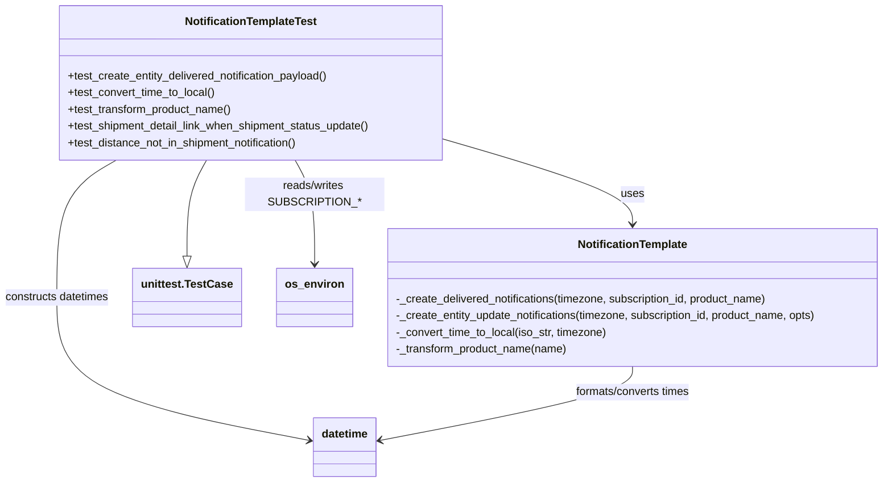
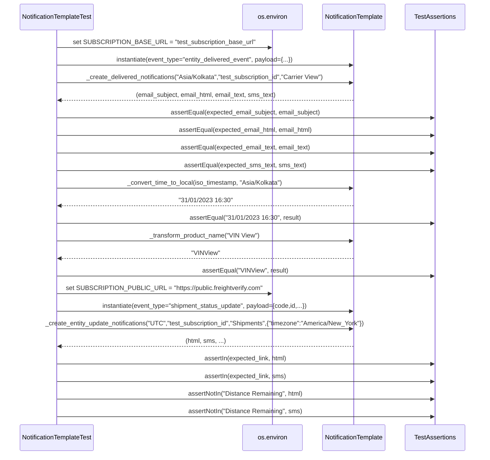

# Diagram: common/notification_service/tests/notification_template_test.py

> Auto-generated by Obscura crawlers

## Diagram 1

### SVG

<svg id="container" width="1275.234375" xmlns="http://www.w3.org/2000/svg" class="classDiagram" height="692" viewBox="0 0 1275.234375 692" role="graphics-document document" aria-roledescription="class"><g><defs><marker id="container_class-aggregationStart" class="marker aggregation class" refX="18" refY="7" markerWidth="190" markerHeight="240" orient="auto"><path d="M 18,7 L9,13 L1,7 L9,1 Z"></path></marker></defs><defs><marker id="container_class-aggregationEnd" class="marker aggregation class" refX="1" refY="7" markerWidth="20" markerHeight="28" orient="auto"><path d="M 18,7 L9,13 L1,7 L9,1 Z"></path></marker></defs><defs><marker id="container_class-extensionStart" class="marker extension class" refX="18" refY="7" markerWidth="190" markerHeight="240" orient="auto"><path d="M 1,7 L18,13 V 1 Z"></path></marker></defs><defs><marker id="container_class-extensionEnd" class="marker extension class" refX="1" refY="7" markerWidth="20" markerHeight="28" orient="auto"><path d="M 1,1 V 13 L18,7 Z"></path></marker></defs><defs><marker id="container_class-compositionStart" class="marker composition class" refX="18" refY="7" markerWidth="190" markerHeight="240" orient="auto"><path d="M 18,7 L9,13 L1,7 L9,1 Z"></path></marker></defs><defs><marker id="container_class-compositionEnd" class="marker composition class" refX="1" refY="7" markerWidth="20" markerHeight="28" orient="auto"><path d="M 18,7 L9,13 L1,7 L9,1 Z"></path></marker></defs><defs><marker id="container_class-dependencyStart" class="marker dependency class" refX="6" refY="7" markerWidth="190" markerHeight="240" orient="auto"><path d="M 5,7 L9,13 L1,7 L9,1 Z"></path></marker></defs><defs><marker id="container_class-dependencyEnd" class="marker dependency class" refX="13" refY="7" markerWidth="20" markerHeight="28" orient="auto"><path d="M 18,7 L9,13 L14,7 L9,1 Z"></path></marker></defs><defs><marker id="container_class-lollipopStart" class="marker lollipop class" refX="13" refY="7" markerWidth="190" markerHeight="240" orient="auto"><circle stroke="black" fill="transparent" cx="7" cy="7" r="6"></circle></marker></defs><defs><marker id="container_class-lollipopEnd" class="marker lollipop class" refX="1" refY="7" markerWidth="190" markerHeight="240" orient="auto"><circle stroke="black" fill="transparent" cx="7" cy="7" r="6"></circle></marker></defs><g class="root"><g class="clusters"></g><g class="edgePaths"><path d="M297.407,230L292.898,238.167C288.388,246.333,279.37,262.667,274.861,285.625C270.352,308.583,270.352,338.167,270.352,352.958L270.352,367.75" id="id_NotificationTemplateTest_unittest.TestCase_1" class="edge-thickness-normal edge-pattern-solid relation" style=";;;" data-edge="true" data-et="edge" data-id="id_NotificationTemplateTest_unittest.TestCase_1" data-points="W3sieCI6Mjk3LjQwNjgzNTkzNzUsInkiOjIzMH0seyJ4IjoyNzAuMzUxNTYyNSwieSI6Mjc5fSx7IngiOjI3MC4zNTE1NjI1LCJ5IjozODV9XQ==" marker-end="url(#container_class-extensionEnd)"></path><path d="M638.117,200.371L683.118,213.476C728.12,226.58,818.122,252.79,863.124,273.062C908.125,293.333,908.125,307.667,908.125,314.833L908.125,322" id="id_NotificationTemplateTest_NotificationTemplate_2" class="edge-thickness-normal edge-pattern-solid relation" style=";;;" data-edge="true" data-et="edge" data-id="id_NotificationTemplateTest_NotificationTemplate_2" data-points="W3sieCI6NjM4LjExNzE4NzUsInkiOjIwMC4zNzA3Mzk1NDUyNjcxfSx7IngiOjkwOC4xMjUsInkiOjI3OX0seyJ4Ijo5MDguMTI1LCJ5IjozMjh9XQ==" marker-end="url(#container_class-dependencyEnd)"></path><path d="M419.984,230L424.493,238.167C429.002,246.333,438.021,262.667,442.53,287.5C447.039,312.333,447.039,345.667,447.039,362.333L447.039,379" id="id_NotificationTemplateTest_os_environ_3" class="edge-thickness-normal edge-pattern-solid relation" style=";;;" data-edge="true" data-et="edge" data-id="id_NotificationTemplateTest_os_environ_3" data-points="W3sieCI6NDE5Ljk4Mzc4OTA2MjUsInkiOjIzMH0seyJ4Ijo0NDcuMDM5MDYyNSwieSI6Mjc5fSx7IngiOjQ0Ny4wMzkwNjI1LCJ5IjozODV9XQ==" marker-end="url(#container_class-dependencyEnd)"></path><path d="M168.348,230L154.343,238.167C140.339,246.333,112.329,262.667,98.325,295.5C84.32,328.333,84.32,377.667,84.32,425C84.32,472.333,84.32,517.667,144.477,551.871C204.633,586.075,324.947,609.15,385.103,620.688L445.26,632.226" id="id_NotificationTemplateTest_datetime_4" class="edge-thickness-normal edge-pattern-solid relation" style=";;;" data-edge="true" data-et="edge" data-id="id_NotificationTemplateTest_datetime_4" data-points="W3sieCI6MTY4LjM0NzY1NjI1LCJ5IjoyMzB9LHsieCI6ODQuMzIwMzEyNSwieSI6Mjc5fSx7IngiOjg0LjMyMDMxMjUsInkiOjQyN30seyJ4Ijo4NC4zMjAzMTI1LCJ5Ijo1NjN9LHsieCI6NDUxLjE1MjM0Mzc1LCJ5Ijo2MzMuMzU1ODI4MDQ2MzE3MX1d" marker-end="url(#container_class-dependencyEnd)"></path><path d="M908.125,526L908.125,532.167C908.125,538.333,908.125,550.667,847.968,568.371C787.812,586.075,667.499,609.15,607.342,620.688L547.186,632.226" id="id_NotificationTemplate_datetime_5" class="edge-thickness-normal edge-pattern-solid relation" style=";;;" data-edge="true" data-et="edge" data-id="id_NotificationTemplate_datetime_5" data-points="W3sieCI6OTA4LjEyNSwieSI6NTI2fSx7IngiOjkwOC4xMjUsInkiOjU2M30seyJ4Ijo1NDEuMjkyOTY4NzUsInkiOjYzMy4zNTU4MjgwNDYzMTcxfV0=" marker-end="url(#container_class-dependencyEnd)"></path></g><g class="edgeLabels"><g class="edgeLabel"><g class="label" data-id="id_NotificationTemplateTest_unittest.TestCase_1" transform="translate(0, 0)"><foreignObject width="0" height="0">

</foreignObject></g></g><g class="edgeLabel" transform="translate(908.125, 279)"><g class="label" data-id="id_NotificationTemplateTest_NotificationTemplate_2" transform="translate(-16.4921875, -12)"><foreignObject width="32.984375" height="24">

uses

</foreignObject></g></g><g class="edgeLabel" transform="translate(447.0390625, 279)"><g class="label" data-id="id_NotificationTemplateTest_os_environ_3" transform="translate(-100, -24)"><foreignObject width="200" height="48">

reads/writes SUBSCRIPTION_*

</foreignObject></g></g><g class="edgeLabel" transform="translate(84.3203125, 427)"><g class="label" data-id="id_NotificationTemplateTest_datetime_4" transform="translate(-76.3203125, -12)"><foreignObject width="152.640625" height="24">

constructs datetimes

</foreignObject></g></g><g class="edgeLabel" transform="translate(908.125, 563)"><g class="label" data-id="id_NotificationTemplate_datetime_5" transform="translate(-85.1171875, -12)"><foreignObject width="170.234375" height="24">

formats/converts times

</foreignObject></g></g></g><g class="nodes"><g class="node default" id="classId-NotificationTemplateTest-0" transform="translate(358.6953125, 119)"><g class="basic label-container"><path d="M-279.421875 -111 L279.421875 -111 L279.421875 111 L-279.421875 111" stroke="none" stroke-width="0" fill="#ECECFF" style=""></path><path d="M-279.421875 -111 C-152.03064651602506 -111, -24.639418032050116 -111, 279.421875 -111 M-279.421875 -111 C-82.92865960502235 -111, 113.5645557899553 -111, 279.421875 -111 M279.421875 -111 C279.421875 -62.51970884386971, 279.421875 -14.039417687739416, 279.421875 111 M279.421875 -111 C279.421875 -40.618563678489664, 279.421875 29.76287264302067, 279.421875 111 M279.421875 111 C122.10412204521734 111, -35.213630909565325 111, -279.421875 111 M279.421875 111 C70.22318767954616 111, -138.97549964090769 111, -279.421875 111 M-279.421875 111 C-279.421875 60.89969124371748, -279.421875 10.799382487434954, -279.421875 -111 M-279.421875 111 C-279.421875 55.74872673762381, -279.421875 0.4974534752476245, -279.421875 -111" stroke="#9370DB" stroke-width="1.3" fill="none" stroke-dasharray="0 0" style=""></path></g><g class="annotation-group text" transform="translate(0, -87)"></g><g class="label-group text" transform="translate(-92.046875, -87)"><g class="label" style="font-weight: bolder" transform="translate(0,-12)"><foreignObject width="184.09375" height="24">

NotificationTemplateTest

</foreignObject></g></g><g class="members-group text" transform="translate(-267.421875, -39)"></g><g class="methods-group text" transform="translate(-267.421875, -9)"><g class="label" style="" transform="translate(0,-12)"><foreignObject width="381.59375" height="24">

+test_create_entity_delivered_notification_payload()

</foreignObject></g><g class="label" style="" transform="translate(0,12)"><foreignObject width="214" height="24">

+test_convert_time_to_local()

</foreignObject></g><g class="label" style="" transform="translate(0,36)"><foreignObject width="239.15625" height="24">

+test_transform_product_name()

</foreignObject></g><g class="label" style="" transform="translate(0,60)"><foreignObject width="442.796875" height="24">

+test_shipment_detail_link_when_shipment_status_update()

</foreignObject></g><g class="label" style="" transform="translate(0,84)"><foreignObject width="338.328125" height="24">

+test_distance_not_in_shipment_notification()

</foreignObject></g></g><g class="divider" style=""><path d="M-279.421875 -63 C-73.42856536562809 -63, 132.56474426874382 -63, 279.421875 -63 M-279.421875 -63 C-134.302960944755 -63, 10.81595311049 -63, 279.421875 -63" stroke="#9370DB" stroke-width="1.3" fill="none" stroke-dasharray="0 0" style=""></path></g><g class="divider" style=""><path d="M-279.421875 -39 C-70.67194479593715 -39, 138.0779854081257 -39, 279.421875 -39 M-279.421875 -39 C-134.15837846547706 -39, 11.105118069045886 -39, 279.421875 -39" stroke="#9370DB" stroke-width="1.3" fill="none" stroke-dasharray="0 0" style=""></path></g></g><g class="node default" id="classId-NotificationTemplate-1" transform="translate(908.125, 427)"><g class="basic label-container"><path d="M-359.109375 -99 L359.109375 -99 L359.109375 99 L-359.109375 99" stroke="none" stroke-width="0" fill="#ECECFF" style=""></path><path d="M-359.109375 -99 C-191.9397792029238 -99, -24.770183405847604 -99, 359.109375 -99 M-359.109375 -99 C-174.4961521853072 -99, 10.11707062938558 -99, 359.109375 -99 M359.109375 -99 C359.109375 -38.087269291002976, 359.109375 22.82546141799405, 359.109375 99 M359.109375 -99 C359.109375 -58.45584279382118, 359.109375 -17.911685587642367, 359.109375 99 M359.109375 99 C160.27838886575546 99, -38.55259726848908 99, -359.109375 99 M359.109375 99 C170.02429168806205 99, -19.0607916238759 99, -359.109375 99 M-359.109375 99 C-359.109375 31.01684804022426, -359.109375 -36.96630391955148, -359.109375 -99 M-359.109375 99 C-359.109375 36.217922616102776, -359.109375 -26.56415476779445, -359.109375 -99" stroke="#9370DB" stroke-width="1.3" fill="none" stroke-dasharray="0 0" style=""></path></g><g class="annotation-group text" transform="translate(0, -75)"></g><g class="label-group text" transform="translate(-76.796875, -75)"><g class="label" style="font-weight: bolder" transform="translate(0,-12)"><foreignObject width="153.59375" height="24">

NotificationTemplate

</foreignObject></g></g><g class="members-group text" transform="translate(-347.109375, -27)"></g><g class="methods-group text" transform="translate(-347.109375, 3)"><g class="label" style="" transform="translate(0,-12)"><foreignObject width="544.90625" height="24">

-_create_delivered_notifications(timezone, subscription_id, product_name)

</foreignObject></g><g class="label" style="" transform="translate(0,12)"><foreignObject width="617.421875" height="24">

-_create_entity_update_notifications(timezone, subscription_id, product_name, opts)

</foreignObject></g><g class="label" style="" transform="translate(0,36)"><foreignObject width="306.234375" height="24">

-_convert_time_to_local(iso_str, timezone)

</foreignObject></g><g class="label" style="" transform="translate(0,60)"><foreignObject width="249.4375" height="24">

-_transform_product_name(name)

</foreignObject></g></g><g class="divider" style=""><path d="M-359.109375 -51 C-172.8429862007803 -51, 13.423402598439395 -51, 359.109375 -51 M-359.109375 -51 C-215.19170405324047 -51, -71.27403310648094 -51, 359.109375 -51" stroke="#9370DB" stroke-width="1.3" fill="none" stroke-dasharray="0 0" style=""></path></g><g class="divider" style=""><path d="M-359.109375 -27 C-120.50214062550054 -27, 118.10509374899891 -27, 359.109375 -27 M-359.109375 -27 C-90.72620847435047 -27, 177.65695805129906 -27, 359.109375 -27" stroke="#9370DB" stroke-width="1.3" fill="none" stroke-dasharray="0 0" style=""></path></g></g><g class="node default" id="classId-unittest.TestCase-2" transform="translate(270.3515625, 427)"><g class="basic label-container"><path d="M-74.7109375 -42 L74.7109375 -42 L74.7109375 42 L-74.7109375 42" stroke="none" stroke-width="0" fill="#ECECFF" style=""></path><path d="M-74.7109375 -42 C-41.116920953568716 -42, -7.522904407137432 -42, 74.7109375 -42 M-74.7109375 -42 C-43.442639300672084 -42, -12.174341101344176 -42, 74.7109375 -42 M74.7109375 -42 C74.7109375 -10.837215395395937, 74.7109375 20.325569209208126, 74.7109375 42 M74.7109375 -42 C74.7109375 -13.770526669883495, 74.7109375 14.45894666023301, 74.7109375 42 M74.7109375 42 C39.9343959073701 42, 5.157854314740206 42, -74.7109375 42 M74.7109375 42 C27.474266075462126 42, -19.76240534907575 42, -74.7109375 42 M-74.7109375 42 C-74.7109375 18.27765375231302, -74.7109375 -5.444692495373957, -74.7109375 -42 M-74.7109375 42 C-74.7109375 12.82916793355761, -74.7109375 -16.34166413288478, -74.7109375 -42" stroke="#9370DB" stroke-width="1.3" fill="none" stroke-dasharray="0 0" style=""></path></g><g class="annotation-group text" transform="translate(0, -18)"></g><g class="label-group text" transform="translate(-62.7109375, -18)"><g class="label" style="font-weight: bolder" transform="translate(0,-12)"><foreignObject width="125.421875" height="24">

unittest.TestCase

</foreignObject></g></g><g class="members-group text" transform="translate(-62.7109375, 30)"></g><g class="methods-group text" transform="translate(-62.7109375, 60)"></g><g class="divider" style=""><path d="M-74.7109375 6 C-43.96619279311636 6, -13.221448086232726 6, 74.7109375 6 M-74.7109375 6 C-29.44503609605455 6, 15.820865307890898 6, 74.7109375 6" stroke="#9370DB" stroke-width="1.3" fill="none" stroke-dasharray="0 0" style=""></path></g><g class="divider" style=""><path d="M-74.7109375 24 C-34.75526477483391 24, 5.200407950332178 24, 74.7109375 24 M-74.7109375 24 C-21.610905425972135 24, 31.48912664805573 24, 74.7109375 24" stroke="#9370DB" stroke-width="1.3" fill="none" stroke-dasharray="0 0" style=""></path></g></g><g class="node default" id="classId-os_environ-3" transform="translate(447.0390625, 427)"><g class="basic label-container"><path d="M-51.9765625 -42 L51.9765625 -42 L51.9765625 42 L-51.9765625 42" stroke="none" stroke-width="0" fill="#ECECFF" style=""></path><path d="M-51.9765625 -42 C-29.24483560399409 -42, -6.513108707988181 -42, 51.9765625 -42 M-51.9765625 -42 C-30.253905096368552 -42, -8.531247692737104 -42, 51.9765625 -42 M51.9765625 -42 C51.9765625 -12.730053505260337, 51.9765625 16.539892989479327, 51.9765625 42 M51.9765625 -42 C51.9765625 -23.32639282263901, 51.9765625 -4.652785645278023, 51.9765625 42 M51.9765625 42 C29.17829780706782 42, 6.380033114135642 42, -51.9765625 42 M51.9765625 42 C14.791466841350399 42, -22.393628817299202 42, -51.9765625 42 M-51.9765625 42 C-51.9765625 21.885341043167628, -51.9765625 1.7706820863352561, -51.9765625 -42 M-51.9765625 42 C-51.9765625 25.13238769463324, -51.9765625 8.264775389266482, -51.9765625 -42" stroke="#9370DB" stroke-width="1.3" fill="none" stroke-dasharray="0 0" style=""></path></g><g class="annotation-group text" transform="translate(0, -18)"></g><g class="label-group text" transform="translate(-39.9765625, -18)"><g class="label" style="font-weight: bolder" transform="translate(0,-12)"><foreignObject width="79.953125" height="24">

os_environ

</foreignObject></g></g><g class="members-group text" transform="translate(-39.9765625, 30)"></g><g class="methods-group text" transform="translate(-39.9765625, 60)"></g><g class="divider" style=""><path d="M-51.9765625 6 C-23.644412251637046 6, 4.687737996725907 6, 51.9765625 6 M-51.9765625 6 C-28.679785376858643 6, -5.383008253717286 6, 51.9765625 6" stroke="#9370DB" stroke-width="1.3" fill="none" stroke-dasharray="0 0" style=""></path></g><g class="divider" style=""><path d="M-51.9765625 24 C-10.6383009145109 24, 30.6999606709782 24, 51.9765625 24 M-51.9765625 24 C-27.08176107351487 24, -2.186959647029738 24, 51.9765625 24" stroke="#9370DB" stroke-width="1.3" fill="none" stroke-dasharray="0 0" style=""></path></g></g><g class="node default" id="classId-datetime-4" transform="translate(496.22265625, 642)"><g class="basic label-container"><path d="M-45.0703125 -42 L45.0703125 -42 L45.0703125 42 L-45.0703125 42" stroke="none" stroke-width="0" fill="#ECECFF" style=""></path><path d="M-45.0703125 -42 C-23.52120360371725 -42, -1.9720947074345005 -42, 45.0703125 -42 M-45.0703125 -42 C-22.61733709134662 -42, -0.16436168269324014 -42, 45.0703125 -42 M45.0703125 -42 C45.0703125 -24.122006703380855, 45.0703125 -6.2440134067617095, 45.0703125 42 M45.0703125 -42 C45.0703125 -12.995031720600942, 45.0703125 16.009936558798117, 45.0703125 42 M45.0703125 42 C22.152485076656262 42, -0.7653423466874756 42, -45.0703125 42 M45.0703125 42 C10.056070636235567 42, -24.958171227528865 42, -45.0703125 42 M-45.0703125 42 C-45.0703125 23.455414435871266, -45.0703125 4.910828871742531, -45.0703125 -42 M-45.0703125 42 C-45.0703125 16.246784050128085, -45.0703125 -9.50643189974383, -45.0703125 -42" stroke="#9370DB" stroke-width="1.3" fill="none" stroke-dasharray="0 0" style=""></path></g><g class="annotation-group text" transform="translate(0, -18)"></g><g class="label-group text" transform="translate(-33.0703125, -18)"><g class="label" style="font-weight: bolder" transform="translate(0,-12)"><foreignObject width="66.140625" height="24">

datetime

</foreignObject></g></g><g class="members-group text" transform="translate(-33.0703125, 30)"></g><g class="methods-group text" transform="translate(-33.0703125, 60)"></g><g class="divider" style=""><path d="M-45.0703125 6 C-22.113728591746106 6, 0.8428553165077872 6, 45.0703125 6 M-45.0703125 6 C-17.310560242437393 6, 10.449192015125213 6, 45.0703125 6" stroke="#9370DB" stroke-width="1.3" fill="none" stroke-dasharray="0 0" style=""></path></g><g class="divider" style=""><path d="M-45.0703125 24 C-23.933809042936975 24, -2.79730558587395 24, 45.0703125 24 M-45.0703125 24 C-11.821111160407945 24, 21.42809017918411 24, 45.0703125 24" stroke="#9370DB" stroke-width="1.3" fill="none" stroke-dasharray="0 0" style=""></path></g></g></g></g></g></svg>

## Diagram 2

### SVG

<svg id="container" width="1249.5" xmlns="http://www.w3.org/2000/svg" height="1227" viewBox="-50 -10 1249.5 1227" role="graphics-document document" aria-roledescription="sequence"><g><rect x="999.5" y="1141" fill="#eaeaea" stroke="#666" width="150" height="65" name="Assert" rx="3" ry="3" class="actor actor-bottom"></rect><text x="1074.5" y="1173.5" dominant-baseline="central" alignment-baseline="central" class="actor actor-box" style="text-anchor: middle; font-size: 16px; font-weight: 400;"><tspan x="1074.5" dy="0">TestAssertions</tspan></text></g><g><rect x="777.5" y="1141" fill="#eaeaea" stroke="#666" width="172" height="65" name="NT" rx="3" ry="3" class="actor actor-bottom"></rect><text x="863.5" y="1173.5" dominant-baseline="central" alignment-baseline="central" class="actor actor-box" style="text-anchor: middle; font-size: 16px; font-weight: 400;"><tspan x="863.5" dy="0">NotificationTemplate</tspan></text></g><g><rect x="577.5" y="1141" fill="#eaeaea" stroke="#666" width="150" height="65" name="Env" rx="3" ry="3" class="actor actor-bottom"></rect><text x="652.5" y="1173.5" dominant-baseline="central" alignment-baseline="central" class="actor actor-box" style="text-anchor: middle; font-size: 16px; font-weight: 400;"><tspan x="652.5" dy="0">os.environ</tspan></text></g><g><rect x="0" y="1141" fill="#eaeaea" stroke="#666" width="201" height="65" name="Test" rx="3" ry="3" class="actor actor-bottom"></rect><text x="100.5" y="1173.5" dominant-baseline="central" alignment-baseline="central" class="actor actor-box" style="text-anchor: middle; font-size: 16px; font-weight: 400;"><tspan x="100.5" dy="0">NotificationTemplateTest</tspan></text></g><g><line id="actor3" x1="1074.5" y1="65" x2="1074.5" y2="1141" class="actor-line 200" stroke-width="0.5px" stroke="#999" name="Assert"></line><g id="root-3"><rect x="999.5" y="0" fill="#eaeaea" stroke="#666" width="150" height="65" name="Assert" rx="3" ry="3" class="actor actor-top"></rect><text x="1074.5" y="32.5" dominant-baseline="central" alignment-baseline="central" class="actor actor-box" style="text-anchor: middle; font-size: 16px; font-weight: 400;"><tspan x="1074.5" dy="0">TestAssertions</tspan></text></g></g><g><line id="actor2" x1="863.5" y1="65" x2="863.5" y2="1141" class="actor-line 200" stroke-width="0.5px" stroke="#999" name="NT"></line><g id="root-2"><rect x="777.5" y="0" fill="#eaeaea" stroke="#666" width="172" height="65" name="NT" rx="3" ry="3" class="actor actor-top"></rect><text x="863.5" y="32.5" dominant-baseline="central" alignment-baseline="central" class="actor actor-box" style="text-anchor: middle; font-size: 16px; font-weight: 400;"><tspan x="863.5" dy="0">NotificationTemplate</tspan></text></g></g><g><line id="actor1" x1="652.5" y1="65" x2="652.5" y2="1141" class="actor-line 200" stroke-width="0.5px" stroke="#999" name="Env"></line><g id="root-1"><rect x="577.5" y="0" fill="#eaeaea" stroke="#666" width="150" height="65" name="Env" rx="3" ry="3" class="actor actor-top"></rect><text x="652.5" y="32.5" dominant-baseline="central" alignment-baseline="central" class="actor actor-box" style="text-anchor: middle; font-size: 16px; font-weight: 400;"><tspan x="652.5" dy="0">os.environ</tspan></text></g></g><g><line id="actor0" x1="100.5" y1="65" x2="100.5" y2="1141" class="actor-line 200" stroke-width="0.5px" stroke="#999" name="Test"></line><g id="root-0"><rect x="0" y="0" fill="#eaeaea" stroke="#666" width="201" height="65" name="Test" rx="3" ry="3" class="actor actor-top"></rect><text x="100.5" y="32.5" dominant-baseline="central" alignment-baseline="central" class="actor actor-box" style="text-anchor: middle; font-size: 16px; font-weight: 400;"><tspan x="100.5" dy="0">NotificationTemplateTest</tspan></text></g></g><g></g><defs><symbol id="computer" width="24" height="24"><path transform="scale(.5)" d="M2 2v13h20v-13h-20zm18 11h-16v-9h16v9zm-10.228 6l.466-1h3.524l.467 1h-4.457zm14.228 3h-24l2-6h2.104l-1.33 4h18.45l-1.297-4h2.073l2 6zm-5-10h-14v-7h14v7z"></path></symbol></defs><defs><symbol id="database" fill-rule="evenodd" clip-rule="evenodd"><path transform="scale(.5)" d="M12.258.001l.256.004.255.005.253.008.251.01.249.012.247.015.246.016.242.019.241.02.239.023.236.024.233.027.231.028.229.031.225.032.223.034.22.036.217.038.214.04.211.041.208.043.205.045.201.046.198.048.194.05.191.051.187.053.183.054.18.056.175.057.172.059.168.06.163.061.16.063.155.064.15.066.074.033.073.033.071.034.07.034.069.035.068.035.067.035.066.035.064.036.064.036.062.036.06.036.06.037.058.037.058.037.055.038.055.038.053.038.052.038.051.039.05.039.048.039.047.039.045.04.044.04.043.04.041.04.04.041.039.041.037.041.036.041.034.041.033.042.032.042.03.042.029.042.027.042.026.043.024.043.023.043.021.043.02.043.018.044.017.043.015.044.013.044.012.044.011.045.009.044.007.045.006.045.004.045.002.045.001.045v17l-.001.045-.002.045-.004.045-.006.045-.007.045-.009.044-.011.045-.012.044-.013.044-.015.044-.017.043-.018.044-.02.043-.021.043-.023.043-.024.043-.026.043-.027.042-.029.042-.03.042-.032.042-.033.042-.034.041-.036.041-.037.041-.039.041-.04.041-.041.04-.043.04-.044.04-.045.04-.047.039-.048.039-.05.039-.051.039-.052.038-.053.038-.055.038-.055.038-.058.037-.058.037-.06.037-.06.036-.062.036-.064.036-.064.036-.066.035-.067.035-.068.035-.069.035-.07.034-.071.034-.073.033-.074.033-.15.066-.155.064-.16.063-.163.061-.168.06-.172.059-.175.057-.18.056-.183.054-.187.053-.191.051-.194.05-.198.048-.201.046-.205.045-.208.043-.211.041-.214.04-.217.038-.22.036-.223.034-.225.032-.229.031-.231.028-.233.027-.236.024-.239.023-.241.02-.242.019-.246.016-.247.015-.249.012-.251.01-.253.008-.255.005-.256.004-.258.001-.258-.001-.256-.004-.255-.005-.253-.008-.251-.01-.249-.012-.247-.015-.245-.016-.243-.019-.241-.02-.238-.023-.236-.024-.234-.027-.231-.028-.228-.031-.226-.032-.223-.034-.22-.036-.217-.038-.214-.04-.211-.041-.208-.043-.204-.045-.201-.046-.198-.048-.195-.05-.19-.051-.187-.053-.184-.054-.179-.056-.176-.057-.172-.059-.167-.06-.164-.061-.159-.063-.155-.064-.151-.066-.074-.033-.072-.033-.072-.034-.07-.034-.069-.035-.068-.035-.067-.035-.066-.035-.064-.036-.063-.036-.062-.036-.061-.036-.06-.037-.058-.037-.057-.037-.056-.038-.055-.038-.053-.038-.052-.038-.051-.039-.049-.039-.049-.039-.046-.039-.046-.04-.044-.04-.043-.04-.041-.04-.04-.041-.039-.041-.037-.041-.036-.041-.034-.041-.033-.042-.032-.042-.03-.042-.029-.042-.027-.042-.026-.043-.024-.043-.023-.043-.021-.043-.02-.043-.018-.044-.017-.043-.015-.044-.013-.044-.012-.044-.011-.045-.009-.044-.007-.045-.006-.045-.004-.045-.002-.045-.001-.045v-17l.001-.045.002-.045.004-.045.006-.045.007-.045.009-.044.011-.045.012-.044.013-.044.015-.044.017-.043.018-.044.02-.043.021-.043.023-.043.024-.043.026-.043.027-.042.029-.042.03-.042.032-.042.033-.042.034-.041.036-.041.037-.041.039-.041.04-.041.041-.04.043-.04.044-.04.046-.04.046-.039.049-.039.049-.039.051-.039.052-.038.053-.038.055-.038.056-.038.057-.037.058-.037.06-.037.061-.036.062-.036.063-.036.064-.036.066-.035.067-.035.068-.035.069-.035.07-.034.072-.034.072-.033.074-.033.151-.066.155-.064.159-.063.164-.061.167-.06.172-.059.176-.057.179-.056.184-.054.187-.053.19-.051.195-.05.198-.048.201-.046.204-.045.208-.043.211-.041.214-.04.217-.038.22-.036.223-.034.226-.032.228-.031.231-.028.234-.027.236-.024.238-.023.241-.02.243-.019.245-.016.247-.015.249-.012.251-.01.253-.008.255-.005.256-.004.258-.001.258.001zm-9.258 20.499v.01l.001.021.003.021.004.022.005.021.006.022.007.022.009.023.01.022.011.023.012.023.013.023.015.023.016.024.017.023.018.024.019.024.021.024.022.025.023.024.024.025.052.049.056.05.061.051.066.051.07.051.075.051.079.052.084.052.088.052.092.052.097.052.102.051.105.052.11.052.114.051.119.051.123.051.127.05.131.05.135.05.139.048.144.049.147.047.152.047.155.047.16.045.163.045.167.043.171.043.176.041.178.041.183.039.187.039.19.037.194.035.197.035.202.033.204.031.209.03.212.029.216.027.219.025.222.024.226.021.23.02.233.018.236.016.24.015.243.012.246.01.249.008.253.005.256.004.259.001.26-.001.257-.004.254-.005.25-.008.247-.011.244-.012.241-.014.237-.016.233-.018.231-.021.226-.021.224-.024.22-.026.216-.027.212-.028.21-.031.205-.031.202-.034.198-.034.194-.036.191-.037.187-.039.183-.04.179-.04.175-.042.172-.043.168-.044.163-.045.16-.046.155-.046.152-.047.148-.048.143-.049.139-.049.136-.05.131-.05.126-.05.123-.051.118-.052.114-.051.11-.052.106-.052.101-.052.096-.052.092-.052.088-.053.083-.051.079-.052.074-.052.07-.051.065-.051.06-.051.056-.05.051-.05.023-.024.023-.025.021-.024.02-.024.019-.024.018-.024.017-.024.015-.023.014-.024.013-.023.012-.023.01-.023.01-.022.008-.022.006-.022.006-.022.004-.022.004-.021.001-.021.001-.021v-4.127l-.077.055-.08.053-.083.054-.085.053-.087.052-.09.052-.093.051-.095.05-.097.05-.1.049-.102.049-.105.048-.106.047-.109.047-.111.046-.114.045-.115.045-.118.044-.12.043-.122.042-.124.042-.126.041-.128.04-.13.04-.132.038-.134.038-.135.037-.138.037-.139.035-.142.035-.143.034-.144.033-.147.032-.148.031-.15.03-.151.03-.153.029-.154.027-.156.027-.158.026-.159.025-.161.024-.162.023-.163.022-.165.021-.166.02-.167.019-.169.018-.169.017-.171.016-.173.015-.173.014-.175.013-.175.012-.177.011-.178.01-.179.008-.179.008-.181.006-.182.005-.182.004-.184.003-.184.002h-.37l-.184-.002-.184-.003-.182-.004-.182-.005-.181-.006-.179-.008-.179-.008-.178-.01-.176-.011-.176-.012-.175-.013-.173-.014-.172-.015-.171-.016-.17-.017-.169-.018-.167-.019-.166-.02-.165-.021-.163-.022-.162-.023-.161-.024-.159-.025-.157-.026-.156-.027-.155-.027-.153-.029-.151-.03-.15-.03-.148-.031-.146-.032-.145-.033-.143-.034-.141-.035-.14-.035-.137-.037-.136-.037-.134-.038-.132-.038-.13-.04-.128-.04-.126-.041-.124-.042-.122-.042-.12-.044-.117-.043-.116-.045-.113-.045-.112-.046-.109-.047-.106-.047-.105-.048-.102-.049-.1-.049-.097-.05-.095-.05-.093-.052-.09-.051-.087-.052-.085-.053-.083-.054-.08-.054-.077-.054v4.127zm0-5.654v.011l.001.021.003.021.004.021.005.022.006.022.007.022.009.022.01.022.011.023.012.023.013.023.015.024.016.023.017.024.018.024.019.024.021.024.022.024.023.025.024.024.052.05.056.05.061.05.066.051.07.051.075.052.079.051.084.052.088.052.092.052.097.052.102.052.105.052.11.051.114.051.119.052.123.05.127.051.131.05.135.049.139.049.144.048.147.048.152.047.155.046.16.045.163.045.167.044.171.042.176.042.178.04.183.04.187.038.19.037.194.036.197.034.202.033.204.032.209.03.212.028.216.027.219.025.222.024.226.022.23.02.233.018.236.016.24.014.243.012.246.01.249.008.253.006.256.003.259.001.26-.001.257-.003.254-.006.25-.008.247-.01.244-.012.241-.015.237-.016.233-.018.231-.02.226-.022.224-.024.22-.025.216-.027.212-.029.21-.03.205-.032.202-.033.198-.035.194-.036.191-.037.187-.039.183-.039.179-.041.175-.042.172-.043.168-.044.163-.045.16-.045.155-.047.152-.047.148-.048.143-.048.139-.05.136-.049.131-.05.126-.051.123-.051.118-.051.114-.052.11-.052.106-.052.101-.052.096-.052.092-.052.088-.052.083-.052.079-.052.074-.051.07-.052.065-.051.06-.05.056-.051.051-.049.023-.025.023-.024.021-.025.02-.024.019-.024.018-.024.017-.024.015-.023.014-.023.013-.024.012-.022.01-.023.01-.023.008-.022.006-.022.006-.022.004-.021.004-.022.001-.021.001-.021v-4.139l-.077.054-.08.054-.083.054-.085.052-.087.053-.09.051-.093.051-.095.051-.097.05-.1.049-.102.049-.105.048-.106.047-.109.047-.111.046-.114.045-.115.044-.118.044-.12.044-.122.042-.124.042-.126.041-.128.04-.13.039-.132.039-.134.038-.135.037-.138.036-.139.036-.142.035-.143.033-.144.033-.147.033-.148.031-.15.03-.151.03-.153.028-.154.028-.156.027-.158.026-.159.025-.161.024-.162.023-.163.022-.165.021-.166.02-.167.019-.169.018-.169.017-.171.016-.173.015-.173.014-.175.013-.175.012-.177.011-.178.009-.179.009-.179.007-.181.007-.182.005-.182.004-.184.003-.184.002h-.37l-.184-.002-.184-.003-.182-.004-.182-.005-.181-.007-.179-.007-.179-.009-.178-.009-.176-.011-.176-.012-.175-.013-.173-.014-.172-.015-.171-.016-.17-.017-.169-.018-.167-.019-.166-.02-.165-.021-.163-.022-.162-.023-.161-.024-.159-.025-.157-.026-.156-.027-.155-.028-.153-.028-.151-.03-.15-.03-.148-.031-.146-.033-.145-.033-.143-.033-.141-.035-.14-.036-.137-.036-.136-.037-.134-.038-.132-.039-.13-.039-.128-.04-.126-.041-.124-.042-.122-.043-.12-.043-.117-.044-.116-.044-.113-.046-.112-.046-.109-.046-.106-.047-.105-.048-.102-.049-.1-.049-.097-.05-.095-.051-.093-.051-.09-.051-.087-.053-.085-.052-.083-.054-.08-.054-.077-.054v4.139zm0-5.666v.011l.001.02.003.022.004.021.005.022.006.021.007.022.009.023.01.022.011.023.012.023.013.023.015.023.016.024.017.024.018.023.019.024.021.025.022.024.023.024.024.025.052.05.056.05.061.05.066.051.07.051.075.052.079.051.084.052.088.052.092.052.097.052.102.052.105.051.11.052.114.051.119.051.123.051.127.05.131.05.135.05.139.049.144.048.147.048.152.047.155.046.16.045.163.045.167.043.171.043.176.042.178.04.183.04.187.038.19.037.194.036.197.034.202.033.204.032.209.03.212.028.216.027.219.025.222.024.226.021.23.02.233.018.236.017.24.014.243.012.246.01.249.008.253.006.256.003.259.001.26-.001.257-.003.254-.006.25-.008.247-.01.244-.013.241-.014.237-.016.233-.018.231-.02.226-.022.224-.024.22-.025.216-.027.212-.029.21-.03.205-.032.202-.033.198-.035.194-.036.191-.037.187-.039.183-.039.179-.041.175-.042.172-.043.168-.044.163-.045.16-.045.155-.047.152-.047.148-.048.143-.049.139-.049.136-.049.131-.051.126-.05.123-.051.118-.052.114-.051.11-.052.106-.052.101-.052.096-.052.092-.052.088-.052.083-.052.079-.052.074-.052.07-.051.065-.051.06-.051.056-.05.051-.049.023-.025.023-.025.021-.024.02-.024.019-.024.018-.024.017-.024.015-.023.014-.024.013-.023.012-.023.01-.022.01-.023.008-.022.006-.022.006-.022.004-.022.004-.021.001-.021.001-.021v-4.153l-.077.054-.08.054-.083.053-.085.053-.087.053-.09.051-.093.051-.095.051-.097.05-.1.049-.102.048-.105.048-.106.048-.109.046-.111.046-.114.046-.115.044-.118.044-.12.043-.122.043-.124.042-.126.041-.128.04-.13.039-.132.039-.134.038-.135.037-.138.036-.139.036-.142.034-.143.034-.144.033-.147.032-.148.032-.15.03-.151.03-.153.028-.154.028-.156.027-.158.026-.159.024-.161.024-.162.023-.163.023-.165.021-.166.02-.167.019-.169.018-.169.017-.171.016-.173.015-.173.014-.175.013-.175.012-.177.01-.178.01-.179.009-.179.007-.181.006-.182.006-.182.004-.184.003-.184.001-.185.001-.185-.001-.184-.001-.184-.003-.182-.004-.182-.006-.181-.006-.179-.007-.179-.009-.178-.01-.176-.01-.176-.012-.175-.013-.173-.014-.172-.015-.171-.016-.17-.017-.169-.018-.167-.019-.166-.02-.165-.021-.163-.023-.162-.023-.161-.024-.159-.024-.157-.026-.156-.027-.155-.028-.153-.028-.151-.03-.15-.03-.148-.032-.146-.032-.145-.033-.143-.034-.141-.034-.14-.036-.137-.036-.136-.037-.134-.038-.132-.039-.13-.039-.128-.041-.126-.041-.124-.041-.122-.043-.12-.043-.117-.044-.116-.044-.113-.046-.112-.046-.109-.046-.106-.048-.105-.048-.102-.048-.1-.05-.097-.049-.095-.051-.093-.051-.09-.052-.087-.052-.085-.053-.083-.053-.08-.054-.077-.054v4.153zm8.74-8.179l-.257.004-.254.005-.25.008-.247.011-.244.012-.241.014-.237.016-.233.018-.231.021-.226.022-.224.023-.22.026-.216.027-.212.028-.21.031-.205.032-.202.033-.198.034-.194.036-.191.038-.187.038-.183.04-.179.041-.175.042-.172.043-.168.043-.163.045-.16.046-.155.046-.152.048-.148.048-.143.048-.139.049-.136.05-.131.05-.126.051-.123.051-.118.051-.114.052-.11.052-.106.052-.101.052-.096.052-.092.052-.088.052-.083.052-.079.052-.074.051-.07.052-.065.051-.06.05-.056.05-.051.05-.023.025-.023.024-.021.024-.02.025-.019.024-.018.024-.017.023-.015.024-.014.023-.013.023-.012.023-.01.023-.01.022-.008.022-.006.023-.006.021-.004.022-.004.021-.001.021-.001.021.001.021.001.021.004.021.004.022.006.021.006.023.008.022.01.022.01.023.012.023.013.023.014.023.015.024.017.023.018.024.019.024.02.025.021.024.023.024.023.025.051.05.056.05.06.05.065.051.07.052.074.051.079.052.083.052.088.052.092.052.096.052.101.052.106.052.11.052.114.052.118.051.123.051.126.051.131.05.136.05.139.049.143.048.148.048.152.048.155.046.16.046.163.045.168.043.172.043.175.042.179.041.183.04.187.038.191.038.194.036.198.034.202.033.205.032.21.031.212.028.216.027.22.026.224.023.226.022.231.021.233.018.237.016.241.014.244.012.247.011.25.008.254.005.257.004.26.001.26-.001.257-.004.254-.005.25-.008.247-.011.244-.012.241-.014.237-.016.233-.018.231-.021.226-.022.224-.023.22-.026.216-.027.212-.028.21-.031.205-.032.202-.033.198-.034.194-.036.191-.038.187-.038.183-.04.179-.041.175-.042.172-.043.168-.043.163-.045.16-.046.155-.046.152-.048.148-.048.143-.048.139-.049.136-.05.131-.05.126-.051.123-.051.118-.051.114-.052.11-.052.106-.052.101-.052.096-.052.092-.052.088-.052.083-.052.079-.052.074-.051.07-.052.065-.051.06-.05.056-.05.051-.05.023-.025.023-.024.021-.024.02-.025.019-.024.018-.024.017-.023.015-.024.014-.023.013-.023.012-.023.01-.023.01-.022.008-.022.006-.023.006-.021.004-.022.004-.021.001-.021.001-.021-.001-.021-.001-.021-.004-.021-.004-.022-.006-.021-.006-.023-.008-.022-.01-.022-.01-.023-.012-.023-.013-.023-.014-.023-.015-.024-.017-.023-.018-.024-.019-.024-.02-.025-.021-.024-.023-.024-.023-.025-.051-.05-.056-.05-.06-.05-.065-.051-.07-.052-.074-.051-.079-.052-.083-.052-.088-.052-.092-.052-.096-.052-.101-.052-.106-.052-.11-.052-.114-.052-.118-.051-.123-.051-.126-.051-.131-.05-.136-.05-.139-.049-.143-.048-.148-.048-.152-.048-.155-.046-.16-.046-.163-.045-.168-.043-.172-.043-.175-.042-.179-.041-.183-.04-.187-.038-.191-.038-.194-.036-.198-.034-.202-.033-.205-.032-.21-.031-.212-.028-.216-.027-.22-.026-.224-.023-.226-.022-.231-.021-.233-.018-.237-.016-.241-.014-.244-.012-.247-.011-.25-.008-.254-.005-.257-.004-.26-.001-.26.001z"></path></symbol></defs><defs><symbol id="clock" width="24" height="24"><path transform="scale(.5)" d="M12 2c5.514 0 10 4.486 10 10s-4.486 10-10 10-10-4.486-10-10 4.486-10 10-10zm0-2c-6.627 0-12 5.373-12 12s5.373 12 12 12 12-5.373 12-12-5.373-12-12-12zm5.848 12.459c.202.038.202.333.001.372-1.907.361-6.045 1.111-6.547 1.111-.719 0-1.301-.582-1.301-1.301 0-.512.77-5.447 1.125-7.445.034-.192.312-.181.343.014l.985 6.238 5.394 1.011z"></path></symbol></defs><defs><marker id="arrowhead" refX="7.9" refY="5" markerUnits="userSpaceOnUse" markerWidth="12" markerHeight="12" orient="auto-start-reverse"><path d="M -1 0 L 10 5 L 0 10 z"></path></marker></defs><defs><marker id="crosshead" markerWidth="15" markerHeight="8" orient="auto" refX="4" refY="4.5"><path fill="none" stroke="#000000" stroke-width="1pt" d="M 1,2 L 6,7 M 6,2 L 1,7" style="stroke-dasharray: 0, 0;"></path></marker></defs><defs><marker id="filled-head" refX="15.5" refY="7" markerWidth="20" markerHeight="28" orient="auto"><path d="M 18,7 L9,13 L14,7 L9,1 Z"></path></marker></defs><defs><marker id="sequencenumber" refX="15" refY="15" markerWidth="60" markerHeight="40" orient="auto"><circle cx="15" cy="15" r="6"></circle></marker></defs><text x="375" y="80" text-anchor="middle" dominant-baseline="middle" alignment-baseline="middle" class="messageText" dy="1em" style="font-size: 16px; font-weight: 400;">set SUBSCRIPTION_BASE_URL = "test_subscription_base_url"</text><line x1="101.5" y1="113" x2="648.5" y2="113" class="messageLine0" stroke-width="2" stroke="none" marker-end="url(#arrowhead)" style="fill: none;"></line><text x="481" y="128" text-anchor="middle" dominant-baseline="middle" alignment-baseline="middle" class="messageText" dy="1em" style="font-size: 16px; font-weight: 400;">instantiate(event_type="entity_delivered_event", payload={...})</text><line x1="101.5" y1="161" x2="859.5" y2="161" class="messageLine0" stroke-width="2" stroke="none" marker-end="url(#arrowhead)" style="fill: none;"></line><text x="481" y="176" text-anchor="middle" dominant-baseline="middle" alignment-baseline="middle" class="messageText" dy="1em" style="font-size: 16px; font-weight: 400;">_create_delivered_notifications("Asia/Kolkata","test_subscription_id","Carrier View")</text><line x1="101.5" y1="209" x2="859.5" y2="209" class="messageLine0" stroke-width="2" stroke="none" marker-end="url(#arrowhead)" style="fill: none;"></line><text x="484" y="224" text-anchor="middle" dominant-baseline="middle" alignment-baseline="middle" class="messageText" dy="1em" style="font-size: 16px; font-weight: 400;">(email_subject, email_html, email_text, sms_text)</text><line x1="862.5" y1="257" x2="104.5" y2="257" class="messageLine1" stroke-width="2" stroke="none" marker-end="url(#arrowhead)" style="stroke-dasharray: 3, 3; fill: none;"></line><text x="586" y="272" text-anchor="middle" dominant-baseline="middle" alignment-baseline="middle" class="messageText" dy="1em" style="font-size: 16px; font-weight: 400;">assertEqual(expected_email_subject, email_subject)</text><line x1="101.5" y1="305" x2="1070.5" y2="305" class="messageLine0" stroke-width="2" stroke="none" marker-end="url(#arrowhead)" style="fill: none;"></line><text x="586" y="320" text-anchor="middle" dominant-baseline="middle" alignment-baseline="middle" class="messageText" dy="1em" style="font-size: 16px; font-weight: 400;">assertEqual(expected_email_html, email_html)</text><line x1="101.5" y1="353" x2="1070.5" y2="353" class="messageLine0" stroke-width="2" stroke="none" marker-end="url(#arrowhead)" style="fill: none;"></line><text x="586" y="368" text-anchor="middle" dominant-baseline="middle" alignment-baseline="middle" class="messageText" dy="1em" style="font-size: 16px; font-weight: 400;">assertEqual(expected_email_text, email_text)</text><line x1="101.5" y1="401" x2="1070.5" y2="401" class="messageLine0" stroke-width="2" stroke="none" marker-end="url(#arrowhead)" style="fill: none;"></line><text x="586" y="416" text-anchor="middle" dominant-baseline="middle" alignment-baseline="middle" class="messageText" dy="1em" style="font-size: 16px; font-weight: 400;">assertEqual(expected_sms_text, sms_text)</text><line x1="101.5" y1="449" x2="1070.5" y2="449" class="messageLine0" stroke-width="2" stroke="none" marker-end="url(#arrowhead)" style="fill: none;"></line><text x="481" y="464" text-anchor="middle" dominant-baseline="middle" alignment-baseline="middle" class="messageText" dy="1em" style="font-size: 16px; font-weight: 400;">_convert_time_to_local(iso_timestamp, "Asia/Kolkata")</text><line x1="101.5" y1="497" x2="859.5" y2="497" class="messageLine0" stroke-width="2" stroke="none" marker-end="url(#arrowhead)" style="fill: none;"></line><text x="484" y="512" text-anchor="middle" dominant-baseline="middle" alignment-baseline="middle" class="messageText" dy="1em" style="font-size: 16px; font-weight: 400;">"31/01/2023 16:30"</text><line x1="862.5" y1="545" x2="104.5" y2="545" class="messageLine1" stroke-width="2" stroke="none" marker-end="url(#arrowhead)" style="stroke-dasharray: 3, 3; fill: none;"></line><text x="586" y="560" text-anchor="middle" dominant-baseline="middle" alignment-baseline="middle" class="messageText" dy="1em" style="font-size: 16px; font-weight: 400;">assertEqual("31/01/2023 16:30", result)</text><line x1="101.5" y1="593" x2="1070.5" y2="593" class="messageLine0" stroke-width="2" stroke="none" marker-end="url(#arrowhead)" style="fill: none;"></line><text x="481" y="608" text-anchor="middle" dominant-baseline="middle" alignment-baseline="middle" class="messageText" dy="1em" style="font-size: 16px; font-weight: 400;">_transform_product_name("VIN View")</text><line x1="101.5" y1="641" x2="859.5" y2="641" class="messageLine0" stroke-width="2" stroke="none" marker-end="url(#arrowhead)" style="fill: none;"></line><text x="484" y="656" text-anchor="middle" dominant-baseline="middle" alignment-baseline="middle" class="messageText" dy="1em" style="font-size: 16px; font-weight: 400;">"VINView"</text><line x1="862.5" y1="689" x2="104.5" y2="689" class="messageLine1" stroke-width="2" stroke="none" marker-end="url(#arrowhead)" style="stroke-dasharray: 3, 3; fill: none;"></line><text x="586" y="704" text-anchor="middle" dominant-baseline="middle" alignment-baseline="middle" class="messageText" dy="1em" style="font-size: 16px; font-weight: 400;">assertEqual("VINView", result)</text><line x1="101.5" y1="737" x2="1070.5" y2="737" class="messageLine0" stroke-width="2" stroke="none" marker-end="url(#arrowhead)" style="fill: none;"></line><text x="375" y="752" text-anchor="middle" dominant-baseline="middle" alignment-baseline="middle" class="messageText" dy="1em" style="font-size: 16px; font-weight: 400;">set SUBSCRIPTION_PUBLIC_URL = "https://public.freightverify.com"</text><line x1="101.5" y1="785" x2="648.5" y2="785" class="messageLine0" stroke-width="2" stroke="none" marker-end="url(#arrowhead)" style="fill: none;"></line><text x="481" y="800" text-anchor="middle" dominant-baseline="middle" alignment-baseline="middle" class="messageText" dy="1em" style="font-size: 16px; font-weight: 400;">instantiate(event_type="shipment_status_update", payload={code,id,...})</text><line x1="101.5" y1="833" x2="859.5" y2="833" class="messageLine0" stroke-width="2" stroke="none" marker-end="url(#arrowhead)" style="fill: none;"></line><text x="481" y="848" text-anchor="middle" dominant-baseline="middle" alignment-baseline="middle" class="messageText" dy="1em" style="font-size: 16px; font-weight: 400;">_create_entity_update_notifications("UTC","test_subscription_id","Shipments",{"timezone":"America/New_York"})</text><line x1="101.5" y1="881" x2="859.5" y2="881" class="messageLine0" stroke-width="2" stroke="none" marker-end="url(#arrowhead)" style="fill: none;"></line><text x="484" y="896" text-anchor="middle" dominant-baseline="middle" alignment-baseline="middle" class="messageText" dy="1em" style="font-size: 16px; font-weight: 400;">(html, sms, ...)</text><line x1="862.5" y1="929" x2="104.5" y2="929" class="messageLine1" stroke-width="2" stroke="none" marker-end="url(#arrowhead)" style="stroke-dasharray: 3, 3; fill: none;"></line><text x="586" y="944" text-anchor="middle" dominant-baseline="middle" alignment-baseline="middle" class="messageText" dy="1em" style="font-size: 16px; font-weight: 400;">assertIn(expected_link, html)</text><line x1="101.5" y1="977" x2="1070.5" y2="977" class="messageLine0" stroke-width="2" stroke="none" marker-end="url(#arrowhead)" style="fill: none;"></line><text x="586" y="992" text-anchor="middle" dominant-baseline="middle" alignment-baseline="middle" class="messageText" dy="1em" style="font-size: 16px; font-weight: 400;">assertIn(expected_link, sms)</text><line x1="101.5" y1="1025" x2="1070.5" y2="1025" class="messageLine0" stroke-width="2" stroke="none" marker-end="url(#arrowhead)" style="fill: none;"></line><text x="586" y="1040" text-anchor="middle" dominant-baseline="middle" alignment-baseline="middle" class="messageText" dy="1em" style="font-size: 16px; font-weight: 400;">assertNotIn("Distance Remaining", html)</text><line x1="101.5" y1="1073" x2="1070.5" y2="1073" class="messageLine0" stroke-width="2" stroke="none" marker-end="url(#arrowhead)" style="fill: none;"></line><text x="586" y="1088" text-anchor="middle" dominant-baseline="middle" alignment-baseline="middle" class="messageText" dy="1em" style="font-size: 16px; font-weight: 400;">assertNotIn("Distance Remaining", sms)</text><line x1="101.5" y1="1121" x2="1070.5" y2="1121" class="messageLine0" stroke-width="2" stroke="none" marker-end="url(#arrowhead)" style="fill: none;"></line></svg>
