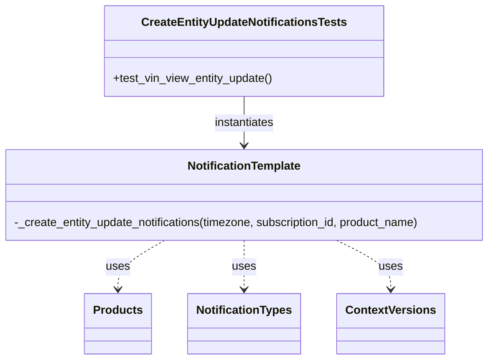
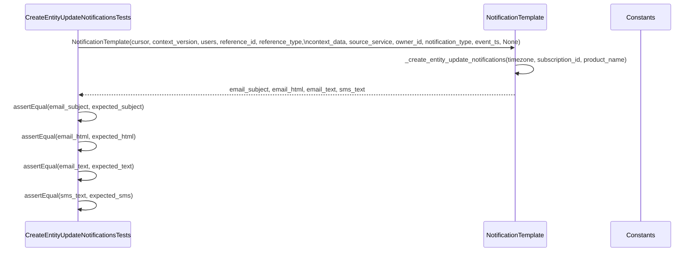

# Diagram: common/notification_service/tests/test_create_entity_update_notifications.py

> Auto-generated by Obscura crawlers

## Diagram 1

### SVG

<svg id="container" width="694.203125" xmlns="http://www.w3.org/2000/svg" class="classDiagram" height="500" viewBox="0 0 694.203125 500" role="graphics-document document" aria-roledescription="class"><g><defs><marker id="container_class-aggregationStart" class="marker aggregation class" refX="18" refY="7" markerWidth="190" markerHeight="240" orient="auto"><path d="M 18,7 L9,13 L1,7 L9,1 Z"></path></marker></defs><defs><marker id="container_class-aggregationEnd" class="marker aggregation class" refX="1" refY="7" markerWidth="20" markerHeight="28" orient="auto"><path d="M 18,7 L9,13 L1,7 L9,1 Z"></path></marker></defs><defs><marker id="container_class-extensionStart" class="marker extension class" refX="18" refY="7" markerWidth="190" markerHeight="240" orient="auto"><path d="M 1,7 L18,13 V 1 Z"></path></marker></defs><defs><marker id="container_class-extensionEnd" class="marker extension class" refX="1" refY="7" markerWidth="20" markerHeight="28" orient="auto"><path d="M 1,1 V 13 L18,7 Z"></path></marker></defs><defs><marker id="container_class-compositionStart" class="marker composition class" refX="18" refY="7" markerWidth="190" markerHeight="240" orient="auto"><path d="M 18,7 L9,13 L1,7 L9,1 Z"></path></marker></defs><defs><marker id="container_class-compositionEnd" class="marker composition class" refX="1" refY="7" markerWidth="20" markerHeight="28" orient="auto"><path d="M 18,7 L9,13 L1,7 L9,1 Z"></path></marker></defs><defs><marker id="container_class-dependencyStart" class="marker dependency class" refX="6" refY="7" markerWidth="190" markerHeight="240" orient="auto"><path d="M 5,7 L9,13 L1,7 L9,1 Z"></path></marker></defs><defs><marker id="container_class-dependencyEnd" class="marker dependency class" refX="13" refY="7" markerWidth="20" markerHeight="28" orient="auto"><path d="M 18,7 L9,13 L14,7 L9,1 Z"></path></marker></defs><defs><marker id="container_class-lollipopStart" class="marker lollipop class" refX="13" refY="7" markerWidth="190" markerHeight="240" orient="auto"><circle stroke="black" fill="transparent" cx="7" cy="7" r="6"></circle></marker></defs><defs><marker id="container_class-lollipopEnd" class="marker lollipop class" refX="1" refY="7" markerWidth="190" markerHeight="240" orient="auto"><circle stroke="black" fill="transparent" cx="7" cy="7" r="6"></circle></marker></defs><g class="root"><g class="clusters"></g><g class="edgePaths"><path d="M347.102,134L347.102,140.167C347.102,146.333,347.102,158.667,347.102,170C347.102,181.333,347.102,191.667,347.102,196.833L347.102,202" id="id_CreateEntityUpdateNotificationsTests_NotificationTemplate_1" class="edge-thickness-normal edge-pattern-solid relation" style=";;;" data-edge="true" data-et="edge" data-id="id_CreateEntityUpdateNotificationsTests_NotificationTemplate_1" data-points="W3sieCI6MzQ3LjEwMTU2MjUsInkiOjEzNH0seyJ4IjozNDcuMTAxNTYyNSwieSI6MTcxfSx7IngiOjM0Ny4xMDE1NjI1LCJ5IjoyMDh9XQ==" marker-end="url(#container_class-dependencyEnd)"></path><path d="M239.667,334L229.151,340.167C218.635,346.333,197.603,358.667,187.086,370C176.57,381.333,176.57,391.667,176.57,396.833L176.57,402" id="id_NotificationTemplate_Products_2" class="edge-thickness-normal edge-pattern-dashed relation" style=";;;" data-edge="true" data-et="edge" data-id="id_NotificationTemplate_Products_2" data-points="W3sieCI6MjM5LjY2Njg3NSwieSI6MzM0fSx7IngiOjE3Ni41NzAzMTI1LCJ5IjozNzF9LHsieCI6MTc2LjU3MDMxMjUsInkiOjQwOH1d" marker-end="url(#container_class-dependencyEnd)"></path><path d="M347.102,334L347.102,340.167C347.102,346.333,347.102,358.667,347.102,370C347.102,381.333,347.102,391.667,347.102,396.833L347.102,402" id="id_NotificationTemplate_NotificationTypes_3" class="edge-thickness-normal edge-pattern-dashed relation" style=";;;" data-edge="true" data-et="edge" data-id="id_NotificationTemplate_NotificationTypes_3" data-points="W3sieCI6MzQ3LjEwMTU2MjUsInkiOjMzNH0seyJ4IjozNDcuMTAxNTYyNSwieSI6MzcxfSx7IngiOjM0Ny4xMDE1NjI1LCJ5Ijo0MDh9XQ==" marker-end="url(#container_class-dependencyEnd)"></path><path d="M471.477,334L483.652,340.167C495.826,346.333,520.175,358.667,532.349,370C544.523,381.333,544.523,391.667,544.523,396.833L544.523,402" id="id_NotificationTemplate_ContextVersions_4" class="edge-thickness-normal edge-pattern-dashed relation" style=";;;" data-edge="true" data-et="edge" data-id="id_NotificationTemplate_ContextVersions_4" data-points="W3sieCI6NDcxLjQ3NzM0Mzc1LCJ5IjozMzR9LHsieCI6NTQ0LjUyMzQzNzUsInkiOjM3MX0seyJ4Ijo1NDQuNTIzNDM3NSwieSI6NDA4fV0=" marker-end="url(#container_class-dependencyEnd)"></path></g><g class="edgeLabels"><g class="edgeLabel" transform="translate(347.1015625, 171)"><g class="label" data-id="id_CreateEntityUpdateNotificationsTests_NotificationTemplate_1" transform="translate(-42.9140625, -12)"><foreignObject width="85.828125" height="24">

instantiates

</foreignObject></g></g><g class="edgeLabel" transform="translate(176.5703125, 371)"><g class="label" data-id="id_NotificationTemplate_Products_2" transform="translate(-16.4921875, -12)"><foreignObject width="32.984375" height="24">

uses

</foreignObject></g></g><g class="edgeLabel" transform="translate(347.1015625, 371)"><g class="label" data-id="id_NotificationTemplate_NotificationTypes_3" transform="translate(-16.4921875, -12)"><foreignObject width="32.984375" height="24">

uses

</foreignObject></g></g><g class="edgeLabel" transform="translate(544.5234375, 371)"><g class="label" data-id="id_NotificationTemplate_ContextVersions_4" transform="translate(-16.4921875, -12)"><foreignObject width="32.984375" height="24">

uses

</foreignObject></g></g></g><g class="nodes"><g class="node default" id="classId-CreateEntityUpdateNotificationsTests-0" transform="translate(347.1015625, 71)"><g class="basic label-container"><path d="M-192.7578125 -63 L192.7578125 -63 L192.7578125 63 L-192.7578125 63" stroke="none" stroke-width="0" fill="#ECECFF" style=""></path><path d="M-192.7578125 -63 C-110.07266641290947 -63, -27.38752032581894 -63, 192.7578125 -63 M-192.7578125 -63 C-88.6841040424569 -63, 15.389604415086211 -63, 192.7578125 -63 M192.7578125 -63 C192.7578125 -28.82311603221681, 192.7578125 5.353767935566381, 192.7578125 63 M192.7578125 -63 C192.7578125 -18.241491509945668, 192.7578125 26.517016980108664, 192.7578125 63 M192.7578125 63 C73.49409587622017 63, -45.76962074755966 63, -192.7578125 63 M192.7578125 63 C79.69317100667439 63, -33.37147048665122 63, -192.7578125 63 M-192.7578125 63 C-192.7578125 15.881291907299648, -192.7578125 -31.237416185400704, -192.7578125 -63 M-192.7578125 63 C-192.7578125 23.64974856127364, -192.7578125 -15.70050287745272, -192.7578125 -63" stroke="#9370DB" stroke-width="1.3" fill="none" stroke-dasharray="0 0" style=""></path></g><g class="annotation-group text" transform="translate(0, -39)"></g><g class="label-group text" transform="translate(-137.21875, -39)"><g class="label" style="font-weight: bolder" transform="translate(0,-12)"><foreignObject width="274.4375" height="24">

CreateEntityUpdateNotificationsTests

</foreignObject></g></g><g class="members-group text" transform="translate(-180.7578125, 9)"></g><g class="methods-group text" transform="translate(-180.7578125, 39)"><g class="label" style="" transform="translate(0,-12)"><foreignObject width="224.296875" height="24">

+test_vin_view_entity_update()

</foreignObject></g></g><g class="divider" style=""><path d="M-192.7578125 -15 C-106.637115374593 -15, -20.51641824918599 -15, 192.7578125 -15 M-192.7578125 -15 C-66.24570514932921 -15, 60.26640220134158 -15, 192.7578125 -15" stroke="#9370DB" stroke-width="1.3" fill="none" stroke-dasharray="0 0" style=""></path></g><g class="divider" style=""><path d="M-192.7578125 9 C-66.95873045870408 9, 58.840351582591836 9, 192.7578125 9 M-192.7578125 9 C-55.54810379190147 9, 81.66160491619706 9, 192.7578125 9" stroke="#9370DB" stroke-width="1.3" fill="none" stroke-dasharray="0 0" style=""></path></g></g><g class="node default" id="classId-NotificationTemplate-1" transform="translate(347.1015625, 271)"><g class="basic label-container"><path d="M-339.1015625 -63 L339.1015625 -63 L339.1015625 63 L-339.1015625 63" stroke="none" stroke-width="0" fill="#ECECFF" style=""></path><path d="M-339.1015625 -63 C-193.3490942599948 -63, -47.59662601998963 -63, 339.1015625 -63 M-339.1015625 -63 C-138.72237305741967 -63, 61.65681638516065 -63, 339.1015625 -63 M339.1015625 -63 C339.1015625 -35.63393593151687, 339.1015625 -8.267871863033747, 339.1015625 63 M339.1015625 -63 C339.1015625 -13.727425047032739, 339.1015625 35.54514990593452, 339.1015625 63 M339.1015625 63 C72.10784099602034 63, -194.8858805079593 63, -339.1015625 63 M339.1015625 63 C83.36559324733341 63, -172.37037600533318 63, -339.1015625 63 M-339.1015625 63 C-339.1015625 23.676594150114056, -339.1015625 -15.646811699771888, -339.1015625 -63 M-339.1015625 63 C-339.1015625 15.37207232750584, -339.1015625 -32.25585534498832, -339.1015625 -63" stroke="#9370DB" stroke-width="1.3" fill="none" stroke-dasharray="0 0" style=""></path></g><g class="annotation-group text" transform="translate(0, -39)"></g><g class="label-group text" transform="translate(-76.796875, -39)"><g class="label" style="font-weight: bolder" transform="translate(0,-12)"><foreignObject width="153.59375" height="24">

NotificationTemplate

</foreignObject></g></g><g class="members-group text" transform="translate(-327.1015625, 9)"></g><g class="methods-group text" transform="translate(-327.1015625, 39)"><g class="label" style="" transform="translate(0,-12)"><foreignObject width="577.40625" height="24">

-_create_entity_update_notifications(timezone, subscription_id, product_name)

</foreignObject></g></g><g class="divider" style=""><path d="M-339.1015625 -15 C-201.84817707110733 -15, -64.59479164221466 -15, 339.1015625 -15 M-339.1015625 -15 C-106.26409373118722 -15, 126.57337503762557 -15, 339.1015625 -15" stroke="#9370DB" stroke-width="1.3" fill="none" stroke-dasharray="0 0" style=""></path></g><g class="divider" style=""><path d="M-339.1015625 9 C-149.432860351754 9, 40.235841796492025 9, 339.1015625 9 M-339.1015625 9 C-164.51908169661283 9, 10.063399106774341 9, 339.1015625 9" stroke="#9370DB" stroke-width="1.3" fill="none" stroke-dasharray="0 0" style=""></path></g></g><g class="node default" id="classId-Products-2" transform="translate(176.5703125, 450)"><g class="basic label-container"><path d="M-44.4453125 -42 L44.4453125 -42 L44.4453125 42 L-44.4453125 42" stroke="none" stroke-width="0" fill="#ECECFF" style=""></path><path d="M-44.4453125 -42 C-17.589196218733516 -42, 9.266920062532968 -42, 44.4453125 -42 M-44.4453125 -42 C-18.18058466814191 -42, 8.084143163716178 -42, 44.4453125 -42 M44.4453125 -42 C44.4453125 -21.827123726917566, 44.4453125 -1.6542474538351328, 44.4453125 42 M44.4453125 -42 C44.4453125 -9.638226724593586, 44.4453125 22.723546550812827, 44.4453125 42 M44.4453125 42 C12.04083476020152 42, -20.36364297959696 42, -44.4453125 42 M44.4453125 42 C9.125697923689522 42, -26.193916652620956 42, -44.4453125 42 M-44.4453125 42 C-44.4453125 22.28922164459927, -44.4453125 2.578443289198539, -44.4453125 -42 M-44.4453125 42 C-44.4453125 10.219710261924625, -44.4453125 -21.56057947615075, -44.4453125 -42" stroke="#9370DB" stroke-width="1.3" fill="none" stroke-dasharray="0 0" style=""></path></g><g class="annotation-group text" transform="translate(0, -18)"></g><g class="label-group text" transform="translate(-32.4453125, -18)"><g class="label" style="font-weight: bolder" transform="translate(0,-12)"><foreignObject width="64.890625" height="24">

Products

</foreignObject></g></g><g class="members-group text" transform="translate(-32.4453125, 30)"></g><g class="methods-group text" transform="translate(-32.4453125, 60)"></g><g class="divider" style=""><path d="M-44.4453125 6 C-13.71153965020061 6, 17.02223319959878 6, 44.4453125 6 M-44.4453125 6 C-10.934281491681226 6, 22.57674951663755 6, 44.4453125 6" stroke="#9370DB" stroke-width="1.3" fill="none" stroke-dasharray="0 0" style=""></path></g><g class="divider" style=""><path d="M-44.4453125 24 C-14.209837522460688 24, 16.025637455078623 24, 44.4453125 24 M-44.4453125 24 C-23.871058919910855 24, -3.2968053398217094 24, 44.4453125 24" stroke="#9370DB" stroke-width="1.3" fill="none" stroke-dasharray="0 0" style=""></path></g></g><g class="node default" id="classId-NotificationTypes-3" transform="translate(347.1015625, 450)"><g class="basic label-container"><path d="M-76.0859375 -42 L76.0859375 -42 L76.0859375 42 L-76.0859375 42" stroke="none" stroke-width="0" fill="#ECECFF" style=""></path><path d="M-76.0859375 -42 C-25.51861066361817 -42, 25.048716172763662 -42, 76.0859375 -42 M-76.0859375 -42 C-34.78285658367843 -42, 6.520224332643139 -42, 76.0859375 -42 M76.0859375 -42 C76.0859375 -13.398610125988384, 76.0859375 15.202779748023232, 76.0859375 42 M76.0859375 -42 C76.0859375 -18.58263102538805, 76.0859375 4.8347379492239, 76.0859375 42 M76.0859375 42 C31.74356916737733 42, -12.598799165245339 42, -76.0859375 42 M76.0859375 42 C26.141541258388067 42, -23.802854983223867 42, -76.0859375 42 M-76.0859375 42 C-76.0859375 15.79131680068971, -76.0859375 -10.41736639862058, -76.0859375 -42 M-76.0859375 42 C-76.0859375 16.49558570317024, -76.0859375 -9.008828593659523, -76.0859375 -42" stroke="#9370DB" stroke-width="1.3" fill="none" stroke-dasharray="0 0" style=""></path></g><g class="annotation-group text" transform="translate(0, -18)"></g><g class="label-group text" transform="translate(-64.0859375, -18)"><g class="label" style="font-weight: bolder" transform="translate(0,-12)"><foreignObject width="128.171875" height="24">

NotificationTypes

</foreignObject></g></g><g class="members-group text" transform="translate(-64.0859375, 30)"></g><g class="methods-group text" transform="translate(-64.0859375, 60)"></g><g class="divider" style=""><path d="M-76.0859375 6 C-38.18981034328871 6, -0.2936831865774252 6, 76.0859375 6 M-76.0859375 6 C-25.569650943325392 6, 24.946635613349216 6, 76.0859375 6" stroke="#9370DB" stroke-width="1.3" fill="none" stroke-dasharray="0 0" style=""></path></g><g class="divider" style=""><path d="M-76.0859375 24 C-23.730749536251786 24, 28.62443842749643 24, 76.0859375 24 M-76.0859375 24 C-37.62079130171118 24, 0.8443548965776415 24, 76.0859375 24" stroke="#9370DB" stroke-width="1.3" fill="none" stroke-dasharray="0 0" style=""></path></g></g><g class="node default" id="classId-ContextVersions-4" transform="translate(544.5234375, 450)"><g class="basic label-container"><path d="M-71.3359375 -42 L71.3359375 -42 L71.3359375 42 L-71.3359375 42" stroke="none" stroke-width="0" fill="#ECECFF" style=""></path><path d="M-71.3359375 -42 C-39.70502927737045 -42, -8.0741210547409 -42, 71.3359375 -42 M-71.3359375 -42 C-21.727680842787983 -42, 27.880575814424034 -42, 71.3359375 -42 M71.3359375 -42 C71.3359375 -20.64325621112619, 71.3359375 0.7134875777476211, 71.3359375 42 M71.3359375 -42 C71.3359375 -16.42653561640098, 71.3359375 9.146928767198041, 71.3359375 42 M71.3359375 42 C29.526048877058344 42, -12.283839745883313 42, -71.3359375 42 M71.3359375 42 C36.763186129781026 42, 2.190434759562052 42, -71.3359375 42 M-71.3359375 42 C-71.3359375 19.921685917021193, -71.3359375 -2.1566281659576134, -71.3359375 -42 M-71.3359375 42 C-71.3359375 10.940866979597878, -71.3359375 -20.118266040804244, -71.3359375 -42" stroke="#9370DB" stroke-width="1.3" fill="none" stroke-dasharray="0 0" style=""></path></g><g class="annotation-group text" transform="translate(0, -18)"></g><g class="label-group text" transform="translate(-59.3359375, -18)"><g class="label" style="font-weight: bolder" transform="translate(0,-12)"><foreignObject width="118.671875" height="24">

ContextVersions

</foreignObject></g></g><g class="members-group text" transform="translate(-59.3359375, 30)"></g><g class="methods-group text" transform="translate(-59.3359375, 60)"></g><g class="divider" style=""><path d="M-71.3359375 6 C-34.16265143710175 6, 3.0106346257964987 6, 71.3359375 6 M-71.3359375 6 C-39.02496562620445 6, -6.713993752408896 6, 71.3359375 6" stroke="#9370DB" stroke-width="1.3" fill="none" stroke-dasharray="0 0" style=""></path></g><g class="divider" style=""><path d="M-71.3359375 24 C-18.99030575743496 24, 33.35532598513008 24, 71.3359375 24 M-71.3359375 24 C-18.140735040587778 24, 35.054467418824444 24, 71.3359375 24" stroke="#9370DB" stroke-width="1.3" fill="none" stroke-dasharray="0 0" style=""></path></g></g></g></g></g></svg>

## Diagram 2

### SVG

<svg id="container" width="1896" xmlns="http://www.w3.org/2000/svg" height="657" viewBox="-70.5 -10 1896 657" role="graphics-document document" aria-roledescription="sequence"><g><rect x="1625.5" y="571" fill="#eaeaea" stroke="#666" width="150" height="65" name="Const" rx="3" ry="3" class="actor actor-bottom"></rect><text x="1700.5" y="603.5" dominant-baseline="central" alignment-baseline="central" class="actor actor-box" style="text-anchor: middle; font-size: 16px; font-weight: 400;"><tspan x="1700.5" dy="0">Constants</tspan></text></g><g><rect x="1268.5" y="571" fill="#eaeaea" stroke="#666" width="172" height="65" name="NT" rx="3" ry="3" class="actor actor-bottom"></rect><text x="1354.5" y="603.5" dominant-baseline="central" alignment-baseline="central" class="actor actor-box" style="text-anchor: middle; font-size: 16px; font-weight: 400;"><tspan x="1354.5" dy="0">NotificationTemplate</tspan></text></g><g><rect x="0" y="571" fill="#eaeaea" stroke="#666" width="289" height="65" name="Test" rx="3" ry="3" class="actor actor-bottom"></rect><text x="144.5" y="603.5" dominant-baseline="central" alignment-baseline="central" class="actor actor-box" style="text-anchor: middle; font-size: 16px; font-weight: 400;"><tspan x="144.5" dy="0">CreateEntityUpdateNotificationsTests</tspan></text></g><g><line id="actor2" x1="1700.5" y1="65" x2="1700.5" y2="571" class="actor-line 200" stroke-width="0.5px" stroke="#999" name="Const"></line><g id="root-2"><rect x="1625.5" y="0" fill="#eaeaea" stroke="#666" width="150" height="65" name="Const" rx="3" ry="3" class="actor actor-top"></rect><text x="1700.5" y="32.5" dominant-baseline="central" alignment-baseline="central" class="actor actor-box" style="text-anchor: middle; font-size: 16px; font-weight: 400;"><tspan x="1700.5" dy="0">Constants</tspan></text></g></g><g><line id="actor1" x1="1354.5" y1="65" x2="1354.5" y2="571" class="actor-line 200" stroke-width="0.5px" stroke="#999" name="NT"></line><g id="root-1"><rect x="1268.5" y="0" fill="#eaeaea" stroke="#666" width="172" height="65" name="NT" rx="3" ry="3" class="actor actor-top"></rect><text x="1354.5" y="32.5" dominant-baseline="central" alignment-baseline="central" class="actor actor-box" style="text-anchor: middle; font-size: 16px; font-weight: 400;"><tspan x="1354.5" dy="0">NotificationTemplate</tspan></text></g></g><g><line id="actor0" x1="144.5" y1="65" x2="144.5" y2="571" class="actor-line 200" stroke-width="0.5px" stroke="#999" name="Test"></line><g id="root-0"><rect x="0" y="0" fill="#eaeaea" stroke="#666" width="289" height="65" name="Test" rx="3" ry="3" class="actor actor-top"></rect><text x="144.5" y="32.5" dominant-baseline="central" alignment-baseline="central" class="actor actor-box" style="text-anchor: middle; font-size: 16px; font-weight: 400;"><tspan x="144.5" dy="0">CreateEntityUpdateNotificationsTests</tspan></text></g></g><g></g><defs><symbol id="computer" width="24" height="24"><path transform="scale(.5)" d="M2 2v13h20v-13h-20zm18 11h-16v-9h16v9zm-10.228 6l.466-1h3.524l.467 1h-4.457zm14.228 3h-24l2-6h2.104l-1.33 4h18.45l-1.297-4h2.073l2 6zm-5-10h-14v-7h14v7z"></path></symbol></defs><defs><symbol id="database" fill-rule="evenodd" clip-rule="evenodd"><path transform="scale(.5)" d="M12.258.001l.256.004.255.005.253.008.251.01.249.012.247.015.246.016.242.019.241.02.239.023.236.024.233.027.231.028.229.031.225.032.223.034.22.036.217.038.214.04.211.041.208.043.205.045.201.046.198.048.194.05.191.051.187.053.183.054.18.056.175.057.172.059.168.06.163.061.16.063.155.064.15.066.074.033.073.033.071.034.07.034.069.035.068.035.067.035.066.035.064.036.064.036.062.036.06.036.06.037.058.037.058.037.055.038.055.038.053.038.052.038.051.039.05.039.048.039.047.039.045.04.044.04.043.04.041.04.04.041.039.041.037.041.036.041.034.041.033.042.032.042.03.042.029.042.027.042.026.043.024.043.023.043.021.043.02.043.018.044.017.043.015.044.013.044.012.044.011.045.009.044.007.045.006.045.004.045.002.045.001.045v17l-.001.045-.002.045-.004.045-.006.045-.007.045-.009.044-.011.045-.012.044-.013.044-.015.044-.017.043-.018.044-.02.043-.021.043-.023.043-.024.043-.026.043-.027.042-.029.042-.03.042-.032.042-.033.042-.034.041-.036.041-.037.041-.039.041-.04.041-.041.04-.043.04-.044.04-.045.04-.047.039-.048.039-.05.039-.051.039-.052.038-.053.038-.055.038-.055.038-.058.037-.058.037-.06.037-.06.036-.062.036-.064.036-.064.036-.066.035-.067.035-.068.035-.069.035-.07.034-.071.034-.073.033-.074.033-.15.066-.155.064-.16.063-.163.061-.168.06-.172.059-.175.057-.18.056-.183.054-.187.053-.191.051-.194.05-.198.048-.201.046-.205.045-.208.043-.211.041-.214.04-.217.038-.22.036-.223.034-.225.032-.229.031-.231.028-.233.027-.236.024-.239.023-.241.02-.242.019-.246.016-.247.015-.249.012-.251.01-.253.008-.255.005-.256.004-.258.001-.258-.001-.256-.004-.255-.005-.253-.008-.251-.01-.249-.012-.247-.015-.245-.016-.243-.019-.241-.02-.238-.023-.236-.024-.234-.027-.231-.028-.228-.031-.226-.032-.223-.034-.22-.036-.217-.038-.214-.04-.211-.041-.208-.043-.204-.045-.201-.046-.198-.048-.195-.05-.19-.051-.187-.053-.184-.054-.179-.056-.176-.057-.172-.059-.167-.06-.164-.061-.159-.063-.155-.064-.151-.066-.074-.033-.072-.033-.072-.034-.07-.034-.069-.035-.068-.035-.067-.035-.066-.035-.064-.036-.063-.036-.062-.036-.061-.036-.06-.037-.058-.037-.057-.037-.056-.038-.055-.038-.053-.038-.052-.038-.051-.039-.049-.039-.049-.039-.046-.039-.046-.04-.044-.04-.043-.04-.041-.04-.04-.041-.039-.041-.037-.041-.036-.041-.034-.041-.033-.042-.032-.042-.03-.042-.029-.042-.027-.042-.026-.043-.024-.043-.023-.043-.021-.043-.02-.043-.018-.044-.017-.043-.015-.044-.013-.044-.012-.044-.011-.045-.009-.044-.007-.045-.006-.045-.004-.045-.002-.045-.001-.045v-17l.001-.045.002-.045.004-.045.006-.045.007-.045.009-.044.011-.045.012-.044.013-.044.015-.044.017-.043.018-.044.02-.043.021-.043.023-.043.024-.043.026-.043.027-.042.029-.042.03-.042.032-.042.033-.042.034-.041.036-.041.037-.041.039-.041.04-.041.041-.04.043-.04.044-.04.046-.04.046-.039.049-.039.049-.039.051-.039.052-.038.053-.038.055-.038.056-.038.057-.037.058-.037.06-.037.061-.036.062-.036.063-.036.064-.036.066-.035.067-.035.068-.035.069-.035.07-.034.072-.034.072-.033.074-.033.151-.066.155-.064.159-.063.164-.061.167-.06.172-.059.176-.057.179-.056.184-.054.187-.053.19-.051.195-.05.198-.048.201-.046.204-.045.208-.043.211-.041.214-.04.217-.038.22-.036.223-.034.226-.032.228-.031.231-.028.234-.027.236-.024.238-.023.241-.02.243-.019.245-.016.247-.015.249-.012.251-.01.253-.008.255-.005.256-.004.258-.001.258.001zm-9.258 20.499v.01l.001.021.003.021.004.022.005.021.006.022.007.022.009.023.01.022.011.023.012.023.013.023.015.023.016.024.017.023.018.024.019.024.021.024.022.025.023.024.024.025.052.049.056.05.061.051.066.051.07.051.075.051.079.052.084.052.088.052.092.052.097.052.102.051.105.052.11.052.114.051.119.051.123.051.127.05.131.05.135.05.139.048.144.049.147.047.152.047.155.047.16.045.163.045.167.043.171.043.176.041.178.041.183.039.187.039.19.037.194.035.197.035.202.033.204.031.209.03.212.029.216.027.219.025.222.024.226.021.23.02.233.018.236.016.24.015.243.012.246.01.249.008.253.005.256.004.259.001.26-.001.257-.004.254-.005.25-.008.247-.011.244-.012.241-.014.237-.016.233-.018.231-.021.226-.021.224-.024.22-.026.216-.027.212-.028.21-.031.205-.031.202-.034.198-.034.194-.036.191-.037.187-.039.183-.04.179-.04.175-.042.172-.043.168-.044.163-.045.16-.046.155-.046.152-.047.148-.048.143-.049.139-.049.136-.05.131-.05.126-.05.123-.051.118-.052.114-.051.11-.052.106-.052.101-.052.096-.052.092-.052.088-.053.083-.051.079-.052.074-.052.07-.051.065-.051.06-.051.056-.05.051-.05.023-.024.023-.025.021-.024.02-.024.019-.024.018-.024.017-.024.015-.023.014-.024.013-.023.012-.023.01-.023.01-.022.008-.022.006-.022.006-.022.004-.022.004-.021.001-.021.001-.021v-4.127l-.077.055-.08.053-.083.054-.085.053-.087.052-.09.052-.093.051-.095.05-.097.05-.1.049-.102.049-.105.048-.106.047-.109.047-.111.046-.114.045-.115.045-.118.044-.12.043-.122.042-.124.042-.126.041-.128.04-.13.04-.132.038-.134.038-.135.037-.138.037-.139.035-.142.035-.143.034-.144.033-.147.032-.148.031-.15.03-.151.03-.153.029-.154.027-.156.027-.158.026-.159.025-.161.024-.162.023-.163.022-.165.021-.166.02-.167.019-.169.018-.169.017-.171.016-.173.015-.173.014-.175.013-.175.012-.177.011-.178.01-.179.008-.179.008-.181.006-.182.005-.182.004-.184.003-.184.002h-.37l-.184-.002-.184-.003-.182-.004-.182-.005-.181-.006-.179-.008-.179-.008-.178-.01-.176-.011-.176-.012-.175-.013-.173-.014-.172-.015-.171-.016-.17-.017-.169-.018-.167-.019-.166-.02-.165-.021-.163-.022-.162-.023-.161-.024-.159-.025-.157-.026-.156-.027-.155-.027-.153-.029-.151-.03-.15-.03-.148-.031-.146-.032-.145-.033-.143-.034-.141-.035-.14-.035-.137-.037-.136-.037-.134-.038-.132-.038-.13-.04-.128-.04-.126-.041-.124-.042-.122-.042-.12-.044-.117-.043-.116-.045-.113-.045-.112-.046-.109-.047-.106-.047-.105-.048-.102-.049-.1-.049-.097-.05-.095-.05-.093-.052-.09-.051-.087-.052-.085-.053-.083-.054-.08-.054-.077-.054v4.127zm0-5.654v.011l.001.021.003.021.004.021.005.022.006.022.007.022.009.022.01.022.011.023.012.023.013.023.015.024.016.023.017.024.018.024.019.024.021.024.022.024.023.025.024.024.052.05.056.05.061.05.066.051.07.051.075.052.079.051.084.052.088.052.092.052.097.052.102.052.105.052.11.051.114.051.119.052.123.05.127.051.131.05.135.049.139.049.144.048.147.048.152.047.155.046.16.045.163.045.167.044.171.042.176.042.178.04.183.04.187.038.19.037.194.036.197.034.202.033.204.032.209.03.212.028.216.027.219.025.222.024.226.022.23.02.233.018.236.016.24.014.243.012.246.01.249.008.253.006.256.003.259.001.26-.001.257-.003.254-.006.25-.008.247-.01.244-.012.241-.015.237-.016.233-.018.231-.02.226-.022.224-.024.22-.025.216-.027.212-.029.21-.03.205-.032.202-.033.198-.035.194-.036.191-.037.187-.039.183-.039.179-.041.175-.042.172-.043.168-.044.163-.045.16-.045.155-.047.152-.047.148-.048.143-.048.139-.05.136-.049.131-.05.126-.051.123-.051.118-.051.114-.052.11-.052.106-.052.101-.052.096-.052.092-.052.088-.052.083-.052.079-.052.074-.051.07-.052.065-.051.06-.05.056-.051.051-.049.023-.025.023-.024.021-.025.02-.024.019-.024.018-.024.017-.024.015-.023.014-.023.013-.024.012-.022.01-.023.01-.023.008-.022.006-.022.006-.022.004-.021.004-.022.001-.021.001-.021v-4.139l-.077.054-.08.054-.083.054-.085.052-.087.053-.09.051-.093.051-.095.051-.097.05-.1.049-.102.049-.105.048-.106.047-.109.047-.111.046-.114.045-.115.044-.118.044-.12.044-.122.042-.124.042-.126.041-.128.04-.13.039-.132.039-.134.038-.135.037-.138.036-.139.036-.142.035-.143.033-.144.033-.147.033-.148.031-.15.03-.151.03-.153.028-.154.028-.156.027-.158.026-.159.025-.161.024-.162.023-.163.022-.165.021-.166.02-.167.019-.169.018-.169.017-.171.016-.173.015-.173.014-.175.013-.175.012-.177.011-.178.009-.179.009-.179.007-.181.007-.182.005-.182.004-.184.003-.184.002h-.37l-.184-.002-.184-.003-.182-.004-.182-.005-.181-.007-.179-.007-.179-.009-.178-.009-.176-.011-.176-.012-.175-.013-.173-.014-.172-.015-.171-.016-.17-.017-.169-.018-.167-.019-.166-.02-.165-.021-.163-.022-.162-.023-.161-.024-.159-.025-.157-.026-.156-.027-.155-.028-.153-.028-.151-.03-.15-.03-.148-.031-.146-.033-.145-.033-.143-.033-.141-.035-.14-.036-.137-.036-.136-.037-.134-.038-.132-.039-.13-.039-.128-.04-.126-.041-.124-.042-.122-.043-.12-.043-.117-.044-.116-.044-.113-.046-.112-.046-.109-.046-.106-.047-.105-.048-.102-.049-.1-.049-.097-.05-.095-.051-.093-.051-.09-.051-.087-.053-.085-.052-.083-.054-.08-.054-.077-.054v4.139zm0-5.666v.011l.001.02.003.022.004.021.005.022.006.021.007.022.009.023.01.022.011.023.012.023.013.023.015.023.016.024.017.024.018.023.019.024.021.025.022.024.023.024.024.025.052.05.056.05.061.05.066.051.07.051.075.052.079.051.084.052.088.052.092.052.097.052.102.052.105.051.11.052.114.051.119.051.123.051.127.05.131.05.135.05.139.049.144.048.147.048.152.047.155.046.16.045.163.045.167.043.171.043.176.042.178.04.183.04.187.038.19.037.194.036.197.034.202.033.204.032.209.03.212.028.216.027.219.025.222.024.226.021.23.02.233.018.236.017.24.014.243.012.246.01.249.008.253.006.256.003.259.001.26-.001.257-.003.254-.006.25-.008.247-.01.244-.013.241-.014.237-.016.233-.018.231-.02.226-.022.224-.024.22-.025.216-.027.212-.029.21-.03.205-.032.202-.033.198-.035.194-.036.191-.037.187-.039.183-.039.179-.041.175-.042.172-.043.168-.044.163-.045.16-.045.155-.047.152-.047.148-.048.143-.049.139-.049.136-.049.131-.051.126-.05.123-.051.118-.052.114-.051.11-.052.106-.052.101-.052.096-.052.092-.052.088-.052.083-.052.079-.052.074-.052.07-.051.065-.051.06-.051.056-.05.051-.049.023-.025.023-.025.021-.024.02-.024.019-.024.018-.024.017-.024.015-.023.014-.024.013-.023.012-.023.01-.022.01-.023.008-.022.006-.022.006-.022.004-.022.004-.021.001-.021.001-.021v-4.153l-.077.054-.08.054-.083.053-.085.053-.087.053-.09.051-.093.051-.095.051-.097.05-.1.049-.102.048-.105.048-.106.048-.109.046-.111.046-.114.046-.115.044-.118.044-.12.043-.122.043-.124.042-.126.041-.128.04-.13.039-.132.039-.134.038-.135.037-.138.036-.139.036-.142.034-.143.034-.144.033-.147.032-.148.032-.15.03-.151.03-.153.028-.154.028-.156.027-.158.026-.159.024-.161.024-.162.023-.163.023-.165.021-.166.02-.167.019-.169.018-.169.017-.171.016-.173.015-.173.014-.175.013-.175.012-.177.01-.178.01-.179.009-.179.007-.181.006-.182.006-.182.004-.184.003-.184.001-.185.001-.185-.001-.184-.001-.184-.003-.182-.004-.182-.006-.181-.006-.179-.007-.179-.009-.178-.01-.176-.01-.176-.012-.175-.013-.173-.014-.172-.015-.171-.016-.17-.017-.169-.018-.167-.019-.166-.02-.165-.021-.163-.023-.162-.023-.161-.024-.159-.024-.157-.026-.156-.027-.155-.028-.153-.028-.151-.03-.15-.03-.148-.032-.146-.032-.145-.033-.143-.034-.141-.034-.14-.036-.137-.036-.136-.037-.134-.038-.132-.039-.13-.039-.128-.041-.126-.041-.124-.041-.122-.043-.12-.043-.117-.044-.116-.044-.113-.046-.112-.046-.109-.046-.106-.048-.105-.048-.102-.048-.1-.05-.097-.049-.095-.051-.093-.051-.09-.052-.087-.052-.085-.053-.083-.053-.08-.054-.077-.054v4.153zm8.74-8.179l-.257.004-.254.005-.25.008-.247.011-.244.012-.241.014-.237.016-.233.018-.231.021-.226.022-.224.023-.22.026-.216.027-.212.028-.21.031-.205.032-.202.033-.198.034-.194.036-.191.038-.187.038-.183.04-.179.041-.175.042-.172.043-.168.043-.163.045-.16.046-.155.046-.152.048-.148.048-.143.048-.139.049-.136.05-.131.05-.126.051-.123.051-.118.051-.114.052-.11.052-.106.052-.101.052-.096.052-.092.052-.088.052-.083.052-.079.052-.074.051-.07.052-.065.051-.06.05-.056.05-.051.05-.023.025-.023.024-.021.024-.02.025-.019.024-.018.024-.017.023-.015.024-.014.023-.013.023-.012.023-.01.023-.01.022-.008.022-.006.023-.006.021-.004.022-.004.021-.001.021-.001.021.001.021.001.021.004.021.004.022.006.021.006.023.008.022.01.022.01.023.012.023.013.023.014.023.015.024.017.023.018.024.019.024.02.025.021.024.023.024.023.025.051.05.056.05.06.05.065.051.07.052.074.051.079.052.083.052.088.052.092.052.096.052.101.052.106.052.11.052.114.052.118.051.123.051.126.051.131.05.136.05.139.049.143.048.148.048.152.048.155.046.16.046.163.045.168.043.172.043.175.042.179.041.183.04.187.038.191.038.194.036.198.034.202.033.205.032.21.031.212.028.216.027.22.026.224.023.226.022.231.021.233.018.237.016.241.014.244.012.247.011.25.008.254.005.257.004.26.001.26-.001.257-.004.254-.005.25-.008.247-.011.244-.012.241-.014.237-.016.233-.018.231-.021.226-.022.224-.023.22-.026.216-.027.212-.028.21-.031.205-.032.202-.033.198-.034.194-.036.191-.038.187-.038.183-.04.179-.041.175-.042.172-.043.168-.043.163-.045.16-.046.155-.046.152-.048.148-.048.143-.048.139-.049.136-.05.131-.05.126-.051.123-.051.118-.051.114-.052.11-.052.106-.052.101-.052.096-.052.092-.052.088-.052.083-.052.079-.052.074-.051.07-.052.065-.051.06-.05.056-.05.051-.05.023-.025.023-.024.021-.024.02-.025.019-.024.018-.024.017-.023.015-.024.014-.023.013-.023.012-.023.01-.023.01-.022.008-.022.006-.023.006-.021.004-.022.004-.021.001-.021.001-.021-.001-.021-.001-.021-.004-.021-.004-.022-.006-.021-.006-.023-.008-.022-.01-.022-.01-.023-.012-.023-.013-.023-.014-.023-.015-.024-.017-.023-.018-.024-.019-.024-.02-.025-.021-.024-.023-.024-.023-.025-.051-.05-.056-.05-.06-.05-.065-.051-.07-.052-.074-.051-.079-.052-.083-.052-.088-.052-.092-.052-.096-.052-.101-.052-.106-.052-.11-.052-.114-.052-.118-.051-.123-.051-.126-.051-.131-.05-.136-.05-.139-.049-.143-.048-.148-.048-.152-.048-.155-.046-.16-.046-.163-.045-.168-.043-.172-.043-.175-.042-.179-.041-.183-.04-.187-.038-.191-.038-.194-.036-.198-.034-.202-.033-.205-.032-.21-.031-.212-.028-.216-.027-.22-.026-.224-.023-.226-.022-.231-.021-.233-.018-.237-.016-.241-.014-.244-.012-.247-.011-.25-.008-.254-.005-.257-.004-.26-.001-.26.001z"></path></symbol></defs><defs><symbol id="clock" width="24" height="24"><path transform="scale(.5)" d="M12 2c5.514 0 10 4.486 10 10s-4.486 10-10 10-10-4.486-10-10 4.486-10 10-10zm0-2c-6.627 0-12 5.373-12 12s5.373 12 12 12 12-5.373 12-12-5.373-12-12-12zm5.848 12.459c.202.038.202.333.001.372-1.907.361-6.045 1.111-6.547 1.111-.719 0-1.301-.582-1.301-1.301 0-.512.77-5.447 1.125-7.445.034-.192.312-.181.343.014l.985 6.238 5.394 1.011z"></path></symbol></defs><defs><marker id="arrowhead" refX="7.9" refY="5" markerUnits="userSpaceOnUse" markerWidth="12" markerHeight="12" orient="auto-start-reverse"><path d="M -1 0 L 10 5 L 0 10 z"></path></marker></defs><defs><marker id="crosshead" markerWidth="15" markerHeight="8" orient="auto" refX="4" refY="4.5"><path fill="none" stroke="#000000" stroke-width="1pt" d="M 1,2 L 6,7 M 6,2 L 1,7" style="stroke-dasharray: 0, 0;"></path></marker></defs><defs><marker id="filled-head" refX="15.5" refY="7" markerWidth="20" markerHeight="28" orient="auto"><path d="M 18,7 L9,13 L14,7 L9,1 Z"></path></marker></defs><defs><marker id="sequencenumber" refX="15" refY="15" markerWidth="60" markerHeight="40" orient="auto"><circle cx="15" cy="15" r="6"></circle></marker></defs><text x="748" y="80" text-anchor="middle" dominant-baseline="middle" alignment-baseline="middle" class="messageText" dy="1em" style="font-size: 16px; font-weight: 400;">NotificationTemplate(cursor, context_version, users, reference_id, reference_type,\ncontext_data, source_service, owner_id, notification_type, event_ts, None)</text><line x1="145.5" y1="113" x2="1350.5" y2="113" class="messageLine0" stroke-width="2" stroke="none" marker-end="url(#arrowhead)" style="fill: none;"></line><text x="1356" y="128" text-anchor="middle" dominant-baseline="middle" alignment-baseline="middle" class="messageText" dy="1em" style="font-size: 16px; font-weight: 400;">_create_entity_update_notifications(timezone, subscription_id, product_name)</text><path d="M 1355.5,161 C 1415.5,151 1415.5,191 1355.5,181" class="messageLine0" stroke-width="2" stroke="none" marker-end="url(#arrowhead)" style="fill: none;"></path><text x="751" y="206" text-anchor="middle" dominant-baseline="middle" alignment-baseline="middle" class="messageText" dy="1em" style="font-size: 16px; font-weight: 400;">email_subject, email_html, email_text, sms_text</text><line x1="1353.5" y1="239" x2="148.5" y2="239" class="messageLine1" stroke-width="2" stroke="none" marker-end="url(#arrowhead)" style="stroke-dasharray: 3, 3; fill: none;"></line><text x="146" y="254" text-anchor="middle" dominant-baseline="middle" alignment-baseline="middle" class="messageText" dy="1em" style="font-size: 16px; font-weight: 400;">assertEqual(email_subject, expected_subject)</text><path d="M 145.5,287 C 205.5,277 205.5,317 145.5,307" class="messageLine0" stroke-width="2" stroke="none" marker-end="url(#arrowhead)" style="fill: none;"></path><text x="146" y="332" text-anchor="middle" dominant-baseline="middle" alignment-baseline="middle" class="messageText" dy="1em" style="font-size: 16px; font-weight: 400;">assertEqual(email_html, expected_html)</text><path d="M 145.5,365 C 205.5,355 205.5,395 145.5,385" class="messageLine0" stroke-width="2" stroke="none" marker-end="url(#arrowhead)" style="fill: none;"></path><text x="146" y="410" text-anchor="middle" dominant-baseline="middle" alignment-baseline="middle" class="messageText" dy="1em" style="font-size: 16px; font-weight: 400;">assertEqual(email_text, expected_text)</text><path d="M 145.5,443 C 205.5,433 205.5,473 145.5,463" class="messageLine0" stroke-width="2" stroke="none" marker-end="url(#arrowhead)" style="fill: none;"></path><text x="146" y="488" text-anchor="middle" dominant-baseline="middle" alignment-baseline="middle" class="messageText" dy="1em" style="font-size: 16px; font-weight: 400;">assertEqual(sms_text, expected_sms)</text><path d="M 145.5,521 C 205.5,511 205.5,551 145.5,541" class="messageLine0" stroke-width="2" stroke="none" marker-end="url(#arrowhead)" style="fill: none;"></path></svg>
