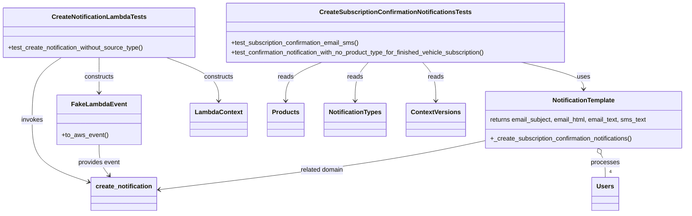

# Diagram: common/notification_service/tests/test_create_notifcation_for_opt_in.py


> Auto-generated by Obscura crawlers

## Diagram 1



### SVG

<svg id="container" width="1726.779296875" xmlns="http://www.w3.org/2000/svg" class="classDiagram" height="542" viewBox="0 0 1726.779296875 542" role="graphics-document document" aria-roledescription="class"><style>#container{font-family:"trebuchet ms",verdana,arial,sans-serif;font-size:16px;fill:#333;}@keyframes edge-animation-frame{from{stroke-dashoffset:0;}}@keyframes dash{to{stroke-dashoffset:0;}}#container .edge-animation-slow{stroke-dasharray:9,5!important;stroke-dashoffset:900;animation:dash 50s linear infinite;stroke-linecap:round;}#container .edge-animation-fast{stroke-dasharray:9,5!important;stroke-dashoffset:900;animation:dash 20s linear infinite;stroke-linecap:round;}#container .error-icon{fill:#552222;}#container .error-text{fill:#552222;stroke:#552222;}#container .edge-thickness-normal{stroke-width:1px;}#container .edge-thickness-thick{stroke-width:3.5px;}#container .edge-pattern-solid{stroke-dasharray:0;}#container .edge-thickness-invisible{stroke-width:0;fill:none;}#container .edge-pattern-dashed{stroke-dasharray:3;}#container .edge-pattern-dotted{stroke-dasharray:2;}#container .marker{fill:#333333;stroke:#333333;}#container .marker.cross{stroke:#333333;}#container svg{font-family:"trebuchet ms",verdana,arial,sans-serif;font-size:16px;}#container p{margin:0;}#container g.classGroup text{fill:#9370DB;stroke:none;font-family:"trebuchet ms",verdana,arial,sans-serif;font-size:10px;}#container g.classGroup text .title{font-weight:bolder;}#container .nodeLabel,#container .edgeLabel{color:#131300;}#container .edgeLabel .label rect{fill:#ECECFF;}#container .label text{fill:#131300;}#container .labelBkg{background:#ECECFF;}#container .edgeLabel .label span{background:#ECECFF;}#container .classTitle{font-weight:bolder;}#container .node rect,#container .node circle,#container .node ellipse,#container .node polygon,#container .node path{fill:#ECECFF;stroke:#9370DB;stroke-width:1px;}#container .divider{stroke:#9370DB;stroke-width:1;}#container g.clickable{cursor:pointer;}#container g.classGroup rect{fill:#ECECFF;stroke:#9370DB;}#container g.classGroup line{stroke:#9370DB;stroke-width:1;}#container .classLabel .box{stroke:none;stroke-width:0;fill:#ECECFF;opacity:0.5;}#container .classLabel .label{fill:#9370DB;font-size:10px;}#container .relation{stroke:#333333;stroke-width:1;fill:none;}#container .dashed-line{stroke-dasharray:3;}#container .dotted-line{stroke-dasharray:1 2;}#container #compositionStart,#container .composition{fill:#333333!important;stroke:#333333!important;stroke-width:1;}#container #compositionEnd,#container .composition{fill:#333333!important;stroke:#333333!important;stroke-width:1;}#container #dependencyStart,#container .dependency{fill:#333333!important;stroke:#333333!important;stroke-width:1;}#container #dependencyStart,#container .dependency{fill:#333333!important;stroke:#333333!important;stroke-width:1;}#container #extensionStart,#container .extension{fill:transparent!important;stroke:#333333!important;stroke-width:1;}#container #extensionEnd,#container .extension{fill:transparent!important;stroke:#333333!important;stroke-width:1;}#container #aggregationStart,#container .aggregation{fill:transparent!important;stroke:#333333!important;stroke-width:1;}#container #aggregationEnd,#container .aggregation{fill:transparent!important;stroke:#333333!important;stroke-width:1;}#container #lollipopStart,#container .lollipop{fill:#ECECFF!important;stroke:#333333!important;stroke-width:1;}#container #lollipopEnd,#container .lollipop{fill:#ECECFF!important;stroke:#333333!important;stroke-width:1;}#container .edgeTerminals{font-size:11px;line-height:initial;}#container .classTitleText{text-anchor:middle;font-size:18px;fill:#333;}#container .label-icon{display:inline-block;height:1em;overflow:visible;vertical-align:-0.125em;}#container .node .label-icon path{fill:currentColor;stroke:revert;stroke-width:revert;}#container :root{--mermaid-font-family:"trebuchet ms",verdana,arial,sans-serif;}</style><g><defs><marker id="container_class-aggregationStart" class="marker aggregation class" refX="18" refY="7" markerWidth="190" markerHeight="240" orient="auto"><path d="M 18,7 L9,13 L1,7 L9,1 Z"></path></marker></defs><defs><marker id="container_class-aggregationEnd" class="marker aggregation class" refX="1" refY="7" markerWidth="20" markerHeight="28" orient="auto"><path d="M 18,7 L9,13 L1,7 L9,1 Z"></path></marker></defs><defs><marker id="container_class-extensionStart" class="marker extension class" refX="18" refY="7" markerWidth="190" markerHeight="240" orient="auto"><path d="M 1,7 L18,13 V 1 Z"></path></marker></defs><defs><marker id="container_class-extensionEnd" class="marker extension class" refX="1" refY="7" markerWidth="20" markerHeight="28" orient="auto"><path d="M 1,1 V 13 L18,7 Z"></path></marker></defs><defs><marker id="container_class-compositionStart" class="marker composition class" refX="18" refY="7" markerWidth="190" markerHeight="240" orient="auto"><path d="M 18,7 L9,13 L1,7 L9,1 Z"></path></marker></defs><defs><marker id="container_class-compositionEnd" class="marker composition class" refX="1" refY="7" markerWidth="20" markerHeight="28" orient="auto"><path d="M 18,7 L9,13 L1,7 L9,1 Z"></path></marker></defs><defs><marker id="container_class-dependencyStart" class="marker dependency class" refX="6" refY="7" markerWidth="190" markerHeight="240" orient="auto"><path d="M 5,7 L9,13 L1,7 L9,1 Z"></path></marker></defs><defs><marker id="container_class-dependencyEnd" class="marker dependency class" refX="13" refY="7" markerWidth="20" markerHeight="28" orient="auto"><path d="M 18,7 L9,13 L14,7 L9,1 Z"></path></marker></defs><defs><marker id="container_class-lollipopStart" class="marker lollipop class" refX="13" refY="7" markerWidth="190" markerHeight="240" orient="auto"><circle stroke="black" fill="transparent" cx="7" cy="7" r="6"></circle></marker></defs><defs><marker id="container_class-lollipopEnd" class="marker lollipop class" refX="1" refY="7" markerWidth="190" markerHeight="240" orient="auto"><circle stroke="black" fill="transparent" cx="7" cy="7" r="6"></circle></marker></defs><g class="root"><g class="clusters"></g><g class="edgePaths"><path d="M1309.671,158L1335.71,164.167C1361.749,170.333,1413.827,182.667,1439.865,194C1465.904,205.333,1465.904,215.667,1465.904,220.833L1465.904,226" id="id_CreateSubscriptionConfirmationNotificationsTests_NotificationTemplate_1" class="edge-thickness-normal edge-pattern-solid relation" style=";;;" data-edge="true" data-et="edge" data-id="id_CreateSubscriptionConfirmationNotificationsTests_NotificationTemplate_1" data-points="W3sieCI6MTMwOS42NzExNzc0NTUzNTcsInkiOjE1OH0seyJ4IjoxNDY1LjkwNDI5Njg3NSwieSI6MTk1fSx7IngiOjE0NjUuOTA0Mjk2ODc1LCJ5IjoyMzJ9XQ==" marker-end="url(#container_class-dependencyEnd)"></path><path d="M812.686,158L797.862,164.167C783.038,170.333,753.389,182.667,738.565,199C723.74,215.333,723.74,235.667,723.74,245.833L723.74,256" id="id_CreateSubscriptionConfirmationNotificationsTests_Products_2" class="edge-thickness-normal edge-pattern-solid relation" style=";;;" data-edge="true" data-et="edge" data-id="id_CreateSubscriptionConfirmationNotificationsTests_Products_2" data-points="W3sieCI6ODEyLjY4NjMxNDE3NDEwNzEsInkiOjE1OH0seyJ4Ijo3MjMuNzQwMjM0Mzc1LCJ5IjoxOTV9LHsieCI6NzIzLjc0MDIzNDM3NSwieSI6MjYyfV0=" marker-end="url(#container_class-dependencyEnd)"></path><path d="M926.881,158L921.446,164.167C916.011,170.333,905.141,182.667,899.706,199C894.271,215.333,894.271,235.667,894.271,245.833L894.271,256" id="id_CreateSubscriptionConfirmationNotificationsTests_NotificationTypes_3" class="edge-thickness-normal edge-pattern-solid relation" style=";;;" data-edge="true" data-et="edge" data-id="id_CreateSubscriptionConfirmationNotificationsTests_NotificationTypes_3" data-points="W3sieCI6OTI2Ljg4MTM0NzY1NjI1LCJ5IjoxNTh9LHsieCI6ODk0LjI3MTQ4NDM3NSwieSI6MTk1fSx7IngiOjg5NC4yNzE0ODQzNzUsInkiOjI2Mn1d" marker-end="url(#container_class-dependencyEnd)"></path><path d="M1059.083,158L1064.518,164.167C1069.953,170.333,1080.823,182.667,1086.258,199C1091.693,215.333,1091.693,235.667,1091.693,245.833L1091.693,256" id="id_CreateSubscriptionConfirmationNotificationsTests_ContextVersions_4" class="edge-thickness-normal edge-pattern-solid relation" style=";;;" data-edge="true" data-et="edge" data-id="id_CreateSubscriptionConfirmationNotificationsTests_ContextVersions_4" data-points="W3sieCI6MTA1OS4wODM0OTYwOTM3NSwieSI6MTU4fSx7IngiOjEwOTEuNjkzMzU5Mzc1LCJ5IjoxOTV9LHsieCI6MTA5MS42OTMzNTkzNzUsInkiOjI2Mn1d" marker-end="url(#container_class-dependencyEnd)"></path><path d="M251.98,146L251.98,154.167C251.98,162.333,251.98,178.667,251.98,193.5C251.98,208.333,251.98,221.667,251.98,228.333L251.98,235" id="id_CreateNotificationLambdaTests_FakeLambdaEvent_5" class="edge-thickness-normal edge-pattern-solid relation" style=";;;" data-edge="true" data-et="edge" data-id="id_CreateNotificationLambdaTests_FakeLambdaEvent_5" data-points="W3sieCI6MjUxLjk4MDQ2ODc1LCJ5IjoxNDZ9LHsieCI6MjUxLjk4MDQ2ODc1LCJ5IjoxOTV9LHsieCI6MjUxLjk4MDQ2ODc1LCJ5IjoyNDF9XQ==" marker-end="url(#container_class-dependencyEnd)"></path><path d="M425.24,146L447.7,154.167C470.16,162.333,515.079,178.667,537.538,197C559.998,215.333,559.998,235.667,559.998,245.833L559.998,256" id="id_CreateNotificationLambdaTests_LambdaContext_6" class="edge-thickness-normal edge-pattern-solid relation" style=";;;" data-edge="true" data-et="edge" data-id="id_CreateNotificationLambdaTests_LambdaContext_6" data-points="W3sieCI6NDI1LjI0MDM1NjQ0NTMxMjUsInkiOjE0Nn0seyJ4Ijo1NTkuOTk4MDQ2ODc1LCJ5IjoxOTV9LHsieCI6NTU5Ljk5ODA0Njg3NSwieSI6MjYyfV0=" marker-end="url(#container_class-dependencyEnd)"></path><path d="M158.757,146L146.673,154.167C134.588,162.333,110.419,178.667,98.335,205C86.25,231.333,86.25,267.667,86.25,304C86.25,340.333,86.25,376.667,110.172,403.04C134.094,429.413,181.938,445.826,205.86,454.032L229.782,462.239" id="id_CreateNotificationLambdaTests_create_notification_7" class="edge-thickness-normal edge-pattern-solid relation" style=";;;" data-edge="true" data-et="edge" data-id="id_CreateNotificationLambdaTests_create_notification_7" data-points="W3sieCI6MTU4Ljc1NzA4MDA3ODEyNSwieSI6MTQ2fSx7IngiOjg2LjI1LCJ5IjoxOTV9LHsieCI6ODYuMjUsInkiOjMwNH0seyJ4Ijo4Ni4yNSwieSI6NDEzfSx7IngiOjIzNS40NTcwMzEyNSwieSI6NDY0LjE4NTkxMDgxMDMwNjV9XQ==" marker-end="url(#container_class-dependencyEnd)"></path><path d="M251.98,367L251.98,374.667C251.98,382.333,251.98,397.667,256.387,410.726C260.793,423.785,269.606,434.569,274.012,439.962L278.418,445.354" id="id_FakeLambdaEvent_create_notification_8" class="edge-thickness-normal edge-pattern-solid relation" style=";;;" data-edge="true" data-et="edge" data-id="id_FakeLambdaEvent_create_notification_8" data-points="W3sieCI6MjUxLjk4MDQ2ODc1LCJ5IjozNjd9LHsieCI6MjUxLjk4MDQ2ODc1LCJ5Ijo0MTN9LHsieCI6MjgyLjIxNDk0MjY0MjQwNTA1LCJ5Ijo0NTB9XQ==" marker-end="url(#container_class-dependencyEnd)"></path><path d="M1213.029,359.169L1171.905,368.141C1130.781,377.113,1048.533,395.056,913.623,415.431C778.713,435.806,591.141,458.612,497.355,470.015L403.569,481.418" id="id_NotificationTemplate_create_notification_9" class="edge-thickness-normal edge-pattern-solid relation" style=";;;" data-edge="true" data-et="edge" data-id="id_NotificationTemplate_create_notification_9" data-points="W3sieCI6MTIxMy4wMjkyOTY4NzUsInkiOjM1OS4xNjg3NzMwODg4NzYyNn0seyJ4Ijo5NjYuMjg1MTU2MjUsInkiOjQxM30seyJ4IjozOTcuNjEzMjgxMjUsInkiOjQ4Mi4xNDIwOTc5MjIyNzc4fV0=" marker-end="url(#container_class-dependencyEnd)"></path><path d="M1510.507,391.364L1512.348,394.97C1514.189,398.576,1517.871,405.788,1519.712,415.561C1521.553,425.333,1521.553,437.667,1521.553,443.833L1521.553,450" id="id_NotificationTemplate_Users_10" class="edge-thickness-normal edge-pattern-solid relation" style=";;;" data-edge="true" data-et="edge" data-id="id_NotificationTemplate_Users_10" data-points="W3sieCI6MTUwMi42NjI4OTc3OTI0MzEzLCJ5IjozNzZ9LHsieCI6MTUyMS41NTI3MzQzNzUsInkiOjQxM30seyJ4IjoxNTIxLjU1MjczNDM3NSwieSI6NDUwfV0=" marker-start="url(#container_class-aggregationStart)"></path></g><g class="edgeLabels"><g class="edgeLabel" transform="translate(1465.904296875, 195)"><g class="label" data-id="id_CreateSubscriptionConfirmationNotificationsTests_NotificationTemplate_1" transform="translate(-16.4921875, -12)"><foreignObject width="32.984375" height="24"><div xmlns="http://www.w3.org/1999/xhtml" class="labelBkg" style="display: table-cell; white-space: nowrap; line-height: 1.5; max-width: 200px; text-align: center;"><span class="edgeLabel"><p>uses</p></span></div></foreignObject></g></g><g class="edgeLabel" transform="translate(723.740234375, 195)"><g class="label" data-id="id_CreateSubscriptionConfirmationNotificationsTests_Products_2" transform="translate(-20.0078125, -12)"><foreignObject width="40.015625" height="24"><div xmlns="http://www.w3.org/1999/xhtml" class="labelBkg" style="display: table-cell; white-space: nowrap; line-height: 1.5; max-width: 200px; text-align: center;"><span class="edgeLabel"><p>reads</p></span></div></foreignObject></g></g><g class="edgeLabel" transform="translate(894.271484375, 195)"><g class="label" data-id="id_CreateSubscriptionConfirmationNotificationsTests_NotificationTypes_3" transform="translate(-20.0078125, -12)"><foreignObject width="40.015625" height="24"><div xmlns="http://www.w3.org/1999/xhtml" class="labelBkg" style="display: table-cell; white-space: nowrap; line-height: 1.5; max-width: 200px; text-align: center;"><span class="edgeLabel"><p>reads</p></span></div></foreignObject></g></g><g class="edgeLabel" transform="translate(1091.693359375, 195)"><g class="label" data-id="id_CreateSubscriptionConfirmationNotificationsTests_ContextVersions_4" transform="translate(-20.0078125, -12)"><foreignObject width="40.015625" height="24"><div xmlns="http://www.w3.org/1999/xhtml" class="labelBkg" style="display: table-cell; white-space: nowrap; line-height: 1.5; max-width: 200px; text-align: center;"><span class="edgeLabel"><p>reads</p></span></div></foreignObject></g></g><g class="edgeLabel" transform="translate(251.98046875, 195)"><g class="label" data-id="id_CreateNotificationLambdaTests_FakeLambdaEvent_5" transform="translate(-37.84375, -12)"><foreignObject width="75.6875" height="24"><div xmlns="http://www.w3.org/1999/xhtml" class="labelBkg" style="display: table-cell; white-space: nowrap; line-height: 1.5; max-width: 200px; text-align: center;"><span class="edgeLabel"><p>constructs</p></span></div></foreignObject></g></g><g class="edgeLabel" transform="translate(559.998046875, 195)"><g class="label" data-id="id_CreateNotificationLambdaTests_LambdaContext_6" transform="translate(-37.84375, -12)"><foreignObject width="75.6875" height="24"><div xmlns="http://www.w3.org/1999/xhtml" class="labelBkg" style="display: table-cell; white-space: nowrap; line-height: 1.5; max-width: 200px; text-align: center;"><span class="edgeLabel"><p>constructs</p></span></div></foreignObject></g></g><g class="edgeLabel" transform="translate(86.25, 304)"><g class="label" data-id="id_CreateNotificationLambdaTests_create_notification_7" transform="translate(-27.5859375, -12)"><foreignObject width="55.171875" height="24"><div xmlns="http://www.w3.org/1999/xhtml" class="labelBkg" style="display: table-cell; white-space: nowrap; line-height: 1.5; max-width: 200px; text-align: center;"><span class="edgeLabel"><p>invokes</p></span></div></foreignObject></g></g><g class="edgeLabel" transform="translate(251.98046875, 413)"><g class="label" data-id="id_FakeLambdaEvent_create_notification_8" transform="translate(-53.6015625, -12)"><foreignObject width="107.203125" height="24"><div xmlns="http://www.w3.org/1999/xhtml" class="labelBkg" style="display: table-cell; white-space: nowrap; line-height: 1.5; max-width: 200px; text-align: center;"><span class="edgeLabel"><p>provides event</p></span></div></foreignObject></g></g><g class="edgeLabel" transform="translate(807.30007, 432.33024)"><g class="label" data-id="id_NotificationTemplate_create_notification_9" transform="translate(-55.5078125, -12)"><foreignObject width="111.015625" height="24"><div xmlns="http://www.w3.org/1999/xhtml" class="labelBkg" style="display: table-cell; white-space: nowrap; line-height: 1.5; max-width: 200px; text-align: center;"><span class="edgeLabel"><p>related domain</p></span></div></foreignObject></g></g><g class="edgeLabel" transform="translate(1521.552734375, 413)"><g class="label" data-id="id_NotificationTemplate_Users_10" transform="translate(-35.7890625, -12)"><foreignObject width="71.578125" height="24"><div xmlns="http://www.w3.org/1999/xhtml" class="labelBkg" style="display: table-cell; white-space: nowrap; line-height: 1.5; max-width: 200px; text-align: center;"><span class="edgeLabel"><p>processes</p></span></div></foreignObject></g></g><g class="edgeTerminals" transform="translate(1531.5527321875, 427.49999812500005)"><g class="inner" transform="translate(0, 0)"></g><foreignObject style="width: 9px; height: 12px;"><div xmlns="http://www.w3.org/1999/xhtml" style="display: inline-block; padding-right: 1px; white-space: nowrap;"><span class="edgeLabel">4</span></div></foreignObject></g></g><g class="nodes"><g class="node default" id="classId-CreateSubscriptionConfirmationNotificationsTests-0" transform="translate(992.982421875, 83)"><g class="basic label-container"><path d="M-433.88671875 -75 L433.88671875 -75 L433.88671875 75 L-433.88671875 75" stroke="none" stroke-width="0" fill="#ECECFF" style=""></path><path d="M-433.88671875 -75 C-143.29984324176183 -75, 147.28703226647633 -75, 433.88671875 -75 M-433.88671875 -75 C-167.76470103619408 -75, 98.35731667761183 -75, 433.88671875 -75 M433.88671875 -75 C433.88671875 -22.481264036837906, 433.88671875 30.037471926324187, 433.88671875 75 M433.88671875 -75 C433.88671875 -21.402883710887977, 433.88671875 32.194232578224046, 433.88671875 75 M433.88671875 75 C220.87170289027355 75, 7.856687030547107 75, -433.88671875 75 M433.88671875 75 C111.52121299456911 75, -210.84429276086178 75, -433.88671875 75 M-433.88671875 75 C-433.88671875 43.064696891217615, -433.88671875 11.12939378243523, -433.88671875 -75 M-433.88671875 75 C-433.88671875 15.794961972011592, -433.88671875 -43.410076055976816, -433.88671875 -75" stroke="#9370DB" stroke-width="1.3" fill="none" stroke-dasharray="0 0" style=""></path></g><g class="annotation-group text" transform="translate(0, -51)"></g><g class="label-group text" transform="translate(-183.4140625, -51)"><g class="label" style="font-weight: bolder" transform="translate(0,-12)"><foreignObject width="366.828125" height="24"><div xmlns="http://www.w3.org/1999/xhtml" style="display: table-cell; white-space: nowrap; line-height: 1.5; max-width: 411px; text-align: center;"><span class="nodeLabel markdown-node-label" style=""><p>CreateSubscriptionConfirmationNotificationsTests</p></span></div></foreignObject></g></g><g class="members-group text" transform="translate(-421.88671875, -3)"></g><g class="methods-group text" transform="translate(-421.88671875, 27)"><g class="label" style="" transform="translate(0,-12)"><foreignObject width="330.875" height="24"><div xmlns="http://www.w3.org/1999/xhtml" style="display: table-cell; white-space: nowrap; line-height: 1.5; max-width: 388px; text-align: center;"><span class="nodeLabel markdown-node-label" style=""><p>+test_subscription_confirmation_email_sms()</p></span></div></foreignObject></g><g class="label" style="" transform="translate(0,12)"><foreignObject width="660.359375" height="24"><div xmlns="http://www.w3.org/1999/xhtml" style="display: table-cell; white-space: nowrap; line-height: 1.5; max-width: 718px; text-align: center;"><span class="nodeLabel markdown-node-label" style=""><p>+test_confirmation_notification_with_no_product_type_for_finished_vehicle_subscription()</p></span></div></foreignObject></g></g><g class="divider" style=""><path d="M-433.88671875 -27 C-116.68388189873036 -27, 200.51895495253927 -27, 433.88671875 -27 M-433.88671875 -27 C-145.73535348553827 -27, 142.41601177892346 -27, 433.88671875 -27" stroke="#9370DB" stroke-width="1.3" fill="none" stroke-dasharray="0 0" style=""></path></g><g class="divider" style=""><path d="M-433.88671875 -3 C-238.30238587321224 -3, -42.71805299642449 -3, 433.88671875 -3 M-433.88671875 -3 C-124.5297546383141 -3, 184.8272094733718 -3, 433.88671875 -3" stroke="#9370DB" stroke-width="1.3" fill="none" stroke-dasharray="0 0" style=""></path></g></g><g class="node default" id="classId-CreateNotificationLambdaTests-1" transform="translate(251.98046875, 83)"><g class="basic label-container"><path d="M-243.98046875 -63 L243.98046875 -63 L243.98046875 63 L-243.98046875 63" stroke="none" stroke-width="0" fill="#ECECFF" style=""></path><path d="M-243.98046875 -63 C-114.62800140155525 -63, 14.724465946889495 -63, 243.98046875 -63 M-243.98046875 -63 C-99.8804896157323 -63, 44.2194895185354 -63, 243.98046875 -63 M243.98046875 -63 C243.98046875 -23.632386678519097, 243.98046875 15.735226642961806, 243.98046875 63 M243.98046875 -63 C243.98046875 -12.812461547831461, 243.98046875 37.37507690433708, 243.98046875 63 M243.98046875 63 C68.17819674260002 63, -107.62407526479996 63, -243.98046875 63 M243.98046875 63 C114.57249824334875 63, -14.835472263302506 63, -243.98046875 63 M-243.98046875 63 C-243.98046875 25.81405966432419, -243.98046875 -11.371880671351619, -243.98046875 -63 M-243.98046875 63 C-243.98046875 28.53723245474709, -243.98046875 -5.925535090505818, -243.98046875 -63" stroke="#9370DB" stroke-width="1.3" fill="none" stroke-dasharray="0 0" style=""></path></g><g class="annotation-group text" transform="translate(0, -39)"></g><g class="label-group text" transform="translate(-114.6796875, -39)"><g class="label" style="font-weight: bolder" transform="translate(0,-12)"><foreignObject width="229.359375" height="24"><div xmlns="http://www.w3.org/1999/xhtml" style="display: table-cell; white-space: nowrap; line-height: 1.5; max-width: 276px; text-align: center;"><span class="nodeLabel markdown-node-label" style=""><p>CreateNotificationLambdaTests</p></span></div></foreignObject></g></g><g class="members-group text" transform="translate(-231.98046875, 9)"></g><g class="methods-group text" transform="translate(-231.98046875, 39)"><g class="label" style="" transform="translate(0,-12)"><foreignObject width="349.28125" height="24"><div xmlns="http://www.w3.org/1999/xhtml" style="display: table-cell; white-space: nowrap; line-height: 1.5; max-width: 407px; text-align: center;"><span class="nodeLabel markdown-node-label" style=""><p>+test_create_notification_without_source_type()</p></span></div></foreignObject></g></g><g class="divider" style=""><path d="M-243.98046875 -15 C-99.20520491081726 -15, 45.57005892836548 -15, 243.98046875 -15 M-243.98046875 -15 C-99.45557673726441 -15, 45.06931527547118 -15, 243.98046875 -15" stroke="#9370DB" stroke-width="1.3" fill="none" stroke-dasharray="0 0" style=""></path></g><g class="divider" style=""><path d="M-243.98046875 9 C-110.74965016972973 9, 22.481168410540533 9, 243.98046875 9 M-243.98046875 9 C-49.7988272839865 9, 144.382814182027 9, 243.98046875 9" stroke="#9370DB" stroke-width="1.3" fill="none" stroke-dasharray="0 0" style=""></path></g></g><g class="node default" id="classId-NotificationTemplate-2" transform="translate(1465.904296875, 304)"><g class="basic label-container"><path d="M-252.875 -72 L252.875 -72 L252.875 72 L-252.875 72" stroke="none" stroke-width="0" fill="#ECECFF" style=""></path><path d="M-252.875 -72 C-80.01039617108225 -72, 92.8542076578355 -72, 252.875 -72 M-252.875 -72 C-55.28712246453236 -72, 142.30075507093528 -72, 252.875 -72 M252.875 -72 C252.875 -16.47020861247524, 252.875 39.05958277504952, 252.875 72 M252.875 -72 C252.875 -29.010175146831678, 252.875 13.979649706336644, 252.875 72 M252.875 72 C66.49085629269445 72, -119.89328741461111 72, -252.875 72 M252.875 72 C72.1148883629204 72, -108.6452232741592 72, -252.875 72 M-252.875 72 C-252.875 26.184772416488357, -252.875 -19.630455167023285, -252.875 -72 M-252.875 72 C-252.875 33.21867157453641, -252.875 -5.562656850927183, -252.875 -72" stroke="#9370DB" stroke-width="1.3" fill="none" stroke-dasharray="0 0" style=""></path></g><g class="annotation-group text" transform="translate(0, -48)"></g><g class="label-group text" transform="translate(-76.796875, -48)"><g class="label" style="font-weight: bolder" transform="translate(0,-12)"><foreignObject width="153.59375" height="24"><div xmlns="http://www.w3.org/1999/xhtml" style="display: table-cell; white-space: nowrap; line-height: 1.5; max-width: 202px; text-align: center;"><span class="nodeLabel markdown-node-label" style=""><p>NotificationTemplate</p></span></div></foreignObject></g></g><g class="members-group text" transform="translate(-240.875, 0)"><g class="label" style="" transform="translate(0,-12)"><foreignObject width="404.953125" height="24"><div xmlns="http://www.w3.org/1999/xhtml" style="display: table-cell; white-space: nowrap; line-height: 1.5; max-width: 455px; text-align: center;"><span class="nodeLabel markdown-node-label" style=""><p>returns email_subject, email_html, email_text, sms_text</p></span></div></foreignObject></g></g><g class="methods-group text" transform="translate(-240.875, 48)"><g class="label" style="" transform="translate(0,-12)"><foreignObject width="368.59375" height="24"><div xmlns="http://www.w3.org/1999/xhtml" style="display: table-cell; white-space: nowrap; line-height: 1.5; max-width: 426px; text-align: center;"><span class="nodeLabel markdown-node-label" style=""><p>+_create_subscription_confirmation_notifications()</p></span></div></foreignObject></g></g><g class="divider" style=""><path d="M-252.875 -24 C-62.828196474436055 -24, 127.21860705112789 -24, 252.875 -24 M-252.875 -24 C-95.07086212371794 -24, 62.73327575256411 -24, 252.875 -24" stroke="#9370DB" stroke-width="1.3" fill="none" stroke-dasharray="0 0" style=""></path></g><g class="divider" style=""><path d="M-252.875 24 C-99.17588615137964 24, 54.52322769724071 24, 252.875 24 M-252.875 24 C-64.59033686227437 24, 123.69432627545126 24, 252.875 24" stroke="#9370DB" stroke-width="1.3" fill="none" stroke-dasharray="0 0" style=""></path></g></g><g class="node default" id="classId-FakeLambdaEvent-3" transform="translate(251.98046875, 304)"><g class="basic label-container"><path d="M-103.14453125 -63 L103.14453125 -63 L103.14453125 63 L-103.14453125 63" stroke="none" stroke-width="0" fill="#ECECFF" style=""></path><path d="M-103.14453125 -63 C-40.019520327731406 -63, 23.105490594537187 -63, 103.14453125 -63 M-103.14453125 -63 C-60.432395008294286 -63, -17.72025876658857 -63, 103.14453125 -63 M103.14453125 -63 C103.14453125 -16.70097342584679, 103.14453125 29.59805314830642, 103.14453125 63 M103.14453125 -63 C103.14453125 -34.99179885703082, 103.14453125 -6.983597714061645, 103.14453125 63 M103.14453125 63 C27.265073056443853 63, -48.61438513711229 63, -103.14453125 63 M103.14453125 63 C57.72015227553198 63, 12.29577330106396 63, -103.14453125 63 M-103.14453125 63 C-103.14453125 22.04511117723915, -103.14453125 -18.9097776455217, -103.14453125 -63 M-103.14453125 63 C-103.14453125 36.039081244058494, -103.14453125 9.078162488116988, -103.14453125 -63" stroke="#9370DB" stroke-width="1.3" fill="none" stroke-dasharray="0 0" style=""></path></g><g class="annotation-group text" transform="translate(0, -39)"></g><g class="label-group text" transform="translate(-65.8671875, -39)"><g class="label" style="font-weight: bolder" transform="translate(0,-12)"><foreignObject width="131.734375" height="24"><div xmlns="http://www.w3.org/1999/xhtml" style="display: table-cell; white-space: nowrap; line-height: 1.5; max-width: 181px; text-align: center;"><span class="nodeLabel markdown-node-label" style=""><p>FakeLambdaEvent</p></span></div></foreignObject></g></g><g class="members-group text" transform="translate(-91.14453125, 9)"></g><g class="methods-group text" transform="translate(-91.14453125, 39)"><g class="label" style="" transform="translate(0,-12)"><foreignObject width="116.421875" height="24"><div xmlns="http://www.w3.org/1999/xhtml" style="display: table-cell; white-space: nowrap; line-height: 1.5; max-width: 174px; text-align: center;"><span class="nodeLabel markdown-node-label" style=""><p>+to_aws_event()</p></span></div></foreignObject></g></g><g class="divider" style=""><path d="M-103.14453125 -15 C-27.049268817678737 -15, 49.045993614642526 -15, 103.14453125 -15 M-103.14453125 -15 C-50.21735020776633 -15, 2.70983083446734 -15, 103.14453125 -15" stroke="#9370DB" stroke-width="1.3" fill="none" stroke-dasharray="0 0" style=""></path></g><g class="divider" style=""><path d="M-103.14453125 9 C-51.979910559622304 9, -0.8152898692446087 9, 103.14453125 9 M-103.14453125 9 C-42.59171556132431 9, 17.961100127351386 9, 103.14453125 9" stroke="#9370DB" stroke-width="1.3" fill="none" stroke-dasharray="0 0" style=""></path></g></g><g class="node default" id="classId-LambdaContext-4" transform="translate(559.998046875, 304)"><g class="basic label-container"><path d="M-69.296875 -42 L69.296875 -42 L69.296875 42 L-69.296875 42" stroke="none" stroke-width="0" fill="#ECECFF" style=""></path><path d="M-69.296875 -42 C-28.806287976779394 -42, 11.684299046441211 -42, 69.296875 -42 M-69.296875 -42 C-25.55254434152512 -42, 18.19178631694976 -42, 69.296875 -42 M69.296875 -42 C69.296875 -18.769928890104765, 69.296875 4.46014221979047, 69.296875 42 M69.296875 -42 C69.296875 -19.50388278010065, 69.296875 2.9922344397987004, 69.296875 42 M69.296875 42 C35.7469600929285 42, 2.197045185856993 42, -69.296875 42 M69.296875 42 C15.051586529394484 42, -39.19370194121103 42, -69.296875 42 M-69.296875 42 C-69.296875 18.175385108725074, -69.296875 -5.6492297825498525, -69.296875 -42 M-69.296875 42 C-69.296875 24.061591868438626, -69.296875 6.123183736877252, -69.296875 -42" stroke="#9370DB" stroke-width="1.3" fill="none" stroke-dasharray="0 0" style=""></path></g><g class="annotation-group text" transform="translate(0, -18)"></g><g class="label-group text" transform="translate(-57.296875, -18)"><g class="label" style="font-weight: bolder" transform="translate(0,-12)"><foreignObject width="114.59375" height="24"><div xmlns="http://www.w3.org/1999/xhtml" style="display: table-cell; white-space: nowrap; line-height: 1.5; max-width: 163px; text-align: center;"><span class="nodeLabel markdown-node-label" style=""><p>LambdaContext</p></span></div></foreignObject></g></g><g class="members-group text" transform="translate(-57.296875, 30)"></g><g class="methods-group text" transform="translate(-57.296875, 60)"></g><g class="divider" style=""><path d="M-69.296875 6 C-33.76273602118754 6, 1.7714029576249146 6, 69.296875 6 M-69.296875 6 C-26.158076663631782 6, 16.980721672736436 6, 69.296875 6" stroke="#9370DB" stroke-width="1.3" fill="none" stroke-dasharray="0 0" style=""></path></g><g class="divider" style=""><path d="M-69.296875 24 C-22.00546825958964 24, 25.285938480820718 24, 69.296875 24 M-69.296875 24 C-30.019108232862088 24, 9.258658534275824 24, 69.296875 24" stroke="#9370DB" stroke-width="1.3" fill="none" stroke-dasharray="0 0" style=""></path></g></g><g class="node default" id="classId-create_notification-5" transform="translate(316.53515625, 492)"><g class="basic label-container"><path d="M-81.078125 -42 L81.078125 -42 L81.078125 42 L-81.078125 42" stroke="none" stroke-width="0" fill="#ECECFF" style=""></path><path d="M-81.078125 -42 C-17.724923500997676 -42, 45.62827799800465 -42, 81.078125 -42 M-81.078125 -42 C-47.92210959898812 -42, -14.766094197976244 -42, 81.078125 -42 M81.078125 -42 C81.078125 -15.713434071938757, 81.078125 10.573131856122487, 81.078125 42 M81.078125 -42 C81.078125 -22.43665052032514, 81.078125 -2.873301040650283, 81.078125 42 M81.078125 42 C23.177645422434495 42, -34.72283415513101 42, -81.078125 42 M81.078125 42 C35.23285035885113 42, -10.612424282297738 42, -81.078125 42 M-81.078125 42 C-81.078125 16.69116158997333, -81.078125 -8.61767682005334, -81.078125 -42 M-81.078125 42 C-81.078125 23.700597090330277, -81.078125 5.4011941806605535, -81.078125 -42" stroke="#9370DB" stroke-width="1.3" fill="none" stroke-dasharray="0 0" style=""></path></g><g class="annotation-group text" transform="translate(0, -18)"></g><g class="label-group text" transform="translate(-69.078125, -18)"><g class="label" style="font-weight: bolder" transform="translate(0,-12)"><foreignObject width="138.15625" height="24"><div xmlns="http://www.w3.org/1999/xhtml" style="display: table-cell; white-space: nowrap; line-height: 1.5; max-width: 186px; text-align: center;"><span class="nodeLabel markdown-node-label" style=""><p>create_notification</p></span></div></foreignObject></g></g><g class="members-group text" transform="translate(-69.078125, 30)"></g><g class="methods-group text" transform="translate(-69.078125, 60)"></g><g class="divider" style=""><path d="M-81.078125 6 C-45.39788460991299 6, -9.717644219825985 6, 81.078125 6 M-81.078125 6 C-29.314034854323687 6, 22.450055291352626 6, 81.078125 6" stroke="#9370DB" stroke-width="1.3" fill="none" stroke-dasharray="0 0" style=""></path></g><g class="divider" style=""><path d="M-81.078125 24 C-32.29140435620865 24, 16.495316287582696 24, 81.078125 24 M-81.078125 24 C-41.009212741923335 24, -0.94030048384667 24, 81.078125 24" stroke="#9370DB" stroke-width="1.3" fill="none" stroke-dasharray="0 0" style=""></path></g></g><g class="node default" id="classId-Products-6" transform="translate(723.740234375, 304)"><g class="basic label-container"><path d="M-44.4453125 -42 L44.4453125 -42 L44.4453125 42 L-44.4453125 42" stroke="none" stroke-width="0" fill="#ECECFF" style=""></path><path d="M-44.4453125 -42 C-24.204707234078544 -42, -3.964101968157088 -42, 44.4453125 -42 M-44.4453125 -42 C-23.43367366526662 -42, -2.422034830533242 -42, 44.4453125 -42 M44.4453125 -42 C44.4453125 -9.103762337679981, 44.4453125 23.792475324640037, 44.4453125 42 M44.4453125 -42 C44.4453125 -13.192169425043293, 44.4453125 15.615661149913414, 44.4453125 42 M44.4453125 42 C21.28391741670847 42, -1.8774776665830615 42, -44.4453125 42 M44.4453125 42 C9.428581190495677 42, -25.588150119008645 42, -44.4453125 42 M-44.4453125 42 C-44.4453125 11.140453201631413, -44.4453125 -19.719093596737174, -44.4453125 -42 M-44.4453125 42 C-44.4453125 11.456967653099554, -44.4453125 -19.086064693800893, -44.4453125 -42" stroke="#9370DB" stroke-width="1.3" fill="none" stroke-dasharray="0 0" style=""></path></g><g class="annotation-group text" transform="translate(0, -18)"></g><g class="label-group text" transform="translate(-32.4453125, -18)"><g class="label" style="font-weight: bolder" transform="translate(0,-12)"><foreignObject width="64.890625" height="24"><div xmlns="http://www.w3.org/1999/xhtml" style="display: table-cell; white-space: nowrap; line-height: 1.5; max-width: 114px; text-align: center;"><span class="nodeLabel markdown-node-label" style=""><p>Products</p></span></div></foreignObject></g></g><g class="members-group text" transform="translate(-32.4453125, 30)"></g><g class="methods-group text" transform="translate(-32.4453125, 60)"></g><g class="divider" style=""><path d="M-44.4453125 6 C-17.852226308582445 6, 8.74085988283511 6, 44.4453125 6 M-44.4453125 6 C-11.691896456489587 6, 21.061519587020825 6, 44.4453125 6" stroke="#9370DB" stroke-width="1.3" fill="none" stroke-dasharray="0 0" style=""></path></g><g class="divider" style=""><path d="M-44.4453125 24 C-17.825294708519046 24, 8.794723082961909 24, 44.4453125 24 M-44.4453125 24 C-16.51328889732056 24, 11.41873470535888 24, 44.4453125 24" stroke="#9370DB" stroke-width="1.3" fill="none" stroke-dasharray="0 0" style=""></path></g></g><g class="node default" id="classId-NotificationTypes-7" transform="translate(894.271484375, 304)"><g class="basic label-container"><path d="M-76.0859375 -42 L76.0859375 -42 L76.0859375 42 L-76.0859375 42" stroke="none" stroke-width="0" fill="#ECECFF" style=""></path><path d="M-76.0859375 -42 C-40.09033403423039 -42, -4.0947305684607755 -42, 76.0859375 -42 M-76.0859375 -42 C-32.07438092975274 -42, 11.937175640494516 -42, 76.0859375 -42 M76.0859375 -42 C76.0859375 -19.203082401954305, 76.0859375 3.5938351960913906, 76.0859375 42 M76.0859375 -42 C76.0859375 -11.875657372480344, 76.0859375 18.248685255039312, 76.0859375 42 M76.0859375 42 C30.703692861057256 42, -14.678551777885488 42, -76.0859375 42 M76.0859375 42 C27.962280068047086 42, -20.161377363905828 42, -76.0859375 42 M-76.0859375 42 C-76.0859375 9.10856884421402, -76.0859375 -23.78286231157196, -76.0859375 -42 M-76.0859375 42 C-76.0859375 22.478358052657427, -76.0859375 2.956716105314854, -76.0859375 -42" stroke="#9370DB" stroke-width="1.3" fill="none" stroke-dasharray="0 0" style=""></path></g><g class="annotation-group text" transform="translate(0, -18)"></g><g class="label-group text" transform="translate(-64.0859375, -18)"><g class="label" style="font-weight: bolder" transform="translate(0,-12)"><foreignObject width="128.171875" height="24"><div xmlns="http://www.w3.org/1999/xhtml" style="display: table-cell; white-space: nowrap; line-height: 1.5; max-width: 176px; text-align: center;"><span class="nodeLabel markdown-node-label" style=""><p>NotificationTypes</p></span></div></foreignObject></g></g><g class="members-group text" transform="translate(-64.0859375, 30)"></g><g class="methods-group text" transform="translate(-64.0859375, 60)"></g><g class="divider" style=""><path d="M-76.0859375 6 C-33.313566365900975 6, 9.45880476819805 6, 76.0859375 6 M-76.0859375 6 C-44.736147537711645 6, -13.386357575423297 6, 76.0859375 6" stroke="#9370DB" stroke-width="1.3" fill="none" stroke-dasharray="0 0" style=""></path></g><g class="divider" style=""><path d="M-76.0859375 24 C-30.01276402468021 24, 16.060409450639582 24, 76.0859375 24 M-76.0859375 24 C-22.993163090082724 24, 30.09961131983455 24, 76.0859375 24" stroke="#9370DB" stroke-width="1.3" fill="none" stroke-dasharray="0 0" style=""></path></g></g><g class="node default" id="classId-ContextVersions-8" transform="translate(1091.693359375, 304)"><g class="basic label-container"><path d="M-71.3359375 -42 L71.3359375 -42 L71.3359375 42 L-71.3359375 42" stroke="none" stroke-width="0" fill="#ECECFF" style=""></path><path d="M-71.3359375 -42 C-31.443194061868986 -42, 8.449549376262027 -42, 71.3359375 -42 M-71.3359375 -42 C-32.63194219970826 -42, 6.072053100583474 -42, 71.3359375 -42 M71.3359375 -42 C71.3359375 -24.216311967926153, 71.3359375 -6.432623935852305, 71.3359375 42 M71.3359375 -42 C71.3359375 -19.833635220209636, 71.3359375 2.332729559580727, 71.3359375 42 M71.3359375 42 C33.34884894112468 42, -4.638239617750642 42, -71.3359375 42 M71.3359375 42 C36.19590766861111 42, 1.0558778372222264 42, -71.3359375 42 M-71.3359375 42 C-71.3359375 23.67906743193397, -71.3359375 5.358134863867939, -71.3359375 -42 M-71.3359375 42 C-71.3359375 12.947972043888562, -71.3359375 -16.104055912222876, -71.3359375 -42" stroke="#9370DB" stroke-width="1.3" fill="none" stroke-dasharray="0 0" style=""></path></g><g class="annotation-group text" transform="translate(0, -18)"></g><g class="label-group text" transform="translate(-59.3359375, -18)"><g class="label" style="font-weight: bolder" transform="translate(0,-12)"><foreignObject width="118.671875" height="24"><div xmlns="http://www.w3.org/1999/xhtml" style="display: table-cell; white-space: nowrap; line-height: 1.5; max-width: 166px; text-align: center;"><span class="nodeLabel markdown-node-label" style=""><p>ContextVersions</p></span></div></foreignObject></g></g><g class="members-group text" transform="translate(-59.3359375, 30)"></g><g class="methods-group text" transform="translate(-59.3359375, 60)"></g><g class="divider" style=""><path d="M-71.3359375 6 C-23.451585344440147 6, 24.432766811119706 6, 71.3359375 6 M-71.3359375 6 C-24.1931325991248 6, 22.949672301750397 6, 71.3359375 6" stroke="#9370DB" stroke-width="1.3" fill="none" stroke-dasharray="0 0" style=""></path></g><g class="divider" style=""><path d="M-71.3359375 24 C-41.435283912874766 24, -11.53463032574954 24, 71.3359375 24 M-71.3359375 24 C-30.32809459930798 24, 10.679748301384038 24, 71.3359375 24" stroke="#9370DB" stroke-width="1.3" fill="none" stroke-dasharray="0 0" style=""></path></g></g><g class="node default" id="classId-Users-9" transform="translate(1521.552734375, 492)"><g class="basic label-container"><path d="M-32.4296875 -42 L32.4296875 -42 L32.4296875 42 L-32.4296875 42" stroke="none" stroke-width="0" fill="#ECECFF" style=""></path><path d="M-32.4296875 -42 C-13.153053058833503 -42, 6.123581382332993 -42, 32.4296875 -42 M-32.4296875 -42 C-15.506708169641627 -42, 1.4162711607167466 -42, 32.4296875 -42 M32.4296875 -42 C32.4296875 -12.407605510896452, 32.4296875 17.184788978207095, 32.4296875 42 M32.4296875 -42 C32.4296875 -17.868632223878787, 32.4296875 6.262735552242425, 32.4296875 42 M32.4296875 42 C18.882471205884904 42, 5.335254911769805 42, -32.4296875 42 M32.4296875 42 C6.803821418515579 42, -18.822044662968842 42, -32.4296875 42 M-32.4296875 42 C-32.4296875 20.375980004895283, -32.4296875 -1.2480399902094348, -32.4296875 -42 M-32.4296875 42 C-32.4296875 18.357690814601153, -32.4296875 -5.284618370797695, -32.4296875 -42" stroke="#9370DB" stroke-width="1.3" fill="none" stroke-dasharray="0 0" style=""></path></g><g class="annotation-group text" transform="translate(0, -18)"></g><g class="label-group text" transform="translate(-20.4296875, -18)"><g class="label" style="font-weight: bolder" transform="translate(0,-12)"><foreignObject width="40.859375" height="24"><div xmlns="http://www.w3.org/1999/xhtml" style="display: table-cell; white-space: nowrap; line-height: 1.5; max-width: 90px; text-align: center;"><span class="nodeLabel markdown-node-label" style=""><p>Users</p></span></div></foreignObject></g></g><g class="members-group text" transform="translate(-20.4296875, 30)"></g><g class="methods-group text" transform="translate(-20.4296875, 60)"></g><g class="divider" style=""><path d="M-32.4296875 6 C-15.876270730475532 6, 0.6771460390489352 6, 32.4296875 6 M-32.4296875 6 C-12.381971501827287 6, 7.665744496345425 6, 32.4296875 6" stroke="#9370DB" stroke-width="1.3" fill="none" stroke-dasharray="0 0" style=""></path></g><g class="divider" style=""><path d="M-32.4296875 24 C-10.36940256909114 24, 11.690882361817721 24, 32.4296875 24 M-32.4296875 24 C-18.21748631141812 24, -4.005285122836238 24, 32.4296875 24" stroke="#9370DB" stroke-width="1.3" fill="none" stroke-dasharray="0 0" style=""></path></g></g></g></g></g></svg>

## Diagram 2

```mermaid
flowchart TD
    subgraph Subscription Confirmation Test
        A[Test setup: context_version, users, reference_id, context_data] --> B[Instantiate NotificationTemplate]
        B --> C[_create_subscription_confirmation_notifications()]
        C --> D{Outputs}
        D --> D1[email_subject]
        D --> D2[email_html]
        D --> D3[email_text]
        D --> D4[sms_text]
        D1 --> E[assertEqual expected subject]
        D2 --> F[assertEqual expected html]
        D3 --> G[assertEqual expected text]
        D4 --> H[assertEqual expected sms]
    end

    subgraph Create Notification Lambda Test
        I[Construct body payload] --> J[FakeLambdaEvent.to_aws_event()]
        J --> K[LambdaContext(function_name="create_notification")]
        K --> L[create_notification.lambda_handler(event, context)]
        L --> M[response]
        M --> N[assert statusCode == 200]
    end
```

> SVG rendering failed for this diagram.
