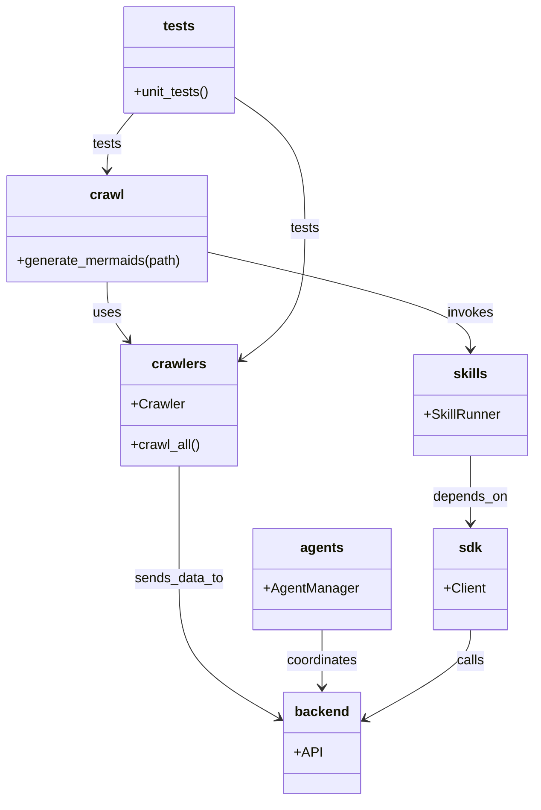

# Diagram: common/public_shield/config/config.alpha.yml

> Auto-generated by Obscura crawlers

## Mermaid

### SVG

<svg id="container" width="629.396484375" xmlns="http://www.w3.org/2000/svg" class="classDiagram" height="948" viewBox="0 0 629.396484375 948" role="graphics-document document" aria-roledescription="class"><g><defs><marker id="container_class-aggregationStart" class="marker aggregation class" refX="18" refY="7" markerWidth="190" markerHeight="240" orient="auto"><path d="M 18,7 L9,13 L1,7 L9,1 Z"></path></marker></defs><defs><marker id="container_class-aggregationEnd" class="marker aggregation class" refX="1" refY="7" markerWidth="20" markerHeight="28" orient="auto"><path d="M 18,7 L9,13 L1,7 L9,1 Z"></path></marker></defs><defs><marker id="container_class-extensionStart" class="marker extension class" refX="18" refY="7" markerWidth="190" markerHeight="240" orient="auto"><path d="M 1,7 L18,13 V 1 Z"></path></marker></defs><defs><marker id="container_class-extensionEnd" class="marker extension class" refX="1" refY="7" markerWidth="20" markerHeight="28" orient="auto"><path d="M 1,1 V 13 L18,7 Z"></path></marker></defs><defs><marker id="container_class-compositionStart" class="marker composition class" refX="18" refY="7" markerWidth="190" markerHeight="240" orient="auto"><path d="M 18,7 L9,13 L1,7 L9,1 Z"></path></marker></defs><defs><marker id="container_class-compositionEnd" class="marker composition class" refX="1" refY="7" markerWidth="20" markerHeight="28" orient="auto"><path d="M 18,7 L9,13 L1,7 L9,1 Z"></path></marker></defs><defs><marker id="container_class-dependencyStart" class="marker dependency class" refX="6" refY="7" markerWidth="190" markerHeight="240" orient="auto"><path d="M 5,7 L9,13 L1,7 L9,1 Z"></path></marker></defs><defs><marker id="container_class-dependencyEnd" class="marker dependency class" refX="13" refY="7" markerWidth="20" markerHeight="28" orient="auto"><path d="M 18,7 L9,13 L14,7 L9,1 Z"></path></marker></defs><defs><marker id="container_class-lollipopStart" class="marker lollipop class" refX="13" refY="7" markerWidth="190" markerHeight="240" orient="auto"><circle stroke="black" fill="transparent" cx="7" cy="7" r="6"></circle></marker></defs><defs><marker id="container_class-lollipopEnd" class="marker lollipop class" refX="1" refY="7" markerWidth="190" markerHeight="240" orient="auto"><circle stroke="black" fill="transparent" cx="7" cy="7" r="6"></circle></marker></defs><g class="root"><g class="clusters"></g><g class="edgePaths"><path d="M127.535,334L127.535,340.167C127.535,346.333,127.535,358.667,131.782,370.215C136.029,381.763,144.522,392.527,148.769,397.908L153.016,403.29" id="id_crawl_crawlers_1" class="edge-thickness-normal edge-pattern-solid relation" style=";;;" data-edge="true" data-et="edge" data-id="id_crawl_crawlers_1" data-points="W3sieCI6MTI3LjUzNTE1NjI1LCJ5IjozMzR9LHsieCI6MTI3LjUzNTE1NjI1LCJ5IjozNzF9LHsieCI6MTU2LjczMjQ1NzcxMjE1NTk2LCJ5Ijo0MDh9XQ==" marker-end="url(#container_class-dependencyEnd)"></path><path d="M247.07,299.002L298.295,311.001C349.52,323.001,451.97,347.001,503.195,366.167C554.42,385.333,554.42,399.667,554.42,406.833L554.42,414" id="id_crawl_skills_2" class="edge-thickness-normal edge-pattern-solid relation" style=";;;" data-edge="true" data-et="edge" data-id="id_crawl_skills_2" data-points="W3sieCI6MjQ3LjA3MDMxMjUsInkiOjI5OS4wMDE3Mzg2MTMyMjcyfSx7IngiOjU1NC40MTk5MjE4NzUsInkiOjM3MX0seyJ4Ijo1NTQuNDE5OTIxODc1LCJ5Ijo0MjB9XQ==" marker-end="url(#container_class-dependencyEnd)"></path><path d="M213.549,552L213.549,558.167C213.549,564.333,213.549,576.667,213.549,599C213.549,621.333,213.549,653.667,213.549,686C213.549,718.333,213.549,750.667,233.448,778.347C253.348,806.027,293.146,829.053,313.046,840.567L332.945,852.08" id="id_crawlers_backend_3" class="edge-thickness-normal edge-pattern-solid relation" style=";;;" data-edge="true" data-et="edge" data-id="id_crawlers_backend_3" data-points="W3sieCI6MjEzLjU0ODgyODEyNSwieSI6NTUyfSx7IngiOjIxMy41NDg4MjgxMjUsInkiOjU4OX0seyJ4IjoyMTMuNTQ4ODI4MTI1LCJ5Ijo2ODZ9LHsieCI6MjEzLjU0ODgyODEyNSwieSI6NzgzfSx7IngiOjMzOC4xMzg2NzE4NzUsInkiOjg1NS4wODQ5NzQwMjA4Mjk5fV0=" marker-end="url(#container_class-dependencyEnd)"></path><path d="M381.201,746L381.201,752.167C381.201,758.333,381.201,770.667,381.201,782C381.201,793.333,381.201,803.667,381.201,808.833L381.201,814" id="id_agents_backend_4" class="edge-thickness-normal edge-pattern-solid relation" style=";;;" data-edge="true" data-et="edge" data-id="id_agents_backend_4" data-points="W3sieCI6MzgxLjIwMTE3MTg3NSwieSI6NzQ2fSx7IngiOjM4MS4yMDExNzE4NzUsInkiOjc4M30seyJ4IjozODEuMjAxMTcxODc1LCJ5Ijo4MjB9XQ==" marker-end="url(#container_class-dependencyEnd)"></path><path d="M554.42,746L554.42,752.167C554.42,758.333,554.42,770.667,533.6,788.492C512.78,806.318,471.139,829.636,450.319,841.295L429.499,852.954" id="id_sdk_backend_5" class="edge-thickness-normal edge-pattern-solid relation" style=";;;" data-edge="true" data-et="edge" data-id="id_sdk_backend_5" data-points="W3sieCI6NTU0LjQxOTkyMTg3NSwieSI6NzQ2fSx7IngiOjU1NC40MTk5MjE4NzUsInkiOjc4M30seyJ4Ijo0MjQuMjYzNjcxODc1LCJ5Ijo4NTUuODg1NjIxNTA0NjAwNH1d" marker-end="url(#container_class-dependencyEnd)"></path><path d="M554.42,540L554.42,548.167C554.42,556.333,554.42,572.667,554.42,586C554.42,599.333,554.42,609.667,554.42,614.833L554.42,620" id="id_skills_sdk_6" class="edge-thickness-normal edge-pattern-solid relation" style=";;;" data-edge="true" data-et="edge" data-id="id_skills_sdk_6" data-points="W3sieCI6NTU0LjQxOTkyMTg3NSwieSI6NTQwfSx7IngiOjU1NC40MTk5MjE4NzUsInkiOjU4OX0seyJ4Ijo1NTQuNDE5OTIxODc1LCJ5Ijo2MjZ9XQ==" marker-end="url(#container_class-dependencyEnd)"></path><path d="M159.36,134L154.056,140.167C148.752,146.333,138.144,158.667,132.839,170C127.535,181.333,127.535,191.667,127.535,196.833L127.535,202" id="id_tests_crawl_7" class="edge-thickness-normal edge-pattern-solid relation" style=";;;" data-edge="true" data-et="edge" data-id="id_tests_crawl_7" data-points="W3sieCI6MTU5LjM2MDIxNDg0Mzc1LCJ5IjoxMzR9LHsieCI6MTI3LjUzNTE1NjI1LCJ5IjoxNzF9LHsieCI6MTI3LjUzNTE1NjI1LCJ5IjoyMDh9XQ==" marker-end="url(#container_class-dependencyEnd)"></path><path d="M279.795,116.175L293.194,125.313C306.594,134.45,333.393,152.725,346.792,178.529C360.191,204.333,360.191,237.667,360.191,271C360.191,304.333,360.191,337.667,347.983,363.408C335.775,389.149,311.359,407.298,299.151,416.372L286.942,425.446" id="id_tests_crawlers_8" class="edge-thickness-normal edge-pattern-solid relation" style=";;;" data-edge="true" data-et="edge" data-id="id_tests_crawlers_8" data-points="W3sieCI6Mjc5Ljc5NDkyMTg3NSwieSI6MTE2LjE3NTIxMDc3MjM2NTg0fSx7IngiOjM2MC4xOTE0MDYyNSwieSI6MTcxfSx7IngiOjM2MC4xOTE0MDYyNSwieSI6MjcxfSx7IngiOjM2MC4xOTE0MDYyNSwieSI6MzcxfSx7IngiOjI4Mi4xMjY5NTMxMjUsInkiOjQyOS4wMjU2MTIzMzg2NzQyNX1d" marker-end="url(#container_class-dependencyEnd)"></path></g><g class="edgeLabels"><g class="edgeLabel" transform="translate(127.53515625, 371)"><g class="label" data-id="id_crawl_crawlers_1" transform="translate(-16.4921875, -12)"><foreignObject width="32.984375" height="24">

uses

</foreignObject></g></g><g class="edgeLabel" transform="translate(554.419921875, 371)"><g class="label" data-id="id_crawl_skills_2" transform="translate(-27.5859375, -12)"><foreignObject width="55.171875" height="24">

invokes

</foreignObject></g></g><g class="edgeLabel" transform="translate(213.548828125, 686)"><g class="label" data-id="id_crawlers_backend_3" transform="translate(-52.90625, -12)"><foreignObject width="105.8125" height="24">

sends_data_to

</foreignObject></g></g><g class="edgeLabel" transform="translate(381.201171875, 783)"><g class="label" data-id="id_agents_backend_4" transform="translate(-42.8046875, -12)"><foreignObject width="85.609375" height="24">

coordinates

</foreignObject></g></g><g class="edgeLabel" transform="translate(554.419921875, 783)"><g class="label" data-id="id_sdk_backend_5" transform="translate(-16.4453125, -12)"><foreignObject width="32.890625" height="24">

calls

</foreignObject></g></g><g class="edgeLabel" transform="translate(554.419921875, 589)"><g class="label" data-id="id_skills_sdk_6" transform="translate(-44.671875, -12)"><foreignObject width="89.34375" height="24">

depends_on

</foreignObject></g></g><g class="edgeLabel" transform="translate(127.53515625, 171)"><g class="label" data-id="id_tests_crawl_7" transform="translate(-17.4921875, -12)"><foreignObject width="34.984375" height="24">

tests

</foreignObject></g></g><g class="edgeLabel" transform="translate(360.19140625, 271)"><g class="label" data-id="id_tests_crawlers_8" transform="translate(-17.4921875, -12)"><foreignObject width="34.984375" height="24">

tests

</foreignObject></g></g></g><g class="nodes"><g class="node default" id="classId-crawl-0" transform="translate(127.53515625, 271)"><g class="basic label-container"><path d="M-119.53515625 -63 L119.53515625 -63 L119.53515625 63 L-119.53515625 63" stroke="none" stroke-width="0" fill="#ECECFF" style=""></path><path d="M-119.53515625 -63 C-37.449381554768635 -63, 44.63639314046273 -63, 119.53515625 -63 M-119.53515625 -63 C-27.77668000826165 -63, 63.9817962334767 -63, 119.53515625 -63 M119.53515625 -63 C119.53515625 -35.21304354547635, 119.53515625 -7.426087090952699, 119.53515625 63 M119.53515625 -63 C119.53515625 -31.61773590097616, 119.53515625 -0.23547180195232187, 119.53515625 63 M119.53515625 63 C41.39934191072548 63, -36.736472428549035 63, -119.53515625 63 M119.53515625 63 C51.47671069917132 63, -16.58173485165736 63, -119.53515625 63 M-119.53515625 63 C-119.53515625 30.210127844810266, -119.53515625 -2.5797443103794677, -119.53515625 -63 M-119.53515625 63 C-119.53515625 34.38678299480998, -119.53515625 5.7735659896199465, -119.53515625 -63" stroke="#9370DB" stroke-width="1.3" fill="none" stroke-dasharray="0 0" style=""></path></g><g class="annotation-group text" transform="translate(0, -39)"></g><g class="label-group text" transform="translate(-19.4765625, -39)"><g class="label" style="font-weight: bolder" transform="translate(0,-12)"><foreignObject width="38.953125" height="24">

crawl

</foreignObject></g></g><g class="members-group text" transform="translate(-107.53515625, 9)"></g><g class="methods-group text" transform="translate(-107.53515625, 39)"><g class="label" style="" transform="translate(0,-12)"><foreignObject width="195.59375" height="24">

+generate_mermaids(path)

</foreignObject></g></g><g class="divider" style=""><path d="M-119.53515625 -15 C-68.97507577885209 -15, -18.414995307704174 -15, 119.53515625 -15 M-119.53515625 -15 C-68.25135716309256 -15, -16.967558076185142 -15, 119.53515625 -15" stroke="#9370DB" stroke-width="1.3" fill="none" stroke-dasharray="0 0" style=""></path></g><g class="divider" style=""><path d="M-119.53515625 9 C-60.48116512105548 9, -1.4271739921109656 9, 119.53515625 9 M-119.53515625 9 C-37.982927442718264 9, 43.56930136456347 9, 119.53515625 9" stroke="#9370DB" stroke-width="1.3" fill="none" stroke-dasharray="0 0" style=""></path></g></g><g class="node default" id="classId-crawlers-1" transform="translate(213.548828125, 480)"><g class="basic label-container"><path d="M-68.578125 -72 L68.578125 -72 L68.578125 72 L-68.578125 72" stroke="none" stroke-width="0" fill="#ECECFF" style=""></path><path d="M-68.578125 -72 C-18.149758359986585 -72, 32.27860828002683 -72, 68.578125 -72 M-68.578125 -72 C-26.665864727506047 -72, 15.246395544987905 -72, 68.578125 -72 M68.578125 -72 C68.578125 -15.760118832343117, 68.578125 40.479762335313765, 68.578125 72 M68.578125 -72 C68.578125 -15.967544753699158, 68.578125 40.06491049260168, 68.578125 72 M68.578125 72 C20.094642682464425 72, -28.38883963507115 72, -68.578125 72 M68.578125 72 C35.96526449948806 72, 3.352403998976115 72, -68.578125 72 M-68.578125 72 C-68.578125 18.780045249568964, -68.578125 -34.43990950086207, -68.578125 -72 M-68.578125 72 C-68.578125 17.93157065932028, -68.578125 -36.13685868135944, -68.578125 -72" stroke="#9370DB" stroke-width="1.3" fill="none" stroke-dasharray="0 0" style=""></path></g><g class="annotation-group text" transform="translate(0, -48)"></g><g class="label-group text" transform="translate(-30.828125, -48)"><g class="label" style="font-weight: bolder" transform="translate(0,-12)"><foreignObject width="61.65625" height="24">

crawlers

</foreignObject></g></g><g class="members-group text" transform="translate(-56.578125, 0)"><g class="label" style="" transform="translate(0,-12)"><foreignObject width="61.921875" height="24">

+Crawler

</foreignObject></g></g><g class="methods-group text" transform="translate(-56.578125, 48)"><g class="label" style="" transform="translate(0,-12)"><foreignObject width="82.328125" height="24">

+crawl_all()

</foreignObject></g></g><g class="divider" style=""><path d="M-68.578125 -24 C-27.736216891533736 -24, 13.105691216932527 -24, 68.578125 -24 M-68.578125 -24 C-21.75238757409567 -24, 25.073349851808658 -24, 68.578125 -24" stroke="#9370DB" stroke-width="1.3" fill="none" stroke-dasharray="0 0" style=""></path></g><g class="divider" style=""><path d="M-68.578125 24 C-37.74316817444054 24, -6.908211348881075 24, 68.578125 24 M-68.578125 24 C-32.46425725390685 24, 3.649610492186298 24, 68.578125 24" stroke="#9370DB" stroke-width="1.3" fill="none" stroke-dasharray="0 0" style=""></path></g></g><g class="node default" id="classId-backend-2" transform="translate(381.201171875, 880)"><g class="basic label-container"><path d="M-43.0625 -60 L43.0625 -60 L43.0625 60 L-43.0625 60" stroke="none" stroke-width="0" fill="#ECECFF" style=""></path><path d="M-43.0625 -60 C-22.291077018509327 -60, -1.519654037018654 -60, 43.0625 -60 M-43.0625 -60 C-13.807934690657941 -60, 15.446630618684118 -60, 43.0625 -60 M43.0625 -60 C43.0625 -22.97730726945106, 43.0625 14.04538546109788, 43.0625 60 M43.0625 -60 C43.0625 -14.980707569103657, 43.0625 30.038584861792685, 43.0625 60 M43.0625 60 C22.95735834099118 60, 2.8522166819823624 60, -43.0625 60 M43.0625 60 C18.91614269926993 60, -5.2302146014601405 60, -43.0625 60 M-43.0625 60 C-43.0625 35.747479924910195, -43.0625 11.494959849820383, -43.0625 -60 M-43.0625 60 C-43.0625 27.60652057332991, -43.0625 -4.786958853340181, -43.0625 -60" stroke="#9370DB" stroke-width="1.3" fill="none" stroke-dasharray="0 0" style=""></path></g><g class="annotation-group text" transform="translate(0, -36)"></g><g class="label-group text" transform="translate(-31.0625, -36)"><g class="label" style="font-weight: bolder" transform="translate(0,-12)"><foreignObject width="62.125" height="24">

backend

</foreignObject></g></g><g class="members-group text" transform="translate(-31.0625, 12)"><g class="label" style="" transform="translate(0,-12)"><foreignObject width="31.015625" height="24">

+API

</foreignObject></g></g><g class="methods-group text" transform="translate(-31.0625, 60)"></g><g class="divider" style=""><path d="M-43.0625 -12 C-11.51863911453437 -12, 20.02522177093126 -12, 43.0625 -12 M-43.0625 -12 C-14.703618240700887 -12, 13.655263518598225 -12, 43.0625 -12" stroke="#9370DB" stroke-width="1.3" fill="none" stroke-dasharray="0 0" style=""></path></g><g class="divider" style=""><path d="M-43.0625 36 C-14.549715681584722 36, 13.963068636830556 36, 43.0625 36 M-43.0625 36 C-25.239329828818477 36, -7.416159657636953 36, 43.0625 36" stroke="#9370DB" stroke-width="1.3" fill="none" stroke-dasharray="0 0" style=""></path></g></g><g class="node default" id="classId-agents-3" transform="translate(381.201171875, 686)"><g class="basic label-container"><path d="M-79.74609375 -60 L79.74609375 -60 L79.74609375 60 L-79.74609375 60" stroke="none" stroke-width="0" fill="#ECECFF" style=""></path><path d="M-79.74609375 -60 C-37.661281742562394 -60, 4.423530264875211 -60, 79.74609375 -60 M-79.74609375 -60 C-45.96682171342605 -60, -12.1875496768521 -60, 79.74609375 -60 M79.74609375 -60 C79.74609375 -35.9887947485043, 79.74609375 -11.977589497008594, 79.74609375 60 M79.74609375 -60 C79.74609375 -13.904680963380315, 79.74609375 32.19063807323937, 79.74609375 60 M79.74609375 60 C20.827926405494196 60, -38.09024093901161 60, -79.74609375 60 M79.74609375 60 C27.310646456169025 60, -25.12480083766195 60, -79.74609375 60 M-79.74609375 60 C-79.74609375 26.43132586083029, -79.74609375 -7.137348278339417, -79.74609375 -60 M-79.74609375 60 C-79.74609375 25.684988433749446, -79.74609375 -8.630023132501108, -79.74609375 -60" stroke="#9370DB" stroke-width="1.3" fill="none" stroke-dasharray="0 0" style=""></path></g><g class="annotation-group text" transform="translate(0, -36)"></g><g class="label-group text" transform="translate(-24.5234375, -36)"><g class="label" style="font-weight: bolder" transform="translate(0,-12)"><foreignObject width="49.046875" height="24">

agents

</foreignObject></g></g><g class="members-group text" transform="translate(-67.74609375, 12)"><g class="label" style="" transform="translate(0,-12)"><foreignObject width="110.96875" height="24">

+AgentManager

</foreignObject></g></g><g class="methods-group text" transform="translate(-67.74609375, 60)"></g><g class="divider" style=""><path d="M-79.74609375 -12 C-17.033808142257563 -12, 45.678477465484875 -12, 79.74609375 -12 M-79.74609375 -12 C-40.62438720141956 -12, -1.5026806528391177 -12, 79.74609375 -12" stroke="#9370DB" stroke-width="1.3" fill="none" stroke-dasharray="0 0" style=""></path></g><g class="divider" style=""><path d="M-79.74609375 36 C-42.37475090002087 36, -5.003408050041742 36, 79.74609375 36 M-79.74609375 36 C-37.10106746030976 36, 5.543958829380486 36, 79.74609375 36" stroke="#9370DB" stroke-width="1.3" fill="none" stroke-dasharray="0 0" style=""></path></g></g><g class="node default" id="classId-sdk-4" transform="translate(554.419921875, 686)"><g class="basic label-container"><path d="M-43.47265625 -60 L43.47265625 -60 L43.47265625 60 L-43.47265625 60" stroke="none" stroke-width="0" fill="#ECECFF" style=""></path><path d="M-43.47265625 -60 C-16.962815759202112 -60, 9.547024731595776 -60, 43.47265625 -60 M-43.47265625 -60 C-12.675448609547605 -60, 18.12175903090479 -60, 43.47265625 -60 M43.47265625 -60 C43.47265625 -18.65478942256909, 43.47265625 22.690421154861824, 43.47265625 60 M43.47265625 -60 C43.47265625 -25.205513818599094, 43.47265625 9.588972362801812, 43.47265625 60 M43.47265625 60 C10.108455622867446 60, -23.25574500426511 60, -43.47265625 60 M43.47265625 60 C12.907593266160934 60, -17.657469717678133 60, -43.47265625 60 M-43.47265625 60 C-43.47265625 17.490155123240925, -43.47265625 -25.01968975351815, -43.47265625 -60 M-43.47265625 60 C-43.47265625 32.36359200805592, -43.47265625 4.727184016111828, -43.47265625 -60" stroke="#9370DB" stroke-width="1.3" fill="none" stroke-dasharray="0 0" style=""></path></g><g class="annotation-group text" transform="translate(0, -36)"></g><g class="label-group text" transform="translate(-13.0859375, -36)"><g class="label" style="font-weight: bolder" transform="translate(0,-12)"><foreignObject width="26.171875" height="24">

sdk

</foreignObject></g></g><g class="members-group text" transform="translate(-31.47265625, 12)"><g class="label" style="" transform="translate(0,-12)"><foreignObject width="49.859375" height="24">

+Client

</foreignObject></g></g><g class="methods-group text" transform="translate(-31.47265625, 60)"></g><g class="divider" style=""><path d="M-43.47265625 -12 C-10.38126614772613 -12, 22.71012395454774 -12, 43.47265625 -12 M-43.47265625 -12 C-20.90266659429056 -12, 1.6673230614188768 -12, 43.47265625 -12" stroke="#9370DB" stroke-width="1.3" fill="none" stroke-dasharray="0 0" style=""></path></g><g class="divider" style=""><path d="M-43.47265625 36 C-25.002156920336077 36, -6.531657590672154 36, 43.47265625 36 M-43.47265625 36 C-11.937577516890077 36, 19.597501216219847 36, 43.47265625 36" stroke="#9370DB" stroke-width="1.3" fill="none" stroke-dasharray="0 0" style=""></path></g></g><g class="node default" id="classId-skills-5" transform="translate(554.419921875, 480)"><g class="basic label-container"><path d="M-66.9765625 -60 L66.9765625 -60 L66.9765625 60 L-66.9765625 60" stroke="none" stroke-width="0" fill="#ECECFF" style=""></path><path d="M-66.9765625 -60 C-34.29459729967132 -60, -1.6126320993426333 -60, 66.9765625 -60 M-66.9765625 -60 C-13.883890512158835 -60, 39.20878147568233 -60, 66.9765625 -60 M66.9765625 -60 C66.9765625 -33.51954406610207, 66.9765625 -7.039088132204142, 66.9765625 60 M66.9765625 -60 C66.9765625 -29.627090722044343, 66.9765625 0.7458185559113133, 66.9765625 60 M66.9765625 60 C15.41094934339678 60, -36.15466381320644 60, -66.9765625 60 M66.9765625 60 C20.13437042228434 60, -26.707821655431317 60, -66.9765625 60 M-66.9765625 60 C-66.9765625 24.078274067721793, -66.9765625 -11.843451864556414, -66.9765625 -60 M-66.9765625 60 C-66.9765625 12.206647761223216, -66.9765625 -35.58670447755357, -66.9765625 -60" stroke="#9370DB" stroke-width="1.3" fill="none" stroke-dasharray="0 0" style=""></path></g><g class="annotation-group text" transform="translate(0, -36)"></g><g class="label-group text" transform="translate(-19.15625, -36)"><g class="label" style="font-weight: bolder" transform="translate(0,-12)"><foreignObject width="38.3125" height="24">

skills

</foreignObject></g></g><g class="members-group text" transform="translate(-54.9765625, 12)"><g class="label" style="" transform="translate(0,-12)"><foreignObject width="90.796875" height="24">

+SkillRunner

</foreignObject></g></g><g class="methods-group text" transform="translate(-54.9765625, 60)"></g><g class="divider" style=""><path d="M-66.9765625 -12 C-36.48553096583329 -12, -5.99449943166659 -12, 66.9765625 -12 M-66.9765625 -12 C-22.853924660633837 -12, 21.268713178732327 -12, 66.9765625 -12" stroke="#9370DB" stroke-width="1.3" fill="none" stroke-dasharray="0 0" style=""></path></g><g class="divider" style=""><path d="M-66.9765625 36 C-16.984053474546187 36, 33.00845555090763 36, 66.9765625 36 M-66.9765625 36 C-38.35800852128145 36, -9.73945454256289 36, 66.9765625 36" stroke="#9370DB" stroke-width="1.3" fill="none" stroke-dasharray="0 0" style=""></path></g></g><g class="node default" id="classId-tests-6" transform="translate(213.548828125, 71)"><g class="basic label-container"><path d="M-66.24609375 -63 L66.24609375 -63 L66.24609375 63 L-66.24609375 63" stroke="none" stroke-width="0" fill="#ECECFF" style=""></path><path d="M-66.24609375 -63 C-28.255186486023 -63, 9.735720777954 -63, 66.24609375 -63 M-66.24609375 -63 C-37.976457327419006 -63, -9.706820904838011 -63, 66.24609375 -63 M66.24609375 -63 C66.24609375 -33.65524367426215, 66.24609375 -4.310487348524305, 66.24609375 63 M66.24609375 -63 C66.24609375 -14.154547286608626, 66.24609375 34.69090542678275, 66.24609375 63 M66.24609375 63 C21.81986566916015 63, -22.606362411679697 63, -66.24609375 63 M66.24609375 63 C29.326037341151164 63, -7.594019067697673 63, -66.24609375 63 M-66.24609375 63 C-66.24609375 15.73931048163385, -66.24609375 -31.5213790367323, -66.24609375 -63 M-66.24609375 63 C-66.24609375 13.893379036549362, -66.24609375 -35.213241926901276, -66.24609375 -63" stroke="#9370DB" stroke-width="1.3" fill="none" stroke-dasharray="0 0" style=""></path></g><g class="annotation-group text" transform="translate(0, -39)"></g><g class="label-group text" transform="translate(-18.1796875, -39)"><g class="label" style="font-weight: bolder" transform="translate(0,-12)"><foreignObject width="36.359375" height="24">

tests

</foreignObject></g></g><g class="members-group text" transform="translate(-54.24609375, 9)"></g><g class="methods-group text" transform="translate(-54.24609375, 39)"><g class="label" style="" transform="translate(0,-12)"><foreignObject width="90.3125" height="24">

+unit_tests()

</foreignObject></g></g><g class="divider" style=""><path d="M-66.24609375 -15 C-24.074037769700837 -15, 18.098018210598326 -15, 66.24609375 -15 M-66.24609375 -15 C-33.709594416738845 -15, -1.1730950834776905 -15, 66.24609375 -15" stroke="#9370DB" stroke-width="1.3" fill="none" stroke-dasharray="0 0" style=""></path></g><g class="divider" style=""><path d="M-66.24609375 9 C-27.060423006521773 9, 12.125247736956453 9, 66.24609375 9 M-66.24609375 9 C-25.057021824182605 9, 16.13205010163479 9, 66.24609375 9" stroke="#9370DB" stroke-width="1.3" fill="none" stroke-dasharray="0 0" style=""></path></g></g></g></g></g></svg>
