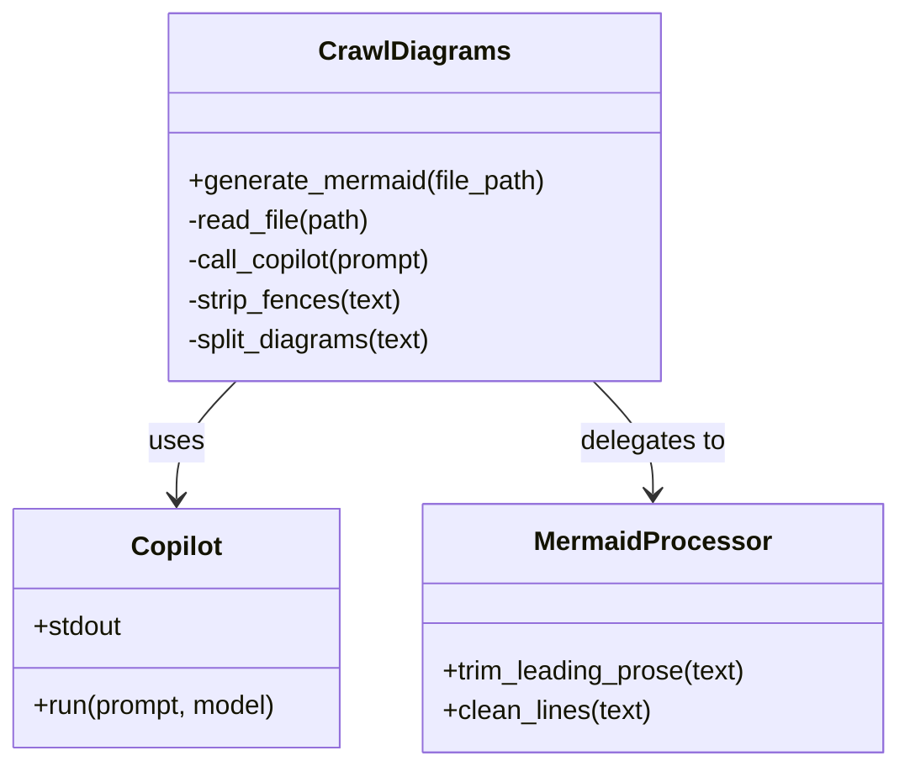
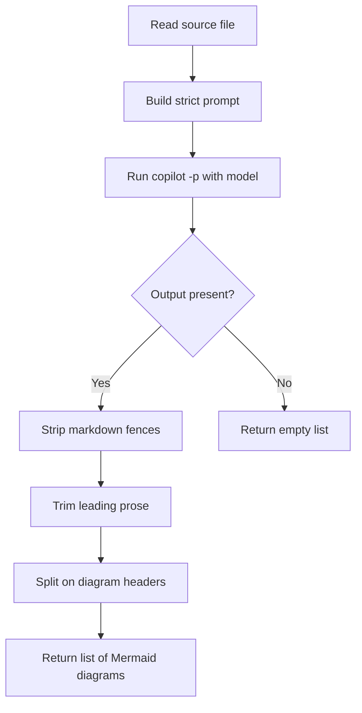

# Diagram: common/public_shield/config/config.dev.yml

> Auto-generated by Obscura crawlers

## Diagram 1

### SVG

<svg id="container" width="546.25" xmlns="http://www.w3.org/2000/svg" class="classDiagram" height="462" viewBox="0 0 546.25 462" role="graphics-document document" aria-roledescription="class"><g><defs><marker id="container_class-aggregationStart" class="marker aggregation class" refX="18" refY="7" markerWidth="190" markerHeight="240" orient="auto"><path d="M 18,7 L9,13 L1,7 L9,1 Z"></path></marker></defs><defs><marker id="container_class-aggregationEnd" class="marker aggregation class" refX="1" refY="7" markerWidth="20" markerHeight="28" orient="auto"><path d="M 18,7 L9,13 L1,7 L9,1 Z"></path></marker></defs><defs><marker id="container_class-extensionStart" class="marker extension class" refX="18" refY="7" markerWidth="190" markerHeight="240" orient="auto"><path d="M 1,7 L18,13 V 1 Z"></path></marker></defs><defs><marker id="container_class-extensionEnd" class="marker extension class" refX="1" refY="7" markerWidth="20" markerHeight="28" orient="auto"><path d="M 1,1 V 13 L18,7 Z"></path></marker></defs><defs><marker id="container_class-compositionStart" class="marker composition class" refX="18" refY="7" markerWidth="190" markerHeight="240" orient="auto"><path d="M 18,7 L9,13 L1,7 L9,1 Z"></path></marker></defs><defs><marker id="container_class-compositionEnd" class="marker composition class" refX="1" refY="7" markerWidth="20" markerHeight="28" orient="auto"><path d="M 18,7 L9,13 L1,7 L9,1 Z"></path></marker></defs><defs><marker id="container_class-dependencyStart" class="marker dependency class" refX="6" refY="7" markerWidth="190" markerHeight="240" orient="auto"><path d="M 5,7 L9,13 L1,7 L9,1 Z"></path></marker></defs><defs><marker id="container_class-dependencyEnd" class="marker dependency class" refX="13" refY="7" markerWidth="20" markerHeight="28" orient="auto"><path d="M 18,7 L9,13 L14,7 L9,1 Z"></path></marker></defs><defs><marker id="container_class-lollipopStart" class="marker lollipop class" refX="13" refY="7" markerWidth="190" markerHeight="240" orient="auto"><circle stroke="black" fill="transparent" cx="7" cy="7" r="6"></circle></marker></defs><defs><marker id="container_class-lollipopEnd" class="marker lollipop class" refX="1" refY="7" markerWidth="190" markerHeight="240" orient="auto"><circle stroke="black" fill="transparent" cx="7" cy="7" r="6"></circle></marker></defs><g class="root"><g class="clusters"></g><g class="edgePaths"><path d="M144.855,230L138.811,236.167C132.767,242.333,120.678,254.667,114.634,266.5C108.59,278.333,108.59,289.667,108.59,295.333L108.59,301" id="id_CrawlDiagrams_Copilot_1" class="edge-thickness-normal edge-pattern-solid relation" style=";;;" data-edge="true" data-et="edge" data-id="id_CrawlDiagrams_Copilot_1" data-points="W3sieCI6MTQ0Ljg1NTQ2ODc1LCJ5IjoyMzB9LHsieCI6MTA4LjU4OTg0Mzc1LCJ5IjoyNjd9LHsieCI6MTA4LjU4OTg0Mzc1LCJ5IjozMDd9XQ==" marker-end="url(#container_class-dependencyEnd)"></path><path d="M362.449,230L368.493,236.167C374.538,242.333,386.626,254.667,392.671,266C398.715,277.333,398.715,287.667,398.715,292.833L398.715,298" id="id_CrawlDiagrams_MermaidProcessor_2" class="edge-thickness-normal edge-pattern-solid relation" style=";;;" data-edge="true" data-et="edge" data-id="id_CrawlDiagrams_MermaidProcessor_2" data-points="W3sieCI6MzYyLjQ0OTIxODc1LCJ5IjoyMzB9LHsieCI6Mzk4LjcxNDg0Mzc1LCJ5IjoyNjd9LHsieCI6Mzk4LjcxNDg0Mzc1LCJ5IjozMDR9XQ==" marker-end="url(#container_class-dependencyEnd)"></path></g><g class="edgeLabels"><g class="edgeLabel" transform="translate(108.58984375, 267)"><g class="label" data-id="id_CrawlDiagrams_Copilot_1" transform="translate(-16.4921875, -12)"><foreignObject width="32.984375" height="24">

uses

</foreignObject></g></g><g class="edgeLabel" transform="translate(398.71484375, 267)"><g class="label" data-id="id_CrawlDiagrams_MermaidProcessor_2" transform="translate(-44.59375, -12)"><foreignObject width="89.1875" height="24">

delegates to

</foreignObject></g></g></g><g class="nodes"><g class="node default" id="classId-CrawlDiagrams-0" transform="translate(253.65234375, 119)"><g class="basic label-container"><path d="M-148.44921875 -111 L148.44921875 -111 L148.44921875 111 L-148.44921875 111" stroke="none" stroke-width="0" fill="#ECECFF" style=""></path><path d="M-148.44921875 -111 C-70.61445298476299 -111, 7.220312780474018 -111, 148.44921875 -111 M-148.44921875 -111 C-76.24694668391848 -111, -4.044674617836961 -111, 148.44921875 -111 M148.44921875 -111 C148.44921875 -34.61401028515306, 148.44921875 41.771979429693886, 148.44921875 111 M148.44921875 -111 C148.44921875 -45.70054116689437, 148.44921875 19.598917666211264, 148.44921875 111 M148.44921875 111 C44.577839928011514 111, -59.29353889397697 111, -148.44921875 111 M148.44921875 111 C75.6308304416578 111, 2.8124421333156135 111, -148.44921875 111 M-148.44921875 111 C-148.44921875 31.462155730103675, -148.44921875 -48.07568853979265, -148.44921875 -111 M-148.44921875 111 C-148.44921875 38.95926338006008, -148.44921875 -33.08147323987984, -148.44921875 -111" stroke="#9370DB" stroke-width="1.3" fill="none" stroke-dasharray="0 0" style=""></path></g><g class="annotation-group text" transform="translate(0, -87)"></g><g class="label-group text" transform="translate(-54.2578125, -87)"><g class="label" style="font-weight: bolder" transform="translate(0,-12)"><foreignObject width="108.515625" height="24">

CrawlDiagrams

</foreignObject></g></g><g class="members-group text" transform="translate(-136.44921875, -39)"></g><g class="methods-group text" transform="translate(-136.44921875, -9)"><g class="label" style="" transform="translate(0,-12)"><foreignObject width="218.640625" height="24">

+generate_mermaid(file_path)

</foreignObject></g><g class="label" style="" transform="translate(0,12)"><foreignObject width="113.078125" height="24">

-read_file(path)

</foreignObject></g><g class="label" style="" transform="translate(0,36)"><foreignObject width="154.1875" height="24">

-call_copilot(prompt)

</foreignObject></g><g class="label" style="" transform="translate(0,60)"><foreignObject width="132.40625" height="24">

-strip_fences(text)

</foreignObject></g><g class="label" style="" transform="translate(0,84)"><foreignObject width="150.875" height="24">

-split_diagrams(text)

</foreignObject></g></g><g class="divider" style=""><path d="M-148.44921875 -63 C-67.08522403445124 -63, 14.278770681097512 -63, 148.44921875 -63 M-148.44921875 -63 C-54.78853933258851 -63, 38.87214008482297 -63, 148.44921875 -63" stroke="#9370DB" stroke-width="1.3" fill="none" stroke-dasharray="0 0" style=""></path></g><g class="divider" style=""><path d="M-148.44921875 -39 C-35.80155271853667 -39, 76.84611331292666 -39, 148.44921875 -39 M-148.44921875 -39 C-83.61718965300805 -39, -18.78516055601611 -39, 148.44921875 -39" stroke="#9370DB" stroke-width="1.3" fill="none" stroke-dasharray="0 0" style=""></path></g></g><g class="node default" id="classId-Copilot-1" transform="translate(108.58984375, 379)"><g class="basic label-container"><path d="M-100.58984375 -72 L100.58984375 -72 L100.58984375 72 L-100.58984375 72" stroke="none" stroke-width="0" fill="#ECECFF" style=""></path><path d="M-100.58984375 -72 C-30.71796111195755 -72, 39.1539215260849 -72, 100.58984375 -72 M-100.58984375 -72 C-59.55803554361654 -72, -18.52622733723308 -72, 100.58984375 -72 M100.58984375 -72 C100.58984375 -35.54996131687734, 100.58984375 0.900077366245327, 100.58984375 72 M100.58984375 -72 C100.58984375 -25.922085243790896, 100.58984375 20.155829512418208, 100.58984375 72 M100.58984375 72 C38.09908014352046 72, -24.39168346295908 72, -100.58984375 72 M100.58984375 72 C42.1996617951005 72, -16.190520159798993 72, -100.58984375 72 M-100.58984375 72 C-100.58984375 18.648139909272594, -100.58984375 -34.70372018145481, -100.58984375 -72 M-100.58984375 72 C-100.58984375 26.52950865402765, -100.58984375 -18.940982691944697, -100.58984375 -72" stroke="#9370DB" stroke-width="1.3" fill="none" stroke-dasharray="0 0" style=""></path></g><g class="annotation-group text" transform="translate(0, -48)"></g><g class="label-group text" transform="translate(-26.2421875, -48)"><g class="label" style="font-weight: bolder" transform="translate(0,-12)"><foreignObject width="52.484375" height="24">

Copilot

</foreignObject></g></g><g class="members-group text" transform="translate(-88.58984375, 0)"><g class="label" style="" transform="translate(0,-12)"><foreignObject width="55" height="24">

+stdout

</foreignObject></g></g><g class="methods-group text" transform="translate(-88.58984375, 48)"><g class="label" style="" transform="translate(0,-12)"><foreignObject width="150.9375" height="24">

+run(prompt, model)

</foreignObject></g></g><g class="divider" style=""><path d="M-100.58984375 -24 C-27.94415322147742 -24, 44.70153730704516 -24, 100.58984375 -24 M-100.58984375 -24 C-22.976996353167408 -24, 54.635851043665184 -24, 100.58984375 -24" stroke="#9370DB" stroke-width="1.3" fill="none" stroke-dasharray="0 0" style=""></path></g><g class="divider" style=""><path d="M-100.58984375 24 C-56.650709417796556 24, -12.711575085593111 24, 100.58984375 24 M-100.58984375 24 C-29.611554507538827 24, 41.366734734922346 24, 100.58984375 24" stroke="#9370DB" stroke-width="1.3" fill="none" stroke-dasharray="0 0" style=""></path></g></g><g class="node default" id="classId-MermaidProcessor-2" transform="translate(398.71484375, 379)"><g class="basic label-container"><path d="M-139.53515625 -75 L139.53515625 -75 L139.53515625 75 L-139.53515625 75" stroke="none" stroke-width="0" fill="#ECECFF" style=""></path><path d="M-139.53515625 -75 C-32.08735648850892 -75, 75.36044327298217 -75, 139.53515625 -75 M-139.53515625 -75 C-45.86740414184078 -75, 47.80034796631844 -75, 139.53515625 -75 M139.53515625 -75 C139.53515625 -20.916626939795144, 139.53515625 33.16674612040971, 139.53515625 75 M139.53515625 -75 C139.53515625 -28.531613323327335, 139.53515625 17.93677335334533, 139.53515625 75 M139.53515625 75 C29.436416187427227 75, -80.66232387514555 75, -139.53515625 75 M139.53515625 75 C63.325808604257304 75, -12.883539041485392 75, -139.53515625 75 M-139.53515625 75 C-139.53515625 39.050398797597474, -139.53515625 3.1007975951949476, -139.53515625 -75 M-139.53515625 75 C-139.53515625 43.3512455565137, -139.53515625 11.7024911130274, -139.53515625 -75" stroke="#9370DB" stroke-width="1.3" fill="none" stroke-dasharray="0 0" style=""></path></g><g class="annotation-group text" transform="translate(0, -51)"></g><g class="label-group text" transform="translate(-68.0390625, -51)"><g class="label" style="font-weight: bolder" transform="translate(0,-12)"><foreignObject width="136.078125" height="24">

MermaidProcessor

</foreignObject></g></g><g class="members-group text" transform="translate(-127.53515625, -3)"></g><g class="methods-group text" transform="translate(-127.53515625, 27)"><g class="label" style="" transform="translate(0,-12)"><foreignObject width="187.03125" height="24">

+trim_leading_prose(text)

</foreignObject></g><g class="label" style="" transform="translate(0,12)"><foreignObject width="127.828125" height="24">

+clean_lines(text)

</foreignObject></g></g><g class="divider" style=""><path d="M-139.53515625 -27 C-62.52584404502389 -27, 14.483468159952224 -27, 139.53515625 -27 M-139.53515625 -27 C-42.685058163283756 -27, 54.16503992343249 -27, 139.53515625 -27" stroke="#9370DB" stroke-width="1.3" fill="none" stroke-dasharray="0 0" style=""></path></g><g class="divider" style=""><path d="M-139.53515625 -3 C-48.63144274970415 -3, 42.2722707505917 -3, 139.53515625 -3 M-139.53515625 -3 C-29.712875694246364 -3, 80.10940486150727 -3, 139.53515625 -3" stroke="#9370DB" stroke-width="1.3" fill="none" stroke-dasharray="0 0" style=""></path></g></g></g></g></g></svg>

## Diagram 2

### SVG

<svg id="container" width="494.4296875" xmlns="http://www.w3.org/2000/svg" class="flowchart" height="963.125" viewBox="0 0 494.4296875 963.125" role="graphics-document document" aria-roledescription="flowchart-v2"><g><marker id="container_flowchart-v2-pointEnd" class="marker flowchart-v2" viewBox="0 0 10 10" refX="5" refY="5" markerUnits="userSpaceOnUse" markerWidth="8" markerHeight="8" orient="auto"><path d="M 0 0 L 10 5 L 0 10 z" class="arrowMarkerPath" style="stroke-width: 1; stroke-dasharray: 1, 0;"></path></marker><marker id="container_flowchart-v2-pointStart" class="marker flowchart-v2" viewBox="0 0 10 10" refX="4.5" refY="5" markerUnits="userSpaceOnUse" markerWidth="8" markerHeight="8" orient="auto"><path d="M 0 5 L 10 10 L 10 0 z" class="arrowMarkerPath" style="stroke-width: 1; stroke-dasharray: 1, 0;"></path></marker><marker id="container_flowchart-v2-circleEnd" class="marker flowchart-v2" viewBox="0 0 10 10" refX="11" refY="5" markerUnits="userSpaceOnUse" markerWidth="11" markerHeight="11" orient="auto"><circle cx="5" cy="5" r="5" class="arrowMarkerPath" style="stroke-width: 1; stroke-dasharray: 1, 0;"></circle></marker><marker id="container_flowchart-v2-circleStart" class="marker flowchart-v2" viewBox="0 0 10 10" refX="-1" refY="5" markerUnits="userSpaceOnUse" markerWidth="11" markerHeight="11" orient="auto"><circle cx="5" cy="5" r="5" class="arrowMarkerPath" style="stroke-width: 1; stroke-dasharray: 1, 0;"></circle></marker><marker id="container_flowchart-v2-crossEnd" class="marker cross flowchart-v2" viewBox="0 0 11 11" refX="12" refY="5.2" markerUnits="userSpaceOnUse" markerWidth="11" markerHeight="11" orient="auto"><path d="M 1,1 l 9,9 M 10,1 l -9,9" class="arrowMarkerPath" style="stroke-width: 2; stroke-dasharray: 1, 0;"></path></marker><marker id="container_flowchart-v2-crossStart" class="marker cross flowchart-v2" viewBox="0 0 11 11" refX="-1" refY="5.2" markerUnits="userSpaceOnUse" markerWidth="11" markerHeight="11" orient="auto"><path d="M 1,1 l 9,9 M 10,1 l -9,9" class="arrowMarkerPath" style="stroke-width: 2; stroke-dasharray: 1, 0;"></path></marker><g class="root"><g class="clusters"></g><g class="edgePaths"><path d="M265.906,62L265.906,66.167C265.906,70.333,265.906,78.667,265.906,86.333C265.906,94,265.906,101,265.906,104.5L265.906,108" id="L_A_B_0" class="edge-thickness-normal edge-pattern-solid edge-thickness-normal edge-pattern-solid flowchart-link" style=";" data-edge="true" data-et="edge" data-id="L_A_B_0" data-points="W3sieCI6MjY1LjkwNjI1LCJ5Ijo2Mn0seyJ4IjoyNjUuOTA2MjUsInkiOjg3fSx7IngiOjI2NS45MDYyNSwieSI6MTEyfV0=" marker-end="url(#container_flowchart-v2-pointEnd)"></path><path d="M265.906,166L265.906,170.167C265.906,174.333,265.906,182.667,265.906,190.333C265.906,198,265.906,205,265.906,208.5L265.906,212" id="L_B_C_0" class="edge-thickness-normal edge-pattern-solid edge-thickness-normal edge-pattern-solid flowchart-link" style=";" data-edge="true" data-et="edge" data-id="L_B_C_0" data-points="W3sieCI6MjY1LjkwNjI1LCJ5IjoxNjZ9LHsieCI6MjY1LjkwNjI1LCJ5IjoxOTF9LHsieCI6MjY1LjkwNjI1LCJ5IjoyMTZ9XQ==" marker-end="url(#container_flowchart-v2-pointEnd)"></path><path d="M265.906,270L265.906,274.167C265.906,278.333,265.906,286.667,265.906,294.333C265.906,302,265.906,309,265.906,312.5L265.906,316" id="L_C_D_0" class="edge-thickness-normal edge-pattern-solid edge-thickness-normal edge-pattern-solid flowchart-link" style=";" data-edge="true" data-et="edge" data-id="L_C_D_0" data-points="W3sieCI6MjY1LjkwNjI1LCJ5IjoyNzB9LHsieCI6MjY1LjkwNjI1LCJ5IjoyOTV9LHsieCI6MjY1LjkwNjI1LCJ5IjozMjB9XQ==" marker-end="url(#container_flowchart-v2-pointEnd)"></path><path d="M222.212,447.431L208.177,460.88C194.142,474.329,166.071,501.227,152.035,520.176C138,539.125,138,550.125,138,555.625L138,561.125" id="L_D_E_0" class="edge-thickness-normal edge-pattern-solid edge-thickness-normal edge-pattern-solid flowchart-link" style=";" data-edge="true" data-et="edge" data-id="L_D_E_0" data-points="W3sieCI6MjIyLjIxMjI2MjE2NDY5MTIsInkiOjQ0Ny40MzEwMTIxNjQ2OTEyfSx7IngiOjEzOCwieSI6NTI4LjEyNX0seyJ4IjoxMzgsInkiOjU2NS4xMjV9XQ==" marker-end="url(#container_flowchart-v2-pointEnd)"></path><path d="M138,619.125L138,623.292C138,627.458,138,635.792,138,643.458C138,651.125,138,658.125,138,661.625L138,665.125" id="L_E_F_0" class="edge-thickness-normal edge-pattern-solid edge-thickness-normal edge-pattern-solid flowchart-link" style=";" data-edge="true" data-et="edge" data-id="L_E_F_0" data-points="W3sieCI6MTM4LCJ5Ijo2MTkuMTI1fSx7IngiOjEzOCwieSI6NjQ0LjEyNX0seyJ4IjoxMzgsInkiOjY2OS4xMjV9XQ==" marker-end="url(#container_flowchart-v2-pointEnd)"></path><path d="M138,723.125L138,727.292C138,731.458,138,739.792,138,747.458C138,755.125,138,762.125,138,765.625L138,769.125" id="L_F_G_0" class="edge-thickness-normal edge-pattern-solid edge-thickness-normal edge-pattern-solid flowchart-link" style=";" data-edge="true" data-et="edge" data-id="L_F_G_0" data-points="W3sieCI6MTM4LCJ5Ijo3MjMuMTI1fSx7IngiOjEzOCwieSI6NzQ4LjEyNX0seyJ4IjoxMzgsInkiOjc3My4xMjV9XQ==" marker-end="url(#container_flowchart-v2-pointEnd)"></path><path d="M138,827.125L138,831.292C138,835.458,138,843.792,138,851.458C138,859.125,138,866.125,138,869.625L138,873.125" id="L_G_H_0" class="edge-thickness-normal edge-pattern-solid edge-thickness-normal edge-pattern-solid flowchart-link" style=";" data-edge="true" data-et="edge" data-id="L_G_H_0" data-points="W3sieCI6MTM4LCJ5Ijo4MjcuMTI1fSx7IngiOjEzOCwieSI6ODUyLjEyNX0seyJ4IjoxMzgsInkiOjg3Ny4xMjV9XQ==" marker-end="url(#container_flowchart-v2-pointEnd)"></path><path d="M309.6,447.431L323.636,460.88C337.671,474.329,365.742,501.227,379.777,520.176C393.813,539.125,393.813,550.125,393.813,555.625L393.813,561.125" id="L_D_I_0" class="edge-thickness-normal edge-pattern-solid edge-thickness-normal edge-pattern-solid flowchart-link" style=";" data-edge="true" data-et="edge" data-id="L_D_I_0" data-points="W3sieCI6MzA5LjYwMDIzNzgzNTMwODgsInkiOjQ0Ny40MzEwMTIxNjQ2OTEyfSx7IngiOjM5My44MTI1LCJ5Ijo1MjguMTI1fSx7IngiOjM5My44MTI1LCJ5Ijo1NjUuMTI1fV0=" marker-end="url(#container_flowchart-v2-pointEnd)"></path></g><g class="edgeLabels"><g class="edgeLabel"><g class="label" data-id="L_A_B_0" transform="translate(0, 0)"><foreignObject width="0" height="0">

</foreignObject></g></g><g class="edgeLabel"><g class="label" data-id="L_B_C_0" transform="translate(0, 0)"><foreignObject width="0" height="0">

</foreignObject></g></g><g class="edgeLabel"><g class="label" data-id="L_C_D_0" transform="translate(0, 0)"><foreignObject width="0" height="0">

</foreignObject></g></g><g class="edgeLabel" transform="translate(138, 528.125)"><g class="label" data-id="L_D_E_0" transform="translate(-12.03125, -12)"><foreignObject width="24.0625" height="24">

Yes

</foreignObject></g></g><g class="edgeLabel"><g class="label" data-id="L_E_F_0" transform="translate(0, 0)"><foreignObject width="0" height="0">

</foreignObject></g></g><g class="edgeLabel"><g class="label" data-id="L_F_G_0" transform="translate(0, 0)"><foreignObject width="0" height="0">

</foreignObject></g></g><g class="edgeLabel"><g class="label" data-id="L_G_H_0" transform="translate(0, 0)"><foreignObject width="0" height="0">

</foreignObject></g></g><g class="edgeLabel" transform="translate(393.8125, 528.125)"><g class="label" data-id="L_D_I_0" transform="translate(-10.140625, -12)"><foreignObject width="20.28125" height="24">

No

</foreignObject></g></g></g><g class="nodes"><g class="node default" id="flowchart-A-0" transform="translate(265.90625, 35)"><rect class="basic label-container" style="" x="-87.578125" y="-27" width="175.15625" height="54"></rect><g class="label" style="" transform="translate(-57.578125, -12)"><rect></rect><foreignObject width="115.15625" height="24">

Read source file

</foreignObject></g></g><g class="node default" id="flowchart-B-1" transform="translate(265.90625, 139)"><rect class="basic label-container" style="" x="-98.5546875" y="-27" width="197.109375" height="54"></rect><g class="label" style="" transform="translate(-68.5546875, -12)"><rect></rect><foreignObject width="137.109375" height="24">

Build strict prompt

</foreignObject></g></g><g class="node default" id="flowchart-C-3" transform="translate(265.90625, 243)"><rect class="basic label-container" style="" x="-124.4375" y="-27" width="248.875" height="54"></rect><g class="label" style="" transform="translate(-94.4375, -12)"><rect></rect><foreignObject width="188.875" height="24">

Run copilot -p with model

</foreignObject></g></g><g class="node default" id="flowchart-D-5" transform="translate(265.90625, 405.5625)"><polygon points="85.5625,0 171.125,-85.5625 85.5625,-171.125 0,-85.5625" class="label-container" transform="translate(-85.0625, 85.5625)"></polygon><g class="label" style="" transform="translate(-58.5625, -12)"><rect></rect><foreignObject width="117.125" height="24">

Output present?

</foreignObject></g></g><g class="node default" id="flowchart-E-7" transform="translate(138, 592.125)"><rect class="basic label-container" style="" x="-113.1953125" y="-27" width="226.390625" height="54"></rect><g class="label" style="" transform="translate(-83.1953125, -12)"><rect></rect><foreignObject width="166.390625" height="24">

Strip markdown fences

</foreignObject></g></g><g class="node default" id="flowchart-F-9" transform="translate(138, 696.125)"><rect class="basic label-container" style="" x="-97.53125" y="-27" width="195.0625" height="54"></rect><g class="label" style="" transform="translate(-67.53125, -12)"><rect></rect><foreignObject width="135.0625" height="24">

Trim leading prose

</foreignObject></g></g><g class="node default" id="flowchart-G-11" transform="translate(138, 800.125)"><rect class="basic label-container" style="" x="-120.9765625" y="-27" width="241.953125" height="54"></rect><g class="label" style="" transform="translate(-90.9765625, -12)"><rect></rect><foreignObject width="181.953125" height="24">

Split on diagram headers

</foreignObject></g></g><g class="node default" id="flowchart-H-13" transform="translate(138, 916.125)"><rect class="basic label-container" style="" x="-130" y="-39" width="260" height="78"></rect><g class="label" style="" transform="translate(-100, -24)"><rect></rect><foreignObject width="200" height="48">

Return list of Mermaid diagrams

</foreignObject></g></g><g class="node default" id="flowchart-I-15" transform="translate(393.8125, 592.125)"><rect class="basic label-container" style="" x="-92.6171875" y="-27" width="185.234375" height="54"></rect><g class="label" style="" transform="translate(-62.6171875, -12)"><rect></rect><foreignObject width="125.234375" height="24">

Return empty list

</foreignObject></g></g></g></g></g></svg>
