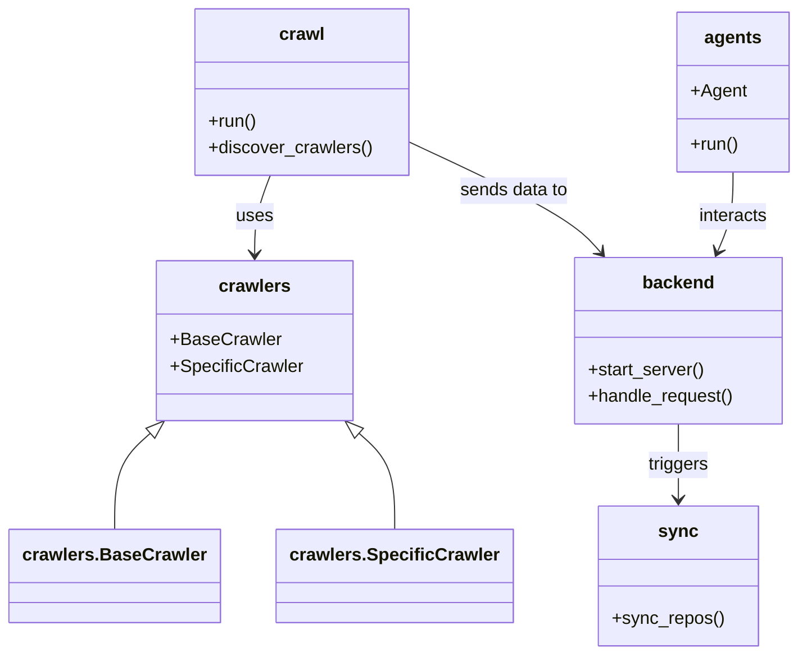

# Diagram: common/public_shield/config/config.prod-b.yml


> Auto-generated by Obscura crawlers

## Diagram 1



### SVG

<svg id="container" width="696.240234375" xmlns="http://www.w3.org/2000/svg" class="classDiagram" height="590" viewBox="0 0 696.240234375 590" role="graphics-document document" aria-roledescription="class"><style>#container{font-family:"trebuchet ms",verdana,arial,sans-serif;font-size:16px;fill:#333;}@keyframes edge-animation-frame{from{stroke-dashoffset:0;}}@keyframes dash{to{stroke-dashoffset:0;}}#container .edge-animation-slow{stroke-dasharray:9,5!important;stroke-dashoffset:900;animation:dash 50s linear infinite;stroke-linecap:round;}#container .edge-animation-fast{stroke-dasharray:9,5!important;stroke-dashoffset:900;animation:dash 20s linear infinite;stroke-linecap:round;}#container .error-icon{fill:#552222;}#container .error-text{fill:#552222;stroke:#552222;}#container .edge-thickness-normal{stroke-width:1px;}#container .edge-thickness-thick{stroke-width:3.5px;}#container .edge-pattern-solid{stroke-dasharray:0;}#container .edge-thickness-invisible{stroke-width:0;fill:none;}#container .edge-pattern-dashed{stroke-dasharray:3;}#container .edge-pattern-dotted{stroke-dasharray:2;}#container .marker{fill:#333333;stroke:#333333;}#container .marker.cross{stroke:#333333;}#container svg{font-family:"trebuchet ms",verdana,arial,sans-serif;font-size:16px;}#container p{margin:0;}#container g.classGroup text{fill:#9370DB;stroke:none;font-family:"trebuchet ms",verdana,arial,sans-serif;font-size:10px;}#container g.classGroup text .title{font-weight:bolder;}#container .nodeLabel,#container .edgeLabel{color:#131300;}#container .edgeLabel .label rect{fill:#ECECFF;}#container .label text{fill:#131300;}#container .labelBkg{background:#ECECFF;}#container .edgeLabel .label span{background:#ECECFF;}#container .classTitle{font-weight:bolder;}#container .node rect,#container .node circle,#container .node ellipse,#container .node polygon,#container .node path{fill:#ECECFF;stroke:#9370DB;stroke-width:1px;}#container .divider{stroke:#9370DB;stroke-width:1;}#container g.clickable{cursor:pointer;}#container g.classGroup rect{fill:#ECECFF;stroke:#9370DB;}#container g.classGroup line{stroke:#9370DB;stroke-width:1;}#container .classLabel .box{stroke:none;stroke-width:0;fill:#ECECFF;opacity:0.5;}#container .classLabel .label{fill:#9370DB;font-size:10px;}#container .relation{stroke:#333333;stroke-width:1;fill:none;}#container .dashed-line{stroke-dasharray:3;}#container .dotted-line{stroke-dasharray:1 2;}#container #compositionStart,#container .composition{fill:#333333!important;stroke:#333333!important;stroke-width:1;}#container #compositionEnd,#container .composition{fill:#333333!important;stroke:#333333!important;stroke-width:1;}#container #dependencyStart,#container .dependency{fill:#333333!important;stroke:#333333!important;stroke-width:1;}#container #dependencyStart,#container .dependency{fill:#333333!important;stroke:#333333!important;stroke-width:1;}#container #extensionStart,#container .extension{fill:transparent!important;stroke:#333333!important;stroke-width:1;}#container #extensionEnd,#container .extension{fill:transparent!important;stroke:#333333!important;stroke-width:1;}#container #aggregationStart,#container .aggregation{fill:transparent!important;stroke:#333333!important;stroke-width:1;}#container #aggregationEnd,#container .aggregation{fill:transparent!important;stroke:#333333!important;stroke-width:1;}#container #lollipopStart,#container .lollipop{fill:#ECECFF!important;stroke:#333333!important;stroke-width:1;}#container #lollipopEnd,#container .lollipop{fill:#ECECFF!important;stroke:#333333!important;stroke-width:1;}#container .edgeTerminals{font-size:11px;line-height:initial;}#container .classTitleText{text-anchor:middle;font-size:18px;fill:#333;}#container .label-icon{display:inline-block;height:1em;overflow:visible;vertical-align:-0.125em;}#container .node .label-icon path{fill:currentColor;stroke:revert;stroke-width:revert;}#container :root{--mermaid-font-family:"trebuchet ms",verdana,arial,sans-serif;}</style><g><defs><marker id="container_class-aggregationStart" class="marker aggregation class" refX="18" refY="7" markerWidth="190" markerHeight="240" orient="auto"><path d="M 18,7 L9,13 L1,7 L9,1 Z"></path></marker></defs><defs><marker id="container_class-aggregationEnd" class="marker aggregation class" refX="1" refY="7" markerWidth="20" markerHeight="28" orient="auto"><path d="M 18,7 L9,13 L1,7 L9,1 Z"></path></marker></defs><defs><marker id="container_class-extensionStart" class="marker extension class" refX="18" refY="7" markerWidth="190" markerHeight="240" orient="auto"><path d="M 1,7 L18,13 V 1 Z"></path></marker></defs><defs><marker id="container_class-extensionEnd" class="marker extension class" refX="1" refY="7" markerWidth="20" markerHeight="28" orient="auto"><path d="M 1,1 V 13 L18,7 Z"></path></marker></defs><defs><marker id="container_class-compositionStart" class="marker composition class" refX="18" refY="7" markerWidth="190" markerHeight="240" orient="auto"><path d="M 18,7 L9,13 L1,7 L9,1 Z"></path></marker></defs><defs><marker id="container_class-compositionEnd" class="marker composition class" refX="1" refY="7" markerWidth="20" markerHeight="28" orient="auto"><path d="M 18,7 L9,13 L1,7 L9,1 Z"></path></marker></defs><defs><marker id="container_class-dependencyStart" class="marker dependency class" refX="6" refY="7" markerWidth="190" markerHeight="240" orient="auto"><path d="M 5,7 L9,13 L1,7 L9,1 Z"></path></marker></defs><defs><marker id="container_class-dependencyEnd" class="marker dependency class" refX="13" refY="7" markerWidth="20" markerHeight="28" orient="auto"><path d="M 18,7 L9,13 L14,7 L9,1 Z"></path></marker></defs><defs><marker id="container_class-lollipopStart" class="marker lollipop class" refX="13" refY="7" markerWidth="190" markerHeight="240" orient="auto"><circle stroke="black" fill="transparent" cx="7" cy="7" r="6"></circle></marker></defs><defs><marker id="container_class-lollipopEnd" class="marker lollipop class" refX="1" refY="7" markerWidth="190" markerHeight="240" orient="auto"><circle stroke="black" fill="transparent" cx="7" cy="7" r="6"></circle></marker></defs><g class="root"><g class="clusters"></g><g class="edgePaths"><path d="M232.637,158L230.275,164.167C227.913,170.333,223.189,182.667,220.827,194.5C218.465,206.333,218.465,217.667,218.465,223.333L218.465,229" id="id_crawl_crawlers_1" class="edge-thickness-normal edge-pattern-solid relation" style=";;;" data-edge="true" data-et="edge" data-id="id_crawl_crawlers_1" data-points="W3sieCI6MjMyLjYzNjY0ODk5NTUzNTcyLCJ5IjoxNTh9LHsieCI6MjE4LjQ2NDg0Mzc1LCJ5IjoxOTV9LHsieCI6MjE4LjQ2NDg0Mzc1LCJ5IjoyMzV9XQ==" marker-end="url(#container_class-dependencyEnd)"></path><path d="M356.125,128.964L378.815,139.97C401.506,150.976,446.887,172.988,474.25,189.404C501.614,205.82,510.96,216.64,515.633,222.05L520.306,227.459" id="id_crawl_backend_2" class="edge-thickness-normal edge-pattern-solid relation" style=";;;" data-edge="true" data-et="edge" data-id="id_crawl_backend_2" data-points="W3sieCI6MzU2LjEyNSwieSI6MTI4Ljk2NDExODY1NzExNDF9LHsieCI6NDkyLjI2NzU3ODEyNSwieSI6MTk1fSx7IngiOjUyNC4yMjgzNDEyMzg4MzkzLCJ5IjoyMzJ9XQ==" marker-end="url(#container_class-dependencyEnd)"></path><path d="M589.014,382L589.014,388.167C589.014,394.333,589.014,406.667,589.014,418C589.014,429.333,589.014,439.667,589.014,444.833L589.014,450" id="id_backend_sync_3" class="edge-thickness-normal edge-pattern-solid relation" style=";;;" data-edge="true" data-et="edge" data-id="id_backend_sync_3" data-points="W3sieCI6NTg5LjAxMzY3MTg3NSwieSI6MzgyfSx7IngiOjU4OS4wMTM2NzE4NzUsInkiOjQxOX0seyJ4Ijo1ODkuMDEzNjcxODc1LCJ5Ijo0NTZ9XQ==" marker-end="url(#container_class-dependencyEnd)"></path><path d="M639.51,155L639.51,161.667C639.51,168.333,639.51,181.667,637.14,193.588C634.771,205.51,630.033,216.02,627.663,221.275L625.294,226.53" id="id_agents_backend_4" class="edge-thickness-normal edge-pattern-solid relation" style=";;;" data-edge="true" data-et="edge" data-id="id_agents_backend_4" data-points="W3sieCI6NjM5LjUwOTc2NTYyNSwieSI6MTU1fSx7IngiOjYzOS41MDk3NjU2MjUsInkiOjE5NX0seyJ4Ijo2MjIuODI4MDIwMzY4MzAzNiwieSI6MjMyfV0=" marker-end="url(#container_class-dependencyEnd)"></path><path d="M128.384,390.745L123.319,395.454C118.254,400.163,108.123,409.582,103.058,423.958C97.992,438.333,97.992,457.667,97.992,467.333L97.992,477" id="id_crawlers_crawlers.BaseCrawler_5" class="edge-thickness-normal edge-pattern-solid relation" style=";;;" data-edge="true" data-et="edge" data-id="id_crawlers_crawlers.BaseCrawler_5" data-points="W3sieCI6MTQxLjAxODEzNjE2MDcxNDI4LCJ5IjozNzl9LHsieCI6OTcuOTkyMTg3NSwieSI6NDE5fSx7IngiOjk3Ljk5MjE4NzUsInkiOjQ3N31d" marker-start="url(#container_class-extensionStart)"></path><path d="M308.545,390.745L313.611,395.454C318.676,400.163,328.807,409.582,333.872,423.958C338.938,438.333,338.938,457.667,338.938,467.333L338.938,477" id="id_crawlers_crawlers.SpecificCrawler_6" class="edge-thickness-normal edge-pattern-solid relation" style=";;;" data-edge="true" data-et="edge" data-id="id_crawlers_crawlers.SpecificCrawler_6" data-points="W3sieCI6Mjk1LjkxMTU1MTMzOTI4NTcsInkiOjM3OX0seyJ4IjozMzguOTM3NSwieSI6NDE5fSx7IngiOjMzOC45Mzc1LCJ5Ijo0Nzd9XQ==" marker-start="url(#container_class-extensionStart)"></path></g><g class="edgeLabels"><g class="edgeLabel" transform="translate(218.46484375, 195)"><g class="label" data-id="id_crawl_crawlers_1" transform="translate(-16.4921875, -12)"><foreignObject width="32.984375" height="24"><div xmlns="http://www.w3.org/1999/xhtml" class="labelBkg" style="display: table-cell; white-space: nowrap; line-height: 1.5; max-width: 200px; text-align: center;"><span class="edgeLabel"><p>uses</p></span></div></foreignObject></g></g><g class="edgeLabel" transform="translate(446.1917, 172.65092)"><g class="label" data-id="id_crawl_backend_2" transform="translate(-49.3046875, -12)"><foreignObject width="98.609375" height="24"><div xmlns="http://www.w3.org/1999/xhtml" class="labelBkg" style="display: table-cell; white-space: nowrap; line-height: 1.5; max-width: 200px; text-align: center;"><span class="edgeLabel"><p>sends data to</p></span></div></foreignObject></g></g><g class="edgeLabel" transform="translate(589.013671875, 419)"><g class="label" data-id="id_backend_sync_3" transform="translate(-27.4921875, -12)"><foreignObject width="54.984375" height="24"><div xmlns="http://www.w3.org/1999/xhtml" class="labelBkg" style="display: table-cell; white-space: nowrap; line-height: 1.5; max-width: 200px; text-align: center;"><span class="edgeLabel"><p>triggers</p></span></div></foreignObject></g></g><g class="edgeLabel" transform="translate(639.509765625, 195)"><g class="label" data-id="id_agents_backend_4" transform="translate(-31.6875, -12)"><foreignObject width="63.375" height="24"><div xmlns="http://www.w3.org/1999/xhtml" class="labelBkg" style="display: table-cell; white-space: nowrap; line-height: 1.5; max-width: 200px; text-align: center;"><span class="edgeLabel"><p>interacts</p></span></div></foreignObject></g></g><g class="edgeLabel"><g class="label" data-id="id_crawlers_crawlers.BaseCrawler_5" transform="translate(0, 0)"><foreignObject width="0" height="0"><div xmlns="http://www.w3.org/1999/xhtml" class="labelBkg" style="display: table-cell; white-space: nowrap; line-height: 1.5; max-width: 200px; text-align: center;"><span class="edgeLabel"></span></div></foreignObject></g></g><g class="edgeLabel"><g class="label" data-id="id_crawlers_crawlers.SpecificCrawler_6" transform="translate(0, 0)"><foreignObject width="0" height="0"><div xmlns="http://www.w3.org/1999/xhtml" class="labelBkg" style="display: table-cell; white-space: nowrap; line-height: 1.5; max-width: 200px; text-align: center;"><span class="edgeLabel"></span></div></foreignObject></g></g></g><g class="nodes"><g class="node default" id="classId-crawl-0" transform="translate(261.36328125, 83)"><g class="basic label-container"><path d="M-94.76171875 -75 L94.76171875 -75 L94.76171875 75 L-94.76171875 75" stroke="none" stroke-width="0" fill="#ECECFF" style=""></path><path d="M-94.76171875 -75 C-29.20175452108623 -75, 36.35820970782754 -75, 94.76171875 -75 M-94.76171875 -75 C-49.240864832560185 -75, -3.720010915120369 -75, 94.76171875 -75 M94.76171875 -75 C94.76171875 -42.151671797187774, 94.76171875 -9.303343594375548, 94.76171875 75 M94.76171875 -75 C94.76171875 -23.840162830596476, 94.76171875 27.319674338807047, 94.76171875 75 M94.76171875 75 C25.574932121198174 75, -43.61185450760365 75, -94.76171875 75 M94.76171875 75 C26.683468304636676 75, -41.39478214072665 75, -94.76171875 75 M-94.76171875 75 C-94.76171875 35.68134825316652, -94.76171875 -3.6373034936669626, -94.76171875 -75 M-94.76171875 75 C-94.76171875 39.17542153411947, -94.76171875 3.3508430682389445, -94.76171875 -75" stroke="#9370DB" stroke-width="1.3" fill="none" stroke-dasharray="0 0" style=""></path></g><g class="annotation-group text" transform="translate(0, -51)"></g><g class="label-group text" transform="translate(-19.4765625, -51)"><g class="label" style="font-weight: bolder" transform="translate(0,-12)"><foreignObject width="38.953125" height="24"><div xmlns="http://www.w3.org/1999/xhtml" style="display: table-cell; white-space: nowrap; line-height: 1.5; max-width: 88px; text-align: center;"><span class="nodeLabel markdown-node-label" style=""><p>crawl</p></span></div></foreignObject></g></g><g class="members-group text" transform="translate(-82.76171875, -3)"></g><g class="methods-group text" transform="translate(-82.76171875, 27)"><g class="label" style="" transform="translate(0,-12)"><foreignObject width="43.21875" height="24"><div xmlns="http://www.w3.org/1999/xhtml" style="display: table-cell; white-space: nowrap; line-height: 1.5; max-width: 101px; text-align: center;"><span class="nodeLabel markdown-node-label" style=""><p>+run()</p></span></div></foreignObject></g><g class="label" style="" transform="translate(0,12)"><foreignObject width="146.046875" height="24"><div xmlns="http://www.w3.org/1999/xhtml" style="display: table-cell; white-space: nowrap; line-height: 1.5; max-width: 203px; text-align: center;"><span class="nodeLabel markdown-node-label" style=""><p>+discover_crawlers()</p></span></div></foreignObject></g></g><g class="divider" style=""><path d="M-94.76171875 -27 C-34.55188388631902 -27, 25.657950977361963 -27, 94.76171875 -27 M-94.76171875 -27 C-29.637053116659345 -27, 35.48761251668131 -27, 94.76171875 -27" stroke="#9370DB" stroke-width="1.3" fill="none" stroke-dasharray="0 0" style=""></path></g><g class="divider" style=""><path d="M-94.76171875 -3 C-25.207788239696256 -3, 44.34614227060749 -3, 94.76171875 -3 M-94.76171875 -3 C-43.86397712108787 -3, 7.033764507824259 -3, 94.76171875 -3" stroke="#9370DB" stroke-width="1.3" fill="none" stroke-dasharray="0 0" style=""></path></g></g><g class="node default" id="classId-crawlers-1" transform="translate(218.46484375, 307)"><g class="basic label-container"><path d="M-86.03125 -72 L86.03125 -72 L86.03125 72 L-86.03125 72" stroke="none" stroke-width="0" fill="#ECECFF" style=""></path><path d="M-86.03125 -72 C-18.324872243108715 -72, 49.38150551378257 -72, 86.03125 -72 M-86.03125 -72 C-42.95613855528191 -72, 0.11897288943617923 -72, 86.03125 -72 M86.03125 -72 C86.03125 -15.634313791647521, 86.03125 40.73137241670496, 86.03125 72 M86.03125 -72 C86.03125 -20.879157359675972, 86.03125 30.241685280648056, 86.03125 72 M86.03125 72 C23.48585307202616 72, -39.05954385594768 72, -86.03125 72 M86.03125 72 C34.685034995398134 72, -16.661180009203733 72, -86.03125 72 M-86.03125 72 C-86.03125 21.847790702646087, -86.03125 -28.304418594707826, -86.03125 -72 M-86.03125 72 C-86.03125 34.86301638035023, -86.03125 -2.2739672392995374, -86.03125 -72" stroke="#9370DB" stroke-width="1.3" fill="none" stroke-dasharray="0 0" style=""></path></g><g class="annotation-group text" transform="translate(0, -48)"></g><g class="label-group text" transform="translate(-30.828125, -48)"><g class="label" style="font-weight: bolder" transform="translate(0,-12)"><foreignObject width="61.65625" height="24"><div xmlns="http://www.w3.org/1999/xhtml" style="display: table-cell; white-space: nowrap; line-height: 1.5; max-width: 110px; text-align: center;"><span class="nodeLabel markdown-node-label" style=""><p>crawlers</p></span></div></foreignObject></g></g><g class="members-group text" transform="translate(-74.03125, 0)"><g class="label" style="" transform="translate(0,-12)"><foreignObject width="96.390625" height="24"><div xmlns="http://www.w3.org/1999/xhtml" style="display: table-cell; white-space: nowrap; line-height: 1.5; max-width: 155px; text-align: center;"><span class="nodeLabel markdown-node-label" style=""><p>+BaseCrawler</p></span></div></foreignObject></g><g class="label" style="" transform="translate(0,12)"><foreignObject width="117.234375" height="24"><div xmlns="http://www.w3.org/1999/xhtml" style="display: table-cell; white-space: nowrap; line-height: 1.5; max-width: 175px; text-align: center;"><span class="nodeLabel markdown-node-label" style=""><p>+SpecificCrawler</p></span></div></foreignObject></g></g><g class="methods-group text" transform="translate(-74.03125, 72)"></g><g class="divider" style=""><path d="M-86.03125 -24 C-30.194215036687673 -24, 25.642819926624654 -24, 86.03125 -24 M-86.03125 -24 C-42.01845209640927 -24, 1.9943458071814604 -24, 86.03125 -24" stroke="#9370DB" stroke-width="1.3" fill="none" stroke-dasharray="0 0" style=""></path></g><g class="divider" style=""><path d="M-86.03125 48 C-34.114128723849774 48, 17.802992552300452 48, 86.03125 48 M-86.03125 48 C-39.73723420804214 48, 6.556781583915722 48, 86.03125 48" stroke="#9370DB" stroke-width="1.3" fill="none" stroke-dasharray="0 0" style=""></path></g></g><g class="node default" id="classId-backend-2" transform="translate(589.013671875, 307)"><g class="basic label-container"><path d="M-93.515625 -75 L93.515625 -75 L93.515625 75 L-93.515625 75" stroke="none" stroke-width="0" fill="#ECECFF" style=""></path><path d="M-93.515625 -75 C-30.247976028236288 -75, 33.019672943527425 -75, 93.515625 -75 M-93.515625 -75 C-42.24394463474138 -75, 9.027735730517236 -75, 93.515625 -75 M93.515625 -75 C93.515625 -38.31179504785052, 93.515625 -1.623590095701033, 93.515625 75 M93.515625 -75 C93.515625 -40.46475791202212, 93.515625 -5.929515824044245, 93.515625 75 M93.515625 75 C49.880354514705566 75, 6.245084029411132 75, -93.515625 75 M93.515625 75 C22.845903954495412 75, -47.823817091009175 75, -93.515625 75 M-93.515625 75 C-93.515625 25.91568169306902, -93.515625 -23.168636613861963, -93.515625 -75 M-93.515625 75 C-93.515625 22.267232015502422, -93.515625 -30.465535968995155, -93.515625 -75" stroke="#9370DB" stroke-width="1.3" fill="none" stroke-dasharray="0 0" style=""></path></g><g class="annotation-group text" transform="translate(0, -51)"></g><g class="label-group text" transform="translate(-31.0625, -51)"><g class="label" style="font-weight: bolder" transform="translate(0,-12)"><foreignObject width="62.125" height="24"><div xmlns="http://www.w3.org/1999/xhtml" style="display: table-cell; white-space: nowrap; line-height: 1.5; max-width: 111px; text-align: center;"><span class="nodeLabel markdown-node-label" style=""><p>backend</p></span></div></foreignObject></g></g><g class="members-group text" transform="translate(-81.515625, -3)"></g><g class="methods-group text" transform="translate(-81.515625, 27)"><g class="label" style="" transform="translate(0,-12)"><foreignObject width="105.546875" height="24"><div xmlns="http://www.w3.org/1999/xhtml" style="display: table-cell; white-space: nowrap; line-height: 1.5; max-width: 163px; text-align: center;"><span class="nodeLabel markdown-node-label" style=""><p>+start_server()</p></span></div></foreignObject></g><g class="label" style="" transform="translate(0,12)"><foreignObject width="131.96875" height="24"><div xmlns="http://www.w3.org/1999/xhtml" style="display: table-cell; white-space: nowrap; line-height: 1.5; max-width: 189px; text-align: center;"><span class="nodeLabel markdown-node-label" style=""><p>+handle_request()</p></span></div></foreignObject></g></g><g class="divider" style=""><path d="M-93.515625 -27 C-21.49443895787074 -27, 50.52674708425852 -27, 93.515625 -27 M-93.515625 -27 C-53.9803964060623 -27, -14.445167812124595 -27, 93.515625 -27" stroke="#9370DB" stroke-width="1.3" fill="none" stroke-dasharray="0 0" style=""></path></g><g class="divider" style=""><path d="M-93.515625 -3 C-30.238340570118382 -3, 33.038943859763236 -3, 93.515625 -3 M-93.515625 -3 C-20.68685437260963 -3, 52.14191625478074 -3, 93.515625 -3" stroke="#9370DB" stroke-width="1.3" fill="none" stroke-dasharray="0 0" style=""></path></g></g><g class="node default" id="classId-sync-3" transform="translate(589.013671875, 519)"><g class="basic label-container"><path d="M-69.91015625 -63 L69.91015625 -63 L69.91015625 63 L-69.91015625 63" stroke="none" stroke-width="0" fill="#ECECFF" style=""></path><path d="M-69.91015625 -63 C-24.627431434003377 -63, 20.655293381993246 -63, 69.91015625 -63 M-69.91015625 -63 C-16.3669710082142 -63, 37.1762142335716 -63, 69.91015625 -63 M69.91015625 -63 C69.91015625 -34.270411414965906, 69.91015625 -5.5408228299318125, 69.91015625 63 M69.91015625 -63 C69.91015625 -33.44772958868079, 69.91015625 -3.895459177361573, 69.91015625 63 M69.91015625 63 C30.773688683527027 63, -8.362778882945946 63, -69.91015625 63 M69.91015625 63 C28.89984338388028 63, -12.110469482239438 63, -69.91015625 63 M-69.91015625 63 C-69.91015625 18.7686288196414, -69.91015625 -25.4627423607172, -69.91015625 -63 M-69.91015625 63 C-69.91015625 16.617223837898763, -69.91015625 -29.765552324202474, -69.91015625 -63" stroke="#9370DB" stroke-width="1.3" fill="none" stroke-dasharray="0 0" style=""></path></g><g class="annotation-group text" transform="translate(0, -39)"></g><g class="label-group text" transform="translate(-16.3046875, -39)"><g class="label" style="font-weight: bolder" transform="translate(0,-12)"><foreignObject width="32.609375" height="24"><div xmlns="http://www.w3.org/1999/xhtml" style="display: table-cell; white-space: nowrap; line-height: 1.5; max-width: 82px; text-align: center;"><span class="nodeLabel markdown-node-label" style=""><p>sync</p></span></div></foreignObject></g></g><g class="members-group text" transform="translate(-57.91015625, 9)"></g><g class="methods-group text" transform="translate(-57.91015625, 39)"><g class="label" style="" transform="translate(0,-12)"><foreignObject width="99.515625" height="24"><div xmlns="http://www.w3.org/1999/xhtml" style="display: table-cell; white-space: nowrap; line-height: 1.5; max-width: 157px; text-align: center;"><span class="nodeLabel markdown-node-label" style=""><p>+sync_repos()</p></span></div></foreignObject></g></g><g class="divider" style=""><path d="M-69.91015625 -15 C-17.753640931368246 -15, 34.40287438726351 -15, 69.91015625 -15 M-69.91015625 -15 C-20.533885777448937 -15, 28.842384695102126 -15, 69.91015625 -15" stroke="#9370DB" stroke-width="1.3" fill="none" stroke-dasharray="0 0" style=""></path></g><g class="divider" style=""><path d="M-69.91015625 9 C-16.891380452634273 9, 36.127395344731454 9, 69.91015625 9 M-69.91015625 9 C-34.402478830616396 9, 1.105198588767209 9, 69.91015625 9" stroke="#9370DB" stroke-width="1.3" fill="none" stroke-dasharray="0 0" style=""></path></g></g><g class="node default" id="classId-agents-4" transform="translate(639.509765625, 83)"><g class="basic label-container"><path d="M-48.73046875 -72 L48.73046875 -72 L48.73046875 72 L-48.73046875 72" stroke="none" stroke-width="0" fill="#ECECFF" style=""></path><path d="M-48.73046875 -72 C-22.336770937575665 -72, 4.056926874848671 -72, 48.73046875 -72 M-48.73046875 -72 C-11.834070152940377 -72, 25.062328444119245 -72, 48.73046875 -72 M48.73046875 -72 C48.73046875 -30.54090522766611, 48.73046875 10.918189544667783, 48.73046875 72 M48.73046875 -72 C48.73046875 -20.299157764081244, 48.73046875 31.401684471837513, 48.73046875 72 M48.73046875 72 C13.792174276335238 72, -21.146120197329523 72, -48.73046875 72 M48.73046875 72 C15.832329578946478 72, -17.065809592107044 72, -48.73046875 72 M-48.73046875 72 C-48.73046875 16.87034190609267, -48.73046875 -38.25931618781466, -48.73046875 -72 M-48.73046875 72 C-48.73046875 41.115703559258996, -48.73046875 10.231407118517993, -48.73046875 -72" stroke="#9370DB" stroke-width="1.3" fill="none" stroke-dasharray="0 0" style=""></path></g><g class="annotation-group text" transform="translate(0, -48)"></g><g class="label-group text" transform="translate(-24.5234375, -48)"><g class="label" style="font-weight: bolder" transform="translate(0,-12)"><foreignObject width="49.046875" height="24"><div xmlns="http://www.w3.org/1999/xhtml" style="display: table-cell; white-space: nowrap; line-height: 1.5; max-width: 98px; text-align: center;"><span class="nodeLabel markdown-node-label" style=""><p>agents</p></span></div></foreignObject></g></g><g class="members-group text" transform="translate(-36.73046875, 0)"><g class="label" style="" transform="translate(0,-12)"><foreignObject width="48.9375" height="24"><div xmlns="http://www.w3.org/1999/xhtml" style="display: table-cell; white-space: nowrap; line-height: 1.5; max-width: 107px; text-align: center;"><span class="nodeLabel markdown-node-label" style=""><p>+Agent</p></span></div></foreignObject></g></g><g class="methods-group text" transform="translate(-36.73046875, 48)"><g class="label" style="" transform="translate(0,-12)"><foreignObject width="43.21875" height="24"><div xmlns="http://www.w3.org/1999/xhtml" style="display: table-cell; white-space: nowrap; line-height: 1.5; max-width: 101px; text-align: center;"><span class="nodeLabel markdown-node-label" style=""><p>+run()</p></span></div></foreignObject></g></g><g class="divider" style=""><path d="M-48.73046875 -24 C-22.16099199938798 -24, 4.408484751224037 -24, 48.73046875 -24 M-48.73046875 -24 C-23.88977323356484 -24, 0.950922282870323 -24, 48.73046875 -24" stroke="#9370DB" stroke-width="1.3" fill="none" stroke-dasharray="0 0" style=""></path></g><g class="divider" style=""><path d="M-48.73046875 24 C-20.43277585540967 24, 7.864917039180661 24, 48.73046875 24 M-48.73046875 24 C-13.302295895440167 24, 22.125876959119665 24, 48.73046875 24" stroke="#9370DB" stroke-width="1.3" fill="none" stroke-dasharray="0 0" style=""></path></g></g><g class="node default" id="classId-crawlers.BaseCrawler-5" transform="translate(97.9921875, 519)"><g class="basic label-container"><path d="M-89.9921875 -42 L89.9921875 -42 L89.9921875 42 L-89.9921875 42" stroke="none" stroke-width="0" fill="#ECECFF" style=""></path><path d="M-89.9921875 -42 C-26.599258016296183 -42, 36.793671467407634 -42, 89.9921875 -42 M-89.9921875 -42 C-52.68321082053688 -42, -15.374234141073757 -42, 89.9921875 -42 M89.9921875 -42 C89.9921875 -24.145474361841096, 89.9921875 -6.290948723682192, 89.9921875 42 M89.9921875 -42 C89.9921875 -25.162563684987106, 89.9921875 -8.325127369974211, 89.9921875 42 M89.9921875 42 C29.98106155962946 42, -30.03006438074108 42, -89.9921875 42 M89.9921875 42 C43.35811507958124 42, -3.2759573408375218 42, -89.9921875 42 M-89.9921875 42 C-89.9921875 14.787903872025755, -89.9921875 -12.42419225594849, -89.9921875 -42 M-89.9921875 42 C-89.9921875 20.970919506249125, -89.9921875 -0.05816098750175058, -89.9921875 -42" stroke="#9370DB" stroke-width="1.3" fill="none" stroke-dasharray="0 0" style=""></path></g><g class="annotation-group text" transform="translate(0, -18)"></g><g class="label-group text" transform="translate(-77.9921875, -18)"><g class="label" style="font-weight: bolder" transform="translate(0,-12)"><foreignObject width="155.984375" height="24"><div xmlns="http://www.w3.org/1999/xhtml" style="display: table-cell; white-space: nowrap; line-height: 1.5; max-width: 203px; text-align: center;"><span class="nodeLabel markdown-node-label" style=""><p>crawlers.BaseCrawler</p></span></div></foreignObject></g></g><g class="members-group text" transform="translate(-77.9921875, 30)"></g><g class="methods-group text" transform="translate(-77.9921875, 60)"></g><g class="divider" style=""><path d="M-89.9921875 6 C-26.442094358593877 6, 37.107998782812246 6, 89.9921875 6 M-89.9921875 6 C-25.616434440173208 6, 38.759318619653584 6, 89.9921875 6" stroke="#9370DB" stroke-width="1.3" fill="none" stroke-dasharray="0 0" style=""></path></g><g class="divider" style=""><path d="M-89.9921875 24 C-51.889561923089694 24, -13.786936346179388 24, 89.9921875 24 M-89.9921875 24 C-49.40164910361242 24, -8.811110707224842 24, 89.9921875 24" stroke="#9370DB" stroke-width="1.3" fill="none" stroke-dasharray="0 0" style=""></path></g></g><g class="node default" id="classId-crawlers.SpecificCrawler-6" transform="translate(338.9375, 519)"><g class="basic label-container"><path d="M-100.953125 -42 L100.953125 -42 L100.953125 42 L-100.953125 42" stroke="none" stroke-width="0" fill="#ECECFF" style=""></path><path d="M-100.953125 -42 C-34.85249960562079 -42, 31.248125788758415 -42, 100.953125 -42 M-100.953125 -42 C-31.85519911269543 -42, 37.24272677460914 -42, 100.953125 -42 M100.953125 -42 C100.953125 -16.06944125158998, 100.953125 9.861117496820043, 100.953125 42 M100.953125 -42 C100.953125 -23.162330910160115, 100.953125 -4.32466182032023, 100.953125 42 M100.953125 42 C52.18406513918851 42, 3.4150052783770235 42, -100.953125 42 M100.953125 42 C48.70368536623769 42, -3.5457542675246145 42, -100.953125 42 M-100.953125 42 C-100.953125 14.47760165955335, -100.953125 -13.044796680893299, -100.953125 -42 M-100.953125 42 C-100.953125 9.280815194562209, -100.953125 -23.438369610875583, -100.953125 -42" stroke="#9370DB" stroke-width="1.3" fill="none" stroke-dasharray="0 0" style=""></path></g><g class="annotation-group text" transform="translate(0, -18)"></g><g class="label-group text" transform="translate(-88.953125, -18)"><g class="label" style="font-weight: bolder" transform="translate(0,-12)"><foreignObject width="177.90625" height="24"><div xmlns="http://www.w3.org/1999/xhtml" style="display: table-cell; white-space: nowrap; line-height: 1.5; max-width: 225px; text-align: center;"><span class="nodeLabel markdown-node-label" style=""><p>crawlers.SpecificCrawler</p></span></div></foreignObject></g></g><g class="members-group text" transform="translate(-88.953125, 30)"></g><g class="methods-group text" transform="translate(-88.953125, 60)"></g><g class="divider" style=""><path d="M-100.953125 6 C-43.90915884875699 6, 13.134807302486024 6, 100.953125 6 M-100.953125 6 C-49.9605582170055 6, 1.0320085659890026 6, 100.953125 6" stroke="#9370DB" stroke-width="1.3" fill="none" stroke-dasharray="0 0" style=""></path></g><g class="divider" style=""><path d="M-100.953125 24 C-22.77133857891863 24, 55.41044784216274 24, 100.953125 24 M-100.953125 24 C-57.07616343334933 24, -13.199201866698658 24, 100.953125 24" stroke="#9370DB" stroke-width="1.3" fill="none" stroke-dasharray="0 0" style=""></path></g></g></g></g></g></svg>

## Diagram 2

```mermaid
flowchart TD
    A[Input: repo list / config] --> B[Crawl entrypoint (crawl.py)]
    B --> C{Find crawlers}
    C -->|matches| D[Crawlers module]
    D --> E[Extract data]
    E --> F[Backend API]
    F --> G[Persistence / repos/ storage]
    F --> H[Agents queue / agents/]
    G --> I[Sync process (sync.py)]
    H --> I
    I --> J[Remote repos / external services]
```

> SVG rendering failed for this diagram.
