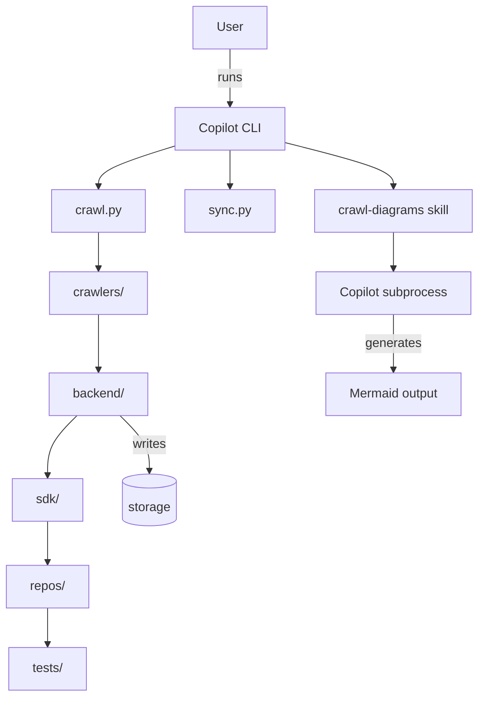
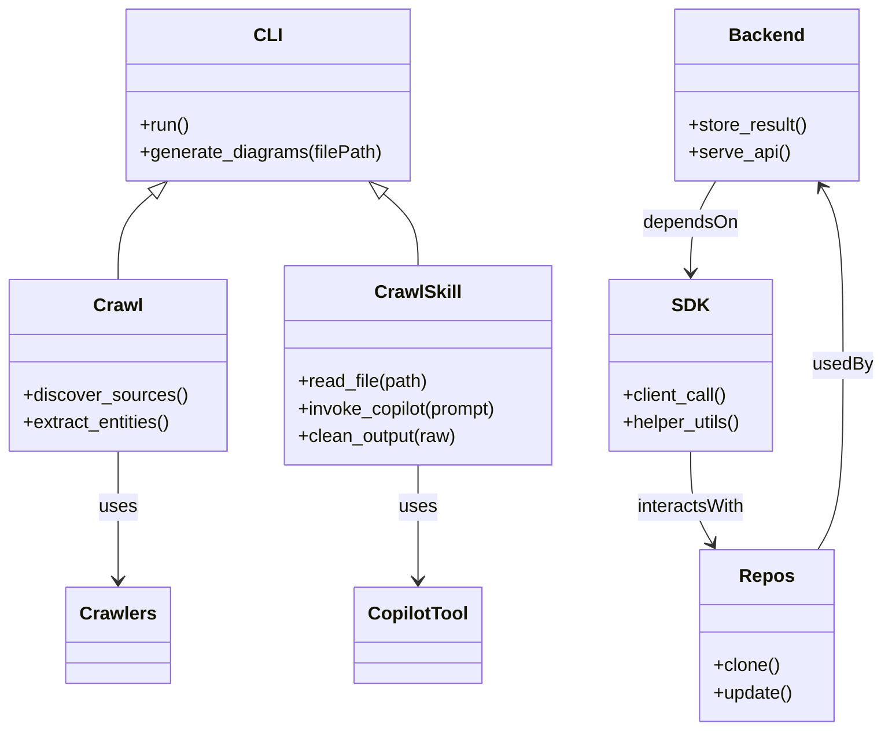

# Diagram: common/public_shield/config/config.qa.yml

> Auto-generated by Obscura crawlers

## Diagram 1

### SVG

<svg id="container" width="613.62890625" xmlns="http://www.w3.org/2000/svg" class="flowchart" height="881.4994506835938" viewBox="0 0 613.62890625 881.4994506835938" role="graphics-document document" aria-roledescription="flowchart-v2"><g><marker id="container_flowchart-v2-pointEnd" class="marker flowchart-v2" viewBox="0 0 10 10" refX="5" refY="5" markerUnits="userSpaceOnUse" markerWidth="8" markerHeight="8" orient="auto"><path d="M 0 0 L 10 5 L 0 10 z" class="arrowMarkerPath" style="stroke-width: 1; stroke-dasharray: 1, 0;"></path></marker><marker id="container_flowchart-v2-pointStart" class="marker flowchart-v2" viewBox="0 0 10 10" refX="4.5" refY="5" markerUnits="userSpaceOnUse" markerWidth="8" markerHeight="8" orient="auto"><path d="M 0 5 L 10 10 L 10 0 z" class="arrowMarkerPath" style="stroke-width: 1; stroke-dasharray: 1, 0;"></path></marker><marker id="container_flowchart-v2-circleEnd" class="marker flowchart-v2" viewBox="0 0 10 10" refX="11" refY="5" markerUnits="userSpaceOnUse" markerWidth="11" markerHeight="11" orient="auto"><circle cx="5" cy="5" r="5" class="arrowMarkerPath" style="stroke-width: 1; stroke-dasharray: 1, 0;"></circle></marker><marker id="container_flowchart-v2-circleStart" class="marker flowchart-v2" viewBox="0 0 10 10" refX="-1" refY="5" markerUnits="userSpaceOnUse" markerWidth="11" markerHeight="11" orient="auto"><circle cx="5" cy="5" r="5" class="arrowMarkerPath" style="stroke-width: 1; stroke-dasharray: 1, 0;"></circle></marker><marker id="container_flowchart-v2-crossEnd" class="marker cross flowchart-v2" viewBox="0 0 11 11" refX="12" refY="5.2" markerUnits="userSpaceOnUse" markerWidth="11" markerHeight="11" orient="auto"><path d="M 1,1 l 9,9 M 10,1 l -9,9" class="arrowMarkerPath" style="stroke-width: 2; stroke-dasharray: 1, 0;"></path></marker><marker id="container_flowchart-v2-crossStart" class="marker cross flowchart-v2" viewBox="0 0 11 11" refX="-1" refY="5.2" markerUnits="userSpaceOnUse" markerWidth="11" markerHeight="11" orient="auto"><path d="M 1,1 l 9,9 M 10,1 l -9,9" class="arrowMarkerPath" style="stroke-width: 2; stroke-dasharray: 1, 0;"></path></marker><g class="root"><g class="clusters"></g><g class="edgePaths"><path d="M294.34,62L294.34,68.167C294.34,74.333,294.34,86.667,294.34,98.333C294.34,110,294.34,121,294.34,126.5L294.34,132" id="L_U_CLI_0" class="edge-thickness-normal edge-pattern-solid edge-thickness-normal edge-pattern-solid flowchart-link" style=";" data-edge="true" data-et="edge" data-id="L_U_CLI_0" data-points="W3sieCI6Mjk0LjMzOTg0Mzc1LCJ5Ijo2Mn0seyJ4IjoyOTQuMzM5ODQzNzUsInkiOjk5fSx7IngiOjI5NC4zMzk4NDM3NSwieSI6MTM2fV0=" marker-end="url(#container_flowchart-v2-pointEnd)"></path><path d="M363.152,180.121L386.517,185.934C409.882,191.747,456.611,203.374,479.975,212.687C503.34,222,503.34,229,503.34,232.5L503.34,236" id="L_CLI_Parser_0" class="edge-thickness-normal edge-pattern-solid edge-thickness-normal edge-pattern-solid flowchart-link" style=";" data-edge="true" data-et="edge" data-id="L_CLI_Parser_0" data-points="W3sieCI6MzYzLjE1MjM0Mzc1LCJ5IjoxODAuMTIwODEzMzk3MTI5MTh9LHsieCI6NTAzLjMzOTg0Mzc1LCJ5IjoyMTV9LHsieCI6NTAzLjMzOTg0Mzc1LCJ5IjoyNDB9XQ==" marker-end="url(#container_flowchart-v2-pointEnd)"></path><path d="M294.34,190L294.34,194.167C294.34,198.333,294.34,206.667,294.34,214.333C294.34,222,294.34,229,294.34,232.5L294.34,236" id="L_CLI_Sync_0" class="edge-thickness-normal edge-pattern-solid edge-thickness-normal edge-pattern-solid flowchart-link" style=";" data-edge="true" data-et="edge" data-id="L_CLI_Sync_0" data-points="W3sieCI6Mjk0LjMzOTg0Mzc1LCJ5IjoxOTB9LHsieCI6Mjk0LjMzOTg0Mzc1LCJ5IjoyMTV9LHsieCI6Mjk0LjMzOTg0Mzc1LCJ5IjoyNDB9XQ==" marker-end="url(#container_flowchart-v2-pointEnd)"></path><path d="M225.527,184.511L209.272,189.593C193.017,194.674,160.507,204.837,144.251,213.419C127.996,222,127.996,229,127.996,232.5L127.996,236" id="L_CLI_Crawl_0" class="edge-thickness-normal edge-pattern-solid edge-thickness-normal edge-pattern-solid flowchart-link" style=";" data-edge="true" data-et="edge" data-id="L_CLI_Crawl_0" data-points="W3sieCI6MjI1LjUyNzM0Mzc1LCJ5IjoxODQuNTExMTc3OTA3MTk1Mn0seyJ4IjoxMjcuOTk2MDkzNzUsInkiOjIxNX0seyJ4IjoxMjcuOTk2MDkzNzUsInkiOjI0MH1d" marker-end="url(#container_flowchart-v2-pointEnd)"></path><path d="M503.34,294L503.34,298.167C503.34,302.333,503.34,310.667,503.34,318.333C503.34,326,503.34,333,503.34,336.5L503.34,340" id="L_Parser_Copilot_0" class="edge-thickness-normal edge-pattern-solid edge-thickness-normal edge-pattern-solid flowchart-link" style=";" data-edge="true" data-et="edge" data-id="L_Parser_Copilot_0" data-points="W3sieCI6NTAzLjMzOTg0Mzc1LCJ5IjoyOTR9LHsieCI6NTAzLjMzOTg0Mzc1LCJ5IjozMTl9LHsieCI6NTAzLjMzOTg0Mzc1LCJ5IjozNDR9XQ==" marker-end="url(#container_flowchart-v2-pointEnd)"></path><path d="M127.996,294L127.996,298.167C127.996,302.333,127.996,310.667,127.996,318.333C127.996,326,127.996,333,127.996,336.5L127.996,340" id="L_Crawl_CrawlersModule_0" class="edge-thickness-normal edge-pattern-solid edge-thickness-normal edge-pattern-solid flowchart-link" style=";" data-edge="true" data-et="edge" data-id="L_Crawl_CrawlersModule_0" data-points="W3sieCI6MTI3Ljk5NjA5Mzc1LCJ5IjoyOTR9LHsieCI6MTI3Ljk5NjA5Mzc1LCJ5IjozMTl9LHsieCI6MTI3Ljk5NjA5Mzc1LCJ5IjozNDR9XQ==" marker-end="url(#container_flowchart-v2-pointEnd)"></path><path d="M127.996,398L127.996,404.167C127.996,410.333,127.996,422.667,127.996,434.333C127.996,446,127.996,457,127.996,462.5L127.996,468" id="L_CrawlersModule_Backend_0" class="edge-thickness-normal edge-pattern-solid edge-thickness-normal edge-pattern-solid flowchart-link" style=";" data-edge="true" data-et="edge" data-id="L_CrawlersModule_Backend_0" data-points="W3sieCI6MTI3Ljk5NjA5Mzc1LCJ5IjozOTh9LHsieCI6MTI3Ljk5NjA5Mzc1LCJ5Ijo0MzV9LHsieCI6MTI3Ljk5NjA5Mzc1LCJ5Ijo0NzJ9XQ==" marker-end="url(#container_flowchart-v2-pointEnd)"></path><path d="M100.378,526L94.07,532.167C87.762,538.333,75.147,550.667,68.839,563.292C62.531,575.917,62.531,588.833,62.531,595.291L62.531,601.75" id="L_Backend_SDK_0" class="edge-thickness-normal edge-pattern-solid edge-thickness-normal edge-pattern-solid flowchart-link" style=";" data-edge="true" data-et="edge" data-id="L_Backend_SDK_0" data-points="W3sieCI6MTAwLjM3ODExMjc5Mjk2ODc1LCJ5Ijo1MjZ9LHsieCI6NjIuNTMxMjUsInkiOjU2M30seyJ4Ijo2Mi41MzEyNSwieSI6NjA1Ljc0OTczNjc4NTg4ODd9XQ==" marker-end="url(#container_flowchart-v2-pointEnd)"></path><path d="M62.531,659.75L62.531,664.875C62.531,670,62.531,680.25,62.531,688.875C62.531,697.499,62.531,704.499,62.531,707.999L62.531,711.499" id="L_SDK_Repos_0" class="edge-thickness-normal edge-pattern-solid edge-thickness-normal edge-pattern-solid flowchart-link" style=";" data-edge="true" data-et="edge" data-id="L_SDK_Repos_0" data-points="W3sieCI6NjIuNTMxMjUsInkiOjY1OS43NDk3MzY3ODU4ODg3fSx7IngiOjYyLjUzMTI1LCJ5Ijo2OTAuNDk5NDczNTcxNzc3M30seyJ4Ijo2Mi41MzEyNSwieSI6NzE1LjQ5OTQ3MzU3MTc3NzN9XQ==" marker-end="url(#container_flowchart-v2-pointEnd)"></path><path d="M62.531,769.499L62.531,773.666C62.531,777.833,62.531,786.166,62.531,793.833C62.531,801.499,62.531,808.499,62.531,811.999L62.531,815.499" id="L_Repos_Tests_0" class="edge-thickness-normal edge-pattern-solid edge-thickness-normal edge-pattern-solid flowchart-link" style=";" data-edge="true" data-et="edge" data-id="L_Repos_Tests_0" data-points="W3sieCI6NjIuNTMxMjUsInkiOjc2OS40OTk0NzM1NzE3NzczfSx7IngiOjYyLjUzMTI1LCJ5Ijo3OTQuNDk5NDczNTcxNzc3M30seyJ4Ijo2Mi41MzEyNSwieSI6ODE5LjQ5OTQ3MzU3MTc3NzN9XQ==" marker-end="url(#container_flowchart-v2-pointEnd)"></path><path d="M155.614,526L161.922,532.167C168.23,538.333,180.845,550.667,187.153,562.333C193.461,574,193.461,585,193.461,590.5L193.461,596" id="L_Backend_DB_0" class="edge-thickness-normal edge-pattern-solid edge-thickness-normal edge-pattern-solid flowchart-link" style=";" data-edge="true" data-et="edge" data-id="L_Backend_DB_0" data-points="W3sieCI6MTU1LjYxNDA3NDcwNzAzMTI1LCJ5Ijo1MjZ9LHsieCI6MTkzLjQ2MDkzNzUsInkiOjU2M30seyJ4IjoxOTMuNDYwOTM3NSwieSI6NjAwfV0=" marker-end="url(#container_flowchart-v2-pointEnd)"></path><path d="M503.34,398L503.34,404.167C503.34,410.333,503.34,422.667,503.34,434.333C503.34,446,503.34,457,503.34,462.5L503.34,468" id="L_Copilot_Diagrams_0" class="edge-thickness-normal edge-pattern-solid edge-thickness-normal edge-pattern-solid flowchart-link" style=";" data-edge="true" data-et="edge" data-id="L_Copilot_Diagrams_0" data-points="W3sieCI6NTAzLjMzOTg0Mzc1LCJ5IjozOTh9LHsieCI6NTAzLjMzOTg0Mzc1LCJ5Ijo0MzV9LHsieCI6NTAzLjMzOTg0Mzc1LCJ5Ijo0NzJ9XQ==" marker-end="url(#container_flowchart-v2-pointEnd)"></path></g><g class="edgeLabels"><g class="edgeLabel" transform="translate(294.33984375, 99)"><g class="label" data-id="L_U_CLI_0" transform="translate(-16.171875, -12)"><foreignObject width="32.34375" height="24">

runs

</foreignObject></g></g><g class="edgeLabel"><g class="label" data-id="L_CLI_Parser_0" transform="translate(0, 0)"><foreignObject width="0" height="0">

</foreignObject></g></g><g class="edgeLabel"><g class="label" data-id="L_CLI_Sync_0" transform="translate(0, 0)"><foreignObject width="0" height="0">

</foreignObject></g></g><g class="edgeLabel"><g class="label" data-id="L_CLI_Crawl_0" transform="translate(0, 0)"><foreignObject width="0" height="0">

</foreignObject></g></g><g class="edgeLabel"><g class="label" data-id="L_Parser_Copilot_0" transform="translate(0, 0)"><foreignObject width="0" height="0">

</foreignObject></g></g><g class="edgeLabel"><g class="label" data-id="L_Crawl_CrawlersModule_0" transform="translate(0, 0)"><foreignObject width="0" height="0">

</foreignObject></g></g><g class="edgeLabel"><g class="label" data-id="L_CrawlersModule_Backend_0" transform="translate(0, 0)"><foreignObject width="0" height="0">

</foreignObject></g></g><g class="edgeLabel"><g class="label" data-id="L_Backend_SDK_0" transform="translate(0, 0)"><foreignObject width="0" height="0">

</foreignObject></g></g><g class="edgeLabel"><g class="label" data-id="L_SDK_Repos_0" transform="translate(0, 0)"><foreignObject width="0" height="0">

</foreignObject></g></g><g class="edgeLabel"><g class="label" data-id="L_Repos_Tests_0" transform="translate(0, 0)"><foreignObject width="0" height="0">

</foreignObject></g></g><g class="edgeLabel" transform="translate(193.4609375, 563)"><g class="label" data-id="L_Backend_DB_0" transform="translate(-21.9453125, -12)"><foreignObject width="43.890625" height="24">

writes

</foreignObject></g></g><g class="edgeLabel" transform="translate(503.33984375, 435)"><g class="label" data-id="L_Copilot_Diagrams_0" transform="translate(-35.46875, -12)"><foreignObject width="70.9375" height="24">

generates

</foreignObject></g></g></g><g class="nodes"><g class="node default" id="flowchart-U-0" transform="translate(294.33984375, 35)"><rect class="basic label-container" style="" x="-46.4453125" y="-27" width="92.890625" height="54"></rect><g class="label" style="" transform="translate(-16.4453125, -12)"><rect></rect><foreignObject width="32.890625" height="24">

User

</foreignObject></g></g><g class="node default" id="flowchart-CLI-1" transform="translate(294.33984375, 163)"><rect class="basic label-container" style="" x="-68.8125" y="-27" width="137.625" height="54"></rect><g class="label" style="" transform="translate(-38.8125, -12)"><rect></rect><foreignObject width="77.625" height="24">

Copilot CLI

</foreignObject></g></g><g class="node default" id="flowchart-Parser-3" transform="translate(503.33984375, 267)"><rect class="basic label-container" style="" x="-102.2890625" y="-27" width="204.578125" height="54"></rect><g class="label" style="" transform="translate(-72.2890625, -12)"><rect></rect><foreignObject width="144.578125" height="24">

crawl-diagrams skill

</foreignObject></g></g><g class="node default" id="flowchart-Sync-5" transform="translate(294.33984375, 267)"><rect class="basic label-container" style="" x="-56.7109375" y="-27" width="113.421875" height="54"></rect><g class="label" style="" transform="translate(-26.7109375, -12)"><rect></rect><foreignObject width="53.421875" height="24">

sync.py

</foreignObject></g></g><g class="node default" id="flowchart-Crawl-7" transform="translate(127.99609375, 267)"><rect class="basic label-container" style="" x="-59.6328125" y="-27" width="119.265625" height="54"></rect><g class="label" style="" transform="translate(-29.6328125, -12)"><rect></rect><foreignObject width="59.265625" height="24">

crawl.py

</foreignObject></g></g><g class="node default" id="flowchart-Copilot-9" transform="translate(503.33984375, 371)"><rect class="basic label-container" style="" x="-98.8203125" y="-27" width="197.640625" height="54"></rect><g class="label" style="" transform="translate(-68.8203125, -12)"><rect></rect><foreignObject width="137.640625" height="24">

Copilot subprocess

</foreignObject></g></g><g class="node default" id="flowchart-CrawlersModule-11" transform="translate(127.99609375, 371)"><rect class="basic label-container" style="" x="-64.2109375" y="-27" width="128.421875" height="54"></rect><g class="label" style="" transform="translate(-34.2109375, -12)"><rect></rect><foreignObject width="68.421875" height="24">

crawlers/

</foreignObject></g></g><g class="node default" id="flowchart-Backend-13" transform="translate(127.99609375, 499)"><rect class="basic label-container" style="" x="-64.8671875" y="-27" width="129.734375" height="54"></rect><g class="label" style="" transform="translate(-34.8671875, -12)"><rect></rect><foreignObject width="69.734375" height="24">

backend/

</foreignObject></g></g><g class="node default" id="flowchart-SDK-15" transform="translate(62.53125, 632.7497367858887)"><rect class="basic label-container" style="" x="-46.78125" y="-27" width="93.5625" height="54"></rect><g class="label" style="" transform="translate(-16.78125, -12)"><rect></rect><foreignObject width="33.5625" height="24">

sdk/

</foreignObject></g></g><g class="node default" id="flowchart-Repos-17" transform="translate(62.53125, 742.4994735717773)"><rect class="basic label-container" style="" x="-54.53125" y="-27" width="109.0625" height="54"></rect><g class="label" style="" transform="translate(-24.53125, -12)"><rect></rect><foreignObject width="49.0625" height="24">

repos/

</foreignObject></g></g><g class="node default" id="flowchart-Tests-19" transform="translate(62.53125, 846.4994735717773)"><rect class="basic label-container" style="" x="-51.6484375" y="-27" width="103.296875" height="54"></rect><g class="label" style="" transform="translate(-21.6484375, -12)"><rect></rect><foreignObject width="43.296875" height="24">

tests/

</foreignObject></g></g><g class="node default" id="flowchart-DB-21" transform="translate(193.4609375, 632.7497367858887)"><path d="M0,8.833158192547085 a34.1484375,8.833158192547085 0,0,0 68.296875,0 a34.1484375,8.833158192547085 0,0,0 -68.296875,0 l0,47.83315819254709 a34.1484375,8.833158192547085 0,0,0 68.296875,0 l0,-47.83315819254709" class="basic label-container" style="" transform="translate(-34.1484375, -32.749737288820626)"></path><g class="label" style="" transform="translate(-26.6484375, -2)"><rect></rect><foreignObject width="53.296875" height="24">

storage

</foreignObject></g></g><g class="node default" id="flowchart-Diagrams-23" transform="translate(503.33984375, 499)"><rect class="basic label-container" style="" x="-88.5546875" y="-27" width="177.109375" height="54"></rect><g class="label" style="" transform="translate(-58.5546875, -12)"><rect></rect><foreignObject width="117.109375" height="24">

Mermaid output

</foreignObject></g></g></g></g></g></svg>

## Diagram 2

### SVG

<svg id="container" width="770.1640625" xmlns="http://www.w3.org/2000/svg" class="classDiagram" height="638" viewBox="0 0 770.1640625 638" role="graphics-document document" aria-roledescription="class"><g><defs><marker id="container_class-aggregationStart" class="marker aggregation class" refX="18" refY="7" markerWidth="190" markerHeight="240" orient="auto"><path d="M 18,7 L9,13 L1,7 L9,1 Z"></path></marker></defs><defs><marker id="container_class-aggregationEnd" class="marker aggregation class" refX="1" refY="7" markerWidth="20" markerHeight="28" orient="auto"><path d="M 18,7 L9,13 L1,7 L9,1 Z"></path></marker></defs><defs><marker id="container_class-extensionStart" class="marker extension class" refX="18" refY="7" markerWidth="190" markerHeight="240" orient="auto"><path d="M 1,7 L18,13 V 1 Z"></path></marker></defs><defs><marker id="container_class-extensionEnd" class="marker extension class" refX="1" refY="7" markerWidth="20" markerHeight="28" orient="auto"><path d="M 1,1 V 13 L18,7 Z"></path></marker></defs><defs><marker id="container_class-compositionStart" class="marker composition class" refX="18" refY="7" markerWidth="190" markerHeight="240" orient="auto"><path d="M 18,7 L9,13 L1,7 L9,1 Z"></path></marker></defs><defs><marker id="container_class-compositionEnd" class="marker composition class" refX="1" refY="7" markerWidth="20" markerHeight="28" orient="auto"><path d="M 18,7 L9,13 L1,7 L9,1 Z"></path></marker></defs><defs><marker id="container_class-dependencyStart" class="marker dependency class" refX="6" refY="7" markerWidth="190" markerHeight="240" orient="auto"><path d="M 5,7 L9,13 L1,7 L9,1 Z"></path></marker></defs><defs><marker id="container_class-dependencyEnd" class="marker dependency class" refX="13" refY="7" markerWidth="20" markerHeight="28" orient="auto"><path d="M 18,7 L9,13 L14,7 L9,1 Z"></path></marker></defs><defs><marker id="container_class-lollipopStart" class="marker lollipop class" refX="13" refY="7" markerWidth="190" markerHeight="240" orient="auto"><circle stroke="black" fill="transparent" cx="7" cy="7" r="6"></circle></marker></defs><defs><marker id="container_class-lollipopEnd" class="marker lollipop class" refX="1" refY="7" markerWidth="190" markerHeight="240" orient="auto"><circle stroke="black" fill="transparent" cx="7" cy="7" r="6"></circle></marker></defs><g class="root"><g class="clusters"></g><g class="edgePaths"><path d="M131.015,169.215L125.992,173.512C120.97,177.81,110.924,186.405,105.902,198.869C100.879,211.333,100.879,227.667,100.879,235.833L100.879,244" id="id_CLI_Crawl_1" class="edge-thickness-normal edge-pattern-solid relation" style=";;;" data-edge="true" data-et="edge" data-id="id_CLI_Crawl_1" data-points="W3sieCI6MTQ0LjEyMjE0MDA2Njk2NDI4LCJ5IjoxNTh9LHsieCI6MTAwLjg3ODkwNjI1LCJ5IjoxOTV9LHsieCI6MTAwLjg3ODkwNjI1LCJ5IjoyNDR9XQ==" marker-start="url(#container_class-extensionStart)"></path><path d="M332.54,169.215L337.562,173.512C342.585,177.81,352.63,186.405,357.653,196.869C362.676,207.333,362.676,219.667,362.676,225.833L362.676,232" id="id_CLI_CrawlSkill_2" class="edge-thickness-normal edge-pattern-solid relation" style=";;;" data-edge="true" data-et="edge" data-id="id_CLI_CrawlSkill_2" data-points="W3sieCI6MzE5LjQzMjU0NzQzMzAzNTcsInkiOjE1OH0seyJ4IjozNjIuNjc1NzgxMjUsInkiOjE5NX0seyJ4IjozNjIuNjc1NzgxMjUsInkiOjIzMn1d" marker-start="url(#container_class-extensionStart)"></path><path d="M100.879,394L100.879,402.167C100.879,410.333,100.879,426.667,100.879,445.5C100.879,464.333,100.879,485.667,100.879,496.333L100.879,507" id="id_Crawl_Crawlers_3" class="edge-thickness-normal edge-pattern-solid relation" style=";;;" data-edge="true" data-et="edge" data-id="id_Crawl_Crawlers_3" data-points="W3sieCI6MTAwLjg3ODkwNjI1LCJ5IjozOTR9LHsieCI6MTAwLjg3ODkwNjI1LCJ5Ijo0NDN9LHsieCI6MTAwLjg3ODkwNjI1LCJ5Ijo1MTN9XQ==" marker-end="url(#container_class-dependencyEnd)"></path><path d="M362.676,406L362.676,412.167C362.676,418.333,362.676,430.667,362.676,447.5C362.676,464.333,362.676,485.667,362.676,496.333L362.676,507" id="id_CrawlSkill_CopilotTool_4" class="edge-thickness-normal edge-pattern-solid relation" style=";;;" data-edge="true" data-et="edge" data-id="id_CrawlSkill_CopilotTool_4" data-points="W3sieCI6MzYyLjY3NTc4MTI1LCJ5Ijo0MDZ9LHsieCI6MzYyLjY3NTc4MTI1LCJ5Ijo0NDN9LHsieCI6MzYyLjY3NTc4MTI1LCJ5Ijo1MTN9XQ==" marker-end="url(#container_class-dependencyEnd)"></path><path d="M624.968,158L621.313,164.167C617.657,170.333,610.346,182.667,606.691,196C603.035,209.333,603.035,223.667,603.035,230.833L603.035,238" id="id_Backend_SDK_5" class="edge-thickness-normal edge-pattern-solid relation" style=";;;" data-edge="true" data-et="edge" data-id="id_Backend_SDK_5" data-points="W3sieCI6NjI0Ljk2ODQxODY2NjI5NDYsInkiOjE1OH0seyJ4Ijo2MDMuMDM1MTU2MjUsInkiOjE5NX0seyJ4Ijo2MDMuMDM1MTU2MjUsInkiOjI0NH1d" marker-end="url(#container_class-dependencyEnd)"></path><path d="M713.887,480L717.543,473.833C721.198,467.667,728.509,455.333,732.165,428.5C735.82,401.667,735.82,360.333,735.82,319C735.82,277.667,735.82,236.333,732.675,210.36C729.529,184.387,723.238,173.774,720.092,168.468L716.947,163.161" id="id_Repos_Backend_6" class="edge-thickness-normal edge-pattern-solid relation" style=";;;" data-edge="true" data-et="edge" data-id="id_Repos_Backend_6" data-points="W3sieCI6NzEzLjg4NzA1MDA4MzcwNTQsInkiOjQ4MH0seyJ4Ijo3MzUuODIwMzEyNSwieSI6NDQzfSx7IngiOjczNS44MjAzMTI1LCJ5IjozMTl9LHsieCI6NzM1LjgyMDMxMjUsInkiOjE5NX0seyJ4Ijo3MTMuODg3MDUwMDgzNzA1NCwieSI6MTU4fV0=" marker-end="url(#container_class-dependencyEnd)"></path><path d="M603.035,394L603.035,402.167C603.035,410.333,603.035,426.667,606.181,440.14C609.326,453.613,615.618,464.226,618.763,469.532L621.909,474.839" id="id_SDK_Repos_7" class="edge-thickness-normal edge-pattern-solid relation" style=";;;" data-edge="true" data-et="edge" data-id="id_SDK_Repos_7" data-points="W3sieCI6NjAzLjAzNTE1NjI1LCJ5IjozOTR9LHsieCI6NjAzLjAzNTE1NjI1LCJ5Ijo0NDN9LHsieCI6NjI0Ljk2ODQxODY2NjI5NDYsInkiOjQ4MH1d" marker-end="url(#container_class-dependencyEnd)"></path></g><g class="edgeLabels"><g class="edgeLabel"><g class="label" data-id="id_CLI_Crawl_1" transform="translate(0, 0)"><foreignObject width="0" height="0">

</foreignObject></g></g><g class="edgeLabel"><g class="label" data-id="id_CLI_CrawlSkill_2" transform="translate(0, 0)"><foreignObject width="0" height="0">

</foreignObject></g></g><g class="edgeLabel" transform="translate(100.87890625, 443)"><g class="label" data-id="id_Crawl_Crawlers_3" transform="translate(-16.4921875, -12)"><foreignObject width="32.984375" height="24">

uses

</foreignObject></g></g><g class="edgeLabel" transform="translate(362.67578125, 443)"><g class="label" data-id="id_CrawlSkill_CopilotTool_4" transform="translate(-16.4921875, -12)"><foreignObject width="32.984375" height="24">

uses

</foreignObject></g></g><g class="edgeLabel" transform="translate(603.03515625, 195)"><g class="label" data-id="id_Backend_SDK_5" transform="translate(-41.6953125, -12)"><foreignObject width="83.390625" height="24">

dependsOn

</foreignObject></g></g><g class="edgeLabel" transform="translate(735.8203125, 319)"><g class="label" data-id="id_Repos_Backend_6" transform="translate(-26.34375, -12)"><foreignObject width="52.6875" height="24">

usedBy

</foreignObject></g></g><g class="edgeLabel" transform="translate(603.03515625, 443)"><g class="label" data-id="id_SDK_Repos_7" transform="translate(-48.125, -12)"><foreignObject width="96.25" height="24">

interactsWith

</foreignObject></g></g></g><g class="nodes"><g class="node default" id="classId-CLI-0" transform="translate(231.77734375, 83)"><g class="basic label-container"><path d="M-122.90234375 -75 L122.90234375 -75 L122.90234375 75 L-122.90234375 75" stroke="none" stroke-width="0" fill="#ECECFF" style=""></path><path d="M-122.90234375 -75 C-41.460429984433105 -75, 39.98148378113379 -75, 122.90234375 -75 M-122.90234375 -75 C-62.370361882398356 -75, -1.8383800147967122 -75, 122.90234375 -75 M122.90234375 -75 C122.90234375 -33.73462445042581, 122.90234375 7.530751099148375, 122.90234375 75 M122.90234375 -75 C122.90234375 -24.78683146391886, 122.90234375 25.426337072162283, 122.90234375 75 M122.90234375 75 C52.780842255399605 75, -17.34065923920079 75, -122.90234375 75 M122.90234375 75 C61.94069382181065 75, 0.9790438936212951 75, -122.90234375 75 M-122.90234375 75 C-122.90234375 21.129321605040893, -122.90234375 -32.741356789918214, -122.90234375 -75 M-122.90234375 75 C-122.90234375 35.225296989649664, -122.90234375 -4.549406020700673, -122.90234375 -75" stroke="#9370DB" stroke-width="1.3" fill="none" stroke-dasharray="0 0" style=""></path></g><g class="annotation-group text" transform="translate(0, -51)"></g><g class="label-group text" transform="translate(-11.0546875, -51)"><g class="label" style="font-weight: bolder" transform="translate(0,-12)"><foreignObject width="22.109375" height="24">

CLI

</foreignObject></g></g><g class="members-group text" transform="translate(-110.90234375, -3)"></g><g class="methods-group text" transform="translate(-110.90234375, 27)"><g class="label" style="" transform="translate(0,-12)"><foreignObject width="43.21875" height="24">

+run()

</foreignObject></g><g class="label" style="" transform="translate(0,12)"><foreignObject width="210.75" height="24">

+generate_diagrams(filePath)

</foreignObject></g></g><g class="divider" style=""><path d="M-122.90234375 -27 C-64.84491914453477 -27, -6.787494539069556 -27, 122.90234375 -27 M-122.90234375 -27 C-42.35038079900315 -27, 38.201582151993705 -27, 122.90234375 -27" stroke="#9370DB" stroke-width="1.3" fill="none" stroke-dasharray="0 0" style=""></path></g><g class="divider" style=""><path d="M-122.90234375 -3 C-46.617758852305315 -3, 29.66682604538937 -3, 122.90234375 -3 M-122.90234375 -3 C-60.32348863691028 -3, 2.2553664761794465 -3, 122.90234375 -3" stroke="#9370DB" stroke-width="1.3" fill="none" stroke-dasharray="0 0" style=""></path></g></g><g class="node default" id="classId-Crawl-1" transform="translate(100.87890625, 319)"><g class="basic label-container"><path d="M-92.87890625 -75 L92.87890625 -75 L92.87890625 75 L-92.87890625 75" stroke="none" stroke-width="0" fill="#ECECFF" style=""></path><path d="M-92.87890625 -75 C-21.896038580833704 -75, 49.08682908833259 -75, 92.87890625 -75 M-92.87890625 -75 C-53.13870722571334 -75, -13.39850820142668 -75, 92.87890625 -75 M92.87890625 -75 C92.87890625 -30.032875395791997, 92.87890625 14.934249208416006, 92.87890625 75 M92.87890625 -75 C92.87890625 -16.414247613143317, 92.87890625 42.171504773713366, 92.87890625 75 M92.87890625 75 C55.62734839926987 75, 18.37579054853974 75, -92.87890625 75 M92.87890625 75 C48.75079683767867 75, 4.622687425357341 75, -92.87890625 75 M-92.87890625 75 C-92.87890625 39.024270334549406, -92.87890625 3.048540669098813, -92.87890625 -75 M-92.87890625 75 C-92.87890625 33.1281904292546, -92.87890625 -8.743619141490797, -92.87890625 -75" stroke="#9370DB" stroke-width="1.3" fill="none" stroke-dasharray="0 0" style=""></path></g><g class="annotation-group text" transform="translate(0, -51)"></g><g class="label-group text" transform="translate(-20.1484375, -51)"><g class="label" style="font-weight: bolder" transform="translate(0,-12)"><foreignObject width="40.296875" height="24">

Crawl

</foreignObject></g></g><g class="members-group text" transform="translate(-80.87890625, -3)"></g><g class="methods-group text" transform="translate(-80.87890625, 27)"><g class="label" style="" transform="translate(0,-12)"><foreignObject width="141.609375" height="24">

+discover_sources()

</foreignObject></g><g class="label" style="" transform="translate(0,12)"><foreignObject width="131.078125" height="24">

+extract_entities()

</foreignObject></g></g><g class="divider" style=""><path d="M-92.87890625 -27 C-20.335265439850247 -27, 52.20837537029951 -27, 92.87890625 -27 M-92.87890625 -27 C-38.896945345097684 -27, 15.085015559804631 -27, 92.87890625 -27" stroke="#9370DB" stroke-width="1.3" fill="none" stroke-dasharray="0 0" style=""></path></g><g class="divider" style=""><path d="M-92.87890625 -3 C-35.612525753197794 -3, 21.653854743604413 -3, 92.87890625 -3 M-92.87890625 -3 C-36.95702339682592 -3, 18.964859456348165 -3, 92.87890625 -3" stroke="#9370DB" stroke-width="1.3" fill="none" stroke-dasharray="0 0" style=""></path></g></g><g class="node default" id="classId-CrawlSkill-2" transform="translate(362.67578125, 319)"><g class="basic label-container"><path d="M-118.91796875 -87 L118.91796875 -87 L118.91796875 87 L-118.91796875 87" stroke="none" stroke-width="0" fill="#ECECFF" style=""></path><path d="M-118.91796875 -87 C-24.987960714799414 -87, 68.94204732040117 -87, 118.91796875 -87 M-118.91796875 -87 C-43.400204222337806 -87, 32.11756030532439 -87, 118.91796875 -87 M118.91796875 -87 C118.91796875 -21.323972909299385, 118.91796875 44.35205418140123, 118.91796875 87 M118.91796875 -87 C118.91796875 -39.96149405050492, 118.91796875 7.077011898990165, 118.91796875 87 M118.91796875 87 C51.892449319655015 87, -15.133070110689971 87, -118.91796875 87 M118.91796875 87 C53.11182139990008 87, -12.69432595019984 87, -118.91796875 87 M-118.91796875 87 C-118.91796875 20.180927587025863, -118.91796875 -46.638144825948274, -118.91796875 -87 M-118.91796875 87 C-118.91796875 48.97797298766159, -118.91796875 10.955945975323175, -118.91796875 -87" stroke="#9370DB" stroke-width="1.3" fill="none" stroke-dasharray="0 0" style=""></path></g><g class="annotation-group text" transform="translate(0, -63)"></g><g class="label-group text" transform="translate(-36.1484375, -63)"><g class="label" style="font-weight: bolder" transform="translate(0,-12)"><foreignObject width="72.296875" height="24">

CrawlSkill

</foreignObject></g></g><g class="members-group text" transform="translate(-106.91796875, -15)"></g><g class="methods-group text" transform="translate(-106.91796875, 15)"><g class="label" style="" transform="translate(0,-12)"><foreignObject width="114.609375" height="24">

+read_file(path)

</foreignObject></g><g class="label" style="" transform="translate(0,12)"><foreignObject width="177.6875" height="24">

+invoke_copilot(prompt)

</foreignObject></g><g class="label" style="" transform="translate(0,36)"><foreignObject width="139.984375" height="24">

+clean_output(raw)

</foreignObject></g></g><g class="divider" style=""><path d="M-118.91796875 -39 C-37.48781048419126 -39, 43.942347781617485 -39, 118.91796875 -39 M-118.91796875 -39 C-64.99992525971591 -39, -11.081881769431817 -39, 118.91796875 -39" stroke="#9370DB" stroke-width="1.3" fill="none" stroke-dasharray="0 0" style=""></path></g><g class="divider" style=""><path d="M-118.91796875 -15 C-29.470252685595085 -15, 59.97746337880983 -15, 118.91796875 -15 M-118.91796875 -15 C-27.50783308651353 -15, 63.90230257697294 -15, 118.91796875 -15" stroke="#9370DB" stroke-width="1.3" fill="none" stroke-dasharray="0 0" style=""></path></g></g><g class="node default" id="classId-Backend-3" transform="translate(669.427734375, 83)"><g class="basic label-container"><path d="M-80.046875 -75 L80.046875 -75 L80.046875 75 L-80.046875 75" stroke="none" stroke-width="0" fill="#ECECFF" style=""></path><path d="M-80.046875 -75 C-24.864358984231536 -75, 30.318157031536927 -75, 80.046875 -75 M-80.046875 -75 C-23.816881627534393 -75, 32.413111744931214 -75, 80.046875 -75 M80.046875 -75 C80.046875 -23.173419226108862, 80.046875 28.653161547782275, 80.046875 75 M80.046875 -75 C80.046875 -25.588969570032077, 80.046875 23.822060859935846, 80.046875 75 M80.046875 75 C43.056721927130766 75, 6.066568854261533 75, -80.046875 75 M80.046875 75 C43.78080669832279 75, 7.514738396645583 75, -80.046875 75 M-80.046875 75 C-80.046875 19.12277539764549, -80.046875 -36.75444920470902, -80.046875 -75 M-80.046875 75 C-80.046875 21.198339320721132, -80.046875 -32.603321358557736, -80.046875 -75" stroke="#9370DB" stroke-width="1.3" fill="none" stroke-dasharray="0 0" style=""></path></g><g class="annotation-group text" transform="translate(0, -51)"></g><g class="label-group text" transform="translate(-31.296875, -51)"><g class="label" style="font-weight: bolder" transform="translate(0,-12)"><foreignObject width="62.59375" height="24">

Backend

</foreignObject></g></g><g class="members-group text" transform="translate(-68.046875, -3)"></g><g class="methods-group text" transform="translate(-68.046875, 27)"><g class="label" style="" transform="translate(0,-12)"><foreignObject width="104.796875" height="24">

+store_result()

</foreignObject></g><g class="label" style="" transform="translate(0,12)"><foreignObject width="87.65625" height="24">

+serve_api()

</foreignObject></g></g><g class="divider" style=""><path d="M-80.046875 -27 C-37.74646156401326 -27, 4.5539518719734815 -27, 80.046875 -27 M-80.046875 -27 C-21.981998679511648 -27, 36.082877640976704 -27, 80.046875 -27" stroke="#9370DB" stroke-width="1.3" fill="none" stroke-dasharray="0 0" style=""></path></g><g class="divider" style=""><path d="M-80.046875 -3 C-24.035508155148733 -3, 31.975858689702534 -3, 80.046875 -3 M-80.046875 -3 C-30.17119328698319 -3, 19.70448842603362 -3, 80.046875 -3" stroke="#9370DB" stroke-width="1.3" fill="none" stroke-dasharray="0 0" style=""></path></g></g><g class="node default" id="classId-SDK-4" transform="translate(603.03515625, 319)"><g class="basic label-container"><path d="M-71.44140625 -75 L71.44140625 -75 L71.44140625 75 L-71.44140625 75" stroke="none" stroke-width="0" fill="#ECECFF" style=""></path><path d="M-71.44140625 -75 C-19.374308198291104 -75, 32.69278985341779 -75, 71.44140625 -75 M-71.44140625 -75 C-24.985728384876488 -75, 21.469949480247024 -75, 71.44140625 -75 M71.44140625 -75 C71.44140625 -18.386860149149257, 71.44140625 38.226279701701486, 71.44140625 75 M71.44140625 -75 C71.44140625 -38.25491011483336, 71.44140625 -1.5098202296667154, 71.44140625 75 M71.44140625 75 C18.347058911261264 75, -34.74728842747747 75, -71.44140625 75 M71.44140625 75 C25.037189917375898 75, -21.367026415248205 75, -71.44140625 75 M-71.44140625 75 C-71.44140625 25.82764362086472, -71.44140625 -23.34471275827056, -71.44140625 -75 M-71.44140625 75 C-71.44140625 37.82149616469514, -71.44140625 0.6429923293902817, -71.44140625 -75" stroke="#9370DB" stroke-width="1.3" fill="none" stroke-dasharray="0 0" style=""></path></g><g class="annotation-group text" transform="translate(0, -51)"></g><g class="label-group text" transform="translate(-14.8515625, -51)"><g class="label" style="font-weight: bolder" transform="translate(0,-12)"><foreignObject width="29.703125" height="24">

SDK

</foreignObject></g></g><g class="members-group text" transform="translate(-59.44140625, -3)"></g><g class="methods-group text" transform="translate(-59.44140625, 27)"><g class="label" style="" transform="translate(0,-12)"><foreignObject width="92.484375" height="24">

+client_call()

</foreignObject></g><g class="label" style="" transform="translate(0,12)"><foreignObject width="104.03125" height="24">

+helper_utils()

</foreignObject></g></g><g class="divider" style=""><path d="M-71.44140625 -27 C-35.93239203831698 -27, -0.42337782663396695 -27, 71.44140625 -27 M-71.44140625 -27 C-26.045381424729932 -27, 19.350643400540136 -27, 71.44140625 -27" stroke="#9370DB" stroke-width="1.3" fill="none" stroke-dasharray="0 0" style=""></path></g><g class="divider" style=""><path d="M-71.44140625 -3 C-28.290799376876635 -3, 14.85980749624673 -3, 71.44140625 -3 M-71.44140625 -3 C-30.57609593553248 -3, 10.289214378935043 -3, 71.44140625 -3" stroke="#9370DB" stroke-width="1.3" fill="none" stroke-dasharray="0 0" style=""></path></g></g><g class="node default" id="classId-Repos-5" transform="translate(669.427734375, 555)"><g class="basic label-container"><path d="M-58.125 -75 L58.125 -75 L58.125 75 L-58.125 75" stroke="none" stroke-width="0" fill="#ECECFF" style=""></path><path d="M-58.125 -75 C-24.96293631494155 -75, 8.199127370116898 -75, 58.125 -75 M-58.125 -75 C-28.252069476128188 -75, 1.6208610477436238 -75, 58.125 -75 M58.125 -75 C58.125 -18.20398161073117, 58.125 38.59203677853766, 58.125 75 M58.125 -75 C58.125 -33.36597649056494, 58.125 8.26804701887012, 58.125 75 M58.125 75 C24.544713364061323 75, -9.035573271877354 75, -58.125 75 M58.125 75 C18.72199267778725 75, -20.681014644425503 75, -58.125 75 M-58.125 75 C-58.125 40.199507164772236, -58.125 5.399014329544471, -58.125 -75 M-58.125 75 C-58.125 31.108296277804264, -58.125 -12.783407444391472, -58.125 -75" stroke="#9370DB" stroke-width="1.3" fill="none" stroke-dasharray="0 0" style=""></path></g><g class="annotation-group text" transform="translate(0, -51)"></g><g class="label-group text" transform="translate(-22.546875, -51)"><g class="label" style="font-weight: bolder" transform="translate(0,-12)"><foreignObject width="45.09375" height="24">

Repos

</foreignObject></g></g><g class="members-group text" transform="translate(-46.125, -3)"></g><g class="methods-group text" transform="translate(-46.125, 27)"><g class="label" style="" transform="translate(0,-12)"><foreignObject width="58.0625" height="24">

+clone()

</foreignObject></g><g class="label" style="" transform="translate(0,12)"><foreignObject width="69.703125" height="24">

+update()

</foreignObject></g></g><g class="divider" style=""><path d="M-58.125 -27 C-34.6533086906595 -27, -11.181617381318993 -27, 58.125 -27 M-58.125 -27 C-33.479318967648595 -27, -8.83363793529719 -27, 58.125 -27" stroke="#9370DB" stroke-width="1.3" fill="none" stroke-dasharray="0 0" style=""></path></g><g class="divider" style=""><path d="M-58.125 -3 C-31.671678783450304 -3, -5.2183575669006075 -3, 58.125 -3 M-58.125 -3 C-25.11519508655438 -3, 7.894609826891241 -3, 58.125 -3" stroke="#9370DB" stroke-width="1.3" fill="none" stroke-dasharray="0 0" style=""></path></g></g><g class="node default" id="classId-Crawlers-6" transform="translate(100.87890625, 555)"><g class="basic label-container"><path d="M-43.5 -42 L43.5 -42 L43.5 42 L-43.5 42" stroke="none" stroke-width="0" fill="#ECECFF" style=""></path><path d="M-43.5 -42 C-13.40179330249062 -42, 16.69641339501876 -42, 43.5 -42 M-43.5 -42 C-11.806753973586495 -42, 19.88649205282701 -42, 43.5 -42 M43.5 -42 C43.5 -18.33696737533957, 43.5 5.3260652493208624, 43.5 42 M43.5 -42 C43.5 -23.319409528398598, 43.5 -4.638819056797196, 43.5 42 M43.5 42 C24.767827209470948 42, 6.0356544189418955 42, -43.5 42 M43.5 42 C17.747101346654215 42, -8.00579730669157 42, -43.5 42 M-43.5 42 C-43.5 25.02413523565518, -43.5 8.04827047131036, -43.5 -42 M-43.5 42 C-43.5 12.711805218200833, -43.5 -16.576389563598333, -43.5 -42" stroke="#9370DB" stroke-width="1.3" fill="none" stroke-dasharray="0 0" style=""></path></g><g class="annotation-group text" transform="translate(0, -18)"></g><g class="label-group text" transform="translate(-31.5, -18)"><g class="label" style="font-weight: bolder" transform="translate(0,-12)"><foreignObject width="63" height="24">

Crawlers

</foreignObject></g></g><g class="members-group text" transform="translate(-31.5, 30)"></g><g class="methods-group text" transform="translate(-31.5, 60)"></g><g class="divider" style=""><path d="M-43.5 6 C-9.05718701477145 6, 25.3856259704571 6, 43.5 6 M-43.5 6 C-14.724525619408112 6, 14.050948761183776 6, 43.5 6" stroke="#9370DB" stroke-width="1.3" fill="none" stroke-dasharray="0 0" style=""></path></g><g class="divider" style=""><path d="M-43.5 24 C-20.888113192577286 24, 1.7237736148454275 24, 43.5 24 M-43.5 24 C-17.99748346640388 24, 7.505033067192237 24, 43.5 24" stroke="#9370DB" stroke-width="1.3" fill="none" stroke-dasharray="0 0" style=""></path></g></g><g class="node default" id="classId-CopilotTool-7" transform="translate(362.67578125, 555)"><g class="basic label-container"><path d="M-53.84375 -42 L53.84375 -42 L53.84375 42 L-53.84375 42" stroke="none" stroke-width="0" fill="#ECECFF" style=""></path><path d="M-53.84375 -42 C-25.41984829661566 -42, 3.0040534067686835 -42, 53.84375 -42 M-53.84375 -42 C-26.958576912218653 -42, -0.07340382443730675 -42, 53.84375 -42 M53.84375 -42 C53.84375 -8.787677945247381, 53.84375 24.424644109505238, 53.84375 42 M53.84375 -42 C53.84375 -11.723047595326662, 53.84375 18.553904809346676, 53.84375 42 M53.84375 42 C11.185830648874337 42, -31.472088702251327 42, -53.84375 42 M53.84375 42 C23.301938745454176 42, -7.239872509091647 42, -53.84375 42 M-53.84375 42 C-53.84375 15.898458484699503, -53.84375 -10.203083030600993, -53.84375 -42 M-53.84375 42 C-53.84375 21.68872641102424, -53.84375 1.3774528220484825, -53.84375 -42" stroke="#9370DB" stroke-width="1.3" fill="none" stroke-dasharray="0 0" style=""></path></g><g class="annotation-group text" transform="translate(0, -18)"></g><g class="label-group text" transform="translate(-41.84375, -18)"><g class="label" style="font-weight: bolder" transform="translate(0,-12)"><foreignObject width="83.6875" height="24">

CopilotTool

</foreignObject></g></g><g class="members-group text" transform="translate(-41.84375, 30)"></g><g class="methods-group text" transform="translate(-41.84375, 60)"></g><g class="divider" style=""><path d="M-53.84375 6 C-28.36001965033293 6, -2.87628930066586 6, 53.84375 6 M-53.84375 6 C-22.318258946149243 6, 9.207232107701515 6, 53.84375 6" stroke="#9370DB" stroke-width="1.3" fill="none" stroke-dasharray="0 0" style=""></path></g><g class="divider" style=""><path d="M-53.84375 24 C-20.952902822444074 24, 11.937944355111853 24, 53.84375 24 M-53.84375 24 C-12.702366784615307 24, 28.439016430769385 24, 53.84375 24" stroke="#9370DB" stroke-width="1.3" fill="none" stroke-dasharray="0 0" style=""></path></g></g></g></g></g></svg>
