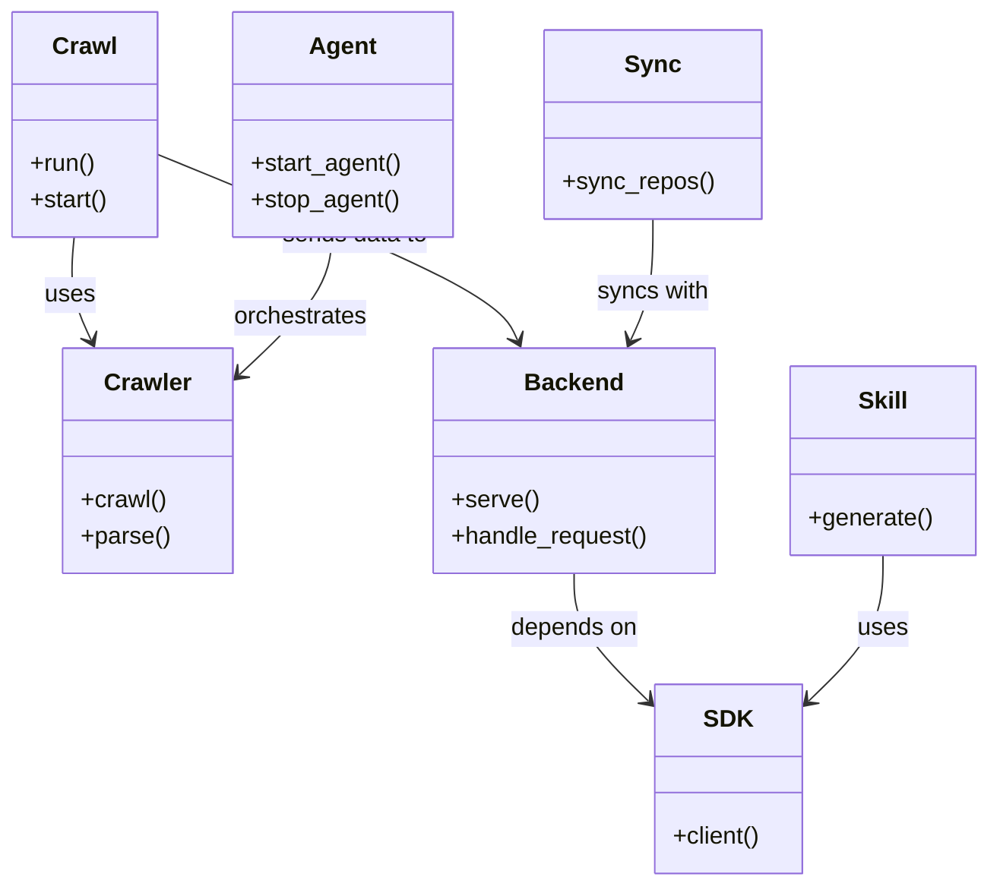

# Diagram: common/public_shield/config/config.qa2.yml

> Auto-generated by Obscura crawlers

## Mermaid

### SVG

<svg id="container" width="654.36328125" xmlns="http://www.w3.org/2000/svg" class="classDiagram" height="590" viewBox="0 0 654.36328125 590" role="graphics-document document" aria-roledescription="class"><g><defs><marker id="container_class-aggregationStart" class="marker aggregation class" refX="18" refY="7" markerWidth="190" markerHeight="240" orient="auto"><path d="M 18,7 L9,13 L1,7 L9,1 Z"></path></marker></defs><defs><marker id="container_class-aggregationEnd" class="marker aggregation class" refX="1" refY="7" markerWidth="20" markerHeight="28" orient="auto"><path d="M 18,7 L9,13 L1,7 L9,1 Z"></path></marker></defs><defs><marker id="container_class-extensionStart" class="marker extension class" refX="18" refY="7" markerWidth="190" markerHeight="240" orient="auto"><path d="M 1,7 L18,13 V 1 Z"></path></marker></defs><defs><marker id="container_class-extensionEnd" class="marker extension class" refX="1" refY="7" markerWidth="20" markerHeight="28" orient="auto"><path d="M 1,1 V 13 L18,7 Z"></path></marker></defs><defs><marker id="container_class-compositionStart" class="marker composition class" refX="18" refY="7" markerWidth="190" markerHeight="240" orient="auto"><path d="M 18,7 L9,13 L1,7 L9,1 Z"></path></marker></defs><defs><marker id="container_class-compositionEnd" class="marker composition class" refX="1" refY="7" markerWidth="20" markerHeight="28" orient="auto"><path d="M 18,7 L9,13 L1,7 L9,1 Z"></path></marker></defs><defs><marker id="container_class-dependencyStart" class="marker dependency class" refX="6" refY="7" markerWidth="190" markerHeight="240" orient="auto"><path d="M 5,7 L9,13 L1,7 L9,1 Z"></path></marker></defs><defs><marker id="container_class-dependencyEnd" class="marker dependency class" refX="13" refY="7" markerWidth="20" markerHeight="28" orient="auto"><path d="M 18,7 L9,13 L14,7 L9,1 Z"></path></marker></defs><defs><marker id="container_class-lollipopStart" class="marker lollipop class" refX="13" refY="7" markerWidth="190" markerHeight="240" orient="auto"><circle stroke="black" fill="transparent" cx="7" cy="7" r="6"></circle></marker></defs><defs><marker id="container_class-lollipopEnd" class="marker lollipop class" refX="1" refY="7" markerWidth="190" markerHeight="240" orient="auto"><circle stroke="black" fill="transparent" cx="7" cy="7" r="6"></circle></marker></defs><g class="root"><g class="clusters"></g><g class="edgePaths"><path d="M46.785,158L46.015,164.167C45.245,170.333,43.704,182.667,45.444,194.097C47.183,205.528,52.201,216.056,54.711,221.32L57.22,226.584" id="id_Crawl_Crawler_1" class="edge-thickness-normal edge-pattern-solid relation" style=";;;" data-edge="true" data-et="edge" data-id="id_Crawl_Crawler_1" data-points="W3sieCI6NDYuNzg1MTkxMTI3MjMyMTQsInkiOjE1OH0seyJ4Ijo0Mi4xNjQwNjI1LCJ5IjoxOTV9LHsieCI6NTkuODAyMDM2ODMwMzU3MTQ2LCJ5IjoyMzJ9XQ==" marker-end="url(#container_class-dependencyEnd)"></path><path d="M104.305,102.874L141.507,118.228C178.71,133.582,253.115,164.291,292.826,184.91C332.538,205.528,337.557,216.056,340.066,221.32L342.576,226.584" id="id_Crawl_Backend_2" class="edge-thickness-normal edge-pattern-solid relation" style=";;;" data-edge="true" data-et="edge" data-id="id_Crawl_Backend_2" data-points="W3sieCI6MTA0LjMwNDY4NzUsInkiOjEwMi44NzM2NzIwODg2NzEzN30seyJ4IjozMjcuNTE5NTMxMjUsInkiOjE5NX0seyJ4IjozNDUuMTU3NTA1NTgwMzU3MTcsInkiOjIzMn1d" marker-end="url(#container_class-dependencyEnd)"></path><path d="M434.301,146L434.301,154.167C434.301,162.333,434.301,178.667,431.791,192.097C429.282,205.528,424.263,216.056,421.754,221.32L419.245,226.584" id="id_Sync_Backend_3" class="edge-thickness-normal edge-pattern-solid relation" style=";;;" data-edge="true" data-et="edge" data-id="id_Sync_Backend_3" data-points="W3sieCI6NDM0LjMwMDc4MTI1LCJ5IjoxNDZ9LHsieCI6NDM0LjMwMDc4MTI1LCJ5IjoxOTV9LHsieCI6NDE2LjY2MjgwNjkxOTY0MjgzLCJ5IjoyMzJ9XQ==" marker-end="url(#container_class-dependencyEnd)"></path><path d="M217.789,158L217.019,164.167C216.249,170.333,214.708,182.667,204.249,198.06C193.789,213.454,174.411,231.907,164.722,241.134L155.033,250.361" id="id_Agent_Crawler_4" class="edge-thickness-normal edge-pattern-solid relation" style=";;;" data-edge="true" data-et="edge" data-id="id_Agent_Crawler_4" data-points="W3sieCI6MjE3Ljc4OTA5NzM3NzIzMjE0LCJ5IjoxNTh9LHsieCI6MjEzLjE2Nzk2ODc1LCJ5IjoxOTV9LHsieCI6MTUwLjY4NzUsInkiOjI1NC40OTg0ODg4MjM5Mzk2OH1d" marker-end="url(#container_class-dependencyEnd)"></path><path d="M380.91,382L380.91,388.167C380.91,394.333,380.91,406.667,389.08,420.821C397.249,434.976,413.588,450.952,421.757,458.94L429.927,466.928" id="id_Backend_SDK_5" class="edge-thickness-normal edge-pattern-solid relation" style=";;;" data-edge="true" data-et="edge" data-id="id_Backend_SDK_5" data-points="W3sieCI6MzgwLjkxMDE1NjI1LCJ5IjozODJ9LHsieCI6MzgwLjkxMDE1NjI1LCJ5Ijo0MTl9LHsieCI6NDM0LjIxNjc5Njg3NSwieSI6NDcxLjEyMjY4MjA0NjQ4MzJ9XQ==" marker-end="url(#container_class-dependencyEnd)"></path><path d="M585.453,370L585.453,378.167C585.453,386.333,585.453,402.667,577.284,418.821C569.114,434.976,552.775,450.952,544.606,458.94L536.436,466.928" id="id_Skill_SDK_6" class="edge-thickness-normal edge-pattern-solid relation" style=";;;" data-edge="true" data-et="edge" data-id="id_Skill_SDK_6" data-points="W3sieCI6NTg1LjQ1MzEyNSwieSI6MzcwfSx7IngiOjU4NS40NTMxMjUsInkiOjQxOX0seyJ4Ijo1MzIuMTQ2NDg0Mzc1LCJ5Ijo0NzEuMTIyNjgyMDQ2NDgzMn1d" marker-end="url(#container_class-dependencyEnd)"></path></g><g class="edgeLabels"><g class="edgeLabel" transform="translate(42.96047, 196.67065)"><g class="label" data-id="id_Crawl_Crawler_1" transform="translate(-16.4921875, -12)"><foreignObject width="32.984375" height="24">

uses

</foreignObject></g></g><g class="edgeLabel" transform="translate(234.85651, 156.75566)"><g class="label" data-id="id_Crawl_Backend_2" transform="translate(-49.3046875, -12)"><foreignObject width="98.609375" height="24">

sends data to

</foreignObject></g></g><g class="edgeLabel" transform="translate(434.30078125, 195)"><g class="label" data-id="id_Sync_Backend_3" transform="translate(-37.4765625, -12)"><foreignObject width="74.953125" height="24">

syncs with

</foreignObject></g></g><g class="edgeLabel" transform="translate(213.16796875, 195)"><g class="label" data-id="id_Agent_Crawler_4" transform="translate(-45.046875, -12)"><foreignObject width="90.09375" height="24">

orchestrates

</foreignObject></g></g><g class="edgeLabel" transform="translate(380.91015625, 419)"><g class="label" data-id="id_Backend_SDK_5" transform="translate(-42.9453125, -12)"><foreignObject width="85.890625" height="24">

depends on

</foreignObject></g></g><g class="edgeLabel" transform="translate(585.453125, 419)"><g class="label" data-id="id_Skill_SDK_6" transform="translate(-16.4921875, -12)"><foreignObject width="32.984375" height="24">

uses

</foreignObject></g></g></g><g class="nodes"><g class="node default" id="classId-Crawl-0" transform="translate(56.15234375, 83)"><g class="basic label-container"><path d="M-48.15234375 -75 L48.15234375 -75 L48.15234375 75 L-48.15234375 75" stroke="none" stroke-width="0" fill="#ECECFF" style=""></path><path d="M-48.15234375 -75 C-14.58366403560327 -75, 18.98501567879346 -75, 48.15234375 -75 M-48.15234375 -75 C-11.600335867408631 -75, 24.951672015182737 -75, 48.15234375 -75 M48.15234375 -75 C48.15234375 -40.1397926147708, 48.15234375 -5.2795852295415955, 48.15234375 75 M48.15234375 -75 C48.15234375 -36.34473148740057, 48.15234375 2.3105370251988546, 48.15234375 75 M48.15234375 75 C25.604908231307046 75, 3.057472712614093 75, -48.15234375 75 M48.15234375 75 C27.961921969311913 75, 7.7715001886238255 75, -48.15234375 75 M-48.15234375 75 C-48.15234375 43.09564989395405, -48.15234375 11.191299787908086, -48.15234375 -75 M-48.15234375 75 C-48.15234375 32.56358144700937, -48.15234375 -9.872837105981262, -48.15234375 -75" stroke="#9370DB" stroke-width="1.3" fill="none" stroke-dasharray="0 0" style=""></path></g><g class="annotation-group text" transform="translate(0, -51)"></g><g class="label-group text" transform="translate(-20.1484375, -51)"><g class="label" style="font-weight: bolder" transform="translate(0,-12)"><foreignObject width="40.296875" height="24">

Crawl

</foreignObject></g></g><g class="members-group text" transform="translate(-36.15234375, -3)"></g><g class="methods-group text" transform="translate(-36.15234375, 27)"><g class="label" style="" transform="translate(0,-12)"><foreignObject width="43.21875" height="24">

+run()

</foreignObject></g><g class="label" style="" transform="translate(0,12)"><foreignObject width="52.15625" height="24">

+start()

</foreignObject></g></g><g class="divider" style=""><path d="M-48.15234375 -27 C-24.300279276710057 -27, -0.44821480342011455 -27, 48.15234375 -27 M-48.15234375 -27 C-14.71219623009815 -27, 18.7279512898037 -27, 48.15234375 -27" stroke="#9370DB" stroke-width="1.3" fill="none" stroke-dasharray="0 0" style=""></path></g><g class="divider" style=""><path d="M-48.15234375 -3 C-14.72033595180281 -3, 18.71167184639438 -3, 48.15234375 -3 M-48.15234375 -3 C-13.392633030330813 -3, 21.367077689338373 -3, 48.15234375 -3" stroke="#9370DB" stroke-width="1.3" fill="none" stroke-dasharray="0 0" style=""></path></g></g><g class="node default" id="classId-Crawler-1" transform="translate(95.5546875, 307)"><g class="basic label-container"><path d="M-55.1328125 -75 L55.1328125 -75 L55.1328125 75 L-55.1328125 75" stroke="none" stroke-width="0" fill="#ECECFF" style=""></path><path d="M-55.1328125 -75 C-26.21891247269696 -75, 2.6949875546060795 -75, 55.1328125 -75 M-55.1328125 -75 C-26.218361055656903 -75, 2.696090388686194 -75, 55.1328125 -75 M55.1328125 -75 C55.1328125 -23.419496387124603, 55.1328125 28.161007225750794, 55.1328125 75 M55.1328125 -75 C55.1328125 -28.54455411198147, 55.1328125 17.91089177603706, 55.1328125 75 M55.1328125 75 C27.88221912001129 75, 0.631625740022578 75, -55.1328125 75 M55.1328125 75 C25.99502508462854 75, -3.1427623307429187 75, -55.1328125 75 M-55.1328125 75 C-55.1328125 24.866995715699964, -55.1328125 -25.26600856860007, -55.1328125 -75 M-55.1328125 75 C-55.1328125 41.24501915045492, -55.1328125 7.490038300909845, -55.1328125 -75" stroke="#9370DB" stroke-width="1.3" fill="none" stroke-dasharray="0 0" style=""></path></g><g class="annotation-group text" transform="translate(0, -51)"></g><g class="label-group text" transform="translate(-27.734375, -51)"><g class="label" style="font-weight: bolder" transform="translate(0,-12)"><foreignObject width="55.46875" height="24">

Crawler

</foreignObject></g></g><g class="members-group text" transform="translate(-43.1328125, -3)"></g><g class="methods-group text" transform="translate(-43.1328125, 27)"><g class="label" style="" transform="translate(0,-12)"><foreignObject width="56.40625" height="24">

+crawl()

</foreignObject></g><g class="label" style="" transform="translate(0,12)"><foreignObject width="58.53125" height="24">

+parse()

</foreignObject></g></g><g class="divider" style=""><path d="M-55.1328125 -27 C-29.342531800012747 -27, -3.5522511000254937 -27, 55.1328125 -27 M-55.1328125 -27 C-24.57937678567607 -27, 5.974058928647857 -27, 55.1328125 -27" stroke="#9370DB" stroke-width="1.3" fill="none" stroke-dasharray="0 0" style=""></path></g><g class="divider" style=""><path d="M-55.1328125 -3 C-24.325620049249178 -3, 6.481572401501644 -3, 55.1328125 -3 M-55.1328125 -3 C-14.014822550916108 -3, 27.103167398167784 -3, 55.1328125 -3" stroke="#9370DB" stroke-width="1.3" fill="none" stroke-dasharray="0 0" style=""></path></g></g><g class="node default" id="classId-Sync-2" transform="translate(434.30078125, 83)"><g class="basic label-container"><path d="M-70.3046875 -63 L70.3046875 -63 L70.3046875 63 L-70.3046875 63" stroke="none" stroke-width="0" fill="#ECECFF" style=""></path><path d="M-70.3046875 -63 C-27.09077180060531 -63, 16.12314389878938 -63, 70.3046875 -63 M-70.3046875 -63 C-17.097934703445077 -63, 36.108818093109846 -63, 70.3046875 -63 M70.3046875 -63 C70.3046875 -30.843426749066722, 70.3046875 1.3131465018665551, 70.3046875 63 M70.3046875 -63 C70.3046875 -23.426313360612447, 70.3046875 16.147373278775106, 70.3046875 63 M70.3046875 63 C26.410248830748614 63, -17.484189838502772 63, -70.3046875 63 M70.3046875 63 C30.170479035642188 63, -9.963729428715624 63, -70.3046875 63 M-70.3046875 63 C-70.3046875 15.341905615942729, -70.3046875 -32.31618876811454, -70.3046875 -63 M-70.3046875 63 C-70.3046875 36.184307138852276, -70.3046875 9.368614277704545, -70.3046875 -63" stroke="#9370DB" stroke-width="1.3" fill="none" stroke-dasharray="0 0" style=""></path></g><g class="annotation-group text" transform="translate(0, -39)"></g><g class="label-group text" transform="translate(-17.09375, -39)"><g class="label" style="font-weight: bolder" transform="translate(0,-12)"><foreignObject width="34.1875" height="24">

Sync

</foreignObject></g></g><g class="members-group text" transform="translate(-58.3046875, 9)"></g><g class="methods-group text" transform="translate(-58.3046875, 39)"><g class="label" style="" transform="translate(0,-12)"><foreignObject width="99.515625" height="24">

+sync_repos()

</foreignObject></g></g><g class="divider" style=""><path d="M-70.3046875 -15 C-28.47195948191922 -15, 13.360768536161558 -15, 70.3046875 -15 M-70.3046875 -15 C-21.384050763462838 -15, 27.536585973074324 -15, 70.3046875 -15" stroke="#9370DB" stroke-width="1.3" fill="none" stroke-dasharray="0 0" style=""></path></g><g class="divider" style=""><path d="M-70.3046875 9 C-23.4034249598904 9, 23.497837580219198 9, 70.3046875 9 M-70.3046875 9 C-21.472309538370673 9, 27.360068423258653 9, 70.3046875 9" stroke="#9370DB" stroke-width="1.3" fill="none" stroke-dasharray="0 0" style=""></path></g></g><g class="node default" id="classId-Agent-3" transform="translate(227.15625, 83)"><g class="basic label-container"><path d="M-72.8515625 -75 L72.8515625 -75 L72.8515625 75 L-72.8515625 75" stroke="none" stroke-width="0" fill="#ECECFF" style=""></path><path d="M-72.8515625 -75 C-23.757093178193614 -75, 25.337376143612772 -75, 72.8515625 -75 M-72.8515625 -75 C-40.70589531211314 -75, -8.560228124226285 -75, 72.8515625 -75 M72.8515625 -75 C72.8515625 -19.683604773405207, 72.8515625 35.632790453189585, 72.8515625 75 M72.8515625 -75 C72.8515625 -43.85275975146361, 72.8515625 -12.705519502927217, 72.8515625 75 M72.8515625 75 C22.95581192983463 75, -26.939938640330737 75, -72.8515625 75 M72.8515625 75 C42.86617164378406 75, 12.88078078756812 75, -72.8515625 75 M-72.8515625 75 C-72.8515625 19.872293068443838, -72.8515625 -35.255413863112324, -72.8515625 -75 M-72.8515625 75 C-72.8515625 30.040672733460156, -72.8515625 -14.918654533079689, -72.8515625 -75" stroke="#9370DB" stroke-width="1.3" fill="none" stroke-dasharray="0 0" style=""></path></g><g class="annotation-group text" transform="translate(0, -51)"></g><g class="label-group text" transform="translate(-21.078125, -51)"><g class="label" style="font-weight: bolder" transform="translate(0,-12)"><foreignObject width="42.15625" height="24">

Agent

</foreignObject></g></g><g class="members-group text" transform="translate(-60.8515625, -3)"></g><g class="methods-group text" transform="translate(-60.8515625, 27)"><g class="label" style="" transform="translate(0,-12)"><foreignObject width="100.625" height="24">

+start_agent()

</foreignObject></g><g class="label" style="" transform="translate(0,12)"><foreignObject width="98.375" height="24">

+stop_agent()

</foreignObject></g></g><g class="divider" style=""><path d="M-72.8515625 -27 C-42.284307281845585 -27, -11.717052063691163 -27, 72.8515625 -27 M-72.8515625 -27 C-28.53175884881653 -27, 15.78804480236694 -27, 72.8515625 -27" stroke="#9370DB" stroke-width="1.3" fill="none" stroke-dasharray="0 0" style=""></path></g><g class="divider" style=""><path d="M-72.8515625 -3 C-16.049202382897327 -3, 40.753157734205345 -3, 72.8515625 -3 M-72.8515625 -3 C-22.331098740984856 -3, 28.189365018030287 -3, 72.8515625 -3" stroke="#9370DB" stroke-width="1.3" fill="none" stroke-dasharray="0 0" style=""></path></g></g><g class="node default" id="classId-Backend-4" transform="translate(380.91015625, 307)"><g class="basic label-container"><path d="M-93.6328125 -75 L93.6328125 -75 L93.6328125 75 L-93.6328125 75" stroke="none" stroke-width="0" fill="#ECECFF" style=""></path><path d="M-93.6328125 -75 C-30.55388376498459 -75, 32.52504497003082 -75, 93.6328125 -75 M-93.6328125 -75 C-27.80060775372182 -75, 38.03159699255636 -75, 93.6328125 -75 M93.6328125 -75 C93.6328125 -39.515985012118264, 93.6328125 -4.031970024236529, 93.6328125 75 M93.6328125 -75 C93.6328125 -36.91376000789646, 93.6328125 1.1724799842070865, 93.6328125 75 M93.6328125 75 C52.78164451685647 75, 11.930476533712934 75, -93.6328125 75 M93.6328125 75 C27.735938598012467 75, -38.160935303975066 75, -93.6328125 75 M-93.6328125 75 C-93.6328125 34.86651480955742, -93.6328125 -5.266970380885155, -93.6328125 -75 M-93.6328125 75 C-93.6328125 36.99027838547441, -93.6328125 -1.019443229051177, -93.6328125 -75" stroke="#9370DB" stroke-width="1.3" fill="none" stroke-dasharray="0 0" style=""></path></g><g class="annotation-group text" transform="translate(0, -51)"></g><g class="label-group text" transform="translate(-31.296875, -51)"><g class="label" style="font-weight: bolder" transform="translate(0,-12)"><foreignObject width="62.59375" height="24">

Backend

</foreignObject></g></g><g class="members-group text" transform="translate(-81.6328125, -3)"></g><g class="methods-group text" transform="translate(-81.6328125, 27)"><g class="label" style="" transform="translate(0,-12)"><foreignObject width="57.25" height="24">

+serve()

</foreignObject></g><g class="label" style="" transform="translate(0,12)"><foreignObject width="131.96875" height="24">

+handle_request()

</foreignObject></g></g><g class="divider" style=""><path d="M-93.6328125 -27 C-36.42910220711377 -27, 20.774608085772456 -27, 93.6328125 -27 M-93.6328125 -27 C-38.841867187602176 -27, 15.949078124795648 -27, 93.6328125 -27" stroke="#9370DB" stroke-width="1.3" fill="none" stroke-dasharray="0 0" style=""></path></g><g class="divider" style=""><path d="M-93.6328125 -3 C-34.8969416607468 -3, 23.838929178506405 -3, 93.6328125 -3 M-93.6328125 -3 C-23.111874814764676 -3, 47.40906287047065 -3, 93.6328125 -3" stroke="#9370DB" stroke-width="1.3" fill="none" stroke-dasharray="0 0" style=""></path></g></g><g class="node default" id="classId-SDK-5" transform="translate(483.181640625, 519)"><g class="basic label-container"><path d="M-48.96484375 -63 L48.96484375 -63 L48.96484375 63 L-48.96484375 63" stroke="none" stroke-width="0" fill="#ECECFF" style=""></path><path d="M-48.96484375 -63 C-25.706477872409916 -63, -2.4481119948198327 -63, 48.96484375 -63 M-48.96484375 -63 C-24.100574924257618 -63, 0.7636939014847641 -63, 48.96484375 -63 M48.96484375 -63 C48.96484375 -17.200401869574783, 48.96484375 28.599196260850434, 48.96484375 63 M48.96484375 -63 C48.96484375 -30.710143668892563, 48.96484375 1.5797126622148738, 48.96484375 63 M48.96484375 63 C26.90058879724613 63, 4.836333844492259 63, -48.96484375 63 M48.96484375 63 C15.119010654231047 63, -18.726822441537905 63, -48.96484375 63 M-48.96484375 63 C-48.96484375 24.397682524282622, -48.96484375 -14.204634951434755, -48.96484375 -63 M-48.96484375 63 C-48.96484375 30.641073418593628, -48.96484375 -1.7178531628127445, -48.96484375 -63" stroke="#9370DB" stroke-width="1.3" fill="none" stroke-dasharray="0 0" style=""></path></g><g class="annotation-group text" transform="translate(0, -39)"></g><g class="label-group text" transform="translate(-14.8515625, -39)"><g class="label" style="font-weight: bolder" transform="translate(0,-12)"><foreignObject width="29.703125" height="24">

SDK

</foreignObject></g></g><g class="members-group text" transform="translate(-36.96484375, 9)"></g><g class="methods-group text" transform="translate(-36.96484375, 39)"><g class="label" style="" transform="translate(0,-12)"><foreignObject width="59.078125" height="24">

+client()

</foreignObject></g></g><g class="divider" style=""><path d="M-48.96484375 -15 C-22.86448138722435 -15, 3.2358809755512965 -15, 48.96484375 -15 M-48.96484375 -15 C-28.692623615909007 -15, -8.420403481818013 -15, 48.96484375 -15" stroke="#9370DB" stroke-width="1.3" fill="none" stroke-dasharray="0 0" style=""></path></g><g class="divider" style=""><path d="M-48.96484375 9 C-25.857358939728208 9, -2.7498741294564155 9, 48.96484375 9 M-48.96484375 9 C-11.436164810586547 9, 26.092514128826906 9, 48.96484375 9" stroke="#9370DB" stroke-width="1.3" fill="none" stroke-dasharray="0 0" style=""></path></g></g><g class="node default" id="classId-Skill-6" transform="translate(585.453125, 307)"><g class="basic label-container"><path d="M-60.91015625 -63 L60.91015625 -63 L60.91015625 63 L-60.91015625 63" stroke="none" stroke-width="0" fill="#ECECFF" style=""></path><path d="M-60.91015625 -63 C-20.438513718872542 -63, 20.033128812254915 -63, 60.91015625 -63 M-60.91015625 -63 C-36.500663026491615 -63, -12.09116980298323 -63, 60.91015625 -63 M60.91015625 -63 C60.91015625 -36.910745823922085, 60.91015625 -10.821491647844162, 60.91015625 63 M60.91015625 -63 C60.91015625 -31.556257947517363, 60.91015625 -0.11251589503472559, 60.91015625 63 M60.91015625 63 C21.64394443774485 63, -17.6222673745103 63, -60.91015625 63 M60.91015625 63 C14.807958717687 63, -31.294238814626 63, -60.91015625 63 M-60.91015625 63 C-60.91015625 32.60266406712836, -60.91015625 2.2053281342567246, -60.91015625 -63 M-60.91015625 63 C-60.91015625 35.57753844284244, -60.91015625 8.155076885684878, -60.91015625 -63" stroke="#9370DB" stroke-width="1.3" fill="none" stroke-dasharray="0 0" style=""></path></g><g class="annotation-group text" transform="translate(0, -39)"></g><g class="label-group text" transform="translate(-16.0078125, -39)"><g class="label" style="font-weight: bolder" transform="translate(0,-12)"><foreignObject width="32.015625" height="24">

Skill

</foreignObject></g></g><g class="members-group text" transform="translate(-48.91015625, 9)"></g><g class="methods-group text" transform="translate(-48.91015625, 39)"><g class="label" style="" transform="translate(0,-12)"><foreignObject width="81.8125" height="24">

+generate()

</foreignObject></g></g><g class="divider" style=""><path d="M-60.91015625 -15 C-36.06096003952099 -15, -11.211763829041978 -15, 60.91015625 -15 M-60.91015625 -15 C-30.079431579092432 -15, 0.7512930918151355 -15, 60.91015625 -15" stroke="#9370DB" stroke-width="1.3" fill="none" stroke-dasharray="0 0" style=""></path></g><g class="divider" style=""><path d="M-60.91015625 9 C-35.490478433735724 9, -10.070800617471448 9, 60.91015625 9 M-60.91015625 9 C-34.71581695886009 9, -8.521477667720177 9, 60.91015625 9" stroke="#9370DB" stroke-width="1.3" fill="none" stroke-dasharray="0 0" style=""></path></g></g></g></g></g></svg>
