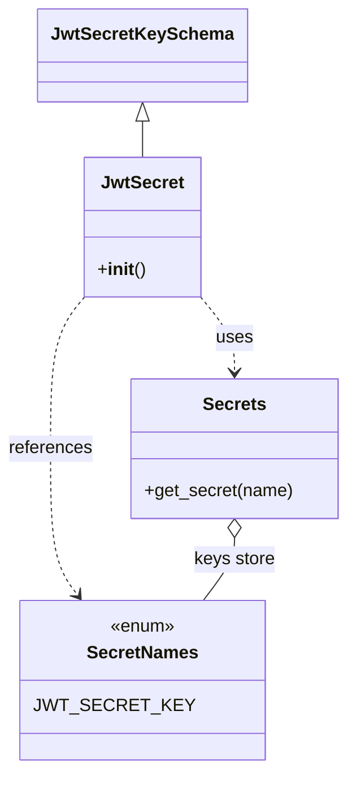

# Diagram: common/public_shield/public_shield/common.py

> Auto-generated by Obscura crawlers

## Mermaid

### SVG

<svg id="container" width="311.6015625" xmlns="http://www.w3.org/2000/svg" class="classDiagram" height="694" viewBox="0 0 311.6015625 694" role="graphics-document document" aria-roledescription="class"><g><defs><marker id="container_class-aggregationStart" class="marker aggregation class" refX="18" refY="7" markerWidth="190" markerHeight="240" orient="auto"><path d="M 18,7 L9,13 L1,7 L9,1 Z"></path></marker></defs><defs><marker id="container_class-aggregationEnd" class="marker aggregation class" refX="1" refY="7" markerWidth="20" markerHeight="28" orient="auto"><path d="M 18,7 L9,13 L1,7 L9,1 Z"></path></marker></defs><defs><marker id="container_class-extensionStart" class="marker extension class" refX="18" refY="7" markerWidth="190" markerHeight="240" orient="auto"><path d="M 1,7 L18,13 V 1 Z"></path></marker></defs><defs><marker id="container_class-extensionEnd" class="marker extension class" refX="1" refY="7" markerWidth="20" markerHeight="28" orient="auto"><path d="M 1,1 V 13 L18,7 Z"></path></marker></defs><defs><marker id="container_class-compositionStart" class="marker composition class" refX="18" refY="7" markerWidth="190" markerHeight="240" orient="auto"><path d="M 18,7 L9,13 L1,7 L9,1 Z"></path></marker></defs><defs><marker id="container_class-compositionEnd" class="marker composition class" refX="1" refY="7" markerWidth="20" markerHeight="28" orient="auto"><path d="M 18,7 L9,13 L1,7 L9,1 Z"></path></marker></defs><defs><marker id="container_class-dependencyStart" class="marker dependency class" refX="6" refY="7" markerWidth="190" markerHeight="240" orient="auto"><path d="M 5,7 L9,13 L1,7 L9,1 Z"></path></marker></defs><defs><marker id="container_class-dependencyEnd" class="marker dependency class" refX="13" refY="7" markerWidth="20" markerHeight="28" orient="auto"><path d="M 18,7 L9,13 L14,7 L9,1 Z"></path></marker></defs><defs><marker id="container_class-lollipopStart" class="marker lollipop class" refX="13" refY="7" markerWidth="190" markerHeight="240" orient="auto"><circle stroke="black" fill="transparent" cx="7" cy="7" r="6"></circle></marker></defs><defs><marker id="container_class-lollipopEnd" class="marker lollipop class" refX="1" refY="7" markerWidth="190" markerHeight="240" orient="auto"><circle stroke="black" fill="transparent" cx="7" cy="7" r="6"></circle></marker></defs><g class="root"><g class="clusters"></g><g class="edgePaths"><path d="M128.479,109.25L128.479,110.542C128.479,111.833,128.479,114.417,128.479,119.875C128.479,125.333,128.479,133.667,128.479,137.833L128.479,142" id="id_JwtSecretKeySchema_JwtSecret_1" class="edge-thickness-normal edge-pattern-solid relation" style=";;;" data-edge="true" data-et="edge" data-id="id_JwtSecretKeySchema_JwtSecret_1" data-points="W3sieCI6MTI4LjQ3ODUxNTYyNSwieSI6OTJ9LHsieCI6MTI4LjQ3ODUxNTYyNSwieSI6MTE3fSx7IngiOjEyOC40Nzg1MTU2MjUsInkiOjE0Mn1d" marker-start="url(#container_class-extensionStart)"></path><path d="M179.334,266.531L184.633,272.942C189.932,279.354,200.531,292.177,205.83,303.755C211.129,315.333,211.129,325.667,211.129,330.833L211.129,336" id="id_JwtSecret_Secrets_2" class="edge-thickness-normal edge-pattern-dashed relation" style=";;;" data-edge="true" data-et="edge" data-id="id_JwtSecret_Secrets_2" data-points="W3sieCI6MTc5LjMzMzk4NDM3NSwieSI6MjY2LjUzMDgyNjg1NDQ1NTY1fSx7IngiOjIxMS4xMjg5MDYyNSwieSI6MzA1fSx7IngiOjIxMS4xMjg5MDYyNSwieSI6MzQyfV0=" marker-end="url(#container_class-dependencyEnd)"></path><path d="M77.623,266.531L72.324,272.942C67.025,279.354,56.426,292.177,51.127,315.255C45.828,338.333,45.828,371.667,45.828,405C45.828,438.333,45.828,471.667,49.9,493.703C53.972,515.74,62.115,526.479,66.187,531.849L70.259,537.219" id="id_JwtSecret_SecretNames_3" class="edge-thickness-normal edge-pattern-dashed relation" style=";;;" data-edge="true" data-et="edge" data-id="id_JwtSecret_SecretNames_3" data-points="W3sieCI6NzcuNjIzMDQ2ODc1LCJ5IjoyNjYuNTMwODI2ODU0NDU1NjV9LHsieCI6NDUuODI4MTI1LCJ5IjozMDV9LHsieCI6NDUuODI4MTI1LCJ5Ijo0MDV9LHsieCI6NDUuODI4MTI1LCJ5Ijo1MDV9LHsieCI6NzMuODgzNzYyMTg0NjMzMDMsInkiOjU0Mn1d" marker-end="url(#container_class-dependencyEnd)"></path><path d="M211.129,485.25L211.129,488.542C211.129,491.833,211.129,498.417,206.453,507.875C201.777,517.333,192.425,529.667,187.749,535.833L183.073,542" id="id_Secrets_SecretNames_4" class="edge-thickness-normal edge-pattern-solid relation" style=";;;" data-edge="true" data-et="edge" data-id="id_Secrets_SecretNames_4" data-points="W3sieCI6MjExLjEyODkwNjI1LCJ5Ijo0Njh9LHsieCI6MjExLjEyODkwNjI1LCJ5Ijo1MDV9LHsieCI6MTgzLjA3MzI2OTA2NTM2Njk2LCJ5Ijo1NDJ9XQ==" marker-start="url(#container_class-aggregationStart)"></path></g><g class="edgeLabels"><g class="edgeLabel"><g class="label" data-id="id_JwtSecretKeySchema_JwtSecret_1" transform="translate(0, 0)"><foreignObject width="0" height="0">

</foreignObject></g></g><g class="edgeLabel" transform="translate(211.12890625, 305)"><g class="label" data-id="id_JwtSecret_Secrets_2" transform="translate(-16.4921875, -12)"><foreignObject width="32.984375" height="24">

uses

</foreignObject></g></g><g class="edgeLabel" transform="translate(45.828125, 405)"><g class="label" data-id="id_JwtSecret_SecretNames_3" transform="translate(-37.828125, -12)"><foreignObject width="75.65625" height="24">

references

</foreignObject></g></g><g class="edgeLabel" transform="translate(211.12890625, 505)"><g class="label" data-id="id_Secrets_SecretNames_4" transform="translate(-36.4765625, -12)"><foreignObject width="72.953125" height="24">

keys store

</foreignObject></g></g></g><g class="nodes"><g class="node default" id="classId-JwtSecretKeySchema-0" transform="translate(128.478515625, 50)"><g class="basic label-container"><path d="M-88.9140625 -42 L88.9140625 -42 L88.9140625 42 L-88.9140625 42" stroke="none" stroke-width="0" fill="#ECECFF" style=""></path><path d="M-88.9140625 -42 C-21.569011357954068 -42, 45.776039784091864 -42, 88.9140625 -42 M-88.9140625 -42 C-47.93472077518337 -42, -6.955379050366744 -42, 88.9140625 -42 M88.9140625 -42 C88.9140625 -11.106595215663994, 88.9140625 19.786809568672012, 88.9140625 42 M88.9140625 -42 C88.9140625 -9.656678897651538, 88.9140625 22.686642204696923, 88.9140625 42 M88.9140625 42 C20.05402814637732 42, -48.80600620724536 42, -88.9140625 42 M88.9140625 42 C21.426779449756495 42, -46.06050360048701 42, -88.9140625 42 M-88.9140625 42 C-88.9140625 17.094561530566494, -88.9140625 -7.810876938867011, -88.9140625 -42 M-88.9140625 42 C-88.9140625 9.667177170586719, -88.9140625 -22.665645658826563, -88.9140625 -42" stroke="#9370DB" stroke-width="1.3" fill="none" stroke-dasharray="0 0" style=""></path></g><g class="annotation-group text" transform="translate(0, -18)"></g><g class="label-group text" transform="translate(-76.9140625, -18)"><g class="label" style="font-weight: bolder" transform="translate(0,-12)"><foreignObject width="153.828125" height="24">

JwtSecretKeySchema

</foreignObject></g></g><g class="members-group text" transform="translate(-76.9140625, 30)"></g><g class="methods-group text" transform="translate(-76.9140625, 60)"></g><g class="divider" style=""><path d="M-88.9140625 6 C-42.740645884525634 6, 3.4327707309487323 6, 88.9140625 6 M-88.9140625 6 C-28.738200134957296 6, 31.437662230085408 6, 88.9140625 6" stroke="#9370DB" stroke-width="1.3" fill="none" stroke-dasharray="0 0" style=""></path></g><g class="divider" style=""><path d="M-88.9140625 24 C-22.93838845558055 24, 43.0372855888389 24, 88.9140625 24 M-88.9140625 24 C-28.26596918082891 24, 32.38212413834218 24, 88.9140625 24" stroke="#9370DB" stroke-width="1.3" fill="none" stroke-dasharray="0 0" style=""></path></g></g><g class="node default" id="classId-JwtSecret-1" transform="translate(128.478515625, 205)"><g class="basic label-container"><path d="M-50.85546875 -63 L50.85546875 -63 L50.85546875 63 L-50.85546875 63" stroke="none" stroke-width="0" fill="#ECECFF" style=""></path><path d="M-50.85546875 -63 C-10.205966689148525 -63, 30.44353537170295 -63, 50.85546875 -63 M-50.85546875 -63 C-29.382624251566014 -63, -7.909779753132028 -63, 50.85546875 -63 M50.85546875 -63 C50.85546875 -14.187006309494947, 50.85546875 34.625987381010106, 50.85546875 63 M50.85546875 -63 C50.85546875 -15.96474790662787, 50.85546875 31.07050418674426, 50.85546875 63 M50.85546875 63 C20.218443501098925 63, -10.41858174780215 63, -50.85546875 63 M50.85546875 63 C20.600599727375638 63, -9.654269295248724 63, -50.85546875 63 M-50.85546875 63 C-50.85546875 27.818814077350098, -50.85546875 -7.362371845299805, -50.85546875 -63 M-50.85546875 63 C-50.85546875 33.79962721254333, -50.85546875 4.599254425086649, -50.85546875 -63" stroke="#9370DB" stroke-width="1.3" fill="none" stroke-dasharray="0 0" style=""></path></g><g class="annotation-group text" transform="translate(0, -39)"></g><g class="label-group text" transform="translate(-34.9140625, -39)"><g class="label" style="font-weight: bolder" transform="translate(0,-12)"><foreignObject width="69.828125" height="24">

JwtSecret

</foreignObject></g></g><g class="members-group text" transform="translate(-38.85546875, 9)"></g><g class="methods-group text" transform="translate(-38.85546875, 39)"><g class="label" style="" transform="translate(0,-12)"><foreignObject width="42.796875" height="24">

+<strong>init</strong>()

</foreignObject></g></g><g class="divider" style=""><path d="M-50.85546875 -15 C-15.034533790177775 -15, 20.78640116964445 -15, 50.85546875 -15 M-50.85546875 -15 C-26.582646157923612 -15, -2.309823565847225 -15, 50.85546875 -15" stroke="#9370DB" stroke-width="1.3" fill="none" stroke-dasharray="0 0" style=""></path></g><g class="divider" style=""><path d="M-50.85546875 9 C-11.263578289294756 9, 28.328312171410488 9, 50.85546875 9 M-50.85546875 9 C-21.452521681248893 9, 7.950425387502214 9, 50.85546875 9" stroke="#9370DB" stroke-width="1.3" fill="none" stroke-dasharray="0 0" style=""></path></g></g><g class="node default" id="classId-Secrets-2" transform="translate(211.12890625, 405)"><g class="basic label-container"><path d="M-92.47265625 -63 L92.47265625 -63 L92.47265625 63 L-92.47265625 63" stroke="none" stroke-width="0" fill="#ECECFF" style=""></path><path d="M-92.47265625 -63 C-24.78053367283097 -63, 42.91158890433806 -63, 92.47265625 -63 M-92.47265625 -63 C-35.909322649516874 -63, 20.654010950966253 -63, 92.47265625 -63 M92.47265625 -63 C92.47265625 -16.10748173764577, 92.47265625 30.78503652470846, 92.47265625 63 M92.47265625 -63 C92.47265625 -22.743592513558404, 92.47265625 17.51281497288319, 92.47265625 63 M92.47265625 63 C27.815024115968114 63, -36.84260801806377 63, -92.47265625 63 M92.47265625 63 C30.466418421672103 63, -31.539819406655795 63, -92.47265625 63 M-92.47265625 63 C-92.47265625 13.221481490610472, -92.47265625 -36.557037018779056, -92.47265625 -63 M-92.47265625 63 C-92.47265625 18.699210968793274, -92.47265625 -25.601578062413452, -92.47265625 -63" stroke="#9370DB" stroke-width="1.3" fill="none" stroke-dasharray="0 0" style=""></path></g><g class="annotation-group text" transform="translate(0, -39)"></g><g class="label-group text" transform="translate(-27.1640625, -39)"><g class="label" style="font-weight: bolder" transform="translate(0,-12)"><foreignObject width="54.328125" height="24">

Secrets

</foreignObject></g></g><g class="members-group text" transform="translate(-80.47265625, 9)"></g><g class="methods-group text" transform="translate(-80.47265625, 39)"><g class="label" style="" transform="translate(0,-12)"><foreignObject width="133.78125" height="24">

+get_secret(name)

</foreignObject></g></g><g class="divider" style=""><path d="M-92.47265625 -15 C-27.029826417140427 -15, 38.413003415719146 -15, 92.47265625 -15 M-92.47265625 -15 C-19.086583537384243 -15, 54.299489175231514 -15, 92.47265625 -15" stroke="#9370DB" stroke-width="1.3" fill="none" stroke-dasharray="0 0" style=""></path></g><g class="divider" style=""><path d="M-92.47265625 9 C-40.85699846241443 9, 10.758659325171138 9, 92.47265625 9 M-92.47265625 9 C-50.93853318490982 9, -9.404410119819644 9, 92.47265625 9" stroke="#9370DB" stroke-width="1.3" fill="none" stroke-dasharray="0 0" style=""></path></g></g><g class="node default" id="classId-SecretNames-3" transform="translate(128.478515625, 614)"><g class="basic label-container"><path d="M-96.1953125 -72 L96.1953125 -72 L96.1953125 72 L-96.1953125 72" stroke="none" stroke-width="0" fill="#ECECFF" style=""></path><path d="M-96.1953125 -72 C-23.676505544423208 -72, 48.842301411153585 -72, 96.1953125 -72 M-96.1953125 -72 C-54.9026748037886 -72, -13.610037107577199 -72, 96.1953125 -72 M96.1953125 -72 C96.1953125 -39.73147132511994, 96.1953125 -7.4629426502398815, 96.1953125 72 M96.1953125 -72 C96.1953125 -38.21006718178509, 96.1953125 -4.420134363570185, 96.1953125 72 M96.1953125 72 C33.69314151531078 72, -28.809029469378444 72, -96.1953125 72 M96.1953125 72 C22.407120383491375 72, -51.38107173301725 72, -96.1953125 72 M-96.1953125 72 C-96.1953125 19.32536163858655, -96.1953125 -33.3492767228269, -96.1953125 -72 M-96.1953125 72 C-96.1953125 17.136444502814598, -96.1953125 -37.727110994370804, -96.1953125 -72" stroke="#9370DB" stroke-width="1.3" fill="none" stroke-dasharray="0 0" style=""></path></g><g class="annotation-group text" transform="translate(-29.53125, -48)"><g class="label" style="" transform="translate(0,-12)"><foreignObject width="59.0625" height="24">

«enum»

</foreignObject></g></g><g class="label-group text" transform="translate(-48.03125, -24)"><g class="label" style="font-weight: bolder" transform="translate(0,-12)"><foreignObject width="96.0625" height="24">

SecretNames

</foreignObject></g></g><g class="members-group text" transform="translate(-84.1953125, 24)"><g class="label" style="" transform="translate(0,-12)"><foreignObject width="120.359375" height="24">

JWT_SECRET_KEY

</foreignObject></g></g><g class="methods-group text" transform="translate(-84.1953125, 72)"></g><g class="divider" style=""><path d="M-96.1953125 0 C-56.60599787089683 0, -17.016683241793658 0, 96.1953125 0 M-96.1953125 0 C-38.46533150803016 0, 19.264649483939678 0, 96.1953125 0" stroke="#9370DB" stroke-width="1.3" fill="none" stroke-dasharray="0 0" style=""></path></g><g class="divider" style=""><path d="M-96.1953125 48 C-21.452824493871034 48, 53.28966351225793 48, 96.1953125 48 M-96.1953125 48 C-39.16092372814469 48, 17.873465043710624 48, 96.1953125 48" stroke="#9370DB" stroke-width="1.3" fill="none" stroke-dasharray="0 0" style=""></path></g></g></g></g></g></svg>
