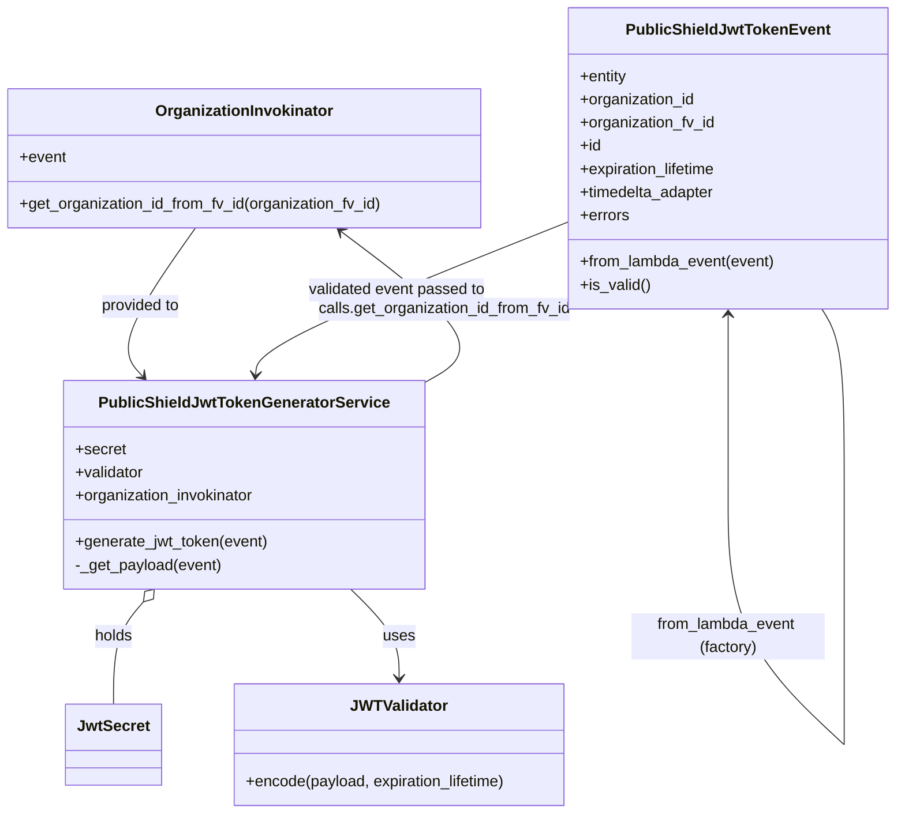
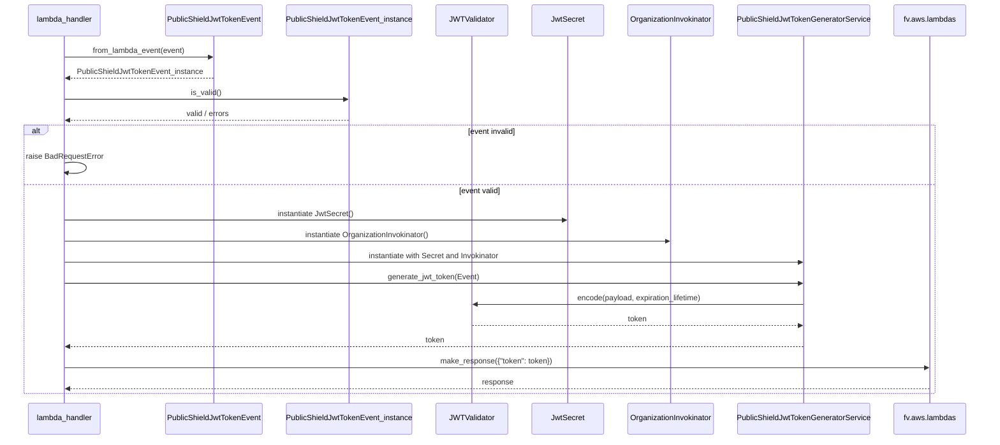

# Diagram: common/public_shield/public_shield/generate_jwt_token.py

> Auto-generated by Obscura crawlers

## Diagram 1

### SVG

<svg id="container" width="932.892578125" xmlns="http://www.w3.org/2000/svg" class="classDiagram" height="842" viewBox="0 0 932.892578125 842" role="graphics-document document" aria-roledescription="class"><g><defs><marker id="container_class-aggregationStart" class="marker aggregation class" refX="18" refY="7" markerWidth="190" markerHeight="240" orient="auto"><path d="M 18,7 L9,13 L1,7 L9,1 Z"></path></marker></defs><defs><marker id="container_class-aggregationEnd" class="marker aggregation class" refX="1" refY="7" markerWidth="20" markerHeight="28" orient="auto"><path d="M 18,7 L9,13 L1,7 L9,1 Z"></path></marker></defs><defs><marker id="container_class-extensionStart" class="marker extension class" refX="18" refY="7" markerWidth="190" markerHeight="240" orient="auto"><path d="M 1,7 L18,13 V 1 Z"></path></marker></defs><defs><marker id="container_class-extensionEnd" class="marker extension class" refX="1" refY="7" markerWidth="20" markerHeight="28" orient="auto"><path d="M 1,1 V 13 L18,7 Z"></path></marker></defs><defs><marker id="container_class-compositionStart" class="marker composition class" refX="18" refY="7" markerWidth="190" markerHeight="240" orient="auto"><path d="M 18,7 L9,13 L1,7 L9,1 Z"></path></marker></defs><defs><marker id="container_class-compositionEnd" class="marker composition class" refX="1" refY="7" markerWidth="20" markerHeight="28" orient="auto"><path d="M 18,7 L9,13 L1,7 L9,1 Z"></path></marker></defs><defs><marker id="container_class-dependencyStart" class="marker dependency class" refX="6" refY="7" markerWidth="190" markerHeight="240" orient="auto"><path d="M 5,7 L9,13 L1,7 L9,1 Z"></path></marker></defs><defs><marker id="container_class-dependencyEnd" class="marker dependency class" refX="13" refY="7" markerWidth="20" markerHeight="28" orient="auto"><path d="M 18,7 L9,13 L14,7 L9,1 Z"></path></marker></defs><defs><marker id="container_class-lollipopStart" class="marker lollipop class" refX="13" refY="7" markerWidth="190" markerHeight="240" orient="auto"><circle stroke="black" fill="transparent" cx="7" cy="7" r="6"></circle></marker></defs><defs><marker id="container_class-lollipopEnd" class="marker lollipop class" refX="1" refY="7" markerWidth="190" markerHeight="240" orient="auto"><circle stroke="black" fill="transparent" cx="7" cy="7" r="6"></circle></marker></defs><g class="root"><g class="clusters"></g><g class="edgePaths"><path d="M202.238,236L187.565,256.167C172.892,276.333,143.546,316.667,134.149,342.282C124.752,367.897,135.305,378.793,140.581,384.242L145.858,389.69" id="id_OrganizationInvokinator_PublicShieldJwtTokenGeneratorService_1" class="edge-thickness-normal edge-pattern-solid relation" style=";;;" data-edge="true" data-et="edge" data-id="id_OrganizationInvokinator_PublicShieldJwtTokenGeneratorService_1" data-points="W3sieCI6MjAyLjIzODE4MDA1MTgxMzQ2LCJ5IjoyMzZ9LHsieCI6MTE0LjE5OTIxODc1LCJ5IjozNTd9LHsieCI6MTUwLjAzMjAwNDMxMDM0NDgzLCJ5IjozOTR9XQ==" marker-end="url(#container_class-dependencyEnd)"></path><path d="M150.591,623.084L145.448,629.07C140.305,635.056,130.019,647.028,124.876,664.681C119.732,682.333,119.732,705.667,119.732,717.333L119.732,729" id="id_PublicShieldJwtTokenGeneratorService_JwtSecret_2" class="edge-thickness-normal edge-pattern-solid relation" style=";;;" data-edge="true" data-et="edge" data-id="id_PublicShieldJwtTokenGeneratorService_JwtSecret_2" data-points="W3sieCI6MTYxLjgzMjY1MzI2NDMzMTIsInkiOjYxMH0seyJ4IjoxMTkuNzMyNDIxODc1LCJ5Ijo2NTl9LHsieCI6MTE5LjczMjQyMTg3NSwieSI6NzI5fV0=" marker-start="url(#container_class-aggregationStart)"></path><path d="M368.3,610L376.896,618.167C385.492,626.333,402.684,642.667,411.28,658C419.875,673.333,419.875,687.667,419.875,694.833L419.875,702" id="id_PublicShieldJwtTokenGeneratorService_JWTValidator_3" class="edge-thickness-normal edge-pattern-solid relation" style=";;;" data-edge="true" data-et="edge" data-id="id_PublicShieldJwtTokenGeneratorService_JWTValidator_3" data-points="W3sieCI6MzY4LjMwMDQyNzk0NTYwMzYsInkiOjYxMH0seyJ4Ijo0MTkuODc1MzkwNjI0NjI3NDcsInkiOjY1OX0seyJ4Ijo0MTkuODc1MzkwNjI0NjI3NDcsInkiOjcwOH1d" marker-end="url(#container_class-dependencyEnd)"></path><path d="M438.523,399.609L451.278,392.507C464.033,385.406,489.542,371.203,475.888,344.53C462.234,317.857,409.416,278.715,383.008,259.144L356.599,239.572" id="id_PublicShieldJwtTokenGeneratorService_OrganizationInvokinator_4" class="edge-thickness-normal edge-pattern-solid relation" style=";;;" data-edge="true" data-et="edge" data-id="id_PublicShieldJwtTokenGeneratorService_OrganizationInvokinator_4" data-points="W3sieCI6NDM4LjUyMzQzNzUsInkiOjM5OS42MDg5MzM2ODczMjA5fSx7IngiOjUxNS4wNTA3ODEyNSwieSI6MzU3fSx7IngiOjM1MS43Nzg2NTkzMjY0MjQ5LCJ5IjoyMzZ9XQ==" marker-end="url(#container_class-dependencyEnd)"></path><path d="M761.396,326L761.396,331.167C761.396,336.333,761.396,346.667,761.396,375.992C761.396,405.317,761.396,453.633,761.396,477.792L761.396,501.95" id="PublicShieldJwtTokenEvent-cyclic-special-1" class="edge-thickness-normal edge-pattern-solid relation" style=";;;" data-edge="true" data-et="edge" data-id="PublicShieldJwtTokenEvent-cyclic-special-1" data-points="W3sieCI6NzYxLjM5NjQ4NDM3NSwieSI6MzIwfSx7IngiOjc2MS4zOTY0ODQzNzUsInkiOjM1N30seyJ4Ijo3NjEuMzk2NDg0Mzc1LCJ5Ijo1MDEuOTQ5OTk5OTk5MjU0OTR9XQ==" marker-start="url(#container_class-dependencyStart)"></path><path d="M761.396,502.05L761.396,528.208C761.396,554.367,761.396,606.683,781.388,651.501C801.38,696.318,841.363,733.636,861.355,752.294L881.346,770.953" id="PublicShieldJwtTokenEvent-cyclic-special-mid" class="edge-thickness-normal edge-pattern-solid relation" style=";;;" data-edge="true" data-et="edge" data-id="PublicShieldJwtTokenEvent-cyclic-special-mid" data-points="W3sieCI6NzYxLjM5NjQ4NDM3NSwieSI6NTAyLjA1MDAwMDAwMDc0NTA2fSx7IngiOjc2MS4zOTY0ODQzNzUsInkiOjY1OX0seyJ4Ijo4ODEuMzQ2NDg0Mzc0MjU0OSwieSI6NzcwLjk1MzMzMzMzMjYzOH1d"></path><path d="M881.396,770.95L881.396,752.292C881.396,733.633,881.396,696.317,881.396,651.492C881.396,606.667,881.396,554.333,881.396,504C881.396,453.667,881.396,405.333,877.562,375C873.728,344.667,866.06,332.333,862.225,326.167L858.391,320" id="PublicShieldJwtTokenEvent-cyclic-special-2" class="edge-thickness-normal edge-pattern-solid relation" style=";;;" data-edge="true" data-et="edge" data-id="PublicShieldJwtTokenEvent-cyclic-special-2" data-points="W3sieCI6ODgxLjM5NjQ4NDM3NSwieSI6NzcwLjk0OTk5OTk5OTI1NDl9LHsieCI6ODgxLjM5NjQ4NDM3NSwieSI6NjU5fSx7IngiOjg4MS4zOTY0ODQzNzUsInkiOjUwMn0seyJ4Ijo4ODEuMzk2NDg0Mzc1LCJ5IjozNTd9LHsieCI6ODU4LjM5MTMwMzAyNzg0OTcsInkiOjMyMH1d"></path><path d="M597.9,228.123L543.134,249.603C488.367,271.082,378.834,314.041,323.544,340.692C268.254,367.343,267.207,377.687,266.684,382.859L266.16,388.03" id="id_PublicShieldJwtTokenEvent_PublicShieldJwtTokenGeneratorService_6" class="edge-thickness-normal edge-pattern-solid relation" style=";;;" data-edge="true" data-et="edge" data-id="id_PublicShieldJwtTokenEvent_PublicShieldJwtTokenGeneratorService_6" data-points="W3sieCI6NTk3LjkwMDM5MDYyNSwieSI6MjI4LjEyMzE4OTY0MjUxMjY3fSx7IngiOjI2OS4zMDA3ODEyNSwieSI6MzU3fSx7IngiOjI2NS41NTU5MjY3MjQxMzc5LCJ5IjozOTR9XQ==" marker-end="url(#container_class-dependencyEnd)"></path></g><g class="edgeLabels"><g class="edgeLabel" transform="translate(143.06678, 317.32466)"><g class="label" data-id="id_OrganizationInvokinator_PublicShieldJwtTokenGeneratorService_1" transform="translate(-41.921875, -12)"><foreignObject width="83.84375" height="24">

provided to

</foreignObject></g></g><g class="edgeLabel" transform="translate(119.732421875, 659)"><g class="label" data-id="id_PublicShieldJwtTokenGeneratorService_JwtSecret_2" transform="translate(-20.1875, -12)"><foreignObject width="40.375" height="24">

holds

</foreignObject></g></g><g class="edgeLabel" transform="translate(419.87539062462747, 659)"><g class="label" data-id="id_PublicShieldJwtTokenGeneratorService_JWTValidator_3" transform="translate(-16.4921875, -12)"><foreignObject width="32.984375" height="24">

uses

</foreignObject></g></g><g class="edgeLabel" transform="translate(515.05078125, 357)"><g class="label" data-id="id_PublicShieldJwtTokenGeneratorService_OrganizationInvokinator_4" transform="translate(-132.5703125, -12)"><foreignObject width="265.140625" height="24">

calls.get_organization_id_from_fv_id

</foreignObject></g></g><g class="edgeLabel"><g class="label" data-id="PublicShieldJwtTokenEvent-cyclic-special-1" transform="translate(0, 0)"><foreignObject width="0" height="0">

</foreignObject></g></g><g class="edgeLabel" transform="translate(761.396484375, 659)"><g class="label" data-id="PublicShieldJwtTokenEvent-cyclic-special-mid" transform="translate(-100, -24)"><foreignObject width="200" height="48">

from_lambda_event (factory)

</foreignObject></g></g><g class="edgeLabel"><g class="label" data-id="PublicShieldJwtTokenEvent-cyclic-special-2" transform="translate(0, 0)"><foreignObject width="0" height="0">

</foreignObject></g></g><g class="edgeLabel" transform="translate(416.28985, 299.35087)"><g class="label" data-id="id_PublicShieldJwtTokenEvent_PublicShieldJwtTokenGeneratorService_6" transform="translate(-93.1796875, -12)"><foreignObject width="186.359375" height="24">

validated event passed to

</foreignObject></g></g></g><g class="nodes"><g class="node default" id="classId-OrganizationInvokinator-0" transform="translate(254.625, 164)"><g class="basic label-container"><path d="M-246.625 -72 L246.625 -72 L246.625 72 L-246.625 72" stroke="none" stroke-width="0" fill="#ECECFF" style=""></path><path d="M-246.625 -72 C-61.33991164494185 -72, 123.9451767101163 -72, 246.625 -72 M-246.625 -72 C-117.03930408086163 -72, 12.546391838276747 -72, 246.625 -72 M246.625 -72 C246.625 -30.34370457065286, 246.625 11.312590858694278, 246.625 72 M246.625 -72 C246.625 -42.7853111737124, 246.625 -13.570622347424795, 246.625 72 M246.625 72 C98.92566905139336 72, -48.77366189721329 72, -246.625 72 M246.625 72 C88.36984264630246 72, -69.88531470739508 72, -246.625 72 M-246.625 72 C-246.625 40.85301277245118, -246.625 9.706025544902353, -246.625 -72 M-246.625 72 C-246.625 28.50211399017428, -246.625 -14.99577201965144, -246.625 -72" stroke="#9370DB" stroke-width="1.3" fill="none" stroke-dasharray="0 0" style=""></path></g><g class="annotation-group text" transform="translate(0, -48)"></g><g class="label-group text" transform="translate(-88.8125, -48)"><g class="label" style="font-weight: bolder" transform="translate(0,-12)"><foreignObject width="177.625" height="24">

OrganizationInvokinator

</foreignObject></g></g><g class="members-group text" transform="translate(-234.625, 0)"><g class="label" style="" transform="translate(0,-12)"><foreignObject width="48.328125" height="24">

+event

</foreignObject></g></g><g class="methods-group text" transform="translate(-234.625, 48)"><g class="label" style="" transform="translate(0,-12)"><foreignObject width="380.4375" height="24">

+get_organization_id_from_fv_id(organization_fv_id)

</foreignObject></g></g><g class="divider" style=""><path d="M-246.625 -24 C-57.6500169504497 -24, 131.3249660991006 -24, 246.625 -24 M-246.625 -24 C-71.55819896262568 -24, 103.50860207474864 -24, 246.625 -24" stroke="#9370DB" stroke-width="1.3" fill="none" stroke-dasharray="0 0" style=""></path></g><g class="divider" style=""><path d="M-246.625 24 C-74.3233480141428 24, 97.97830397171441 24, 246.625 24 M-246.625 24 C-109.88129535241049 24, 26.86240929517902 24, 246.625 24" stroke="#9370DB" stroke-width="1.3" fill="none" stroke-dasharray="0 0" style=""></path></g></g><g class="node default" id="classId-PublicShieldJwtTokenEvent-1" transform="translate(761.396484375, 164)"><g class="basic label-container"><path d="M-163.49609375 -156 L163.49609375 -156 L163.49609375 156 L-163.49609375 156" stroke="none" stroke-width="0" fill="#ECECFF" style=""></path><path d="M-163.49609375 -156 C-77.25897736282923 -156, 8.978139024341544 -156, 163.49609375 -156 M-163.49609375 -156 C-51.802424493493874 -156, 59.89124476301225 -156, 163.49609375 -156 M163.49609375 -156 C163.49609375 -57.09365355132155, 163.49609375 41.8126928973569, 163.49609375 156 M163.49609375 -156 C163.49609375 -41.168165884576695, 163.49609375 73.66366823084661, 163.49609375 156 M163.49609375 156 C51.33399226517311 156, -60.82810921965378 156, -163.49609375 156 M163.49609375 156 C85.88486580886682 156, 8.27363786773364 156, -163.49609375 156 M-163.49609375 156 C-163.49609375 83.2043425388908, -163.49609375 10.408685077781598, -163.49609375 -156 M-163.49609375 156 C-163.49609375 58.54942883505424, -163.49609375 -38.90114232989151, -163.49609375 -156" stroke="#9370DB" stroke-width="1.3" fill="none" stroke-dasharray="0 0" style=""></path></g><g class="annotation-group text" transform="translate(0, -132)"></g><g class="label-group text" transform="translate(-99.1328125, -132)"><g class="label" style="font-weight: bolder" transform="translate(0,-12)"><foreignObject width="198.265625" height="24">

PublicShieldJwtTokenEvent

</foreignObject></g></g><g class="members-group text" transform="translate(-151.49609375, -84)"><g class="label" style="" transform="translate(0,-12)"><foreignObject width="49.9375" height="24">

+entity

</foreignObject></g><g class="label" style="" transform="translate(0,12)"><foreignObject width="120.75" height="24">

+organization_id

</foreignObject></g><g class="label" style="" transform="translate(0,36)"><foreignObject width="141.5" height="24">

+organization_fv_id

</foreignObject></g><g class="label" style="" transform="translate(0,60)"><foreignObject width="22.078125" height="24">

+id

</foreignObject></g><g class="label" style="" transform="translate(0,84)"><foreignObject width="145.671875" height="24">

+expiration_lifetime

</foreignObject></g><g class="label" style="" transform="translate(0,108)"><foreignObject width="142.890625" height="24">

+timedelta_adapter

</foreignObject></g><g class="label" style="" transform="translate(0,132)"><foreignObject width="51.328125" height="24">

+errors

</foreignObject></g></g><g class="methods-group text" transform="translate(-151.49609375, 108)"><g class="label" style="" transform="translate(0,-12)"><foreignObject width="203.859375" height="24">

+from_lambda_event(event)

</foreignObject></g><g class="label" style="" transform="translate(0,12)"><foreignObject width="72.796875" height="24">

+is_valid()

</foreignObject></g></g><g class="divider" style=""><path d="M-163.49609375 -108 C-75.2149155485106 -108, 13.066262652978793 -108, 163.49609375 -108 M-163.49609375 -108 C-83.82713960205712 -108, -4.158185454114232 -108, 163.49609375 -108" stroke="#9370DB" stroke-width="1.3" fill="none" stroke-dasharray="0 0" style=""></path></g><g class="divider" style=""><path d="M-163.49609375 84 C-70.68293203013603 84, 22.13022968972794 84, 163.49609375 84 M-163.49609375 84 C-89.71255400258256 84, -15.929014255165129 84, 163.49609375 84" stroke="#9370DB" stroke-width="1.3" fill="none" stroke-dasharray="0 0" style=""></path></g></g><g class="node default" id="classId-PublicShieldJwtTokenGeneratorService-2" transform="translate(254.625, 502)"><g class="basic label-container"><path d="M-183.8984375 -108 L183.8984375 -108 L183.8984375 108 L-183.8984375 108" stroke="none" stroke-width="0" fill="#ECECFF" style=""></path><path d="M-183.8984375 -108 C-92.02337115128987 -108, -0.14830480257973022 -108, 183.8984375 -108 M-183.8984375 -108 C-101.74153518179963 -108, -19.584632863599268 -108, 183.8984375 -108 M183.8984375 -108 C183.8984375 -50.97960206272744, 183.8984375 6.040795874545125, 183.8984375 108 M183.8984375 -108 C183.8984375 -27.796933663244005, 183.8984375 52.40613267351199, 183.8984375 108 M183.8984375 108 C52.1274366256236 108, -79.6435642487528 108, -183.8984375 108 M183.8984375 108 C76.68383688923271 108, -30.530763721534584 108, -183.8984375 108 M-183.8984375 108 C-183.8984375 31.11790289555681, -183.8984375 -45.76419420888638, -183.8984375 -108 M-183.8984375 108 C-183.8984375 33.9449034482528, -183.8984375 -40.110193103494396, -183.8984375 -108" stroke="#9370DB" stroke-width="1.3" fill="none" stroke-dasharray="0 0" style=""></path></g><g class="annotation-group text" transform="translate(0, -84)"></g><g class="label-group text" transform="translate(-142.3125, -84)"><g class="label" style="font-weight: bolder" transform="translate(0,-12)"><foreignObject width="284.625" height="24">

PublicShieldJwtTokenGeneratorService

</foreignObject></g></g><g class="members-group text" transform="translate(-171.8984375, -36)"><g class="label" style="" transform="translate(0,-12)"><foreignObject width="52.03125" height="24">

+secret

</foreignObject></g><g class="label" style="" transform="translate(0,12)"><foreignObject width="72.515625" height="24">

+validator

</foreignObject></g><g class="label" style="" transform="translate(0,36)"><foreignObject width="189.4375" height="24">

+organization_invokinator

</foreignObject></g></g><g class="methods-group text" transform="translate(-171.8984375, 60)"><g class="label" style="" transform="translate(0,-12)"><foreignObject width="201.484375" height="24">

+generate_jwt_token(event)

</foreignObject></g><g class="label" style="" transform="translate(0,12)"><foreignObject width="152.96875" height="24">

-_get_payload(event)

</foreignObject></g></g><g class="divider" style=""><path d="M-183.8984375 -60 C-54.08088842288976 -60, 75.73666065422049 -60, 183.8984375 -60 M-183.8984375 -60 C-41.96061080007644 -60, 99.97721589984712 -60, 183.8984375 -60" stroke="#9370DB" stroke-width="1.3" fill="none" stroke-dasharray="0 0" style=""></path></g><g class="divider" style=""><path d="M-183.8984375 36 C-72.65803427199374 36, 38.582368956012516 36, 183.8984375 36 M-183.8984375 36 C-85.40456204935755 36, 13.089313401284898 36, 183.8984375 36" stroke="#9370DB" stroke-width="1.3" fill="none" stroke-dasharray="0 0" style=""></path></g></g><g class="node default" id="classId-JwtSecret-3" transform="translate(119.732421875, 771)"><g class="basic label-container"><path d="M-46.9140625 -42 L46.9140625 -42 L46.9140625 42 L-46.9140625 42" stroke="none" stroke-width="0" fill="#ECECFF" style=""></path><path d="M-46.9140625 -42 C-13.376093569905308 -42, 20.161875360189384 -42, 46.9140625 -42 M-46.9140625 -42 C-20.687044990580713 -42, 5.5399725188385744 -42, 46.9140625 -42 M46.9140625 -42 C46.9140625 -20.714771211473412, 46.9140625 0.5704575770531761, 46.9140625 42 M46.9140625 -42 C46.9140625 -13.55995439611086, 46.9140625 14.880091207778278, 46.9140625 42 M46.9140625 42 C9.565289015750714 42, -27.78348446849857 42, -46.9140625 42 M46.9140625 42 C10.326994912706319 42, -26.260072674587363 42, -46.9140625 42 M-46.9140625 42 C-46.9140625 17.150750666850726, -46.9140625 -7.698498666298548, -46.9140625 -42 M-46.9140625 42 C-46.9140625 11.629399461237636, -46.9140625 -18.741201077524728, -46.9140625 -42" stroke="#9370DB" stroke-width="1.3" fill="none" stroke-dasharray="0 0" style=""></path></g><g class="annotation-group text" transform="translate(0, -18)"></g><g class="label-group text" transform="translate(-34.9140625, -18)"><g class="label" style="font-weight: bolder" transform="translate(0,-12)"><foreignObject width="69.828125" height="24">

JwtSecret

</foreignObject></g></g><g class="members-group text" transform="translate(-34.9140625, 30)"></g><g class="methods-group text" transform="translate(-34.9140625, 60)"></g><g class="divider" style=""><path d="M-46.9140625 6 C-18.59657023692259 6, 9.720922026154817 6, 46.9140625 6 M-46.9140625 6 C-26.47795628954593 6, -6.041850079091859 6, 46.9140625 6" stroke="#9370DB" stroke-width="1.3" fill="none" stroke-dasharray="0 0" style=""></path></g><g class="divider" style=""><path d="M-46.9140625 24 C-9.802279583978127 24, 27.309503332043747 24, 46.9140625 24 M-46.9140625 24 C-27.63094852541605 24, -8.347834550832097 24, 46.9140625 24" stroke="#9370DB" stroke-width="1.3" fill="none" stroke-dasharray="0 0" style=""></path></g></g><g class="node default" id="classId-JWTValidator-4" transform="translate(419.87539062462747, 771)"><g class="basic label-container"><path d="M-172.87109375 -63 L172.87109375 -63 L172.87109375 63 L-172.87109375 63" stroke="none" stroke-width="0" fill="#ECECFF" style=""></path><path d="M-172.87109375 -63 C-47.48235545453133 -63, 77.90638284093734 -63, 172.87109375 -63 M-172.87109375 -63 C-54.386302973629284 -63, 64.09848780274143 -63, 172.87109375 -63 M172.87109375 -63 C172.87109375 -33.23210037347178, 172.87109375 -3.4642007469435683, 172.87109375 63 M172.87109375 -63 C172.87109375 -14.312712095446692, 172.87109375 34.37457580910662, 172.87109375 63 M172.87109375 63 C39.25830726028073 63, -94.35447922943854 63, -172.87109375 63 M172.87109375 63 C40.12784945518172 63, -92.61539483963656 63, -172.87109375 63 M-172.87109375 63 C-172.87109375 22.391986142448538, -172.87109375 -18.216027715102925, -172.87109375 -63 M-172.87109375 63 C-172.87109375 12.95296464210685, -172.87109375 -37.0940707157863, -172.87109375 -63" stroke="#9370DB" stroke-width="1.3" fill="none" stroke-dasharray="0 0" style=""></path></g><g class="annotation-group text" transform="translate(0, -39)"></g><g class="label-group text" transform="translate(-46.8203125, -39)"><g class="label" style="font-weight: bolder" transform="translate(0,-12)"><foreignObject width="93.640625" height="24">

JWTValidator

</foreignObject></g></g><g class="members-group text" transform="translate(-160.87109375, 9)"></g><g class="methods-group text" transform="translate(-160.87109375, 39)"><g class="label" style="" transform="translate(0,-12)"><foreignObject width="274.921875" height="24">

+encode(payload, expiration_lifetime)

</foreignObject></g></g><g class="divider" style=""><path d="M-172.87109375 -15 C-36.91223962564604 -15, 99.04661449870792 -15, 172.87109375 -15 M-172.87109375 -15 C-88.62075367175757 -15, -4.3704135935151385 -15, 172.87109375 -15" stroke="#9370DB" stroke-width="1.3" fill="none" stroke-dasharray="0 0" style=""></path></g><g class="divider" style=""><path d="M-172.87109375 9 C-48.96743089656567 9, 74.93623195686865 9, 172.87109375 9 M-172.87109375 9 C-70.91171721531593 9, 31.047659319368137 9, 172.87109375 9" stroke="#9370DB" stroke-width="1.3" fill="none" stroke-dasharray="0 0" style=""></path></g></g><g class="label edgeLabel" id="PublicShieldJwtTokenEvent---PublicShieldJwtTokenEvent---1" transform="translate(761.396484375, 502)"><rect width="0.1" height="0.1"></rect><g class="label" style="" transform="translate(0, 0)"><rect></rect><foreignObject width="0" height="0">

</foreignObject></g></g><g class="label edgeLabel" id="PublicShieldJwtTokenEvent---PublicShieldJwtTokenEvent---2" transform="translate(881.396484375, 771)"><rect width="0.1" height="0.1"></rect><g class="label" style="" transform="translate(0, 0)"><rect></rect><foreignObject width="0" height="0">

</foreignObject></g></g></g></g></g></svg>

## Diagram 2

### SVG

<svg id="container" width="2161" xmlns="http://www.w3.org/2000/svg" height="973" viewBox="-65.5 -10 2161 973" role="graphics-document document" aria-roledescription="sequence"><g><rect x="1895.5" y="887" fill="#eaeaea" stroke="#666" width="150" height="65" name="AWS" rx="3" ry="3" class="actor actor-bottom"></rect><text x="1970.5" y="919.5" dominant-baseline="central" alignment-baseline="central" class="actor actor-box" style="text-anchor: middle; font-size: 16px; font-weight: 400;"><tspan x="1970.5" dy="0">fv.aws.lambdas</tspan></text></g><g><rect x="1546.5" y="887" fill="#eaeaea" stroke="#666" width="299" height="65" name="Generator" rx="3" ry="3" class="actor actor-bottom"></rect><text x="1696" y="919.5" dominant-baseline="central" alignment-baseline="central" class="actor actor-box" style="text-anchor: middle; font-size: 16px; font-weight: 400;"><tspan x="1696" dy="0">PublicShieldJwtTokenGeneratorService</tspan></text></g><g><rect x="1300.5" y="887" fill="#eaeaea" stroke="#666" width="196" height="65" name="Invokinator" rx="3" ry="3" class="actor actor-bottom"></rect><text x="1398.5" y="919.5" dominant-baseline="central" alignment-baseline="central" class="actor actor-box" style="text-anchor: middle; font-size: 16px; font-weight: 400;"><tspan x="1398.5" dy="0">OrganizationInvokinator</tspan></text></g><g><rect x="1100.5" y="887" fill="#eaeaea" stroke="#666" width="150" height="65" name="Secret" rx="3" ry="3" class="actor actor-bottom"></rect><text x="1175.5" y="919.5" dominant-baseline="central" alignment-baseline="central" class="actor actor-box" style="text-anchor: middle; font-size: 16px; font-weight: 400;"><tspan x="1175.5" dy="0">JwtSecret</tspan></text></g><g><rect x="900.5" y="887" fill="#eaeaea" stroke="#666" width="150" height="65" name="Validator" rx="3" ry="3" class="actor actor-bottom"></rect><text x="975.5" y="919.5" dominant-baseline="central" alignment-baseline="central" class="actor actor-box" style="text-anchor: middle; font-size: 16px; font-weight: 400;"><tspan x="975.5" dy="0">JWTValidator</tspan></text></g><g><rect x="566.5" y="887" fill="#eaeaea" stroke="#666" width="284" height="65" name="Event" rx="3" ry="3" class="actor actor-bottom"></rect><text x="708.5" y="919.5" dominant-baseline="central" alignment-baseline="central" class="actor actor-box" style="text-anchor: middle; font-size: 16px; font-weight: 400;"><tspan x="708.5" dy="0">PublicShieldJwtTokenEvent_instance</tspan></text></g><g><rect x="301.5" y="887" fill="#eaeaea" stroke="#666" width="215" height="65" name="EventFactory" rx="3" ry="3" class="actor actor-bottom"></rect><text x="409" y="919.5" dominant-baseline="central" alignment-baseline="central" class="actor actor-box" style="text-anchor: middle; font-size: 16px; font-weight: 400;"><tspan x="409" dy="0">PublicShieldJwtTokenEvent</tspan></text></g><g><rect x="0" y="887" fill="#eaeaea" stroke="#666" width="150" height="65" name="Handler" rx="3" ry="3" class="actor actor-bottom"></rect><text x="75" y="919.5" dominant-baseline="central" alignment-baseline="central" class="actor actor-box" style="text-anchor: middle; font-size: 16px; font-weight: 400;"><tspan x="75" dy="0">lambda_handler</tspan></text></g><g><line id="actor7" x1="1970.5" y1="65" x2="1970.5" y2="887" class="actor-line 200" stroke-width="0.5px" stroke="#999" name="AWS"></line><g id="root-7"><rect x="1895.5" y="0" fill="#eaeaea" stroke="#666" width="150" height="65" name="AWS" rx="3" ry="3" class="actor actor-top"></rect><text x="1970.5" y="32.5" dominant-baseline="central" alignment-baseline="central" class="actor actor-box" style="text-anchor: middle; font-size: 16px; font-weight: 400;"><tspan x="1970.5" dy="0">fv.aws.lambdas</tspan></text></g></g><g><line id="actor6" x1="1696" y1="65" x2="1696" y2="887" class="actor-line 200" stroke-width="0.5px" stroke="#999" name="Generator"></line><g id="root-6"><rect x="1546.5" y="0" fill="#eaeaea" stroke="#666" width="299" height="65" name="Generator" rx="3" ry="3" class="actor actor-top"></rect><text x="1696" y="32.5" dominant-baseline="central" alignment-baseline="central" class="actor actor-box" style="text-anchor: middle; font-size: 16px; font-weight: 400;"><tspan x="1696" dy="0">PublicShieldJwtTokenGeneratorService</tspan></text></g></g><g><line id="actor5" x1="1398.5" y1="65" x2="1398.5" y2="887" class="actor-line 200" stroke-width="0.5px" stroke="#999" name="Invokinator"></line><g id="root-5"><rect x="1300.5" y="0" fill="#eaeaea" stroke="#666" width="196" height="65" name="Invokinator" rx="3" ry="3" class="actor actor-top"></rect><text x="1398.5" y="32.5" dominant-baseline="central" alignment-baseline="central" class="actor actor-box" style="text-anchor: middle; font-size: 16px; font-weight: 400;"><tspan x="1398.5" dy="0">OrganizationInvokinator</tspan></text></g></g><g><line id="actor4" x1="1175.5" y1="65" x2="1175.5" y2="887" class="actor-line 200" stroke-width="0.5px" stroke="#999" name="Secret"></line><g id="root-4"><rect x="1100.5" y="0" fill="#eaeaea" stroke="#666" width="150" height="65" name="Secret" rx="3" ry="3" class="actor actor-top"></rect><text x="1175.5" y="32.5" dominant-baseline="central" alignment-baseline="central" class="actor actor-box" style="text-anchor: middle; font-size: 16px; font-weight: 400;"><tspan x="1175.5" dy="0">JwtSecret</tspan></text></g></g><g><line id="actor3" x1="975.5" y1="65" x2="975.5" y2="887" class="actor-line 200" stroke-width="0.5px" stroke="#999" name="Validator"></line><g id="root-3"><rect x="900.5" y="0" fill="#eaeaea" stroke="#666" width="150" height="65" name="Validator" rx="3" ry="3" class="actor actor-top"></rect><text x="975.5" y="32.5" dominant-baseline="central" alignment-baseline="central" class="actor actor-box" style="text-anchor: middle; font-size: 16px; font-weight: 400;"><tspan x="975.5" dy="0">JWTValidator</tspan></text></g></g><g><line id="actor2" x1="708.5" y1="65" x2="708.5" y2="887" class="actor-line 200" stroke-width="0.5px" stroke="#999" name="Event"></line><g id="root-2"><rect x="566.5" y="0" fill="#eaeaea" stroke="#666" width="284" height="65" name="Event" rx="3" ry="3" class="actor actor-top"></rect><text x="708.5" y="32.5" dominant-baseline="central" alignment-baseline="central" class="actor actor-box" style="text-anchor: middle; font-size: 16px; font-weight: 400;"><tspan x="708.5" dy="0">PublicShieldJwtTokenEvent_instance</tspan></text></g></g><g><line id="actor1" x1="409" y1="65" x2="409" y2="887" class="actor-line 200" stroke-width="0.5px" stroke="#999" name="EventFactory"></line><g id="root-1"><rect x="301.5" y="0" fill="#eaeaea" stroke="#666" width="215" height="65" name="EventFactory" rx="3" ry="3" class="actor actor-top"></rect><text x="409" y="32.5" dominant-baseline="central" alignment-baseline="central" class="actor actor-box" style="text-anchor: middle; font-size: 16px; font-weight: 400;"><tspan x="409" dy="0">PublicShieldJwtTokenEvent</tspan></text></g></g><g><line id="actor0" x1="75" y1="65" x2="75" y2="887" class="actor-line 200" stroke-width="0.5px" stroke="#999" name="Handler"></line><g id="root-0"><rect x="0" y="0" fill="#eaeaea" stroke="#666" width="150" height="65" name="Handler" rx="3" ry="3" class="actor actor-top"></rect><text x="75" y="32.5" dominant-baseline="central" alignment-baseline="central" class="actor actor-box" style="text-anchor: middle; font-size: 16px; font-weight: 400;"><tspan x="75" dy="0">lambda_handler</tspan></text></g></g><g></g><defs><symbol id="computer" width="24" height="24"><path transform="scale(.5)" d="M2 2v13h20v-13h-20zm18 11h-16v-9h16v9zm-10.228 6l.466-1h3.524l.467 1h-4.457zm14.228 3h-24l2-6h2.104l-1.33 4h18.45l-1.297-4h2.073l2 6zm-5-10h-14v-7h14v7z"></path></symbol></defs><defs><symbol id="database" fill-rule="evenodd" clip-rule="evenodd"><path transform="scale(.5)" d="M12.258.001l.256.004.255.005.253.008.251.01.249.012.247.015.246.016.242.019.241.02.239.023.236.024.233.027.231.028.229.031.225.032.223.034.22.036.217.038.214.04.211.041.208.043.205.045.201.046.198.048.194.05.191.051.187.053.183.054.18.056.175.057.172.059.168.06.163.061.16.063.155.064.15.066.074.033.073.033.071.034.07.034.069.035.068.035.067.035.066.035.064.036.064.036.062.036.06.036.06.037.058.037.058.037.055.038.055.038.053.038.052.038.051.039.05.039.048.039.047.039.045.04.044.04.043.04.041.04.04.041.039.041.037.041.036.041.034.041.033.042.032.042.03.042.029.042.027.042.026.043.024.043.023.043.021.043.02.043.018.044.017.043.015.044.013.044.012.044.011.045.009.044.007.045.006.045.004.045.002.045.001.045v17l-.001.045-.002.045-.004.045-.006.045-.007.045-.009.044-.011.045-.012.044-.013.044-.015.044-.017.043-.018.044-.02.043-.021.043-.023.043-.024.043-.026.043-.027.042-.029.042-.03.042-.032.042-.033.042-.034.041-.036.041-.037.041-.039.041-.04.041-.041.04-.043.04-.044.04-.045.04-.047.039-.048.039-.05.039-.051.039-.052.038-.053.038-.055.038-.055.038-.058.037-.058.037-.06.037-.06.036-.062.036-.064.036-.064.036-.066.035-.067.035-.068.035-.069.035-.07.034-.071.034-.073.033-.074.033-.15.066-.155.064-.16.063-.163.061-.168.06-.172.059-.175.057-.18.056-.183.054-.187.053-.191.051-.194.05-.198.048-.201.046-.205.045-.208.043-.211.041-.214.04-.217.038-.22.036-.223.034-.225.032-.229.031-.231.028-.233.027-.236.024-.239.023-.241.02-.242.019-.246.016-.247.015-.249.012-.251.01-.253.008-.255.005-.256.004-.258.001-.258-.001-.256-.004-.255-.005-.253-.008-.251-.01-.249-.012-.247-.015-.245-.016-.243-.019-.241-.02-.238-.023-.236-.024-.234-.027-.231-.028-.228-.031-.226-.032-.223-.034-.22-.036-.217-.038-.214-.04-.211-.041-.208-.043-.204-.045-.201-.046-.198-.048-.195-.05-.19-.051-.187-.053-.184-.054-.179-.056-.176-.057-.172-.059-.167-.06-.164-.061-.159-.063-.155-.064-.151-.066-.074-.033-.072-.033-.072-.034-.07-.034-.069-.035-.068-.035-.067-.035-.066-.035-.064-.036-.063-.036-.062-.036-.061-.036-.06-.037-.058-.037-.057-.037-.056-.038-.055-.038-.053-.038-.052-.038-.051-.039-.049-.039-.049-.039-.046-.039-.046-.04-.044-.04-.043-.04-.041-.04-.04-.041-.039-.041-.037-.041-.036-.041-.034-.041-.033-.042-.032-.042-.03-.042-.029-.042-.027-.042-.026-.043-.024-.043-.023-.043-.021-.043-.02-.043-.018-.044-.017-.043-.015-.044-.013-.044-.012-.044-.011-.045-.009-.044-.007-.045-.006-.045-.004-.045-.002-.045-.001-.045v-17l.001-.045.002-.045.004-.045.006-.045.007-.045.009-.044.011-.045.012-.044.013-.044.015-.044.017-.043.018-.044.02-.043.021-.043.023-.043.024-.043.026-.043.027-.042.029-.042.03-.042.032-.042.033-.042.034-.041.036-.041.037-.041.039-.041.04-.041.041-.04.043-.04.044-.04.046-.04.046-.039.049-.039.049-.039.051-.039.052-.038.053-.038.055-.038.056-.038.057-.037.058-.037.06-.037.061-.036.062-.036.063-.036.064-.036.066-.035.067-.035.068-.035.069-.035.07-.034.072-.034.072-.033.074-.033.151-.066.155-.064.159-.063.164-.061.167-.06.172-.059.176-.057.179-.056.184-.054.187-.053.19-.051.195-.05.198-.048.201-.046.204-.045.208-.043.211-.041.214-.04.217-.038.22-.036.223-.034.226-.032.228-.031.231-.028.234-.027.236-.024.238-.023.241-.02.243-.019.245-.016.247-.015.249-.012.251-.01.253-.008.255-.005.256-.004.258-.001.258.001zm-9.258 20.499v.01l.001.021.003.021.004.022.005.021.006.022.007.022.009.023.01.022.011.023.012.023.013.023.015.023.016.024.017.023.018.024.019.024.021.024.022.025.023.024.024.025.052.049.056.05.061.051.066.051.07.051.075.051.079.052.084.052.088.052.092.052.097.052.102.051.105.052.11.052.114.051.119.051.123.051.127.05.131.05.135.05.139.048.144.049.147.047.152.047.155.047.16.045.163.045.167.043.171.043.176.041.178.041.183.039.187.039.19.037.194.035.197.035.202.033.204.031.209.03.212.029.216.027.219.025.222.024.226.021.23.02.233.018.236.016.24.015.243.012.246.01.249.008.253.005.256.004.259.001.26-.001.257-.004.254-.005.25-.008.247-.011.244-.012.241-.014.237-.016.233-.018.231-.021.226-.021.224-.024.22-.026.216-.027.212-.028.21-.031.205-.031.202-.034.198-.034.194-.036.191-.037.187-.039.183-.04.179-.04.175-.042.172-.043.168-.044.163-.045.16-.046.155-.046.152-.047.148-.048.143-.049.139-.049.136-.05.131-.05.126-.05.123-.051.118-.052.114-.051.11-.052.106-.052.101-.052.096-.052.092-.052.088-.053.083-.051.079-.052.074-.052.07-.051.065-.051.06-.051.056-.05.051-.05.023-.024.023-.025.021-.024.02-.024.019-.024.018-.024.017-.024.015-.023.014-.024.013-.023.012-.023.01-.023.01-.022.008-.022.006-.022.006-.022.004-.022.004-.021.001-.021.001-.021v-4.127l-.077.055-.08.053-.083.054-.085.053-.087.052-.09.052-.093.051-.095.05-.097.05-.1.049-.102.049-.105.048-.106.047-.109.047-.111.046-.114.045-.115.045-.118.044-.12.043-.122.042-.124.042-.126.041-.128.04-.13.04-.132.038-.134.038-.135.037-.138.037-.139.035-.142.035-.143.034-.144.033-.147.032-.148.031-.15.03-.151.03-.153.029-.154.027-.156.027-.158.026-.159.025-.161.024-.162.023-.163.022-.165.021-.166.02-.167.019-.169.018-.169.017-.171.016-.173.015-.173.014-.175.013-.175.012-.177.011-.178.01-.179.008-.179.008-.181.006-.182.005-.182.004-.184.003-.184.002h-.37l-.184-.002-.184-.003-.182-.004-.182-.005-.181-.006-.179-.008-.179-.008-.178-.01-.176-.011-.176-.012-.175-.013-.173-.014-.172-.015-.171-.016-.17-.017-.169-.018-.167-.019-.166-.02-.165-.021-.163-.022-.162-.023-.161-.024-.159-.025-.157-.026-.156-.027-.155-.027-.153-.029-.151-.03-.15-.03-.148-.031-.146-.032-.145-.033-.143-.034-.141-.035-.14-.035-.137-.037-.136-.037-.134-.038-.132-.038-.13-.04-.128-.04-.126-.041-.124-.042-.122-.042-.12-.044-.117-.043-.116-.045-.113-.045-.112-.046-.109-.047-.106-.047-.105-.048-.102-.049-.1-.049-.097-.05-.095-.05-.093-.052-.09-.051-.087-.052-.085-.053-.083-.054-.08-.054-.077-.054v4.127zm0-5.654v.011l.001.021.003.021.004.021.005.022.006.022.007.022.009.022.01.022.011.023.012.023.013.023.015.024.016.023.017.024.018.024.019.024.021.024.022.024.023.025.024.024.052.05.056.05.061.05.066.051.07.051.075.052.079.051.084.052.088.052.092.052.097.052.102.052.105.052.11.051.114.051.119.052.123.05.127.051.131.05.135.049.139.049.144.048.147.048.152.047.155.046.16.045.163.045.167.044.171.042.176.042.178.04.183.04.187.038.19.037.194.036.197.034.202.033.204.032.209.03.212.028.216.027.219.025.222.024.226.022.23.02.233.018.236.016.24.014.243.012.246.01.249.008.253.006.256.003.259.001.26-.001.257-.003.254-.006.25-.008.247-.01.244-.012.241-.015.237-.016.233-.018.231-.02.226-.022.224-.024.22-.025.216-.027.212-.029.21-.03.205-.032.202-.033.198-.035.194-.036.191-.037.187-.039.183-.039.179-.041.175-.042.172-.043.168-.044.163-.045.16-.045.155-.047.152-.047.148-.048.143-.048.139-.05.136-.049.131-.05.126-.051.123-.051.118-.051.114-.052.11-.052.106-.052.101-.052.096-.052.092-.052.088-.052.083-.052.079-.052.074-.051.07-.052.065-.051.06-.05.056-.051.051-.049.023-.025.023-.024.021-.025.02-.024.019-.024.018-.024.017-.024.015-.023.014-.023.013-.024.012-.022.01-.023.01-.023.008-.022.006-.022.006-.022.004-.021.004-.022.001-.021.001-.021v-4.139l-.077.054-.08.054-.083.054-.085.052-.087.053-.09.051-.093.051-.095.051-.097.05-.1.049-.102.049-.105.048-.106.047-.109.047-.111.046-.114.045-.115.044-.118.044-.12.044-.122.042-.124.042-.126.041-.128.04-.13.039-.132.039-.134.038-.135.037-.138.036-.139.036-.142.035-.143.033-.144.033-.147.033-.148.031-.15.03-.151.03-.153.028-.154.028-.156.027-.158.026-.159.025-.161.024-.162.023-.163.022-.165.021-.166.02-.167.019-.169.018-.169.017-.171.016-.173.015-.173.014-.175.013-.175.012-.177.011-.178.009-.179.009-.179.007-.181.007-.182.005-.182.004-.184.003-.184.002h-.37l-.184-.002-.184-.003-.182-.004-.182-.005-.181-.007-.179-.007-.179-.009-.178-.009-.176-.011-.176-.012-.175-.013-.173-.014-.172-.015-.171-.016-.17-.017-.169-.018-.167-.019-.166-.02-.165-.021-.163-.022-.162-.023-.161-.024-.159-.025-.157-.026-.156-.027-.155-.028-.153-.028-.151-.03-.15-.03-.148-.031-.146-.033-.145-.033-.143-.033-.141-.035-.14-.036-.137-.036-.136-.037-.134-.038-.132-.039-.13-.039-.128-.04-.126-.041-.124-.042-.122-.043-.12-.043-.117-.044-.116-.044-.113-.046-.112-.046-.109-.046-.106-.047-.105-.048-.102-.049-.1-.049-.097-.05-.095-.051-.093-.051-.09-.051-.087-.053-.085-.052-.083-.054-.08-.054-.077-.054v4.139zm0-5.666v.011l.001.02.003.022.004.021.005.022.006.021.007.022.009.023.01.022.011.023.012.023.013.023.015.023.016.024.017.024.018.023.019.024.021.025.022.024.023.024.024.025.052.05.056.05.061.05.066.051.07.051.075.052.079.051.084.052.088.052.092.052.097.052.102.052.105.051.11.052.114.051.119.051.123.051.127.05.131.05.135.05.139.049.144.048.147.048.152.047.155.046.16.045.163.045.167.043.171.043.176.042.178.04.183.04.187.038.19.037.194.036.197.034.202.033.204.032.209.03.212.028.216.027.219.025.222.024.226.021.23.02.233.018.236.017.24.014.243.012.246.01.249.008.253.006.256.003.259.001.26-.001.257-.003.254-.006.25-.008.247-.01.244-.013.241-.014.237-.016.233-.018.231-.02.226-.022.224-.024.22-.025.216-.027.212-.029.21-.03.205-.032.202-.033.198-.035.194-.036.191-.037.187-.039.183-.039.179-.041.175-.042.172-.043.168-.044.163-.045.16-.045.155-.047.152-.047.148-.048.143-.049.139-.049.136-.049.131-.051.126-.05.123-.051.118-.052.114-.051.11-.052.106-.052.101-.052.096-.052.092-.052.088-.052.083-.052.079-.052.074-.052.07-.051.065-.051.06-.051.056-.05.051-.049.023-.025.023-.025.021-.024.02-.024.019-.024.018-.024.017-.024.015-.023.014-.024.013-.023.012-.023.01-.022.01-.023.008-.022.006-.022.006-.022.004-.022.004-.021.001-.021.001-.021v-4.153l-.077.054-.08.054-.083.053-.085.053-.087.053-.09.051-.093.051-.095.051-.097.05-.1.049-.102.048-.105.048-.106.048-.109.046-.111.046-.114.046-.115.044-.118.044-.12.043-.122.043-.124.042-.126.041-.128.04-.13.039-.132.039-.134.038-.135.037-.138.036-.139.036-.142.034-.143.034-.144.033-.147.032-.148.032-.15.03-.151.03-.153.028-.154.028-.156.027-.158.026-.159.024-.161.024-.162.023-.163.023-.165.021-.166.02-.167.019-.169.018-.169.017-.171.016-.173.015-.173.014-.175.013-.175.012-.177.01-.178.01-.179.009-.179.007-.181.006-.182.006-.182.004-.184.003-.184.001-.185.001-.185-.001-.184-.001-.184-.003-.182-.004-.182-.006-.181-.006-.179-.007-.179-.009-.178-.01-.176-.01-.176-.012-.175-.013-.173-.014-.172-.015-.171-.016-.17-.017-.169-.018-.167-.019-.166-.02-.165-.021-.163-.023-.162-.023-.161-.024-.159-.024-.157-.026-.156-.027-.155-.028-.153-.028-.151-.03-.15-.03-.148-.032-.146-.032-.145-.033-.143-.034-.141-.034-.14-.036-.137-.036-.136-.037-.134-.038-.132-.039-.13-.039-.128-.041-.126-.041-.124-.041-.122-.043-.12-.043-.117-.044-.116-.044-.113-.046-.112-.046-.109-.046-.106-.048-.105-.048-.102-.048-.1-.05-.097-.049-.095-.051-.093-.051-.09-.052-.087-.052-.085-.053-.083-.053-.08-.054-.077-.054v4.153zm8.74-8.179l-.257.004-.254.005-.25.008-.247.011-.244.012-.241.014-.237.016-.233.018-.231.021-.226.022-.224.023-.22.026-.216.027-.212.028-.21.031-.205.032-.202.033-.198.034-.194.036-.191.038-.187.038-.183.04-.179.041-.175.042-.172.043-.168.043-.163.045-.16.046-.155.046-.152.048-.148.048-.143.048-.139.049-.136.05-.131.05-.126.051-.123.051-.118.051-.114.052-.11.052-.106.052-.101.052-.096.052-.092.052-.088.052-.083.052-.079.052-.074.051-.07.052-.065.051-.06.05-.056.05-.051.05-.023.025-.023.024-.021.024-.02.025-.019.024-.018.024-.017.023-.015.024-.014.023-.013.023-.012.023-.01.023-.01.022-.008.022-.006.023-.006.021-.004.022-.004.021-.001.021-.001.021.001.021.001.021.004.021.004.022.006.021.006.023.008.022.01.022.01.023.012.023.013.023.014.023.015.024.017.023.018.024.019.024.02.025.021.024.023.024.023.025.051.05.056.05.06.05.065.051.07.052.074.051.079.052.083.052.088.052.092.052.096.052.101.052.106.052.11.052.114.052.118.051.123.051.126.051.131.05.136.05.139.049.143.048.148.048.152.048.155.046.16.046.163.045.168.043.172.043.175.042.179.041.183.04.187.038.191.038.194.036.198.034.202.033.205.032.21.031.212.028.216.027.22.026.224.023.226.022.231.021.233.018.237.016.241.014.244.012.247.011.25.008.254.005.257.004.26.001.26-.001.257-.004.254-.005.25-.008.247-.011.244-.012.241-.014.237-.016.233-.018.231-.021.226-.022.224-.023.22-.026.216-.027.212-.028.21-.031.205-.032.202-.033.198-.034.194-.036.191-.038.187-.038.183-.04.179-.041.175-.042.172-.043.168-.043.163-.045.16-.046.155-.046.152-.048.148-.048.143-.048.139-.049.136-.05.131-.05.126-.051.123-.051.118-.051.114-.052.11-.052.106-.052.101-.052.096-.052.092-.052.088-.052.083-.052.079-.052.074-.051.07-.052.065-.051.06-.05.056-.05.051-.05.023-.025.023-.024.021-.024.02-.025.019-.024.018-.024.017-.023.015-.024.014-.023.013-.023.012-.023.01-.023.01-.022.008-.022.006-.023.006-.021.004-.022.004-.021.001-.021.001-.021-.001-.021-.001-.021-.004-.021-.004-.022-.006-.021-.006-.023-.008-.022-.01-.022-.01-.023-.012-.023-.013-.023-.014-.023-.015-.024-.017-.023-.018-.024-.019-.024-.02-.025-.021-.024-.023-.024-.023-.025-.051-.05-.056-.05-.06-.05-.065-.051-.07-.052-.074-.051-.079-.052-.083-.052-.088-.052-.092-.052-.096-.052-.101-.052-.106-.052-.11-.052-.114-.052-.118-.051-.123-.051-.126-.051-.131-.05-.136-.05-.139-.049-.143-.048-.148-.048-.152-.048-.155-.046-.16-.046-.163-.045-.168-.043-.172-.043-.175-.042-.179-.041-.183-.04-.187-.038-.191-.038-.194-.036-.198-.034-.202-.033-.205-.032-.21-.031-.212-.028-.216-.027-.22-.026-.224-.023-.226-.022-.231-.021-.233-.018-.237-.016-.241-.014-.244-.012-.247-.011-.25-.008-.254-.005-.257-.004-.26-.001-.26.001z"></path></symbol></defs><defs><symbol id="clock" width="24" height="24"><path transform="scale(.5)" d="M12 2c5.514 0 10 4.486 10 10s-4.486 10-10 10-10-4.486-10-10 4.486-10 10-10zm0-2c-6.627 0-12 5.373-12 12s5.373 12 12 12 12-5.373 12-12-5.373-12-12-12zm5.848 12.459c.202.038.202.333.001.372-1.907.361-6.045 1.111-6.547 1.111-.719 0-1.301-.582-1.301-1.301 0-.512.77-5.447 1.125-7.445.034-.192.312-.181.343.014l.985 6.238 5.394 1.011z"></path></symbol></defs><defs><marker id="arrowhead" refX="7.9" refY="5" markerUnits="userSpaceOnUse" markerWidth="12" markerHeight="12" orient="auto-start-reverse"><path d="M -1 0 L 10 5 L 0 10 z"></path></marker></defs><defs><marker id="crosshead" markerWidth="15" markerHeight="8" orient="auto" refX="4" refY="4.5"><path fill="none" stroke="#000000" stroke-width="1pt" d="M 1,2 L 6,7 M 6,2 L 1,7" style="stroke-dasharray: 0, 0;"></path></marker></defs><defs><marker id="filled-head" refX="15.5" refY="7" markerWidth="20" markerHeight="28" orient="auto"><path d="M 18,7 L9,13 L14,7 L9,1 Z"></path></marker></defs><defs><marker id="sequencenumber" refX="15" refY="15" markerWidth="60" markerHeight="40" orient="auto"><circle cx="15" cy="15" r="6"></circle></marker></defs><g><line x1="-15.5" y1="267" x2="1981.5" y2="267" class="loopLine"></line><line x1="1981.5" y1="267" x2="1981.5" y2="867" class="loopLine"></line><line x1="-15.5" y1="867" x2="1981.5" y2="867" class="loopLine"></line><line x1="-15.5" y1="267" x2="-15.5" y2="867" class="loopLine"></line><line x1="-15.5" y1="395" x2="1981.5" y2="395" class="loopLine" style="stroke-dasharray: 3, 3;"></line><polygon points="-15.5,267 34.5,267 34.5,280 26.1,287 -15.5,287" class="labelBox"></polygon><text x="10" y="280" text-anchor="middle" dominant-baseline="middle" alignment-baseline="middle" class="labelText" style="font-size: 16px; font-weight: 400;">alt</text><text x="1008" y="285" text-anchor="middle" class="loopText" style="font-size: 16px; font-weight: 400;"><tspan x="1008">[event invalid]</tspan></text><text x="983" y="413" text-anchor="middle" class="loopText" style="font-size: 16px; font-weight: 400;">[event valid]</text></g><text x="241" y="80" text-anchor="middle" dominant-baseline="middle" alignment-baseline="middle" class="messageText" dy="1em" style="font-size: 16px; font-weight: 400;">from_lambda_event(event)</text><line x1="76" y1="113" x2="405" y2="113" class="messageLine0" stroke-width="2" stroke="none" marker-end="url(#arrowhead)" style="fill: none;"></line><text x="244" y="128" text-anchor="middle" dominant-baseline="middle" alignment-baseline="middle" class="messageText" dy="1em" style="font-size: 16px; font-weight: 400;">PublicShieldJwtTokenEvent_instance</text><line x1="408" y1="161" x2="79" y2="161" class="messageLine1" stroke-width="2" stroke="none" marker-end="url(#arrowhead)" style="stroke-dasharray: 3, 3; fill: none;"></line><text x="390" y="176" text-anchor="middle" dominant-baseline="middle" alignment-baseline="middle" class="messageText" dy="1em" style="font-size: 16px; font-weight: 400;">is_valid()</text><line x1="76" y1="209" x2="704.5" y2="209" class="messageLine0" stroke-width="2" stroke="none" marker-end="url(#arrowhead)" style="fill: none;"></line><text x="393" y="224" text-anchor="middle" dominant-baseline="middle" alignment-baseline="middle" class="messageText" dy="1em" style="font-size: 16px; font-weight: 400;">valid / errors</text><line x1="707.5" y1="257" x2="79" y2="257" class="messageLine1" stroke-width="2" stroke="none" marker-end="url(#arrowhead)" style="stroke-dasharray: 3, 3; fill: none;"></line><text x="76" y="317" text-anchor="middle" dominant-baseline="middle" alignment-baseline="middle" class="messageText" dy="1em" style="font-size: 16px; font-weight: 400;">raise BadRequestError</text><path d="M 76,350 C 136,340 136,380 76,370" class="messageLine0" stroke-width="2" stroke="none" marker-end="url(#arrowhead)" style="fill: none;"></path><text x="624" y="440" text-anchor="middle" dominant-baseline="middle" alignment-baseline="middle" class="messageText" dy="1em" style="font-size: 16px; font-weight: 400;">instantiate JwtSecret()</text><line x1="76" y1="473" x2="1171.5" y2="473" class="messageLine0" stroke-width="2" stroke="none" marker-end="url(#arrowhead)" style="fill: none;"></line><text x="735" y="488" text-anchor="middle" dominant-baseline="middle" alignment-baseline="middle" class="messageText" dy="1em" style="font-size: 16px; font-weight: 400;">instantiate OrganizationInvokinator()</text><line x1="76" y1="521" x2="1394.5" y2="521" class="messageLine0" stroke-width="2" stroke="none" marker-end="url(#arrowhead)" style="fill: none;"></line><text x="884" y="536" text-anchor="middle" dominant-baseline="middle" alignment-baseline="middle" class="messageText" dy="1em" style="font-size: 16px; font-weight: 400;">instantiate with Secret and Invokinator</text><line x1="76" y1="569" x2="1692" y2="569" class="messageLine0" stroke-width="2" stroke="none" marker-end="url(#arrowhead)" style="fill: none;"></line><text x="884" y="584" text-anchor="middle" dominant-baseline="middle" alignment-baseline="middle" class="messageText" dy="1em" style="font-size: 16px; font-weight: 400;">generate_jwt_token(Event)</text><line x1="76" y1="617" x2="1692" y2="617" class="messageLine0" stroke-width="2" stroke="none" marker-end="url(#arrowhead)" style="fill: none;"></line><text x="1337" y="632" text-anchor="middle" dominant-baseline="middle" alignment-baseline="middle" class="messageText" dy="1em" style="font-size: 16px; font-weight: 400;">encode(payload, expiration_lifetime)</text><line x1="1695" y1="665" x2="979.5" y2="665" class="messageLine0" stroke-width="2" stroke="none" marker-end="url(#arrowhead)" style="fill: none;"></line><text x="1334" y="680" text-anchor="middle" dominant-baseline="middle" alignment-baseline="middle" class="messageText" dy="1em" style="font-size: 16px; font-weight: 400;">token</text><line x1="976.5" y1="713" x2="1692" y2="713" class="messageLine1" stroke-width="2" stroke="none" marker-end="url(#arrowhead)" style="stroke-dasharray: 3, 3; fill: none;"></line><text x="887" y="728" text-anchor="middle" dominant-baseline="middle" alignment-baseline="middle" class="messageText" dy="1em" style="font-size: 16px; font-weight: 400;">token</text><line x1="1695" y1="761" x2="79" y2="761" class="messageLine1" stroke-width="2" stroke="none" marker-end="url(#arrowhead)" style="stroke-dasharray: 3, 3; fill: none;"></line><text x="1021" y="776" text-anchor="middle" dominant-baseline="middle" alignment-baseline="middle" class="messageText" dy="1em" style="font-size: 16px; font-weight: 400;">make_response({"token": token})</text><line x1="76" y1="809" x2="1966.5" y2="809" class="messageLine0" stroke-width="2" stroke="none" marker-end="url(#arrowhead)" style="fill: none;"></line><text x="1024" y="824" text-anchor="middle" dominant-baseline="middle" alignment-baseline="middle" class="messageText" dy="1em" style="font-size: 16px; font-weight: 400;">response</text><line x1="1969.5" y1="857" x2="79" y2="857" class="messageLine1" stroke-width="2" stroke="none" marker-end="url(#arrowhead)" style="stroke-dasharray: 3, 3; fill: none;"></line></svg>
