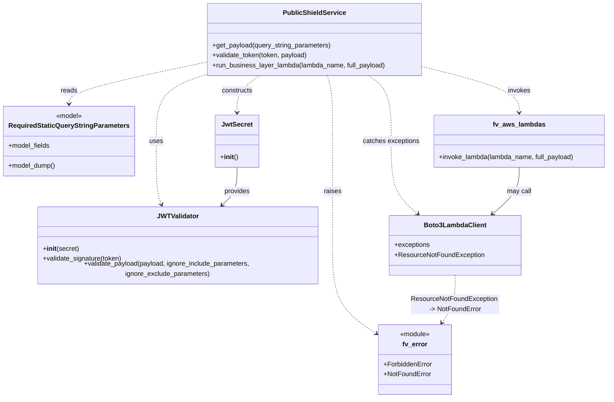

# Diagram: common/public_shield/service.py

> Auto-generated by Obscura crawlers

## Mermaid

### SVG

<svg id="container" width="1457.591796875" xmlns="http://www.w3.org/2000/svg" class="classDiagram" height="946" viewBox="0 0 1457.591796875 946" role="graphics-document document" aria-roledescription="class"><g><defs><marker id="container_class-aggregationStart" class="marker aggregation class" refX="18" refY="7" markerWidth="190" markerHeight="240" orient="auto"><path d="M 18,7 L9,13 L1,7 L9,1 Z"></path></marker></defs><defs><marker id="container_class-aggregationEnd" class="marker aggregation class" refX="1" refY="7" markerWidth="20" markerHeight="28" orient="auto"><path d="M 18,7 L9,13 L1,7 L9,1 Z"></path></marker></defs><defs><marker id="container_class-extensionStart" class="marker extension class" refX="18" refY="7" markerWidth="190" markerHeight="240" orient="auto"><path d="M 1,7 L18,13 V 1 Z"></path></marker></defs><defs><marker id="container_class-extensionEnd" class="marker extension class" refX="1" refY="7" markerWidth="20" markerHeight="28" orient="auto"><path d="M 1,1 V 13 L18,7 Z"></path></marker></defs><defs><marker id="container_class-compositionStart" class="marker composition class" refX="18" refY="7" markerWidth="190" markerHeight="240" orient="auto"><path d="M 18,7 L9,13 L1,7 L9,1 Z"></path></marker></defs><defs><marker id="container_class-compositionEnd" class="marker composition class" refX="1" refY="7" markerWidth="20" markerHeight="28" orient="auto"><path d="M 18,7 L9,13 L1,7 L9,1 Z"></path></marker></defs><defs><marker id="container_class-dependencyStart" class="marker dependency class" refX="6" refY="7" markerWidth="190" markerHeight="240" orient="auto"><path d="M 5,7 L9,13 L1,7 L9,1 Z"></path></marker></defs><defs><marker id="container_class-dependencyEnd" class="marker dependency class" refX="13" refY="7" markerWidth="20" markerHeight="28" orient="auto"><path d="M 18,7 L9,13 L14,7 L9,1 Z"></path></marker></defs><defs><marker id="container_class-lollipopStart" class="marker lollipop class" refX="13" refY="7" markerWidth="190" markerHeight="240" orient="auto"><circle stroke="black" fill="transparent" cx="7" cy="7" r="6"></circle></marker></defs><defs><marker id="container_class-lollipopEnd" class="marker lollipop class" refX="1" refY="7" markerWidth="190" markerHeight="240" orient="auto"><circle stroke="black" fill="transparent" cx="7" cy="7" r="6"></circle></marker></defs><g class="root"><g class="clusters"></g><g class="edgePaths"><path d="M489.719,149.548L434.73,161.123C379.742,172.698,269.766,195.849,214.777,212.591C159.789,229.333,159.789,239.667,159.789,244.833L159.789,250" id="id_PublicShieldService_RequiredStaticQueryStringParameters_1" class="edge-thickness-normal edge-pattern-dashed relation" style=";;;" data-edge="true" data-et="edge" data-id="id_PublicShieldService_RequiredStaticQueryStringParameters_1" data-points="W3sieCI6NDg5LjcxODc1LCJ5IjoxNDkuNTQ3NTY2OTQzODU4Njd9LHsieCI6MTU5Ljc4OTA2MjUsInkiOjIxOX0seyJ4IjoxNTkuNzg5MDYyNSwieSI6MjU2fV0=" marker-end="url(#container_class-dependencyEnd)"></path><path d="M489.719,178.291L468.611,185.076C447.503,191.861,405.286,205.43,384.178,232.382C363.07,259.333,363.07,299.667,363.07,340C363.07,380.333,363.07,420.667,365.234,446.076C367.397,471.485,371.724,481.969,373.888,487.211L376.051,492.454" id="id_PublicShieldService_JWTValidator_2" class="edge-thickness-normal edge-pattern-dashed relation" style=";;;" data-edge="true" data-et="edge" data-id="id_PublicShieldService_JWTValidator_2" data-points="W3sieCI6NDg5LjcxODc1LCJ5IjoxNzguMjkxMTE1NjU2NDUzMTR9LHsieCI6MzYzLjA3MDMxMjUsInkiOjIxOX0seyJ4IjozNjMuMDcwMzEyNSwieSI6MzQwfSx7IngiOjM2My4wNzAzMTI1LCJ5Ijo0NjF9LHsieCI6Mzc4LjMzOTkyMjUwNTA0MDMsInkiOjQ5OH1d" marker-end="url(#container_class-dependencyEnd)"></path><path d="M616.405,182L607.017,188.167C597.63,194.333,578.855,206.667,569.468,221.5C560.08,236.333,560.08,253.667,560.08,262.333L560.08,271" id="id_PublicShieldService_JwtSecret_3" class="edge-thickness-normal edge-pattern-dashed relation" style=";;;" data-edge="true" data-et="edge" data-id="id_PublicShieldService_JwtSecret_3" data-points="W3sieCI6NjE2LjQwNDcyMjE1MjIxNzgsInkiOjE4Mn0seyJ4Ijo1NjAuMDgwMDc4MTI1LCJ5IjoyMTl9LHsieCI6NTYwLjA4MDA3ODEyNSwieSI6Mjc3fV0=" marker-end="url(#container_class-dependencyEnd)"></path><path d="M1007.969,160.105L1047.037,169.92C1086.106,179.736,1164.243,199.368,1203.312,217.851C1242.381,236.333,1242.381,253.667,1242.381,262.333L1242.381,271" id="id_PublicShieldService_fv_aws_lambdas_4" class="edge-thickness-normal edge-pattern-dashed relation" style=";;;" data-edge="true" data-et="edge" data-id="id_PublicShieldService_fv_aws_lambdas_4" data-points="W3sieCI6MTAwNy45Njg3NSwieSI6MTYwLjEwNDUyNjg3Mjc0MTgxfSx7IngiOjEyNDIuMzgwODU5Mzc1LCJ5IjoyMTl9LHsieCI6MTI0Mi4zODA4NTkzNzUsInkiOjI3N31d" marker-end="url(#container_class-dependencyEnd)"></path><path d="M778.962,182L781.097,188.167C783.232,194.333,787.502,206.667,789.637,233C791.771,259.333,791.771,299.667,791.771,340C791.771,380.333,791.771,420.667,791.771,461.5C791.771,502.333,791.771,543.667,791.771,587C791.771,630.333,791.771,675.667,809.371,710.048C826.971,744.429,862.171,767.859,879.771,779.573L897.371,791.288" id="id_PublicShieldService_fv_error_5" class="edge-thickness-normal edge-pattern-dashed relation" style=";;;" data-edge="true" data-et="edge" data-id="id_PublicShieldService_fv_error_5" data-points="W3sieCI6Nzc4Ljk2MjQwMjM0Mzc1LCJ5IjoxODJ9LHsieCI6NzkxLjc3MTQ4NDM3NSwieSI6MjE5fSx7IngiOjc5MS43NzE0ODQzNzUsInkiOjM0MH0seyJ4Ijo3OTEuNzcxNDg0Mzc1LCJ5Ijo0NjF9LHsieCI6NzkxLjc3MTQ4NDM3NSwieSI6NTg1fSx7IngiOjc5MS43NzE0ODQzNzUsInkiOjcyMX0seyJ4Ijo5MDIuMzY1MjM0Mzc1LCJ5Ijo3OTQuNjEyNDE3NjQ5MDEzOH1d" marker-end="url(#container_class-dependencyEnd)"></path><path d="M876.969,182L886.051,188.167C895.132,194.333,913.296,206.667,922.377,233C931.459,259.333,931.459,299.667,931.459,340C931.459,380.333,931.459,420.667,941.543,448.876C951.627,477.086,971.794,493.172,981.878,501.216L991.962,509.259" id="id_PublicShieldService_Boto3LambdaClient_6" class="edge-thickness-normal edge-pattern-dashed relation" style=";;;" data-edge="true" data-et="edge" data-id="id_PublicShieldService_Boto3LambdaClient_6" data-points="W3sieCI6ODc2Ljk2ODk1NDc2MzEwNDksInkiOjE4Mn0seyJ4Ijo5MzEuNDU4OTg0Mzc1LCJ5IjoyMTl9LHsieCI6OTMxLjQ1ODk4NDM3NSwieSI6MzQwfSx7IngiOjkzMS40NTg5ODQzNzUsInkiOjQ2MX0seyJ4Ijo5OTYuNjUyMjgwNzQ1OTY3OCwieSI6NTEzfV0=" marker-end="url(#container_class-dependencyEnd)"></path><path d="M560.08,403L560.08,412.667C560.08,422.333,560.08,441.667,553.589,456.852C547.099,472.038,534.117,483.076,527.626,488.594L521.136,494.113" id="id_JwtSecret_JWTValidator_7" class="edge-thickness-normal edge-pattern-solid relation" style=";;;" data-edge="true" data-et="edge" data-id="id_JwtSecret_JWTValidator_7" data-points="W3sieCI6NTYwLjA4MDA3ODEyNSwieSI6NDAzfSx7IngiOjU2MC4wODAwNzgxMjUsInkiOjQ2MX0seyJ4Ijo1MTYuNTY0NTE2MTI5MDMyMiwieSI6NDk4fV0=" marker-end="url(#container_class-dependencyEnd)"></path><path d="M1242.381,403L1242.381,412.667C1242.381,422.333,1242.381,441.667,1232.297,459.376C1222.213,477.086,1202.046,493.172,1191.962,501.216L1181.878,509.259" id="id_fv_aws_lambdas_Boto3LambdaClient_8" class="edge-thickness-normal edge-pattern-solid relation" style=";;;" data-edge="true" data-et="edge" data-id="id_fv_aws_lambdas_Boto3LambdaClient_8" data-points="W3sieCI6MTI0Mi4zODA4NTkzNzUsInkiOjQwM30seyJ4IjoxMjQyLjM4MDg1OTM3NSwieSI6NDYxfSx7IngiOjExNzcuMTg3NTYzMDA0MDMyMiwieSI6NTEzfV0=" marker-end="url(#container_class-dependencyEnd)"></path><path d="M1086.92,657L1086.92,667.667C1086.92,678.333,1086.92,699.667,1081.649,717.687C1076.378,735.708,1065.835,750.416,1060.564,757.769L1055.293,765.123" id="id_Boto3LambdaClient_fv_error_9" class="edge-thickness-normal edge-pattern-dashed relation" style=";;;" data-edge="true" data-et="edge" data-id="id_Boto3LambdaClient_fv_error_9" data-points="W3sieCI6MTA4Ni45MTk5MjE4NzUsInkiOjY1N30seyJ4IjoxMDg2LjkxOTkyMTg3NSwieSI6NzIxfSx7IngiOjEwNTEuNzk3NTk0NTcyMzY4MywieSI6NzcwfV0=" marker-end="url(#container_class-dependencyEnd)"></path></g><g class="edgeLabels"><g class="edgeLabel" transform="translate(159.7890625, 219)"><g class="label" data-id="id_PublicShieldService_RequiredStaticQueryStringParameters_1" transform="translate(-20.0078125, -12)"><foreignObject width="40.015625" height="24">

reads

</foreignObject></g></g><g class="edgeLabel" transform="translate(363.0703125, 340)"><g class="label" data-id="id_PublicShieldService_JWTValidator_2" transform="translate(-16.4921875, -12)"><foreignObject width="32.984375" height="24">

uses

</foreignObject></g></g><g class="edgeLabel" transform="translate(560.080078125, 219)"><g class="label" data-id="id_PublicShieldService_JwtSecret_3" transform="translate(-37.84375, -12)"><foreignObject width="75.6875" height="24">

constructs

</foreignObject></g></g><g class="edgeLabel" transform="translate(1242.380859375, 219)"><g class="label" data-id="id_PublicShieldService_fv_aws_lambdas_4" transform="translate(-27.5859375, -12)"><foreignObject width="55.171875" height="24">

invokes

</foreignObject></g></g><g class="edgeLabel" transform="translate(791.771484375, 461)"><g class="label" data-id="id_PublicShieldService_fv_error_5" transform="translate(-21.25, -12)"><foreignObject width="42.5" height="24">

raises

</foreignObject></g></g><g class="edgeLabel" transform="translate(931.458984375, 340)"><g class="label" data-id="id_PublicShieldService_Boto3LambdaClient_6" transform="translate(-68.7109375, -12)"><foreignObject width="137.421875" height="24">

catches exceptions

</foreignObject></g></g><g class="edgeLabel" transform="translate(560.080078125, 461)"><g class="label" data-id="id_JwtSecret_JWTValidator_7" transform="translate(-31.3125, -12)"><foreignObject width="62.625" height="24">

provides

</foreignObject></g></g><g class="edgeLabel" transform="translate(1242.380859375, 461)"><g class="label" data-id="id_fv_aws_lambdas_Boto3LambdaClient_8" transform="translate(-29.8515625, -12)"><foreignObject width="59.703125" height="24">

may call

</foreignObject></g></g><g class="edgeLabel" transform="translate(1086.919921875, 721)"><g class="label" data-id="id_Boto3LambdaClient_fv_error_9" transform="translate(-105.9765625, -24)"><foreignObject width="211.953125" height="48">

ResourceNotFoundException -&gt; NotFoundError

</foreignObject></g></g></g><g class="nodes"><g class="node default" id="classId-PublicShieldService-0" transform="translate(748.84375, 95)"><g class="basic label-container"><path d="M-259.125 -87 L259.125 -87 L259.125 87 L-259.125 87" stroke="none" stroke-width="0" fill="#ECECFF" style=""></path><path d="M-259.125 -87 C-148.37698388787186 -87, -37.628967775743746 -87, 259.125 -87 M-259.125 -87 C-52.55819284541411 -87, 154.00861430917178 -87, 259.125 -87 M259.125 -87 C259.125 -37.69677627254932, 259.125 11.606447454901357, 259.125 87 M259.125 -87 C259.125 -20.530646166287553, 259.125 45.93870766742489, 259.125 87 M259.125 87 C144.30031160461158 87, 29.47562320922313 87, -259.125 87 M259.125 87 C88.15467682154812 87, -82.81564635690376 87, -259.125 87 M-259.125 87 C-259.125 29.853345641186863, -259.125 -27.293308717626275, -259.125 -87 M-259.125 87 C-259.125 35.24680566451957, -259.125 -16.50638867096086, -259.125 -87" stroke="#9370DB" stroke-width="1.3" fill="none" stroke-dasharray="0 0" style=""></path></g><g class="annotation-group text" transform="translate(0, -63)"></g><g class="label-group text" transform="translate(-72.0625, -63)"><g class="label" style="font-weight: bolder" transform="translate(0,-12)"><foreignObject width="144.125" height="24">

PublicShieldService

</foreignObject></g></g><g class="members-group text" transform="translate(-247.125, -15)"></g><g class="methods-group text" transform="translate(-247.125, 15)"><g class="label" style="" transform="translate(0,-12)"><foreignObject width="288.953125" height="24">

+get_payload(query_string_parameters)

</foreignObject></g><g class="label" style="" transform="translate(0,12)"><foreignObject width="231.640625" height="24">

+validate_token(token, payload)

</foreignObject></g><g class="label" style="" transform="translate(0,36)"><foreignObject width="422.1875" height="24">

+run_business_layer_lambda(lambda_name, full_payload)

</foreignObject></g></g><g class="divider" style=""><path d="M-259.125 -39 C-61.47291966370972 -39, 136.17916067258057 -39, 259.125 -39 M-259.125 -39 C-154.50587990199102 -39, -49.88675980398207 -39, 259.125 -39" stroke="#9370DB" stroke-width="1.3" fill="none" stroke-dasharray="0 0" style=""></path></g><g class="divider" style=""><path d="M-259.125 -15 C-73.15022254472098 -15, 112.82455491055805 -15, 259.125 -15 M-259.125 -15 C-116.97831884087756 -15, 25.168362318244874 -15, 259.125 -15" stroke="#9370DB" stroke-width="1.3" fill="none" stroke-dasharray="0 0" style=""></path></g></g><g class="node default" id="classId-RequiredStaticQueryStringParameters-1" transform="translate(159.7890625, 340)"><g class="basic label-container"><path d="M-151.7890625 -84 L151.7890625 -84 L151.7890625 84 L-151.7890625 84" stroke="none" stroke-width="0" fill="#ECECFF" style=""></path><path d="M-151.7890625 -84 C-73.39320536847711 -84, 5.002651763045776 -84, 151.7890625 -84 M-151.7890625 -84 C-81.49175098939928 -84, -11.194439478798557 -84, 151.7890625 -84 M151.7890625 -84 C151.7890625 -27.032183649502073, 151.7890625 29.935632700995853, 151.7890625 84 M151.7890625 -84 C151.7890625 -38.71806657143457, 151.7890625 6.563866857130861, 151.7890625 84 M151.7890625 84 C75.09644837833979 84, -1.5961657433204266 84, -151.7890625 84 M151.7890625 84 C78.10407193173437 84, 4.4190813634687345 84, -151.7890625 84 M-151.7890625 84 C-151.7890625 49.318638735396924, -151.7890625 14.637277470793848, -151.7890625 -84 M-151.7890625 84 C-151.7890625 39.973122768520234, -151.7890625 -4.053754462959532, -151.7890625 -84" stroke="#9370DB" stroke-width="1.3" fill="none" stroke-dasharray="0 0" style=""></path></g><g class="annotation-group text" transform="translate(-32.1484375, -60)"><g class="label" style="" transform="translate(0,-12)"><foreignObject width="64.296875" height="24">

«model»

</foreignObject></g></g><g class="label-group text" transform="translate(-139.7890625, -36)"><g class="label" style="font-weight: bolder" transform="translate(0,-12)"><foreignObject width="279.578125" height="24">

RequiredStaticQueryStringParameters

</foreignObject></g></g><g class="members-group text" transform="translate(-139.7890625, 12)"><g class="label" style="" transform="translate(0,-12)"><foreignObject width="101.59375" height="24">

+model_fields

</foreignObject></g></g><g class="methods-group text" transform="translate(-139.7890625, 60)"><g class="label" style="" transform="translate(0,-12)"><foreignObject width="114.484375" height="24">

+model_dump()

</foreignObject></g></g><g class="divider" style=""><path d="M-151.7890625 -12 C-32.81589891156271 -12, 86.15726467687458 -12, 151.7890625 -12 M-151.7890625 -12 C-81.31050739365162 -12, -10.831952287303238 -12, 151.7890625 -12" stroke="#9370DB" stroke-width="1.3" fill="none" stroke-dasharray="0 0" style=""></path></g><g class="divider" style=""><path d="M-151.7890625 36 C-38.26913896733858 36, 75.25078456532285 36, 151.7890625 36 M-151.7890625 36 C-81.86893146345126 36, -11.948800426902523 36, 151.7890625 36" stroke="#9370DB" stroke-width="1.3" fill="none" stroke-dasharray="0 0" style=""></path></g></g><g class="node default" id="classId-JWTValidator-2" transform="translate(414.244140625, 585)"><g class="basic label-container"><path d="M-342.52734375 -87 L342.52734375 -87 L342.52734375 87 L-342.52734375 87" stroke="none" stroke-width="0" fill="#ECECFF" style=""></path><path d="M-342.52734375 -87 C-71.50512786695003 -87, 199.51708801609993 -87, 342.52734375 -87 M-342.52734375 -87 C-101.11055750453934 -87, 140.3062287409213 -87, 342.52734375 -87 M342.52734375 -87 C342.52734375 -19.486807436683492, 342.52734375 48.026385126633016, 342.52734375 87 M342.52734375 -87 C342.52734375 -30.805603195319335, 342.52734375 25.38879360936133, 342.52734375 87 M342.52734375 87 C147.69672605479286 87, -47.13389164041428 87, -342.52734375 87 M342.52734375 87 C98.9043573559172 87, -144.7186290381656 87, -342.52734375 87 M-342.52734375 87 C-342.52734375 50.70438458720758, -342.52734375 14.408769174415156, -342.52734375 -87 M-342.52734375 87 C-342.52734375 23.781346552162518, -342.52734375 -39.437306895674965, -342.52734375 -87" stroke="#9370DB" stroke-width="1.3" fill="none" stroke-dasharray="0 0" style=""></path></g><g class="annotation-group text" transform="translate(0, -63)"></g><g class="label-group text" transform="translate(-46.8203125, -63)"><g class="label" style="font-weight: bolder" transform="translate(0,-12)"><foreignObject width="93.640625" height="24">

JWTValidator

</foreignObject></g></g><g class="members-group text" transform="translate(-330.52734375, -15)"></g><g class="methods-group text" transform="translate(-330.52734375, 15)"><g class="label" style="" transform="translate(0,-12)"><foreignObject width="86.828125" height="24">

+<strong>init</strong>(secret)

</foreignObject></g><g class="label" style="" transform="translate(0,12)"><foreignObject width="193" height="24">

+validate_signature(token)

</foreignObject></g><g class="label" style="" transform="translate(0,36)"><foreignObject width="614.234375" height="24">

+validate_payload(payload, ignore_include_parameters, ignore_exclude_parameters)

</foreignObject></g></g><g class="divider" style=""><path d="M-342.52734375 -39 C-201.16560879698966 -39, -59.80387384397932 -39, 342.52734375 -39 M-342.52734375 -39 C-109.96883968949709 -39, 122.58966437100582 -39, 342.52734375 -39" stroke="#9370DB" stroke-width="1.3" fill="none" stroke-dasharray="0 0" style=""></path></g><g class="divider" style=""><path d="M-342.52734375 -15 C-118.27199435092308 -15, 105.98335504815384 -15, 342.52734375 -15 M-342.52734375 -15 C-147.20130423346913 -15, 48.12473528306174 -15, 342.52734375 -15" stroke="#9370DB" stroke-width="1.3" fill="none" stroke-dasharray="0 0" style=""></path></g></g><g class="node default" id="classId-JwtSecret-3" transform="translate(560.080078125, 340)"><g class="basic label-container"><path d="M-50.85546875 -63 L50.85546875 -63 L50.85546875 63 L-50.85546875 63" stroke="none" stroke-width="0" fill="#ECECFF" style=""></path><path d="M-50.85546875 -63 C-24.27748157662679 -63, 2.3005055967464187 -63, 50.85546875 -63 M-50.85546875 -63 C-23.396391380718704 -63, 4.062685988562592 -63, 50.85546875 -63 M50.85546875 -63 C50.85546875 -34.11296354850942, 50.85546875 -5.22592709701884, 50.85546875 63 M50.85546875 -63 C50.85546875 -13.123237107427599, 50.85546875 36.7535257851448, 50.85546875 63 M50.85546875 63 C18.06062517268814 63, -14.734218404623718 63, -50.85546875 63 M50.85546875 63 C22.751524548834126 63, -5.352419652331747 63, -50.85546875 63 M-50.85546875 63 C-50.85546875 18.196794576716435, -50.85546875 -26.60641084656713, -50.85546875 -63 M-50.85546875 63 C-50.85546875 17.795616152912423, -50.85546875 -27.408767694175154, -50.85546875 -63" stroke="#9370DB" stroke-width="1.3" fill="none" stroke-dasharray="0 0" style=""></path></g><g class="annotation-group text" transform="translate(0, -39)"></g><g class="label-group text" transform="translate(-34.9140625, -39)"><g class="label" style="font-weight: bolder" transform="translate(0,-12)"><foreignObject width="69.828125" height="24">

JwtSecret

</foreignObject></g></g><g class="members-group text" transform="translate(-38.85546875, 9)"></g><g class="methods-group text" transform="translate(-38.85546875, 39)"><g class="label" style="" transform="translate(0,-12)"><foreignObject width="42.796875" height="24">

+<strong>init</strong>()

</foreignObject></g></g><g class="divider" style=""><path d="M-50.85546875 -15 C-26.869832458957646 -15, -2.8841961679152917 -15, 50.85546875 -15 M-50.85546875 -15 C-10.729049957989211 -15, 29.397368834021577 -15, 50.85546875 -15" stroke="#9370DB" stroke-width="1.3" fill="none" stroke-dasharray="0 0" style=""></path></g><g class="divider" style=""><path d="M-50.85546875 9 C-23.571563374187676 9, 3.7123420016246484 9, 50.85546875 9 M-50.85546875 9 C-12.174787526517505 9, 26.50589369696499 9, 50.85546875 9" stroke="#9370DB" stroke-width="1.3" fill="none" stroke-dasharray="0 0" style=""></path></g></g><g class="node default" id="classId-fv_aws_lambdas-4" transform="translate(1242.380859375, 340)"><g class="basic label-container"><path d="M-207.2109375 -63 L207.2109375 -63 L207.2109375 63 L-207.2109375 63" stroke="none" stroke-width="0" fill="#ECECFF" style=""></path><path d="M-207.2109375 -63 C-108.4049248649456 -63, -9.598912229891198 -63, 207.2109375 -63 M-207.2109375 -63 C-75.76954599139677 -63, 55.671845517206464 -63, 207.2109375 -63 M207.2109375 -63 C207.2109375 -27.23461537485077, 207.2109375 8.530769250298462, 207.2109375 63 M207.2109375 -63 C207.2109375 -22.377874076963536, 207.2109375 18.244251846072927, 207.2109375 63 M207.2109375 63 C65.32025340530791 63, -76.57043068938418 63, -207.2109375 63 M207.2109375 63 C68.05810347390954 63, -71.09473055218092 63, -207.2109375 63 M-207.2109375 63 C-207.2109375 19.21846625691783, -207.2109375 -24.563067486164343, -207.2109375 -63 M-207.2109375 63 C-207.2109375 18.063802260070112, -207.2109375 -26.872395479859776, -207.2109375 -63" stroke="#9370DB" stroke-width="1.3" fill="none" stroke-dasharray="0 0" style=""></path></g><g class="annotation-group text" transform="translate(0, -39)"></g><g class="label-group text" transform="translate(-60.0625, -39)"><g class="label" style="font-weight: bolder" transform="translate(0,-12)"><foreignObject width="120.125" height="24">

fv_aws_lambdas

</foreignObject></g></g><g class="members-group text" transform="translate(-195.2109375, 9)"></g><g class="methods-group text" transform="translate(-195.2109375, 39)"><g class="label" style="" transform="translate(0,-12)"><foreignObject width="330.359375" height="24">

+invoke_lambda(lambda_name, full_payload)

</foreignObject></g></g><g class="divider" style=""><path d="M-207.2109375 -15 C-116.4207000808409 -15, -25.630462661681804 -15, 207.2109375 -15 M-207.2109375 -15 C-81.16391114976291 -15, 44.88311520047418 -15, 207.2109375 -15" stroke="#9370DB" stroke-width="1.3" fill="none" stroke-dasharray="0 0" style=""></path></g><g class="divider" style=""><path d="M-207.2109375 9 C-120.72240039645469 9, -34.233863292909376 9, 207.2109375 9 M-207.2109375 9 C-119.04367994887944 9, -30.876422397758887 9, 207.2109375 9" stroke="#9370DB" stroke-width="1.3" fill="none" stroke-dasharray="0 0" style=""></path></g></g><g class="node default" id="classId-fv_error-5" transform="translate(991.587890625, 854)"><g class="basic label-container"><path d="M-89.22265625 -84 L89.22265625 -84 L89.22265625 84 L-89.22265625 84" stroke="none" stroke-width="0" fill="#ECECFF" style=""></path><path d="M-89.22265625 -84 C-28.02510676213332 -84, 33.17244272573336 -84, 89.22265625 -84 M-89.22265625 -84 C-33.520183590782494 -84, 22.18228906843501 -84, 89.22265625 -84 M89.22265625 -84 C89.22265625 -23.149476827696844, 89.22265625 37.70104634460631, 89.22265625 84 M89.22265625 -84 C89.22265625 -27.61895223780546, 89.22265625 28.762095524389082, 89.22265625 84 M89.22265625 84 C39.32864103392639 84, -10.565374182147224 84, -89.22265625 84 M89.22265625 84 C47.8657934335103 84, 6.508930617020596 84, -89.22265625 84 M-89.22265625 84 C-89.22265625 24.161776146201646, -89.22265625 -35.67644770759671, -89.22265625 -84 M-89.22265625 84 C-89.22265625 23.518591447725456, -89.22265625 -36.96281710454909, -89.22265625 -84" stroke="#9370DB" stroke-width="1.3" fill="none" stroke-dasharray="0 0" style=""></path></g><g class="annotation-group text" transform="translate(-36.6015625, -60)"><g class="label" style="" transform="translate(0,-12)"><foreignObject width="73.203125" height="24">

«module»

</foreignObject></g></g><g class="label-group text" transform="translate(-29.1875, -36)"><g class="label" style="font-weight: bolder" transform="translate(0,-12)"><foreignObject width="58.375" height="24">

fv_error

</foreignObject></g></g><g class="members-group text" transform="translate(-77.22265625, 12)"><g class="label" style="" transform="translate(0,-12)"><foreignObject width="117.84375" height="24">

+ForbiddenError

</foreignObject></g><g class="label" style="" transform="translate(0,12)"><foreignObject width="114.734375" height="24">

+NotFoundError

</foreignObject></g></g><g class="methods-group text" transform="translate(-77.22265625, 84)"></g><g class="divider" style=""><path d="M-89.22265625 -12 C-48.7718317742614 -12, -8.321007298522801 -12, 89.22265625 -12 M-89.22265625 -12 C-45.13992344745183 -12, -1.057190644903656 -12, 89.22265625 -12" stroke="#9370DB" stroke-width="1.3" fill="none" stroke-dasharray="0 0" style=""></path></g><g class="divider" style=""><path d="M-89.22265625 60 C-34.39935335183094 60, 20.42394954633812 60, 89.22265625 60 M-89.22265625 60 C-48.2075632040778 60, -7.192470158155601 60, 89.22265625 60" stroke="#9370DB" stroke-width="1.3" fill="none" stroke-dasharray="0 0" style=""></path></g></g><g class="node default" id="classId-Boto3LambdaClient-6" transform="translate(1086.919921875, 585)"><g class="basic label-container"><path d="M-155.6640625 -72 L155.6640625 -72 L155.6640625 72 L-155.6640625 72" stroke="none" stroke-width="0" fill="#ECECFF" style=""></path><path d="M-155.6640625 -72 C-64.12337853276861 -72, 27.417305434462776 -72, 155.6640625 -72 M-155.6640625 -72 C-78.39166119025046 -72, -1.1192598805009197 -72, 155.6640625 -72 M155.6640625 -72 C155.6640625 -17.169305025436216, 155.6640625 37.66138994912757, 155.6640625 72 M155.6640625 -72 C155.6640625 -28.739910354788535, 155.6640625 14.52017929042293, 155.6640625 72 M155.6640625 72 C51.67920844935986 72, -52.305645601280276 72, -155.6640625 72 M155.6640625 72 C42.97714239143731 72, -69.70977771712538 72, -155.6640625 72 M-155.6640625 72 C-155.6640625 41.10388554057563, -155.6640625 10.207771081151257, -155.6640625 -72 M-155.6640625 72 C-155.6640625 20.530365167333805, -155.6640625 -30.93926966533239, -155.6640625 -72" stroke="#9370DB" stroke-width="1.3" fill="none" stroke-dasharray="0 0" style=""></path></g><g class="annotation-group text" transform="translate(0, -48)"></g><g class="label-group text" transform="translate(-71.625, -48)"><g class="label" style="font-weight: bolder" transform="translate(0,-12)"><foreignObject width="143.25" height="24">

Boto3LambdaClient

</foreignObject></g></g><g class="members-group text" transform="translate(-143.6640625, 0)"><g class="label" style="" transform="translate(0,-12)"><foreignObject width="86.21875" height="24">

+exceptions

</foreignObject></g><g class="label" style="" transform="translate(0,12)"><foreignObject width="215.703125" height="24">

+ResourceNotFoundException

</foreignObject></g></g><g class="methods-group text" transform="translate(-143.6640625, 72)"></g><g class="divider" style=""><path d="M-155.6640625 -24 C-91.50068599878905 -24, -27.337309497578104 -24, 155.6640625 -24 M-155.6640625 -24 C-91.8524625956347 -24, -28.040862691269425 -24, 155.6640625 -24" stroke="#9370DB" stroke-width="1.3" fill="none" stroke-dasharray="0 0" style=""></path></g><g class="divider" style=""><path d="M-155.6640625 48 C-88.35499452279373 48, -21.045926545587463 48, 155.6640625 48 M-155.6640625 48 C-79.67345606046537 48, -3.682849620930739 48, 155.6640625 48" stroke="#9370DB" stroke-width="1.3" fill="none" stroke-dasharray="0 0" style=""></path></g></g></g></g></g></svg>
