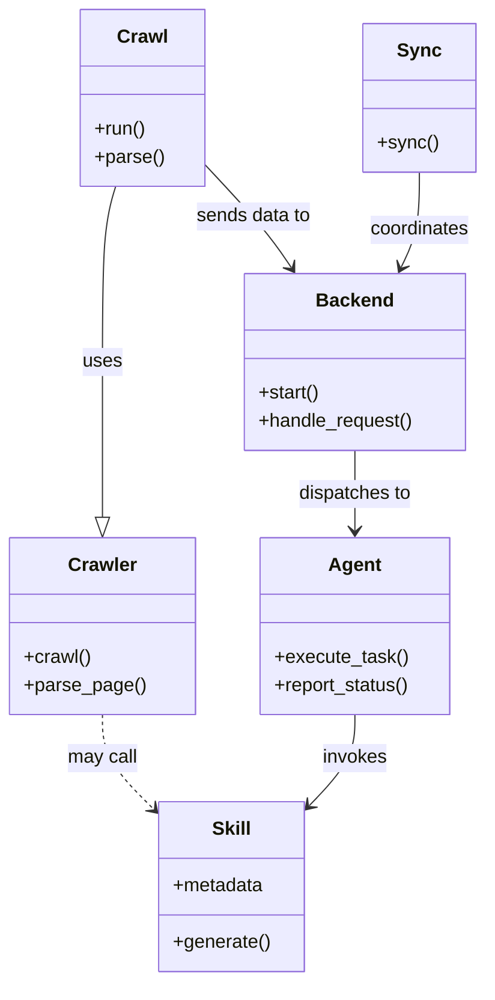

# Diagram: common/subscription_service/config/config.alpha.yml


> Auto-generated by Obscura crawlers

## Diagram 1



### SVG

<svg id="container" width="406.083984375" xmlns="http://www.w3.org/2000/svg" class="classDiagram" height="832" viewBox="0 0 406.083984375 832" role="graphics-document document" aria-roledescription="class"><style>#container{font-family:"trebuchet ms",verdana,arial,sans-serif;font-size:16px;fill:#333;}@keyframes edge-animation-frame{from{stroke-dashoffset:0;}}@keyframes dash{to{stroke-dashoffset:0;}}#container .edge-animation-slow{stroke-dasharray:9,5!important;stroke-dashoffset:900;animation:dash 50s linear infinite;stroke-linecap:round;}#container .edge-animation-fast{stroke-dasharray:9,5!important;stroke-dashoffset:900;animation:dash 20s linear infinite;stroke-linecap:round;}#container .error-icon{fill:#552222;}#container .error-text{fill:#552222;stroke:#552222;}#container .edge-thickness-normal{stroke-width:1px;}#container .edge-thickness-thick{stroke-width:3.5px;}#container .edge-pattern-solid{stroke-dasharray:0;}#container .edge-thickness-invisible{stroke-width:0;fill:none;}#container .edge-pattern-dashed{stroke-dasharray:3;}#container .edge-pattern-dotted{stroke-dasharray:2;}#container .marker{fill:#333333;stroke:#333333;}#container .marker.cross{stroke:#333333;}#container svg{font-family:"trebuchet ms",verdana,arial,sans-serif;font-size:16px;}#container p{margin:0;}#container g.classGroup text{fill:#9370DB;stroke:none;font-family:"trebuchet ms",verdana,arial,sans-serif;font-size:10px;}#container g.classGroup text .title{font-weight:bolder;}#container .nodeLabel,#container .edgeLabel{color:#131300;}#container .edgeLabel .label rect{fill:#ECECFF;}#container .label text{fill:#131300;}#container .labelBkg{background:#ECECFF;}#container .edgeLabel .label span{background:#ECECFF;}#container .classTitle{font-weight:bolder;}#container .node rect,#container .node circle,#container .node ellipse,#container .node polygon,#container .node path{fill:#ECECFF;stroke:#9370DB;stroke-width:1px;}#container .divider{stroke:#9370DB;stroke-width:1;}#container g.clickable{cursor:pointer;}#container g.classGroup rect{fill:#ECECFF;stroke:#9370DB;}#container g.classGroup line{stroke:#9370DB;stroke-width:1;}#container .classLabel .box{stroke:none;stroke-width:0;fill:#ECECFF;opacity:0.5;}#container .classLabel .label{fill:#9370DB;font-size:10px;}#container .relation{stroke:#333333;stroke-width:1;fill:none;}#container .dashed-line{stroke-dasharray:3;}#container .dotted-line{stroke-dasharray:1 2;}#container #compositionStart,#container .composition{fill:#333333!important;stroke:#333333!important;stroke-width:1;}#container #compositionEnd,#container .composition{fill:#333333!important;stroke:#333333!important;stroke-width:1;}#container #dependencyStart,#container .dependency{fill:#333333!important;stroke:#333333!important;stroke-width:1;}#container #dependencyStart,#container .dependency{fill:#333333!important;stroke:#333333!important;stroke-width:1;}#container #extensionStart,#container .extension{fill:transparent!important;stroke:#333333!important;stroke-width:1;}#container #extensionEnd,#container .extension{fill:transparent!important;stroke:#333333!important;stroke-width:1;}#container #aggregationStart,#container .aggregation{fill:transparent!important;stroke:#333333!important;stroke-width:1;}#container #aggregationEnd,#container .aggregation{fill:transparent!important;stroke:#333333!important;stroke-width:1;}#container #lollipopStart,#container .lollipop{fill:#ECECFF!important;stroke:#333333!important;stroke-width:1;}#container #lollipopEnd,#container .lollipop{fill:#ECECFF!important;stroke:#333333!important;stroke-width:1;}#container .edgeTerminals{font-size:11px;line-height:initial;}#container .classTitleText{text-anchor:middle;font-size:18px;fill:#333;}#container .label-icon{display:inline-block;height:1em;overflow:visible;vertical-align:-0.125em;}#container .node .label-icon path{fill:currentColor;stroke:revert;stroke-width:revert;}#container :root{--mermaid-font-family:"trebuchet ms",verdana,arial,sans-serif;}</style><g><defs><marker id="container_class-aggregationStart" class="marker aggregation class" refX="18" refY="7" markerWidth="190" markerHeight="240" orient="auto"><path d="M 18,7 L9,13 L1,7 L9,1 Z"></path></marker></defs><defs><marker id="container_class-aggregationEnd" class="marker aggregation class" refX="1" refY="7" markerWidth="20" markerHeight="28" orient="auto"><path d="M 18,7 L9,13 L1,7 L9,1 Z"></path></marker></defs><defs><marker id="container_class-extensionStart" class="marker extension class" refX="18" refY="7" markerWidth="190" markerHeight="240" orient="auto"><path d="M 1,7 L18,13 V 1 Z"></path></marker></defs><defs><marker id="container_class-extensionEnd" class="marker extension class" refX="1" refY="7" markerWidth="20" markerHeight="28" orient="auto"><path d="M 1,1 V 13 L18,7 Z"></path></marker></defs><defs><marker id="container_class-compositionStart" class="marker composition class" refX="18" refY="7" markerWidth="190" markerHeight="240" orient="auto"><path d="M 18,7 L9,13 L1,7 L9,1 Z"></path></marker></defs><defs><marker id="container_class-compositionEnd" class="marker composition class" refX="1" refY="7" markerWidth="20" markerHeight="28" orient="auto"><path d="M 18,7 L9,13 L1,7 L9,1 Z"></path></marker></defs><defs><marker id="container_class-dependencyStart" class="marker dependency class" refX="6" refY="7" markerWidth="190" markerHeight="240" orient="auto"><path d="M 5,7 L9,13 L1,7 L9,1 Z"></path></marker></defs><defs><marker id="container_class-dependencyEnd" class="marker dependency class" refX="13" refY="7" markerWidth="20" markerHeight="28" orient="auto"><path d="M 18,7 L9,13 L14,7 L9,1 Z"></path></marker></defs><defs><marker id="container_class-lollipopStart" class="marker lollipop class" refX="13" refY="7" markerWidth="190" markerHeight="240" orient="auto"><circle stroke="black" fill="transparent" cx="7" cy="7" r="6"></circle></marker></defs><defs><marker id="container_class-lollipopEnd" class="marker lollipop class" refX="1" refY="7" markerWidth="190" markerHeight="240" orient="auto"><circle stroke="black" fill="transparent" cx="7" cy="7" r="6"></circle></marker></defs><g class="root"><g class="clusters"></g><g class="edgePaths"><path d="M95.916,158L94.008,164.167C92.101,170.333,88.285,182.667,86.377,207.5C84.469,232.333,84.469,269.667,84.469,307C84.469,344.333,84.469,381.667,84.469,403.625C84.469,425.583,84.469,432.167,84.469,435.458L84.469,438.75" id="id_Crawl_Crawler_1" class="edge-thickness-normal edge-pattern-solid relation" style=";;;" data-edge="true" data-et="edge" data-id="id_Crawl_Crawler_1" data-points="W3sieCI6OTUuOTE2Mzk5Mjc0NTUzNTcsInkiOjE1OH0seyJ4Ijo4NC40Njg3NSwieSI6MTk1fSx7IngiOjg0LjQ2ODc1LCJ5IjozMDd9LHsieCI6ODQuNDY4NzUsInkiOjQxOX0seyJ4Ijo4NC40Njg3NSwieSI6NDU2fV0=" marker-end="url(#container_class-extensionEnd)"></path><path d="M170.461,138.514L179.167,147.929C187.874,157.343,205.286,176.171,217.494,190.917C229.701,205.662,236.703,216.323,240.204,221.654L243.705,226.985" id="id_Crawl_Backend_2" class="edge-thickness-normal edge-pattern-solid relation" style=";;;" data-edge="true" data-et="edge" data-id="id_Crawl_Backend_2" data-points="W3sieCI6MTcwLjQ2MDkzNzUsInkiOjEzOC41MTQyNTU1NDM4MjI2fSx7IngiOjIyMi42OTkyMTg3NSwieSI6MTk1fSx7IngiOjI0Ni45OTkxODAzODUwNDQ2NCwieSI6MjMyfV0=" marker-end="url(#container_class-dependencyEnd)"></path><path d="M296.256,382L296.256,388.167C296.256,394.333,296.256,406.667,296.256,418C296.256,429.333,296.256,439.667,296.256,444.833L296.256,450" id="id_Backend_Agent_3" class="edge-thickness-normal edge-pattern-solid relation" style=";;;" data-edge="true" data-et="edge" data-id="id_Backend_Agent_3" data-points="W3sieCI6Mjk2LjI1NTg1OTM3NSwieSI6MzgyfSx7IngiOjI5Ni4yNTU4NTkzNzUsInkiOjQxOX0seyJ4IjoyOTYuMjU1ODU5Mzc1LCJ5Ijo0NTZ9XQ==" marker-end="url(#container_class-dependencyEnd)"></path><path d="M296.256,606L296.256,612.167C296.256,618.333,296.256,630.667,289.833,643.592C283.411,656.517,270.566,670.035,264.143,676.793L257.721,683.552" id="id_Agent_Skill_4" class="edge-thickness-normal edge-pattern-solid relation" style=";;;" data-edge="true" data-et="edge" data-id="id_Agent_Skill_4" data-points="W3sieCI6Mjk2LjI1NTg1OTM3NSwieSI6NjA2fSx7IngiOjI5Ni4yNTU4NTkzNzUsInkiOjY0M30seyJ4IjoyNTMuNTg3ODkwNjI1LCJ5Ijo2ODcuOTAxNDU1NzI0ODQ1NH1d" marker-end="url(#container_class-dependencyEnd)"></path><path d="M352.311,146L352.311,154.167C352.311,162.333,352.311,178.667,349.672,192.106C347.033,205.545,341.755,216.09,339.117,221.362L336.478,226.634" id="id_Sync_Backend_5" class="edge-thickness-normal edge-pattern-solid relation" style=";;;" data-edge="true" data-et="edge" data-id="id_Sync_Backend_5" data-points="W3sieCI6MzUyLjMxMDU0Njg3NSwieSI6MTQ2fSx7IngiOjM1Mi4zMTA1NDY4NzUsInkiOjE5NX0seyJ4IjozMzMuNzkyNDgwNDY4NzUsInkiOjIzMn1d" marker-end="url(#container_class-dependencyEnd)"></path><path d="M84.469,606L84.469,612.167C84.469,618.333,84.469,630.667,91.647,644.064C98.826,657.462,113.183,671.924,120.362,679.155L127.54,686.387" id="id_Crawler_Skill_6" class="edge-thickness-normal edge-pattern-dashed relation" style=";;;" data-edge="true" data-et="edge" data-id="id_Crawler_Skill_6" data-points="W3sieCI6ODQuNDY4NzUsInkiOjYwNn0seyJ4Ijo4NC40Njg3NSwieSI6NjQzfSx7IngiOjEzMS43Njc1NzgxMjUsInkiOjY5MC42NDQ1ODYwMzMyNDczfV0=" marker-end="url(#container_class-dependencyEnd)"></path></g><g class="edgeLabels"><g class="edgeLabel" transform="translate(84.46875, 307)"><g class="label" data-id="id_Crawl_Crawler_1" transform="translate(-16.4921875, -12)"><foreignObject width="32.984375" height="24"><div xmlns="http://www.w3.org/1999/xhtml" class="labelBkg" style="display: table-cell; white-space: nowrap; line-height: 1.5; max-width: 200px; text-align: center;"><span class="edgeLabel"><p>uses</p></span></div></foreignObject></g></g><g class="edgeLabel" transform="translate(211.60764, 183.00657)"><g class="label" data-id="id_Crawl_Backend_2" transform="translate(-49.3046875, -12)"><foreignObject width="98.609375" height="24"><div xmlns="http://www.w3.org/1999/xhtml" class="labelBkg" style="display: table-cell; white-space: nowrap; line-height: 1.5; max-width: 200px; text-align: center;"><span class="edgeLabel"><p>sends data to</p></span></div></foreignObject></g></g><g class="edgeLabel" transform="translate(296.255859375, 419)"><g class="label" data-id="id_Backend_Agent_3" transform="translate(-48.7421875, -12)"><foreignObject width="97.484375" height="24"><div xmlns="http://www.w3.org/1999/xhtml" class="labelBkg" style="display: table-cell; white-space: nowrap; line-height: 1.5; max-width: 200px; text-align: center;"><span class="edgeLabel"><p>dispatches to</p></span></div></foreignObject></g></g><g class="edgeLabel" transform="translate(296.255859375, 643)"><g class="label" data-id="id_Agent_Skill_4" transform="translate(-27.5859375, -12)"><foreignObject width="55.171875" height="24"><div xmlns="http://www.w3.org/1999/xhtml" class="labelBkg" style="display: table-cell; white-space: nowrap; line-height: 1.5; max-width: 200px; text-align: center;"><span class="edgeLabel"><p>invokes</p></span></div></foreignObject></g></g><g class="edgeLabel" transform="translate(352.310546875, 195)"><g class="label" data-id="id_Sync_Backend_5" transform="translate(-42.8046875, -12)"><foreignObject width="85.609375" height="24"><div xmlns="http://www.w3.org/1999/xhtml" class="labelBkg" style="display: table-cell; white-space: nowrap; line-height: 1.5; max-width: 200px; text-align: center;"><span class="edgeLabel"><p>coordinates</p></span></div></foreignObject></g></g><g class="edgeLabel" transform="translate(84.46875, 643)"><g class="label" data-id="id_Crawler_Skill_6" transform="translate(-29.8515625, -12)"><foreignObject width="59.703125" height="24"><div xmlns="http://www.w3.org/1999/xhtml" class="labelBkg" style="display: table-cell; white-space: nowrap; line-height: 1.5; max-width: 200px; text-align: center;"><span class="edgeLabel"><p>may call</p></span></div></foreignObject></g></g></g><g class="nodes"><g class="node default" id="classId-Crawl-0" transform="translate(119.12109375, 83)"><g class="basic label-container"><path d="M-51.33984375 -75 L51.33984375 -75 L51.33984375 75 L-51.33984375 75" stroke="none" stroke-width="0" fill="#ECECFF" style=""></path><path d="M-51.33984375 -75 C-29.589744806053005 -75, -7.8396458621060106 -75, 51.33984375 -75 M-51.33984375 -75 C-26.891256275254285 -75, -2.442668800508571 -75, 51.33984375 -75 M51.33984375 -75 C51.33984375 -40.29931204649016, 51.33984375 -5.598624092980316, 51.33984375 75 M51.33984375 -75 C51.33984375 -19.366649439138854, 51.33984375 36.26670112172229, 51.33984375 75 M51.33984375 75 C22.247195298136866 75, -6.845453153726268 75, -51.33984375 75 M51.33984375 75 C12.052773580769724 75, -27.234296588460552 75, -51.33984375 75 M-51.33984375 75 C-51.33984375 42.38602312319972, -51.33984375 9.77204624639944, -51.33984375 -75 M-51.33984375 75 C-51.33984375 42.9208430369937, -51.33984375 10.841686073987404, -51.33984375 -75" stroke="#9370DB" stroke-width="1.3" fill="none" stroke-dasharray="0 0" style=""></path></g><g class="annotation-group text" transform="translate(0, -51)"></g><g class="label-group text" transform="translate(-20.1484375, -51)"><g class="label" style="font-weight: bolder" transform="translate(0,-12)"><foreignObject width="40.296875" height="24"><div xmlns="http://www.w3.org/1999/xhtml" style="display: table-cell; white-space: nowrap; line-height: 1.5; max-width: 89px; text-align: center;"><span class="nodeLabel markdown-node-label" style=""><p>Crawl</p></span></div></foreignObject></g></g><g class="members-group text" transform="translate(-39.33984375, -3)"></g><g class="methods-group text" transform="translate(-39.33984375, 27)"><g class="label" style="" transform="translate(0,-12)"><foreignObject width="43.21875" height="24"><div xmlns="http://www.w3.org/1999/xhtml" style="display: table-cell; white-space: nowrap; line-height: 1.5; max-width: 101px; text-align: center;"><span class="nodeLabel markdown-node-label" style=""><p>+run()</p></span></div></foreignObject></g><g class="label" style="" transform="translate(0,12)"><foreignObject width="58.53125" height="24"><div xmlns="http://www.w3.org/1999/xhtml" style="display: table-cell; white-space: nowrap; line-height: 1.5; max-width: 116px; text-align: center;"><span class="nodeLabel markdown-node-label" style=""><p>+parse()</p></span></div></foreignObject></g></g><g class="divider" style=""><path d="M-51.33984375 -27 C-11.700101711402255 -27, 27.93964032719549 -27, 51.33984375 -27 M-51.33984375 -27 C-17.205438787679405 -27, 16.92896617464119 -27, 51.33984375 -27" stroke="#9370DB" stroke-width="1.3" fill="none" stroke-dasharray="0 0" style=""></path></g><g class="divider" style=""><path d="M-51.33984375 -3 C-11.846399894698301 -3, 27.647043960603398 -3, 51.33984375 -3 M-51.33984375 -3 C-18.714048221054682 -3, 13.911747307890636 -3, 51.33984375 -3" stroke="#9370DB" stroke-width="1.3" fill="none" stroke-dasharray="0 0" style=""></path></g></g><g class="node default" id="classId-Crawler-1" transform="translate(84.46875, 531)"><g class="basic label-container"><path d="M-76.46875 -75 L76.46875 -75 L76.46875 75 L-76.46875 75" stroke="none" stroke-width="0" fill="#ECECFF" style=""></path><path d="M-76.46875 -75 C-32.019100314603364 -75, 12.430549370793273 -75, 76.46875 -75 M-76.46875 -75 C-21.17670668026124 -75, 34.11533663947752 -75, 76.46875 -75 M76.46875 -75 C76.46875 -21.371901619321257, 76.46875 32.25619676135749, 76.46875 75 M76.46875 -75 C76.46875 -36.67312040865074, 76.46875 1.653759182698522, 76.46875 75 M76.46875 75 C19.726970309885303 75, -37.014809380229394 75, -76.46875 75 M76.46875 75 C28.382928412896774 75, -19.70289317420645 75, -76.46875 75 M-76.46875 75 C-76.46875 16.241582477835813, -76.46875 -42.516835044328374, -76.46875 -75 M-76.46875 75 C-76.46875 36.464984797287684, -76.46875 -2.0700304054246317, -76.46875 -75" stroke="#9370DB" stroke-width="1.3" fill="none" stroke-dasharray="0 0" style=""></path></g><g class="annotation-group text" transform="translate(0, -51)"></g><g class="label-group text" transform="translate(-27.734375, -51)"><g class="label" style="font-weight: bolder" transform="translate(0,-12)"><foreignObject width="55.46875" height="24"><div xmlns="http://www.w3.org/1999/xhtml" style="display: table-cell; white-space: nowrap; line-height: 1.5; max-width: 105px; text-align: center;"><span class="nodeLabel markdown-node-label" style=""><p>Crawler</p></span></div></foreignObject></g></g><g class="members-group text" transform="translate(-64.46875, -3)"></g><g class="methods-group text" transform="translate(-64.46875, 27)"><g class="label" style="" transform="translate(0,-12)"><foreignObject width="56.40625" height="24"><div xmlns="http://www.w3.org/1999/xhtml" style="display: table-cell; white-space: nowrap; line-height: 1.5; max-width: 114px; text-align: center;"><span class="nodeLabel markdown-node-label" style=""><p>+crawl()</p></span></div></foreignObject></g><g class="label" style="" transform="translate(0,12)"><foreignObject width="101.203125" height="24"><div xmlns="http://www.w3.org/1999/xhtml" style="display: table-cell; white-space: nowrap; line-height: 1.5; max-width: 159px; text-align: center;"><span class="nodeLabel markdown-node-label" style=""><p>+parse_page()</p></span></div></foreignObject></g></g><g class="divider" style=""><path d="M-76.46875 -27 C-39.18100501672563 -27, -1.8932600334512557 -27, 76.46875 -27 M-76.46875 -27 C-18.982166895254345 -27, 38.50441620949131 -27, 76.46875 -27" stroke="#9370DB" stroke-width="1.3" fill="none" stroke-dasharray="0 0" style=""></path></g><g class="divider" style=""><path d="M-76.46875 -3 C-16.99232615921491 -3, 42.48409768157018 -3, 76.46875 -3 M-76.46875 -3 C-17.992409634808254 -3, 40.48393073038349 -3, 76.46875 -3" stroke="#9370DB" stroke-width="1.3" fill="none" stroke-dasharray="0 0" style=""></path></g></g><g class="node default" id="classId-Backend-2" transform="translate(296.255859375, 307)"><g class="basic label-container"><path d="M-93.6328125 -75 L93.6328125 -75 L93.6328125 75 L-93.6328125 75" stroke="none" stroke-width="0" fill="#ECECFF" style=""></path><path d="M-93.6328125 -75 C-21.30513942779143 -75, 51.02253364441714 -75, 93.6328125 -75 M-93.6328125 -75 C-28.176499076684593 -75, 37.279814346630815 -75, 93.6328125 -75 M93.6328125 -75 C93.6328125 -31.089746834419508, 93.6328125 12.820506331160985, 93.6328125 75 M93.6328125 -75 C93.6328125 -28.72600384295329, 93.6328125 17.54799231409342, 93.6328125 75 M93.6328125 75 C46.696184187150934 75, -0.2404441256981329 75, -93.6328125 75 M93.6328125 75 C31.030854917003246 75, -31.571102665993507 75, -93.6328125 75 M-93.6328125 75 C-93.6328125 23.997958241148027, -93.6328125 -27.004083517703947, -93.6328125 -75 M-93.6328125 75 C-93.6328125 24.773207150274175, -93.6328125 -25.45358569945165, -93.6328125 -75" stroke="#9370DB" stroke-width="1.3" fill="none" stroke-dasharray="0 0" style=""></path></g><g class="annotation-group text" transform="translate(0, -51)"></g><g class="label-group text" transform="translate(-31.296875, -51)"><g class="label" style="font-weight: bolder" transform="translate(0,-12)"><foreignObject width="62.59375" height="24"><div xmlns="http://www.w3.org/1999/xhtml" style="display: table-cell; white-space: nowrap; line-height: 1.5; max-width: 112px; text-align: center;"><span class="nodeLabel markdown-node-label" style=""><p>Backend</p></span></div></foreignObject></g></g><g class="members-group text" transform="translate(-81.6328125, -3)"></g><g class="methods-group text" transform="translate(-81.6328125, 27)"><g class="label" style="" transform="translate(0,-12)"><foreignObject width="52.15625" height="24"><div xmlns="http://www.w3.org/1999/xhtml" style="display: table-cell; white-space: nowrap; line-height: 1.5; max-width: 110px; text-align: center;"><span class="nodeLabel markdown-node-label" style=""><p>+start()</p></span></div></foreignObject></g><g class="label" style="" transform="translate(0,12)"><foreignObject width="131.96875" height="24"><div xmlns="http://www.w3.org/1999/xhtml" style="display: table-cell; white-space: nowrap; line-height: 1.5; max-width: 189px; text-align: center;"><span class="nodeLabel markdown-node-label" style=""><p>+handle_request()</p></span></div></foreignObject></g></g><g class="divider" style=""><path d="M-93.6328125 -27 C-33.64173112865277 -27, 26.349350242694456 -27, 93.6328125 -27 M-93.6328125 -27 C-39.87217023585877 -27, 13.888472028282465 -27, 93.6328125 -27" stroke="#9370DB" stroke-width="1.3" fill="none" stroke-dasharray="0 0" style=""></path></g><g class="divider" style=""><path d="M-93.6328125 -3 C-53.365799437887944 -3, -13.098786375775887 -3, 93.6328125 -3 M-93.6328125 -3 C-21.77408233797668 -3, 50.08464782404664 -3, 93.6328125 -3" stroke="#9370DB" stroke-width="1.3" fill="none" stroke-dasharray="0 0" style=""></path></g></g><g class="node default" id="classId-Agent-3" transform="translate(296.255859375, 531)"><g class="basic label-container"><path d="M-80.6875 -75 L80.6875 -75 L80.6875 75 L-80.6875 75" stroke="none" stroke-width="0" fill="#ECECFF" style=""></path><path d="M-80.6875 -75 C-42.78141024936019 -75, -4.875320498720384 -75, 80.6875 -75 M-80.6875 -75 C-36.92217415771219 -75, 6.843151684575616 -75, 80.6875 -75 M80.6875 -75 C80.6875 -19.00827434647612, 80.6875 36.98345130704776, 80.6875 75 M80.6875 -75 C80.6875 -16.10537885272037, 80.6875 42.78924229455926, 80.6875 75 M80.6875 75 C16.90054854560786 75, -46.88640290878428 75, -80.6875 75 M80.6875 75 C43.96467203748721 75, 7.2418440749744235 75, -80.6875 75 M-80.6875 75 C-80.6875 28.37932537115325, -80.6875 -18.2413492576935, -80.6875 -75 M-80.6875 75 C-80.6875 41.95402156437541, -80.6875 8.908043128750819, -80.6875 -75" stroke="#9370DB" stroke-width="1.3" fill="none" stroke-dasharray="0 0" style=""></path></g><g class="annotation-group text" transform="translate(0, -51)"></g><g class="label-group text" transform="translate(-21.078125, -51)"><g class="label" style="font-weight: bolder" transform="translate(0,-12)"><foreignObject width="42.15625" height="24"><div xmlns="http://www.w3.org/1999/xhtml" style="display: table-cell; white-space: nowrap; line-height: 1.5; max-width: 91px; text-align: center;"><span class="nodeLabel markdown-node-label" style=""><p>Agent</p></span></div></foreignObject></g></g><g class="members-group text" transform="translate(-68.6875, -3)"></g><g class="methods-group text" transform="translate(-68.6875, 27)"><g class="label" style="" transform="translate(0,-12)"><foreignObject width="111.875" height="24"><div xmlns="http://www.w3.org/1999/xhtml" style="display: table-cell; white-space: nowrap; line-height: 1.5; max-width: 169px; text-align: center;"><span class="nodeLabel markdown-node-label" style=""><p>+execute_task()</p></span></div></foreignObject></g><g class="label" style="" transform="translate(0,12)"><foreignObject width="116.296875" height="24"><div xmlns="http://www.w3.org/1999/xhtml" style="display: table-cell; white-space: nowrap; line-height: 1.5; max-width: 174px; text-align: center;"><span class="nodeLabel markdown-node-label" style=""><p>+report_status()</p></span></div></foreignObject></g></g><g class="divider" style=""><path d="M-80.6875 -27 C-19.578406796372683 -27, 41.530686407254635 -27, 80.6875 -27 M-80.6875 -27 C-33.480499880209294 -27, 13.726500239581412 -27, 80.6875 -27" stroke="#9370DB" stroke-width="1.3" fill="none" stroke-dasharray="0 0" style=""></path></g><g class="divider" style=""><path d="M-80.6875 -3 C-46.20681756417735 -3, -11.726135128354699 -3, 80.6875 -3 M-80.6875 -3 C-17.203321646944964 -3, 46.28085670611007 -3, 80.6875 -3" stroke="#9370DB" stroke-width="1.3" fill="none" stroke-dasharray="0 0" style=""></path></g></g><g class="node default" id="classId-Skill-4" transform="translate(192.677734375, 752)"><g class="basic label-container"><path d="M-60.91015625 -72 L60.91015625 -72 L60.91015625 72 L-60.91015625 72" stroke="none" stroke-width="0" fill="#ECECFF" style=""></path><path d="M-60.91015625 -72 C-35.358570891253095 -72, -9.806985532506197 -72, 60.91015625 -72 M-60.91015625 -72 C-25.655030442751887 -72, 9.600095364496227 -72, 60.91015625 -72 M60.91015625 -72 C60.91015625 -18.369130679354257, 60.91015625 35.26173864129149, 60.91015625 72 M60.91015625 -72 C60.91015625 -28.92016313475643, 60.91015625 14.159673730487143, 60.91015625 72 M60.91015625 72 C21.135939678170196 72, -18.638276893659608 72, -60.91015625 72 M60.91015625 72 C31.94825605059605 72, 2.9863558511921013 72, -60.91015625 72 M-60.91015625 72 C-60.91015625 22.173717528920932, -60.91015625 -27.652564942158136, -60.91015625 -72 M-60.91015625 72 C-60.91015625 24.26148754170009, -60.91015625 -23.477024916599817, -60.91015625 -72" stroke="#9370DB" stroke-width="1.3" fill="none" stroke-dasharray="0 0" style=""></path></g><g class="annotation-group text" transform="translate(0, -48)"></g><g class="label-group text" transform="translate(-16.0078125, -48)"><g class="label" style="font-weight: bolder" transform="translate(0,-12)"><foreignObject width="32.015625" height="24"><div xmlns="http://www.w3.org/1999/xhtml" style="display: table-cell; white-space: nowrap; line-height: 1.5; max-width: 81px; text-align: center;"><span class="nodeLabel markdown-node-label" style=""><p>Skill</p></span></div></foreignObject></g></g><g class="members-group text" transform="translate(-48.91015625, 0)"><g class="label" style="" transform="translate(0,-12)"><foreignObject width="77.4375" height="24"><div xmlns="http://www.w3.org/1999/xhtml" style="display: table-cell; white-space: nowrap; line-height: 1.5; max-width: 135px; text-align: center;"><span class="nodeLabel markdown-node-label" style=""><p>+metadata</p></span></div></foreignObject></g></g><g class="methods-group text" transform="translate(-48.91015625, 48)"><g class="label" style="" transform="translate(0,-12)"><foreignObject width="81.8125" height="24"><div xmlns="http://www.w3.org/1999/xhtml" style="display: table-cell; white-space: nowrap; line-height: 1.5; max-width: 139px; text-align: center;"><span class="nodeLabel markdown-node-label" style=""><p>+generate()</p></span></div></foreignObject></g></g><g class="divider" style=""><path d="M-60.91015625 -24 C-22.00995270796031 -24, 16.89025083407938 -24, 60.91015625 -24 M-60.91015625 -24 C-13.34910091682324 -24, 34.21195441635352 -24, 60.91015625 -24" stroke="#9370DB" stroke-width="1.3" fill="none" stroke-dasharray="0 0" style=""></path></g><g class="divider" style=""><path d="M-60.91015625 24 C-26.338685259879853 24, 8.232785730240295 24, 60.91015625 24 M-60.91015625 24 C-25.17687565193401 24, 10.556404946131977 24, 60.91015625 24" stroke="#9370DB" stroke-width="1.3" fill="none" stroke-dasharray="0 0" style=""></path></g></g><g class="node default" id="classId-Sync-5" transform="translate(352.310546875, 83)"><g class="basic label-container"><path d="M-45.7734375 -63 L45.7734375 -63 L45.7734375 63 L-45.7734375 63" stroke="none" stroke-width="0" fill="#ECECFF" style=""></path><path d="M-45.7734375 -63 C-14.066357971357998 -63, 17.640721557284003 -63, 45.7734375 -63 M-45.7734375 -63 C-23.01256637482573 -63, -0.25169524965146195 -63, 45.7734375 -63 M45.7734375 -63 C45.7734375 -30.50709121391636, 45.7734375 1.985817572167278, 45.7734375 63 M45.7734375 -63 C45.7734375 -31.831109503713844, 45.7734375 -0.6622190074276872, 45.7734375 63 M45.7734375 63 C15.740045809285196 63, -14.293345881429609 63, -45.7734375 63 M45.7734375 63 C22.089471756100945 63, -1.59449398779811 63, -45.7734375 63 M-45.7734375 63 C-45.7734375 33.401416060919644, -45.7734375 3.8028321218392946, -45.7734375 -63 M-45.7734375 63 C-45.7734375 17.357112133253672, -45.7734375 -28.285775733492656, -45.7734375 -63" stroke="#9370DB" stroke-width="1.3" fill="none" stroke-dasharray="0 0" style=""></path></g><g class="annotation-group text" transform="translate(0, -39)"></g><g class="label-group text" transform="translate(-17.09375, -39)"><g class="label" style="font-weight: bolder" transform="translate(0,-12)"><foreignObject width="34.1875" height="24"><div xmlns="http://www.w3.org/1999/xhtml" style="display: table-cell; white-space: nowrap; line-height: 1.5; max-width: 84px; text-align: center;"><span class="nodeLabel markdown-node-label" style=""><p>Sync</p></span></div></foreignObject></g></g><g class="members-group text" transform="translate(-33.7734375, 9)"></g><g class="methods-group text" transform="translate(-33.7734375, 39)"><g class="label" style="" transform="translate(0,-12)"><foreignObject width="50.453125" height="24"><div xmlns="http://www.w3.org/1999/xhtml" style="display: table-cell; white-space: nowrap; line-height: 1.5; max-width: 108px; text-align: center;"><span class="nodeLabel markdown-node-label" style=""><p>+sync()</p></span></div></foreignObject></g></g><g class="divider" style=""><path d="M-45.7734375 -15 C-20.410321044914447 -15, 4.952795410171106 -15, 45.7734375 -15 M-45.7734375 -15 C-13.465582834801566 -15, 18.842271830396868 -15, 45.7734375 -15" stroke="#9370DB" stroke-width="1.3" fill="none" stroke-dasharray="0 0" style=""></path></g><g class="divider" style=""><path d="M-45.7734375 9 C-19.140216721791976 9, 7.493004056416048 9, 45.7734375 9 M-45.7734375 9 C-9.59870239727173 9, 26.57603270545654 9, 45.7734375 9" stroke="#9370DB" stroke-width="1.3" fill="none" stroke-dasharray="0 0" style=""></path></g></g></g></g></g></svg>

## Diagram 2

```mermaid
flowchart TD
    src[Source files / repos] -->|read by| crawl_process[Crawl / crawl.py]
    crawl_process -->|calls| crawlers_module[Crawlers / crawlers.py]
    crawlers_module -->|returns data| backend[Backend service]
    backend -->|schedules| agents[Agents subsystem]
    agents -->|invoke| skills[Skills (crawl-diagrams, etc.)]
    skills -->|produce| diagrams[Mermaid Diagrams]
    diagrams -->|written to| output[docs / files]
    output -->|consumed by| examples[Examples / rendering]
```

> SVG rendering failed for this diagram.
