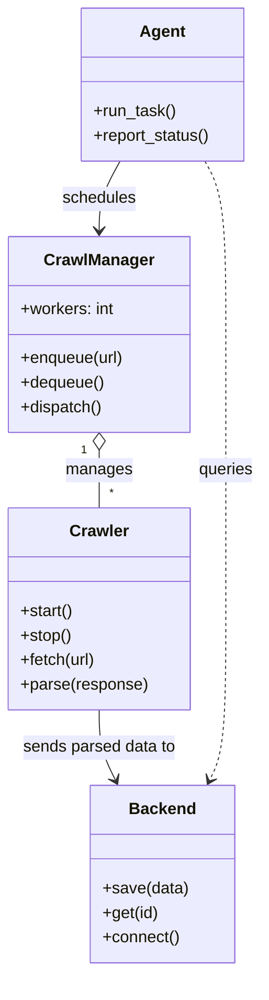
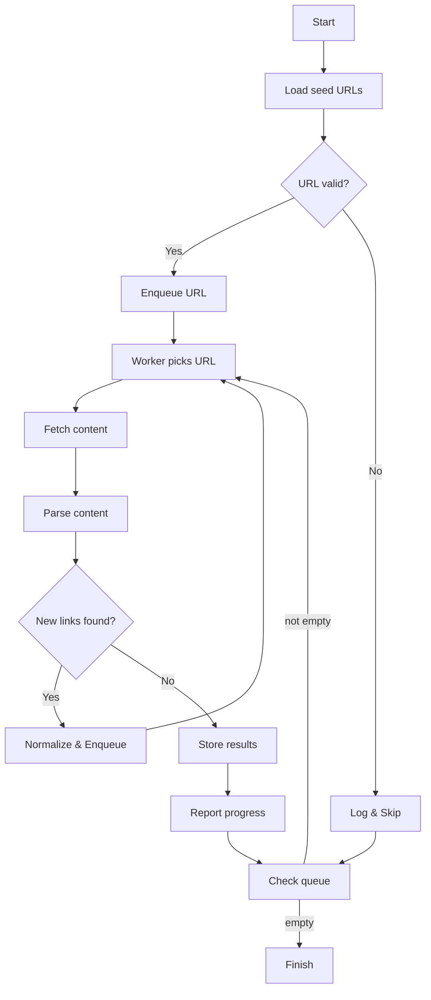

# Diagram: common/subscription_service/config/config.dev2.yml

> Auto-generated by Obscura crawlers

## Diagram 1

### SVG

<svg id="container" width="256.1015625" xmlns="http://www.w3.org/2000/svg" class="classDiagram" height="952" viewBox="0 0 256.1015625 952" role="graphics-document document" aria-roledescription="class"><g><defs><marker id="container_class-aggregationStart" class="marker aggregation class" refX="18" refY="7" markerWidth="190" markerHeight="240" orient="auto"><path d="M 18,7 L9,13 L1,7 L9,1 Z"></path></marker></defs><defs><marker id="container_class-aggregationEnd" class="marker aggregation class" refX="1" refY="7" markerWidth="20" markerHeight="28" orient="auto"><path d="M 18,7 L9,13 L1,7 L9,1 Z"></path></marker></defs><defs><marker id="container_class-extensionStart" class="marker extension class" refX="18" refY="7" markerWidth="190" markerHeight="240" orient="auto"><path d="M 1,7 L18,13 V 1 Z"></path></marker></defs><defs><marker id="container_class-extensionEnd" class="marker extension class" refX="1" refY="7" markerWidth="20" markerHeight="28" orient="auto"><path d="M 1,1 V 13 L18,7 Z"></path></marker></defs><defs><marker id="container_class-compositionStart" class="marker composition class" refX="18" refY="7" markerWidth="190" markerHeight="240" orient="auto"><path d="M 18,7 L9,13 L1,7 L9,1 Z"></path></marker></defs><defs><marker id="container_class-compositionEnd" class="marker composition class" refX="1" refY="7" markerWidth="20" markerHeight="28" orient="auto"><path d="M 18,7 L9,13 L1,7 L9,1 Z"></path></marker></defs><defs><marker id="container_class-dependencyStart" class="marker dependency class" refX="6" refY="7" markerWidth="190" markerHeight="240" orient="auto"><path d="M 5,7 L9,13 L1,7 L9,1 Z"></path></marker></defs><defs><marker id="container_class-dependencyEnd" class="marker dependency class" refX="13" refY="7" markerWidth="20" markerHeight="28" orient="auto"><path d="M 18,7 L9,13 L14,7 L9,1 Z"></path></marker></defs><defs><marker id="container_class-lollipopStart" class="marker lollipop class" refX="13" refY="7" markerWidth="190" markerHeight="240" orient="auto"><circle stroke="black" fill="transparent" cx="7" cy="7" r="6"></circle></marker></defs><defs><marker id="container_class-lollipopEnd" class="marker lollipop class" refX="1" refY="7" markerWidth="190" markerHeight="240" orient="auto"><circle stroke="black" fill="transparent" cx="7" cy="7" r="6"></circle></marker></defs><g class="root"><g class="clusters"></g><g class="edgePaths"><path d="M96.93,441.25L96.93,444.542C96.93,447.833,96.93,454.417,96.93,463.875C96.93,473.333,96.93,485.667,96.93,491.833L96.93,498" id="id_CrawlManager_Crawler_1" class="edge-thickness-normal edge-pattern-solid relation" style=";;;" data-edge="true" data-et="edge" data-id="id_CrawlManager_Crawler_1" data-points="W3sieCI6OTYuOTI5Njg3NSwieSI6NDI0fSx7IngiOjk2LjkyOTY4NzUsInkiOjQ2MX0seyJ4Ijo5Ni45Mjk2ODc1LCJ5Ijo0OTh9XQ==" marker-start="url(#container_class-aggregationStart)"></path><path d="M96.93,696L96.93,702.167C96.93,708.333,96.93,720.667,99.564,732.105C102.199,743.544,107.468,754.089,110.103,759.361L112.737,764.633" id="id_Crawler_Backend_2" class="edge-thickness-normal edge-pattern-solid relation" style=";;;" data-edge="true" data-et="edge" data-id="id_Crawler_Backend_2" data-points="W3sieCI6OTYuOTI5Njg3NSwieSI6Njk2fSx7IngiOjk2LjkyOTY4NzUsInkiOjczM30seyJ4IjoxMTUuNDE5MTk3MzI4NjI5MDIsInkiOjc3MH1d" marker-end="url(#container_class-dependencyEnd)"></path><path d="M117.4,158L113.988,164.167C110.577,170.333,103.753,182.667,100.341,194C96.93,205.333,96.93,215.667,96.93,220.833L96.93,226" id="id_Agent_CrawlManager_3" class="edge-thickness-normal edge-pattern-solid relation" style=";;;" data-edge="true" data-et="edge" data-id="id_Agent_CrawlManager_3" data-points="W3sieCI6MTE3LjQwMDIxNjIzODgzOTI4LCJ5IjoxNTh9LHsieCI6OTYuOTI5Njg3NSwieSI6MTk1fSx7IngiOjk2LjkyOTY4NzUsInkiOjIzMn1d" marker-end="url(#container_class-dependencyEnd)"></path><path d="M200.389,158L203.801,164.167C207.212,170.333,214.036,182.667,217.448,211C220.859,239.333,220.859,283.667,220.859,328C220.859,372.333,220.859,416.667,220.859,461.5C220.859,506.333,220.859,551.667,220.859,597C220.859,642.333,220.859,687.667,218.225,715.605C215.59,743.544,210.321,754.089,207.687,759.361L205.052,764.633" id="id_Agent_Backend_4" class="edge-thickness-normal edge-pattern-dashed relation" style=";;;" data-edge="true" data-et="edge" data-id="id_Agent_Backend_4" data-points="W3sieCI6MjAwLjM4ODg0NjI2MTE2MDcyLCJ5IjoxNTh9LHsieCI6MjIwLjg1OTM3NSwieSI6MTk1fSx7IngiOjIyMC44NTkzNzUsInkiOjMyOH0seyJ4IjoyMjAuODU5Mzc1LCJ5Ijo0NjF9LHsieCI6MjIwLjg1OTM3NSwieSI6NTk3fSx7IngiOjIyMC44NTkzNzUsInkiOjczM30seyJ4IjoyMDIuMzY5ODY1MTcxMzcwOTgsInkiOjc3MH1d" marker-end="url(#container_class-dependencyEnd)"></path></g><g class="edgeLabels"><g class="edgeLabel" transform="translate(96.9296875, 461)"><g class="label" data-id="id_CrawlManager_Crawler_1" transform="translate(-32.296875, -12)"><foreignObject width="64.59375" height="24">

manages

</foreignObject></g></g><g class="edgeLabel" transform="translate(96.9296875, 733)"><g class="label" data-id="id_Crawler_Backend_2" transform="translate(-76.296875, -12)"><foreignObject width="152.59375" height="24">

sends parsed data to

</foreignObject></g></g><g class="edgeLabel" transform="translate(96.9296875, 195)"><g class="label" data-id="id_Agent_CrawlManager_3" transform="translate(-36.453125, -12)"><foreignObject width="72.90625" height="24">

schedules

</foreignObject></g></g><g class="edgeLabel" transform="translate(220.859375, 461)"><g class="label" data-id="id_Agent_Backend_4" transform="translate(-27.2421875, -12)"><foreignObject width="54.484375" height="24">

queries

</foreignObject></g></g><g class="edgeTerminals" transform="translate(81.92968875000004, 441.5000010714286)"><g class="inner" transform="translate(0, 0)"><foreignObject style="width: 9px; height: 12px;">
1
</foreignObject></g></g><g class="edgeTerminals" transform="translate(106.92968874999995, 475.5000010714286)"><g class="inner" transform="translate(0, 0)"></g><foreignObject style="width: 9px; height: 12px;">
*
</foreignObject></g></g><g class="nodes"><g class="node default" id="classId-Crawler-0" transform="translate(96.9296875, 597)"><g class="basic label-container"><path d="M-88.2890625 -99 L88.2890625 -99 L88.2890625 99 L-88.2890625 99" stroke="none" stroke-width="0" fill="#ECECFF" style=""></path><path d="M-88.2890625 -99 C-28.162634476271386 -99, 31.96379354745723 -99, 88.2890625 -99 M-88.2890625 -99 C-27.68266230511844 -99, 32.92373788976312 -99, 88.2890625 -99 M88.2890625 -99 C88.2890625 -44.50266464883752, 88.2890625 9.994670702324953, 88.2890625 99 M88.2890625 -99 C88.2890625 -44.716046449430436, 88.2890625 9.567907101139127, 88.2890625 99 M88.2890625 99 C28.866297296936843 99, -30.556467906126315 99, -88.2890625 99 M88.2890625 99 C49.49135348133772 99, 10.693644462675437 99, -88.2890625 99 M-88.2890625 99 C-88.2890625 52.66814067048233, -88.2890625 6.336281340964661, -88.2890625 -99 M-88.2890625 99 C-88.2890625 23.005430664633977, -88.2890625 -52.989138670732046, -88.2890625 -99" stroke="#9370DB" stroke-width="1.3" fill="none" stroke-dasharray="0 0" style=""></path></g><g class="annotation-group text" transform="translate(0, -75)"></g><g class="label-group text" transform="translate(-27.734375, -75)"><g class="label" style="font-weight: bolder" transform="translate(0,-12)"><foreignObject width="55.46875" height="24">

Crawler

</foreignObject></g></g><g class="members-group text" transform="translate(-76.2890625, -27)"></g><g class="methods-group text" transform="translate(-76.2890625, 3)"><g class="label" style="" transform="translate(0,-12)"><foreignObject width="52.15625" height="24">

+start()

</foreignObject></g><g class="label" style="" transform="translate(0,12)"><foreignObject width="50.21875" height="24">

+stop()

</foreignObject></g><g class="label" style="" transform="translate(0,36)"><foreignObject width="74.78125" height="24">

+fetch(url)

</foreignObject></g><g class="label" style="" transform="translate(0,60)"><foreignObject width="124.84375" height="24">

+parse(response)

</foreignObject></g></g><g class="divider" style=""><path d="M-88.2890625 -51 C-42.46758929502951 -51, 3.3538839099409756 -51, 88.2890625 -51 M-88.2890625 -51 C-36.44924422395847 -51, 15.390574052083053 -51, 88.2890625 -51" stroke="#9370DB" stroke-width="1.3" fill="none" stroke-dasharray="0 0" style=""></path></g><g class="divider" style=""><path d="M-88.2890625 -27 C-37.4417346148232 -27, 13.405593270353606 -27, 88.2890625 -27 M-88.2890625 -27 C-39.397631753778285 -27, 9.49379899244343 -27, 88.2890625 -27" stroke="#9370DB" stroke-width="1.3" fill="none" stroke-dasharray="0 0" style=""></path></g></g><g class="node default" id="classId-CrawlManager-1" transform="translate(96.9296875, 328)"><g class="basic label-container"><path d="M-88.9296875 -96 L88.9296875 -96 L88.9296875 96 L-88.9296875 96" stroke="none" stroke-width="0" fill="#ECECFF" style=""></path><path d="M-88.9296875 -96 C-38.95845908969559 -96, 11.012769320608825 -96, 88.9296875 -96 M-88.9296875 -96 C-34.916961714637836 -96, 19.09576407072433 -96, 88.9296875 -96 M88.9296875 -96 C88.9296875 -56.2812849415335, 88.9296875 -16.562569883067, 88.9296875 96 M88.9296875 -96 C88.9296875 -32.39515270845207, 88.9296875 31.209694583095853, 88.9296875 96 M88.9296875 96 C22.28852721354494 96, -44.35263307291012 96, -88.9296875 96 M88.9296875 96 C25.659314245765202 96, -37.611059008469596 96, -88.9296875 96 M-88.9296875 96 C-88.9296875 30.316819493415352, -88.9296875 -35.366361013169296, -88.9296875 -96 M-88.9296875 96 C-88.9296875 28.057231072194227, -88.9296875 -39.885537855611545, -88.9296875 -96" stroke="#9370DB" stroke-width="1.3" fill="none" stroke-dasharray="0 0" style=""></path></g><g class="annotation-group text" transform="translate(0, -72)"></g><g class="label-group text" transform="translate(-51.59375, -72)"><g class="label" style="font-weight: bolder" transform="translate(0,-12)"><foreignObject width="103.1875" height="24">

CrawlManager

</foreignObject></g></g><g class="members-group text" transform="translate(-76.9296875, -24)"><g class="label" style="" transform="translate(0,-12)"><foreignObject width="92.90625" height="24">

+workers: int

</foreignObject></g></g><g class="methods-group text" transform="translate(-76.9296875, 24)"><g class="label" style="" transform="translate(0,-12)"><foreignObject width="102.265625" height="24">

+enqueue(url)

</foreignObject></g><g class="label" style="" transform="translate(0,12)"><foreignObject width="82.28125" height="24">

+dequeue()

</foreignObject></g><g class="label" style="" transform="translate(0,36)"><foreignObject width="80.515625" height="24">

+dispatch()

</foreignObject></g></g><g class="divider" style=""><path d="M-88.9296875 -48 C-42.72470401737343 -48, 3.4802794652531333 -48, 88.9296875 -48 M-88.9296875 -48 C-33.62943108096996 -48, 21.670825338060084 -48, 88.9296875 -48" stroke="#9370DB" stroke-width="1.3" fill="none" stroke-dasharray="0 0" style=""></path></g><g class="divider" style=""><path d="M-88.9296875 0 C-41.487648108214145 0, 5.954391283571709 0, 88.9296875 0 M-88.9296875 0 C-43.003532423306204 0, 2.9226226533875916 0, 88.9296875 0" stroke="#9370DB" stroke-width="1.3" fill="none" stroke-dasharray="0 0" style=""></path></g></g><g class="node default" id="classId-Backend-2" transform="translate(158.89453125, 857)"><g class="basic label-container"><path d="M-69.296875 -87 L69.296875 -87 L69.296875 87 L-69.296875 87" stroke="none" stroke-width="0" fill="#ECECFF" style=""></path><path d="M-69.296875 -87 C-25.203446645714806 -87, 18.88998170857039 -87, 69.296875 -87 M-69.296875 -87 C-17.05447252966141 -87, 35.18792994067718 -87, 69.296875 -87 M69.296875 -87 C69.296875 -38.813963987372674, 69.296875 9.372072025254653, 69.296875 87 M69.296875 -87 C69.296875 -20.028255424518406, 69.296875 46.94348915096319, 69.296875 87 M69.296875 87 C36.23244014987373 87, 3.1680052997474633 87, -69.296875 87 M69.296875 87 C21.968938955826808 87, -25.358997088346385 87, -69.296875 87 M-69.296875 87 C-69.296875 45.83500099159221, -69.296875 4.67000198318442, -69.296875 -87 M-69.296875 87 C-69.296875 24.115063031061986, -69.296875 -38.76987393787603, -69.296875 -87" stroke="#9370DB" stroke-width="1.3" fill="none" stroke-dasharray="0 0" style=""></path></g><g class="annotation-group text" transform="translate(0, -63)"></g><g class="label-group text" transform="translate(-31.296875, -63)"><g class="label" style="font-weight: bolder" transform="translate(0,-12)"><foreignObject width="62.59375" height="24">

Backend

</foreignObject></g></g><g class="members-group text" transform="translate(-57.296875, -15)"></g><g class="methods-group text" transform="translate(-57.296875, 15)"><g class="label" style="" transform="translate(0,-12)"><foreignObject width="83.296875" height="24">

+save(data)

</foreignObject></g><g class="label" style="" transform="translate(0,12)"><foreignObject width="55" height="24">

+get(id)

</foreignObject></g><g class="label" style="" transform="translate(0,36)"><foreignObject width="75.921875" height="24">

+connect()

</foreignObject></g></g><g class="divider" style=""><path d="M-69.296875 -39 C-20.879007779175986 -39, 27.53885944164803 -39, 69.296875 -39 M-69.296875 -39 C-39.60501739625734 -39, -9.913159792514676 -39, 69.296875 -39" stroke="#9370DB" stroke-width="1.3" fill="none" stroke-dasharray="0 0" style=""></path></g><g class="divider" style=""><path d="M-69.296875 -15 C-37.03646599922141 -15, -4.776056998442826 -15, 69.296875 -15 M-69.296875 -15 C-15.796688126101358 -15, 37.70349874779728 -15, 69.296875 -15" stroke="#9370DB" stroke-width="1.3" fill="none" stroke-dasharray="0 0" style=""></path></g></g><g class="node default" id="classId-Agent-3" transform="translate(158.89453125, 83)"><g class="basic label-container"><path d="M-80.6875 -75 L80.6875 -75 L80.6875 75 L-80.6875 75" stroke="none" stroke-width="0" fill="#ECECFF" style=""></path><path d="M-80.6875 -75 C-26.440025597468377 -75, 27.807448805063245 -75, 80.6875 -75 M-80.6875 -75 C-40.28531243156027 -75, 0.11687513687945739 -75, 80.6875 -75 M80.6875 -75 C80.6875 -31.906562998228296, 80.6875 11.186874003543409, 80.6875 75 M80.6875 -75 C80.6875 -24.604562237369414, 80.6875 25.79087552526117, 80.6875 75 M80.6875 75 C43.174007695794586 75, 5.660515391589172 75, -80.6875 75 M80.6875 75 C45.20403600938078 75, 9.720572018761558 75, -80.6875 75 M-80.6875 75 C-80.6875 26.61723873195931, -80.6875 -21.765522536081377, -80.6875 -75 M-80.6875 75 C-80.6875 25.265793257196634, -80.6875 -24.46841348560673, -80.6875 -75" stroke="#9370DB" stroke-width="1.3" fill="none" stroke-dasharray="0 0" style=""></path></g><g class="annotation-group text" transform="translate(0, -51)"></g><g class="label-group text" transform="translate(-21.078125, -51)"><g class="label" style="font-weight: bolder" transform="translate(0,-12)"><foreignObject width="42.15625" height="24">

Agent

</foreignObject></g></g><g class="members-group text" transform="translate(-68.6875, -3)"></g><g class="methods-group text" transform="translate(-68.6875, 27)"><g class="label" style="" transform="translate(0,-12)"><foreignObject width="81.09375" height="24">

+run_task()

</foreignObject></g><g class="label" style="" transform="translate(0,12)"><foreignObject width="116.296875" height="24">

+report_status()

</foreignObject></g></g><g class="divider" style=""><path d="M-80.6875 -27 C-26.335894416306417 -27, 28.015711167387167 -27, 80.6875 -27 M-80.6875 -27 C-19.093490095345572 -27, 42.500519809308855 -27, 80.6875 -27" stroke="#9370DB" stroke-width="1.3" fill="none" stroke-dasharray="0 0" style=""></path></g><g class="divider" style=""><path d="M-80.6875 -3 C-38.1102503975637 -3, 4.466999204872593 -3, 80.6875 -3 M-80.6875 -3 C-18.439943118549934 -3, 43.80761376290013 -3, 80.6875 -3" stroke="#9370DB" stroke-width="1.3" fill="none" stroke-dasharray="0 0" style=""></path></g></g></g></g></g></svg>

## Diagram 2

### SVG

<svg id="container" width="652.7109375" xmlns="http://www.w3.org/2000/svg" class="flowchart" height="1508.671875" viewBox="0 0 652.7109375 1508.671875" role="graphics-document document" aria-roledescription="flowchart-v2"><g><marker id="container_flowchart-v2-pointEnd" class="marker flowchart-v2" viewBox="0 0 10 10" refX="5" refY="5" markerUnits="userSpaceOnUse" markerWidth="8" markerHeight="8" orient="auto"><path d="M 0 0 L 10 5 L 0 10 z" class="arrowMarkerPath" style="stroke-width: 1; stroke-dasharray: 1, 0;"></path></marker><marker id="container_flowchart-v2-pointStart" class="marker flowchart-v2" viewBox="0 0 10 10" refX="4.5" refY="5" markerUnits="userSpaceOnUse" markerWidth="8" markerHeight="8" orient="auto"><path d="M 0 5 L 10 10 L 10 0 z" class="arrowMarkerPath" style="stroke-width: 1; stroke-dasharray: 1, 0;"></path></marker><marker id="container_flowchart-v2-circleEnd" class="marker flowchart-v2" viewBox="0 0 10 10" refX="11" refY="5" markerUnits="userSpaceOnUse" markerWidth="11" markerHeight="11" orient="auto"><circle cx="5" cy="5" r="5" class="arrowMarkerPath" style="stroke-width: 1; stroke-dasharray: 1, 0;"></circle></marker><marker id="container_flowchart-v2-circleStart" class="marker flowchart-v2" viewBox="0 0 10 10" refX="-1" refY="5" markerUnits="userSpaceOnUse" markerWidth="11" markerHeight="11" orient="auto"><circle cx="5" cy="5" r="5" class="arrowMarkerPath" style="stroke-width: 1; stroke-dasharray: 1, 0;"></circle></marker><marker id="container_flowchart-v2-crossEnd" class="marker cross flowchart-v2" viewBox="0 0 11 11" refX="12" refY="5.2" markerUnits="userSpaceOnUse" markerWidth="11" markerHeight="11" orient="auto"><path d="M 1,1 l 9,9 M 10,1 l -9,9" class="arrowMarkerPath" style="stroke-width: 2; stroke-dasharray: 1, 0;"></path></marker><marker id="container_flowchart-v2-crossStart" class="marker cross flowchart-v2" viewBox="0 0 11 11" refX="-1" refY="5.2" markerUnits="userSpaceOnUse" markerWidth="11" markerHeight="11" orient="auto"><path d="M 1,1 l 9,9 M 10,1 l -9,9" class="arrowMarkerPath" style="stroke-width: 2; stroke-dasharray: 1, 0;"></path></marker><g class="root"><g class="clusters"></g><g class="edgePaths"><path d="M496.414,62L496.414,66.167C496.414,70.333,496.414,78.667,496.414,86.333C496.414,94,496.414,101,496.414,104.5L496.414,108" id="L_A_B_0" class="edge-thickness-normal edge-pattern-solid edge-thickness-normal edge-pattern-solid flowchart-link" style=";" data-edge="true" data-et="edge" data-id="L_A_B_0" data-points="W3sieCI6NDk2LjQxNDA2MjUsInkiOjYyfSx7IngiOjQ5Ni40MTQwNjI1LCJ5Ijo4N30seyJ4Ijo0OTYuNDE0MDYyNSwieSI6MTEyfV0=" marker-end="url(#container_flowchart-v2-pointEnd)"></path><path d="M496.414,166L496.414,170.167C496.414,174.333,496.414,182.667,496.414,190.333C496.414,198,496.414,205,496.414,208.5L496.414,212" id="L_B_C_0" class="edge-thickness-normal edge-pattern-solid edge-thickness-normal edge-pattern-solid flowchart-link" style=";" data-edge="true" data-et="edge" data-id="L_B_C_0" data-points="W3sieCI6NDk2LjQxNDA2MjUsInkiOjE2Nn0seyJ4Ijo0OTYuNDE0MDYyNSwieSI6MTkxfSx7IngiOjQ5Ni40MTQwNjI1LCJ5IjoyMTZ9XQ==" marker-end="url(#container_flowchart-v2-pointEnd)"></path><path d="M451.728,300.079L420.84,313.694C389.953,327.308,328.177,354.537,297.29,373.651C266.402,392.766,266.402,403.766,266.402,409.266L266.402,414.766" id="L_C_D_0" class="edge-thickness-normal edge-pattern-solid edge-thickness-normal edge-pattern-solid flowchart-link" style=";" data-edge="true" data-et="edge" data-id="L_C_D_0" data-points="W3sieCI6NDUxLjcyNzc0NDYzODI0NzUsInkiOjMwMC4wNzkzMDcxMzgyNDc1fSx7IngiOjI2Ni40MDIzNDM3NSwieSI6MzgxLjc2NTYyNX0seyJ4IjoyNjYuNDAyMzQzNzUsInkiOjQxOC43NjU2MjV9XQ==" marker-end="url(#container_flowchart-v2-pointEnd)"></path><path d="M524.838,316.341L533.458,327.245C542.077,338.149,559.316,359.958,567.935,381.528C576.555,403.099,576.555,424.432,576.555,443.766C576.555,463.099,576.555,480.432,576.555,497.766C576.555,515.099,576.555,532.432,576.555,549.766C576.555,567.099,576.555,584.432,576.555,601.766C576.555,619.099,576.555,636.432,576.555,655.766C576.555,675.099,576.555,696.432,576.555,717.766C576.555,739.099,576.555,760.432,576.555,779.766C576.555,799.099,576.555,816.432,576.555,844.091C576.555,871.75,576.555,909.734,576.555,949.719C576.555,989.703,576.555,1031.688,576.555,1063.346C576.555,1095.005,576.555,1116.339,576.555,1135.672C576.555,1155.005,576.555,1172.339,576.555,1184.505C576.555,1196.672,576.555,1203.672,576.555,1207.172L576.555,1210.672" id="L_C_E_0" class="edge-thickness-normal edge-pattern-solid edge-thickness-normal edge-pattern-solid flowchart-link" style=";" data-edge="true" data-et="edge" data-id="L_C_E_0" data-points="W3sieCI6NTI0LjgzODM3NDU1NjE2NTMsInkiOjMxNi4zNDEzMTI5NDM4MzQ3NH0seyJ4Ijo1NzYuNTU0Njg3NSwieSI6MzgxLjc2NTYyNX0seyJ4Ijo1NzYuNTU0Njg3NSwieSI6NDQ1Ljc2NTYyNX0seyJ4Ijo1NzYuNTU0Njg3NSwieSI6NDk3Ljc2NTYyNX0seyJ4Ijo1NzYuNTU0Njg3NSwieSI6NTQ5Ljc2NTYyNX0seyJ4Ijo1NzYuNTU0Njg3NSwieSI6NjAxLjc2NTYyNX0seyJ4Ijo1NzYuNTU0Njg3NSwieSI6NjUzLjc2NTYyNX0seyJ4Ijo1NzYuNTU0Njg3NSwieSI6NzE3Ljc2NTYyNX0seyJ4Ijo1NzYuNTU0Njg3NSwieSI6NzgxLjc2NTYyNX0seyJ4Ijo1NzYuNTU0Njg3NSwieSI6ODMzLjc2NTYyNX0seyJ4Ijo1NzYuNTU0Njg3NSwieSI6OTQ3LjcxODc1fSx7IngiOjU3Ni41NTQ2ODc1LCJ5IjoxMDczLjY3MTg3NX0seyJ4Ijo1NzYuNTU0Njg3NSwieSI6MTEzNy42NzE4NzV9LHsieCI6NTc2LjU1NDY4NzUsInkiOjExODkuNjcxODc1fSx7IngiOjU3Ni41NTQ2ODc1LCJ5IjoxMjE0LjY3MTg3NX1d" marker-end="url(#container_flowchart-v2-pointEnd)"></path><path d="M266.402,472.766L266.402,476.932C266.402,481.099,266.402,489.432,266.402,497.099C266.402,504.766,266.402,511.766,266.402,515.266L266.402,518.766" id="L_D_F_0" class="edge-thickness-normal edge-pattern-solid edge-thickness-normal edge-pattern-solid flowchart-link" style=";" data-edge="true" data-et="edge" data-id="L_D_F_0" data-points="W3sieCI6MjY2LjQwMjM0Mzc1LCJ5Ijo0NzIuNzY1NjI1fSx7IngiOjI2Ni40MDIzNDM3NSwieSI6NDk3Ljc2NTYyNX0seyJ4IjoyNjYuNDAyMzQzNzUsInkiOjUyMi43NjU2MjV9XQ==" marker-end="url(#container_flowchart-v2-pointEnd)"></path><path d="M188.585,576.766L176.576,580.932C164.567,585.099,140.549,593.432,128.54,601.099C116.531,608.766,116.531,615.766,116.531,619.266L116.531,622.766" id="L_F_G_0" class="edge-thickness-normal edge-pattern-solid edge-thickness-normal edge-pattern-solid flowchart-link" style=";" data-edge="true" data-et="edge" data-id="L_F_G_0" data-points="W3sieCI6MTg4LjU4NDY2MDQ1NjczMDc3LCJ5Ijo1NzYuNzY1NjI1fSx7IngiOjExNi41MzEyNSwieSI6NjAxLjc2NTYyNX0seyJ4IjoxMTYuNTMxMjUsInkiOjYyNi43NjU2MjV9XQ==" marker-end="url(#container_flowchart-v2-pointEnd)"></path><path d="M116.531,680.766L116.531,686.932C116.531,693.099,116.531,705.432,116.531,717.099C116.531,728.766,116.531,739.766,116.531,745.266L116.531,750.766" id="L_G_H_0" class="edge-thickness-normal edge-pattern-solid edge-thickness-normal edge-pattern-solid flowchart-link" style=";" data-edge="true" data-et="edge" data-id="L_G_H_0" data-points="W3sieCI6MTE2LjUzMTI1LCJ5Ijo2ODAuNzY1NjI1fSx7IngiOjExNi41MzEyNSwieSI6NzE3Ljc2NTYyNX0seyJ4IjoxMTYuNTMxMjUsInkiOjc1NC43NjU2MjV9XQ==" marker-end="url(#container_flowchart-v2-pointEnd)"></path><path d="M116.531,808.766L116.531,812.932C116.531,817.099,116.531,825.432,116.531,833.099C116.531,840.766,116.531,847.766,116.531,851.266L116.531,854.766" id="L_H_I_0" class="edge-thickness-normal edge-pattern-solid edge-thickness-normal edge-pattern-solid flowchart-link" style=";" data-edge="true" data-et="edge" data-id="L_H_I_0" data-points="W3sieCI6MTE2LjUzMTI1LCJ5Ijo4MDguNzY1NjI1fSx7IngiOjExNi41MzEyNSwieSI6ODMzLjc2NTYyNX0seyJ4IjoxMTYuNTMxMjUsInkiOjg1OC43NjU2MjV9XQ==" marker-end="url(#container_flowchart-v2-pointEnd)"></path><path d="M94.478,1014.619L91.234,1024.461C87.989,1034.303,81.501,1053.988,81.894,1069.437C82.287,1084.887,89.563,1096.101,93.2,1101.709L96.838,1107.316" id="L_I_J_0" class="edge-thickness-normal edge-pattern-solid edge-thickness-normal edge-pattern-solid flowchart-link" style=";" data-edge="true" data-et="edge" data-id="L_I_J_0" data-points="W3sieCI6OTQuNDc4MTQ1MTE3NTU2NTEsInkiOjEwMTQuNjE4NzcwMTE3NTU2Nn0seyJ4Ijo3NS4wMTE3MTg3NSwieSI6MTA3My42NzE4NzV9LHsieCI6OTkuMDE1MTk3NzUzOTA2MjUsInkiOjExMTAuNjcxODc1fV0=" marker-end="url(#container_flowchart-v2-pointEnd)"></path><path d="M170.326,982.877L193.479,998.01C216.633,1013.142,262.939,1043.407,289.73,1064.147C316.522,1084.887,323.797,1096.101,327.435,1101.709L331.073,1107.316" id="L_I_K_0" class="edge-thickness-normal edge-pattern-solid edge-thickness-normal edge-pattern-solid flowchart-link" style=";" data-edge="true" data-et="edge" data-id="L_I_K_0" data-points="W3sieCI6MTcwLjMyNTc2MTExMDM5NjA2LCJ5Ijo5ODIuODc3MzYzODg5NjA0fSx7IngiOjMwOS4yNDYwOTM3NSwieSI6MTA3My42NzE4NzV9LHsieCI6MzMzLjI0OTU3Mjc1MzkwNjI1LCJ5IjoxMTEwLjY3MTg3NX1d" marker-end="url(#container_flowchart-v2-pointEnd)"></path><path d="M225.063,1113.507L254.882,1106.868C284.701,1100.229,344.339,1086.95,374.158,1059.319C403.977,1031.688,403.977,989.703,403.977,949.719C403.977,909.734,403.977,871.75,403.977,844.091C403.977,816.432,403.977,799.099,403.977,779.766C403.977,760.432,403.977,739.099,403.977,717.766C403.977,696.432,403.977,675.099,403.977,655.766C403.977,636.432,403.977,619.099,393.577,606.501C383.177,593.904,362.377,586.042,351.977,582.111L341.577,578.18" id="L_J_F_0" class="edge-thickness-normal edge-pattern-solid edge-thickness-normal edge-pattern-solid flowchart-link" style=";" data-edge="true" data-et="edge" data-id="L_J_F_0" data-points="W3sieCI6MjI1LjA2MjUsInkiOjExMTMuNTA3Mjc4NDczNDg2OH0seyJ4Ijo0MDMuOTc2NTYyNSwieSI6MTA3My42NzE4NzV9LHsieCI6NDAzLjk3NjU2MjUsInkiOjk0Ny43MTg3NX0seyJ4Ijo0MDMuOTc2NTYyNSwieSI6ODMzLjc2NTYyNX0seyJ4Ijo0MDMuOTc2NTYyNSwieSI6NzgxLjc2NTYyNX0seyJ4Ijo0MDMuOTc2NTYyNSwieSI6NzE3Ljc2NTYyNX0seyJ4Ijo0MDMuOTc2NTYyNSwieSI6NjUzLjc2NTYyNX0seyJ4Ijo0MDMuOTc2NTYyNSwieSI6NjAxLjc2NTYyNX0seyJ4IjozMzcuODM1MTExMTc3ODg0NjQsInkiOjU3Ni43NjU2MjV9XQ==" marker-end="url(#container_flowchart-v2-pointEnd)"></path><path d="M350.766,1164.672L350.766,1168.839C350.766,1173.005,350.766,1181.339,350.766,1189.005C350.766,1196.672,350.766,1203.672,350.766,1207.172L350.766,1210.672" id="L_K_L_0" class="edge-thickness-normal edge-pattern-solid edge-thickness-normal edge-pattern-solid flowchart-link" style=";" data-edge="true" data-et="edge" data-id="L_K_L_0" data-points="W3sieCI6MzUwLjc2NTYyNSwieSI6MTE2NC42NzE4NzV9LHsieCI6MzUwLjc2NTYyNSwieSI6MTE4OS42NzE4NzV9LHsieCI6MzUwLjc2NTYyNSwieSI6MTIxNC42NzE4NzV9XQ==" marker-end="url(#container_flowchart-v2-pointEnd)"></path><path d="M350.766,1268.672L350.766,1272.839C350.766,1277.005,350.766,1285.339,359.004,1293.388C367.242,1301.437,383.718,1309.202,391.955,1313.084L400.193,1316.967" id="L_L_M_0" class="edge-thickness-normal edge-pattern-solid edge-thickness-normal edge-pattern-solid flowchart-link" style=";" data-edge="true" data-et="edge" data-id="L_L_M_0" data-points="W3sieCI6MzUwLjc2NTYyNSwieSI6MTI2OC42NzE4NzV9LHsieCI6MzUwLjc2NTYyNSwieSI6MTI5My42NzE4NzV9LHsieCI6NDAzLjgxMTc0ODc5ODA3NjksInkiOjEzMTguNjcxODc1fV0=" marker-end="url(#container_flowchart-v2-pointEnd)"></path><path d="M467.486,1318.672L468.472,1314.505C469.457,1310.339,471.428,1302.005,472.413,1289.172C473.398,1276.339,473.398,1259.005,473.398,1241.672C473.398,1224.339,473.398,1207.005,473.398,1189.672C473.398,1172.339,473.398,1155.005,473.398,1135.672C473.398,1116.339,473.398,1095.005,473.398,1063.346C473.398,1031.688,473.398,989.703,473.398,949.719C473.398,909.734,473.398,871.75,473.398,844.091C473.398,816.432,473.398,799.099,473.398,779.766C473.398,760.432,473.398,739.099,473.398,717.766C473.398,696.432,473.398,675.099,473.398,655.766C473.398,636.432,473.398,619.099,455.004,605.811C436.61,592.524,399.821,583.282,381.426,578.661L363.032,574.04" id="L_M_F_0" class="edge-thickness-normal edge-pattern-solid edge-thickness-normal edge-pattern-solid flowchart-link" style=";" data-edge="true" data-et="edge" data-id="L_M_F_0" data-points="W3sieCI6NDY3LjQ4NjQ3ODM2NTM4NDY0LCJ5IjoxMzE4LjY3MTg3NX0seyJ4Ijo0NzMuMzk4NDM3NSwieSI6MTI5My42NzE4NzV9LHsieCI6NDczLjM5ODQzNzUsInkiOjEyNDEuNjcxODc1fSx7IngiOjQ3My4zOTg0Mzc1LCJ5IjoxMTg5LjY3MTg3NX0seyJ4Ijo0NzMuMzk4NDM3NSwieSI6MTEzNy42NzE4NzV9LHsieCI6NDczLjM5ODQzNzUsInkiOjEwNzMuNjcxODc1fSx7IngiOjQ3My4zOTg0Mzc1LCJ5Ijo5NDcuNzE4NzV9LHsieCI6NDczLjM5ODQzNzUsInkiOjgzMy43NjU2MjV9LHsieCI6NDczLjM5ODQzNzUsInkiOjc4MS43NjU2MjV9LHsieCI6NDczLjM5ODQzNzUsInkiOjcxNy43NjU2MjV9LHsieCI6NDczLjM5ODQzNzUsInkiOjY1My43NjU2MjV9LHsieCI6NDczLjM5ODQzNzUsInkiOjYwMS43NjU2MjV9LHsieCI6MzU5LjE1MjM0Mzc1LCJ5Ijo1NzMuMDY1NTgxNTk2NDAzMX1d" marker-end="url(#container_flowchart-v2-pointEnd)"></path><path d="M461.102,1372.672L461.102,1378.839C461.102,1385.005,461.102,1397.339,461.102,1409.005C461.102,1420.672,461.102,1431.672,461.102,1437.172L461.102,1442.672" id="L_M_N_0" class="edge-thickness-normal edge-pattern-solid edge-thickness-normal edge-pattern-solid flowchart-link" style=";" data-edge="true" data-et="edge" data-id="L_M_N_0" data-points="W3sieCI6NDYxLjEwMTU2MjUsInkiOjEzNzIuNjcxODc1fSx7IngiOjQ2MS4xMDE1NjI1LCJ5IjoxNDA5LjY3MTg3NX0seyJ4Ijo0NjEuMTAxNTYyNSwieSI6MTQ0Ni42NzE4NzV9XQ==" marker-end="url(#container_flowchart-v2-pointEnd)"></path><path d="M576.555,1268.672L576.555,1272.839C576.555,1277.005,576.555,1285.339,567.911,1293.398C559.268,1301.458,541.982,1309.243,533.339,1313.136L524.696,1317.029" id="L_E_M_0" class="edge-thickness-normal edge-pattern-solid edge-thickness-normal edge-pattern-solid flowchart-link" style=";" data-edge="true" data-et="edge" data-id="L_E_M_0" data-points="W3sieCI6NTc2LjU1NDY4NzUsInkiOjEyNjguNjcxODc1fSx7IngiOjU3Ni41NTQ2ODc1LCJ5IjoxMjkzLjY3MTg3NX0seyJ4Ijo1MjEuMDQ4Mzc3NDAzODQ2MiwieSI6MTMxOC42NzE4NzV9XQ==" marker-end="url(#container_flowchart-v2-pointEnd)"></path></g><g class="edgeLabels"><g class="edgeLabel"><g class="label" data-id="L_A_B_0" transform="translate(0, 0)"><foreignObject width="0" height="0">

</foreignObject></g></g><g class="edgeLabel"><g class="label" data-id="L_B_C_0" transform="translate(0, 0)"><foreignObject width="0" height="0">

</foreignObject></g></g><g class="edgeLabel" transform="translate(266.40234375, 381.765625)"><g class="label" data-id="L_C_D_0" transform="translate(-12.03125, -12)"><foreignObject width="24.0625" height="24">

Yes

</foreignObject></g></g><g class="edgeLabel" transform="translate(576.5546875, 717.765625)"><g class="label" data-id="L_C_E_0" transform="translate(-10.140625, -12)"><foreignObject width="20.28125" height="24">

No

</foreignObject></g></g><g class="edgeLabel"><g class="label" data-id="L_D_F_0" transform="translate(0, 0)"><foreignObject width="0" height="0">

</foreignObject></g></g><g class="edgeLabel"><g class="label" data-id="L_F_G_0" transform="translate(0, 0)"><foreignObject width="0" height="0">

</foreignObject></g></g><g class="edgeLabel"><g class="label" data-id="L_G_H_0" transform="translate(0, 0)"><foreignObject width="0" height="0">

</foreignObject></g></g><g class="edgeLabel"><g class="label" data-id="L_H_I_0" transform="translate(0, 0)"><foreignObject width="0" height="0">

</foreignObject></g></g><g class="edgeLabel" transform="translate(77.84107, 1065.08878)"><g class="label" data-id="L_I_J_0" transform="translate(-12.03125, -12)"><foreignObject width="24.0625" height="24">

Yes

</foreignObject></g></g><g class="edgeLabel" transform="translate(258.24511, 1040.33904)"><g class="label" data-id="L_I_K_0" transform="translate(-10.140625, -12)"><foreignObject width="20.28125" height="24">

No

</foreignObject></g></g><g class="edgeLabel"><g class="label" data-id="L_J_F_0" transform="translate(0, 0)"><foreignObject width="0" height="0">

</foreignObject></g></g><g class="edgeLabel"><g class="label" data-id="L_K_L_0" transform="translate(0, 0)"><foreignObject width="0" height="0">

</foreignObject></g></g><g class="edgeLabel"><g class="label" data-id="L_L_M_0" transform="translate(0, 0)"><foreignObject width="0" height="0">

</foreignObject></g></g><g class="edgeLabel" transform="translate(473.3984375, 947.71875)"><g class="label" data-id="L_M_F_0" transform="translate(-37.125, -12)"><foreignObject width="74.25" height="24">

not empty

</foreignObject></g></g><g class="edgeLabel" transform="translate(461.1015625, 1409.671875)"><g class="label" data-id="L_M_N_0" transform="translate(-22.7578125, -12)"><foreignObject width="45.515625" height="24">

empty

</foreignObject></g></g><g class="edgeLabel"><g class="label" data-id="L_E_M_0" transform="translate(0, 0)"><foreignObject width="0" height="0">

</foreignObject></g></g></g><g class="nodes"><g class="node default" id="flowchart-A-0" transform="translate(496.4140625, 35)"><rect class="basic label-container" style="" x="-47.5234375" y="-27" width="95.046875" height="54"></rect><g class="label" style="" transform="translate(-17.5234375, -12)"><rect></rect><foreignObject width="35.046875" height="24">

Start

</foreignObject></g></g><g class="node default" id="flowchart-B-1" transform="translate(496.4140625, 139)"><rect class="basic label-container" style="" x="-86.734375" y="-27" width="173.46875" height="54"></rect><g class="label" style="" transform="translate(-56.734375, -12)"><rect></rect><foreignObject width="113.46875" height="24">

Load seed URLs

</foreignObject></g></g><g class="node default" id="flowchart-C-3" transform="translate(496.4140625, 280.3828125)"><polygon points="64.3828125,0 128.765625,-64.3828125 64.3828125,-128.765625 0,-64.3828125" class="label-container" transform="translate(-63.8828125, 64.3828125)"></polygon><g class="label" style="" transform="translate(-37.3828125, -12)"><rect></rect><foreignObject width="74.765625" height="24">

URL valid?

</foreignObject></g></g><g class="node default" id="flowchart-D-5" transform="translate(266.40234375, 445.765625)"><rect class="basic label-container" style="" x="-77.9453125" y="-27" width="155.890625" height="54"></rect><g class="label" style="" transform="translate(-47.9453125, -12)"><rect></rect><foreignObject width="95.890625" height="24">

Enqueue URL

</foreignObject></g></g><g class="node default" id="flowchart-E-7" transform="translate(576.5546875, 1241.671875)"><rect class="basic label-container" style="" x="-68.15625" y="-27" width="136.3125" height="54"></rect><g class="label" style="" transform="translate(-38.15625, -12)"><rect></rect><foreignObject width="76.3125" height="24">

Log &amp; Skip

</foreignObject></g></g><g class="node default" id="flowchart-F-9" transform="translate(266.40234375, 549.765625)"><rect class="basic label-container" style="" x="-92.75" y="-27" width="185.5" height="54"></rect><g class="label" style="" transform="translate(-62.75, -12)"><rect></rect><foreignObject width="125.5" height="24">

Worker picks URL

</foreignObject></g></g><g class="node default" id="flowchart-G-11" transform="translate(116.53125, 653.765625)"><rect class="basic label-container" style="" x="-79.140625" y="-27" width="158.28125" height="54"></rect><g class="label" style="" transform="translate(-49.140625, -12)"><rect></rect><foreignObject width="98.28125" height="24">

Fetch content

</foreignObject></g></g><g class="node default" id="flowchart-H-13" transform="translate(116.53125, 781.765625)"><rect class="basic label-container" style="" x="-79.4765625" y="-27" width="158.953125" height="54"></rect><g class="label" style="" transform="translate(-49.4765625, -12)"><rect></rect><foreignObject width="98.953125" height="24">

Parse content

</foreignObject></g></g><g class="node default" id="flowchart-I-15" transform="translate(116.53125, 947.71875)"><polygon points="88.953125,0 177.90625,-88.953125 88.953125,-177.90625 0,-88.953125" class="label-container" transform="translate(-88.453125, 88.953125)"></polygon><g class="label" style="" transform="translate(-61.953125, -12)"><rect></rect><foreignObject width="123.90625" height="24">

New links found?

</foreignObject></g></g><g class="node default" id="flowchart-J-17" transform="translate(116.53125, 1137.671875)"><rect class="basic label-container" style="" x="-108.53125" y="-27" width="217.0625" height="54"></rect><g class="label" style="" transform="translate(-78.53125, -12)"><rect></rect><foreignObject width="157.0625" height="24">

Normalize &amp; Enqueue

</foreignObject></g></g><g class="node default" id="flowchart-K-19" transform="translate(350.765625, 1137.671875)"><rect class="basic label-container" style="" x="-75.703125" y="-27" width="151.40625" height="54"></rect><g class="label" style="" transform="translate(-45.703125, -12)"><rect></rect><foreignObject width="91.40625" height="24">

Store results

</foreignObject></g></g><g class="node default" id="flowchart-L-23" transform="translate(350.765625, 1241.671875)"><rect class="basic label-container" style="" x="-87.6328125" y="-27" width="175.265625" height="54"></rect><g class="label" style="" transform="translate(-57.6328125, -12)"><rect></rect><foreignObject width="115.265625" height="24">

Report progress

</foreignObject></g></g><g class="node default" id="flowchart-M-25" transform="translate(461.1015625, 1345.671875)"><rect class="basic label-container" style="" x="-76.3046875" y="-27" width="152.609375" height="54"></rect><g class="label" style="" transform="translate(-46.3046875, -12)"><rect></rect><foreignObject width="92.609375" height="24">

Check queue

</foreignObject></g></g><g class="node default" id="flowchart-N-29" transform="translate(461.1015625, 1473.671875)"><rect class="basic label-container" style="" x="-51.2734375" y="-27" width="102.546875" height="54"></rect><g class="label" style="" transform="translate(-21.2734375, -12)"><rect></rect><foreignObject width="42.546875" height="24">

Finish

</foreignObject></g></g></g></g></g></svg>
