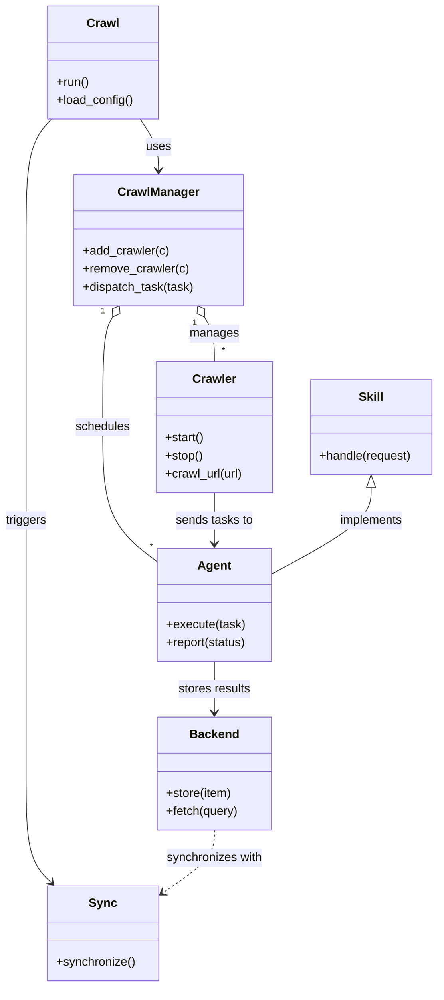

# Diagram: common/subscription_service/config/config.qa.yml

> Auto-generated by Obscura crawlers

## Mermaid

### SVG

<svg id="container" width="587.11328125" xmlns="http://www.w3.org/2000/svg" class="classDiagram" height="1310" viewBox="0 0 587.11328125 1310" role="graphics-document document" aria-roledescription="class"><g><defs><marker id="container_class-aggregationStart" class="marker aggregation class" refX="18" refY="7" markerWidth="190" markerHeight="240" orient="auto"><path d="M 18,7 L9,13 L1,7 L9,1 Z"></path></marker></defs><defs><marker id="container_class-aggregationEnd" class="marker aggregation class" refX="1" refY="7" markerWidth="20" markerHeight="28" orient="auto"><path d="M 18,7 L9,13 L1,7 L9,1 Z"></path></marker></defs><defs><marker id="container_class-extensionStart" class="marker extension class" refX="18" refY="7" markerWidth="190" markerHeight="240" orient="auto"><path d="M 1,7 L18,13 V 1 Z"></path></marker></defs><defs><marker id="container_class-extensionEnd" class="marker extension class" refX="1" refY="7" markerWidth="20" markerHeight="28" orient="auto"><path d="M 1,1 V 13 L18,7 Z"></path></marker></defs><defs><marker id="container_class-compositionStart" class="marker composition class" refX="18" refY="7" markerWidth="190" markerHeight="240" orient="auto"><path d="M 18,7 L9,13 L1,7 L9,1 Z"></path></marker></defs><defs><marker id="container_class-compositionEnd" class="marker composition class" refX="1" refY="7" markerWidth="20" markerHeight="28" orient="auto"><path d="M 18,7 L9,13 L1,7 L9,1 Z"></path></marker></defs><defs><marker id="container_class-dependencyStart" class="marker dependency class" refX="6" refY="7" markerWidth="190" markerHeight="240" orient="auto"><path d="M 5,7 L9,13 L1,7 L9,1 Z"></path></marker></defs><defs><marker id="container_class-dependencyEnd" class="marker dependency class" refX="13" refY="7" markerWidth="20" markerHeight="28" orient="auto"><path d="M 18,7 L9,13 L14,7 L9,1 Z"></path></marker></defs><defs><marker id="container_class-lollipopStart" class="marker lollipop class" refX="13" refY="7" markerWidth="190" markerHeight="240" orient="auto"><circle stroke="black" fill="transparent" cx="7" cy="7" r="6"></circle></marker></defs><defs><marker id="container_class-lollipopEnd" class="marker lollipop class" refX="1" refY="7" markerWidth="190" markerHeight="240" orient="auto"><circle stroke="black" fill="transparent" cx="7" cy="7" r="6"></circle></marker></defs><g class="root"><g class="clusters"></g><g class="edgePaths"><path d="M273.467,420.768L275.703,424.473C277.94,428.179,282.413,435.589,284.65,445.461C286.887,455.333,286.887,467.667,286.887,473.833L286.887,480" id="id_CrawlManager_Crawler_1" class="edge-thickness-normal edge-pattern-solid relation" style=";;;" data-edge="true" data-et="edge" data-id="id_CrawlManager_Crawler_1" data-points="W3sieCI6MjY0LjU1MTk3ODMyNjYxMjksInkiOjQwNn0seyJ4IjoyODYuODg2NzE4NzUsInkiOjQ0M30seyJ4IjoyODYuODg2NzE4NzUsInkiOjQ4MH1d" marker-start="url(#container_class-aggregationStart)"></path><path d="M150.604,420.768L148.367,424.473C146.13,428.179,141.657,435.589,139.42,459.961C137.184,484.333,137.184,525.667,137.184,567C137.184,608.333,137.184,649.667,149.38,679.458C161.577,709.25,185.97,727.499,198.167,736.624L210.363,745.749" id="id_CrawlManager_Agent_2" class="edge-thickness-normal edge-pattern-solid relation" style=";;;" data-edge="true" data-et="edge" data-id="id_CrawlManager_Agent_2" data-points="W3sieCI6MTU5LjUxODMzNDE3MzM4NzEsInkiOjQwNn0seyJ4IjoxMzcuMTgzNTkzNzUsInkiOjQ0M30seyJ4IjoxMzcuMTgzNTkzNzUsInkiOjU2N30seyJ4IjoxMzcuMTgzNTkzNzUsInkiOjY5MX0seyJ4IjoyMTAuMzYzMjgxMjUsInkiOjc0NS43NDkxOTExMDc0MDAxfV0=" marker-start="url(#container_class-aggregationStart)"></path><path d="M286.887,878L286.887,884.167C286.887,890.333,286.887,902.667,286.887,914C286.887,925.333,286.887,935.667,286.887,940.833L286.887,946" id="id_Agent_Backend_3" class="edge-thickness-normal edge-pattern-solid relation" style=";;;" data-edge="true" data-et="edge" data-id="id_Agent_Backend_3" data-points="W3sieCI6Mjg2Ljg4NjcxODc1LCJ5Ijo4Nzh9LHsieCI6Mjg2Ljg4NjcxODc1LCJ5Ijo5MTV9LHsieCI6Mjg2Ljg4NjcxODc1LCJ5Ijo5NTJ9XQ==" marker-end="url(#container_class-dependencyEnd)"></path><path d="M286.887,654L286.887,660.167C286.887,666.333,286.887,678.667,286.887,690C286.887,701.333,286.887,711.667,286.887,716.833L286.887,722" id="id_Crawler_Agent_4" class="edge-thickness-normal edge-pattern-solid relation" style=";;;" data-edge="true" data-et="edge" data-id="id_Crawler_Agent_4" data-points="W3sieCI6Mjg2Ljg4NjcxODc1LCJ5Ijo2NTR9LHsieCI6Mjg2Ljg4NjcxODc1LCJ5Ijo2OTF9LHsieCI6Mjg2Ljg4NjcxODc1LCJ5Ijo3Mjh9XQ==" marker-end="url(#container_class-dependencyEnd)"></path><path d="M187.766,158L191.81,164.167C195.855,170.333,203.945,182.667,207.99,194C212.035,205.333,212.035,215.667,212.035,220.833L212.035,226" id="id_Crawl_CrawlManager_5" class="edge-thickness-normal edge-pattern-solid relation" style=";;;" data-edge="true" data-et="edge" data-id="id_Crawl_CrawlManager_5" data-points="W3sieCI6MTg3Ljc2NTUyMDM2ODMwMzU2LCJ5IjoxNTh9LHsieCI6MjEyLjAzNTE1NjI1LCJ5IjoxOTV9LHsieCI6MjEyLjAzNTE1NjI1LCJ5IjoyMzJ9XQ==" marker-end="url(#container_class-dependencyEnd)"></path><path d="M69.545,158L63.869,164.167C58.194,170.333,46.843,182.667,41.168,209.5C35.492,236.333,35.492,277.667,35.492,319C35.492,360.333,35.492,401.667,35.492,443C35.492,484.333,35.492,525.667,35.492,567C35.492,608.333,35.492,649.667,35.492,689C35.492,728.333,35.492,765.667,35.492,803C35.492,840.333,35.492,877.667,35.492,915C35.492,952.333,35.492,989.667,35.492,1027C35.492,1064.333,35.492,1101.667,41.131,1125.804C46.77,1149.941,58.047,1160.881,63.686,1166.352L69.325,1171.822" id="id_Crawl_Sync_6" class="edge-thickness-normal edge-pattern-solid relation" style=";;;" data-edge="true" data-et="edge" data-id="id_Crawl_Sync_6" data-points="W3sieCI6NjkuNTQ0NzgyMzY2MDcxNDMsInkiOjE1OH0seyJ4IjozNS40OTIxODc1LCJ5IjoxOTV9LHsieCI6MzUuNDkyMTg3NSwieSI6MzE5fSx7IngiOjM1LjQ5MjE4NzUsInkiOjQ0M30seyJ4IjozNS40OTIxODc1LCJ5Ijo1Njd9LHsieCI6MzUuNDkyMTg3NSwieSI6NjkxfSx7IngiOjM1LjQ5MjE4NzUsInkiOjgwM30seyJ4IjozNS40OTIxODc1LCJ5Ijo5MTV9LHsieCI6MzUuNDkyMTg3NSwieSI6MTAyN30seyJ4IjozNS40OTIxODc1LCJ5IjoxMTM5fSx7IngiOjczLjYzMTA5Mzc1LCJ5IjoxMTc2fV0=" marker-end="url(#container_class-dependencyEnd)"></path><path d="M497.125,647.25L497.125,654.542C497.125,661.833,497.125,676.417,474.839,695.581C452.553,714.745,407.982,738.489,385.696,750.361L363.41,762.234" id="id_Skill_Agent_7" class="edge-thickness-normal edge-pattern-solid relation" style=";;;" data-edge="true" data-et="edge" data-id="id_Skill_Agent_7" data-points="W3sieCI6NDk3LjEyNSwieSI6NjMwfSx7IngiOjQ5Ny4xMjUsInkiOjY5MX0seyJ4IjozNjMuNDEwMTU2MjUsInkiOjc2Mi4yMzM3NTYzNDA0NjE5fV0=" marker-start="url(#container_class-extensionStart)"></path><path d="M286.887,1102L286.887,1108.167C286.887,1114.333,286.887,1126.667,275.118,1140.769C263.348,1154.87,239.81,1170.741,228.041,1178.676L216.272,1186.611" id="id_Backend_Sync_8" class="edge-thickness-normal edge-pattern-dashed relation" style=";;;" data-edge="true" data-et="edge" data-id="id_Backend_Sync_8" data-points="W3sieCI6Mjg2Ljg4NjcxODc1LCJ5IjoxMTAyfSx7IngiOjI4Ni44ODY3MTg3NSwieSI6MTEzOX0seyJ4IjoyMTEuMjk2ODc1LCJ5IjoxMTg5Ljk2NTI2MTEzNDA4M31d" marker-end="url(#container_class-dependencyEnd)"></path></g><g class="edgeLabels"><g class="edgeLabel" transform="translate(286.88671875, 443)"><g class="label" data-id="id_CrawlManager_Crawler_1" transform="translate(-32.296875, -12)"><foreignObject width="64.59375" height="24">

manages

</foreignObject></g></g><g class="edgeLabel" transform="translate(137.18359375, 567)"><g class="label" data-id="id_CrawlManager_Agent_2" transform="translate(-36.453125, -12)"><foreignObject width="72.90625" height="24">

schedules

</foreignObject></g></g><g class="edgeLabel" transform="translate(286.88671875, 915)"><g class="label" data-id="id_Agent_Backend_3" transform="translate(-48.8125, -12)"><foreignObject width="97.625" height="24">

stores results

</foreignObject></g></g><g class="edgeLabel" transform="translate(286.88671875, 691)"><g class="label" data-id="id_Crawler_Agent_4" transform="translate(-51.6171875, -12)"><foreignObject width="103.234375" height="24">

sends tasks to

</foreignObject></g></g><g class="edgeLabel" transform="translate(212.03515625, 195)"><g class="label" data-id="id_Crawl_CrawlManager_5" transform="translate(-16.4921875, -12)"><foreignObject width="32.984375" height="24">

uses

</foreignObject></g></g><g class="edgeLabel" transform="translate(35.4921875, 691)"><g class="label" data-id="id_Crawl_Sync_6" transform="translate(-27.4921875, -12)"><foreignObject width="54.984375" height="24">

triggers

</foreignObject></g></g><g class="edgeLabel" transform="translate(497.125, 691)"><g class="label" data-id="id_Skill_Agent_7" transform="translate(-43.0625, -12)"><foreignObject width="86.125" height="24">

implements

</foreignObject></g></g><g class="edgeLabel" transform="translate(286.88671875, 1139)"><g class="label" data-id="id_Backend_Sync_8" transform="translate(-64.4296875, -12)"><foreignObject width="128.859375" height="24">

synchronizes with

</foreignObject></g></g><g class="edgeTerminals" transform="translate(260.75402349532686, 428.7337958372732)"><g class="inner" transform="translate(0, 0)"><foreignObject style="width: 9px; height: 12px;">
1
</foreignObject></g></g><g class="edgeTerminals" transform="translate(137.6328568927443, 413.2302033774426)"><g class="inner" transform="translate(0, 0)"><foreignObject style="width: 9px; height: 12px;">
1
</foreignObject></g></g><g class="edgeTerminals" transform="translate(296.886719375, 457.5000005357143)"><g class="inner" transform="translate(0, 0)"></g><foreignObject style="width: 9px; height: 12px;">
*
</foreignObject></g><g class="edgeTerminals" transform="translate(200.33658479332908, 718.2551393806824)"><g class="inner" transform="translate(0, 0)"></g><foreignObject style="width: 9px; height: 12px;">
*
</foreignObject></g></g><g class="nodes"><g class="node default" id="classId-Crawl-0" transform="translate(138.5703125, 83)"><g class="basic label-container"><path d="M-73.06640625 -75 L73.06640625 -75 L73.06640625 75 L-73.06640625 75" stroke="none" stroke-width="0" fill="#ECECFF" style=""></path><path d="M-73.06640625 -75 C-16.651062873887263 -75, 39.764280502225475 -75, 73.06640625 -75 M-73.06640625 -75 C-19.492886820364006 -75, 34.08063260927199 -75, 73.06640625 -75 M73.06640625 -75 C73.06640625 -38.42881702172714, 73.06640625 -1.8576340434542828, 73.06640625 75 M73.06640625 -75 C73.06640625 -19.255040355228815, 73.06640625 36.48991928954237, 73.06640625 75 M73.06640625 75 C22.664310126721126 75, -27.737785996557747 75, -73.06640625 75 M73.06640625 75 C37.955745191942256 75, 2.8450841338845123 75, -73.06640625 75 M-73.06640625 75 C-73.06640625 32.27697112988619, -73.06640625 -10.446057740227616, -73.06640625 -75 M-73.06640625 75 C-73.06640625 43.79967671819062, -73.06640625 12.599353436381236, -73.06640625 -75" stroke="#9370DB" stroke-width="1.3" fill="none" stroke-dasharray="0 0" style=""></path></g><g class="annotation-group text" transform="translate(0, -51)"></g><g class="label-group text" transform="translate(-20.1484375, -51)"><g class="label" style="font-weight: bolder" transform="translate(0,-12)"><foreignObject width="40.296875" height="24">

Crawl

</foreignObject></g></g><g class="members-group text" transform="translate(-61.06640625, -3)"></g><g class="methods-group text" transform="translate(-61.06640625, 27)"><g class="label" style="" transform="translate(0,-12)"><foreignObject width="43.21875" height="24">

+run()

</foreignObject></g><g class="label" style="" transform="translate(0,12)"><foreignObject width="101.984375" height="24">

+load_config()

</foreignObject></g></g><g class="divider" style=""><path d="M-73.06640625 -27 C-22.03704207430583 -27, 28.99232210138834 -27, 73.06640625 -27 M-73.06640625 -27 C-29.295434992474874 -27, 14.475536265050252 -27, 73.06640625 -27" stroke="#9370DB" stroke-width="1.3" fill="none" stroke-dasharray="0 0" style=""></path></g><g class="divider" style=""><path d="M-73.06640625 -3 C-42.89758191535937 -3, -12.728757580718742 -3, 73.06640625 -3 M-73.06640625 -3 C-31.22124031286151 -3, 10.623925624276978 -3, 73.06640625 -3" stroke="#9370DB" stroke-width="1.3" fill="none" stroke-dasharray="0 0" style=""></path></g></g><g class="node default" id="classId-Crawler-1" transform="translate(286.88671875, 567)"><g class="basic label-container"><path d="M-78.25 -87 L78.25 -87 L78.25 87 L-78.25 87" stroke="none" stroke-width="0" fill="#ECECFF" style=""></path><path d="M-78.25 -87 C-40.50045705548385 -87, -2.750914110967699 -87, 78.25 -87 M-78.25 -87 C-34.72668535125108 -87, 8.796629297497844 -87, 78.25 -87 M78.25 -87 C78.25 -45.40526473627078, 78.25 -3.8105294725415604, 78.25 87 M78.25 -87 C78.25 -19.951881066274268, 78.25 47.096237867451464, 78.25 87 M78.25 87 C17.22130215778804 87, -43.80739568442392 87, -78.25 87 M78.25 87 C45.2259017518249 87, 12.2018035036498 87, -78.25 87 M-78.25 87 C-78.25 25.55425847271995, -78.25 -35.8914830545601, -78.25 -87 M-78.25 87 C-78.25 44.47185665794243, -78.25 1.9437133158848638, -78.25 -87" stroke="#9370DB" stroke-width="1.3" fill="none" stroke-dasharray="0 0" style=""></path></g><g class="annotation-group text" transform="translate(0, -63)"></g><g class="label-group text" transform="translate(-27.734375, -63)"><g class="label" style="font-weight: bolder" transform="translate(0,-12)"><foreignObject width="55.46875" height="24">

Crawler

</foreignObject></g></g><g class="members-group text" transform="translate(-66.25, -15)"></g><g class="methods-group text" transform="translate(-66.25, 15)"><g class="label" style="" transform="translate(0,-12)"><foreignObject width="52.15625" height="24">

+start()

</foreignObject></g><g class="label" style="" transform="translate(0,12)"><foreignObject width="50.21875" height="24">

+stop()

</foreignObject></g><g class="label" style="" transform="translate(0,36)"><foreignObject width="104.765625" height="24">

+crawl_url(url)

</foreignObject></g></g><g class="divider" style=""><path d="M-78.25 -39 C-23.56018058796564 -39, 31.12963882406872 -39, 78.25 -39 M-78.25 -39 C-35.603857333644996 -39, 7.042285332710009 -39, 78.25 -39" stroke="#9370DB" stroke-width="1.3" fill="none" stroke-dasharray="0 0" style=""></path></g><g class="divider" style=""><path d="M-78.25 -15 C-40.437588689483505 -15, -2.6251773789670096 -15, 78.25 -15 M-78.25 -15 C-31.0221690655597 -15, 16.205661868880597 -15, 78.25 -15" stroke="#9370DB" stroke-width="1.3" fill="none" stroke-dasharray="0 0" style=""></path></g></g><g class="node default" id="classId-CrawlManager-2" transform="translate(212.03515625, 319)"><g class="basic label-container"><path d="M-111.9296875 -87 L111.9296875 -87 L111.9296875 87 L-111.9296875 87" stroke="none" stroke-width="0" fill="#ECECFF" style=""></path><path d="M-111.9296875 -87 C-37.703534657668555 -87, 36.52261818466289 -87, 111.9296875 -87 M-111.9296875 -87 C-58.86968779052393 -87, -5.809688081047867 -87, 111.9296875 -87 M111.9296875 -87 C111.9296875 -31.584932784379383, 111.9296875 23.830134431241234, 111.9296875 87 M111.9296875 -87 C111.9296875 -44.896539614432804, 111.9296875 -2.793079228865608, 111.9296875 87 M111.9296875 87 C60.96270904023391 87, 9.995730580467821 87, -111.9296875 87 M111.9296875 87 C27.850353123178692 87, -56.228981253642615 87, -111.9296875 87 M-111.9296875 87 C-111.9296875 34.77493979434289, -111.9296875 -17.450120411314217, -111.9296875 -87 M-111.9296875 87 C-111.9296875 44.96301980299291, -111.9296875 2.926039605985821, -111.9296875 -87" stroke="#9370DB" stroke-width="1.3" fill="none" stroke-dasharray="0 0" style=""></path></g><g class="annotation-group text" transform="translate(0, -63)"></g><g class="label-group text" transform="translate(-51.59375, -63)"><g class="label" style="font-weight: bolder" transform="translate(0,-12)"><foreignObject width="103.1875" height="24">

CrawlManager

</foreignObject></g></g><g class="members-group text" transform="translate(-99.9296875, -15)"></g><g class="methods-group text" transform="translate(-99.9296875, 15)"><g class="label" style="" transform="translate(0,-12)"><foreignObject width="114.46875" height="24">

+add_crawler(c)

</foreignObject></g><g class="label" style="" transform="translate(0,12)"><foreignObject width="140.484375" height="24">

+remove_crawler(c)

</foreignObject></g><g class="label" style="" transform="translate(0,36)"><foreignObject width="148.265625" height="24">

+dispatch_task(task)

</foreignObject></g></g><g class="divider" style=""><path d="M-111.9296875 -39 C-38.20753072745745 -39, 35.514626045085095 -39, 111.9296875 -39 M-111.9296875 -39 C-32.476037529254256 -39, 46.97761244149149 -39, 111.9296875 -39" stroke="#9370DB" stroke-width="1.3" fill="none" stroke-dasharray="0 0" style=""></path></g><g class="divider" style=""><path d="M-111.9296875 -15 C-22.711026878282098 -15, 66.5076337434358 -15, 111.9296875 -15 M-111.9296875 -15 C-31.718747797250685 -15, 48.49219190549863 -15, 111.9296875 -15" stroke="#9370DB" stroke-width="1.3" fill="none" stroke-dasharray="0 0" style=""></path></g></g><g class="node default" id="classId-Agent-3" transform="translate(286.88671875, 803)"><g class="basic label-container"><path d="M-76.5234375 -75 L76.5234375 -75 L76.5234375 75 L-76.5234375 75" stroke="none" stroke-width="0" fill="#ECECFF" style=""></path><path d="M-76.5234375 -75 C-28.33772724407723 -75, 19.847983011845542 -75, 76.5234375 -75 M-76.5234375 -75 C-28.17341071175241 -75, 20.17661607649518 -75, 76.5234375 -75 M76.5234375 -75 C76.5234375 -21.61656598924344, 76.5234375 31.76686802151312, 76.5234375 75 M76.5234375 -75 C76.5234375 -16.348875492404723, 76.5234375 42.302249015190554, 76.5234375 75 M76.5234375 75 C17.82419969987513 75, -40.87503810024974 75, -76.5234375 75 M76.5234375 75 C33.91475887094045 75, -8.693919758119094 75, -76.5234375 75 M-76.5234375 75 C-76.5234375 22.8599219845962, -76.5234375 -29.280156030807603, -76.5234375 -75 M-76.5234375 75 C-76.5234375 20.76270286264498, -76.5234375 -33.47459427471004, -76.5234375 -75" stroke="#9370DB" stroke-width="1.3" fill="none" stroke-dasharray="0 0" style=""></path></g><g class="annotation-group text" transform="translate(0, -51)"></g><g class="label-group text" transform="translate(-21.078125, -51)"><g class="label" style="font-weight: bolder" transform="translate(0,-12)"><foreignObject width="42.15625" height="24">

Agent

</foreignObject></g></g><g class="members-group text" transform="translate(-64.5234375, -3)"></g><g class="methods-group text" transform="translate(-64.5234375, 27)"><g class="label" style="" transform="translate(0,-12)"><foreignObject width="104.203125" height="24">

+execute(task)

</foreignObject></g><g class="label" style="" transform="translate(0,12)"><foreignObject width="107.96875" height="24">

+report(status)

</foreignObject></g></g><g class="divider" style=""><path d="M-76.5234375 -27 C-16.48750676900537 -27, 43.54842396198926 -27, 76.5234375 -27 M-76.5234375 -27 C-23.836475399835486 -27, 28.85048670032903 -27, 76.5234375 -27" stroke="#9370DB" stroke-width="1.3" fill="none" stroke-dasharray="0 0" style=""></path></g><g class="divider" style=""><path d="M-76.5234375 -3 C-44.34011491273202 -3, -12.156792325464039 -3, 76.5234375 -3 M-76.5234375 -3 C-15.408907695292633 -3, 45.70562210941473 -3, 76.5234375 -3" stroke="#9370DB" stroke-width="1.3" fill="none" stroke-dasharray="0 0" style=""></path></g></g><g class="node default" id="classId-Backend-4" transform="translate(286.88671875, 1027)"><g class="basic label-container"><path d="M-75.7734375 -75 L75.7734375 -75 L75.7734375 75 L-75.7734375 75" stroke="none" stroke-width="0" fill="#ECECFF" style=""></path><path d="M-75.7734375 -75 C-22.870719413442167 -75, 30.031998673115666 -75, 75.7734375 -75 M-75.7734375 -75 C-20.033270538513356 -75, 35.70689642297329 -75, 75.7734375 -75 M75.7734375 -75 C75.7734375 -23.044868317837334, 75.7734375 28.91026336432533, 75.7734375 75 M75.7734375 -75 C75.7734375 -24.345726610684572, 75.7734375 26.308546778630856, 75.7734375 75 M75.7734375 75 C27.933334640746224 75, -19.90676821850755 75, -75.7734375 75 M75.7734375 75 C31.326991176108564 75, -13.119455147782872 75, -75.7734375 75 M-75.7734375 75 C-75.7734375 25.697647846327463, -75.7734375 -23.604704307345074, -75.7734375 -75 M-75.7734375 75 C-75.7734375 15.90152685448328, -75.7734375 -43.19694629103344, -75.7734375 -75" stroke="#9370DB" stroke-width="1.3" fill="none" stroke-dasharray="0 0" style=""></path></g><g class="annotation-group text" transform="translate(0, -51)"></g><g class="label-group text" transform="translate(-31.296875, -51)"><g class="label" style="font-weight: bolder" transform="translate(0,-12)"><foreignObject width="62.59375" height="24">

Backend

</foreignObject></g></g><g class="members-group text" transform="translate(-63.7734375, -3)"></g><g class="methods-group text" transform="translate(-63.7734375, 27)"><g class="label" style="" transform="translate(0,-12)"><foreignObject width="87.609375" height="24">

+store(item)

</foreignObject></g><g class="label" style="" transform="translate(0,12)"><foreignObject width="96.25" height="24">

+fetch(query)

</foreignObject></g></g><g class="divider" style=""><path d="M-75.7734375 -27 C-20.796986571228096 -27, 34.17946435754381 -27, 75.7734375 -27 M-75.7734375 -27 C-39.84850249201084 -27, -3.9235674840216745 -27, 75.7734375 -27" stroke="#9370DB" stroke-width="1.3" fill="none" stroke-dasharray="0 0" style=""></path></g><g class="divider" style=""><path d="M-75.7734375 -3 C-34.69640470580719 -3, 6.38062808838562 -3, 75.7734375 -3 M-75.7734375 -3 C-26.21448112312884 -3, 23.344475253742317 -3, 75.7734375 -3" stroke="#9370DB" stroke-width="1.3" fill="none" stroke-dasharray="0 0" style=""></path></g></g><g class="node default" id="classId-Sync-5" transform="translate(138.5703125, 1239)"><g class="basic label-container"><path d="M-72.7265625 -63 L72.7265625 -63 L72.7265625 63 L-72.7265625 63" stroke="none" stroke-width="0" fill="#ECECFF" style=""></path><path d="M-72.7265625 -63 C-17.904375841575103 -63, 36.917810816849794 -63, 72.7265625 -63 M-72.7265625 -63 C-36.66072760468165 -63, -0.5948927093632932 -63, 72.7265625 -63 M72.7265625 -63 C72.7265625 -34.16244166054636, 72.7265625 -5.324883321092713, 72.7265625 63 M72.7265625 -63 C72.7265625 -22.195000297063615, 72.7265625 18.60999940587277, 72.7265625 63 M72.7265625 63 C25.430495608653374 63, -21.865571282693253 63, -72.7265625 63 M72.7265625 63 C16.67337705842951 63, -39.37980838314098 63, -72.7265625 63 M-72.7265625 63 C-72.7265625 30.919806858466977, -72.7265625 -1.160386283066046, -72.7265625 -63 M-72.7265625 63 C-72.7265625 17.317157309173517, -72.7265625 -28.365685381652966, -72.7265625 -63" stroke="#9370DB" stroke-width="1.3" fill="none" stroke-dasharray="0 0" style=""></path></g><g class="annotation-group text" transform="translate(0, -39)"></g><g class="label-group text" transform="translate(-17.09375, -39)"><g class="label" style="font-weight: bolder" transform="translate(0,-12)"><foreignObject width="34.1875" height="24">

Sync

</foreignObject></g></g><g class="members-group text" transform="translate(-60.7265625, 9)"></g><g class="methods-group text" transform="translate(-60.7265625, 39)"><g class="label" style="" transform="translate(0,-12)"><foreignObject width="104.359375" height="24">

+synchronize()

</foreignObject></g></g><g class="divider" style=""><path d="M-72.7265625 -15 C-18.408526194117456 -15, 35.90951011176509 -15, 72.7265625 -15 M-72.7265625 -15 C-32.8490694409606 -15, 7.028423618078804 -15, 72.7265625 -15" stroke="#9370DB" stroke-width="1.3" fill="none" stroke-dasharray="0 0" style=""></path></g><g class="divider" style=""><path d="M-72.7265625 9 C-36.398028889275835 9, -0.06949527855167048 9, 72.7265625 9 M-72.7265625 9 C-28.527999842713804 9, 15.670562814572392 9, 72.7265625 9" stroke="#9370DB" stroke-width="1.3" fill="none" stroke-dasharray="0 0" style=""></path></g></g><g class="node default" id="classId-Skill-6" transform="translate(497.125, 567)"><g class="basic label-container"><path d="M-81.98828125 -63 L81.98828125 -63 L81.98828125 63 L-81.98828125 63" stroke="none" stroke-width="0" fill="#ECECFF" style=""></path><path d="M-81.98828125 -63 C-41.6790933873011 -63, -1.3699055246022027 -63, 81.98828125 -63 M-81.98828125 -63 C-18.815615503659686 -63, 44.35705024268063 -63, 81.98828125 -63 M81.98828125 -63 C81.98828125 -30.828784095901703, 81.98828125 1.3424318081965936, 81.98828125 63 M81.98828125 -63 C81.98828125 -17.8650896214739, 81.98828125 27.2698207570522, 81.98828125 63 M81.98828125 63 C17.907885528114676 63, -46.17251019377065 63, -81.98828125 63 M81.98828125 63 C43.81212271828915 63, 5.635964186578306 63, -81.98828125 63 M-81.98828125 63 C-81.98828125 22.15326567699698, -81.98828125 -18.69346864600604, -81.98828125 -63 M-81.98828125 63 C-81.98828125 26.091350212226367, -81.98828125 -10.817299575547267, -81.98828125 -63" stroke="#9370DB" stroke-width="1.3" fill="none" stroke-dasharray="0 0" style=""></path></g><g class="annotation-group text" transform="translate(0, -39)"></g><g class="label-group text" transform="translate(-16.0078125, -39)"><g class="label" style="font-weight: bolder" transform="translate(0,-12)"><foreignObject width="32.015625" height="24">

Skill

</foreignObject></g></g><g class="members-group text" transform="translate(-69.98828125, 9)"></g><g class="methods-group text" transform="translate(-69.98828125, 39)"><g class="label" style="" transform="translate(0,-12)"><foreignObject width="123.96875" height="24">

+handle(request)

</foreignObject></g></g><g class="divider" style=""><path d="M-81.98828125 -15 C-24.104342078865045 -15, 33.77959709226991 -15, 81.98828125 -15 M-81.98828125 -15 C-37.985786038765745 -15, 6.016709172468509 -15, 81.98828125 -15" stroke="#9370DB" stroke-width="1.3" fill="none" stroke-dasharray="0 0" style=""></path></g><g class="divider" style=""><path d="M-81.98828125 9 C-35.5096895219153 9, 10.968902206169403 9, 81.98828125 9 M-81.98828125 9 C-19.30974423258266 9, 43.36879278483468 9, 81.98828125 9" stroke="#9370DB" stroke-width="1.3" fill="none" stroke-dasharray="0 0" style=""></path></g></g></g></g></g></svg>
