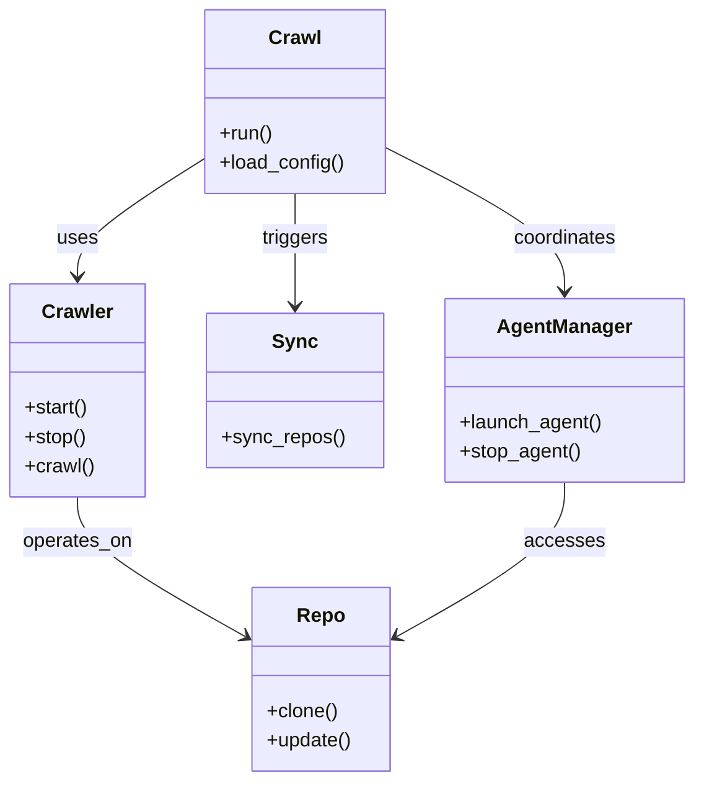
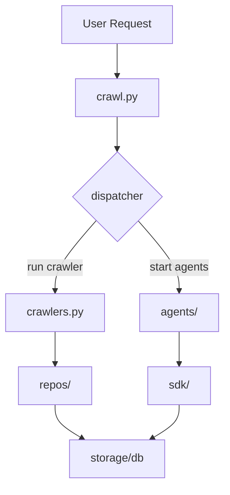
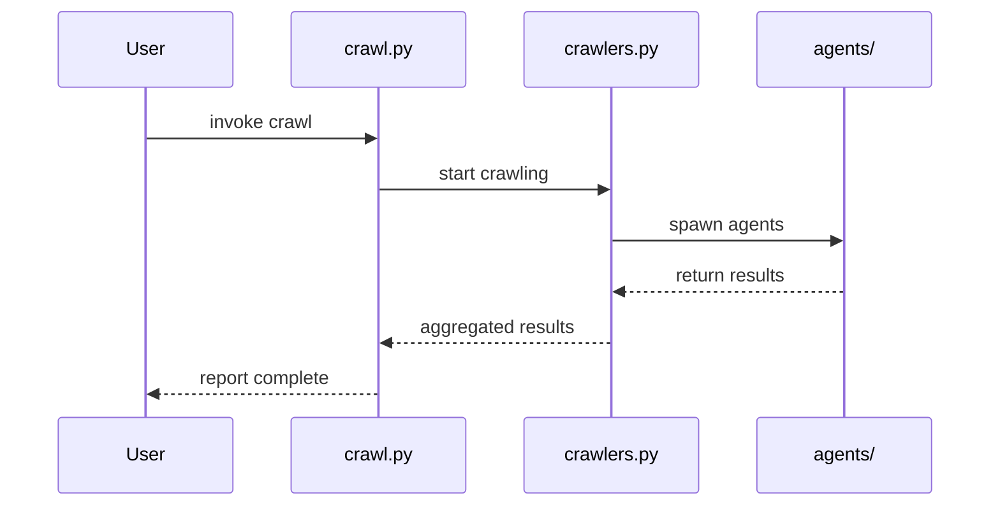

# Diagram: common/subscription_service/config/config.qa2.yml

> Auto-generated by Obscura crawlers

## Diagram 1

### SVG

<svg id="container" width="557.1328125" xmlns="http://www.w3.org/2000/svg" class="classDiagram" height="638" viewBox="0 0 557.1328125 638" role="graphics-document document" aria-roledescription="class"><g><defs><marker id="container_class-aggregationStart" class="marker aggregation class" refX="18" refY="7" markerWidth="190" markerHeight="240" orient="auto"><path d="M 18,7 L9,13 L1,7 L9,1 Z"></path></marker></defs><defs><marker id="container_class-aggregationEnd" class="marker aggregation class" refX="1" refY="7" markerWidth="20" markerHeight="28" orient="auto"><path d="M 18,7 L9,13 L1,7 L9,1 Z"></path></marker></defs><defs><marker id="container_class-extensionStart" class="marker extension class" refX="18" refY="7" markerWidth="190" markerHeight="240" orient="auto"><path d="M 1,7 L18,13 V 1 Z"></path></marker></defs><defs><marker id="container_class-extensionEnd" class="marker extension class" refX="1" refY="7" markerWidth="20" markerHeight="28" orient="auto"><path d="M 1,1 V 13 L18,7 Z"></path></marker></defs><defs><marker id="container_class-compositionStart" class="marker composition class" refX="18" refY="7" markerWidth="190" markerHeight="240" orient="auto"><path d="M 18,7 L9,13 L1,7 L9,1 Z"></path></marker></defs><defs><marker id="container_class-compositionEnd" class="marker composition class" refX="1" refY="7" markerWidth="20" markerHeight="28" orient="auto"><path d="M 18,7 L9,13 L1,7 L9,1 Z"></path></marker></defs><defs><marker id="container_class-dependencyStart" class="marker dependency class" refX="6" refY="7" markerWidth="190" markerHeight="240" orient="auto"><path d="M 5,7 L9,13 L1,7 L9,1 Z"></path></marker></defs><defs><marker id="container_class-dependencyEnd" class="marker dependency class" refX="13" refY="7" markerWidth="20" markerHeight="28" orient="auto"><path d="M 18,7 L9,13 L14,7 L9,1 Z"></path></marker></defs><defs><marker id="container_class-lollipopStart" class="marker lollipop class" refX="13" refY="7" markerWidth="190" markerHeight="240" orient="auto"><circle stroke="black" fill="transparent" cx="7" cy="7" r="6"></circle></marker></defs><defs><marker id="container_class-lollipopEnd" class="marker lollipop class" refX="1" refY="7" markerWidth="190" markerHeight="240" orient="auto"><circle stroke="black" fill="transparent" cx="7" cy="7" r="6"></circle></marker></defs><g class="root"><g class="clusters"></g><g class="edgePaths"><path d="M163.379,129.93L146.494,140.775C129.609,151.62,95.84,173.31,78.955,189.322C62.07,205.333,62.07,215.667,62.07,220.833L62.07,226" id="id_Crawl_Crawler_1" class="edge-thickness-normal edge-pattern-solid relation" style=";;;" data-edge="true" data-et="edge" data-id="id_Crawl_Crawler_1" data-points="W3sieCI6MTYzLjM3ODkwNjI1LCJ5IjoxMjkuOTMwMTA3NTI2ODgxNzN9LHsieCI6NjIuMDcwMzEyNSwieSI6MTk1fSx7IngiOjYyLjA3MDMxMjUsInkiOjIzMn1d" marker-end="url(#container_class-dependencyEnd)"></path><path d="M236.445,158L236.445,164.167C236.445,170.333,236.445,182.667,236.445,198C236.445,213.333,236.445,231.667,236.445,240.833L236.445,250" id="id_Crawl_Sync_2" class="edge-thickness-normal edge-pattern-solid relation" style=";;;" data-edge="true" data-et="edge" data-id="id_Crawl_Sync_2" data-points="W3sieCI6MjM2LjQ0NTMxMjUsInkiOjE1OH0seyJ4IjoyMzYuNDQ1MzEyNSwieSI6MTk1fSx7IngiOjIzNi40NDUzMTI1LCJ5IjoyNTZ9XQ==" marker-end="url(#container_class-dependencyEnd)"></path><path d="M309.512,120.799L333.417,133.166C357.322,145.533,405.132,170.266,429.036,189.8C452.941,209.333,452.941,223.667,452.941,230.833L452.941,238" id="id_Crawl_AgentManager_3" class="edge-thickness-normal edge-pattern-solid relation" style=";;;" data-edge="true" data-et="edge" data-id="id_Crawl_AgentManager_3" data-points="W3sieCI6MzA5LjUxMTcxODc1LCJ5IjoxMjAuNzk5NDY5NTM0MzA4ODZ9LHsieCI6NDUyLjk0MTQwNjI1LCJ5IjoxOTV9LHsieCI6NDUyLjk0MTQwNjI1LCJ5IjoyNDR9XQ==" marker-end="url(#container_class-dependencyEnd)"></path><path d="M62.07,406L62.07,412.167C62.07,418.333,62.07,430.667,84.409,449.635C106.748,468.604,151.427,494.208,173.766,507.01L196.105,519.812" id="id_Crawler_Repo_4" class="edge-thickness-normal edge-pattern-solid relation" style=";;;" data-edge="true" data-et="edge" data-id="id_Crawler_Repo_4" data-points="W3sieCI6NjIuMDcwMzEyNSwieSI6NDA2fSx7IngiOjYyLjA3MDMxMjUsInkiOjQ0M30seyJ4IjoyMDEuMzEwNTQ2ODc1LCJ5Ijo1MjIuNzk1NjQ4NzQxMjkzfV0=" marker-end="url(#container_class-dependencyEnd)"></path><path d="M452.941,394L452.941,402.167C452.941,410.333,452.941,426.667,430.602,447.635C408.263,468.604,363.585,494.208,341.246,507.01L318.907,519.812" id="id_AgentManager_Repo_5" class="edge-thickness-normal edge-pattern-solid relation" style=";;;" data-edge="true" data-et="edge" data-id="id_AgentManager_Repo_5" data-points="W3sieCI6NDUyLjk0MTQwNjI1LCJ5IjozOTR9LHsieCI6NDUyLjk0MTQwNjI1LCJ5Ijo0NDN9LHsieCI6MzEzLjcwMTE3MTg3NSwieSI6NTIyLjc5NTY0ODc0MTI5M31d" marker-end="url(#container_class-dependencyEnd)"></path></g><g class="edgeLabels"><g class="edgeLabel" transform="translate(62.0703125, 195)"><g class="label" data-id="id_Crawl_Crawler_1" transform="translate(-16.4921875, -12)"><foreignObject width="32.984375" height="24">

uses

</foreignObject></g></g><g class="edgeLabel" transform="translate(236.4453125, 195)"><g class="label" data-id="id_Crawl_Sync_2" transform="translate(-27.4921875, -12)"><foreignObject width="54.984375" height="24">

triggers

</foreignObject></g></g><g class="edgeLabel" transform="translate(452.94140625, 195)"><g class="label" data-id="id_Crawl_AgentManager_3" transform="translate(-42.8046875, -12)"><foreignObject width="85.609375" height="24">

coordinates

</foreignObject></g></g><g class="edgeLabel" transform="translate(62.0703125, 443)"><g class="label" data-id="id_Crawler_Repo_4" transform="translate(-45.015625, -12)"><foreignObject width="90.03125" height="24">

operates_on

</foreignObject></g></g><g class="edgeLabel" transform="translate(452.94140625, 443)"><g class="label" data-id="id_AgentManager_Repo_5" transform="translate(-31.53125, -12)"><foreignObject width="63.0625" height="24">

accesses

</foreignObject></g></g></g><g class="nodes"><g class="node default" id="classId-Crawl-0" transform="translate(236.4453125, 83)"><g class="basic label-container"><path d="M-73.06640625 -75 L73.06640625 -75 L73.06640625 75 L-73.06640625 75" stroke="none" stroke-width="0" fill="#ECECFF" style=""></path><path d="M-73.06640625 -75 C-41.84133400373432 -75, -10.616261757468642 -75, 73.06640625 -75 M-73.06640625 -75 C-22.239995210163194 -75, 28.586415829673612 -75, 73.06640625 -75 M73.06640625 -75 C73.06640625 -25.610606399332873, 73.06640625 23.778787201334254, 73.06640625 75 M73.06640625 -75 C73.06640625 -24.90101776953059, 73.06640625 25.19796446093882, 73.06640625 75 M73.06640625 75 C34.96935902345863 75, -3.127688203082741 75, -73.06640625 75 M73.06640625 75 C16.99232555929774 75, -39.08175513140452 75, -73.06640625 75 M-73.06640625 75 C-73.06640625 30.916655316477872, -73.06640625 -13.166689367044256, -73.06640625 -75 M-73.06640625 75 C-73.06640625 33.49680953741386, -73.06640625 -8.00638092517228, -73.06640625 -75" stroke="#9370DB" stroke-width="1.3" fill="none" stroke-dasharray="0 0" style=""></path></g><g class="annotation-group text" transform="translate(0, -51)"></g><g class="label-group text" transform="translate(-20.1484375, -51)"><g class="label" style="font-weight: bolder" transform="translate(0,-12)"><foreignObject width="40.296875" height="24">

Crawl

</foreignObject></g></g><g class="members-group text" transform="translate(-61.06640625, -3)"></g><g class="methods-group text" transform="translate(-61.06640625, 27)"><g class="label" style="" transform="translate(0,-12)"><foreignObject width="43.21875" height="24">

+run()

</foreignObject></g><g class="label" style="" transform="translate(0,12)"><foreignObject width="101.984375" height="24">

+load_config()

</foreignObject></g></g><g class="divider" style=""><path d="M-73.06640625 -27 C-24.962988009636227 -27, 23.140430230727546 -27, 73.06640625 -27 M-73.06640625 -27 C-29.709275165679486 -27, 13.647855918641028 -27, 73.06640625 -27" stroke="#9370DB" stroke-width="1.3" fill="none" stroke-dasharray="0 0" style=""></path></g><g class="divider" style=""><path d="M-73.06640625 -3 C-24.881721946218164 -3, 23.302962357563672 -3, 73.06640625 -3 M-73.06640625 -3 C-35.8654430579787 -3, 1.3355201340425964 -3, 73.06640625 -3" stroke="#9370DB" stroke-width="1.3" fill="none" stroke-dasharray="0 0" style=""></path></g></g><g class="node default" id="classId-Crawler-1" transform="translate(62.0703125, 319)"><g class="basic label-container"><path d="M-54.0703125 -87 L54.0703125 -87 L54.0703125 87 L-54.0703125 87" stroke="none" stroke-width="0" fill="#ECECFF" style=""></path><path d="M-54.0703125 -87 C-17.09855357311956 -87, 19.87320535376088 -87, 54.0703125 -87 M-54.0703125 -87 C-30.86625297694979 -87, -7.662193453899583 -87, 54.0703125 -87 M54.0703125 -87 C54.0703125 -35.16590799597789, 54.0703125 16.66818400804422, 54.0703125 87 M54.0703125 -87 C54.0703125 -31.81327903543145, 54.0703125 23.3734419291371, 54.0703125 87 M54.0703125 87 C22.174235847746775 87, -9.72184080450645 87, -54.0703125 87 M54.0703125 87 C17.11514915992035 87, -19.8400141801593 87, -54.0703125 87 M-54.0703125 87 C-54.0703125 30.820331267981842, -54.0703125 -25.359337464036315, -54.0703125 -87 M-54.0703125 87 C-54.0703125 31.4516275299099, -54.0703125 -24.0967449401802, -54.0703125 -87" stroke="#9370DB" stroke-width="1.3" fill="none" stroke-dasharray="0 0" style=""></path></g><g class="annotation-group text" transform="translate(0, -63)"></g><g class="label-group text" transform="translate(-27.734375, -63)"><g class="label" style="font-weight: bolder" transform="translate(0,-12)"><foreignObject width="55.46875" height="24">

Crawler

</foreignObject></g></g><g class="members-group text" transform="translate(-42.0703125, -15)"></g><g class="methods-group text" transform="translate(-42.0703125, 15)"><g class="label" style="" transform="translate(0,-12)"><foreignObject width="52.15625" height="24">

+start()

</foreignObject></g><g class="label" style="" transform="translate(0,12)"><foreignObject width="50.21875" height="24">

+stop()

</foreignObject></g><g class="label" style="" transform="translate(0,36)"><foreignObject width="56.40625" height="24">

+crawl()

</foreignObject></g></g><g class="divider" style=""><path d="M-54.0703125 -39 C-24.992222248906664 -39, 4.085868002186672 -39, 54.0703125 -39 M-54.0703125 -39 C-29.644839979416105 -39, -5.21936745883221 -39, 54.0703125 -39" stroke="#9370DB" stroke-width="1.3" fill="none" stroke-dasharray="0 0" style=""></path></g><g class="divider" style=""><path d="M-54.0703125 -15 C-17.929315412435344 -15, 18.211681675129313 -15, 54.0703125 -15 M-54.0703125 -15 C-24.426895928094 -15, 5.216520643811997 -15, 54.0703125 -15" stroke="#9370DB" stroke-width="1.3" fill="none" stroke-dasharray="0 0" style=""></path></g></g><g class="node default" id="classId-Sync-2" transform="translate(236.4453125, 319)"><g class="basic label-container"><path d="M-70.3046875 -63 L70.3046875 -63 L70.3046875 63 L-70.3046875 63" stroke="none" stroke-width="0" fill="#ECECFF" style=""></path><path d="M-70.3046875 -63 C-29.82161098513977 -63, 10.66146552972046 -63, 70.3046875 -63 M-70.3046875 -63 C-20.648923049326562 -63, 29.006841401346875 -63, 70.3046875 -63 M70.3046875 -63 C70.3046875 -19.97319634715454, 70.3046875 23.053607305690917, 70.3046875 63 M70.3046875 -63 C70.3046875 -22.140057195029733, 70.3046875 18.719885609940533, 70.3046875 63 M70.3046875 63 C30.358795137715028 63, -9.587097224569945 63, -70.3046875 63 M70.3046875 63 C32.013189035702844 63, -6.278309428594312 63, -70.3046875 63 M-70.3046875 63 C-70.3046875 26.767817298844342, -70.3046875 -9.464365402311316, -70.3046875 -63 M-70.3046875 63 C-70.3046875 32.62009605474897, -70.3046875 2.240192109497947, -70.3046875 -63" stroke="#9370DB" stroke-width="1.3" fill="none" stroke-dasharray="0 0" style=""></path></g><g class="annotation-group text" transform="translate(0, -39)"></g><g class="label-group text" transform="translate(-17.09375, -39)"><g class="label" style="font-weight: bolder" transform="translate(0,-12)"><foreignObject width="34.1875" height="24">

Sync

</foreignObject></g></g><g class="members-group text" transform="translate(-58.3046875, 9)"></g><g class="methods-group text" transform="translate(-58.3046875, 39)"><g class="label" style="" transform="translate(0,-12)"><foreignObject width="99.515625" height="24">

+sync_repos()

</foreignObject></g></g><g class="divider" style=""><path d="M-70.3046875 -15 C-22.663404674052885 -15, 24.97787815189423 -15, 70.3046875 -15 M-70.3046875 -15 C-20.89870674651656 -15, 28.50727400696688 -15, 70.3046875 -15" stroke="#9370DB" stroke-width="1.3" fill="none" stroke-dasharray="0 0" style=""></path></g><g class="divider" style=""><path d="M-70.3046875 9 C-39.88937081458923 9, -9.474054129178448 9, 70.3046875 9 M-70.3046875 9 C-20.604411717763902 9, 29.095864064472195 9, 70.3046875 9" stroke="#9370DB" stroke-width="1.3" fill="none" stroke-dasharray="0 0" style=""></path></g></g><g class="node default" id="classId-AgentManager-3" transform="translate(452.94140625, 319)"><g class="basic label-container"><path d="M-96.19140625 -75 L96.19140625 -75 L96.19140625 75 L-96.19140625 75" stroke="none" stroke-width="0" fill="#ECECFF" style=""></path><path d="M-96.19140625 -75 C-30.622245262993857 -75, 34.946915724012285 -75, 96.19140625 -75 M-96.19140625 -75 C-57.25538138405635 -75, -18.3193565181127 -75, 96.19140625 -75 M96.19140625 -75 C96.19140625 -20.437830077099918, 96.19140625 34.124339845800165, 96.19140625 75 M96.19140625 -75 C96.19140625 -41.31721134578565, 96.19140625 -7.634422691571302, 96.19140625 75 M96.19140625 75 C50.52716281112492 75, 4.862919372249834 75, -96.19140625 75 M96.19140625 75 C42.24807799941783 75, -11.695250251164339 75, -96.19140625 75 M-96.19140625 75 C-96.19140625 27.606712671244416, -96.19140625 -19.786574657511167, -96.19140625 -75 M-96.19140625 75 C-96.19140625 35.28033692074824, -96.19140625 -4.439326158503519, -96.19140625 -75" stroke="#9370DB" stroke-width="1.3" fill="none" stroke-dasharray="0 0" style=""></path></g><g class="annotation-group text" transform="translate(0, -51)"></g><g class="label-group text" transform="translate(-52.5234375, -51)"><g class="label" style="font-weight: bolder" transform="translate(0,-12)"><foreignObject width="105.046875" height="24">

AgentManager

</foreignObject></g></g><g class="members-group text" transform="translate(-84.19140625, -3)"></g><g class="methods-group text" transform="translate(-84.19140625, 27)"><g class="label" style="" transform="translate(0,-12)"><foreignObject width="115.859375" height="24">

+launch_agent()

</foreignObject></g><g class="label" style="" transform="translate(0,12)"><foreignObject width="98.375" height="24">

+stop_agent()

</foreignObject></g></g><g class="divider" style=""><path d="M-96.19140625 -27 C-22.100869631492557 -27, 51.989666987014886 -27, 96.19140625 -27 M-96.19140625 -27 C-53.32134582044919 -27, -10.451285390898377 -27, 96.19140625 -27" stroke="#9370DB" stroke-width="1.3" fill="none" stroke-dasharray="0 0" style=""></path></g><g class="divider" style=""><path d="M-96.19140625 -3 C-28.418317089663105 -3, 39.35477207067379 -3, 96.19140625 -3 M-96.19140625 -3 C-47.379723281756704 -3, 1.4319596864865929 -3, 96.19140625 -3" stroke="#9370DB" stroke-width="1.3" fill="none" stroke-dasharray="0 0" style=""></path></g></g><g class="node default" id="classId-Repo-4" transform="translate(257.505859375, 555)"><g class="basic label-container"><path d="M-56.1953125 -75 L56.1953125 -75 L56.1953125 75 L-56.1953125 75" stroke="none" stroke-width="0" fill="#ECECFF" style=""></path><path d="M-56.1953125 -75 C-33.231948820488356 -75, -10.268585140976718 -75, 56.1953125 -75 M-56.1953125 -75 C-16.319164152498765 -75, 23.55698419500247 -75, 56.1953125 -75 M56.1953125 -75 C56.1953125 -30.083361545187778, 56.1953125 14.833276909624445, 56.1953125 75 M56.1953125 -75 C56.1953125 -36.108188115360576, 56.1953125 2.7836237692788472, 56.1953125 75 M56.1953125 75 C30.66973624311498 75, 5.144159986229958 75, -56.1953125 75 M56.1953125 75 C23.523917132760452 75, -9.147478234479095 75, -56.1953125 75 M-56.1953125 75 C-56.1953125 42.85673531264156, -56.1953125 10.713470625283122, -56.1953125 -75 M-56.1953125 75 C-56.1953125 15.37882101119878, -56.1953125 -44.24235797760244, -56.1953125 -75" stroke="#9370DB" stroke-width="1.3" fill="none" stroke-dasharray="0 0" style=""></path></g><g class="annotation-group text" transform="translate(0, -51)"></g><g class="label-group text" transform="translate(-18.6875, -51)"><g class="label" style="font-weight: bolder" transform="translate(0,-12)"><foreignObject width="37.375" height="24">

Repo

</foreignObject></g></g><g class="members-group text" transform="translate(-44.1953125, -3)"></g><g class="methods-group text" transform="translate(-44.1953125, 27)"><g class="label" style="" transform="translate(0,-12)"><foreignObject width="58.0625" height="24">

+clone()

</foreignObject></g><g class="label" style="" transform="translate(0,12)"><foreignObject width="69.703125" height="24">

+update()

</foreignObject></g></g><g class="divider" style=""><path d="M-56.1953125 -27 C-14.982868395449813 -27, 26.229575709100374 -27, 56.1953125 -27 M-56.1953125 -27 C-22.830448180055747 -27, 10.534416139888506 -27, 56.1953125 -27" stroke="#9370DB" stroke-width="1.3" fill="none" stroke-dasharray="0 0" style=""></path></g><g class="divider" style=""><path d="M-56.1953125 -3 C-31.53451340559696 -3, -6.873714311193922 -3, 56.1953125 -3 M-56.1953125 -3 C-30.960813023370022 -3, -5.726313546740045 -3, 56.1953125 -3" stroke="#9370DB" stroke-width="1.3" fill="none" stroke-dasharray="0 0" style=""></path></g></g></g></g></g></svg>

## Diagram 2

### SVG

<svg id="container" width="323.53125" xmlns="http://www.w3.org/2000/svg" class="flowchart" height="691.0625" viewBox="0 0 323.53125 691.0625" role="graphics-document document" aria-roledescription="flowchart-v2"><g><marker id="container_flowchart-v2-pointEnd" class="marker flowchart-v2" viewBox="0 0 10 10" refX="5" refY="5" markerUnits="userSpaceOnUse" markerWidth="8" markerHeight="8" orient="auto"><path d="M 0 0 L 10 5 L 0 10 z" class="arrowMarkerPath" style="stroke-width: 1; stroke-dasharray: 1, 0;"></path></marker><marker id="container_flowchart-v2-pointStart" class="marker flowchart-v2" viewBox="0 0 10 10" refX="4.5" refY="5" markerUnits="userSpaceOnUse" markerWidth="8" markerHeight="8" orient="auto"><path d="M 0 5 L 10 10 L 10 0 z" class="arrowMarkerPath" style="stroke-width: 1; stroke-dasharray: 1, 0;"></path></marker><marker id="container_flowchart-v2-circleEnd" class="marker flowchart-v2" viewBox="0 0 10 10" refX="11" refY="5" markerUnits="userSpaceOnUse" markerWidth="11" markerHeight="11" orient="auto"><circle cx="5" cy="5" r="5" class="arrowMarkerPath" style="stroke-width: 1; stroke-dasharray: 1, 0;"></circle></marker><marker id="container_flowchart-v2-circleStart" class="marker flowchart-v2" viewBox="0 0 10 10" refX="-1" refY="5" markerUnits="userSpaceOnUse" markerWidth="11" markerHeight="11" orient="auto"><circle cx="5" cy="5" r="5" class="arrowMarkerPath" style="stroke-width: 1; stroke-dasharray: 1, 0;"></circle></marker><marker id="container_flowchart-v2-crossEnd" class="marker cross flowchart-v2" viewBox="0 0 11 11" refX="12" refY="5.2" markerUnits="userSpaceOnUse" markerWidth="11" markerHeight="11" orient="auto"><path d="M 1,1 l 9,9 M 10,1 l -9,9" class="arrowMarkerPath" style="stroke-width: 2; stroke-dasharray: 1, 0;"></path></marker><marker id="container_flowchart-v2-crossStart" class="marker cross flowchart-v2" viewBox="0 0 11 11" refX="-1" refY="5.2" markerUnits="userSpaceOnUse" markerWidth="11" markerHeight="11" orient="auto"><path d="M 1,1 l 9,9 M 10,1 l -9,9" class="arrowMarkerPath" style="stroke-width: 2; stroke-dasharray: 1, 0;"></path></marker><g class="root"><g class="clusters"></g><g class="edgePaths"><path d="M168.008,62L168.008,66.167C168.008,70.333,168.008,78.667,168.008,86.333C168.008,94,168.008,101,168.008,104.5L168.008,108" id="L_A_B_0" class="edge-thickness-normal edge-pattern-solid edge-thickness-normal edge-pattern-solid flowchart-link" style=";" data-edge="true" data-et="edge" data-id="L_A_B_0" data-points="W3sieCI6MTY4LjAwNzgxMjUsInkiOjYyfSx7IngiOjE2OC4wMDc4MTI1LCJ5Ijo4N30seyJ4IjoxNjguMDA3ODEyNSwieSI6MTEyfV0=" marker-end="url(#container_flowchart-v2-pointEnd)"></path><path d="M168.008,166L168.008,170.167C168.008,174.333,168.008,182.667,168.008,190.333C168.008,198,168.008,205,168.008,208.5L168.008,212" id="L_B_C_0" class="edge-thickness-normal edge-pattern-solid edge-thickness-normal edge-pattern-solid flowchart-link" style=";" data-edge="true" data-et="edge" data-id="L_B_C_0" data-points="W3sieCI6MTY4LjAwNzgxMjUsInkiOjE2Nn0seyJ4IjoxNjguMDA3ODEyNSwieSI6MTkxfSx7IngiOjE2OC4wMDc4MTI1LCJ5IjoyMTZ9XQ==" marker-end="url(#container_flowchart-v2-pointEnd)"></path><path d="M137.487,316.542L127.677,327.795C117.866,339.049,98.246,361.556,88.435,378.309C78.625,395.063,78.625,406.063,78.625,411.563L78.625,417.063" id="L_C_D_0" class="edge-thickness-normal edge-pattern-solid edge-thickness-normal edge-pattern-solid flowchart-link" style=";" data-edge="true" data-et="edge" data-id="L_C_D_0" data-points="W3sieCI6MTM3LjQ4NzAyOTYyODAyNzY3LCJ5IjozMTYuNTQxNzE3MTI4MDI3N30seyJ4Ijo3OC42MjUsInkiOjM4NC4wNjI1fSx7IngiOjc4LjYyNSwieSI6NDIxLjA2MjV9XQ==" marker-end="url(#container_flowchart-v2-pointEnd)"></path><path d="M198.529,316.542L208.339,327.795C218.149,339.049,237.77,361.556,247.58,378.309C257.391,395.063,257.391,406.063,257.391,411.563L257.391,417.063" id="L_C_E_0" class="edge-thickness-normal edge-pattern-solid edge-thickness-normal edge-pattern-solid flowchart-link" style=";" data-edge="true" data-et="edge" data-id="L_C_E_0" data-points="W3sieCI6MTk4LjUyODU5NTM3MTk3MjMzLCJ5IjozMTYuNTQxNzE3MTI4MDI3N30seyJ4IjoyNTcuMzkwNjI1LCJ5IjozODQuMDYyNX0seyJ4IjoyNTcuMzkwNjI1LCJ5Ijo0MjEuMDYyNX1d" marker-end="url(#container_flowchart-v2-pointEnd)"></path><path d="M78.625,475.063L78.625,479.229C78.625,483.396,78.625,491.729,78.625,499.396C78.625,507.063,78.625,514.063,78.625,517.563L78.625,521.063" id="L_D_F_0" class="edge-thickness-normal edge-pattern-solid edge-thickness-normal edge-pattern-solid flowchart-link" style=";" data-edge="true" data-et="edge" data-id="L_D_F_0" data-points="W3sieCI6NzguNjI1LCJ5Ijo0NzUuMDYyNX0seyJ4Ijo3OC42MjUsInkiOjUwMC4wNjI1fSx7IngiOjc4LjYyNSwieSI6NTI1LjA2MjV9XQ==" marker-end="url(#container_flowchart-v2-pointEnd)"></path><path d="M257.391,475.063L257.391,479.229C257.391,483.396,257.391,491.729,257.391,499.396C257.391,507.063,257.391,514.063,257.391,517.563L257.391,521.063" id="L_E_G_0" class="edge-thickness-normal edge-pattern-solid edge-thickness-normal edge-pattern-solid flowchart-link" style=";" data-edge="true" data-et="edge" data-id="L_E_G_0" data-points="W3sieCI6MjU3LjM5MDYyNSwieSI6NDc1LjA2MjV9LHsieCI6MjU3LjM5MDYyNSwieSI6NTAwLjA2MjV9LHsieCI6MjU3LjM5MDYyNSwieSI6NTI1LjA2MjV9XQ==" marker-end="url(#container_flowchart-v2-pointEnd)"></path><path d="M78.625,579.063L78.625,583.229C78.625,587.396,78.625,595.729,85.211,603.727C91.797,611.725,104.968,619.388,111.554,623.22L118.14,627.051" id="L_F_H_0" class="edge-thickness-normal edge-pattern-solid edge-thickness-normal edge-pattern-solid flowchart-link" style=";" data-edge="true" data-et="edge" data-id="L_F_H_0" data-points="W3sieCI6NzguNjI1LCJ5Ijo1NzkuMDYyNX0seyJ4Ijo3OC42MjUsInkiOjYwNC4wNjI1fSx7IngiOjEyMS41OTc1MDYwMDk2MTUzOSwieSI6NjI5LjA2MjV9XQ==" marker-end="url(#container_flowchart-v2-pointEnd)"></path><path d="M257.391,579.063L257.391,583.229C257.391,587.396,257.391,595.729,250.805,603.727C244.219,611.725,231.047,619.388,224.461,623.22L217.876,627.051" id="L_G_H_0" class="edge-thickness-normal edge-pattern-solid edge-thickness-normal edge-pattern-solid flowchart-link" style=";" data-edge="true" data-et="edge" data-id="L_G_H_0" data-points="W3sieCI6MjU3LjM5MDYyNSwieSI6NTc5LjA2MjV9LHsieCI6MjU3LjM5MDYyNSwieSI6NjA0LjA2MjV9LHsieCI6MjE0LjQxODExODk5MDM4NDYsInkiOjYyOS4wNjI1fV0=" marker-end="url(#container_flowchart-v2-pointEnd)"></path></g><g class="edgeLabels"><g class="edgeLabel"><g class="label" data-id="L_A_B_0" transform="translate(0, 0)"><foreignObject width="0" height="0">

</foreignObject></g></g><g class="edgeLabel"><g class="label" data-id="L_B_C_0" transform="translate(0, 0)"><foreignObject width="0" height="0">

</foreignObject></g></g><g class="edgeLabel" transform="translate(78.625, 384.0625)"><g class="label" data-id="L_C_D_0" transform="translate(-40.984375, -12)"><foreignObject width="81.96875" height="24">

run crawler

</foreignObject></g></g><g class="edgeLabel" transform="translate(257.390625, 384.0625)"><g class="label" data-id="L_C_E_0" transform="translate(-42.9921875, -12)"><foreignObject width="85.984375" height="24">

start agents

</foreignObject></g></g><g class="edgeLabel"><g class="label" data-id="L_D_F_0" transform="translate(0, 0)"><foreignObject width="0" height="0">

</foreignObject></g></g><g class="edgeLabel"><g class="label" data-id="L_E_G_0" transform="translate(0, 0)"><foreignObject width="0" height="0">

</foreignObject></g></g><g class="edgeLabel"><g class="label" data-id="L_F_H_0" transform="translate(0, 0)"><foreignObject width="0" height="0">

</foreignObject></g></g><g class="edgeLabel"><g class="label" data-id="L_G_H_0" transform="translate(0, 0)"><foreignObject width="0" height="0">

</foreignObject></g></g></g><g class="nodes"><g class="node default" id="flowchart-A-0" transform="translate(168.0078125, 35)"><rect class="basic label-container" style="" x="-78.0703125" y="-27" width="156.140625" height="54"></rect><g class="label" style="" transform="translate(-48.0703125, -12)"><rect></rect><foreignObject width="96.140625" height="24">

User Request

</foreignObject></g></g><g class="node default" id="flowchart-B-1" transform="translate(168.0078125, 139)"><rect class="basic label-container" style="" x="-59.6328125" y="-27" width="119.265625" height="54"></rect><g class="label" style="" transform="translate(-29.6328125, -12)"><rect></rect><foreignObject width="59.265625" height="24">

crawl.py

</foreignObject></g></g><g class="node default" id="flowchart-C-3" transform="translate(168.0078125, 281.53125)"><polygon points="65.53125,0 131.0625,-65.53125 65.53125,-131.0625 0,-65.53125" class="label-container" transform="translate(-65.03125, 65.53125)"></polygon><g class="label" style="" transform="translate(-38.53125, -12)"><rect></rect><foreignObject width="77.0625" height="24">

dispatcher

</foreignObject></g></g><g class="node default" id="flowchart-D-5" transform="translate(78.625, 448.0625)"><rect class="basic label-container" style="" x="-70.625" y="-27" width="141.25" height="54"></rect><g class="label" style="" transform="translate(-40.625, -12)"><rect></rect><foreignObject width="81.25" height="24">

crawlers.py

</foreignObject></g></g><g class="node default" id="flowchart-E-7" transform="translate(257.390625, 448.0625)"><rect class="basic label-container" style="" x="-58.140625" y="-27" width="116.28125" height="54"></rect><g class="label" style="" transform="translate(-28.140625, -12)"><rect></rect><foreignObject width="56.28125" height="24">

agents/

</foreignObject></g></g><g class="node default" id="flowchart-F-9" transform="translate(78.625, 552.0625)"><rect class="basic label-container" style="" x="-54.53125" y="-27" width="109.0625" height="54"></rect><g class="label" style="" transform="translate(-24.53125, -12)"><rect></rect><foreignObject width="49.0625" height="24">

repos/

</foreignObject></g></g><g class="node default" id="flowchart-G-11" transform="translate(257.390625, 552.0625)"><rect class="basic label-container" style="" x="-46.78125" y="-27" width="93.5625" height="54"></rect><g class="label" style="" transform="translate(-16.78125, -12)"><rect></rect><foreignObject width="33.5625" height="24">

sdk/

</foreignObject></g></g><g class="node default" id="flowchart-H-13" transform="translate(168.0078125, 656.0625)"><rect class="basic label-container" style="" x="-69.9453125" y="-27" width="139.890625" height="54"></rect><g class="label" style="" transform="translate(-39.9453125, -12)"><rect></rect><foreignObject width="79.890625" height="24">

storage/db

</foreignObject></g></g></g></g></g></svg>

## Diagram 3

### SVG

<svg id="container" width="854" xmlns="http://www.w3.org/2000/svg" height="459" viewBox="-50 -10 854 459" role="graphics-document document" aria-roledescription="sequence"><g><rect x="604" y="373" fill="#eaeaea" stroke="#666" width="150" height="65" name="AG" rx="3" ry="3" class="actor actor-bottom"></rect><text x="679" y="405.5" dominant-baseline="central" alignment-baseline="central" class="actor actor-box" style="text-anchor: middle; font-size: 16px; font-weight: 400;"><tspan x="679" dy="0">agents/</tspan></text></g><g><rect x="404" y="373" fill="#eaeaea" stroke="#666" width="150" height="65" name="CR" rx="3" ry="3" class="actor actor-bottom"></rect><text x="479" y="405.5" dominant-baseline="central" alignment-baseline="central" class="actor actor-box" style="text-anchor: middle; font-size: 16px; font-weight: 400;"><tspan x="479" dy="0">crawlers.py</tspan></text></g><g><rect x="200" y="373" fill="#eaeaea" stroke="#666" width="150" height="65" name="CLI" rx="3" ry="3" class="actor actor-bottom"></rect><text x="275" y="405.5" dominant-baseline="central" alignment-baseline="central" class="actor actor-box" style="text-anchor: middle; font-size: 16px; font-weight: 400;"><tspan x="275" dy="0">crawl.py</tspan></text></g><g><rect x="0" y="373" fill="#eaeaea" stroke="#666" width="150" height="65" name="U" rx="3" ry="3" class="actor actor-bottom"></rect><text x="75" y="405.5" dominant-baseline="central" alignment-baseline="central" class="actor actor-box" style="text-anchor: middle; font-size: 16px; font-weight: 400;"><tspan x="75" dy="0">User</tspan></text></g><g><line id="actor3" x1="679" y1="65" x2="679" y2="373" class="actor-line 200" stroke-width="0.5px" stroke="#999" name="AG"></line><g id="root-3"><rect x="604" y="0" fill="#eaeaea" stroke="#666" width="150" height="65" name="AG" rx="3" ry="3" class="actor actor-top"></rect><text x="679" y="32.5" dominant-baseline="central" alignment-baseline="central" class="actor actor-box" style="text-anchor: middle; font-size: 16px; font-weight: 400;"><tspan x="679" dy="0">agents/</tspan></text></g></g><g><line id="actor2" x1="479" y1="65" x2="479" y2="373" class="actor-line 200" stroke-width="0.5px" stroke="#999" name="CR"></line><g id="root-2"><rect x="404" y="0" fill="#eaeaea" stroke="#666" width="150" height="65" name="CR" rx="3" ry="3" class="actor actor-top"></rect><text x="479" y="32.5" dominant-baseline="central" alignment-baseline="central" class="actor actor-box" style="text-anchor: middle; font-size: 16px; font-weight: 400;"><tspan x="479" dy="0">crawlers.py</tspan></text></g></g><g><line id="actor1" x1="275" y1="65" x2="275" y2="373" class="actor-line 200" stroke-width="0.5px" stroke="#999" name="CLI"></line><g id="root-1"><rect x="200" y="0" fill="#eaeaea" stroke="#666" width="150" height="65" name="CLI" rx="3" ry="3" class="actor actor-top"></rect><text x="275" y="32.5" dominant-baseline="central" alignment-baseline="central" class="actor actor-box" style="text-anchor: middle; font-size: 16px; font-weight: 400;"><tspan x="275" dy="0">crawl.py</tspan></text></g></g><g><line id="actor0" x1="75" y1="65" x2="75" y2="373" class="actor-line 200" stroke-width="0.5px" stroke="#999" name="U"></line><g id="root-0"><rect x="0" y="0" fill="#eaeaea" stroke="#666" width="150" height="65" name="U" rx="3" ry="3" class="actor actor-top"></rect><text x="75" y="32.5" dominant-baseline="central" alignment-baseline="central" class="actor actor-box" style="text-anchor: middle; font-size: 16px; font-weight: 400;"><tspan x="75" dy="0">User</tspan></text></g></g><g></g><defs><symbol id="computer" width="24" height="24"><path transform="scale(.5)" d="M2 2v13h20v-13h-20zm18 11h-16v-9h16v9zm-10.228 6l.466-1h3.524l.467 1h-4.457zm14.228 3h-24l2-6h2.104l-1.33 4h18.45l-1.297-4h2.073l2 6zm-5-10h-14v-7h14v7z"></path></symbol></defs><defs><symbol id="database" fill-rule="evenodd" clip-rule="evenodd"><path transform="scale(.5)" d="M12.258.001l.256.004.255.005.253.008.251.01.249.012.247.015.246.016.242.019.241.02.239.023.236.024.233.027.231.028.229.031.225.032.223.034.22.036.217.038.214.04.211.041.208.043.205.045.201.046.198.048.194.05.191.051.187.053.183.054.18.056.175.057.172.059.168.06.163.061.16.063.155.064.15.066.074.033.073.033.071.034.07.034.069.035.068.035.067.035.066.035.064.036.064.036.062.036.06.036.06.037.058.037.058.037.055.038.055.038.053.038.052.038.051.039.05.039.048.039.047.039.045.04.044.04.043.04.041.04.04.041.039.041.037.041.036.041.034.041.033.042.032.042.03.042.029.042.027.042.026.043.024.043.023.043.021.043.02.043.018.044.017.043.015.044.013.044.012.044.011.045.009.044.007.045.006.045.004.045.002.045.001.045v17l-.001.045-.002.045-.004.045-.006.045-.007.045-.009.044-.011.045-.012.044-.013.044-.015.044-.017.043-.018.044-.02.043-.021.043-.023.043-.024.043-.026.043-.027.042-.029.042-.03.042-.032.042-.033.042-.034.041-.036.041-.037.041-.039.041-.04.041-.041.04-.043.04-.044.04-.045.04-.047.039-.048.039-.05.039-.051.039-.052.038-.053.038-.055.038-.055.038-.058.037-.058.037-.06.037-.06.036-.062.036-.064.036-.064.036-.066.035-.067.035-.068.035-.069.035-.07.034-.071.034-.073.033-.074.033-.15.066-.155.064-.16.063-.163.061-.168.06-.172.059-.175.057-.18.056-.183.054-.187.053-.191.051-.194.05-.198.048-.201.046-.205.045-.208.043-.211.041-.214.04-.217.038-.22.036-.223.034-.225.032-.229.031-.231.028-.233.027-.236.024-.239.023-.241.02-.242.019-.246.016-.247.015-.249.012-.251.01-.253.008-.255.005-.256.004-.258.001-.258-.001-.256-.004-.255-.005-.253-.008-.251-.01-.249-.012-.247-.015-.245-.016-.243-.019-.241-.02-.238-.023-.236-.024-.234-.027-.231-.028-.228-.031-.226-.032-.223-.034-.22-.036-.217-.038-.214-.04-.211-.041-.208-.043-.204-.045-.201-.046-.198-.048-.195-.05-.19-.051-.187-.053-.184-.054-.179-.056-.176-.057-.172-.059-.167-.06-.164-.061-.159-.063-.155-.064-.151-.066-.074-.033-.072-.033-.072-.034-.07-.034-.069-.035-.068-.035-.067-.035-.066-.035-.064-.036-.063-.036-.062-.036-.061-.036-.06-.037-.058-.037-.057-.037-.056-.038-.055-.038-.053-.038-.052-.038-.051-.039-.049-.039-.049-.039-.046-.039-.046-.04-.044-.04-.043-.04-.041-.04-.04-.041-.039-.041-.037-.041-.036-.041-.034-.041-.033-.042-.032-.042-.03-.042-.029-.042-.027-.042-.026-.043-.024-.043-.023-.043-.021-.043-.02-.043-.018-.044-.017-.043-.015-.044-.013-.044-.012-.044-.011-.045-.009-.044-.007-.045-.006-.045-.004-.045-.002-.045-.001-.045v-17l.001-.045.002-.045.004-.045.006-.045.007-.045.009-.044.011-.045.012-.044.013-.044.015-.044.017-.043.018-.044.02-.043.021-.043.023-.043.024-.043.026-.043.027-.042.029-.042.03-.042.032-.042.033-.042.034-.041.036-.041.037-.041.039-.041.04-.041.041-.04.043-.04.044-.04.046-.04.046-.039.049-.039.049-.039.051-.039.052-.038.053-.038.055-.038.056-.038.057-.037.058-.037.06-.037.061-.036.062-.036.063-.036.064-.036.066-.035.067-.035.068-.035.069-.035.07-.034.072-.034.072-.033.074-.033.151-.066.155-.064.159-.063.164-.061.167-.06.172-.059.176-.057.179-.056.184-.054.187-.053.19-.051.195-.05.198-.048.201-.046.204-.045.208-.043.211-.041.214-.04.217-.038.22-.036.223-.034.226-.032.228-.031.231-.028.234-.027.236-.024.238-.023.241-.02.243-.019.245-.016.247-.015.249-.012.251-.01.253-.008.255-.005.256-.004.258-.001.258.001zm-9.258 20.499v.01l.001.021.003.021.004.022.005.021.006.022.007.022.009.023.01.022.011.023.012.023.013.023.015.023.016.024.017.023.018.024.019.024.021.024.022.025.023.024.024.025.052.049.056.05.061.051.066.051.07.051.075.051.079.052.084.052.088.052.092.052.097.052.102.051.105.052.11.052.114.051.119.051.123.051.127.05.131.05.135.05.139.048.144.049.147.047.152.047.155.047.16.045.163.045.167.043.171.043.176.041.178.041.183.039.187.039.19.037.194.035.197.035.202.033.204.031.209.03.212.029.216.027.219.025.222.024.226.021.23.02.233.018.236.016.24.015.243.012.246.01.249.008.253.005.256.004.259.001.26-.001.257-.004.254-.005.25-.008.247-.011.244-.012.241-.014.237-.016.233-.018.231-.021.226-.021.224-.024.22-.026.216-.027.212-.028.21-.031.205-.031.202-.034.198-.034.194-.036.191-.037.187-.039.183-.04.179-.04.175-.042.172-.043.168-.044.163-.045.16-.046.155-.046.152-.047.148-.048.143-.049.139-.049.136-.05.131-.05.126-.05.123-.051.118-.052.114-.051.11-.052.106-.052.101-.052.096-.052.092-.052.088-.053.083-.051.079-.052.074-.052.07-.051.065-.051.06-.051.056-.05.051-.05.023-.024.023-.025.021-.024.02-.024.019-.024.018-.024.017-.024.015-.023.014-.024.013-.023.012-.023.01-.023.01-.022.008-.022.006-.022.006-.022.004-.022.004-.021.001-.021.001-.021v-4.127l-.077.055-.08.053-.083.054-.085.053-.087.052-.09.052-.093.051-.095.05-.097.05-.1.049-.102.049-.105.048-.106.047-.109.047-.111.046-.114.045-.115.045-.118.044-.12.043-.122.042-.124.042-.126.041-.128.04-.13.04-.132.038-.134.038-.135.037-.138.037-.139.035-.142.035-.143.034-.144.033-.147.032-.148.031-.15.03-.151.03-.153.029-.154.027-.156.027-.158.026-.159.025-.161.024-.162.023-.163.022-.165.021-.166.02-.167.019-.169.018-.169.017-.171.016-.173.015-.173.014-.175.013-.175.012-.177.011-.178.01-.179.008-.179.008-.181.006-.182.005-.182.004-.184.003-.184.002h-.37l-.184-.002-.184-.003-.182-.004-.182-.005-.181-.006-.179-.008-.179-.008-.178-.01-.176-.011-.176-.012-.175-.013-.173-.014-.172-.015-.171-.016-.17-.017-.169-.018-.167-.019-.166-.02-.165-.021-.163-.022-.162-.023-.161-.024-.159-.025-.157-.026-.156-.027-.155-.027-.153-.029-.151-.03-.15-.03-.148-.031-.146-.032-.145-.033-.143-.034-.141-.035-.14-.035-.137-.037-.136-.037-.134-.038-.132-.038-.13-.04-.128-.04-.126-.041-.124-.042-.122-.042-.12-.044-.117-.043-.116-.045-.113-.045-.112-.046-.109-.047-.106-.047-.105-.048-.102-.049-.1-.049-.097-.05-.095-.05-.093-.052-.09-.051-.087-.052-.085-.053-.083-.054-.08-.054-.077-.054v4.127zm0-5.654v.011l.001.021.003.021.004.021.005.022.006.022.007.022.009.022.01.022.011.023.012.023.013.023.015.024.016.023.017.024.018.024.019.024.021.024.022.024.023.025.024.024.052.05.056.05.061.05.066.051.07.051.075.052.079.051.084.052.088.052.092.052.097.052.102.052.105.052.11.051.114.051.119.052.123.05.127.051.131.05.135.049.139.049.144.048.147.048.152.047.155.046.16.045.163.045.167.044.171.042.176.042.178.04.183.04.187.038.19.037.194.036.197.034.202.033.204.032.209.03.212.028.216.027.219.025.222.024.226.022.23.02.233.018.236.016.24.014.243.012.246.01.249.008.253.006.256.003.259.001.26-.001.257-.003.254-.006.25-.008.247-.01.244-.012.241-.015.237-.016.233-.018.231-.02.226-.022.224-.024.22-.025.216-.027.212-.029.21-.03.205-.032.202-.033.198-.035.194-.036.191-.037.187-.039.183-.039.179-.041.175-.042.172-.043.168-.044.163-.045.16-.045.155-.047.152-.047.148-.048.143-.048.139-.05.136-.049.131-.05.126-.051.123-.051.118-.051.114-.052.11-.052.106-.052.101-.052.096-.052.092-.052.088-.052.083-.052.079-.052.074-.051.07-.052.065-.051.06-.05.056-.051.051-.049.023-.025.023-.024.021-.025.02-.024.019-.024.018-.024.017-.024.015-.023.014-.023.013-.024.012-.022.01-.023.01-.023.008-.022.006-.022.006-.022.004-.021.004-.022.001-.021.001-.021v-4.139l-.077.054-.08.054-.083.054-.085.052-.087.053-.09.051-.093.051-.095.051-.097.05-.1.049-.102.049-.105.048-.106.047-.109.047-.111.046-.114.045-.115.044-.118.044-.12.044-.122.042-.124.042-.126.041-.128.04-.13.039-.132.039-.134.038-.135.037-.138.036-.139.036-.142.035-.143.033-.144.033-.147.033-.148.031-.15.03-.151.03-.153.028-.154.028-.156.027-.158.026-.159.025-.161.024-.162.023-.163.022-.165.021-.166.02-.167.019-.169.018-.169.017-.171.016-.173.015-.173.014-.175.013-.175.012-.177.011-.178.009-.179.009-.179.007-.181.007-.182.005-.182.004-.184.003-.184.002h-.37l-.184-.002-.184-.003-.182-.004-.182-.005-.181-.007-.179-.007-.179-.009-.178-.009-.176-.011-.176-.012-.175-.013-.173-.014-.172-.015-.171-.016-.17-.017-.169-.018-.167-.019-.166-.02-.165-.021-.163-.022-.162-.023-.161-.024-.159-.025-.157-.026-.156-.027-.155-.028-.153-.028-.151-.03-.15-.03-.148-.031-.146-.033-.145-.033-.143-.033-.141-.035-.14-.036-.137-.036-.136-.037-.134-.038-.132-.039-.13-.039-.128-.04-.126-.041-.124-.042-.122-.043-.12-.043-.117-.044-.116-.044-.113-.046-.112-.046-.109-.046-.106-.047-.105-.048-.102-.049-.1-.049-.097-.05-.095-.051-.093-.051-.09-.051-.087-.053-.085-.052-.083-.054-.08-.054-.077-.054v4.139zm0-5.666v.011l.001.02.003.022.004.021.005.022.006.021.007.022.009.023.01.022.011.023.012.023.013.023.015.023.016.024.017.024.018.023.019.024.021.025.022.024.023.024.024.025.052.05.056.05.061.05.066.051.07.051.075.052.079.051.084.052.088.052.092.052.097.052.102.052.105.051.11.052.114.051.119.051.123.051.127.05.131.05.135.05.139.049.144.048.147.048.152.047.155.046.16.045.163.045.167.043.171.043.176.042.178.04.183.04.187.038.19.037.194.036.197.034.202.033.204.032.209.03.212.028.216.027.219.025.222.024.226.021.23.02.233.018.236.017.24.014.243.012.246.01.249.008.253.006.256.003.259.001.26-.001.257-.003.254-.006.25-.008.247-.01.244-.013.241-.014.237-.016.233-.018.231-.02.226-.022.224-.024.22-.025.216-.027.212-.029.21-.03.205-.032.202-.033.198-.035.194-.036.191-.037.187-.039.183-.039.179-.041.175-.042.172-.043.168-.044.163-.045.16-.045.155-.047.152-.047.148-.048.143-.049.139-.049.136-.049.131-.051.126-.05.123-.051.118-.052.114-.051.11-.052.106-.052.101-.052.096-.052.092-.052.088-.052.083-.052.079-.052.074-.052.07-.051.065-.051.06-.051.056-.05.051-.049.023-.025.023-.025.021-.024.02-.024.019-.024.018-.024.017-.024.015-.023.014-.024.013-.023.012-.023.01-.022.01-.023.008-.022.006-.022.006-.022.004-.022.004-.021.001-.021.001-.021v-4.153l-.077.054-.08.054-.083.053-.085.053-.087.053-.09.051-.093.051-.095.051-.097.05-.1.049-.102.048-.105.048-.106.048-.109.046-.111.046-.114.046-.115.044-.118.044-.12.043-.122.043-.124.042-.126.041-.128.04-.13.039-.132.039-.134.038-.135.037-.138.036-.139.036-.142.034-.143.034-.144.033-.147.032-.148.032-.15.03-.151.03-.153.028-.154.028-.156.027-.158.026-.159.024-.161.024-.162.023-.163.023-.165.021-.166.02-.167.019-.169.018-.169.017-.171.016-.173.015-.173.014-.175.013-.175.012-.177.01-.178.01-.179.009-.179.007-.181.006-.182.006-.182.004-.184.003-.184.001-.185.001-.185-.001-.184-.001-.184-.003-.182-.004-.182-.006-.181-.006-.179-.007-.179-.009-.178-.01-.176-.01-.176-.012-.175-.013-.173-.014-.172-.015-.171-.016-.17-.017-.169-.018-.167-.019-.166-.02-.165-.021-.163-.023-.162-.023-.161-.024-.159-.024-.157-.026-.156-.027-.155-.028-.153-.028-.151-.03-.15-.03-.148-.032-.146-.032-.145-.033-.143-.034-.141-.034-.14-.036-.137-.036-.136-.037-.134-.038-.132-.039-.13-.039-.128-.041-.126-.041-.124-.041-.122-.043-.12-.043-.117-.044-.116-.044-.113-.046-.112-.046-.109-.046-.106-.048-.105-.048-.102-.048-.1-.05-.097-.049-.095-.051-.093-.051-.09-.052-.087-.052-.085-.053-.083-.053-.08-.054-.077-.054v4.153zm8.74-8.179l-.257.004-.254.005-.25.008-.247.011-.244.012-.241.014-.237.016-.233.018-.231.021-.226.022-.224.023-.22.026-.216.027-.212.028-.21.031-.205.032-.202.033-.198.034-.194.036-.191.038-.187.038-.183.04-.179.041-.175.042-.172.043-.168.043-.163.045-.16.046-.155.046-.152.048-.148.048-.143.048-.139.049-.136.05-.131.05-.126.051-.123.051-.118.051-.114.052-.11.052-.106.052-.101.052-.096.052-.092.052-.088.052-.083.052-.079.052-.074.051-.07.052-.065.051-.06.05-.056.05-.051.05-.023.025-.023.024-.021.024-.02.025-.019.024-.018.024-.017.023-.015.024-.014.023-.013.023-.012.023-.01.023-.01.022-.008.022-.006.023-.006.021-.004.022-.004.021-.001.021-.001.021.001.021.001.021.004.021.004.022.006.021.006.023.008.022.01.022.01.023.012.023.013.023.014.023.015.024.017.023.018.024.019.024.02.025.021.024.023.024.023.025.051.05.056.05.06.05.065.051.07.052.074.051.079.052.083.052.088.052.092.052.096.052.101.052.106.052.11.052.114.052.118.051.123.051.126.051.131.05.136.05.139.049.143.048.148.048.152.048.155.046.16.046.163.045.168.043.172.043.175.042.179.041.183.04.187.038.191.038.194.036.198.034.202.033.205.032.21.031.212.028.216.027.22.026.224.023.226.022.231.021.233.018.237.016.241.014.244.012.247.011.25.008.254.005.257.004.26.001.26-.001.257-.004.254-.005.25-.008.247-.011.244-.012.241-.014.237-.016.233-.018.231-.021.226-.022.224-.023.22-.026.216-.027.212-.028.21-.031.205-.032.202-.033.198-.034.194-.036.191-.038.187-.038.183-.04.179-.041.175-.042.172-.043.168-.043.163-.045.16-.046.155-.046.152-.048.148-.048.143-.048.139-.049.136-.05.131-.05.126-.051.123-.051.118-.051.114-.052.11-.052.106-.052.101-.052.096-.052.092-.052.088-.052.083-.052.079-.052.074-.051.07-.052.065-.051.06-.05.056-.05.051-.05.023-.025.023-.024.021-.024.02-.025.019-.024.018-.024.017-.023.015-.024.014-.023.013-.023.012-.023.01-.023.01-.022.008-.022.006-.023.006-.021.004-.022.004-.021.001-.021.001-.021-.001-.021-.001-.021-.004-.021-.004-.022-.006-.021-.006-.023-.008-.022-.01-.022-.01-.023-.012-.023-.013-.023-.014-.023-.015-.024-.017-.023-.018-.024-.019-.024-.02-.025-.021-.024-.023-.024-.023-.025-.051-.05-.056-.05-.06-.05-.065-.051-.07-.052-.074-.051-.079-.052-.083-.052-.088-.052-.092-.052-.096-.052-.101-.052-.106-.052-.11-.052-.114-.052-.118-.051-.123-.051-.126-.051-.131-.05-.136-.05-.139-.049-.143-.048-.148-.048-.152-.048-.155-.046-.16-.046-.163-.045-.168-.043-.172-.043-.175-.042-.179-.041-.183-.04-.187-.038-.191-.038-.194-.036-.198-.034-.202-.033-.205-.032-.21-.031-.212-.028-.216-.027-.22-.026-.224-.023-.226-.022-.231-.021-.233-.018-.237-.016-.241-.014-.244-.012-.247-.011-.25-.008-.254-.005-.257-.004-.26-.001-.26.001z"></path></symbol></defs><defs><symbol id="clock" width="24" height="24"><path transform="scale(.5)" d="M12 2c5.514 0 10 4.486 10 10s-4.486 10-10 10-10-4.486-10-10 4.486-10 10-10zm0-2c-6.627 0-12 5.373-12 12s5.373 12 12 12 12-5.373 12-12-5.373-12-12-12zm5.848 12.459c.202.038.202.333.001.372-1.907.361-6.045 1.111-6.547 1.111-.719 0-1.301-.582-1.301-1.301 0-.512.77-5.447 1.125-7.445.034-.192.312-.181.343.014l.985 6.238 5.394 1.011z"></path></symbol></defs><defs><marker id="arrowhead" refX="7.9" refY="5" markerUnits="userSpaceOnUse" markerWidth="12" markerHeight="12" orient="auto-start-reverse"><path d="M -1 0 L 10 5 L 0 10 z"></path></marker></defs><defs><marker id="crosshead" markerWidth="15" markerHeight="8" orient="auto" refX="4" refY="4.5"><path fill="none" stroke="#000000" stroke-width="1pt" d="M 1,2 L 6,7 M 6,2 L 1,7" style="stroke-dasharray: 0, 0;"></path></marker></defs><defs><marker id="filled-head" refX="15.5" refY="7" markerWidth="20" markerHeight="28" orient="auto"><path d="M 18,7 L9,13 L14,7 L9,1 Z"></path></marker></defs><defs><marker id="sequencenumber" refX="15" refY="15" markerWidth="60" markerHeight="40" orient="auto"><circle cx="15" cy="15" r="6"></circle></marker></defs><text x="174" y="80" text-anchor="middle" dominant-baseline="middle" alignment-baseline="middle" class="messageText" dy="1em" style="font-size: 16px; font-weight: 400;">invoke crawl</text><line x1="76" y1="113" x2="271" y2="113" class="messageLine0" stroke-width="2" stroke="none" marker-end="url(#arrowhead)" style="fill: none;"></line><text x="376" y="128" text-anchor="middle" dominant-baseline="middle" alignment-baseline="middle" class="messageText" dy="1em" style="font-size: 16px; font-weight: 400;">start crawling</text><line x1="276" y1="161" x2="475" y2="161" class="messageLine0" stroke-width="2" stroke="none" marker-end="url(#arrowhead)" style="fill: none;"></line><text x="578" y="176" text-anchor="middle" dominant-baseline="middle" alignment-baseline="middle" class="messageText" dy="1em" style="font-size: 16px; font-weight: 400;">spawn agents</text><line x1="480" y1="209" x2="675" y2="209" class="messageLine0" stroke-width="2" stroke="none" marker-end="url(#arrowhead)" style="fill: none;"></line><text x="581" y="224" text-anchor="middle" dominant-baseline="middle" alignment-baseline="middle" class="messageText" dy="1em" style="font-size: 16px; font-weight: 400;">return results</text><line x1="678" y1="257" x2="483" y2="257" class="messageLine1" stroke-width="2" stroke="none" marker-end="url(#arrowhead)" style="stroke-dasharray: 3, 3; fill: none;"></line><text x="379" y="272" text-anchor="middle" dominant-baseline="middle" alignment-baseline="middle" class="messageText" dy="1em" style="font-size: 16px; font-weight: 400;">aggregated results</text><line x1="478" y1="305" x2="279" y2="305" class="messageLine1" stroke-width="2" stroke="none" marker-end="url(#arrowhead)" style="stroke-dasharray: 3, 3; fill: none;"></line><text x="177" y="320" text-anchor="middle" dominant-baseline="middle" alignment-baseline="middle" class="messageText" dy="1em" style="font-size: 16px; font-weight: 400;">report complete</text><line x1="274" y1="353" x2="79" y2="353" class="messageLine1" stroke-width="2" stroke="none" marker-end="url(#arrowhead)" style="stroke-dasharray: 3, 3; fill: none;"></line></svg>
