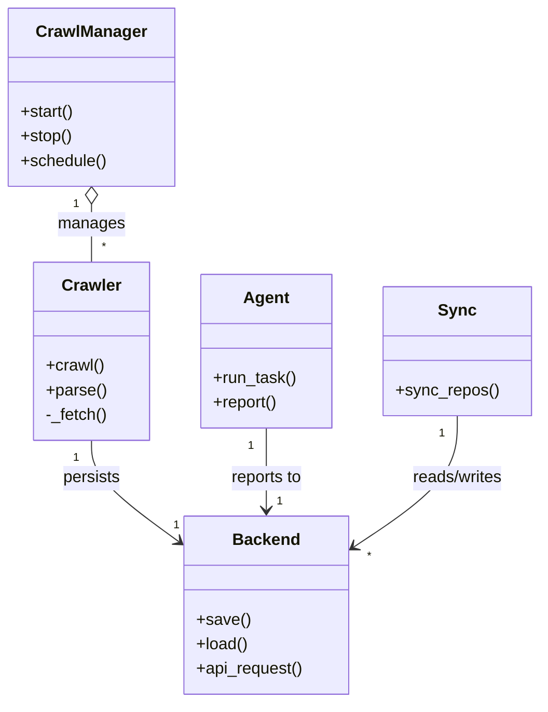
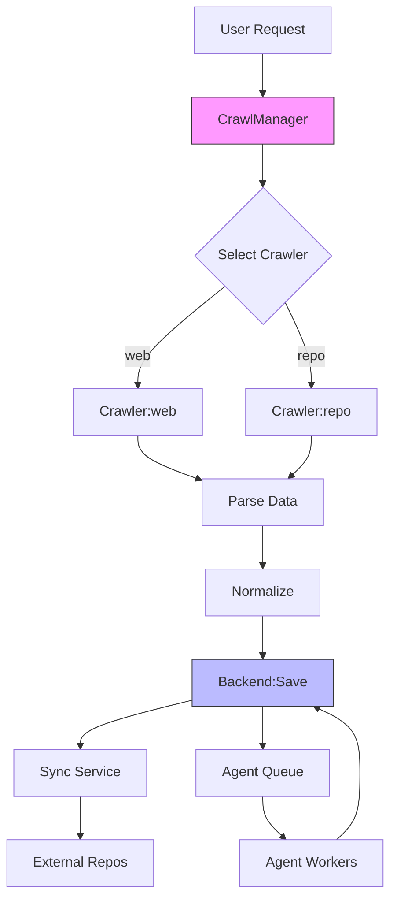

# Diagram: common/subscription_service/config/config.test.yml

> Auto-generated by Obscura crawlers

## Diagram 1

### SVG

<svg id="container" width="518.3515625" xmlns="http://www.w3.org/2000/svg" class="classDiagram" height="686" viewBox="0 0 518.3515625 686" role="graphics-document document" aria-roledescription="class"><g><defs><marker id="container_class-aggregationStart" class="marker aggregation class" refX="18" refY="7" markerWidth="190" markerHeight="240" orient="auto"><path d="M 18,7 L9,13 L1,7 L9,1 Z"></path></marker></defs><defs><marker id="container_class-aggregationEnd" class="marker aggregation class" refX="1" refY="7" markerWidth="20" markerHeight="28" orient="auto"><path d="M 18,7 L9,13 L1,7 L9,1 Z"></path></marker></defs><defs><marker id="container_class-extensionStart" class="marker extension class" refX="18" refY="7" markerWidth="190" markerHeight="240" orient="auto"><path d="M 1,7 L18,13 V 1 Z"></path></marker></defs><defs><marker id="container_class-extensionEnd" class="marker extension class" refX="1" refY="7" markerWidth="20" markerHeight="28" orient="auto"><path d="M 1,1 V 13 L18,7 Z"></path></marker></defs><defs><marker id="container_class-compositionStart" class="marker composition class" refX="18" refY="7" markerWidth="190" markerHeight="240" orient="auto"><path d="M 18,7 L9,13 L1,7 L9,1 Z"></path></marker></defs><defs><marker id="container_class-compositionEnd" class="marker composition class" refX="1" refY="7" markerWidth="20" markerHeight="28" orient="auto"><path d="M 18,7 L9,13 L1,7 L9,1 Z"></path></marker></defs><defs><marker id="container_class-dependencyStart" class="marker dependency class" refX="6" refY="7" markerWidth="190" markerHeight="240" orient="auto"><path d="M 5,7 L9,13 L1,7 L9,1 Z"></path></marker></defs><defs><marker id="container_class-dependencyEnd" class="marker dependency class" refX="13" refY="7" markerWidth="20" markerHeight="28" orient="auto"><path d="M 18,7 L9,13 L14,7 L9,1 Z"></path></marker></defs><defs><marker id="container_class-lollipopStart" class="marker lollipop class" refX="13" refY="7" markerWidth="190" markerHeight="240" orient="auto"><circle stroke="black" fill="transparent" cx="7" cy="7" r="6"></circle></marker></defs><defs><marker id="container_class-lollipopEnd" class="marker lollipop class" refX="1" refY="7" markerWidth="190" markerHeight="240" orient="auto"><circle stroke="black" fill="transparent" cx="7" cy="7" r="6"></circle></marker></defs><g class="root"><g class="clusters"></g><g class="edgePaths"><path d="M87.688,199.25L87.688,202.542C87.688,205.833,87.688,212.417,87.688,221.875C87.688,231.333,87.688,243.667,87.688,249.833L87.688,256" id="id_CrawlManager_Crawler_1" class="edge-thickness-normal edge-pattern-solid relation" style=";;;" data-edge="true" data-et="edge" data-id="id_CrawlManager_Crawler_1" data-points="W3sieCI6ODcuNjg3NSwieSI6MTgyfSx7IngiOjg3LjY4NzUsInkiOjIxOX0seyJ4Ijo4Ny42ODc1LCJ5IjoyNTZ9XQ==" marker-start="url(#container_class-aggregationStart)"></path><path d="M87.688,430L87.688,436.167C87.688,442.333,87.688,454.667,101.733,471.141C115.778,487.615,143.869,508.23,157.914,518.537L171.96,528.844" id="id_Crawler_Backend_2" class="edge-thickness-normal edge-pattern-solid relation" style=";;;" data-edge="true" data-et="edge" data-id="id_Crawler_Backend_2" data-points="W3sieCI6ODcuNjg3NSwieSI6NDMwfSx7IngiOjg3LjY4NzUsInkiOjQ2N30seyJ4IjoxNzYuNzk2ODc1LCJ5Ijo1MzIuMzk0MTE4NzM0OTczMn1d" marker-end="url(#container_class-dependencyEnd)"></path><path d="M256.656,418L256.656,426.167C256.656,434.333,256.656,450.667,256.656,464C256.656,477.333,256.656,487.667,256.656,492.833L256.656,498" id="id_Agent_Backend_3" class="edge-thickness-normal edge-pattern-solid relation" style=";;;" data-edge="true" data-et="edge" data-id="id_Agent_Backend_3" data-points="W3sieCI6MjU2LjY1NjI1LCJ5Ijo0MTh9LHsieCI6MjU2LjY1NjI1LCJ5Ijo0Njd9LHsieCI6MjU2LjY1NjI1LCJ5Ijo1MDR9XQ==" marker-end="url(#container_class-dependencyEnd)"></path><path d="M440.047,406L440.047,416.167C440.047,426.333,440.047,446.667,423.62,467.94C407.193,489.214,374.34,511.428,357.913,522.535L341.486,533.642" id="id_Sync_Backend_4" class="edge-thickness-normal edge-pattern-solid relation" style=";;;" data-edge="true" data-et="edge" data-id="id_Sync_Backend_4" data-points="W3sieCI6NDQwLjA0Njg3NSwieSI6NDA2fSx7IngiOjQ0MC4wNDY4NzUsInkiOjQ2N30seyJ4IjozMzYuNTE1NjI1LCJ5Ijo1MzcuMDAyODk2ODIyMDE1OH1d" marker-end="url(#container_class-dependencyEnd)"></path></g><g class="edgeLabels"><g class="edgeLabel" transform="translate(87.6875, 219)"><g class="label" data-id="id_CrawlManager_Crawler_1" transform="translate(-32.296875, -12)"><foreignObject width="64.59375" height="24">

manages

</foreignObject></g></g><g class="edgeLabel" transform="translate(87.6875, 467)"><g class="label" data-id="id_Crawler_Backend_2" transform="translate(-28.4375, -12)"><foreignObject width="56.875" height="24">

persists

</foreignObject></g></g><g class="edgeLabel" transform="translate(256.65625, 467)"><g class="label" data-id="id_Agent_Backend_3" transform="translate(-35.90625, -12)"><foreignObject width="71.8125" height="24">

reports to

</foreignObject></g></g><g class="edgeLabel" transform="translate(440.046875, 467)"><g class="label" data-id="id_Sync_Backend_4" transform="translate(-45.9453125, -12)"><foreignObject width="91.890625" height="24">

reads/writes

</foreignObject></g></g><g class="edgeTerminals" transform="translate(72.6875, 199.5)"><g class="inner" transform="translate(0, 0)"><foreignObject style="width: 9px; height: 12px;">
1
</foreignObject></g></g><g class="edgeTerminals" transform="translate(72.6875, 447.5)"><g class="inner" transform="translate(0, 0)"><foreignObject style="width: 9px; height: 12px;">
1
</foreignObject></g></g><g class="edgeTerminals" transform="translate(241.65625, 435.5)"><g class="inner" transform="translate(0, 0)"><foreignObject style="width: 9px; height: 12px;">
1
</foreignObject></g></g><g class="edgeTerminals" transform="translate(425.04687750000016, 423.5000021428571)"><g class="inner" transform="translate(0, 0)"><foreignObject style="width: 9px; height: 12px;">
1
</foreignObject></g></g><g class="edgeTerminals" transform="translate(97.6875, 233.5)"><g class="inner" transform="translate(0, 0)"></g><foreignObject style="width: 9px; height: 12px;">
*
</foreignObject></g><g class="edgeTerminals" transform="translate(166.562982992879, 504.94737393041953)"><g class="inner" transform="translate(0, 0)"></g><foreignObject style="width: 9px; height: 12px;">
1
</foreignObject></g><g class="edgeTerminals" transform="translate(266.65625, 481.5)"><g class="inner" transform="translate(0, 0)"></g><foreignObject style="width: 9px; height: 12px;">
1
</foreignObject></g><g class="edgeTerminals" transform="translate(354.4146539576294, 534.6267351562623)"><g class="inner" transform="translate(0, 0)"></g><foreignObject style="width: 9px; height: 12px;">
*
</foreignObject></g></g><g class="nodes"><g class="node default" id="classId-CrawlManager-0" transform="translate(87.6875, 95)"><g class="basic label-container"><path d="M-79.6875 -87 L79.6875 -87 L79.6875 87 L-79.6875 87" stroke="none" stroke-width="0" fill="#ECECFF" style=""></path><path d="M-79.6875 -87 C-44.3452869048488 -87, -9.003073809697597 -87, 79.6875 -87 M-79.6875 -87 C-36.13486454033922 -87, 7.417770919321555 -87, 79.6875 -87 M79.6875 -87 C79.6875 -34.704977463565356, 79.6875 17.590045072869287, 79.6875 87 M79.6875 -87 C79.6875 -33.171001521634786, 79.6875 20.65799695673043, 79.6875 87 M79.6875 87 C24.54397329466888 87, -30.59955341066224 87, -79.6875 87 M79.6875 87 C21.654686471071102 87, -36.378127057857796 87, -79.6875 87 M-79.6875 87 C-79.6875 31.85537823686434, -79.6875 -23.28924352627132, -79.6875 -87 M-79.6875 87 C-79.6875 27.657121223414123, -79.6875 -31.685757553171754, -79.6875 -87" stroke="#9370DB" stroke-width="1.3" fill="none" stroke-dasharray="0 0" style=""></path></g><g class="annotation-group text" transform="translate(0, -63)"></g><g class="label-group text" transform="translate(-51.59375, -63)"><g class="label" style="font-weight: bolder" transform="translate(0,-12)"><foreignObject width="103.1875" height="24">

CrawlManager

</foreignObject></g></g><g class="members-group text" transform="translate(-67.6875, -15)"></g><g class="methods-group text" transform="translate(-67.6875, 15)"><g class="label" style="" transform="translate(0,-12)"><foreignObject width="52.15625" height="24">

+start()

</foreignObject></g><g class="label" style="" transform="translate(0,12)"><foreignObject width="50.21875" height="24">

+stop()

</foreignObject></g><g class="label" style="" transform="translate(0,36)"><foreignObject width="83.78125" height="24">

+schedule()

</foreignObject></g></g><g class="divider" style=""><path d="M-79.6875 -39 C-30.820518223720832 -39, 18.046463552558336 -39, 79.6875 -39 M-79.6875 -39 C-19.85793661186829 -39, 39.97162677626342 -39, 79.6875 -39" stroke="#9370DB" stroke-width="1.3" fill="none" stroke-dasharray="0 0" style=""></path></g><g class="divider" style=""><path d="M-79.6875 -15 C-30.6922866288619 -15, 18.3029267422762 -15, 79.6875 -15 M-79.6875 -15 C-25.156690162716522 -15, 29.374119674566955 -15, 79.6875 -15" stroke="#9370DB" stroke-width="1.3" fill="none" stroke-dasharray="0 0" style=""></path></g></g><g class="node default" id="classId-Crawler-1" transform="translate(87.6875, 343)"><g class="basic label-container"><path d="M-55.8828125 -87 L55.8828125 -87 L55.8828125 87 L-55.8828125 87" stroke="none" stroke-width="0" fill="#ECECFF" style=""></path><path d="M-55.8828125 -87 C-27.166413423227436 -87, 1.5499856535451286 -87, 55.8828125 -87 M-55.8828125 -87 C-26.109691019793576 -87, 3.6634304604128474 -87, 55.8828125 -87 M55.8828125 -87 C55.8828125 -50.597031831467454, 55.8828125 -14.194063662934909, 55.8828125 87 M55.8828125 -87 C55.8828125 -19.554851920105207, 55.8828125 47.890296159789585, 55.8828125 87 M55.8828125 87 C29.487016890880156 87, 3.091221281760312 87, -55.8828125 87 M55.8828125 87 C18.637391623646856 87, -18.608029252706288 87, -55.8828125 87 M-55.8828125 87 C-55.8828125 49.66587068581089, -55.8828125 12.331741371621774, -55.8828125 -87 M-55.8828125 87 C-55.8828125 32.764831726347914, -55.8828125 -21.47033654730417, -55.8828125 -87" stroke="#9370DB" stroke-width="1.3" fill="none" stroke-dasharray="0 0" style=""></path></g><g class="annotation-group text" transform="translate(0, -63)"></g><g class="label-group text" transform="translate(-27.734375, -63)"><g class="label" style="font-weight: bolder" transform="translate(0,-12)"><foreignObject width="55.46875" height="24">

Crawler

</foreignObject></g></g><g class="members-group text" transform="translate(-43.8828125, -15)"></g><g class="methods-group text" transform="translate(-43.8828125, 15)"><g class="label" style="" transform="translate(0,-12)"><foreignObject width="56.40625" height="24">

+crawl()

</foreignObject></g><g class="label" style="" transform="translate(0,12)"><foreignObject width="58.53125" height="24">

+parse()

</foreignObject></g><g class="label" style="" transform="translate(0,36)"><foreignObject width="60.03125" height="24">

-_fetch()

</foreignObject></g></g><g class="divider" style=""><path d="M-55.8828125 -39 C-23.03897854435347 -39, 9.804855411293062 -39, 55.8828125 -39 M-55.8828125 -39 C-32.151316342922144 -39, -8.419820185844294 -39, 55.8828125 -39" stroke="#9370DB" stroke-width="1.3" fill="none" stroke-dasharray="0 0" style=""></path></g><g class="divider" style=""><path d="M-55.8828125 -15 C-27.22239326489789 -15, 1.4380259702042224 -15, 55.8828125 -15 M-55.8828125 -15 C-27.614053889024895 -15, 0.6547047219502105 -15, 55.8828125 -15" stroke="#9370DB" stroke-width="1.3" fill="none" stroke-dasharray="0 0" style=""></path></g></g><g class="node default" id="classId-Backend-2" transform="translate(256.65625, 591)"><g class="basic label-container"><path d="M-79.859375 -87 L79.859375 -87 L79.859375 87 L-79.859375 87" stroke="none" stroke-width="0" fill="#ECECFF" style=""></path><path d="M-79.859375 -87 C-31.5663960491719 -87, 16.7265829016562 -87, 79.859375 -87 M-79.859375 -87 C-19.57591077583225 -87, 40.7075534483355 -87, 79.859375 -87 M79.859375 -87 C79.859375 -29.691239763590765, 79.859375 27.61752047281847, 79.859375 87 M79.859375 -87 C79.859375 -32.68731410554152, 79.859375 21.625371788916965, 79.859375 87 M79.859375 87 C43.14509175806608 87, 6.43080851613216 87, -79.859375 87 M79.859375 87 C27.642712645163137 87, -24.573949709673727 87, -79.859375 87 M-79.859375 87 C-79.859375 21.691527893710457, -79.859375 -43.616944212579085, -79.859375 -87 M-79.859375 87 C-79.859375 39.55718499772276, -79.859375 -7.885630004554486, -79.859375 -87" stroke="#9370DB" stroke-width="1.3" fill="none" stroke-dasharray="0 0" style=""></path></g><g class="annotation-group text" transform="translate(0, -63)"></g><g class="label-group text" transform="translate(-31.296875, -63)"><g class="label" style="font-weight: bolder" transform="translate(0,-12)"><foreignObject width="62.59375" height="24">

Backend

</foreignObject></g></g><g class="members-group text" transform="translate(-67.859375, -15)"></g><g class="methods-group text" transform="translate(-67.859375, 15)"><g class="label" style="" transform="translate(0,-12)"><foreignObject width="50.65625" height="24">

+save()

</foreignObject></g><g class="label" style="" transform="translate(0,12)"><foreignObject width="50.421875" height="24">

+load()

</foreignObject></g><g class="label" style="" transform="translate(0,36)"><foreignObject width="104.421875" height="24">

+api_request()

</foreignObject></g></g><g class="divider" style=""><path d="M-79.859375 -39 C-19.27649778531599 -39, 41.30637942936802 -39, 79.859375 -39 M-79.859375 -39 C-34.395167106042976 -39, 11.069040787914048 -39, 79.859375 -39" stroke="#9370DB" stroke-width="1.3" fill="none" stroke-dasharray="0 0" style=""></path></g><g class="divider" style=""><path d="M-79.859375 -15 C-28.802984804438246 -15, 22.253405391123508 -15, 79.859375 -15 M-79.859375 -15 C-24.861628545781343 -15, 30.136117908437313 -15, 79.859375 -15" stroke="#9370DB" stroke-width="1.3" fill="none" stroke-dasharray="0 0" style=""></path></g></g><g class="node default" id="classId-Agent-3" transform="translate(256.65625, 343)"><g class="basic label-container"><path d="M-63.0859375 -75 L63.0859375 -75 L63.0859375 75 L-63.0859375 75" stroke="none" stroke-width="0" fill="#ECECFF" style=""></path><path d="M-63.0859375 -75 C-21.778780083458336 -75, 19.528377333083327 -75, 63.0859375 -75 M-63.0859375 -75 C-30.63476468143587 -75, 1.8164081371282634 -75, 63.0859375 -75 M63.0859375 -75 C63.0859375 -42.9483292964895, 63.0859375 -10.896658592978994, 63.0859375 75 M63.0859375 -75 C63.0859375 -41.002957806614084, 63.0859375 -7.005915613228169, 63.0859375 75 M63.0859375 75 C24.69404827375395 75, -13.6978409524921 75, -63.0859375 75 M63.0859375 75 C16.540776638252687 75, -30.004384223494625 75, -63.0859375 75 M-63.0859375 75 C-63.0859375 44.4537877553301, -63.0859375 13.907575510660202, -63.0859375 -75 M-63.0859375 75 C-63.0859375 27.34680715813012, -63.0859375 -20.306385683739762, -63.0859375 -75" stroke="#9370DB" stroke-width="1.3" fill="none" stroke-dasharray="0 0" style=""></path></g><g class="annotation-group text" transform="translate(0, -51)"></g><g class="label-group text" transform="translate(-21.078125, -51)"><g class="label" style="font-weight: bolder" transform="translate(0,-12)"><foreignObject width="42.15625" height="24">

Agent

</foreignObject></g></g><g class="members-group text" transform="translate(-51.0859375, -3)"></g><g class="methods-group text" transform="translate(-51.0859375, 27)"><g class="label" style="" transform="translate(0,-12)"><foreignObject width="81.09375" height="24">

+run_task()

</foreignObject></g><g class="label" style="" transform="translate(0,12)"><foreignObject width="63.578125" height="24">

+report()

</foreignObject></g></g><g class="divider" style=""><path d="M-63.0859375 -27 C-13.806576595840113 -27, 35.472784308319774 -27, 63.0859375 -27 M-63.0859375 -27 C-32.39054605318874 -27, -1.6951546063774785 -27, 63.0859375 -27" stroke="#9370DB" stroke-width="1.3" fill="none" stroke-dasharray="0 0" style=""></path></g><g class="divider" style=""><path d="M-63.0859375 -3 C-17.729416012255875 -3, 27.62710547548825 -3, 63.0859375 -3 M-63.0859375 -3 C-15.519341377399897 -3, 32.047254745200206 -3, 63.0859375 -3" stroke="#9370DB" stroke-width="1.3" fill="none" stroke-dasharray="0 0" style=""></path></g></g><g class="node default" id="classId-Sync-4" transform="translate(440.046875, 343)"><g class="basic label-container"><path d="M-70.3046875 -63 L70.3046875 -63 L70.3046875 63 L-70.3046875 63" stroke="none" stroke-width="0" fill="#ECECFF" style=""></path><path d="M-70.3046875 -63 C-36.87731135448728 -63, -3.4499352089745656 -63, 70.3046875 -63 M-70.3046875 -63 C-38.04914082055915 -63, -5.793594141118305 -63, 70.3046875 -63 M70.3046875 -63 C70.3046875 -13.99925175814451, 70.3046875 35.00149648371098, 70.3046875 63 M70.3046875 -63 C70.3046875 -16.153401729380725, 70.3046875 30.69319654123855, 70.3046875 63 M70.3046875 63 C39.23401560958753 63, 8.163343719175067 63, -70.3046875 63 M70.3046875 63 C29.873536980844037 63, -10.557613538311927 63, -70.3046875 63 M-70.3046875 63 C-70.3046875 21.843299905140547, -70.3046875 -19.313400189718905, -70.3046875 -63 M-70.3046875 63 C-70.3046875 26.79337189384257, -70.3046875 -9.413256212314863, -70.3046875 -63" stroke="#9370DB" stroke-width="1.3" fill="none" stroke-dasharray="0 0" style=""></path></g><g class="annotation-group text" transform="translate(0, -39)"></g><g class="label-group text" transform="translate(-17.09375, -39)"><g class="label" style="font-weight: bolder" transform="translate(0,-12)"><foreignObject width="34.1875" height="24">

Sync

</foreignObject></g></g><g class="members-group text" transform="translate(-58.3046875, 9)"></g><g class="methods-group text" transform="translate(-58.3046875, 39)"><g class="label" style="" transform="translate(0,-12)"><foreignObject width="99.515625" height="24">

+sync_repos()

</foreignObject></g></g><g class="divider" style=""><path d="M-70.3046875 -15 C-22.297312152548884 -15, 25.710063194902233 -15, 70.3046875 -15 M-70.3046875 -15 C-17.71641139732362 -15, 34.87186470535276 -15, 70.3046875 -15" stroke="#9370DB" stroke-width="1.3" fill="none" stroke-dasharray="0 0" style=""></path></g><g class="divider" style=""><path d="M-70.3046875 9 C-33.670984239402934 9, 2.9627190211941326 9, 70.3046875 9 M-70.3046875 9 C-33.46405065736354 9, 3.376586185272913 9, 70.3046875 9" stroke="#9370DB" stroke-width="1.3" fill="none" stroke-dasharray="0 0" style=""></path></g></g></g></g></g></svg>

## Diagram 2

### SVG

<svg id="container" width="446.32421875" xmlns="http://www.w3.org/2000/svg" class="flowchart" height="1028.375" viewBox="0 0 446.32421875 1028.375" role="graphics-document document" aria-roledescription="flowchart-v2"><g><marker id="container_flowchart-v2-pointEnd" class="marker flowchart-v2" viewBox="0 0 10 10" refX="5" refY="5" markerUnits="userSpaceOnUse" markerWidth="8" markerHeight="8" orient="auto"><path d="M 0 0 L 10 5 L 0 10 z" class="arrowMarkerPath" style="stroke-width: 1; stroke-dasharray: 1, 0;"></path></marker><marker id="container_flowchart-v2-pointStart" class="marker flowchart-v2" viewBox="0 0 10 10" refX="4.5" refY="5" markerUnits="userSpaceOnUse" markerWidth="8" markerHeight="8" orient="auto"><path d="M 0 5 L 10 10 L 10 0 z" class="arrowMarkerPath" style="stroke-width: 1; stroke-dasharray: 1, 0;"></path></marker><marker id="container_flowchart-v2-circleEnd" class="marker flowchart-v2" viewBox="0 0 10 10" refX="11" refY="5" markerUnits="userSpaceOnUse" markerWidth="11" markerHeight="11" orient="auto"><circle cx="5" cy="5" r="5" class="arrowMarkerPath" style="stroke-width: 1; stroke-dasharray: 1, 0;"></circle></marker><marker id="container_flowchart-v2-circleStart" class="marker flowchart-v2" viewBox="0 0 10 10" refX="-1" refY="5" markerUnits="userSpaceOnUse" markerWidth="11" markerHeight="11" orient="auto"><circle cx="5" cy="5" r="5" class="arrowMarkerPath" style="stroke-width: 1; stroke-dasharray: 1, 0;"></circle></marker><marker id="container_flowchart-v2-crossEnd" class="marker cross flowchart-v2" viewBox="0 0 11 11" refX="12" refY="5.2" markerUnits="userSpaceOnUse" markerWidth="11" markerHeight="11" orient="auto"><path d="M 1,1 l 9,9 M 10,1 l -9,9" class="arrowMarkerPath" style="stroke-width: 2; stroke-dasharray: 1, 0;"></path></marker><marker id="container_flowchart-v2-crossStart" class="marker cross flowchart-v2" viewBox="0 0 11 11" refX="-1" refY="5.2" markerUnits="userSpaceOnUse" markerWidth="11" markerHeight="11" orient="auto"><path d="M 1,1 l 9,9 M 10,1 l -9,9" class="arrowMarkerPath" style="stroke-width: 2; stroke-dasharray: 1, 0;"></path></marker><g class="root"><g class="clusters"></g><g class="edgePaths"><path d="M300.652,62L300.652,66.167C300.652,70.333,300.652,78.667,300.652,86.333C300.652,94,300.652,101,300.652,104.5L300.652,108" id="L_A_B_0" class="edge-thickness-normal edge-pattern-solid edge-thickness-normal edge-pattern-solid flowchart-link" style=";" data-edge="true" data-et="edge" data-id="L_A_B_0" data-points="W3sieCI6MzAwLjY1MjM0Mzc1LCJ5Ijo2Mn0seyJ4IjozMDAuNjUyMzQzNzUsInkiOjg3fSx7IngiOjMwMC42NTIzNDM3NSwieSI6MTEyfV0=" marker-end="url(#container_flowchart-v2-pointEnd)"></path><path d="M300.652,166L300.652,170.167C300.652,174.333,300.652,182.667,300.652,190.333C300.652,198,300.652,205,300.652,208.5L300.652,212" id="L_B_C_0" class="edge-thickness-normal edge-pattern-solid edge-thickness-normal edge-pattern-solid flowchart-link" style=";" data-edge="true" data-et="edge" data-id="L_B_C_0" data-points="W3sieCI6MzAwLjY1MjM0Mzc1LCJ5IjoxNjZ9LHsieCI6MzAwLjY1MjM0Mzc1LCJ5IjoxOTF9LHsieCI6MzAwLjY1MjM0Mzc1LCJ5IjoyMTZ9XQ==" marker-end="url(#container_flowchart-v2-pointEnd)"></path><path d="M257.235,328.957L240.498,342.36C223.762,355.763,190.289,382.569,173.553,401.472C156.816,420.375,156.816,431.375,156.816,436.875L156.816,442.375" id="L_C_D_0" class="edge-thickness-normal edge-pattern-solid edge-thickness-normal edge-pattern-solid flowchart-link" style=";" data-edge="true" data-et="edge" data-id="L_C_D_0" data-points="W3sieCI6MjU3LjIzNDc1Nzc5MDExNDYsInkiOjMyOC45NTc0MTQwNDAxMTQ2fSx7IngiOjE1Ni44MTY0MDYyNSwieSI6NDA5LjM3NX0seyJ4IjoxNTYuODE2NDA2MjUsInkiOjQ0Ni4zNzV9XQ==" marker-end="url(#container_flowchart-v2-pointEnd)"></path><path d="M326.112,346.916L331.138,357.326C336.164,367.735,346.217,388.555,351.243,404.465C356.27,420.375,356.27,431.375,356.27,436.875L356.27,442.375" id="L_C_E_0" class="edge-thickness-normal edge-pattern-solid edge-thickness-normal edge-pattern-solid flowchart-link" style=";" data-edge="true" data-et="edge" data-id="L_C_E_0" data-points="W3sieCI6MzI2LjExMTY0OTk5Nzk5ODksInkiOjM0Ni45MTU2OTM3NTIwMDExfSx7IngiOjM1Ni4yNjk1MzEyNSwieSI6NDA5LjM3NX0seyJ4IjozNTYuMjY5NTMxMjUsInkiOjQ0Ni4zNzV9XQ==" marker-end="url(#container_flowchart-v2-pointEnd)"></path><path d="M156.816,500.375L156.816,504.542C156.816,508.708,156.816,517.042,168.769,525.529C180.721,534.017,204.626,542.659,216.579,546.98L228.531,551.302" id="L_D_F_0" class="edge-thickness-normal edge-pattern-solid edge-thickness-normal edge-pattern-solid flowchart-link" style=";" data-edge="true" data-et="edge" data-id="L_D_F_0" data-points="W3sieCI6MTU2LjgxNjQwNjI1LCJ5Ijo1MDAuMzc1fSx7IngiOjE1Ni44MTY0MDYyNSwieSI6NTI1LjM3NX0seyJ4IjoyMzIuMjkyOTY4NzUsInkiOjU1Mi42NjE1MTM0OTczNjU3fV0=" marker-end="url(#container_flowchart-v2-pointEnd)"></path><path d="M356.27,500.375L356.27,504.542C356.27,508.708,356.27,517.042,352.3,524.92C348.33,532.798,340.391,540.22,336.422,543.932L332.452,547.643" id="L_E_F_0" class="edge-thickness-normal edge-pattern-solid edge-thickness-normal edge-pattern-solid flowchart-link" style=";" data-edge="true" data-et="edge" data-id="L_E_F_0" data-points="W3sieCI6MzU2LjI2OTUzMTI1LCJ5Ijo1MDAuMzc1fSx7IngiOjM1Ni4yNjk1MzEyNSwieSI6NTI1LjM3NX0seyJ4IjozMjkuNTMwNDk4Nzk4MDc2OSwieSI6NTUwLjM3NX1d" marker-end="url(#container_flowchart-v2-pointEnd)"></path><path d="M300.652,604.375L300.652,608.542C300.652,612.708,300.652,621.042,300.652,628.708C300.652,636.375,300.652,643.375,300.652,646.875L300.652,650.375" id="L_F_G_0" class="edge-thickness-normal edge-pattern-solid edge-thickness-normal edge-pattern-solid flowchart-link" style=";" data-edge="true" data-et="edge" data-id="L_F_G_0" data-points="W3sieCI6MzAwLjY1MjM0Mzc1LCJ5Ijo2MDQuMzc1fSx7IngiOjMwMC42NTIzNDM3NSwieSI6NjI5LjM3NX0seyJ4IjozMDAuNjUyMzQzNzUsInkiOjY1NC4zNzV9XQ==" marker-end="url(#container_flowchart-v2-pointEnd)"></path><path d="M300.652,708.375L300.652,712.542C300.652,716.708,300.652,725.042,300.652,732.708C300.652,740.375,300.652,747.375,300.652,750.875L300.652,754.375" id="L_G_H_0" class="edge-thickness-normal edge-pattern-solid edge-thickness-normal edge-pattern-solid flowchart-link" style=";" data-edge="true" data-et="edge" data-id="L_G_H_0" data-points="W3sieCI6MzAwLjY1MjM0Mzc1LCJ5Ijo3MDguMzc1fSx7IngiOjMwMC42NTIzNDM3NSwieSI6NzMzLjM3NX0seyJ4IjozMDAuNjUyMzQzNzUsInkiOjc1OC4zNzV9XQ==" marker-end="url(#container_flowchart-v2-pointEnd)"></path><path d="M220.973,805.237L199.485,810.593C177.997,815.95,135.022,826.662,113.535,835.519C92.047,844.375,92.047,851.375,92.047,854.875L92.047,858.375" id="L_H_I_0" class="edge-thickness-normal edge-pattern-solid edge-thickness-normal edge-pattern-solid flowchart-link" style=";" data-edge="true" data-et="edge" data-id="L_H_I_0" data-points="W3sieCI6MjIwLjk3MjY1NjI1LCJ5Ijo4MDUuMjM3MTA1MTI1MTgwM30seyJ4Ijo5Mi4wNDY4NzUsInkiOjgzNy4zNzV9LHsieCI6OTIuMDQ2ODc1LCJ5Ijo4NjIuMzc1fV0=" marker-end="url(#container_flowchart-v2-pointEnd)"></path><path d="M92.047,916.375L92.047,920.542C92.047,924.708,92.047,933.042,92.047,940.708C92.047,948.375,92.047,955.375,92.047,958.875L92.047,962.375" id="L_I_J_0" class="edge-thickness-normal edge-pattern-solid edge-thickness-normal edge-pattern-solid flowchart-link" style=";" data-edge="true" data-et="edge" data-id="L_I_J_0" data-points="W3sieCI6OTIuMDQ2ODc1LCJ5Ijo5MTYuMzc1fSx7IngiOjkyLjA0Njg3NSwieSI6OTQxLjM3NX0seyJ4Ijo5Mi4wNDY4NzUsInkiOjk2Ni4zNzV9XQ==" marker-end="url(#container_flowchart-v2-pointEnd)"></path><path d="M300.652,812.375L300.652,816.542C300.652,820.708,300.652,829.042,300.652,836.708C300.652,844.375,300.652,851.375,300.652,854.875L300.652,858.375" id="L_H_K_0" class="edge-thickness-normal edge-pattern-solid edge-thickness-normal edge-pattern-solid flowchart-link" style=";" data-edge="true" data-et="edge" data-id="L_H_K_0" data-points="W3sieCI6MzAwLjY1MjM0Mzc1LCJ5Ijo4MTIuMzc1fSx7IngiOjMwMC42NTIzNDM3NSwieSI6ODM3LjM3NX0seyJ4IjozMDAuNjUyMzQzNzUsInkiOjg2Mi4zNzV9XQ==" marker-end="url(#container_flowchart-v2-pointEnd)"></path><path d="M300.652,916.375L300.652,920.542C300.652,924.708,300.652,933.042,304.622,940.92C308.591,948.798,316.53,956.22,320.5,959.932L324.47,963.643" id="L_K_L_0" class="edge-thickness-normal edge-pattern-solid edge-thickness-normal edge-pattern-solid flowchart-link" style=";" data-edge="true" data-et="edge" data-id="L_K_L_0" data-points="W3sieCI6MzAwLjY1MjM0Mzc1LCJ5Ijo5MTYuMzc1fSx7IngiOjMwMC42NTIzNDM3NSwieSI6OTQxLjM3NX0seyJ4IjozMjcuMzkxMzc2MjAxOTIzMSwieSI6OTY2LjM3NX1d" marker-end="url(#container_flowchart-v2-pointEnd)"></path><path d="M385.148,966.375L389.604,962.208C394.061,958.042,402.974,949.708,407.43,936.875C411.887,924.042,411.887,906.708,411.887,889.375C411.887,872.042,411.887,854.708,403.578,842.157C395.269,829.606,378.65,821.838,370.341,817.953L362.032,814.069" id="L_L_H_0" class="edge-thickness-normal edge-pattern-solid edge-thickness-normal edge-pattern-solid flowchart-link" style=";" data-edge="true" data-et="edge" data-id="L_L_H_0" data-points="W3sieCI6Mzg1LjE0NzY4NjI5ODA3NjksInkiOjk2Ni4zNzV9LHsieCI6NDExLjg4NjcxODc1LCJ5Ijo5NDEuMzc1fSx7IngiOjQxMS44ODY3MTg3NSwieSI6ODg5LjM3NX0seyJ4Ijo0MTEuODg2NzE4NzUsInkiOjgzNy4zNzV9LHsieCI6MzU4LjQwODY1Mzg0NjE1Mzg3LCJ5Ijo4MTIuMzc1fV0=" marker-end="url(#container_flowchart-v2-pointEnd)"></path></g><g class="edgeLabels"><g class="edgeLabel"><g class="label" data-id="L_A_B_0" transform="translate(0, 0)"><foreignObject width="0" height="0">

</foreignObject></g></g><g class="edgeLabel"><g class="label" data-id="L_B_C_0" transform="translate(0, 0)"><foreignObject width="0" height="0">

</foreignObject></g></g><g class="edgeLabel" transform="translate(156.81640625, 409.375)"><g class="label" data-id="L_C_D_0" transform="translate(-14.8515625, -12)"><foreignObject width="29.703125" height="24">

web

</foreignObject></g></g><g class="edgeLabel" transform="translate(356.26953125, 409.375)"><g class="label" data-id="L_C_E_0" transform="translate(-16.6328125, -12)"><foreignObject width="33.265625" height="24">

repo

</foreignObject></g></g><g class="edgeLabel"><g class="label" data-id="L_D_F_0" transform="translate(0, 0)"><foreignObject width="0" height="0">

</foreignObject></g></g><g class="edgeLabel"><g class="label" data-id="L_E_F_0" transform="translate(0, 0)"><foreignObject width="0" height="0">

</foreignObject></g></g><g class="edgeLabel"><g class="label" data-id="L_F_G_0" transform="translate(0, 0)"><foreignObject width="0" height="0">

</foreignObject></g></g><g class="edgeLabel"><g class="label" data-id="L_G_H_0" transform="translate(0, 0)"><foreignObject width="0" height="0">

</foreignObject></g></g><g class="edgeLabel"><g class="label" data-id="L_H_I_0" transform="translate(0, 0)"><foreignObject width="0" height="0">

</foreignObject></g></g><g class="edgeLabel"><g class="label" data-id="L_I_J_0" transform="translate(0, 0)"><foreignObject width="0" height="0">

</foreignObject></g></g><g class="edgeLabel"><g class="label" data-id="L_H_K_0" transform="translate(0, 0)"><foreignObject width="0" height="0">

</foreignObject></g></g><g class="edgeLabel"><g class="label" data-id="L_K_L_0" transform="translate(0, 0)"><foreignObject width="0" height="0">

</foreignObject></g></g><g class="edgeLabel"><g class="label" data-id="L_L_H_0" transform="translate(0, 0)"><foreignObject width="0" height="0">

</foreignObject></g></g></g><g class="nodes"><g class="node default" id="flowchart-A-0" transform="translate(300.65234375, 35)"><rect class="basic label-container" style="" x="-78.0703125" y="-27" width="156.140625" height="54"></rect><g class="label" style="" transform="translate(-48.0703125, -12)"><rect></rect><foreignObject width="96.140625" height="24">

User Request

</foreignObject></g></g><g class="node default" id="flowchart-B-1" transform="translate(300.65234375, 139)"><rect class="basic label-container" style="fill:#f9f !important;stroke:#333 !important;stroke-width:1px !important" x="-80.578125" y="-27" width="161.15625" height="54"></rect><g class="label" style="" transform="translate(-50.578125, -12)"><rect></rect><foreignObject width="101.15625" height="24">

CrawlManager

</foreignObject></g></g><g class="node default" id="flowchart-C-3" transform="translate(300.65234375, 294.1875)"><polygon points="78.1875,0 156.375,-78.1875 78.1875,-156.375 0,-78.1875" class="label-container" transform="translate(-77.6875, 78.1875)"></polygon><g class="label" style="" transform="translate(-51.1875, -12)"><rect></rect><foreignObject width="102.375" height="24">

Select Crawler

</foreignObject></g></g><g class="node default" id="flowchart-D-5" transform="translate(156.81640625, 473.375)"><rect class="basic label-container" style="" x="-73.8515625" y="-27" width="147.703125" height="54"></rect><g class="label" style="" transform="translate(-43.8515625, -12)"><rect></rect><foreignObject width="87.703125" height="24">

Crawler:web

</foreignObject></g></g><g class="node default" id="flowchart-E-7" transform="translate(356.26953125, 473.375)"><rect class="basic label-container" style="" x="-75.6015625" y="-27" width="151.203125" height="54"></rect><g class="label" style="" transform="translate(-45.6015625, -12)"><rect></rect><foreignObject width="91.203125" height="24">

Crawler:repo

</foreignObject></g></g><g class="node default" id="flowchart-F-9" transform="translate(300.65234375, 577.375)"><rect class="basic label-container" style="" x="-68.359375" y="-27" width="136.71875" height="54"></rect><g class="label" style="" transform="translate(-38.359375, -12)"><rect></rect><foreignObject width="76.71875" height="24">

Parse Data

</foreignObject></g></g><g class="node default" id="flowchart-G-13" transform="translate(300.65234375, 681.375)"><rect class="basic label-container" style="" x="-66.7578125" y="-27" width="133.515625" height="54"></rect><g class="label" style="" transform="translate(-36.7578125, -12)"><rect></rect><foreignObject width="73.515625" height="24">

Normalize

</foreignObject></g></g><g class="node default" id="flowchart-H-15" transform="translate(300.65234375, 785.375)"><rect class="basic label-container" style="fill:#bbf !important;stroke:#333 !important;stroke-width:1px !important" x="-79.6796875" y="-27" width="159.359375" height="54"></rect><g class="label" style="" transform="translate(-49.6796875, -12)"><rect></rect><foreignObject width="99.359375" height="24">

Backend:Save

</foreignObject></g></g><g class="node default" id="flowchart-I-17" transform="translate(92.046875, 889.375)"><rect class="basic label-container" style="" x="-74.875" y="-27" width="149.75" height="54"></rect><g class="label" style="" transform="translate(-44.875, -12)"><rect></rect><foreignObject width="89.75" height="24">

Sync Service

</foreignObject></g></g><g class="node default" id="flowchart-J-19" transform="translate(92.046875, 993.375)"><rect class="basic label-container" style="" x="-84.046875" y="-27" width="168.09375" height="54"></rect><g class="label" style="" transform="translate(-54.046875, -12)"><rect></rect><foreignObject width="108.09375" height="24">

External Repos

</foreignObject></g></g><g class="node default" id="flowchart-K-21" transform="translate(300.65234375, 889.375)"><rect class="basic label-container" style="" x="-76.234375" y="-27" width="152.46875" height="54"></rect><g class="label" style="" transform="translate(-46.234375, -12)"><rect></rect><foreignObject width="92.46875" height="24">

Agent Queue

</foreignObject></g></g><g class="node default" id="flowchart-L-23" transform="translate(356.26953125, 993.375)"><rect class="basic label-container" style="" x="-82.0546875" y="-27" width="164.109375" height="54"></rect><g class="label" style="" transform="translate(-52.0546875, -12)"><rect></rect><foreignObject width="104.109375" height="24">

Agent Workers

</foreignObject></g></g></g></g></g></svg>
