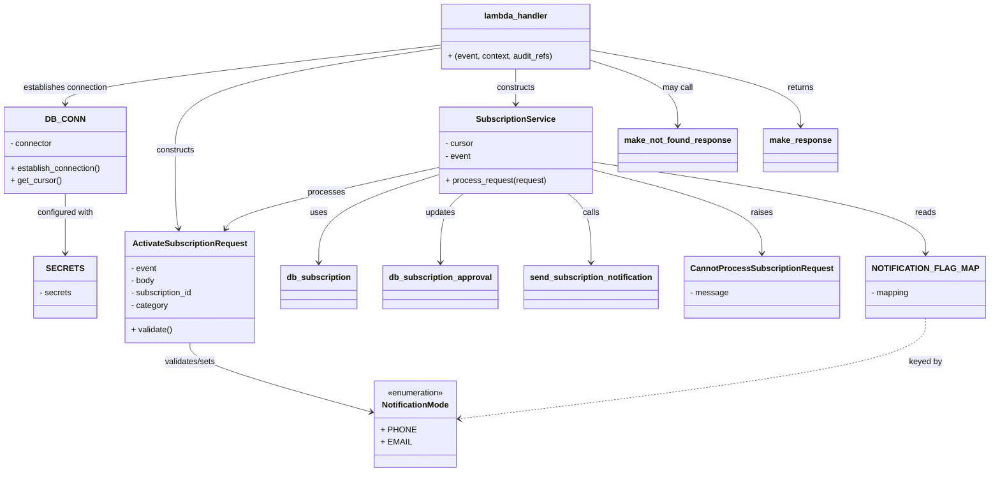

# Diagram: common/subscription_service/subscription_service/activate_subscription.py

> Auto-generated by Obscura crawlers

## Mermaid

### SVG

<svg id="container" width="1854.05078125" xmlns="http://www.w3.org/2000/svg" class="classDiagram" height="916" viewBox="0 0 1854.05078125 916" role="graphics-document document" aria-roledescription="class"><g><defs><marker id="container_class-aggregationStart" class="marker aggregation class" refX="18" refY="7" markerWidth="190" markerHeight="240" orient="auto"><path d="M 18,7 L9,13 L1,7 L9,1 Z"></path></marker></defs><defs><marker id="container_class-aggregationEnd" class="marker aggregation class" refX="1" refY="7" markerWidth="20" markerHeight="28" orient="auto"><path d="M 18,7 L9,13 L1,7 L9,1 Z"></path></marker></defs><defs><marker id="container_class-extensionStart" class="marker extension class" refX="18" refY="7" markerWidth="190" markerHeight="240" orient="auto"><path d="M 1,7 L18,13 V 1 Z"></path></marker></defs><defs><marker id="container_class-extensionEnd" class="marker extension class" refX="1" refY="7" markerWidth="20" markerHeight="28" orient="auto"><path d="M 1,1 V 13 L18,7 Z"></path></marker></defs><defs><marker id="container_class-compositionStart" class="marker composition class" refX="18" refY="7" markerWidth="190" markerHeight="240" orient="auto"><path d="M 18,7 L9,13 L1,7 L9,1 Z"></path></marker></defs><defs><marker id="container_class-compositionEnd" class="marker composition class" refX="1" refY="7" markerWidth="20" markerHeight="28" orient="auto"><path d="M 18,7 L9,13 L1,7 L9,1 Z"></path></marker></defs><defs><marker id="container_class-dependencyStart" class="marker dependency class" refX="6" refY="7" markerWidth="190" markerHeight="240" orient="auto"><path d="M 5,7 L9,13 L1,7 L9,1 Z"></path></marker></defs><defs><marker id="container_class-dependencyEnd" class="marker dependency class" refX="13" refY="7" markerWidth="20" markerHeight="28" orient="auto"><path d="M 18,7 L9,13 L14,7 L9,1 Z"></path></marker></defs><defs><marker id="container_class-lollipopStart" class="marker lollipop class" refX="13" refY="7" markerWidth="190" markerHeight="240" orient="auto"><circle stroke="black" fill="transparent" cx="7" cy="7" r="6"></circle></marker></defs><defs><marker id="container_class-lollipopEnd" class="marker lollipop class" refX="1" refY="7" markerWidth="190" markerHeight="240" orient="auto"><circle stroke="black" fill="transparent" cx="7" cy="7" r="6"></circle></marker></defs><g class="root"><g class="clusters"></g><g class="edgePaths"><path d="M367.035,666L367.035,672.167C367.035,678.333,367.035,690.667,423.234,713.101C479.434,735.535,591.832,768.069,648.031,784.337L704.231,800.604" id="id_ActivateSubscriptionRequest_NotificationMode_1" class="edge-thickness-normal edge-pattern-solid relation" style=";;;" data-edge="true" data-et="edge" data-id="id_ActivateSubscriptionRequest_NotificationMode_1" data-points="W3sieCI6MzY3LjAzNTE1NjI1LCJ5Ijo2NjZ9LHsieCI6MzY3LjAzNTE1NjI1LCJ5Ijo3MDN9LHsieCI6NzA5Ljk5NDE0MDYyNSwieSI6ODAyLjI3MjQ5ODMyOTY1fV0=" marker-end="url(#container_class-dependencyEnd)"></path><path d="M839.047,325.466L775.042,340.055C711.036,354.644,583.026,383.822,515.798,403.723C448.57,423.623,442.124,434.247,438.901,439.559L435.678,444.87" id="id_SubscriptionService_ActivateSubscriptionRequest_2" class="edge-thickness-normal edge-pattern-solid relation" style=";;;" data-edge="true" data-et="edge" data-id="id_SubscriptionService_ActivateSubscriptionRequest_2" data-points="W3sieCI6ODM5LjA0Njg3NSwieSI6MzI1LjQ2NjIyODU5NjIzNjkzfSx7IngiOjQ1NS4wMTU2MjUsInkiOjQxM30seyJ4Ijo0MzIuNTY1NDM2NDIyNDEzNzcsInkiOjQ1MH1d" marker-end="url(#container_class-dependencyEnd)"></path><path d="M839.047,339.939L801.752,352.115C764.457,364.292,689.867,388.646,652.572,416.99C615.277,445.333,615.277,477.667,615.277,493.833L615.277,510" id="id_SubscriptionService_db_subscription_3" class="edge-thickness-normal edge-pattern-solid relation" style=";;;" data-edge="true" data-et="edge" data-id="id_SubscriptionService_db_subscription_3" data-points="W3sieCI6ODM5LjA0Njg3NSwieSI6MzM5LjkzODU1OTMyMjAzMzl9LHsieCI6NjE1LjI3NzM0Mzc1LCJ5Ijo0MTN9LHsieCI6NjE1LjI3NzM0Mzc1LCJ5Ijo1MTZ9XQ==" marker-end="url(#container_class-dependencyEnd)"></path><path d="M887.472,376L880.248,382.167C873.024,388.333,858.576,400.667,851.353,423C844.129,445.333,844.129,477.667,844.129,493.833L844.129,510" id="id_SubscriptionService_db_subscription_approval_4" class="edge-thickness-normal edge-pattern-solid relation" style=";;;" data-edge="true" data-et="edge" data-id="id_SubscriptionService_db_subscription_approval_4" data-points="W3sieCI6ODg3LjQ3MTU1ODYyNjAzMywieSI6Mzc2fSx7IngiOjg0NC4xMjg5MDYyNSwieSI6NDEzfSx7IngiOjg0NC4xMjg5MDYyNSwieSI6NTE2fV0=" marker-end="url(#container_class-dependencyEnd)"></path><path d="M1084.271,376L1091.494,382.167C1098.718,388.333,1113.166,400.667,1120.39,423C1127.613,445.333,1127.613,477.667,1127.613,493.833L1127.613,510" id="id_SubscriptionService_send_subscription_notification_5" class="edge-thickness-normal edge-pattern-solid relation" style=";;;" data-edge="true" data-et="edge" data-id="id_SubscriptionService_send_subscription_notification_5" data-points="W3sieCI6MTA4NC4yNzA2Mjg4NzM5NjY5LCJ5IjozNzZ9LHsieCI6MTEyNy42MTMyODEyNSwieSI6NDEzfSx7IngiOjExMjcuNjEzMjgxMjUsInkiOjUxNn1d" marker-end="url(#container_class-dependencyEnd)"></path><path d="M1132.695,330.608L1184.917,344.34C1237.139,358.072,1341.583,385.536,1393.805,412.435C1446.027,439.333,1446.027,465.667,1446.027,478.833L1446.027,492" id="id_SubscriptionService_CannotProcessSubscriptionRequest_6" class="edge-thickness-normal edge-pattern-solid relation" style=";;;" data-edge="true" data-et="edge" data-id="id_SubscriptionService_CannotProcessSubscriptionRequest_6" data-points="W3sieCI6MTEzMi42OTUzMTI1LCJ5IjozMzAuNjA4MDM5MDQ5MjM1OTd9LHsieCI6MTQ0Ni4wMjczNDM3NSwieSI6NDEzfSx7IngiOjE0NDYuMDI3MzQzNzUsInkiOjQ5OH1d" marker-end="url(#container_class-dependencyEnd)"></path><path d="M1132.695,315.488L1234.287,331.74C1335.879,347.992,1539.063,380.496,1640.654,409.915C1742.246,439.333,1742.246,465.667,1742.246,478.833L1742.246,492" id="id_SubscriptionService_NOTIFICATION_FLAG_MAP_7" class="edge-thickness-normal edge-pattern-solid relation" style=";;;" data-edge="true" data-et="edge" data-id="id_SubscriptionService_NOTIFICATION_FLAG_MAP_7" data-points="W3sieCI6MTEzMi42OTUzMTI1LCJ5IjozMTUuNDg3OTkyNjg3MTU5MTR9LHsieCI6MTc0Mi4yNDYwOTM3NSwieSI6NDEzfSx7IngiOjE3NDIuMjQ2MDkzNzUsInkiOjQ5OH1d" marker-end="url(#container_class-dependencyEnd)"></path><path d="M840.742,87.877L721.612,101.731C602.482,115.585,364.221,143.292,245.091,162.313C125.961,181.333,125.961,191.667,125.961,196.833L125.961,202" id="id_lambda_handler_DB_CONN_8" class="edge-thickness-normal edge-pattern-solid relation" style=";;;" data-edge="true" data-et="edge" data-id="id_lambda_handler_DB_CONN_8" data-points="W3sieCI6ODQwLjc0MjE4NzUsInkiOjg3Ljg3NzIxNzM2OTE4Mzc0fSx7IngiOjEyNS45NjA5Mzc1LCJ5IjoxNzF9LHsieCI6MTI1Ljk2MDkzNzUsInkiOjIwOH1d" marker-end="url(#container_class-dependencyEnd)"></path><path d="M840.742,93.44L757.142,106.367C673.542,119.294,506.341,145.147,422.741,178.24C339.141,211.333,339.141,251.667,339.141,292C339.141,332.333,339.141,372.667,340.138,398.018C341.135,423.369,343.13,433.739,344.128,438.923L345.125,444.108" id="id_lambda_handler_ActivateSubscriptionRequest_9" class="edge-thickness-normal edge-pattern-solid relation" style=";;;" data-edge="true" data-et="edge" data-id="id_lambda_handler_ActivateSubscriptionRequest_9" data-points="W3sieCI6ODQwLjc0MjE4NzUsInkiOjkzLjQ0MDQwMDMzMDk5MTgyfSx7IngiOjMzOS4xNDA2MjUsInkiOjE3MX0seyJ4IjozMzkuMTQwNjI1LCJ5IjoyOTJ9LHsieCI6MzM5LjE0MDYyNSwieSI6NDEzfSx7IngiOjM0Ni4yNTg1Mzk4NzA2ODk3LCJ5Ijo0NTB9XQ==" marker-end="url(#container_class-dependencyEnd)"></path><path d="M985.871,134L985.871,140.167C985.871,146.333,985.871,158.667,985.871,170C985.871,181.333,985.871,191.667,985.871,196.833L985.871,202" id="id_lambda_handler_SubscriptionService_10" class="edge-thickness-normal edge-pattern-solid relation" style=";;;" data-edge="true" data-et="edge" data-id="id_lambda_handler_SubscriptionService_10" data-points="W3sieCI6OTg1Ljg3MTA5Mzc1LCJ5IjoxMzR9LHsieCI6OTg1Ljg3MTA5Mzc1LCJ5IjoxNzF9LHsieCI6OTg1Ljg3MTA5Mzc1LCJ5IjoyMDh9XQ==" marker-end="url(#container_class-dependencyEnd)"></path><path d="M1131,118.08L1158.189,126.9C1185.378,135.72,1239.755,153.36,1266.944,174.347C1294.133,195.333,1294.133,219.667,1294.133,231.833L1294.133,244" id="id_lambda_handler_make_not_found_response_11" class="edge-thickness-normal edge-pattern-solid relation" style=";;;" data-edge="true" data-et="edge" data-id="id_lambda_handler_make_not_found_response_11" data-points="W3sieCI6MTEzMSwieSI6MTE4LjA3OTc2OTM3MjEwOTI0fSx7IngiOjEyOTQuMTMyODEyNSwieSI6MTcxfSx7IngiOjEyOTQuMTMyODEyNSwieSI6MjUwfV0=" marker-end="url(#container_class-dependencyEnd)"></path><path d="M1131,97.917L1196.673,110.098C1262.346,122.278,1393.693,146.639,1459.366,170.986C1525.039,195.333,1525.039,219.667,1525.039,231.833L1525.039,244" id="id_lambda_handler_make_response_12" class="edge-thickness-normal edge-pattern-solid relation" style=";;;" data-edge="true" data-et="edge" data-id="id_lambda_handler_make_response_12" data-points="W3sieCI6MTEzMSwieSI6OTcuOTE3MTk3MzU5OTM2ODJ9LHsieCI6MTUyNS4wMzkwNjI1LCJ5IjoxNzF9LHsieCI6MTUyNS4wMzkwNjI1LCJ5IjoyNTB9XQ==" marker-end="url(#container_class-dependencyEnd)"></path><path d="M125.961,376L125.961,382.167C125.961,388.333,125.961,400.667,125.961,420C125.961,439.333,125.961,465.667,125.961,478.833L125.961,492" id="id_DB_CONN_SECRETS_13" class="edge-thickness-normal edge-pattern-solid relation" style=";;;" data-edge="true" data-et="edge" data-id="id_DB_CONN_SECRETS_13" data-points="W3sieCI6MTI1Ljk2MDkzNzUsInkiOjM3Nn0seyJ4IjoxMjUuOTYwOTM3NSwieSI6NDEzfSx7IngiOjEyNS45NjA5Mzc1LCJ5Ijo0OTh9XQ==" marker-end="url(#container_class-dependencyEnd)"></path><path d="M1742.246,618L1742.246,632.167C1742.246,646.333,1742.246,674.667,1596.217,707.293C1450.188,739.92,1158.13,776.839,1012.101,795.299L866.072,813.759" id="id_NOTIFICATION_FLAG_MAP_NotificationMode_14" class="edge-thickness-normal edge-pattern-dashed relation" style=";;;" data-edge="true" data-et="edge" data-id="id_NOTIFICATION_FLAG_MAP_NotificationMode_14" data-points="W3sieCI6MTc0Mi4yNDYwOTM3NSwieSI6NjE4fSx7IngiOjE3NDIuMjQ2MDkzNzUsInkiOjcwM30seyJ4Ijo4NjAuMTE5MTQwNjI1LCJ5Ijo4MTQuNTExMjE3NTMzNDI4Mn1d" marker-end="url(#container_class-dependencyEnd)"></path></g><g class="edgeLabels"><g class="edgeLabel" transform="translate(367.03515625, 703)"><g class="label" data-id="id_ActivateSubscriptionRequest_NotificationMode_1" transform="translate(-51.3203125, -12)"><foreignObject width="102.640625" height="24">

validates/sets

</foreignObject></g></g><g class="edgeLabel" transform="translate(625.93322, 374.04207)"><g class="label" data-id="id_SubscriptionService_ActivateSubscriptionRequest_2" transform="translate(-35.7890625, -12)"><foreignObject width="71.578125" height="24">

processes

</foreignObject></g></g><g class="edgeLabel" transform="translate(615.27734375, 413)"><g class="label" data-id="id_SubscriptionService_db_subscription_3" transform="translate(-16.4921875, -12)"><foreignObject width="32.984375" height="24">

uses

</foreignObject></g></g><g class="edgeLabel" transform="translate(844.12890625, 413)"><g class="label" data-id="id_SubscriptionService_db_subscription_approval_4" transform="translate(-29.4140625, -12)"><foreignObject width="58.828125" height="24">

updates

</foreignObject></g></g><g class="edgeLabel" transform="translate(1127.61328125, 413)"><g class="label" data-id="id_SubscriptionService_send_subscription_notification_5" transform="translate(-16.4453125, -12)"><foreignObject width="32.890625" height="24">

calls

</foreignObject></g></g><g class="edgeLabel" transform="translate(1446.02734375, 413)"><g class="label" data-id="id_SubscriptionService_CannotProcessSubscriptionRequest_6" transform="translate(-21.25, -12)"><foreignObject width="42.5" height="24">

raises

</foreignObject></g></g><g class="edgeLabel" transform="translate(1742.24609375, 413)"><g class="label" data-id="id_SubscriptionService_NOTIFICATION_FLAG_MAP_7" transform="translate(-20.0078125, -12)"><foreignObject width="40.015625" height="24">

reads

</foreignObject></g></g><g class="edgeLabel" transform="translate(125.9609375, 171)"><g class="label" data-id="id_lambda_handler_DB_CONN_8" transform="translate(-83.6796875, -12)"><foreignObject width="167.359375" height="24">

establishes connection

</foreignObject></g></g><g class="edgeLabel" transform="translate(339.140625, 292)"><g class="label" data-id="id_lambda_handler_ActivateSubscriptionRequest_9" transform="translate(-37.84375, -12)"><foreignObject width="75.6875" height="24">

constructs

</foreignObject></g></g><g class="edgeLabel" transform="translate(985.87109375, 171)"><g class="label" data-id="id_lambda_handler_SubscriptionService_10" transform="translate(-37.84375, -12)"><foreignObject width="75.6875" height="24">

constructs

</foreignObject></g></g><g class="edgeLabel" transform="translate(1294.1328125, 171)"><g class="label" data-id="id_lambda_handler_make_not_found_response_11" transform="translate(-29.8515625, -12)"><foreignObject width="59.703125" height="24">

may call

</foreignObject></g></g><g class="edgeLabel" transform="translate(1525.0390625, 171)"><g class="label" data-id="id_lambda_handler_make_response_12" transform="translate(-26.265625, -12)"><foreignObject width="52.53125" height="24">

returns

</foreignObject></g></g><g class="edgeLabel" transform="translate(125.9609375, 413)"><g class="label" data-id="id_DB_CONN_SECRETS_13" transform="translate(-56.046875, -12)"><foreignObject width="112.09375" height="24">

configured with

</foreignObject></g></g><g class="edgeLabel" transform="translate(1742.24609375, 703)"><g class="label" data-id="id_NOTIFICATION_FLAG_MAP_NotificationMode_14" transform="translate(-32.1796875, -12)"><foreignObject width="64.359375" height="24">

keyed by

</foreignObject></g></g></g><g class="nodes"><g class="node default" id="classId-ActivateSubscriptionRequest-0" transform="translate(367.03515625, 558)"><g class="basic label-container"><path d="M-126.875 -108 L126.875 -108 L126.875 108 L-126.875 108" stroke="none" stroke-width="0" fill="#ECECFF" style=""></path><path d="M-126.875 -108 C-39.279434645168024 -108, 48.31613070966395 -108, 126.875 -108 M-126.875 -108 C-46.104058775508264 -108, 34.66688244898347 -108, 126.875 -108 M126.875 -108 C126.875 -61.43856728209564, 126.875 -14.87713456419128, 126.875 108 M126.875 -108 C126.875 -44.2759092367001, 126.875 19.448181526599797, 126.875 108 M126.875 108 C49.26530209634359 108, -28.34439580731282 108, -126.875 108 M126.875 108 C66.09952136162391 108, 5.3240427232478424 108, -126.875 108 M-126.875 108 C-126.875 51.94556137476613, -126.875 -4.108877250467742, -126.875 -108 M-126.875 108 C-126.875 48.65201181993689, -126.875 -10.695976360126224, -126.875 -108" stroke="#9370DB" stroke-width="1.3" fill="none" stroke-dasharray="0 0" style=""></path></g><g class="annotation-group text" transform="translate(0, -84)"></g><g class="label-group text" transform="translate(-106.046875, -84)"><g class="label" style="font-weight: bolder" transform="translate(0,-12)"><foreignObject width="212.09375" height="24">

ActivateSubscriptionRequest

</foreignObject></g></g><g class="members-group text" transform="translate(-114.875, -36)"><g class="label" style="" transform="translate(0,-12)"><foreignObject width="51.03125" height="24">

- event

</foreignObject></g><g class="label" style="" transform="translate(0,12)"><foreignObject width="46.984375" height="24">

- body

</foreignObject></g><g class="label" style="" transform="translate(0,36)"><foreignObject width="123.703125" height="24">

- subscription_id

</foreignObject></g><g class="label" style="" transform="translate(0,60)"><foreignObject width="72.59375" height="24">

- category

</foreignObject></g></g><g class="methods-group text" transform="translate(-114.875, 84)"><g class="label" style="" transform="translate(0,-12)"><foreignObject width="80.484375" height="24">

+ validate()

</foreignObject></g></g><g class="divider" style=""><path d="M-126.875 -60 C-42.36239496685913 -60, 42.150210066281744 -60, 126.875 -60 M-126.875 -60 C-68.62552643862234 -60, -10.376052877244689 -60, 126.875 -60" stroke="#9370DB" stroke-width="1.3" fill="none" stroke-dasharray="0 0" style=""></path></g><g class="divider" style=""><path d="M-126.875 60 C-28.54570682345104 60, 69.78358635309792 60, 126.875 60 M-126.875 60 C-59.692669369643056 60, 7.489661260713888 60, 126.875 60" stroke="#9370DB" stroke-width="1.3" fill="none" stroke-dasharray="0 0" style=""></path></g></g><g class="node default" id="classId-SubscriptionService-1" transform="translate(985.87109375, 292)"><g class="basic label-container"><path d="M-146.82421875 -84 L146.82421875 -84 L146.82421875 84 L-146.82421875 84" stroke="none" stroke-width="0" fill="#ECECFF" style=""></path><path d="M-146.82421875 -84 C-78.83313228069736 -84, -10.842045811394712 -84, 146.82421875 -84 M-146.82421875 -84 C-48.621735816889014 -84, 49.58074711622197 -84, 146.82421875 -84 M146.82421875 -84 C146.82421875 -28.93392728226157, 146.82421875 26.132145435476858, 146.82421875 84 M146.82421875 -84 C146.82421875 -41.18321405982725, 146.82421875 1.6335718803454995, 146.82421875 84 M146.82421875 84 C75.80573500297079 84, 4.787251255941584 84, -146.82421875 84 M146.82421875 84 C76.16912679771062 84, 5.514034845421236 84, -146.82421875 84 M-146.82421875 84 C-146.82421875 19.585976804539456, -146.82421875 -44.82804639092109, -146.82421875 -84 M-146.82421875 84 C-146.82421875 21.18555631068132, -146.82421875 -41.62888737863736, -146.82421875 -84" stroke="#9370DB" stroke-width="1.3" fill="none" stroke-dasharray="0 0" style=""></path></g><g class="annotation-group text" transform="translate(0, -60)"></g><g class="label-group text" transform="translate(-73.1484375, -60)"><g class="label" style="font-weight: bolder" transform="translate(0,-12)"><foreignObject width="146.296875" height="24">

SubscriptionService

</foreignObject></g></g><g class="members-group text" transform="translate(-134.82421875, -12)"><g class="label" style="" transform="translate(0,-12)"><foreignObject width="56.421875" height="24">

- cursor

</foreignObject></g><g class="label" style="" transform="translate(0,12)"><foreignObject width="51.03125" height="24">

- event

</foreignObject></g></g><g class="methods-group text" transform="translate(-134.82421875, 60)"><g class="label" style="" transform="translate(0,-12)"><foreignObject width="196.5" height="24">

+ process_request(request)

</foreignObject></g></g><g class="divider" style=""><path d="M-146.82421875 -36 C-52.56060971696694 -36, 41.702999316066126 -36, 146.82421875 -36 M-146.82421875 -36 C-86.54297619363521 -36, -26.26173363727044 -36, 146.82421875 -36" stroke="#9370DB" stroke-width="1.3" fill="none" stroke-dasharray="0 0" style=""></path></g><g class="divider" style=""><path d="M-146.82421875 36 C-60.91167603081361 36, 25.00086668837278 36, 146.82421875 36 M-146.82421875 36 C-54.36933387246279 36, 38.08555100507442 36, 146.82421875 36" stroke="#9370DB" stroke-width="1.3" fill="none" stroke-dasharray="0 0" style=""></path></g></g><g class="node default" id="classId-CannotProcessSubscriptionRequest-2" transform="translate(1446.02734375, 558)"><g class="basic label-container"><path d="M-142.4140625 -60 L142.4140625 -60 L142.4140625 60 L-142.4140625 60" stroke="none" stroke-width="0" fill="#ECECFF" style=""></path><path d="M-142.4140625 -60 C-82.40693602668183 -60, -22.399809553363667 -60, 142.4140625 -60 M-142.4140625 -60 C-48.59306630999096 -60, 45.22792988001808 -60, 142.4140625 -60 M142.4140625 -60 C142.4140625 -25.066740962634114, 142.4140625 9.866518074731772, 142.4140625 60 M142.4140625 -60 C142.4140625 -24.55852030283048, 142.4140625 10.88295939433904, 142.4140625 60 M142.4140625 60 C83.67781850523824 60, 24.941574510476485 60, -142.4140625 60 M142.4140625 60 C77.11674343571907 60, 11.819424371438146 60, -142.4140625 60 M-142.4140625 60 C-142.4140625 16.11422445064973, -142.4140625 -27.77155109870054, -142.4140625 -60 M-142.4140625 60 C-142.4140625 26.4642720419776, -142.4140625 -7.071455916044798, -142.4140625 -60" stroke="#9370DB" stroke-width="1.3" fill="none" stroke-dasharray="0 0" style=""></path></g><g class="annotation-group text" transform="translate(0, -36)"></g><g class="label-group text" transform="translate(-130.4140625, -36)"><g class="label" style="font-weight: bolder" transform="translate(0,-12)"><foreignObject width="260.828125" height="24">

CannotProcessSubscriptionRequest

</foreignObject></g></g><g class="members-group text" transform="translate(-130.4140625, 12)"><g class="label" style="" transform="translate(0,-12)"><foreignObject width="73.078125" height="24">

- message

</foreignObject></g></g><g class="methods-group text" transform="translate(-130.4140625, 60)"></g><g class="divider" style=""><path d="M-142.4140625 -12 C-54.629290184497876 -12, 33.15548213100425 -12, 142.4140625 -12 M-142.4140625 -12 C-74.72454926702258 -12, -7.035036034045163 -12, 142.4140625 -12" stroke="#9370DB" stroke-width="1.3" fill="none" stroke-dasharray="0 0" style=""></path></g><g class="divider" style=""><path d="M-142.4140625 36 C-82.33014586353227 36, -22.246229227064518 36, 142.4140625 36 M-142.4140625 36 C-70.87541518663602 36, 0.6632321267279622 36, 142.4140625 36" stroke="#9370DB" stroke-width="1.3" fill="none" stroke-dasharray="0 0" style=""></path></g></g><g class="node default" id="classId-NotificationMode-3" transform="translate(785.056640625, 824)"><g class="basic label-container"><path d="M-75.0625 -84 L75.0625 -84 L75.0625 84 L-75.0625 84" stroke="none" stroke-width="0" fill="#ECECFF" style=""></path><path d="M-75.0625 -84 C-33.34306429492341 -84, 8.376371410153183 -84, 75.0625 -84 M-75.0625 -84 C-22.843162489097466 -84, 29.376175021805068 -84, 75.0625 -84 M75.0625 -84 C75.0625 -24.544740342556693, 75.0625 34.91051931488661, 75.0625 84 M75.0625 -84 C75.0625 -33.34982430973684, 75.0625 17.300351380526322, 75.0625 84 M75.0625 84 C34.35049514639481 84, -6.361509707210374 84, -75.0625 84 M75.0625 84 C37.78794240586778 84, 0.5133848117355626 84, -75.0625 84 M-75.0625 84 C-75.0625 26.7861138097675, -75.0625 -30.427772380465, -75.0625 -84 M-75.0625 84 C-75.0625 27.651458574949295, -75.0625 -28.69708285010141, -75.0625 -84" stroke="#9370DB" stroke-width="1.3" fill="none" stroke-dasharray="0 0" style=""></path></g><g class="annotation-group text" transform="translate(-55.5546875, -60)"><g class="label" style="" transform="translate(0,-12)"><foreignObject width="111.109375" height="24">

«enumeration»

</foreignObject></g></g><g class="label-group text" transform="translate(-63.0625, -36)"><g class="label" style="font-weight: bolder" transform="translate(0,-12)"><foreignObject width="126.125" height="24">

NotificationMode

</foreignObject></g></g><g class="members-group text" transform="translate(-63.0625, 12)"><g class="label" style="" transform="translate(0,-12)"><foreignObject width="62.96875" height="24">

+ PHONE

</foreignObject></g><g class="label" style="" transform="translate(0,12)"><foreignObject width="55.09375" height="24">

+ EMAIL

</foreignObject></g></g><g class="methods-group text" transform="translate(-63.0625, 84)"></g><g class="divider" style=""><path d="M-75.0625 -12 C-44.379495884483156 -12, -13.696491768966311 -12, 75.0625 -12 M-75.0625 -12 C-24.08752603172308 -12, 26.88744793655384 -12, 75.0625 -12" stroke="#9370DB" stroke-width="1.3" fill="none" stroke-dasharray="0 0" style=""></path></g><g class="divider" style=""><path d="M-75.0625 60 C-39.116135019265755 60, -3.16977003853151 60, 75.0625 60 M-75.0625 60 C-42.46601996348781 60, -9.86953992697562 60, 75.0625 60" stroke="#9370DB" stroke-width="1.3" fill="none" stroke-dasharray="0 0" style=""></path></g></g><g class="node default" id="classId-NOTIFICATION_FLAG_MAP-4" transform="translate(1742.24609375, 558)"><g class="basic label-container"><path d="M-103.8046875 -60 L103.8046875 -60 L103.8046875 60 L-103.8046875 60" stroke="none" stroke-width="0" fill="#ECECFF" style=""></path><path d="M-103.8046875 -60 C-50.0231128850639 -60, 3.758461729872195 -60, 103.8046875 -60 M-103.8046875 -60 C-49.17432441086114 -60, 5.4560386782777215 -60, 103.8046875 -60 M103.8046875 -60 C103.8046875 -19.286902282355896, 103.8046875 21.426195435288207, 103.8046875 60 M103.8046875 -60 C103.8046875 -32.93046318100426, 103.8046875 -5.860926362008506, 103.8046875 60 M103.8046875 60 C33.45648162851299 60, -36.89172424297402 60, -103.8046875 60 M103.8046875 60 C47.91506472054342 60, -7.974558058913161 60, -103.8046875 60 M-103.8046875 60 C-103.8046875 12.226458423316132, -103.8046875 -35.54708315336774, -103.8046875 -60 M-103.8046875 60 C-103.8046875 22.18440603321674, -103.8046875 -15.631187933566522, -103.8046875 -60" stroke="#9370DB" stroke-width="1.3" fill="none" stroke-dasharray="0 0" style=""></path></g><g class="annotation-group text" transform="translate(0, -36)"></g><g class="label-group text" transform="translate(-91.8046875, -36)"><g class="label" style="font-weight: bolder" transform="translate(0,-12)"><foreignObject width="183.609375" height="24">

NOTIFICATION_FLAG_MAP

</foreignObject></g></g><g class="members-group text" transform="translate(-91.8046875, 12)"><g class="label" style="" transform="translate(0,-12)"><foreignObject width="74.328125" height="24">

- mapping

</foreignObject></g></g><g class="methods-group text" transform="translate(-91.8046875, 60)"></g><g class="divider" style=""><path d="M-103.8046875 -12 C-59.45367108023276 -12, -15.102654660465518 -12, 103.8046875 -12 M-103.8046875 -12 C-40.38458283096304 -12, 23.03552183807392 -12, 103.8046875 -12" stroke="#9370DB" stroke-width="1.3" fill="none" stroke-dasharray="0 0" style=""></path></g><g class="divider" style=""><path d="M-103.8046875 36 C-33.23905756219325 36, 37.326572375613495 36, 103.8046875 36 M-103.8046875 36 C-46.08899089361005 36, 11.626705712779895 36, 103.8046875 36" stroke="#9370DB" stroke-width="1.3" fill="none" stroke-dasharray="0 0" style=""></path></g></g><g class="node default" id="classId-DB_CONN-5" transform="translate(125.9609375, 292)"><g class="basic label-container"><path d="M-117.9609375 -84 L117.9609375 -84 L117.9609375 84 L-117.9609375 84" stroke="none" stroke-width="0" fill="#ECECFF" style=""></path><path d="M-117.9609375 -84 C-47.14093017746008 -84, 23.679077145079845 -84, 117.9609375 -84 M-117.9609375 -84 C-40.59311623376213 -84, 36.77470503247574 -84, 117.9609375 -84 M117.9609375 -84 C117.9609375 -44.38935237131515, 117.9609375 -4.778704742630296, 117.9609375 84 M117.9609375 -84 C117.9609375 -27.81394281849058, 117.9609375 28.372114363018838, 117.9609375 84 M117.9609375 84 C41.54593898729584 84, -34.86905952540832 84, -117.9609375 84 M117.9609375 84 C42.88997595571294 84, -32.18098558857412 84, -117.9609375 84 M-117.9609375 84 C-117.9609375 40.686129759908034, -117.9609375 -2.627740480183931, -117.9609375 -84 M-117.9609375 84 C-117.9609375 46.613447749850316, -117.9609375 9.226895499700632, -117.9609375 -84" stroke="#9370DB" stroke-width="1.3" fill="none" stroke-dasharray="0 0" style=""></path></g><g class="annotation-group text" transform="translate(0, -60)"></g><g class="label-group text" transform="translate(-34.40625, -60)"><g class="label" style="font-weight: bolder" transform="translate(0,-12)"><foreignObject width="68.8125" height="24">

DB_CONN

</foreignObject></g></g><g class="members-group text" transform="translate(-105.9609375, -12)"><g class="label" style="" transform="translate(0,-12)"><foreignObject width="83.546875" height="24">

- connector

</foreignObject></g></g><g class="methods-group text" transform="translate(-105.9609375, 36)"><g class="label" style="" transform="translate(0,-12)"><foreignObject width="177.515625" height="24">

+ establish_connection()

</foreignObject></g><g class="label" style="" transform="translate(0,12)"><foreignObject width="98.890625" height="24">

+ get_cursor()

</foreignObject></g></g><g class="divider" style=""><path d="M-117.9609375 -36 C-54.93258859602582 -36, 8.095760307948353 -36, 117.9609375 -36 M-117.9609375 -36 C-59.769884881599985 -36, -1.5788322631999705 -36, 117.9609375 -36" stroke="#9370DB" stroke-width="1.3" fill="none" stroke-dasharray="0 0" style=""></path></g><g class="divider" style=""><path d="M-117.9609375 12 C-48.83395275040053 12, 20.293031999198945 12, 117.9609375 12 M-117.9609375 12 C-69.19173673989988 12, -20.422535979799775 12, 117.9609375 12" stroke="#9370DB" stroke-width="1.3" fill="none" stroke-dasharray="0 0" style=""></path></g></g><g class="node default" id="classId-SECRETS-6" transform="translate(125.9609375, 558)"><g class="basic label-container"><path d="M-58.6796875 -60 L58.6796875 -60 L58.6796875 60 L-58.6796875 60" stroke="none" stroke-width="0" fill="#ECECFF" style=""></path><path d="M-58.6796875 -60 C-14.702759596557314 -60, 29.27416830688537 -60, 58.6796875 -60 M-58.6796875 -60 C-32.56389980646203 -60, -6.448112112924072 -60, 58.6796875 -60 M58.6796875 -60 C58.6796875 -21.2185006405051, 58.6796875 17.562998718989803, 58.6796875 60 M58.6796875 -60 C58.6796875 -32.37634246642054, 58.6796875 -4.752684932841078, 58.6796875 60 M58.6796875 60 C20.39331641816154 60, -17.89305466367692 60, -58.6796875 60 M58.6796875 60 C34.00401312589858 60, 9.328338751797169 60, -58.6796875 60 M-58.6796875 60 C-58.6796875 24.728825088904713, -58.6796875 -10.542349822190573, -58.6796875 -60 M-58.6796875 60 C-58.6796875 31.835605924070133, -58.6796875 3.671211848140267, -58.6796875 -60" stroke="#9370DB" stroke-width="1.3" fill="none" stroke-dasharray="0 0" style=""></path></g><g class="annotation-group text" transform="translate(0, -36)"></g><g class="label-group text" transform="translate(-31.15625, -36)"><g class="label" style="font-weight: bolder" transform="translate(0,-12)"><foreignObject width="62.3125" height="24">

SECRETS

</foreignObject></g></g><g class="members-group text" transform="translate(-46.6796875, 12)"><g class="label" style="" transform="translate(0,-12)"><foreignObject width="62.203125" height="24">

- secrets

</foreignObject></g></g><g class="methods-group text" transform="translate(-46.6796875, 60)"></g><g class="divider" style=""><path d="M-58.6796875 -12 C-29.897439502447316 -12, -1.1151915048946321 -12, 58.6796875 -12 M-58.6796875 -12 C-16.965132467272 -12, 24.749422565456 -12, 58.6796875 -12" stroke="#9370DB" stroke-width="1.3" fill="none" stroke-dasharray="0 0" style=""></path></g><g class="divider" style=""><path d="M-58.6796875 36 C-14.282354698962727 36, 30.114978102074545 36, 58.6796875 36 M-58.6796875 36 C-21.216847120476906 36, 16.245993259046188 36, 58.6796875 36" stroke="#9370DB" stroke-width="1.3" fill="none" stroke-dasharray="0 0" style=""></path></g></g><g class="node default" id="classId-lambda_handler-7" transform="translate(985.87109375, 71)"><g class="basic label-container"><path d="M-145.12890625 -63 L145.12890625 -63 L145.12890625 63 L-145.12890625 63" stroke="none" stroke-width="0" fill="#ECECFF" style=""></path><path d="M-145.12890625 -63 C-54.85532416563028 -63, 35.41825791873944 -63, 145.12890625 -63 M-145.12890625 -63 C-75.69112827411998 -63, -6.253350298239951 -63, 145.12890625 -63 M145.12890625 -63 C145.12890625 -28.630692410306494, 145.12890625 5.738615179387011, 145.12890625 63 M145.12890625 -63 C145.12890625 -32.12134438753745, 145.12890625 -1.2426887750749032, 145.12890625 63 M145.12890625 63 C71.58108060650378 63, -1.9667450369924495 63, -145.12890625 63 M145.12890625 63 C48.54884405272438 63, -48.03121814455125 63, -145.12890625 63 M-145.12890625 63 C-145.12890625 20.73491468615778, -145.12890625 -21.53017062768444, -145.12890625 -63 M-145.12890625 63 C-145.12890625 18.790935608338245, -145.12890625 -25.41812878332351, -145.12890625 -63" stroke="#9370DB" stroke-width="1.3" fill="none" stroke-dasharray="0 0" style=""></path></g><g class="annotation-group text" transform="translate(0, -39)"></g><g class="label-group text" transform="translate(-59.9765625, -39)"><g class="label" style="font-weight: bolder" transform="translate(0,-12)"><foreignObject width="119.953125" height="24">

lambda_handler

</foreignObject></g></g><g class="members-group text" transform="translate(-133.12890625, 9)"></g><g class="methods-group text" transform="translate(-133.12890625, 39)"><g class="label" style="" transform="translate(0,-12)"><foreignObject width="206.28125" height="24">

+ (event, context, audit_refs)

</foreignObject></g></g><g class="divider" style=""><path d="M-145.12890625 -15 C-78.54039638349047 -15, -11.951886516980949 -15, 145.12890625 -15 M-145.12890625 -15 C-51.723739944971285 -15, 41.68142636005743 -15, 145.12890625 -15" stroke="#9370DB" stroke-width="1.3" fill="none" stroke-dasharray="0 0" style=""></path></g><g class="divider" style=""><path d="M-145.12890625 9 C-75.86298913328245 9, -6.597072016564908 9, 145.12890625 9 M-145.12890625 9 C-53.65678307212232 9, 37.815340105755354 9, 145.12890625 9" stroke="#9370DB" stroke-width="1.3" fill="none" stroke-dasharray="0 0" style=""></path></g></g><g class="node default" id="classId-db_subscription-8" transform="translate(615.27734375, 558)"><g class="basic label-container"><path d="M-71.3671875 -42 L71.3671875 -42 L71.3671875 42 L-71.3671875 42" stroke="none" stroke-width="0" fill="#ECECFF" style=""></path><path d="M-71.3671875 -42 C-36.5822086516601 -42, -1.7972298033202065 -42, 71.3671875 -42 M-71.3671875 -42 C-22.431077631408094 -42, 26.505032237183812 -42, 71.3671875 -42 M71.3671875 -42 C71.3671875 -16.970905666742667, 71.3671875 8.058188666514667, 71.3671875 42 M71.3671875 -42 C71.3671875 -9.03873570891929, 71.3671875 23.92252858216142, 71.3671875 42 M71.3671875 42 C32.83619551145173 42, -5.694796477096546 42, -71.3671875 42 M71.3671875 42 C14.455568569756437 42, -42.456050360487126 42, -71.3671875 42 M-71.3671875 42 C-71.3671875 10.248854215996516, -71.3671875 -21.502291568006967, -71.3671875 -42 M-71.3671875 42 C-71.3671875 12.638884846996614, -71.3671875 -16.72223030600677, -71.3671875 -42" stroke="#9370DB" stroke-width="1.3" fill="none" stroke-dasharray="0 0" style=""></path></g><g class="annotation-group text" transform="translate(0, -18)"></g><g class="label-group text" transform="translate(-59.3671875, -18)"><g class="label" style="font-weight: bolder" transform="translate(0,-12)"><foreignObject width="118.734375" height="24">

db_subscription

</foreignObject></g></g><g class="members-group text" transform="translate(-59.3671875, 30)"></g><g class="methods-group text" transform="translate(-59.3671875, 60)"></g><g class="divider" style=""><path d="M-71.3671875 6 C-41.898588986830376 6, -12.429990473660744 6, 71.3671875 6 M-71.3671875 6 C-41.068016934956056 6, -10.768846369912112 6, 71.3671875 6" stroke="#9370DB" stroke-width="1.3" fill="none" stroke-dasharray="0 0" style=""></path></g><g class="divider" style=""><path d="M-71.3671875 24 C-20.816554451613733 24, 29.734078596772534 24, 71.3671875 24 M-71.3671875 24 C-36.949931803636254 24, -2.5326761072725077 24, 71.3671875 24" stroke="#9370DB" stroke-width="1.3" fill="none" stroke-dasharray="0 0" style=""></path></g></g><g class="node default" id="classId-db_subscription_approval-9" transform="translate(844.12890625, 558)"><g class="basic label-container"><path d="M-107.484375 -42 L107.484375 -42 L107.484375 42 L-107.484375 42" stroke="none" stroke-width="0" fill="#ECECFF" style=""></path><path d="M-107.484375 -42 C-30.655721870467815 -42, 46.17293125906437 -42, 107.484375 -42 M-107.484375 -42 C-35.260248226982455 -42, 36.96387854603509 -42, 107.484375 -42 M107.484375 -42 C107.484375 -14.263222696903227, 107.484375 13.473554606193545, 107.484375 42 M107.484375 -42 C107.484375 -12.276327713558778, 107.484375 17.447344572882443, 107.484375 42 M107.484375 42 C40.588017688571995 42, -26.30833962285601 42, -107.484375 42 M107.484375 42 C40.85036226299401 42, -25.783650474011978 42, -107.484375 42 M-107.484375 42 C-107.484375 19.430408200170316, -107.484375 -3.1391835996593684, -107.484375 -42 M-107.484375 42 C-107.484375 20.629568405367536, -107.484375 -0.7408631892649282, -107.484375 -42" stroke="#9370DB" stroke-width="1.3" fill="none" stroke-dasharray="0 0" style=""></path></g><g class="annotation-group text" transform="translate(0, -18)"></g><g class="label-group text" transform="translate(-95.484375, -18)"><g class="label" style="font-weight: bolder" transform="translate(0,-12)"><foreignObject width="190.96875" height="24">

db_subscription_approval

</foreignObject></g></g><g class="members-group text" transform="translate(-95.484375, 30)"></g><g class="methods-group text" transform="translate(-95.484375, 60)"></g><g class="divider" style=""><path d="M-107.484375 6 C-32.1016414855592 6, 43.2810920288816 6, 107.484375 6 M-107.484375 6 C-22.260654710145758 6, 62.963065579708484 6, 107.484375 6" stroke="#9370DB" stroke-width="1.3" fill="none" stroke-dasharray="0 0" style=""></path></g><g class="divider" style=""><path d="M-107.484375 24 C-59.428956787074505 24, -11.37353857414901 24, 107.484375 24 M-107.484375 24 C-53.20912272530299 24, 1.0661295493940202 24, 107.484375 24" stroke="#9370DB" stroke-width="1.3" fill="none" stroke-dasharray="0 0" style=""></path></g></g><g class="node default" id="classId-send_subscription_notification-10" transform="translate(1127.61328125, 558)"><g class="basic label-container"><path d="M-126 -42 L126 -42 L126 42 L-126 42" stroke="none" stroke-width="0" fill="#ECECFF" style=""></path><path d="M-126 -42 C-71.42063615353504 -42, -16.841272307070085 -42, 126 -42 M-126 -42 C-53.25158181121758 -42, 19.496836377564847 -42, 126 -42 M126 -42 C126 -22.185841089508806, 126 -2.3716821790176112, 126 42 M126 -42 C126 -18.83003897982529, 126 4.339922040349421, 126 42 M126 42 C66.4853868348435 42, 6.9707736696869915 42, -126 42 M126 42 C56.472491875207595 42, -13.05501624958481 42, -126 42 M-126 42 C-126 12.05108393454255, -126 -17.8978321309149, -126 -42 M-126 42 C-126 19.3889137488977, -126 -3.2221725022046, -126 -42" stroke="#9370DB" stroke-width="1.3" fill="none" stroke-dasharray="0 0" style=""></path></g><g class="annotation-group text" transform="translate(0, -18)"></g><g class="label-group text" transform="translate(-114, -18)"><g class="label" style="font-weight: bolder" transform="translate(0,-12)"><foreignObject width="228" height="24">

send_subscription_notification

</foreignObject></g></g><g class="members-group text" transform="translate(-114, 30)"></g><g class="methods-group text" transform="translate(-114, 60)"></g><g class="divider" style=""><path d="M-126 6 C-30.065066980318406 6, 65.86986603936319 6, 126 6 M-126 6 C-68.03323763393036 6, -10.066475267860724 6, 126 6" stroke="#9370DB" stroke-width="1.3" fill="none" stroke-dasharray="0 0" style=""></path></g><g class="divider" style=""><path d="M-126 24 C-70.53540466675383 24, -15.070809333507654 24, 126 24 M-126 24 C-70.2177770547755 24, -14.435554109550992 24, 126 24" stroke="#9370DB" stroke-width="1.3" fill="none" stroke-dasharray="0 0" style=""></path></g></g><g class="node default" id="classId-make_not_found_response-11" transform="translate(1294.1328125, 292)"><g class="basic label-container"><path d="M-111.4375 -42 L111.4375 -42 L111.4375 42 L-111.4375 42" stroke="none" stroke-width="0" fill="#ECECFF" style=""></path><path d="M-111.4375 -42 C-36.362057835431315 -42, 38.71338432913737 -42, 111.4375 -42 M-111.4375 -42 C-38.73457472560321 -42, 33.96835054879358 -42, 111.4375 -42 M111.4375 -42 C111.4375 -19.691413074836166, 111.4375 2.617173850327667, 111.4375 42 M111.4375 -42 C111.4375 -17.546499572424185, 111.4375 6.9070008551516295, 111.4375 42 M111.4375 42 C61.17439611707625 42, 10.911292234152498 42, -111.4375 42 M111.4375 42 C23.71583328419281 42, -64.00583343161438 42, -111.4375 42 M-111.4375 42 C-111.4375 21.532181498396593, -111.4375 1.0643629967931858, -111.4375 -42 M-111.4375 42 C-111.4375 16.638766885585728, -111.4375 -8.722466228828544, -111.4375 -42" stroke="#9370DB" stroke-width="1.3" fill="none" stroke-dasharray="0 0" style=""></path></g><g class="annotation-group text" transform="translate(0, -18)"></g><g class="label-group text" transform="translate(-99.4375, -18)"><g class="label" style="font-weight: bolder" transform="translate(0,-12)"><foreignObject width="198.875" height="24">

make_not_found_response

</foreignObject></g></g><g class="members-group text" transform="translate(-99.4375, 30)"></g><g class="methods-group text" transform="translate(-99.4375, 60)"></g><g class="divider" style=""><path d="M-111.4375 6 C-63.09504208441204 6, -14.752584168824086 6, 111.4375 6 M-111.4375 6 C-58.50261966419828 6, -5.567739328396556 6, 111.4375 6" stroke="#9370DB" stroke-width="1.3" fill="none" stroke-dasharray="0 0" style=""></path></g><g class="divider" style=""><path d="M-111.4375 24 C-63.655608657583855 24, -15.87371731516771 24, 111.4375 24 M-111.4375 24 C-63.677422179073695 24, -15.917344358147389 24, 111.4375 24" stroke="#9370DB" stroke-width="1.3" fill="none" stroke-dasharray="0 0" style=""></path></g></g><g class="node default" id="classId-make_response-12" transform="translate(1525.0390625, 292)"><g class="basic label-container"><path d="M-69.46875 -42 L69.46875 -42 L69.46875 42 L-69.46875 42" stroke="none" stroke-width="0" fill="#ECECFF" style=""></path><path d="M-69.46875 -42 C-40.6082962475895 -42, -11.747842495179 -42, 69.46875 -42 M-69.46875 -42 C-24.698387106565328 -42, 20.071975786869345 -42, 69.46875 -42 M69.46875 -42 C69.46875 -11.387435051789627, 69.46875 19.225129896420746, 69.46875 42 M69.46875 -42 C69.46875 -19.3377326660967, 69.46875 3.324534667806603, 69.46875 42 M69.46875 42 C29.01466415973185 42, -11.439421680536299 42, -69.46875 42 M69.46875 42 C27.657749542849253 42, -14.153250914301495 42, -69.46875 42 M-69.46875 42 C-69.46875 17.420880215113524, -69.46875 -7.158239569772952, -69.46875 -42 M-69.46875 42 C-69.46875 10.150352337299928, -69.46875 -21.699295325400143, -69.46875 -42" stroke="#9370DB" stroke-width="1.3" fill="none" stroke-dasharray="0 0" style=""></path></g><g class="annotation-group text" transform="translate(0, -18)"></g><g class="label-group text" transform="translate(-57.46875, -18)"><g class="label" style="font-weight: bolder" transform="translate(0,-12)"><foreignObject width="114.9375" height="24">

make_response

</foreignObject></g></g><g class="members-group text" transform="translate(-57.46875, 30)"></g><g class="methods-group text" transform="translate(-57.46875, 60)"></g><g class="divider" style=""><path d="M-69.46875 6 C-27.31548151644712 6, 14.837786967105757 6, 69.46875 6 M-69.46875 6 C-41.526579026239745 6, -13.584408052479482 6, 69.46875 6" stroke="#9370DB" stroke-width="1.3" fill="none" stroke-dasharray="0 0" style=""></path></g><g class="divider" style=""><path d="M-69.46875 24 C-37.60851103203439 24, -5.748272064068786 24, 69.46875 24 M-69.46875 24 C-17.0861342624665 24, 35.296481475067 24, 69.46875 24" stroke="#9370DB" stroke-width="1.3" fill="none" stroke-dasharray="0 0" style=""></path></g></g></g></g></g></svg>
