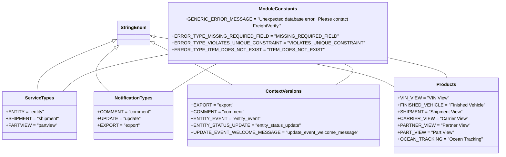

# Diagram: common/subscription_service/subscription_service/common/constants.py

> Auto-generated by Obscura crawlers

## Mermaid

### SVG

<svg id="container" width="1654.796875" xmlns="http://www.w3.org/2000/svg" class="classDiagram" height="522" viewBox="0 0 1654.796875 522" role="graphics-document document" aria-roledescription="class"><g><defs><marker id="container_class-aggregationStart" class="marker aggregation class" refX="18" refY="7" markerWidth="190" markerHeight="240" orient="auto"><path d="M 18,7 L9,13 L1,7 L9,1 Z"></path></marker></defs><defs><marker id="container_class-aggregationEnd" class="marker aggregation class" refX="1" refY="7" markerWidth="20" markerHeight="28" orient="auto"><path d="M 18,7 L9,13 L1,7 L9,1 Z"></path></marker></defs><defs><marker id="container_class-extensionStart" class="marker extension class" refX="18" refY="7" markerWidth="190" markerHeight="240" orient="auto"><path d="M 1,7 L18,13 V 1 Z"></path></marker></defs><defs><marker id="container_class-extensionEnd" class="marker extension class" refX="1" refY="7" markerWidth="20" markerHeight="28" orient="auto"><path d="M 1,1 V 13 L18,7 Z"></path></marker></defs><defs><marker id="container_class-compositionStart" class="marker composition class" refX="18" refY="7" markerWidth="190" markerHeight="240" orient="auto"><path d="M 18,7 L9,13 L1,7 L9,1 Z"></path></marker></defs><defs><marker id="container_class-compositionEnd" class="marker composition class" refX="1" refY="7" markerWidth="20" markerHeight="28" orient="auto"><path d="M 18,7 L9,13 L1,7 L9,1 Z"></path></marker></defs><defs><marker id="container_class-dependencyStart" class="marker dependency class" refX="6" refY="7" markerWidth="190" markerHeight="240" orient="auto"><path d="M 5,7 L9,13 L1,7 L9,1 Z"></path></marker></defs><defs><marker id="container_class-dependencyEnd" class="marker dependency class" refX="13" refY="7" markerWidth="20" markerHeight="28" orient="auto"><path d="M 18,7 L9,13 L14,7 L9,1 Z"></path></marker></defs><defs><marker id="container_class-lollipopStart" class="marker lollipop class" refX="13" refY="7" markerWidth="190" markerHeight="240" orient="auto"><circle stroke="black" fill="transparent" cx="7" cy="7" r="6"></circle></marker></defs><defs><marker id="container_class-lollipopEnd" class="marker lollipop class" refX="1" refY="7" markerWidth="190" markerHeight="240" orient="auto"><circle stroke="black" fill="transparent" cx="7" cy="7" r="6"></circle></marker></defs><g class="root"><g class="clusters"></g><g class="edgePaths"><path d="M379.995,130.017L337.149,145.847C294.303,161.678,208.61,193.339,166.539,221.336C124.468,249.333,126.018,273.667,126.793,285.833L127.568,298" id="id_StringEnum_ServiceTypes_1" class="edge-thickness-normal edge-pattern-solid relation" style=";;;" data-edge="true" data-et="edge" data-id="id_StringEnum_ServiceTypes_1" data-points="W3sieCI6Mzk2LjE3NTc4MTI1LCJ5IjoxMjQuMDM4MjE2NTYwNTA5NTV9LHsieCI6MTIyLjkxNzk2ODc1LCJ5IjoyMjV9LHsieCI6MTI3LjU2NzY1MDI3ODY2MjQzLCJ5IjoyOTh9XQ==" marker-start="url(#container_class-extensionStart)"></path><path d="M383.488,156.668L369.018,168.057C354.547,179.446,325.605,202.223,323.049,225.778C320.493,249.333,344.322,273.667,356.237,285.833L368.151,298" id="id_StringEnum_NotificationTypes_2" class="edge-thickness-normal edge-pattern-solid relation" style=";;;" data-edge="true" data-et="edge" data-id="id_StringEnum_NotificationTypes_2" data-points="W3sieCI6Mzk3LjA0Mzc0MzU0MzM4ODQsInkiOjE0Nn0seyJ4IjoyOTYuNjY0MDYyNSwieSI6MjI1fSx7IngiOjM2OC4xNTEwOTk3MjEzMzc2LCJ5IjoyOTh9XQ==" marker-start="url(#container_class-extensionStart)"></path><path d="M520.13,138.218L549.601,152.681C579.071,167.145,638.012,196.073,680.307,218.703C722.602,241.333,748.251,257.667,761.075,265.833L773.9,274" id="id_StringEnum_ContextVersions_3" class="edge-thickness-normal edge-pattern-solid relation" style=";;;" data-edge="true" data-et="edge" data-id="id_StringEnum_ContextVersions_3" data-points="W3sieCI6NTA0LjY0NDUzMTI1LCJ5IjoxMzAuNjE3NTA3NzIzOTk1ODl9LHsieCI6Njk2Ljk1MzEyNSwieSI6MjI1fSx7IngiOjc3My44OTk2NTY2NDgwODkxLCJ5IjoyNzR9XQ==" marker-start="url(#container_class-extensionStart)"></path><path d="M521.679,115.361L636.308,133.634C750.936,151.907,980.193,188.454,1110.581,216.03C1240.969,243.607,1272.488,262.214,1288.248,271.517L1304.008,280.821" id="id_StringEnum_Products_4" class="edge-thickness-normal edge-pattern-solid relation" style=";;;" data-edge="true" data-et="edge" data-id="id_StringEnum_Products_4" data-points="W3sieCI6NTA0LjY0NDUzMTI1LCJ5IjoxMTIuNjQ1NjE0ODI5NjA1Njl9LHsieCI6MTIwOS40NDkyMTg3NSwieSI6MjI1fSx7IngiOjEzMDQuMDA3ODEyNSwieSI6MjgwLjgyMDczNjE0OTQ2MjQ1fV0=" marker-start="url(#container_class-extensionStart)"></path><path d="M561.934,171.636L514.389,180.53C466.844,189.424,371.754,207.212,313.069,228.273C254.385,249.333,232.106,273.667,220.966,285.833L209.827,298" id="id_ModuleConstants_ServiceTypes_5" class="edge-thickness-normal edge-pattern-solid relation" style=";;;" data-edge="true" data-et="edge" data-id="id_ModuleConstants_ServiceTypes_5" data-points="W3sieCI6NTYxLjkzMzU5Mzc1LCJ5IjoxNzEuNjM1ODkzNjg4NTkwNDR9LHsieCI6Mjc2LjY2NDA2MjUsInkiOjIyNX0seyJ4IjoyMDkuODI2NzA2ODA3MzI0ODUsInkiOjI5OH1d"></path><path d="M727.892,200L719.402,204.167C710.912,208.333,693.933,216.667,667.887,233C641.841,249.333,606.73,273.667,589.174,285.833L571.618,298" id="id_ModuleConstants_NotificationTypes_6" class="edge-thickness-normal edge-pattern-solid relation" style=";;;" data-edge="true" data-et="edge" data-id="id_ModuleConstants_NotificationTypes_6" data-points="W3sieCI6NzI3Ljg5MTc1NDkwNzAyNDcsInkiOjIwMH0seyJ4Ijo2NzYuOTUzMTI1LCJ5IjoyMjV9LHsieCI6NTcxLjYxNzg1OTI3NTQ3NzcsInkiOjI5OH1d"></path><path d="M1134.5,200L1143.658,204.167C1152.817,208.333,1171.133,216.667,1167.497,229C1163.862,241.333,1138.274,257.667,1125.481,265.833L1112.687,274" id="id_ModuleConstants_ContextVersions_7" class="edge-thickness-normal edge-pattern-solid relation" style=";;;" data-edge="true" data-et="edge" data-id="id_ModuleConstants_ContextVersions_7" data-points="W3sieCI6MTEzNC41MDAyMjU5ODE0MDUsInkiOjIwMH0seyJ4IjoxMTg5LjQ0OTIxODc1LCJ5IjoyMjV9LHsieCI6MTExMi42ODY3Nzg0NjMzNzU3LCJ5IjoyNzR9XQ=="></path><path d="M1285.059,183.269L1316.783,190.224C1348.507,197.179,1411.954,211.09,1443.678,222.212C1475.402,233.333,1475.402,241.667,1475.402,245.833L1475.402,250" id="id_ModuleConstants_Products_8" class="edge-thickness-normal edge-pattern-solid relation" style=";;;" data-edge="true" data-et="edge" data-id="id_ModuleConstants_Products_8" data-points="W3sieCI6MTI4NS4wNTg1OTM3NSwieSI6MTgzLjI2OTAxMDgxNDc4OTY1fSx7IngiOjE0NzUuNDAyMzQzNzUsInkiOjIyNX0seyJ4IjoxNDc1LjQwMjM0Mzc1LCJ5IjoyNTB9XQ=="></path></g><g class="edgeLabels"><g class="edgeLabel"><g class="label" data-id="id_StringEnum_ServiceTypes_1" transform="translate(0, 0)"><foreignObject width="0" height="0">

</foreignObject></g></g><g class="edgeLabel"><g class="label" data-id="id_StringEnum_NotificationTypes_2" transform="translate(0, 0)"><foreignObject width="0" height="0">

</foreignObject></g></g><g class="edgeLabel"><g class="label" data-id="id_StringEnum_ContextVersions_3" transform="translate(0, 0)"><foreignObject width="0" height="0">

</foreignObject></g></g><g class="edgeLabel"><g class="label" data-id="id_StringEnum_Products_4" transform="translate(0, 0)"><foreignObject width="0" height="0">

</foreignObject></g></g><g class="edgeLabel"><g class="label" data-id="id_ModuleConstants_ServiceTypes_5" transform="translate(0, 0)"><foreignObject width="0" height="0">

</foreignObject></g></g><g class="edgeLabel"><g class="label" data-id="id_ModuleConstants_NotificationTypes_6" transform="translate(0, 0)"><foreignObject width="0" height="0">

</foreignObject></g></g><g class="edgeLabel"><g class="label" data-id="id_ModuleConstants_ContextVersions_7" transform="translate(0, 0)"><foreignObject width="0" height="0">

</foreignObject></g></g><g class="edgeLabel"><g class="label" data-id="id_ModuleConstants_Products_8" transform="translate(0, 0)"><foreignObject width="0" height="0">

</foreignObject></g></g></g><g class="nodes"><g class="node default" id="classId-StringEnum-0" transform="translate(450.41015625, 104)"><g class="basic label-container"><path d="M-54.234375 -42 L54.234375 -42 L54.234375 42 L-54.234375 42" stroke="none" stroke-width="0" fill="#ECECFF" style=""></path><path d="M-54.234375 -42 C-14.809016516330104 -42, 24.616341967339793 -42, 54.234375 -42 M-54.234375 -42 C-15.171288990126122 -42, 23.891797019747756 -42, 54.234375 -42 M54.234375 -42 C54.234375 -8.66007468648295, 54.234375 24.6798506270341, 54.234375 42 M54.234375 -42 C54.234375 -12.473966054840016, 54.234375 17.052067890319968, 54.234375 42 M54.234375 42 C25.713577815811096 42, -2.807219368377808 42, -54.234375 42 M54.234375 42 C23.17408170873526 42, -7.8862115825294765 42, -54.234375 42 M-54.234375 42 C-54.234375 9.522898674890016, -54.234375 -22.95420265021997, -54.234375 -42 M-54.234375 42 C-54.234375 10.849446217041589, -54.234375 -20.301107565916823, -54.234375 -42" stroke="#9370DB" stroke-width="1.3" fill="none" stroke-dasharray="0 0" style=""></path></g><g class="annotation-group text" transform="translate(0, -18)"></g><g class="label-group text" transform="translate(-42.234375, -18)"><g class="label" style="font-weight: bolder" transform="translate(0,-12)"><foreignObject width="84.46875" height="24">

StringEnum

</foreignObject></g></g><g class="members-group text" transform="translate(-42.234375, 30)"></g><g class="methods-group text" transform="translate(-42.234375, 60)"></g><g class="divider" style=""><path d="M-54.234375 6 C-31.15918164135431 6, -8.083988282708617 6, 54.234375 6 M-54.234375 6 C-17.645264112499426 6, 18.94384677500115 6, 54.234375 6" stroke="#9370DB" stroke-width="1.3" fill="none" stroke-dasharray="0 0" style=""></path></g><g class="divider" style=""><path d="M-54.234375 24 C-14.990026890470382 24, 24.254321219059236 24, 54.234375 24 M-54.234375 24 C-11.713257372517056 24, 30.807860254965888 24, 54.234375 24" stroke="#9370DB" stroke-width="1.3" fill="none" stroke-dasharray="0 0" style=""></path></g></g><g class="node default" id="classId-ModuleConstants-1" transform="translate(923.49609375, 104)"><g class="basic label-container"><path d="M-361.5625 -96 L361.5625 -96 L361.5625 96 L-361.5625 96" stroke="none" stroke-width="0" fill="#ECECFF" style=""></path><path d="M-361.5625 -96 C-148.92795027258353 -96, 63.70659945483294 -96, 361.5625 -96 M-361.5625 -96 C-189.2250964404898 -96, -16.887692880979614 -96, 361.5625 -96 M361.5625 -96 C361.5625 -54.69784109121315, 361.5625 -13.395682182426299, 361.5625 96 M361.5625 -96 C361.5625 -40.18736652301562, 361.5625 15.625266953968762, 361.5625 96 M361.5625 96 C94.98111384811943 96, -171.60027230376113 96, -361.5625 96 M361.5625 96 C189.0920974839456 96, 16.621694967891187 96, -361.5625 96 M-361.5625 96 C-361.5625 46.83752036383735, -361.5625 -2.3249592723253016, -361.5625 -96 M-361.5625 96 C-361.5625 40.78709586556306, -361.5625 -14.42580826887388, -361.5625 -96" stroke="#9370DB" stroke-width="1.3" fill="none" stroke-dasharray="0 0" style=""></path></g><g class="annotation-group text" transform="translate(0, -72)"></g><g class="label-group text" transform="translate(-63.625, -72)"><g class="label" style="font-weight: bolder" transform="translate(0,-12)"><foreignObject width="127.25" height="24">

ModuleConstants

</foreignObject></g></g><g class="members-group text" transform="translate(-349.5625, -24)"><g class="label" style="" transform="translate(0,-12)"><foreignObject width="635.5" height="24">

+GENERIC_ERROR_MESSAGE = "Unexpected database error.  Please contact FreightVerify."

</foreignObject></g><g class="label" style="" transform="translate(0,12)"><foreignObject width="513.59375" height="24">

+ERROR_TYPE_MISSING_REQUIRED_FIELD = "MISSING_REQUIRED_FIELD"

</foreignObject></g><g class="label" style="" transform="translate(0,36)"><foreignObject width="591.96875" height="24">

+ERROR_TYPE_VIOLATES_UNIQUE_CONSTRAINT = "VIOLATES_UNIQUE_CONSTRAINT"

</foreignObject></g><g class="label" style="" transform="translate(0,60)"><foreignObject width="465.59375" height="24">

+ERROR_TYPE_ITEM_DOES_NOT_EXIST = "ITEM_DOES_NOT_EXIST"

</foreignObject></g></g><g class="methods-group text" transform="translate(-349.5625, 96)"></g><g class="divider" style=""><path d="M-361.5625 -48 C-72.49178796610653 -48, 216.57892406778694 -48, 361.5625 -48 M-361.5625 -48 C-195.60210341680988 -48, -29.641706833619764 -48, 361.5625 -48" stroke="#9370DB" stroke-width="1.3" fill="none" stroke-dasharray="0 0" style=""></path></g><g class="divider" style=""><path d="M-361.5625 72 C-84.66731055210653 72, 192.22787889578694 72, 361.5625 72 M-361.5625 72 C-116.58832174666517 72, 128.38585650666965 72, 361.5625 72" stroke="#9370DB" stroke-width="1.3" fill="none" stroke-dasharray="0 0" style=""></path></g></g><g class="node default" id="classId-ServiceTypes-2" transform="translate(132.91796875, 382)"><g class="basic label-container"><path d="M-124.91796875 -84 L124.91796875 -84 L124.91796875 84 L-124.91796875 84" stroke="none" stroke-width="0" fill="#ECECFF" style=""></path><path d="M-124.91796875 -84 C-64.38282332637715 -84, -3.847677902754299 -84, 124.91796875 -84 M-124.91796875 -84 C-30.796815123642517 -84, 63.324338502714966 -84, 124.91796875 -84 M124.91796875 -84 C124.91796875 -47.14969940151805, 124.91796875 -10.299398803036098, 124.91796875 84 M124.91796875 -84 C124.91796875 -38.9684940970233, 124.91796875 6.063011805953394, 124.91796875 84 M124.91796875 84 C43.990624984064524 84, -36.93671878187095 84, -124.91796875 84 M124.91796875 84 C51.79657510502058 84, -21.32481853995884 84, -124.91796875 84 M-124.91796875 84 C-124.91796875 19.359521783587738, -124.91796875 -45.280956432824524, -124.91796875 -84 M-124.91796875 84 C-124.91796875 21.48096968267241, -124.91796875 -41.03806063465518, -124.91796875 -84" stroke="#9370DB" stroke-width="1.3" fill="none" stroke-dasharray="0 0" style=""></path></g><g class="annotation-group text" transform="translate(0, -60)"></g><g class="label-group text" transform="translate(-47.8515625, -60)"><g class="label" style="font-weight: bolder" transform="translate(0,-12)"><foreignObject width="95.703125" height="24">

ServiceTypes

</foreignObject></g></g><g class="members-group text" transform="translate(-112.91796875, -12)"><g class="label" style="" transform="translate(0,-12)"><foreignObject width="128.578125" height="24">

+ENTITY = "entity"

</foreignObject></g><g class="label" style="" transform="translate(0,12)"><foreignObject width="177.984375" height="24">

+SHIPMENT = "shipment"

</foreignObject></g><g class="label" style="" transform="translate(0,36)"><foreignObject width="170.265625" height="24">

+PARTVIEW = "partview"

</foreignObject></g></g><g class="methods-group text" transform="translate(-112.91796875, 84)"></g><g class="divider" style=""><path d="M-124.91796875 -36 C-44.91131689186288 -36, 35.09533496627424 -36, 124.91796875 -36 M-124.91796875 -36 C-29.099608604477424 -36, 66.71875154104515 -36, 124.91796875 -36" stroke="#9370DB" stroke-width="1.3" fill="none" stroke-dasharray="0 0" style=""></path></g><g class="divider" style=""><path d="M-124.91796875 60 C-74.54455443971119 60, -24.171140129422398 60, 124.91796875 60 M-124.91796875 60 C-25.406372324160756 60, 74.10522410167849 60, 124.91796875 60" stroke="#9370DB" stroke-width="1.3" fill="none" stroke-dasharray="0 0" style=""></path></g></g><g class="node default" id="classId-NotificationTypes-3" transform="translate(450.41015625, 382)"><g class="basic label-container"><path d="M-132.57421875 -84 L132.57421875 -84 L132.57421875 84 L-132.57421875 84" stroke="none" stroke-width="0" fill="#ECECFF" style=""></path><path d="M-132.57421875 -84 C-44.66381402152774 -84, 43.24659070694452 -84, 132.57421875 -84 M-132.57421875 -84 C-62.099317338886294 -84, 8.375584072227412 -84, 132.57421875 -84 M132.57421875 -84 C132.57421875 -49.638686096342305, 132.57421875 -15.27737219268461, 132.57421875 84 M132.57421875 -84 C132.57421875 -28.975400089159578, 132.57421875 26.049199821680844, 132.57421875 84 M132.57421875 84 C58.32164575673444 84, -15.930927236531119 84, -132.57421875 84 M132.57421875 84 C49.98557545149123 84, -32.60306784701754 84, -132.57421875 84 M-132.57421875 84 C-132.57421875 27.261387532636903, -132.57421875 -29.477224934726195, -132.57421875 -84 M-132.57421875 84 C-132.57421875 37.086600812455444, -132.57421875 -9.826798375089112, -132.57421875 -84" stroke="#9370DB" stroke-width="1.3" fill="none" stroke-dasharray="0 0" style=""></path></g><g class="annotation-group text" transform="translate(0, -60)"></g><g class="label-group text" transform="translate(-64.0859375, -60)"><g class="label" style="font-weight: bolder" transform="translate(0,-12)"><foreignObject width="128.171875" height="24">

NotificationTypes

</foreignObject></g></g><g class="members-group text" transform="translate(-120.57421875, -12)"><g class="label" style="" transform="translate(0,-12)"><foreignObject width="177.0625" height="24">

+COMMENT = "comment"

</foreignObject></g><g class="label" style="" transform="translate(0,12)"><foreignObject width="143.65625" height="24">

+UPDATE = "update"

</foreignObject></g><g class="label" style="" transform="translate(0,36)"><foreignObject width="139.171875" height="24">

+EXPORT = "export"

</foreignObject></g></g><g class="methods-group text" transform="translate(-120.57421875, 84)"></g><g class="divider" style=""><path d="M-132.57421875 -36 C-64.15556855971698 -36, 4.263081630566035 -36, 132.57421875 -36 M-132.57421875 -36 C-62.45068336682263 -36, 7.672852016354739 -36, 132.57421875 -36" stroke="#9370DB" stroke-width="1.3" fill="none" stroke-dasharray="0 0" style=""></path></g><g class="divider" style=""><path d="M-132.57421875 60 C-62.70014420381584 60, 7.1739303423683225 60, 132.57421875 60 M-132.57421875 60 C-36.43183740357732 60, 59.71054394284536 60, 132.57421875 60" stroke="#9370DB" stroke-width="1.3" fill="none" stroke-dasharray="0 0" style=""></path></g></g><g class="node default" id="classId-ContextVersions-4" transform="translate(943.49609375, 382)"><g class="basic label-container"><path d="M-310.51171875 -108 L310.51171875 -108 L310.51171875 108 L-310.51171875 108" stroke="none" stroke-width="0" fill="#ECECFF" style=""></path><path d="M-310.51171875 -108 C-98.62306307331184 -108, 113.26559260337632 -108, 310.51171875 -108 M-310.51171875 -108 C-111.7640197403089 -108, 86.98367926938221 -108, 310.51171875 -108 M310.51171875 -108 C310.51171875 -21.90533961954462, 310.51171875 64.18932076091076, 310.51171875 108 M310.51171875 -108 C310.51171875 -57.087003665618745, 310.51171875 -6.17400733123749, 310.51171875 108 M310.51171875 108 C103.649490657678 108, -103.212737434644 108, -310.51171875 108 M310.51171875 108 C166.38963630758428 108, 22.267553865168566 108, -310.51171875 108 M-310.51171875 108 C-310.51171875 30.82963625635223, -310.51171875 -46.34072748729554, -310.51171875 -108 M-310.51171875 108 C-310.51171875 59.76644591628615, -310.51171875 11.532891832572304, -310.51171875 -108" stroke="#9370DB" stroke-width="1.3" fill="none" stroke-dasharray="0 0" style=""></path></g><g class="annotation-group text" transform="translate(0, -84)"></g><g class="label-group text" transform="translate(-59.3359375, -84)"><g class="label" style="font-weight: bolder" transform="translate(0,-12)"><foreignObject width="118.671875" height="24">

ContextVersions

</foreignObject></g></g><g class="members-group text" transform="translate(-298.51171875, -36)"><g class="label" style="" transform="translate(0,-12)"><foreignObject width="139.171875" height="24">

+EXPORT = "export"

</foreignObject></g><g class="label" style="" transform="translate(0,12)"><foreignObject width="177.0625" height="24">

+COMMENT = "comment"

</foreignObject></g><g class="label" style="" transform="translate(0,36)"><foreignObject width="228.453125" height="24">

+ENTITY_EVENT = "entity_event"

</foreignObject></g><g class="label" style="" transform="translate(0,60)"><foreignObject width="360.6875" height="24">

+ENTITY_STATUS_UPDATE = "entity_status_update"

</foreignObject></g><g class="label" style="" transform="translate(0,84)"><foreignObject width="537.6875" height="24">

+UPDATE_EVENT_WELCOME_MESSAGE = "update_event_welcome_message"

</foreignObject></g></g><g class="methods-group text" transform="translate(-298.51171875, 108)"></g><g class="divider" style=""><path d="M-310.51171875 -60 C-65.55908958892798 -60, 179.39353957214405 -60, 310.51171875 -60 M-310.51171875 -60 C-113.94901929411256 -60, 82.61368016177488 -60, 310.51171875 -60" stroke="#9370DB" stroke-width="1.3" fill="none" stroke-dasharray="0 0" style=""></path></g><g class="divider" style=""><path d="M-310.51171875 84 C-71.08623771262026 84, 168.33924332475948 84, 310.51171875 84 M-310.51171875 84 C-73.68826102803851 84, 163.13519669392298 84, 310.51171875 84" stroke="#9370DB" stroke-width="1.3" fill="none" stroke-dasharray="0 0" style=""></path></g></g><g class="node default" id="classId-Products-5" transform="translate(1475.40234375, 382)"><g class="basic label-container"><path d="M-171.39453125 -132 L171.39453125 -132 L171.39453125 132 L-171.39453125 132" stroke="none" stroke-width="0" fill="#ECECFF" style=""></path><path d="M-171.39453125 -132 C-54.89279172004596 -132, 61.608947809908074 -132, 171.39453125 -132 M-171.39453125 -132 C-58.02689519345607 -132, 55.34074086308786 -132, 171.39453125 -132 M171.39453125 -132 C171.39453125 -42.40665561192152, 171.39453125 47.186688776156956, 171.39453125 132 M171.39453125 -132 C171.39453125 -57.328078678397816, 171.39453125 17.34384264320437, 171.39453125 132 M171.39453125 132 C63.918801367315524 132, -43.55692851536895 132, -171.39453125 132 M171.39453125 132 C90.57311267326777 132, 9.751694096535545 132, -171.39453125 132 M-171.39453125 132 C-171.39453125 67.39369190223465, -171.39453125 2.7873838044693002, -171.39453125 -132 M-171.39453125 132 C-171.39453125 37.16357049869134, -171.39453125 -57.672859002617315, -171.39453125 -132" stroke="#9370DB" stroke-width="1.3" fill="none" stroke-dasharray="0 0" style=""></path></g><g class="annotation-group text" transform="translate(0, -108)"></g><g class="label-group text" transform="translate(-32.4453125, -108)"><g class="label" style="font-weight: bolder" transform="translate(0,-12)"><foreignObject width="64.890625" height="24">

Products

</foreignObject></g></g><g class="members-group text" transform="translate(-159.39453125, -60)"><g class="label" style="" transform="translate(0,-12)"><foreignObject width="166.84375" height="24">

+VIN_VIEW = "VIN View"

</foreignObject></g><g class="label" style="" transform="translate(0,12)"><foreignObject width="286.34375" height="24">

+FINISHED_VEHICLE = "Finished Vehicle"

</foreignObject></g><g class="label" style="" transform="translate(0,36)"><foreignObject width="217.484375" height="24">

+SHIPMENT = "Shipment View"

</foreignObject></g><g class="label" style="" transform="translate(0,60)"><foreignObject width="227.703125" height="24">

+CARRIER_VIEW = "Carrier View"

</foreignObject></g><g class="label" style="" transform="translate(0,84)"><foreignObject width="235.640625" height="24">

+PARTNER_VIEW = "Partner View"

</foreignObject></g><g class="label" style="" transform="translate(0,108)"><foreignObject width="181.40625" height="24">

+PART_VIEW = "Part View"

</foreignObject></g><g class="label" style="" transform="translate(0,132)"><foreignObject width="273.96875" height="24">

+OCEAN_TRACKING = "Ocean Tracking"

</foreignObject></g></g><g class="methods-group text" transform="translate(-159.39453125, 132)"></g><g class="divider" style=""><path d="M-171.39453125 -84 C-84.94438354341986 -84, 1.5057641631602792 -84, 171.39453125 -84 M-171.39453125 -84 C-52.95925403250894 -84, 65.47602318498213 -84, 171.39453125 -84" stroke="#9370DB" stroke-width="1.3" fill="none" stroke-dasharray="0 0" style=""></path></g><g class="divider" style=""><path d="M-171.39453125 108 C-85.99732906919637 108, -0.6001268883927366 108, 171.39453125 108 M-171.39453125 108 C-41.6044191560554 108, 88.1856929378892 108, 171.39453125 108" stroke="#9370DB" stroke-width="1.3" fill="none" stroke-dasharray="0 0" style=""></path></g></g></g></g></g></svg>
